# 1. Overview / 概述

**English:**
This sub-topic explores the microscopic origin of internal energy ($U$) in a system. Internal energy is defined as the sum of the random kinetic energies of the molecules and the intermolecular potential energies. For an [[Ideal Gases|ideal gas]], the potential energy component is zero, so internal energy depends only on temperature. For real substances (solids, liquids, real gases), both kinetic and potential energy contributions matter, especially during phase changes. Understanding this distinction is essential for applying [[The First Law of Thermodynamics]] correctly.

**中文:**
本子知识点探讨系统内能 ($U$) 的微观起源。内能定义为分子随机动能与分子间势能之和。对于[[Ideal Gases|理想气体]]，势能分量为零，因此内能仅取决于温度。对于真实物质（固体、液体、真实气体），动能和势能贡献都很重要，尤其是在相变过程中。理解这一区别对于正确应用[[The First Law of Thermodynamics|热力学第一定律]]至关重要。

---

# 2. Syllabus Learning Objectives / 考纲学习目标

| CAIE 9702 | Edexcel IAL |
|-----------|-------------|
| 10.4(a) Define internal energy as the sum of random distribution of kinetic and potential energies of molecules | 5.13 Understand the concept of internal energy as the sum of the random kinetic energies and potential energies of the molecules |
| 10.4(b) Relate a rise in temperature of a body to an increase in internal energy (kinetic energy of molecules) | 5.14 Understand that internal energy is determined by the state of the system |
| 10.4(c) Relate a change of state to a change in internal energy (potential energy of molecules) without a change in temperature | 5.15 Understand that for an ideal gas, internal energy is proportional to its temperature |
| 10.4(d) Understand that for an ideal gas, internal energy is proportional to its temperature | 5.16 Understand that a change in internal energy is due to a change in temperature and/or a change of state |

**Examiner Expectations / 考官期望:**
- **English:** You must be able to explain internal energy in terms of molecular kinetic and potential energies. Distinguish clearly between temperature increase (KE increase) and phase change (PE increase). For ideal gases, state that $U \propto T$ and explain why PE is zero.
- **中文:** 必须能用分子动能和势能解释内能。清楚区分温度升高（动能增加）和相变（势能增加）。对于理想气体，说明 $U \propto T$ 并解释为什么势能为零。

---

# 3. Core Definitions / 核心定义

| Term (EN/CN) | Definition (EN) | Definition (CN) | Common Mistakes / 常见错误 |
|--------------|-----------------|-----------------|---------------------------|
| **Internal Energy** / 内能 | The sum of the random distribution of kinetic and potential energies of the molecules in a system | 系统内分子随机动能和势能的总和 | ❌ Confusing with heat or temperature. Internal energy is a **state function** — it depends only on the current state, not the path taken. |
| **Kinetic Energy of Molecules** / 分子动能 | The energy due to the random translational, rotational, and vibrational motion of molecules | 分子随机平动、转动和振动所具有的能量 | ❌ Thinking all molecules have the same KE. They have a [[Kinetic Theory of Gases|distribution of speeds]] (Maxwell-Boltzmann). |
| **Intermolecular Potential Energy** / 分子间势能 | The energy stored due to the forces between molecules (attractive/repulsive) | 由于分子间作用力（引力/斥力）而储存的能量 | ❌ Forgetting that PE is **negative** when molecules are close (attractive forces dominate). |
| **Ideal Gas** / 理想气体 | A gas where intermolecular forces are negligible and molecules occupy negligible volume | 分子间作用力可忽略、分子体积可忽略的气体 | ❌ Assuming real gases behave ideally at all conditions. |
| **State Function** / 状态函数 | A property whose value depends only on the current state of the system, not on how it got there | 其值仅取决于系统当前状态、与路径无关的性质 | ❌ Confusing with path-dependent quantities like work and heat. |
| **Absolute Zero** / 绝对零度 | The temperature at which all molecular motion ceases (0 K or -273.15°C) | 所有分子运动停止时的温度 | ❌ Thinking molecules stop moving entirely — quantum effects mean zero-point energy remains. |

---

# 4. Key Concepts Explained / 关键概念详解

## 4.1 Internal Energy as KE + PE / 内能 = 动能 + 势能

### Explanation / 解释
**English:**
Internal energy $U$ is the total energy stored within a system due to the random motion and interactions of its molecules. It has two components:

$$ U = \text{Total KE of molecules} + \text{Total PE of molecules} $$

- **Kinetic Energy (KE):** Arises from random translational, rotational, and vibrational motion. This is directly related to temperature — higher temperature means higher average KE.
- **Potential Energy (PE):** Arises from intermolecular forces. When molecules are far apart (gas), PE is small. When molecules are close (liquid/solid), PE is significant and negative (attractive forces dominate).

For an [[Ideal Gases|ideal gas]], intermolecular forces are zero, so PE = 0. Thus:

$$ U_{\text{ideal gas}} = \text{Total KE} \propto T $$

**中文:**
内能 $U$ 是系统内由于分子随机运动和相互作用而储存的总能量。它有两个组成部分：

$$ U = \text{分子总动能} + \text{分子总势能} $$

- **动能 (KE):** 来自随机平动、转动和振动。与温度直接相关——温度越高，平均动能越大。
- **势能 (PE):** 来自分子间作用力。分子相距较远（气体）时，PE 很小；分子靠近（液体/固体）时，PE 显著且为负值（引力占主导）。

对于[[Ideal Gases|理想气体]]，分子间作用力为零，因此 PE = 0。所以：

$$ U_{\text{理想气体}} = \text{总动能} \propto T $$

### Physical Meaning / 物理意义
**English:**
Internal energy represents the "microscopic energy" of a system — the energy hidden in the random motion and interactions of particles. It is a **state function**: its value depends only on the current state (temperature, pressure, volume, phase), not on how the system reached that state. This is why we write $\Delta U = U_f - U_i$ for any process.

**中文:**
内能代表系统的"微观能量"——隐藏在粒子随机运动和相互作用中的能量。它是一个**状态函数**：其值仅取决于当前状态（温度、压力、体积、相态），与系统如何达到该状态无关。这就是为什么任何过程我们都写 $\Delta U = U_f - U_i$。

### Common Misconceptions / 常见误区
- ❌ **"Internal energy is the same as heat."** — No! Heat is energy **transferred** due to temperature difference. Internal energy is energy **stored**.
- ❌ **"Internal energy is the same as temperature."** — No! Temperature is proportional to average KE per molecule. Internal energy includes both KE and PE.
- ❌ **"For an ideal gas, internal energy depends on pressure."** — No! For an ideal gas, $U \propto T$ only. Pressure changes at constant temperature do not change $U$.
- ❌ **"During melting, internal energy doesn't change because temperature is constant."** — No! KE stays constant, but PE increases as molecules separate against attractive forces.

### Exam Tips / 考试提示
- **English:** When asked "Explain why internal energy increases during melting at constant temperature," always mention: "KE unchanged (constant T), but PE increases as molecules move apart against attractive forces."
- **中文:** 当被问"解释为什么在恒温熔化过程中内能增加"时，务必提到："动能不变（温度恒定），但势能增加，因为分子克服引力而分离。"

> 📷 **IMAGE PROMPT — U01: Internal Energy Components Diagram**
> A split diagram showing two components of internal energy. Left side: molecules in a solid vibrating (KE) with arrows showing motion. Right side: molecules in a liquid with arrows showing intermolecular attractive forces (PE). A bar chart below shows KE (constant) and PE (increasing) during melting. Labels in English and Chinese.

---

## 4.2 Temperature Change vs. Phase Change / 温度变化 vs. 相变

### Explanation / 解释
**English:**
- **Temperature increase:** Average KE of molecules increases. PE remains approximately constant (molecular spacing doesn't change much). So $\Delta U \approx \Delta KE \propto \Delta T$.
- **Phase change (melting/boiling):** Temperature is constant, so average KE is constant. But molecules move further apart (solid → liquid → gas), increasing PE. So $\Delta U = \Delta PE$ only.

This explains why [[Specific Heat Capacity and Latent Heat|specific latent heat]] is needed during phase changes — the energy goes into increasing PE, not KE.

**中文:**
- **温度升高：** 分子平均动能增加。势能大致保持不变（分子间距变化不大）。所以 $\Delta U \approx \Delta KE \propto \Delta T$。
- **相变（熔化/沸腾）：** 温度恒定，所以平均动能恒定。但分子间距增大（固体→液体→气体），势能增加。所以 $\Delta U = \Delta PE$ 仅此而已。

这就解释了为什么相变过程中需要[[Specific Heat Capacity and Latent Heat|比潜热]]——能量用于增加势能，而非动能。

### Common Misconceptions / 常见误区
- ❌ **"During boiling, water molecules gain KE to escape."** — No! They need to overcome attractive forces (increase PE). The KE needed to escape comes from the distribution — only the fastest molecules escape.
- ❌ **"Internal energy is constant during phase change."** — No! It increases (melting/boiling) or decreases (freezing/condensing) because PE changes.

### Exam Tips / 考试提示
- **English:** Use the phrase "KE unchanged, PE increases" for melting/boiling. For freezing/condensing: "KE unchanged, PE decreases."
- **中文:** 熔化/沸腾时用"动能不变，势能增加"。凝固/凝结时用"动能不变，势能减少"。

---

## 4.3 Internal Energy of an Ideal Gas / 理想气体的内能

### Explanation / 解释
**English:**
For an [[Ideal Gases|ideal gas]]:
- Intermolecular forces are zero → PE = 0
- Molecules are point particles with only translational KE
- From [[Kinetic Theory of Gases|kinetic theory]]: $\text{Average KE} = \frac{3}{2}kT$ per molecule

So for $N$ molecules:
$$ U = N \times \frac{3}{2}kT = \frac{3}{2}NkT = \frac{3}{2}nRT $$

Where $n$ is number of moles, $R$ is the gas constant, $T$ is absolute temperature.

**Key result:** $U \propto T$ for an ideal gas. Internal energy depends **only** on temperature.

**中文:**
对于[[Ideal Gases|理想气体]]：
- 分子间作用力为零 → PE = 0
- 分子是只有平动动能的质点
- 根据[[Kinetic Theory of Gases|气体动理论]]：每个分子平均动能 $= \frac{3}{2}kT$

所以对于 $N$ 个分子：
$$ U = N \times \frac{3}{2}kT = \frac{3}{2}NkT = \frac{3}{2}nRT $$

其中 $n$ 是摩尔数，$R$ 是气体常数，$T$ 是绝对温度。

**关键结论：** 对于理想气体，$U \propto T$。内能**仅**取决于温度。

### Common Misconceptions / 常见误区
- ❌ **"For an ideal gas, U depends on pressure."** — No! $U = \frac{3}{2}nRT$ — no $P$ term. Isothermal compression ($\Delta T = 0$) means $\Delta U = 0$.
- ❌ **"For an ideal gas, U depends on volume."** — No! Only on $T$. This is why [[Isothermal, Adiabatic, Isobaric, and Isochoric Processes|isothermal expansion]] has $\Delta U = 0$.

### Exam Tips / 考试提示
- **English:** If a question says "ideal gas" and gives $T$, immediately write $U \propto T$ or $U = \frac{3}{2}nRT$. If $T$ is constant, $\Delta U = 0$.
- **中文:** 如果题目说"理想气体"并给出 $T$，立即写出 $U \propto T$ 或 $U = \frac{3}{2}nRT$。如果 $T$ 恒定，则 $\Delta U = 0$。

> 📷 **IMAGE PROMPT — U02: Ideal Gas Internal Energy vs Temperature**
> A graph with temperature (K) on x-axis and internal energy (J) on y-axis. A straight line through origin labeled "U ∝ T for ideal gas". A second curved line above it labeled "Real gas (includes PE)". Labels in English and Chinese.

---

# 5. Essential Equations / 核心公式

## Equation 1: Internal Energy Definition / 内能定义

$$ U = \text{KE}_{\text{total}} + \text{PE}_{\text{total}} $$

| Symbol (符号) | Meaning (EN) | Meaning (CN) | Unit (单位) |
|--------------|-------------|-------------|------------|
| $U$ | Internal energy | 内能 | J (joules) |
| $\text{KE}_{\text{total}}$ | Sum of random kinetic energies of all molecules | 所有分子随机动能之和 | J |
| $\text{PE}_{\text{total}}$ | Sum of intermolecular potential energies | 所有分子间势能之和 | J |

**Conditions / 适用条件:** General definition — applies to all systems (solids, liquids, gases).
**Limitations / 局限性:** Cannot be measured absolutely — only changes $\Delta U$ are measurable.

---

## Equation 2: Internal Energy of an Ideal Gas / 理想气体内能

$$ U = \frac{3}{2}nRT $$

| Symbol (符号) | Meaning (EN) | Meaning (CN) | Unit (单位) |
|--------------|-------------|-------------|------------|
| $U$ | Internal energy | 内能 | J |
| $n$ | Number of moles | 摩尔数 | mol |
| $R$ | Molar gas constant (8.31 J mol⁻¹ K⁻¹) | 摩尔气体常数 | J mol⁻¹ K⁻¹ |
| $T$ | Absolute temperature | 绝对温度 | K |

**Derivation / 推导:**
From kinetic theory: $\frac{1}{2}m\langle c^2 \rangle = \frac{3}{2}kT$ per molecule.
For $N$ molecules: $U = N \times \frac{3}{2}kT = \frac{3}{2}NkT$.
Since $N = nN_A$ and $R = N_A k$: $U = \frac{3}{2}nRT$.

**Conditions / 适用条件:** Monatomic ideal gas only. For diatomic gases, $U = \frac{5}{2}nRT$ (includes rotational KE).
**Limitations / 局限性:** Does not apply to real gases, liquids, or solids.

---

## Equation 3: Change in Internal Energy / 内能变化

$$ \Delta U = U_f - U_i $$

| Symbol (符号) | Meaning (EN) | Meaning (CN) | Unit (单位) |
|--------------|-------------|-------------|------------|
| $\Delta U$ | Change in internal energy | 内能变化 | J |
| $U_f$ | Final internal energy | 最终内能 | J |
| $U_i$ | Initial internal energy | 初始内能 | J |

**Conditions / 适用条件:** Any process. $U$ is a state function, so $\Delta U$ depends only on initial and final states.
**Limitations / 局限性:** None — this is always true.

---

# 6. Graphs and Relationships / 图表与关系

## 6.1 Internal Energy vs. Temperature for Different Substances / 不同物质的内能-温度关系

### Axes / 坐标轴
- **x-axis:** Temperature / 温度 (K)
- **y-axis:** Internal Energy / 内能 (J)

### Shape / 形状
- **Ideal gas:** Straight line through origin ($U \propto T$)
- **Real substance:** Stepped curve — linear segments during heating (KE increases), vertical jumps during phase changes (PE increases at constant T)

### Gradient Meaning / 斜率含义
- Gradient = $\frac{\Delta U}{\Delta T}$ = heat capacity at constant volume ($C_V$) for the substance

### Area Meaning / 面积含义
- Area under $U$ vs. $T$ graph has no direct physical meaning

### Exam Interpretation / 考试解读
- **English:** Be able to sketch this graph and label the regions: heating (KE increase) and phase change (PE increase). Explain why $U$ increases during melting even though $T$ is constant.
- **中文:** 能够画出此图并标注区域：加热（动能增加）和相变（势能增加）。解释为什么熔化过程中 $U$ 增加而 $T$ 不变。

> 📷 **IMAGE PROMPT — U03: Internal Energy vs Temperature Graph**
> A graph with Temperature (K) on x-axis and Internal Energy (J) on y-axis. Shows a stepped curve: upward sloping segments labeled "KE increases" and flat vertical segments labeled "PE increases (phase change)". A straight dashed line through origin labeled "Ideal gas (U ∝ T)". Labels in English and Chinese.

---

# 7. Required Diagrams / 必备图表

## 7.1 Molecular Model of Internal Energy / 内能的分子模型

### Description / 描述
**English:** A diagram showing molecules in three states of matter (solid, liquid, gas) with arrows indicating kinetic energy (random motion) and potential energy (intermolecular forces). For each state, a bar chart shows the relative contributions of KE and PE to total internal energy.

**中文:** 显示三种物态（固体、液体、气体）中分子的示意图，箭头表示动能（随机运动）和势能（分子间作用力）。对于每种状态，条形图显示动能和势能对内能总量的相对贡献。

### Image Prompt / 图片生成提示
> 📷 **IMAGE PROMPT — U04: Molecular Model of Internal Energy**
> Three panels showing molecular arrangements in solid (closely packed, vibrating), liquid (close but flowing), and gas (far apart, fast moving). Each panel has a bar chart: Solid — KE medium, PE very negative (large magnitude); Liquid — KE medium, PE less negative; Gas — KE high, PE near zero. Arrows labeled "KE (random motion)" and "PE (intermolecular forces)". Labels in English and Chinese.

### Labels Required / 需要标注
- Solid / 固体: KE (vibrational), PE (strong attractive forces, negative)
- Liquid / 液体: KE (translational + vibrational), PE (weaker attractive forces)
- Gas / 气体: KE (high translational), PE (negligible, ≈ 0)
- Total U = KE + PE / 总内能 = 动能 + 势能

### Exam Importance / 考试重要性
- **English:** Essential for explaining why internal energy changes during phase changes. Frequently tested in Paper 2 (CAIE) and Section B (Edexcel).
- **中文:** 对于解释相变过程中内能变化至关重要。在CAIE Paper 2和Edexcel Section B中经常考查。

---

## 7.2 Internal Energy Changes During Heating / 加热过程中的内能变化

### Description / 描述
**English:** A temperature-time graph for heating ice from below 0°C to steam above 100°C, with annotations showing where KE increases (sloped regions) and where PE increases (flat regions — phase changes).

**中文:** 从0°C以下冰加热到100°C以上水蒸气的温度-时间图，标注显示动能增加的区域（斜线部分）和势能增加的区域（水平部分——相变）。

### Image Prompt / 图片生成提示
> 📷 **IMAGE PROMPT — U05: Heating Curve with Internal Energy Annotations**
> Temperature (°C) vs Time (s) graph showing: ice heating (slope up), ice melting at 0°C (flat), water heating (slope up), water boiling at 100°C (flat), steam heating (slope up). Annotations: "KE ↑" on slopes, "PE ↑ (KE constant)" on flats. A second graph below shows Internal Energy vs Time — always increasing. Labels in English and Chinese.

### Labels Required / 需要标注
- Sloped regions / 斜线区域: "KE increases, PE approximately constant"
- Flat regions / 水平区域: "PE increases, KE constant (phase change)"
- Total U always increases / 总内能始终增加

### Exam Importance / 考试重要性
- **English:** Classic exam question: "Explain why internal energy increases during melting even though temperature is constant." This diagram is the answer.
- **中文:** 经典考题："解释为什么熔化过程中内能增加而温度不变。"此图即为答案。

---

# 8. Worked Examples / 典型例题

## Example 1: Internal Energy Change During Melting / 熔化过程中的内能变化

### Question / 题目
**English:**
A 0.50 kg block of ice at 0°C is melted to water at 0°C. The specific latent heat of fusion of ice is $3.34 \times 10^5 \text{ J kg}^{-1}$.

(a) Calculate the increase in internal energy of the water.
(b) Explain why the internal energy increases even though the temperature does not change.

**中文:**
一块0.50 kg、0°C的冰融化为0°C的水。冰的熔化比潜热为 $3.34 \times 10^5 \text{ J kg}^{-1}$。

(a) 计算水的内能增加量。
(b) 解释为什么温度不变而内能增加。

### Solution / 解答

**(a)** During melting, all energy supplied goes into increasing internal energy (no temperature change).

$$ \Delta U = mL_f = 0.50 \times 3.34 \times 10^5 = 1.67 \times 10^5 \text{ J} $$

**Answer:** $\Delta U = 1.67 \times 10^5 \text{ J}$ | **答案：** $\Delta U = 1.67 \times 10^5 \text{ J}$

**(b)** **English:** The average kinetic energy of the molecules remains constant because temperature is constant. However, as the ice melts, water molecules move further apart, increasing their separation against the attractive intermolecular forces. This increases the intermolecular potential energy. Since $\Delta U = \Delta KE + \Delta PE$, and $\Delta KE = 0$, the increase in internal energy is entirely due to the increase in potential energy.

**中文:** 分子的平均动能保持不变，因为温度恒定。然而，随着冰融化，水分子间距增大，克服分子间引力而分离。这增加了分子间势能。由于 $\Delta U = \Delta KE + \Delta PE$，且 $\Delta KE = 0$，内能的增加完全是由于势能的增加。

### Quick Tip / 提示
- **English:** Always mention both KE (constant) and PE (increases) when explaining phase changes.
- **中文:** 解释相变时务必同时提到动能（不变）和势能（增加）。

---

## Example 2: Internal Energy of an Ideal Gas / 理想气体的内能

### Question / 题目
**English:**
2.0 moles of an ideal monatomic gas are at a temperature of 300 K. The gas is heated to 400 K at constant volume.

(a) Calculate the change in internal energy of the gas.
(b) State and explain what happens to the internal energy if the gas is then compressed isothermally back to its original volume.

**中文:**
2.0摩尔理想单原子气体温度为300 K。气体在恒容下加热至400 K。

(a) 计算气体内能的变化。
(b) 说明并解释如果气体随后等温压缩回原体积，内能会发生什么变化。

### Solution / 解答

**(a)** For an ideal monatomic gas: $U = \frac{3}{2}nRT$

$$ \Delta U = \frac{3}{2}nR\Delta T = \frac{3}{2} \times 2.0 \times 8.31 \times (400 - 300) $$

$$ \Delta U = \frac{3}{2} \times 2.0 \times 8.31 \times 100 = 2493 \text{ J} $$

**Answer:** $\Delta U = 2.49 \times 10^3 \text{ J}$ | **答案：** $\Delta U = 2.49 \times 10^3 \text{ J}$

**(b)** **English:** During isothermal compression, temperature remains constant at 400 K. For an ideal gas, internal energy depends only on temperature ($U \propto T$). Since $\Delta T = 0$, $\Delta U = 0$. The internal energy remains unchanged at $U = \frac{3}{2}nR(400) = 9972 \text{ J}$.

**中文:** 在等温压缩过程中，温度保持在400 K不变。对于理想气体，内能仅取决于温度 ($U \propto T$)。由于 $\Delta T = 0$，所以 $\Delta U = 0$。内能保持不变，为 $U = \frac{3}{2}nR(400) = 9972 \text{ J}$。

### Quick Tip / 提示
- **English:** For ideal gases, always check if temperature changes. If $T$ is constant, $\Delta U = 0$ regardless of pressure or volume changes.
- **中文:** 对于理想气体，始终检查温度是否变化。如果 $T$ 恒定，无论压力或体积如何变化，$\Delta U = 0$。

---

# 9. Past Paper Question Types / 历年真题题型

| Question Type / 题型 | Frequency / 频率 | Difficulty / 难度 | Past Paper References / 真题索引 |
|----------------------|------------------|------------------|-------------------------------|
| Explain why internal energy changes during phase change | High | Medium | 📝 *待填入* |
| Calculate $\Delta U$ for ideal gas using $U = \frac{3}{2}nRT$ | High | Easy | 📝 *待填入* |
| Distinguish between KE and PE contributions to $U$ | Medium | Medium | 📝 *待填入* |
| Sketch and interpret $U$ vs $T$ graph | Low | Medium | 📝 *待填入* |
| Explain why $U$ is a state function | Low | Hard | 📝 *待填入* |

**Common Command Words / 常见指令词:**
- **Explain / 解释:** Give reasons for why internal energy changes (always mention KE and PE separately)
- **Calculate / 计算:** Use $U = \frac{3}{2}nRT$ for ideal gases
- **State / 说明:** Give a concise answer (e.g., "Internal energy is constant because temperature is constant")
- **Sketch / 画出:** Draw the $U$ vs $T$ graph with correct shape

---

# 10. Practical Skills Connections / 实验技能链接

**English:**
This sub-topic connects to practical work in several ways:

1. **Electrical Method for Specific Latent Heat:** When measuring $L_f$ or $L_v$, you supply electrical energy to melt ice or boil water. The energy goes into increasing internal energy (PE) at constant temperature. You must understand that $\Delta U = \text{energy supplied}$ when no work is done.

2. **Specific Heat Capacity Experiment:** When measuring $c$ using an electrical heater, the temperature rise corresponds to an increase in KE of molecules. The energy supplied = $mc\Delta T$ = increase in internal energy (assuming no work done and no phase change).

3. **Graph Plotting:** Plotting temperature vs. time during heating/cooling shows flat regions (phase changes) where internal energy changes but temperature doesn't.

4. **Uncertainties:** When calculating $\Delta U$ from $U = \frac{3}{2}nRT$, uncertainties in $n$ and $T$ propagate. $\frac{\Delta U}{U} = \frac{\Delta n}{n} + \frac{\Delta T}{T}$.

**中文:**
本子知识点通过以下方式与实验考试联系：

1. **比潜热的电学测量法：** 测量 $L_f$ 或 $L_v$ 时，提供电能熔化冰或沸腾水。能量用于增加内能（势能），温度不变。必须理解当不做功时 $\Delta U = \text{提供的能量}$。

2. **比热容实验：** 使用电加热器测量 $c$ 时，温度升高对应分子动能的增加。提供的能量 = $mc\Delta T$ = 内能增加（假设不做功且无相变）。

3. **图表绘制：** 绘制加热/冷却过程中的温度-时间图，显示相变时的水平区域（内能变化但温度不变）。

4. **不确定度：** 从 $U = \frac{3}{2}nRT$ 计算 $\Delta U$ 时，$n$ 和 $T$ 的不确定度会传播。$\frac{\Delta U}{U} = \frac{\Delta n}{n} + \frac{\Delta T}{T}$。

---

# 11. Concept Map / 概念图谱

```mermaid
graph TD
    U[Internal Energy / 内能] --> KE[Kinetic Energy of Molecules / 分子动能]
    U --> PE[Potential Energy of Molecules / 分子势能]
    
    KE --> Temp[Proportional to Temperature / 与温度成正比]
    PE --> Phase[Changes during Phase Changes / 相变时变化]
    
    U --> Ideal[Ideal Gas / 理想气体]
    Ideal --> PEzero[PE = 0 / 势能为零]
    Ideal --> UpropT[U ∝ T / 内能与温度成正比]
    Ideal --> Formula[U = 3/2 nRT / 内能公式]
    
    U --> Real[Real Substances / 真实物质]
    Real --> Heating[Heating: KE↑, PE≈constant / 加热：动能增加，势能近似不变]
    Real --> Melting[Melting/Boiling: KE constant, PE↑ / 熔化/沸腾：动能不变，势能增加]
    Real --> Freezing[Freezing/Condensing: KE constant, PE↓ / 凝固/凝结：动能不变，势能减少]
    
    U --> StateFunc[State Function / 状态函数]
    StateFunc --> DeltaU[ΔU depends only on initial & final states / 内能变化仅取决于初末状态]
    
    U --> FirstLaw[The First Law of Thermodynamics / 热力学第一定律]
    FirstLaw --> DeltaUeq[ΔU = Q + W / 内能变化公式]
    
    U --> SpecificHeat[Specific Heat Capacity and Latent Heat / 比热容与潜热]
    
    style U fill:#f9f,stroke:#333,stroke-width:4px
    style KE fill:#bbf,stroke:#333
    style PE fill:#bbf,stroke:#333
    style Ideal fill:#bfb,stroke:#333
    style Real fill:#fbb,stroke:#333
    style FirstLaw fill:#ff9,stroke:#333
```

---

# 12. Quick Revision Sheet / 速查表

| Category / 类别 | Key Points / 要点 |
|----------------|------------------|
| **Definition / 定义** | $U = \text{KE}_{\text{total}} + \text{PE}_{\text{total}}$ — sum of random KE and intermolecular PE of all molecules / 所有分子随机动能与分子间势能之和 |
| **Key Formula / 核心公式** | Ideal gas: $U = \frac{3}{2}nRT$ (monatomic) / 理想气体（单原子）：$U = \frac{3}{2}nRT$ |
| **Ideal Gas / 理想气体** | PE = 0, $U \propto T$ only / 势能为零，内能仅与温度成正比 |
| **Temperature Change / 温度变化** | KE changes, PE approximately constant / 动能变化，势能近似不变 |
| **Phase Change / 相变** | KE constant (constant T), PE changes / 动能不变（温度恒定），势能变化 |
| **State Function / 状态函数** | $\Delta U$ depends only on initial and final states, not path / 内能变化仅取决于初末状态，与路径无关 |
| **Exam Tip 1 / 考试提示1** | Always mention KE and PE separately when explaining $\Delta U$ / 解释内能变化时务必分别说明动能和势能 |
| **Exam Tip 2 / 考试提示2** | For ideal gas: if $T$ constant → $\Delta U = 0$ / 对于理想气体：若温度恒定 → 内能变化为零 |
| **Common Mistake / 常见错误** | Confusing internal energy with heat or temperature / 混淆内能与热量或温度 |
| **Graph / 图表** | $U$ vs $T$: stepped curve for real substances, straight line through origin for ideal gas / 内能-温度图：真实物质为阶梯曲线，理想气体为过原点的直线 |