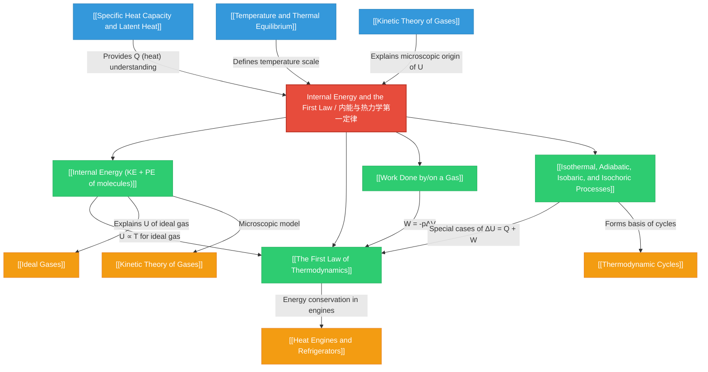

# Internal Energy and the First Law / 内能与热力学第一定律

**Parent Folder:** [[05-Thermal-Physics]] > [[02-Kinetic-Theory]] > **Internal Energy and the First Law**
**Level:** AS
**Difficulty:** Intermediate

---

# 1. Overview / 概述

**English:**
This topic explores the fundamental concept of **internal energy** ($U$) — the total microscopic energy stored within a system due to the random motion and interactions of its molecules. It then introduces the **First Law of Thermodynamics**, a powerful statement of energy conservation that relates changes in internal energy ($\Delta U$) to heat transfer ($Q$) and work done ($W$). This law is the cornerstone of thermal physics, bridging the microscopic world of molecules with macroscopic observations of temperature, pressure, and volume changes. Real-world applications include understanding how engines work (internal combustion engines, steam turbines), how refrigerators and heat pumps operate, and how gases behave during compression and expansion in industrial processes. In both Cambridge 9702 and Edexcel IAL examinations, this topic is essential for explaining energy transfers in thermal systems and forms the basis for more advanced studies in thermodynamics. Students must be able to apply the First Law to various thermodynamic processes, including isothermal, adiabatic, isobaric, and isochoric changes.

**中文：**
本主题探讨**内能**（$U$）的基本概念——由于分子随机运动和相互作用而储存在系统内的总微观能量。然后介绍**热力学第一定律**，这是能量守恒的有力表述，将内能变化（$\Delta U$）与热传递（$Q$）和做功（$W$）联系起来。该定律是热物理学的基石，将分子的微观世界与温度、压力和体积变化的宏观观测联系起来。实际应用包括理解发动机如何工作（内燃机、蒸汽轮机）、冰箱和热泵如何运行，以及气体在压缩和膨胀过程中在工业过程中的行为。在剑桥 9702 和爱德思 IAL 考试中，本主题对于解释热系统中的能量传递至关重要，并为更高级的热力学研究奠定了基础。学生必须能够将热力学第一定律应用于各种热力学过程，包括等温、绝热、等压和等容变化。

---

# 2. Syllabus Learning Objectives / 考纲学习目标

| CAIE 9702 | Edexcel IAL |
|-----------|-------------|
| **10.4(a)** Define and use the concept of internal energy. | **5.13** Understand the concept of internal energy as the sum of the random distribution of kinetic and potential energies of molecules in a system. |
| **10.4(b)** Recall and use the First Law of Thermodynamics expressed as $\Delta U = Q + W$. | **5.14** Recall and use the First Law of Thermodynamics $\Delta U = Q + W$ (where $W$ is work done *on* the system). |
| **10.4(c)** Apply the First Law to situations involving changes in temperature, phase, and volume. | **5.15** Understand that for an ideal gas, internal energy is proportional to its absolute temperature. |
| **10.4(d)** Distinguish between isothermal, adiabatic, isobaric, and isochoric processes. | **5.16** Understand and apply the First Law to isothermal and adiabatic changes for an ideal gas. |

**Examiner Expectations / 考官期望:**

**English:**
- **CAIE:** Candidates must be able to define internal energy precisely, apply the First Law with correct sign conventions (work done *on* the system is positive), and distinguish between the four thermodynamic processes. They should be able to explain why internal energy of an ideal gas depends only on temperature.
- **Edexcel:** Candidates must understand that $W$ in $\Delta U = Q + W$ is work done *on* the system. They should be able to apply the First Law to isothermal ($\Delta U = 0$) and adiabatic ($Q = 0$) processes for ideal gases, and explain the relationship between internal energy and temperature.

**中文：**
- **剑桥：** 考生必须能够精确定义内能，使用正确的符号约定（对系统做功为正）应用热力学第一定律，并区分四种热力学过程。他们应该能够解释为什么理想气体的内能仅取决于温度。
- **爱德思：** 考生必须理解 $\Delta U = Q + W$ 中的 $W$ 是对系统做的功。他们应该能够将热力学第一定律应用于理想气体的等温（$\Delta U = 0$）和绝热（$Q = 0$）过程，并解释内能与温度之间的关系。

> 📋 **CIE Only:** CAIE specifically requires distinguishing between all four processes (isothermal, adiabatic, isobaric, isochoric) and applying the First Law to phase changes.
>
> 📋 **Edexcel Only:** Edexcel explicitly states that for an ideal gas, internal energy is proportional to absolute temperature. Edexcel focuses more on isothermal and adiabatic processes for ideal gases.

---

# 3. Core Definitions / 核心定义

| Term (EN/CN) | Definition (EN) | Definition (CN) | Common Mistakes / 常见错误 |
|--------------|-----------------|-----------------|---------------------------|
| **Internal Energy ($U$) / 内能** | The sum of the random distribution of kinetic and potential energies of the molecules in a system. | 系统内分子随机分布的动能和势能的总和。 | ❌ Confusing internal energy with heat or temperature. Internal energy is a *state function*; heat is a *process quantity*. |
| **First Law of Thermodynamics / 热力学第一定律** | The change in internal energy of a system is equal to the sum of the heat supplied to the system and the work done on the system: $\Delta U = Q + W$. | 系统内能的变化等于系统吸收的热量与对系统做的功之和：$\Delta U = Q + W$。 | ❌ Getting the sign of $W$ wrong. Work done *on* the system is $+W$; work done *by* the system is $-W$. |
| **Isothermal Process / 等温过程** | A thermodynamic process that occurs at constant temperature. For an ideal gas, $\Delta U = 0$. | 在恒定温度下发生的热力学过程。对于理想气体，$\Delta U = 0$。 | ❌ Thinking isothermal means no heat transfer. Heat *is* transferred to maintain constant temperature. |
| **Adiabatic Process / 绝热过程** | A thermodynamic process in which no heat is transferred into or out of the system ($Q = 0$). | 没有热量传入或传出系统的热力学过程（$Q = 0$）。 | ❌ Confusing adiabatic with isothermal. In adiabatic processes, temperature *does* change. |
| **Isobaric Process / 等压过程** | A thermodynamic process that occurs at constant pressure. | 在恒定压力下发生的热力学过程。 | ❌ Forgetting that work done is $W = -p\Delta V$ (work done *by* system) or $W = p\Delta V$ (work done *on* system). |
| **Isochoric Process / 等容过程** | A thermodynamic process that occurs at constant volume. No work is done ($W = 0$). | 在恒定体积下发生的热力学过程。不做功（$W = 0$）。 | ❌ Thinking no work means no energy change. Heat transfer still changes internal energy. |
| **Heat ($Q$) / 热量** | Energy transferred between systems due to a temperature difference. | 由于温度差而在系统之间传递的能量。 | ❌ Treating heat as a property of a system. Heat is energy *in transit*. |
| **Work ($W$) / 功** | Energy transferred when a force moves through a distance. In thermodynamics, often work done by/on a gas during volume change. | 当力移动一段距离时传递的能量。在热力学中，通常指气体在体积变化过程中做的功。 | ❌ Forgetting sign convention: work done *on* system is positive; work done *by* system is negative. |

---

# 4. Key Concepts Explained / 关键概念详解

## 4.1 Internal Energy / 内能

### Explanation / 解释
**English:**
Internal energy ($U$) is the total energy stored within a system due to the random motion and interactions of its molecules. It is a **state function**, meaning its value depends only on the current state of the system (temperature, pressure, volume, composition), not on how the system reached that state. For any substance, internal energy has two components:
1. **Kinetic Energy:** The energy due to the random translational, rotational, and vibrational motion of molecules. This is directly related to temperature.
2. **Potential Energy:** The energy due to intermolecular forces (attractive and repulsive) between molecules. This depends on the average separation of molecules.

For an **ideal gas**, there are no intermolecular forces, so the potential energy is zero. Therefore, the internal energy of an ideal gas is purely kinetic and is directly proportional to its absolute temperature: $U \propto T$. This is a key result for Edexcel (5.15).

**中文：**
内能（$U$）是由于系统内分子的随机运动和相互作用而储存在系统内的总能量。它是一个**状态函数**，意味着它的值仅取决于系统的当前状态（温度、压力、体积、组成），而不取决于系统如何达到该状态。对于任何物质，内能有两个组成部分：
1. **动能：** 由于分子的随机平动、转动和振动运动而产生的能量。这与温度直接相关。
2. **势能：** 由于分子间力（引力和斥力）而产生的能量。这取决于分子的平均间距。

对于**理想气体**，没有分子间力，因此势能为零。因此，理想气体的内能纯粹是动能，并且与其绝对温度成正比：$U \propto T$。这是爱德思（5.15）的一个关键结果。

### Physical Meaning / 物理意义
**English:**
- When you heat a gas in a sealed container, you increase its internal energy (molecules move faster, kinetic energy increases).
- When ice melts, the internal energy increases (potential energy increases as molecules separate) even though temperature remains constant.
- For an ideal gas, internal energy is a measure of the total random kinetic energy of all molecules — directly linked to temperature.

**中文：**
- 当你加热密封容器中的气体时，你增加了它的内能（分子运动更快，动能增加）。
- 当冰融化时，内能增加（随着分子分离，势能增加），即使温度保持不变。
- 对于理想气体，内能是所有分子总随机动能的量度——与温度直接相关。

### Common Misconceptions / 常见误区
1. ❌ **"Internal energy is the same as heat."** — Internal energy is stored energy; heat is energy in transit.
2. ❌ **"Internal energy depends only on temperature."** — Only for ideal gases. For real substances, potential energy also changes with volume/phase.
3. ❌ **"Temperature is a measure of total internal energy."** — Temperature measures average kinetic energy per molecule, not total internal energy.

### Exam Tips / 考试提示
**English:**
- CAIE often asks: "Explain why the internal energy of an ideal gas depends only on its temperature." Answer: No intermolecular forces → no potential energy → only kinetic energy → $U \propto T$.
- Edexcel may ask: "State what is meant by internal energy." Use the exact wording: "the sum of the random distribution of kinetic and potential energies of molecules."
- When a substance changes phase at constant temperature, internal energy changes due to changes in potential energy (breaking/forming bonds).

**中文：**
- 剑桥常问："解释为什么理想气体的内能仅取决于其温度。" 答案：无分子间力 → 无势能 → 仅有动能 → $U \propto T$。
- 爱德思可能会问："说明内能的含义。" 使用确切措辞："分子随机分布的动能和势能的总和。"
- 当物质在恒定温度下发生相变时，内能由于势能的变化（断裂/形成键）而改变。

> 📷 **IMAGE PROMPT — [IE-01]: Internal Energy Components Diagram**
>
> A split diagram showing two scenarios: (Left) A real gas with molecules shown as small spheres connected by springs (representing intermolecular forces), with labels "Kinetic Energy (KE)" and "Potential Energy (PE)". (Right) An ideal gas with molecules as point particles with no springs, labeled "Kinetic Energy Only (KE)". Both have a thermometer showing temperature. Clean educational style, white background, blue and red color scheme for KE and PE respectively.

---

## 4.2 The First Law of Thermodynamics / 热力学第一定律

### Explanation / 解释
**English:**
The First Law of Thermodynamics is a statement of the conservation of energy for thermodynamic systems. It states:

$$\Delta U = Q + W$$

Where:
- $\Delta U$ = change in internal energy of the system (J)
- $Q$ = heat supplied *to* the system (J) — positive if heat enters the system
- $W$ = work done *on* the system (J) — positive if work is done on the system

**Sign Convention (IMPORTANT for exams):**
- **$Q > 0$:** Heat flows *into* the system (system gains thermal energy)
- **$Q < 0$:** Heat flows *out of* the system (system loses thermal energy)
- **$W > 0$:** Work is done *on* the system (e.g., compressing a gas)
- **$W < 0$:** Work is done *by* the system (e.g., gas expanding)

**Alternative form (work done *by* system):** Some textbooks write $\Delta U = Q - W$ where $W$ is work done *by* the system. **CAIE and Edexcel both use $\Delta U = Q + W$ where $W$ is work done *on* the system.** Always check the convention used in your exam board.

**中文：**
热力学第一定律是热力学系统能量守恒的表述。它指出：

$$\Delta U = Q + W$$

其中：
- $\Delta U$ = 系统内能的变化（J）
- $Q$ = 提供给系统的热量（J）——如果热量进入系统则为正
- $W$ = 对系统做的功（J）——如果对系统做功则为正

**符号约定（考试重要）：**
- **$Q > 0$：** 热量流入系统（系统获得热能）
- **$Q < 0$：** 热量流出系统（系统失去热能）
- **$W > 0$：** 对系统做功（例如，压缩气体）
- **$W < 0$：** 系统对外做功（例如，气体膨胀）

**替代形式（系统对外做功）：** 一些教科书写成 $\Delta U = Q - W$，其中 $W$ 是系统对外做的功。**剑桥和爱德思都使用 $\Delta U = Q + W$，其中 $W$ 是对系统做的功。** 始终检查你考试委员会使用的约定。

### Physical Meaning / 物理意义
**English:**
- If you compress a gas (do work on it, $W > 0$) and also heat it ($Q > 0$), its internal energy increases ($\Delta U > 0$).
- If a gas expands and does work on its surroundings ($W < 0$) while no heat is exchanged ($Q = 0$, adiabatic), its internal energy decreases ($\Delta U < 0$), so it cools down.
- The First Law is essentially: "Energy cannot be created or destroyed; it can only be transferred as heat or work."

**中文：**
- 如果你压缩气体（对其做功，$W > 0$）并同时加热它（$Q > 0$），其内能增加（$\Delta U > 0$）。
- 如果气体膨胀并对周围环境做功（$W < 0$），同时没有热量交换（$Q = 0$，绝热），其内能减少（$\Delta U < 0$），因此它会冷却。
- 热力学第一定律本质上是："能量不能被创造或毁灭；它只能作为热量或功被传递。"

### Common Misconceptions / 常见误区
1. ❌ **"$\Delta U$ is always positive when heat is added."** — Not if the system does work simultaneously. Example: isothermal expansion — heat added ($Q > 0$) but work done by system ($W < 0$) such that $\Delta U = 0$.
2. ❌ **"Work done on the system is always negative."** — No! Work done *on* the system is positive ($W > 0$). Work done *by* the system is negative ($W < 0$).
3. ❌ **"The First Law only applies to gases."** — It applies to all thermodynamic systems.

### Exam Tips / 考试提示
**English:**
- Always state the sign convention at the start of your answer: "Using $\Delta U = Q + W$ where $W$ is work done *on* the system..."
- For CAIE, be prepared to apply the First Law to phase changes (e.g., melting ice at 0°C: $Q > 0$, $W \approx 0$, so $\Delta U > 0$).
- For Edexcel, focus on applying to ideal gas processes, especially isothermal ($\Delta U = 0$) and adiabatic ($Q = 0$).

**中文：**
- 始终在答案开头说明符号约定："使用 $\Delta U = Q + W$，其中 $W$ 是对系统做的功..."
- 对于剑桥，准备将热力学第一定律应用于相变（例如，0°C 时冰融化：$Q > 0$，$W \approx 0$，所以 $\Delta U > 0$）。
- 对于爱德思，专注于应用于理想气体过程，特别是等温（$\Delta U = 0$）和绝热（$Q = 0$）。

---

## 4.3 Work Done by/on a Gas / 气体做功/对气体做功

### Explanation / 解释
**English:**
When a gas expands or is compressed, work is done. For a gas at constant pressure $p$ changing volume by $\Delta V$:

$$W = -p\Delta V$$

Where:
- $W$ = work done *on* the gas (J)
- $p$ = pressure (Pa)
- $\Delta V$ = change in volume ($V_{\text{final}} - V_{\text{initial}}$) (m³)

**Sign Interpretation:**
- **Compression ($\Delta V < 0$):** $W = -p(\text{negative}) = \text{positive}$ → Work is done *on* the gas.
- **Expansion ($\Delta V > 0$):** $W = -p(\text{positive}) = \text{negative}$ → Work is done *by* the gas.

**Graphical Interpretation:** On a $p$-$V$ diagram, the work done *by* the gas during expansion is the area under the curve. The work done *on* the gas during compression is the negative of the area under the curve.

**中文：**
当气体膨胀或被压缩时，就会做功。对于恒定压力 $p$ 下体积变化 $\Delta V$ 的气体：

$$W = -p\Delta V$$

其中：
- $W$ = 对气体做的功（J）
- $p$ = 压力（Pa）
- $\Delta V$ = 体积变化（$V_{\text{最终}} - V_{\text{初始}}$）（m³）

**符号解释：**
- **压缩（$\Delta V < 0$）：** $W = -p(\text{负值}) = \text{正值}$ → 对气体做功。
- **膨胀（$\Delta V > 0$）：** $W = -p(\text{正值}) = \text{负值}$ → 气体对外做功。

**图形解释：** 在 $p$-$V$ 图上，气体在膨胀过程中对外做的功是曲线下的面积。压缩过程中对气体做的功是曲线下面积的负值。

### Physical Meaning / 物理意义
**English:**
- When you pump air into a bicycle tire, you do work on the gas (compression), increasing its internal energy — the pump gets warm.
- When a gas in a cylinder pushes a piston outward (expansion), the gas does work on the piston, losing internal energy — the gas cools.

**中文：**
- 当你给自行车轮胎打气时，你对气体做功（压缩），增加其内能——打气筒变热。
- 当气缸中的气体向外推动活塞（膨胀）时，气体对活塞做功，失去内能——气体冷却。

### Common Misconceptions / 常见误区
1. ❌ **"Work done is always $p\Delta V$."** — This is only true for isobaric (constant pressure) processes. For non-isobaric processes, work is the area under the $p$-$V$ curve.
2. ❌ **"No work is done if volume doesn't change."** — Correct! In isochoric processes, $W = 0$.

### Exam Tips / 考试提示
**English:**
- CAIE and Edexcel both expect you to calculate work done from $p$-$V$ graphs (area under curve).
- Remember: $W = -p\Delta V$ gives work done *on* the gas. If the question asks for work done *by* the gas, it's $p\Delta V$.
- For non-constant pressure, you may need to estimate area from a graph.

**中文：**
- 剑桥和爱德思都期望你从 $p$-$V$ 图（曲线下面积）计算做功。
- 记住：$W = -p\Delta V$ 给出对气体做的功。如果问题问气体对外做的功，则是 $p\Delta V$。
- 对于非恒定压力，你可能需要从图中估算面积。

---

## 4.4 Thermodynamic Processes / 热力学过程

### Explanation / 解释
**English:**
There are four key thermodynamic processes that students must distinguish:

1. **Isothermal Process ($\Delta T = 0$, constant temperature):**
   - For an ideal gas: $\Delta U = 0$ (since $U \propto T$)
   - From First Law: $0 = Q + W \Rightarrow Q = -W$
   - Heat supplied equals work done by the gas (or heat removed equals work done on the gas)
   - Example: Slow compression/expansion of a gas in thermal contact with a reservoir

2. **Adiabatic Process ($Q = 0$, no heat transfer):**
   - From First Law: $\Delta U = W$
   - Any work done changes internal energy directly
   - Compression ($W > 0$) → $\Delta U > 0$ → temperature increases
   - Expansion ($W < 0$) → $\Delta U < 0$ → temperature decreases
   - Example: Rapid compression in a diesel engine (air heats up enough to ignite fuel)

3. **Isobaric Process ($\Delta p = 0$, constant pressure):**
   - Work done: $W = -p\Delta V$
   - Heat and work both contribute to $\Delta U$
   - Example: Heating a gas in a cylinder with a movable piston (atmospheric pressure constant)

4. **Isochoric Process ($\Delta V = 0$, constant volume):**
   - No work done: $W = 0$
   - From First Law: $\Delta U = Q$
   - All heat added goes to increasing internal energy (and temperature)
   - Example: Heating a gas in a sealed, rigid container

**中文：**
有四个关键的热力学过程，学生必须区分：

1. **等温过程（$\Delta T = 0$，恒定温度）：**
   - 对于理想气体：$\Delta U = 0$（因为 $U \propto T$）
   - 根据热力学第一定律：$0 = Q + W \Rightarrow Q = -W$
   - 提供的热量等于气体对外做的功（或移除的热量等于对气体做的功）
   - 示例：与热库热接触的气体缓慢压缩/膨胀

2. **绝热过程（$Q = 0$，无热传递）：**
   - 根据热力学第一定律：$\Delta U = W$
   - 任何做功都直接改变内能
   - 压缩（$W > 0$）→ $\Delta U > 0$ → 温度升高
   - 膨胀（$W < 0$）→ $\Delta U < 0$ → 温度降低
   - 示例：柴油发动机中的快速压缩（空气升温足以点燃燃料）

3. **等压过程（$\Delta p = 0$，恒定压力）：**
   - 做功：$W = -p\Delta V$
   - 热量和功都对 $\Delta U$ 有贡献
   - 示例：在带有可移动活塞的气缸中加热气体（大气压恒定）

4. **等容过程（$\Delta V = 0$，恒定体积）：**
   - 不做功：$W = 0$
   - 根据热力学第一定律：$\Delta U = Q$
   - 所有加入的热量都用于增加内能（和温度）
   - 示例：在密封的刚性容器中加热气体

### Physical Meaning / 物理意义
**English:**
- **Isothermal:** Think of a gas slowly expanding in a syringe held in a water bath — temperature stays constant because heat flows from the bath to the gas.
- **Adiabatic:** Think of a bicycle pump being used rapidly — the pump gets hot because compression is fast and little heat escapes.
- **Isobaric:** Think of a pot of water boiling at atmospheric pressure — volume increases but pressure stays constant.
- **Isochoric:** Think of a pressure cooker — heating increases pressure and temperature but volume is fixed.

**中文：**
- **等温：** 想象气体在水浴中的注射器中缓慢膨胀——温度保持恒定，因为热量从水浴流向气体。
- **绝热：** 想象快速使用自行车打气筒——打气筒变热，因为压缩很快，热量很少逸出。
- **等压：** 想象一锅水在大气压下沸腾——体积增加但压力保持不变。
- **等容：** 想象一个压力锅——加热增加压力和温度，但体积是固定的。

### Common Misconceptions / 常见误区
1. ❌ **"Isothermal means no heat transfer."** — No! Heat *is* transferred to maintain constant temperature.
2. ❌ **"Adiabatic means constant temperature."** — No! Temperature changes because no heat is exchanged.
3. ❌ **"All four processes are equally common in exams."** — Isothermal and adiabatic are most frequently tested for ideal gases.

### Exam Tips / 考试提示
**English:**
- Create a summary table for the four processes (see Section 12).
- For CAIE, be able to sketch $p$-$V$ graphs for each process and identify them.
- For Edexcel, focus on applying the First Law to isothermal and adiabatic processes for ideal gases.
- Common question: "A gas undergoes an isothermal expansion. State and explain the change in internal energy." Answer: $\Delta U = 0$ because temperature is constant, and for an ideal gas $U \propto T$.

**中文：**
- 为四个过程创建一个汇总表（见第 12 节）。
- 对于剑桥，能够为每个过程绘制 $p$-$V$ 图并识别它们。
- 对于爱德思，专注于将热力学第一定律应用于理想气体的等温和绝热过程。
- 常见问题："气体经历等温膨胀。说明并解释内能的变化。" 答案：$\Delta U = 0$，因为温度恒定，对于理想气体 $U \propto T$。

> 📷 **IMAGE PROMPT — [TP-01]: Four Thermodynamic Processes on p-V Diagram**
>
> A single p-V diagram showing four curves: (1) Isothermal — a smooth hyperbola (pV = constant), (2) Adiabatic — a steeper curve than isothermal (pV^γ = constant), (3) Isobaric — a horizontal line, (4) Isochoric — a vertical line. Each curve is labeled with the process name and key equation. Arrows indicate direction of change (expansion or compression). Clean educational style, different colors for each process, white background.

---

# 5. Essential Equations / 核心公式

## 5.1 First Law of Thermodynamics / 热力学第一定律

**Equation / 公式:**
$$\Delta U = Q + W$$

**Variables / 变量:**
| Symbol (符号) | Meaning (EN) | Meaning (CN) | Unit (单位) |
|--------------|-------------|-------------|------------|
| $\Delta U$ | Change in internal energy | 内能变化 | J (Joule) |
| $Q$ | Heat supplied to the system | 系统吸收的热量 | J (Joule) |
| $W$ | Work done on the system | 对系统做的功 | J (Joule) |

**Derivation / 推导:**
**English:**
The First Law is a statement of conservation of energy. Consider a system. The total energy change of the system ($\Delta U$) must equal the net energy transferred to it. Energy can enter the system as heat ($Q$) or as work ($W$). Therefore:
$$\Delta U = Q + W$$
This is a fundamental law — it cannot be derived from more basic principles; it is based on experimental observation.

**中文：**
热力学第一定律是能量守恒的表述。考虑一个系统。系统的总能量变化（$\Delta U$）必须等于传递到它的净能量。能量可以作为热量（$Q$）或作为功（$W$）进入系统。因此：
$$\Delta U = Q + W$$
这是一个基本定律——它不能从更基本的原理推导出来；它基于实验观察。

**Conditions / 适用条件:**
**English:** Applies to all thermodynamic systems (gases, liquids, solids). Valid for any process (reversible or irreversible). Assumes no mass transfer into/out of the system (closed system).

**中文：** 适用于所有热力学系统（气体、液体、固体）。对任何过程（可逆或不可逆）都有效。假设没有质量传入/传出系统（封闭系统）。

**Limitations / 局限性:**
**English:** Does not apply to open systems where mass enters or leaves. Does not predict the direction of processes (that's the Second Law). Does not account for nuclear reactions where mass-energy equivalence applies.

**中文：** 不适用于质量进入或离开的开放系统。不预测过程的方向（这是第二定律）。不适用于质能等效适用的核反应。

**Rearrangements / 变形:**
**English:**
- $Q = \Delta U - W$ (heat supplied)
- $W = \Delta U - Q$ (work done on system)
- If work done *by* system ($W_{\text{by}}$) is given: $\Delta U = Q - W_{\text{by}}$

**中文：**
- $Q = \Delta U - W$（提供的热量）
- $W = \Delta U - Q$（对系统做的功）
- 如果给出系统对外做的功（$W_{\text{by}}$）：$\Delta U = Q - W_{\text{by}}$

---

## 5.2 Work Done on a Gas (Isobaric) / 对气体做的功（等压）

**Equation / 公式:**
$$W = -p\Delta V$$

**Variables / 变量:**
| Symbol (符号) | Meaning (EN) | Meaning (CN) | Unit (单位) |
|--------------|-------------|-------------|------------|
| $W$ | Work done on the gas | 对气体做的功 | J |
| $p$ | Pressure (constant) | 压力（恒定） | Pa (N/m²) |
| $\Delta V$ | Change in volume ($V_f - V_i$) | 体积变化（$V_f - V_i$） | m³ |

**Derivation / 推导:**
**English:**
Work done by a force $F$ moving a distance $x$ is $W = Fx$. For a gas in a cylinder with a piston of area $A$:
- Force on piston: $F = pA$
- If piston moves by $\Delta x$, volume change: $\Delta V = A\Delta x$
- Work done *by* gas: $W_{\text{by}} = F\Delta x = pA\Delta x = p\Delta V$
- Work done *on* gas (opposite sign): $W = -W_{\text{by}} = -p\Delta V$

**中文：**
力 $F$ 移动距离 $x$ 所做的功是 $W = Fx$。对于带有面积为 $A$ 的活塞的气缸中的气体：
- 活塞上的力：$F = pA$
- 如果活塞移动 $\Delta x$，体积变化：$\Delta V = A\Delta x$
- 气体对外做的功：$W_{\text{by}} = F\Delta x = pA\Delta x = p\Delta V$
- 对气体做的功（相反符号）：$W = -W_{\text{by}} = -p\Delta V$

**Conditions / 适用条件:**
**English:** Only valid for isobaric (constant pressure) processes. For non-isobaric processes, work is the area under the $p$-$V$ curve.

**中文：** 仅对等压（恒定压力）过程有效。对于非等压过程，功是 $p$-$V$ 曲线下的面积。

**Limitations / 局限性:**
**English:** Does not apply if pressure changes during the process. Does not account for frictional losses in the piston.

**中文：** 如果过程中压力变化则不适用。不考虑活塞中的摩擦损失。

**Rearrangements / 变形:**
**English:**
- $p = -\frac{W}{\Delta V}$ (pressure)
- $\Delta V = -\frac{W}{p}$ (volume change)
- Work done *by* gas: $W_{\text{by}} = p\Delta V = -W$

**中文：**
- $p = -\frac{W}{\Delta V}$（压力）
- $\Delta V = -\frac{W}{p}$（体积变化）
- 气体对外做的功：$W_{\text{by}} = p\Delta V = -W$

---

## 5.3 Internal Energy of an Ideal Gas / 理想气体的内能

**Equation / 公式:**
$$U \propto T \quad \text{or} \quad U = \frac{3}{2}nRT \quad \text{(monatomic ideal gas)}$$

**Variables / 变量:**
| Symbol (符号) | Meaning (EN) | Meaning (CN) | Unit (单位) |
|--------------|-------------|-------------|------------|
| $U$ | Internal energy | 内能 | J |
| $T$ | Absolute temperature | 绝对温度 | K |
| $n$ | Number of moles | 物质的量 | mol |
| $R$ | Molar gas constant (8.31 J mol⁻¹ K⁻¹) | 摩尔气体常数 | J mol⁻¹ K⁻¹ |

**Derivation / 推导:**
**English:**
From kinetic theory, the average kinetic energy of a molecule is $\frac{3}{2}kT$ (where $k$ is Boltzmann's constant). For $N$ molecules:
$$U = N \times \frac{3}{2}kT = \frac{3}{2}NkT$$
Since $Nk = nR$ (where $n$ is number of moles and $R$ is the molar gas constant):
$$U = \frac{3}{2}nRT$$
This shows $U \propto T$ for a monatomic ideal gas. For diatomic or polyatomic gases, the factor changes (e.g., $\frac{5}{2}nRT$ for diatomic at moderate temperatures).

**中文：**
根据分子运动论，分子的平均动能为 $\frac{3}{2}kT$（其中 $k$ 是玻尔兹曼常数）。对于 $N$ 个分子：
$$U = N \times \frac{3}{2}kT = \frac{3}{2}NkT$$
由于 $Nk = nR$（其中 $n$ 是物质的量，$R$ 是摩尔气体常数）：
$$U = \frac{3}{2}nRT$$
这表明对于单原子理想气体，$U \propto T$。对于双原子或多原子气体，系数会变化（例如，中等温度下双原子气体为 $\frac{5}{2}nRT$）。

**Conditions / 适用条件:**
**English:** Only for ideal gases (no intermolecular forces). The $\frac{3}{2}nRT$ form is for monatomic gases only.

**中文：** 仅适用于理想气体（无分子间力）。$\frac{3}{2}nRT$ 形式仅适用于单原子气体。

**Limitations / 局限性:**
**English:** Does not apply to real gases at high pressure or low temperature (where intermolecular forces matter). Does not account for rotational/vibrational energy modes in polyatomic molecules.

**中文：** 不适用于高压或低温下的真实气体（此时分子间力起作用）。不考虑多原子分子中的转动/振动能量模式。

**Rearrangements / 变形:**
**English:**
- $T = \frac{2U}{3nR}$ (temperature from internal energy)
- $\Delta U = \frac{3}{2}nR\Delta T$ (change in internal energy)

**中文：**
- $T = \frac{2U}{3nR}$（从内能求温度）
- $\Delta U = \frac{3}{2}nR\Delta T$（内能变化）

---

# 6. Graphs and Relationships / 图表与关系

## 6.1 Pressure-Volume ($p$-$V$) Diagram for Thermodynamic Processes / 热力学过程的压力-体积（$p$-$V$）图

### Axes / 坐标轴
**English:** x-axis: Volume $V$ (m³), y-axis: Pressure $p$ (Pa)
**中文：** x 轴：体积 $V$（m³），y 轴：压力 $p$（Pa）

### Shape / 形状
**English:**
- **Isothermal:** Hyperbola ($pV = \text{constant}$)
- **Adiabatic:** Steeper hyperbola ($pV^\gamma = \text{constant}$, where $\gamma = C_p/C_v > 1$)
- **Isobaric:** Horizontal line ($p = \text{constant}$)
- **Isochoric:** Vertical line ($V = \text{constant}$)

**中文：**
- **等温：** 双曲线（$pV = \text{常数}$）
- **绝热：** 更陡的双曲线（$pV^\gamma = \text{常数}$，其中 $\gamma = C_p/C_v > 1$）
- **等压：** 水平线（$p = \text{常数}$）
- **等容：** 垂直线（$V = \text{常数}$）

### Gradient Meaning / 斜率含义
**English:**
- For isothermal: gradient = $-\frac{p}{V}$ (negative, decreasing magnitude)
- For adiabatic: gradient = $-\gamma\frac{p}{V}$ (steeper than isothermal)
- For isobaric: gradient = 0
- For isochoric: gradient = infinite (vertical)

**中文：**
- 对于等温：斜率 = $-\frac{p}{V}$（负值，大小递减）
- 对于绝热：斜率 = $-\gamma\frac{p}{V}$（比等温更陡）
- 对于等压：斜率 = 0
- 对于等容：斜率 = 无穷大（垂直）

### Area Meaning / 面积含义
**English:**
The area under the $p$-$V$ curve represents the work done *by* the gas during expansion (or the negative of work done *on* the gas during compression). For a cyclic process, the area enclosed by the cycle represents the net work done.

**中文：**
$p$-$V$ 曲线下的面积表示气体在膨胀过程中对外做的功（或压缩过程中对气体做的功的负值）。对于循环过程，循环包围的面积表示净功。

### Exam Interpretation / 考试解读
**English:**
- CAIE: Sketch and identify $p$-$V$ graphs for all four processes. Calculate work from area.
- Edexcel: Compare isothermal and adiabatic curves. Explain why adiabatic is steeper.
- Common question: "On a $p$-$V$ diagram, sketch an isothermal expansion and an adiabatic expansion starting from the same initial state."

**中文：**
- 剑桥：绘制并识别所有四个过程的 $p$-$V$ 图。从面积计算功。
- 爱德思：比较等温和绝热曲线。解释为什么绝热曲线更陡。
- 常见问题："在 $p$-$V$ 图上，从相同的初始状态开始，绘制等温膨胀和绝热膨胀。"

### Common Questions / 常见问题
**English:**
1. "Which curve is steeper: isothermal or adiabatic? Explain why."
2. "Calculate the work done by the gas from the area under the $p$-$V$ graph."
3. "A gas undergoes a cycle ABCA. Calculate the net work done."

**中文：**
1. "哪条曲线更陡：等温还是绝热？解释原因。"
2. "从 $p$-$V$ 图下的面积计算气体对外做的功。"
3. "气体经历循环 ABCA。计算净功。"

> 📷 **IMAGE PROMPT — [PV-01]: p-V Diagram Comparison**
>
> A p-V diagram with two curves starting from the same point (P₀, V₀). Curve A (isothermal) is a smooth hyperbola labeled "Isothermal (pV = constant)". Curve B (adiabatic) is a steeper hyperbola labeled "Adiabatic (pV^γ = constant)". Both curves show expansion (V increasing, p decreasing). The area under each curve is shaded differently. Labels: "Work done = area under curve". Clean educational style, blue for isothermal, red for adiabatic, white background.

---

## 6.2 Internal Energy vs. Temperature for an Ideal Gas / 理想气体的内能 vs. 温度

### Axes / 坐标轴
**English:** x-axis: Absolute temperature $T$ (K), y-axis: Internal energy $U$ (J)
**中文：** x 轴：绝对温度 $T$（K），y 轴：内能 $U$（J）

### Shape / 形状
**English:** Straight line through origin ($U \propto T$). Gradient = $\frac{3}{2}nR$ for monatomic gas.
**中文：** 通过原点的直线（$U \propto T$）。对于单原子气体，斜率 = $\frac{3}{2}nR$。

### Gradient Meaning / 斜率含义
**English:** Gradient = $\frac{\Delta U}{\Delta T} = \frac{3}{2}nR$ = heat capacity at constant volume ($C_V$) for a monatomic ideal gas.
**中文：** 斜率 = $\frac{\Delta U}{\Delta T} = \frac{3}{2}nR$ = 单原子理想气体的定容热容（$C_V$）。

### Area Meaning / 面积含义
**English:** Not applicable (area under this graph has no physical meaning).
**中文：** 不适用（此图下的面积没有物理意义）。

### Exam Interpretation / 考试解读
**English:**
- Edexcel specifically tests: "Explain why the internal energy of an ideal gas is proportional to its absolute temperature."
- CAIE may ask: "Sketch a graph to show how the internal energy of an ideal gas varies with temperature."

**中文：**
- 爱德思特别测试："解释为什么理想气体的内能与其绝对温度成正比。"
- 剑桥可能会问："绘制图表显示理想气体的内能如何随温度变化。"

### Common Questions / 常见问题
**English:**
1. "State the relationship between internal energy and temperature for an ideal gas."
2. "Calculate the change in internal energy when the temperature of 2 moles of monatomic ideal gas increases by 50 K."

**中文：**
1. "说明理想气体内能与温度之间的关系。"
2. "计算 2 摩尔单原子理想气体温度升高 50 K 时内能的变化。"

---

# 7. Required Diagrams / 必备图表

## 7.1 $p$-$V$ Diagram for Four Thermodynamic Processes / 四种热力学过程的 $p$-$V$ 图

### Description / 描述
**English:**
A single $p$-$V$ diagram showing all four thermodynamic processes: isothermal (hyperbola), adiabatic (steeper hyperbola), isobaric (horizontal line), and isochoric (vertical line). Each curve should be clearly labeled with the process name and the key equation. Arrows should indicate the direction of change (expansion or compression). The diagram should also show the area under a curve representing work done.

**中文：**
一个显示所有四个热力学过程的 $p$-$V$ 图：等温（双曲线）、绝热（更陡的双曲线）、等压（水平线）和等容（垂直线）。每条曲线都应清晰标注过程名称和关键方程。箭头应指示变化方向（膨胀或压缩）。该图还应显示曲线下的面积代表做功。

### Image Prompt / 图片生成提示
> 📷 **IMAGE PROMPT — [PV-02]: Complete p-V Diagram for Four Processes**
>
> A clean educational p-V diagram with four distinct curves on the same axes. (1) Isothermal: blue hyperbola labeled "Isothermal (pV = const)". (2) Adiabatic: red steeper hyperbola labeled "Adiabatic (pV^γ = const)". (3) Isobaric: green horizontal line labeled "Isobaric (p = const)". (4) Isochoric: orange vertical line labeled "Isochoric (V = const)". Arrows on each curve show direction. A shaded area under the isothermal curve is labeled "Work done = area under curve". Axes labeled "Pressure p / Pa" and "Volume V / m³". White background, professional textbook style.

### Labels Required / 需要标注
**English:**
- Axes: "Pressure p / Pa" and "Volume V / m³"
- Each curve: "Isothermal", "Adiabatic", "Isobaric", "Isochoric"
- Key equations: $pV = \text{const}$, $pV^\gamma = \text{const}$, $p = \text{const}$, $V = \text{const}$
- Shaded area: "Work done = area under curve"

**中文：**
- 坐标轴："压力 p / Pa" 和 "体积 V / m³"
- 每条曲线："等温"、"绝热"、"等压"、"等容"
- 关键方程：$pV = \text{常数}$、$pV^\gamma = \text{常数}$、$p = \text{常数}$、$V = \text{常数}$
- 阴影区域："做功 = 曲线下面积"

### Exam Importance / 考试重要性
**English:**
- Essential for identifying processes from graphs
- Used to calculate work done (area under curve)
- Required for comparing isothermal and adiabatic processes
- Frequently tested in both CAIE and Edexcel

**中文：**
- 对于从图中识别过程至关重要
- 用于计算做功（曲线下面积）
- 需要用于比较等温和绝热过程
- 在剑桥和爱德思中经常测试

---

## 7.2 Internal Energy Components Diagram / 内能组成图

### Description / 描述
**English:**
A split diagram comparing the internal energy components of a real gas and an ideal gas. For the real gas, molecules are shown as spheres connected by springs (representing intermolecular forces), with labels for kinetic energy (KE) and potential energy (PE). For the ideal gas, molecules are shown as point particles with no springs, labeled only with kinetic energy. A thermometer shows temperature.

**中文：**
一个分割图，比较真实气体和理想气体的内能组成。对于真实气体，分子显示为用弹簧连接的球体（代表分子间力），并标注动能（KE）和势能（PE）。对于理想气体，分子显示为没有弹簧的点粒子，仅标注动能。温度计显示温度。

### Image Prompt / 图片生成提示
> 📷 **IMAGE PROMPT — [IE-02]: Internal Energy Components Comparison**
>
> Split diagram with two panels. Left panel: "Real Gas" — several molecules shown as blue spheres connected by wavy springs (intermolecular forces), with labels "Kinetic Energy (KE)" and "Potential Energy (PE)". Right panel: "Ideal Gas" — molecules shown as small red dots with no connections, labeled "Kinetic Energy Only (KE)". A thermometer in each panel shows the same temperature. Below: equation U = KE + PE for real gas, and U = KE for ideal gas. Clean educational style, white background.

### Labels Required / 需要标注
**English:**
- "Real Gas" and "Ideal Gas" headings
- "Kinetic Energy (KE)" and "Potential Energy (PE)" labels
- Thermometer with temperature reading
- Equation: $U = \text{KE} + \text{PE}$ (real gas), $U = \text{KE}$ (ideal gas)

**中文：**
- "真实气体"和"理想气体"标题
- "动能（KE）"和"势能（PE）"标签
- 带有温度读数的温度计
- 方程：$U = \text{KE} + \text{PE}$（真实气体），$U = \text{KE}$（理想气体）

### Exam Importance / 考试重要性
**English:**
- Helps explain why internal energy of ideal gas depends only on temperature
- Clarifies the difference between real and ideal gases
- Supports understanding of phase changes (where PE changes but KE remains constant)

**中文：**
- 有助于解释为什么理想气体的内能仅取决于温度
- 阐明真实气体和理想气体之间的区别
- 支持对相变的理解（其中 PE 变化但 KE 保持不变）

---

## 7.3 Work Done by a Gas: Piston-Cylinder System / 气体做功：活塞-气缸系统

### Description / 描述
**English:**
A diagram showing a gas in a cylinder with a movable piston. The gas is being heated (flame below), causing expansion. The piston moves upward, doing work on the surroundings. Forces (pressure force on piston) and displacement are shown. The diagram illustrates the derivation of $W = -p\Delta V$.

**中文：**
一个显示气体在带有可移动活塞的气缸中的图。气体被加热（下方火焰），导致膨胀。活塞向上移动，对周围环境做功。显示了力（活塞上的压力）和位移。该图说明了 $W = -p\Delta V$ 的推导。

### Image Prompt / 图片生成提示
> 📷 **IMAGE PROMPT — [WD-01]: Piston-Cylinder Work Diagram**
>
> Cross-section diagram of a cylinder with a movable piston. Inside: gas molecules as small dots. Below cylinder: a flame (heat source) with wavy arrows labeled "Q (heat in)". Piston: labeled with area A, showing upward displacement Δx. Force arrow on piston: F = pA (upward). Labels: "Initial volume V₁", "Final volume V₂", "ΔV = AΔx". Equation shown: W_by = pΔV, W_on = -pΔV. Clean engineering-style diagram, white background, blue and gray color scheme.

### Labels Required / 需要标注
**English:**
- Cylinder, piston, gas
- Heat source (flame) with $Q$ arrow
- Force $F = pA$ on piston
- Displacement $\Delta x$
- Initial volume $V_1$, final volume $V_2$
- Work done by gas: $W_{\text{by}} = p\Delta V$
- Work done on gas: $W = -p\Delta V$

**中文：**
- 气缸、活塞、气体
- 热源（火焰）带 $Q$ 箭头
- 活塞上的力 $F = pA$
- 位移 $\Delta x$
- 初始体积 $V_1$，最终体积 $V_2$
- 气体对外做功：$W_{\text{by}} = p\Delta V$
- 对气体做功：$W = -p\Delta V$

### Exam Importance / 考试重要性
**English:**
- Essential for understanding the derivation of work done by/on a gas
- Helps visualize the sign convention
- Links macroscopic work to microscopic molecular motion

**中文：**
- 对于理解气体做功/对气体做功的推导至关重要
- 有助于可视化符号约定
- 将宏观功与微观分子运动联系起来

---

# 8. Worked Examples / 典型例题

## Example 1: Applying the First Law to an Isothermal Expansion / 将热力学第一定律应用于等温膨胀

### Question / 题目
**English:**
An ideal gas is contained in a cylinder with a movable piston. The gas expands isothermally at 300 K, doing 500 J of work on its surroundings. Calculate:
(a) The change in internal energy of the gas.
(b) The heat supplied to the gas.
(c) Explain why the temperature remains constant.

**中文：**
理想气体被封闭在带有可移动活塞的气缸中。气体在 300 K 下等温膨胀，对外界做功 500 J。计算：
(a) 气体内能的变化。
(b) 提供给气体的热量。
(c) 解释为什么温度保持不变。

### Image Prompt / 图片提示
> 📷 **IMAGE PROMPT — [EX-01]: Isothermal Expansion Setup**
>
> A cylinder with a movable piston. Gas inside (shown as dots) expanding. Piston moving outward (arrow). A water bath surrounds the cylinder, labeled "Constant temperature reservoir at 300 K". Wavy arrows from water bath to cylinder labeled "Q (heat in)". Arrow on piston labeled "W_by = 500 J (work done by gas)". Clean educational diagram.

### Solution / 解答

**Step 1: Identify the process and relevant equations.**
- Process: Isothermal (constant temperature)
- For an ideal gas: $U \propto T$, so $\Delta T = 0 \Rightarrow \Delta U = 0$
- First Law: $\Delta U = Q + W$

**Step 2: Determine the sign of work.**
- Work done *by* the gas on surroundings = 500 J
- Work done *on* the gas: $W = -500$ J (negative because work is done *by* the system)

**Step 3: Apply the First Law.**
(a) $\Delta U = 0$ (isothermal, ideal gas)

(b) $\Delta U = Q + W$
   $0 = Q + (-500)$
   $Q = 500$ J

   The heat supplied to the gas is 500 J.

(c) The temperature remains constant because the gas is in thermal contact with a constant-temperature reservoir. As the gas expands and does work, it loses internal energy. Heat flows from the reservoir into the gas at exactly the same rate, maintaining constant internal energy and therefore constant temperature.

**中文：**

**步骤 1：确定过程和相关方程。**
- 过程：等温（恒定温度）
- 对于理想气体：$U \propto T$，所以 $\Delta T = 0 \Rightarrow \Delta U = 0$
- 热力学第一定律：$\Delta U = Q + W$

**步骤 2：确定功的符号。**
- 气体对外界做的功 = 500 J
- 对气体做的功：$W = -500$ J（负值，因为系统对外做功）

**步骤 3：应用热力学第一定律。**
(a) $\Delta U = 0$（等温，理想气体）

(b) $\Delta U = Q + W$
   $0 = Q + (-500)$
   $Q = 500$ J

   提供给气体的热量为 500 J。

(c) 温度保持不变，因为气体与恒温库热接触。当气体膨胀并做功时，它失去内能。热量以完全相同的速率从热库流入气体，保持内能恒定，因此温度恒定。

### Final Answer / 最终答案
**Answer:**
(a) $\Delta U = 0$ J
(b) $Q = 500$ J
(c) Thermal contact with reservoir maintains constant temperature.

**答案：**
(a) $\Delta U = 0$ J
(b) $Q = 500$ J
(c) 与热库的热接触保持温度恒定。

### Examiner Notes / 考官点评
**English:**
- Common mistake: Using $W = +500$ J (forgetting sign convention). Remember: work done *by* the system is negative in $\Delta U = Q + W$.
- Full marks require stating that $\Delta U = 0$ because temperature is constant and the gas is ideal.
- For part (c), mention "thermal contact with a reservoir" — this is the key phrase.

**中文：**
- 常见错误：使用 $W = +500$ J（忘记符号约定）。记住：在 $\Delta U = Q + W$ 中，系统对外做功为负。
- 满分需要说明 $\Delta U = 0$，因为温度恒定且气体是理想的。
- 对于 (c) 部分，提及"与热库热接触"——这是关键短语。

---

## Example 2: Adiabatic Compression of an Ideal Gas / 理想气体的绝热压缩

### Question / 题目
**English:**
0.50 moles of a monatomic ideal gas is compressed adiabatically. The temperature of the gas rises from 300 K to 450 K. The molar gas constant $R = 8.31$ J mol⁻¹ K⁻¹.
(a) Calculate the change in internal energy of the gas.
(b) Calculate the work done on the gas.
(c) State and explain whether the gas is compressed or expanded.

**中文：**
0.50 摩尔单原子理想气体被绝热压缩。气体温度从 300 K 上升到 450 K。摩尔气体常数 $R = 8.31$ J mol⁻¹ K⁻¹。
(a) 计算气体内能的变化。
(b) 计算对气体做的功。
(c) 说明并解释气体是被压缩还是膨胀。

### Solution / 解答

**Step 1: Identify the process and relevant equations.**
- Process: Adiabatic ($Q = 0$)
- Monatomic ideal gas: $U = \frac{3}{2}nRT$, $\Delta U = \frac{3}{2}nR\Delta T$
- First Law: $\Delta U = Q + W$

**Step 2: Calculate the change in internal energy.**
(a) $\Delta U = \frac{3}{2}nR\Delta T$
   $\Delta U = \frac{3}{2} \times 0.50 \times 8.31 \times (450 - 300)$
   $\Delta U = \frac{3}{2} \times 0.50 \times 8.31 \times 150$
   $\Delta U = 1.5 \times 0.50 \times 8.31 \times 150$
   $\Delta U = 0.75 \times 8.31 \times 150$
   $\Delta U = 0.75 \times 1246.5$
   $\Delta U = 934.875 \approx 935$ J

**Step 3: Apply the First Law for adiabatic process.**
(b) For adiabatic process: $Q = 0$
   $\Delta U = Q + W = 0 + W$
   $W = \Delta U = 935$ J

   The work done on the gas is 935 J.

(c) The work done on the gas is positive ($W > 0$), which means work is done *on* the gas. This corresponds to **compression** of the gas. The temperature increase also confirms compression (compression increases internal energy and temperature).

**中文：**

**步骤 1：确定过程和相关方程。**
- 过程：绝热（$Q = 0$）
- 单原子理想气体：$U = \frac{3}{2}nRT$，$\Delta U = \frac{3}{2}nR\Delta T$
- 热力学第一定律：$\Delta U = Q + W$

**步骤 2：计算内能的变化。**
(a) $\Delta U = \frac{3}{2}nR\Delta T$
   $\Delta U = \frac{3}{2} \times 0.50 \times 8.31 \times (450 - 300)$
   $\Delta U = \frac{3}{2} \times 0.50 \times 8.31 \times 150$
   $\Delta U = 1.5 \times 0.50 \times 8.31 \times 150$
   $\Delta U = 0.75 \times 8.31 \times 150$
   $\Delta U = 0.75 \times 1246.5$
   $\Delta U = 934.875 \approx 935$ J

**步骤 3：对绝热过程应用热力学第一定律。**
(b) 对于绝热过程：$Q = 0$
   $\Delta U = Q + W = 0 + W$
   $W = \Delta U = 935$ J

   对气体做的功为 935 J。

(c) 对气体做的功为正（$W > 0$），这意味着对气体做功。这对应于气体的**压缩**。温度升高也证实了压缩（压缩增加内能和温度）。

### Final Answer / 最终答案
**Answer:**
(a) $\Delta U = 935$ J
(b) $W = 935$ J
(c) Compression, because work done on gas is positive ($W > 0$).

**答案：**
(a) $\Delta U = 935$ J
(b) $W = 935$ J
(c) 压缩，因为对气体做的功为正（$W > 0$）。

### Examiner Notes / 考官点评
**English:**
- Common mistake: Using $U = \frac{3}{2}nRT$ directly without the $\Delta$ form. Always use $\Delta U = \frac{3}{2}nR\Delta T$ for changes.
- Remember: For adiabatic processes, $Q = 0$, so $\Delta U = W$. This is a key result.
- The positive work and temperature increase both indicate compression.

**中文：**
- 常见错误：直接使用 $U = \frac{3}{2}nRT$ 而不使用 $\Delta$ 形式。对于变化，始终使用 $\Delta U = \frac{3}{2}nR\Delta T$。
- 记住：对于绝热过程，$Q = 0$，所以 $\Delta U = W$。这是一个关键结果。
- 正功和温度升高都表明压缩。

---

# 9. Past Paper Question Types / 历年真题题型

| Question Type / 题型 | Frequency / 频率 | Difficulty / 难度 | Past Paper References / 真题索引 |
|----------------------|------------------|------------------|-------------------------------|
| Calculation / 计算 | High | Medium | 📝 *待填入* |
| Explanation / 解释 | High | Medium | 📝 *待填入* |
| Graph Analysis / 图表分析 | Medium | Medium-High | 📝 *待填入* |
| Practical / 实验 | Low | Medium | 📝 *待填入* |
| Derivation / 推导 | Low | High | 📝 *待填入* |

> 📝 **题库整理中 / Question Bank Under Construction:** 具体试卷编号（如 9702/23/M/J/24 Q3）将在后续整理真题后填入上表。

**Common Command Words / 常见指令词:**

| Command Word (EN) | Command Word (CN) | What to Do |
|-------------------|-------------------|------------|
| **State** | **陈述** | Give a brief answer without explanation |
| **Define** | **定义** | Give the precise meaning |
| **Explain** | **解释** | Give reasons or causes |
| **Describe** | **描述** | Give a detailed account |
| **Calculate** | **计算** | Use mathematics to find a numerical answer |
| **Determine** | **确定** | Find a value using given data or a graph |
| **Suggest** | **建议** | Propose a possible answer based on reasoning |
| **Sketch** | **绘制草图** | Draw a graph showing the general shape |
| **Show that** | **证明** | Demonstrate that a given result is correct |

---

# 10. Practical Skills Connections / 实验技能链接

**English:**
This topic connects to practical work in several ways:

1. **CAIE Paper 3 (AS) / Paper 5 (A2):**
   - **Measurement of specific heat capacity:** Involves heating a substance and measuring temperature change — directly relates to $\Delta U = Q$ (if no work is done).
   - **Gas laws experiments:** Measuring pressure, volume, and temperature changes in gases — relates to thermodynamic processes.
   - **Uncertainties:** When measuring temperature changes, consider thermometer resolution (±0.5°C or ±0.1°C). When measuring volume changes, consider syringe or measuring cylinder uncertainties.

2. **Edexcel Unit 3 (AS) / Unit 6 (A2):**
   - **Investigation of the relationship between pressure and volume of a gas at constant temperature:** This is an isothermal process experiment.
   - **Measurement of the specific latent heat of fusion/vaporization:** Relates to internal energy changes during phase changes.
   - **Graph plotting:** Plotting $p$ vs $V$ or $p$ vs $1/V$ to verify Boyle's law (isothermal process).

3. **Experimental Design Considerations:**
   - **Isothermal experiments:** Ensure slow changes so temperature remains constant (use a water bath).
   - **Adiabatic experiments:** Use rapid changes and good insulation to minimize heat transfer.
   - **Work calculation:** From $p$-$V$ graphs, estimate area under curve using counting squares or trapezium rule.

4. **Common Practical Questions:**
   - "Describe how you would investigate the relationship between pressure and volume of a gas at constant temperature."
   - "Explain how you would ensure the temperature remains constant during the experiment."
   - "Estimate the work done from the area under the $p$-$V$ graph."

**中文：**
本主题在多个方面与实验工作相关：

1. **剑桥 Paper 3 (AS) / Paper 5 (A2)：**
   - **比热容的测量：** 涉及加热物质并测量温度变化——直接与 $\Delta U = Q$ 相关（如果不做功）。
   - **气体定律实验：** 测量气体的压力、体积和温度变化——与热力学过程相关。
   - **不确定度：** 测量温度变化时，考虑温度计分辨率（±0.5°C 或 ±0.1°C）。测量体积变化时，考虑注射器或量筒的不确定度。

2. **爱德思 Unit 3 (AS) / Unit 6 (A2)：**
   - **恒定温度下气体压力与体积关系的调查：** 这是一个等温过程实验。
   - **熔化/汽化比潜热的测量：** 与相变过程中的内能变化相关。
   - **图表绘制：** 绘制 $p$ vs $V$ 或 $p$ vs $1/V$ 以验证玻意耳定律（等温过程）。

3. **实验设计考虑：**
   - **等温实验：** 确保缓慢变化，使温度保持恒定（使用水浴）。
   - **绝热实验：** 使用快速变化和良好的隔热以最小化热传递。
   - **功的计算：** 从 $p$-$V$ 图，使用计数方格或梯形法则估算曲线下面积。

4. **常见实验问题：**
   - "描述你将如何调查恒定温度下气体压力与体积的关系。"
   - "解释你将如何确保实验过程中温度保持恒定。"
   - "从 $p$-$V$ 图下的面积估算所做的功。"

> 📋 **CIE Only:** CAIE Paper 5 may ask you to design an experiment to investigate the relationship between pressure and volume of a gas, including details of apparatus, procedure, and how to ensure constant temperature.
>
> 📋 **Edexcel Only:** Edexcel Unit 3 may include a practical question on measuring the specific heat capacity of a metal block, linking to $\Delta U = Q$ when volume change is negligible.

---

# 11. Concept Map / 概念图谱

---

# 12. Quick Revision Sheet / 速查表

| Category / 类别 | Key Points / 要点 |
|----------------|------------------|
| **Definitions / 定义** | **Internal Energy ($U$):** Sum of random KE + PE of molecules in a system. **State function** — depends only on current state. **For ideal gas:** $U \propto T$ (no PE). **First Law:** $\Delta U = Q + W$ (energy conservation). |
| **Equations / 公式** | **First Law:** $\Delta U = Q + W$ (W = work done *on* system). **Work on gas (isobaric):** $W = -p\Delta V$. **Work by gas:** $W_{\text{by}} = p\Delta V$. **Monatomic ideal gas:** $U = \frac{3}{2}nRT$, $\Delta U = \frac{3}{2}nR\Delta T$. |
| **Graphs / 图表** | **$p$-$V$ Diagram:** Isothermal = hyperbola ($pV = \text{const}$). Adiabatic = steeper hyperbola ($pV^\gamma = \text{const}$). Isobaric = horizontal line. Isochoric = vertical line. **Area under curve = work done by gas.** **$U$ vs $T$:** Straight line through origin for ideal gas. |
| **Key Facts / 关键事实** | **Isothermal ($\Delta T = 0$):** $\Delta U = 0$, $Q = -W$. **Adiabatic ($Q = 0$):** $\Delta U = W$. **Isobaric ($\Delta p = 0$):** $W = -p\Delta V$. **Isochoric ($\Delta V = 0$):** $W = 0$, $\Delta U = Q$. **Sign convention:** $W > 0$ = work done *on* system. $Q > 0$ = heat *into* system. |
| **Exam Reminders / 考试提醒** | 1. Always state sign convention. 2. For ideal gas, $\Delta U = 0$ if $\Delta T = 0$. 3. Adiabatic: $Q = 0$, so $\Delta U = W$. 4. Work from $p$-$V$ graph = area under curve. 5. CAIE: Distinguish all 4 processes. 6. Edexcel: Focus on isothermal & adiabatic for ideal gases. 7. Common mistake: Confusing work done *on* vs *by* system. |

---

> 📝 **Document Version:** v1.0 | **Last Updated:** 2025-01 | **Next Review:** 2025-06
>
> **Related Leaf Nodes:** [[Internal Energy (KE + PE of molecules)]], [[The First Law of Thermodynamics]], [[Work Done by/on a Gas]], [[Isothermal, Adiabatic, Isobaric, and Isochoric Processes]]
>
> **Prerequisites:** [[Specific Heat Capacity and Latent Heat]], [[Temperature and Thermal Equilibrium]], [[Kinetic Theory of Gases]]
>
> **Upward Connections:** [[05-Thermal-Physics]], [[02-Kinetic-Theory]]