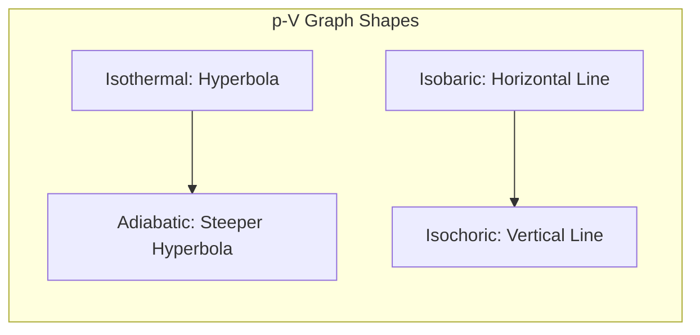

# 1. Overview / 概述

**English:**
This sub-topic explores the four fundamental thermodynamic processes that describe how a gas can change from one state to another: **isothermal** (constant temperature), **adiabatic** (no heat exchange), **isobaric** (constant pressure), and **isochoric** (constant volume). These processes are essential for understanding how energy is transferred as heat and work in thermodynamic systems. They form the practical application of the [[First Law of Thermodynamics]] and are directly linked to the behavior of [[Ideal Gases]]. Understanding these processes allows you to predict how pressure, volume, and temperature change under specific constraints, and to calculate the work done and internal energy change for each case. This is a core topic in [[Internal Energy and the First Law]] and is frequently tested in both CAIE and Edexcel exams.

**中文:**
本子知识点探讨了描述气体如何从一种状态变化到另一种状态的四种基本热力学过程：**等温**（温度恒定）、**绝热**（无热交换）、**等压**（压强恒定）和**等容**（体积恒定）。这些过程对于理解能量如何在热力学系统中以热量和功的形式传递至关重要。它们是[[热力学第一定律]]的实际应用，并与[[理想气体]]的行为直接相关。理解这些过程可以让你预测在特定约束条件下压强、体积和温度如何变化，并计算每种情况下的做功和内能变化。这是[[内能与热力学第一定律]]中的核心主题，在CAIE和Edexcel考试中经常出现。

---

# 2. Syllabus Learning Objectives / 考纲学习目标

| CAIE 9702 (10.4) | Edexcel IAL (WPH11 U1: 5.13-5.16) |
|-----------|-------------|
| (a) Show an understanding that for an **isothermal** change of an ideal gas, the change of internal energy is zero, and that the work done by the gas equals the heat supplied to it. | Understand that for an **isothermal** change of an ideal gas, the change in internal energy is zero, and the work done by the gas equals the heat supplied. |
| (b) Show an understanding that for an **adiabatic** change of an ideal gas, the heat transfer is zero, and that the work done is equal to the change in internal energy. | Understand that for an **adiabatic** change of an ideal gas, the heat transfer is zero, and the work done equals the change in internal energy. |
| (c) Show an understanding that for a **constant pressure (isobaric)** change, the work done is $p\Delta V$. | Understand that for a **constant pressure (isobaric)** change, the work done is $p\Delta V$. |
| (d) Show an understanding that for a **constant volume (isochoric)** change, no work is done. | Understand that for a **constant volume (isochoric)** change, no work is done. |

**Examiner Expectations / 考官期望:**
- **English:** You must be able to identify each process from a graph (p-V, p-T, V-T), calculate work done from the area under a p-V graph, and apply the First Law ($\Delta U = Q + W$) with the correct sign convention. For CAIE, the sign convention is: $W$ is positive when work is done *on* the gas. For Edexcel, the sign convention may vary; always check the question.
- **中文:** 你必须能够从图表（p-V、p-T、V-T）中识别每个过程，根据p-V图下的面积计算做功，并应用热力学第一定律（$\Delta U = Q + W$）并采用正确的符号约定。对于CAIE，约定是：当对气体做功时，$W$为正。对于Edexcel，符号约定可能不同；务必检查题目要求。

---

# 3. Core Definitions / 核心定义

| Term (EN/CN) | Definition (EN) | Definition (CN) | Common Mistakes / 常见错误 |
|--------------|-----------------|-----------------|---------------------------|
| **Isothermal Process** / 等温过程 | A thermodynamic change that occurs at **constant temperature**. For an ideal gas, $\Delta U = 0$. | 在**恒定温度**下发生的热力学变化。对于理想气体，$\Delta U = 0$。 | Confusing "isothermal" with "adiabatic". Remember: isothermal = constant T, adiabatic = no Q. |
| **Adiabatic Process** / 绝热过程 | A thermodynamic change in which **no heat** enters or leaves the system ($Q = 0$). | 系统**没有热量**进入或离开的热力学变化（$Q = 0$）。 | Thinking adiabatic means constant temperature. It does not; temperature changes because work is done. |
| **Isobaric Process** / 等压过程 | A thermodynamic change that occurs at **constant pressure**. Work done is $W = p\Delta V$. | 在**恒定压强**下发生的热力学变化。做功为 $W = p\Delta V$。 | Forgetting that $p$ is constant, so work is simply $p\Delta V$, not an integral. |
| **Isochoric Process** / 等容过程 | A thermodynamic change that occurs at **constant volume**. No work is done ($W = 0$). | 在**恒定体积**下发生的热力学变化。不做功（$W = 0$）。 | Thinking that because volume is constant, no energy change occurs. Heat can still change internal energy. |
| **Work Done by/on a Gas** / 气体做功/对气体做功 | Work done **by** the gas is positive when the gas expands; work done **on** the gas is positive when the gas is compressed. | 气体膨胀时，气体**对外**做功为正；气体被压缩时，**对气体**做功为正。 | Sign convention confusion. Always check the exam board's convention. |

---

# 4. Key Concepts Explained / 关键概念详解

## 4.1 Isothermal Process / 等温过程

### Explanation / 解释
**English:** An isothermal process occurs at **constant temperature**. For an [[Ideal Gases|ideal gas]], internal energy depends only on temperature ($U \propto T$). Therefore, $\Delta U = 0$. Applying the [[First Law of Thermodynamics]] ($\Delta U = Q + W$), we get $0 = Q + W$, so $Q = -W$. This means that the heat supplied to the gas equals the work done *by* the gas (if expanding) or the work done *on* the gas equals the heat removed (if compressing). The relationship between pressure and volume follows [[Boyle's Law]]: $pV = \text{constant}$.

**中文:** 等温过程发生在**恒定温度**下。对于[[理想气体]]，内能仅取决于温度（$U \propto T$）。因此，$\Delta U = 0$。应用[[热力学第一定律]]（$\Delta U = Q + W$），我们得到 $0 = Q + W$，所以 $Q = -W$。这意味着供给气体的热量等于气体**对外**做的功（如果膨胀），或者对气体做的功等于移除的热量（如果压缩）。压强和体积之间的关系遵循[[玻意耳定律]]：$pV = \text{常数}$。

### Physical Meaning / 物理意义
**English:** The gas expands or compresses slowly enough that heat can flow in or out to maintain a constant temperature. For expansion, the gas does work, so it would cool down, but heat flows in from the surroundings to keep the temperature constant.
**中文:** 气体膨胀或压缩得足够慢，以至于热量可以流入或流出以维持恒定温度。对于膨胀，气体做功，因此会冷却，但热量从周围环境流入以保持温度恒定。

### Common Misconceptions / 常见误区
- **English:** Thinking that isothermal means no energy change. Energy is transferred as heat and work, but internal energy is constant.
- **中文:** 认为等温意味着没有能量变化。能量以热量和功的形式传递，但内能是恒定的。
- **English:** Confusing the p-V graph shape: isothermal is a hyperbola ($p \propto 1/V$), not a straight line.
- **中文:** 混淆p-V图形状：等温线是双曲线（$p \propto 1/V$），不是直线。

### Exam Tips / 考试提示
- **English:** For CAIE, remember that for an isothermal expansion, $W$ (work done on gas) is negative, so $Q$ is positive (heat supplied). For Edexcel, check the sign convention used in the question.
- **中文:** 对于CAIE，记住对于等温膨胀，$W$（对气体做功）为负，所以$Q$为正（热量供给）。对于Edexcel，检查题目中使用的符号约定。

> 📷 **IMAGE PROMPT — ISOTHERMAL: p-V Graph for Isothermal Expansion**
> A p-V diagram showing a hyperbolic curve labeled "Isothermal" at temperature T. The curve shows pressure decreasing as volume increases. An arrow indicates the direction of expansion. The area under the curve is shaded to represent work done by the gas. Labels: p (Pa), V (m³), T = constant.

## 4.2 Adiabatic Process / 绝热过程

### Explanation / 解释
**English:** An adiabatic process occurs with **no heat transfer** ($Q = 0$). Applying the First Law: $\Delta U = 0 + W = W$. This means that the work done *on* the gas equals the increase in internal energy (temperature rises), and the work done *by* the gas equals the decrease in internal energy (temperature falls). The relationship is $pV^\gamma = \text{constant}$, where $\gamma = C_p/C_v$ (ratio of specific heat capacities). For a monatomic ideal gas, $\gamma = 5/3$.

**中文:** 绝热过程发生在**无热传递**的情况下（$Q = 0$）。应用热力学第一定律：$\Delta U = 0 + W = W$。这意味着对气体做的功等于内能的增加（温度升高），气体对外做的功等于内能的减少（温度下降）。关系式为 $pV^\gamma = \text{常数}$，其中 $\gamma = C_p/C_v$（比热容比）。对于单原子理想气体，$\gamma = 5/3$。

### Physical Meaning / 物理意义
**English:** The process happens so quickly (or the system is so well insulated) that no heat can enter or leave. For compression, the gas heats up (e.g., diesel engine). For expansion, the gas cools down (e.g., gas escaping from a can).
**中文:** 过程发生得非常快（或者系统隔热非常好），以至于没有热量可以进入或离开。对于压缩，气体升温（例如柴油发动机）。对于膨胀，气体冷却（例如气体从罐中逸出）。

### Common Misconceptions / 常见误区
- **English:** Thinking adiabatic means constant temperature. It does not; temperature changes because work is done.
- **中文:** 认为绝热意味着温度恒定。不是的；因为做功，温度会变化。
- **English:** Confusing the p-V graph: an adiabatic curve is steeper than an isothermal curve.
- **中文:** 混淆p-V图：绝热线比等温线更陡。

### Exam Tips / 考试提示
- **English:** You are not required to derive $pV^\gamma = \text{constant}$ at AS level, but you must know that the curve is steeper than an isothermal.
- **中文:** 在AS阶段不需要推导 $pV^\gamma = \text{常数}$，但必须知道曲线比等温线更陡。

> 📷 **IMAGE PROMPT — ADIABATIC: p-V Graph Comparing Isothermal and Adiabatic**
> A p-V diagram showing two curves starting from the same initial point. The isothermal curve (dashed line) is a hyperbola. The adiabatic curve (solid line) is steeper, showing a faster drop in pressure for the same volume change. Labels: Isothermal (T=constant), Adiabatic (Q=0), Initial State A.

## 4.3 Isobaric Process / 等压过程

### Explanation / 解释
**English:** An isobaric process occurs at **constant pressure**. Work done is simply $W = p\Delta V$, where $\Delta V = V_f - V_i$. For expansion ($\Delta V > 0$), work is done *by* the gas. For compression ($\Delta V < 0$), work is done *on* the gas. The First Law applies: $\Delta U = Q + W$. The heat supplied is used both to do work and to change internal energy.

**中文:** 等压过程发生在**恒定压强**下。做功简单地为 $W = p\Delta V$，其中 $\Delta V = V_f - V_i$。对于膨胀（$\Delta V > 0$），气体对外做功。对于压缩（$\Delta V < 0$），对气体做功。热力学第一定律适用：$\Delta U = Q + W$。供给的热量既用于做功，也用于改变内能。

### Physical Meaning / 物理意义
**English:** The gas expands or compresses against a constant external pressure (e.g., a piston with a constant weight on top). The pressure remains constant throughout.
**中文:** 气体在恒定的外部压强下膨胀或压缩（例如，顶部有恒定重量的活塞）。压强在整个过程中保持恒定。

### Common Misconceptions / 常见误区
- **English:** Forgetting that $W = p\Delta V$ only applies when pressure is constant. For non-constant pressure, you must integrate.
- **中文:** 忘记 $W = p\Delta V$ 仅在压强恒定时适用。对于非恒定压强，必须进行积分。

### Exam Tips / 考试提示
- **English:** On a p-V graph, an isobaric process is a horizontal line. The area under this line (a rectangle) equals the work done.
- **中文:** 在p-V图上，等压过程是一条水平线。这条线下的面积（一个矩形）等于所做的功。

## 4.4 Isochoric Process / 等容过程

### Explanation / 解释
**English:** An isochoric process occurs at **constant volume**. Since volume does not change, no work is done ($W = 0$). Applying the First Law: $\Delta U = Q + 0 = Q$. This means that all heat supplied to the gas goes into increasing its internal energy (and thus its temperature). Conversely, heat removed from the gas decreases its internal energy.

**中文:** 等容过程发生在**恒定体积**下。由于体积不变，不做功（$W = 0$）。应用热力学第一定律：$\Delta U = Q + 0 = Q$。这意味着供给气体的所有热量都用于增加其内能（从而升高温度）。相反，从气体中移除的热量会减少其内能。

### Physical Meaning / 物理意义
**English:** The gas is contained in a rigid container (e.g., a sealed metal can). Heating the gas increases its pressure and temperature, but the volume remains fixed.
**中文:** 气体被封闭在刚性容器中（例如，密封的金属罐）。加热气体会增加其压强和温度，但体积保持不变。

### Common Misconceptions / 常见误区
- **English:** Thinking that because no work is done, no energy change occurs. Heat can still change internal energy.
- **中文:** 认为因为不做功，所以没有能量变化。热量仍然可以改变内能。

### Exam Tips / 考试提示
- **English:** On a p-V graph, an isochoric process is a vertical line. The area under this line is zero, confirming $W = 0$.
- **中文:** 在p-V图上，等容过程是一条垂直线。这条线下的面积为零，确认 $W = 0$。

---

# 5. Essential Equations / 核心公式

## Equation 1: First Law of Thermodynamics / 热力学第一定律

$$ \Delta U = Q + W $$

| Symbol (符号) | Meaning (EN) | Meaning (CN) | Unit (单位) |
|--------------|-------------|-------------|------------|
| $\Delta U$ | Change in internal energy | 内能变化 | J |
| $Q$ | Heat supplied to the system | 系统吸收的热量 | J |
| $W$ | Work done *on* the system | 对系统做的功 | J |

**Sign Convention / 符号约定:**
- **CAIE:** $W$ is positive when work is done *on* the gas (compression). $Q$ is positive when heat is supplied *to* the gas.
- **Edexcel:** Check the question; some use $W$ as work done *by* the gas, so $\Delta U = Q - W$. Always read carefully.

## Equation 2: Work Done at Constant Pressure / 等压做功

$$ W = p\Delta V $$

| Symbol (符号) | Meaning (EN) | Meaning (CN) | Unit (单位) |
|--------------|-------------|-------------|------------|
| $p$ | Constant pressure | 恒定压强 | Pa |
| $\Delta V$ | Change in volume ($V_f - V_i$) | 体积变化 | m³ |

**Conditions / 适用条件:** Only for isobaric processes.
**Limitations / 局限性:** Does not apply if pressure changes.

## Equation 3: Isothermal Relationship / 等温关系

$$ pV = \text{constant} $$

| Symbol (符号) | Meaning (EN) | Meaning (CN) | Unit (单位) |
|--------------|-------------|-------------|------------|
| $p$ | Pressure | 压强 | Pa |
| $V$ | Volume | 体积 | m³ |

**Conditions / 适用条件:** For an ideal gas undergoing an isothermal process.
**Limitations / 局限性:** Only valid for ideal gases at constant temperature.

## Equation 4: Adiabatic Relationship / 绝热关系

$$ pV^\gamma = \text{constant} $$

| Symbol (符号) | Meaning (EN) | Meaning (CN) | Unit (单位) |
|--------------|-------------|-------------|------------|
| $p$ | Pressure | 压强 | Pa |
| $V$ | Volume | 体积 | m³ |
| $\gamma$ | Ratio of specific heats ($C_p/C_v$) | 比热容比 | dimensionless |

**Conditions / 适用条件:** For an ideal gas undergoing an adiabatic process.
**Limitations / 局限性:** $\gamma$ depends on the gas (monatomic: 5/3, diatomic: 7/5).

---

# 6. Graphs and Relationships / 图表与关系

## 6.1 p-V Graph for All Four Processes / 四种过程的p-V图

### Axes / 坐标轴
- x-axis: Volume / 体积 $V$ (m³)
- y-axis: Pressure / 压强 $p$ (Pa)

### Shape / 形状
| Process | Shape on p-V Graph | Description |
|---------|-------------------|-------------|
| Isothermal | Hyperbola ($p \propto 1/V$) | Curved, decreasing |
| Adiabatic | Steeper hyperbola ($p \propto 1/V^\gamma$) | Curved, steeper than isothermal |
| Isobaric | Horizontal line | Constant pressure |
| Isochoric | Vertical line | Constant volume |

### Gradient Meaning / 斜率含义
- **Isothermal:** Gradient is negative and becomes less steep as volume increases.
- **Adiabatic:** Gradient is more negative than isothermal at the same point.
- **Isobaric:** Gradient = 0 (horizontal).
- **Isochoric:** Gradient is infinite (vertical).

### Area Meaning / 面积含义
The area **under** the p-V curve represents the **work done by the gas** (for expansion) or **work done on the gas** (for compression).

### Exam Interpretation / 考试解读
- **English:** Be able to identify which process is shown from the shape of the curve. Remember that adiabatic is steeper than isothermal. The area under the curve is the work done.
- **中文:** 能够根据曲线的形状识别所示的过程。记住绝热线比等温线更陡。曲线下的面积是所做的功。



> 📷 **IMAGE PROMPT — PV_GRAPH: p-V Diagram with All Four Processes**
> A p-V diagram showing four distinct curves. A horizontal line (isobaric) at constant pressure. A vertical line (isochoric) at constant volume. Two hyperbolic curves starting from the same point: one labeled "Isothermal" (less steep) and one labeled "Adiabatic" (steeper). Arrows indicate direction of expansion. The area under the isobaric line is shaded as a rectangle.

---

# 7. Required Diagrams / 必备图表

## 7.1 p-V Diagram for Isothermal vs Adiabatic Expansion / 等温与绝热膨胀的p-V图

### Description / 描述
**English:** A p-V diagram comparing an isothermal expansion and an adiabatic expansion from the same initial state. The isothermal curve is a hyperbola ($pV = \text{constant}$), while the adiabatic curve is steeper ($pV^\gamma = \text{constant}$). The area under each curve represents the work done by the gas. The adiabatic curve ends at a lower pressure for the same final volume, indicating more work is done in the isothermal process (since heat is supplied to maintain temperature).

**中文:** 一个比较从相同初始状态开始的等温膨胀和绝热膨胀的p-V图。等温线是双曲线（$pV = \text{常数}$），而绝热线更陡（$pV^\gamma = \text{常数}$）。每条曲线下的面积代表气体所做的功。对于相同的最终体积，绝热线结束于较低的压强，表明等温过程中做了更多的功（因为供给热量以维持温度）。

### Image Prompt / 图片生成提示
> 📷 **IMAGE PROMPT — ISOTHERMAL_VS_ADIABATIC: p-V Diagram Comparing Isothermal and Adiabatic Expansion**
> A p-V diagram with two curves starting from the same initial point (high pressure, low volume). The isothermal curve (dashed line, labeled "Isothermal, T=constant") is a smooth hyperbola. The adiabatic curve (solid line, labeled "Adiabatic, Q=0") is steeper, crossing below the isothermal curve. Both curves end at the same final volume. The area under the isothermal curve is shaded in light blue, and the area under the adiabatic curve is shaded in light red. Labels: Initial State A, Final State B (isothermal), Final State C (adiabatic). Axes: p (Pa), V (m³).

### Labels Required / 需要标注
- Initial state (A)
- Final state for isothermal (B)
- Final state for adiabatic (C)
- Isothermal curve label: "Isothermal (T = constant)"
- Adiabatic curve label: "Adiabatic (Q = 0)"
- Shaded areas for work done

### Exam Importance / 考试重要性
- **English:** High. This comparison is a common exam question. You must be able to explain why the adiabatic curve is steeper and why more work is done in the isothermal process.
- **中文:** 高。这种比较是常见的考试题目。你必须能够解释为什么绝热线更陡，以及为什么等温过程中做了更多的功。

## 7.2 p-V Diagram for a Complete Cycle / 完整循环的p-V图

### Description / 描述
**English:** A p-V diagram showing a complete thermodynamic cycle consisting of multiple processes (e.g., isobaric expansion, isochoric cooling, isobaric compression, isochoric heating). The net work done in the cycle is the area enclosed by the cycle. This is a common way to represent heat engines.

**中文:** 一个显示由多个过程组成的完整热力学循环的p-V图（例如，等压膨胀、等容冷却、等压压缩、等容加热）。循环中做的净功是循环所包围的面积。这是表示热机的常见方式。

### Image Prompt / 图片生成提示
> 📷 **IMAGE PROMPT — CYCLE: p-V Diagram of a Thermodynamic Cycle**
> A p-V diagram showing a rectangular cycle. Starting from bottom-left: horizontal line to the right (isobaric expansion, A→B), vertical line upward (isochoric heating, B→C), horizontal line to the left (isobaric compression, C→D), vertical line downward (isochoric cooling, D→A). The area inside the rectangle is shaded to represent net work done. Arrows indicate direction. Labels: A, B, C, D. Axes: p (Pa), V (m³).

### Labels Required / 需要标注
- Each state (A, B, C, D)
- Each process (isobaric expansion, isochoric heating, etc.)
- Shaded area for net work

### Exam Importance / 考试重要性
- **English:** Medium. Understanding cycles is important for heat engines, but at AS level, the focus is on individual processes.
- **中文:** 中等。理解循环对于热机很重要，但在AS阶段，重点是单个过程。

---

# 8. Worked Examples / 典型例题

## Example 1: Identifying Processes from a p-V Graph / 从p-V图中识别过程

### Question / 题目
**English:** A gas undergoes a change from state A to state B along the path shown in the p-V diagram below. The path is a horizontal line at constant pressure of $2.0 \times 10^5$ Pa, and the volume increases from $1.0 \times 10^{-3}$ m³ to $3.0 \times 10^{-3}$ m³.
(a) Identify the type of thermodynamic process.
(b) Calculate the work done by the gas.
(c) If the internal energy of the gas increases by 500 J during this process, calculate the heat supplied to the gas.

**中文:** 一种气体沿着下图所示的p-V图中的路径从状态A变化到状态B。该路径是在恒定压强 $2.0 \times 10^5$ Pa 下的水平线，体积从 $1.0 \times 10^{-3}$ m³ 增加到 $3.0 \times 10^{-3}$ m³。
(a) 识别热力学过程的类型。
(b) 计算气体所做的功。
(c) 如果在此过程中气体的内能增加了500 J，计算供给气体的热量。

### Solution / 解答

**(a) Identify the process / 识别过程:**
**English:** The process occurs at constant pressure. Therefore, it is an **isobaric process**.
**中文:** 该过程发生在恒定压强下。因此，它是一个**等压过程**。

**(b) Calculate work done / 计算做功:**
**English:** For an isobaric process, $W = p\Delta V$.
**中文:** 对于等压过程，$W = p\Delta V$。

$$ \Delta V = V_f - V_i = (3.0 \times 10^{-3}) - (1.0 \times 10^{-3}) = 2.0 \times 10^{-3} \text{ m}^3 $$

$$ W = p\Delta V = (2.0 \times 10^5) \times (2.0 \times 10^{-3}) = 400 \text{ J} $$

**English:** The work done *by* the gas is 400 J. Using the CAIE convention (work done *on* gas is positive), $W = -400$ J (since the gas expands, work is done *by* the gas).
**中文:** 气体**对外**做的功是400 J。使用CAIE约定（对气体做功为正），$W = -400$ J（因为气体膨胀，气体对外做功）。

**(c) Calculate heat supplied / 计算供给的热量:**
**English:** Apply the First Law: $\Delta U = Q + W$.
**中文:** 应用热力学第一定律：$\Delta U = Q + W$。

$$ 500 = Q + (-400) $$

$$ Q = 500 + 400 = 900 \text{ J} $$

**English:** The heat supplied to the gas is 900 J.
**中文:** 供给气体的热量是900 J。

### Final Answer / 最终答案
**Answer:** (a) Isobaric process; (b) 400 J (work done by gas); (c) 900 J | **答案：** (a) 等压过程；(b) 400 J（气体对外做功）；(c) 900 J

### Quick Tip / 提示
- **English:** Always check the sign convention. In this example, we used CAIE convention ($W$ positive for work done *on* gas). For Edexcel, if the question uses $W$ as work done *by* gas, then $\Delta U = Q - W$, and you would get $500 = Q - 400$, so $Q = 900$ J (same answer, different equation).
- **中文:** 始终检查符号约定。在这个例子中，我们使用了CAIE约定（$W$ 对气体做功为正）。对于Edexcel，如果题目使用 $W$ 作为气体对外做功，那么 $\Delta U = Q - W$，你会得到 $500 = Q - 400$，所以 $Q = 900$ J（答案相同，方程不同）。

## Example 2: Adiabatic Compression / 绝热压缩

### Question / 题目
**English:** An ideal gas is compressed adiabatically. The work done on the gas is 200 J.
(a) State the value of $Q$ for this process.
(b) Calculate the change in internal energy of the gas.
(c) State and explain whether the temperature of the gas increases, decreases, or remains constant.

**中文:** 理想气体被绝热压缩。对气体做的功是200 J。
(a) 说明此过程中 $Q$ 的值。
(b) 计算气体内能的变化。
(c) 说明并解释气体的温度是升高、降低还是保持不变。

### Solution / 解答

**(a) Value of Q / Q的值:**
**English:** For an adiabatic process, no heat transfer occurs. Therefore, $Q = 0$.
**中文:** 对于绝热过程，不发生热传递。因此，$Q = 0$。

**(b) Change in internal energy / 内能变化:**
**English:** Apply the First Law: $\Delta U = Q + W = 0 + 200 = 200$ J.
**中文:** 应用热力学第一定律：$\Delta U = Q + W = 0 + 200 = 200$ J。

**(c) Temperature change / 温度变化:**
**English:** The internal energy of an ideal gas is directly proportional to its absolute temperature ($U \propto T$). Since $\Delta U$ is positive (200 J), the internal energy increases, so the temperature **increases**. This makes sense physically: compressing the gas does work on it, and since no heat can escape, the energy goes into increasing the kinetic energy of the molecules, raising the temperature.

**中文:** 理想气体的内能与其绝对温度成正比（$U \propto T$）。由于 $\Delta U$ 为正（200 J），内能增加，因此温度**升高**。这在物理上是合理的：压缩气体对气体做功，由于热量无法散失，能量转化为增加分子的动能，从而升高温度。

### Final Answer / 最终答案
**Answer:** (a) $Q = 0$; (b) $\Delta U = 200$ J; (c) Temperature increases because internal energy increases. | **答案：** (a) $Q = 0$; (b) $\Delta U = 200$ J; (c) 温度升高，因为内能增加。

### Quick Tip / 提示
- **English:** For adiabatic compression, temperature always rises. For adiabatic expansion, temperature always falls. This is a key concept.
- **中文:** 对于绝热压缩，温度总是升高。对于绝热膨胀，温度总是降低。这是一个关键概念。

---

# 9. Past Paper Question Types / 历年真题题型

| Question Type / 题型 | Frequency / 频率 | Difficulty / 难度 | Past Paper References / 真题索引 |
|----------------------|------------------|------------------|-------------------------------|
| Identify process from p-V graph | High | Easy | 📝 *待填入* |
| Calculate work done from p-V graph area | High | Medium | 📝 *待填入* |
| Apply First Law to a specific process | High | Medium | 📝 *待填入* |
| Compare isothermal and adiabatic processes | Medium | Hard | 📝 *待填入* |
| Describe energy changes in a cycle | Low | Hard | 📝 *待填入* |

**Common Command Words / 常见指令词:**
- **English:** State, Calculate, Explain, Describe, Show, Determine, Sketch
- **中文:** 说明、计算、解释、描述、证明、确定、画出草图

---

# 10. Practical Skills Connections / 实验技能链接

**English:**
This sub-topic connects to practical work in several ways:
1. **p-V Measurements:** In a practical experiment, you might use a pressure sensor and a volume scale to measure the pressure and volume of a gas as it expands or compresses. Plotting a p-V graph allows you to identify the type of process.
2. **Work Done Calculation:** The area under a p-V graph can be estimated by counting squares or using integration. This is a key graph interpretation skill.
3. **Uncertainties:** When measuring pressure and volume, you must consider uncertainties. For example, if pressure is measured with a sensor of $\pm 0.1$ kPa, the work done calculation will have an associated uncertainty.
4. **Experimental Design:** To achieve an isothermal process, the expansion must be slow (e.g., using a slow-moving piston). To achieve an adiabatic process, the expansion must be fast (e.g., quickly releasing a valve) or the system must be well insulated.

**中文:**
本子知识点在多个方面与实验工作相关：
1. **p-V测量：** 在实验中，你可能使用压强传感器和体积刻度来测量气体膨胀或压缩时的压强和体积。绘制p-V图可以识别过程的类型。
2. **做功计算：** p-V图下的面积可以通过数方格或使用积分来估算。这是一项关键的图表解读技能。
3. **不确定度：** 测量压强和体积时，必须考虑不确定度。例如，如果使用精度为 $\pm 0.1$ kPa的传感器测量压强，做功计算将具有相关的不确定度。
4. **实验设计：** 为了实现等温过程，膨胀必须缓慢（例如，使用缓慢移动的活塞）。为了实现绝热过程，膨胀必须快速（例如，快速释放阀门）或者系统必须隔热良好。

---

# 11. Concept Map / 概念图谱

```mermaid
graph TD
    %% Core Topic
    A[Thermodynamic Processes] --> B[Isothermal]
    A --> C[Adiabatic]
    A --> D[Isobaric]
    A --> E[Isochoric]

    %% Key Properties
    B --> F[Constant Temperature]
    B --> G[ΔU = 0]
    B --> H[Q = -W]
    B --> I[pV = constant]

    C --> J[No Heat Transfer (Q = 0)]
    C --> K[ΔU = W]
    C --> L[pV^γ = constant]
    C --> M[Temperature Changes]

    D --> N[Constant Pressure]
    D --> O[W = pΔV]
    D --> P[Horizontal Line on p-V]

    E --> Q[Constant Volume]
    E --> R[W = 0]
    E --> S[ΔU = Q]
    E --> T[Vertical Line on p-V]

    %% Connections to other topics
    A --> U[[First Law of Thermodynamics]]
    A --> V[[Ideal Gases]]
    A --> W[[Internal Energy (KE + PE of molecules)]]
    A --> X[[Work Done by/on a Gas]]

    %% Prerequisites
    V --> Y[[Specific Heat Capacity and Latent Heat]]
    V --> Z[[Kinetic Theory of Gases]]
```

---

# 12. Quick Revision Sheet / 速查表

| Category / 类别 | Key Points / 要点 |
|----------------|------------------|
| **Definition / 定义** | **Isothermal:** Constant T, ΔU=0, Q=-W, pV=constant. **Adiabatic:** Q=0, ΔU=W, pV^γ=constant, T changes. **Isobaric:** Constant p, W=pΔV, horizontal line on p-V. **Isochoric:** Constant V, W=0, ΔU=Q, vertical line on p-V. |
| **Key Formula / 核心公式** | First Law: $\Delta U = Q + W$ (CAIE convention). Isobaric work: $W = p\Delta V$. Isothermal: $pV = \text{constant}$. Adiabatic: $pV^\gamma = \text{constant}$. |
| **Key Graph / 核心图表** | **p-V Graph:** Isothermal = hyperbola; Adiabatic = steeper hyperbola; Isobaric = horizontal line; Isochoric = vertical line. Area under curve = work done. |
| **Exam Tip / 考试提示** | Always check the sign convention for $W$ (CAIE: positive for work done *on* gas; Edexcel: may vary). Remember: adiabatic curve is steeper than isothermal. For isothermal, ΔU=0. For adiabatic, Q=0. For isochoric, W=0. For isobaric, W=pΔV. |