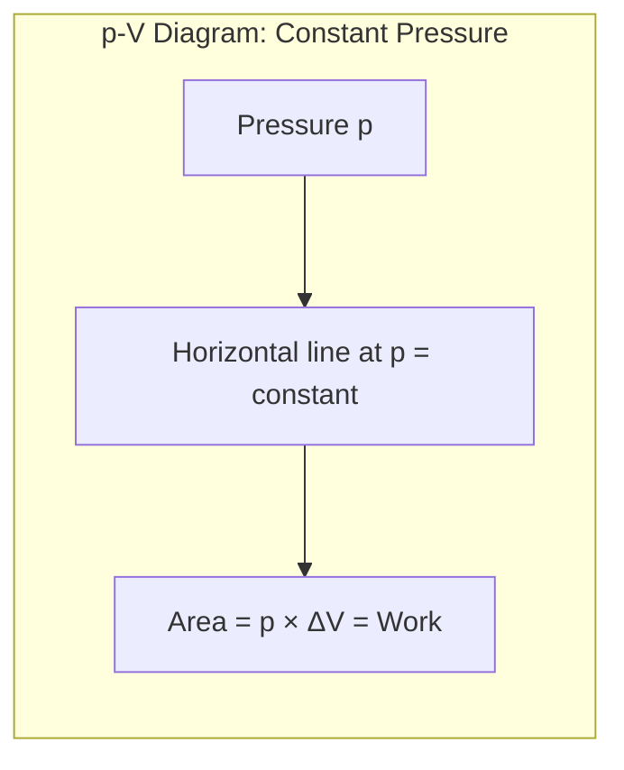

# 1. Overview / 概述

**English:**
This sub-topic focuses on the work done when a gas expands or is compressed. When a gas changes volume, it either does work on its surroundings (expansion) or has work done on it by the surroundings (compression). This work is a key component of the [[First Law of Thermodynamics]], which relates changes in internal energy to heat transfer and work. Understanding how to calculate work done by/on a gas is essential for analyzing thermodynamic processes like [[Isothermal, Adiabatic, Isobaric, and Isochoric Processes]]. This concept bridges the microscopic behavior of gas molecules (from [[Kinetic Theory of Gases]]) with macroscopic energy changes.

**中文:**
本子知识点专注于气体膨胀或压缩时所做的功。当气体体积发生变化时，它要么对外界做功（膨胀），要么外界对它做功（压缩）。这个功是[[热力学第一定律]]的关键组成部分，该定律将内能变化与热量传递和功联系起来。理解如何计算气体做功对于分析[[等温、绝热、等压和等容过程]]等热力学过程至关重要。这个概念将气体分子的微观行为（来自[[气体动理论]]）与宏观能量变化联系起来。

---

# 2. Syllabus Learning Objectives / 考纲学习目标

| CAIE 9702 | Edexcel IAL |
|-----------|-------------|
| 10.4(a) Recall and use $W = p\Delta V$ for work done when the volume of a gas changes at constant pressure | 5.13 Understand that work done on a gas is equivalent to the area under a pressure-volume graph |
| 10.4(b) Understand that work done = area under the $p$-$V$ graph | 5.14 Use $W = p\Delta V$ for work done at constant pressure |
| 10.4(c) Derive and use $W = p\Delta V$ from $W = F\Delta x$ | 5.15 Understand that for a gas, work done = area under $p$-$V$ graph |
| 10.4(d) Apply the first law to processes involving work done by/on a gas | 5.16 Apply the first law to processes involving work done by/on a gas |

**Examiner Expectations / 考官期望:**
- **English:** You must be able to derive $W = p\Delta V$ from $W = F\Delta x$, calculate work done for constant pressure processes, and interpret the area under a $p$-$V$ graph as work done. You should also apply the sign convention correctly in the [[First Law of Thermodynamics]].
- **中文:** 你必须能够从 $W = F\Delta x$ 推导出 $W = p\Delta V$，计算等压过程中的功，并将 $p$-$V$ 图下的面积解释为所做的功。你还应在[[热力学第一定律]]中正确应用符号约定。

---

# 3. Core Definitions / 核心定义

| Term (EN/CN) | Definition (EN) | Definition (CN) | Common Mistakes / 常见错误 |
|--------------|-----------------|-----------------|---------------------------|
| **Work done by a gas** / 气体对外做功 | The energy transferred when a gas expands against an external pressure, pushing the surroundings outward. | 气体在膨胀时克服外界压力推动外界向外移动所传递的能量。 | Confusing "by" and "on" — work done **by** gas is positive when gas expands. |
| **Work done on a gas** / 对气体做功 | The energy transferred when an external force compresses a gas, reducing its volume. | 当外力压缩气体、减小其体积时所传递的能量。 | Confusing "on" and "by" — work done **on** gas is positive when gas is compressed. |
| **$p$-$V$ diagram** / $p$-$V$ 图 | A graph showing pressure on the y-axis and volume on the x-axis; the area under the curve represents work done. | 以压力为纵轴、体积为横轴的图表；曲线下的面积表示所做的功。 | Forgetting that area = work only for reversible processes. |
| **Constant pressure process** / 等压过程 | A thermodynamic process where the pressure remains constant while volume changes. | 压力保持不变而体积发生变化的热力学过程。 | Using $W = p\Delta V$ for non-constant pressure processes without integration. |
| **Reversible process** / 可逆过程 | A process that can be reversed by an infinitesimal change in a variable, with no net change in system and surroundings. | 可以通过变量的微小变化而逆转的过程，系统和环境没有净变化。 | Assuming all real processes are reversible. |

---

# 4. Key Concepts Explained / 关键概念详解

## 4.1 Derivation of $W = p\Delta V$ / $W = p\Delta V$ 的推导

### Explanation / 解释
**English:**
Consider a gas trapped in a cylinder with a movable piston of cross-sectional area $A$. When the gas expands, it pushes the piston outward by a small distance $\Delta x$. The force exerted by the gas on the piston is $F = pA$, where $p$ is the gas pressure. The work done **by** the gas is:

$$W = F\Delta x = pA\Delta x$$

Since $A\Delta x = \Delta V$ (the change in volume), we get:

$$W = p\Delta V$$

This equation applies when pressure is **constant** during the volume change. For non-constant pressure, we must integrate: $W = \int_{V_1}^{V_2} p \, dV$, which equals the area under the $p$-$V$ graph.

**中文:**
考虑一个被困在带有可移动活塞的汽缸中的气体，活塞的横截面积为 $A$。当气体膨胀时，它将活塞向外推动一小段距离 $\Delta x$。气体施加在活塞上的力为 $F = pA$，其中 $p$ 是气体压力。气体**对外**做的功为：

$$W = F\Delta x = pA\Delta x$$

由于 $A\Delta x = \Delta V$（体积的变化量），我们得到：

$$W = p\Delta V$$

这个方程适用于体积变化过程中压力**恒定**的情况。对于非恒定压力，我们必须进行积分：$W = \int_{V_1}^{V_2} p \, dV$，这等于 $p$-$V$ 图下的面积。

### Physical Meaning / 物理意义
**English:** Work is a form of energy transfer. When a gas expands, it uses some of its internal energy to push the surroundings, so its internal energy decreases (if no heat is added). When a gas is compressed, work is done on it, increasing its internal energy (if no heat is lost).

**中文:** 功是一种能量传递形式。当气体膨胀时，它消耗部分内能来推动外界，因此其内能减少（如果没有热量加入）。当气体被压缩时，外界对它做功，增加其内能（如果没有热量散失）。

### Common Misconceptions / 常见误区
- **English:** 
  - Thinking $W = p\Delta V$ always applies, even when pressure changes.
  - Confusing the sign convention: work done **by** gas is positive in physics (gas loses energy), but in chemistry, work done **on** gas is often positive.
  - Believing that work done is zero if volume doesn't change (correct — but only for $p\Delta V$ work).
- **中文:**
  - 认为 $W = p\Delta V$ 总是适用，即使压力变化时也是如此。
  - 混淆符号约定：在物理学中，气体**对外**做功为正（气体失去能量），但在化学中，对气体做功通常为正。
  - 认为如果体积不变，做功为零（正确——但仅适用于 $p\Delta V$ 功）。

### Exam Tips / 考试提示
- **English:** Always state whether work is done **by** or **on** the gas. Use the correct sign in the [[First Law of Thermodynamics]]: $\Delta U = Q + W$ where $W$ is work done **on** the gas.
- **中文:** 始终说明功是气体**对外**做功还是**对**气体做功。在[[热力学第一定律]]中使用正确的符号：$\Delta U = Q + W$，其中 $W$ 是**对**气体做的功。

> 📷 **IMAGE PROMPT — DERIVATION: Piston-Cylinder Work Derivation**
> A clear diagram showing a gas-filled cylinder with a movable piston. Label the cross-sectional area A, the force F = pA acting on the piston, and the displacement Δx. Show the volume change ΔV = AΔx. Use arrows to indicate the direction of motion during expansion. Include labels: "Gas", "Piston", "Area A", "Force F = pA", "Displacement Δx".

---

## 4.2 Sign Convention for Work / 功的符号约定

### Explanation / 解释
**English:**
In A-Level Physics (both CAIE and Edexcel), the [[First Law of Thermodynamics]] is written as:

$$\Delta U = Q + W$$

Where:
- $\Delta U$ = change in internal energy
- $Q$ = heat added to the system (positive if heat enters)
- $W$ = work done **on** the system (positive if work is done **on** the gas)

Therefore:
- **Expansion:** Gas does work on surroundings → work done **on** gas is **negative** → $W < 0$
- **Compression:** Surroundings do work on gas → work done **on** gas is **positive** → $W > 0$
- **Constant volume:** No work done → $W = 0$

**中文:**
在 A-Level 物理（CAIE 和 Edexcel）中，[[热力学第一定律]]写为：

$$\Delta U = Q + W$$

其中：
- $\Delta U$ = 内能变化
- $Q$ = 加入系统的热量（热量进入为正）
- $W$ = **对**系统做的功（对气体做功为正）

因此：
- **膨胀：** 气体对外界做功 → 对气体做功为**负** → $W < 0$
- **压缩：** 外界对气体做功 → 对气体做功为**正** → $W > 0$
- **体积不变：** 不做功 → $W = 0$

### Common Misconceptions / 常见误区
- **English:** Many students incorrectly use $W = p\Delta V$ and forget the sign. Remember: if $\Delta V$ is positive (expansion), $W$ (work done **on** gas) is negative.
- **中文:** 许多学生错误地使用 $W = p\Delta V$ 而忘记符号。记住：如果 $\Delta V$ 为正（膨胀），则 $W$（对气体做功）为负。

### Exam Tips / 考试提示
- **English:** In calculations, first determine whether the gas expands or compresses. Then assign the correct sign to $W$ before plugging into $\Delta U = Q + W$.
- **中文:** 在计算中，首先确定气体是膨胀还是压缩。然后在代入 $\Delta U = Q + W$ 之前为 $W$ 分配正确的符号。

---

# 5. Essential Equations / 核心公式

## Equation 1: Work Done at Constant Pressure / 等压功

$$W = p\Delta V$$

| Symbol (符号) | Meaning (EN) | Meaning (CN) | Unit (单位) |
|--------------|-------------|-------------|------------|
| $W$ | Work done **on** the gas (use sign convention) | 对气体做的功（使用符号约定） | J (Joule) |
| $p$ | Pressure of the gas (assumed constant) | 气体压力（假设恒定） | Pa (Pascal) |
| $\Delta V$ | Change in volume ($V_2 - V_1$) | 体积变化 ($V_2 - V_1$) | m³ (cubic metre) |

**Derivation / 推导:**
$$W = F\Delta x = (pA)\Delta x = p(A\Delta x) = p\Delta V$$

**Conditions / 适用条件:**
- **English:** Pressure must be constant throughout the volume change. If pressure varies, use $W = \int p \, dV$ or area under $p$-$V$ graph.
- **中文:** 在整个体积变化过程中压力必须恒定。如果压力变化，使用 $W = \int p \, dV$ 或 $p$-$V$ 图下的面积。

**Limitations / 局限性:**
- **English:** Only valid for reversible processes where the gas is in equilibrium at each stage. For irreversible processes, the area under the $p$-$V$ graph does not equal the work done.
- **中文:** 仅适用于气体在每个阶段都处于平衡状态的可逆过程。对于不可逆过程，$p$-$V$ 图下的面积不等于所做的功。

## Equation 2: Work from $p$-$V$ Graph / 从 $p$-$V$ 图求功

$$W = \text{Area under } p\text{-}V \text{ graph}$$

**Conditions / 适用条件:**
- **English:** For any reversible process (constant or varying pressure). The area is found by integration or geometric methods.
- **中文:** 适用于任何可逆过程（恒定或变化压力）。通过积分或几何方法求面积。

> 📷 **IMAGE PROMPT — FORMULA: p-V Diagram Area**
> A p-V diagram showing a curve from point A (V₁, p₁) to point B (V₂, p₂). Shade the area under the curve between V₁ and V₂. Label the shaded region as "Work done = ∫p dV". Include axes labels: "Pressure p / Pa" on y-axis, "Volume V / m³" on x-axis.

---

# 6. Graphs and Relationships / 图表与关系

## 6.1 $p$-$V$ Diagram for Constant Pressure / 等压过程的 $p$-$V$ 图

### Axes / 坐标轴
- **x-axis:** Volume $V$ / m³ (体积 $V$ / m³)
- **y-axis:** Pressure $p$ / Pa (压力 $p$ / Pa)

### Shape / 形状
- **English:** A horizontal straight line (constant pressure). The area under the line is a rectangle.
- **中文:** 一条水平直线（恒定压力）。线下面积是一个矩形。

### Gradient Meaning / 斜率含义
- **English:** Gradient = 0 (pressure constant). No physical significance for work.
- **中文:** 斜率为 0（压力恒定）。对功没有物理意义。

### Area Meaning / 面积含义
- **English:** Area under the line = $p \times \Delta V$ = work done **by** the gas (if expanding) or work done **on** the gas (if compressing).
- **中文:** 线下面积 = $p \times \Delta V$ = 气体对外做的功（如果膨胀）或对气体做的功（如果压缩）。

### Exam Interpretation / 考试解读
- **English:** For an isobaric (constant pressure) expansion from $V_1$ to $V_2$, the work done by the gas is $W = p(V_2 - V_1)$. The area is a simple rectangle.
- **中文:** 对于从 $V_1$ 到 $V_2$ 的等压膨胀，气体对外做的功为 $W = p(V_2 - V_1)$。面积是一个简单的矩形。

---

## 6.2 $p$-$V$ Diagram for Varying Pressure / 变压过程的 $p$-$V$ 图

### Axes / 坐标轴
- **x-axis:** Volume $V$ / m³ (体积 $V$ / m³)
- **y-axis:** Pressure $p$ / Pa (压力 $p$ / Pa)

### Shape / 形状
- **English:** A curve (e.g., hyperbola for isothermal process). The area under the curve is found by integration.
- **中文:** 一条曲线（例如等温过程的双曲线）。曲线下的面积通过积分求得。

### Gradient Meaning / 斜率含义
- **English:** Gradient = $dp/dV$. Negative for expansion (pressure decreases as volume increases). Related to the process type.
- **中文:** 斜率 = $dp/dV$。膨胀时为负（压力随体积增加而减小）。与过程类型相关。

### Area Meaning / 面积含义
- **English:** Area under the curve = $\int_{V_1}^{V_2} p \, dV$ = work done **by** the gas (if expanding) or work done **on** the gas (if compressing).
- **中文:** 曲线下的面积 = $\int_{V_1}^{V_2} p \, dV$ = 气体对外做的功（如果膨胀）或对气体做的功（如果压缩）。

### Exam Interpretation / 考试解读
- **English:** For an isothermal expansion of an [[Ideal Gases|ideal gas]], $pV = \text{constant}$, so $p = k/V$. The work done is $W = \int_{V_1}^{V_2} \frac{k}{V} dV = k \ln\left(\frac{V_2}{V_1}\right) = nRT \ln\left(\frac{V_2}{V_1}\right)$.
- **中文:** 对于[[理想气体]]的等温膨胀，$pV = \text{常数}$，所以 $p = k/V$。所做的功为 $W = \int_{V_1}^{V_2} \frac{k}{V} dV = k \ln\left(\frac{V_2}{V_1}\right) = nRT \ln\left(\frac{V_2}{V_1}\right)$。

> 📷 **IMAGE PROMPT — GRAPH: p-V Diagram Isothermal vs Adiabatic**
> A p-V diagram showing two curves: an isothermal expansion (hyperbola, labeled "Isothermal") and an adiabatic expansion (steeper curve, labeled "Adiabatic"). Both start from the same initial point (V₁, p₁) and expand to the same final volume V₂. Shade the area under each curve. Label the areas as "Work done". Include axes labels.

---

# 7. Required Diagrams / 必备图表

## 7.1 Piston-Cylinder System for Work / 活塞-汽缸系统做功图

### Description / 描述
- **English:** A diagram showing a gas confined in a cylinder with a movable piston. The gas exerts pressure on the piston, and when it expands, the piston moves outward. The work done is the force times the distance moved.
- **中文:** 显示气体被限制在带有可移动活塞的汽缸中的示意图。气体对活塞施加压力，当气体膨胀时，活塞向外移动。所做的功等于力乘以移动的距离。

### Image Prompt / 图片生成提示
> 📷 **IMAGE PROMPT — DIAGRAM: Piston-Cylinder Work System**
> A cross-sectional diagram of a cylinder with a movable piston. The cylinder contains gas molecules (small circles) in random motion. Label: "Gas at pressure p", "Piston area A", "Force F = pA on piston". Show the piston moving to the right by distance Δx. Indicate the volume change ΔV = AΔx. Use arrows to show the direction of force and motion. Include a scale or dimensions for clarity.

### Labels Required / 需要标注
- **English:** Gas, Piston, Cylinder walls, Pressure $p$, Area $A$, Force $F = pA$, Displacement $\Delta x$, Volume change $\Delta V = A\Delta x$
- **中文:** 气体、活塞、汽缸壁、压力 $p$、面积 $A$、力 $F = pA$、位移 $\Delta x$、体积变化 $\Delta V = A\Delta x$

### Exam Importance / 考试重要性
- **English:** Essential for deriving $W = p\Delta V$ and understanding the physical meaning of work done by/on a gas. Frequently tested in derivation questions.
- **中文:** 对于推导 $W = p\Delta V$ 和理解气体做功的物理意义至关重要。常在推导题中考查。

---

## 7.2 $p$-$V$ Diagram with Work Area / 带功面积的 $p$-$V$ 图

### Description / 描述
- **English:** A $p$-$V$ diagram showing a thermodynamic process as a curve or line. The area under the curve between two volumes represents the work done by the gas during expansion (or on the gas during compression).
- **中文:** 显示热力学过程为曲线或直线的 $p$-$V$ 图。两个体积之间曲线下的面积表示膨胀过程中气体对外做的功（或压缩过程中对气体做的功）。

### Image Prompt / 图片生成提示
> 📷 **IMAGE PROMPT — DIAGRAM: p-V Diagram with Shaded Work Area**
> A p-V diagram with pressure on the y-axis and volume on the x-axis. Draw a smooth curve from point A (V₁, p₁) to point B (V₂, p₂) where V₂ > V₁ (expansion). Shade the area under the curve between V₁ and V₂. Label the shaded region as "Work done by gas = ∫p dV". Add a note: "Area = Work". Include gridlines for clarity.

### Labels Required / 需要标注
- **English:** Initial state $(V_1, p_1)$, Final state $(V_2, p_2)$, Shaded area = Work done, Process curve
- **中文:** 初始状态 $(V_1, p_1)$、最终状态 $(V_2, p_2)$、阴影面积 = 所做的功、过程曲线

### Exam Importance / 考试重要性
- **English:** Frequently tested — students must be able to interpret the area under a $p$-$V$ graph as work done. Also used to compare work done in different processes (e.g., isothermal vs adiabatic).
- **中文:** 经常考查——学生必须能够将 $p$-$V$ 图下的面积解释为所做的功。也用于比较不同过程中的功（例如等温与绝热）。

---

# 8. Worked Examples / 典型例题

## Example 1: Constant Pressure Expansion / 例1：等压膨胀

### Question / 题目
**English:**
A gas expands at a constant pressure of $2.0 \times 10^5$ Pa from a volume of $0.50$ m³ to $0.80$ m³. Calculate:
(a) The work done **by** the gas.
(b) The work done **on** the gas.
(c) If the internal energy of the gas increases by $4.0 \times 10^4$ J during this process, calculate the heat added to the gas.

**中文:**
气体在 $2.0 \times 10^5$ Pa 的恒定压力下从 $0.50$ m³ 膨胀到 $0.80$ m³。计算：
(a) 气体**对外**做的功。
(b) **对**气体做的功。
(c) 如果在此过程中气体内能增加了 $4.0 \times 10^4$ J，计算加入气体的热量。

### Solution / 解答

**Step 1: Calculate $\Delta V$**
$$\Delta V = V_2 - V_1 = 0.80 - 0.50 = 0.30 \text{ m}^3$$

**Step 2: Calculate work done by gas (part a)**
$$W_{\text{by gas}} = p\Delta V = (2.0 \times 10^5)(0.30) = 6.0 \times 10^4 \text{ J}$$

**Step 3: Calculate work done on gas (part b)**
Using sign convention: work done **on** gas = $-W_{\text{by gas}}$ (since expansion means gas does work on surroundings)
$$W_{\text{on gas}} = -6.0 \times 10^4 \text{ J}$$

**Step 4: Apply First Law (part c)**
$$\Delta U = Q + W$$
Where $W$ is work done **on** gas.
$$4.0 \times 10^4 = Q + (-6.0 \times 10^4)$$
$$Q = 4.0 \times 10^4 + 6.0 \times 10^4 = 1.0 \times 10^5 \text{ J}$$

### Final Answer / 最终答案
**Answer:**
(a) Work done by gas = $6.0 \times 10^4$ J
(b) Work done on gas = $-6.0 \times 10^4$ J
(c) Heat added = $1.0 \times 10^5$ J

**答案：**
(a) 气体对外做功 = $6.0 \times 10^4$ J
(b) 对气体做功 = $-6.0 \times 10^4$ J
(c) 加入热量 = $1.0 \times 10^5$ J

### Quick Tip / 提示
- **English:** Always check the sign! In part (c), the gas expands (does work), so $W$ is negative in $\Delta U = Q + W$. The internal energy increases despite the gas doing work, meaning a large amount of heat was added.
- **中文:** 始终检查符号！在部分 (c) 中，气体膨胀（对外做功），所以在 $\Delta U = Q + W$ 中 $W$ 为负。尽管气体对外做功，内能仍然增加，这意味着加入了大量热量。

---

## Example 2: Work from $p$-$V$ Graph / 例2：从 $p$-$V$ 图求功

### Question / 题目
**English:**
A gas undergoes a reversible expansion from state A ($V = 2.0$ m³, $p = 4.0 \times 10^5$ Pa) to state B ($V = 6.0$ m³, $p = 1.0 \times 10^5$ Pa). The process follows the relationship $pV = \text{constant}$. Calculate the work done **by** the gas.

**中文:**
气体从状态 A（$V = 2.0$ m³，$p = 4.0 \times 10^5$ Pa）可逆膨胀到状态 B（$V = 6.0$ m³，$p = 1.0 \times 10^5$ Pa）。该过程遵循 $pV = \text{常数}$ 的关系。计算气体**对外**做的功。

### Solution / 解答

**Step 1: Identify the constant**
$$pV = \text{constant} = (4.0 \times 10^5)(2.0) = 8.0 \times 10^5 \text{ J}$$

**Step 2: Express pressure as function of volume**
$$p = \frac{8.0 \times 10^5}{V}$$

**Step 3: Calculate work done by gas**
$$W_{\text{by gas}} = \int_{V_1}^{V_2} p \, dV = \int_{2.0}^{6.0} \frac{8.0 \times 10^5}{V} \, dV$$
$$= 8.0 \times 10^5 \left[ \ln V \right]_{2.0}^{6.0}$$
$$= 8.0 \times 10^5 (\ln 6.0 - \ln 2.0)$$
$$= 8.0 \times 10^5 \ln\left(\frac{6.0}{2.0}\right)$$
$$= 8.0 \times 10^5 \ln(3.0)$$
$$= 8.0 \times 10^5 \times 1.099$$
$$= 8.79 \times 10^5 \text{ J}$$

### Final Answer / 最终答案
**Answer:** Work done by gas = $8.79 \times 10^5$ J | **答案：** 气体对外做功 = $8.79 \times 10^5$ J

### Quick Tip / 提示
- **English:** For an isothermal process ($pV = \text{constant}$), use $W = nRT \ln(V_2/V_1)$ if you know $n$ and $T$. Here we used the constant directly from the given data.
- **中文:** 对于等温过程（$pV = \text{常数}$），如果你知道 $n$ 和 $T$，可以使用 $W = nRT \ln(V_2/V_1)$。这里我们直接从给定数据使用了常数。

---

# 9. Past Paper Question Types / 历年真题题型

| Question Type / 题型 | Frequency / 频率 | Difficulty / 难度 | Past Paper References / 真题索引 |
|----------------------|------------------|------------------|-------------------------------|
| Derivation of $W = p\Delta V$ | High | Easy | 📝 *待填入* |
| Calculation of work done at constant pressure | Very High | Easy | 📝 *待填入* |
| Work done from $p$-$V$ graph area | High | Medium | 📝 *待填入* |
| Applying First Law with work done by/on gas | Very High | Medium | 📝 *待填入* |
| Comparing work done in different processes | Medium | Hard | 📝 *待填入* |
| Work done in cyclic processes | Low | Hard | 📝 *待填入* |

**Common Command Words / 常见指令词:**
- **English:** Calculate, Derive, Determine, Show that, Sketch, State, Explain
- **中文:** 计算、推导、确定、证明、画出、说明、解释

---

# 10. Practical Skills Connections / 实验技能链接

**English:**
This sub-topic connects to practical work in several ways:

1. **Measuring Work Done:** In a practical setup, you can measure the force exerted by a gas on a piston and the displacement to calculate work. This involves using a pressure sensor and a motion sensor.

2. **$p$-$V$ Diagrams from Data:** You can collect pressure and volume data during a slow (quasi-static) expansion or compression and plot a $p$-$V$ graph. The area under the curve can be estimated using counting squares or trapezium rule.

3. **Uncertainties:** When calculating $W = p\Delta V$, uncertainties in pressure and volume measurements propagate. The percentage uncertainty in work is the sum of percentage uncertainties in $p$ and $\Delta V$.

4. **Graph Plotting:** Plotting $p$ vs $V$ and finding the area under the curve is a key skill. For non-linear graphs, use the trapezium rule: $\text{Area} \approx \frac{1}{2}\sum (p_i + p_{i+1})\Delta V$.

5. **Experimental Design:** To verify the First Law, you need to measure work done (from $p$-$V$ data), heat transfer (using calorimetry), and internal energy change (from temperature change and [[Specific Heat Capacity and Latent Heat|specific heat capacity]]).

**中文:**
本子知识点在多个方面与实验工作相关：

1. **测量做功：** 在实验装置中，你可以测量气体对活塞施加的力和位移来计算功。这涉及使用压力传感器和运动传感器。

2. **从数据绘制 $p$-$V$ 图：** 你可以在缓慢（准静态）膨胀或压缩过程中收集压力和体积数据，并绘制 $p$-$V$ 图。曲线下的面积可以使用数方格法或梯形法估算。

3. **不确定度：** 计算 $W = p\Delta V$ 时，压力和体积测量的不确定度会传递。功的百分比不确定度是 $p$ 和 $\Delta V$ 的百分比不确定度之和。

4. **绘图：** 绘制 $p$ 与 $V$ 的关系图并求曲线下的面积是一项关键技能。对于非线性图形，使用梯形法：$\text{面积} \approx \frac{1}{2}\sum (p_i + p_{i+1})\Delta V$。

5. **实验设计：** 要验证热力学第一定律，你需要测量所做的功（来自 $p$-$V$ 数据）、热量传递（使用量热法）和内能变化（来自温度变化和[[比热容与潜热|比热容]]）。

---

# 11. Concept Map / 概念图谱

```mermaid
graph TD
    %% Work Done by/on a Gas - Leaf Node Concept Map
    A["Work Done by/on a Gas"] --> B["Derivation: W = pΔV"]
    A --> C["Sign Convention"]
    A --> D["p-V Diagrams"]
    A --> E["First Law Application"]
    
    B --> B1["From W = FΔx"]
    B --> B2["F = pA"]
    B --> B3["ΔV = AΔx"]
    
    C --> C1["Expansion: W < 0 (on gas)"]
    C --> C2["Compression: W > 0 (on gas)"]
    C --> C3["Constant V: W = 0"]
    
    D --> D1["Area = Work done"]
    D --> D2["Constant p: Rectangle"]
    D --> D3["Varying p: Integration"]
    
    E --> E1["ΔU = Q + W"]
    E --> E2["Link to Internal Energy"]
    E --> E3["Link to Heat Transfer"]
    
    %% Links to parent and siblings
    A --> F["Parent: [[Internal Energy and the First Law]]"]
    A --> G["Sibling: [[Internal Energy (KE + PE of molecules)]]"]
    A --> H["Sibling: [[The First Law of Thermodynamics]]"]
    A --> I["Sibling: [[Isothermal, Adiabatic, Isobaric, and Isochoric Processes]]"]
    
    %% Prerequisites
    A --> J["Prerequisite: [[Specific Heat Capacity and Latent Heat]]"]
    
    %% Related topics
    A --> K["Related: [[Ideal Gases]]"]
    A --> L["Related: [[Kinetic Theory of Gases]]"]
```

---

# 12. Quick Revision Sheet / 速查表

| Category / 类别 | Key Points / 要点 |
|----------------|------------------|
| **Definition / 定义** | Work done by gas = energy transferred when gas expands against external pressure. Work done on gas = energy transferred when external force compresses gas. |
| **Key Formula / 核心公式** | $W = p\Delta V$ (constant pressure) or $W = \int p \, dV$ (varying pressure). Area under $p$-$V$ graph = work done. |
| **Sign Convention / 符号约定** | In $\Delta U = Q + W$, $W$ is work done **on** gas. Expansion: $W < 0$. Compression: $W > 0$. Constant V: $W = 0$. |
| **Key Graph / 核心图表** | $p$-$V$ diagram: x-axis = Volume, y-axis = Pressure. Area under curve = work done. Constant pressure = horizontal line. |
| **Derivation / 推导** | $W = F\Delta x = (pA)\Delta x = p(A\Delta x) = p\Delta V$ |
| **Common Mistake / 常见错误** | Forgetting sign convention; using $W = p\Delta V$ when pressure changes; confusing work done "by" vs "on" gas. |
| **Exam Tip / 考试提示** | Always state whether work is done **by** or **on** the gas. For $p$-$V$ graphs, shade the area and calculate using geometry or integration. |
| **Practical Link / 实验联系** | Use pressure sensor + motion sensor to collect $p$-$V$ data. Use trapezium rule to estimate area. Propagate uncertainties. |