# Kinetic Theory of Gases / 气体动理论

**File:** `vault/05-Thermal-Physics/02-Kinetic-Theory/Kinetic Theory of Gases.md`
**Hub Node:** Yes
**Level:** AS
**Difficulty:** Advanced

---

# 1. Overview / 概述

**English:**
The Kinetic Theory of Gases is a cornerstone of thermal physics that bridges the macroscopic world of measurable quantities (pressure, volume, temperature) with the microscopic world of individual gas molecules in constant, random motion. This theory provides a molecular-level explanation for the behaviour of an [[Ideal Gases|ideal gas]], deriving the ideal gas equation from first principles using Newtonian mechanics and statistical reasoning.

At its core, the theory models a gas as a vast number of tiny particles (molecules) moving randomly at high speeds, colliding elastically with each other and with the container walls. The pressure exerted by the gas is understood as the cumulative effect of countless molecular impacts on the walls per unit area. Temperature, in turn, is directly proportional to the average kinetic energy of these molecules.

This topic is profoundly important in both Cambridge 9702 and Edexcel IAL syllabuses. It develops essential skills in:
- **Mathematical modelling:** Deriving $$pV = \frac{1}{3} N m \langle c^2 \rangle$$ from assumptions.
- **Statistical reasoning:** Understanding averages like [[Root Mean Square Speed|root mean square speed]].
- **Conceptual linking:** Connecting [[Mean Kinetic Energy and Temperature|mean kinetic energy]] to absolute temperature via [[The Boltzmann Constant|the Boltzmann constant]].

Real-world applications include understanding atmospheric pressure, designing pressure vessels, explaining how hot air balloons rise, and forming the basis for more advanced topics like [[Internal Energy and the First Law|internal energy]] and thermodynamics.

**中文:**
气体动理论是热物理学的基石，它架起了宏观可测量量（压力、体积、温度）与微观世界中不断随机运动的单个气体分子之间的桥梁。该理论利用牛顿力学和统计推理，从基本原理出发，为[[理想气体]]的行为提供了分子层面的解释，推导出理想气体状态方程。

该理论的核心是将气体建模为大量微小粒子（分子），它们以高速随机运动，彼此之间以及与容器壁发生弹性碰撞。气体对容器壁施加的压力被理解为无数分子撞击单位面积壁面的累积效应。而温度则与这些分子的平均动能成正比。

这个话题在剑桥 9702 和爱德思 IAL 教学大纲中都极为重要。它培养了以下关键技能：
- **数学建模：** 从假设推导出 $$pV = \frac{1}{3} N m \langle c^2 \rangle$$。
- **统计推理：** 理解[[均方根速度]]等平均值。
- **概念联系：** 通过[[玻尔兹曼常数]]将[[平均动能与温度]]联系起来。

实际应用包括理解大气压力、设计压力容器、解释热气球为何上升，以及为[[内能与热力学第一定律]]等更高级的话题奠定基础。

---

# 2. Syllabus Learning Objectives / 考纲学习目标

| CAIE 9702 (11.2 a-e) | Edexcel IAL (WPH11 U1: 5.23-5.27) |
|-----------------------|------------------------------------|
| **11.2(a):** State the basic assumptions of the kinetic theory of gases. | **5.23:** Understand the concept of an ideal gas and the assumptions of the kinetic theory of gases. |
| **11.2(b):** Explain how molecular movement causes the pressure exerted by a gas and derive the equation $$pV = \frac{1}{3} N m \langle c^2 \rangle$$. | **5.24:** Derive the equation $$pV = \frac{1}{3} N m c_{rms}^2$$ from the kinetic theory of gases. |
| **11.2(c):** Define and calculate the root mean square (r.m.s.) speed of gas molecules. | **5.25:** Understand and use the relationship between the root mean square (r.m.s.) speed of gas molecules and the pressure and volume of an ideal gas. |
| **11.2(d):** Relate the temperature of a gas to the average translational kinetic energy of its molecules using $$\frac{1}{2} m \langle c^2 \rangle = \frac{3}{2} kT$$. | **5.26:** Derive and use the relationship between the mean kinetic energy of gas molecules and the absolute temperature: $$\frac{1}{2} m c_{rms}^2 = \frac{3}{2} kT$$. |
| **11.2(e):** Use the Boltzmann constant $$k$$ in calculations. | **5.27:** Understand the significance of the Boltzmann constant $$k$$ and use it in calculations involving the kinetic theory of gases. |

**Examiner Expectations / 考官期望:**

**English:**
- **CAIE:** Candidates must be able to *state* the assumptions verbatim, *derive* the pressure equation with clear steps, *define* and *calculate* $$c_{rms}$$, and *apply* the kinetic energy-temperature relationship. Derivations are frequently tested in Paper 4 (A2).
- **Edexcel:** Candidates must *derive* the equation, *understand* the statistical nature of $$c_{rms}$$, and *use* the Boltzmann constant in calculations. The link between macroscopic and microscopic quantities is a key theme.

**中文:**
- **CAIE：** 考生必须能够*陈述*假设（逐字逐句），*推导*压力方程（步骤清晰），*定义*并*计算* $$c_{rms}$$，以及*应用*动能-温度关系。推导在 Paper 4（A2）中经常被考察。
- **Edexcel：** 考生必须*推导*方程，*理解* $$c_{rms}$$ 的统计性质，并在计算中*使用*玻尔兹曼常数。宏观量与微观量之间的联系是一个关键主题。

> 📋 **CIE Only:** The derivation of $$pV = \frac{1}{3} N m \langle c^2 \rangle$$ is explicitly required in the syllabus and is a common long-answer question in Paper 4. Candidates must show all steps, including the force-momentum change argument.
>
> 📋 **Edexcel Only:** The syllabus uses the notation $$c_{rms}$$ interchangeably with $$\langle c^2 \rangle^{1/2}$$. The derivation is also required but may be assessed in shorter structured questions.

---

# 3. Core Definitions / 核心定义

| Term (EN/CN) | Definition (EN) | Definition (CN) | Common Mistakes / 常见错误 |
|--------------|-----------------|-----------------|---------------------------|
| **Ideal Gas / 理想气体** | A gas that perfectly obeys the [[Ideal Gases|ideal gas equation]] $$pV = nRT$$ at all temperatures and pressures, with negligible intermolecular forces and negligible volume of molecules compared to container volume. | 在所有温度和压力下完全遵守理想气体状态方程 $$pV = nRT$$ 的气体，其分子间作用力可忽略，分子体积与容器体积相比可忽略。 | Confusing with real gases; thinking all real gases are ideal at all conditions. |
| **Kinetic Theory Assumptions / 气体动理论假设** | A set of postulates about the microscopic behaviour of gas molecules used to derive macroscopic gas laws. (See [[Kinetic Theory Assumptions]]) | 一组关于气体分子微观行为的假设，用于推导宏观气体定律。 | Forgetting to state *all* assumptions; omitting "negligible intermolecular forces" or "elastic collisions". |
| **Root Mean Square Speed ($$c_{rms}$$) / 均方根速度** | The square root of the mean of the squares of the speeds of all molecules in a gas sample: $$c_{rms} = \sqrt{\langle c^2 \rangle} = \sqrt{\frac{c_1^2 + c_2^2 + ... + c_N^2}{N}}$$. | 气体样品中所有分子速度平方的平均值的平方根。 | Confusing with mean speed ($$\bar{c}$$); using $$\sqrt{\langle c \rangle^2}$$ instead of $$\sqrt{\langle c^2 \rangle}$$. |
| **Mean Kinetic Energy / 平均动能** | The average translational kinetic energy of a single gas molecule, given by $$\frac{1}{2} m \langle c^2 \rangle = \frac{3}{2} kT$$. | 单个气体分子的平均平动动能。 | Forgetting the factor of 3/2; confusing with total internal energy. |
| **Boltzmann Constant ($$k$$) / 玻尔兹曼常数** | A fundamental physical constant linking the average kinetic energy of a particle to its absolute temperature: $$k = 1.38 \times 10^{-23} \text{ J K}^{-1}$$. It is the gas constant per molecule: $$k = \frac{R}{N_A}$$. | 一个基本物理常数，将粒子的平均动能与其绝对温度联系起来。 | Confusing with the universal gas constant $$R$$; using wrong units. |
| **Elastic Collision / 弹性碰撞** | A collision in which total kinetic energy is conserved; no energy is lost to heat or deformation. | 总动能守恒的碰撞；没有能量损失为热量或形变。 | Thinking molecules lose energy on collision (they don't, in an ideal gas). |
| **Pressure ($$p$$) / 压强** | The force exerted per unit area on the walls of the container due to molecular impacts: $$p = \frac{F}{A}$$. | 由于分子撞击而施加在容器壁单位面积上的力。 | Forgetting that pressure is due to *change in momentum* of molecules, not static force. |

---

# 4. Key Concepts Explained / 关键概念详解

## 4.1 The Kinetic Theory Assumptions / 气体动理论假设

### Explanation / 解释
**English:**
The kinetic theory of gases is built upon a set of fundamental assumptions that define an [[Ideal Gases|ideal gas]]. These assumptions simplify the complex real-world behaviour of gases into a mathematically tractable model. The standard assumptions are:

1. **Large number of molecules:** The gas contains a very large number of identical molecules ($$N$$ is large), allowing statistical averaging.
2. **Negligible molecular volume:** The volume of the individual molecules is negligible compared to the volume of the container. Molecules are treated as point particles.
3. **Negligible intermolecular forces:** There are no forces of attraction or repulsion between molecules except during collisions.
4. **Random motion:** The molecules are in continuous, random motion, moving in all directions with a range of speeds.
5. **Elastic collisions:** All collisions between molecules and with the container walls are perfectly elastic — total kinetic energy is conserved.
6. **Newtonian mechanics:** The motion of the molecules obeys Newton's laws of motion.
7. **Collision duration negligible:** The time spent during a collision is negligible compared to the time between collisions.

**中文:**
气体动理论建立在一组基本假设之上，这些假设定义了一个[[理想气体]]。这些假设将气体复杂的真实行为简化为一个数学上易于处理的模型。标准假设是：

1. **大量分子：** 气体包含大量相同的分子（$$N$$ 很大），允许进行统计平均。
2. **分子体积可忽略：** 单个分子的体积与容器体积相比可忽略不计。分子被视为质点。
3. **分子间作用力可忽略：** 除碰撞瞬间外，分子之间没有吸引力或排斥力。
4. **随机运动：** 分子处于连续、随机的运动中，以各种速度向各个方向运动。
5. **弹性碰撞：** 分子之间以及与容器壁的所有碰撞都是完全弹性的——总动能守恒。
6. **牛顿力学：** 分子的运动遵循牛顿运动定律。
7. **碰撞时间可忽略：** 碰撞所花费的时间与碰撞之间的时间相比可忽略不计。

### Physical Meaning / 物理意义
**English:**
These assumptions allow us to treat the gas as a collection of independent, non-interacting particles whose only interactions are brief, elastic collisions. This is why an ideal gas's internal energy is purely kinetic (no potential energy from intermolecular forces). Real gases deviate from this behaviour at high pressures and low temperatures.

**中文:**
这些假设使我们能够将气体视为独立、无相互作用的粒子集合，它们之间唯一的相互作用是短暂、弹性的碰撞。这就是为什么理想气体的内能纯粹是动能（没有来自分子间力的势能）。真实气体在高压和低温下会偏离这种行为。

### Common Misconceptions / 常见误区
1. **Molecules lose energy on collision:** Students often think molecules slow down after hitting a wall. In an elastic collision, speed (and hence kinetic energy) is conserved — the molecule rebounds with the same speed.
2. **All molecules move at the same speed:** In reality, there is a distribution of speeds (Maxwell-Boltzmann distribution). The theory uses averages.
3. **Intermolecular forces are always zero:** The assumption is that they are *negligible*, not zero. In real gases, they exist but are small under ideal conditions.

### Exam Tips / 考试提示
**English:**
- **CAIE:** Be prepared to *state* all assumptions in a 2-3 mark question. Use the exact wording from the syllabus.
- **Edexcel:** May ask you to *explain* why a particular assumption is necessary for the derivation (e.g., "Why must collisions be elastic?").

**中文:**
- **CAIE：** 准备好*陈述*所有假设（2-3分题）。使用教学大纲中的确切措辞。
- **Edexcel：** 可能会要求你*解释*为什么某个假设对推导是必要的（例如，“为什么碰撞必须是弹性的？”）。

> 📷 **IMAGE PROMPT — KTG-01: Visualising Kinetic Theory Assumptions**
>
> A split illustration. Left side: A macroscopic gas cylinder with pressure gauge, volume markings, and thermometer. Right side: A microscopic zoom-in showing tiny spherical molecules (point particles) moving in straight lines, bouncing elastically off container walls. Arrows indicate random velocities of different lengths. Labels: "Large N", "Random Motion", "Elastic Collisions", "Negligible Volume". Clean, educational style, white background, blue and red molecules, vector art.

---

## 4.2 Derivation of $$pV = \frac{1}{3} N m \langle c^2 \rangle$$ / $$pV = \frac{1}{3} N m \langle c^2 \rangle$$ 的推导

### Explanation / 解释
**English:**
This is the central result of the kinetic theory. It links the macroscopic quantity $$pV$$ (pressure × volume) to microscopic quantities: the number of molecules $$N$$, the mass of each molecule $$m$$, and the mean square speed $$\langle c^2 \rangle$$. The derivation is a classic example of using Newtonian mechanics and statistical averaging.

**中文:**
这是动理论的核心结果。它将宏观量 $$pV$$（压强 × 体积）与微观量联系起来：分子数 $$N$$、每个分子的质量 $$m$$ 和均方速度 $$\langle c^2 \rangle$$。该推导是使用牛顿力学和统计平均的经典范例。

### Physical Meaning / 物理意义
**English:**
Pressure arises from the *rate of change of momentum* of molecules colliding with the walls. Each collision exerts a tiny impulse; the sum of billions of these impulses per second per unit area gives the measurable pressure.

**中文:**
压强源于分子与壁碰撞时的*动量变化率*。每次碰撞施加一个微小的冲量；每秒每单位面积数十亿次这样的冲量之和就产生了可测量的压强。

### Common Misconceptions / 常见误区
1. **Forgetting the factor of 1/3:** This factor arises because, on average, only one-third of the molecules are moving in a given direction (x, y, or z) at any instant.
2. **Confusing $$\langle c^2 \rangle$$ with $$(\langle c \rangle)^2$$:** The mean of the squares is NOT the same as the square of the mean.
3. **Omitting the factor of 2 in momentum change:** For an elastic collision, the change in momentum is $$2mv_x$$ (from $$+mv_x$$ to $$-mv_x$$).

### Exam Tips / 考试提示
**English:**
- **CAIE:** This is a high-weight derivation question in Paper 4. Learn the steps in order.
- **Edexcel:** May be broken into smaller parts (e.g., "Calculate the force on one wall", then "Hence derive the pressure equation").

**中文:**
- **CAIE：** 这是 Paper 4 中权重很高的推导题。按顺序学习步骤。
- **Edexcel：** 可能会分解为更小的部分（例如，“计算一个壁上的力”，然后“由此推导压强方程”）。

---

## 4.3 Root Mean Square Speed / 均方根速度

### Explanation / 解释
**English:**
The root mean square (r.m.s.) speed, denoted $$c_{rms}$$ or $$\sqrt{\langle c^2 \rangle}$$, is a statistical measure of the speed of gas molecules. It is defined as:

$$c_{rms} = \sqrt{\frac{c_1^2 + c_2^2 + ... + c_N^2}{N}}$$

It is *not* the same as the mean speed $$\bar{c}$$. For a Maxwell-Boltzmann distribution, $$c_{rms} > \bar{c} > c_{mp}$$ (most probable speed).

**中文:**
均方根速度，记为 $$c_{rms}$$ 或 $$\sqrt{\langle c^2 \rangle}$$，是气体分子速度的一种统计度量。其定义为：

$$c_{rms} = \sqrt{\frac{c_1^2 + c_2^2 + ... + c_N^2}{N}}$$

它与平均速度 $$\bar{c}$$ *不同*。对于麦克斯韦-玻尔兹曼分布，$$c_{rms} > \bar{c} > c_{mp}$$（最概然速度）。

### Physical Meaning / 物理意义
**English:**
$$c_{rms}$$ is directly related to the average kinetic energy of the molecules. Since kinetic energy depends on $$c^2$$, the r.m.s. speed is the speed that gives the correct average kinetic energy when used in $$\frac{1}{2} m c_{rms}^2$$.

**中文:**
$$c_{rms}$$ 与分子的平均动能直接相关。由于动能取决于 $$c^2$$，因此均方根速度是在 $$\frac{1}{2} m c_{rms}^2$$ 中使用时能给出正确平均动能的速度。

### Common Misconceptions / 常见误区
1. **Using $$\bar{c}$$ instead of $$c_{rms}$$:** In the kinetic energy equation, you MUST use $$c_{rms}^2$$, not $$(\bar{c})^2$$.
2. **Thinking all molecules have speed $$c_{rms}$$:** It's an *average*; individual molecules have a range of speeds.

### Exam Tips / 考试提示
**English:**
- **CAIE:** May ask you to *define* $$c_{rms}$$ and *calculate* it from given data.
- **Edexcel:** Often combined with the ideal gas equation to find $$c_{rms}$$ for a gas at a given temperature.

**中文:**
- **CAIE：** 可能会要求你*定义* $$c_{rms}$$ 并从给定数据*计算*它。
- **Edexcel：** 通常与理想气体状态方程结合，求给定温度下气体的 $$c_{rms}$$。

---

## 4.4 Mean Kinetic Energy and Temperature / 平均动能与温度

### Explanation / 解释
**English:**
One of the most profound results of the kinetic theory is the direct proportionality between the absolute temperature of a gas and the average translational kinetic energy of its molecules:

$$\frac{1}{2} m \langle c^2 \rangle = \frac{3}{2} k T$$

where $$k = 1.38 \times 10^{-23} \text{ J K}^{-1}$$ is the [[The Boltzmann Constant|Boltzmann constant]]. This equation shows that temperature is a measure of the average random kinetic energy of the molecules. At absolute zero (0 K), all molecular motion ceases (in a classical sense).

**中文:**
动理论最深刻的成果之一是气体绝对温度与其分子平均平动动能之间的正比关系：

$$\frac{1}{2} m \langle c^2 \rangle = \frac{3}{2} k T$$

其中 $$k = 1.38 \times 10^{-23} \text{ J K}^{-1}$$ 是[[玻尔兹曼常数]]。该方程表明，温度是分子平均随机动能的量度。在绝对零度（0 K）时，所有分子运动（在经典意义上）停止。

### Physical Meaning / 物理意义
**English:**
This equation provides a *microscopic definition of temperature*. Two gases at the same temperature have the same average molecular kinetic energy, regardless of their molecular masses. This explains why lighter molecules (e.g., hydrogen) move faster than heavier ones (e.g., oxygen) at the same temperature.

**中文:**
该方程提供了*温度的微观定义*。处于相同温度下的两种气体具有相同的平均分子动能，无论其分子质量如何。这就解释了为什么在相同温度下，较轻的分子（例如氢气）比较重的分子（例如氧气）运动得更快。

### Common Misconceptions / 常见误区
1. **Temperature is total internal energy:** Temperature is proportional to *average* kinetic energy per molecule, not total internal energy (which also includes potential energy in real gases).
2. **All molecules have the same kinetic energy:** The equation gives the *average*; individual molecules have a distribution of kinetic energies.

### Exam Tips / 考试提示
**English:**
- **CAIE:** May ask you to *derive* the relationship from $$pV = \frac{1}{3} N m \langle c^2 \rangle$$ and $$pV = NkT$$.
- **Edexcel:** Often used in calculations to find $$c_{rms}$$ at a given temperature, or to compare speeds of different gases.

**中文:**
- **CAIE：** 可能会要求你从 $$pV = \frac{1}{3} N m \langle c^2 \rangle$$ 和 $$pV = NkT$$ *推导*出该关系。
- **Edexcel：** 常用于计算给定温度下的 $$c_{rms}$$，或比较不同气体的速度。

---

## 4.5 The Boltzmann Constant / 玻尔兹曼常数

### Explanation / 解释
**English:**
The Boltzmann constant $$k$$ is a fundamental constant that acts as a bridge between the macroscopic and microscopic worlds. It is defined as the gas constant per molecule:

$$k = \frac{R}{N_A} = \frac{8.31 \text{ J mol}^{-1} \text{K}^{-1}}{6.02 \times 10^{23} \text{ mol}^{-1}} = 1.38 \times 10^{-23} \text{ J K}^{-1}$$

It appears in the ideal gas equation in molecular form: $$pV = NkT$$, and in the kinetic energy-temperature relationship: $$\frac{1}{2} m \langle c^2 \rangle = \frac{3}{2} k T$$.

**中文:**
玻尔兹曼常数 $$k$$ 是一个基本常数，充当宏观世界和微观世界之间的桥梁。它被定义为每分子的气体常数：

$$k = \frac{R}{N_A} = \frac{8.31 \text{ J mol}^{-1} \text{K}^{-1}}{6.02 \times 10^{23} \text{ mol}^{-1}} = 1.38 \times 10^{-23} \text{ J K}^{-1}$$

它以分子形式出现在理想气体状态方程中：$$pV = NkT$$，以及动能-温度关系中：$$\frac{1}{2} m \langle c^2 \rangle = \frac{3}{2} k T$$。

### Physical Meaning / 物理意义
**English:**
The Boltzmann constant tells us how much energy corresponds to a 1 K increase in temperature for a single molecule. It is tiny because molecules are tiny — it takes $$1.38 \times 10^{-23}$$ J to raise the temperature of one molecule by 1 K.

**中文:**
玻尔兹曼常数告诉我们，对于单个分子，温度升高 1 K 对应多少能量。它非常小，因为分子非常小——将单个分子的温度升高 1 K 需要 $$1.38 \times 10^{-23}$$ J 的能量。

### Common Misconceptions / 常见误区
1. **Confusing $$k$$ with $$R$$:** $$k$$ is per molecule; $$R$$ is per mole. $$R = N_A k$$.
2. **Forgetting units:** $$k$$ has units of J K$$^{-1}$$.

### Exam Tips / 考试提示
**English:**
- **CAIE:** May ask you to *state* the value of $$k$$ or *use* it in calculations.
- **Edexcel:** Often requires using $$k$$ in the equation $$pV = NkT$$ when $$N$$ (number of molecules) is given instead of $$n$$ (number of moles).

**中文:**
- **CAIE：** 可能会要求你*陈述* $$k$$ 的值或在计算中*使用*它。
- **Edexcel：** 当给出 $$N$$（分子数）而不是 $$n$$（摩尔数）时，通常需要在方程 $$pV = NkT$$ 中使用 $$k$$。

---

# 5. Essential Equations / 核心公式

## 5.1 The Kinetic Theory Equation / 动理论方程

**Equation / 公式:**
$$pV = \frac{1}{3} N m \langle c^2 \rangle$$

**Variables / 变量:**
| Symbol (符号) | Meaning (EN) | Meaning (CN) | Unit (单位) |
|--------------|-------------|-------------|------------|
| $$p$$ | Pressure of the gas | 气体的压强 | Pa (N m$$^{-2}$$) |
| $$V$$ | Volume of the container | 容器的体积 | m$$^3$$ |
| $$N$$ | Number of molecules | 分子数 | dimensionless |
| $$m$$ | Mass of one molecule | 一个分子的质量 | kg |
| $$\langle c^2 \rangle$$ | Mean square speed of molecules | 分子的均方速度 | m$$^2$$ s$$^{-2}$$ |

**Derivation / 推导:**

**English:**
Consider a cubic container of side length $$L$$ containing $$N$$ molecules, each of mass $$m$$. Focus on one molecule moving with velocity component $$v_x$$ towards the right wall.

1. **Momentum change per collision:** The molecule collides elastically with the right wall. Its momentum changes from $$+mv_x$$ to $$-mv_x$$. Change in momentum = $$2mv_x$$.

2. **Time between collisions with the same wall:** The molecule travels to the left wall and back (distance $$2L$$) at speed $$v_x$$. Time between collisions = $$\frac{2L}{v_x}$$.

3. **Force exerted by one molecule:** Force = rate of change of momentum = $$\frac{2mv_x}{2L/v_x} = \frac{mv_x^2}{L}$$.

4. **Total force on the wall:** Summing over all $$N$$ molecules: $$F = \sum \frac{mv_x^2}{L} = \frac{m}{L} \sum v_x^2$$.

5. **Average value:** Since motion is random, $$\langle v_x^2 \rangle = \langle v_y^2 \rangle = \langle v_z^2 \rangle = \frac{1}{3} \langle c^2 \rangle$$, where $$c^2 = v_x^2 + v_y^2 + v_z^2$$.

6. **Pressure:** $$p = \frac{F}{A} = \frac{F}{L^2} = \frac{m}{L^3} \sum v_x^2 = \frac{m}{V} N \langle v_x^2 \rangle = \frac{m}{V} N \cdot \frac{1}{3} \langle c^2 \rangle$$.

7. **Final result:** $$pV = \frac{1}{3} N m \langle c^2 \rangle$$.

**中文:**
考虑一个边长为 $$L$$ 的立方体容器，包含 $$N$$ 个分子，每个分子质量为 $$m$$。关注一个以速度分量 $$v_x$$ 向右壁运动的分子。

1. **每次碰撞的动量变化：** 分子与右壁发生弹性碰撞。其动量从 $$+mv_x$$ 变为 $$-mv_x$$。动量变化 = $$2mv_x$$。

2. **与同一壁的碰撞间隔时间：** 分子以速度 $$v_x$$ 运动到左壁并返回（距离 $$2L$$）。碰撞间隔时间 = $$\frac{2L}{v_x}$$。

3. **一个分子施加的力：** 力 = 动量变化率 = $$\frac{2mv_x}{2L/v_x} = \frac{mv_x^2}{L}$$。

4. **壁上的总力：** 对所有 $$N$$ 个分子求和：$$F = \sum \frac{mv_x^2}{L} = \frac{m}{L} \sum v_x^2$$。

5. **平均值：** 由于运动是随机的，$$\langle v_x^2 \rangle = \langle v_y^2 \rangle = \langle v_z^2 \rangle = \frac{1}{3} \langle c^2 \rangle$$，其中 $$c^2 = v_x^2 + v_y^2 + v_z^2$$。

6. **压强：** $$p = \frac{F}{A} = \frac{F}{L^2} = \frac{m}{L^3} \sum v_x^2 = \frac{m}{V} N \langle v_x^2 \rangle = \frac{m}{V} N \cdot \frac{1}{3} \langle c^2 \rangle$$。

7. **最终结果：** $$pV = \frac{1}{3} N m \langle c^2 \rangle$$。

**Conditions / 适用条件:**
**English:** Only applies to an [[Ideal Gases|ideal gas]] satisfying all kinetic theory assumptions.
**中文：** 仅适用于满足所有动理论假设的[[理想气体]]。

**Limitations / 局限性:**
**English:** Does not account for intermolecular forces or molecular volume; fails for real gases at high pressure or low temperature.
**中文：** 未考虑分子间力或分子体积；在高压或低温下对真实气体失效。

**Rearrangements / 变形:**
1. $$p = \frac{1}{3} \rho \langle c^2 \rangle$$ where $$\rho = \frac{Nm}{V}$$ is the gas density.
2. $$\langle c^2 \rangle = \frac{3pV}{Nm}$$
3. $$c_{rms} = \sqrt{\frac{3pV}{Nm}}$$

---

## 5.2 Mean Kinetic Energy-Temperature Relationship / 平均动能-温度关系

**Equation / 公式:**
$$\frac{1}{2} m \langle c^2 \rangle = \frac{3}{2} k T$$

**Variables / 变量:**
| Symbol (符号) | Meaning (EN) | Meaning (CN) | Unit (单位) |
|--------------|-------------|-------------|------------|
| $$m$$ | Mass of one molecule | 一个分子的质量 | kg |
| $$\langle c^2 \rangle$$ | Mean square speed | 均方速度 | m$$^2$$ s$$^{-2}$$ |
| $$k$$ | Boltzmann constant ($$1.38 \times 10^{-23}$$ J K$$^{-1}$$) | 玻尔兹曼常数 | J K$$^{-1}$$ |
| $$T$$ | Absolute temperature | 绝对温度 | K |

**Derivation / 推导:**

**English:**
Start with the kinetic theory equation and the molecular form of the ideal gas equation:

1. $$pV = \frac{1}{3} N m \langle c^2 \rangle$$ (from kinetic theory)
2. $$pV = N k T$$ (ideal gas equation in molecular form)

Equating the right-hand sides:
$$\frac{1}{3} N m \langle c^2 \rangle = N k T$$

Cancel $$N$$:
$$\frac{1}{3} m \langle c^2 \rangle = k T$$

Multiply both sides by 3/2:
$$\frac{1}{2} m \langle c^2 \rangle = \frac{3}{2} k T$$

**中文:**
从动理论方程和分子形式的理想气体状态方程开始：

1. $$pV = \frac{1}{3} N m \langle c^2 \rangle$$（来自动理论）
2. $$pV = N k T$$（分子形式的理想气体状态方程）

令右边相等：
$$\frac{1}{3} N m \langle c^2 \rangle = N k T$$

消去 $$N$$：
$$\frac{1}{3} m \langle c^2 \rangle = k T$$

两边乘以 3/2：
$$\frac{1}{2} m \langle c^2 \rangle = \frac{3}{2} k T$$

**Conditions / 适用条件:**
**English:** Valid for any [[Ideal Gases|ideal gas]] in thermal equilibrium. The factor 3/2 assumes only translational degrees of freedom (monatomic gas).
**中文：** 对处于热平衡的任何[[理想气体]]有效。因子 3/2 假设只有平动自由度（单原子气体）。

**Limitations / 局限性:**
**English:** For diatomic or polyatomic gases, additional rotational and vibrational degrees of freedom contribute to the internal energy, so the average *total* kinetic energy per molecule is greater than $$\frac{3}{2}kT$$. However, the *translational* kinetic energy is still $$\frac{3}{2}kT$$.
**中文：** 对于双原子或多原子气体，额外的转动和振动自由度对内能有贡献，因此每个分子的平均*总*动能大于 $$\frac{3}{2}kT$$。然而，*平动*动能仍然是 $$\frac{3}{2}kT$$。

**Rearrangements / 变形:**
1. $$c_{rms} = \sqrt{\frac{3kT}{m}}$$
2. $$T = \frac{m \langle c^2 \rangle}{3k}$$
3. $$\langle c^2 \rangle = \frac{3kT}{m}$$

---

## 5.3 Root Mean Square Speed / 均方根速度

**Equation / 公式:**
$$c_{rms} = \sqrt{\langle c^2 \rangle} = \sqrt{\frac{c_1^2 + c_2^2 + ... + c_N^2}{N}}$$

**Variables / 变量:**
| Symbol (符号) | Meaning (EN) | Meaning (CN) | Unit (单位) |
|--------------|-------------|-------------|------------|
| $$c_{rms}$$ | Root mean square speed | 均方根速度 | m s$$^{-1}$$ |
| $$\langle c^2 \rangle$$ | Mean square speed | 均方速度 | m$$^2$$ s$$^{-2}$$ |
| $$c_i$$ | Speed of the i-th molecule | 第 i 个分子的速度 | m s$$^{-1}$$ |
| $$N$$ | Number of molecules | 分子数 | dimensionless |

**Derivation / 推导:**
**English:** This is a definition, not a derivation. It is the square root of the mean of the squares of individual speeds.
**中文：** 这是一个定义，而非推导。它是各个速度平方的平均值的平方根。

**Conditions / 适用条件:**
**English:** Applicable to any collection of particles with a distribution of speeds.
**中文：** 适用于任何具有速度分布的粒子集合。

**Limitations / 局限性:**
**English:** Not the same as mean speed $$\bar{c}$$. For a Maxwell-Boltzmann distribution, $$c_{rms} \approx 1.085 \bar{c}$$.
**中文：** 与平均速度 $$\bar{c}$$ 不同。对于麦克斯韦-玻尔兹曼分布，$$c_{rms} \approx 1.085 \bar{c}$$。

**Rearrangements / 变形:**
1. $$c_{rms} = \sqrt{\frac{3pV}{Nm}}$$ (from kinetic theory equation)
2. $$c_{rms} = \sqrt{\frac{3kT}{m}}$$ (from kinetic energy-temperature relationship)
3. $$c_{rms} = \sqrt{\frac{3p}{\rho}}$$ (using density $$\rho = \frac{Nm}{V}$$)

---

# 6. Graphs and Relationships / 图表与关系

## 6.1 Maxwell-Boltzmann Speed Distribution / 麦克斯韦-玻尔兹曼速度分布

### Axes / 坐标轴
**English:**
- **x-axis:** Molecular speed, $$c$$ (m s$$^{-1}$$)
- **y-axis:** Fraction of molecules with speed in a given range (probability density)

**中文：**
- **x 轴：** 分子速度，$$c$$ (m s$$^{-1}$$)
- **y 轴：** 速度在给定范围内的分子比例（概率密度）

### Shape / 形状
**English:**
A right-skewed, bell-shaped curve starting at the origin (0,0), rising to a peak at the most probable speed $$c_{mp}$$, then decaying exponentially at high speeds. The curve is asymmetric.

**中文：**
一条右偏的钟形曲线，从原点 (0,0) 开始，在最概然速度 $$c_{mp}$$ 处上升到峰值，然后在高速度处指数衰减。曲线是不对称的。

### Gradient Meaning / 斜率含义
**English:**
The gradient at any point represents the rate of change of the fraction of molecules with speed. It is not directly examined.

**中文：**
任意点的斜率表示分子比例随速度的变化率。不直接考察。

### Area Meaning / 面积含义
**English:**
The total area under the curve is always 1 (representing 100% of the molecules). The area under the curve between two speeds $$c_1$$ and $$c_2$$ gives the fraction of molecules with speeds in that range.

**中文：**
曲线下的总面积始终为 1（代表 100% 的分子）。曲线下在速度 $$c_1$$ 和 $$c_2$$ 之间的面积给出了速度在该范围内的分子比例。

### Exam Interpretation / 考试解读
**English:**
- **Effect of temperature increase:** The curve flattens and shifts to the right. The peak (most probable speed) increases. The fraction of molecules with high speeds increases. The area under the curve remains 1.
- **Effect of molecular mass (at same T):** Lighter molecules have a broader distribution shifted to higher speeds. Heavier molecules have a narrower distribution shifted to lower speeds.

**中文：**
- **温度升高的影响：** 曲线变平并向右移动。峰值（最概然速度）增加。高速分子的比例增加。曲线下的面积保持为 1。
- **分子质量的影响（相同 T 下）：** 较轻的分子具有更宽且向更高速度移动的分布。较重的分子具有更窄且向更低速度移动的分布。

### Common Questions / 常见问题
**English:**
- "Sketch the Maxwell-Boltzmann distribution for a gas at two different temperatures."
- "Explain why the curve shifts to the right at higher temperatures."
- "On the same axes, sketch the distribution for a lighter gas and a heavier gas at the same temperature."

**中文：**
- "画出气体在两个不同温度下的麦克斯韦-玻尔兹曼分布草图。"
- "解释为什么曲线在较高温度下向右移动。"
- "在同一坐标轴上，画出相同温度下较轻气体和较重气体的分布草图。"

> 📷 **IMAGE PROMPT — KTG-02: Maxwell-Boltzmann Distribution**
>
> A graph showing the Maxwell-Boltzmann speed distribution. x-axis labelled "Molecular Speed / m s⁻¹", y-axis labelled "Fraction of Molecules". Two curves: one at lower temperature T₁ (taller, narrower peak) and one at higher temperature T₂ > T₁ (shorter, broader peak shifted right). Vertical dashed lines mark c_mp, c_bar, and c_rms for each curve. Clean scientific graph style, white background, blue and red curves, grid lines.

---

## 6.2 Pressure vs. Mean Square Speed / 压强 vs. 均方速度

### Axes / 坐标轴
**English:**
- **x-axis:** Mean square speed, $$\langle c^2 \rangle$$ (m$$^2$$ s$$^{-2}$$)
- **y-axis:** Pressure, $$p$$ (Pa)

**中文：**
- **x 轴：** 均方速度，$$\langle c^2 \rangle$$ (m$$^2$$ s$$^{-2}$$)
- **y 轴：** 压强，$$p$$ (Pa)

### Shape / 形状
**English:**
A straight line through the origin, since $$p = \frac{1}{3} \rho \langle c^2 \rangle$$ (assuming constant density $$\rho$$).

**中文：**
一条通过原点的直线，因为 $$p = \frac{1}{3} \rho \langle c^2 \rangle$$（假设密度 $$\rho$$ 恒定）。

### Gradient Meaning / 斜率含义
**English:**
Gradient = $$\frac{1}{3} \rho$$, where $$\rho$$ is the gas density.

**中文：**
斜率 = $$\frac{1}{3} \rho$$，其中 $$\rho$$ 是气体密度。

### Area Meaning / 面积含义
**English:**
Not applicable for this linear relationship.

**中文：**
不适用于这种线性关系。

### Exam Interpretation / 考试解读
**English:**
- If the gas is heated at constant volume, the mean square speed increases, and pressure increases proportionally.
- If the gas is compressed at constant temperature, density increases, and the gradient increases.

**中文：**
- 如果气体在恒定体积下加热，均方速度增加，压强成比例增加。
- 如果气体在恒定温度下被压缩，密度增加，斜率增加。

### Common Questions / 常见问题
**English:**
- "Use the graph to determine the density of the gas."
- "Explain why the line passes through the origin."

**中文：**
- "使用该图确定气体的密度。"
- "解释为什么该线通过原点。"

---

# 7. Required Diagrams / 必备图表

## 7.1 Molecular Motion in a Container / 容器中的分子运动

### Description / 描述
**English:**
A 2D or 3D schematic of a rectangular container showing gas molecules as small spheres moving in straight lines with arrows indicating velocity vectors. Some molecules are shown colliding with walls (elastic collisions, with equal incoming and outgoing speeds). The walls are labelled. The randomness of motion is emphasised.

**中文：**
一个矩形容器的 2D 或 3D 示意图，显示气体分子为小球体，沿直线运动，箭头指示速度矢量。一些分子显示与壁碰撞（弹性碰撞，入射和出射速度相等）。壁被标记。强调运动的随机性。

### Image Prompt / 图片生成提示
> 📷 **IMAGE PROMPT — KTG-03: Molecular Motion in a Container**
>
> A 2D cutaway view of a rectangular container. 20-30 small blue spheres (molecules) inside, each with a small arrow showing direction of motion. Arrows have different lengths (different speeds). Two molecules are shown colliding with the right wall: one approaching at speed v, one rebounding at speed v (same length arrow). Labels: "Container Wall", "Elastic Collision: Δp = 2mv", "Random Motion". Clean vector illustration, white background, educational style.

### Labels Required / 需要标注
**English:**
- Container walls
- Gas molecules
- Velocity vectors (arrows)
- Incoming and outgoing speeds (equal for elastic collisions)
- Label: "Elastic collision — speed unchanged"

**中文：**
- 容器壁
- 气体分子
- 速度矢量（箭头）
- 入射和出射速度（弹性碰撞相等）
- 标签："弹性碰撞——速度不变"

### Exam Importance / 考试重要性
**English:**
Used to visualise the derivation of pressure. Helps students understand that pressure arises from momentum transfer to the walls.

**中文：**
用于可视化压强的推导。帮助学生理解压强源于传递给壁的动量。

---

## 7.2 Maxwell-Boltzmann Speed Distribution Curve / 麦克斯韦-玻尔兹曼速度分布曲线

### Description / 描述
**English:**
A graph showing the characteristic right-skewed bell curve. The x-axis is molecular speed, y-axis is the fraction of molecules. Three key speeds are marked: most probable speed ($$c_{mp}$$), mean speed ($$\bar{c}$$), and root mean square speed ($$c_{rms}$$). Two curves at different temperatures are shown for comparison.

**中文：**
显示特征性右偏钟形曲线的图表。x 轴是分子速度，y 轴是分子比例。标记了三个关键速度：最概然速度 ($$c_{mp}$$)、平均速度 ($$\bar{c}$$) 和均方根速度 ($$c_{rms}$$)。显示了两个不同温度下的曲线以进行比较。

### Image Prompt / 图片生成提示
> 📷 **IMAGE PROMPT — KTG-04: Maxwell-Boltzmann Distribution with Key Speeds**
>
> A graph with x-axis "Molecular Speed / m s⁻¹" and y-axis "Fraction of Molecules". One blue curve at temperature T. Three vertical dashed lines: green at c_mp (most probable), orange at c_bar (mean), red at c_rms (root mean square). Labels indicate c_mp < c_bar < c_rms. A second red dashed curve at higher temperature 2T, shifted right and flattened. Clean scientific style, white background, grid lines.

### Labels Required / 需要标注
**English:**
- Axes: Molecular speed (m s$$^{-1}$$), Fraction of molecules
- $$c_{mp}$$ (most probable speed)
- $$\bar{c}$$ (mean speed)
- $$c_{rms}$$ (root mean square speed)
- Temperature labels ($$T_1$$, $$T_2 > T_1$$)

**中文：**
- 坐标轴：分子速度 (m s$$^{-1}$$)，分子比例
- $$c_{mp}$$（最概然速度）
- $$\bar{c}$$（平均速度）
- $$c_{rms}$$（均方根速度）
- 温度标签 ($$T_1$$, $$T_2 > T_1$$)

### Exam Importance / 考试重要性
**English:**
Essential for understanding the statistical nature of molecular speeds and the effect of temperature. Frequently used in exam questions about gas behaviour.

**中文：**
对于理解分子速度的统计性质和温度的影响至关重要。常用于关于气体行为的考试问题中。

---

## 7.3 Force on a Wall from a Single Molecule / 单个分子对壁的力

### Description / 描述
**English:**
A diagram showing a single molecule moving back and forth between two parallel walls of a container. The molecule's path is shown as a straight line. The collision with the right wall is highlighted, showing the momentum change ($$+mv$$ to $$-mv$$). The distance $$2L$$ between successive collisions with the same wall is marked.

**中文：**
一个显示单个分子在容器的两个平行壁之间来回运动的图表。分子的路径显示为一条直线。与右壁的碰撞被突出显示，显示动量变化（从 $$+mv$$ 到 $$-mv$$）。与同一壁的连续碰撞之间的距离 $$2L$$ 被标记。

### Image Prompt / 图片生成提示
> 📷 **IMAGE PROMPT — KTG-05: Single Molecule Force Derivation**
>
> A 2D diagram of a rectangular box of length L. A single red sphere (molecule) moves horizontally. At the right wall, the molecule approaches with velocity +v_x and rebounds with velocity -v_x. Arrows show the velocity vectors. A dashed line shows the path: from right wall to left wall and back (distance 2L). Labels: "L", "2L", "Momentum change = 2mv_x", "Time between collisions = 2L/v_x". Clean, minimal, educational vector style.

### Labels Required / 需要标注
**English:**
- Container length $$L$$
- Round-trip distance $$2L$$
- Incoming velocity $$+v_x$$
- Outgoing velocity $$-v_x$$
- Momentum change: $$2mv_x$$
- Time between collisions: $$2L/v_x$$

**中文：**
- 容器长度 $$L$$
- 往返距离 $$2L$$
- 入射速度 $$+v_x$$
- 出射速度 $$-v_x$$
- 动量变化：$$2mv_x$$
- 碰撞间隔时间：$$2L/v_x$$

### Exam Importance / 考试重要性
**English:**
This is the foundational diagram for the derivation of $$pV = \frac{1}{3} N m \langle c^2 \rangle$$. Students must be able to reproduce this diagram and explain each step.

**中文：**
这是推导 $$pV = \frac{1}{3} N m \langle c^2 \rangle$$ 的基础图表。学生必须能够重现此图表并解释每一步。

---

# 8. Worked Examples / 典型例题

## Example 1: Calculating Root Mean Square Speed / 例 1：计算均方根速度

### Question / 题目
**English:**
A cylinder of volume $$2.5 \times 10^{-3} \text{ m}^3$$ contains nitrogen gas ($$N_2$$) at a pressure of $$1.2 \times 10^5 \text{ Pa}$$ and a temperature of 300 K. The mass of one nitrogen molecule is $$4.65 \times 10^{-26} \text{ kg}$$. The Boltzmann constant is $$k = 1.38 \times 10^{-23} \text{ J K}^{-1}$$.

(a) Calculate the number of nitrogen molecules in the cylinder.
(b) Calculate the root mean square speed of the nitrogen molecules.

**中文:**
一个体积为 $$2.5 \times 10^{-3} \text{ m}^3$$ 的钢瓶装有氮气 ($$N_2$$)，压强为 $$1.2 \times 10^5 \text{ Pa}$$，温度为 300 K。一个氮分子的质量为 $$4.65 \times 10^{-26} \text{ kg}$$。玻尔兹曼常数为 $$k = 1.38 \times 10^{-23} \text{ J K}^{-1}$$。

(a) 计算钢瓶中氮分子的数量。
(b) 计算氮分子的均方根速度。

### Solution / 解答

**Part (a):**

**English:**
Use the ideal gas equation in molecular form: $$pV = NkT$$

Rearrange for $$N$$:
$$N = \frac{pV}{kT}$$

Substitute values:
$$N = \frac{(1.2 \times 10^5)(2.5 \times 10^{-3})}{(1.38 \times 10^{-23})(300)}$$

$$N = \frac{300}{4.14 \times 10^{-21}}$$

$$N = 7.25 \times 10^{22} \text{ molecules}$$

**中文：**
使用分子形式的理想气体状态方程：$$pV = NkT$$

重新排列求 $$N$$：
$$N = \frac{pV}{kT}$$

代入数值：
$$N = \frac{(1.2 \times 10^5)(2.5 \times 10^{-3})}{(1.38 \times 10^{-23})(300)}$$

$$N = \frac{300}{4.14 \times 10^{-21}}$$

$$N = 7.25 \times 10^{22} \text{ 个分子}$$

**Part (b):**

**English:**
Use the kinetic energy-temperature relationship:
$$\frac{1}{2} m c_{rms}^2 = \frac{3}{2} k T$$

Rearrange for $$c_{rms}$$:
$$c_{rms} = \sqrt{\frac{3kT}{m}}$$

Substitute values:
$$c_{rms} = \sqrt{\frac{3(1.38 \times 10^{-23})(300)}{4.65 \times 10^{-26}}}$$

$$c_{rms} = \sqrt{\frac{1.242 \times 10^{-20}}{4.65 \times 10^{-26}}}$$

$$c_{rms} = \sqrt{2.67 \times 10^5}$$

$$c_{rms} = 517 \text{ m s}^{-1}$$

**中文：**
使用动能-温度关系：
$$\frac{1}{2} m c_{rms}^2 = \frac{3}{2} k T$$

重新排列求 $$c_{rms}$$：
$$c_{rms} = \sqrt{\frac{3kT}{m}}$$

代入数值：
$$c_{rms} = \sqrt{\frac{3(1.38 \times 10^{-23})(300)}{4.65 \times 10^{-26}}}$$

$$c_{rms} = \sqrt{\frac{1.242 \times 10^{-20}}{4.65 \times 10^{-26}}}$$

$$c_{rms} = \sqrt{2.67 \times 10^5}$$

$$c_{rms} = 517 \text{ m s}^{-1}$$

### Final Answer / 最终答案
**Answer:**
(a) $$N = 7.25 \times 10^{22}$$ molecules
(b) $$c_{rms} = 517 \text{ m s}^{-1}$$

**答案：**
(a) $$N = 7.25 \times 10^{22}$$ 个分子
(b) $$c_{rms} = 517 \text{ m s}^{-1}$$

### Examiner Notes / 考官点评
**English:**
- In part (a), ensure you use the molecular form of the ideal gas equation ($$pV = NkT$$), not the molar form ($$pV = nRT$$).
- In part (b), note that the mass $$m$$ is the mass of *one* molecule, not the molar mass. If given molar mass $$M$$, use $$m = M/N_A$$.
- Always check units: pressure in Pa, volume in m$$^3$$, temperature in K.
- Common mistake: forgetting to take the square root at the end.

**中文：**
- 在 (a) 部分，确保使用分子形式的理想气体状态方程 ($$pV = NkT$$)，而不是摩尔形式 ($$pV = nRT$$)。
- 在 (b) 部分，注意质量 $$m$$ 是*一个*分子的质量，而不是摩尔质量。如果给出摩尔质量 $$M$$，使用 $$m = M/N_A$$。
- 始终检查单位：压强用 Pa，体积用 m$$^3$$，温度用 K。
- 常见错误：最后忘记开平方根。

### Alternative Method / 替代方法
**English:**
For part (b), you could also use the kinetic theory equation:
$$pV = \frac{1}{3} N m c_{rms}^2$$

Rearrange: $$c_{rms} = \sqrt{\frac{3pV}{Nm}}$$

Substitute $$N$$ from part (a):
$$c_{rms} = \sqrt{\frac{3(1.2 \times 10^5)(2.5 \times 10^{-3})}{(7.25 \times 10^{22})(4.65 \times 10^{-26})}} = \sqrt{\frac{900}{3.37 \times 10^{-3}}} = \sqrt{2.67 \times 10^5} = 517 \text{ m s}^{-1}$$

This gives the same answer, confirming consistency.

**中文：**
对于 (b) 部分，你也可以使用动理论方程：
$$pV = \frac{1}{3} N m c_{rms}^2$$

重新排列：$$c_{rms} = \sqrt{\frac{3pV}{Nm}}$$

代入 (a) 部分的 $$N$$：
$$c_{rms} = \sqrt{\frac{3(1.2 \times 10^5)(2.5 \times 10^{-3})}{(7.25 \times 10^{22})(4.65 \times 10^{-26})}} = \sqrt{\frac{900}{3.37 \times 10^{-3}}} = \sqrt{2.67 \times 10^5} = 517 \text{ m s}^{-1}$$

这给出了相同的答案，验证了一致性。

---

## Example 2: Comparing Gases at the Same Temperature / 例 2：比较相同温度下的气体

### Question / 题目
**English:**
A container holds hydrogen gas ($$H_2$$) at a temperature of 400 K. An identical container holds oxygen gas ($$O_2$$) at the same temperature.

The mass of a hydrogen molecule is $$3.32 \times 10^{-27} \text{ kg}$$.
The mass of an oxygen molecule is $$5.31 \times 10^{-26} \text{ kg}$$.

(a) State and explain which gas has the higher root mean square speed.
(b) Calculate the ratio $$\frac{c_{rms}(H_2)}{c_{rms}(O_2)}$$.
(c) State and explain which gas exerts the greater pressure, assuming both containers have the same number of molecules.

**中文:**
一个容器装有温度为 400 K 的氢气 ($$H_2$$)。一个相同的容器装有相同温度的氧气 ($$O_2$$)。

一个氢分子的质量为 $$3.32 \times 10^{-27} \text{ kg}$$。
一个氧分子的质量为 $$5.31 \times 10^{-26} \text{ kg}$$。

(a) 陈述并解释哪种气体具有更高的均方根速度。
(b) 计算比值 $$\frac{c_{rms}(H_2)}{c_{rms}(O_2)}$$。
(c) 假设两个容器具有相同数量的分子，陈述并解释哪种气体施加更大的压强。

### Solution / 解答

**Part (a):**

**English:**
Hydrogen has the higher root mean square speed.

**Explanation:** At the same temperature, the average kinetic energy of the molecules is the same for both gases:
$$\frac{1}{2} m_{H_2} c_{rms}(H_2)^2 = \frac{1}{2} m_{O_2} c_{rms}(O_2)^2$$

Since $$m_{H_2} < m_{O_2}$$, we must have $$c_{rms}(H_2) > c_{rms}(O_2)$$. Lighter molecules move faster to have the same kinetic energy.

**中文：**
氢气具有更高的均方根速度。

**解释：** 在相同温度下，两种气体分子的平均动能相同：
$$\frac{1}{2} m_{H_2} c_{rms}(H_2)^2 = \frac{1}{2} m_{O_2} c_{rms}(O_2)^2$$

由于 $$m_{H_2} < m_{O_2}$$，必须有 $$c_{rms}(H_2) > c_{rms}(O_2)$$。较轻的分子必须运动得更快才能具有相同的动能。

**Part (b):**

**English:**
From the kinetic energy relationship:
$$\frac{1}{2} m c_{rms}^2 = \frac{3}{2} k T$$

Rearranging: $$c_{rms} = \sqrt{\frac{3kT}{m}}$$

Since $$T$$ and $$k$$ are the same for both gases:
$$\frac{c_{rms}(H_2)}{c_{rms}(O_2)} = \sqrt{\frac{m_{O_2}}{m_{H_2}}}$$

Substitute values:
$$\frac{c_{rms}(H_2)}{c_{rms}(O_2)} = \sqrt{\frac{5.31 \times 10^{-26}}{3.32 \times 10^{-27}}} = \sqrt{16.0} = 4.0$$

**中文：**
从动能关系：
$$\frac{1}{2} m c_{rms}^2 = \frac{3}{2} k T$$

重新排列：$$c_{rms} = \sqrt{\frac{3kT}{m}}$$

由于两种气体的 $$T$$ 和 $$k$$ 相同：
$$\frac{c_{rms}(H_2)}{c_{rms}(O_2)} = \sqrt{\frac{m_{O_2}}{m_{H_2}}}$$

代入数值：
$$\frac{c_{rms}(H_2)}{c_{rms}(O_2)} = \sqrt{\frac{5.31 \times 10^{-26}}{3.32 \times 10^{-27}}} = \sqrt{16.0} = 4.0$$

**Part (c):**

**English:**
Both gases exert the same pressure.

**Explanation:** From the kinetic theory equation: $$pV = \frac{1}{3} N m c_{rms}^2$$

But we also know $$\frac{1}{2} m c_{rms}^2 = \frac{3}{2} kT$$, so $$m c_{rms}^2 = 3kT$$.

Substituting: $$pV = \frac{1}{3} N (3kT) = NkT$$

Since $$N$$, $$V$$, and $$T$$ are the same for both containers, the pressure $$p$$ must be the same. The higher speed of hydrogen is exactly compensated by its lower mass.

**中文：**
两种气体施加相同的压强。

**解释：** 从动理论方程：$$pV = \frac{1}{3} N m c_{rms}^2$$

但我们也知道 $$\frac{1}{2} m c_{rms}^2 = \frac{3}{2} kT$$，所以 $$m c_{rms}^2 = 3kT$$。

代入：$$pV = \frac{1}{3} N (3kT) = NkT$$

由于两个容器的 $$N$$、$$V$$ 和 $$T$$ 相同，压强 $$p$$ 必须相同。氢气的较高速度恰好被其较低的质量所补偿。

### Final Answer / 最终答案
**Answer:**
(a) Hydrogen / 氢气
(b) $$\frac{c_{rms}(H_2)}{c_{rms}(O_2)} = 4.0$$
(c) Same pressure / 相同压强

### Examiner Notes / 考官点评
**English:**
- Part (a) requires both a *statement* and an *explanation*. A common mistake is to state the answer without explaining *why*.
- Part (b): Note that the ratio is the square root of the inverse mass ratio. Many students incorrectly write $$\sqrt{m_{H_2}/m_{O_2}}$$.
- Part (c): This is a classic result — at the same temperature and number density, all ideal gases exert the same pressure. This is Avogadro's law.

**中文：**
- (a) 部分需要*陈述*和*解释*。一个常见错误是只陈述答案而不解释*为什么*。
- (b) 部分：注意比值是质量反比的平方根。许多学生错误地写成 $$\sqrt{m_{H_2}/m_{O_2}}$$。
- (c) 部分：这是一个经典结果——在相同温度和数密度下，所有理想气体施加相同的压强。这就是阿伏伽德罗定律。

---

# 9. Past Paper Question Types / 历年真题题型

| Question Type / 题型 | Frequency / 频率 | Difficulty / 难度 | Past Paper References / 真题索引 |
|----------------------|------------------|------------------|-------------------------------|
| **State assumptions / 陈述假设** | High | Low | 📝 *待填入* |
| **Derive $$pV = \frac{1}{3}Nm\langle c^2 \rangle$$ / 推导 $$pV = \frac{1}{3}Nm\langle c^2 \rangle$$** | High | High | 📝 *待填入* |
| **Calculate $$c_{rms}$$ / 计算 $$c_{rms}$$** | High | Medium | 📝 *待填入* |
| **Explain temperature-kinetic energy link / 解释温度-动能联系** | Medium | Medium | 📝 *待填入* |
| **Maxwell-Boltzmann distribution sketch/interpretation / 麦克斯韦-玻尔兹曼分布草图/解读** | Medium | Medium | 📝 *待填入* |
| **Compare gases / 比较气体** | Medium | Medium | 📝 *待填入* |
| **Use Boltzmann constant / 使用玻尔兹曼常数** | High | Medium | 📝 *待填入* |
| **Practical: determine $$c_{rms}$$ from $$p,V,T$$ / 实验：从 $$p,V,T$$ 确定 $$c_{rms}$$** | Low | High | 📝 *待填入* |

> 📝 **题库整理中 / Question Bank Under Construction:** 具体试卷编号（如 9702/23/M/J/24 Q3）将在后续整理真题后填入上表。

**Common Command Words / 常见指令词:**

| Command Word (EN) | 指令词 (CN) | What is Required / 要求 |
|-------------------|-------------|------------------------|
| **State** | **陈述** | A brief, factual statement without explanation. E.g., "State two assumptions of the kinetic theory." |
| **Define** | **定义** | Give the precise meaning of a term. E.g., "Define root mean square speed." |
| **Derive** | **推导** | Show step-by-step mathematical reasoning from first principles. E.g., "Derive the equation $$pV = \frac{1}{3}Nm\langle c^2 \rangle$$." |
| **Explain** | **解释** | Give reasons or causes. E.g., "Explain why the pressure of a gas increases when it is heated at constant volume." |
| **Calculate** | **计算** | Use mathematical operations to find a numerical answer. E.g., "Calculate the r.m.s. speed of oxygen molecules at 300 K." |
| **Sketch** | **画出草图** | Draw a graph showing the general shape, with labelled axes. E.g., "Sketch the Maxwell-Boltzmann distribution for a gas at two different temperatures." |
| **Compare** | **比较** | Describe similarities and differences. E.g., "Compare the r.m.s. speeds of hydrogen and oxygen at the same temperature." |
| **Suggest** | **建议** | Offer a possible explanation or reason (may not be unique). E.g., "Suggest why real gases deviate from ideal behaviour at high pressure." |

---

# 10. Practical Skills Connections / 实验技能链接

**English:**
The Kinetic Theory of Gases connects to practical work in several important ways:

### CAIE Paper 3 (AS) / Paper 5 (A2):
- **Measurement of pressure and volume:** Using a pressure sensor and a syringe to investigate the relationship between $$p$$ and $$V$$ for a fixed mass of gas at constant temperature (Boyle's law). This indirectly confirms the kinetic theory prediction that $$p \propto 1/V$$.
- **Measurement of temperature and pressure:** Using a temperature sensor and pressure sensor to investigate the relationship between $$p$$ and $$T$$ at constant volume (Pressure law). This confirms the kinetic theory link between temperature and molecular kinetic energy.
- **Uncertainty analysis:** When measuring $$p$$, $$V$$, and $$T$$, students must estimate and combine uncertainties. For example, if $$c_{rms} = \sqrt{3pV/(Nm)}$$, the percentage uncertainty in $$c_{rms}$$ is half the sum of percentage uncertainties in $$p$$ and $$V$$.

### Edexcel Unit 3 (AS) / Unit 6 (A2):
- **Core Practical 7 (Edexcel):** Investigate the relationship between pressure and volume of a gas at fixed temperature. Use a pressure sensor and a syringe. Plot $$p$$ against $$1/V$$ to obtain a straight line through the origin, confirming Boyle's law.
- **Graph plotting:** Plotting $$p$$ vs $$1/V$$ and calculating the gradient. The gradient is related to $$Nm\langle c^2 \rangle/3$$.
- **Experimental design:** Designing an experiment to determine the r.m.s. speed of gas molecules by measuring $$p$$, $$V$$, and the mass of gas.

### Key Practical Skills / 关键实验技能:
1. **Using a pressure sensor:** Calibrate before use. Ensure no leaks in the apparatus.
2. **Measuring volume:** Use a syringe with volume markings. Account for the volume of connecting tubes.
3. **Controlling temperature:** Use a water bath to keep temperature constant. Allow time for thermal equilibrium.
4. **Safety:** High-pressure gases can be dangerous. Use safety screens and avoid exceeding pressure limits.

**中文:**
气体动理论通过以下几种重要方式与实验工作相关联：

### CAIE Paper 3 (AS) / Paper 5 (A2):
- **压强和体积的测量：** 使用压强传感器和注射器研究恒定温度下固定质量气体的 $$p$$ 和 $$V$$ 之间的关系（玻意耳定律）。这间接证实了动理论关于 $$p \propto 1/V$$ 的预测。
- **温度和压强的测量：** 使用温度传感器和压强传感器研究恒定体积下 $$p$$ 和 $$T$$ 之间的关系（压强定律）。这证实了动理论中温度与分子动能之间的联系。
- **不确定度分析：** 在测量 $$p$$、$$V$$ 和 $$T$$ 时，学生必须估计并合并不确定度。例如，如果 $$c_{rms} = \sqrt{3pV/(Nm)}$$，则 $$c_{rms}$$ 的百分比不确定度是 $$p$$ 和 $$V$$ 的百分比不确定度之和的一半。

### Edexcel Unit 3 (AS) / Unit 6 (A2):
- **核心实践 7 (Edexcel)：** 研究固定温度下气体压强和体积之间的关系。使用压强传感器和注射器。绘制 $$p$$ 对 $$1/V$$ 的图表，得到一条通过原点的直线，证实玻意耳定律。
- **图表绘制：** 绘制 $$p$$ 对 $$1/V$$ 的图表并计算斜率。斜率与 $$Nm\langle c^2 \rangle/3$$ 相关。
- **实验设计：** 设计一个实验，通过测量 $$p$$、$$V$$ 和气体质量来确定气体分子的均方根速度。

### 关键实验技能：
1. **使用压强传感器：** 使用前校准。确保装置无泄漏。
2. **测量体积：** 使用带有体积刻度的注射器。考虑连接管的体积。
3. **控制温度：** 使用水浴保持温度恒定。留出时间达到热平衡。
4. **安全：** 高压气体可能危险。使用安全屏并避免超过压力限制。

> 📋 **CIE Only:** In Paper 5, you may be asked to design an experiment to verify the relationship $$p \propto 1/V$$ or to determine the number of moles of a gas using the ideal gas equation.
>
> 📋 **Edexcel Only:** In Unit 6, you may be asked to evaluate the method used in Core Practical 7, including sources of error and improvements.

---

# 11. Concept Map / 概念图谱

```mermaid
graph TD
    %% Kinetic Theory of Gases - Hub Node Concept Map
    
    %% Central Hub
    KTG["Kinetic Theory of Gases / 气体动理论"]
    
    %% Prerequisites (from other modules)
    IG["[[Ideal Gases]] / 理想气体"]
    NM["Newtonian Mechanics / 牛顿力学"]
    STAT["Statistical Averaging / 统计平均"]
    
    %% Sub-topics (leaf nodes)
    ASSUMP["[[Kinetic Theory Assumptions]] / 动理论假设"]
    DERIV["[[Derivation of pV = (1/3)Nm(c_rms)^2]] / 推导"]
    RMS["[[Root Mean Square Speed]] / 均方根速度"]
    KETEMP["[[Mean Kinetic Energy and Temperature]] / 平均动能与温度"]
    BOLTZ["[[The Boltzmann Constant]] / 玻尔兹曼常数"]
    
    %% Related Topics
    IE_FL["[[Internal Energy and the First Law]] / 内能与热力学第一定律"]
    MBD["Maxwell-Boltzmann Distribution / 麦克斯韦-玻尔兹曼分布"]
    REALGAS["Real Gases / 真实气体"]
    
    %% Connections from prerequisites
    IG --> KTG
    NM --> KTG
    STAT --> KTG
    
    %% Connections to sub-topics
    KTG --> ASSUMP
    KTG --> DERIV
    KTG --> RMS
    KTG --> KETEMP
    KTG --> BOLTZ
    
    %% Connections between sub-topics
    ASSUMP --> DERIV
    DERIV --> RMS
    DERIV --> KETEMP
    RMS --> KETEMP
    BOLTZ --> KETEMP
    BOLTZ --> IG
    
    %% Connections to related topics
    KETEMP --> IE_FL
    KTG --> MBD
    KTG --> REALGAS
    
    %% Styling
    classDef hub fill:#f9f,stroke:#333,stroke-width:4px;
    classDef sub fill:#bbf,stroke:#333,stroke-width:2px;
    classDef related fill:#bfb,stroke:#333,stroke-width:2px;
    classDef prereq fill:#fbb,stroke:#333,stroke-width:2px;
    
    class KTG hub;
    class ASSUMP,DERIV,RMS,KETEMP,BOLTZ sub;
    class IE_FL,MBD,REALGAS related;
    class IG,NM,STAT prereq;
```

**Description / 描述:**
**English:**
This concept map shows the Kinetic Theory of Gases as the central hub. It connects to:
- **Prerequisites (pink):** [[Ideal Gases]], Newtonian Mechanics, and Statistical Averaging provide the foundation.
- **Sub-topics (blue):** The five leaf nodes ([[Kinetic Theory Assumptions]], [[Derivation of pV = (1/3)Nm(c_rms)^2]], [[Root Mean Square Speed]], [[Mean Kinetic Energy and Temperature]], [[The Boltzmann Constant]]) are the core content.
- **Related topics (green):** [[Internal Energy and the First Law]], Maxwell-Boltzmann Distribution, and Real Gases extend the theory.

**中文：**
此概念图将气体动理论显示为中心枢纽。它连接到：
- **先决条件（粉色）：** [[理想气体]]、牛顿力学和统计平均提供了基础。
- **子主题（蓝色）：** 五个叶节点（[[气体动理论假设]]、[[推导 pV = (1/3)Nm(c_rms)^2]]、[[均方根速度]]、[[平均动能与温度]]、[[玻尔兹曼常数]]）是核心内容。
- **相关主题（绿色）：** [[内能与热力学第一定律]]、麦克斯韦-玻尔兹曼分布和真实气体扩展了该理论。

---

# 12. Quick Revision Sheet / 速查表

| Category / 类别 | Key Points / 要点 |
|----------------|------------------|
| **Definitions / 定义** | **Ideal Gas:** Obeys $$pV = nRT$$ at all conditions; negligible intermolecular forces and molecular volume. |
| | **$$c_{rms}$$:** $$\sqrt{\langle c^2 \rangle} = \sqrt{\frac{c_1^2 + c_2^2 + ... + c_N^2}{N}}$$. NOT the same as mean speed. |
| | **Boltzmann constant $$k$$:** $$1.38 \times 10^{-23}$$ J K$$^{-1}$$; $$k = R/N_A$$. Links microscopic KE to temperature. |
| | **Mean KE:** $$\frac{1}{2} m \langle c^2 \rangle = \frac{3}{2} kT$$. Temperature is a measure of average molecular KE. |
| **Equations / 公式** | $$pV = \frac{1}{3} N m \langle c^2 \rangle$$ — Kinetic theory equation |
| | $$pV = NkT$$ — Ideal gas equation (molecular form) |
| | $$\frac{1}{2} m \langle c^2 \rangle = \frac{3}{2} kT$$ — KE-temperature relationship |
| | $$c_{rms} = \sqrt{\frac{3kT}{m}} = \sqrt{\frac{3pV}{Nm}} = \sqrt{\frac{3p}{\rho}}$$ |
| **Graphs / 图表** | **Maxwell-Boltzmann distribution:** Right-skewed bell curve. Higher T → flatter, shifted right. Lighter gas → broader, shifted right. |
| | **$$p$$ vs $$\langle c^2 \rangle$$:** Straight line through origin, gradient = $$\frac{1}{3}\rho$$. |
| **Key Facts / 关键事实** | 7 assumptions: large N, negligible volume, no intermolecular forces, random motion, elastic collisions, Newtonian mechanics, negligible collision time. |
| | Derivation of $$pV = \frac{1}{3}Nm\langle c^2 \rangle$$: momentum change = $$2mv_x$$, time = $$2L/v_x$$, force = $$mv_x^2/L$$, sum over N molecules, use $$\langle v_x^2 \rangle = \frac{1}{3}\langle c^2 \rangle$$. |
| | At same T, all gases have same average KE per molecule. Lighter molecules move faster. |
| | At same T and number density, all ideal gases exert same pressure (Avogadro's law). |
| **Exam Reminders / 考试提醒** | ✅ Always use absolute temperature (K) in calculations. |
| | ✅ Distinguish between $$m$$ (mass of one molecule) and $$M$$ (molar mass). Use $$m = M/N_A$$. |
| | ✅ For $$c_{rms}$$, take square root AFTER calculating $$\langle c^2 \rangle$$. |
| | ✅ In derivations, show ALL steps clearly. Do not skip the factor of 1/3. |
| | ✅ For Maxwell-Boltzmann: label axes, show effect of T and mass. |
| | ❌ Common mistake: confusing $$c_{rms}$$ with mean speed $$\bar{c}$$. |
| | ❌ Common mistake: using $$R$$ instead of $$k$$ in $$pV = NkT$$. |
| | ❌ Common mistake: forgetting that pressure depends on $$c_{rms}^2$$, not $$c_{rms}$$. |

---

*This note is part of the Physics Knowledge Graph. See also: [[Ideal Gases]], [[Internal Energy and the First Law]], [[Kinetic Theory Assumptions]], [[Derivation of pV = (1/3)Nm(c_rms)^2]], [[Root Mean Square Speed]], [[Mean Kinetic Energy and Temperature]], [[The Boltzmann Constant]].*