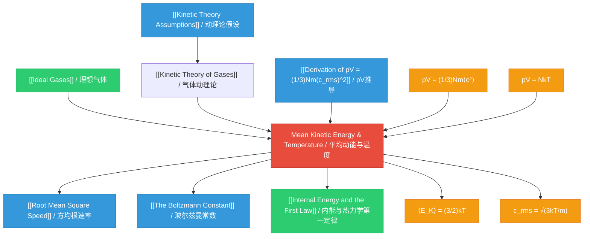

# Mean Kinetic Energy and Temperature / 平均动能与温度

---

# 1. Overview / 概述

**English:**
This sub-topic establishes the **fundamental link** between the macroscopic property of **temperature** and the microscopic behaviour of gas molecules. At the heart of the [[Kinetic Theory of Gases]] is the idea that temperature is a measure of the **average random kinetic energy** of the particles in a substance. We derive the relationship $\frac{1}{2} m \langle c^2 \rangle = \frac{3}{2} kT$, which shows that the mean kinetic energy of a molecule is directly proportional to the absolute temperature. This concept is crucial for understanding [[Internal Energy and the First Law]], as it explains why the internal energy of an ideal gas depends only on its temperature. It also introduces the [[The Boltzmann Constant]] $k$, a fundamental constant linking the microscopic and macroscopic worlds.

**中文:**
本子知识点建立了宏观量 **温度** 与气体分子微观行为之间的 **基本联系**。在[[Kinetic Theory of Gases|气体动理论]]的核心，温度是物质中粒子 **平均随机动能** 的量度。我们推导出关系式 $\frac{1}{2} m \langle c^2 \rangle = \frac{3}{2} kT$，这表明分子的平均动能与绝对温度成正比。这一概念对于理解[[Internal Energy and the First Law|内能与热力学第一定律]]至关重要，因为它解释了为什么理想气体的内能只取决于其温度。它还引入了[[The Boltzmann Constant|玻尔兹曼常数]] $k$，这是一个连接微观世界和宏观世界的基本常数。

---

# 2. Syllabus Learning Objectives / 考纲学习目标

| CAIE 9702 (11.2 a-e) | Edexcel IAL (WPH11 U1: 5.23-5.27) |
|----------------------|-----------------------------------|
| a) State the basic assumptions of the kinetic theory of gases | 5.23 Understand the concept of internal energy as the sum of the random distribution of kinetic and potential energies of molecules |
| b) Explain how molecular movement causes the pressure exerted by a gas and derive the equation $pV = \frac{1}{3} N m \langle c^2 \rangle$ | 5.24 Understand the significance of the Boltzmann constant $k$ |
| c) Derive the relationship $pV = \frac{1}{3} N m \langle c^2 \rangle$ | 5.25 Use the equation $\frac{1}{2} m \langle c^2 \rangle = \frac{3}{2} kT$ |
| d) Define **root mean square (r.m.s.) speed** of gas molecules | 5.26 Understand the relationship between the temperature of a gas and the average kinetic energy of its molecules |
| e) Recall and use the relationship $\frac{1}{2} m \langle c^2 \rangle = \frac{3}{2} kT$ | 5.27 Use the equation $pV = \frac{1}{3} N m \langle c^2 \rangle$ |

**Examiner Expectations / 考官期望:**
- **English:** You must be able to **derive** the relationship between mean kinetic energy and temperature from the ideal gas equation and the kinetic theory equation. You must understand that temperature is a **statistical** concept — it only has meaning for a large number of particles. You must be able to calculate the r.m.s. speed of molecules at a given temperature.
- **中文:** 你必须能够从理想气体方程和动理论方程 **推导** 出平均动能与温度的关系。你必须理解温度是一个 **统计** 概念——它只对大量粒子有意义。你必须能够计算给定温度下分子的方均根速率。

---

# 3. Core Definitions / 核心定义

| Term (EN/CN) | Definition (EN) | Definition (CN) | Common Mistakes / 常见错误 |
|--------------|-----------------|-----------------|---------------------------|
| **Mean Kinetic Energy** / 平均动能 | The average translational kinetic energy of a single molecule in a gas, given by $\frac{1}{2} m \langle c^2 \rangle$ | 气体中单个分子的平均平动动能，由 $\frac{1}{2} m \langle c^2 \rangle$ 给出 | Confusing with total kinetic energy of all molecules (which is $N \times$ mean KE) |
| **Absolute Temperature** / 绝对温度 | Temperature measured on the Kelvin scale, proportional to the mean kinetic energy of molecules | 以开尔文温标测量的温度，与分子的平均动能成正比 | Forgetting that $T$ must be in Kelvin, not Celsius |
| **Boltzmann Constant ($k$)** / 玻尔兹曼常数 | The gas constant per molecule: $k = \frac{R}{N_A} = 1.38 \times 10^{-23} \text{ J K}^{-1}$ | 每个分子的气体常数：$k = \frac{R}{N_A} = 1.38 \times 10^{-23} \text{ J K}^{-1}$ | Confusing $k$ with $R$ (molar gas constant) |
| **Root Mean Square Speed ($c_{rms}$)** / 方均根速率 | The square root of the mean of the squares of the molecular speeds: $c_{rms} = \sqrt{\langle c^2 \rangle}$ | 分子速度平方的平均值的平方根：$c_{rms} = \sqrt{\langle c^2 \rangle}$ | Confusing with mean speed $\bar{c}$ or most probable speed |
| **Internal Energy** / 内能 | For an ideal gas, the sum of the random kinetic energies of all molecules; depends only on temperature | 对于理想气体，所有分子随机动能的总和；仅取决于温度 | Including potential energy (which is zero for an ideal gas) |

---

# 4. Key Concepts Explained / 关键概念详解

## 4.1 Temperature as a Measure of Mean Kinetic Energy / 温度作为平均动能的量度

### Explanation / 解释
**English:**
From the kinetic theory, we have the equation:
$$ pV = \frac{1}{3} N m \langle c^2 \rangle $$
where $N$ is the number of molecules, $m$ is the mass of one molecule, and $\langle c^2 \rangle$ is the mean square speed.

From the ideal gas equation:
$$ pV = NkT $$
where $k$ is the [[The Boltzmann Constant]].

Equating these two expressions:
$$ \frac{1}{3} N m \langle c^2 \rangle = NkT $$
$$ \frac{1}{3} m \langle c^2 \rangle = kT $$
$$ \frac{1}{2} m \langle c^2 \rangle = \frac{3}{2} kT $$

The left-hand side $\frac{1}{2} m \langle c^2 \rangle$ is the **mean translational kinetic energy** of a single molecule. Therefore:
$$ \boxed{\langle E_K \rangle = \frac{3}{2} kT} $$

This is a profound result: **the absolute temperature of a gas is directly proportional to the mean kinetic energy of its molecules**. Temperature is not a measure of the total energy of the gas, but of the *average* energy per molecule.

**中文:**
从动理论出发，我们有方程：
$$ pV = \frac{1}{3} N m \langle c^2 \rangle $$
其中 $N$ 是分子数，$m$ 是一个分子的质量，$\langle c^2 \rangle$ 是均方速度。

从理想气体方程：
$$ pV = NkT $$
其中 $k$ 是[[The Boltzmann Constant|玻尔兹曼常数]]。

将这两个表达式相等：
$$ \frac{1}{3} N m \langle c^2 \rangle = NkT $$
$$ \frac{1}{3} m \langle c^2 \rangle = kT $$
$$ \frac{1}{2} m \langle c^2 \rangle = \frac{3}{2} kT $$

左边 $\frac{1}{2} m \langle c^2 \rangle$ 是一个分子的 **平均平动动能**。因此：
$$ \boxed{\langle E_K \rangle = \frac{3}{2} kT} $$

这是一个深刻的结论：**气体的绝对温度与其分子的平均动能成正比**。温度不是气体总能量的量度，而是每个分子 *平均* 能量的量度。

### Physical Meaning / 物理意义
**English:**
- At the same temperature, all ideal gas molecules have the **same mean kinetic energy**, regardless of their mass.
- Lighter molecules (e.g., hydrogen) must move faster to have the same kinetic energy as heavier molecules (e.g., oxygen) at the same temperature.
- At absolute zero ($T = 0 \text{ K}$), the mean kinetic energy would be zero — all molecular motion would cease. This is the theoretical basis of the Kelvin scale.

**中文:**
- 在相同温度下，所有理想气体分子具有 **相同的平均动能**，无论其质量如何。
- 较轻的分子（如氢气）必须运动得更快，才能在相同温度下具有与较重分子（如氧气）相同的动能。
- 在绝对零度（$T = 0 \text{ K}$）时，平均动能为零——所有分子运动将停止。这是开尔文温标的理论基础。

### Common Misconceptions / 常见误区
- ❌ **"Temperature is a measure of the total energy of a gas."** → ✅ Temperature is a measure of the *average* kinetic energy per molecule, not the total energy.
- ❌ **"At the same temperature, all molecules have the same speed."** → ✅ They have the same *mean kinetic energy*, but speeds vary widely (Maxwell-Boltzmann distribution).
- ❌ **"The Boltzmann constant $k$ is the same as the gas constant $R$."** → ✅ $k = R/N_A$; $k$ is per molecule, $R$ is per mole.
- ❌ **"The equation $\frac{1}{2} m \langle c^2 \rangle = \frac{3}{2} kT$ applies to all molecules."** → ✅ It applies only to **monatomic** ideal gases (translational kinetic energy only). For diatomic gases, rotational and vibrational modes also contribute.

### Exam Tips / 考试提示
**English:**
- Always convert Celsius to Kelvin: $T(K) = T(°C) + 273.15$
- Remember that $\langle c^2 \rangle$ is the **mean square speed**, not the square of the mean speed.
- The factor $\frac{3}{2}$ comes from the three translational degrees of freedom (x, y, z directions).
- For CAIE, you may be asked to **derive** this relationship from first principles.

**中文:**
- 始终将摄氏度转换为开尔文：$T(K) = T(°C) + 273.15$
- 记住 $\langle c^2 \rangle$ 是 **均方速度**，而不是平均速度的平方。
- 因子 $\frac{3}{2}$ 来自三个平动自由度（x、y、z 方向）。
- 对于 CAIE，你可能会被要求 **推导** 这个关系式。

> 📷 **IMAGE PROMPT — DIAGRAM-01: Temperature vs Mean Kinetic Energy Graph**
> A clear graph showing a straight line through the origin with "Mean Kinetic Energy (J)" on the y-axis and "Temperature (K)" on the x-axis. The line has gradient = 3k/2. Include labels: "⟨E_K⟩ = (3/2)kT", "Gradient = 3k/2", and a point showing that at T=0 K, ⟨E_K⟩=0. Use a clean, textbook-style diagram suitable for A-Level physics.

---

# 5. Essential Equations / 核心公式

## Equation 1: Mean Kinetic Energy and Temperature / 平均动能与温度

$$ \boxed{\frac{1}{2} m \langle c^2 \rangle = \frac{3}{2} kT} $$

| Symbol (符号) | Meaning (EN) | Meaning (CN) | Unit (单位) |
|--------------|-------------|-------------|------------|
| $m$ | Mass of one molecule | 一个分子的质量 | kg |
| $\langle c^2 \rangle$ | Mean square speed of molecules | 分子的均方速度 | m² s⁻² |
| $k$ | Boltzmann constant ($1.38 \times 10^{-23}$) | 玻尔兹曼常数 | J K⁻¹ |
| $T$ | Absolute temperature | 绝对温度 | K |

**Derivation / 推导:**
$$ pV = \frac{1}{3} N m \langle c^2 \rangle \quad \text{(Kinetic theory)} $$
$$ pV = NkT \quad \text{(Ideal gas equation)} $$
$$ \frac{1}{3} N m \langle c^2 \rangle = NkT $$
$$ \frac{1}{3} m \langle c^2 \rangle = kT $$
$$ \frac{1}{2} m \langle c^2 \rangle = \frac{3}{2} kT $$

**Conditions / 适用条件:**
- **English:** Applies to an **ideal gas** (monatomic) where intermolecular forces are negligible and collisions are perfectly elastic.
- **中文:** 适用于 **理想气体**（单原子），其中分子间力可忽略，碰撞是完全弹性的。

**Limitations / 局限性:**
- **English:** Does not account for rotational or vibrational kinetic energy in diatomic or polyatomic molecules. For such molecules, the total internal energy includes additional terms.
- **中文:** 不考虑双原子或多原子分子中的转动或振动动能。对于此类分子，总内能包括额外项。

## Equation 2: Alternative Form Using Molar Quantities / 使用摩尔量的替代形式

$$ \boxed{\frac{1}{2} M \langle c^2 \rangle = \frac{3}{2} RT} $$

| Symbol (符号) | Meaning (EN) | Meaning (CN) | Unit (单位) |
|--------------|-------------|-------------|------------|
| $M$ | Molar mass of gas | 气体的摩尔质量 | kg mol⁻¹ |
| $R$ | Molar gas constant ($8.31$) | 摩尔气体常数 | J mol⁻¹ K⁻¹ |
| $T$ | Absolute temperature | 绝对温度 | K |

**Derivation / 推导:**
Since $m = M/N_A$ and $k = R/N_A$:
$$ \frac{1}{2} \left(\frac{M}{N_A}\right) \langle c^2 \rangle = \frac{3}{2} \left(\frac{R}{N_A}\right) T $$
$$ \frac{1}{2} M \langle c^2 \rangle = \frac{3}{2} RT $$

## Equation 3: Root Mean Square Speed / 方均根速率

$$ \boxed{c_{rms} = \sqrt{\langle c^2 \rangle} = \sqrt{\frac{3kT}{m}} = \sqrt{\frac{3RT}{M}}} $$

| Symbol (符号) | Meaning (EN) | Meaning (CN) | Unit (单位) |
|--------------|-------------|-------------|------------|
| $c_{rms}$ | Root mean square speed | 方均根速率 | m s⁻¹ |
| $k$ | Boltzmann constant | 玻尔兹曼常数 | J K⁻¹ |
| $T$ | Absolute temperature | 绝对温度 | K |
| $m$ | Mass of one molecule | 一个分子的质量 | kg |
| $R$ | Molar gas constant | 摩尔气体常数 | J mol⁻¹ K⁻¹ |
| $M$ | Molar mass | 摩尔质量 | kg mol⁻¹ |

> 📋 **CIE Only:** You must be able to derive the relationship $\frac{1}{2} m \langle c^2 \rangle = \frac{3}{2} kT$ from $pV = \frac{1}{3} N m \langle c^2 \rangle$ and $pV = NkT$.

> 📋 **Edexcel Only:** You need to use the equation $\frac{1}{2} m \langle c^2 \rangle = \frac{3}{2} kT$ and understand the significance of the Boltzmann constant.

---

# 6. Graphs and Relationships / 图表与关系

## 6.1 Mean Kinetic Energy vs Absolute Temperature / 平均动能与绝对温度的关系

### Axes / 坐标轴
- **X-axis:** Absolute temperature $T$ (K) / 绝对温度 $T$ (K)
- **Y-axis:** Mean kinetic energy $\langle E_K \rangle$ (J) / 平均动能 $\langle E_K \rangle$ (J)

### Shape / 形状
- **English:** A straight line passing through the origin. The relationship is directly proportional: $\langle E_K \rangle \propto T$.
- **中文:** 一条通过原点的直线。关系是正比例关系：$\langle E_K \rangle \propto T$。

### Gradient Meaning / 斜率含义
- **English:** The gradient is $\frac{3}{2}k$, where $k$ is the Boltzmann constant. This represents the increase in mean kinetic energy per unit increase in temperature.
- **中文:** 斜率为 $\frac{3}{2}k$，其中 $k$ 是玻尔兹曼常数。这表示每单位温度升高时平均动能的增加量。

### Area Meaning / 面积含义
- **English:** Not applicable for this graph.
- **中文:** 不适用于此图。

### Exam Interpretation / 考试解读
- **English:** If asked to sketch this graph, ensure it passes through the origin. The line is the same for **all ideal gases** at the same temperature, regardless of molecular mass.
- **中文:** 如果要求画出此图，确保它通过原点。在相同温度下，**所有理想气体** 的这条线都是相同的，与分子质量无关。

```mermaid
graph LR
    subgraph "Key Proportionality / 关键比例关系"
        A[Temperature T / 温度 T] -->|"∝"| B[Mean KE ⟨E_K⟩ / 平均动能]
        B -->|"= (3/2)kT"| C[⟨E_K⟩ = (3/2)kT]
    end
    
    subgraph "Consequences / 推论"
        D[Same T → Same ⟨E_K⟩ / 相同温度 → 相同平均动能]
        E[Lighter molecules → Higher c_rms / 较轻分子 → 较高方均根速率]
        F[Heavier molecules → Lower c_rms / 较重分子 → 较低方均根速率]
    end
    
    C --> D
    D --> E
    D --> F
```

---

# 7. Required Diagrams / 必备图表

## 7.1 Derivation Flowchart / 推导流程图

### Description / 描述
**English:** A flowchart showing the logical steps to derive $\frac{1}{2} m \langle c^2 \rangle = \frac{3}{2} kT$ from the kinetic theory equation and the ideal gas equation.

**中文:** 一个流程图，展示从动理论方程和理想气体方程推导 $\frac{1}{2} m \langle c^2 \rangle = \frac{3}{2} kT$ 的逻辑步骤。

### Image Prompt / 图片生成提示
> 📷 **IMAGE PROMPT — DIAGRAM-02: Derivation Flowchart for Mean KE and Temperature**
> A clean, textbook-style flowchart with four boxes connected by arrows. Box 1: "Kinetic Theory: pV = (1/3)Nm⟨c²⟩". Box 2: "Ideal Gas: pV = NkT". Arrow from Box 1 and Box 2 pointing to Box 3: "Equate: (1/3)Nm⟨c²⟩ = NkT". Arrow from Box 3 to Box 4: "Simplify: (1/2)m⟨c²⟩ = (3/2)kT". Use a professional layout suitable for A-Level physics revision notes. Include the final box with a double border.

### Labels Required / 需要标注
- **English:** "Kinetic Theory Equation", "Ideal Gas Equation", "Equate", "Simplify", "Final Result"
- **中文:** "动理论方程", "理想气体方程", "相等", "简化", "最终结果"

### Exam Importance / 考试重要性
- **English:** **High.** CAIE frequently asks students to derive this relationship. Understanding the derivation helps avoid memorisation errors.
- **中文:** **高。** CAIE 经常要求学生推导这个关系式。理解推导过程有助于避免记忆错误。

## 7.2 Maxwell-Boltzmann Speed Distribution / 麦克斯韦-玻尔兹曼速度分布

### Description / 描述
**English:** A graph showing the distribution of molecular speeds in a gas at a given temperature. The area under the curve represents the total number of molecules. The most probable speed, mean speed, and r.m.s. speed are marked.

**中文:** 显示给定温度下气体分子速度分布的图表。曲线下的面积代表分子总数。标出了最概然速率、平均速率和方均根速率。

### Image Prompt / 图片生成提示
> 📷 **IMAGE PROMPT — DIAGRAM-03: Maxwell-Boltzmann Speed Distribution with Temperature Comparison**
> A graph with "Number of Molecules" on the y-axis and "Speed (m/s)" on the x-axis. Show two curves: one at lower temperature T₁ (taller, narrower peak) and one at higher temperature T₂ > T₁ (shorter, wider peak). Mark the most probable speed (c_mp), mean speed (c̄), and root mean square speed (c_rms) on the T₂ curve. Include a note: "Area under both curves is the same (same number of molecules)". Use a clean, exam-style diagram.

### Labels Required / 需要标注
- **English:** "Most probable speed $c_{mp}$", "Mean speed $\bar{c}$", "Root mean square speed $c_{rms}$", "Temperature $T_1$", "Temperature $T_2 > T_1$"
- **中文:** "最概然速率 $c_{mp}$", "平均速率 $\bar{c}$", "方均根速率 $c_{rms}$", "温度 $T_1$", "温度 $T_2 > T_1$"

### Exam Importance / 考试重要性
- **English:** **Medium.** Understanding that at higher temperatures, the distribution broadens and shifts to higher speeds is essential for explaining why $c_{rms} \propto \sqrt{T}$.
- **中文:** **中等。** 理解在较高温度下，分布变宽并移向较高速度，对于解释为什么 $c_{rms} \propto \sqrt{T}$ 至关重要。

---

# 8. Worked Examples / 典型例题

## Example 1: Calculating Mean Kinetic Energy / 计算平均动能

### Question / 题目
**English:**
Calculate the mean kinetic energy of a molecule of an ideal gas at a temperature of $27^\circ \text{C}$.
(Boltzmann constant $k = 1.38 \times 10^{-23} \text{ J K}^{-1}$)

**中文:**
计算温度为 $27^\circ \text{C}$ 时理想气体分子的平均动能。
（玻尔兹曼常数 $k = 1.38 \times 10^{-23} \text{ J K}^{-1}$）

### Solution / 解答
**Step 1: Convert temperature to Kelvin / 将温度转换为开尔文**
$$ T = 27 + 273 = 300 \text{ K} $$

**Step 2: Apply the formula / 应用公式**
$$ \langle E_K \rangle = \frac{3}{2} kT $$
$$ \langle E_K \rangle = \frac{3}{2} \times (1.38 \times 10^{-23}) \times 300 $$

**Step 3: Calculate / 计算**
$$ \langle E_K \rangle = \frac{3}{2} \times 4.14 \times 10^{-21} $$
$$ \langle E_K \rangle = 6.21 \times 10^{-21} \text{ J} $$

### Final Answer / 最终答案
**Answer:** $6.21 \times 10^{-21} \text{ J}$ | **答案：** $6.21 \times 10^{-21} \text{ J}$

### Quick Tip / 提示
**English:** Always convert Celsius to Kelvin before using the formula. A common mistake is to use $T = 27^\circ \text{C}$ directly, which gives a wrong answer.

**中文:** 在使用公式前，始终将摄氏度转换为开尔文。一个常见错误是直接使用 $T = 27^\circ \text{C}$，这会导致错误答案。

---

## Example 2: Calculating Root Mean Square Speed / 计算方均根速率

### Question / 题目
**English:**
Calculate the root mean square speed of oxygen molecules ($O_2$) at $27^\circ \text{C}$.
(Molar mass of $O_2 = 32.0 \text{ g mol}^{-1}$, $R = 8.31 \text{ J mol}^{-1} \text{ K}^{-1}$)

**中文:**
计算 $27^\circ \text{C}$ 时氧气分子 ($O_2$) 的方均根速率。
（$O_2$ 的摩尔质量 $= 32.0 \text{ g mol}^{-1}$，$R = 8.31 \text{ J mol}^{-1} \text{ K}^{-1}$）

### Solution / 解答
**Step 1: Convert units / 转换单位**
$$ T = 27 + 273 = 300 \text{ K} $$
$$ M = 32.0 \text{ g mol}^{-1} = 0.0320 \text{ kg mol}^{-1} $$

**Step 2: Apply the formula / 应用公式**
$$ c_{rms} = \sqrt{\frac{3RT}{M}} $$
$$ c_{rms} = \sqrt{\frac{3 \times 8.31 \times 300}{0.0320}} $$

**Step 3: Calculate / 计算**
$$ c_{rms} = \sqrt{\frac{7479}{0.0320}} $$
$$ c_{rms} = \sqrt{233718.75} $$
$$ c_{rms} = 483 \text{ m s}^{-1} $$

### Final Answer / 最终答案
**Answer:** $483 \text{ m s}^{-1}$ | **答案：** $483 \text{ m s}^{-1}$

### Quick Tip / 提示
**English:** Ensure molar mass is in **kg mol⁻¹**, not g mol⁻¹. The speed of sound in air at room temperature is about $340 \text{ m s}^{-1}$, so oxygen molecules at $483 \text{ m s}^{-1}$ are supersonic!

**中文:** 确保摩尔质量以 **kg mol⁻¹** 为单位，而不是 g mol⁻¹。室温下空气中的声速约为 $340 \text{ m s}^{-1}$，因此 $483 \text{ m s}^{-1}$ 的氧气分子是超音速的！

---

## Example 3: Comparing Gases at the Same Temperature / 比较相同温度下的气体

### Question / 题目
**English:**
Hydrogen ($H_2$) and oxygen ($O_2$) are both at $300 \text{ K}$.
(a) Compare their mean kinetic energies.
(b) Compare their root mean square speeds.
(Molar mass: $H_2 = 2.0 \text{ g mol}^{-1}$, $O_2 = 32.0 \text{ g mol}^{-1}$)

**中文:**
氢气 ($H_2$) 和氧气 ($O_2$) 都在 $300 \text{ K}$。
(a) 比较它们的平均动能。
(b) 比较它们的方均根速率。
（摩尔质量：$H_2 = 2.0 \text{ g mol}^{-1}$，$O_2 = 32.0 \text{ g mol}^{-1}$）

### Solution / 解答
**(a) Mean kinetic energy / 平均动能:**
$$ \langle E_K \rangle = \frac{3}{2} kT $$
Since both gases are at the same temperature $T = 300 \text{ K}$:
$$ \langle E_K \rangle_{H_2} = \langle E_K \rangle_{O_2} $$

**Answer:** They have the **same** mean kinetic energy. | **答案：** 它们具有 **相同** 的平均动能。

**(b) Root mean square speed / 方均根速率:**
$$ c_{rms} = \sqrt{\frac{3RT}{M}} $$
$$ \frac{c_{rms}(H_2)}{c_{rms}(O_2)} = \sqrt{\frac{M_{O_2}}{M_{H_2}}} = \sqrt{\frac{32.0}{2.0}} = \sqrt{16} = 4 $$

**Answer:** $c_{rms}(H_2) = 4 \times c_{rms}(O_2)$. Hydrogen molecules move 4 times faster. | **答案：** $c_{rms}(H_2) = 4 \times c_{rms}(O_2)$。氢气分子运动速度快 4 倍。

### Quick Tip / 提示
**English:** At the same temperature, lighter molecules move faster. The ratio of r.m.s. speeds is inversely proportional to the square root of the ratio of masses.

**中文:** 在相同温度下，较轻的分子运动更快。方均根速率之比与质量之比的平方根成反比。

---

# 9. Past Paper Question Types / 历年真题题型

| Question Type / 题型 | Frequency / 频率 | Difficulty / 难度 | Past Paper References / 真题索引 |
|----------------------|------------------|------------------|-------------------------------|
| Derivation of $\frac{1}{2} m \langle c^2 \rangle = \frac{3}{2} kT$ | High | Medium | 📝 *待填入* |
| Calculation of mean kinetic energy from temperature | High | Easy | 📝 *待填入* |
| Calculation of $c_{rms}$ from temperature and molar mass | High | Medium | 📝 *待填入* |
| Comparison of $c_{rms}$ for different gases at same temperature | Medium | Medium | 📝 *待填入* |
| Conceptual questions on temperature as measure of KE | Medium | Easy | 📝 *待填入* |
| Graph interpretation (Maxwell-Boltzmann distribution) | Low-Medium | Medium | 📝 *待填入* |

**Common Command Words / 常见指令词:**
- **English:** "Derive", "Calculate", "Determine", "State", "Explain", "Compare", "Sketch"
- **中文:** "推导", "计算", "确定", "陈述", "解释", "比较", "画出草图"

---

# 10. Practical Skills Connections / 实验技能链接

**English:**
This sub-topic connects to practical work in several ways:

1. **Measurement of Temperature:** Understanding that temperature is a measure of mean kinetic energy reinforces the correct use of thermometers and the Kelvin scale.
2. **Brownian Motion Experiment:** The observation of random motion of smoke particles under a microscope provides visual evidence for the kinetic theory and the link between temperature and molecular motion.
3. **Determination of $c_{rms}$:** While we cannot directly measure molecular speeds, we can calculate $c_{rms}$ from measurable quantities (pressure, volume, temperature, molar mass). This connects to gas law experiments.
4. **Uncertainties:** When calculating $c_{rms}$, uncertainties in temperature measurement (±0.5 K) and molar mass propagate through the calculation. Students should be able to estimate the percentage uncertainty in $c_{rms}$.
5. **Graph Plotting:** Plotting $\langle E_K \rangle$ against $T$ should yield a straight line through the origin, with gradient $\frac{3}{2}k$. This can be used to determine the Boltzmann constant experimentally.

**中文:**
本子知识点通过多种方式与实验工作联系：

1. **温度测量：** 理解温度是平均动能的量度，强化了温度计和开尔文温标的正确使用。
2. **布朗运动实验：** 在显微镜下观察烟雾粒子的随机运动，为动理论以及温度与分子运动之间的联系提供了视觉证据。
3. **$c_{rms}$ 的确定：** 虽然我们无法直接测量分子速度，但可以从可测量量（压力、体积、温度、摩尔质量）计算 $c_{rms}$。这与气体定律实验相关联。
4. **不确定度：** 计算 $c_{rms}$ 时，温度测量（±0.5 K）和摩尔质量的不确定度会通过计算传播。学生应能估算 $c_{rms}$ 的百分比不确定度。
5. **图表绘制：** 绘制 $\langle E_K \rangle$ 对 $T$ 的图表应得到一条通过原点的直线，斜率为 $\frac{3}{2}k$。这可用于实验确定玻尔兹曼常数。

---

# 11. Concept Map / 概念图谱



---

# 12. Quick Revision Sheet / 速查表

| Category / 类别 | Key Points / 要点 |
|----------------|------------------|
| **Definition / 定义** | Temperature is a measure of the **mean random kinetic energy** of molecules / 温度是分子 **平均随机动能** 的量度 |
| **Key Formula / 核心公式** | $\langle E_K \rangle = \frac{1}{2} m \langle c^2 \rangle = \frac{3}{2} kT$ |
| **Key Formula (Molar) / 核心公式（摩尔）** | $\frac{1}{2} M \langle c^2 \rangle = \frac{3}{2} RT$ |
| **Key Formula ($c_{rms}$) / 核心公式（方均根速率）** | $c_{rms} = \sqrt{\frac{3kT}{m}} = \sqrt{\frac{3RT}{M}}$ |
| **Key Graph / 核心图表** | $\langle E_K \rangle$ vs $T$: Straight line through origin, gradient $= \frac{3}{2}k$ / $\langle E_K \rangle$ 对 $T$：通过原点的直线，斜率 $= \frac{3}{2}k$ |
| **Key Constant / 关键常数** | Boltzmann constant $k = 1.38 \times 10^{-23} \text{ J K}^{-1}$ / 玻尔兹曼常数 $k = 1.38 \times 10^{-23} \text{ J K}^{-1}$ |
| **Exam Tip 1 / 考试提示 1** | Always convert $^\circ \text{C}$ to K: $T(K) = T(^\circ \text{C}) + 273$ / 始终将 $^\circ \text{C}$ 转换为 K：$T(K) = T(^\circ \text{C}) + 273$ |
| **Exam Tip 2 / 考试提示 2** | Molar mass must be in **kg mol⁻¹** for $c_{rms}$ calculation / 计算 $c_{rms}$ 时摩尔质量必须以 **kg mol⁻¹** 为单位 |
| **Exam Tip 3 / 考试提示 3** | At same $T$, all ideal gases have **same** $\langle E_K \rangle$ but different $c_{rms}$ / 在相同 $T$ 下，所有理想气体具有 **相同** 的 $\langle E_K \rangle$ 但不同的 $c_{rms}$ |
| **Common Mistake / 常见错误** | Confusing $\langle c^2 \rangle$ (mean square speed) with $(\langle c \rangle)^2$ (square of mean speed) / 混淆 $\langle c^2 \rangle$（均方速度）与 $(\langle c \rangle)^2$（平均速度的平方） |
| **Derivation / 推导** | $pV = \frac{1}{3} N m \langle c^2 \rangle = NkT \rightarrow \frac{1}{2} m \langle c^2 \rangle = \frac{3}{2} kT$ |

---

> 📋 **CIE Only:** You must be able to derive $\frac{1}{2} m \langle c^2 \rangle = \frac{3}{2} kT$ from $pV = \frac{1}{3} N m \langle c^2 \rangle$ and $pV = NkT$.

> 📋 **Edexcel Only:** You need to use the equation $\frac{1}{2} m \langle c^2 \rangle = \frac{3}{2} kT$ and understand the significance of the Boltzmann constant $k$.