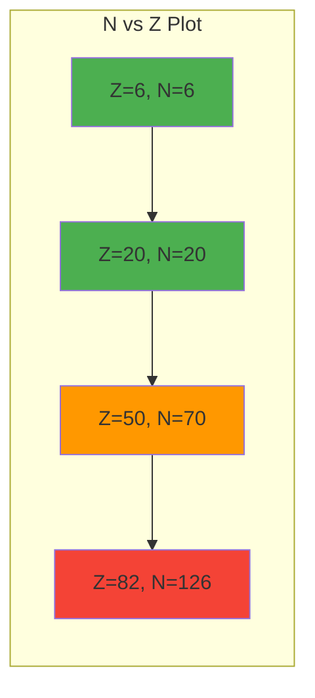
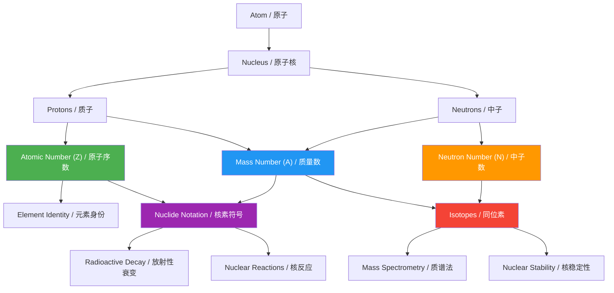

# 1. Overview / 概述

**English:**
This sub-topic introduces the fundamental quantities used to describe atomic nuclei: **atomic number (Z)** and **mass number (A)**. Atomic number defines the identity of an element by counting the number of protons in the nucleus, while mass number counts the total number of protons and neutrons. These two numbers form the basis of [[Nuclide Notation]] and are essential for understanding [[The Nuclear Model of the Atom]], [[Isotopes and Nuclear Reactions]], and all subsequent nuclear physics. For A-Level students, mastering Z and A is the first step toward calculating binding energy, understanding radioactive decay, and balancing nuclear equations.

**中文:**
本子知识点介绍描述原子核的基本量：**原子序数 (Z)** 和 **质量数 (A)**。原子序数通过计数原子核中的质子数来定义元素的身份，而质量数则计数质子和中子的总数。这两个数字构成了[[核素符号]]的基础，对于理解[[原子核模型]]、[[同位素与核反应]]以及所有后续核物理内容至关重要。对于A-Level学生，掌握Z和A是计算结合能、理解放射性衰变和配平核方程式的第一步。

---

# 2. Syllabus Learning Objectives / 考纲学习目标

| CAIE 9702 | Edexcel IAL |
|-----------|-------------|
| 1.1(a) Define atomic number (Z) and mass number (A) | 6.1 Understand the terms atomic number (Z) and mass number (A) |
| 1.1(b) Use nuclide notation $^{A}_{Z}X$ | 6.2 Use nuclide notation $^{A}_{Z}X$ |
| 1.1(c) Distinguish between isotopes | 6.3 Define isotopes |
| 1.1(d) Calculate number of neutrons: $N = A - Z$ | 6.4 Calculate neutron number: $N = A - Z$ |
| 1.1(e) Relate Z and A to the [[Protons, Neutrons, and Electrons]] in an atom | 6.5 Relate Z and A to proton and neutron counts |

**Examiner Expectations / 考官期望:**
- **English:** Students must be able to define Z and A precisely, use nuclide notation correctly, and calculate the number of neutrons. They should also understand that isotopes have the same Z but different A.
- **中文:** 学生必须能够精确定义Z和A，正确使用核素符号，并计算中子数。还应理解同位素具有相同的Z但不同的A。

---

# 3. Core Definitions / 核心定义

| Term (EN/CN) | Definition (EN) | Definition (CN) | Common Mistakes / 常见错误 |
|--------------|-----------------|-----------------|---------------------------|
| **Atomic Number (Z)** / 原子序数 (Z) | The number of protons in the nucleus of an atom. It determines the element's identity. | 原子核中质子的数量。它决定了元素的身份。 | ❌ Confusing Z with mass number A. Z is always the smaller number for stable nuclei. |
| **Mass Number (A)** / 质量数 (A) | The total number of protons and neutrons in the nucleus of an atom. | 原子核中质子和中子的总数。 | ❌ Thinking A equals atomic mass in grams. A is a count, not a mass. |
| **Neutron Number (N)** / 中子数 (N) | The number of neutrons in the nucleus, calculated as $N = A - Z$. | 原子核中中子的数量，计算公式为 $N = A - Z$。 | ❌ Forgetting that N can vary for the same element (isotopes). |
| **Nuclide** / 核素 | A specific type of atomic nucleus characterized by its atomic number Z and mass number A. | 由原子序数Z和质量数A表征的特定类型原子核。 | ❌ Using "nuclide" and "isotope" interchangeably. All isotopes are nuclides, but not all nuclides are isotopes of the same element. |
| **Isotope** / 同位素 | Atoms of the same element (same Z) with different numbers of neutrons (different A). | 同一元素（相同Z）但中子数不同（不同A）的原子。 | ❌ Thinking isotopes have different chemical properties. They have nearly identical chemical properties. |

---

# 4. Key Concepts Explained / 关键概念详解

## 4.1 Atomic Number (Z) — The Identity Card / 原子序数 (Z) — 身份标识

### Explanation / 解释
**English:** The atomic number Z is the number of protons in the nucleus. It is the single most important number for an element because it determines the element's chemical properties. In a neutral atom, the number of electrons equals Z, which determines the electron configuration and thus the chemical behavior. For example, carbon always has Z = 6; any atom with 6 protons is carbon, regardless of how many neutrons it has.

**中文:** 原子序数Z是原子核中质子的数量。它是元素最重要的单一数字，因为它决定了元素的化学性质。在中性原子中，电子数等于Z，这决定了电子排布，从而决定了化学行为。例如，碳总是Z=6；任何有6个质子的原子都是碳，无论它有多少个中子。

### Physical Meaning / 物理意义
**English:** Z represents the positive charge of the nucleus ($+Ze$). This positive charge attracts electrons and holds the atom together. Changing Z changes the element entirely — it is a nuclear transformation, not a chemical one.

**中文:** Z代表原子核的正电荷（$+Ze$）。这个正电荷吸引电子并将原子结合在一起。改变Z会完全改变元素——这是一种核转变，而不是化学转变。

### Common Misconceptions / 常见误区
- ❌ **English:** "Atomic number is the number of electrons." — Only true for neutral atoms. Ions have different electron counts.
- ❌ **中文:** "原子序数是电子数。" — 仅对中性原子成立。离子有不同的电子数。
- ❌ **English:** "Z is the mass of the atom." — No, Z is a count, not a mass.
- ❌ **中文:** "Z是原子的质量。" — 不，Z是一个计数，不是质量。

### Exam Tips / 考试提示
- ✅ **English:** Always write Z as a subscript before the element symbol: $^{A}_{Z}X$.
- ✅ **中文:** 始终将Z作为下标写在元素符号前：$^{A}_{Z}X$。
- ✅ **English:** For a neutral atom, Z = number of protons = number of electrons.
- ✅ **中文:** 对于中性原子，Z = 质子数 = 电子数。

> 📷 **IMAGE PROMPT — Z01: Atomic Number Diagram**
> A simple diagram showing a carbon nucleus with 6 protons (red) and 6 neutrons (gray), with the label "Z = 6" pointing to the protons. The electron cloud is shown faintly with 6 electrons orbiting. Clean, educational style with clear labels in English.

## 4.2 Mass Number (A) — The Weight Class / 质量数 (A) — 重量级别

### Explanation / 解释
**English:** The mass number A is the total number of nucleons (protons + neutrons) in the nucleus. It is approximately equal to the atomic mass in atomic mass units (u), but it is a count, not a mass. For example, carbon-12 has A = 12, meaning 12 nucleons. The mass number determines the isotope of an element.

**中文:** 质量数A是原子核中核子（质子+中子）的总数。它近似等于以原子质量单位（u）表示的原子质量，但它是一个计数，而不是质量。例如，碳-12有A=12，意味着12个核子。质量数决定了元素的同位素。

### Physical Meaning / 物理意义
**English:** A represents the approximate mass of the nucleus. Since protons and neutrons have nearly equal mass (~1.67 × 10⁻²⁷ kg), the total mass is roughly A × 1 u. The mass number is always an integer.

**中文:** A代表原子核的近似质量。由于质子和中子质量几乎相等（~1.67 × 10⁻²⁷ kg），总质量大约为A × 1 u。质量数始终是整数。

### Common Misconceptions / 常见误区
- ❌ **English:** "Mass number is the same as relative atomic mass." — No. Mass number is an integer count; relative atomic mass is a weighted average that can be non-integer.
- ❌ **中文:** "质量数与相对原子质量相同。" — 不。质量数是整数计数；相对原子质量是加权平均值，可以是非整数。
- ❌ **English:** "A is the number of neutrons." — No, A = Z + N. The number of neutrons is N = A - Z.
- ❌ **中文:** "A是中子数。" — 不，A = Z + N。中子数是N = A - Z。

### Exam Tips / 考试提示
- ✅ **English:** A is always written as a superscript before the element symbol: $^{A}_{Z}X$.
- ✅ **中文:** A始终作为上标写在元素符号前：$^{A}_{Z}X$。
- ✅ **English:** For isotopes, Z is the same but A differs.
- ✅ **中文:** 对于同位素，Z相同但A不同。

## 4.3 Neutron Number (N) — The Hidden Variable / 中子数 (N) — 隐藏变量

### Explanation / 解释
**English:** The neutron number N = A - Z is the number of neutrons in the nucleus. Neutrons are neutral particles that contribute to nuclear stability through the [[Strong Nuclear Force]]. For light stable nuclei, N ≈ Z; for heavier nuclei, N > Z to overcome electrostatic repulsion between protons.

**中文:** 中子数N = A - Z是原子核中的中子数量。中子是中性粒子，通过[[强核力]]对核稳定性做出贡献。对于轻稳定核，N ≈ Z；对于重核，N > Z以克服质子间的静电排斥。

### Physical Meaning / 物理意义
**English:** Neutrons act as "nuclear glue" — they provide additional strong force attraction without adding electrostatic repulsion. This is why heavier elements need more neutrons than protons to be stable.

**中文:** 中子充当"核胶水"——它们提供额外的强核力吸引力而不增加静电排斥。这就是为什么重元素需要比质子更多的中子才能稳定。

### Common Misconceptions / 常见误区
- ❌ **English:** "All atoms of an element have the same number of neutrons." — No, isotopes have different neutron numbers.
- ❌ **中文:** "同一元素的所有原子都有相同的中子数。" — 不，同位素有不同的中子数。
- ❌ **English:** "N is always equal to Z." — Only for light stable nuclei like $^{4}_{2}He$ and $^{12}_{6}C$.
- ❌ **中文:** "N总是等于Z。" — 仅对轻稳定核如$^{4}_{2}He$和$^{12}_{6}C$成立。

### Exam Tips / 考试提示
- ✅ **English:** Always calculate N = A - Z. Never assume N = Z.
- ✅ **中文:** 始终计算N = A - Z。切勿假设N = Z。
- ✅ **English:** For isotopes, N varies while Z stays constant.
- ✅ **中文:** 对于同位素，N变化而Z保持不变。

---

# 5. Essential Equations / 核心公式

## Equation 1: Neutron Number / 中子数公式

$$ N = A - Z $$

| Symbol (符号) | Meaning (EN) | Meaning (CN) | Unit (单位) |
|--------------|-------------|-------------|------------|
| $N$ | Neutron number | 中子数 | dimensionless (无量纲) |
| $A$ | Mass number | 质量数 | dimensionless (无量纲) |
| $Z$ | Atomic number | 原子序数 | dimensionless (无量纲) |

**Derivation / 推导:**
- **English:** Since A counts all nucleons (protons + neutrons) and Z counts only protons, the number of neutrons is simply the difference.
- **中文:** 由于A计数所有核子（质子+中子），而Z只计数质子，中子数就是它们的差。

**Conditions / 适用条件:**
- **English:** Always valid for any atomic nucleus. N can be zero for $^{1}_{1}H$ (protium).
- **中文:** 对任何原子核始终成立。对于$^{1}_{1}H$（氕），N可以为零。

**Limitations / 局限性:**
- **English:** None — this is a definition, not an approximation.
- **中文:** 无——这是一个定义，不是近似。

## Equation 2: Nuclide Notation / 核素符号

$$ ^{A}_{Z}X $$

| Symbol (符号) | Meaning (EN) | Meaning (CN) | Unit (单位) |
|--------------|-------------|-------------|------------|
| $X$ | Chemical symbol of the element | 元素的化学符号 | — |
| $Z$ | Atomic number (subscript) | 原子序数（下标） | dimensionless (无量纲) |
| $A$ | Mass number (superscript) | 质量数（上标） | dimensionless (无量纲) |

**Derivation / 推导:**
- **English:** Standard notation used internationally to represent a specific nuclide.
- **中文:** 国际上用于表示特定核素的标准符号。

**Conditions / 适用条件:**
- **English:** Z is sometimes omitted because the chemical symbol X already implies Z.
- **中文:** Z有时被省略，因为化学符号X已经隐含了Z。

**Limitations / 局限性:**
- **English:** The notation does not show the number of electrons — that must be inferred from the charge state.
- **中文:** 该符号不显示电子数——必须从电荷状态推断。

> 📷 **IMAGE PROMPT — E01: Nuclide Notation Example**
> A clear diagram showing $^{12}_{6}C$ with labels: "A = 12 (superscript)" pointing to the 12, "Z = 6 (subscript)" pointing to the 6, and "C = Carbon (element symbol)" pointing to the C. Below, a simple nucleus diagram with 6 red protons and 6 gray neutrons. Educational style.

---

# 6. Graphs and Relationships / 图表与关系

## 6.1 Neutron Number vs. Atomic Number (Stability Curve) / 中子数 vs. 原子序数（稳定曲线）

### Axes / 坐标轴
- **X-axis:** Atomic number Z (原子序数 Z)
- **Y-axis:** Neutron number N (中子数 N)

### Shape / 形状
- **English:** For light nuclei (Z < 20), the points lie close to the line N = Z. For heavier nuclei, the curve bends upward, showing N > Z. The "belt of stability" shows stable nuclei.
- **中文:** 对于轻核（Z < 20），点靠近N = Z线。对于重核，曲线向上弯曲，显示N > Z。"稳定带"显示稳定核。

### Gradient Meaning / 斜率含义
- **English:** The gradient dN/dZ increases with Z. For heavy stable nuclei, the gradient is approximately 1.5, meaning for every additional proton, about 1.5 neutrons are needed for stability.
- **中文:** 斜率dN/dZ随Z增加而增加。对于重稳定核，斜率约为1.5，意味着每增加一个质子，需要约1.5个中子来维持稳定。

### Area Meaning / 面积含义
- **English:** Not applicable for this graph. The key information is the position of points relative to the N = Z line.
- **中文:** 不适用于此图。关键信息是点相对于N = Z线的位置。

### Exam Interpretation / 考试解读
- ✅ **English:** Be able to explain why heavier nuclei need more neutrons (electrostatic repulsion vs. strong nuclear force).
- ✅ **中文:** 能够解释为什么重核需要更多中子（静电排斥 vs. 强核力）。
- ✅ **English:** Identify that isotopes of the same element lie on a vertical line (same Z, different N).
- ✅ **中文:** 识别同一元素的同位素位于垂直线上（相同Z，不同N）。

> 📷 **IMAGE PROMPT — G01: N vs Z Stability Curve**
> A graph with atomic number Z on the x-axis (0 to 100) and neutron number N on the y-axis (0 to 150). The line N = Z is shown as a dashed diagonal. The "belt of stability" is a curved band of green points that follows N = Z for small Z then curves upward. Red points show unstable nuclei above and below the belt. Clear axis labels and a legend. Educational style.

---

# 7. Required Diagrams / 必备图表

## 7.1 Nuclide Notation Diagram / 核素符号图

### Description / 描述
**English:** A diagram showing the standard nuclide notation $^{A}_{Z}X$ with clear labels for each component. Below, a simple nucleus illustration showing the corresponding numbers of protons and neutrons.

**中文:** 显示标准核素符号$^{A}_{Z}X$的图表，每个部分都有清晰标注。下方是一个简单的原子核插图，显示相应数量的质子和中子。

### Image Prompt / 图片生成提示
> 📷 **IMAGE PROMPT — D01: Nuclide Notation for Carbon-12**
> A two-part educational diagram. Top: Large text showing $^{12}_{6}C$ with arrows: "Mass Number (A) = 12" pointing to the 12, "Atomic Number (Z) = 6" pointing to the 6, "Element Symbol (X) = Carbon" pointing to the C. Bottom: A simplified nucleus with 6 red spheres (protons) and 6 gray spheres (neutrons) clustered together, with labels "6 protons" and "6 neutrons". Clean, white background, suitable for A-Level physics textbook.

### Labels Required / 需要标注
- **English:** Mass number (A), Atomic number (Z), Element symbol (X), Proton count, Neutron count
- **中文:** 质量数 (A)、原子序数 (Z)、元素符号 (X)、质子数、中子数

### Exam Importance / 考试重要性
- **English:** High — students must be able to read and write nuclide notation correctly. This appears in nearly every nuclear physics question.
- **中文:** 高 — 学生必须能够正确读写核素符号。这出现在几乎每个核物理问题中。

## 7.2 Isotope Comparison Diagram / 同位素对比图

### Description / 描述
**English:** A side-by-side comparison of three isotopes of hydrogen: protium ($^{1}_{1}H$), deuterium ($^{2}_{1}H$), and tritium ($^{3}_{1}H$). Each shows the nucleus with the correct number of protons and neutrons.

**中文:** 氢的三种同位素的并排对比：氕（$^{1}_{1}H$）、氘（$^{2}_{1}H$）和氚（$^{3}_{1}H$）。每个都显示具有正确质子和中子数的原子核。

### Image Prompt / 图片生成提示
> 📷 **IMAGE PROMPT — D02: Hydrogen Isotopes Comparison**
> Three side-by-side diagrams of hydrogen isotopes. Left: Protium ($^{1}_{1}H$) — 1 red proton only. Center: Deuterium ($^{2}_{1}H$) — 1 red proton + 1 gray neutron. Right: Tritium ($^{3}_{1}H$) — 1 red proton + 2 gray neutrons. Each has a label below showing the nuclide notation. A banner at top reads "Isotopes of Hydrogen — Same Z, Different A". Clean, educational style.

### Labels Required / 需要标注
- **English:** Protium, Deuterium, Tritium, 1 proton, 0/1/2 neutrons, Same Z = 1, Different A = 1, 2, 3
- **中文:** 氕、氘、氚、1个质子、0/1/2个中子、相同Z=1、不同A=1、2、3

### Exam Importance / 考试重要性
- **English:** Medium — helps visualize the concept of isotopes. Often used in multiple-choice questions.
- **中文:** 中 — 帮助可视化同位素概念。常用于选择题。

---

# 8. Worked Examples / 典型例题

## Example 1: Identifying Nuclide Components / 识别核素组成

### Question / 题目
**English:** An atom of uranium-238 has the nuclide notation $^{238}_{92}U$. Determine:
(a) The atomic number Z
(b) The mass number A
(c) The number of protons
(d) The number of neutrons
(e) The number of electrons in a neutral atom

**中文:** 铀-238原子的核素符号为$^{238}_{92}U$。确定：
(a) 原子序数Z
(b) 质量数A
(c) 质子数
(d) 中子数
(e) 中性原子中的电子数

### Solution / 解答

**Step 1: Identify Z and A from notation / 从符号中识别Z和A**
- Z = 92 (subscript) / Z = 92（下标）
- A = 238 (superscript) / A = 238（上标）

**Step 2: Number of protons / 质子数**
- Number of protons = Z = 92 / 质子数 = Z = 92

**Step 3: Number of neutrons / 中子数**
- N = A - Z = 238 - 92 = 146 / N = A - Z = 238 - 92 = 146

**Step 4: Number of electrons (neutral atom) / 电子数（中性原子）**
- For a neutral atom, electrons = protons = 92 / 对于中性原子，电子数 = 质子数 = 92

### Final Answer / 最终答案
**Answer:**
(a) Z = 92
(b) A = 238
(c) Protons = 92
(d) Neutrons = 146
(e) Electrons = 92

**答案：**
(a) Z = 92
(b) A = 238
(c) 质子数 = 92
(d) 中子数 = 146
(e) 电子数 = 92

### Quick Tip / 提示
- ✅ **English:** Always check: Z + N should equal A. Here, 92 + 146 = 238 ✓
- ✅ **中文:** 始终检查：Z + N 应等于 A。这里，92 + 146 = 238 ✓

---

## Example 2: Isotope Identification / 同位素识别

### Question / 题目
**English:** Three nuclides are given:
- $^{12}_{6}C$
- $^{13}_{6}C$
- $^{14}_{6}C$

(a) Which of these are isotopes? Explain.
(b) Calculate the number of neutrons in each.
(c) Which has the most neutrons?

**中文:** 给出三种核素：
- $^{12}_{6}C$
- $^{13}_{6}C$
- $^{14}_{6}C$

(a) 哪些是同位素？解释。
(b) 计算每种的中子数。
(c) 哪种中子数最多？

### Solution / 解答

**Step 1: Identify isotopes / 识别同位素**
- All three have Z = 6 (same element: carbon) / 三者都有Z=6（同一元素：碳）
- They have different A values (12, 13, 14) / 它们有不同的A值（12、13、14）
- Therefore, all three are isotopes of carbon / 因此，三者都是碳的同位素

**Step 2: Calculate neutrons / 计算中子数**
- $^{12}_{6}C$: N = 12 - 6 = 6 neutrons / 中子数 = 6
- $^{13}_{6}C$: N = 13 - 6 = 7 neutrons / 中子数 = 7
- $^{14}_{6}C$: N = 14 - 6 = 8 neutrons / 中子数 = 8

**Step 3: Identify most neutrons / 识别中子数最多的**
- $^{14}_{6}C$ has the most neutrons (8) / $^{14}_{6}C$ 中子数最多（8）

### Final Answer / 最终答案
**Answer:**
(a) All three are isotopes — same Z (6), different A (12, 13, 14)
(b) $^{12}_{6}C$: 6 neutrons; $^{13}_{6}C$: 7 neutrons; $^{14}_{6}C$: 8 neutrons
(c) $^{14}_{6}C$ has the most neutrons

**答案：**
(a) 三者都是同位素 — 相同Z（6），不同A（12、13、14）
(b) $^{12}_{6}C$：6个中子；$^{13}_{6}C$：7个中子；$^{14}_{6}C$：8个中子
(c) $^{14}_{6}C$ 中子数最多

### Quick Tip / 提示
- ✅ **English:** Isotopes always have the same Z but different A. The chemical symbol is the same.
- ✅ **中文:** 同位素总是具有相同的Z但不同的A。化学符号相同。

---

# 9. Past Paper Question Types / 历年真题题型

| Question Type / 题型 | Frequency / 频率 | Difficulty / 难度 | Past Paper References / 真题索引 |
|----------------------|------------------|------------------|-------------------------------|
| Define Z and A / 定义Z和A | High (每卷必考) | Easy (简单) | 📝 *待填入* |
| Write nuclide notation / 写核素符号 | High (每卷必考) | Easy (简单) | 📝 *待填入* |
| Calculate N = A - Z / 计算N = A - Z | High (每卷必考) | Easy (简单) | 📝 *待填入* |
| Identify isotopes / 识别同位素 | Medium (中) | Easy-Medium (简单-中) | 📝 *待填入* |
| Compare isotopes of same element / 比较同一元素的同位素 | Medium (中) | Medium (中) | 📝 *待填入* |

**Common Command Words / 常见指令词:**
- **English:** Define, State, Calculate, Determine, Identify, Explain, Distinguish
- **中文:** 定义、陈述、计算、确定、识别、解释、区分

---

# 10. Practical Skills Connections / 实验技能链接

**English:**
While atomic number and mass number are theoretical concepts, they connect to practical work in several ways:

1. **Mass Spectrometry:** Students may analyze mass spectra to identify isotopes. The mass-to-charge ratio (m/z) directly relates to the mass number A.
2. **Radioactive Decay Experiments:** When tracking decay chains, students must use nuclide notation to identify parent and daughter nuclei.
3. **Graph Plotting:** Plotting N vs. Z for stable nuclei helps visualize the stability curve.
4. **Uncertainty Analysis:** When measuring atomic masses, students should understand that mass number A is exact (integer), while atomic mass has experimental uncertainty.

**中文:**
虽然原子序数和质量数是理论概念，但它们通过以下几种方式与实验工作联系：

1. **质谱法：** 学生可以分析质谱以识别同位素。质荷比（m/z）直接与质量数A相关。
2. **放射性衰变实验：** 在追踪衰变链时，学生必须使用核素符号来识别母核和子核。
3. **图表绘制：** 绘制稳定核的N vs. Z图有助于可视化稳定曲线。
4. **不确定度分析：** 在测量原子质量时，学生应理解质量数A是精确的（整数），而原子质量具有实验不确定度。

---

# 11. Concept Map / 概念图谱

---

# 12. Quick Revision Sheet / 速查表

| Category / 类别 | Key Points / 要点 |
|----------------|------------------|
| **Definition / 定义** | **Z** = number of protons (原子序数 = 质子数) |
| | **A** = number of protons + neutrons (质量数 = 质子数 + 中子数) |
| | **N** = A - Z = number of neutrons (中子数 = A - Z) |
| **Key Formula / 核心公式** | $N = A - Z$ |
| **Key Notation / 核心符号** | $^{A}_{Z}X$ — superscript = A, subscript = Z |
| **Key Graph / 核心图表** | N vs. Z stability curve — N ≈ Z for light nuclei, N > Z for heavy nuclei |
| **Isotopes / 同位素** | Same Z, different A (and N) / 相同Z，不同A（和N） |
| **Neutral Atom / 中性原子** | Electrons = Z / 电子数 = Z |
| **Exam Tip / 考试提示** | Always check: Z + N = A / 始终检查：Z + N = A |
| | Z is always the smaller number for stable nuclei / 对于稳定核，Z总是较小的数字 |
| | Never confuse Z with A in calculations / 切勿在计算中混淆Z和A |

---

> 📋 **CIE Only:** CAIE 9702 specifically requires students to "distinguish between isotopes" (1.1c) and "relate Z and A to the numbers of protons, neutrons, and electrons" (1.1e). Expect short-answer questions defining these terms.

> 📋 **Edexcel Only:** Edexcel IAL WPH11 U1 6.1-6.5 focuses on using nuclide notation and understanding isotopes. Questions may appear in multiple-choice or short-answer format, often as part of a larger nuclear physics problem.