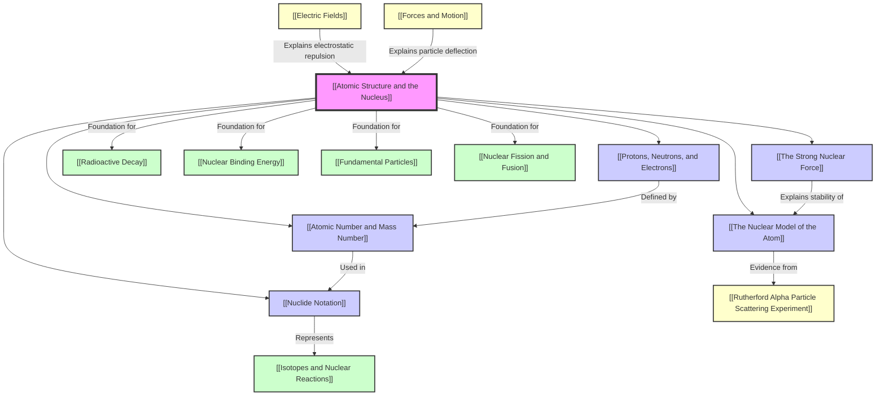

# 1. Overview / 概述

**English:**
This topic, "Atomic Structure and the Nucleus," forms the foundational bedrock of nuclear and particle physics at the A-Level. It moves beyond the simple "plum pudding" model of the atom to establish the modern nuclear model, where a tiny, dense, positively charged nucleus is surrounded by orbiting electrons. We will explore the experimental evidence that led to this paradigm shift, primarily the famous [[Rutherford Alpha Particle Scattering Experiment]]. The topic introduces the key subatomic particles—[[Protons, Neutrons, and Electrons]]—and the fundamental quantities that define an atom: [[Atomic Number and Mass Number]]. We will learn how to represent different atomic species using [[Nuclide Notation]] and understand the concept of [[Isotopes and Nuclear Reactions]]. Crucially, we will investigate the [[The Strong Nuclear Force]], the powerful, short-range interaction that binds protons and neutrons together in the nucleus, overcoming the immense electrostatic repulsion between protons. This understanding is essential for explaining nuclear stability, radioactive decay, and the energy released in nuclear reactions.

In the context of the Cambridge 9702 and Edexcel IAL A-Level Physics examinations, this topic is a high-priority foundation. It is assessed not only through direct questions on atomic structure and nuclear notation but also as prerequisite knowledge for more advanced topics like [[Radioactive Decay]], [[Nuclear Binding Energy]], and [[Particle Physics]]. A solid grasp of this material is crucial for achieving high marks in both multiple-choice and structured questions. Real-world applications are profound, ranging from medical imaging (PET scans) and cancer treatment (radiotherapy) to nuclear power generation and carbon dating in archaeology.

**中文：**
本主题“原子结构与原子核”构成了A-Level核物理与粒子物理学的基石。它将超越简单的“葡萄干布丁”原子模型，建立现代核模型：一个微小、致密、带正电的原子核被绕核运动的电子所包围。我们将探索导致这一范式转变的实验证据，主要是著名的[[卢瑟福α粒子散射实验]]。本主题介绍了关键的亚原子粒子——[[质子、中子和电子]]，以及定义原子的基本量：[[原子序数和质量数]]。我们将学习如何使用[[核素符号]]来表示不同的原子种类，并理解[[同位素与核反应]]的概念。至关重要的是，我们将研究[[强核力]]，这是一种强大的、短程的相互作用，它将原子核内的质子和中子结合在一起，克服了质子之间巨大的静电斥力。这种理解对于解释核稳定性、放射性衰变以及核反应中释放的能量至关重要。

在剑桥9702和爱德思IAL A-Level物理考试中，本主题是一个高优先级的基石。它不仅通过关于原子结构和核符号的直接问题进行评估，而且也是学习[[放射性衰变]]、[[核结合能]]和[[粒子物理学]]等更高级主题的先决知识。扎实掌握这些内容对于在选择题和结构化问题中取得高分至关重要。其实际应用意义深远，从医学成像（PET扫描）和癌症治疗（放射治疗）到核能发电和考古学中的碳定年法。

---

# 2. Syllabus Learning Objectives / 考纲学习目标

| CAIE 9702 | Edexcel IAL |
|-----------|-------------|
| **1.1 (a)** Describe the structure of the atom in terms of a nucleus and electrons. | **6.1** Know the properties of protons, neutrons and electrons. |
| **1.1 (b)** Describe the composition of the nucleus in terms of protons and neutrons. | **6.2** Understand the terms atomic (proton) number, mass (nucleon) number and isotope. |
| **1.1 (c)** Define the terms *proton number (Z)*, *nucleon number (A)*, and *isotope*. | **6.3** Use the nuclide notation $\ce{^{A}_{Z}X}$. |
| **1.1 (d)** Use the nuclide notation $\ce{^{A}_{Z}X}$. | **6.4** Understand the strong nuclear force and its role in the stability of the nucleus. |
| **1.1 (e)** Describe the strong nuclear force and its role in the stability of the nucleus. | **6.5** Understand the nature of the strong nuclear force (short-range, attractive up to ~3 fm, repulsive below ~0.5 fm). |

**Examiner Expectations / 考官期望:**
- **English:** Candidates must be able to recall the key properties of subatomic particles (mass, charge, location). They must be able to define and use the terms proton number (Z), nucleon number (A), and isotope accurately. The ability to write and interpret nuclide notation is essential. For the strong nuclear force, candidates must describe its nature (attractive, short-range) and explain its role in overcoming electrostatic repulsion to bind the nucleus together. A qualitative understanding of the force-distance graph is expected.
- **中文：** 考生必须能够回忆亚原子粒子的关键性质（质量、电荷、位置）。他们必须能够准确定义并使用术语“质子数 (Z)”、“核子数 (A)”和“同位素”。能够书写和解释核素符号至关重要。对于强核力，考生必须描述其性质（吸引力、短程）并解释其在克服静电斥力以结合原子核方面的作用。需要定性地理解力-距离图。

> 📋 **CIE Only:** The Cambridge syllabus explicitly mentions describing the structure of the atom in terms of a nucleus and electrons, which often links to the historical development of the model (e.g., Rutherford's experiment).
> 📋 **Edexcel Only:** The Edexcel syllabus provides more specific numerical details for the strong nuclear force, stating it is attractive up to ~3 fm and repulsive below ~0.5 fm. This quantitative boundary is a key detail for Edexcel exams.

---

# 3. Core Definitions / 核心定义

| Term (EN/CN) | Definition (EN) | Definition (CN) | Common Mistakes / 常见错误 |
|--------------|-----------------|-----------------|---------------------------|
| **Atom / 原子** | The smallest unit of a chemical element that retains the chemical properties of that element. It consists of a nucleus surrounded by electrons. | 保持元素化学性质的最小单位。它由一个原子核和围绕其运动的电子组成。 | Confusing atom with molecule. An atom is a single particle; a molecule is two or more atoms bonded together. |
| **Nucleus / 原子核** | The small, dense, positively charged central core of an atom, containing protons and neutrons. | 原子中微小、致密、带正电的中心核心，包含质子和中子。 | Thinking the nucleus is large compared to the atom. It is about 1/10,000th the diameter of the atom. |
| **[[Protons, Neutrons, and Electrons\|Proton / 质子]]** | A positively charged subatomic particle found in the nucleus. It has a relative charge of +1 and a relative mass of 1. | 存在于原子核中的带正电的亚原子粒子。其相对电荷为+1，相对质量为1。 | Forgetting its charge is positive. Confusing its mass with an electron's mass. |
| **[[Protons, Neutrons, and Electrons\|Neutron / 中子]]** | An uncharged (neutral) subatomic particle found in the nucleus. It has a relative charge of 0 and a relative mass of 1. | 存在于原子核中的不带电（中性）亚原子粒子。其相对电荷为0，相对质量为1。 | Thinking it has no mass. It has almost the same mass as a proton. |
| **[[Protons, Neutrons, and Electrons\|Electron / 电子]]** | A negatively charged subatomic particle that orbits the nucleus. It has a relative charge of -1 and a relative mass of 1/1836 (often approximated as 0). | 绕原子核运动的带负电的亚原子粒子。其相对电荷为-1，相对质量为1/1836（通常近似为0）。 | Forgetting its mass is negligible compared to protons and neutrons. |
| **[[Atomic Number and Mass Number\|Atomic (Proton) Number (Z) / 原子序数（质子数）]]** | The number of protons in the nucleus of an atom. It uniquely identifies a chemical element. | 原子核中质子的数量。它唯一地标识一种化学元素。 | Confusing it with mass number. Z determines the element, not A. |
| **[[Atomic Number and Mass Number\|Mass (Nucleon) Number (A) / 质量数（核子数）]]** | The total number of protons and neutrons (nucleons) in the nucleus of an atom. | 原子核中质子与中子的总数（核子数）。 | Thinking it is the actual mass of the atom. It is the *number* of nucleons, proportional to the mass. |
| **[[Isotopes and Nuclear Reactions\|Isotope / 同位素]]** | Atoms of the same element (same Z) that have different numbers of neutrons (different A). | 同一元素（相同Z）但中子数不同（不同A）的原子。 | Thinking isotopes have different chemical properties. They have the same chemical properties but different physical properties (e.g., mass). |
| **[[Nuclide Notation\|Nuclide / 核素]]** | A specific type of atom characterized by its number of protons (Z) and number of neutrons (N). It is represented by the notation $\ce{^{A}_{Z}X}$. | 由其质子数 (Z) 和中子数 (N) 表征的特定类型的原子。用符号 $\ce{^{A}_{Z}X}$ 表示。 | Using the term "nuclide" and "nucleus" interchangeably. A nuclide is a type of atom; the nucleus is the central part of an atom. |
| **[[The Strong Nuclear Force\|Strong Nuclear Force / 强核力]]** | The fundamental force that binds protons and neutrons together in the nucleus. It is a short-range, attractive force that overcomes the electrostatic repulsion between protons. | 将原子核内的质子和中子结合在一起的基力。它是一种短程吸引力，克服了质子之间的静电斥力。 | Thinking it acts on electrons. It only acts on nucleons (protons and neutrons). Forgetting it is repulsive at very short distances. |

---

# 4. Key Concepts Explained / 关键概念详解

## 4.1 The Nuclear Model of the Atom / 原子核模型

### Explanation / 解释
**English:** The modern [[The Nuclear Model of the Atom]] was established by [[Ernest Rutherford]] and his team (Geiger and Marsden) in 1909 through the famous [[Rutherford Alpha Particle Scattering Experiment]]. They fired a beam of alpha particles ($\ce{^{4}_{2}He^{2+}}$) at a thin gold foil. Most alpha particles passed straight through, but a small number were deflected by large angles, and about 1 in 8000 bounced back. This was inconsistent with the prevailing "plum pudding" model (where positive charge was spread throughout the atom). Rutherford concluded that the atom must consist of a tiny, dense, positively charged nucleus containing most of the mass, surrounded by a large volume of empty space where electrons orbit.
**中文：** 现代[[原子核模型]]是由[[欧内斯特·卢瑟福]]及其团队（盖革和马斯登）在1909年通过著名的[[卢瑟福α粒子散射实验]]建立的。他们用一束α粒子（$\ce{^{4}_{2}He^{2+}}$）轰击一张薄金箔。大多数α粒子径直穿过，但少数被大角度偏转，大约每8000个中就有1个被反弹回来。这与当时流行的“葡萄干布丁”模型（正电荷均匀分布在原子中）不符。卢瑟福得出结论：原子必须由一个微小、致密、带正电且包含大部分质量的原子核组成，周围是广阔的、电子绕其运动的空旷空间。

### Physical Meaning / 物理意义
**English:** This model explains why matter is mostly empty space. It also explains the existence of discrete energy levels (electrons can only exist in specific orbits) and the stability of atoms (electrons are held in orbit by the electrostatic attraction to the nucleus).
**中文：** 这个模型解释了为什么物质大部分是空的。它也解释了离散能级的存在（电子只能存在于特定的轨道上）以及原子的稳定性（电子通过原子核的静电吸引力被束缚在轨道上）。

### Common Misconceptions / 常见误区
- **English:** Thinking the nucleus is a large part of the atom. In reality, if an atom were the size of a football stadium, the nucleus would be the size of a pea at the center.
- **中文：** 认为原子核是原子的大部分。实际上，如果一个原子有足球场那么大，原子核只有中心的一粒豌豆大小。
- **English:** Believing electrons orbit the nucleus in fixed, planetary-like paths. The modern quantum mechanical model describes them as existing in "clouds" or orbitals of probability.
- **中文：** 相信电子像行星一样沿着固定的轨道绕核运动。现代量子力学模型将电子描述为存在于概率“云”或轨道中。

### Exam Tips / 考试提示
**English:** Be prepared to describe the Rutherford scattering experiment, including the setup, observations, and conclusions. You may be asked to explain why most alpha particles pass through, why some are deflected, and why a few bounce back. Link the observations directly to the properties of the nucleus (small, dense, positive).
**中文：** 准备好描述卢瑟福散射实验，包括装置、观察结果和结论。你可能会被要求解释为什么大多数α粒子穿过，为什么有些被偏转，以及为什么少数被反弹回来。将观察结果直接与原子核的性质（微小、致密、带正电）联系起来。

> 📷 **IMAGE PROMPT — [ATOM-01]: Rutherford Alpha Particle Scattering Experiment Setup**
>
> A schematic diagram showing a radioactive source emitting a beam of alpha particles towards a thin gold foil. The foil is surrounded by a fluorescent zinc sulfide screen. Most alpha particles pass straight through the foil and hit the screen behind it. A few alpha particles are deflected at large angles, and one is shown bouncing back towards the source. Labels: "Alpha Particle Source (Radium)", "Thin Gold Foil", "Zinc Sulfide Screen", "Most α-particles pass through", "Small angle deflection", "Large angle deflection", "Back-scattered α-particle". Clean, educational diagram style, white background, clear arrows.

---

## 4.2 Protons, Neutrons, and Electrons / 质子、中子和电子

### Explanation / 解释
**English:** These are the three fundamental subatomic particles that make up an atom. [[Protons, Neutrons, and Electrons]] have distinct properties. Protons and neutrons are located in the nucleus and are collectively called **nucleons**. Electrons orbit the nucleus in shells or energy levels. The number of protons determines the element (Z). The number of neutrons determines the isotope. In a neutral atom, the number of electrons equals the number of protons.
**中文：** 这三种是构成原子的基本亚原子粒子。[[质子、中子和电子]]具有不同的性质。质子和中子位于原子核中，统称为**核子**。电子在壳层或能级中绕核运动。质子数决定元素 (Z)。中子数决定同位素。在中性原子中，电子数等于质子数。

### Physical Meaning / 物理意义
**English:** The balance between the number of protons and neutrons determines nuclear stability. The arrangement of electrons determines the chemical properties of an element. The mass of an atom is almost entirely due to its protons and neutrons.
**中文：** 质子数与中子数之间的平衡决定了原子核的稳定性。电子的排布决定了元素的化学性质。原子的质量几乎完全来自其质子和中子。

### Common Misconceptions / 常见误区
- **English:** Thinking electrons have significant mass. Their mass is ~1/1836 of a proton, so it is negligible in mass calculations.
- **中文：** 认为电子有显著的质量。其质量约为质子的1/1836，因此在质量计算中可以忽略不计。
- **English:** Confusing the charge of a proton (+1) with the charge of an electron (-1). They are equal in magnitude but opposite in sign.
- **中文：** 混淆质子的电荷 (+1) 和电子的电荷 (-1)。它们大小相等，但符号相反。

### Exam Tips / 考试提示
**English:** You must be able to recall the relative masses and charges of these particles. A common question is to calculate the number of protons, neutrons, and electrons in a given atom or ion from its nuclide notation.
**中文：** 你必须能够回忆这些粒子的相对质量和电荷。一个常见的问题是根据给定的核素符号计算原子或离子中的质子、中子和电子数。

---

## 4.3 Atomic Number and Mass Number / 原子序数和质量数

### Explanation / 解释
**English:** [[Atomic Number and Mass Number]] are the two key numbers that define a nuclide. The **atomic number (Z)** is the number of protons. It defines the element. The **mass number (A)** is the total number of protons and neutrons (nucleons). The number of neutrons (N) can be found by $N = A - Z$.
**中文：** [[原子序数和质量数]]是定义核素的两个关键数字。**原子序数 (Z)** 是质子数。它定义了元素。**质量数 (A)** 是质子与中子的总数（核子数）。中子数 (N) 可以通过 $N = A - Z$ 求得。

### Physical Meaning / 物理意义
**English:** Z tells you the element's identity and its chemical behavior. A tells you the approximate mass of the atom (in atomic mass units, u). The difference between A and Z (N) tells you about the isotope and influences nuclear stability.
**中文：** Z 告诉你元素的身份及其化学行为。A 告诉你原子的近似质量（以原子质量单位 u 计）。A 与 Z 的差 (N) 告诉你同位素的信息并影响核稳定性。

### Common Misconceptions / 常见误区
- **English:** Thinking the mass number is the actual mass. It is the *number* of nucleons. The actual mass is approximately A atomic mass units (u).
- **中文：** 认为质量数是实际质量。它是核子的*数量*。实际质量大约是 A 个原子质量单位 (u)。
- **English:** Confusing Z and A when writing nuclide notation. Remember: Z is the bottom number (protons), A is the top number (nucleons).
- **中文：** 在书写核素符号时混淆 Z 和 A。记住：Z 是下面的数字（质子数），A 是上面的数字（核子数）。

### Exam Tips / 考试提示
**English:** You will be expected to use these definitions to solve problems. For example, "An atom has 11 protons and 12 neutrons. What is its atomic number, mass number, and nuclide notation?" (Answer: Z=11, A=23, $\ce{^{23}_{11}Na}$).
**中文：** 你将被要求使用这些定义来解决问题。例如：“一个原子有11个质子和12个中子。它的原子序数、质量数和核素符号是什么？”（答案：Z=11, A=23, $\ce{^{23}_{11}Na}$）。

---

## 4.4 Nuclide Notation / 核素符号

### Explanation / 解释
**English:** [[Nuclide Notation]] is a standard way to represent a specific nuclide. It is written as $\ce{^{A}_{Z}X}$, where X is the chemical symbol for the element. For example, $\ce{^{12}_{6}C}$ represents a carbon atom with 6 protons and 6 neutrons. $\ce{^{14}_{6}C}$ represents a different isotope of carbon (carbon-14) with 6 protons and 8 neutrons.
**中文：** [[核素符号]]是表示特定核素的标准方式。它写作 $\ce{^{A}_{Z}X}$，其中 X 是元素的化学符号。例如，$\ce{^{12}_{6}C}$ 表示一个具有6个质子和6个中子的碳原子。$\ce{^{14}_{6}C}$ 表示碳的另一种同位素（碳-14），具有6个质子和8个中子。

### Physical Meaning / 物理意义
**English:** This notation provides a concise way to communicate the exact composition of any atomic nucleus. It is essential for writing nuclear equations for [[Radioactive Decay]] and [[Nuclear Reactions]].
**中文：** 这种符号提供了一种简洁的方式来传达任何原子核的确切组成。它对于书写[[放射性衰变]]和[[核反应]]的核方程至关重要。

### Common Misconceptions / 常见误区
- **English:** Writing the atomic number (Z) on top and mass number (A) on the bottom. The correct format is $\ce{^{A}_{Z}X}$.
- **中文：** 将原子序数 (Z) 写在上面，质量数 (A) 写在下面。正确的格式是 $\ce{^{A}_{Z}X}$。
- **English:** Forgetting that the chemical symbol X already implies Z. The notation is redundant but very useful.
- **中文：** 忘记化学符号 X 已经隐含了 Z。这个符号是冗余的但非常有用。

### Exam Tips / 考试提示
**English:** You will frequently be asked to write nuclide notation for a given atom or to interpret it to find the number of protons, neutrons, and electrons. This is a fundamental skill for the entire nuclear physics topic.
**中文：** 你经常会被要求为给定的原子书写核素符号，或者解释它以找出质子、中子和电子的数量。这是整个核物理主题的基本技能。

---

## 4.5 The Strong Nuclear Force / 强核力

### Explanation / 解释
**English:** [[The Strong Nuclear Force]] is the fundamental force responsible for holding the nucleus together. Without it, the positively charged protons would repel each other electrostatically, and the nucleus would fly apart. The strong force has several key properties:
1.  **Attractive:** It pulls nucleons (protons and neutrons) together.
2.  **Short-range:** It only acts over very small distances, approximately up to 3 femtometers (fm, $3 \times 10^{-15}$ m). This is roughly the diameter of a medium-sized nucleus.
3.  **Repulsive at very short distances:** Below about 0.5 fm, the force becomes strongly repulsive. This prevents nucleons from getting too close and collapsing the nucleus.
4.  **Charge-independent:** It acts equally between any pair of nucleons (p-p, p-n, n-n).
**中文：** [[强核力]]是将原子核结合在一起的基力。没有它，带正电的质子会因静电斥力而相互排斥，原子核就会飞散。强核力有几个关键性质：
1.  **吸引力：** 它将核子（质子和中子）拉在一起。
2.  **短程：** 它只在非常小的距离内起作用，大约可达3飞米（fm，$3 \times 10^{-15}$ 米）。这大约是一个中等大小原子核的直径。
3.  **在极短距离内表现为斥力：** 在约0.5 fm以下，该力变为强斥力。这防止了核子靠得太近而导致原子核坍缩。
4.  **与电荷无关：** 它对任何一对核子（p-p, p-n, n-n）的作用是相同的。

### Physical Meaning / 物理意义
**English:** The strong force is what makes stable nuclei possible. It explains why many protons can exist together in a tiny space. The balance between the attractive strong force and the repulsive electrostatic force determines the stability of a nucleus. Larger nuclei require more neutrons to provide additional strong force attraction without adding more electrostatic repulsion.
**中文：** 强核力是使稳定原子核成为可能的原因。它解释了为什么许多质子可以共存于一个微小的空间中。吸引性的强核力与排斥性的静电力之间的平衡决定了原子核的稳定性。较大的原子核需要更多的中子来提供额外的强核力吸引，而不会增加更多的静电斥力。

### Common Misconceptions / 常见误区
- **English:** Thinking the strong force acts on electrons. It only acts on nucleons (protons and neutrons).
- **中文：** 认为强核力作用于电子。它只作用于核子（质子和中子）。
- **English:** Forgetting that the strong force is repulsive at very short distances. This is a crucial detail for understanding why nuclei don't collapse.
- **中文：** 忘记强核力在极短距离内是斥力。这是理解原子核为何不坍缩的关键细节。
- **English:** Confusing the strong nuclear force with the weak nuclear force (responsible for beta decay).
- **中文：** 将强核力与弱核力（负责β衰变）混淆。

### Exam Tips / 考试提示
**English:** You must be able to describe the properties of the strong nuclear force. A common question is to sketch or interpret a graph of the strong nuclear force against separation distance. You should be able to label the attractive and repulsive regions and explain how this force overcomes electrostatic repulsion to bind the nucleus.
**中文：** 你必须能够描述强核力的性质。一个常见的问题是绘制或解释强核力随距离变化的图表。你应该能够标出吸引区和排斥区，并解释这种力如何克服静电斥力来结合原子核。

> 📷 **IMAGE PROMPT — [ATOM-02]: Strong Nuclear Force vs. Separation Graph**
>
> A graph with the y-axis labeled "Force (F)" and the x-axis labeled "Separation (r / fm)". A horizontal line at F=0 is the x-axis. A curve starts from the top-left (repulsive, F>0) at very small r (<0.5 fm), crosses the x-axis at r≈0.5 fm, goes down to a minimum (maximum attractive force) at r≈1 fm, then rises back up to cross the x-axis at r≈3 fm, and stays at F=0 for larger r. The region to the left of the first crossing is labeled "Repulsive Region". The region between the two crossings is labeled "Attractive Region". The region to the right of the second crossing is labeled "No Force". A dashed line shows the electrostatic repulsion force between two protons for comparison, which is always repulsive and extends to larger distances. Clean, educational graph style, white background.

---

# 5. Essential Equations / 核心公式

## 5.1 Number of Neutrons / 中子数

**Equation / 公式:**
$$ N = A - Z $$

**Variables / 变量:**
| Symbol (符号) | Meaning (EN) | Meaning (CN) | Unit (单位) |
|--------------|-------------|-------------|------------|
| $N$ | Number of neutrons | 中子数 | (dimensionless) |
| $A$ | Mass (nucleon) number | 质量数（核子数） | (dimensionless) |
| $Z$ | Atomic (proton) number | 原子序数（质子数） | (dimensionless) |

**Derivation / 推导:**
**English:** By definition, the mass number (A) is the total number of nucleons (protons + neutrons). The atomic number (Z) is the number of protons. Therefore, the number of neutrons (N) is the difference between them.
**中文：** 根据定义，质量数 (A) 是核子总数（质子 + 中子）。原子序数 (Z) 是质子数。因此，中子数 (N) 是它们之间的差。

**Conditions / 适用条件:**
**English:** This equation applies to any atomic nucleus.
**中文：** 该方程适用于任何原子核。

**Limitations / 局限性:**
**English:** None. It is a definitional relationship.
**中文：** 无。这是一个定义性的关系。

**Rearrangements / 变形:**
**English:** $A = Z + N$, $Z = A - N$
**中文：** $A = Z + N$, $Z = A - N$

---

## 5.2 Electrostatic Force Between Two Protons (Coulomb's Law) / 两个质子之间的静电力（库仑定律）

**Equation / 公式:**
$$ F = \frac{1}{4\pi \epsilon_0} \frac{Q_1 Q_2}{r^2} $$

**Variables / 变量:**
| Symbol (符号) | Meaning (EN) | Meaning (CN) | Unit (单位) |
|--------------|-------------|-------------|------------|
| $F$ | Electrostatic force | 静电力 | N (Newtons) |
| $\epsilon_0$ | Permittivity of free space | 真空介电常数 | $F m^{-1}$ (Farads per meter) |
| $Q_1, Q_2$ | Charges of the two particles | 两个粒子的电荷 | C (Coulombs) |
| $r$ | Separation between the particles | 粒子之间的距离 | m (meters) |

**Derivation / 推导:**
**English:** This is Coulomb's Law, a fundamental law of electrostatics. For two protons, $Q_1 = Q_2 = +e = 1.60 \times 10^{-19}$ C. The force is repulsive.
**中文：** 这是库仑定律，静电学的基本定律。对于两个质子，$Q_1 = Q_2 = +e = 1.60 \times 10^{-19}$ C。该力是斥力。

**Conditions / 适用条件:**
**English:** This applies to point charges or charged spheres in a vacuum.
**中文：** 这适用于真空中的点电荷或带电球体。

**Limitations / 局限性:**
**English:** It does not account for the strong nuclear force. It only describes the electrostatic interaction.
**中文：** 它不考虑强核力。它只描述静电相互作用。

**Rearrangements / 变形:**
**English:** $r = \sqrt{\frac{1}{4\pi \epsilon_0} \frac{Q_1 Q_2}{F}}$
**中文：** $r = \sqrt{\frac{1}{4\pi \epsilon_0} \frac{Q_1 Q_2}{F}}$

---

# 6. Graphs and Relationships / 图表与关系

## 6.1 Strong Nuclear Force vs. Nucleon Separation / 强核力与核子间距的关系

### Axes / 坐标轴
**English:** Y-axis: Force (F) / 力 (F); X-axis: Separation (r / fm) / 间距 (r / fm)
**中文：** Y轴：力 (F)；X轴：间距 (r / fm)

### Shape / 形状
**English:** The graph starts with a steep repulsive region (F > 0) for r < 0.5 fm. It crosses zero at r ≈ 0.5 fm, becoming attractive (F < 0). It reaches a maximum attractive force at r ≈ 1 fm. It then decays back to zero, crossing the axis again at r ≈ 3 fm. For r > 3 fm, the force is negligible.
**中文：** 图表从 r < 0.5 fm 的陡峭排斥区 (F > 0) 开始。在 r ≈ 0.5 fm 处穿过零，变为吸引力 (F < 0)。在 r ≈ 1 fm 处达到最大吸引力。然后衰减回零，在 r ≈ 3 fm 处再次穿过轴线。对于 r > 3 fm，力可以忽略不计。

### Gradient Meaning / 斜率含义
**English:** The gradient of the F-r graph is related to the stiffness of the nuclear interaction. A steep gradient in the repulsive region indicates a very strong resistance to compression.
**中文：** F-r 图的斜率与核相互作用的刚度有关。排斥区的陡峭梯度表明对压缩有非常强的抵抗力。

### Area Meaning / 面积含义
**English:** The area under the F-r graph represents the work done or the potential energy of the interaction.
**中文：** F-r 图下的面积代表所做的功或相互作用的势能。

### Exam Interpretation / 考试解读
**English:** You will be asked to identify the attractive and repulsive regions. You must be able to explain that the attractive region (0.5 fm < r < 3 fm) is what binds the nucleus, and the repulsive region (r < 0.5 fm) prevents the nucleus from collapsing. You should also compare this curve to the electrostatic repulsion curve for two protons.
**中文：** 你将被要求识别吸引区和排斥区。你必须能够解释吸引区 (0.5 fm < r < 3 fm) 是结合原子核的原因，而排斥区 (r < 0.5 fm) 防止原子核坍缩。你还应该将此曲线与两个质子的静电斥力曲线进行比较。

### Common Questions / 常见问题
**English:**
1.  "On the axes provided, sketch a graph showing how the strong nuclear force between two nucleons varies with their separation."
2.  "Explain why the strong nuclear force is necessary for the stability of the nucleus."
3.  "Compare the range and nature of the strong nuclear force with the electrostatic force."
**中文：**
1.  “在提供的坐标轴上，画出两个核子之间的强核力随其间距变化的草图。”
2.  “解释为什么强核力对于原子核的稳定性是必要的。”
3.  “比较强核力与静电力的作用范围和性质。”

---

# 7. Required Diagrams / 必备图表

## 7.1 The Rutherford Alpha Particle Scattering Experiment / 卢瑟福α粒子散射实验

### Description / 描述
**English:** A diagram showing the experimental setup: a radioactive source emitting alpha particles, a collimator to produce a narrow beam, a thin gold foil target, and a movable zinc sulfide (ZnS) screen connected to a microscope to detect the alpha particles. The paths of the alpha particles (most undeflected, some deflected, a few back-scattered) should be clearly shown.
**中文：** 显示实验装置的图表：发射α粒子的放射源、产生窄束的准直器、薄金箔靶，以及连接到显微镜的可移动硫化锌 (ZnS) 荧光屏，用于检测α粒子。应清晰显示α粒子的路径（大多数未偏转，一些偏转，少数被反向散射）。

### Image Prompt / 图片生成提示
> 📷 **IMAGE PROMPT — [ATOM-03]: Rutherford Scattering Experiment Diagram**
>
> A clean, labeled schematic diagram of the Rutherford alpha particle scattering experiment. A lead box with a small hole contains a radium source emitting alpha particles. The beam passes through a collimator and hits a thin gold foil. A zinc sulfide screen is placed around the foil, connected to a microscope. Arrows show the paths: a thick straight arrow through the foil representing most particles, a few curved arrows showing small-angle deflection, and one arrow curving back towards the source showing a large-angle back-scattering. Labels: "Alpha Particle Source (Ra)", "Lead Collimator", "Thin Gold Foil", "Zinc Sulfide Screen", "Microscope", "Most α-particles (undeflected)", "Small angle deflection", "Large angle back-scattering". Educational diagram style, white background, clear black lines.

### Labels Required / 需要标注
**English:** Alpha particle source, collimator, thin gold foil, zinc sulfide screen, microscope, paths of alpha particles (undeflected, deflected, back-scattered).
**中文：** α粒子源、准直器、薄金箔、硫化锌荧光屏、显微镜、α粒子路径（未偏转、偏转、反向散射）。

### Exam Importance / 考试重要性
**English:** This is the classic experiment that proved the existence of the nucleus. You must be able to describe the setup, observations, and conclusions. It is a very common exam question.
**中文：** 这是证明原子核存在的经典实验。你必须能够描述其装置、观察结果和结论。这是一个非常常见的考试题目。

---

## 7.2 The Strong Nuclear Force vs. Separation Graph / 强核力与间距关系图

### Description / 描述
**English:** A graph with Force (F) on the y-axis and separation (r) on the x-axis. The curve shows a repulsive region at very small r (< 0.5 fm), an attractive region (0.5 fm < r < 3 fm), and zero force beyond ~3 fm. The maximum attractive force is at r ≈ 1 fm.
**中文：** 一个以力 (F) 为Y轴、间距 (r) 为X轴的图表。曲线显示在非常小的 r (< 0.5 fm) 处有排斥区，在 (0.5 fm < r < 3 fm) 处有吸引区，在约3 fm 以外力为零。最大吸引力出现在 r ≈ 1 fm 处。

### Image Prompt / 图片生成提示
> 📷 **IMAGE PROMPT — [ATOM-04]: Strong Nuclear Force Graph**
>
> A graph with y-axis "Force (F)" and x-axis "Separation (r / fm)". A horizontal dashed line at F=0. A curve starts high on the left (repulsive, F>0), drops sharply, crosses the x-axis at r=0.5 fm, goes to a minimum (maximum attractive force) at r=1 fm, then rises back up to cross the x-axis at r=3 fm, and stays at F=0 for r>3 fm. The region left of 0.5 fm is shaded red and labeled "Repulsive Region". The region between 0.5 fm and 3 fm is shaded green and labeled "Attractive Region". The region right of 3 fm is unshaded and labeled "No Force". A dashed blue curve shows the electrostatic repulsion force for comparison, which is always positive and decays slowly. Clean, educational graph style, white background.

### Labels Required / 需要标注
**English:** Force (F), Separation (r / fm), Repulsive Region, Attractive Region, No Force, 0.5 fm, 3 fm, Electrostatic Repulsion (for comparison).
**中文：** 力 (F)、间距 (r / fm)、排斥区、吸引区、无力区、0.5 fm、3 fm、静电斥力（用于比较）。

### Exam Importance / 考试重要性
**English:** This graph is essential for understanding nuclear stability. You will be asked to sketch it, label its regions, and explain its significance.
**中文：** 这个图表对于理解核稳定性至关重要。你将被要求绘制它，标出其区域，并解释其意义。

---

## 7.3 Nuclide Notation Diagram / 核素符号示意图

### Description / 描述
**English:** A simple diagram showing the nuclide notation $\ce{^{A}_{Z}X}$ with arrows pointing to A, Z, and X, explaining what each part represents. A second part of the diagram shows a specific example, e.g., $\ce{^{23}_{11}Na}$, with a table showing the number of protons (11), neutrons (12), and electrons (11).
**中文：** 一个简单的图表，显示核素符号 $\ce{^{A}_{Z}X}$，并用箭头指向 A、Z 和 X，解释每个部分代表什么。图表的第二部分显示一个具体的例子，例如 $\ce{^{23}_{11}Na}$，并附有一个表格显示质子数 (11)、中子数 (12) 和电子数 (11)。

### Image Prompt / 图片生成提示
> 📷 **IMAGE PROMPT — [ATOM-05]: Nuclide Notation Explanation**
>
> A two-part educational diagram. Part 1: A large nuclide notation symbol $\ce{^{A}_{Z}X}$ in the center. An arrow from the top points to "A" with label "Mass Number (Protons + Neutrons)". An arrow from the bottom points to "Z" with label "Atomic Number (Protons)". An arrow from the side points to "X" with label "Chemical Symbol". Part 2: The specific example $\ce{^{23}_{11}Na}$. Below it, a simple table with three rows: "Protons: 11", "Neutrons: 12", "Electrons: 11". Clean, educational diagram style, white background, clear labels.

### Labels Required / 需要标注
**English:** Mass Number (A), Atomic Number (Z), Chemical Symbol (X), Protons, Neutrons, Electrons.
**中文：** 质量数 (A)、原子序数 (Z)、化学符号 (X)、质子、中子、电子。

### Exam Importance / 考试重要性
**English:** This diagram reinforces the fundamental skill of interpreting and using nuclide notation, which is used throughout the nuclear physics topic.
**中文：** 这个图表强化了解释和使用核素符号的基本技能，该技能贯穿整个核物理主题。

---

# 8. Worked Examples / 典型例题

## Example 1: Determining Subatomic Particles from Nuclide Notation / 从核素符号确定亚原子粒子

### Question / 题目
**English:** An atom of uranium is represented by the nuclide notation $\ce{^{238}_{92}U}$. Determine the number of protons, neutrons, and electrons in this atom.
**中文：** 一个铀原子用核素符号 $\ce{^{238}_{92}U}$ 表示。确定该原子中的质子数、中子数和电子数。

### Solution / 解答
**Step 1: Identify Z and A.**
From the notation $\ce{^{238}_{92}U}$:
- Atomic number (Z) = 92
- Mass number (A) = 238

**Step 2: Determine the number of protons.**
The number of protons is equal to the atomic number (Z).
Number of protons = 92

**Step 3: Determine the number of neutrons.**
The number of neutrons (N) is given by $N = A - Z$.
$N = 238 - 92 = 146$

**Step 4: Determine the number of electrons.**
In a neutral atom, the number of electrons equals the number of protons.
Number of electrons = 92

**中文：**
**步骤1：确定 Z 和 A。**
从符号 $\ce{^{238}_{92}U}$ 中：
- 原子序数 (Z) = 92
- 质量数 (A) = 238

**步骤2：确定质子数。**
质子数等于原子序数 (Z)。
质子数 = 92

**步骤3：确定中子数。**
中子数 (N) 由 $N = A - Z$ 给出。
$N = 238 - 92 = 146$

**步骤4：确定电子数。**
在中性原子中，电子数等于质子数。
电子数 = 92

### Final Answer / 最终答案
**Answer:** Protons: 92, Neutrons: 146, Electrons: 92 | **答案：** 质子：92，中子：146，电子：92

### Examiner Notes / 考官点评
**English:** This is a straightforward application of the definitions. The most common mistake is to confuse Z and A, leading to an incorrect number of neutrons. Always remember: Z is the bottom number (protons), A is the top number (nucleons).
**中文：** 这是对定义的直接应用。最常见的错误是混淆 Z 和 A，导致中子数错误。始终记住：Z 是下面的数字（质子数），A 是上面的数字（核子数）。

---

## Example 2: Explaining Nuclear Stability / 解释核稳定性

### Question / 题目
**English:** Explain why a large number of neutrons are required for the stability of a large nucleus, such as uranium-238 ($\ce{^{238}_{92}U}$).
**中文：** 解释为什么大的原子核（如铀-238 ($\ce{^{238}_{92}U}$)）的稳定性需要大量的中子。

### Solution / 解答
**Step 1: Identify the forces involved.**
The stability of a nucleus depends on the balance between two opposing forces:
1.  The **electrostatic repulsion** between positively charged protons, which tries to push the nucleus apart.
2.  The **strong nuclear force** between nucleons (protons and neutrons), which is attractive and tries to hold the nucleus together.

**Step 2: Explain the range of the forces.**
The electrostatic force is a long-range force, so every proton in the nucleus repels every other proton. The strong nuclear force is a very short-range force (only acts up to ~3 fm). A nucleon only feels the strong force from its immediate neighbors.

**Step 3: Explain the role of neutrons.**
In a large nucleus, the electrostatic repulsion is significant because there are many protons. To overcome this repulsion, a large total attractive strong force is needed. Adding more protons would increase the repulsion even further. However, adding **neutrons** provides additional strong nuclear force attraction (since neutrons are nucleons and feel the strong force) without adding any electrostatic repulsion (since neutrons are neutral). Therefore, larger nuclei require a higher ratio of neutrons to protons (N/Z ratio) to be stable.

**中文：**
**步骤1：识别涉及的力。**
原子核的稳定性取决于两个相反力之间的平衡：
1.  带正电的质子之间的**静电斥力**，它试图将原子核推开。
2.  核子（质子和中子）之间的**强核力**，它是吸引力，试图将原子核结合在一起。

**步骤2：解释力的作用范围。**
静电力是长程力，因此原子核中的每个质子都排斥其他所有质子。强核力是极短程力（仅在约3 fm内起作用）。一个核子只能感受到其紧邻核子的强核力。

**步骤3：解释中子的作用。**
在大的原子核中，由于质子数量多，静电斥力非常显著。为了克服这种斥力，需要大的总吸引性强核力。增加更多质子会进一步增加斥力。然而，增加**中子**可以提供额外的强核力吸引力（因为中子是核子，能感受到强核力），而不会增加任何静电斥力（因为中子是中性的）。因此，较大的原子核需要更高的中子与质子比（N/Z比）才能稳定。

### Final Answer / 最终答案
**Answer:** Large nuclei require more neutrons to provide additional attractive strong nuclear force to overcome the long-range electrostatic repulsion between the many protons, without adding to the repulsion. | **答案：** 大的原子核需要更多的中子来提供额外的吸引性强核力，以克服众多质子之间的长程静电斥力，同时不增加斥力。

### Examiner Notes / 考官点评
**English:** This is a classic explanation question. Key points to include are: (1) mention both forces, (2) state that electrostatic repulsion is long-range, (3) state that the strong force is short-range, (4) explain that neutrons contribute to the attractive strong force but not to the repulsive electrostatic force. Do not just say "neutrons hold the nucleus together" without explaining the physics.
**中文：** 这是一个经典的解释题。需要包含的关键点是：(1) 提及两种力，(2) 说明静电斥力是长程的，(3) 说明强核力是短程的，(4) 解释中子有助于吸引性强核力，但不增加排斥性静电力。不要只说“中子将原子核结合在一起”而不解释其物理原理。

---

# 9. Past Paper Question Types / 历年真题题型

| Question Type / 题型 | Frequency / 频率 | Difficulty / 难度 | Past Paper References / 真题索引 |
|----------------------|------------------|------------------|-------------------------------|
| Calculation / 计算 (e.g., finding N from A and Z) | High | Low | 📝 *待填入* |
| Explanation / 解释 (e.g., why neutrons are needed for stability) | High | Medium | 📝 *待填入* |
| Graph Analysis / 图表分析 (e.g., interpreting the strong force graph) | Medium | Medium | 📝 *待填入* |
| Practical / 实验 (e.g., describing Rutherford's experiment) | Medium | Medium | 📝 *待填入* |
| Derivation / 推导 (e.g., deriving N = A - Z) | Low | Low | 📝 *待填入* |

> 📝 **题库整理中 / Question Bank Under Construction:** 具体试卷编号（如 9702/23/M/J/24 Q3）将在后续整理真题后填入上表。

**Common Command Words / 常见指令词:**
- **State / 陈述:** Give a brief answer without explanation. (e.g., "State the number of neutrons in $\ce{^{14}_{6}C}$.")
- **Define / 定义:** Give the precise meaning of a term. (e.g., "Define the term 'isotope'.")
- **Explain / 解释:** Give reasons for a phenomenon. (e.g., "Explain why the strong nuclear force is necessary for nuclear stability.")
- **Describe / 描述:** Give a detailed account. (e.g., "Describe the Rutherford alpha particle scattering experiment.")
- **Calculate / 计算:** Work out a numerical answer. (e.g., "Calculate the number of neutrons in a nucleus of $\ce{^{235}_{92}U}$.")
- **Determine / 确定:** Find a value, often from a graph or given data. (e.g., "Determine the atomic number of element X from its nuclide notation.")
- **Suggest / 建议:** Propose a possible answer based on your knowledge. (e.g., "Suggest why a nucleus with a very high proton number is unstable.")

---

# 10. Practical Skills Connections / 实验技能链接

**English:**
This foundational topic has strong links to practical skills, particularly in the context of the [[Rutherford Alpha Particle Scattering Experiment]].
- **CAIE Paper 3 (AS) / Paper 5 (A2):** While you won't perform the Rutherford experiment in a school lab, the skills of **experimental design** and **data analysis** are relevant. You might be asked to design an experiment to investigate the range of alpha particles or to analyze scattering data. The concept of **uncertainty** is crucial when considering the precision of measurements in such an experiment. **Graph plotting** skills are needed to interpret the strong nuclear force graph.
- **Edexcel Unit 3 (AS) / Unit 6 (A2):** Similar to CAIE, the focus is on understanding the experimental evidence for the nuclear model. You may be asked to evaluate the validity of the conclusions drawn from the Rutherford experiment. The skills of **estimating** and **comparing orders of magnitude** (e.g., size of atom vs. size of nucleus) are important.

**中文：**
这个基础主题与实验技能有很强的联系，特别是在[[卢瑟福α粒子散射实验]]的背景下。
- **CAIE Paper 3 (AS) / Paper 5 (A2):** 虽然你不会在学校实验室进行卢瑟福实验，但**实验设计**和**数据分析**的技能是相关的。你可能会被要求设计一个实验来研究α粒子的射程，或者分析散射数据。在考虑此类实验中的测量精度时，**不确定度**的概念至关重要。解释强核力图需要**图表绘制**技能。
- **Edexcel Unit 3 (AS) / Unit 6 (A2):** 与CAIE类似，重点是理解核模型的实验证据。你可能会被要求评估从卢瑟福实验得出的结论的有效性。**估算**和**比较数量级**（例如，原子大小与原子核大小）的技能很重要。

> 📋 **Board-specific practical callouts:**
> - **CIE Only:** The Cambridge syllabus often includes questions on the historical development of the atomic model, linking to the practical work of Rutherford, Geiger, and Marsden.
> - **Edexcel Only:** The Edexcel syllabus may ask you to discuss the limitations of the experimental setup in the Rutherford experiment (e.g., the assumption that the gold foil is a single layer of atoms).

---

# 11. Concept Map / 概念图谱

---

# 12. Quick Revision Sheet / 速查表

| Category / 类别 | Key Points / 要点 |
|----------------|------------------|
| **Definitions / 定义** | **Atom:** Nucleus + electrons. **Nucleus:** Small, dense, positive core. **Proton:** +1 charge, mass ≈ 1 u. **Neutron:** 0 charge, mass ≈ 1 u. **Electron:** -1 charge, mass ≈ 1/1836 u. **Atomic Number (Z):** Number of protons. **Mass Number (A):** Number of protons + neutrons. **Isotope:** Same Z, different A. **Nuclide Notation:** $\ce{^{A}_{Z}X}$. |
| **Equations / 公式** | $N = A - Z$ (Number of neutrons). $F = \frac{1}{4\pi \epsilon_0} \frac{Q_1 Q_2}{r^2}$ (Electrostatic force between protons). |
| **Graphs / 图表** | **Strong Nuclear Force vs. r:** Repulsive for r < 0.5 fm, Attractive for 0.5 fm < r < 3 fm, Zero for r > 3 fm. Maximum attraction at r ≈ 1 fm. |
| **Key Facts / 关键事实** | 1. Rutherford's experiment proved the existence of a small, dense nucleus. 2. The strong nuclear force binds the nucleus. 3. It is short-range and charge-independent. 4. Neutrons are needed for stability in large nuclei to provide extra strong force without adding electrostatic repulsion. 5. In a neutral atom, electrons = protons. |
| **Exam Reminders / 考试提醒** | 1. Always write nuclide notation as $\ce{^{A}_{Z}X}$ (A on top, Z on bottom). 2. For the strong force graph, clearly label the attractive and repulsive regions. 3. When explaining stability, always mention both the electrostatic repulsion and the strong nuclear force. 4. Know the relative masses and charges of p, n, e⁻. 5. Practice calculating N from A and Z. |