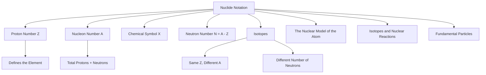

# 1. Overview / 概述

**English:**
Nuclide notation is the standard shorthand used to represent the composition of an atomic nucleus. It provides a concise way to show the number of protons and neutrons in a specific isotope of an element. This notation is fundamental to all of nuclear physics, as it allows us to precisely identify which nucleus is involved in a nuclear reaction, radioactive decay, or any other nuclear process. Understanding nuclide notation is the first step before exploring [[The Nuclear Model of the Atom]], [[Isotopes and Nuclear Reactions]], and the properties of [[Protons, Neutrons, and Electrons]].

**中文:**
核素符号是用于表示原子核组成的标准简写形式。它提供了一种简洁的方式来显示特定同位素中质子和中子的数量。这种符号是所有核物理学的基础，因为它使我们能够精确识别参与核反应、放射性衰变或任何其他核过程的是哪种原子核。理解核素符号是探索[[原子核模型]]、[[同位素与核反应]]以及[[质子、中子和电子]]性质的第一步。

---

# 2. Syllabus Learning Objectives / 考纲学习目标

| CAIE 9702 | Edexcel IAL |
|-----------|-------------|
| 1.1(a) Understand the terms: nucleon number (mass number), proton number (atomic number), and nuclide. | 6.1 Know the terms: atomic number, mass number, isotope, and nuclide. |
| 1.1(b) Use the nuclide notation $^A_Z X$ to represent a nucleus. | 6.2 Use the nuclide notation $^A_Z X$ to represent a nucleus. |
| 1.1(c) Understand the term isotope. | 6.3 Understand the term isotope. |
| 1.1(d) Understand the term nucleon. | 6.4 Know that the nucleus contains protons and neutrons. |
| 1.1(e) Understand the term nucleon number. | 6.5 Understand the term nucleon. |

**Examiner Expectations / 考官期望:**
- **English:** Students must be able to read and write nuclide notation correctly. They must be able to identify the number of protons, neutrons, and electrons in a neutral atom from its notation. They must also be able to define and identify isotopes.
- **中文:** 学生必须能够正确读写核素符号。他们必须能够从符号中识别中性原子中的质子、中子和电子数量。他们还必须能够定义和识别同位素。

---

# 3. Core Definitions / 核心定义

| Term (EN/CN) | Definition (EN) | Definition (CN) | Common Mistakes / 常见错误 |
|--------------|-----------------|-----------------|---------------------------|
| **Nuclide** / 核素 | A distinct type of atom characterized by a specific number of protons and neutrons in its nucleus. | 由原子核中特定数量的质子和中子所表征的一种独特的原子类型。 | Confusing with "nucleon" or "isotope". A nuclide is a specific type of nucleus. |
| **Nucleon** / 核子 | A collective term for a proton or a neutron, the particles found in the nucleus of an atom. | 对质子或中子的统称，即原子核中发现的粒子。 | Thinking nucleons are only neutrons. |
| **Proton Number (Z)** / 质子数 (Z) | The number of protons in the nucleus of an atom. It determines the element's identity. | 原子核中质子的数量。它决定了元素的身份。 | Confusing with nucleon number. |
| **Nucleon Number (A)** / 核子数 (A) | The total number of protons and neutrons in the nucleus of an atom. Also known as the mass number. | 原子核中质子和中子的总数。也称为质量数。 | Confusing with proton number. |
| **Isotope** / 同位素 | Atoms of the same element (same proton number) that have different numbers of neutrons (different nucleon numbers). | 具有相同质子数但中子数不同（因此核子数不同）的同一元素的原子。 | Thinking isotopes have different chemical properties. They have the same chemical properties. |
| **Neutron Number (N)** / 中子数 (N) | The number of neutrons in the nucleus of an atom. It is calculated as $N = A - Z$. | 原子核中中子的数量。计算公式为 $N = A - Z$。 | Forgetting the formula. |

---

# 4. Key Concepts Explained / 关键概念详解

## 4.1 Nuclide Notation / 核素符号

### Explanation / 解释
**English:**
Nuclide notation is a standard way to represent a specific nucleus. It is written as $^A_Z X$, where:
- $X$ is the chemical symbol for the element (e.g., H for hydrogen, He for helium, U for uranium).
- $Z$ is the **proton number** (atomic number), written as a subscript to the left of the symbol.
- $A$ is the **nucleon number** (mass number), written as a superscript to the left of the symbol.

For example, $^{12}_6 C$ represents a carbon nucleus with 6 protons and 6 neutrons ($12 - 6 = 6$). This is the most common isotope of carbon. Another isotope is $^{14}_6 C$, which has 6 protons and 8 neutrons. These are linked to [[Isotopes and Nuclear Reactions]].

**中文:**
核素符号是表示特定原子核的标准方式。它写作 $^A_Z X$，其中：
- $X$ 是元素的化学符号（例如，H 代表氢，He 代表氦，U 代表铀）。
- $Z$ 是**质子数**（原子序数），写在符号的左下角。
- $A$ 是**核子数**（质量数），写在符号的左上角。

例如，$^{12}_6 C$ 代表一个具有 6 个质子和 6 个中子（$12 - 6 = 6$）的碳原子核。这是碳最常见的同位素。另一个同位素是 $^{14}_6 C$，它有 6 个质子和 8 个中子。这些与[[同位素与核反应]]相关。

### Physical Meaning / 物理意义
**English:**
The notation tells us the exact composition of the nucleus. The proton number $Z$ defines the element and its chemical properties. The nucleon number $A$ gives the approximate mass of the nucleus (in atomic mass units). The difference $A - Z$ gives the number of neutrons, which determines the isotope.

**中文:**
该符号告诉我们原子核的确切组成。质子数 $Z$ 定义了元素及其化学性质。核子数 $A$ 给出了原子核的近似质量（以原子质量单位计）。差值 $A - Z$ 给出了中子数，它决定了同位素。

### Common Misconceptions / 常见误区
- **English:**
  - Thinking the superscript is the atomic number.
  - Thinking the subscript is the mass number.
  - Forgetting that the number of electrons in a neutral atom equals the proton number.
  - Confusing the terms "nuclide" and "nucleon".
- **中文:**
  - 认为上标是原子序数。
  - 认为下标是质量数。
  - 忘记中性原子中的电子数等于质子数。
  - 混淆“核素”和“核子”这两个术语。

### Exam Tips / 考试提示
- **English:**
  - Always write the proton number as the subscript and the nucleon number as the superscript.
  - Remember: $A = Z + N$, where $N$ is the neutron number.
  - For a neutral atom, the number of electrons = $Z$.
  - Be able to identify isotopes by looking for atoms with the same $Z$ but different $A$.
- **中文:**
  - 始终将质子数写为下标，核子数写为上标。
  - 记住：$A = Z + N$，其中 $N$ 是中子数。
  - 对于中性原子，电子数 = $Z$。
  - 能够通过寻找具有相同 $Z$ 但不同 $A$ 的原子来识别同位素。

> 📷 **IMAGE PROMPT — NUC-01: Nuclide Notation Diagram**
> A clear diagram showing the nuclide notation $^A_Z X$ for a generic element. The symbol X is in the center. The superscript A is labeled "Nucleon Number (Mass Number)" and the subscript Z is labeled "Proton Number (Atomic Number)". An arrow points from the notation to a simplified nucleus showing protons (red) and neutrons (blue). The formula $A = Z + N$ is shown nearby.

---

# 5. Essential Equations / 核心公式

## Equation 1: Neutron Number / 中子数

$$ N = A - Z $$

| Symbol (符号) | Meaning (EN) | Meaning (CN) | Unit (单位) |
|--------------|-------------|-------------|------------|
| $N$ | Neutron number | 中子数 | dimensionless (无量纲) |
| $A$ | Nucleon number (mass number) | 核子数（质量数） | dimensionless (无量纲) |
| $Z$ | Proton number (atomic number) | 质子数（原子序数） | dimensionless (无量纲) |

**Derivation / 推导:**
The nucleon number is the sum of protons and neutrons: $A = Z + N$. Rearranging gives $N = A - Z$.

**Conditions / 适用条件:**
- **English:** This equation applies to any atomic nucleus.
- **中文:** 该方程适用于任何原子核。

**Limitations / 局限性:**
- **English:** This is a simple arithmetic relationship. It does not account for nuclear binding energy or mass defect.
- **中文:** 这是一个简单的算术关系。它不考虑核结合能或质量亏损。

---

# 6. Graphs and Relationships / 图表与关系

## 6.1 The Relationship Between A, Z, and N / A、Z 和 N 之间的关系

### Axes / 坐标轴 (EN+CN)
- **X-axis:** Neutron Number ($N$) / 中子数 ($N$)
- **Y-axis:** Proton Number ($Z$) / 质子数 ($Z$)

### Shape / 形状 (EN+CN)
- **English:** For stable nuclei, the points cluster around a line of stability. For light nuclei, $N \approx Z$. For heavier nuclei, $N > Z$.
- **中文:** 对于稳定核，点聚集在一条稳定线周围。对于轻核，$N \approx Z$。对于较重的核，$N > Z$。

### Gradient Meaning / 斜率含义 (EN+CN)
- **English:** The gradient of a line from the origin to a point on the graph is $Z/N$. A gradient of 1 means equal numbers of protons and neutrons.
- **中文:** 从原点到图上某点的直线的斜率是 $Z/N$。斜率为 1 意味着质子和中子数量相等。

### Area Meaning / 面积含义 (EN+CN)
- **English:** Not applicable for this relationship.
- **中文:** 不适用于此关系。

### Exam Interpretation / 考试解读 (EN+CN)
- **English:** You may be asked to plot or interpret a graph of $N$ vs $Z$ for a set of isotopes. You should be able to identify which isotopes are stable and which are unstable based on their position relative to the line of stability.
- **中文:** 你可能会被要求绘制或解释一组同位素的 $N$ 对 $Z$ 的图表。你应该能够根据同位素相对于稳定线的位置来识别哪些是稳定的，哪些是不稳定的。

> 📷 **IMAGE PROMPT — NUC-02: N vs Z Graph for Stable Isotopes**
> A graph with Neutron Number (N) on the y-axis and Proton Number (Z) on the x-axis. A curved line representing the "line of stability" is drawn. For light nuclei (Z < 20), the line is close to N = Z. For heavier nuclei, the line curves upwards, showing N > Z. A few example stable isotopes are plotted as points on the line (e.g., $^{12}_6 C$, $^{16}_8 O$, $^{56}_{26} Fe$, $^{208}_{82} Pb$). An unstable isotope, like $^{14}_6 C$, is plotted off the line.

---

# 7. Required Diagrams / 必备图表

## 7.1 Nuclide Notation Diagram / 核素符号图

### Description / 描述 (EN+CN)
- **English:** A diagram showing the standard nuclide notation $^A_Z X$ with labels for the superscript (nucleon number) and subscript (proton number). It should also show a simplified model of the nucleus with protons and neutrons.
- **中文:** 一个显示标准核素符号 $^A_Z X$ 的图表，并标注上标（核子数）和下标（质子数）。它还应该显示一个带有质子和中子的简化原子核模型。

### Image Prompt / 图片生成提示
> 📷 **IMAGE PROMPT — NUC-03: Nuclide Notation with Nucleus Model**
> A clear, educational diagram. On the left, the nuclide notation $^{12}_6 C$ is shown. The superscript "12" is labeled "Nucleon Number (A)" and the subscript "6" is labeled "Proton Number (Z)". An arrow points from the notation to a simplified model of a carbon-12 nucleus on the right. The nucleus is a cluster of 6 red spheres (labeled "Protons") and 6 blue spheres (labeled "Neutrons"). The formula $A = Z + N$ is shown below, with $N = 12 - 6 = 6$.

### Labels Required / 需要标注 (EN+CN)
- **English:** Nucleon Number (A), Proton Number (Z), Chemical Symbol (X), Proton, Neutron, Nucleus.
- **中文:** 核子数 (A)，质子数 (Z)，化学符号 (X)，质子，中子，原子核。

### Exam Importance / 考试重要性 (EN+CN)
- **English:** High. This is the foundational diagram for all nuclear physics topics. You must be able to draw and interpret it.
- **中文:** 高。这是所有核物理主题的基础图表。你必须能够绘制和解释它。

---

# 8. Worked Examples / 典型例题

## Example 1: Identifying Particles from Nuclide Notation / 从核素符号识别粒子

### Question / 题目
**English:**
The nuclide notation for an atom of uranium is $^{238}_{92} U$.
(a) How many protons are in the nucleus?
(b) How many neutrons are in the nucleus?
(c) How many electrons are in a neutral atom of this uranium?

**中文:**
一个铀原子的核素符号是 $^{238}_{92} U$。
(a) 原子核中有多少个质子？
(b) 原子核中有多少个中子？
(c) 一个中性铀原子中有多少个电子？

### Solution / 解答
**Step 1: Identify the proton number.**
The proton number $Z$ is the subscript: $Z = 92$.
**Answer (a):** 92 protons.

**Step 2: Identify the nucleon number.**
The nucleon number $A$ is the superscript: $A = 238$.

**Step 3: Calculate the neutron number.**
Using $N = A - Z$, we get $N = 238 - 92 = 146$.
**Answer (b):** 146 neutrons.

**Step 4: Determine the number of electrons.**
For a neutral atom, the number of electrons equals the number of protons.
**Answer (c):** 92 electrons.

**中文:**
**步骤 1：识别质子数。**
质子数 $Z$ 是下标：$Z = 92$。
**答案 (a)：** 92 个质子。

**步骤 2：识别核子数。**
核子数 $A$ 是上标：$A = 238$。

**步骤 3：计算中子数。**
使用 $N = A - Z$，得到 $N = 238 - 92 = 146$。
**答案 (b)：** 146 个中子。

**步骤 4：确定电子数。**
对于中性原子，电子数等于质子数。
**答案 (c)：** 92 个电子。

### Final Answer / 最终答案
**Answer:** (a) 92, (b) 146, (c) 92 | **答案：** (a) 92, (b) 146, (c) 92

### Quick Tip / 提示
- **English:** Remember the formula $N = A - Z$. The subscript is the proton number, and the superscript is the nucleon number.
- **中文：** 记住公式 $N = A - Z$。下标是质子数，上标是核子数。

---

## Example 2: Identifying Isotopes / 识别同位素

### Question / 题目
**English:**
Which of the following are isotopes of the same element?
$^{12}_6 C$, $^{14}_6 C$, $^{14}_7 N$, $^{16}_8 O$

**中文:**
以下哪些是同一元素的同位素？
$^{12}_6 C$, $^{14}_6 C$, $^{14}_7 N$, $^{16}_8 O$

### Solution / 解答
**Step 1: Identify the proton number for each.**
- $^{12}_6 C$: $Z = 6$
- $^{14}_6 C$: $Z = 6$
- $^{14}_7 N$: $Z = 7$
- $^{16}_8 O$: $Z = 8$

**Step 2: Find atoms with the same proton number.**
$^{12}_6 C$ and $^{14}_6 C$ both have $Z = 6$. They are isotopes of carbon.

**中文:**
**步骤 1：识别每个的质子数。**
- $^{12}_6 C$: $Z = 6$
- $^{14}_6 C$: $Z = 6$
- $^{14}_7 N$: $Z = 7$
- $^{16}_8 O$: $Z = 8$

**步骤 2：找到具有相同质子数的原子。**
$^{12}_6 C$ 和 $^{14}_6 C$ 都具有 $Z = 6$。它们是碳的同位素。

### Final Answer / 最终答案
**Answer:** $^{12}_6 C$ and $^{14}_6 C$ | **答案：** $^{12}_6 C$ 和 $^{14}_6 C$

### Quick Tip / 提示
- **English:** Isotopes have the same proton number but different nucleon numbers.
- **中文：** 同位素具有相同的质子数但不同的核子数。

---

# 9. Past Paper Question Types / 历年真题题型

| Question Type / 题型 | Frequency / 频率 | Difficulty / 难度 | Past Paper References / 真题索引 |
|----------------------|------------------|------------------|-------------------------------|
| **Definition Questions** / 定义题 | High | Easy | 📝 *待填入* |
| **Nuclide Notation Interpretation** / 核素符号解读 | High | Easy | 📝 *待填入* |
| **Isotope Identification** / 同位素识别 | Medium | Easy | 📝 *待填入* |
| **Calculating Neutron Number** / 计算中子数 | High | Easy | 📝 *待填入* |

**Common Command Words / 常见指令词:**
- **English:** Define, State, Write, Identify, Calculate, Determine
- **中文：** 定义，陈述，写出，识别，计算，确定

---

# 10. Practical Skills Connections / 实验技能链接

**English:**
While nuclide notation itself is a theoretical concept, it is essential for understanding practical experiments in nuclear physics. For example:
- **Mass Spectrometry:** The output of a mass spectrometer is often given in terms of nuclide notation. You need to interpret the notation to identify the isotopes present in a sample.
- **Radioactive Decay Experiments:** When studying radioactive decay, you must use nuclide notation to write balanced decay equations (e.g., $\alpha$ decay: $^{238}_{92} U \rightarrow ^{234}_{90} Th + ^4_2 He$).
- **Uncertainties:** The number of protons and neutrons are exact integers, so there is no uncertainty in $Z$ or $A$ for a given nuclide.

**中文:**
虽然核素符号本身是一个理论概念，但它对于理解核物理中的实验至关重要。例如：
- **质谱法：** 质谱仪的输出通常以核素符号给出。你需要解释符号以识别样品中存在的同位素。
- **放射性衰变实验：** 在研究放射性衰变时，你必须使用核素符号来写出平衡的衰变方程（例如，$\alpha$ 衰变：$^{238}_{92} U \rightarrow ^{234}_{90} Th + ^4_2 He$）。
- **不确定度：** 质子和中子的数量是精确的整数，因此对于给定的核素，$Z$ 或 $A$ 没有不确定度。

---

# 11. Concept Map / 概念图谱

---

# 12. Quick Revision Sheet / 速查表

| Category / 类别 | Key Points / 要点 |
|----------------|------------------|
| **Definition / 定义** | **Nuclide:** A specific type of nucleus. **Nucleon:** A proton or neutron. **Isotope:** Same Z, different A. / **核素：** 特定类型的原子核。**核子：** 质子或中子。**同位素：** 相同 Z，不同 A。 |
| **Key Formula / 核心公式** | $N = A - Z$ |
| **Key Notation / 核心符号** | $^A_Z X$: Superscript = Nucleon Number (A), Subscript = Proton Number (Z). / $^A_Z X$：上标 = 核子数 (A)，下标 = 质子数 (Z)。 |
| **Key Graph / 核心图表** | N vs Z graph: Shows the line of stability. For light nuclei, N ≈ Z. For heavy nuclei, N > Z. / N 对 Z 图：显示稳定线。对于轻核，N ≈ Z。对于重核，N > Z。 |
| **Exam Tip / 考试提示** | Always check the subscript for the proton number. Use $N = A - Z$ to find neutrons. Isotopes have the same Z. / 始终检查下标以获取质子数。使用 $N = A - Z$ 查找中子数。同位素具有相同的 Z。 |