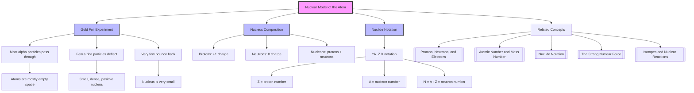

# 1. Overview / 概述

**English:**
The Nuclear Model of the Atom describes the structure of an atom as consisting of a tiny, dense, positively charged nucleus surrounded by negatively charged electrons orbiting at relatively large distances. This model replaced earlier "plum pudding" models after Rutherford's famous gold foil experiment in 1911. Understanding this model is fundamental to all of nuclear physics, as it explains why atoms are mostly empty space, why the nucleus contains most of the mass, and how nuclear reactions are possible. This sub-topic connects directly to [[Protons, Neutrons, and Electrons]], [[Atomic Number and Mass Number]], and [[Nuclide Notation]].

**中文:**
原子核模型描述了原子的结构：一个微小、致密、带正电的原子核，周围有带负电的电子在相对较大的距离上绕核运动。该模型在1911年卢瑟福著名的金箔实验后取代了早期的"葡萄干布丁"模型。理解这一模型是所有核物理的基础，因为它解释了为什么原子大部分是空的、为什么原子核包含了大部分质量、以及核反应如何可能。本子知识点直接与[[质子、中子和电子]]、[[原子序数和质量数]]以及[[核素符号]]相关。

---

# 2. Syllabus Learning Objectives / 考纲学习目标

| CAIE 9702 | Edexcel IAL |
|-----------|-------------|
| 1.1(a) Describe the structure of the atom as a nucleus containing protons and neutrons, surrounded by electrons | 6.1 Describe the structure of the atom as a nucleus containing protons and neutrons, surrounded by electrons |
| 1.1(b) Describe the composition of the nucleus in terms of protons and neutrons | 6.2 Describe the composition of the nucleus in terms of protons and neutrons |
| 1.1(c) Explain the meaning of the terms proton number (atomic number) and nucleon number (mass number) | 6.3 Explain the meaning of proton number (atomic number) and nucleon number (mass number) |
| 1.1(d) Use the nuclide notation $^A_Z X$ | 6.4 Use the nuclide notation $^A_Z X$ |
| 1.1(e) Explain the existence of isotopes | 6.5 Explain the existence of isotopes |

**Examiner Expectations / 考官期望:**
- **English:** Students must be able to describe the nuclear model, explain the evidence from the gold foil experiment, and use nuclide notation correctly. They should understand that the nucleus is positively charged and contains most of the atom's mass.
- **中文:** 学生必须能够描述原子核模型、解释金箔实验的证据、并正确使用核素符号。他们应理解原子核带正电并包含原子的大部分质量。

---

# 3. Core Definitions / 核心定义

| Term (EN/CN) | Definition (EN) | Definition (CN) | Common Mistakes / 常见错误 |
|--------------|-----------------|-----------------|---------------------------|
| **Nucleus** / 原子核 | The small, dense, positively charged central region of an atom, containing protons and neutrons | 原子中微小、致密、带正电的中心区域，包含质子和中子 | ❌ Thinking nucleus is large — it's ~10,000 times smaller than the atom |
| **Proton** / 质子 | A positively charged subatomic particle found in the nucleus, with relative charge +1 and relative mass 1 | 原子核中带正电的亚原子粒子，相对电荷+1，相对质量1 | ❌ Confusing with electron charge sign |
| **Neutron** / 中子 | An uncharged (neutral) subatomic particle found in the nucleus, with relative mass 1 | 原子核中不带电（中性）的亚原子粒子，相对质量1 | ❌ Forgetting neutrons exist in all nuclei except hydrogen-1 |
| **Electron** / 电子 | A negatively charged subatomic particle orbiting the nucleus, with relative charge -1 and negligible mass (~1/1836 of proton) | 绕原子核运动的带负电亚原子粒子，相对电荷-1，质量可忽略（约为质子的1/1836） | ❌ Thinking electrons are inside the nucleus |
| **Isotope** / 同位素 | Atoms of the same element with the same number of protons but different numbers of neutrons | 同一元素中质子数相同但中子数不同的原子 | ❌ Confusing with different elements |
| **Nuclide** / 核素 | A specific type of nucleus characterized by its proton number and nucleon number | 由质子数和核子数确定的特定类型原子核 | ❌ Using "nuclide" and "nucleus" interchangeably incorrectly |

---

# 4. Key Concepts Explained / 关键概念详解

## 4.1 The Nuclear Model vs. Plum Pudding Model / 原子核模型 vs. 葡萄干布丁模型

### Explanation / 解释
**English:** Before Rutherford's experiment, the accepted model was J.J. Thomson's "plum pudding model" (1904), which proposed that the atom was a sphere of positive charge with negatively charged electrons embedded within it, like plums in a pudding. Rutherford's gold foil experiment (1911) disproved this. He fired alpha particles (positively charged helium nuclei) at a thin gold foil. Most alpha particles passed straight through, but a small number were deflected at large angles, and some even bounced back. This was impossible under the plum pudding model, which predicted only small deflections. Rutherford concluded that the atom must have a small, dense, positively charged nucleus.

**中文:** 在卢瑟福实验之前，公认的模型是J.J.汤姆孙的"葡萄干布丁模型"（1904年），该模型认为原子是一个带正电的球体，带负电的电子像布丁中的葡萄干一样嵌入其中。卢瑟福的金箔实验（1911年）推翻了这一模型。他用α粒子（带正电的氦原子核）轰击薄金箔。大多数α粒子直接穿过，但少数以大角度偏转，有些甚至反弹回来。这在葡萄干布丁模型下是不可能的，该模型只预测小角度偏转。卢瑟福得出结论：原子必须有一个微小、致密、带正电的原子核。

### Physical Meaning / 物理意义
**English:** The nuclear model explains:
- **Mostly empty space:** Most alpha particles passed through because atoms are mostly empty space between the nucleus and electrons.
- **Large-angle deflection:** A few alpha particles came close to the tiny, positively charged nucleus and were repelled by electrostatic repulsion.
- **Backscattering:** Very few alpha particles hit the nucleus directly and bounced back.

**中文:** 原子核模型解释了：
- **大部分是空的：** 大多数α粒子穿过是因为原子在原子核和电子之间大部分是空的。
- **大角度偏转：** 少数α粒子靠近微小、带正电的原子核，被静电斥力排斥。
- **反向散射：** 极少数α粒子直接撞击原子核并反弹回来。

### Common Misconceptions / 常见误区
- ❌ **English:** "Electrons orbit the nucleus like planets around the Sun." → Actually, electrons exist in probability clouds (orbitals), not fixed orbits at A-Level.
- ❌ **中文：** "电子像行星绕太阳一样绕原子核运动。" → 实际上，电子存在于概率云（轨道）中，在A-Level阶段不是固定轨道。
- ❌ **English:** "The nucleus is at the center of the atom." → True, but it's not stationary — it vibrates slightly.
- ❌ **中文：** "原子核在原子中心。" → 正确，但它不是静止的——它会轻微振动。
- ❌ **English:** "All alpha particles that hit the foil bounce back." → Only those that hit the nucleus directly.
- ❌ **中文：** "所有击中箔片的α粒子都会反弹。" → 只有直接击中原子核的才会反弹。

### Exam Tips / 考试提示
- **English:** Be able to describe the gold foil experiment setup (source, foil, detector screen) and explain the three observations (most pass through, some deflect, few bounce back).
- **中文：** 能够描述金箔实验装置（源、箔片、检测屏）并解释三个观察结果（大多数穿过、一些偏转、少数反弹）。

> 📷 **IMAGE PROMPT — RUTHERFORD-01: Rutherford's Gold Foil Experiment Setup**
> A diagram showing a radioactive alpha source emitting a beam of alpha particles toward a thin gold foil. A circular fluorescent screen surrounds the foil. Most alpha particles pass straight through (shown as straight lines), a few are deflected at angles (curved lines), and very few bounce back (lines returning toward the source). Labels: "Alpha Source", "Gold Foil", "Fluorescent Screen", "Most pass through", "Few deflected", "Very few bounce back". Clean scientific diagram style.

## 4.2 Composition of the Nucleus / 原子核的组成

### Explanation / 解释
**English:** The nucleus contains two types of nucleons:
- **Protons:** Positively charged (+1e), relative mass ≈ 1 u (atomic mass unit)
- **Neutrons:** Neutral (0 charge), relative mass ≈ 1 u

The number of protons is the **proton number (Z)** or **atomic number**, which defines the element. The total number of protons and neutrons is the **nucleon number (A)** or **mass number**.

**中文:** 原子核包含两种核子：
- **质子：** 带正电（+1e），相对质量≈1 u（原子质量单位）
- **中子：** 中性（0电荷），相对质量≈1 u

质子数称为**质子数（Z）**或**原子序数**，它定义了元素。质子和中子的总数称为**核子数（A）**或**质量数**。

### Physical Meaning / 物理意义
**English:** The nucleus is incredibly dense. If an atom were the size of a football stadium, the nucleus would be the size of a pea at the center. Despite its tiny size, the nucleus contains over 99.9% of the atom's mass.

**中文:** 原子核密度极大。如果一个原子有足球场那么大，原子核只有中心的一粒豌豆大小。尽管体积微小，原子核却包含了原子99.9%以上的质量。

### Common Misconceptions / 常见误区
- ❌ **English:** "The nucleus contains electrons." → No, electrons are outside the nucleus.
- ❌ **中文：** "原子核包含电子。" → 不，电子在原子核外。
- ❌ **English:** "Protons and neutrons have the same mass." → They are approximately equal, but neutrons are slightly heavier (1.008665 u vs 1.007276 u).
- ❌ **中文：** "质子和中子质量相同。" → 它们近似相等，但中子稍重（1.008665 u vs 1.007276 u）。

### Exam Tips / 考试提示
- **English:** Remember: Z = number of protons = number of electrons (in neutral atom). A = Z + N (where N = number of neutrons).
- **中文：** 记住：Z = 质子数 = 电子数（中性原子中）。A = Z + N（其中N = 中子数）。

---

# 5. Essential Equations / 核心公式

## 5.1 Nuclide Notation / 核素符号

$$ ^A_Z X $$

| Symbol (符号) | Meaning (EN) | Meaning (CN) | Unit (单位) |
|--------------|-------------|-------------|------------|
| $X$ | Chemical symbol of the element | 元素的化学符号 | — |
| $Z$ | Proton number (atomic number) | 质子数（原子序数） | — |
| $A$ | Nucleon number (mass number) | 核子数（质量数） | — |

**Derivation / 推导:** Not applicable — this is a notation convention.

**Conditions / 适用条件:** Used for any nuclide. For example, $^{12}_6 C$ represents carbon-12 with 6 protons and 6 neutrons.

**Limitations / 局限性:** Does not show the number of electrons or charge state of an ion.

## 5.2 Number of Neutrons / 中子数

$$ N = A - Z $$

| Symbol (符号) | Meaning (EN) | Meaning (CN) | Unit (单位) |
|--------------|-------------|-------------|------------|
| $N$ | Number of neutrons | 中子数 | — |
| $A$ | Nucleon number | 核子数 | — |
| $Z$ | Proton number | 质子数 | — |

**Derivation / 推导:** By definition, $A = Z + N$, so $N = A - Z$.

**Conditions / 适用条件:** All nuclei.

**Limitations / 局限性:** None.

> 📷 **IMAGE PROMPT — NUCLIDE-01: Nuclide Notation Example**
> A diagram showing the nuclide notation $^{235}_{92}U$ with arrows pointing to each part: "A = 235 (nucleon number)", "Z = 92 (proton number)", "X = U (chemical symbol)". Below, a table showing: Protons = 92, Neutrons = 235 - 92 = 143, Electrons (neutral) = 92. Clean educational diagram style.

---

# 6. Graphs and Relationships / 图表与关系

## 6.1 Alpha Particle Scattering Pattern / α粒子散射图案

### Axes / 坐标轴
- **X-axis:** Scattering angle θ / 散射角θ (degrees)
- **Y-axis:** Number of alpha particles detected / 检测到的α粒子数

### Shape / 形状
**English:** The graph shows a sharp peak at small angles (0°-5°) where most particles are detected, then a rapid decrease as angle increases, with a very small but non-zero tail at large angles (90°-180°).

**中文:** 图表显示在小角度（0°-5°）处有一个尖锐的峰值，大多数粒子在此被检测到，然后随着角度增加迅速下降，在大角度（90°-180°）处有一个非常小但非零的尾部。

### Gradient Meaning / 斜率含义
**English:** The steep negative gradient at small angles indicates that most particles pass through with minimal deflection. The shallow gradient at large angles indicates very few particles experience large deflections.

**中文:** 小角度处的陡峭负斜率表明大多数粒子以最小偏转穿过。大角度处的平缓斜率表明极少数粒子经历大偏转。

### Area Meaning / 面积含义
**English:** The area under the curve between two angles represents the number of particles scattered into that angular range. The total area represents all incident alpha particles.

**中文:** 两个角度之间的曲线下面积表示散射到该角度范围内的粒子数。总面积表示所有入射的α粒子。

### Exam Interpretation / 考试解读
- **English:** This graph directly supports the nuclear model: the large peak at small angles shows atoms are mostly empty space; the tail at large angles shows a small, dense nucleus.
- **中文：** 该图表直接支持原子核模型：小角度处的大峰值表明原子大部分是空的；大角度处的尾部表明存在一个微小、致密的原子核。

> 📷 **IMAGE PROMPT — SCATTER-01: Alpha Particle Scattering Graph**
> A graph with "Scattering Angle θ (degrees)" on the x-axis (0 to 180) and "Number of Alpha Particles" on the y-axis. A sharp peak near 0° drops rapidly, then a very low, flat tail extends to 180°. Annotated: "Most particles at small angles → mostly empty space", "Very few at large angles → small, dense nucleus". Clean scientific graph style.

---

# 7. Required Diagrams / 必备图表

## 7.1 Rutherford's Gold Foil Experiment / 卢瑟福金箔实验

### Description / 描述
**English:** A diagram showing the experimental setup: a radioactive source emitting alpha particles, a thin gold foil (approximately 1000 atoms thick), and a movable fluorescent screen (zinc sulfide) that produces a flash of light when struck by an alpha particle. The screen can be rotated to detect particles at different angles.

**中文:** 显示实验装置的图表：发射α粒子的放射源、薄金箔（约1000个原子厚）、以及可移动的荧光屏（硫化锌），当α粒子撞击时会产生闪光。屏幕可以旋转以检测不同角度的粒子。

### Image Prompt / 图片生成提示
> 📷 **IMAGE PROMPT — RUTHERFORD-02: Detailed Gold Foil Experiment**
> A detailed scientific diagram of Rutherford's gold foil experiment. Left side: a lead-shielded radioactive alpha source emitting a narrow beam of alpha particles. Center: a thin gold foil mounted on a stand. Right and around: a circular fluorescent screen (zinc sulfide) on a movable arm. Three types of paths shown: (1) straight lines through the foil (most particles), (2) curved paths deflected at angles 10°-90° (few particles), (3) paths bouncing back at >90° (very few). Labels: "Alpha Source (Ra-226)", "Lead Shield", "Gold Foil (~10⁻⁷ m thick)", "Fluorescent Screen (ZnS)", "Most pass through", "Few deflected", "Very few bounce back". Clean, educational style with arrows and annotations.

### Labels Required / 需要标注
- Alpha source / α粒子源
- Lead shield / 铅屏蔽
- Gold foil / 金箔
- Fluorescent screen / 荧光屏
- Paths: straight, deflected, backscattered / 路径：直线、偏转、反向散射

### Exam Importance / 考试重要性
- **English:** This is the most important diagram for this sub-topic. Students must be able to draw and label it, and explain the observations.
- **中文：** 这是本子知识点最重要的图表。学生必须能够绘制并标注它，并解释观察结果。

## 7.2 Nuclear Model of the Atom / 原子核模型示意图

### Description / 描述
**English:** A schematic diagram showing a tiny, dense nucleus at the center (containing protons and neutrons) with electrons orbiting at relatively large distances. The diagram should emphasize the scale: the nucleus is much smaller than the electron orbits.

**中文:** 显示中心微小致密原子核（包含质子和中子）以及电子在相对较大距离上绕核运动的示意图。图表应强调比例：原子核远小于电子轨道。

### Image Prompt / 图片生成提示
> 📷 **IMAGE PROMPT — NUCLEAR-01: Nuclear Model of Atom**
> A schematic diagram of the nuclear model of the atom. Center: a small cluster of red spheres (protons, labeled "+") and blue spheres (neutrons, labeled "0") tightly packed together, labeled "Nucleus (~10⁻¹⁵ m)". Surrounding: several small green spheres (electrons, labeled "−") on circular dashed paths at different distances, labeled "Electron orbits (~10⁻¹⁰ m)". A scale annotation: "Nucleus is ~10,000 times smaller than atom". Clean, colorful educational diagram style.

### Labels Required / 需要标注
- Nucleus / 原子核
- Proton (+) / 质子 (+)
- Neutron (0) / 中子 (0)
- Electron (−) / 电子 (−)
- Electron orbit / 电子轨道
- Scale comparison / 比例比较

### Exam Importance / 考试重要性
- **English:** Students should be able to draw a simple version of this diagram and explain the relative sizes and charges.
- **中文：** 学生应能够绘制此图的简化版本并解释相对大小和电荷。

---

# 8. Worked Examples / 典型例题

## Example 1: Nuclide Notation / 示例1：核素符号

### Question / 题目
**English:** An atom of uranium-235 has 92 protons. Write its nuclide notation and determine the number of neutrons.

**中文：** 一个铀-235原子有92个质子。写出其核素符号并确定中子数。

### Solution / 解答
**Step 1:** Identify the chemical symbol for uranium: U

**Step 2:** Write the nuclide notation:
- Proton number Z = 92
- Nucleon number A = 235
- Notation: $^{235}_{92}U$

**Step 3:** Calculate number of neutrons:
$$ N = A - Z = 235 - 92 = 143 $$

**Step 4:** Verify: The atom has 92 protons, 143 neutrons, and (if neutral) 92 electrons.

**中文解答：**
**步骤1：** 确定铀的化学符号：U

**步骤2：** 写出核素符号：
- 质子数 Z = 92
- 核子数 A = 235
- 符号：$^{235}_{92}U$

**步骤3：** 计算中子数：
$$ N = A - Z = 235 - 92 = 143 $$

**步骤4：** 验证：该原子有92个质子、143个中子，以及（如果中性）92个电子。

### Final Answer / 最终答案
**Answer:** $^{235}_{92}U$, 143 neutrons | **答案：** $^{235}_{92}U$，143个中子

### Quick Tip / 提示
- **English:** Remember: A (top) = Z (bottom) + N. The chemical symbol tells you the element; Z tells you which element it is.
- **中文：** 记住：A（上标）= Z（下标）+ N。化学符号告诉你元素；Z告诉你它是哪种元素。

## Example 2: Interpreting Alpha Scattering / 示例2：解释α散射

### Question / 题目
**English:** In Rutherford's gold foil experiment, explain why:
(a) Most alpha particles passed straight through the foil.
(b) A few alpha particles were deflected through large angles.
(c) Very few alpha particles bounced back.

**中文：** 在卢瑟福金箔实验中，解释为什么：
(a) 大多数α粒子直接穿过箔片。
(b) 少数α粒子以大角度偏转。
(c) 极少数α粒子反弹回来。

### Solution / 解答
**English:**
(a) Most alpha particles passed straight through because atoms are mostly empty space. The nucleus is tiny compared to the atom, so most alpha particles do not come close enough to the nucleus to experience significant electrostatic repulsion.

(b) A few alpha particles came close to the positively charged nucleus. The electrostatic repulsion between the positive alpha particle and the positive nucleus caused a large deflection. The closer the alpha particle came to the nucleus, the greater the deflection angle.

(c) Very few alpha particles hit the nucleus almost head-on. The strong electrostatic repulsion caused them to be scattered backwards (angles > 90°). This was the most surprising result because it implied a very small, dense, positively charged nucleus.

**中文：**
(a) 大多数α粒子直接穿过，因为原子大部分是空的。原子核相对于原子非常微小，所以大多数α粒子不会靠近到足以经历显著静电斥力的距离。

(b) 少数α粒子靠近带正电的原子核。带正电的α粒子和带正电的原子核之间的静电斥力导致了大的偏转。α粒子越靠近原子核，偏转角度越大。

(c) 极少数α粒子几乎正面撞击原子核。强烈的静电斥力使它们向后散射（角度>90°）。这是最令人惊讶的结果，因为它暗示了一个非常微小、致密、带正电的原子核。

### Final Answer / 最终答案
**Answer:** See explanation above. | **答案：** 见上述解释。

### Quick Tip / 提示
- **English:** Use the three observations to justify the nuclear model: (1) mostly empty space → most pass through, (2) small, dense nucleus → few deflect, (3) positive nucleus → repels alpha particles.
- **中文：** 用三个观察结果来证明原子核模型：（1）大部分是空的→大多数穿过，（2）微小致密的原子核→少数偏转，（3）带正电的原子核→排斥α粒子。

---

# 9. Past Paper Question Types / 历年真题题型

| Question Type / 题型 | Frequency / 频率 | Difficulty / 难度 | Past Paper References / 真题索引 |
|----------------------|------------------|------------------|-------------------------------|
| Describe the nuclear model / 描述原子核模型 | High / 高 | Easy / 容易 | 📝 *待填入* |
| Explain alpha scattering results / 解释α散射结果 | High / 高 | Medium / 中等 | 📝 *待填入* |
| Write nuclide notation / 写出核素符号 | High / 高 | Easy / 容易 | 📝 *待填入* |
| Calculate number of neutrons / 计算中子数 | Medium / 中 | Easy / 容易 | 📝 *待填入* |
| Compare nuclear model with plum pudding / 比较原子核模型与葡萄干布丁模型 | Medium / 中 | Medium / 中等 | 📝 *待填入* |

**Common Command Words / 常见指令词:**
- **English:** Describe, Explain, State, Calculate, Write, Compare
- **中文：** 描述、解释、陈述、计算、写出、比较

---

# 10. Practical Skills Connections / 实验技能链接

**English:**
This sub-topic connects to practical skills in several ways:

1. **Experimental Design:** Understanding the gold foil experiment teaches students about experimental setup, control of variables (foil thickness, source strength), and detection methods (fluorescent screen).

2. **Data Analysis:** Students may be asked to analyze scattering data (number of particles vs. angle) and draw conclusions about atomic structure.

3. **Uncertainties:** In modern versions of the experiment, students should consider uncertainties in angle measurement and particle counting.

4. **Graph Plotting:** Plotting scattering angle vs. number of particles and interpreting the shape.

5. **Model Evaluation:** Comparing experimental evidence with theoretical predictions (plum pudding vs. nuclear model) develops critical thinking.

**中文：**
本子知识点在以下几个方面与实验技能相关：

1. **实验设计：** 理解金箔实验教会学生实验装置、变量控制（箔片厚度、源强度）和检测方法（荧光屏）。

2. **数据分析：** 学生可能需要分析散射数据（粒子数vs.角度）并得出关于原子结构的结论。

3. **不确定度：** 在现代版本的实验中，学生应考虑角度测量和粒子计数的不确定度。

4. **图表绘制：** 绘制散射角度vs.粒子数并解释形状。

5. **模型评估：** 将实验证据与理论预测（葡萄干布丁vs.原子核模型）进行比较，培养批判性思维。

---

# 11. Concept Map / 概念图谱

---

# 12. Quick Revision Sheet / 速查表

| Category / 类别 | Key Points / 要点 |
|----------------|------------------|
| **Definition / 定义** | Atom = tiny, dense, positive nucleus + orbiting electrons / 原子 = 微小、致密、带正电的原子核 + 绕核运动的电子 |
| **Key Experiment / 关键实验** | Rutherford's gold foil experiment (1911): alpha particles on thin gold foil / 卢瑟福金箔实验（1911年）：α粒子轰击薄金箔 |
| **Three Observations / 三个观察结果** | 1. Most pass through → mostly empty space / 大多数穿过→大部分是空的 2. Few deflect → small, dense nucleus / 少数偏转→微小致密原子核 3. Very few bounce back → positive nucleus repels / 极少数反弹→带正电原子核排斥 |
| **Nucleus Composition / 原子核组成** | Protons (+1 charge) + Neutrons (0 charge) / 质子（+1电荷）+ 中子（0电荷） |
| **Key Formula / 核心公式** | $^A_Z X$ where A = nucleon number, Z = proton number; N = A - Z (neutrons) / $^A_Z X$，其中A = 核子数，Z = 质子数；N = A - Z（中子数） |
| **Key Notation / 核心符号** | $^{235}_{92}U$: 92 protons, 143 neutrons, 235 nucleons / $^{235}_{92}U$：92个质子，143个中子，235个核子 |
| **Scale / 比例** | Nucleus ~10⁻¹⁵ m, Atom ~10⁻¹⁰ m → nucleus is ~10,000 times smaller / 原子核~10⁻¹⁵ m，原子~10⁻¹⁰ m → 原子核小约10,000倍 |
| **Mass Distribution / 质量分布** | >99.9% of atom's mass in nucleus / 原子质量的99.9%以上在原子核中 |
| **Exam Tip / 考试提示** | Always link experimental evidence to model conclusions / 始终将实验证据与模型结论联系起来 |
| **Common Mistake / 常见错误** | Don't say electrons are in the nucleus; don't confuse Z and A / 不要说电子在原子核中；不要混淆Z和A |