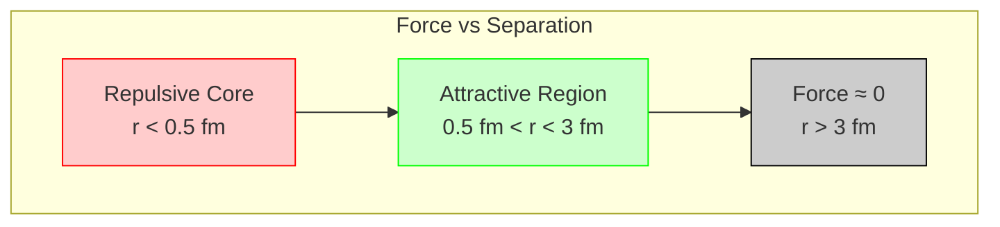

---
# 1. Overview / 概述

**English:**
The strong nuclear force is the fundamental force responsible for holding the nucleus of an atom together. Without it, the positively charged protons within the nucleus would repel each other due to the [[Electrostatic Force]], causing the nucleus to fly apart. This sub-topic explores the nature, properties, and range of the strong nuclear force, explaining why stable nuclei exist and how it overcomes the electrostatic repulsion between protons. Understanding this force is crucial for grasping the stability of matter and is a prerequisite for studying [[Nuclear Decay]] and [[Nuclear Fusion]].

**中文:**
强核力是将原子核束缚在一起的基本力。如果没有它，原子核内带正电的质子会因[[静电力]]而相互排斥，导致原子核飞散。本子知识点探讨强核力的性质、特性和作用范围，解释稳定原子核为何存在以及它如何克服质子间的静电斥力。理解这种力对于掌握物质的稳定性至关重要，也是学习[[核衰变]]和[[核聚变]]的前提。

---

# 2. Syllabus Learning Objectives / 考纲学习目标

| CAIE 9702 | Edexcel IAL |
|-----------|-------------|
| 1.1(a) Describe the nature of the strong nuclear force. | 6.1 Understand that the strong nuclear force holds the nucleus together. |
| 1.1(b) Explain that the strong nuclear force is attractive at short range and repulsive at very short range. | 6.2 Understand the short-range nature of the strong nuclear force. |
| 1.1(c) State that the strong nuclear force is charge-independent. | 6.3 Understand that the strong nuclear force acts between nucleons (protons and neutrons). |
| 1.1(d) Describe the approximate range of the strong nuclear force. | 6.4 Understand that the strong nuclear force is much stronger than the electrostatic force at nuclear distances. |
| 1.1(e) Explain how the strong nuclear force overcomes electrostatic repulsion. | 6.5 Understand the role of the strong nuclear force in nuclear stability. |

**Examiner Expectations / 考官期望:**
- **English:** Students must be able to describe the strong nuclear force's key properties: it is attractive at typical nuclear separations (~1-3 fm) but becomes repulsive at very short distances (<0.5 fm). It is charge-independent, meaning it acts equally between any pair of nucleons (proton-proton, proton-neutron, neutron-neutron). Students should also be able to explain how this force overcomes the electrostatic repulsion between protons to create a stable nucleus.
- **中文:** 学生必须能够描述强核力的关键特性：在典型的核间距（约1-3 fm）下表现为引力，但在极短距离（<0.5 fm）下表现为斥力。它是电荷无关的，意味着它在任何一对核子（质子-质子、质子-中子、中子-中子）之间作用力相同。学生还应能解释这种力如何克服质子间的静电斥力，从而形成稳定的原子核。

---

# 3. Core Definitions / 核心定义

| Term (EN/CN) | Definition (EN) | Definition (CN) | Common Mistakes / 常见错误 |
|--------------|-----------------|-----------------|---------------------------|
| **Strong Nuclear Force** / 强核力 | The fundamental force that binds nucleons (protons and neutrons) together in the nucleus. | 将核子（质子和中子）束缚在原子核内的基本力。 | Confusing it with the [[Weak Nuclear Force]], which is responsible for beta decay. |
| **Nucleon** / 核子 | A collective term for a proton or a neutron, the particles found in the nucleus. | 对原子核中质子和中子的统称。 | Forgetting that both protons and neutrons are nucleons. |
| **Electrostatic Repulsion** / 静电斥力 | The repulsive force between two like charges, in this context, between protons in the nucleus. | 两个同种电荷之间的排斥力，在此上下文中指原子核内质子之间的排斥力。 | Thinking it is the only force acting in the nucleus. |
| **Range** / 作用范围 | The maximum distance over which a force is effective. For the strong nuclear force, this is approximately 3-4 femtometers (fm). | 力能有效作用的最大距离。对于强核力，约为3-4飞米（fm）。 | Assuming the force has an infinite range like gravity or electromagnetism. |
| **Charge-Independent** / 电荷无关 | A property of the strong nuclear force meaning it acts equally between any pair of nucleons, regardless of their charge. | 强核力的一种性质，意味着它在任何一对核子之间作用力相同，与它们的电荷无关。 | Thinking the force is stronger between protons because they are charged. |

---

# 4. Key Concepts Explained / 关键概念详解

## 4.1 The Nature and Properties of the Strong Nuclear Force / 强核力的性质与特性

### Explanation / 解释
**English:**
The strong nuclear force is one of the four fundamental forces of nature (alongside gravity, electromagnetism, and the weak nuclear force). Its primary role is to bind [[Nucleons]] together to form stable [[Atomic Nuclei]]. It has two critical properties:
1.  **Short-Range Attraction:** At a separation of about 1 to 3 femtometers (fm, where 1 fm = $10^{-15}$ m), the force is strongly attractive. This attraction is what holds the nucleus together.
2.  **Very Short-Range Repulsion:** At separations less than about 0.5 fm, the force becomes strongly repulsive. This prevents nucleons from getting too close to each other and collapsing the nucleus.
3.  **Charge Independence:** The force is the same between any pair of nucleons: proton-proton, proton-neutron, and neutron-neutron. This is why neutrons are essential for stability—they provide additional attractive force without adding to the electrostatic repulsion.

**中文:**
强核力是自然界四种基本力之一（与引力、电磁力和弱核力并列）。它的主要作用是将[[核子]]束缚在一起，形成稳定的[[原子核]]。它有两个关键特性：
1.  **短程引力：** 当核子间距约为1到3飞米（fm，1 fm = $10^{-15}$ m）时，该力表现为强引力。这种引力是将原子核束缚在一起的原因。
2.  **极短程斥力：** 当间距小于约0.5飞米时，该力变为强斥力。这阻止了核子靠得太近，防止原子核坍缩。
3.  **电荷无关性：** 该力在任何一对核子（质子-质子、质子-中子、中子-中子）之间作用力相同。这就是中子对稳定性至关重要的原因——它们提供额外的引力，而不会增加静电斥力。

### Physical Meaning / 物理意义
**English:**
The strong nuclear force is the "glue" of the atomic world. It is about 100 times stronger than the [[Electrostatic Force]] at nuclear distances, which is why it can overcome the repulsion between protons. The repulsive core at very short distances ensures that nucleons have a minimum separation, defining the size and density of the nucleus.

**中文:**
强核力是原子世界的“胶水”。在核尺度上，它比[[静电力]]强约100倍，这就是它能克服质子间斥力的原因。极短距离下的斥力核心确保了核子有一个最小间距，从而定义了原子核的大小和密度。

### Common Misconceptions / 常见误区
- **Misconception 1:** The strong nuclear force acts on electrons. (Correction: It only acts on nucleons.)
- **Misconception 2:** The strong nuclear force is always attractive. (Correction: It is repulsive at very short distances.)
- **Misconception 3:** The strong nuclear force is the same as the electrostatic force. (Correction: The electrostatic force is long-range and repulsive between like charges; the strong force is short-range and attractive between nucleons.)
- **常见误区1：** 强核力作用于电子。（纠正：它只作用于核子。）
- **常见误区2：** 强核力总是引力。（纠正：在极短距离下它是斥力。）
- **常见误区3：** 强核力与静电力相同。（纠正：静电力是长程力，在同种电荷间表现为斥力；强核力是短程力，在核子间表现为引力。）

### Exam Tips / 考试提示
- **English:** When describing the strong nuclear force, always mention its **short range** and **charge independence**. Use the correct units (femtometers, fm). Be prepared to draw a graph of force against separation for nucleons.
- **中文：** 在描述强核力时，务必提及它的**短程性**和**电荷无关性**。使用正确的单位（飞米，fm）。准备好绘制核子间作用力随距离变化的图表。

> 📷 **IMAGE PROMPT — SNF-01: Strong Nuclear Force vs. Electrostatic Force**
> A side-by-side comparison diagram. On the left, two protons are shown with a large red repulsion arrow between them labeled "Electrostatic Repulsion". On the right, a cluster of protons and neutrons is shown with small blue attraction arrows between all pairs of nucleons, labeled "Strong Nuclear Force". The caption reads: "The strong nuclear force overcomes electrostatic repulsion to bind the nucleus."

---

# 5. Essential Equations / 核心公式

There is no single algebraic equation for the strong nuclear force at the A-Level level. The key is understanding the **graphical relationship** and the **comparison of force magnitudes**.

**Key Comparison:**
$$ F_{\text{strong}} \approx 100 \times F_{\text{electrostatic}} \quad \text{(at nuclear distances)} $$

| Symbol (符号) | Meaning (EN) | Meaning (CN) | Unit (单位) |
|--------------|-------------|-------------|------------|
| $F_{\text{strong}}$ | Magnitude of the strong nuclear force | 强核力的大小 | N (Newtons) |
| $F_{\text{electrostatic}}$ | Magnitude of the electrostatic (Coulomb) force | 静电力（库仑力）的大小 | N (Newtons) |

**Derivation / 推导:** Not required at this level.
**Conditions / 适用条件:** This comparison is only valid at typical nuclear separations (1-3 fm). At larger distances, the strong force is negligible.
**Limitations / 局限性:** This is a rough approximation. The exact ratio depends on the specific separation and the number of nucleons involved.

---

# 6. Graphs and Relationships / 图表与关系

## 6.1 Force vs. Separation for Two Nucleons / 两个核子间作用力与距离的关系

### Axes / 坐标轴
- **X-axis:** Separation between nucleons, $r$ / 核子间距 $r$ (fm)
- **Y-axis:** Strong nuclear force, $F$ / 强核力 $F$ (N) (Attractive positive, Repulsive negative)

### Shape / 形状
The graph has a characteristic shape:
- **For $r < 0.5$ fm:** The force is **strongly repulsive** (negative on the graph).
- **For $0.5 \text{ fm} < r < 3$ fm:** The force is **attractive** (positive on the graph). It reaches a maximum attractive value around $r \approx 1$ fm.
- **For $r > 3$ fm:** The force rapidly falls to **zero** (negligible).

### Gradient Meaning / 斜率含义
The gradient of the force-separation graph is related to the stiffness of the nuclear "spring". A steep gradient indicates a rapid change in force with distance.

### Area Meaning / 面积含义
The area under a force-distance graph represents the work done or the potential energy of the interaction.

### Exam Interpretation / 考试解读
- **English:** You must be able to sketch this graph from memory. Label the key regions: repulsive core, attractive region, and the point where the force becomes zero. Explain that the equilibrium separation (where net force is zero) is not a single point but a balance between attraction and repulsion.
- **中文：** 你必须能够凭记忆画出此图。标注关键区域：斥力核心、引力区域以及力变为零的点。解释平衡间距（净力为零的点）不是单一的点，而是引力和斥力之间的平衡。



> 📷 **IMAGE PROMPT — SNF-02: Strong Nuclear Force Graph**
> A graph with "Separation r / fm" on the x-axis (from 0 to 5) and "Force F" on the y-axis (positive above, negative below). The curve starts very high in the negative (repulsive) region at r=0, crosses zero at r=0.5 fm, rises to a positive peak at r=1 fm, then decays smoothly back to zero at r=3 fm. The regions are labeled: "Repulsive Core", "Attractive Region", and "Force ≈ 0". A dashed line is drawn at r=3 fm.

---

# 7. Required Diagrams / 必备图表

## 7.1 The Strong Nuclear Force Graph / 强核力图

### Description / 描述
**English:** A graph showing how the strong nuclear force between two nucleons varies with their separation. It is the single most important diagram for this sub-topic.
**中文：** 显示两个核子间强核力如何随其间距变化的图表。这是本子知识点最重要的图表。

### Image Prompt / 图片生成提示
> 📷 **IMAGE PROMPT — SNF-03: Detailed Strong Nuclear Force Graph**
> A professional physics textbook-style graph. X-axis: "Separation r / fm" (0 to 5). Y-axis: "Strong Nuclear Force F" (positive up, negative down). The curve is a smooth, continuous line. It starts at a very high negative value at r=0, crosses the x-axis at r=0.5 fm, reaches a positive maximum at r=1.0 fm, and then decays exponentially to zero at r=3.0 fm. The area under the curve for r<0.5 fm is shaded red and labeled "Repulsive Core". The area for 0.5<r<3 fm is shaded blue and labeled "Attractive Region". A vertical dashed line is at r=3 fm labeled "Range Limit".

### Labels Required / 需要标注
- **English:** Axes (Force, Separation), Repulsive Core region, Attractive region, Range limit (3 fm), Equilibrium point (where force crosses zero at r=0.5 fm).
- **中文：** 坐标轴（力、间距）、斥力核心区域、引力区域、作用范围极限（3 fm）、平衡点（力在r=0.5 fm处过零点）。

### Exam Importance / 考试重要性
- **English:** Extremely high. This graph is frequently asked in exams. Students must be able to draw, label, and explain it.
- **中文：** 极高。此图在考试中频繁出现。学生必须能够绘制、标注并解释它。

---

# 8. Worked Examples / 典型例题

## Example 1: Explaining Nuclear Stability / 解释原子核稳定性

### Question / 题目
**English:**
Explain why a nucleus containing many protons can be stable, despite the electrostatic repulsion between them. In your answer, refer to the properties of the strong nuclear force.
**中文：**
解释为什么一个包含许多质子的原子核可以保持稳定，尽管质子之间存在静电斥力。在你的回答中，请参考强核力的性质。

### Solution / 解答
**Step 1:** Identify the two forces acting in the nucleus.
The two main forces are the **electrostatic repulsion** between protons and the **strong nuclear force** between all nucleons.

**Step 2:** Compare the strengths of the forces.
At typical nuclear separations (1-3 fm), the strong nuclear force is approximately **100 times stronger** than the electrostatic repulsive force.

**Step 3:** Explain the role of neutrons.
The strong nuclear force is **charge-independent**, meaning it acts equally between all nucleons (p-p, p-n, n-n). Neutrons contribute to the attractive strong force without adding to the electrostatic repulsion. Therefore, a stable nucleus has a sufficient number of neutrons to provide enough attractive force to overcome the repulsion from the protons.

**Step 4:** Conclude.
The combination of the strong nuclear force's immense strength and the stabilizing presence of neutrons allows the nucleus to remain bound.

### Final Answer / 最终答案
**Answer:** The strong nuclear force is about 100 times stronger than the electrostatic force at nuclear distances. It is also charge-independent, so neutrons provide additional attraction without adding repulsion. This allows the nucleus to be stable. | **答案：** 在核尺度上，强核力比静电力强约100倍。它也是电荷无关的，因此中子提供额外的引力而不增加斥力。这使得原子核能够保持稳定。

### Quick Tip / 提示
- **English:** Always mention both the **strength** and the **charge independence** of the strong nuclear force in your answer.
- **中文：** 在回答中务必同时提及强核力的**强度**和**电荷无关性**。

---

# 9. Past Paper Question Types / 历年真题题型

| Question Type / 题型 | Frequency / 频率 | Difficulty / 难度 | Past Paper References / 真题索引 |
|----------------------|------------------|------------------|-------------------------------|
| Describe properties of strong nuclear force / 描述强核力的性质 | High | Easy | 📝 *待填入* |
| Explain nuclear stability using strong force / 用强核力解释原子核稳定性 | High | Medium | 📝 *待填入* |
| Sketch and interpret force-separation graph / 绘制并解释力-距离图 | Medium | Medium | 📝 *待填入* |
| Compare strong force to electrostatic force / 比较强核力与静电力 | Medium | Easy | 📝 *待填入* |

**Common Command Words / 常见指令词:**
- **Describe / 描述:** Give the key properties (range, charge independence, strength).
- **Explain / 解释:** Give reasons for nuclear stability, linking properties of the force.
- **Sketch / 绘制:** Draw the force-separation graph with correct shape and labels.

---

# 10. Practical Skills Connections / 实验技能链接

**English:**
There is no direct practical experiment for the strong nuclear force at the A-Level level. However, the concept is linked to practical skills through:
- **Data Analysis:** Analyzing data from scattering experiments (like Rutherford's) to infer the existence and properties of the strong force.
- **Graph Plotting:** The skill of plotting and interpreting graphs is directly applicable to the force-separation graph.
- **Estimation:** Estimating the magnitude of forces and comparing them (e.g., estimating the electrostatic repulsion between two protons and comparing it to the strong force).

**中文：**
在A-Level阶段，没有直接针对强核力的实验。然而，这个概念通过以下方式与实验技能相关联：
- **数据分析：** 分析散射实验（如卢瑟福实验）的数据，以推断强核力的存在和性质。
- **图表绘制：** 绘制和解读图表的技能直接适用于力-距离图。
- **估算：** 估算力的大小并进行比较（例如，估算两个质子之间的静电斥力并与强核力比较）。

---

# 11. Concept Map / 概念图谱

```mermaid
graph TD
    subgraph "Atomic Structure and the Nucleus"
        A[Atomic Nucleus] --> B[Protons]
        A --> C[Neutrons]
        B & C --> D[Nucleons]
    end

    subgraph "Forces in the Nucleus"
        D --> E[Strong Nuclear Force]
        B --> F[Electrostatic Repulsion]
    end

    E --> G[Properties]
    G --> H[Short Range (≈3 fm)]
    G --> I[Charge Independent]
    G --> J[Strongly Attractive (1-3 fm)]
    G --> K[Repulsive Core (<0.5 fm)]

    F --> L[Long Range]
    F --> M[Repulsive between like charges]

    E & F --> N[Nuclear Stability]
    N --> O[Balance of forces]
    O --> P[Neutrons provide extra attraction]

    style E fill:#lightblue,stroke:#333
    style F fill:#lightcoral,stroke:#333
    style N fill:#lightgreen,stroke:#333
```

---

# 12. Quick Revision Sheet / 速查表

| Category / 类别 | Key Points / 要点 |
|----------------|------------------|
| **Definition / 定义** | The fundamental force that binds nucleons together in the nucleus. / 将核子束缚在原子核内的基本力。 |
| **Key Properties / 核心性质** | 1. Short range (~3 fm) / 短程 (~3 fm) <br> 2. Charge independent / 电荷无关 <br> 3. Attractive at 1-3 fm, repulsive < 0.5 fm / 在1-3 fm为引力，<0.5 fm为斥力 <br> 4. ~100x stronger than electrostatic force / 比静电力强约100倍 |
| **Key Graph / 核心图表** | Force vs. Separation graph: Repulsive core, attractive region, zero beyond 3 fm. / 力-距离图：斥力核心、引力区域、3 fm以外为零。 |
| **Key Comparison / 核心比较** | Strong Nuclear Force vs. Electrostatic Force: Strong force is short-range, charge-independent, and much stronger. / 强核力 vs. 静电力：强核力是短程、电荷无关且强得多。 |
| **Exam Tip / 考试提示** | Always mention **range** and **charge independence** when explaining nuclear stability. / 解释原子核稳定性时，务必提及**作用范围**和**电荷无关性**。 |