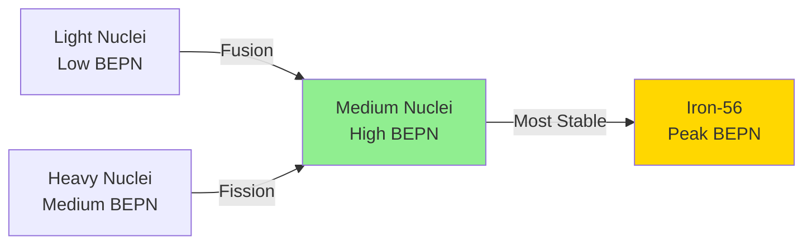

# 1. Overview / 概述

**English:**
The Binding Energy Per Nucleon Curve is one of the most important graphs in nuclear physics. It shows how the stability of atomic nuclei varies with nucleon number (mass number A). This curve explains why energy is released in both nuclear fission (splitting heavy nuclei) and nuclear fusion (joining light nuclei). Understanding this curve is essential for grasping why certain nuclei are stable, why others undergo radioactive decay, and how nuclear power works. This sub-topic connects directly to [[Mass Defect and Binding Energy]] and provides the foundation for [[Nuclear Fission and Fusion]].

**中文:**
比结合能曲线是核物理中最重要的图表之一。它展示了原子核的稳定性如何随核子数（质量数A）变化。这条曲线解释了为什么核裂变（分裂重核）和核聚变（结合轻核）都会释放能量。理解这条曲线对于掌握为什么某些核是稳定的、为什么其他核会发生放射性衰变以及核能如何工作至关重要。本子知识点直接与[[质量亏损与结合能]]相关，并为[[核裂变与聚变]]提供基础。

---

# 2. Syllabus Learning Objectives / 考纲学习目标

| CAIE 9702 | Edexcel IAL |
|-----------|-------------|
| 1.2(a): Understand the concept of binding energy per nucleon | WPH11 U1: 6.6: Understand the concept of binding energy per nucleon |
| 1.2(b): Interpret the binding energy per nucleon curve | WPH11 U1: 6.7: Interpret the binding energy per nucleon curve |
| 1.2(c): Explain energy release in fission and fusion using the curve | WPH11 U1: 6.8: Explain energy release in fission and fusion |
| 1.2(d): Calculate binding energy per nucleon from mass defect | WPH11 U1: 6.9: Calculate binding energy per nucleon |

**Examiner Expectations / 考官期望:**
- **English:** You must be able to sketch the general shape of the curve, identify the most stable nucleus (iron-56), explain why fission and fusion release energy, and calculate binding energy per nucleon from given data.
- **中文:** 你必须能够画出曲线的大致形状，识别最稳定的核（铁-56），解释为什么裂变和聚变释放能量，并根据给定数据计算比结合能。

---

# 3. Core Definitions / 核心定义

| Term (EN/CN) | Definition (EN) | Definition (CN) | Common Mistakes / 常见错误 |
|--------------|-----------------|-----------------|---------------------------|
| **Binding Energy Per Nucleon** / 比结合能 | The average energy required to remove one nucleon from a nucleus; total binding energy divided by the number of nucleons | 从原子核中移走一个核子所需的平均能量；总结合能除以核子数 | Confusing with total binding energy; forgetting to divide by A |
| **Binding Energy Curve** / 结合能曲线 | A graph showing how binding energy per nucleon varies with nucleon number A | 显示比结合能如何随核子数A变化的图表 | Thinking the curve is linear; misidentifying the peak |
| **Most Stable Nucleus** / 最稳定的核 | The nucleus with the highest binding energy per nucleon (iron-56, A=56) | 比结合能最高的原子核（铁-56，A=56） | Confusing with uranium or other heavy elements |
| **Fission** / 裂变 | The splitting of a heavy nucleus into two lighter nuclei, releasing energy | 重核分裂成两个较轻的核，释放能量 | Forgetting that fission only occurs for heavy nuclei |
| **Fusion** / 聚变 | The joining of two light nuclei to form a heavier nucleus, releasing energy | 两个轻核结合形成一个较重的核，释放能量 | Thinking fusion requires any nuclei, not just light ones |
| **Mass Defect** / 质量亏损 | The difference between the mass of a nucleus and the sum of the masses of its individual nucleons | 原子核质量与其单个核子质量总和之间的差值 | Confusing with binding energy; forgetting units |

---

# 4. Key Concepts Explained / 关键概念详解

## 4.1 Shape of the Binding Energy Per Nucleon Curve / 比结合能曲线的形状

### Explanation / 解释
**English:** The binding energy per nucleon curve plots binding energy per nucleon (in MeV) against nucleon number A. The curve rises steeply from light nuclei (A=1 to ~20), reaches a broad maximum around A=56 (iron-56), then gradually decreases for heavier nuclei. The maximum value is approximately 8.8 MeV per nucleon for iron-56. This shape is crucial because it shows that nuclei with intermediate mass numbers are the most stable, while both very light and very heavy nuclei are less stable.

**中文:** 比结合能曲线绘制了比结合能（以MeV为单位）与核子数A的关系。曲线从轻核（A=1到约20）急剧上升，在A=56（铁-56）附近达到一个宽峰，然后对于更重的核逐渐下降。铁-56的最大值约为每个核子8.8 MeV。这个形状至关重要，因为它表明中等质量数的核最稳定，而非常轻和非常重的核都不太稳定。

### Physical Meaning / 物理意义
**English:** The binding energy per nucleon represents the average energy holding each nucleon in the nucleus. A higher value means the nucleus is more tightly bound and therefore more stable. The curve tells us that iron-56 is the most stable nucleus in nature, and that energy can be released by moving towards iron-56 from either direction — by fusing light nuclei or by fissioning heavy nuclei.

**中文:** 比结合能代表将每个核子保持在原子核中的平均能量。值越高意味着核结合得越紧密，因此越稳定。曲线告诉我们铁-56是自然界中最稳定的核，并且通过从任一方向向铁-56移动——通过聚变轻核或裂变重核——都可以释放能量。

### Common Misconceptions / 常见误区
- ❌ **English:** Thinking the curve is symmetrical or linear. **中文:** 认为曲线是对称的或线性的。
- ❌ **English:** Believing that the highest binding energy per nucleon means the largest total binding energy. **中文:** 认为比结合能最高意味着总结合能最大。
- ❌ **English:** Confusing the peak (iron-56) with the heaviest stable nucleus (lead-208). **中文:** 将峰值（铁-56）与最重的稳定核（铅-208）混淆。
- ❌ **English:** Thinking that all light nuclei have low binding energy per nucleon (hydrogen-1 has zero). **中文:** 认为所有轻核的比结合能都很低（氢-1为零）。

### Exam Tips / 考试提示
- ✅ **English:** Always sketch the curve with the correct shape — steep rise, broad peak, gradual fall. **中文:** 始终画出正确形状的曲线——急剧上升、宽峰、逐渐下降。
- ✅ **English:** Label the peak at A=56 (iron-56) with approximately 8.8 MeV. **中文:** 在A=56（铁-56）处标注峰值，约为8.8 MeV。
- ✅ **English:** Remember that hydrogen-1 (A=1) has zero binding energy per nucleon. **中文:** 记住氢-1（A=1）的比结合能为零。

> 📷 **IMAGE PROMPT — BEP-01: Binding Energy Per Nucleon Curve**
> A clear graph showing binding energy per nucleon (y-axis, 0 to 10 MeV) against nucleon number A (x-axis, 0 to 250). The curve rises steeply from A=1 to A=20, reaches a broad maximum around A=56 (iron-56) at 8.8 MeV, then gradually decreases to about 7.5 MeV at A=238 (uranium-238). Label key points: hydrogen-1 (0 MeV), helium-4, iron-56 (peak), uranium-238. Include a dashed horizontal line at 8.8 MeV for reference. Educational diagram for A-Level physics.

---

## 4.2 Energy Release in Fission and Fusion / 裂变和聚变中的能量释放

### Explanation / 解释
**English:** The binding energy per nucleon curve explains why energy is released in both fission and fusion. In fission, a heavy nucleus (e.g., uranium-235) splits into two medium-mass nuclei. The products have higher binding energy per nucleon than the original nucleus, so the total binding energy increases. This increase in binding energy means energy is released (since binding energy is the energy required to break the nucleus apart, more binding energy means more energy released when the nucleus forms). In fusion, two light nuclei (e.g., hydrogen isotopes) join to form a heavier nucleus with higher binding energy per nucleon, again releasing energy.

**中文:** 比结合能曲线解释了为什么裂变和聚变都会释放能量。在裂变中，一个重核（如铀-235）分裂成两个中等质量的核。产物的比结合能高于原始核，因此总结合能增加。结合能的增加意味着能量被释放（因为结合能是分裂原子核所需的能量，更多的结合能意味着形成原子核时释放更多的能量）。在聚变中，两个轻核（如氢同位素）结合形成一个比结合能更高的较重核，同样释放能量。

### Physical Meaning / 物理意义
**English:** The key insight is that energy is released when nuclei move towards the peak of the binding energy per nucleon curve — towards iron-56. Fission moves heavy nuclei to the right of the peak towards the peak; fusion moves light nuclei to the left of the peak towards the peak. In both cases, the products are more stable (more tightly bound) than the reactants.

**中文:** 关键见解是，当原子核向比结合能曲线的峰值——即向铁-56移动时，能量被释放。裂变将峰值右侧的重核向峰值移动；聚变将峰值左侧的轻核向峰值移动。在这两种情况下，产物都比反应物更稳定（结合得更紧密）。

### Common Misconceptions / 常见误区
- ❌ **English:** Thinking that fission releases more energy per reaction than fusion (fusion releases more per unit mass). **中文:** 认为每次反应裂变释放的能量比聚变多（聚变每单位质量释放的能量更多）。
- ❌ **English:** Believing that any nucleus can undergo fission or fusion. **中文:** 认为任何核都可以发生裂变或聚变。
- ❌ **English:** Confusing the direction of energy release — thinking energy is absorbed, not released. **中文:** 混淆能量释放的方向——认为能量被吸收而不是释放。

### Exam Tips / 考试提示
- ✅ **English:** Always refer to the binding energy per nucleon curve when explaining fission or fusion. **中文:** 在解释裂变或聚变时，始终参考比结合能曲线。
- ✅ **English:** State clearly that the products have higher binding energy per nucleon. **中文:** 明确说明产物的比结合能更高。
- ✅ **English:** Use the phrase "energy is released because the products are more stable." **中文:** 使用短语"能量被释放，因为产物更稳定"。

---

# 5. Essential Equations / 核心公式

## Equation 1: Binding Energy Per Nucleon / 比结合能

$$ E_{bn} = \frac{E_b}{A} = \frac{\Delta m c^2}{A} $$

| Symbol (符号) | Meaning (EN) | Meaning (CN) | Unit (单位) |
|--------------|-------------|-------------|------------|
| $E_{bn}$ | Binding energy per nucleon | 比结合能 | MeV or J |
| $E_b$ | Total binding energy of nucleus | 原子核的总结合能 | MeV or J |
| $A$ | Nucleon number (mass number) | 核子数（质量数） | dimensionless |
| $\Delta m$ | Mass defect | 质量亏损 | kg or u |
| $c$ | Speed of light in vacuum | 真空中的光速 | $3.00 \times 10^8$ m/s |

**Derivation / 推导:**
- **English:** The binding energy per nucleon is simply the total binding energy divided by the number of nucleons. The total binding energy is found from the mass defect using Einstein's mass-energy equivalence: $E_b = \Delta m c^2$.
- **中文:** 比结合能就是总结合能除以核子数。总结合能通过质量亏损使用爱因斯坦的质能等价关系求得：$E_b = \Delta m c^2$。

**Conditions / 适用条件:**
- **English:** This equation applies to all stable and unstable nuclei. The mass defect must be calculated correctly using the masses of protons, neutrons, and the nucleus.
- **中文:** 该方程适用于所有稳定和不稳定的核。必须使用质子、中子和原子核的质量正确计算质量亏损。

**Limitations / 局限性:**
- **English:** The binding energy per nucleon is an average value; individual nucleons may have different binding energies within the same nucleus.
- **中文:** 比结合能是一个平均值；同一原子核内的单个核子可能具有不同的结合能。

> 📷 **IMAGE PROMPT — BEP-02: Binding Energy Calculation Diagram**
> A step-by-step diagram showing how to calculate binding energy per nucleon. Step 1: Find mass defect (mass of protons + mass of neutrons - mass of nucleus). Step 2: Convert mass defect to energy using E=mc². Step 3: Divide by nucleon number A. Include example calculation for helium-4. Educational diagram for A-Level physics.

---

## Equation 2: Energy Released in Fission or Fusion / 裂变或聚变中释放的能量

$$ E_{released} = (E_{b,products} - E_{b,reactants}) = (\Delta m_{reactants} - \Delta m_{products})c^2 $$

| Symbol (符号) | Meaning (EN) | Meaning (CN) | Unit (单位) |
|--------------|-------------|-------------|------------|
| $E_{released}$ | Energy released in the reaction | 反应中释放的能量 | MeV or J |
| $E_{b,products}$ | Total binding energy of products | 产物的总结合能 | MeV or J |
| $E_{b,reactants}$ | Total binding energy of reactants | 反应物的总结合能 | MeV or J |
| $\Delta m$ | Mass defect | 质量亏损 | kg or u |

**Derivation / 推导:**
- **English:** The energy released equals the increase in total binding energy. Since binding energy is negative (energy required to separate nucleons), an increase in binding energy means energy is released to the surroundings.
- **中文:** 释放的能量等于总结合能的增加。由于结合能为负（分离核子所需的能量），结合能的增加意味着能量被释放到周围环境。

**Conditions / 适用条件:**
- **English:** This equation applies to nuclear reactions where the products are more stable than the reactants (i.e., moving towards the peak of the binding energy curve).
- **中文:** 该方程适用于产物比反应物更稳定的核反应（即向结合能曲线的峰值移动）。

**Limitations / 局限性:**
- **English:** This is a simplified model; actual fission and fusion reactions involve multiple steps and may produce various product nuclei.
- **中文:** 这是一个简化模型；实际的裂变和聚变反应涉及多个步骤，可能产生各种产物核。

---

# 6. Graphs and Relationships / 图表与关系

## 6.1 Binding Energy Per Nucleon vs. Nucleon Number / 比结合能 vs. 核子数

### Axes / 坐标轴
- **X-axis:** Nucleon number A (mass number) / 核子数A（质量数）
- **Y-axis:** Binding energy per nucleon / MeV / 比结合能 / MeV

### Shape / 形状
- **English:** The curve rises steeply from A=1 to A≈20, reaches a broad maximum around A=56 (iron-56) at approximately 8.8 MeV, then gradually decreases to about 7.5 MeV at A=238 (uranium-238). The curve is asymmetric — the rise is steeper than the fall.
- **中文:** 曲线从A=1到A≈20急剧上升，在A=56（铁-56）附近达到约8.8 MeV的宽峰，然后逐渐下降到A=238（铀-238）时的约7.5 MeV。曲线是不对称的——上升比下降更陡。

### Gradient Meaning / 斜率含义
- **English:** The gradient shows how rapidly the binding energy per nucleon changes with nucleon number. A steep gradient (light nuclei) means small changes in A cause large changes in stability. A shallow gradient (heavy nuclei) means stability changes slowly with A.
- **中文:** 斜率显示比结合能随核子数变化的速率。陡峭的梯度（轻核）意味着A的微小变化会导致稳定性的巨大变化。平缓的梯度（重核）意味着稳定性随A缓慢变化。

### Area Meaning / 面积含义
- **English:** The area under the curve has no direct physical meaning. However, the difference in binding energy per nucleon between two points on the curve multiplied by the number of nucleons involved gives the energy released in a nuclear reaction.
- **中文:** 曲线下的面积没有直接的物理意义。然而，曲线上两点之间的比结合能差乘以涉及的核子数给出了核反应中释放的能量。

### Exam Interpretation / 考试解读
- **English:** You must be able to:
  1. Sketch the curve from memory
  2. Identify the most stable nucleus (iron-56)
  3. Explain why fission and fusion release energy using the curve
  4. Compare the stability of different nuclei
- **中文:** 你必须能够：
  1. 凭记忆画出曲线
  2. 识别最稳定的核（铁-56）
  3. 使用曲线解释为什么裂变和聚变释放能量
  4. 比较不同核的稳定性



---

# 7. Required Diagrams / 必备图表

## 7.1 Binding Energy Per Nucleon Curve / 比结合能曲线

### Description / 描述
**English:** A graph showing binding energy per nucleon (y-axis, 0-10 MeV) against nucleon number A (x-axis, 0-250). The curve rises steeply from A=1 to A≈20, peaks at A=56 (iron-56) at 8.8 MeV, then gradually decreases. Key nuclei should be labeled: hydrogen-1 (0 MeV), helium-4, carbon-12, iron-56 (peak), uranium-238.

**中文:** 显示比结合能（y轴，0-10 MeV）与核子数A（x轴，0-250）关系的图表。曲线从A=1到A≈20急剧上升，在A=56（铁-56）处达到8.8 MeV的峰值，然后逐渐下降。应标注关键核：氢-1（0 MeV）、氦-4、碳-12、铁-56（峰值）、铀-238。

### Image Prompt / 图片生成提示
> 📷 **IMAGE PROMPT — BEP-03: Detailed Binding Energy Per Nucleon Curve**
> A professional physics textbook-style graph showing binding energy per nucleon (y-axis, 0 to 10 MeV, labeled in 1 MeV increments) against nucleon number A (x-axis, 0 to 250, labeled in 25 increments). The curve rises steeply from (1,0) to approximately (20,8), reaches a broad maximum at (56,8.8) labeled "Iron-56 (most stable)", then gradually decreases to (238,7.5) labeled "Uranium-238". Key points labeled: Hydrogen-1 (0 MeV), Helium-4 (7.1 MeV), Carbon-12 (7.7 MeV), Iron-56 (8.8 MeV), Uranium-238 (7.5 MeV). Include a dashed horizontal line at 8.8 MeV. The graph has a clean white background, black axes, blue curve, and red labels. Educational diagram for A-Level physics.

### Labels Required / 需要标注
- **English:** Axes labels, key nuclei (H-1, He-4, C-12, Fe-56, U-238), peak value (8.8 MeV), most stable nucleus label
- **中文:** 坐标轴标签、关键核（H-1、He-4、C-12、Fe-56、U-238）、峰值（8.8 MeV）、最稳定核标签

### Exam Importance / 考试重要性
- **English:** This is the most important diagram in nuclear physics for A-Level. You must be able to sketch it from memory and use it to explain fission and fusion.
- **中文:** 这是A-Level核物理中最重要的图表。你必须能够凭记忆画出它，并用它来解释裂变和聚变。

---

## 7.2 Fission and Fusion on the Curve / 曲线上的裂变和聚变

### Description / 描述
**English:** A modified version of the binding energy curve showing arrows indicating fission (heavy nucleus splitting into two medium nuclei) and fusion (two light nuclei joining to form a medium nucleus). Both arrows point towards the peak, showing increased stability.

**中文:** 结合能曲线的修改版本，显示指示裂变（重核分裂成两个中等核）和聚变（两个轻核结合形成一个中等核）的箭头。两个箭头都指向峰值，显示稳定性增加。

### Image Prompt / 图片生成提示
> 📷 **IMAGE PROMPT — BEP-04: Fission and Fusion on Binding Energy Curve**
> The binding energy per nucleon curve with two colored arrows. Red arrow: Fission — from uranium-238 (A=238, 7.5 MeV) splitting into two nuclei around A=119 (8.5 MeV). Blue arrow: Fusion — from two hydrogen-2 nuclei (A=2, 1.1 MeV) combining to form helium-4 (A=4, 7.1 MeV). Both arrows point upward and rightward towards the peak at iron-56. Labels: "Fission releases energy" and "Fusion releases energy". Educational diagram for A-Level physics.

### Labels Required / 需要标注
- **English:** Fission arrow, fusion arrow, "energy released" labels, initial and final nuclei
- **中文:** 裂变箭头、聚变箭头、"释放能量"标签、初始和最终核

### Exam Importance / 考试重要性
- **English:** Frequently tested in exam questions asking students to explain energy release using the curve.
- **中文:** 在要求学生使用曲线解释能量释放的考试问题中经常出现。

---

# 8. Worked Examples / 典型例题

## Example 1: Calculating Binding Energy Per Nucleon / 计算比结合能

### Question / 题目
**English:** The mass of a helium-4 nucleus ($^4_2He$) is 4.00260 u. The mass of a proton is 1.00728 u, and the mass of a neutron is 1.00867 u. Calculate the binding energy per nucleon for helium-4. (1 u = 931.5 MeV/c²)

**中文:** 氦-4核（$^4_2He$）的质量为4.00260 u。质子的质量为1.00728 u，中子的质量为1.00867 u。计算氦-4的比结合能。（1 u = 931.5 MeV/c²）

### Solution / 解答

**Step 1: Calculate the mass of individual nucleons / 计算单个核子的质量**
- Number of protons = 2, Number of neutrons = 2
- Mass of 2 protons = 2 × 1.00728 = 2.01456 u
- Mass of 2 neutrons = 2 × 1.00867 = 2.01734 u
- Total mass of nucleons = 2.01456 + 2.01734 = 4.03190 u

**Step 2: Calculate mass defect / 计算质量亏损**
- $\Delta m = 4.03190 - 4.00260 = 0.02930$ u

**Step 3: Convert to energy / 转换为能量**
- $E_b = \Delta m \times 931.5 = 0.02930 \times 931.5 = 27.29$ MeV

**Step 4: Calculate binding energy per nucleon / 计算比结合能**
- $E_{bn} = \frac{27.29}{4} = 6.82$ MeV

### Final Answer / 最终答案
**Answer:** 6.82 MeV per nucleon | **答案：** 每个核子6.82 MeV

### Quick Tip / 提示
- **English:** Always check your units — mass defect in u, then convert to MeV using 931.5 MeV/c² per u. Remember to divide by A (nucleon number) at the end.
- **中文:** 始终检查单位——质量亏损以u为单位，然后使用每u 931.5 MeV/c²转换为MeV。记得最后除以A（核子数）。

---

## Example 2: Energy Release in Fission / 裂变中的能量释放

### Question / 题目
**English:** Uranium-235 undergoes fission: $^{235}_{92}U + n \rightarrow ^{141}_{56}Ba + ^{92}_{36}Kr + 3n$. The binding energy per nucleon of U-235 is 7.59 MeV, Ba-141 is 8.31 MeV, and Kr-92 is 8.66 MeV. Calculate the energy released in this fission reaction.

**中文:** 铀-235发生裂变：$^{235}_{92}U + n \rightarrow ^{141}_{56}Ba + ^{92}_{36}Kr + 3n$。U-235的比结合能为7.59 MeV，Ba-141为8.31 MeV，Kr-92为8.66 MeV。计算该裂变反应中释放的能量。

### Solution / 解答

**Step 1: Calculate total binding energy of reactants / 计算反应物的总结合能**
- U-235: $E_b = 235 \times 7.59 = 1783.65$ MeV
- Neutron: binding energy = 0 (free neutron)
- Total reactants: 1783.65 MeV

**Step 2: Calculate total binding energy of products / 计算产物的总结合能**
- Ba-141: $E_b = 141 \times 8.31 = 1171.71$ MeV
- Kr-92: $E_b = 92 \times 8.66 = 796.72$ MeV
- 3 neutrons: binding energy = 0
- Total products: 1171.71 + 796.72 = 1968.43 MeV

**Step 3: Calculate energy released / 计算释放的能量**
- $E_{released} = 1968.43 - 1783.65 = 184.78$ MeV

### Final Answer / 最终答案
**Answer:** 185 MeV (to 3 significant figures) | **答案：** 185 MeV（保留3位有效数字）

### Quick Tip / 提示
- **English:** The energy released equals the increase in total binding energy. Free neutrons have zero binding energy. Always check that the number of nucleons is conserved (235 + 1 = 141 + 92 + 3).
- **中文:** 释放的能量等于总结合能的增加。自由中子的结合能为零。始终检查核子数是否守恒（235 + 1 = 141 + 92 + 3）。

---

# 9. Past Paper Question Types / 历年真题题型

| Question Type / 题型 | Frequency / 频率 | Difficulty / 难度 | Past Paper References / 真题索引 |
|----------------------|------------------|------------------|-------------------------------|
| Sketch and label the binding energy per nucleon curve | High | Easy | 📝 *待填入* |
| Explain energy release in fission using the curve | High | Medium | 📝 *待填入* |
| Explain energy release in fusion using the curve | High | Medium | 📝 *待填入* |
| Calculate binding energy per nucleon from mass defect | Medium | Medium | 📝 *待填入* |
| Compare stability of different nuclei using the curve | Medium | Easy | 📝 *待填入* |
| Calculate energy released in a nuclear reaction | Low | Hard | 📝 *待填入* |

**Common Command Words / 常见指令词:**
- **English:** Sketch, Label, Explain, Calculate, Compare, State, Determine
- **中文:** 画出、标注、解释、计算、比较、陈述、确定

---

# 10. Practical Skills Connections / 实验技能链接

**English:**
The binding energy per nucleon curve is primarily a theoretical concept, but it connects to practical skills in several ways:

1. **Data Analysis:** Students may be given experimental data for nuclear masses and asked to calculate binding energies, requiring careful handling of significant figures and units.
2. **Graph Plotting:** Plotting binding energy per nucleon against nucleon number from given data develops graph-plotting skills.
3. **Uncertainties:** Mass measurements have uncertainties that propagate through calculations of binding energy.
4. **Mass Spectrometry:** The masses used in binding energy calculations come from mass spectrometry experiments.
5. **Energy Calculations:** Converting between atomic mass units (u) and energy units (MeV or J) is a key practical skill.

**中文:**
比结合能曲线主要是一个理论概念，但它通过以下几种方式与实验技能相关联：

1. **数据分析：** 学生可能会获得核质量的实验数据，并被要求计算结合能，需要仔细处理有效数字和单位。
2. **图表绘制：** 根据给定数据绘制比结合能与核子数的关系图，培养绘图技能。
3. **不确定度：** 质量测量具有不确定度，这些不确定度会传播到结合能的计算中。
4. **质谱法：** 结合能计算中使用的质量来自质谱实验。
5. **能量计算：** 在原子质量单位（u）和能量单位（MeV或J）之间进行转换是一项关键的实践技能。

---

# 11. Concept Map / 概念图谱

```mermaid
graph TD
    BEPN[Binding Energy Per Nucleon Curve] --> DEF[Definition: Energy per nucleon]
    BEPN --> SHAPE[Shape: Steep rise, broad peak, gradual fall]
    BEPN --> PEAK[Peak: Iron-56 at 8.8 MeV]
    BEPN --> STABILITY[Stability: Higher BEPN = More stable]
    
    BEPN --> FISSION[Fission: Heavy → Medium]
    BEPN --> FUSION[Fusion: Light → Medium]
    
    FISSION --> ENERGY_RELEASE[Energy Released]
    FUSION --> ENERGY_RELEASE
    
    ENERGY_RELEASE --> CALC[Calculation: ΔEb = Eb(products) - Eb(reactants)]
    
    BEPN --> MASS_DEFECT[[Mass Defect and Binding Energy]]
    BEPN --> NUCLEAR_REACTIONS[[Nuclear Reactions and Conservation Laws]]
    BEPN --> ISOTOPES[[Isotopes and Their Properties]]
    
    MASS_DEFECT --> EINSTEIN[E = Δmc²]
    
    style BEPN fill:#FF6B6B,color:#fff
    style PEAK fill:#FFD700
    style ENERGY_RELEASE fill:#90EE90
    style MASS_DEFECT fill:#87CEEB
    style NUCLEAR_REACTIONS fill:#87CEEB
    style ISOTOPES fill:#87CEEB
```

---

# 12. Quick Revision Sheet / 速查表

| Category / 类别 | Key Points / 要点 |
|----------------|------------------|
| **Definition / 定义** | Binding energy per nucleon = total binding energy / number of nucleons. Measures average stability per nucleon. / 比结合能 = 总结合能 / 核子数。衡量每个核子的平均稳定性。 |
| **Key Formula / 核心公式** | $E_{bn} = \frac{\Delta m c^2}{A}$ where $\Delta m$ = mass defect, A = nucleon number / 其中$\Delta m$ = 质量亏损，A = 核子数 |
| **Key Graph / 核心图表** | Curve rises steeply (A=1 to 20), peaks at A=56 (Fe-56, 8.8 MeV), falls gradually. / 曲线急剧上升（A=1到20），在A=56处达到峰值（Fe-56，8.8 MeV），然后逐渐下降。 |
| **Most Stable Nucleus / 最稳定的核** | Iron-56 ($^{56}_{26}Fe$) — highest binding energy per nucleon (8.8 MeV) / 铁-56 — 比结合能最高（8.8 MeV） |
| **Fission / 裂变** | Heavy nucleus splits → products have higher BEPN → energy released. / 重核分裂 → 产物比结合能更高 → 释放能量。 |
| **Fusion / 聚变** | Light nuclei join → product has higher BEPN → energy released. / 轻核结合 → 产物比结合能更高 → 释放能量。 |
| **Key Numbers / 关键数值** | 1 u = 931.5 MeV/c²; Fe-56 BEPN = 8.8 MeV; U-238 BEPN ≈ 7.5 MeV / 1 u = 931.5 MeV/c²；Fe-56比结合能 = 8.8 MeV；U-238比结合能 ≈ 7.5 MeV |
| **Common Mistake / 常见错误** | Confusing total binding energy with binding energy per nucleon. Always divide by A! / 混淆总结合能与比结合能。始终除以A！ |
| **Exam Tip / 考试提示** | Sketch the curve first when answering questions about fission/fusion. Label the peak and key nuclei. / 在回答关于裂变/聚变的问题时，先画出曲线。标注峰值和关键核。 |