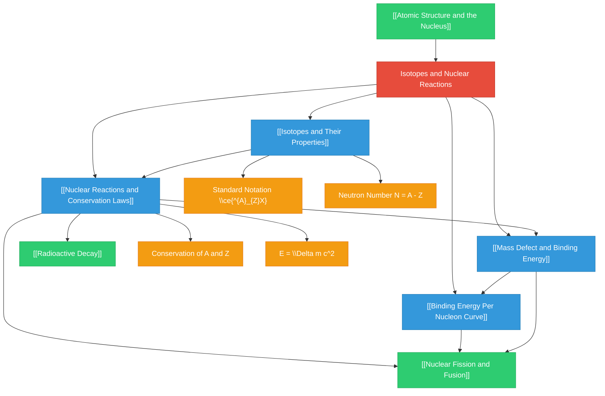

# 1. Overview / 概述

**English:**
This topic introduces the fundamental concept of **isotopes** — atoms of the same element that have the same number of protons but different numbers of neutrons. Understanding isotopes is essential because they behave identically in chemical reactions but differ in nuclear stability and mass. This leads directly into **nuclear reactions**, where the nucleus itself changes, releasing or absorbing enormous amounts of energy. We will explore how to represent isotopes using standard notation, calculate the number of subatomic particles, and understand the conservation laws that govern all nuclear reactions, including mass-energy equivalence via $E = mc^2$. This topic forms the bedrock for later studies in [[Radioactive Decay]], [[Nuclear Fission and Fusion]], and [[Mass Defect and Binding Energy]].

**中文：**
本主题介绍**同位素**的基本概念——即具有相同质子数但不同中子数的同一元素原子。理解同位素至关重要，因为它们在化学反应中表现相同，但在核稳定性和质量上存在差异。这直接引向**核反应**，即原子核本身发生变化，释放或吸收巨大能量。我们将探讨如何使用标准符号表示同位素，计算亚原子粒子数量，并理解支配所有核反应的守恒定律，包括通过 $E = mc^2$ 表示的质量-能量等价性。本主题为后续学习[[放射性衰变]]、[[核裂变与核聚变]]以及[[质量亏损与结合能]]奠定基础。

**Real-World Applications / 实际应用:**
- **Carbon-14 dating** for archaeological artefacts (uses [[Isotopes and Their Properties]])
- **Medical tracers** (e.g., Technetium-99m) for diagnostic imaging
- **Nuclear power generation** (uses [[Nuclear Fission and Fusion]])
- **Radiotherapy** for cancer treatment (uses [[Radioactive Decay]])

**Examination Importance / 考试重要性:**
In both **CAIE 9702** and **Edexcel IAL**, this is a foundational topic. Questions often appear as short-answer definitions, calculations of proton/neutron numbers, and simple nuclear reaction equations. It is frequently tested alongside [[Atomic Structure and the Nucleus]] and [[Radioactive Decay]].

---

# 2. Syllabus Learning Objectives / 考纲学习目标

| CAIE 9702 | Edexcel IAL |
|-----------|-------------|
| 1.2(a) Understand the terms: atomic number (proton number), mass number (nucleon number), isotope, nuclide | 6.6 Know that an atom has a nucleus containing protons and neutrons, and that electrons orbit the nucleus |
| 1.2(b) Use the standard notation $\ce{^{A}_{Z}X}$ for nuclides | 6.7 Understand the terms: atomic number (Z), mass number (A), isotope, nuclide |
| 1.2(c) Understand the meaning of nucleon number and proton number | 6.8 Use the standard notation $\ce{^{A}_{Z}X}$ for nuclides |
| 1.2(d) Understand that isotopes are atoms of the same element with different numbers of neutrons | 6.9 Understand that isotopes have the same chemical properties but different physical properties |

**Examiner Expectations / 考官期望:**

**English:**
- Candidates must be able to **define** isotope, atomic number, and mass number precisely.
- Candidates must be able to **write and interpret** nuclear notation $\ce{^{A}_{Z}X}$.
- Candidates must be able to **calculate** the number of protons, neutrons, and electrons in any atom or ion.
- Candidates must understand that **chemical properties** are determined by electron configuration (same for isotopes), while **physical properties** (e.g., density, rate of diffusion) depend on mass (different for isotopes).
- For Edexcel, candidates should also understand the **stability** of isotopes and the concept of **radioactive isotopes**.

**中文：**
- 考生必须能够**精确定义**同位素、原子序数和质量数。
- 考生必须能够**书写和解释**核符号 $\ce{^{A}_{Z}X}$。
- 考生必须能够**计算**任何原子或离子中的质子、中子和电子数量。
- 考生必须理解**化学性质**由电子排布决定（同位素相同），而**物理性质**（如密度、扩散速率）取决于质量（同位素不同）。
- 对于Edexcel，考生还应理解同位素的**稳定性**和**放射性同位素**的概念。

> 📋 **CIE Only:** CAIE specifically requires understanding of the terms "nuclide" and "nucleon number" in addition to "isotope" and "mass number".
>
> 📋 **Edexcel Only:** Edexcel explicitly requires understanding that isotopes have the same chemical properties but different physical properties, and may ask about the stability of different isotopes.

---

# 3. Core Definitions / 核心定义

| Term (EN/CN) | Definition (EN) | Definition (CN) | Common Mistakes / 常见错误 |
|--------------|-----------------|-----------------|---------------------------|
| **Atomic Number (Z)** / 原子序数 | The number of protons in the nucleus of an atom. It uniquely identifies an element. | 原子核中质子的数量。它唯一地标识一种元素。 | ❌ Confusing Z with mass number A. Remember: Z = protons = atomic number. |
| **Mass Number (A)** / 质量数 | The total number of protons and neutrons (nucleons) in the nucleus of an atom. | 原子核中质子和中子的总数（核子数）。 | ❌ Thinking mass number is the same as atomic mass. A is an integer count; atomic mass is a weighted average. |
| **Nucleon Number** / 核子数 | Same as mass number (A). The total number of nucleons (protons + neutrons) in a nucleus. | 与质量数（A）相同。原子核中核子（质子+中子）的总数。 | ❌ Forgetting that "nucleon" includes both protons and neutrons. |
| **Isotope** / 同位素 | Atoms of the same element (same Z) that have different numbers of neutrons (different A). | 同一元素（相同Z）但具有不同中子数（不同A）的原子。 | ❌ Saying isotopes have different numbers of protons. They have the SAME number of protons. |
| **Nuclide** / 核素 | A specific type of nucleus, characterized by its atomic number Z and mass number A. | 一种特定类型的原子核，由其原子序数Z和质量数A表征。 | ❌ Using "nuclide" and "isotope" interchangeably. All isotopes are nuclides, but not all nuclides are isotopes of the same element. |
| **Proton Number** / 质子数 | Same as atomic number (Z). The number of protons in the nucleus. | 与原子序数（Z）相同。原子核中质子的数量。 | ❌ Confusing with nucleon number. |
| **Neutron Number (N)** / 中子数 | The number of neutrons in the nucleus. Calculated as $N = A - Z$. | 原子核中中子的数量。计算为 $N = A - Z$。 | ❌ Forgetting to subtract Z from A. |
| **Nucleon** / 核子 | A collective term for a proton or a neutron found in the nucleus. | 原子核中质子或中子的统称。 | ❌ Thinking electrons are nucleons. They are not. |
| **Standard Notation** / 标准符号 | $\ce{^{A}_{Z}X}$ where X is the chemical symbol, Z is the atomic number, and A is the mass number. | $\ce{^{A}_{Z}X}$，其中X是化学符号，Z是原子序数，A是质量数。 | ❌ Writing Z on top and A on bottom. Remember: A is on top (mass number), Z is on bottom (atomic number). |
| **Radioactive Isotope (Radioisotope)** / 放射性同位素 | An isotope that has an unstable nucleus and undergoes radioactive decay, emitting radiation. | 具有不稳定原子核并经历放射性衰变、发射辐射的同位素。 | ❌ Thinking all isotopes are radioactive. Only some are. |

---

# 4. Key Concepts Explained / 关键概念详解

## 4.1 Atomic Structure and Notation / 原子结构与符号

### Explanation / 解释
**English:**
Every atom consists of a tiny, dense **nucleus** containing **protons** (positively charged) and **neutrons** (neutral), surrounded by orbiting **electrons** (negatively charged). The number of protons defines the element. The **standard notation** $\ce{^{A}_{Z}X}$ is used to represent a specific nuclide. For example, $\ce{^{12}_{6}C}$ represents carbon-12, with 6 protons and 6 neutrons. The number of neutrons $N$ is found by $N = A - Z$. In a neutral atom, the number of electrons equals the number of protons ($Z$). This notation is essential for writing [[Nuclear Reactions and Conservation Laws]].

**中文：**
每个原子由一个微小致密的**原子核**组成，包含**质子**（带正电）和**中子**（中性），周围环绕着绕核运动的**电子**（带负电）。质子的数量定义了元素。**标准符号** $\ce{^{A}_{Z}X}$ 用于表示特定的核素。例如，$\ce{^{12}_{6}C}$ 表示碳-12，有6个质子和6个中子。中子数 $N$ 由 $N = A - Z$ 求得。在中性原子中，电子数等于质子数（$Z$）。这种符号对于书写[[核反应与守恒定律]]至关重要。

### Physical Meaning / 物理意义
**English:**
The notation tells us exactly what a nucleus is made of. For instance, $\ce{^{235}_{92}U}$ (uranium-235) has 92 protons and 143 neutrons. This is the isotope used in nuclear reactors. The notation $\ce{^{14}_{6}C}$ (carbon-14) has 6 protons and 8 neutrons — this is the radioactive isotope used for carbon dating.

**中文：**
该符号精确告诉我们原子核的组成。例如，$\ce{^{235}_{92}U}$（铀-235）有92个质子和143个中子。这是核反应堆中使用的同位素。符号 $\ce{^{14}_{6}C}$（碳-14）有6个质子和8个中子——这是用于碳定年的放射性同位素。

### Common Misconceptions / 常见误区
1. ❌ **"The mass number is the same as the atomic mass."** — No. Mass number A is an integer count of nucleons. Atomic mass is a weighted average of all isotopes, often not an integer.
2. ❌ **"Isotopes have different chemical properties."** — No. Chemical properties depend on electron configuration, which is the same for isotopes of the same element.
3. ❌ **"The number of neutrons equals the number of protons."** — Only for light stable nuclei. Heavy nuclei have more neutrons than protons.

### Exam Tips / 考试提示
**English:**
- Always write the notation $\ce{^{A}_{Z}X}$ with A on top and Z on bottom.
- When asked to find the number of neutrons, always show $N = A - Z$.
- For ions, remember: number of electrons = $Z$ - (charge). For example, $\ce{^{16}_{8}O^{2-}}$ has 8 protons and 10 electrons.
- CIE often asks to define "isotope" and "nuclide" in the same question — be precise.

**中文：**
- 始终将符号 $\ce{^{A}_{Z}X}$ 写为A在上、Z在下。
- 当被要求找出中子数时，始终展示 $N = A - Z$。
- 对于离子，记住：电子数 = $Z$ - (电荷)。例如，$\ce{^{16}_{8}O^{2-}}$ 有8个质子和10个电子。
- CIE常在同一题中要求定义"同位素"和"核素"——要精确。

> 📷 **IMAGE PROMPT — ATOM-001: Standard Atomic Notation Diagram**
>
> A clean, educational diagram showing a carbon-12 atom. The nucleus is shown as a cluster of 6 red spheres (protons) and 6 blue spheres (neutrons), with 6 small grey electrons orbiting in two concentric shells. Above the nucleus, the notation $\ce{^{12}_{6}C}$ is displayed prominently. Labels point to "Proton (p⁺)", "Neutron (n⁰)", "Electron (e⁻)", "Nucleus", and "Electron Shell". Style: textbook-quality, flat vector illustration, white background, clear labels in English and Chinese.

---

## 4.2 Isotopes / 同位素

### Explanation / 解释
**English:**
**Isotopes** are atoms of the same element (same atomic number Z) that have different numbers of neutrons (different mass number A). For example, hydrogen has three isotopes: $\ce{^{1}_{1}H}$ (protium, 0 neutrons), $\ce{^{2}_{1}H}$ (deuterium, 1 neutron), and $\ce{^{3}_{1}H}$ (tritium, 2 neutrons). Because they have the same number of electrons, they have identical chemical properties. However, their physical properties differ — for example, heavy water (D₂O) is denser than ordinary water. Some isotopes are stable, while others are **radioactive** and undergo [[Radioactive Decay]].

**中文：**
**同位素**是同一元素（相同原子序数Z）但具有不同中子数（不同质量数A）的原子。例如，氢有三种同位素：$\ce{^{1}_{1}H}$（氕，0个中子）、$\ce{^{2}_{1}H}$（氘，1个中子）和 $\ce{^{3}_{1}H}$（氚，2个中子）。由于它们具有相同数量的电子，因此具有相同的化学性质。然而，它们的物理性质不同——例如，重水（D₂O）比普通水密度大。有些同位素是稳定的，而其他则是**放射性的**，会经历[[放射性衰变]]。

### Physical Meaning / 物理意义
**English:**
Isotopes are crucial in many fields:
- **Carbon-14 ($\ce{^{14}_{6}C}$)** is radioactive and used for dating organic materials up to ~50,000 years old.
- **Uranium-235 ($\ce{^{235}_{92}U}$)** is fissile and used in nuclear reactors and weapons.
- **Technetium-99m ($\ce{^{99m}_{43}Tc}$)** is a medical tracer used in imaging.
- **Cobalt-60 ($\ce{^{60}_{27}Co}$)** is used in radiotherapy for cancer treatment.

**中文：**
同位素在许多领域至关重要：
- **碳-14 ($\ce{^{14}_{6}C}$)** 具有放射性，用于对距今约5万年的有机材料进行定年。
- **铀-235 ($\ce{^{235}_{92}U}$)** 是可裂变的，用于核反应堆和武器。
- **锝-99m ($\ce{^{99m}_{43}Tc}$)** 是一种用于成像的医用示踪剂。
- **钴-60 ($\ce{^{60}_{27}Co}$)** 用于癌症放射治疗。

### Common Misconceptions / 常见误区
1. ❌ **"All isotopes are radioactive."** — No. Many isotopes are stable (e.g., $\ce{^{12}_{6}C}$, $\ce{^{16}_{8}O}$). Only some are radioactive.
2. ❌ **"Isotopes have different numbers of protons."** — No. They have the SAME number of protons (same Z). Different numbers of neutrons.
3. ❌ **"Isotopes behave differently in chemical reactions."** — No. Chemical properties are identical because electron configurations are identical.

### Exam Tips / 考试提示
**English:**
- When asked "What is an isotope?", your definition must include: "same number of protons" AND "different number of neutrons".
- Edexcel specifically asks about "same chemical properties, different physical properties" — memorise this phrase.
- Be able to give examples of isotopes (e.g., carbon-12 and carbon-14).
- Understand that the existence of isotopes explains why atomic masses are not whole numbers.

**中文：**
- 当被问及"什么是同位素？"时，你的定义必须包括："相同数量的质子"和"不同数量的中子"。
- Edexcel特别要求"相同的化学性质，不同的物理性质"——记住这个短语。
- 能够给出同位素的例子（如碳-12和碳-14）。
- 理解同位素的存在解释了为什么原子质量不是整数。

> 📷 **IMAGE PROMPT — ISOTOPE-001: Hydrogen Isotopes Comparison**
>
> A side-by-side comparison of the three hydrogen isotopes: protium (¹H), deuterium (²H), and tritium (³H). Each atom shows a nucleus with red protons and grey neutrons, and one orbiting electron. Protium: 1 proton, 0 neutrons. Deuterium: 1 proton, 1 neutron. Tritium: 1 proton, 2 neutrons. Labels indicate "Protium (¹H)", "Deuterium (²H)", "Tritium (³H)" with their respective notations. A note at the bottom reads: "Same Z = 1, Different A = 1, 2, 3". Style: clean educational infographic, flat vector, white background.

---

## 4.3 Nuclear Reactions / 核反应

### Explanation / 解释
**English:**
A **nuclear reaction** is a process in which the nucleus of an atom changes. This can happen spontaneously ([[Radioactive Decay]]) or be induced ([[Nuclear Fission and Fusion]]). Nuclear reactions are written using nuclear equations, which must obey **conservation laws**:
1. **Conservation of nucleon number (mass number A):** The total number of nucleons on the left must equal the total on the right.
2. **Conservation of charge (atomic number Z):** The total charge (sum of Z) on the left must equal the total on the right.
3. **Conservation of mass-energy:** Mass can be converted to energy and vice versa, governed by $E = \Delta m c^2$. This is explored in [[Mass Defect and Binding Energy]].

**中文：**
**核反应**是原子核发生变化的过程。这可以自发发生（[[放射性衰变]]）或被诱导发生（[[核裂变与核聚变]]）。核反应使用核方程书写，必须遵守**守恒定律**：
1. **核子数（质量数A）守恒：** 左侧的核子总数必须等于右侧的总数。
2. **电荷（原子序数Z）守恒：** 左侧的总电荷（Z之和）必须等于右侧的总数。
3. **质量-能量守恒：** 质量可以转化为能量，反之亦然，由 $E = \Delta m c^2$ 支配。这在[[质量亏损与结合能]]中探讨。

### Physical Meaning / 物理意义
**English:**
Nuclear reactions are the source of immense energy. In the Sun, hydrogen nuclei fuse to form helium, releasing energy that sustains life on Earth. In nuclear power plants, uranium-235 nuclei split (fission), releasing energy used to generate electricity. Understanding the conservation laws allows us to predict the products of nuclear reactions and calculate the energy released.

**中文：**
核反应是巨大能量的来源。在太阳中，氢核聚变形成氦，释放维持地球生命的能量。在核电站中，铀-235核分裂（裂变），释放用于发电的能量。理解守恒定律使我们能够预测核反应的产物并计算释放的能量。

### Common Misconceptions / 常见误区
1. ❌ **"Mass is conserved in nuclear reactions."** — No. Mass can be converted to energy. The total mass-energy is conserved, but mass alone is not.
2. ❌ **"The number of protons is conserved."** — No. The total charge (Z) is conserved, but individual elements can change. For example, in beta decay, a neutron becomes a proton.
3. ❌ **"Nuclear reactions are the same as chemical reactions."** — No. Chemical reactions involve electrons; nuclear reactions involve the nucleus and release much more energy.

### Exam Tips / 考试提示
**English:**
- Always check that A and Z balance on both sides of a nuclear equation.
- For alpha decay: A decreases by 4, Z decreases by 2. Product is $\ce{^{4}_{2}He}$.
- For beta-minus decay: A stays the same, Z increases by 1. Product is $\ce{^{0}_{-1}e}$ (or $\beta^-$).
- For beta-plus decay: A stays the same, Z decreases by 1. Product is $\ce{^{0}_{+1}e}$ (or $\beta^+$).
- CIE and Edexcel both expect you to complete nuclear equations.

**中文：**
- 始终检查核方程两侧的A和Z是否平衡。
- 对于α衰变：A减少4，Z减少2。产物是 $\ce{^{4}_{2}He}$。
- 对于β⁻衰变：A不变，Z增加1。产物是 $\ce{^{0}_{-1}e}$（或 $\beta^-$）。
- 对于β⁺衰变：A不变，Z减少1。产物是 $\ce{^{0}_{+1}e}$（或 $\beta^+$）。
- CIE和Edexcel都期望你完成核方程。

> 📷 **IMAGE PROMPT — NUCLEAR-001: Alpha Decay Equation Diagram**
>
> A diagram showing the alpha decay of uranium-238 into thorium-234. On the left, a uranium-238 nucleus (92 protons, 146 neutrons) is shown. An arrow points to the right, where two products are shown: a thorium-234 nucleus (90 protons, 144 neutrons) and an alpha particle (2 protons, 2 neutrons) flying away. The nuclear equation $\ce{^{238}_{92}U -> ^{234}_{90}Th + ^{4}_{2}He}$ is displayed below. Labels indicate "Parent nucleus", "Daughter nucleus", and "Alpha particle (α)". Style: educational diagram, flat vector, clear labels.

---

# 5. Essential Equations / 核心公式

## 5.1 Neutron Number Calculation / 中子数计算

**Equation / 公式:**
$$ N = A - Z $$

**Variables / 变量:**
| Symbol (符号) | Meaning (EN) | Meaning (CN) | Unit (单位) |
|--------------|-------------|-------------|------------|
| $N$ | Neutron number | 中子数 | dimensionless (无量纲) |
| $A$ | Mass number (nucleon number) | 质量数（核子数） | dimensionless (无量纲) |
| $Z$ | Atomic number (proton number) | 原子序数（质子数） | dimensionless (无量纲) |

**Derivation / 推导:**
**English:**
The mass number A is the total number of nucleons (protons + neutrons). The atomic number Z is the number of protons. Therefore, the number of neutrons N is simply the difference: $N = A - Z$.

**中文：**
质量数A是核子（质子+中子）的总数。原子序数Z是质子的数量。因此，中子数N就是差值：$N = A - Z$。

**Conditions / 适用条件:**
**English:** Always applicable for any atom or ion. The equation is a definition, not a physical law.

**中文：** 始终适用于任何原子或离子。该方程是一个定义，而非物理定律。

**Limitations / 局限性:**
**English:** None — it is a definition.

**中文：** 无——这是一个定义。

**Rearrangements / 变形:**
$$ A = Z + N $$
$$ Z = A - N $$

---

## 5.2 Mass-Energy Equivalence / 质能等价

**Equation / 公式:**
$$ E = \Delta m c^2 $$

**Variables / 变量:**
| Symbol (符号) | Meaning (EN) | Meaning (CN) | Unit (单位) |
|--------------|-------------|-------------|------------|
| $E$ | Energy released or absorbed | 释放或吸收的能量 | J (joules) |
| $\Delta m$ | Mass defect (change in mass) | 质量亏损（质量变化） | kg (kilograms) |
| $c$ | Speed of light in vacuum | 真空中的光速 | m s⁻¹ (metres per second) |

**Derivation / 推导:**
**English:**
This equation was derived by Albert Einstein from his theory of special relativity. It shows that mass and energy are equivalent — mass can be converted into energy and vice versa. In nuclear reactions, the total mass of the products is slightly less than the total mass of the reactants. This "missing mass" ($\Delta m$) is converted into energy ($E$). The speed of light $c = 3.00 \times 10^8 \text{ m s}^{-1}$ is a very large number, so even a tiny mass loss releases a huge amount of energy.

**中文：**
该方程由阿尔伯特·爱因斯坦从他的狭义相对论中推导得出。它表明质量和能量是等价的——质量可以转化为能量，反之亦然。在核反应中，产物的总质量略小于反应物的总质量。这个"缺失的质量"（$\Delta m$）转化为能量（$E$）。光速 $c = 3.00 \times 10^8 \text{ m s}^{-1}$ 是一个非常大的数字，因此即使微小的质量损失也会释放巨大的能量。

**Conditions / 适用条件:**
**English:** Applicable whenever mass is converted to energy or energy to mass. In nuclear physics, it is used for [[Mass Defect and Binding Energy]] and [[Nuclear Fission and Fusion]].

**中文：** 适用于质量转化为能量或能量转化为质量的任何情况。在核物理中，它用于[[质量亏损与结合能]]和[[核裂变与核聚变]]。

**Limitations / 局限性:**
**English:** The equation assumes that all the mass defect is converted to energy. In practice, some energy may be carried away by neutrinos or other particles that are difficult to detect.

**中文：** 该方程假设所有质量亏损都转化为能量。实际上，一些能量可能被中微子或其他难以探测的粒子带走。

**Rearrangements / 变形:**
$$ \Delta m = \frac{E}{c^2} $$
$$ c = \sqrt{\frac{E}{\Delta m}} $$

**Common Units / 常用单位:**
**English:** In nuclear physics, energy is often expressed in **electronvolts (eV)**. $1 \text{ eV} = 1.60 \times 10^{-19} \text{ J}$. Mass is often expressed in **atomic mass units (u)**. $1 \text{ u} = 1.66 \times 10^{-27} \text{ kg}$. The conversion is: $1 \text{ u} = 931.5 \text{ MeV}/c^2$.

**中文：** 在核物理中，能量通常以**电子伏特（eV）** 表示。$1 \text{ eV} = 1.60 \times 10^{-19} \text{ J}$。质量通常以**原子质量单位（u）** 表示。$1 \text{ u} = 1.66 \times 10^{-27} \text{ kg}$。换算关系为：$1 \text{ u} = 931.5 \text{ MeV}/c^2$。

---

## 5.3 Nuclear Reaction Conservation / 核反应守恒

**Equation / 公式:**
$$ \sum A_{\text{reactants}} = \sum A_{\text{products}} $$
$$ \sum Z_{\text{reactants}} = \sum Z_{\text{products}} $$

**Variables / 变量:**
| Symbol (符号) | Meaning (EN) | Meaning (CN) | Unit (单位) |
|--------------|-------------|-------------|------------|
| $\sum A$ | Sum of mass numbers | 质量数之和 | dimensionless (无量纲) |
| $\sum Z$ | Sum of atomic numbers | 原子序数之和 | dimensionless (无量纲) |

**Derivation / 推导:**
**English:**
These are empirical laws based on observation. In any nuclear reaction, the total number of nucleons (protons + neutrons) is conserved. Also, the total electric charge is conserved. These laws allow us to balance nuclear equations and predict unknown products.

**中文：**
这些是基于观察的经验定律。在任何核反应中，核子（质子+中子）的总数是守恒的。此外，总电荷也是守恒的。这些定律使我们能够平衡核方程并预测未知产物。

**Conditions / 适用条件:**
**English:** Applicable to ALL nuclear reactions, including [[Radioactive Decay]], [[Nuclear Fission and Fusion]], and artificial transmutation.

**中文：** 适用于所有核反应，包括[[放射性衰变]]、[[核裂变与核聚变]]以及人工嬗变。

**Limitations / 局限性:**
**English:** These conservation laws apply to nucleon number and charge, but NOT to mass. Mass is not conserved in nuclear reactions — it is converted to energy.

**中文：** 这些守恒定律适用于核子数和电荷，但**不**适用于质量。质量在核反应中不守恒——它转化为能量。

**Rearrangements / 变形:**
**English:** Used to find an unknown product. For example, if the reaction is $\ce{^{A1}_{Z1}X + ^{A2}_{Z2}Y -> ^{A3}_{Z3}Z + ?}$, then:
$$ A_? = A_1 + A_2 - A_3 $$
$$ Z_? = Z_1 + Z_2 - Z_3 $$

**中文：** 用于找出未知产物。例如，如果反应为 $\ce{^{A1}_{Z1}X + ^{A2}_{Z2}Y -> ^{A3}_{Z3}Z + ?}$，则：
$$ A_? = A_1 + A_2 - A_3 $$
$$ Z_? = Z_1 + Z_2 - Z_3 $$

---

# 6. Graphs and Relationships / 图表与关系

## 6.1 Binding Energy Per Nucleon Curve / 平均结合能曲线

### Axes / 坐标轴
**English:**
- **X-axis:** Nucleon number (mass number A)
- **Y-axis:** Binding energy per nucleon (MeV)

**中文：**
- **X轴：** 核子数（质量数A）
- **Y轴：** 平均结合能（MeV）

### Shape / 形状
**English:**
The curve rises steeply from low A (hydrogen, helium) to a peak at around A = 56 (iron-56), then gradually decreases for heavier nuclei. The peak at iron-56 indicates it is the most stable nucleus.

**中文：**
曲线从低A（氢、氦）急剧上升，在大约A = 56（铁-56）处达到峰值，然后对于更重的核逐渐下降。铁-56处的峰值表明它是最稳定的原子核。

### Gradient Meaning / 斜率含义
**English:**
- **Steep rise (low A):** Binding energy per nucleon increases rapidly as nucleons are added. Fusion of light nuclei releases energy.
- **Gradual fall (high A):** Binding energy per nucleon decreases slowly. Fission of heavy nuclei releases energy.

**中文：**
- **急剧上升（低A）：** 随着核子的加入，平均结合能迅速增加。轻核聚变释放能量。
- **逐渐下降（高A）：** 平均结合能缓慢下降。重核裂变释放能量。

### Area Meaning / 面积含义
**English:**
The area under the curve from A=0 to a given A represents the total binding energy of that nucleus. However, this is not commonly examined directly.

**中文：**
从A=0到给定A的曲线下面积代表该原子核的总结合能。然而，这通常不直接考查。

### Exam Interpretation / 考试解读
**English:**
- The peak at A=56 (iron) means iron is the most stable nucleus.
- Nuclei to the left of the peak can release energy by **fusion** (combining to form heavier nuclei).
- Nuclei to the right of the peak can release energy by **fission** (splitting into lighter nuclei).
- This curve is essential for understanding [[Nuclear Fission and Fusion]] and [[Mass Defect and Binding Energy]].

**中文：**
- A=56（铁）处的峰值意味着铁是最稳定的原子核。
- 峰值左侧的原子核可以通过**聚变**（结合形成更重的核）释放能量。
- 峰值右侧的原子核可以通过**裂变**（分裂成更轻的核）释放能量。
- 该曲线对于理解[[核裂变与核聚变]]和[[质量亏损与结合能]]至关重要。

### Common Questions / 常见问题
**English:**
- "Explain why energy is released in both fission and fusion."
- "Why is iron the most stable nucleus?"
- "Sketch the binding energy per nucleon curve and label the regions where fission and fusion occur."

**中文：**
- "解释为什么裂变和聚变都会释放能量。"
- "为什么铁是最稳定的原子核？"
- "画出平均结合能曲线，并标出发生裂变和聚变的区域。"

> 📷 **IMAGE PROMPT — GRAPH-001: Binding Energy Per Nucleon Curve**
>
> A graph with nucleon number A on the x-axis (0 to 250) and binding energy per nucleon in MeV on the y-axis (0 to 9). The curve rises steeply from hydrogen (A=1, ~0 MeV) to helium (A=4, ~7 MeV), then more gradually to a peak at iron-56 (A=56, ~8.8 MeV), then slowly decreases to uranium (A=238, ~7.6 MeV). The peak at iron is labelled "Most stable nucleus (Fe-56)". Regions are shaded: left of peak labelled "Fusion releases energy", right of peak labelled "Fission releases energy". Style: clean scientific graph, grid lines, clear axis labels in English and Chinese.

---

# 7. Required Diagrams / 必备图表

## 7.1 Standard Atomic Notation Diagram / 标准原子符号图

### Description / 描述
**English:**
A diagram showing the standard notation $\ce{^{A}_{Z}X}$ for a nuclide, with labels indicating the mass number (A), atomic number (Z), and chemical symbol (X). An example nucleus (e.g., carbon-12) is shown with protons and neutrons, and the notation is displayed above.

**中文：**
显示核素标准符号 $\ce{^{A}_{Z}X}$ 的图表，标注了质量数（A）、原子序数（Z）和化学符号（X）。显示一个示例原子核（如碳-12），包含质子和中子，符号显示在上方。

### Image Prompt / 图片生成提示
> 📷 **IMAGE PROMPT — DIAG-001: Standard Atomic Notation**
>
> A clean educational diagram. Top half: The notation $\ce{^{A}_{Z}X}$ is shown with arrows pointing to A (mass number), Z (atomic number), and X (chemical symbol). Below: A carbon-12 nucleus with 6 red protons and 6 blue neutrons, surrounded by 6 electrons in two shells. The specific notation $\ce{^{12}_{6}C}$ is shown next to the nucleus. Labels: "Mass Number (A) = protons + neutrons", "Atomic Number (Z) = protons", "Chemical Symbol (X)". Style: flat vector illustration, white background, textbook quality, bilingual labels (English and Chinese).

### Labels Required / 需要标注
- Mass number (A) / 质量数 (A)
- Atomic number (Z) / 原子序数 (Z)
- Chemical symbol (X) / 化学符号 (X)
- Proton / 质子
- Neutron / 中子
- Electron / 电子
- Nucleus / 原子核

### Exam Importance / 考试重要性
**English:**
This is the most fundamental diagram for the topic. Candidates must be able to read and write the notation. Questions often ask: "Write the notation for an atom with 17 protons and 18 neutrons" (answer: $\ce{^{35}_{17}Cl}$).

**中文：**
这是本主题最基本的图表。考生必须能够读写该符号。问题常问："写出具有17个质子和18个中子的原子的符号"（答案：$\ce{^{35}_{17}Cl}$）。

---

## 7.2 Isotope Comparison Diagram / 同位素比较图

### Description / 描述
**English:**
A side-by-side comparison of two or more isotopes of the same element, showing the same number of protons but different numbers of neutrons. For example, carbon-12 and carbon-14.

**中文：**
同一元素两种或多种同位素的并排比较，显示相同数量的质子但不同数量的中子。例如，碳-12和碳-14。

### Image Prompt / 图片生成提示
> 📷 **IMAGE PROMPT — DIAG-002: Carbon Isotopes Comparison**
>
> Two atoms shown side by side. Left: Carbon-12 nucleus with 6 red protons and 6 blue neutrons, 6 electrons orbiting. Right: Carbon-14 nucleus with 6 red protons and 8 blue neutrons, 6 electrons orbiting. Below each: notation $\ce{^{12}_{6}C}$ and $\ce{^{14}_{6}C}$. A callout box reads: "Same Z = 6 (same element), Different N = 6 vs 8 (different isotopes)". Style: flat vector, white background, clear labels, educational infographic style.

### Labels Required / 需要标注
- Carbon-12 / 碳-12
- Carbon-14 / 碳-14
- 6 protons / 6个质子
- 6 neutrons / 6个中子 (for C-12)
- 8 neutrons / 8个中子 (for C-14)
- Same chemical properties / 相同的化学性质
- Different physical properties / 不同的物理性质

### Exam Importance / 考试重要性
**English:**
This diagram visually reinforces the definition of isotopes. Edexcel specifically asks about "same chemical properties, different physical properties" — this diagram makes that clear.

**中文：**
该图表直观地强化了同位素的定义。Edexcel特别要求"相同的化学性质，不同的物理性质"——该图表清晰地展示了这一点。

---

## 7.3 Nuclear Reaction Equation Diagram / 核反应方程图

### Description / 描述
**English:**
A diagram showing a nuclear reaction, such as alpha decay or fission, with the nuclear equation written out and the conservation of A and Z checked.

**中文：**
显示核反应的图表，如α衰变或裂变，写出核方程并检查A和Z的守恒。

### Image Prompt / 图片生成提示
> 📷 **IMAGE PROMPT — DIAG-003: Alpha Decay of Uranium-238**
>
> A diagram showing the alpha decay of uranium-238. Left: A uranium-238 nucleus (92 protons, 146 neutrons) with the notation $\ce{^{238}_{92}U}$. An arrow points to the right. Right: A thorium-234 nucleus (90 protons, 144 neutrons) with notation $\ce{^{234}_{90}Th}$, and an alpha particle (2 protons, 2 neutrons) with notation $\ce{^{4}_{2}He}$ (or α) flying away. Below: The balanced equation $\ce{^{238}_{92}U -> ^{234}_{90}Th + ^{4}_{2}He}$. A checkmark shows: "A: 238 = 234 + 4 ✓", "Z: 92 = 90 + 2 ✓". Style: flat vector, white background, clear labels, textbook quality.

### Labels Required / 需要标注
- Parent nucleus / 母核
- Daughter nucleus / 子核
- Alpha particle (α) / α粒子
- Conservation of A / A守恒
- Conservation of Z / Z守恒
- Nuclear equation / 核方程

### Exam Importance / 考试重要性
**English:**
Candidates must be able to write and balance nuclear equations. This diagram shows the process visually and reinforces the conservation laws.

**中文：**
考生必须能够书写和平衡核方程。该图表直观地展示了这一过程，并强化了守恒定律。

---

# 8. Worked Examples / 典型例题

## Example 1: Finding Subatomic Particles / 例1：找出亚原子粒子

### Question / 题目
**English:**
An atom of phosphorus has the notation $\ce{^{31}_{15}P}$.
(a) State the number of protons, neutrons, and electrons in a neutral atom of phosphorus-31.
(b) Write the notation for a phosphorus atom that has 17 neutrons.
(c) What is the relationship between the two atoms in (a) and (b)?

**中文：**
磷原子的符号为 $\ce{^{31}_{15}P}$。
(a) 说出磷-31中性原子中质子、中子和电子的数量。
(b) 写出具有17个中子的磷原子的符号。
(c) (a)和(b)中的两个原子之间是什么关系？

### Solution / 解答

**Step 1: Identify Z and A / 步骤1：确定Z和A**
From the notation $\ce{^{31}_{15}P}$:
- Atomic number Z = 15 (protons)
- Mass number A = 31 (nucleons)

**Step 2: Calculate neutrons / 步骤2：计算中子数**
$$ N = A - Z = 31 - 15 = 16 $$

**Step 3: Electrons in neutral atom / 步骤3：中性原子中的电子数**
In a neutral atom, number of electrons = number of protons = 15.

**Step 4: Answer (a) / 步骤4：回答(a)**
- Protons: 15
- Neutrons: 16
- Electrons: 15

**Step 5: Answer (b) / 步骤5：回答(b)**
If N = 17, then A = Z + N = 15 + 17 = 32.
The notation is $\ce{^{32}_{15}P}$.

**Step 6: Answer (c) / 步骤6：回答(c)**
The two atoms are **isotopes** of phosphorus. They have the same number of protons (15) but different numbers of neutrons (16 vs 17).

### Final Answer / 最终答案
**Answer:**
(a) Protons = 15, Neutrons = 16, Electrons = 15
(b) $\ce{^{32}_{15}P}$
(c) They are isotopes of phosphorus.

**答案：**
(a) 质子 = 15，中子 = 16，电子 = 15
(b) $\ce{^{32}_{15}P}$
(c) 它们是磷的同位素。

### Examiner Notes / 考官点评
**English:**
- This is a standard question type for both CIE and Edexcel.
- Common mistake: forgetting that electrons = protons in a neutral atom.
- Always show the calculation $N = A - Z$ to get full marks.
- For part (c), the key word is "isotopes" — do not just say "they are different".

**中文：**
- 这是CIE和Edexcel的标准题型。
- 常见错误：忘记在中性原子中电子数等于质子数。
- 始终展示计算过程 $N = A - Z$ 以获得满分。
- 对于(c)部分，关键词是"同位素"——不要只说"它们不同"。

---

## Example 2: Balancing a Nuclear Equation / 例2：平衡核方程

### Question / 题目
**English:**
Radium-226 undergoes alpha decay to form radon (Rn). The reaction is:
$$ \ce{^{226}_{88}Ra -> ^{A}_{Z}Rn + ^{4}_{2}He} $$
(a) Determine the values of A and Z for the radon nucleus.
(b) State the conservation laws used.
(c) Calculate the energy released if the mass defect for this reaction is $7.7 \times 10^{-30} \text{ kg}$. (Use $c = 3.00 \times 10^8 \text{ m s}^{-1}$)

**中文：**
镭-226经历α衰变形成氡（Rn）。反应为：
$$ \ce{^{226}_{88}Ra -> ^{A}_{Z}Rn + ^{4}_{2}He} $$
(a) 确定氡核的A和Z值。
(b) 说明所使用的守恒定律。
(c) 如果该反应的质量亏损为 $7.7 \times 10^{-30} \text{ kg}$，计算释放的能量。（使用 $c = 3.00 \times 10^8 \text{ m s}^{-1}$）

### Solution / 解答

**Step 1: Apply conservation of A / 步骤1：应用A守恒**
$$ \sum A_{\text{left}} = \sum A_{\text{right}} $$
$$ 226 = A + 4 $$
$$ A = 226 - 4 = 222 $$

**Step 2: Apply conservation of Z / 步骤2：应用Z守恒**
$$ \sum Z_{\text{left}} = \sum Z_{\text{right}} $$
$$ 88 = Z + 2 $$
$$ Z = 88 - 2 = 86 $$

**Step 3: Answer (a) / 步骤3：回答(a)**
The radon nucleus is $\ce{^{222}_{86}Rn}$.

**Step 4: Answer (b) / 步骤4：回答(b)**
The conservation laws used are:
1. Conservation of nucleon number (mass number A)
2. Conservation of charge (atomic number Z)

**Step 5: Answer (c) / 步骤5：回答(c)**
Using $E = \Delta m c^2$:
$$ E = (7.7 \times 10^{-30}) \times (3.00 \times 10^8)^2 $$
$$ E = 7.7 \times 10^{-30} \times 9.00 \times 10^{16} $$
$$ E = 6.93 \times 10^{-13} \text{ J} $$

### Final Answer / 最终答案
**Answer:**
(a) A = 222, Z = 86 (nucleus is $\ce{^{222}_{86}Rn}$)
(b) Conservation of nucleon number (A) and conservation of charge (Z)
(c) $E = 6.93 \times 10^{-13} \text{ J}$

**答案：**
(a) A = 222，Z = 86（原子核为 $\ce{^{222}_{86}Rn}$）
(b) 核子数（A）守恒和电荷（Z）守恒
(c) $E = 6.93 \times 10^{-13} \text{ J}$

### Examiner Notes / 考官点评
**English:**
- Always show the balancing steps clearly.
- For part (c), remember to square the speed of light: $c^2 = 9 \times 10^{16} \text{ m}^2\text{s}^{-2}$.
- Common mistake: forgetting to square c.
- The answer in Joules is very small — this is typical for single nuclear decays. In practice, energy is often expressed in MeV.

**中文：**
- 始终清晰地展示平衡步骤。
- 对于(c)部分，记住要平方光速：$c^2 = 9 \times 10^{16} \text{ m}^2\text{s}^{-2}$。
- 常见错误：忘记平方c。
- 以焦耳为单位的答案非常小——这是单个核衰变的典型情况。实际上，能量通常以MeV表示。

### Alternative Method / 替代方法
**English:**
For part (c), the energy can also be expressed in MeV. Using the conversion $1 \text{ u} = 931.5 \text{ MeV}/c^2$:
First convert mass defect to u: $\Delta m = 7.7 \times 10^{-30} \text{ kg} = \frac{7.7 \times 10^{-30}}{1.66 \times 10^{-27}} = 4.64 \times 10^{-3} \text{ u}$
Then: $E = 4.64 \times 10^{-3} \times 931.5 = 4.32 \text{ MeV}$

**中文：**
对于(c)部分，能量也可以用MeV表示。使用换算关系 $1 \text{ u} = 931.5 \text{ MeV}/c^2$：
首先将质量亏损转换为u：$\Delta m = 7.7 \times 10^{-30} \text{ kg} = \frac{7.7 \times 10^{-30}}{1.66 \times 10^{-27}} = 4.64 \times 10^{-3} \text{ u}$
然后：$E = 4.64 \times 10^{-3} \times 931.5 = 4.32 \text{ MeV}$

---

# 9. Past Paper Question Types / 历年真题题型

| Question Type / 题型 | Frequency / 频率 | Difficulty / 难度 | Past Paper References / 真题索引 |
|----------------------|------------------|------------------|-------------------------------|
| **Calculation / 计算** (finding protons, neutrons, electrons) | High | Low | 📝 *待填入* |
| **Definition / 定义** (isotope, atomic number, mass number) | High | Low | 📝 *待填入* |
| **Nuclear Notation / 核符号** (writing $\ce{^{A}_{Z}X}$) | High | Low | 📝 *待填入* |
| **Balancing Nuclear Equations / 平衡核方程** | Medium | Medium | 📝 *待填入* |
| **Explanation / 解释** (same chemical properties, different physical properties) | Medium | Low | 📝 *待填入* |
| **Energy Calculation / 能量计算** ($E = \Delta m c^2$) | Medium | Medium | 📝 *待填入* |
| **Graph Analysis / 图表分析** (binding energy per nucleon curve) | Low (AS) / High (A2) | Medium | 📝 *待填入* |
| **Practical / 实验** (determining half-life from data) | Low | Medium | 📝 *待填入* |

> 📝 **题库整理中 / Question Bank Under Construction:** 具体试卷编号（如 9702/23/M/J/24 Q3）将在后续整理真题后填入上表。

**Common Command Words / 常见指令词:**

| Command Word (EN) | Command Word (CN) | What to Do / 做什么 |
|-------------------|-------------------|---------------------|
| **State** | 陈述 | Give a brief answer without explanation. |
| **Define** | 定义 | Give the precise meaning of a term. |
| **Explain** | 解释 | Give reasons or causes for something. |
| **Describe** | 描述 | Give a detailed account. |
| **Calculate** | 计算 | Use numbers and equations to find an answer. |
| **Determine** | 确定 | Find a value using given data or a graph. |
| **Suggest** | 建议 | Use your knowledge to propose a possible answer. |
| **Sketch** | 画出 | Draw a graph showing the general shape (no need for precise data points). |
| **Balance** | 平衡 | Complete a nuclear equation so that A and Z are conserved. |

---

# 10. Practical Skills Connections / 实验技能链接

**English:**
This topic connects to practical skills in several ways:

1. **CAIE Paper 3 (AS) / Paper 5 (A2):**
   - **Determining half-life:** Students may be asked to plot a graph of activity against time for a radioactive isotope and determine the half-life from the graph. This requires understanding of [[Radioactive Decay]] and [[Isotopes and Their Properties]].
   - **Background radiation:** Students must account for background radiation when measuring activity of a radioactive source.
   - **Uncertainties:** When measuring count rates, students must calculate uncertainties and understand that radioactive decay is random.

2. **Edexcel Unit 3 (AS) / Unit 6 (A2):**
   - **Practical: Investigating radioactive decay:** Students may use a Geiger-Müller tube to measure the activity of a radioactive source over time.
   - **Graph plotting:** Plotting a graph of corrected count rate against time and determining half-life.
   - **Error analysis:** Understanding that random decay leads to statistical fluctuations in count rate.

3. **General Practical Skills:**
   - **Measurements:** Using a Geiger-Müller counter to measure radiation.
   - **Graph plotting:** Plotting decay curves and determining half-life.
   - **Experimental design:** Designing an experiment to compare the penetrating power of different types of radiation (alpha, beta, gamma).
   - **Safety:** Handling radioactive sources safely — using tongs, keeping sources at a distance, minimising exposure time.

**中文：**
本主题以多种方式与实验技能相关联：

1. **CAIE Paper 3 (AS) / Paper 5 (A2)：**
   - **确定半衰期：** 学生可能需要绘制放射性同位素的活度随时间变化的图表，并从图表中确定半衰期。这需要理解[[放射性衰变]]和[[同位素及其性质]]。
   - **本底辐射：** 在测量放射源的活度时，学生必须考虑本底辐射。
   - **不确定度：** 在测量计数率时，学生必须计算不确定度，并理解放射性衰变是随机的。

2. **Edexcel Unit 3 (AS) / Unit 6 (A2)：**
   - **实验：研究放射性衰变：** 学生可能使用盖革-米勒管测量放射源随时间的活度。
   - **图表绘制：** 绘制校正后的计数率随时间变化的图表，并确定半衰期。
   - **误差分析：** 理解随机衰变导致计数率的统计波动。

3. **通用实验技能：**
   - **测量：** 使用盖革-米勒计数器测量辐射。
   - **图表绘制：** 绘制衰变曲线并确定半衰期。
   - **实验设计：** 设计实验比较不同类型辐射（α、β、γ）的穿透能力。
   - **安全：** 安全处理放射源——使用镊子、保持距离、最小化暴露时间。

> 📋 **CIE Only:** CIE Paper 5 may ask students to design an experiment to determine the half-life of a radioactive isotope, including details of apparatus, procedure, and error analysis.
>
> 📋 **Edexcel Only:** Edexcel Unit 6 may include a practical question on the absorption of radiation by different materials, linking to the properties of alpha, beta, and gamma radiation.

---

# 11. Concept Map / 概念图谱

**English:**
The concept map above shows the structure of this topic. [[Atomic Structure and the Nucleus]] is a prerequisite. The four sub-topics ([[Isotopes and Their Properties]], [[Mass Defect and Binding Energy]], [[Binding Energy Per Nucleon Curve]], [[Nuclear Reactions and Conservation Laws]]) are the leaf nodes that will be explored in detail. These connect to related topics [[Radioactive Decay]] and [[Nuclear Fission and Fusion]].

**中文：**
上面的概念图显示了本主题的结构。[[原子结构与原子核]]是前置知识。四个子主题（[[同位素及其性质]]、[[质量亏损与结合能]]、[[平均结合能曲线]]、[[核反应与守恒定律]]）是将在详细内容中探讨的叶节点。这些与相关主题[[放射性衰变]]和[[核裂变与核聚变]]相连。

---

# 12. Quick Revision Sheet / 速查表

| Category / 类别 | Key Points / 要点 |
|----------------|------------------|
| **Definitions / 定义** | • **Atomic number (Z):** Number of protons in nucleus. Identifies element. • **Mass number (A):** Total number of protons + neutrons (nucleons). • **Isotope:** Same Z, different N (different A). Same chemical properties, different physical properties. • **Nuclide:** A specific type of nucleus with given Z and A. |
| **Equations / 公式** | • $N = A - Z$ (neutron number) • $E = \Delta m c^2$ (mass-energy equivalence) • $\sum A_{\text{reactants}} = \sum A_{\text{products}}$ (conservation of nucleon number) • $\sum Z_{\text{reactants}} = \sum Z_{\text{products}}$ (conservation of charge) |
| **Graphs / 图表** | • **Binding Energy Per Nucleon Curve:** X-axis = A, Y-axis = binding energy per nucleon (MeV). Peaks at A=56 (Fe-56). Left of peak: fusion releases energy. Right of peak: fission releases energy. |
| **Key Facts / 关键事实** | • Isotopes have same number of electrons → same chemical properties. • Isotopes have different masses → different physical properties (density, diffusion rate). • In nuclear reactions, A and Z are conserved, but mass is NOT conserved. • $1 \text{ u} = 1.66 \times 10^{-27} \text{ kg} = 931.5 \text{ MeV}/c^2$ • Alpha decay: A decreases by 4, Z decreases by 2. • Beta-minus decay: A unchanged, Z increases by 1. • Beta-plus decay: A unchanged, Z decreases by 1. |
| **Exam Reminders / 考试提醒** | • Always write $\ce{^{A}_{Z}X}$ with A on top, Z on bottom. • Show $N = A - Z$ calculation clearly. • For neutral atoms: electrons = protons. • For ions: electrons = Z - charge. • Balance nuclear equations by checking A and Z on both sides. • Remember to square c in $E = \Delta m c^2$. • CIE: Know the difference between "isotope" and "nuclide". • Edexcel: Memorise "same chemical properties, different physical properties". |

---

> 📝 **Document Version / 文档版本:** v1.0
> 📝 **Last Updated / 最后更新:** 2025-01
> 📝 **Next Steps / 下一步:** Create detailed leaf nodes for [[Isotopes and Their Properties]], [[Mass Defect and Binding Energy]], [[Binding Energy Per Nucleon Curve]], and [[Nuclear Reactions and Conservation Laws]].