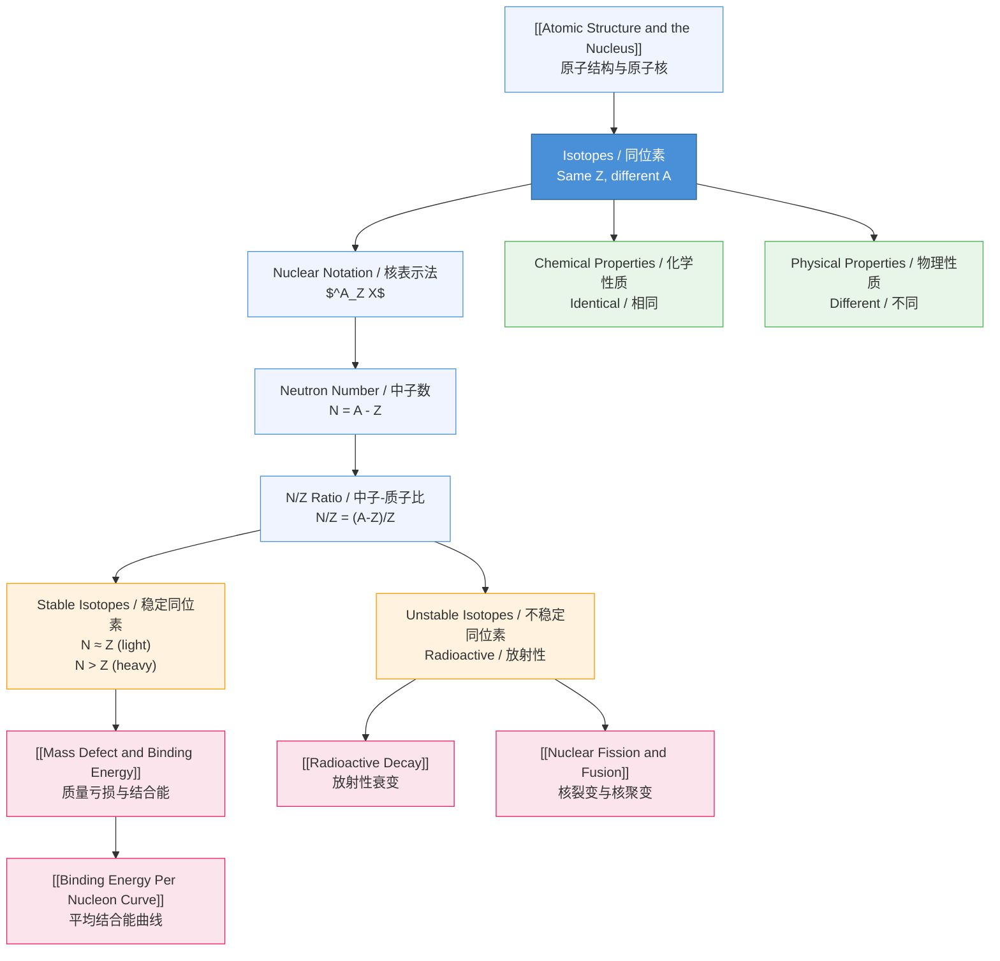

# 1. Overview / 概述

**English:**
This sub-topic introduces **isotopes** — atoms of the same element that have the same number of protons but different numbers of neutrons. Understanding isotopes is fundamental to nuclear physics because they explain why different forms of the same element can have different nuclear properties, such as stability, radioactivity, and nuclear reaction behavior. This leaf node covers the definition of isotopes, their notation, and their key physical and chemical properties. It serves as the foundation for understanding [[Mass Defect and Binding Energy]], [[Radioactive Decay]], and [[Nuclear Fission and Fusion]].

**中文:**
本子知识点介绍**同位素**——具有相同质子数但不同中子数的同一元素的不同原子。理解同位素是核物理的基础，因为它们解释了为什么同一元素的不同形式可以具有不同的核性质，如稳定性、放射性和核反应行为。本节点涵盖同位素的定义、表示法及其关键的物理和化学性质。它是理解[[质量亏损与结合能]]、[[放射性衰变]]和[[核裂变与核聚变]]的基础。

---

# 2. Syllabus Learning Objectives / 考纲学习目标

| CAIE 9702 | Edexcel IAL |
|-----------|-------------|
| 1.2(a) Define isotopes as atoms of the same element with different numbers of neutrons | WPH11 U1: 6.6 Define isotopes and understand their properties |
| 1.2(b) Use standard notation for isotopes: $^A_Z X$ | WPH11 U1: 6.7 Use nuclear notation for isotopes |
| 1.2(c) Explain that isotopes have the same chemical properties but different physical properties | WPH11 U1: 6.8 Compare chemical and physical properties of isotopes |
| 1.2(d) Describe the existence of stable and unstable (radioactive) isotopes | WPH11 U1: 6.9 Distinguish between stable and unstable isotopes |

**Examiner Expectations / 考官期望:**
- **English:** You must be able to define isotopes precisely, write nuclear notation correctly, and explain why isotopes of the same element have identical chemical properties but different physical properties (e.g., density, melting point, nuclear stability).
- **中文:** 必须能够精确定义同位素，正确书写核表示法，并解释为什么同一元素的同位素具有相同的化学性质但不同的物理性质（如密度、熔点、核稳定性）。

---

# 3. Core Definitions / 核心定义

| Term (EN/CN) | Definition (EN) | Definition (CN) | Common Mistakes / 常见错误 |
|--------------|-----------------|-----------------|---------------------------|
| **Isotope** / 同位素 | Atoms of the same element (same number of protons) that have different numbers of neutrons | 同一元素（质子数相同）但中子数不同的原子 | ❌ Saying "different number of electrons" — electrons determine charge, not isotope identity |
| **Nucleon** / 核子 | A proton or a neutron in the nucleus | 原子核中的质子或中子 | ❌ Confusing nucleon with nucleus — nucleon is a particle, nucleus is the whole core |
| **Mass Number (A)** / 质量数 | Total number of protons and neutrons in the nucleus | 原子核中质子与中子的总数 | ❌ Confusing with atomic mass — mass number is a count, not a mass in grams |
| **Atomic Number (Z)** / 原子序数 | Number of protons in the nucleus; identifies the element | 原子核中的质子数；决定元素种类 | ✅ Usually correct — but remember Z also equals number of electrons in a neutral atom |
| **Stable Isotope** / 稳定同位素 | An isotope that does not undergo radioactive decay | 不发生放射性衰变的同位素 | ❌ Thinking all isotopes are radioactive — many are stable |
| **Unstable (Radioactive) Isotope** / 不稳定（放射性）同位素 | An isotope that undergoes spontaneous radioactive decay | 自发进行放射性衰变的同位素 | ❌ Confusing "unstable" with "chemically reactive" — nuclear stability ≠ chemical reactivity |

---

# 4. Key Concepts Explained / 关键概念详解

## 4.1 Nuclear Notation / 核表示法

### Explanation / 解释
**English:**
Isotopes are written using the standard nuclear notation: $^A_Z X$, where:
- $X$ = chemical symbol of the element
- $Z$ = atomic number (number of protons)
- $A$ = mass number (number of protons + neutrons)

For example, carbon-12 is written as $^{12}_6 C$ and carbon-14 as $^{14}_6 C$. Both have $Z=6$ (6 protons), but carbon-12 has $A-Z = 6$ neutrons, while carbon-14 has $A-Z = 8$ neutrons.

**中文:**
同位素使用标准核表示法书写：$^A_Z X$，其中：
- $X$ = 元素的化学符号
- $Z$ = 原子序数（质子数）
- $A$ = 质量数（质子数 + 中子数）

例如，碳-12写作 $^{12}_6 C$，碳-14写作 $^{14}_6 C$。两者都有 $Z=6$（6个质子），但碳-12有 $A-Z = 6$ 个中子，而碳-14有 $A-Z = 8$ 个中子。

### Physical Meaning / 物理意义
**English:**
The notation tells us the composition of the nucleus. The number of protons (Z) determines which element it is — changing Z changes the element entirely. The number of neutrons (N = A - Z) determines which isotope of that element it is. The total number of nucleons (A) determines the mass of the nucleus.

**中文:**
这种表示法告诉我们原子核的组成。质子数（Z）决定它是哪种元素——改变Z会完全改变元素种类。中子数（N = A - Z）决定它是该元素的哪种同位素。核子总数（A）决定原子核的质量。

### Common Misconceptions / 常见误区
- ❌ **"Isotopes have different chemical properties"** — No! Chemical properties depend on electron configuration, which is determined by Z. Since Z is the same, chemical properties are identical.
- ❌ **"Mass number is the same as atomic mass"** — Mass number is a count of nucleons; atomic mass is the actual mass in atomic mass units (u), which is close to A but not exactly equal due to [[Mass Defect and Binding Energy]].
- ❌ **"All isotopes are radioactive"** — Many isotopes are stable; only certain combinations of protons and neutrons are unstable.

### Exam Tips / 考试提示
- **English:** Always check that Z is written as a subscript and A as a superscript. In multiple-choice questions, look for pairs with the same Z but different A.
- **中文:** 始终检查Z写在下标位置，A写在上标位置。在选择题中，寻找具有相同Z但不同A的配对。

> 📷 **IMAGE PROMPT — NUC-01: Nuclear Notation Examples**
> A clear diagram showing three isotopes of hydrogen: protium ($^1_1 H$), deuterium ($^2_1 H$), and tritium ($^3_1 H$). Each nucleus should show protons (red spheres) and neutrons (blue spheres) clearly labeled. Below each, write the nuclear notation and the number of protons, neutrons, and nucleons. Use a clean, textbook-style layout with color coding.

---

## 4.2 Chemical vs Physical Properties / 化学性质与物理性质对比

### Explanation / 解释
**English:**
Isotopes of the same element have **identical chemical properties** because chemical behavior is determined by the electron configuration, which depends only on the number of protons (Z). Since Z is the same, the electron arrangement is the same, so isotopes undergo the same chemical reactions at the same rates.

However, isotopes have **different physical properties** because physical properties often depend on mass. For example:
- **Density:** Heavier isotopes form slightly denser substances
- **Melting/Boiling Points:** Heavier isotopes have slightly higher melting and boiling points
- **Rate of Diffusion:** Lighter isotopes diffuse faster (Graham's law)
- **Nuclear Stability:** Some isotopes are stable, others are radioactive

**中文:**
同一元素的同位素具有**相同的化学性质**，因为化学行为由电子排布决定，而电子排布只取决于质子数（Z）。由于Z相同，电子排布相同，因此同位素以相同速率进行相同的化学反应。

然而，同位素具有**不同的物理性质**，因为物理性质通常取决于质量。例如：
- **密度：** 较重的同位素形成密度稍大的物质
- **熔点/沸点：** 较重的同位素具有稍高的熔点和沸点
- **扩散速率：** 较轻的同位素扩散更快（格雷厄姆定律）
- **核稳定性：** 一些同位素稳定，另一些具有放射性

### Physical Meaning / 物理意义
**English:**
This distinction is crucial in applications. For example, in [[Radioactive Decay]], we use radioactive isotopes (radioisotopes) as tracers because they behave chemically identically to stable isotopes but emit detectable radiation. In [[Nuclear Fission and Fusion]], different isotopes of the same element (e.g., uranium-235 vs uranium-238) have vastly different nuclear properties.

**中文:**
这种区别在应用中至关重要。例如，在[[放射性衰变]]中，我们使用放射性同位素（放射性核素）作为示踪剂，因为它们在化学上与稳定同位素行为相同，但会发射可探测的辐射。在[[核裂变与核聚变]]中，同一元素的不同同位素（如铀-235与铀-238）具有截然不同的核性质。

### Common Misconceptions / 常见误区
- ❌ **"Isotopes have different chemical reactivity"** — No! Chemical reactivity is identical because electron configuration is identical.
- ❌ **"Physical properties are exactly the same"** — No! Mass differences cause small but measurable differences in physical properties.

### Exam Tips / 考试提示
- **English:** A common exam question asks: "Explain why isotopes of the same element have identical chemical properties." Answer: "Because they have the same number of protons, hence the same electron configuration."
- **中文:** 常见考题："解释为什么同一元素的同位素具有相同的化学性质。" 答案："因为它们具有相同的质子数，因此具有相同的电子排布。"

---

## 4.3 Stable vs Unstable Isotopes / 稳定同位素与不稳定同位素

### Explanation / 解释
**English:**
The stability of an isotope depends on the balance between protons and neutrons in the nucleus. Protons repel each other electrostatically, while the strong nuclear force binds nucleons together. For light elements (Z ≤ 20), stable isotopes have approximately equal numbers of protons and neutrons (N ≈ Z). For heavier elements, stable isotopes need more neutrons than protons (N > Z) to provide enough strong force to overcome electrostatic repulsion.

Isotopes that do not have this optimal neutron-to-proton ratio are **unstable** and undergo [[Radioactive Decay]] to become more stable.

**中文:**
同位素的稳定性取决于原子核中质子与中子的平衡。质子之间相互静电排斥，而强核力将核子结合在一起。对于轻元素（Z ≤ 20），稳定同位素具有大致相等的质子数和中子数（N ≈ Z）。对于重元素，稳定同位素需要比质子更多的中子（N > Z），以提供足够的强核力来克服静电排斥。

不具有这种最佳中子-质子比的同位素是**不稳定的**，会经历[[放射性衰变]]以变得更稳定。

### Physical Meaning / 物理意义
**English:**
This explains why some elements have many stable isotopes (e.g., tin has 10 stable isotopes) while others have none (all isotopes of elements beyond bismuth are radioactive). It also explains why certain isotopes are used in nuclear reactors — e.g., uranium-235 is fissile while uranium-238 is not.

**中文:**
这解释了为什么有些元素有许多稳定同位素（如锡有10种稳定同位素），而其他元素则没有（铋之后的元素的所有同位素都具有放射性）。这也解释了为什么某些同位素用于核反应堆——例如，铀-235是可裂变的，而铀-238则不是。

### Common Misconceptions / 常见误区
- ❌ **"All heavy elements are radioactive"** — Not all; some heavy elements have stable isotopes (e.g., lead-208 is stable).
- ❌ **"Stable means it never changes"** — Stable isotopes can still undergo nuclear reactions if bombarded with particles.

### Exam Tips / 考试提示
- **English:** Be prepared to explain why certain isotopes are unstable using the neutron-to-proton ratio concept. Use the "belt of stability" graph.
- **中文:** 准备使用中子-质子比概念解释为什么某些同位素不稳定。使用"稳定带"图表。

> 📷 **IMAGE PROMPT — NUC-02: Belt of Stability**
> A graph with number of neutrons (N) on the y-axis and number of protons (Z) on the x-axis. Show the "belt of stability" as a curved band. For Z ≤ 20, the belt follows the line N = Z. For Z > 20, the belt curves upward (N > Z). Show stable isotopes as black dots within the belt and unstable isotopes as red dots outside. Label the regions: "neutron-rich" (above belt) and "proton-rich" (below belt). Include arrows showing decay modes (β⁻ decay for neutron-rich, β⁺ decay/electron capture for proton-rich).

---

# 5. Essential Equations / 核心公式

## 5.1 Number of Neutrons / 中子数

$$ N = A - Z $$

| Symbol (符号) | Meaning (EN) | Meaning (CN) | Unit (单位) |
|--------------|-------------|-------------|------------|
| $N$ | Number of neutrons | 中子数 | dimensionless (无量纲) |
| $A$ | Mass number (nucleon number) | 质量数（核子数） | dimensionless (无量纲) |
| $Z$ | Atomic number (proton number) | 原子序数（质子数） | dimensionless (无量纲) |

**Derivation / 推导:**
By definition, mass number A = number of protons + number of neutrons = Z + N. Therefore, N = A - Z.

**Conditions / 适用条件:**
- **English:** Always true for any nucleus. N must be a positive integer (or zero for hydrogen-1).
- **中文:** 对任何原子核都成立。N必须是正整数（氢-1为0）。

**Limitations / 局限性:**
- **English:** This equation gives the number of neutrons, not their arrangement or binding energy.
- **中文:** 该方程给出中子数，而非其排列或结合能。

---

## 5.2 Neutron-to-Proton Ratio / 中子-质子比

$$ \text{Neutron-to-proton ratio} = \frac{N}{Z} = \frac{A - Z}{Z} $$

| Symbol (符号) | Meaning (EN) | Meaning (CN) | Unit (单位) |
|--------------|-------------|-------------|------------|
| $N/Z$ | Neutron-to-proton ratio | 中子-质子比 | dimensionless (无量纲) |
| $N$ | Number of neutrons | 中子数 | dimensionless (无量纲) |
| $Z$ | Number of protons | 质子数 | dimensionless (无量纲) |

**Derivation / 推导:**
Directly from N = A - Z, dividing by Z gives N/Z = (A - Z)/Z.

**Conditions / 适用条件:**
- **English:** Z > 0 (must be a nucleus with at least one proton).
- **中文:** Z > 0（必须至少有一个质子的原子核）。

**Limitations / 局限性:**
- **English:** The N/Z ratio alone does not determine stability — the exact numbers of protons and neutrons matter (magic numbers).
- **中文:** 仅凭N/Z比不能确定稳定性——质子和中子的具体数量也很重要（幻数）。

---

# 6. Graphs and Relationships / 图表与关系

## 6.1 Neutron Number vs Proton Number (Belt of Stability) / 中子数对质子数（稳定带）

### Axes / 坐标轴
- **x-axis:** Proton number (Z) / 质子数 (Z)
- **y-axis:** Neutron number (N) / 中子数 (N)

### Shape / 形状
**English:** A curved band of stable isotopes. For light elements (Z ≤ 20), the band follows the line N = Z. For heavier elements, the band curves upward, showing that stable isotopes require more neutrons than protons.

**中文:** 稳定同位素的弯曲带。对于轻元素（Z ≤ 20），该带沿N = Z线分布。对于重元素，该带向上弯曲，表明稳定同位素需要比质子更多的中子。

### Gradient Meaning / 斜率含义
**English:** The gradient dN/dZ represents how many extra neutrons are needed per additional proton for stability. For light elements, gradient ≈ 1. For heavy elements (e.g., lead, Z=82), gradient ≈ 1.5.

**中文:** 梯度dN/dZ表示每增加一个质子需要多少额外中子才能保持稳定。对于轻元素，梯度≈1。对于重元素（如铅，Z=82），梯度≈1.5。

### Area Meaning / 面积含义
**English:** Points inside the belt represent stable isotopes. Points above the belt are neutron-rich (undergo β⁻ decay). Points below the belt are proton-rich (undergo β⁺ decay or electron capture).

**中文:** 带内的点代表稳定同位素。带上方的点是中子过剩的（发生β⁻衰变）。带下方的点是质子过剩的（发生β⁺衰变或电子俘获）。

### Exam Interpretation / 考试解读
- **English:** Be able to read from the graph: given Z, find the range of N for stable isotopes. Explain why a particular isotope is unstable based on its position relative to the belt.
- **中文:** 能够从图表中读取：给定Z，找到稳定同位素的N范围。根据特定同位素相对于稳定带的位置解释其为何不稳定。

---

# 7. Required Diagrams / 必备图表

## 7.1 Nuclear Notation Diagram / 核表示法图示

### Description / 描述
**English:** A diagram showing the standard nuclear notation $^A_Z X$ with labels for each component. Include examples for three isotopes of hydrogen and two isotopes of carbon.

**中文:** 显示标准核表示法 $^A_Z X$ 的图示，每个部分都有标注。包括氢的三种同位素和碳的两种同位素的示例。

### Image Prompt / 图片生成提示
> 📷 **IMAGE PROMPT — NUC-03: Nuclear Notation with Examples**
> A clean, textbook-style diagram. Top section: A large $^A_Z X$ with arrows pointing to A (labeled "Mass number / 质量数"), Z (labeled "Atomic number / 原子序数"), and X (labeled "Chemical symbol / 化学符号"). Bottom section: Three boxes side by side showing hydrogen isotopes: $^1_1 H$ (protium, 1 proton, 0 neutrons), $^2_1 H$ (deuterium, 1 proton, 1 neutron), $^3_1 H$ (tritium, 1 proton, 2 neutrons). Below each, show a simple nucleus diagram with red protons and blue neutrons. Use white background, black text, and color-coded particles.

### Labels Required / 需要标注
- **English:** Mass number (A), Atomic number (Z), Chemical symbol (X), Proton, Neutron, Nucleus
- **中文:** 质量数 (A), 原子序数 (Z), 化学符号 (X), 质子, 中子, 原子核

### Exam Importance / 考试重要性
- **English:** High — this is the most basic skill required for all nuclear physics topics. You must be able to read and write nuclear notation correctly.
- **中文:** 高——这是所有核物理主题所需的最基本技能。必须能够正确读写核表示法。

---

## 7.2 Chemical vs Physical Properties Comparison / 化学性质与物理性质对比图

### Description / 描述
**English:** A comparison table or diagram showing that isotopes of the same element have identical chemical properties but different physical properties.

**中文:** 一个对比表或图示，显示同一元素的同位素具有相同的化学性质但不同的物理性质。

### Image Prompt / 图片生成提示
> 📷 **IMAGE PROMPT — NUC-04: Isotope Properties Comparison**
> A two-column infographic. Left column: "Chemical Properties / 化学性质" with a checkmark and text "Identical / 相同" — show two identical chemical reaction equations for $^{12}C$ and $^{14}C$ reacting with oxygen to form CO₂. Right column: "Physical Properties / 物理性质" with a warning symbol and text "Different / 不同" — show a balance scale with $^{12}C$ on one side (lighter) and $^{14}C$ on the other (heavier), and a thermometer showing different melting points. Use clean, modern design with icons.

### Labels Required / 需要标注
- **English:** Identical chemical properties, Different physical properties, Same electron configuration, Different mass
- **中文:** 相同的化学性质, 不同的物理性质, 相同的电子排布, 不同的质量

### Exam Importance / 考试重要性
- **English:** High — this is a frequently tested concept in both CAIE and Edexcel exams.
- **中文:** 高——这是CAIE和Edexcel考试中经常测试的概念。

---

# 8. Worked Examples / 典型例题

## Example 1: Identifying Isotopes / 例1：识别同位素

### Question / 题目
**English:**
Which of the following pairs are isotopes of the same element?
- Pair A: $^{12}_6 C$ and $^{14}_6 C$
- Pair B: $^{14}_6 C$ and $^{14}_7 N$
- Pair C: $^{16}_8 O$ and $^{18}_8 O$

Explain your reasoning.

**中文:**
以下哪对是同一元素的同位素？
- 对A：$^{12}_6 C$ 和 $^{14}_6 C$
- 对B：$^{14}_6 C$ 和 $^{14}_7 N$
- 对C：$^{16}_8 O$ 和 $^{18}_8 O$

解释你的推理。

### Solution / 解答

**Step 1: Recall the definition of isotopes / 步骤1：回顾同位素定义**
Isotopes are atoms of the same element with the same number of protons (Z) but different numbers of neutrons (different A).

**Step 2: Check each pair / 步骤2：检查每对**

**Pair A:** $^{12}_6 C$ and $^{14}_6 C$
- Both have Z = 6 (carbon) ✓
- Different A: 12 and 14 ✓
- Therefore, they are isotopes of carbon. ✓

**Pair B:** $^{14}_6 C$ and $^{14}_7 N$
- $^{14}_6 C$ has Z = 6 (carbon)
- $^{14}_7 N$ has Z = 7 (nitrogen)
- Different Z → different elements ✗
- Therefore, they are NOT isotopes.

**Pair C:** $^{16}_8 O$ and $^{18}_8 O$
- Both have Z = 8 (oxygen) ✓
- Different A: 16 and 18 ✓
- Therefore, they are isotopes of oxygen. ✓

### Final Answer / 最终答案
**Answer:** Pairs A and C are isotopes. | **答案：** 对A和对C是同位素。

### Quick Tip / 提示
- **English:** Always check Z first — if Z is different, they are different elements, not isotopes.
- **中文:** 始终先检查Z——如果Z不同，它们是不同的元素，不是同位素。

---

## Example 2: Neutron Calculation / 例2：中子数计算

### Question / 题目
**English:**
Uranium-235 ($^{235}_{92} U$) and uranium-238 ($^{238}_{92} U$) are two isotopes of uranium.
(a) How many neutrons does each isotope have?
(b) Calculate the neutron-to-proton ratio for each isotope.
(c) Which isotope is more likely to be unstable? Explain.

**中文:**
铀-235 ($^{235}_{92} U$) 和铀-238 ($^{238}_{92} U$) 是铀的两种同位素。
(a) 每种同位素有多少个中子？
(b) 计算每种同位素的中子-质子比。
(c) 哪种同位素更可能不稳定？解释原因。

### Solution / 解答

**Step 1: Calculate number of neutrons / 步骤1：计算中子数**
Using N = A - Z:

For $^{235}_{92} U$:
$$ N = 235 - 92 = 143 \text{ neutrons} $$

For $^{238}_{92} U$:
$$ N = 238 - 92 = 146 \text{ neutrons} $$

**Step 2: Calculate neutron-to-proton ratio / 步骤2：计算中子-质子比**

For $^{235}_{92} U$:
$$ \frac{N}{Z} = \frac{143}{92} \approx 1.55 $$

For $^{238}_{92} U$:
$$ \frac{N}{Z} = \frac{146}{92} \approx 1.59 $$

**Step 3: Analyze stability / 步骤3：分析稳定性**
For heavy elements (Z = 92), stable isotopes typically have N/Z ≈ 1.5-1.6. Both ratios are in this range. However, uranium-235 is fissile (can undergo nuclear fission with thermal neutrons) while uranium-238 is not. Uranium-235 has a slightly lower N/Z ratio, making it more "proton-rich" relative to uranium-238, which contributes to its instability under neutron bombardment.

### Final Answer / 最终答案
**Answer:**
(a) $^{235}_{92} U$: 143 neutrons; $^{238}_{92} U$: 146 neutrons
(b) $^{235}_{92} U$: 1.55; $^{238}_{92} U$: 1.59
(c) $^{235}_{92} U$ is more unstable (fissile) due to its lower N/Z ratio.

**答案：**
(a) $^{235}_{92} U$：143个中子；$^{238}_{92} U$：146个中子
(b) $^{235}_{92} U$：1.55；$^{238}_{92} U$：1.59
(c) $^{235}_{92} U$ 更不稳定（可裂变），因为其N/Z比较低。

### Quick Tip / 提示
- **English:** For heavy elements, a lower N/Z ratio often indicates greater instability because there are fewer neutrons to provide strong nuclear force to overcome proton-proton repulsion.
- **中文:** 对于重元素，较低的N/Z比通常表示更大的不稳定性，因为提供强核力以克服质子-质子排斥的中子较少。

---

# 9. Past Paper Question Types / 历年真题题型

| Question Type / 题型 | Frequency / 频率 | Difficulty / 难度 | Past Paper References / 真题索引 |
|----------------------|------------------|------------------|-------------------------------|
| Definition of isotopes / 同位素定义 | High / 高 | Easy / 简单 | 📝 *待填入* |
| Nuclear notation identification / 核表示法识别 | High / 高 | Easy / 简单 | 📝 *待填入* |
| Neutron number calculation / 中子数计算 | High / 高 | Easy / 简单 | 📝 *待填入* |
| Chemical vs physical properties / 化学与物理性质对比 | Medium / 中 | Medium / 中等 | 📝 *待填入* |
| Stability analysis using N/Z ratio / 使用N/Z比分析稳定性 | Medium / 中 | Medium / 中等 | 📝 *待填入* |
| Isotope application in context / 同位素应用情境题 | Low / 低 | Hard / 困难 | 📝 *待填入* |

**Common Command Words / 常见指令词:**
- **English:** Define, State, Calculate, Explain, Determine, Compare
- **中文:** 定义, 陈述, 计算, 解释, 确定, 比较

---

# 10. Practical Skills Connections / 实验技能链接

**English:**
While isotopes themselves are not directly studied in AS practical papers, the concept connects to several practical skills:

1. **Mass Spectrometry:** The most common method for identifying isotopes. In a mass spectrometer, isotopes are separated based on their mass-to-charge ratio. You should understand that different isotopes of the same element produce different peaks on a mass spectrum.

2. **Radioactive Decay Experiments:** When studying [[Radioactive Decay]], you will use radioactive isotopes (radioisotopes) as sources. Understanding that different isotopes have different half-lives is crucial for experimental design.

3. **Density Measurements:** The different physical properties of isotopes (e.g., density of heavy water vs regular water) can be demonstrated experimentally.

4. **Graph Plotting:** When plotting decay curves or mass spectra, you need to correctly label axes and interpret the data in terms of isotope composition.

**中文:**
虽然同位素本身不在AS实验考试中直接研究，但该概念与多项实验技能相关：

1. **质谱法：** 识别同位素的最常用方法。在质谱仪中，同位素根据其质荷比被分离。应理解同一元素的不同同位素在质谱上产生不同的峰。

2. **放射性衰变实验：** 在研究[[放射性衰变]]时，将使用放射性同位素（放射性核素）作为源。理解不同同位素具有不同半衰期对实验设计至关重要。

3. **密度测量：** 同位素的不同物理性质（如重水与普通水的密度）可以通过实验演示。

4. **图表绘制：** 在绘制衰变曲线或质谱时，需要正确标注坐标轴并根据同位素组成解释数据。

---

# 11. Concept Map / 概念图谱

---

# 12. Quick Revision Sheet / 速查表

| Category / 类别 | Key Points / 要点 |
|----------------|------------------|
| **Definition / 定义** | Isotopes: same Z, different A → same element, different neutrons / 同位素：相同Z，不同A → 同一元素，不同中子数 |
| **Key Formula / 核心公式** | N = A - Z; N/Z = (A-Z)/Z |
| **Key Notation / 核心表示法** | $^A_Z X$ — A = mass number (top), Z = atomic number (bottom), X = element symbol / A = 质量数（上标），Z = 原子序数（下标），X = 元素符号 |
| **Chemical Properties / 化学性质** | Identical — same electron configuration / 相同——相同的电子排布 |
| **Physical Properties / 物理性质** | Different — density, melting point, diffusion rate, nuclear stability / 不同——密度、熔点、扩散速率、核稳定性 |
| **Stability Rule / 稳定性规则** | Light (Z ≤ 20): N ≈ Z; Heavy (Z > 20): N > Z / 轻元素：N ≈ Z；重元素：N > Z |
| **Common Mistake / 常见错误** | ❌ "Isotopes have different chemical properties" — WRONG! / "同位素具有不同的化学性质"——错误！ |
| **Exam Tip / 考试提示** | Always check Z first to identify isotopes; calculate N = A - Z for neutron number / 始终先检查Z以识别同位素；计算N = A - Z得到中子数 |
| **Related Topics / 相关主题** | [[Atomic Structure and the Nucleus]], [[Mass Defect and Binding Energy]], [[Radioactive Decay]], [[Nuclear Fission and Fusion]] |