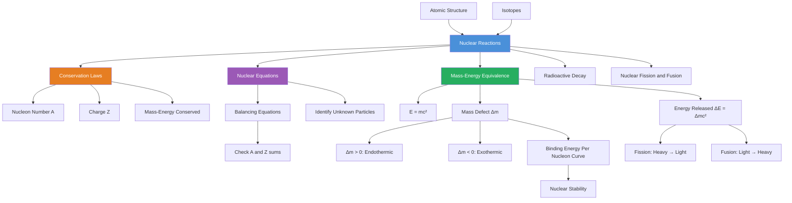

# Nuclear Reactions and Conservation Laws / 核反应与守恒定律

---

# 1. Overview / 概述

**English:**
This sub-topic introduces the fundamental rules governing all nuclear reactions. When nuclei interact or transform, certain quantities must remain constant before and after the reaction. These **conservation laws** — conservation of nucleon number, charge, and mass-energy — are the "accounting rules" of nuclear physics. Understanding these laws allows us to predict whether a reaction is possible, balance nuclear equations, and calculate energy released or absorbed. This forms the foundation for studying [[Radioactive Decay]], [[Nuclear Fission and Fusion]], and the [[Binding Energy Per Nucleon Curve]].

**中文:**
本子知识点介绍支配所有核反应的基本规则。当原子核相互作用或转变时，某些量在反应前后必须保持不变。这些**守恒定律**——核子数守恒、电荷守恒和质能守恒——是核物理的"记账规则"。理解这些定律使我们能够预测反应是否可能发生、配平核反应方程，并计算释放或吸收的能量。这为学习[[放射性衰变]]、[[核裂变与核聚变]]以及[[比结合能曲线]]奠定了基础。

---

# 2. Syllabus Learning Objectives / 考纲学习目标

| CAIE 9702 | Edexcel IAL |
|-----------|-------------|
| 1.2(a) State and apply conservation laws in nuclear reactions | WPH11 U1: 6.6 Apply conservation of nucleon number and charge |
| 1.2(b) Balance nuclear equations | WPH11 U1: 6.7 Balance nuclear equations |
| 1.2(c) Calculate energy released using $E=mc^2$ | WPH11 U1: 6.8 Use $E=mc^2$ for energy calculations |
| 1.2(d) Distinguish between fission and fusion | WPH11 U1: 6.9 Compare fission and fusion |

**Examiner Expectations / 考官期望:**
- **English:** You must be able to write balanced nuclear equations, apply conservation laws to determine unknown particles, and calculate energy changes using $E=mc^2$ or $E=\Delta m c^2$.
- **中文:** 你必须能够写出配平的核反应方程，应用守恒定律确定未知粒子，并使用 $E=mc^2$ 或 $E=\Delta m c^2$ 计算能量变化。

---

# 3. Core Definitions / 核心定义

| Term (EN/CN) | Definition (EN) | Definition (CN) | Common Mistakes / 常见错误 |
|--------------|-----------------|-----------------|---------------------------|
| **Nuclear Reaction** / 核反应 | A process where nuclei interact, resulting in changes to their composition or energy state. | 原子核相互作用，导致其组成或能量状态发生变化的过程。 | Confusing with chemical reactions (chemical reactions involve electrons, not nuclei) |
| **Conservation Law** / 守恒定律 | A principle stating that a particular measurable property of an isolated system remains constant during a process. | 一个原理，指出孤立系统的某个可测量属性在过程中保持不变。 | Forgetting that mass-energy is conserved, not mass alone |
| **Nucleon Number (Mass Number)** / 核子数（质量数） | The total number of protons and neutrons in a nucleus, denoted by $A$. | 原子核中质子和中子的总数，用 $A$ 表示。 | Confusing with atomic number $Z$ |
| **Atomic Number (Proton Number)** / 原子序数（质子数） | The number of protons in a nucleus, denoted by $Z$. | 原子核中质子的数量，用 $Z$ 表示。 | Forgetting it determines the element |
| **Mass-Energy Equivalence** / 质能等价 | The principle that mass and energy are interchangeable, described by $E=mc^2$. | 质量和能量可以相互转换的原理，由 $E=mc^2$ 描述。 | Using $c$ as $3 \times 10^8$ without squaring it |
| **Q-Value** / Q值 | The energy released or absorbed in a nuclear reaction, calculated from the mass difference. | 核反应中释放或吸收的能量，由质量差计算得出。 | Forgetting sign convention (positive = exothermic) |

---

# 4. Key Concepts Explained / 关键概念详解

## 4.1 Conservation of Nucleon Number and Charge / 核子数与电荷守恒

### Explanation / 解释
**English:**
In any nuclear reaction, two fundamental quantities are always conserved:
1. **Nucleon number ($A$):** The total number of protons + neutrons before the reaction equals the total after.
2. **Charge ($Z$):** The total charge (proton number) before equals the total after.

These are the "bookkeeping" rules. For example, in alpha decay:
$$ ^{238}_{92}U \rightarrow ^{234}_{90}Th + ^{4}_{2}\alpha $$
- Nucleon number: $238 = 234 + 4$ ✓
- Charge: $92 = 90 + 2$ ✓

**中文:**
在任何核反应中，两个基本量总是守恒的：
1. **核子数 ($A$)：** 反应前的质子+中子总数等于反应后的总数。
2. **电荷 ($Z$)：** 反应前的总电荷（质子数）等于反应后的总电荷。

这些是"记账"规则。例如，在α衰变中：
$$ ^{238}_{92}U \rightarrow ^{234}_{90}Th + ^{4}_{2}\alpha $$
- 核子数：$238 = 234 + 4$ ✓
- 电荷：$92 = 90 + 2$ ✓

### Physical Meaning / 物理意义
**English:** These laws reflect that nucleons (protons and neutrons) are not created or destroyed in nuclear reactions — they are simply rearranged. Charge conservation reflects the fundamental law that electric charge cannot be created or destroyed.

**中文:** 这些定律反映了核子（质子和中子）在核反应中不会被创造或消灭——它们只是被重新排列。电荷守恒反映了电荷不能被创造或消灭的基本定律。

### Common Misconceptions / 常见误区
- ❌ **"Mass is conserved in nuclear reactions"** — Mass is NOT conserved; mass can be converted to energy. Only nucleon number is conserved.
- ❌ **"Energy is conserved separately"** — Mass-energy is conserved, but mass and energy individually are not.
- ❌ **"Electrons are nucleons"** — No! Nucleons are only protons and neutrons in the nucleus.

### Exam Tips / 考试提示
- **English:** Always check both $A$ and $Z$ when balancing equations. If a particle is unknown, use conservation to find it.
- **中文:** 配平方程时始终检查 $A$ 和 $Z$。如果粒子未知，使用守恒定律找到它。

> 📷 **IMAGE PROMPT — DIAGRAM-01: Conservation Laws in Nuclear Reactions**
> A split diagram showing a nuclear reaction equation with arrows pointing to the nucleon numbers and atomic numbers on both sides. The left side shows the sum of A and Z values, the right side shows the same sums. A checkmark indicates conservation. Use uranium-238 alpha decay as the example. Clean, educational style with color coding (blue for nucleon number, red for charge).

---

## 4.2 Mass-Energy Equivalence / 质能等价

### Explanation / 解释
**English:**
Einstein's famous equation $E=mc^2$ tells us that mass and energy are two forms of the same thing. In nuclear reactions, the total mass of products is slightly different from the total mass of reactants. This **mass defect** ($\Delta m$) corresponds to an energy change:
$$ \Delta E = \Delta m c^2 $$

- If $\Delta m > 0$ (products have more mass): Energy is **absorbed** (endothermic)
- If $\Delta m < 0$ (products have less mass): Energy is **released** (exothermic)

**中文:**
爱因斯坦的著名方程 $E=mc^2$ 告诉我们质量和能量是同一事物的两种形式。在核反应中，产物的总质量与反应物的总质量略有不同。这个**质量亏损** ($\Delta m$) 对应着能量变化：
$$ \Delta E = \Delta m c^2 $$

- 如果 $\Delta m > 0$（产物质量更大）：**吸收**能量（吸热）
- 如果 $\Delta m < 0$（产物质量更小）：**释放**能量（放热）

### Physical Meaning / 物理意义
**English:** The "missing mass" in exothermic reactions has been converted into kinetic energy of the products (or gamma radiation). This is why nuclear reactions release millions of times more energy than chemical reactions — the mass-energy conversion factor $c^2$ is enormous ($9 \times 10^{16} \text{ J/kg}$).

**中文:** 放热反应中"消失的质量"已转化为产物的动能（或伽马辐射）。这就是为什么核反应释放的能量比化学反应多数百万倍——质能转换因子 $c^2$ 巨大（$9 \times 10^{16} \text{ J/kg}$）。

### Common Misconceptions / 常见误区
- ❌ **"Mass is converted to energy"** — More precisely, mass-energy is redistributed. The total mass-energy is conserved.
- ❌ **"$c$ is just a number"** — $c$ is the speed of light ($3.0 \times 10^8 \text{ m/s}$), and it's squared, so the conversion factor is huge.
- ❌ **"Mass defect means mass disappears"** — Mass doesn't disappear; it becomes energy.

### Exam Tips / 考试提示
- **English:** Always use SI units (kg, J) unless told otherwise. Sometimes masses are given in atomic mass units (u), where $1 \text{ u} = 1.66 \times 10^{-27} \text{ kg}$ and $1 \text{ u} \equiv 931.5 \text{ MeV/c}^2$.
- **中文:** 除非另有说明，始终使用SI单位（kg, J）。有时质量以原子质量单位（u）给出，其中 $1 \text{ u} = 1.66 \times 10^{-27} \text{ kg}$ 且 $1 \text{ u} \equiv 931.5 \text{ MeV/c}^2$。

---

## 4.3 Balancing Nuclear Equations / 配平核反应方程

### Explanation / 解释
**English:**
To balance a nuclear equation:
1. Write the reaction with known particles using notation $^A_Z X$
2. Apply conservation of nucleon number: $\sum A_{\text{reactants}} = \sum A_{\text{products}}$
3. Apply conservation of charge: $\sum Z_{\text{reactants}} = \sum Z_{\text{products}}$
4. Identify the unknown particle from its $A$ and $Z$

Common particles and their notation:
- Alpha particle: $^4_2 \alpha$ or $^4_2 He$
- Beta particle: $^0_{-1} \beta$ or $^0_{-1} e$
- Gamma photon: $^0_0 \gamma$
- Neutron: $^1_0 n$
- Proton: $^1_1 p$ or $^1_1 H$

**中文:**
配平核反应方程：
1. 使用符号 $^A_Z X$ 写出已知粒子的反应
2. 应用核子数守恒：$\sum A_{\text{反应物}} = \sum A_{\text{产物}}$
3. 应用电荷守恒：$\sum Z_{\text{反应物}} = \sum Z_{\text{产物}}$
4. 从 $A$ 和 $Z$ 识别未知粒子

常见粒子及其符号：
- α粒子：$^4_2 \alpha$ 或 $^4_2 He$
- β粒子：$^0_{-1} \beta$ 或 $^0_{-1} e$
- γ光子：$^0_0 \gamma$
- 中子：$^1_0 n$
- 质子：$^1_1 p$ 或 $^1_1 H$

### Common Misconceptions / 常见误区
- ❌ **"The sum of masses is conserved"** — No! Only nucleon number and charge are conserved.
- ❌ **"Beta particles have zero mass"** — Beta particles have very small mass ($A=0$), but they have charge ($Z=-1$).
- ❌ **"Gamma rays have mass"** — Gamma rays are photons; they have $A=0$ and $Z=0$.

### Exam Tips / 考试提示
- **English:** Always write the full notation $^A_Z X$ for every particle. Check your work by adding up $A$ and $Z$ on both sides.
- **中文:** 始终为每个粒子写出完整符号 $^A_Z X$。通过计算两边的 $A$ 和 $Z$ 来检查你的工作。

---

# 5. Essential Equations / 核心公式

## 5.1 Mass-Energy Equivalence / 质能等价

$$ E = mc^2 $$

| Symbol (符号) | Meaning (EN) | Meaning (CN) | Unit (单位) |
|--------------|-------------|-------------|------------|
| $E$ | Energy equivalent | 能量当量 | J (joules) |
| $m$ | Mass | 质量 | kg (kilograms) |
| $c$ | Speed of light in vacuum ($3.0 \times 10^8$) | 真空光速 | m/s |

## 5.2 Energy Released in Nuclear Reactions / 核反应释放的能量

$$ \Delta E = \Delta m c^2 $$

| Symbol (符号) | Meaning (EN) | Meaning (CN) | Unit (单位) |
|--------------|-------------|-------------|------------|
| $\Delta E$ | Energy released/absorbed | 释放/吸收的能量 | J |
| $\Delta m$ | Mass defect ($m_{\text{reactants}} - m_{\text{products}}$) | 质量亏损 | kg |
| $c$ | Speed of light | 光速 | m/s |

**Derivation / 推导:**
From $E=mc^2$, the change in energy equals the change in mass times $c^2$:
$$ \Delta E = (m_{\text{reactants}} - m_{\text{products}})c^2 = \Delta m c^2 $$

**Conditions / 适用条件:**
- **English:** Valid for any nuclear reaction where mass changes. The sign convention: positive $\Delta E$ means energy is released (exothermic).
- **中文:** 适用于任何质量发生变化的核反应。符号约定：$\Delta E$ 为正表示释放能量（放热）。

**Limitations / 局限性:**
- **English:** Only applies to nuclear reactions, not chemical reactions (where mass changes are too small to detect). Requires precise mass measurements.
- **中文:** 仅适用于核反应，不适用于化学反应（质量变化太小无法检测）。需要精确的质量测量。

## 5.3 Energy in MeV / 以MeV为单位的能量

$$ 1 \text{ u} = 1.66 \times 10^{-27} \text{ kg} $$
$$ 1 \text{ u} \equiv 931.5 \text{ MeV/c}^2 $$

| Symbol (符号) | Meaning (EN) | Meaning (CN) | Unit (单位) |
|--------------|-------------|-------------|------------|
| u | Atomic mass unit | 原子质量单位 | kg |
| MeV | Mega-electronvolt ($10^6$ eV) | 兆电子伏特 | J ($1 \text{ eV} = 1.6 \times 10^{-19} \text{ J}$) |

**Derivation / 推导:**
$$ E = (1.66 \times 10^{-27})(3.0 \times 10^8)^2 = 1.49 \times 10^{-10} \text{ J} $$
$$ \frac{1.49 \times 10^{-10}}{1.6 \times 10^{-19}} = 9.31 \times 10^8 \text{ eV} = 931 \text{ MeV} $$

**Conditions / 适用条件:**
- **English:** Use when masses are given in atomic mass units (u). This conversion is exact for A-Level purposes.
- **中文:** 当质量以原子质量单位（u）给出时使用。在A-Level考试中这个转换是精确的。

> 📷 **IMAGE PROMPT — DIAGRAM-02: Mass-Energy Conversion Diagram**
> A visual diagram showing a balance scale. On the left side, labeled "Reactants" with a mass value. On the right side, labeled "Products" with a smaller mass value. Between them, an arrow labeled "Mass Defect Δm" pointing to a lightning bolt labeled "Energy Released ΔE = Δmc²". Below, show the equation E=mc² with c highlighted. Clean, educational style with blue and orange color scheme.

---

# 6. Graphs and Relationships / 图表与关系

## 6.1 Binding Energy Per Nucleon Curve / 比结合能曲线

### Axes / 坐标轴
- **X-axis:** Nucleon number ($A$) / 核子数 ($A$)
- **Y-axis:** Binding energy per nucleon (MeV) / 比结合能 (MeV)

### Shape / 形状
- **English:** The curve rises steeply for light nuclei, peaks at iron-56 ($A \approx 56$), then gradually decreases for heavier nuclei.
- **中文:** 曲线在轻核区域急剧上升，在铁-56 ($A \approx 56$) 处达到峰值，然后对于更重的核逐渐下降。

### Gradient Meaning / 斜率含义
- **English:** The gradient shows how binding energy per nucleon changes with nucleon number. Steep gradient = large change in stability.
- **中文:** 斜率表示比结合能随核子数的变化。陡峭的斜率 = 稳定性变化大。

### Area Meaning / 面积含义
- **English:** The area under the curve from 0 to $A$ gives the total binding energy of a nucleus with $A$ nucleons.
- **中文:** 曲线下从0到$A$的面积给出了具有$A$个核子的原子核的总结合能。

### Exam Interpretation / 考试解读
- **English:** Nuclei near the peak are most stable. Fission of heavy nuclei (moving left toward peak) releases energy. Fusion of light nuclei (moving right toward peak) releases energy.
- **中文:** 靠近峰值的原子核最稳定。重核裂变（向左移动靠近峰值）释放能量。轻核聚变（向右移动靠近峰值）释放能量。

> 📷 **IMAGE PROMPT — DIAGRAM-03: Binding Energy Per Nucleon Curve**
> A graph with nucleon number A on the x-axis (0 to 250) and binding energy per nucleon in MeV on the y-axis (0 to 9). The curve rises steeply from hydrogen, peaks at iron-56 (A=56, ~8.8 MeV), then gradually decreases. Label key regions: "Fission" for heavy nuclei (right side), "Fusion" for light nuclei (left side). Mark iron-56 as the most stable nucleus. Clean, professional style with grid lines.

---

# 7. Required Diagrams / 必备图表

## 7.1 Nuclear Reaction Equation Diagram / 核反应方程图示

### Description / 描述
**English:** A visual representation of a balanced nuclear equation showing how nucleon number and charge are conserved. The diagram should show the reactants on the left, products on the right, with arrows indicating the sums of $A$ and $Z$ on each side.

**中文:** 配平核反应方程的视觉表示，显示核子数和电荷如何守恒。图示应显示左侧的反应物、右侧的产物，以及指示每侧 $A$ 和 $Z$ 之和的箭头。

### Image Prompt / 图片生成提示
> 📷 **IMAGE PROMPT — DIAGRAM-04: Balanced Nuclear Equation Example**
> A clean, educational diagram showing the nuclear equation: ²³⁸₉₂U → ²³⁴₉₀Th + ⁴₂He. Below the equation, two horizontal bars: one labeled "Nucleon Number (A)" showing 238 = 234 + 4 with a checkmark, another labeled "Charge (Z)" showing 92 = 90 + 2 with a checkmark. Use color coding: blue for nucleon numbers, red for charge numbers. White background, professional style.

### Labels Required / 需要标注
- **English:** Reactants, products, nucleon number sum, charge sum, conservation checkmarks
- **中文:** 反应物、产物、核子数之和、电荷之和、守恒对勾

### Exam Importance / 考试重要性
- **English:** Essential for showing examiners you understand conservation laws. Always include these checks in your answers.
- **中文:** 对于向考官展示你理解守恒定律至关重要。始终在你的答案中包含这些检查。

---

## 7.2 Mass-Energy Conversion Diagram / 质能转换图示

### Description / 描述
**English:** A diagram showing the relationship between mass defect and energy released in a nuclear reaction. It should illustrate that the "missing mass" is converted into kinetic energy of products.

**中文:** 显示核反应中质量亏损与释放能量之间关系的图示。应说明"消失的质量"转化为产物的动能。

### Image Prompt / 图片生成提示
> 📷 **IMAGE PROMPT — DIAGRAM-05: Mass Defect to Energy Conversion**
> A two-part diagram. Top: Two boxes labeled "Reactants Mass" and "Products Mass" with a difference arrow labeled "Mass Defect Δm". Bottom: The mass defect arrow transforms into a lightning bolt labeled "Energy Released ΔE = Δmc²". Include a small equation: E = mc². Use warm colors (orange, yellow) for energy and cool colors (blue) for mass. Clean, educational style.

### Labels Required / 需要标注
- **English:** Reactants mass, products mass, mass defect ($\Delta m$), energy released ($\Delta E$), $c^2$ conversion
- **中文:** 反应物质量、产物质量、质量亏损 ($\Delta m$)、释放能量 ($\Delta E$)、$c^2$ 转换

### Exam Importance / 考试重要性
- **English:** Helps visualize the abstract concept of mass-energy equivalence. Frequently tested in exam questions.
- **中文:** 帮助可视化质能等价的抽象概念。在考试题目中经常被测试。

---

# 8. Worked Examples / 典型例题

## Example 1: Balancing a Nuclear Equation / 配平核反应方程

### Question / 题目
**English:**
A nuclear reaction is given by:
$$ ^{235}_{92}U + ^{1}_{0}n \rightarrow ^{141}_{56}Ba + ^{92}_{36}Kr + X $$
Determine the unknown particle $X$.

**中文:**
一个核反应为：
$$ ^{235}_{92}U + ^{1}_{0}n \rightarrow ^{141}_{56}Ba + ^{92}_{36}Kr + X $$
确定未知粒子 $X$。

### Solution / 解答

**Step 1: Apply conservation of nucleon number ($A$)**
$$ \sum A_{\text{reactants}} = \sum A_{\text{products}} $$
$$ 235 + 1 = 141 + 92 + A_X $$
$$ 236 = 233 + A_X $$
$$ A_X = 3 $$

**Step 2: Apply conservation of charge ($Z$)**
$$ \sum Z_{\text{reactants}} = \sum Z_{\text{products}} $$
$$ 92 + 0 = 56 + 36 + Z_X $$
$$ 92 = 92 + Z_X $$
$$ Z_X = 0 $$

**Step 3: Identify the particle**
A particle with $A=3$ and $Z=0$ is **three neutrons** ($3^1_0 n$).

**Step 4: Write the balanced equation**
$$ ^{235}_{92}U + ^{1}_{0}n \rightarrow ^{141}_{56}Ba + ^{92}_{36}Kr + 3^1_0 n $$

### Final Answer / 最终答案
**Answer:** $X = 3^1_0 n$ (three neutrons) | **答案：** $X = 3^1_0 n$（三个中子）

### Quick Tip / 提示
- **English:** Always check both $A$ and $Z$ separately. If $A_X$ is not 1, it might be multiple particles (e.g., 2 neutrons, 3 neutrons).
- **中文:** 始终分别检查 $A$ 和 $Z$。如果 $A_X$ 不是1，可能是多个粒子（例如，2个中子、3个中子）。

---

## Example 2: Calculating Energy Released / 计算释放的能量

### Question / 题目
**English:**
In a nuclear fusion reaction:
$$ ^2_1H + ^3_1H \rightarrow ^4_2He + ^1_0n $$
Given masses:
- $^2_1H$: 2.014102 u
- $^3_1H$: 3.016049 u
- $^4_2He$: 4.002603 u
- $^1_0n$: 1.008665 u

Calculate the energy released in MeV. ($1 \text{ u} = 931.5 \text{ MeV/c}^2$)

**中文:**
在一个核聚变反应中：
$$ ^2_1H + ^3_1H \rightarrow ^4_2He + ^1_0n $$
给定质量：
- $^2_1H$: 2.014102 u
- $^3_1H$: 3.016049 u
- $^4_2He$: 4.002603 u
- $^1_0n$: 1.008665 u

计算释放的能量（以MeV为单位）。（$1 \text{ u} = 931.5 \text{ MeV/c}^2$）

### Solution / 解答

**Step 1: Calculate total mass of reactants**
$$ m_{\text{reactants}} = 2.014102 + 3.016049 = 5.030151 \text{ u} $$

**Step 2: Calculate total mass of products**
$$ m_{\text{products}} = 4.002603 + 1.008665 = 5.011268 \text{ u} $$

**Step 3: Calculate mass defect**
$$ \Delta m = m_{\text{reactants}} - m_{\text{products}} $$
$$ \Delta m = 5.030151 - 5.011268 = 0.018883 \text{ u} $$

**Step 4: Convert to energy**
$$ \Delta E = \Delta m \times 931.5 $$
$$ \Delta E = 0.018883 \times 931.5 = 17.59 \text{ MeV} $$

### Final Answer / 最终答案
**Answer:** 17.6 MeV (3 significant figures) | **答案：** 17.6 MeV（3位有效数字）

### Quick Tip / 提示
- **English:** The mass defect is positive when energy is released (products have less mass). Always subtract products from reactants.
- **中文:** 当释放能量时，质量亏损为正（产物质量更小）。始终用反应物减去产物。

---

# 9. Past Paper Question Types / 历年真题题型

| Question Type / 题型 | Frequency / 频率 | Difficulty / 难度 | Past Paper References / 真题索引 |
|----------------------|------------------|------------------|-------------------------------|
| Balancing nuclear equations | ★★★★★ (Very High) | ★★☆☆☆ (Easy) | 📝 *待填入* |
| Calculating energy released from mass defect | ★★★★☆ (High) | ★★★☆☆ (Medium) | 📝 *待填入* |
| Identifying unknown particles in reactions | ★★★★☆ (High) | ★★★☆☆ (Medium) | 📝 *待填入* |
| Comparing fission and fusion energy release | ★★★☆☆ (Medium) | ★★★☆☆ (Medium) | 📝 *待填入* |
| Converting between u and MeV | ★★★☆☆ (Medium) | ★★☆☆☆ (Easy) | 📝 *待填入* |
| Multi-step energy calculations | ★★☆☆☆ (Low) | ★★★★☆ (Hard) | 📝 *待填入* |

**Common Command Words / 常见指令词:**
- **English:** "Calculate", "Determine", "State", "Explain", "Show that", "Balance"
- **中文：** "计算"、"确定"、"陈述"、"解释"、"证明"、"配平"

---

# 10. Practical Skills Connections / 实验技能链接

**English:**
This sub-topic connects to practical work in several ways:

1. **Mass Spectrometry:** Understanding how atomic masses are measured experimentally. The precision of mass measurements directly affects the accuracy of energy calculations.

2. **Data Analysis:** When given experimental data (masses of isotopes), you must:
   - Calculate mass defects
   - Convert between units (u to kg, J to MeV)
   - Determine energy released
   - Evaluate uncertainties in measurements

3. **Graph Plotting:** The [[Binding Energy Per Nucleon Curve]] is derived from experimental mass measurements. You may be asked to:
   - Plot binding energy per nucleon against nucleon number
   - Identify the most stable nucleus
   - Predict which reactions release energy

4. **Experimental Design:** You might need to:
   - Suggest how to detect products of nuclear reactions
   - Explain how to measure energy released
   - Account for energy losses in experimental setups

**中文:**
本子知识点通过以下几种方式与实验工作联系：

1. **质谱法：** 理解如何实验测量原子质量。质量测量的精度直接影响能量计算的准确性。

2. **数据分析：** 当给出实验数据（同位素质量）时，你必须：
   - 计算质量亏损
   - 在单位之间转换（u到kg，J到MeV）
   - 确定释放的能量
   - 评估测量中的不确定度

3. **图表绘制：** [[比结合能曲线]] 源自实验质量测量。你可能被要求：
   - 绘制比结合能对核子数的图表
   - 识别最稳定的原子核
   - 预测哪些反应释放能量

4. **实验设计：** 你可能需要：
   - 建议如何检测核反应的产物
   - 解释如何测量释放的能量
   - 考虑实验装置中的能量损失

---

# 11. Concept Map / 概念图谱

---

# 12. Quick Revision Sheet / 速查表

| Category / 类别 | Key Points / 要点 |
|----------------|------------------|
| **Definition / 定义** | Nuclear reactions involve changes in nuclei. Conservation laws govern all reactions. / 核反应涉及原子核的变化。守恒定律支配所有反应。 |
| **Key Formula / 核心公式** | $E=mc^2$, $\Delta E = \Delta m c^2$, $1 \text{ u} = 931.5 \text{ MeV/c}^2$ |
| **Key Graph / 核心图表** | [[Binding Energy Per Nucleon Curve]] — shows stability vs nucleon number / 比结合能曲线 — 显示稳定性与核子数的关系 |
| **Conservation Laws / 守恒定律** | 1. Nucleon number ($A$) conserved / 核子数 ($A$) 守恒 2. Charge ($Z$) conserved / 电荷 ($Z$) 守恒 3. Mass-energy conserved / 质能守恒 |
| **Balancing Equations / 配平方程** | Sum $A$ on both sides; sum $Z$ on both sides; identify unknown / 两边 $A$ 之和相等；两边 $Z$ 之和相等；识别未知粒子 |
| **Energy Calculations / 能量计算** | $\Delta m = m_{\text{reactants}} - m_{\text{products}}$; $\Delta E = \Delta m c^2$; positive $\Delta E$ = energy released / $\Delta m = m_{\text{反应物}} - m_{\text{产物}}$；$\Delta E = \Delta m c^2$；$\Delta E$ 为正 = 释放能量 |
| **Common Particles / 常见粒子** | $\alpha$: $^4_2He$, $\beta$: $^0_{-1}e$, $\gamma$: $^0_0\gamma$, n: $^1_0n$, p: $^1_1H$ |
| **Exam Tip / 考试提示** | Always check both $A$ and $Z$ when balancing. Use correct units (u or kg). Remember $c^2$ is $9 \times 10^{16}$. / 配平时始终检查 $A$ 和 $Z$。使用正确的单位（u或kg）。记住 $c^2$ 是 $9 \times 10^{16}$。 |
| **Fission vs Fusion / 裂变与聚变** | Fission: heavy nucleus splits (releases energy). Fusion: light nuclei combine (releases more energy). / 裂变：重核分裂（释放能量）。聚变：轻核结合（释放更多能量）。 |
| **Sign Convention / 符号约定** | $\Delta m = m_{\text{reactants}} - m_{\text{products}}$; if $\Delta m > 0$, energy released / $\Delta m = m_{\text{反应物}} - m_{\text{产物}}$；如果 $\Delta m > 0$，释放能量 |

---

> 📋 **CIE Only:** CAIE 9702 specifically requires students to state and apply conservation laws in nuclear reactions (1.2a) and balance nuclear equations (1.2b). The use of $E=mc^2$ for energy calculations (1.2c) and distinguishing between fission and fusion (1.2d) are also explicitly tested.

> 📋 **Edexcel Only:** Edexcel IAL WPH11 U1 requires application of conservation of nucleon number and charge (6.6), balancing nuclear equations (6.7), using $E=mc^2$ (6.8), and comparing fission and fusion (6.9). Edexcel often includes questions requiring conversion between atomic mass units and energy in MeV.