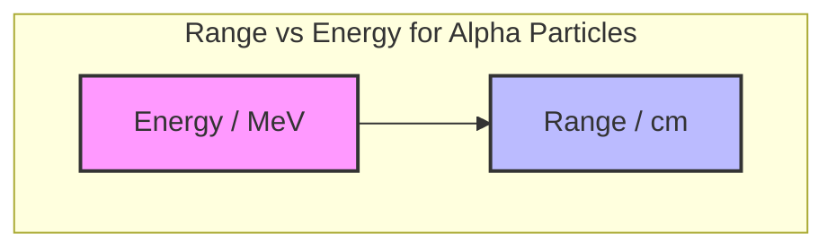
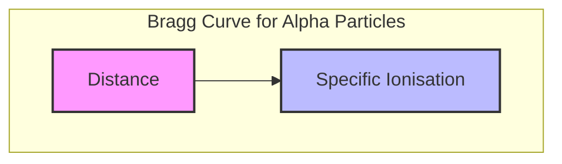

# 1. Overview / 概述

**English:**
Alpha particles are a fundamental type of ionizing radiation emitted during [[Radioactive Decay]] of heavy, unstable nuclei. This sub-topic focuses on the intrinsic properties of alpha particles — their nature, charge, mass, speed, and energy. Understanding these properties is crucial because they determine how alpha particles interact with matter, their [[Absorption and Penetration]] characteristics, and their specific [[Uses and Hazards of Radiation]]. Alpha particles are the most massive and highly ionizing form of radiation, but they have the shortest range. This knowledge forms the foundation for comparing alpha radiation with [[Properties of Beta Particles]] and [[Properties of Gamma Rays]] within the broader [[Alpha, Beta and Gamma Radiation]] topic.

**中文:**
α粒子是重、不稳定原子核在[[Radioactive Decay]]过程中发射的一种基本电离辐射类型。本子知识点聚焦于α粒子的内在属性——其本质、电荷、质量、速度和能量。理解这些属性至关重要，因为它们决定了α粒子如何与物质相互作用、其[[Absorption and Penetration]]特性以及特定的[[Uses and Hazards of Radiation]]。α粒子是质量最大、电离能力最强的辐射形式，但射程最短。这些知识构成了在[[Alpha, Beta and Gamma Radiation]]主题下，与[[Properties of Beta Particles]]和[[Properties of Gamma Rays]]进行比较的基础。

---

# 2. Syllabus Learning Objectives / 考纲学习目标

| CAIE 9702 | Edexcel IAL |
|-----------|-------------|
| 23.3(a) Describe the nature, range and penetrating power of α-particles | 8.11 Understand the nature, range and penetrating power of α-particles |
| 23.3(b) State that α-particles are helium nuclei | 8.12 Know that α-particles are helium nuclei (⁴₂He) |
| 23.3(c) Describe the deflection of α-particles in electric and magnetic fields | 8.13 Understand the deflection of α-particles in electric and magnetic fields |
| 23.3(d) Recall the relative ionising effect of α-particles | 8.14 Understand the relative ionising effect of α-particles |
| 23.3(e) Describe the absorption of α-particles by materials | 8.15 Understand the absorption of α-particles by materials |
| 23.3(f) State typical energies and speeds of α-particles | 8.16 Know typical energies (4-9 MeV) and speeds (~0.05c) of α-particles |
| 23.3(g) Use the inverse square law for α-particle detection | — |
| 23.3(h) Describe the use of α-particles in smoke detectors | — |

**Examiner Expectations / 考官期望:**
- **CAIE:** Students must be able to describe the nature of α-particles as helium nuclei, explain their high ionising power due to large mass and charge, and relate their short range to rapid energy loss. The inverse square law application for α-particle detection is unique to CAIE.
- **Edexcel:** Focus is on understanding the relationship between α-particle properties (mass, charge, speed) and their observed behaviour (ionisation, penetration, deflection). Numerical values for energy and speed must be recalled.

---

# 3. Core Definitions / 核心定义

| Term (EN/CN) | Definition (EN) | Definition (CN) | Common Mistakes / 常见错误 |
|--------------|-----------------|-----------------|---------------------------|
| **Alpha Particle** / α粒子 | A positively charged particle emitted from the nucleus of a radioactive atom, consisting of 2 protons and 2 neutrons (identical to a helium-4 nucleus). | 从放射性原子核中发射出的带正电粒子，由2个质子和2个中子组成（与氦-4原子核相同）。 | ❌ Confusing with helium atom (α-particle has no electrons). |
| **Ionisation** / 电离 | The process by which a radiation particle removes electrons from atoms or molecules, creating ions. | 辐射粒子从原子或分子中移除电子，产生离子的过程。 | ❌ Thinking ionisation is the same as excitation. |
| **Specific Ionisation** / 比电离 | The number of ion pairs produced per unit length of path in a medium. | 在介质中单位路径长度上产生的离子对数量。 | ❌ Confusing with total ionisation. |
| **Range** / 射程 | The maximum distance a radiation particle travels through a medium before losing all its kinetic energy. | 辐射粒子在失去所有动能之前，在介质中能穿过的最大距离。 | ❌ Thinking range is the same for all materials. |
| **Absorption** / 吸收 | The process by which radiation energy is transferred to and retained by a material. | 辐射能量被材料转移并保留的过程。 | ❌ Confusing with scattering. |
| **Helium Nucleus** / 氦原子核 | A nucleus consisting of 2 protons and 2 neutrons, symbol ⁴₂He²⁺. | 由2个质子和2个中子组成的原子核，符号为⁴₂He²⁺。 | ❌ Writing as He (neutral atom) instead of He²⁺. |

---

# 4. Key Concepts Explained / 关键概念详解

## 4.1 Nature of Alpha Particles / α粒子的本质

### Explanation / 解释
**English:**
An alpha particle is identical to the nucleus of a helium-4 atom. It consists of **2 protons** and **2 neutrons** tightly bound together by the strong nuclear force. This gives it a **charge of +2e** (where e = 1.6 × 10⁻¹⁹ C) and a **mass number of 4**. The symbol for an alpha particle is ⁴₂α or ⁴₂He²⁺. Alpha particles are emitted during [[Radioactive Decay]] when a heavy, unstable nucleus (typically with atomic number Z > 82) undergoes alpha decay to become more stable. The emission reduces the parent nucleus's atomic number by 2 and mass number by 4.

**中文:**
α粒子与氦-4原子核完全相同。它由**2个质子**和**2个中子**通过强核力紧密结合而成。这使其具有**+2e的电荷**（其中e = 1.6 × 10⁻¹⁹ C）和**质量数4**。α粒子的符号是⁴₂α或⁴₂He²⁺。当重、不稳定的原子核（通常原子序数Z > 82）发生α衰变以变得更稳定时，会发射出α粒子。发射使母核的原子序数减少2，质量数减少4。

### Physical Meaning / 物理意义
**English:**
The large mass (approximately 4 atomic mass units, or 6.64 × 10⁻²⁷ kg) and double positive charge of alpha particles are the key physical properties that govern their behaviour. The large mass means they move relatively slowly (compared to beta particles) for a given kinetic energy. The double charge gives them a strong electric field, which interacts powerfully with the electrons in atoms of any material they pass through. This strong interaction is why alpha particles have high [[Ionisation]] power but very short [[Range]].

**中文:**
α粒子的大质量（约4个原子质量单位，或6.64 × 10⁻²⁷ kg）和双正电荷是决定其行为的关键物理属性。大质量意味着在给定动能下，它们运动相对较慢（与β粒子相比）。双电荷赋予它们强大的电场，能与所穿过材料中的原子电子发生强烈相互作用。这种强相互作用是α粒子具有高[[Ionisation]]能力但[[Range]]非常短的原因。

### Common Misconceptions / 常见误区
- ❌ **"Alpha particles are the same as helium gas."** — Alpha particles are helium **nuclei** (²⁺), not neutral helium atoms. They only become helium atoms after gaining two electrons.
- ❌ **"Alpha particles travel at the speed of light."** — No. Alpha particles are massive and typically travel at about 5% of the speed of light (~0.05c).
- ❌ **"All alpha particles have the same energy."** — Different radioactive isotopes emit alpha particles with different energies (typically 4-9 MeV).

### Exam Tips / 考试提示
- ✅ **CAIE:** Be prepared to write the nuclear equation for alpha decay: ᴬ₂X → ᴬ⁻⁴₂₋₂Y + ⁴₂α
- ✅ **Edexcel:** Remember the symbol ⁴₂He²⁺ and that the charge is +2e.
- ✅ Always state "helium nucleus" not "helium atom" in definitions.

> 📷 **IMAGE PROMPT — ALPHA-01: Alpha Particle Structure**
> A clear, labelled diagram showing an alpha particle as a cluster of 2 red protons and 2 blue neutrons tightly packed together. The symbol ⁴₂He²⁺ should be shown next to it. A comparison with a neutral helium atom (with 2 orbiting electrons) should be shown on the side to highlight the difference. Educational style, white background, suitable for A-Level physics textbook.

---

## 4.2 Ionising Ability / 电离能力

### Explanation / 解释
**English:**
Alpha particles are the **most strongly ionising** of the three types of radiation. Their high ionising power comes from two factors:
1. **Large mass** — They move relatively slowly, spending more time near each atom they pass, increasing the chance of interaction.
2. **Double positive charge (+2e)** — They exert a strong electrostatic force on the electrons in atoms, easily pulling them away.

As an alpha particle travels through a medium, it creates approximately **10,000 to 100,000 ion pairs per millimetre** of path in air at standard temperature and pressure. This is about 100 times more than a beta particle and 10,000 times more than a gamma ray. Each ionisation event removes kinetic energy from the alpha particle, causing it to slow down rapidly. This is why alpha particles have a very short range.

**中文:**
α粒子是三种辐射中**电离能力最强的**。其高电离能力源于两个因素：
1. **大质量** — 它们运动相对较慢，在每个经过的原子附近停留时间更长，增加了相互作用的机会。
2. **双正电荷（+2e）** — 它们对原子中的电子施加强大的静电力，容易将电子拉走。

当α粒子穿过介质时，在标准温度和压力下的空气中，每毫米路径大约产生**10,000到100,000个离子对**。这大约是β粒子的100倍，γ射线的10,000倍。每次电离事件都会从α粒子中移除动能，使其迅速减速。这就是α粒子射程非常短的原因。

### Physical Meaning / 物理意义
**English:**
The high specific ionisation of alpha particles means they lose energy very quickly. This has two important consequences:
- **Short range** — Alpha particles can be stopped by a few centimetres of air, a sheet of paper, or the outer layer of skin.
- **High biological damage** — If an alpha-emitting source is ingested or inhaled, the intense localised ionisation can cause severe damage to living tissue, making alpha emitters particularly dangerous as internal [[Uses and Hazards of Radiation]].

**中文:**
α粒子的高比电离意味着它们能量损失非常快。这有两个重要后果：
- **短射程** — α粒子可以被几厘米的空气、一张纸或皮肤外层阻挡。
- **高生物损伤** — 如果α放射源被摄入或吸入，强烈的局部电离会对活组织造成严重损伤，使α放射体作为内部[[Uses and Hazards of Radiation]]特别危险。

### Common Misconceptions / 常见误区
- ❌ **"Alpha particles are dangerous because they penetrate deeply."** — False. They are dangerous **internally** because they don't penetrate but deposit all their energy in a small volume.
- ❌ **"Ionisation power is proportional to speed."** — Actually, slower particles have higher specific ionisation because they spend more time near each atom.

### Exam Tips / 考试提示
- ✅ Use comparative language: "Alpha particles are the most ionising but least penetrating."
- ✅ Explain the **mechanism**: large charge + large mass → strong electrostatic interaction → high ionisation → rapid energy loss → short range.
- ✅ For Edexcel, be ready to calculate the number of ion pairs from energy data (e.g., if an alpha particle has 5 MeV energy and each ionisation requires 30 eV, how many ion pairs?).

> 📷 **IMAGE PROMPT — ALPHA-02: Alpha Particle Ionisation**
> A diagram showing an alpha particle (labelled ⁴₂He²⁺) travelling through air molecules. Along its path, it is shown knocking electrons off atoms, creating positive ions and free electrons. The path should be straight and dense with ionisation events. A comparison with a beta particle path (less dense ionisation) should be shown alongside. Educational illustration style.

---

## 4.3 Speed and Energy / 速度与能量

### Explanation / 解释
**English:**
Alpha particles emitted from radioactive nuclei have **typical kinetic energies in the range of 4 to 9 MeV** (million electron volts). This corresponds to speeds of approximately **5% to 7% of the speed of light** (0.05c to 0.07c), or about 1.5 × 10⁷ m/s to 2.1 × 10⁷ m/s.

The energy of alpha particles from a specific radioactive isotope is **discrete** (not continuous) — each isotope emits alpha particles with one or more specific energies. This is because alpha decay involves a quantum tunnelling process where the energy released is determined by the difference in nuclear binding energies between parent and daughter nuclei.

The kinetic energy of an alpha particle can be calculated using:
$$ E_k = \frac{1}{2}mv^2 $$

Where:
- $m$ = mass of alpha particle ≈ 6.64 × 10⁻²⁷ kg
- $v$ = speed of alpha particle

**中文:**
从放射性原子核发射出的α粒子具有**4到9 MeV（百万电子伏特）的典型动能范围**。这对应的速度约为**光速的5%到7%**（0.05c到0.07c），或约1.5 × 10⁷ m/s到2.1 × 10⁷ m/s。

来自特定放射性同位素的α粒子的能量是**离散的**（非连续的）——每种同位素发射一种或多种特定能量的α粒子。这是因为α衰变涉及量子隧穿过程，释放的能量由母核和子核之间的核结合能差决定。

α粒子的动能可以用以下公式计算：
$$ E_k = \frac{1}{2}mv^2 $$

其中：
- $m$ = α粒子质量 ≈ 6.64 × 10⁻²⁷ kg
- $v$ = α粒子速度

### Physical Meaning / 物理意义
**English:**
The relatively low speed (compared to beta particles which can approach c) is a direct consequence of the alpha particle's large mass. For the same kinetic energy, a more massive particle moves slower. This low speed, combined with the double charge, is what gives alpha particles their high specific ionisation — they spend more time near each atom, allowing their strong electric field to interact more effectively with atomic electrons.

**中文:**
相对较低的速度（与可接近光速的β粒子相比）是α粒子大质量的直接结果。对于相同的动能，质量更大的粒子运动更慢。这种低速，加上双电荷，赋予了α粒子高比电离——它们在每个原子附近停留时间更长，使其强电场能更有效地与原子电子相互作用。

### Common Misconceptions / 常见误区
- ❌ **"Alpha particles from all sources have the same energy."** — Different isotopes emit alpha particles with different discrete energies.
- ❌ **"Alpha particles slow down because they lose charge."** — They slow down because they lose kinetic energy through ionisation, not because they lose charge.

### Exam Tips / 考试提示
- ✅ **Edexcel:** You must recall typical values: energy 4-9 MeV, speed ~0.05c.
- ✅ **CAIE:** Be prepared to use the kinetic energy equation with alpha particle mass.
- ✅ Convert MeV to joules when needed: 1 MeV = 1.6 × 10⁻¹³ J.

---

## 4.4 Deflection in Fields / 在电场和磁场中的偏转

### Explanation / 解释
**English:**
Because alpha particles are **positively charged (+2e)**, they are deflected by both electric and magnetic fields.

**In an electric field:**
Alpha particles are deflected towards the **negative plate** (opposite charges attract). The deflection is less than that of beta particles because alpha particles have much larger mass. The force on an alpha particle in a uniform electric field is:
$$ F = qE = 2eE $$
Where $E$ is the electric field strength. The acceleration is $a = F/m = 2eE/m$. Since $m$ is large, the acceleration (and hence deflection) is small.

**In a magnetic field:**
Using Fleming's Left Hand Rule (for positive charges), alpha particles are deflected in a direction perpendicular to both their velocity and the magnetic field. The radius of curvature is given by:
$$ r = \frac{mv}{Bq} = \frac{mv}{B(2e)} $$
Since $m$ is large and $q$ is +2e, alpha particles have a **larger radius of curvature** than beta particles of the same speed in the same magnetic field.

**中文:**
由于α粒子**带正电（+2e）**，它们会在电场和磁场中发生偏转。

**在电场中：**
α粒子向**负极板**偏转（异种电荷相吸）。偏转程度小于β粒子，因为α粒子的质量大得多。在匀强电场中作用于α粒子的力为：
$$ F = qE = 2eE $$
其中$E$是电场强度。加速度为$a = F/m = 2eE/m$。由于$m$很大，加速度（因此偏转）很小。

**在磁场中：**
使用弗莱明左手定则（对于正电荷），α粒子在垂直于其速度和磁场的方向上偏转。曲率半径为：
$$ r = \frac{mv}{Bq} = \frac{mv}{B(2e)} $$
由于$m$大且$q$为+2e，在相同磁场中，α粒子比相同速度的β粒子具有**更大的曲率半径**。

### Physical Meaning / 物理意义
**English:**
The deflection behaviour of alpha particles in fields is a key experimental method for identifying radiation types. In a cloud chamber or with a Geiger counter in a magnetic field, the direction and radius of curvature can distinguish alpha particles from beta particles and gamma rays. Alpha particles curve in the opposite direction to beta particles (opposite charge) and have a much larger radius (larger mass).

**中文:**
α粒子在磁场中的偏转行为是识别辐射类型的关键实验方法。在云室或带有磁场的盖革计数器中，偏转方向和曲率半径可以区分α粒子、β粒子和γ射线。α粒子的弯曲方向与β粒子相反（电荷相反），且曲率半径大得多（质量更大）。

### Common Misconceptions / 常见误区
- ❌ **"Alpha particles are not deflected by magnetic fields."** — They are deflected, but less than beta particles.
- ❌ **"Alpha and beta particles curve in the same direction in a magnetic field."** — They curve in opposite directions because they have opposite charges.

### Exam Tips / 考试提示
- ✅ Draw clear diagrams showing deflection directions.
- ✅ Use Fleming's Left Hand Rule for positive charges (alpha) and Right Hand Rule for negative charges (beta).
- ✅ Remember: alpha → less deflection in E-field, larger radius in B-field compared to beta.

> 📷 **IMAGE PROMPT — ALPHA-03: Alpha Particle Deflection**
> A diagram showing a radioactive source emitting alpha, beta, and gamma radiation into a region with a uniform magnetic field directed into the page (crosses). Alpha particles should curve gently in one direction, beta particles curve sharply in the opposite direction, and gamma rays go straight through undeflected. Labels should indicate the direction of the magnetic field and the identity of each radiation type. Educational diagram style.

---

# 5. Essential Equations / 核心公式

## 5.1 Kinetic Energy of Alpha Particle / α粒子的动能

$$ E_k = \frac{1}{2}mv^2 $$

| Symbol (符号) | Meaning (EN) | Meaning (CN) | Unit (单位) |
|--------------|-------------|-------------|------------|
| $E_k$ | Kinetic energy | 动能 | J (or MeV) |
| $m$ | Mass of alpha particle (≈ 6.64 × 10⁻²⁷ kg) | α粒子质量 | kg |
| $v$ | Speed of alpha particle | α粒子速度 | m s⁻¹ |

**Derivation / 推导:** Standard kinetic energy formula.
**Conditions / 适用条件:** Non-relativistic (v < 0.1c). Alpha particles typically travel at ~0.05c, so relativistic effects are negligible.
**Limitations / 局限性:** At very high speeds (>0.1c), relativistic corrections would be needed.

## 5.2 Force on Alpha Particle in Electric Field / α粒子在电场中的受力

$$ F = qE = 2eE $$

| Symbol (符号) | Meaning (EN) | Meaning (CN) | Unit (单位) |
|--------------|-------------|-------------|------------|
| $F$ | Electrostatic force | 静电力 | N |
| $q$ | Charge of alpha particle (+2e) | α粒子电荷 | C |
| $E$ | Electric field strength | 电场强度 | N C⁻¹ or V m⁻¹ |
| $e$ | Elementary charge (1.60 × 10⁻¹⁹ C) | 元电荷 | C |

**Conditions / 适用条件:** Uniform electric field.
**Limitations / 局限性:** Assumes field is uniform and particle is point-like.

## 5.3 Radius of Curvature in Magnetic Field / 磁场中的曲率半径

$$ r = \frac{mv}{Bq} = \frac{mv}{B(2e)} $$

| Symbol (符号) | Meaning (EN) | Meaning (CN) | Unit (单位) |
|--------------|-------------|-------------|------------|
| $r$ | Radius of curvature | 曲率半径 | m |
| $m$ | Mass of alpha particle | α粒子质量 | kg |
| $v$ | Speed of alpha particle | α粒子速度 | m s⁻¹ |
| $B$ | Magnetic flux density | 磁通密度 | T |
| $q$ | Charge of alpha particle (+2e) | α粒子电荷 | C |

**Derivation / 推导:** Magnetic force $F = Bqv$ provides centripetal force $F = mv^2/r$. Equating: $Bqv = mv^2/r$, rearranging gives $r = mv/Bq$.
**Conditions / 适用条件:** Uniform magnetic field, velocity perpendicular to field.
**Limitations / 局限性:** Only valid when v ⟂ B. If there is a parallel component, the path becomes helical.

## 5.4 Alpha Decay Equation / α衰变方程

$$ ^A_Z X \rightarrow ^{A-4}_{Z-2} Y + ^4_2 \alpha $$

| Symbol (符号) | Meaning (EN) | Meaning (CN) |
|--------------|-------------|-------------|
| $^A_Z X$ | Parent nucleus | 母核 |
| $^{A-4}_{Z-2} Y$ | Daughter nucleus | 子核 |
| $^4_2 \alpha$ | Alpha particle | α粒子 |

**Conditions / 适用条件:** Occurs in heavy nuclei (Z > 82) to increase stability.
**Limitations / 局限性:** Not all heavy nuclei undergo alpha decay; some undergo beta decay or spontaneous fission.

> 📷 **IMAGE PROMPT — ALPHA-04: Alpha Decay Equation Diagram**
> A visual representation of the alpha decay equation. Show a large nucleus (e.g., Uranium-238) with 92 protons and 146 neutrons. An arrow shows it splitting into a Thorium-234 nucleus (90 protons, 144 neutrons) and an alpha particle (2 protons, 2 neutrons) flying away. Labels indicate parent, daughter, and alpha particle. Educational diagram style.

---

# 6. Graphs and Relationships / 图表与关系

## 6.1 Range vs. Energy for Alpha Particles / α粒子射程与能量关系

### Axes / 坐标轴
- **X-axis:** Kinetic energy of alpha particle / α粒子动能 (MeV)
- **Y-axis:** Range in air at STP / 标准状态下空气中的射程 (cm)

### Shape / 形状
The graph is approximately **linear** for alpha particles in the typical energy range (4-9 MeV). The range increases roughly proportionally with energy.

### Gradient Meaning / 斜率含义
The gradient represents the **rate of change of range with energy** (cm MeV⁻¹). A steeper gradient means the alpha particle travels further per unit of initial energy.

### Area Meaning / 面积含义
The area under the graph has no direct physical meaning for this relationship.

### Exam Interpretation / 考试解读
- Higher energy alpha particles have longer ranges.
- The linear relationship allows estimation of range for a given energy.
- For example, a 5 MeV alpha particle has a range of about 3.5 cm in air, while an 8 MeV alpha particle has a range of about 7 cm.

> 📷 **IMAGE PROMPT — ALPHA-05: Range-Energy Graph**
> A graph showing a roughly linear relationship between alpha particle energy (x-axis, 0-10 MeV) and range in air (y-axis, 0-10 cm). The line should start near the origin and rise steadily. Data points should be shown for common alpha emitters (e.g., Po-210 at 5.3 MeV, Am-241 at 5.5 MeV). Educational graph style with clear axis labels.

---

## 6.2 Specific Ionisation vs. Distance / 比电离与距离关系

### Axes / 坐标轴
- **X-axis:** Distance travelled / 行进距离 (cm)
- **Y-axis:** Specific ionisation / 比电离 (ion pairs per mm)

### Shape / 形状
The graph shows a **Bragg curve** — specific ionisation increases as the alpha particle slows down, reaching a **peak (Bragg peak)** near the end of its range, then dropping sharply to zero.

### Gradient Meaning / 斜率含义
The gradient represents the rate of change of ionisation with distance. The positive gradient before the peak indicates increasing ionisation as the particle slows down.

### Area Meaning / 面积含义
The area under the curve represents the **total number of ion pairs** produced along the entire path, which is proportional to the initial energy of the alpha particle.

### Exam Interpretation / 考试解读
- Alpha particles cause more ionisation near the end of their path.
- This is because slower particles spend more time near each atom.
- The Bragg peak is important in medical physics (proton therapy uses this effect).

> 📷 **IMAGE PROMPT — ALPHA-06: Bragg Curve**
> A graph showing specific ionisation (y-axis) against distance travelled (x-axis) for an alpha particle. The curve should start at a moderate value, rise gradually, then increase sharply to a peak (Bragg peak) near the end, before dropping abruptly to zero. Label the Bragg peak clearly. Educational graph style.

---

# 7. Required Diagrams / 必备图表

## 7.1 Alpha Particle in a Cloud Chamber / 云室中的α粒子

### Description / 描述
**English:**
A cloud chamber is a device used to visualise the paths of ionising radiation. Alpha particles produce **thick, straight, short tracks** in a cloud chamber. The tracks are thick because alpha particles cause dense ionisation along their path. They are straight because alpha particles are heavy and not easily deflected by collisions with air molecules. They are short because alpha particles have a limited range in the chamber's gas.

**中文:**
云室是一种用于可视化电离辐射路径的装置。α粒子在云室中产生**粗、直、短的径迹**。径迹粗是因为α粒子沿其路径产生密集的电离。径迹直是因为α粒子质量大，不易被与空气分子的碰撞偏转。径迹短是因为α粒子在云室气体中的射程有限。

### Image Prompt / 图片生成提示
> 📷 **IMAGE PROMPT — ALPHA-07: Cloud Chamber Tracks**
> A photograph-style image of a cloud chamber showing three types of radiation tracks. Alpha tracks should be thick, straight, and short (about 5 cm). Beta tracks should be thin, wispy, and longer with occasional kinks. Gamma tracks should be very faint and sparse. Labels should identify each track type. Realistic scientific image style.

### Labels Required / 需要标注
- Alpha track / α径迹 (thick, straight, short)
- Beta track / β径迹 (thin, wispy, longer)
- Gamma track / γ径迹 (very faint, sparse)
- Source position / 源位置
- Direction of motion / 运动方向

### Exam Importance / 考试重要性
- **CAIE:** Frequently asked to describe and explain the appearance of alpha tracks.
- **Edexcel:** May be asked to compare alpha and beta tracks in a cloud chamber.

---

## 7.2 Alpha Particle Absorption / α粒子吸收

### Description / 描述
**English:**
A diagram showing the absorption of alpha particles by different materials. Alpha particles are stopped by:
- A few centimetres of air (typically 3-8 cm depending on energy)
- A sheet of paper (about 0.1 mm thick)
- The outer layer of skin (dead skin cells)

The diagram should show an alpha source, with arrows representing alpha particles being progressively absorbed as they pass through increasing thicknesses of material.

**中文:**
显示α粒子被不同材料吸收的示意图。α粒子被以下材料阻挡：
- 几厘米的空气（通常3-8厘米，取决于能量）
- 一张纸（约0.1毫米厚）
- 皮肤外层（死皮细胞）

图示应显示一个α源，箭头代表α粒子在穿过逐渐增厚的材料时被逐步吸收。

### Image Prompt / 图片生成提示
> 📷 **IMAGE PROMPT — ALPHA-08: Alpha Particle Absorption**
> A diagram showing an alpha source on the left. Three horizontal paths extend to the right. Path 1: alpha particles stopped by a few cm of air (labelled "Air ~5 cm"). Path 2: alpha particles stopped by a sheet of paper (labelled "Paper ~0.1 mm"). Path 3: alpha particles stopped by the outer layer of skin (labelled "Dead skin layer"). Each path should show the alpha particles getting progressively weaker and then stopping. Educational diagram style.

### Labels Required / 需要标注
- Alpha source / α源
- Air (3-8 cm) / 空气（3-8厘米）
- Paper (~0.1 mm) / 纸（约0.1毫米）
- Skin (dead layer) / 皮肤（死皮层）
- Stopped here / 在此停止

### Exam Importance / 考试重要性
- **Both boards:** Essential for understanding [[Absorption and Penetration]].
- Used to explain why alpha sources are safe externally but dangerous internally.

---

# 8. Worked Examples / 典型例题

## Example 1: Alpha Particle Energy and Speed / α粒子的能量与速度

### Question / 题目
**English:**
An alpha particle is emitted from a Polonium-210 nucleus with a kinetic energy of 5.3 MeV. The mass of an alpha particle is 6.64 × 10⁻²⁷ kg. Calculate:
(a) The kinetic energy in joules.
(b) The speed of the alpha particle.
(c) The number of ion pairs the alpha particle could produce if each ionisation requires 35 eV of energy.

**中文:**
一个α粒子从钋-210原子核中发射，动能为5.3 MeV。α粒子的质量为6.64 × 10⁻²⁷ kg。计算：
(a) 以焦耳为单位的动能。
(b) α粒子的速度。
(c) 如果每次电离需要35 eV的能量，该α粒子能产生的离子对数量。

### Solution / 解答

**(a) Convert MeV to J / 将MeV转换为J:**
$$ E_k = 5.3 \text{ MeV} = 5.3 \times 10^6 \text{ eV} $$
$$ E_k = 5.3 \times 10^6 \times 1.60 \times 10^{-19} $$
$$ E_k = 8.48 \times 10^{-13} \text{ J} $$

**(b) Calculate speed / 计算速度:**
$$ E_k = \frac{1}{2}mv^2 $$
$$ v = \sqrt{\frac{2E_k}{m}} $$
$$ v = \sqrt{\frac{2 \times 8.48 \times 10^{-13}}{6.64 \times 10^{-27}}} $$
$$ v = \sqrt{2.55 \times 10^{14}} $$
$$ v = 1.60 \times 10^7 \text{ m s}^{-1} $$

**(c) Calculate number of ion pairs / 计算离子对数量:**
$$ \text{Number of ion pairs} = \frac{\text{Total energy}}{\text{Energy per ionisation}} $$
$$ = \frac{5.3 \times 10^6 \text{ eV}}{35 \text{ eV}} $$
$$ = 1.51 \times 10^5 \text{ ion pairs} $$

### Final Answer / 最终答案
**Answer:**
(a) $E_k = 8.48 \times 10^{-13}$ J
(b) $v = 1.60 \times 10^7$ m s⁻¹ (≈ 0.053c)
(c) $1.51 \times 10^5$ ion pairs

**答案：**
(a) $E_k = 8.48 \times 10^{-13}$ J
(b) $v = 1.60 \times 10^7$ m s⁻¹ (≈ 0.053c)
(c) $1.51 \times 10^5$ 个离子对

### Quick Tip / 提示
**English:** Always convert MeV to J before using in equations. Remember 1 eV = 1.60 × 10⁻¹⁹ J. The speed should be about 5-7% of the speed of light (3 × 10⁸ m/s) — if your answer is very different, check your calculation.

**中文:** 在公式中使用前，务必将MeV转换为J。记住1 eV = 1.60 × 10⁻¹⁹ J。速度应约为光速（3 × 10⁸ m/s）的5-7%——如果答案差异很大，请检查计算。

---

## Example 2: Alpha Particle in a Magnetic Field / 磁场中的α粒子

### Question / 题目
**English:**
An alpha particle with kinetic energy 5.3 MeV enters a uniform magnetic field of flux density 0.50 T perpendicular to its direction of motion. Calculate the radius of its circular path. (Mass of alpha particle = 6.64 × 10⁻²⁷ kg, charge of alpha particle = +3.20 × 10⁻¹⁹ C)

**中文:**
一个动能为5.3 MeV的α粒子垂直进入磁通密度为0.50 T的匀强磁场。计算其圆形路径的半径。（α粒子质量 = 6.64 × 10⁻²⁷ kg，α粒子电荷 = +3.20 × 10⁻¹⁹ C）

### Solution / 解答

**Step 1: Find speed from kinetic energy / 从动能求速度:**
From Example 1, $v = 1.60 \times 10^7$ m s⁻¹

**Step 2: Use radius formula / 使用半径公式:**
$$ r = \frac{mv}{Bq} $$
$$ r = \frac{(6.64 \times 10^{-27})(1.60 \times 10^7)}{(0.50)(3.20 \times 10^{-19})} $$
$$ r = \frac{1.06 \times 10^{-19}}{1.60 \times 10^{-19}} $$
$$ r = 0.663 \text{ m} $$

### Final Answer / 最终答案
**Answer:** $r = 0.66$ m (to 2 significant figures) | **答案：** $r = 0.66$ m（保留2位有效数字）

### Quick Tip / 提示
**English:** The radius is relatively large (about 66 cm) because alpha particles are heavy. Compare this with a beta particle of similar energy, which would have a much smaller radius (a few cm). This difference is used to identify radiation types.

**中文:** 半径相对较大（约66厘米），因为α粒子质量大。与能量相似的β粒子相比，β粒子的半径要小得多（几厘米）。这种差异用于识别辐射类型。

---

# 9. Past Paper Question Types / 历年真题题型

| Question Type / 题型 | Frequency / 频率 | Difficulty / 难度 | Past Paper References / 真题索引 |
|----------------------|------------------|------------------|-------------------------------|
| Describe nature and properties of α-particles / 描述α粒子的本质和性质 | High / 高 | Easy / 简单 | 📝 *待填入* |
| Compare α, β, γ radiation / 比较α、β、γ辐射 | High / 高 | Medium / 中等 | 📝 *待填入* |
| Calculate α-particle speed/energy / 计算α粒子速度/能量 | Medium / 中 | Medium / 中等 | 📝 *待填入* |
| Deflection in E and B fields / 在电场和磁场中的偏转 | Medium / 中 | Medium/Hard / 中等/困难 | 📝 *待填入* |
| Cloud chamber track explanation / 云室径迹解释 | Medium / 中 | Easy/Medium / 简单/中等 | 📝 *待填入* |
| Inverse square law for α detection (CAIE only) / α探测的平方反比定律（仅CAIE） | Low / 低 | Hard / 困难 | 📝 *待填入* |
| Smoke detector application / 烟雾探测器应用 | Low / 低 | Easy / 简单 | 📝 *待填入* |

**Common Command Words / 常见指令词:**
- **Describe / 描述** — Give characteristics and properties
- **Explain / 解释** — Give reasons for observed behaviour
- **Compare / 比较** — State similarities and differences
- **Calculate / 计算** — Use equations to find numerical values
- **State / 陈述** — Give a brief answer without explanation

---

# 10. Practical Skills Connections / 实验技能链接

**English:**
This sub-topic connects to practical work in several ways:

1. **Cloud Chamber Experiment:** Observing alpha particle tracks. Students should be able to:
   - Set up a diffusion cloud chamber with dry ice and alcohol
   - Identify alpha tracks (thick, straight, short)
   - Measure track lengths to estimate range
   - Compare with beta and gamma tracks

2. **Absorption Experiment:** Using a Geiger-Müller (GM) tube to measure alpha particle absorption:
   - Measure count rate with increasing absorber thickness
   - Plot count rate vs. thickness graph
   - Determine range from the graph (where count rate drops to background)
   - **Uncertainty:** Consider counting statistics (√N uncertainty) and background radiation subtraction

3. **Inverse Square Law (CAIE only):** For alpha particles in a vacuum:
   - Measure count rate at different distances from a source
   - Plot count rate vs. 1/r² to verify the inverse square law
   - **Note:** In air, absorption affects the results, so corrections are needed

4. **Deflection Demonstration:** Using a magnetic field to show alpha particle deflection:
   - Place a strong magnet near a GM tube or cloud chamber
   - Observe the change in count rate or track direction
   - Compare with beta particle deflection

**Key Measurements / 关键测量:**
- Range in air: typically 3-8 cm
- Count rate: corrected for background radiation
- Track length in cloud chamber: measured with a ruler

**Common Errors / 常见误差:**
- Not accounting for background radiation
- Using too thick an absorber (alpha particles stopped completely)
- Not considering that alpha particles lose energy in the air gap between source and absorber

**中文:**
本子知识点通过多种方式与实验工作联系：

1. **云室实验：** 观察α粒子径迹。学生应能：
   - 使用干冰和酒精设置扩散云室
   - 识别α径迹（粗、直、短）
   - 测量径迹长度以估算射程
   - 与β和γ径迹比较

2. **吸收实验：** 使用盖革-米勒（GM）管测量α粒子吸收：
   - 测量随吸收体厚度增加时的计数率
   - 绘制计数率与厚度关系图
   - 从图中确定射程（计数率降至本底处）
   - **不确定度：** 考虑计数统计（√N不确定度）和本底辐射扣除

3. **平方反比定律（仅CAIE）：** 真空中α粒子：
   - 测量不同距离处的计数率
   - 绘制计数率与1/r²关系图以验证平方反比定律
   - **注意：** 在空气中，吸收会影响结果，因此需要修正

4. **偏转演示：** 使用磁场显示α粒子偏转：
   - 在GM管或云室附近放置强磁铁
   - 观察计数率或径迹方向的变化
   - 与β粒子偏转比较

**关键测量：**
- 空气中的射程：通常3-8厘米
- 计数率：扣除本底辐射后
- 云室中的径迹长度：用尺子测量

**常见误差：**
- 未考虑本底辐射
- 使用过厚的吸收体（α粒子完全被阻挡）
- 未考虑α粒子在源与吸收体之间的空气间隙中损失能量

---

# 11. Concept Map / 概念图谱

```mermaid
graph TD
    %% Main node
    AP[Alpha Particle Properties] --> NAT[Nature: Helium Nucleus]
    AP --> CHG[Charge: +2e]
    AP --> MASS[Mass: 4 u]
    AP --> SPEED[Speed: ~0.05c]
    AP --> ENERGY[Energy: 4-9 MeV]
    
    %% Consequences
    AP --> ION[High Ionising Power]
    AP --> RANGE[Short Range]
    AP --> DEFL[Deflection in Fields]
    
    %% Ionisation details
    ION --> SPEC[Specific Ionisation: 10⁴-10⁵ pairs/mm]
    ION --> BRAGG[Bragg Peak]
    
    %% Range details
    RANGE --> AIR[Air: 3-8 cm]
    RANGE --> PAPER[Paper: ~0.1 mm]
    RANGE --> SKIN[Skin: Dead layer]
    
    %% Field deflection
    DEFL --> EFIELD[Electric Field: Towards -ve plate]
    DEFL --> BFIELD[Magnetic Field: Curved path]
    
    %% Connections to other topics
    AP --> DECAY[[Radioactive Decay]]
    AP --> ABSORP[[Absorption and Penetration]]
    AP --> USES[[Uses and Hazards of Radiation]]
    AP --> BETA[[Properties of Beta Particles]]
    AP --> GAMMA[[Properties of Gamma Rays]]
    
    %% Parent hub
    AP --> PARENT[[Alpha, Beta and Gamma Radiation]]
    
    %% Styling
    style AP fill:#ff6b6b,stroke:#333,stroke-width:3px
    style NAT fill:#ffa07a,stroke:#333
    style CHG fill:#ffa07a,stroke:#333
    style MASS fill:#ffa07a,stroke:#333
    style SPEED fill:#ffa07a,stroke:#333
    style ENERGY fill:#ffa07a,stroke:#333
    style ION fill:#98fb98,stroke:#333
    style RANGE fill:#98fb98,stroke:#333
    style DEFL fill:#98fb98,stroke:#333
    style PARENT fill:#f0e68c,stroke:#333,stroke-width:2px
```

---

# 12. Quick Revision Sheet / 速查表

| Category / 类别 | Key Points / 要点 |
|----------------|------------------|
| **Definition / 定义** | Alpha particle = helium nucleus (2p + 2n), symbol ⁴₂He²⁺ / α粒子 = 氦原子核（2p + 2n），符号 ⁴₂He²⁺ |
| **Charge / 电荷** | +2e = +3.20 × 10⁻¹⁹ C / +2e = +3.20 × 10⁻¹⁹ C |
| **Mass / 质量** | 4 u = 6.64 × 10⁻²⁷ kg / 4 u = 6.64 × 10⁻²⁷ kg |
| **Speed / 速度** | ~0.05c = 1.5 × 10⁷ m/s / ~0.05c = 1.5 × 10⁷ m/s |
| **Energy / 能量** | 4-9 MeV (discrete values) / 4-9 MeV（离散值） |
| **Ionisation / 电离** | Highest specific ionisation: 10⁴-10⁵ ion pairs/mm in air / 最高比电离：空气中10⁴-10⁵离子对/毫米 |
| **Range in air / 空气中射程** | 3-8 cm (depends on energy) / 3-8厘米（取决于能量） |
| **Stopped by / 被阻挡** | Paper (~0.1 mm), skin (dead layer) / 纸（~0.1毫米），皮肤（死皮层） |
| **Key Formula / 核心公式** | $E_k = \frac{1}{2}mv^2$, $r = \frac{mv}{Bq}$ |
| **Key Graph / 核心图表** | Bragg curve: specific ionisation vs. distance / 布拉格曲线：比电离与距离关系 |
| **Field Deflection / 场偏转** | E-field: towards -ve plate; B-field: curved path (large radius) / 电场：向负极板；磁场：弯曲路径（大半径） |
| **Cloud Chamber / 云室** | Thick, straight, short tracks / 粗、直、短的径迹 |
| **Danger / 危险** | Safe externally (stopped by skin); dangerous internally (high ionisation) / 外部安全（被皮肤阻挡）；内部危险（高电离） |
| **Exam Tip / 考试提示** | Always compare with β and γ; explain properties using mass and charge / 始终与β和γ比较；用质量和电荷解释性质 |