# Properties of Beta Particles / β粒子的性质

---

# 1. Overview / 概述

**English:**
Beta particles (β) are high-energy, high-speed electrons or positrons emitted from the nucleus during [[Radioactive Decay]]. Unlike alpha particles, beta particles have a negative charge (β⁻) or positive charge (β⁺), negligible mass compared to nucleons, and significantly greater penetrating power. This sub-topic explores the nature, origin, properties, and behavior of beta particles, including their charge, mass, speed, ionization ability, and interactions with matter. Understanding beta particles is essential for mastering [[Absorption and Penetration]] and their applications in [[Uses and Hazards of Radiation]].

**中文:**
β粒子是在[[Radioactive Decay|放射性衰变]]过程中从原子核发射出的高能、高速电子或正电子。与α粒子不同，β粒子带有负电荷（β⁻）或正电荷（β⁺），与核子相比质量可忽略不计，并且具有显著更强的穿透能力。本子知识点探讨β粒子的性质、来源、特性及其行为，包括电荷、质量、速度、电离能力以及与物质的相互作用。理解β粒子对于掌握[[Absorption and Penetration|吸收与穿透]]及其在[[Uses and Hazards of Radiation|辐射的用途与危害]]中的应用至关重要。

---

# 2. Syllabus Learning Objectives / 考纲学习目标

| CAIE 9702 | Edexcel IAL |
|-----------|-------------|
| 23.3(a) Describe the nature and properties of β-particles | 8.11 Understand that β⁻ particles are fast-moving electrons emitted from the nucleus |
| 23.3(b) State that β⁻ particles are electrons emitted from the nucleus | 8.12 Understand that β⁺ particles are positrons (antielectrons) |
| 23.3(c) Describe the deflection of β-particles in electric and magnetic fields | 8.13 Describe the deflection of β-particles in electric and magnetic fields |
| 23.3(d) Compare the ionizing power and penetrating ability of β-particles with α and γ | 8.14 Compare the range and absorption of β-particles in different materials |
| 23.3(e) Describe the absorption of β-particles by materials | 8.15 Understand that β-particles produce ionization along their path |
| 23.3(f) Explain the concept of range of β-particles in air and other materials | 8.16 Describe the use of β-particles in thickness monitoring and medical applications |
| 23.3(g) Describe the use of β-particles in thickness gauges | — |
| 23.3(h) State the dangers of β-particles and safety precautions | — |

**Examiner Expectations / 考官期望:**
- **English:** Students must be able to describe β-particles as fast-moving electrons (β⁻) or positrons (β⁺) emitted from the nucleus. They should explain why β-particles have a continuous energy spectrum (due to the neutrino sharing energy). They must compare β-particles with α and γ in terms of ionizing power, penetrating ability, and deflection in fields. Understanding the absorption curve and range concept is critical.
- **中文:** 学生必须能够描述β粒子为从原子核发射出的快速运动的电子（β⁻）或正电子（β⁺）。他们应解释为什么β粒子具有连续能谱（由于中微子共享能量）。他们必须比较β粒子与α和γ在电离能力、穿透能力以及在场中的偏转方面的差异。理解吸收曲线和射程概念至关重要。

---

# 3. Core Definitions / 核心定义

| Term (EN/CN) | Definition (EN) | Definition (CN) | Common Mistakes / 常见错误 |
|--------------|-----------------|-----------------|---------------------------|
| **Beta Particle (β)** / β粒子 | A high-energy, high-speed electron (β⁻) or positron (β⁺) emitted from the nucleus during beta decay | 在β衰变过程中从原子核发射出的高能、高速电子（β⁻）或正电子（β⁺） | ❌ Thinking β particles are orbital electrons — they come from the nucleus |
| **Beta-minus Decay (β⁻)** / β⁻衰变 | A decay mode where a neutron converts to a proton, emitting an electron and an antineutrino | 中子转化为质子，发射出一个电子和一个反中微子的衰变模式 | ❌ Forgetting the antineutrino is emitted |
| **Beta-plus Decay (β⁺)** / β⁺衰变 | A decay mode where a proton converts to a neutron, emitting a positron and a neutrino | 质子转化为中子，发射出一个正电子和一个中微子的衰变模式 | ❌ Forgetting the neutrino is emitted |
| **Positron** / 正电子 | The antiparticle of the electron, with same mass but opposite (+1e) charge | 电子的反粒子，质量相同但电荷相反（+1e） | ❌ Thinking positrons are protons |
| **Range** / 射程 | The maximum distance a beta particle can travel through a material before being stopped | β粒子在材料中被阻止前能传播的最大距离 | ❌ Confusing range with half-value thickness |
| **Continuous Energy Spectrum** / 连续能谱 | The distribution of kinetic energies of beta particles from a given source, ranging from zero up to a maximum value (E_max) | 来自给定源的β粒子动能分布，范围从零到最大值（E_max） | ❌ Thinking all beta particles have the same energy |
| **Absorption Coefficient (μ)** / 吸收系数 | A measure of how strongly a material absorbs beta radiation per unit thickness | 衡量材料每单位厚度吸收β辐射强度的量度 | ❌ Confusing with linear attenuation coefficient for gamma |

---

# 4. Key Concepts Explained / 关键概念详解

## 4.1 Nature and Origin of Beta Particles / β粒子的性质与来源

### Explanation / 解释
**English:**
Beta particles are not orbital electrons. They are created inside the nucleus during [[Radioactive Decay]]. In β⁻ decay, a neutron ($n$) converts into a proton ($p^+$), emitting an electron ($e^-$) and an antineutrino ($\bar{\nu}_e$):

$$ n \rightarrow p^+ + e^- + \bar{\nu}_e $$

In β⁺ decay, a proton converts into a neutron, emitting a positron ($e^+$) and a neutrino ($\nu_e$):

$$ p^+ \rightarrow n + e^+ + \nu_e $$

The neutrino (or antineutrino) carries away some energy, which explains why beta particles have a [[Continuous Energy Spectrum]] rather than discrete energies like alpha particles.

**中文:**
β粒子不是轨道电子。它们是在[[Radioactive Decay|放射性衰变]]过程中在原子核内部产生的。在β⁻衰变中，中子（$n$）转化为质子（$p^+$），发射出一个电子（$e^-$）和一个反中微子（$\bar{\nu}_e$）：

$$ n \rightarrow p^+ + e^- + \bar{\nu}_e $$

在β⁺衰变中，质子转化为中子，发射出一个正电子（$e^+$）和一个中微子（$\nu_e$）：

$$ p^+ \rightarrow n + e^+ + \nu_e $$

中微子（或反中微子）带走了一部分能量，这解释了为什么β粒子具有[[Continuous Energy Spectrum|连续能谱]]，而不是像α粒子那样具有离散能量。

### Physical Meaning / 物理意义
**English:**
The continuous energy spectrum means that beta particles from the same source can have different kinetic energies, from nearly zero up to a maximum value $E_{max}$. The average energy is approximately $\frac{1}{3}E_{max}$. This is fundamentally different from alpha particles, which have discrete energies.

**中文:**
连续能谱意味着来自同一源的β粒子可以具有不同的动能，从接近零到最大值$E_{max}$。平均能量约为$\frac{1}{3}E_{max}$。这与具有离散能量的α粒子根本不同。

### Common Misconceptions / 常见误区
- ❌ **English:** "Beta particles are electrons from the electron shells." → They are created in the nucleus during decay.
- ❌ **中文:** "β粒子来自电子壳层。" → 它们是在衰变过程中在原子核内产生的。
- ❌ **English:** "All beta particles from a source have the same energy." → They have a continuous energy spectrum.
- ❌ **中文:** "来自同一源的所有β粒子具有相同的能量。" → 它们具有连续能谱。
- ❌ **English:** "Beta decay changes the mass number." → The mass number (A) remains the same; only the atomic number (Z) changes.
- ❌ **中文:** "β衰变改变质量数。" → 质量数（A）保持不变；只有原子序数（Z）改变。

### Exam Tips / 考试提示
- ✅ **English:** Always state that β⁻ particles are electrons from the nucleus, not from electron shells.
- ✅ **中文:** 始终说明β⁻粒子是来自原子核的电子，而不是来自电子壳层。
- ✅ **English:** Remember that the neutrino/antineutrino is emitted to conserve energy and momentum.
- ✅ **中文:** 记住中微子/反中微子的发射是为了守恒能量和动量。
- ✅ **English:** For CAIE, be prepared to sketch the continuous energy spectrum graph.
- ✅ **中文:** 对于CAIE，要准备好绘制连续能谱图。

> 📷 **IMAGE PROMPT — BETA-01: Beta Decay Process Diagram**
> A clear diagram showing: (1) β⁻ decay: a neutron (n) transforming into a proton (p⁺) with an electron (e⁻) and antineutrino (ν̄ₑ) being emitted; (2) β⁺ decay: a proton (p⁺) transforming into a neutron (n) with a positron (e⁺) and neutrino (νₑ) being emitted. Use color coding: neutrons in blue, protons in red, electrons in yellow, positrons in green, neutrinos in purple. Include the nucleus boundary and label "Nucleus" and "Emitted Particles". Style: clean educational diagram suitable for A-Level physics textbook.

---

## 4.2 Charge and Mass / 电荷与质量

### Explanation / 解释
**English:**
Beta particles have:
- **Charge:** β⁻ particles have charge $-1e$ (where $e = 1.60 \times 10^{-19} \text{ C}$). β⁺ particles have charge $+1e$.
- **Mass:** The rest mass of a beta particle is the same as an electron: $m_e = 9.11 \times 10^{-31} \text{ kg}$, which is approximately $\frac{1}{1836}$ of a proton's mass.
- **Speed:** Beta particles are emitted with speeds ranging from 0.1c to 0.99c (where $c = 3.0 \times 10^8 \text{ m/s}$), depending on their kinetic energy.

**中文:**
β粒子具有：
- **电荷：** β⁻粒子带电荷$-1e$（其中$e = 1.60 \times 10^{-19} \text{ C}$）。β⁺粒子带电荷$+1e$。
- **质量：** β粒子的静止质量与电子相同：$m_e = 9.11 \times 10^{-31} \text{ kg}$，约为质子质量的$\frac{1}{1836}$。
- **速度：** β粒子的发射速度范围从0.1c到0.99c（其中$c = 3.0 \times 10^8 \text{ m/s}$），取决于其动能。

### Physical Meaning / 物理意义
**English:**
Because beta particles have very small mass compared to alpha particles, they are much less ionizing but much more penetrating. Their high speed (often relativistic) means relativistic effects must be considered for accurate calculations of their kinetic energy and momentum.

**中文:**
由于β粒子与α粒子相比质量非常小，它们的电离能力弱得多，但穿透能力强得多。它们的高速（通常是相对论性的）意味着在精确计算其动能和动量时必须考虑相对论效应。

### Common Misconceptions / 常见误区
- ❌ **English:** "Beta particles have the same mass as protons." → They have the same mass as electrons, about 1/1836 of a proton.
- ❌ **中文:** "β粒子与质子质量相同。" → 它们与电子质量相同，约为质子的1/1836。
- ❌ **English:** "All beta particles travel at the speed of light." → They travel at speeds up to 0.99c, but not at c (only photons travel at c).
- ❌ **中文:** "所有β粒子都以光速运动。" → 它们以高达0.99c的速度运动，但不是c（只有光子以c运动）。

### Exam Tips / 考试提示
- ✅ **English:** When comparing beta to alpha, emphasize the mass difference (1/1836 vs 4 u).
- ✅ **中文:** 比较β和α时，强调质量差异（1/1836 vs 4 u）。
- ✅ **English:** For Edexcel, be prepared to calculate the specific charge ($q/m$) of beta particles.
- ✅ **中文:** 对于Edexcel，要准备好计算β粒子的比电荷（$q/m$）。

---

## 4.3 Deflection in Electric and Magnetic Fields / 在电场和磁场中的偏转

### Explanation / 解释
**English:**
Beta particles are charged and therefore experience forces in electric and magnetic fields:

**Electric Field:** Beta particles are deflected towards the oppositely charged plate. β⁻ particles are attracted to the positive plate; β⁺ particles are attracted to the negative plate. The deflection is much greater than for alpha particles due to the smaller mass.

**Magnetic Field:** Using Fleming's Left Hand Rule (for conventional current), β⁻ particles (negative charge) deflect in the opposite direction to positive particles. The radius of curvature $r$ in a uniform magnetic field $B$ is given by:

$$ r = \frac{mv}{Bq} $$

Where $m$ is mass, $v$ is speed, $B$ is magnetic flux density, and $q$ is charge.

**中文:**
β粒子带电，因此在电场和磁场中会受到力的作用：

**电场：** β粒子向带相反电荷的极板偏转。β⁻粒子被吸引到正极板；β⁺粒子被吸引到负极板。由于质量较小，偏转比α粒子大得多。

**磁场：** 使用弗莱明左手定则（对于常规电流），β⁻粒子（负电荷）向与正粒子相反的方向偏转。在均匀磁场$B$中的曲率半径$r$由下式给出：

$$ r = \frac{mv}{Bq} $$

其中$m$是质量，$v$是速度，$B$是磁通密度，$q$是电荷。

### Physical Meaning / 物理意义
**English:**
The smaller mass of beta particles means they are deflected much more than alpha particles in the same field. This is used in [[Beta Spectroscopy]] to measure the energy distribution of beta particles. The direction of deflection also distinguishes β⁻ from β⁺.

**中文:**
β粒子的较小质量意味着在相同场中它们比α粒子偏转得多得多。这用于[[Beta Spectroscopy|β能谱学]]来测量β粒子的能量分布。偏转方向也区分了β⁻和β⁺。

### Common Misconceptions / 常见误区
- ❌ **English:** "Beta particles are not deflected in magnetic fields." → They are deflected because they are charged.
- ❌ **中文:** "β粒子在磁场中不偏转。" → 它们带电，所以会偏转。
- ❌ **English:** "Beta particles deflect in the same direction as alpha particles." → They deflect in opposite directions due to opposite charge.
- ❌ **中文:** "β粒子与α粒子偏转方向相同。" → 由于电荷相反，它们偏转方向相反。

### Exam Tips / 考试提示
- ✅ **English:** Use Fleming's Left Hand Rule carefully — remember beta particles are electrons (negative), so the direction of conventional current is opposite to their motion.
- ✅ **中文:** 小心使用弗莱明左手定则——记住β粒子是电子（负电荷），所以常规电流方向与它们的运动方向相反。
- ✅ **English:** For CAIE, be prepared to sketch the deflection paths of β, α, and γ in electric and magnetic fields.
- ✅ **中文:** 对于CAIE，要准备好绘制β、α和γ在电场和磁场中的偏转路径。

> 📷 **IMAGE PROMPT — BETA-02: Beta Particle Deflection in Fields**
> A split diagram showing: (Left) Electric field between two parallel plates (positive top, negative bottom) with β⁻ particles deflecting upward and β⁺ particles deflecting downward. (Right) Magnetic field directed into the page (crosses) with β⁻ particles curving in one direction and β⁺ particles curving in the opposite direction. Include arrows for velocity and force vectors. Label "β⁻", "β⁺", "Electric Field E", "Magnetic Field B (into page)". Style: clean physics diagram with color-coded paths (red for β⁻, blue for β⁺).

---

## 4.4 Ionizing Power and Penetrating Ability / 电离能力与穿透能力

### Explanation / 解释
**English:**
Beta particles have intermediate ionizing power and penetrating ability compared to alpha and gamma radiation:

**Ionizing Power:** Beta particles are about 100 times less ionizing than alpha particles but about 100 times more ionizing than gamma rays. They produce ionization along their path by knocking out orbital electrons from atoms.

**Penetrating Ability:** Beta particles can penetrate several meters of air (typically 1-10 m depending on energy) and can pass through thin sheets of materials like paper, cardboard, or thin aluminum foil (up to a few mm). They are stopped by a few millimeters of aluminum or plastic.

**中文:**
与α和γ辐射相比，β粒子具有中等的电离能力和穿透能力：

**电离能力：** β粒子的电离能力约为α粒子的1/100，但约为γ射线的100倍。它们通过从原子中撞出轨道电子来沿路径产生电离。

**穿透能力：** β粒子可以穿透几米空气（通常为1-10米，取决于能量），并且可以穿过薄片材料，如纸张、纸板或薄铝箔（最多几毫米）。它们被几毫米的铝或塑料阻挡。

### Physical Meaning / 物理意义
**English:**
The lower ionizing power (compared to alpha) means beta particles lose energy more slowly as they travel through matter, allowing them to penetrate further. However, they still produce significant ionization, making them hazardous if ingested or if they come into contact with skin (causing [[Beta Burns]]).

**中文:**
较低的电离能力（与α相比）意味着β粒子在穿过物质时能量损失较慢，使它们能够穿透得更远。然而，它们仍然产生显著的电离，如果被摄入或接触皮肤（引起[[Beta Burns|β灼伤]]），则具有危害性。

### Common Misconceptions / 常见误区
- ❌ **English:** "Beta particles are completely harmless." → They can cause skin burns and are hazardous if ingested.
- ❌ **中文:** "β粒子完全无害。" → 它们可能引起皮肤灼伤，如果被摄入则具有危害性。
- ❌ **English:** "Beta particles have the same penetrating power as gamma rays." → Gamma rays are much more penetrating.
- ❌ **中文:** "β粒子与γ射线具有相同的穿透能力。" → γ射线的穿透能力强得多。

### Exam Tips / 考试提示
- ✅ **English:** Memorize the relative ionizing power and penetrating ability: α > β > γ (ionizing); γ > β > α (penetrating).
- ✅ **中文:** 记住相对电离能力和穿透能力：α > β > γ（电离）；γ > β > α（穿透）。
- ✅ **English:** For Edexcel, be prepared to explain why beta particles are used in thickness gauges (intermediate penetration).
- ✅ **中文:** 对于Edexcel，要准备好解释为什么β粒子用于厚度计（中等穿透能力）。

---

## 4.5 Absorption and Range / 吸收与射程

### Explanation / 解释
**English:**
The absorption of beta particles follows an approximately exponential decay law, but with important differences from gamma absorption:

$$ I = I_0 e^{-\mu x} $$

Where $I$ is the transmitted intensity, $I_0$ is the initial intensity, $\mu$ is the absorption coefficient, and $x$ is the thickness of the absorber.

However, because beta particles have a continuous energy spectrum, the absorption curve is not a perfect exponential. The **range** ($R$) is the maximum thickness that can stop all beta particles. The range depends on the maximum energy $E_{max}$:

$$ R \propto E_{max}^{1.5} \quad \text{(approximately)} $$

**中文:**
β粒子的吸收遵循近似指数衰减定律，但与γ吸收有重要区别：

$$ I = I_0 e^{-\mu x} $$

其中$I$是透射强度，$I_0$是初始强度，$\mu$是吸收系数，$x$是吸收体的厚度。

然而，由于β粒子具有连续能谱，吸收曲线不是完美的指数曲线。**射程**（$R$）是可以阻挡所有β粒子的最大厚度。射程取决于最大能量$E_{max}$：

$$ R \propto E_{max}^{1.5} \quad \text{（近似）} $$

### Physical Meaning / 物理意义
**English:**
The range concept is important for shielding design. For beta particles, the range in air is typically a few meters, while in aluminum it is a few millimeters. Unlike gamma rays, beta particles have a definite maximum range — beyond this thickness, no beta particles are transmitted.

**中文:**
射程概念对于屏蔽设计很重要。对于β粒子，在空气中的射程通常为几米，而在铝中为几毫米。与γ射线不同，β粒子具有确定的最大射程——超过这个厚度，没有β粒子能够透射。

### Common Misconceptions / 常见误区
- ❌ **English:** "Beta absorption follows a perfect exponential law." → It's approximately exponential but has a definite range.
- ❌ **中文:** "β吸收遵循完美的指数定律。" → 它近似指数，但有确定的射程。
- ❌ **English:** "The range of beta particles is the same in all materials." → Range depends on the material's density and atomic number.
- ❌ **中文:** "β粒子的射程在所有材料中相同。" → 射程取决于材料的密度和原子序数。

### Exam Tips / 考试提示
- ✅ **English:** Be able to sketch the absorption curve for beta particles and identify the range.
- ✅ **中文:** 要能够绘制β粒子的吸收曲线并识别射程。
- ✅ **English:** For CAIE, understand that the absorption coefficient μ depends on the material and beta energy.
- ✅ **中文:** 对于CAIE，理解吸收系数μ取决于材料和β能量。

> 📷 **IMAGE PROMPT — BETA-03: Beta Particle Absorption Curve**
> A graph showing: X-axis = "Thickness of Absorber / mm", Y-axis = "Count Rate / counts per second". The curve starts at I₀, decreases approximately exponentially, and reaches zero at the range R. Label "Range R" with a vertical dashed line. Include a second curve for comparison showing gamma absorption (which never reaches zero). Style: clear scientific graph with labeled axes and curves.

---

# 5. Essential Equations / 核心公式

## 5.1 Beta Decay Equations / β衰变方程

$$ \text{β⁻ decay: } \frac{A}{Z}X \rightarrow \frac{A}{Z+1}Y + e^- + \bar{\nu}_e $$

$$ \text{β⁺ decay: } \frac{A}{Z}X \rightarrow \frac{A}{Z-1}Y + e^+ + \nu_e $$

| Symbol (符号) | Meaning (EN) | Meaning (CN) | Unit (单位) |
|--------------|-------------|-------------|------------|
| $\frac{A}{Z}X$ | Parent nucleus with mass number A and atomic number Z | 质量数为A、原子序数为Z的母核 | — |
| $\frac{A}{Z+1}Y$ | Daughter nucleus (β⁻) | 子核（β⁻） | — |
| $e^-$ | Electron (beta-minus particle) | 电子（β⁻粒子） | — |
| $e^+$ | Positron (beta-plus particle) | 正电子（β⁺粒子） | — |
| $\bar{\nu}_e$ | Electron antineutrino | 电子反中微子 | — |
| $\nu_e$ | Electron neutrino | 电子中微子 | — |

**Derivation / 推导:**
- **English:** The equations follow from conservation of charge (Z), nucleon number (A), and lepton number.
- **中文:** 这些方程遵循电荷（Z）、核子数（A）和轻子数守恒。

**Conditions / 适用条件:**
- **English:** β⁻ decay occurs in neutron-rich nuclei; β⁺ decay occurs in proton-rich nuclei.
- **中文:** β⁻衰变发生在中子过多的原子核中；β⁺衰变发生在质子过多的原子核中。

**Limitations / 局限性:**
- **English:** These equations do not show the continuous energy distribution of beta particles.
- **中文:** 这些方程不显示β粒子的连续能量分布。

---

## 5.2 Radius of Curvature in Magnetic Field / 磁场中的曲率半径

$$ r = \frac{mv}{Bq} $$

| Symbol (符号) | Meaning (EN) | Meaning (CN) | Unit (单位) |
|--------------|-------------|-------------|------------|
| $r$ | Radius of curvature | 曲率半径 | m |
| $m$ | Mass of beta particle | β粒子的质量 | kg |
| $v$ | Speed of beta particle | β粒子的速度 | m s⁻¹ |
| $B$ | Magnetic flux density | 磁通密度 | T |
| $q$ | Charge of beta particle | β粒子的电荷 | C |

**Derivation / 推导:**
- **English:** The magnetic force $F = Bqv$ provides the centripetal force $F = \frac{mv^2}{r}$. Equating: $Bqv = \frac{mv^2}{r} \Rightarrow r = \frac{mv}{Bq}$.
- **中文:** 磁力$F = Bqv$提供向心力$F = \frac{mv^2}{r}$。相等：$Bqv = \frac{mv^2}{r} \Rightarrow r = \frac{mv}{Bq}$。

**Conditions / 适用条件:**
- **English:** Uniform magnetic field; velocity perpendicular to field lines.
- **中文:** 均匀磁场；速度垂直于磁感线。

**Limitations / 局限性:**
- **English:** For relativistic beta particles, the relativistic mass $m = \gamma m_0$ must be used.
- **中文:** 对于相对论性β粒子，必须使用相对论质量$m = \gamma m_0$。

---

## 5.3 Beta Absorption Equation / β吸收方程

$$ I = I_0 e^{-\mu x} $$

| Symbol (符号) | Meaning (EN) | Meaning (CN) | Unit (单位) |
|--------------|-------------|-------------|------------|
| $I$ | Transmitted intensity | 透射强度 | counts s⁻¹ |
| $I_0$ | Initial intensity | 初始强度 | counts s⁻¹ |
| $\mu$ | Linear absorption coefficient | 线性吸收系数 | m⁻¹ or mm⁻¹ |
| $x$ | Thickness of absorber | 吸收体厚度 | m or mm |

**Derivation / 推导:**
- **English:** Empirical relationship; not derived from first principles for beta particles.
- **中文:** 经验关系；不是从基本原理推导出的β粒子关系。

**Conditions / 适用条件:**
- **English:** Approximate for thin absorbers; valid only up to the range.
- **中文:** 对于薄吸收体近似；仅在射程内有效。

**Limitations / 局限性:**
- **English:** Does not account for the continuous energy spectrum; not valid near the range.
- **中文:** 不考虑连续能谱；在射程附近无效。

---

# 6. Graphs and Relationships / 图表与关系

## 6.1 Beta Particle Energy Spectrum / β粒子能谱

### Axes / 坐标轴
- **X-axis:** Kinetic Energy / MeV (动能 / MeV)
- **Y-axis:** Number of Beta Particles (counts) / 任意单位 (β粒子数量 / 任意单位)

### Shape / 形状
**English:** The spectrum starts at zero energy, rises to a peak at about $\frac{1}{3}E_{max}$, then decreases to zero at $E_{max}$. The shape is continuous, not discrete.

**中文:** 能谱从零能量开始，在大约$\frac{1}{3}E_{max}$处上升到峰值，然后在$E_{max}$处下降到零。形状是连续的，不是离散的。

### Gradient Meaning / 斜率含义
**English:** The gradient at any point represents the rate of change of the number of beta particles with energy.

**中文:** 任意点的斜率表示β粒子数量随能量的变化率。

### Area Meaning / 面积含义
**English:** The total area under the curve represents the total number of beta particles emitted.

**中文:** 曲线下的总面积表示发射的β粒子总数。

### Exam Interpretation / 考试解读
- ✅ **English:** The maximum energy $E_{max}$ corresponds to the Q-value of the decay (when the neutrino carries zero energy).
- ✅ **中文:** 最大能量$E_{max}$对应于衰变的Q值（当中微子携带零能量时）。
- ✅ **English:** The average energy is approximately $\frac{1}{3}E_{max}$.
- ✅ **中文:** 平均能量约为$\frac{1}{3}E_{max}$。

> 📷 **IMAGE PROMPT — BETA-04: Beta Particle Energy Spectrum**
> A graph showing: X-axis = "Kinetic Energy / MeV" from 0 to E_max, Y-axis = "Number of Beta Particles / arbitrary units". The curve starts at (0,0), rises smoothly to a peak at approximately E_max/3, then decreases to zero at E_max. Label "E_max" with a vertical dashed line at the end. Include a second curve (dashed) showing the theoretical shape for comparison. Style: clear scientific graph with smooth curve.

---

## 6.2 Beta Absorption Curve / β吸收曲线

### Axes / 坐标轴
- **X-axis:** Thickness of Absorber / mm (吸收体厚度 / mm)
- **Y-axis:** Count Rate / counts per second (计数率 / 每秒计数)

### Shape / 形状
**English:** The curve decreases approximately exponentially from $I_0$ to zero. Unlike gamma absorption, the curve reaches zero at the range $R$.

**中文:** 曲线从$I_0$近似指数下降到零。与γ吸收不同，曲线在射程$R$处达到零。

### Gradient Meaning / 斜率含义
**English:** The gradient (negative) represents the absorption coefficient $\mu$. A steeper gradient means stronger absorption.

**中文:** 梯度（负值）表示吸收系数$\mu$。梯度越陡，吸收越强。

### Area Meaning / 面积含义
**English:** The area under the curve has no direct physical meaning for absorption curves.

**中文:** 曲线下的面积对于吸收曲线没有直接的物理意义。

### Exam Interpretation / 考试解读
- ✅ **English:** The range $R$ is found by extrapolating the curve to zero count rate.
- ✅ **中文:** 射程$R$通过将曲线外推到零计数率来找到。
- ✅ **English:** The half-value thickness ($x_{1/2}$) is the thickness that reduces the count rate by half.
- ✅ **中文:** 半值厚度（$x_{1/2}$）是将计数率减少一半的厚度。

---

# 7. Required Diagrams / 必备图表

## 7.1 Beta Particle Deflection in Electric Field / β粒子在电场中的偏转

### Description / 描述
**English:** A diagram showing beta particles (β⁻ and β⁺) passing between two parallel plates with opposite charges. β⁻ particles are deflected towards the positive plate; β⁺ particles are deflected towards the negative plate. The deflection is much greater than for alpha particles due to the smaller mass.

**中文:** 一个显示β粒子（β⁻和β⁺）在两个带相反电荷的平行板之间通过的图表。β⁻粒子向正极板偏转；β⁺粒子向负极板偏转。由于质量较小，偏转比α粒子大得多。

### Image Prompt / 图片生成提示
> 📷 **IMAGE PROMPT — BETA-05: Beta Particle in Electric Field**
> A diagram showing two parallel horizontal plates: top plate labeled "+" (positive), bottom plate labeled "−" (negative). A beam of β⁻ particles enters from the left and curves upward towards the positive plate. A beam of β⁺ particles enters from the left and curves downward towards the negative plate. Include arrows showing the direction of the electric field E (downward from + to −). Label "β⁻" and "β⁺" near the respective beams. Style: clean physics diagram with color-coded paths (red for β⁻, blue for β⁺).

### Labels Required / 需要标注
- **English:** Positive plate (+), Negative plate (−), Electric field direction (E), β⁻ path, β⁺ path
- **中文:** 正极板（+），负极板（−），电场方向（E），β⁻路径，β⁺路径

### Exam Importance / 考试重要性
- **English:** High — frequently tested in both CAIE and Edexcel for comparing deflection of α, β, and γ.
- **中文:** 高——在CAIE和Edexcel中经常测试，用于比较α、β和γ的偏转。

---

## 7.2 Beta Particle Absorption Setup / β粒子吸收实验装置

### Description / 描述
**English:** A diagram showing the experimental setup for measuring beta absorption. A beta source is placed in front of a detector (Geiger-Müller tube), with an absorber of variable thickness placed between them. The count rate is measured as a function of absorber thickness.

**中文:** 一个显示测量β吸收的实验装置图。β源放置在探测器（盖革-米勒管）前面，可变厚度的吸收体放置在它们之间。计数率作为吸收体厚度的函数进行测量。

### Image Prompt / 图片生成提示
> 📷 **IMAGE PROMPT — BETA-06: Beta Absorption Experiment Setup**
> A diagram showing from left to right: (1) A beta source (labeled "β Source") in a lead shield with a small aperture; (2) An absorber (labeled "Absorber") of variable thickness, shown as a rectangular block; (3) A Geiger-Müller tube (labeled "GM Tube") connected to a counter (labeled "Counter"). Include arrows showing beta particles traveling from the source through the absorber to the detector. Style: clean experimental setup diagram suitable for A-Level physics.

### Labels Required / 需要标注
- **English:** β Source, Lead Shield, Absorber (variable thickness), GM Tube, Counter
- **中文:** β源，铅屏蔽，吸收体（可变厚度），GM管，计数器

### Exam Importance / 考试重要性
- **English:** High — understanding this setup is essential for interpreting absorption data.
- **中文:** 高——理解这个装置对于解释吸收数据至关重要。

---

# 8. Worked Examples / 典型例题

## Example 1: Beta Particle Energy Spectrum / β粒子能谱

### Question / 题目
**English:**
A beta-emitting source has a maximum beta energy of $E_{max} = 1.71 \text{ MeV}$.

(a) Sketch the energy spectrum of the beta particles, labeling $E_{max}$ and the average energy.

(b) Explain why the spectrum is continuous rather than discrete.

(c) Calculate the approximate average energy of the beta particles.

**中文:**
一个β发射源的最大β能量为$E_{max} = 1.71 \text{ MeV}$。

(a) 绘制β粒子的能谱图，标注$E_{max}$和平均能量。

(b) 解释为什么能谱是连续的而不是离散的。

(c) 计算β粒子的近似平均能量。

### Solution / 解答

**Part (a):**
**English:**
Sketch a graph with:
- X-axis: Kinetic Energy / MeV (0 to 1.71)
- Y-axis: Number of beta particles / arbitrary units
- Curve starts at (0,0), rises to a peak at approximately 0.57 MeV, then decreases to zero at 1.71 MeV
- Label $E_{max} = 1.71 \text{ MeV}$ at the end point
- Label "Average energy ≈ 0.57 MeV" at the peak

**中文:**
绘制一个图表：
- X轴：动能 / MeV（0到1.71）
- Y轴：β粒子数量 / 任意单位
- 曲线从（0,0）开始，在大约0.57 MeV处上升到峰值，然后在1.71 MeV处下降到零
- 在终点标注$E_{max} = 1.71 \text{ MeV}$
- 在峰值处标注"平均能量 ≈ 0.57 MeV"

**Part (b):**
**English:**
The spectrum is continuous because in beta decay, the energy released (Q-value) is shared between the beta particle and the (anti)neutrino. The neutrino can carry any fraction of the energy from zero to the maximum, resulting in a continuous distribution of beta particle energies.

**中文:**
能谱是连续的，因为在β衰变中，释放的能量（Q值）在β粒子和（反）中微子之间共享。中微子可以携带从零到最大值的任何比例的能量，导致β粒子能量的连续分布。

**Part (c):**
**English:**
The average energy is approximately $\frac{1}{3}E_{max}$:

$$ E_{avg} \approx \frac{1}{3} \times 1.71 \text{ MeV} = 0.57 \text{ MeV} $$

**中文:**
平均能量约为$\frac{1}{3}E_{max}$：

$$ E_{avg} \approx \frac{1}{3} \times 1.71 \text{ MeV} = 0.57 \text{ MeV} $$

### Final Answer / 最终答案
**Answer:** (a) See sketch; (b) Energy shared with neutrino; (c) $E_{avg} \approx 0.57 \text{ MeV}$ | **答案：** (a) 见图；(b) 能量与中微子共享；(c) $E_{avg} \approx 0.57 \text{ MeV}$

### Quick Tip / 提示
- ✅ **English:** Remember that the average energy is approximately $\frac{1}{3}E_{max}$, not $\frac{1}{2}E_{max}$.
- ✅ **中文:** 记住平均能量约为$\frac{1}{3}E_{max}$，而不是$\frac{1}{2}E_{max}$。

---

## Example 2: Beta Particle in Magnetic Field / β粒子在磁场中

### Question / 题目
**English:**
A beta particle with kinetic energy $E_k = 0.50 \text{ MeV}$ enters a uniform magnetic field of $B = 0.20 \text{ T}$ perpendicular to its velocity.

(a) Calculate the speed of the beta particle. (Rest mass of electron $m_e = 9.11 \times 10^{-31} \text{ kg}$, $1 \text{ eV} = 1.60 \times 10^{-19} \text{ J}$)

(b) Calculate the radius of curvature of its path.

(c) State and explain how the radius would change if the beta particle had twice the kinetic energy.

**中文:**
一个动能为$E_k = 0.50 \text{ MeV}$的β粒子进入垂直于其速度的均匀磁场$B = 0.20 \text{ T}$。

(a) 计算β粒子的速度。（电子静止质量$m_e = 9.11 \times 10^{-31} \text{ kg}$，$1 \text{ eV} = 1.60 \times 10^{-19} \text{ J}$）

(b) 计算其路径的曲率半径。

(c) 说明并解释如果β粒子的动能加倍，半径将如何变化。

### Solution / 解答

**Part (a):**
**English:**
First convert energy to joules:

$$ E_k = 0.50 \times 10^6 \times 1.60 \times 10^{-19} = 8.0 \times 10^{-14} \text{ J} $$

Using $E_k = \frac{1}{2}mv^2$:

$$ v = \sqrt{\frac{2E_k}{m}} = \sqrt{\frac{2 \times 8.0 \times 10^{-14}}{9.11 \times 10^{-31}}} $$

$$ v = \sqrt{1.756 \times 10^{17}} = 4.19 \times 10^8 \text{ m/s} $$

Note: This speed exceeds the speed of light ($3.0 \times 10^8 \text{ m/s}$), indicating that relativistic effects are significant. For accurate calculation, relativistic mechanics is needed. However, for A-Level purposes, we note that the speed is approximately $0.99c$.

**中文:**
首先将能量转换为焦耳：

$$ E_k = 0.50 \times 10^6 \times 1.60 \times 10^{-19} = 8.0 \times 10^{-14} \text{ J} $$

使用$E_k = \frac{1}{2}mv^2$：

$$ v = \sqrt{\frac{2E_k}{m}} = \sqrt{\frac{2 \times 8.0 \times 10^{-14}}{9.11 \times 10^{-31}}} $$

$$ v = \sqrt{1.756 \times 10^{17}} = 4.19 \times 10^8 \text{ m/s} $$

注意：这个速度超过了光速（$3.0 \times 10^8 \text{ m/s}$），表明相对论效应显著。为了精确计算，需要相对论力学。然而，对于A-Level目的，我们注意到速度约为$0.99c$。

**Part (b):**
**English:**
Using $r = \frac{mv}{Bq}$:

$$ r = \frac{(9.11 \times 10^{-31})(4.19 \times 10^8)}{(0.20)(1.60 \times 10^{-19})} $$

$$ r = \frac{3.82 \times 10^{-22}}{3.20 \times 10^{-20}} = 1.19 \times 10^{-2} \text{ m} = 1.19 \text{ cm} $$

**中文:**
使用$r = \frac{mv}{Bq}$：

$$ r = \frac{(9.11 \times 10^{-31})(4.19 \times 10^8)}{(0.20)(1.60 \times 10^{-19})} $$

$$ r = \frac{3.82 \times 10^{-22}}{3.20 \times 10^{-20}} = 1.19 \times 10^{-2} \text{ m} = 1.19 \text{ cm} $$

**Part (c):**
**English:**
If the kinetic energy doubles, the speed increases (but not proportionally due to relativistic effects). Since $r \propto v$, the radius would increase. However, because the speed is already close to $c$, the increase in radius would be less than proportional to the increase in energy.

**中文:**
如果动能加倍，速度增加（但由于相对论效应，不是成比例增加）。由于$r \propto v$，半径会增加。然而，由于速度已经接近$c$，半径的增加将小于能量的增加比例。

### Final Answer / 最终答案
**Answer:** (a) $v \approx 0.99c$ (relativistic); (b) $r \approx 1.19 \text{ cm}$; (c) Radius increases | **答案：** (a) $v \approx 0.99c$（相对论性）；(b) $r \approx 1.19 \text{ cm}$；(c) 半径增加

### Quick Tip / 提示
- ✅ **English:** For high-energy beta particles, always check if the speed exceeds $c$ — if so, mention relativistic effects.
- ✅ **中文:** 对于高能β粒子，始终检查速度是否超过$c$——如果是，提及相对论效应。

---

# 9. Past Paper Question Types / 历年真题题型

| Question Type / 题型 | Frequency / 频率 | Difficulty / 难度 | Past Paper References / 真题索引 |
|----------------------|------------------|------------------|-------------------------------|
| Describe nature and properties of β-particles | High | Easy | 📝 *待填入* |
| Compare β with α and γ radiation | High | Medium | 📝 *待填入* |
| Sketch and interpret β energy spectrum | Medium | Medium | 📝 *待填入* |
| Calculate deflection in electric/magnetic fields | Medium | Hard | 📝 *待填入* |
| Interpret β absorption curves | High | Medium | 📝 *待填入* |
| Explain use of β in thickness gauges | Medium | Medium | 📝 *待填入* |
| Explain continuous energy spectrum | High | Medium | 📝 *待填入* |

**Common Command Words / 常见指令词:**
- **English:** Describe, Explain, Compare, Sketch, Calculate, State, Determine
- **中文:** 描述，解释，比较，绘制，计算，说明，确定

---

# 10. Practical Skills Connections / 实验技能链接

**English:**
This sub-topic connects to practical work in several ways:

1. **Beta Absorption Experiment:** Students measure the count rate from a beta source as a function of absorber thickness. Key skills include:
   - Setting up a GM tube and counter
   - Measuring background radiation and subtracting it
   - Plotting absorption curves
   - Determining the range and half-value thickness
   - Estimating uncertainties in count rate (Poisson statistics: $\sigma = \sqrt{N}$)

2. **Deflection Experiments:** Using a cloud chamber or spark chamber to observe beta particle tracks in magnetic fields.

3. **Energy Spectrum Measurement:** Using a beta spectrometer (magnetic or semiconductor) to measure the energy distribution.

4. **Safety Considerations:** Beta sources require careful handling. Use tongs, maintain distance, and limit exposure time. Beta particles can cause skin burns, so shielding (e.g., perspex) is important.

**中文:**
本子知识点以多种方式与实验工作联系：

1. **β吸收实验：** 学生测量来自β源的计数率作为吸收体厚度的函数。关键技能包括：
   - 设置GM管和计数器
   - 测量本底辐射并减去
   - 绘制吸收曲线
   - 确定射程和半值厚度
   - 估计计数率的不确定度（泊松统计：$\sigma = \sqrt{N}$）

2. **偏转实验：** 使用云室或火花室观察β粒子在磁场中的径迹。

3. **能谱测量：** 使用β能谱仪（磁性的或半导体的）测量能量分布。

4. **安全考虑：** β源需要小心处理。使用镊子，保持距离，限制暴露时间。β粒子可能引起皮肤灼伤，因此屏蔽（如有机玻璃）很重要。

---

# 11. Concept Map / 概念图谱

```mermaid
graph TD
    %% Properties of Beta Particles - Concept Map
    BETA["Properties of Beta Particles"] --> NATURE["Nature & Origin"]
    BETA --> CHARGE["Charge & Mass"]
    BETA --> DEFLECTION["Deflection in Fields"]
    BETA --> IONIZATION["Ionizing Power"]
    BETA --> PENETRATION["Penetrating Ability"]
    BETA --> ABSORPTION["Absorption & Range"]
    BETA --> SPECTRUM["Energy Spectrum"]
    
    NATURE --> BETA_MINUS["β⁻ Decay: n → p⁺ + e⁻ + ν̄ₑ"]
    NATURE --> BETA_PLUS["β⁺ Decay: p⁺ → n + e⁺ + νₑ"]
    
    CHARGE --> Q["Charge: ±1e"]
    CHARGE --> M["Mass: mₑ = 9.11×10⁻³¹ kg"]
    CHARGE --> SPEED["Speed: 0.1c to 0.99c"]
    
    DEFLECTION --> ELECTRIC["Electric Field: Curved path"]
    DEFLECTION --> MAGNETIC["Magnetic Field: Circular path"]
    DEFLECTION --> FORMULA["r = mv/Bq"]
    
    IONIZATION --> COMPARE["α > β > γ (ionizing)"]
    IONIZATION --> MECHANISM["Knocks out orbital electrons"]
    
    PENETRATION --> COMPARE2["γ > β > α (penetrating)"]
    PENETRATION --> RANGE["Range in air: 1-10 m"]
    PENETRATION --> SHIELDING["Stopped by few mm Al"]
    
    ABSORPTION --> LAW["I = I₀e^(-μx)"]
    ABSORPTION --> RANGE2["Definite maximum range R"]
    
    SPECTRUM --> CONTINUOUS["Continuous from 0 to E_max"]
    SPECTRUM --> NEUTRINO["Neutrino shares energy"]
    SPECTRUM --> AVG["Average ≈ ⅓E_max"]
    
    %% Links to other topics
    BETA -.-> ALPHA["Properties of Alpha Particles"]
    BETA -.-> GAMMA["Properties of Gamma Rays"]
    BETA -.-> ABSORB["Absorption and Penetration"]
    BETA -.-> USES["Uses and Hazards of Radiation"]
    BETA -.-> DECAY["Radioactive Decay"]
    BETA -.-> HALF_LIFE["Half-Life and Activity"]
    
    style BETA fill:#f9f,stroke:#333,stroke-width:2px
    style NATURE fill:#bbf,stroke:#333,stroke-width:1px
    style CHARGE fill:#bbf,stroke:#333,stroke-width:1px
    style DEFLECTION fill:#bbf,stroke:#333,stroke-width:1px
    style IONIZATION fill:#bbf,stroke:#333,stroke-width:1px
    style PENETRATION fill:#bbf,stroke:#333,stroke-width:1px
    style ABSORPTION fill:#bbf,stroke:#333,stroke-width:1px
    style SPECTRUM fill:#bbf,stroke:#333,stroke-width:1px
```

---

# 12. Quick Revision Sheet / 速查表

| Category / 类别 | Key Points / 要点 |
|----------------|------------------|
| **Definition / 定义** | β particles are high-energy electrons (β⁻) or positrons (β⁺) emitted from the nucleus during beta decay / β粒子是在β衰变过程中从原子核发射出的高能电子（β⁻）或正电子（β⁺） |
| **Origin / 来源** | β⁻: n → p⁺ + e⁻ + ν̄ₑ; β⁺: p⁺ → n + e⁺ + νₑ |
| **Charge / 电荷** | β⁻: −1e; β⁺: +1e |
| **Mass / 质量** | $m_e = 9.11 \times 10^{-31} \text{ kg}$ (same as electron) |
| **Speed / 速度** | 0.1c to 0.99c (relativistic) |
| **Ionizing Power / 电离能力** | Medium — about 100× less than α, 100× more than γ / 中等——约为α的1/100，γ的100倍 |
| **Penetrating Ability / 穿透能力** | Medium — stopped by few mm Al, range in air 1-10 m / 中等——被几毫米铝阻挡，空气中射程1-10米 |
| **Energy Spectrum / 能谱** | Continuous from 0 to $E_{max}$; average ≈ $\frac{1}{3}E_{max}$ / 从0到$E_{max}$连续；平均≈$\frac{1}{3}E_{max}$ |
| **Key Formula / 核心公式** | $r = \frac{mv}{Bq}$ (magnetic deflection); $I = I_0 e^{-\mu x}$ (absorption) |
| **Key Graph / 核心图表** | Energy spectrum (continuous curve); Absorption curve (exponential to zero at range R) / 能谱（连续曲线）；吸收曲线（指数下降到射程R处为零） |
| **Deflection / 偏转** | Electric: towards opposite plate; Magnetic: circular path, opposite to α / 电场：向相反极板；磁场：圆形路径，与α相反 |
| **Exam Tip / 考试提示** | Always compare β with α and γ; remember the neutrino explains continuous spectrum / 始终比较β与α和γ；记住中微子解释了连续能谱 |
| **Safety / 安全** | β particles can cause skin burns; use perspex shielding / β粒子可能引起皮肤灼伤；使用有机玻璃屏蔽 |