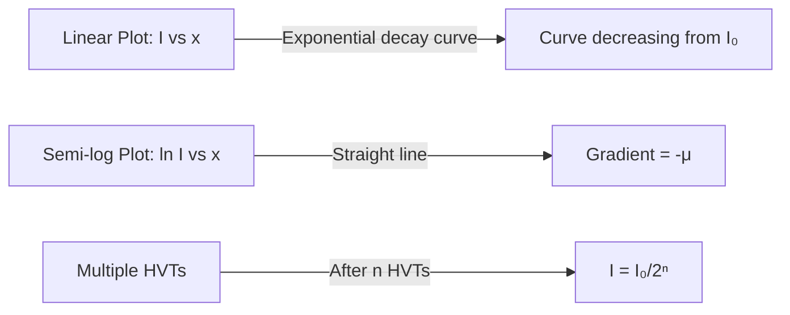

# 1. Overview / 概述

**English:**
Gamma rays are high-frequency electromagnetic radiation emitted from the nucleus of an excited atom during radioactive decay. Unlike alpha and beta particles, gamma rays are pure energy with no mass or charge, making them the most penetrating form of nuclear radiation. This sub-topic explores the fundamental properties of gamma rays, including their nature as electromagnetic waves, their emission mechanisms, and their distinctive behavior in terms of penetration, ionization, and interaction with matter. Understanding gamma rays is crucial for applications in [[Uses and Hazards of Radiation]] such as medical imaging, cancer treatment, and industrial sterilization, as well as for safety considerations in nuclear environments.

**中文:**
伽马射线是激发态原子核在放射性衰变过程中发射的高频电磁辐射。与α粒子和β粒子不同，伽马射线是纯能量，没有质量和电荷，因此是穿透力最强的核辐射形式。本子知识点探讨伽马射线的基本性质，包括其作为电磁波的本质、发射机制，以及在穿透性、电离能力和与物质相互作用方面的独特行为。理解伽马射线对于[[Uses and Hazards of Radiation]]中的应用（如医学成像、癌症治疗和工业灭菌）以及核环境中的安全考虑至关重要。

---

# 2. Syllabus Learning Objectives / 考纲学习目标

| CAIE 9702 | Edexcel IAL |
|-----------|-------------|
| 23.3(a): Describe the nature of gamma radiation as electromagnetic radiation of high energy | 8.11: Understand that gamma radiation is electromagnetic radiation emitted by excited nuclei |
| 23.3(b): State that gamma radiation has no mass and no charge | 8.12: Know that gamma rays have the highest frequency in the electromagnetic spectrum |
| 23.3(c): Describe the penetration and absorption of gamma radiation | 8.13: Describe the penetrating power of gamma radiation through different materials |
| 23.3(d): Explain the ionization properties of gamma radiation | 8.14: Understand that gamma radiation has low ionizing power |
| 23.3(e): Describe the detection of gamma radiation | 8.15: Describe the detection methods for gamma radiation |
| 23.3(f): Explain the origin of gamma radiation from nuclear de-excitation | 8.16: Explain the emission of gamma rays from excited nuclei |
| 23.3(g): Compare gamma radiation with alpha and beta radiation | — |
| 23.3(h): Describe the uses and hazards of gamma radiation | — |

**Examiner Expectations / 考官期望:**
- **CAIE:** Students must be able to compare gamma rays with [[Properties of Alpha Particles]] and [[Properties of Beta Particles]] in terms of nature, charge, mass, penetration, and ionization. Understand that gamma emission often accompanies alpha or beta decay.
- **Edexcel:** Focus on the electromagnetic nature of gamma rays, their position in the electromagnetic spectrum, and their practical applications. Be able to explain why gamma rays require thick lead or concrete for shielding.

---

# 3. Core Definitions / 核心定义

| Term (EN/CN) | Definition (EN) | Definition (CN) | Common Mistakes / 常见错误 |
|--------------|-----------------|-----------------|---------------------------|
| **Gamma Ray** / 伽马射线 | High-energy electromagnetic radiation emitted from an excited atomic nucleus during radioactive decay | 放射性衰变过程中，激发态原子核发射的高能电磁辐射 | ❌ Confusing gamma rays with X-rays (X-rays come from electron transitions, not nuclear) |
| **Nuclear De-excitation** / 核退激 | The process by which an excited nucleus returns to its ground state by emitting a gamma photon | 激发态原子核通过发射伽马光子回到基态的过程 | ❌ Thinking gamma emission changes the atomic number or mass number |
| **Penetrating Power** / 穿透能力 | The ability of radiation to pass through matter without being absorbed | 辐射穿过物质而不被吸收的能力 | ❌ Assuming gamma rays can penetrate all materials equally |
| **Ionizing Power** / 电离能力 | The ability of radiation to remove electrons from atoms, creating ions | 辐射从原子中移除电子、产生离子的能力 | ❌ Confusing high penetration with high ionization (gamma has low ionization) |
| **Half-Value Thickness (HVT)** / 半值厚度 | The thickness of a material required to reduce the intensity of gamma radiation by half | 将伽马辐射强度降低一半所需的材料厚度 | ❌ Using HVT for alpha or beta particles (they have different absorption characteristics) |
| **Gamma Photon** / 伽马光子 | A discrete quantum of gamma radiation energy, with energy E = hf | 伽马辐射能量的离散量子，能量为 E = hf | ❌ Forgetting that gamma rays exhibit both wave and particle properties |

---

# 4. Key Concepts Explained / 关键概念详解

## 4.1 Nature of Gamma Radiation / 伽马辐射的本质

### Explanation / 解释
**English:**
Gamma rays are electromagnetic waves with wavelengths typically in the range of $10^{-12}$ to $10^{-10}$ m, corresponding to frequencies of $10^{18}$ to $10^{21}$ Hz. They are part of the [[Electromagnetic Spectrum]] and travel at the speed of light $c = 3.0 \times 10^8$ m/s in a vacuum. Unlike [[Properties of Alpha Particles]] and [[Properties of Beta Particles]], gamma rays have no rest mass ($m_0 = 0$) and no electric charge ($q = 0$). The energy of a gamma photon is given by $E = hf$, where $h = 6.63 \times 10^{-34}$ J·s is Planck's constant. Gamma rays are produced when an excited nucleus transitions from a higher energy state to a lower energy state, releasing the energy difference as a photon.

**中文:**
伽马射线是电磁波，波长通常在 $10^{-12}$ 到 $10^{-10}$ m 范围内，对应频率为 $10^{18}$ 到 $10^{21}$ Hz。它们是[[Electromagnetic Spectrum]]的一部分，在真空中以光速 $c = 3.0 \times 10^8$ m/s 传播。与[[Properties of Alpha Particles]]和[[Properties of Beta Particles]]不同，伽马射线没有静止质量（$m_0 = 0$）也没有电荷（$q = 0$）。伽马光子的能量由 $E = hf$ 给出，其中 $h = 6.63 \times 10^{-34}$ J·s 是普朗克常数。当激发态原子核从高能态跃迁到低能态时，释放能量差作为光子，从而产生伽马射线。

### Physical Meaning / 物理意义
**English:**
Gamma rays represent the release of excess energy from the nucleus without changing the composition of the nucleus. The atomic number (Z) and mass number (A) remain unchanged during gamma emission. This distinguishes gamma decay from alpha decay (which changes A by 4 and Z by 2) and beta decay (which changes Z by 1). Gamma emission often follows alpha or beta decay because the daughter nucleus is often left in an excited state.

**中文:**
伽马射线代表原子核释放多余能量而不改变原子核的组成。在伽马发射过程中，原子序数（Z）和质量数（A）保持不变。这使伽马衰变区别于α衰变（A减少4，Z减少2）和β衰变（Z改变1）。伽马发射通常发生在α或β衰变之后，因为子核通常处于激发态。

### Common Misconceptions / 常见误区
- ❌ **"Gamma rays are particles like alpha and beta"** — Gamma rays are electromagnetic waves/photons, not particles with mass
- ❌ **"Gamma emission changes the element"** — No, the atomic number remains unchanged
- ❌ **"All gamma rays have the same energy"** — Gamma ray energy depends on the specific nuclear transition
- ❌ **"Gamma rays are the same as X-rays"** — Both are EM waves, but gamma rays come from the nucleus while X-rays come from electron transitions

### Exam Tips / 考试提示
- **EN:** Remember the comparison table: gamma has highest penetration, lowest ionization, no charge, no mass
- **CN:** 记住对比表：伽马穿透力最强、电离能力最弱、无电荷、无质量

> 📷 **IMAGE PROMPT — GAMMA-01: Electromagnetic Spectrum Showing Gamma Rays**
> A clear diagram of the electromagnetic spectrum from radio waves to gamma rays, with gamma rays at the highest frequency end. Labels show wavelength decreasing from left to right, frequency increasing. Include typical wavelength range for gamma rays (10^-12 to 10^-10 m) and note that gamma rays have the shortest wavelength and highest frequency.

## 4.2 Emission Mechanism / 发射机制

### Explanation / 解释
**English:**
Gamma emission occurs when a nucleus is in an excited state. This excitation can result from:
1. **Following alpha or beta decay:** The daughter nucleus is often produced in an excited state and immediately de-excites by emitting one or more gamma photons
2. **Nuclear reactions:** When a nucleus absorbs energy from collisions or neutron capture
3. **Radioactive decay of metastable states:** Some nuclei remain in excited states for measurable times (isomers)

The energy of the emitted gamma photon equals the energy difference between the initial and final nuclear energy levels: $E_\gamma = E_i - E_f = hf$. A nucleus can emit multiple gamma photons in cascade as it returns to ground state through intermediate energy levels.

**中文:**
伽马发射发生在原子核处于激发态时。这种激发可能来自：
1. **α或β衰变之后：** 子核通常处于激发态，立即通过发射一个或多个伽马光子退激
2. **核反应：** 原子核从碰撞或中子俘获中吸收能量
3. **亚稳态的放射性衰变：** 某些原子核在激发态停留可测量的时间（同质异能素）

发射的伽马光子能量等于初态和末态核能级之间的能量差：$E_\gamma = E_i - E_f = hf$。原子核可以通过中间能级级联发射多个伽马光子，最终回到基态。

### Physical Meaning / 物理意义
**English:**
The discrete energy levels in the nucleus produce gamma rays with specific, characteristic energies. This is analogous to atomic emission spectra but with much higher energies (keV to MeV range). The gamma spectrum of a radioactive source can be used to identify the isotope, similar to a fingerprint.

**中文:**
原子核中的离散能级产生具有特定特征能量的伽马射线。这类似于原子发射光谱，但能量高得多（keV到MeV范围）。放射源的伽马光谱可用于识别同位素，类似于指纹。

### Common Misconceptions / 常见误区
- ❌ **"Gamma decay is a separate type of radioactive decay"** — Gamma emission is a de-excitation process, not a decay that changes the nucleus
- ❌ **"Gamma rays are always emitted alone"** — Gamma emission often accompanies alpha or beta decay
- ❌ **"The nucleus is unchanged after gamma emission"** — The nucleus changes from excited to ground state, but composition remains same

### Exam Tips / 考试提示
- **EN:** Be able to write nuclear equations showing gamma emission: $^A_Z\text{X}^* \rightarrow ^A_Z\text{X} + \gamma$ (the asterisk denotes excited state)
- **CN:** 能够写出显示伽马发射的核方程：$^A_Z\text{X}^* \rightarrow ^A_Z\text{X} + \gamma$（星号表示激发态）

> 📷 **IMAGE PROMPT — GAMMA-02: Nuclear Energy Level Diagram Showing Gamma Emission**
> A diagram showing nuclear energy levels (ground state and two excited states). Arrows indicate gamma transitions from excited states to ground state, with labels showing energy differences E1 and E2. Include a note that the energy of each gamma photon equals the energy difference between levels.

## 4.3 Penetration and Absorption / 穿透与吸收

### Explanation / 解释
**English:**
Gamma rays have the highest penetrating power among the three types of nuclear radiation. This is because they have no charge and no mass, so they interact less frequently with matter. Gamma rays can penetrate several centimeters of lead or several meters of concrete. The absorption of gamma radiation follows an exponential law:

$$ I = I_0 e^{-\mu x} $$

where $I_0$ is the initial intensity, $I$ is the intensity after passing through thickness $x$, and $\mu$ is the linear attenuation coefficient (depends on material and gamma energy).

The **half-value thickness (HVT)** is related to $\mu$ by:

$$ x_{1/2} = \frac{\ln 2}{\mu} $$

**中文:**
伽马射线在三种核辐射中具有最强的穿透力。这是因为它们没有电荷和质量，与物质相互作用的频率较低。伽马射线可以穿透几厘米厚的铅或几米厚的混凝土。伽马辐射的吸收遵循指数规律：

$$ I = I_0 e^{-\mu x} $$

其中 $I_0$ 是初始强度，$I$ 是穿过厚度 $x$ 后的强度，$\mu$ 是线性衰减系数（取决于材料和伽马能量）。

**半值厚度（HVT）** 与 $\mu$ 的关系为：

$$ x_{1/2} = \frac{\ln 2}{\mu} $$

### Physical Meaning / 物理意义
**English:**
The exponential absorption means that gamma rays never have a definite "range" like alpha or beta particles. Instead, the intensity decreases continuously. The three main interaction mechanisms are:
1. **Photoelectric effect** (dominant at low energies)
2. **Compton scattering** (dominant at intermediate energies)
3. **Pair production** (dominant at high energies, >1.02 MeV)

**中文:**
指数吸收意味着伽马射线不像α或β粒子那样有确定的"射程"。相反，强度是连续减小的。三种主要的相互作用机制是：
1. **光电效应**（低能量时占主导）
2. **康普顿散射**（中等能量时占主导）
3. **电子对产生**（高能量时占主导，>1.02 MeV）

### Common Misconceptions / 常见误区
- ❌ **"Gamma rays have a maximum range like alpha particles"** — Gamma absorption is exponential, not a fixed range
- ❌ **"Lead stops all gamma rays completely"** — Lead only reduces intensity; some gamma rays always penetrate
- ❌ **"Thicker shielding always helps proportionally"** — Each HVT reduces intensity by half, so diminishing returns apply

### Exam Tips / 考试提示
- **EN:** Know typical HVT values: lead ~1-2 cm, concrete ~10-20 cm for common gamma energies
- **CN:** 记住典型HVT值：铅约1-2 cm，混凝土约10-20 cm（对于常见伽马能量）

> 📷 **IMAGE PROMPT — GAMMA-03: Exponential Absorption of Gamma Rays**
> A graph showing intensity I on the y-axis vs. thickness x on the x-axis. The curve shows exponential decay. Mark the half-value thickness x_1/2 where I = I_0/2. Include a second curve for a different material to show different absorption rates.

---

# 5. Essential Equations / 核心公式

## Equation 1: Gamma Photon Energy

$$ E = hf = \frac{hc}{\lambda} $$

| Symbol (符号) | Meaning (EN) | Meaning (CN) | Unit (单位) |
|--------------|-------------|-------------|------------|
| $E$ | Energy of gamma photon | 伽马光子能量 | J or eV |
| $h$ | Planck's constant ($6.63 \times 10^{-34}$ J·s) | 普朗克常数 | J·s |
| $f$ | Frequency of gamma radiation | 伽马辐射频率 | Hz |
| $c$ | Speed of light ($3.0 \times 10^8$ m/s) | 光速 | m/s |
| $\lambda$ | Wavelength of gamma radiation | 伽马辐射波长 | m |

**Derivation / 推导:** From Planck's quantum theory: energy of a photon is proportional to its frequency.

**Conditions / 适用条件:** All gamma photons; also applies to all electromagnetic radiation.

**Limitations / 局限性:** Does not account for relativistic effects (not needed at A-Level).

## Equation 2: Exponential Absorption Law

$$ I = I_0 e^{-\mu x} $$

| Symbol (符号) | Meaning (EN) | Meaning (CN) | Unit (单位) |
|--------------|-------------|-------------|------------|
| $I$ | Intensity after absorption | 吸收后的强度 | W/m² or counts/s |
| $I_0$ | Initial intensity | 初始强度 | W/m² or counts/s |
| $\mu$ | Linear attenuation coefficient | 线性衰减系数 | m⁻¹ |
| $x$ | Thickness of absorber | 吸收体厚度 | m |

**Derivation / 推导:** The rate of decrease in intensity is proportional to the intensity: $dI/dx = -\mu I$. Solving this differential equation gives $I = I_0 e^{-\mu x}$.

**Conditions / 适用条件:** Narrow beam geometry; monoenergetic gamma rays; homogeneous absorber.

**Limitations / 局限性:** Does not account for scattered radiation reaching the detector (broad beam geometry requires buildup factors).

## Equation 3: Half-Value Thickness

$$ x_{1/2} = \frac{\ln 2}{\mu} = \frac{0.693}{\mu} $$

| Symbol (符号) | Meaning (EN) | Meaning (CN) | Unit (单位) |
|--------------|-------------|-------------|------------|
| $x_{1/2}$ | Half-value thickness | 半值厚度 | m |
| $\mu$ | Linear attenuation coefficient | 线性衰减系数 | m⁻¹ |

**Derivation / 推导:** Set $I = I_0/2$ in the absorption equation: $I_0/2 = I_0 e^{-\mu x_{1/2}}$, then $\ln(1/2) = -\mu x_{1/2}$, so $x_{1/2} = \ln 2 / \mu$.

**Conditions / 适用条件:** Same as exponential absorption law.

**Limitations / 局限性:** HVT depends on both the material and the gamma energy.

> 📋 **CIE Only:** Students should be able to use the exponential absorption equation to calculate half-value thickness and solve problems involving multiple HVTs.

> 📋 **Edexcel Only:** Focus on qualitative understanding of penetration and the concept that gamma rays require thick shielding.

---

# 6. Graphs and Relationships / 图表与关系

## 6.1 Gamma Absorption Graph / 伽马吸收图

### Axes / 坐标轴
- **X-axis:** Thickness of absorber (x) / 吸收体厚度 (x)
- **Y-axis:** Intensity of gamma radiation (I) / 伽马辐射强度 (I)

### Shape / 形状
**English:** Exponential decay curve. Starts at $I_0$ when $x = 0$, decreases rapidly initially, then more slowly. Never reaches zero asymptotically.

**中文:** 指数衰减曲线。当 $x = 0$ 时从 $I_0$ 开始，初始下降迅速，然后逐渐变慢。渐近地趋近于零但永远不会达到零。

### Gradient Meaning / 斜率含义
**English:** The gradient at any point is $dI/dx = -\mu I$, which is negative and proportional to the intensity. The gradient becomes less steep as thickness increases.

**中文:** 任意点的斜率为 $dI/dx = -\mu I$，为负值且与强度成正比。随着厚度增加，斜率变缓。

### Area Meaning / 面积含义
**English:** The area under the curve has no direct physical meaning in this context.

**中文:** 曲线下的面积在此上下文中没有直接的物理意义。

### Exam Interpretation / 考试解读
**English:** 
- The graph shows that gamma rays do not have a definite range
- Each HVT reduces intensity by exactly half
- A semi-log plot ($\ln I$ vs $x$) gives a straight line with gradient $-\mu$
- Compare with alpha (sharp cutoff) and beta (approximately exponential but with range)

**中文:**
- 图表显示伽马射线没有确定的射程
- 每个HVT将强度精确降低一半
- 半对数图（$\ln I$ 对 $x$）给出斜率为 $-\mu$ 的直线
- 与α（锐截止）和β（近似指数但有射程）比较

## 6.2 Comparison of Penetration: Alpha, Beta, Gamma / α、β、γ穿透力比较

### Axes / 坐标轴
- **X-axis:** Thickness of absorber / 吸收体厚度
- **Y-axis:** Relative intensity / 相对强度

### Shape / 形状
**English:** Three distinct curves:
- Alpha: Sharp drop to zero at ~5 cm in air
- Beta: Gradual decrease to zero at ~1 m in air
- Gamma: Exponential decay, never reaching zero

**中文:** 三条不同的曲线：
- α：在空气中约5 cm处急剧降至零
- β：在空气中约1 m处逐渐降至零
- γ：指数衰减，永不达到零

> 📷 **IMAGE PROMPT — GAMMA-04: Comparison of Alpha, Beta, Gamma Penetration**
> A graph showing three curves on the same axes. Alpha shows a sharp cutoff at short distance. Beta shows a gradual decrease to zero at medium distance. Gamma shows exponential decay continuing beyond the graph. Label each curve clearly.

---

# 7. Required Diagrams / 必备图表

## 7.1 Gamma Emission from Excited Nucleus / 激发态原子核的伽马发射

### Description / 描述
**English:** A diagram showing a nucleus in an excited state (denoted by *) transitioning to a lower energy state by emitting a gamma photon. The diagram should show the energy levels within the nucleus and the gamma photon being released.

**中文:** 显示激发态原子核（用*表示）通过发射伽马光子跃迁到较低能态的示意图。应显示原子核内的能级和释放的伽马光子。

### Image Prompt / 图片生成提示
> 📷 **IMAGE PROMPT — GAMMA-05: Nuclear De-excitation and Gamma Emission**
> A clear educational diagram showing a nucleus represented as a cluster of protons (red) and neutrons (blue). The nucleus is labeled "Excited State" with an asterisk. An arrow shows the transition to "Ground State" with a wavy line representing the emitted gamma photon. Energy levels are shown as horizontal lines on the side. Labels: "Gamma Photon (γ)", "Excited Nucleus", "Ground State Nucleus", "Energy Released = hf". Clean, textbook-style illustration.

### Labels Required / 需要标注
- Excited nucleus / 激发态原子核
- Ground state nucleus / 基态原子核
- Gamma photon (γ) / 伽马光子 (γ)
- Energy levels / 能级
- Energy difference (ΔE = hf) / 能量差 (ΔE = hf)

### Exam Importance / 考试重要性
**English:** High. Students must be able to explain that gamma emission does not change the atomic number or mass number, and that it often accompanies alpha or beta decay.

**中文:** 高。学生必须能够解释伽马发射不改变原子序数或质量数，并且通常伴随α或β衰变。

## 7.2 Gamma Absorption Setup / 伽马吸收实验装置

### Description / 描述
**English:** A diagram showing the experimental setup for measuring gamma absorption. Includes a gamma source, collimator, absorber material of variable thickness, and a detector (Geiger-Müller tube or scintillation detector) connected to a counter.

**中文:** 显示测量伽马吸收的实验装置图。包括伽马源、准直器、可变厚度的吸收材料，以及连接到计数器的探测器（盖革-米勒管或闪烁探测器）。

### Image Prompt / 图片生成提示
> 📷 **IMAGE PROMPT — GAMMA-06: Gamma Absorption Experiment Setup**
> A schematic diagram showing from left to right: a shielded gamma source (with "γ" symbol), a lead collimator with a narrow slit, a series of absorber plates (labeled "Lead Absorber" with variable thickness), and a Geiger-Müller tube connected to a counter/ratemeter. Arrows show the gamma beam path. Labels: "Gamma Source", "Collimator", "Absorber (variable thickness)", "GM Tube", "Counter". Clean, technical illustration style.

### Labels Required / 需要标注
- Gamma source / 伽马源
- Lead collimator / 铅准直器
- Absorber (variable thickness) / 吸收体（可变厚度）
- Geiger-Müller tube / 盖革-米勒管
- Counter/Ratemeter / 计数器/速率计

### Exam Importance / 考试重要性
**English:** Medium. Understanding the experimental setup helps students interpret absorption data and understand the exponential nature of gamma absorption.

**中文:** 中等。理解实验装置有助于学生解释吸收数据并理解伽马吸收的指数性质。

---

# 8. Worked Examples / 典型例题

## Example 1: Gamma Energy Calculation / 伽马能量计算

### Question / 题目
**English:**
A cobalt-60 source emits gamma rays with a wavelength of $1.20 \times 10^{-12}$ m. Calculate:
(a) The frequency of the gamma radiation
(b) The energy of each gamma photon in joules
(c) The energy in MeV (1 MeV = $1.60 \times 10^{-13}$ J)

**中文:**
一个钴-60源发射波长为 $1.20 \times 10^{-12}$ m 的伽马射线。计算：
(a) 伽马辐射的频率
(b) 每个伽马光子的能量（焦耳）
(c) 以MeV为单位的能量（1 MeV = $1.60 \times 10^{-13}$ J）

### Solution / 解答

**Step 1: Calculate frequency**
$$ f = \frac{c}{\lambda} = \frac{3.0 \times 10^8}{1.20 \times 10^{-12}} = 2.50 \times 10^{20} \text{ Hz} $$

**Step 2: Calculate energy in joules**
$$ E = hf = (6.63 \times 10^{-34})(2.50 \times 10^{20}) = 1.66 \times 10^{-13} \text{ J} $$

**Step 3: Convert to MeV**
$$ E = \frac{1.66 \times 10^{-13}}{1.60 \times 10^{-13}} = 1.04 \text{ MeV} $$

### Final Answer / 最终答案
**Answer:** (a) $2.50 \times 10^{20}$ Hz, (b) $1.66 \times 10^{-13}$ J, (c) 1.04 MeV
**答案：** (a) $2.50 \times 10^{20}$ Hz，(b) $1.66 \times 10^{-13}$ J，(c) 1.04 MeV

### Quick Tip / 提示
**English:** Remember that gamma energies are typically in the MeV range. If your answer is much smaller (eV range), check your calculation.
**中文：** 记住伽马能量通常在MeV范围内。如果答案小得多（eV范围），请检查计算。

---

## Example 2: Half-Value Thickness Problem / 半值厚度问题

### Question / 题目
**English:**
The half-value thickness of lead for gamma rays from a certain source is 1.5 cm. A lead shield of thickness 6.0 cm is placed between the source and a detector. Calculate:
(a) The fraction of gamma rays that penetrate the shield
(b) The number of half-value thicknesses in the shield
(c) The thickness of lead required to reduce the intensity to 1% of its original value

**中文:**
某种伽马射线在铅中的半值厚度为1.5 cm。在源和探测器之间放置厚度为6.0 cm的铅屏蔽层。计算：
(a) 穿透屏蔽层的伽马射线比例
(b) 屏蔽层中的半值厚度数量
(c) 将强度降低到原始值的1%所需的铅厚度

### Solution / 解答

**Step 1: Calculate number of HVTs**
$$ n = \frac{x}{x_{1/2}} = \frac{6.0}{1.5} = 4 $$

**Step 2: Calculate fraction transmitted**
$$ \frac{I}{I_0} = \left(\frac{1}{2}\right)^n = \left(\frac{1}{2}\right)^4 = \frac{1}{16} = 0.0625 $$

**Step 3: Calculate thickness for 1% transmission**
$$ \frac{I}{I_0} = 0.01 = \left(\frac{1}{2}\right)^n $$
$$ \ln(0.01) = n \ln(0.5) $$
$$ n = \frac{\ln(0.01)}{\ln(0.5)} = \frac{-4.605}{-0.693} = 6.64 $$
$$ x = n \times x_{1/2} = 6.64 \times 1.5 = 9.96 \text{ cm} $$

### Final Answer / 最终答案
**Answer:** (a) 1/16 or 6.25%, (b) 4 HVTs, (c) 10.0 cm (to 3 s.f.)
**答案：** (a) 1/16 或 6.25%，(b) 4个HVT，(c) 10.0 cm（3位有效数字）

### Quick Tip / 提示
**English:** For HVT problems, use the "halving" method: after n HVTs, intensity = I₀/2ⁿ. For non-integer n, use logarithms.
**中文：** 对于HVT问题，使用"减半"方法：经过n个HVT后，强度 = I₀/2ⁿ。对于非整数n，使用对数。

---

# 9. Past Paper Question Types / 历年真题题型

| Question Type / 题型 | Frequency / 频率 | Difficulty / 难度 | Past Paper References / 真题索引 |
|----------------------|------------------|------------------|-------------------------------|
| Multiple choice: Properties of gamma rays | High | Easy | 📝 *待填入* |
| Calculation: Gamma photon energy | Medium | Medium | 📝 *待填入* |
| Calculation: Half-value thickness | Medium | Medium | 📝 *待填入* |
| Comparison: Alpha, beta, gamma properties | High | Medium | 📝 *待填入* |
| Explanation: Gamma emission mechanism | Medium | Medium | 📝 *待填入* |
| Graph: Exponential absorption | Low | Hard | 📝 *待填入* |
| Practical: Absorption experiment design | Low | Hard | 📝 *待填入* |

**Common Command Words / 常见指令词:**
- **State / 陈述:** Give a fact without explanation (e.g., "State the nature of gamma radiation")
- **Explain / 解释:** Give reasons (e.g., "Explain why gamma rays have high penetrating power")
- **Calculate / 计算:** Use mathematics (e.g., "Calculate the energy of a gamma photon")
- **Compare / 比较:** Describe similarities and differences (e.g., "Compare the properties of alpha, beta, and gamma radiation")
- **Describe / 描述:** Give a detailed account (e.g., "Describe how gamma rays are produced in radioactive decay")

---

# 10. Practical Skills Connections / 实验技能链接

**English:**
This sub-topic connects to practical work in several ways:

1. **Gamma Absorption Experiment:** Students measure the count rate from a gamma source through different thicknesses of lead. Data is plotted as count rate vs. thickness to demonstrate exponential absorption. A semi-log plot ($\ln I$ vs $x$) should yield a straight line, confirming the exponential relationship.

2. **Background Radiation:** Before any gamma measurement, background count must be measured and subtracted. This reinforces the importance of background correction in all radiation experiments.

3. **Uncertainty Analysis:** Count rates follow Poisson statistics, so the uncertainty is $\sqrt{N}$ where N is the number of counts. Students should calculate and plot error bars.

4. **Inverse Square Law:** For gamma sources, the intensity also follows the inverse square law with distance. This can be investigated separately from absorption.

5. **Safety Considerations:** Gamma sources require careful handling with tongs, shielding, and minimal exposure time. Students must understand ALARP (As Low As Reasonably Practicable) principles.

**中文:**
本子知识点通过以下方式与实验工作联系：

1. **伽马吸收实验：** 学生测量伽马源通过不同厚度铅的计数率。数据绘制为计数率对厚度的图表，以展示指数吸收。半对数图（$\ln I$ 对 $x$）应产生直线，确认指数关系。

2. **本底辐射：** 在任何伽马测量之前，必须测量并减去本底计数。这强化了在所有辐射实验中进行本底校正的重要性。

3. **不确定度分析：** 计数率遵循泊松统计，因此不确定度为 $\sqrt{N}$，其中N是计数次数。学生应计算并绘制误差棒。

4. **平方反比定律：** 对于伽马源，强度也随距离遵循平方反比定律。这可以与吸收分开研究。

5. **安全考虑：** 伽马源需要使用钳子、屏蔽和最小暴露时间小心处理。学生必须理解ALARP（合理可行的最低水平）原则。

---

# 11. Concept Map / 概念图谱

```mermaid
graph TD
    %% Core concept
    GAMMA[Gamma Rays / 伽马射线] --> NATURE[Nature: EM Waves / 本质：电磁波]
    GAMMA --> EMISSION[Emission Mechanism / 发射机制]
    GAMMA --> PROPERTIES[Key Properties / 关键性质]
    GAMMA --> APPLICATIONS[Applications / 应用]
    
    %% Nature
    NATURE --> NO_MASS[No Rest Mass / 无静止质量]
    NATURE --> NO_CHARGE[No Charge / 无电荷]
    NATURE --> SPEED[Speed = c / 速度 = c]
    NATURE --> ENERGY[E = hf / 能量 = hf]
    
    %% Emission
    EMISSION --> EXCITED[Excited Nucleus / 激发态原子核]
    EMISSION --> DE_EXCITE[Nuclear De-excitation / 核退激]
    EMISSION --> ACCOMPANY[Accompanies α/β Decay / 伴随α/β衰变]
    
    %% Properties
    PROPERTIES --> PENETRATION[High Penetration / 高穿透力]
    PROPERTIES --> IONIZATION[Low Ionization / 低电离能力]
    PROPERTIES --> ABSORPTION[Exponential Absorption / 指数吸收]
    
    %% Absorption details
    ABSORPTION --> HVT[Half-Value Thickness / 半值厚度]
    ABSORPTION --> MU[Attenuation Coefficient μ / 衰减系数 μ]
    ABSORPTION --> SHIELDING[Shielding: Lead/Concrete / 屏蔽：铅/混凝土]
    
    %% Comparisons
    GAMMA --> COMPARE[Comparison / 比较]
    COMPARE --> ALPHA[[Properties of Alpha Particles]]
    COMPARE --> BETA[[Properties of Beta Particles]]
    
    %% Connections
    GAMMA --> RADIOACTIVE[[Radioactive Decay]]
    GAMMA --> USES[[Uses and Hazards of Radiation]]
    GAMMA --> HALF_LIFE[[Half-Life and Activity]]
    
    %% Applications
    APPLICATIONS --> MEDICAL[Medical Imaging / 医学成像]
    APPLICATIONS --> STERILIZATION[Sterilization / 灭菌]
    APPLICATIONS --> INDUSTRY[Industrial Testing / 工业检测]
    
    %% Styling
    classDef core fill:#ff6b6b,color:white
    classDef property fill:#4ecdc4,color:white
    classDef application fill:#45b7d1,color:white
    classDef connection fill:#96ceb4,color:white
    
    class GAMMA core
    class NATURE,EMISSION,PROPERTIES,COMPARE property
    class APPLICATIONS application
    class ALPHA,BETA,RADIOACTIVE,USES,HALF_LIFE connection
```

---

# 12. Quick Revision Sheet / 速查表

| Category / 类别 | Key Points / 要点 |
|----------------|------------------|
| **Definition / 定义** | High-energy EM radiation from excited nuclei / 来自激发态原子核的高能电磁辐射 |
| **Nature / 本质** | Electromagnetic waves (photons), no mass, no charge / 电磁波（光子），无质量，无电荷 |
| **Speed / 速度** | $c = 3.0 \times 10^8$ m/s in vacuum / 真空中 $c = 3.0 \times 10^8$ m/s |
| **Key Formula / 核心公式** | $E = hf = hc/\lambda$; $I = I_0 e^{-\mu x}$; $x_{1/2} = \ln 2 / \mu$ |
| **Penetration / 穿透力** | Highest of all nuclear radiation; requires thick lead/concrete / 所有核辐射中最强；需要厚铅/混凝土 |
| **Ionization / 电离能力** | Lowest of all nuclear radiation / 所有核辐射中最弱 |
| **Emission / 发射** | Nuclear de-excitation; no change in Z or A / 核退激；Z和A不变 |
| **Key Graph / 核心图表** | Exponential decay: I vs x; Straight line: ln I vs x / 指数衰减：I对x；直线：ln I对x |
| **HVT / 半值厚度** | Thickness to reduce intensity by half; $x_{1/2} = 0.693/\mu$ / 将强度减半的厚度 |
| **Comparison / 比较** | Gamma: highest penetration, lowest ionization / γ：穿透最强，电离最弱 |
| **Detection / 探测** | Geiger-Müller tube, scintillation detector / 盖革-米勒管，闪烁探测器 |
| **Safety / 安全** | Requires thick shielding; ALARP principle / 需要厚屏蔽；ALARP原则 |
| **Exam Tip / 考试提示** | Gamma emission does NOT change the element! / 伽马发射不改变元素！ |
| **Common Mistake / 常见错误** | Confusing gamma with X-rays; thinking gamma has a range / 混淆伽马和X射线；认为伽马有射程 |

---

> 📋 **CIE Only:** Pay special attention to the comparison table for alpha, beta, and gamma radiation. Questions often ask for three properties to be compared (nature, charge, mass, penetration, ionization, deflection in electric/magnetic fields).

> 📋 **Edexcel Only:** Focus on the electromagnetic nature of gamma rays and their position at the high-frequency end of the electromagnetic spectrum. Be prepared to explain why gamma rays are used in medical tracers and sterilization.