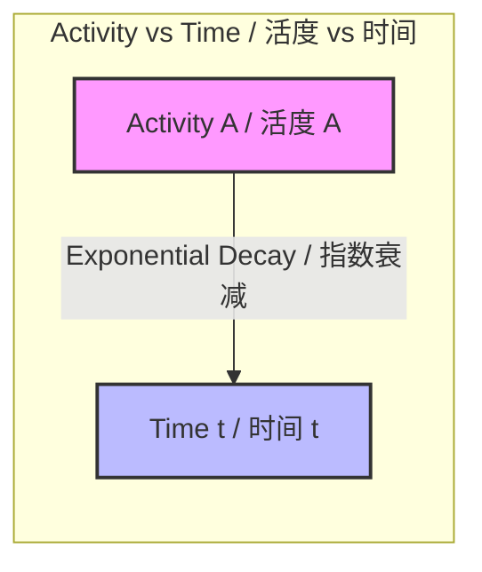

---
# Activity and the Becquerel / 活度和贝克勒尔

---

# 1. Overview / 概述

**English:**
This sub-topic introduces the concept of **radioactive activity** ($A$) — the rate at which a radioactive sample decays. Activity is a fundamental measurable quantity in nuclear physics, directly linking the microscopic decay constant ($\lambda$) to the macroscopic observable count rate. The **becquerel (Bq)** is the SI unit of activity, defined as one decay per second. Understanding activity is essential for interpreting half-life, radiation safety, and practical applications like medical imaging and nuclear power monitoring. This leaf node builds on [[Radioactive Decay]] and connects directly to [[Half-Life Definition and Calculation]] and [[Decay Constant]].

**中文:**
本子知识点介绍**放射性活度** ($A$) 的概念——即放射性样品衰变的速率。活度是核物理学中一个基本的可测量量，它将微观的衰变常数 ($\lambda$) 与宏观的可观测计数率直接联系起来。**贝克勒尔 (Bq)** 是活度的 SI 单位，定义为每秒一次衰变。理解活度对于解释半衰期、辐射安全以及医学成像和核能监测等实际应用至关重要。本叶节点建立在 [[Radioactive Decay]] 的基础上，并直接连接到 [[Half-Life Definition and Calculation]] 和 [[Decay Constant]]。

---

# 2. Syllabus Learning Objectives / 考纲学习目标

| CAIE 9702 | Edexcel IAL |
|-----------|-------------|
| 23.2(a) Define activity and the becquerel | 8.7 Define activity and the becquerel |
| 23.2(b) Use $A = \lambda N$ | 8.8 Use $A = \lambda N$ |
| 23.2(c) Solve problems using $A = A_0 e^{-\lambda t}$ | 8.9 Solve problems using $A = A_0 e^{-\lambda t}$ |
| 23.2(d) Relate activity to half-life | 8.10 Relate activity to half-life |
| 23.2(e) Understand background radiation correction | — |

**Examiner Expectations / 考官期望:**
- **English:** Students must be able to define activity precisely, convert between activity and count rate (accounting for background), and apply the exponential decay law to activity calculations. Graphical analysis of activity vs. time is frequently tested.
- **中文:** 学生必须能够精确定义活度，在活度和计数率之间进行转换（考虑本底辐射），并将指数衰变定律应用于活度计算。活度随时间变化的图形分析是常考内容。

---

# 3. Core Definitions / 核心定义

| Term (EN/CN) | Definition (EN) | Definition (CN) | Common Mistakes / 常见错误 |
|--------------|-----------------|-----------------|---------------------------|
| **Activity** / 活度 ($A$) | The number of radioactive decays per unit time in a sample. | 单位时间内样品中发生的放射性衰变次数。 | Confusing activity with count rate (count rate is measured by a detector and is always less than activity due to detector efficiency and geometry). |
| **Becquerel** / 贝克勒尔 (Bq) | The SI unit of activity; 1 Bq = 1 decay per second. | 活度的 SI 单位；1 Bq = 1 次衰变每秒。 | Thinking Bq is a measure of radiation energy (it is not; it is a measure of decay rate). |
| **Count Rate** / 计数率 | The number of detected radiation events per second, measured by a Geiger-Müller tube or other detector. | 探测器（如盖革-米勒管）每秒检测到的辐射事件数。 | Assuming count rate equals activity (it is always lower due to detector efficiency and geometry). |
| **Background Radiation** / 本底辐射 | Low-level ionizing radiation present in the environment from natural and artificial sources. | 环境中存在的来自天然和人工来源的低水平电离辐射。 | Forgetting to subtract background count rate from measured count rate to find corrected count rate. |
| **Decay Constant** / 衰变常数 ($\lambda$) | The probability per unit time that a given nucleus will decay. | 给定原子核在单位时间内发生衰变的概率。 | Confusing $\lambda$ with activity; $\lambda$ is a constant for a given isotope, while $A$ decreases over time. |

---

# 4. Key Concepts Explained / 关键概念详解

## 4.1 Activity and the Decay Law / 活度与衰变定律

### Explanation / 解释
**English:**
Activity ($A$) is directly proportional to the number of undecayed nuclei ($N$) present in the sample:
$$ A = \lambda N $$
where $\lambda$ is the [[Decay Constant]]. Since $N$ decreases exponentially over time ($N = N_0 e^{-\lambda t}$), activity also follows an exponential decay law:
$$ A = A_0 e^{-\lambda t} $$
where $A_0 = \lambda N_0$ is the initial activity. This means the activity halves every half-life, just like the number of nuclei.

**中文:**
活度 ($A$) 与样品中未衰变的原子核数 ($N$) 成正比：
$$ A = \lambda N $$
其中 $\lambda$ 是[[Decay Constant]]。由于 $N$ 随时间呈指数衰减 ($N = N_0 e^{-\lambda t}$)，活度也遵循指数衰变定律：
$$ A = A_0 e^{-\lambda t} $$
其中 $A_0 = \lambda N_0$ 是初始活度。这意味着活度每经过一个半衰期减半，就像原子核数量一样。

### Physical Meaning / 物理意义
**English:**
Activity tells us how "hot" or radioactive a sample is. A higher activity means more decays per second, which implies more radiation emitted. This is crucial for radiation safety — a sample with activity of 1 MBq (10⁶ Bq) emits one million particles per second.

**中文:**
活度告诉我们一个样品有多“热”或多放射性。活度越高，意味着每秒衰变次数越多，即发射的辐射越多。这对辐射安全至关重要——活度为 1 MBq (10⁶ Bq) 的样品每秒发射一百万个粒子。

### Common Misconceptions / 常见误区
- **English:**
  - "Activity is the same as count rate." → No, count rate is always less than activity because detectors are not 100% efficient and only cover a fraction of the solid angle.
  - "Activity is constant over time." → No, activity decreases exponentially unless the sample is being replenished (e.g., in a nuclear reactor).
  - "Becquerel measures radiation dose." → No, Bq measures decay rate; dose is measured in sieverts (Sv) or grays (Gy).

- **中文:**
  - “活度等于计数率。” → 不对，计数率总是小于活度，因为探测器效率不是 100%，且只覆盖部分立体角。
  - “活度随时间保持不变。” → 不对，除非样品在不断补充（例如在核反应堆中），否则活度呈指数下降。
  - “贝克勒尔测量辐射剂量。” → 不对，Bq 测量衰变速率；剂量以希沃特 (Sv) 或戈瑞 (Gy) 为单位。

### Exam Tips / 考试提示
- **English:** Always check if the question gives you "count rate" or "activity". If count rate is given, you may need to subtract background radiation first. Use the exponential decay equation $A = A_0 e^{-\lambda t}$ for continuous decay problems.
- **中文:** 始终检查题目给的是“计数率”还是“活度”。如果给的是计数率，可能需要先减去本底辐射。对于连续衰变问题，使用指数衰变方程 $A = A_0 e^{-\lambda t}$。

> 📷 **IMAGE PROMPT — ACT-01: Exponential Decay of Activity**
> A clear graph showing activity (A) on the y-axis vs. time (t) on the x-axis. The curve starts at A₀ and decays exponentially, with the half-life (T₁/₂) marked at the point where A = A₀/2. The curve should be smooth and labeled with key points. Include a second curve showing the number of undecayed nuclei (N) for comparison, showing they have the same shape.

---

# 5. Essential Equations / 核心公式

## Equation 1: Activity Definition / 活度定义

$$ A = \frac{\Delta N}{\Delta t} $$

| Symbol (符号) | Meaning (EN) | Meaning (CN) | Unit (单位) |
|--------------|-------------|-------------|------------|
| $A$ | Activity | 活度 | Bq (s⁻¹) |
| $\Delta N$ | Number of decays | 衰变次数 | dimensionless |
| $\Delta t$ | Time interval | 时间间隔 | s |

**Conditions / 适用条件:** For a short time interval where the decay rate is approximately constant. For continuous decay, use $A = \lambda N$.

## Equation 2: Activity and Decay Constant / 活度与衰变常数

$$ A = \lambda N $$

| Symbol (符号) | Meaning (EN) | Meaning (CN) | Unit (单位) |
|--------------|-------------|-------------|------------|
| $A$ | Activity | 活度 | Bq |
| $\lambda$ | Decay constant | 衰变常数 | s⁻¹ |
| $N$ | Number of undecayed nuclei | 未衰变原子核数 | dimensionless |

**Derivation / 推导:** From $A = \frac{dN}{dt}$ and $\frac{dN}{dt} = -\lambda N$, taking magnitude gives $A = \lambda N$.

**Conditions / 适用条件:** Valid for any radioactive sample at any instant.

## Equation 3: Exponential Decay of Activity / 活度的指数衰变

$$ A = A_0 e^{-\lambda t} $$

| Symbol (符号) | Meaning (EN) | Meaning (CN) | Unit (单位) |
|--------------|-------------|-------------|------------|
| $A$ | Activity at time $t$ | 时刻 $t$ 的活度 | Bq |
| $A_0$ | Initial activity at $t=0$ | 初始活度 ($t=0$) | Bq |
| $\lambda$ | Decay constant | 衰变常数 | s⁻¹ |
| $t$ | Time elapsed | 经过的时间 | s |

**Conditions / 适用条件:** Single radioactive isotope, no production of the isotope during decay.

**Limitations / 局限性:** Does not apply to decay chains where daughter products are also radioactive (e.g., uranium series).

## Equation 4: Activity and Half-Life / 活度与半衰期

$$ A = A_0 \left(\frac{1}{2}\right)^{t/T_{1/2}} $$

| Symbol (符号) | Meaning (EN) | Meaning (CN) | Unit (单位) |
|--------------|-------------|-------------|------------|
| $A$ | Activity at time $t$ | 时刻 $t$ 的活度 | Bq |
| $A_0$ | Initial activity | 初始活度 | Bq |
| $t$ | Time elapsed | 经过的时间 | s |
| $T_{1/2}$ | Half-life | 半衰期 | s |

**Derivation / 推导:** From $A = A_0 e^{-\lambda t}$ and $\lambda = \frac{\ln 2}{T_{1/2}}$.

---

# 6. Graphs and Relationships / 图表与关系

## 6.1 Activity vs. Time Graph / 活度-时间图

### Axes / 坐标轴
- **X-axis:** Time ($t$) / 时间 ($t$)
- **Y-axis:** Activity ($A$) / 活度 ($A$)

### Shape / 形状
**English:** Exponential decay curve — starts at $A_0$ on the y-axis, decreases rapidly at first, then more slowly, asymptotically approaching zero but never reaching it.

**中文:** 指数衰减曲线——从 y 轴上的 $A_0$ 开始，先快速下降，然后变慢，渐近地趋近于零但永远不会达到零。

### Gradient Meaning / 斜率含义
**English:** The gradient at any point is $-\lambda A$, representing the rate of change of activity. The gradient is always negative and becomes less steep over time.

**中文:** 任意点的斜率为 $-\lambda A$，表示活度的变化率。斜率始终为负，并随时间变缓。

### Area Meaning / 面积含义
**English:** The area under the activity-time graph from $t=0$ to $t=\infty$ equals the total number of decays that will ever occur, which is $N_0$ (the initial number of nuclei).

**中文:** 从 $t=0$ 到 $t=\infty$ 的活度-时间图下的面积等于将发生的总衰变次数，即 $N_0$（初始原子核数）。

### Exam Interpretation / 考试解读
**English:** Be able to read half-life from the graph: find the time when activity drops to half its initial value. Also be able to determine $\lambda$ from the graph using $\lambda = \frac{\ln 2}{T_{1/2}}$.

**中文:** 能够从图中读取半衰期：找到活度降至初始值一半的时间。也能够使用 $\lambda = \frac{\ln 2}{T_{1/2}}$ 从图中确定 $\lambda$。



---

# 7. Required Diagrams / 必备图表

## 7.1 Activity Decay Curve with Half-Life Marked / 带半衰期标记的活度衰变曲线

### Description / 描述
**English:** A graph showing activity ($A$) on the y-axis against time ($t$) on the x-axis. The curve starts at $A_0$ and decays exponentially. The half-life $T_{1/2}$ is marked at the point where $A = A_0/2$. A second half-life is marked where $A = A_0/4$.

**中文:** 一个图表，y 轴为活度 ($A$)，x 轴为时间 ($t$)。曲线从 $A_0$ 开始并呈指数衰减。半衰期 $T_{1/2}$ 标记在 $A = A_0/2$ 的点上。第二个半衰期标记在 $A = A_0/4$ 处。

### Image Prompt / 图片生成提示
> 📷 **IMAGE PROMPT — ACT-02: Activity Decay Curve with Half-Life Markers**
> A professional physics graph with "Activity / Bq" on the y-axis (0 to A₀) and "Time / s" on the x-axis (0 to 5 half-lives). The exponential decay curve starts at A₀ and decreases smoothly. Vertical dashed lines mark t = T₁/₂, 2T₁/₂, 3T₁/₂, 4T₁/₂. Horizontal dashed lines mark A = A₀/2, A₀/4, A₀/8, A₀/16. The curve should be clearly labeled with A₀, T₁/₂, and the half-life points. Clean white background, suitable for A-Level physics.

### Labels Required / 需要标注
- **English:** $A_0$ (initial activity), $T_{1/2}$ (half-life), $A_0/2$, $A_0/4$, $A_0/8$, $A_0/16$
- **中文:** $A_0$ (初始活度), $T_{1/2}$ (半衰期), $A_0/2$, $A_0/4$, $A_0/8$, $A_0/16$

### Exam Importance / 考试重要性
**English:** High — students are often asked to determine half-life from an activity-time graph or to sketch the decay curve given initial activity and half-life.

**中文:** 高——学生经常被要求从活度-时间图中确定半衰期，或根据初始活度和半衰期绘制衰变曲线。

---

# 8. Worked Examples / 典型例题

## Example 1: Calculating Activity from Number of Nuclei / 从原子核数计算活度

### Question / 题目
**English:**
A sample contains $2.0 \times 10^{12}$ undecayed nuclei of a radioactive isotope with decay constant $\lambda = 3.5 \times 10^{-4} \text{ s}^{-1}$.
(a) Calculate the initial activity of the sample.
(b) Calculate the activity after 30 minutes.

**中文:**
一个样品含有 $2.0 \times 10^{12}$ 个未衰变的放射性同位素原子核，衰变常数 $\lambda = 3.5 \times 10^{-4} \text{ s}^{-1}$。
(a) 计算样品的初始活度。
(b) 计算 30 分钟后的活度。

### Solution / 解答

**Part (a):**
$$ A_0 = \lambda N_0 = (3.5 \times 10^{-4})(2.0 \times 10^{12}) = 7.0 \times 10^8 \text{ Bq} $$

**Part (b):**
First, convert 30 minutes to seconds:
$$ t = 30 \times 60 = 1800 \text{ s} $$

Using $A = A_0 e^{-\lambda t}$:
$$ A = (7.0 \times 10^8) e^{-(3.5 \times 10^{-4})(1800)} $$
$$ A = (7.0 \times 10^8) e^{-0.63} $$
$$ A = (7.0 \times 10^8)(0.5326) $$
$$ A = 3.73 \times 10^8 \text{ Bq} $$

### Final Answer / 最终答案
**Answer:** (a) $7.0 \times 10^8$ Bq | (b) $3.73 \times 10^8$ Bq
**答案：** (a) $7.0 \times 10^8$ Bq | (b) $3.73 \times 10^8$ Bq

### Quick Tip / 提示
**English:** Always check units — time must be in seconds when using $\lambda$ in s⁻¹. For part (b), you could also use the half-life form: first find $T_{1/2} = \frac{\ln 2}{\lambda}$, then use $A = A_0(1/2)^{t/T_{1/2}}$.

**中文:** 始终检查单位——当 $\lambda$ 以 s⁻¹ 为单位时，时间必须用秒。对于 (b) 部分，也可以使用半衰期形式：先求 $T_{1/2} = \frac{\ln 2}{\lambda}$，然后使用 $A = A_0(1/2)^{t/T_{1/2}}$。

---

## Example 2: Background Correction and Activity / 本底校正与活度

### Question / 题目
**English:**
A Geiger-Müller tube measures a count rate of 245 counts per minute from a radioactive source. The background count rate is 25 counts per minute. The detector has an efficiency of 12% (i.e., it detects 12% of all decays).
(a) Calculate the corrected count rate from the source.
(b) Calculate the activity of the source.

**中文:**
盖革-米勒管测得一个放射源的计数率为每分钟 245 次。本底计数率为每分钟 25 次。探测器的效率为 12%（即检测到所有衰变的 12%）。
(a) 计算来自放射源的校正计数率。
(b) 计算放射源的活度。

### Solution / 解答

**Part (a):**
Corrected count rate = Measured count rate - Background count rate
$$ = 245 - 25 = 220 \text{ counts per minute} $$

**Part (b):**
Activity = Corrected count rate / Efficiency
$$ A = \frac{220}{0.12} = 1833.3 \text{ counts per minute} $$

Convert to Bq (per second):
$$ A = \frac{1833.3}{60} = 30.6 \text{ Bq} $$

### Final Answer / 最终答案
**Answer:** (a) 220 counts/min | (b) 30.6 Bq
**答案：** (a) 220 次/分钟 | (b) 30.6 Bq

### Quick Tip / 提示
**English:** Remember: Activity > Count rate. The efficiency factor accounts for the fact that detectors cannot detect every decay. Always subtract background before dividing by efficiency.

**中文:** 记住：活度 > 计数率。效率因子解释了探测器无法检测到每次衰变的事实。在除以效率之前，务必先减去本底。

---

# 9. Past Paper Question Types / 历年真题题型

| Question Type / 题型 | Frequency / 频率 | Difficulty / 难度 | Past Paper References / 真题索引 |
|----------------------|------------------|------------------|-------------------------------|
| Calculate activity from $A = \lambda N$ | High | Easy | 📝 *待填入* |
| Exponential decay of activity ($A = A_0 e^{-\lambda t}$) | High | Medium | 📝 *待填入* |
| Read half-life from activity-time graph | High | Medium | 📝 *待填入* |
| Background correction and activity calculation | Medium | Medium | 📝 *待填入* |
| Relate activity to half-life using $T_{1/2} = \frac{\ln 2}{\lambda}$ | Medium | Medium | 📝 *待填入* |
| Sketch activity decay curve | Low | Easy | 📝 *待填入* |

**Common Command Words / 常见指令词:**
- **English:** Define, Calculate, Determine, Sketch, Show that, Explain
- **中文:** 定义、计算、确定、绘制、证明、解释

---

# 10. Practical Skills Connections / 实验技能链接

**English:**
This sub-topic connects to practical work in several ways:

1. **Measuring Half-Life:** Students use a Geiger-Müller tube to measure count rate from a radioactive source (e.g., protactinium-234 or a short-lived isotope) over time. The corrected count rate (after background subtraction) is proportional to activity. Plotting count rate vs. time allows determination of half-life.

2. **Background Radiation Measurement:** Before any experiment, students must measure background count rate for several minutes and calculate the average. This is subtracted from all subsequent measurements.

3. **Uncertainty in Count Rate:** Radioactive decay is random, so count rate follows Poisson statistics. The uncertainty in a count of $N$ events is $\sqrt{N}$. Students should include error bars on graphs.

4. **Detector Efficiency:** Students may need to account for the fact that the detector only captures a fraction of emitted radiation. This is often given as a percentage efficiency.

5. **Graph Plotting:** Activity vs. time graphs should be plotted with activity on a logarithmic scale to obtain a straight line (since $\ln A = \ln A_0 - \lambda t$), allowing $\lambda$ to be found from the gradient.

**中文:**
本子知识点通过多种方式与实验工作联系：

1. **测量半衰期：** 学生使用盖革-米勒管随时间测量放射源（例如镤-234 或短寿命同位素）的计数率。校正后的计数率（减去本底后）与活度成正比。绘制计数率与时间的关系图可以确定半衰期。

2. **本底辐射测量：** 在任何实验之前，学生必须测量几分钟的本底计数率并计算平均值。这要从所有后续测量中减去。

3. **计数率的不确定度：** 放射性衰变是随机的，因此计数率遵循泊松统计。$N$ 次事件的计数不确定度为 $\sqrt{N}$。学生应在图表上包含误差线。

4. **探测器效率：** 学生可能需要考虑探测器只捕获了发射辐射的一部分。这通常以百分比效率给出。

5. **图表绘制：** 活度与时间的关系图应以对数刻度绘制活度以获得直线（因为 $\ln A = \ln A_0 - \lambda t$），从而可以从斜率求出 $\lambda$。

---

# 11. Concept Map / 概念图谱

```mermaid
graph TD
    %% Core concept
    A[Activity / 活度] -->|defined as| B[Decays per second / 每秒衰变次数]
    A -->|unit is| C[Becquerel Bq / 贝克勒尔]
    
    %% Relationships
    A -->|related by| D[A = λN / 活度 = 衰变常数 × 原子核数]
    D -->|depends on| E[Decay Constant λ / 衰变常数]
    D -->|depends on| F[Number of Nuclei N / 原子核数]
    
    %% Decay law
    A -->|follows| G[Exponential Decay / 指数衰变]
    G -->|equation| H[A = A₀e^(-λt) / 活度 = 初始活度 × e^(-衰变常数×时间)]
    G -->|also| I[A = A₀(1/2)^(t/T₁/₂) / 活度 = 初始活度 × (1/2)^(时间/半衰期)]
    
    %% Connections to other concepts
    G -->|linked to| J[Half-Life T₁/₂ / 半衰期]
    J -->|related by| K[λ = ln2 / T₁/₂ / 衰变常数 = ln2 / 半衰期]
    
    %% Practical
    A -->|measured by| L[GM Tube / 盖革-米勒管]
    L -->|gives| M[Count Rate / 计数率]
    M -->|correct for| N[Background / 本底辐射]
    M -->|account for| O[Detector Efficiency / 探测器效率]
    
    %% Links to parent and siblings
    A -->|part of| P[[Half-Life and Activity]]
    P -->|includes| Q[[Half-Life Definition and Calculation]]
    P -->|includes| R[[Decay Constant]]
    P -->|includes| S[[Carbon Dating and Other Applications]]
    
    %% Prerequisites
    A -->|requires| T[[Radioactive Decay]]
    
    %% Styling
    style A fill:#f96,stroke:#333,stroke-width:3px
    style C fill:#9cf,stroke:#333,stroke-width:2px
    style P fill:#ff9,stroke:#333,stroke-width:2px
    style T fill:#9f9,stroke:#333,stroke-width:2px
```

---

# 12. Quick Revision Sheet / 速查表

| Category / 类别 | Key Points / 要点 |
|----------------|------------------|
| **Definition / 定义** | Activity = number of decays per second. Unit: becquerel (Bq). 1 Bq = 1 s⁻¹. / 活度 = 每秒衰变次数。单位：贝克勒尔 (Bq)。1 Bq = 1 s⁻¹。 |
| **Key Formula / 核心公式** | $A = \lambda N$; $A = A_0 e^{-\lambda t}$; $A = A_0(1/2)^{t/T_{1/2}}$ |
| **Key Graph / 核心图表** | Activity vs. time: exponential decay curve. Half-life marked where $A = A_0/2$. / 活度 vs 时间：指数衰减曲线。半衰期标记在 $A = A_0/2$ 处。 |
| **Common Mistake / 常见错误** | Confusing activity with count rate. Count rate < Activity due to detector efficiency and geometry. / 混淆活度与计数率。由于探测器效率和几何因素，计数率 < 活度。 |
| **Exam Tip / 考试提示** | Always subtract background radiation from measured count rate before calculating activity. Check units: time in seconds for $\lambda$ in s⁻¹. / 在计算活度前，务必从测量计数率中减去本底辐射。检查单位：当 $\lambda$ 以 s⁻¹ 为单位时，时间用秒。 |
| **Key Relationship / 关键关系** | $T_{1/2} = \frac{\ln 2}{\lambda}$; $\lambda = \frac{\ln 2}{T_{1/2}}$ |
| **Practical Note / 实验注意** | Use log-linear graph ($\ln A$ vs $t$) to find $\lambda$ from gradient. / 使用对数-线性图 ($\ln A$ vs $t$) 从斜率求 $\lambda$。 |