# Carbon Dating and Other Applications / 碳定年法及其他应用

---

# 1. Overview / 概述

**English:**
Carbon dating is one of the most famous practical applications of [[Half-Life and Activity]]. This sub-topic explores how the predictable decay of radioactive isotopes — particularly carbon-14 ($^{14}C$) — is used to determine the age of archaeological and geological samples. Beyond carbon dating, we examine other real-world applications of radioactive decay, including medical tracers, industrial thickness gauges, and geological dating using longer-lived isotopes like uranium-238 and potassium-40.

The core principle is simple: by measuring the current activity of a sample and comparing it to the known initial activity (or ratio of parent to daughter isotopes), we can calculate the time elapsed since the organism died or the material formed. This requires understanding of [[Half-Life Definition and Calculation]], [[Decay Constant]], and [[Activity and the Becquerel]]. The mathematics involves the exponential decay law $A = A_0 e^{-\lambda t}$ and the relationship between half-life and decay constant.

**中文:**
碳定年法是[[Half-Life and Activity]]最著名的实际应用之一。本子知识点探讨如何利用放射性同位素（特别是碳-14，$^{14}C$）的可预测衰变来确定考古和地质样本的年龄。除了碳定年法，我们还研究放射性衰变的其他实际应用，包括医学示踪剂、工业厚度测量仪，以及利用铀-238和钾-40等长寿命同位素进行地质定年。

核心原理很简单：通过测量样本的当前活度，并将其与已知的初始活度（或母核与子核同位素的比例）进行比较，我们可以计算出自生物体死亡或材料形成以来经过的时间。这需要理解[[Half-Life Definition and Calculation]]、[[Decay Constant]]和[[Activity and the Becquerel]]。数学涉及指数衰变定律 $A = A_0 e^{-\lambda t}$ 以及半衰期与衰变常数之间的关系。

---

# 2. Syllabus Learning Objectives / 考纲学习目标

| CAIE 9702 | Edexcel IAL |
|-----------|-------------|
| 23.2(a): Describe the use of radioactive isotopes in carbon dating | 8.7: Understand the principles of carbon dating |
| 23.2(b): Explain the assumptions made in carbon dating | 8.8: Understand the use of radioactive isotopes as medical tracers |
| 23.2(c): Solve problems involving carbon dating | 8.9: Understand industrial applications of radioactive sources |
| 23.2(d): Describe other applications of radioactive isotopes | 8.10: Understand the principles of geological dating |
| 23.2(e): Discuss the limitations of carbon dating | — |

**Examiner Expectations / 考官期望:**
- **English:** Students must be able to apply the exponential decay equation to real-world dating problems. They should understand the assumptions and limitations of carbon dating, including the assumption of constant atmospheric $^{14}C$ levels and the maximum reliable age (~50,000 years). For other applications, students should explain how the choice of isotope depends on the required half-life and the type of radiation emitted.
- **中文:** 学生必须能够将指数衰变方程应用于实际的定年问题。他们应理解碳定年法的假设和局限性，包括大气$^{14}C$水平恒定的假设以及最大可靠年龄（约5万年）。对于其他应用，学生应解释同位素的选择如何取决于所需的半衰期和发射的辐射类型。

---

# 3. Core Definitions / 核心定义

| Term (EN/CN) | Definition (EN) | Definition (CN) | Common Mistakes / 常见错误 |
|--------------|-----------------|-----------------|---------------------------|
| **Carbon Dating** / 碳定年法 | A method of determining the age of organic materials by measuring the activity of carbon-14 remaining in the sample. | 通过测量样本中剩余碳-14的活度来确定有机材料年龄的方法。 | Confusing carbon dating with other dating methods; forgetting it only works for organic materials. |
| **Initial Activity ($A_0$)** / 初始活度 | The activity of a radioactive sample at the time the organism died or the material was formed. | 生物体死亡或材料形成时放射性样本的活度。 | Assuming $A_0$ is the same for all samples; not accounting for different initial $^{14}C$ levels. |
| **Current Activity ($A$)** / 当前活度 | The measured activity of a radioactive sample at the present time. | 当前测量到的放射性样本的活度。 | Forgetting to subtract background radiation from the measurement. |
| **Daughter Isotope** / 子核同位素 | The stable or radioactive isotope produced when a parent isotope undergoes radioactive decay. | 母核同位素发生放射性衰变时产生的稳定或放射性同位素。 | Confusing daughter isotope with the parent isotope in dating calculations. |
| **Geological Dating** / 地质定年 | The use of long-lived radioactive isotopes (e.g., $^{238}U$, $^{40}K$) to determine the age of rocks and geological formations. | 利用长寿命放射性同位素（如$^{238}U$、$^{40}K$）确定岩石和地质构造的年龄。 | Using isotopes with too short a half-life for geological timescales. |
| **Medical Tracer** / 医学示踪剂 | A small amount of a radioactive isotope introduced into the body to track physiological processes or diagnose medical conditions. | 少量引入体内的放射性同位素，用于追踪生理过程或诊断医疗状况。 | Forgetting that the isotope must have a short half-life and emit gamma radiation for external detection. |

---

# 4. Key Concepts Explained / 关键概念详解

## 4.1 The Principle of Carbon Dating / 碳定年法原理

### Explanation / 解释
**English:**
Carbon-14 ($^{14}C$) is a radioactive isotope of carbon with a half-life of approximately 5730 years. It is continuously produced in the upper atmosphere when cosmic rays interact with nitrogen-14 ($^{14}N$). The $^{14}C$ then combines with oxygen to form $^{14}CO_2$, which is absorbed by plants during photosynthesis. Animals consume plants, so all living organisms maintain a constant ratio of $^{14}C$ to stable $^{12}C$ — approximately 1 part per trillion ($10^{-12}$).

When an organism dies, it stops exchanging carbon with the atmosphere. The $^{14}C$ in its remains begins to decay (via beta-minus decay back to $^{14}N$) without being replenished. By measuring the remaining $^{14}C$ activity (or the $^{14}C/^{12}C$ ratio) in a sample and comparing it to the initial activity of a living organism, we can calculate the time since death using:

$$ A = A_0 e^{-\lambda t} \quad \text{or} \quad t = \frac{1}{\lambda} \ln\left(\frac{A_0}{A}\right) $$

where $\lambda = \frac{\ln 2}{t_{1/2}} = \frac{0.693}{5730 \text{ years}} \approx 1.21 \times 10^{-4} \text{ year}^{-1}$.

**中文:**
碳-14 ($^{14}C$) 是碳的一种放射性同位素，半衰期约为5730年。当宇宙射线与氮-14 ($^{14}N$) 相互作用时，它在大气上层持续产生。然后$^{14}C$与氧气结合形成$^{14}CO_2$，植物在光合作用中吸收它。动物食用植物，因此所有生物体都保持$^{14}C$与稳定$^{12}C$的恒定比例——大约为万亿分之一 ($10^{-12}$)。

当生物体死亡时，它停止与大气交换碳。其遗骸中的$^{14}C$开始衰变（通过β⁻衰变回到$^{14}N$）而不再得到补充。通过测量样本中剩余的$^{14}C$活度（或$^{14}C/^{12}C$比例）并将其与活生物体的初始活度进行比较，我们可以使用以下公式计算死亡以来的时间：

$$ A = A_0 e^{-\lambda t} \quad \text{或} \quad t = \frac{1}{\lambda} \ln\left(\frac{A_0}{A}\right) $$

其中 $\lambda = \frac{\ln 2}{t_{1/2}} = \frac{0.693}{5730 \text{ 年}} \approx 1.21 \times 10^{-4} \text{ 年}^{-1}$。

### Physical Meaning / 物理意义
**English:** The exponential decay of $^{14}C$ acts as a "clock" that starts ticking when the organism dies. The ratio $A/A_0$ tells us how many half-lives have passed — after one half-life (5730 years), the activity is halved; after two half-lives, it's quartered, and so on.

**中文:** $^{14}C$的指数衰变就像一个"时钟"，在生物体死亡时开始计时。比例$A/A_0$告诉我们经过了多少个半衰期——一个半衰期（5730年）后，活度减半；两个半衰期后，减为四分之一，依此类推。

### Common Misconceptions / 常见误区
- **English:** 
  - Thinking carbon dating can date any material — it only works for **organic** materials that were once alive.
  - Believing the $^{14}C/^{12}C$ ratio is constant everywhere — it varies slightly with latitude and altitude.
  - Assuming carbon dating is accurate for very old samples (>50,000 years) — the remaining $^{14}C$ is too small to measure reliably.
- **中文:**
  - 认为碳定年法可以测定任何材料——它只适用于曾经活着的**有机**材料。
  - 相信$^{14}C/^{12}C$比例在任何地方都恒定——它随纬度和海拔略有变化。
  - 假设碳定年法对非常古老的样本（>5万年）也准确——剩余的$^{14}C$太少，无法可靠测量。

### Exam Tips / 考试提示
- **English:** Always check units! Half-life is usually given in years, but exam questions may use seconds, days, or other units. Convert everything to consistent units before calculation. Remember to use $\ln$ (natural log), not $\log_{10}$.
- **中文:** 始终检查单位！半衰期通常以年为单位，但考试题目可能使用秒、天或其他单位。计算前将所有单位转换为一致的单位。记住使用$\ln$（自然对数），而不是$\log_{10}$。

> 📷 **IMAGE PROMPT — CD-01: Carbon-14 Cycle Diagram**
> A clear diagram showing: (1) Cosmic rays entering Earth's atmosphere, (2) Neutrons colliding with nitrogen-14 to produce carbon-14, (3) Carbon-14 combining with oxygen to form CO₂, (4) Plants absorbing CO₂ through photosynthesis, (5) Animals eating plants, (6) Death of organism, (7) Carbon-14 decaying back to nitrogen-14 with beta emission. Include arrows showing the cycle and labels for each step. Use a clean, educational style suitable for A-Level physics.

## 4.2 Assumptions and Limitations of Carbon Dating / 碳定年法的假设与局限性

### Explanation / 解释
**English:**
Carbon dating relies on several key assumptions:

1. **Constant atmospheric $^{14}C$ levels:** The production rate of $^{14}C$ in the atmosphere has been roughly constant over time. In reality, it varies due to changes in cosmic ray intensity, solar activity, and Earth's magnetic field. Calibration curves (using tree rings, coral, etc.) correct for this.

2. **Constant biological uptake:** Living organisms maintain the same $^{14}C/^{12}C$ ratio as the atmosphere. This is generally true but can be affected by diet (e.g., marine organisms have different ratios).

3. **Closed system:** After death, no carbon is added or removed from the sample. Contamination by modern carbon (e.g., from soil bacteria) can give falsely young ages.

4. **No fractionation:** The chemical processes in organisms don't discriminate between $^{14}C$ and $^{12}C$. In reality, slight fractionation occurs, but corrections are applied.

**Limitations:**
- **Maximum age:** ~50,000 years (about 9 half-lives). Beyond this, too little $^{14}C$ remains for accurate measurement.
- **Minimum age:** ~100 years (samples younger than this have too little decay to measure accurately).
- **Sample size:** Requires a few grams of material for traditional methods; accelerator mass spectrometry (AMS) can use milligram samples.
- **Contamination:** Even small amounts of modern carbon can significantly affect results for old samples.

**中文:**
碳定年法依赖于几个关键假设：

1. **恒定的大气$^{14}C$水平：** 大气中$^{14}C$的产生率随时间大致恒定。实际上，由于宇宙射线强度、太阳活动和地球磁场的变化，它会有变化。校准曲线（使用年轮、珊瑚等）对此进行修正。

2. **恒定的生物吸收：** 生物体保持与大气相同的$^{14}C/^{12}C$比例。这通常是正确的，但可能受饮食影响（例如，海洋生物有不同的比例）。

3. **封闭系统：** 死亡后，没有碳被添加或从样本中移除。现代碳的污染（例如来自土壤细菌）可能给出虚假的年轻年龄。

4. **无分馏：** 生物体中的化学过程不区分$^{14}C$和$^{12}C$。实际上，会发生轻微分馏，但会应用修正。

**局限性：**
- **最大年龄：** 约5万年（约9个半衰期）。超过此范围，剩余的$^{14}C$太少，无法准确测量。
- **最小年龄：** 约100年（比这更年轻的样本衰变太少，无法准确测量）。
- **样本大小：** 传统方法需要几克材料；加速器质谱法（AMS）可以使用毫克级样本。
- **污染：** 即使是少量的现代碳也会显著影响古老样本的结果。

### Exam Tips / 考试提示
- **English:** When answering exam questions about limitations, always mention the **maximum age** (about 50,000 years) and the reason (too little $^{14}C$ remains). Also mention **contamination** as a key issue.
- **中文:** 在回答关于局限性的考试问题时，始终提到**最大年龄**（约5万年）和原因（剩余的$^{14}C$太少）。还要提到**污染**是一个关键问题。

> 📋 **CIE Only:** CAIE 9702 specifically requires students to "discuss the limitations of carbon dating" (23.2(e)). Be prepared for a 2-3 mark question on this.

> 📋 **Edexcel Only:** Edexcel IAL requires understanding of "the principles of carbon dating" (8.7) and "geological dating" (8.10). Be prepared to compare and contrast these two methods.

## 4.3 Other Applications of Radioactive Isotopes / 放射性同位素的其他应用

### Explanation / 解释
**English:**
Beyond carbon dating, radioactive isotopes have numerous practical applications:

**1. Medical Tracers:**
- Isotopes with short half-lives (e.g., technetium-99m, $t_{1/2} = 6$ hours) are injected into patients.
- They emit gamma radiation, which can be detected externally using a gamma camera.
- Used to image organs (thyroid, kidneys, heart) and detect tumors or blockages.
- The short half-life minimizes patient radiation exposure.

**2. Industrial Thickness Gauges:**
- A beta or gamma source is placed on one side of a material (paper, plastic, metal sheet).
- A detector on the other side measures the radiation that penetrates.
- Thicker materials absorb more radiation; the detector signal indicates thickness.
- Used in manufacturing for quality control.

**3. Smoke Detectors:**
- Contain a small americium-241 ($^{241}Am$) source emitting alpha particles.
- Alpha particles ionize the air between two electrodes, allowing a small current to flow.
- Smoke particles absorb the alpha particles, reducing the current and triggering the alarm.

**4. Sterilization:**
- Gamma radiation from cobalt-60 ($^{60}Co$) is used to sterilize medical equipment and food.
- Kills bacteria and other pathogens without heat or chemicals.

**5. Geological Dating:**
- Uses long-lived isotopes like uranium-238 ($t_{1/2} = 4.5 \times 10^9$ years) and potassium-40 ($t_{1/2} = 1.25 \times 10^9$ years).
- Measures the ratio of parent to daughter isotopes in rocks.
- Can date rocks billions of years old.

**中文:**
除了碳定年法，放射性同位素还有许多实际应用：

**1. 医学示踪剂：**
- 使用短半衰期的同位素（如锝-99m，$t_{1/2} = 6$小时）注入患者体内。
- 它们发射伽马辐射，可以使用伽马相机在体外检测。
- 用于成像器官（甲状腺、肾脏、心脏）和检测肿瘤或阻塞。
- 短半衰期最小化患者的辐射暴露。

**2. 工业厚度测量仪：**
- 将β或γ源放置在材料（纸张、塑料、金属板）的一侧。
- 另一侧的探测器测量穿透的辐射。
- 较厚的材料吸收更多辐射；探测器信号指示厚度。
- 用于制造过程中的质量控制。

**3. 烟雾探测器：**
- 包含一个小的镅-241 ($^{241}Am$) 源，发射α粒子。
- α粒子电离两个电极之间的空气，允许小电流流动。
- 烟雾粒子吸收α粒子，减少电流并触发警报。

**4. 灭菌：**
- 来自钴-60 ($^{60}Co$) 的伽马辐射用于灭菌医疗设备和食品。
- 无需加热或化学物质即可杀死细菌和其他病原体。

**5. 地质定年：**
- 使用长寿命同位素，如铀-238 ($t_{1/2} = 4.5 \times 10^9$年) 和钾-40 ($t_{1/2} = 1.25 \times 10^9$年)。
- 测量岩石中母核与子核同位素的比例。
- 可以测定数十亿年历史的岩石。

### Exam Tips / 考试提示
- **English:** For medical tracers, remember the key requirements: (1) short half-life, (2) emits gamma radiation (penetrates body, detectable externally), (3) chemically suitable for the target organ, (4) low toxicity.
- **中文:** 对于医学示踪剂，记住关键要求：(1) 短半衰期，(2) 发射伽马辐射（穿透身体，可外部检测），(3) 化学上适合目标器官，(4) 低毒性。

> 📷 **IMAGE PROMPT — CD-02: Medical Tracer Application**
> A diagram showing a patient lying under a gamma camera. An injection of technetium-99m is being administered. Arrows show gamma rays traveling from the patient's body to the gamma camera detector. Labels indicate: "Tc-99m injection", "Gamma camera", "Gamma rays", "Computer for image processing". Include a small inset showing the decay of Tc-99m (half-life 6 hours) with a graph of activity vs time.

---

# 5. Essential Equations / 核心公式

## 5.1 Exponential Decay Law / 指数衰变定律

$$ A = A_0 e^{-\lambda t} $$

| Symbol (符号) | Meaning (EN) | Meaning (CN) | Unit (单位) |
|--------------|-------------|-------------|------------|
| $A$ | Current activity | 当前活度 | Bq (becquerel) |
| $A_0$ | Initial activity | 初始活度 | Bq |
| $\lambda$ | Decay constant | 衰变常数 | s$^{-1}$, year$^{-1}$ |
| $t$ | Time elapsed | 经过的时间 | s, years |

**Derivation / 推导:** From $dN/dt = -\lambda N$, integrating gives $N = N_0 e^{-\lambda t}$. Since $A = \lambda N$, we get $A = A_0 e^{-\lambda t}$.

**Conditions / 适用条件:** Only valid for radioactive decay where the decay constant is constant. Assumes no external factors affect the decay rate.

**Limitations / 局限性:** Does not account for multiple decay pathways or chain decays (where daughter isotopes are also radioactive).

## 5.2 Half-Life and Decay Constant / 半衰期与衰变常数

$$ \lambda = \frac{\ln 2}{t_{1/2}} \quad \text{or} \quad t_{1/2} = \frac{\ln 2}{\lambda} $$

| Symbol (符号) | Meaning (EN) | Meaning (CN) | Unit (单位) |
|--------------|-------------|-------------|------------|
| $\lambda$ | Decay constant | 衰变常数 | s$^{-1}$, year$^{-1}$ |
| $t_{1/2}$ | Half-life | 半衰期 | s, years |

**Derivation / 推导:** At $t = t_{1/2}$, $N = N_0/2$. Substituting into $N = N_0 e^{-\lambda t}$: $N_0/2 = N_0 e^{-\lambda t_{1/2}}$, so $1/2 = e^{-\lambda t_{1/2}}$, giving $\ln(1/2) = -\lambda t_{1/2}$, so $\lambda = \ln 2 / t_{1/2}$.

**Conditions / 适用条件:** Always valid for any radioactive isotope with a constant half-life.

## 5.3 Time from Activity Ratio / 从活度比计算时间

$$ t = \frac{1}{\lambda} \ln\left(\frac{A_0}{A}\right) = \frac{t_{1/2}}{\ln 2} \ln\left(\frac{A_0}{A}\right) $$

| Symbol (符号) | Meaning (EN) | Meaning (CN) | Unit (单位) |
|--------------|-------------|-------------|------------|
| $t$ | Time elapsed | 经过的时间 | s, years |
| $A_0/A$ | Activity ratio | 活度比 | dimensionless |

**Derivation / 推导:** Rearranging $A = A_0 e^{-\lambda t}$: $A/A_0 = e^{-\lambda t}$, so $\ln(A/A_0) = -\lambda t$, giving $t = -\frac{1}{\lambda} \ln(A/A_0) = \frac{1}{\lambda} \ln(A_0/A)$.

**Conditions / 适用条件:** Requires knowledge of both $A_0$ and $A$. For carbon dating, $A_0$ is assumed to be the activity of a living organism of the same carbon content.

> 📷 **IMAGE PROMPT — CD-03: Exponential Decay Graph for Carbon Dating**
> A graph showing activity (A) on the y-axis vs time (t) on the x-axis. The curve starts at A₀ and decays exponentially. Mark the half-life (5730 years) on the x-axis with a dashed line showing A₀/2. Mark 2 half-lives (11460 years) with A₀/4. Shade the region beyond 50,000 years and label "Beyond reliable range — too little ¹⁴C remains". Include the equation A = A₀e^{-λt} on the graph.

---

# 6. Graphs and Relationships / 图表与关系

## 6.1 Activity vs Time for Carbon Dating / 碳定年法的活度-时间图

### Axes / 坐标轴
- **X-axis:** Time since death / 死亡以来的时间 (years)
- **Y-axis:** Activity of $^{14}C$ / $^{14}C$活度 (Bq)

### Shape / 形状
Exponential decay curve: starts at $A_0$, decreases rapidly at first, then more slowly.

### Gradient Meaning / 斜率含义
The gradient at any point is $dA/dt = -\lambda A$, which is the rate of change of activity. The gradient becomes less steep as time increases because $A$ decreases.

### Area Meaning / 面积含义
The area under the curve has no direct physical meaning in this context.

### Exam Interpretation / 考试解读
- **English:** Given a graph of activity vs time, you can read off the activity at any time, or find the time when activity reaches a certain value. The half-life can be found by reading the time for activity to halve.
- **中文:** 给定活度-时间图，你可以读取任何时间的活度，或找到活度达到某个值的时间。可以通过读取活度减半的时间来找到半衰期。

## 6.2 Parent-Daughter Ratio for Geological Dating / 地质定年的母核-子核比例图

### Axes / 坐标轴
- **X-axis:** Time / 时间 (billions of years)
- **Y-axis:** Number of atoms / 原子数

### Shape / 形状
Parent isotope curve decreases exponentially; daughter isotope curve increases from zero to a maximum equal to the initial number of parent atoms.

### Gradient Meaning / 斜率含义
The gradient of the parent curve is negative and proportional to the decay rate. The gradient of the daughter curve is positive and equal in magnitude to the parent's gradient (since each decay produces one daughter atom).

### Area Meaning / 面积含义
The sum of parent and daughter atoms is constant (conservation of nucleons).

### Exam Interpretation / 考试解读
- **English:** The ratio of daughter to parent atoms ($D/P$) increases with time. For geological dating, measuring this ratio allows calculation of the rock's age. At $t = t_{1/2}$, $D/P = 1$ (equal numbers of parent and daughter atoms).
- **中文:** 子核与母核原子数之比 ($D/P$) 随时间增加。对于地质定年，测量这个比例可以计算岩石的年龄。在 $t = t_{1/2}$ 时，$D/P = 1$（母核和子核原子数相等）。

---

# 7. Required Diagrams / 必备图表

## 7.1 Carbon-14 Cycle / 碳-14循环图

### Description / 描述
**English:** A diagram showing the complete carbon-14 cycle from production in the atmosphere to incorporation in living organisms and eventual decay after death.

**中文:** 显示碳-14从大气中产生到被生物体吸收，再到死亡后最终衰变的完整循环图。

### Image Prompt / 图片生成提示
> 📷 **IMAGE PROMPT — CD-04: Complete Carbon-14 Cycle**
> A detailed educational diagram showing: (1) Top: Cosmic rays (protons) entering Earth's atmosphere, (2) Neutron colliding with nitrogen-14 nucleus, producing carbon-14 and a proton, (3) Carbon-14 atom combining with oxygen to form ¹⁴CO₂ molecule, (4) ¹⁴CO₂ being absorbed by a plant leaf during photosynthesis, (5) A cow eating grass (showing carbon entering food chain), (6) A dead tree stump with a label "Death — ¹⁴C stops being replenished", (7) Beta-minus decay symbol showing ¹⁴C → ¹⁴N + e⁻ + ν̄ₑ, (8) A graph inset showing exponential decay of ¹⁴C over time. Use clear labels in English. Style: clean, colorful, suitable for A-Level physics textbook.

### Labels Required / 需要标注
- Cosmic rays / 宇宙射线
- Neutron / 中子
- Nitrogen-14 ($^{14}N$) / 氮-14
- Carbon-14 ($^{14}C$) / 碳-14
- Carbon dioxide ($^{14}CO_2$) / 二氧化碳
- Photosynthesis / 光合作用
- Food chain / 食物链
- Death / 死亡
- Beta decay ($\beta^-$) / β衰变
- Half-life: 5730 years / 半衰期：5730年

### Exam Importance / 考试重要性
- **English:** Essential for explaining the principle of carbon dating. Students should be able to draw and label this diagram from memory.
- **中文:** 对于解释碳定年法原理至关重要。学生应能凭记忆绘制并标注此图。

## 7.2 Medical Tracer Setup / 医学示踪剂装置图

### Description / 描述
**English:** A diagram showing how a gamma-emitting radioactive tracer is used to image a patient's organ.

**中文:** 显示如何使用发射伽马的放射性示踪剂对患者器官进行成像的图。

### Image Prompt / 图片生成提示
> 📷 **IMAGE PROMPT — CD-05: Medical Tracer Imaging Setup**
> A diagram showing: (1) A patient lying on a bed, (2) A syringe injecting technetium-99m into the patient's arm, (3) A gamma camera positioned above the patient's abdomen, (4) Gamma rays (wavy arrows) traveling from the patient's body to the gamma camera, (5) The gamma camera connected to a computer, (6) A computer screen showing a kidney image with a "hot spot" indicating tracer accumulation, (7) A small graph showing the decay of Tc-99m (half-life 6 hours) with a label "Short half-life minimizes patient dose". Labels in English. Style: medical illustration quality, clear and professional.

### Labels Required / 需要标注
- Technetium-99m injection / 锝-99m注射
- Gamma camera / 伽马相机
- Gamma rays / 伽马射线
- Computer / 计算机
- Organ image / 器官图像
- Hot spot (tracer accumulation) / 热点（示踪剂积聚）

### Exam Importance / 考试重要性
- **English:** Required for explaining medical applications of radioactive isotopes. Students should understand why gamma emitters with short half-lives are preferred.
- **中文:** 解释放射性同位素医学应用所需。学生应理解为什么优选短半衰期的伽马发射体。

---

# 8. Worked Examples / 典型例题

## Example 1: Carbon Dating Calculation / 例题1：碳定年法计算

### Question / 题目
**English:**
An archaeological sample of wood from an ancient tomb has a carbon-14 activity of 8.2 Bq. A living tree of the same species has a carbon-14 activity of 15.3 Bq. The half-life of carbon-14 is 5730 years.

(a) Calculate the decay constant of carbon-14.
(b) Calculate the age of the wood sample.

**中文:**
来自古墓的木材考古样本的碳-14活度为8.2 Bq。同一物种的活树的碳-14活度为15.3 Bq。碳-14的半衰期为5730年。

(a) 计算碳-14的衰变常数。
(b) 计算木材样本的年龄。

### Solution / 解答

**Part (a):**

$$ \lambda = \frac{\ln 2}{t_{1/2}} = \frac{0.693}{5730 \text{ years}} = 1.21 \times 10^{-4} \text{ year}^{-1} $$

**Part (b):**

Using $A = A_0 e^{-\lambda t}$:

$$ 8.2 = 15.3 \times e^{-(1.21 \times 10^{-4})t} $$

$$ \frac{8.2}{15.3} = e^{-(1.21 \times 10^{-4})t} $$

$$ \ln\left(\frac{8.2}{15.3}\right) = -(1.21 \times 10^{-4})t $$

$$ t = -\frac{1}{1.21 \times 10^{-4}} \ln\left(\frac{8.2}{15.3}\right) $$

$$ t = -\frac{1}{1.21 \times 10^{-4}} \times \ln(0.536) $$

$$ t = -\frac{1}{1.21 \times 10^{-4}} \times (-0.624) $$

$$ t = \frac{0.624}{1.21 \times 10^{-4}} = 5157 \text{ years} $$

### Final Answer / 最终答案
**Answer:** (a) $\lambda = 1.21 \times 10^{-4} \text{ year}^{-1}$ | (b) $t = 5160 \text{ years}$ (3 s.f.) | **答案：** (a) $\lambda = 1.21 \times 10^{-4} \text{ 年}^{-1}$ | (b) $t = 5160 \text{ 年}$ (3位有效数字)

### Quick Tip / 提示
- **English:** Always check that your answer is reasonable. 5160 years is less than one half-life (5730 years), and the activity ratio $A/A_0 = 8.2/15.3 = 0.536$ is greater than 0.5, so the sample must be less than one half-life old.
- **中文:** 始终检查你的答案是否合理。5160年小于一个半衰期（5730年），活度比$A/A_0 = 8.2/15.3 = 0.536$大于0.5，所以样本必须小于一个半衰期。

## Example 2: Geological Dating / 例题2：地质定年

### Question / 题目
**English:**
A rock sample contains uranium-238 and its stable daughter isotope lead-206. The ratio of $^{206}Pb$ to $^{238}U$ atoms in the sample is 0.75:1. The half-life of $^{238}U$ is $4.5 \times 10^9$ years.

Calculate the age of the rock.

**中文:**
一块岩石样本含有铀-238及其稳定子核同位素铅-206。样本中$^{206}Pb$与$^{238}U$原子数之比为0.75:1。$^{238}U$的半衰期为$4.5 \times 10^9$年。

计算岩石的年龄。

### Solution / 解答

**Step 1:** Determine the initial number of $^{238}U$ atoms.

If the current number of $^{238}U$ atoms is $N$, and the number of $^{206}Pb$ atoms is $0.75N$, then the initial number of $^{238}U$ atoms was:

$$ N_0 = N + 0.75N = 1.75N $$

**Step 2:** Calculate the decay constant.

$$ \lambda = \frac{\ln 2}{t_{1/2}} = \frac{0.693}{4.5 \times 10^9} = 1.54 \times 10^{-10} \text{ year}^{-1} $$

**Step 3:** Use the decay equation.

$$ N = N_0 e^{-\lambda t} $$

$$ N = 1.75N \times e^{-\lambda t} $$

$$ \frac{1}{1.75} = e^{-\lambda t} $$

$$ \ln\left(\frac{1}{1.75}\right) = -\lambda t $$

$$ t = -\frac{1}{\lambda} \ln\left(\frac{1}{1.75}\right) = \frac{1}{\lambda} \ln(1.75) $$

$$ t = \frac{\ln(1.75)}{1.54 \times 10^{-10}} = \frac{0.560}{1.54 \times 10^{-10}} $$

$$ t = 3.64 \times 10^9 \text{ years} $$

### Final Answer / 最终答案
**Answer:** $t = 3.6 \times 10^9$ years (2 s.f.) | **答案：** $t = 3.6 \times 10^9$ 年 (2位有效数字)

### Quick Tip / 提示
- **English:** For geological dating, remember that the total number of parent + daughter atoms is constant (assuming the daughter is stable). So $N_0 = N_{\text{parent}} + N_{\text{daughter}}$.
- **中文:** 对于地质定年，记住母核+子核原子总数是恒定的（假设子核稳定）。所以 $N_0 = N_{\text{母核}} + N_{\text{子核}}$。

---

# 9. Past Paper Question Types / 历年真题题型

| Question Type / 题型 | Frequency / 频率 | Difficulty / 难度 | Past Paper References / 真题索引 |
|----------------------|------------------|------------------|-------------------------------|
| Carbon dating calculation (find age from activity ratio) | High | Medium | 📝 *待填入* |
| Explain assumptions/limitations of carbon dating | High | Low-Medium | 📝 *待填入* |
| Compare carbon dating with geological dating | Medium | Medium | 📝 *待填入* |
| Medical tracer: explain choice of isotope | Medium | Low-Medium | 📝 *待填入* |
| Industrial application: explain how it works | Low | Low | 📝 *待填入* |
| Graph interpretation: activity vs time | Medium | Medium | 📝 *待填入* |

**Common Command Words / 常见指令词:**
- **English:** Calculate, Determine, Explain, Describe, Discuss, Suggest, Compare
- **中文:** 计算，确定，解释，描述，讨论，建议，比较

---

# 10. Practical Skills Connections / 实验技能链接

**English:**
This sub-topic connects to practical skills in several ways:

1. **Background Radiation Measurement:** When measuring the activity of a sample, you must account for background radiation. Measure background count rate with no sample present, then subtract from the sample measurement.

2. **Uncertainty in Activity Measurements:** The random nature of radioactive decay means that count rates follow Poisson statistics. The uncertainty in a count of $N$ is $\sqrt{N}$. This affects the precision of age estimates.

3. **Graph Plotting:** Plotting $\ln(A)$ vs $t$ gives a straight line with gradient $-\lambda$. This is a common experimental method to determine half-life.

4. **Experimental Design for Half-Life Determination:** Using a Geiger-Müller tube and counter to measure the decay of a short-lived isotope (e.g., protactinium-234, $t_{1/2} = 1.17$ minutes) allows students to verify the exponential decay law.

5. **Calibration:** Carbon dating requires calibration curves (using tree rings) to correct for variations in atmospheric $^{14}C$ levels. This introduces additional uncertainty.

**中文:**
本子知识点在以下几个方面与实验技能相关：

1. **本底辐射测量：** 测量样本活度时，必须考虑本底辐射。在没有样本的情况下测量本底计数率，然后从样本测量中减去。

2. **活度测量的不确定度：** 放射性衰变的随机性意味着计数率遵循泊松统计。计数$N$的不确定度为$\sqrt{N}$。这影响年龄估计的精度。

3. **图表绘制：** 绘制$\ln(A)$与$t$的关系图得到一条直线，斜率为$-\lambda$。这是确定半衰期的常用实验方法。

4. **半衰期测定的实验设计：** 使用盖革-米勒管和计数器测量短寿命同位素（如镤-234，$t_{1/2} = 1.17$分钟）的衰变，使学生能够验证指数衰变定律。

5. **校准：** 碳定年法需要校准曲线（使用年轮）来修正大气$^{14}C$水平的变化。这引入了额外的不确定度。

---

# 11. Concept Map / 概念图谱

```mermaid
graph TD
    %% Carbon Dating and Other Applications - Concept Map
    CD[["Carbon Dating & Applications"]]
    
    %% Parent Hub
    HL["[[Half-Life and Activity]]"]
    CD --> HL
    
    %% Core Concepts
    PRINC["Principle of Carbon Dating"]
    ASSUMP["Assumptions & Limitations"]
    OTHER["Other Applications"]
    
    CD --> PRINC
    CD --> ASSUMP
    CD --> OTHER
    
    %% Prerequisites
    DECAY["[[Radioactive Decay]]"]
    HL --> DECAY
    
    DECAY_CONST["[[Decay Constant]]"]
    HL --> DECAY_CONST
    
    HALF_LIFE["[[Half-Life Definition and Calculation]]"]
    HL --> HALF_LIFE
    
    ACTIVITY["[[Activity and the Becquerel]]"]
    HL --> ACTIVITY
    
    %% Carbon Dating Details
    C14["Carbon-14 Production"]
    C14_CYCLE["Carbon-14 Cycle"]
    EXP_DECAY["Exponential Decay: A = A₀e^{-λt}"]
    AGE_CALC["Age Calculation: t = (1/λ)ln(A₀/A)"]
    
    PRINC --> C14
    PRINC --> C14_CYCLE
    PRINC --> EXP_DECAY
    PRINC --> AGE_CALC
    
    %% Limitations
    MAX_AGE["Maximum Age: ~50,000 years"]
    CONTAM["Contamination Issues"]
    CONST_ASSUMP["Constant ¹⁴C Assumption"]
    
    ASSUMP --> MAX_AGE
    ASSUMP --> CONTAM
    ASSUMP --> CONST_ASSUMP
    
    %% Other Applications
    MEDICAL["Medical Tracers"]
    INDUSTRIAL["Industrial Gauges"]
    GEOLOGICAL["Geological Dating"]
    SMOKE["Smoke Detectors"]
    STERIL["Sterilization"]
    
    OTHER --> MEDICAL
    OTHER --> INDUSTRIAL
    OTHER --> GEOLOGICAL
    OTHER --> SMOKE
    OTHER --> STERIL
    
    %% Medical Tracer Details
    TC99M["Technetium-99m (t₁/₂ = 6 hrs)"]
    GAMMA["Gamma Emission"]
    IMAGING["Organ Imaging"]
    
    MEDICAL --> TC99M
    MEDICAL --> GAMMA
    MEDICAL --> IMAGING
    
    %% Geological Dating Details
    U238["Uranium-238 (t₁/₂ = 4.5×10⁹ yrs)"]
    K40["Potassium-40 (t₁/₂ = 1.25×10⁹ yrs)"]
    PARENT_DAUGHTER["Parent-Daughter Ratio"]
    
    GEOLOGICAL --> U238
    GEOLOGICAL --> K40
    GEOLOGICAL --> PARENT_DAUGHTER
    
    %% Related Topics
    RADIATION["[[Alpha, Beta and Gamma Radiation]]"]
    MEDICAL --> RADIATION
    INDUSTRIAL --> RADIATION
    SMOKE --> RADIATION
    
    %% Styling
    classDef hub fill:#e1f5fe,stroke:#01579b,stroke-width:2px
    classDef leaf fill:#fff3e0,stroke:#e65100,stroke-width:1px
    classDef concept fill:#f3e5f5,stroke:#7b1fa2,stroke-width:1px
    classDef app fill:#e8f5e9,stroke:#1b5e20,stroke-width:1px
    
    class CD hub
    class HL hub
    class PRINC,ASSUMP,OTHER leaf
    class DECAY,DECAY_CONST,HALF_LIFE,ACTIVITY leaf
    class C14,C14_CYCLE,EXP_DECAY,AGE_CALC concept
    class MAX_AGE,CONTAM,CONST_ASSUMP concept
    class MEDICAL,INDUSTRIAL,GEOLOGICAL,SMOKE,STERIL app
    class TC99M,GAMMA,IMAGING app
    class U238,K40,PARENT_DAUGHTER app
    class RADIATION leaf
```

---

# 12. Quick Revision Sheet / 速查表

| Category / 类别 | Key Points / 要点 |
|----------------|------------------|
| **Definition / 定义** | Carbon dating: determining age of organic materials using $^{14}C$ decay / 碳定年法：利用$^{14}C$衰变确定有机材料年龄 |
| **Key Formula / 核心公式** | $A = A_0 e^{-\lambda t}$, $\lambda = \frac{\ln 2}{t_{1/2}}$, $t = \frac{1}{\lambda} \ln\left(\frac{A_0}{A}\right)$ |
| **Key Graph / 核心图表** | Activity vs time: exponential decay curve; $\ln(A)$ vs $t$: straight line with gradient $-\lambda$ / 活度-时间图：指数衰变曲线；$\ln(A)$-$t$图：斜率为$-\lambda$的直线 |
| **Carbon-14 Half-Life / 碳-14半衰期** | 5730 years / 5730年 |
| **Maximum Age / 最大年龄** | ~50,000 years (about 9 half-lives) / 约5万年（约9个半衰期） |
| **Key Assumptions / 关键假设** | (1) Constant atmospheric $^{14}C$ levels, (2) Constant biological uptake, (3) Closed system after death, (4) No fractionation / (1) 恒定大气$^{14}C$水平，(2) 恒定生物吸收，(3) 死亡后封闭系统，(4) 无分馏 |
| **Medical Tracers / 医学示踪剂** | Short half-life, gamma emitter, e.g., Tc-99m ($t_{1/2} = 6$ hrs) / 短半衰期，伽马发射体，如Tc-99m（$t_{1/2} = 6$小时） |
| **Geological Dating / 地质定年** | Uses $^{238}U$ ($t_{1/2} = 4.5 \times 10^9$ yrs) or $^{40}K$ ($t_{1/2} = 1.25 \times 10^9$ yrs); measures parent-daughter ratio / 使用$^{238}U$（$t_{1/2} = 4.5 \times 10^9$年）或$^{40}K$（$t_{1/2} = 1.25 \times 10^9$年）；测量母核-子核比例 |
| **Exam Tip / 考试提示** | Always check units! Convert half-life to consistent units. Use $\ln$, not $\log_{10}$. Subtract background radiation. / 始终检查单位！将半衰期转换为一致单位。使用$\ln$，不是$\log_{10}$。减去本底辐射。 |
| **Common Mistake / 常见错误** | Forgetting carbon dating only works for organic materials; confusing $A_0$ and $A$; not accounting for background radiation / 忘记碳定年法只适用于有机材料；混淆$A_0$和$A$；未考虑本底辐射 |