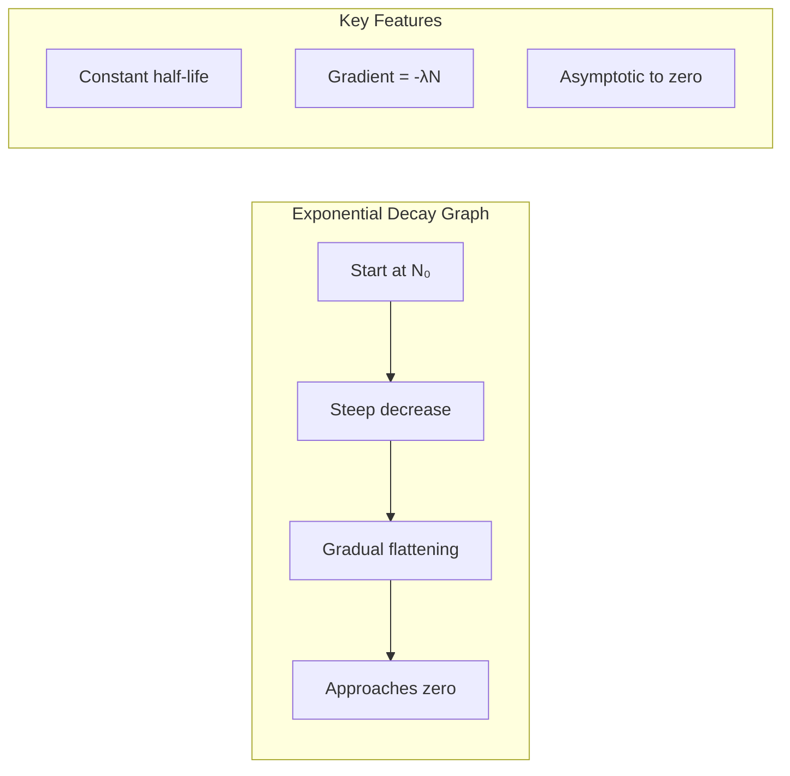

# 1. Overview / 概述

**English:**
The decay constant ($\lambda$) is a fundamental parameter that characterizes the probability of radioactive decay per unit time for a given nucleus. It is the cornerstone of all radioactive decay calculations, linking directly to [[Activity and the Becquerel]] and [[Half-Life Definition and Calculation]]. Unlike half-life, which describes the time taken for half the nuclei to decay, the decay constant provides an instantaneous measure of decay probability. Understanding $\lambda$ is essential for predicting how quickly a radioactive sample will decay, calculating its activity, and applying these concepts in [[Carbon Dating and Other Applications]]. This sub-topic explores the definition, physical meaning, mathematical relationships, and practical significance of the decay constant within the broader context of [[Half-Life and Activity]].

**中文:**
衰变常数 ($\lambda$) 是一个基本参数，表征给定原子核单位时间内发生放射性衰变的概率。它是所有放射性衰变计算的基础，直接关联到[[Activity and the Becquerel]]和[[Half-Life Definition and Calculation]]。与描述一半原子核衰变所需时间的半衰期不同，衰变常数提供了衰变概率的瞬时度量。理解 $\lambda$ 对于预测放射性样品的衰变速度、计算其活度以及将这些概念应用于[[Carbon Dating and Other Applications]]至关重要。本子知识点探讨了衰变常数的定义、物理意义、数学关系及其在[[Half-Life and Activity]]更广泛背景下的实际意义。

---

# 2. Syllabus Learning Objectives / 考纲学习目标

| CAIE 9702 | Edexcel IAL |
|-----------|-------------|
| 23.2(a): Define decay constant ($\lambda$) as the probability of decay of a nucleus per unit time | 8.7: Understand the concept of decay constant ($\lambda$) |
| 23.2(b): Recall and use the equation $A = \lambda N$ | 8.8: Use the equation $A = \lambda N$ |
| 23.2(c): Derive and use the exponential decay equation $N = N_0 e^{-\lambda t}$ | 8.9: Derive and use $N = N_0 e^{-\lambda t}$ |
| 23.2(d): Relate decay constant to half-life: $\lambda = \frac{\ln 2}{t_{1/2}}$ | 8.10: Relate $\lambda$ to half-life: $\lambda = \frac{\ln 2}{t_{1/2}}$ |
| 23.2(e): Solve problems involving decay constant, activity, and half-life | 8.10: Solve problems involving $\lambda$, activity, and half-life |

**Examiner Expectations / 考官期望:**
- **English:** Students must be able to define $\lambda$ precisely, derive the relationship between $\lambda$ and $t_{1/2}$, and apply the equations $A = \lambda N$ and $N = N_0 e^{-\lambda t}$ in calculations. Understanding that $\lambda$ is a constant for a given isotope is crucial.
- **中文:** 学生必须能够精确定义 $\lambda$，推导 $\lambda$ 与 $t_{1/2}$ 的关系，并应用方程 $A = \lambda N$ 和 $N = N_0 e^{-\lambda t}$ 进行计算。理解 $\lambda$ 对于给定同位素是一个常数至关重要。

---

# 3. Core Definitions / 核心定义

| Term (EN/CN) | Definition (EN) | Definition (CN) | Common Mistakes / 常见错误 |
|--------------|-----------------|-----------------|---------------------------|
| **Decay Constant** / 衰变常数 | The probability of decay of a nucleus per unit time; a constant for a given radioactive isotope | 原子核单位时间内发生衰变的概率；对于给定的放射性同位素是一个常数 | Confusing $\lambda$ with half-life; thinking $\lambda$ changes over time |
| **Activity ($A$)** / 活度 | The rate at which radioactive nuclei decay, measured in becquerels (Bq) | 放射性原子核衰变的速率，以贝克勒尔(Bq)为单位 | Forgetting $A = \lambda N$ applies only at an instant |
| **Exponential Decay** / 指数衰变 | The decrease in the number of undecayed nuclei follows an exponential function $N = N_0 e^{-\lambda t}$ | 未衰变原子核数量的减少遵循指数函数 $N = N_0 e^{-\lambda t}$ | Thinking decay is linear; misapplying the formula |
| **Half-Life ($t_{1/2}$)** / 半衰期 | The time taken for half the nuclei in a sample to decay | 样品中一半原子核发生衰变所需的时间 | Confusing with decay constant; using wrong formula for relationship |
| **Becquerel (Bq)** / 贝克勒尔 | The SI unit of activity; 1 Bq = 1 decay per second | 活度的SI单位；1 Bq = 1次衰变每秒 | Thinking Bq measures number of nuclei, not decay rate |

---

# 4. Key Concepts Explained / 关键概念详解

## 4.1 Physical Meaning of Decay Constant / 衰变常数的物理意义

### Explanation / 解释
**English:** The decay constant $\lambda$ represents the **probability per unit time** that a given radioactive nucleus will decay. For example, if $\lambda = 0.1 \, \text{s}^{-1}$, each nucleus has a 10% chance of decaying in the next second. This is a **statistical** concept — it does not tell us exactly when a particular nucleus will decay, but it describes the average behavior of a large number of nuclei. $\lambda$ is a **fundamental property** of a specific isotope and is independent of external conditions like temperature, pressure, or chemical state. This connects to [[Radioactive Decay]] as the underlying mechanism.

**中文:** 衰变常数 $\lambda$ 表示给定放射性原子核单位时间内发生衰变的**概率**。例如，如果 $\lambda = 0.1 \, \text{s}^{-1}$，每个原子核在下一秒内有10%的衰变机会。这是一个**统计**概念——它不能告诉我们特定原子核何时衰变，但描述了大量原子核的平均行为。$\lambda$ 是特定同位素的**基本属性**，与温度、压力或化学状态等外部条件无关。这与[[Radioactive Decay]]作为基本机制相关联。

### Physical Meaning / 物理意义
**English:** The decay constant quantifies the "instability" of a nucleus. A larger $\lambda$ means:
- Higher probability of decay per unit time
- Faster decay rate
- Shorter half-life
- More radioactive (higher activity for the same number of nuclei)

A smaller $\lambda$ means the opposite — the nucleus is more stable and decays more slowly.

**中文:** 衰变常数量化了原子核的"不稳定性"。较大的 $\lambda$ 意味着：
- 单位时间内衰变概率更高
- 衰变速度更快
- 半衰期更短
- 放射性更强（相同原子核数量下活度更高）

较小的 $\lambda$ 则相反——原子核更稳定，衰变更慢。

### Common Misconceptions / 常见误区
- ❌ **Misconception:** $\lambda$ changes as the sample decays.
  **Truth:** $\lambda$ is constant for a given isotope — it does not change over time.
- ❌ **Misconception:** $\lambda$ is the same as the decay rate.
  **Truth:** $\lambda$ is the probability per unit time; the decay rate (activity) is $A = \lambda N$, which depends on both $\lambda$ and $N$.
- ❌ **Misconception:** $\lambda$ can be affected by external conditions.
  **Truth:** $\lambda$ is independent of temperature, pressure, and chemical environment.

- ❌ **误区:** $\lambda$ 随着样品衰变而变化。
  **事实:** $\lambda$ 对于给定同位素是常数——它不随时间变化。
- ❌ **误区:** $\lambda$ 等同于衰变速率。
  **事实:** $\lambda$ 是单位时间的概率；衰变速率（活度）是 $A = \lambda N$，取决于 $\lambda$ 和 $N$ 两者。
- ❌ **误区:** $\lambda$ 受外部条件影响。
  **事实:** $\lambda$ 与温度、压力和化学环境无关。

### Exam Tips / 考试提示
- **English:** Always state the units of $\lambda$ ($\text{s}^{-1}$, $\text{min}^{-1}$, $\text{year}^{-1}$). When using $A = \lambda N$, ensure consistent time units. For half-life problems, remember $\lambda = \frac{\ln 2}{t_{1/2}}$.
- **中文:** 始终说明 $\lambda$ 的单位（$\text{s}^{-1}$、$\text{min}^{-1}$、$\text{year}^{-1}$）。使用 $A = \lambda N$ 时，确保时间单位一致。对于半衰期问题，记住 $\lambda = \frac{\ln 2}{t_{1/2}}$。

> 📷 **IMAGE PROMPT — DC-01: Decay Constant Visualisation**
> A diagram showing a large number of identical radioactive nuclei (e.g., 1000). Each nucleus has a small "probability cloud" around it. The decay constant $\lambda$ is represented as the fraction of these clouds that "activate" per second. Use arrows to show that 10% of nuclei decay each second when $\lambda = 0.1 \, \text{s}^{-1}$. Include a time-lapse showing the number decreasing exponentially.

---

## 4.2 Relationship Between Decay Constant and Activity / 衰变常数与活度的关系

### Explanation / 解释
**English:** The activity $A$ of a radioactive sample is directly proportional to both the decay constant $\lambda$ and the number of undecayed nuclei $N$:

$$A = \lambda N$$

This equation tells us that:
- For a given isotope (fixed $\lambda$), activity decreases as nuclei decay ($N$ decreases)
- For a given number of nuclei, a larger $\lambda$ means higher activity
- Activity is measured in becquerels (Bq), where 1 Bq = 1 decay per second

This is the fundamental link between [[Activity and the Becquerel]] and the decay constant.

**中文:** 放射性样品的活度 $A$ 与衰变常数 $\lambda$ 和未衰变原子核数量 $N$ 成正比：

$$A = \lambda N$$

这个方程告诉我们：
- 对于给定同位素（$\lambda$ 固定），活度随着原子核衰变而降低（$N$ 减少）
- 对于给定数量的原子核，$\lambda$ 越大意味着活度越高
- 活度以贝克勒尔(Bq)为单位，其中 1 Bq = 1次衰变每秒

这是[[Activity and the Becquerel]]与衰变常数之间的基本联系。

### Physical Meaning / 物理意义
**English:** The equation $A = \lambda N$ expresses that the decay rate is the product of the decay probability per nucleus ($\lambda$) and the number of nuclei available to decay ($N$). This is analogous to a factory: if each machine has a certain probability of producing a product per hour ($\lambda$), and you have $N$ machines, the total production rate is $\lambda N$.

**中文:** 方程 $A = \lambda N$ 表达了衰变速率是每个原子核的衰变概率 ($\lambda$) 与可衰变原子核数量 ($N$) 的乘积。这类似于工厂：如果每台机器每小时有一定概率生产一个产品 ($\lambda$)，并且你有 $N$ 台机器，总生产率就是 $\lambda N$。

### Common Misconceptions / 常见误区
- ❌ **Misconception:** $A = \lambda N$ gives the total number of decays that will ever happen.
  **Truth:** It gives the instantaneous decay rate at a specific moment.
- ❌ **Misconception:** $\lambda$ and $A$ have the same units.
  **Truth:** $\lambda$ has units of $\text{time}^{-1}$; $A$ has units of Bq ($\text{s}^{-1}$).

- ❌ **误区:** $A = \lambda N$ 给出将会发生的总衰变次数。
  **事实:** 它给出特定时刻的瞬时衰变速率。
- ❌ **误区:** $\lambda$ 和 $A$ 有相同的单位。
  **事实:** $\lambda$ 的单位是 $\text{time}^{-1}$；$A$ 的单位是 Bq ($\text{s}^{-1}$)。

### Exam Tips / 考试提示
- **English:** When calculating activity, always check whether you have $N$ (number of nuclei) or the mass of the sample. You may need to use Avogadro's constant to find $N$.
- **中文:** 计算活度时，始终检查你是否有 $N$（原子核数量）还是样品的质量。你可能需要使用阿伏伽德罗常数来求 $N$。

---

## 4.3 Derivation of Exponential Decay / 指数衰变的推导

### Explanation / 解释
**English:** The decay constant leads directly to the exponential decay law. Starting from the definition:

$$\frac{dN}{dt} = -\lambda N$$

This differential equation states that the rate of change of $N$ is proportional to $N$ itself. Solving:

$$\frac{dN}{N} = -\lambda \, dt$$

Integrating both sides:

$$\int_{N_0}^{N} \frac{dN}{N} = -\lambda \int_{0}^{t} dt$$

$$\ln N - \ln N_0 = -\lambda t$$

$$\ln \left(\frac{N}{N_0}\right) = -\lambda t$$

$$N = N_0 e^{-\lambda t}$$

This is the **exponential decay equation**, where $N_0$ is the initial number of nuclei and $N$ is the number remaining after time $t$.

**中文:** 衰变常数直接导出指数衰变定律。从定义开始：

$$\frac{dN}{dt} = -\lambda N$$

这个微分方程表明 $N$ 的变化率与 $N$ 本身成正比。求解：

$$\frac{dN}{N} = -\lambda \, dt$$

两边积分：

$$\int_{N_0}^{N} \frac{dN}{N} = -\lambda \int_{0}^{t} dt$$

$$\ln N - \ln N_0 = -\lambda t$$

$$\ln \left(\frac{N}{N_0}\right) = -\lambda t$$

$$N = N_0 e^{-\lambda t}$$

这就是**指数衰变方程**，其中 $N_0$ 是初始原子核数量，$N$ 是时间 $t$ 后剩余的数量。

### Physical Meaning / 物理意义
**English:** The exponential decay equation shows that the number of undecayed nuclei decreases by a constant fraction per unit time, not by a constant amount. This is why radioactive decay is described as a "constant proportion" process. The decay constant $\lambda$ determines how quickly this fraction decreases.

**中文:** 指数衰变方程表明，未衰变原子核的数量每单位时间减少一个恒定比例，而不是恒定数量。这就是为什么放射性衰变被描述为"恒定比例"过程。衰变常数 $\lambda$ 决定了这个比例下降的速度。

### Common Misconceptions / 常见误区
- ❌ **Misconception:** $N$ decreases linearly with time.
  **Truth:** $N$ decreases exponentially — the rate of decrease slows down over time.
- ❌ **Misconception:** $e^{-\lambda t}$ can be simplified to $1 - \lambda t$.
  **Truth:** This approximation only works for very small $\lambda t$ values.

- ❌ **误区:** $N$ 随时间线性减少。
  **事实:** $N$ 指数减少——减少速率随时间减慢。
- ❌ **误区:** $e^{-\lambda t}$ 可以简化为 $1 - \lambda t$。
  **事实:** 这种近似只适用于非常小的 $\lambda t$ 值。

### Exam Tips / 考试提示
- **English:** You may be asked to derive this equation from the differential form. Remember to include the negative sign in $\frac{dN}{dt} = -\lambda N$.
- **中文:** 你可能会被要求从微分形式推导这个方程。记得在 $\frac{dN}{dt} = -\lambda N$ 中包含负号。

---

## 4.4 Relationship Between Decay Constant and Half-Life / 衰变常数与半衰期的关系

### Explanation / 解释
**English:** The half-life $t_{1/2}$ is the time taken for half the nuclei to decay. Using the exponential decay equation:

When $t = t_{1/2}$, $N = \frac{N_0}{2}$:

$$\frac{N_0}{2} = N_0 e^{-\lambda t_{1/2}}$$

$$\frac{1}{2} = e^{-\lambda t_{1/2}}$$

Taking natural logarithms:

$$\ln\left(\frac{1}{2}\right) = -\lambda t_{1/2}$$

$$-\ln 2 = -\lambda t_{1/2}$$

$$\lambda = \frac{\ln 2}{t_{1/2}}$$

This is a **crucial relationship** that links [[Half-Life Definition and Calculation]] to the decay constant.

**中文:** 半衰期 $t_{1/2}$ 是一半原子核衰变所需的时间。使用指数衰变方程：

当 $t = t_{1/2}$ 时，$N = \frac{N_0}{2}$：

$$\frac{N_0}{2} = N_0 e^{-\lambda t_{1/2}}$$

$$\frac{1}{2} = e^{-\lambda t_{1/2}}$$

取自然对数：

$$\ln\left(\frac{1}{2}\right) = -\lambda t_{1/2}$$

$$-\ln 2 = -\lambda t_{1/2}$$

$$\lambda = \frac{\ln 2}{t_{1/2}}$$

这是一个**关键关系**，将[[Half-Life Definition and Calculation]]与衰变常数联系起来。

### Physical Meaning / 物理意义
**English:** This relationship shows that $\lambda$ and $t_{1/2}$ are inversely proportional — a larger decay constant means a shorter half-life, and vice versa. The constant $\ln 2 \approx 0.693$ appears because we are considering the time for half the sample to decay.

**中文:** 这个关系表明 $\lambda$ 和 $t_{1/2}$ 成反比——衰变常数越大，半衰期越短，反之亦然。常数 $\ln 2 \approx 0.693$ 出现是因为我们考虑的是样品一半衰变所需的时间。

### Common Misconceptions / 常见误区
- ❌ **Misconception:** $\lambda = \frac{1}{t_{1/2}}$.
  **Truth:** $\lambda = \frac{\ln 2}{t_{1/2}} \approx \frac{0.693}{t_{1/2}}$.
- ❌ **Misconception:** The relationship is $\lambda t_{1/2} = 1$.
  **Truth:** $\lambda t_{1/2} = \ln 2 \approx 0.693$.

- ❌ **误区:** $\lambda = \frac{1}{t_{1/2}}$。
  **事实:** $\lambda = \frac{\ln 2}{t_{1/2}} \approx \frac{0.693}{t_{1/2}}$。
- ❌ **误区:** 关系是 $\lambda t_{1/2} = 1$。
  **事实:** $\lambda t_{1/2} = \ln 2 \approx 0.693$。

### Exam Tips / 考试提示
- **English:** This is one of the most frequently tested relationships. Memorize $\lambda = \frac{\ln 2}{t_{1/2}}$ and be able to rearrange it. Pay attention to units — if $t_{1/2}$ is in years, $\lambda$ will be in $\text{year}^{-1}$.
- **中文:** 这是最常测试的关系之一。记住 $\lambda = \frac{\ln 2}{t_{1/2}}$ 并能够重新排列。注意单位——如果 $t_{1/2}$ 以年为单位，$\lambda$ 将以 $\text{year}^{-1}$ 为单位。

> 📷 **IMAGE PROMPT — DC-02: Decay Constant vs Half-Life**
> A side-by-side comparison diagram. Left: A graph of $N$ vs $t$ showing exponential decay with a large $\lambda$ (steep curve, short half-life). Right: A graph with a small $\lambda$ (shallow curve, long half-life). Label both axes, mark $t_{1/2}$ on each, and show the relationship $\lambda = \ln 2 / t_{1/2}$ as an equation connecting the two.

---

# 5. Essential Equations / 核心公式

## Equation 1: Activity Equation / 活度方程

$$A = \lambda N$$

| Symbol (符号) | Meaning (EN) | Meaning (CN) | Unit (单位) |
|--------------|-------------|-------------|------------|
| $A$ | Activity | 活度 | Bq ($\text{s}^{-1}$) |
| $\lambda$ | Decay constant | 衰变常数 | $\text{s}^{-1}$, $\text{min}^{-1}$, $\text{year}^{-1}$ |
| $N$ | Number of undecayed nuclei | 未衰变原子核数量 | dimensionless (无量纲) |

**Derivation / 推导:** From the definition $\frac{dN}{dt} = -\lambda N$, the activity $A = -\frac{dN}{dt} = \lambda N$.
**Conditions / 适用条件:** Instantaneous relationship; $N$ must be the number at that instant.
**Limitations / 局限性:** Only applies to a single radioactive isotope; does not account for decay chains.

## Equation 2: Exponential Decay / 指数衰变

$$N = N_0 e^{-\lambda t}$$

| Symbol (符号) | Meaning (EN) | Meaning (CN) | Unit (单位) |
|--------------|-------------|-------------|------------|
| $N$ | Number remaining after time $t$ | 时间 $t$ 后剩余数量 | dimensionless (无量纲) |
| $N_0$ | Initial number of nuclei | 初始原子核数量 | dimensionless (无量纲) |
| $\lambda$ | Decay constant | 衰变常数 | $\text{s}^{-1}$ |
| $t$ | Time elapsed | 经过的时间 | s, min, years |

**Derivation / 推导:** From $\frac{dN}{dt} = -\lambda N$, integrate: $\int_{N_0}^{N} \frac{dN}{N} = -\lambda \int_0^t dt$.
**Conditions / 适用条件:** Large number of nuclei (statistical validity); constant $\lambda$.
**Limitations / 局限性:** Does not apply to individual nuclei; assumes no new nuclei are produced.

## Equation 3: Decay Constant and Half-Life / 衰变常数与半衰期

$$\lambda = \frac{\ln 2}{t_{1/2}}$$

| Symbol (符号) | Meaning (EN) | Meaning (CN) | Unit (单位) |
|--------------|-------------|-------------|------------|
| $\lambda$ | Decay constant | 衰变常数 | $\text{s}^{-1}$ |
| $\ln 2$ | Natural logarithm of 2 ($\approx 0.693$) | 2的自然对数 ($\approx 0.693$) | dimensionless (无量纲) |
| $t_{1/2}$ | Half-life | 半衰期 | s, min, years |

**Derivation / 推导:** Set $N = N_0/2$ in $N = N_0 e^{-\lambda t}$ and solve for $t$.
**Conditions / 适用条件:** Valid for all radioactive isotopes with exponential decay.
**Limitations / 局限性:** Only applies to first-order decay processes.

> 📋 **CIE Only:** Students must be able to derive $\lambda = \frac{\ln 2}{t_{1/2}}$ from the exponential decay equation.
> 📋 **Edexcel Only:** Students should be able to use $\lambda = \frac{\ln 2}{t_{1/2}}$ in calculations involving activity and half-life.

---

# 6. Graphs and Relationships / 图表与关系

## 6.1 Exponential Decay Graph / 指数衰变图

### Axes / 坐标轴
- **X-axis:** Time ($t$) / 时间 ($t$)
- **Y-axis:** Number of undecayed nuclei ($N$) or Activity ($A$) / 未衰变原子核数量 ($N$) 或活度 ($A$)

### Shape / 形状
**English:** A smooth, decreasing curve that starts at $N_0$ (or $A_0$) and asymptotically approaches zero. The curve is steepest at the beginning and gradually flattens out. The time to halve from any value is constant (half-life).

**中文:** 一条平滑的下降曲线，从 $N_0$（或 $A_0$）开始，渐近趋近于零。曲线在开始时最陡，然后逐渐变平。从任何值减半所需的时间是恒定的（半衰期）。

### Gradient Meaning / 斜率含义
**English:** The gradient of the $N$ vs $t$ graph at any point equals $-\lambda N$, which is the negative of the activity at that instant. The gradient becomes less steep as $N$ decreases.

**中文:** $N$ vs $t$ 图上任意点的斜率等于 $-\lambda N$，即该时刻活度的负值。随着 $N$ 减小，斜率变缓。

### Area Meaning / 面积含义
**English:** The area under the $A$ vs $t$ graph gives the total number of decays that have occurred.

**中文:** $A$ vs $t$ 图下的面积给出了已经发生的总衰变次数。

### Exam Interpretation / 考试解读
- **English:** Be able to read values from the graph, determine half-life from the graph, and compare decay constants of different isotopes by comparing curve steepness.
- **中文:** 能够从图中读取数值，从图中确定半衰期，并通过比较曲线陡峭程度来比较不同同位素的衰变常数。



> 📷 **IMAGE PROMPT — DC-03: Exponential Decay Graph**
> A clear graph of N vs t for radioactive decay. Label N₀ on the y-axis. Mark t₁/₂, 2t₁/₂, 3t₁/₂ on the x-axis. Show that N drops to N₀/2 at t₁/₂, N₀/4 at 2t₁/₂, N₀/8 at 3t₁/₂. Include a tangent line at t=0 showing initial gradient = -λN₀.

## 6.2 Natural Log Graph / 自然对数图

### Axes / 坐标轴
- **X-axis:** Time ($t$) / 时间 ($t$)
- **Y-axis:** $\ln N$ or $\ln A$ / $\ln N$ 或 $\ln A$

### Shape / 形状
**English:** A straight line with negative gradient. This is because $\ln N = \ln N_0 - \lambda t$, which is of the form $y = mx + c$.

**中文:** 一条具有负斜率的直线。这是因为 $\ln N = \ln N_0 - \lambda t$，形式为 $y = mx + c$。

### Gradient Meaning / 斜率含义
**English:** The gradient of the $\ln N$ vs $t$ graph is $-\lambda$. This provides a direct way to determine the decay constant experimentally.

**中文:** $\ln N$ vs $t$ 图的斜率为 $-\lambda$。这提供了一种实验确定衰变常数的直接方法。

### Area Meaning / 面积含义
**English:** No direct physical meaning for area under this graph.

**中文:** 该图下的面积没有直接的物理意义。

### Exam Interpretation / 考试解读
- **English:** This is the most common method for determining $\lambda$ from experimental data. Plot $\ln N$ (or $\ln A$) against $t$, find the gradient, and $\lambda = -\text{gradient}$.
- **中文:** 这是从实验数据确定 $\lambda$ 的最常用方法。绘制 $\ln N$（或 $\ln A$）与 $t$ 的关系图，求斜率，$\lambda = -\text{斜率}$。

> 📷 **IMAGE PROMPT — DC-04: Natural Log Graph for Decay Constant**
> A graph of ln(N) vs t showing a straight line with negative slope. Label the y-intercept as ln(N₀). Show the gradient calculation: gradient = Δy/Δx = -λ. Include data points with error bars to show experimental determination.

---

# 7. Required Diagrams / 必备图表

## 7.1 Decay Constant and Exponential Decay / 衰变常数与指数衰变

### Description / 描述
**English:** A diagram showing the relationship between decay constant, half-life, and the exponential decay curve. It should illustrate how different values of $\lambda$ produce different decay curves.

**中文:** 显示衰变常数、半衰期和指数衰变曲线之间关系的图表。应说明不同的 $\lambda$ 值如何产生不同的衰变曲线。

### Image Prompt / 图片生成提示
> 📷 **IMAGE PROMPT — DC-05: Decay Constant Comparison**
> A multi-curve graph on the same axes showing three different radioactive isotopes with different decay constants. Isotope A: large λ (steep curve, short half-life). Isotope B: medium λ. Isotope C: small λ (shallow curve, long half-life). Label each curve with its λ value and half-life. Include a legend. Use different colors for each curve. Show that all curves start at the same N₀.

### Labels Required / 需要标注
- **English:** $N_0$ (initial number), $t_{1/2}$ for each isotope, $\lambda$ values, time axis, number axis
- **中文:** $N_0$（初始数量），每个同位素的 $t_{1/2}$，$\lambda$ 值，时间轴，数量轴

### Exam Importance / 考试重要性
- **English:** High — understanding this diagram helps visualize the relationship between $\lambda$ and decay rate.
- **中文:** 高——理解此图有助于可视化 $\lambda$ 与衰变速率之间的关系。

## 7.2 Natural Log Plot for Determining λ / 确定λ的自然对数图

### Description / 描述
**English:** A diagram showing how to determine the decay constant experimentally by plotting $\ln N$ against time. The straight line graph allows $\lambda$ to be found from the gradient.

**中文:** 显示如何通过绘制 $\ln N$ 与时间的关系图来实验确定衰变常数的图表。直线图允许从斜率求出 $\lambda$。

### Image Prompt / 图片生成提示
> 📷 **IMAGE PROMPT — DC-06: Experimental Determination of λ**
> A laboratory setup showing a Geiger-Müller tube connected to a counter, measuring radiation from a radioactive source. Next to it, a graph of ln(count rate) vs time with a best-fit straight line. Show the gradient calculation: λ = -gradient. Include error bars on the data points. Label the y-intercept as ln(A₀).

### Labels Required / 需要标注
- **English:** GM tube, counter, radioactive source, $\ln(\text{count rate})$ axis, time axis, gradient $= -\lambda$, $\ln A_0$
- **中文:** GM管，计数器，放射源，$\ln(\text{计数率})$ 轴，时间轴，斜率 $= -\lambda$，$\ln A_0$

### Exam Importance / 考试重要性
- **English:** Very high — this is a common practical and exam question.
- **中文:** 非常高——这是一个常见的实验和考试问题。

---

# 8. Worked Examples / 典型例题

## Example 1: Calculating Decay Constant from Half-Life / 从半衰期计算衰变常数

### Question / 题目
**English:** The half-life of carbon-14 is 5730 years. Calculate:
(a) The decay constant $\lambda$ in $\text{year}^{-1}$
(b) The decay constant $\lambda$ in $\text{s}^{-1}$

**中文:** 碳-14的半衰期为5730年。计算：
(a) 衰变常数 $\lambda$（以 $\text{year}^{-1}$ 为单位）
(b) 衰变常数 $\lambda$（以 $\text{s}^{-1}$ 为单位）

### Solution / 解答

**Part (a):**
$$\lambda = \frac{\ln 2}{t_{1/2}} = \frac{0.693}{5730 \, \text{years}}$$

$$\lambda = 1.21 \times 10^{-4} \, \text{year}^{-1}$$

**Part (b):**
Convert years to seconds:
$$1 \, \text{year} = 365.25 \times 24 \times 60 \times 60 = 3.156 \times 10^7 \, \text{s}$$

$$\lambda = \frac{1.21 \times 10^{-4}}{3.156 \times 10^7} = 3.83 \times 10^{-12} \, \text{s}^{-1}$$

### Final Answer / 最终答案
**Answer:** (a) $\lambda = 1.21 \times 10^{-4} \, \text{year}^{-1}$ | (b) $\lambda = 3.83 \times 10^{-12} \, \text{s}^{-1}$
**答案:** (a) $\lambda = 1.21 \times 10^{-4} \, \text{year}^{-1}$ | (b) $\lambda = 3.83 \times 10^{-12} \, \text{s}^{-1}$

### Quick Tip / 提示
- **English:** Always check the units required. For $\text{s}^{-1}$, remember to convert years to seconds using $3.156 \times 10^7 \, \text{s/year}$.
- **中文:** 始终检查所需的单位。对于 $\text{s}^{-1}$，记得使用 $3.156 \times 10^7 \, \text{s/年}$ 将年转换为秒。

---

## Example 2: Using Activity Equation / 使用活度方程

### Question / 题目
**English:** A sample contains $2.0 \times 10^{12}$ nuclei of a radioactive isotope with decay constant $\lambda = 3.5 \times 10^{-3} \, \text{s}^{-1}$.
(a) Calculate the initial activity of the sample.
(b) Calculate the number of nuclei remaining after 200 seconds.

**中文:** 一个样品含有 $2.0 \times 10^{12}$ 个放射性同位素的原子核，衰变常数 $\lambda = 3.5 \times 10^{-3} \, \text{s}^{-1}$。
(a) 计算样品的初始活度。
(b) 计算200秒后剩余的原子核数量。

### Solution / 解答

**Part (a):**
$$A_0 = \lambda N_0 = (3.5 \times 10^{-3})(2.0 \times 10^{12})$$

$$A_0 = 7.0 \times 10^9 \, \text{Bq}$$

**Part (b):**
$$N = N_0 e^{-\lambda t} = (2.0 \times 10^{12}) e^{-(3.5 \times 10^{-3})(200)}$$

$$N = (2.0 \times 10^{12}) e^{-0.7}$$

$$e^{-0.7} = 0.4966$$

$$N = (2.0 \times 10^{12})(0.4966) = 9.93 \times 10^{11}$$

### Final Answer / 最终答案
**Answer:** (a) $A_0 = 7.0 \times 10^9 \, \text{Bq}$ | (b) $N = 9.93 \times 10^{11}$ nuclei
**答案:** (a) $A_0 = 7.0 \times 10^9 \, \text{Bq}$ | (b) $N = 9.93 \times 10^{11}$ 个原子核

### Quick Tip / 提示
- **English:** In part (b), you could also find the activity at $t = 200 \, \text{s}$ using $A = A_0 e^{-\lambda t}$, then use $A = \lambda N$ to find $N$.
- **中文:** 在(b)部分，你也可以使用 $A = A_0 e^{-\lambda t}$ 求出 $t = 200 \, \text{s}$ 时的活度，然后使用 $A = \lambda N$ 求出 $N$。

---

## Example 3: Determining λ from Experimental Data / 从实验数据确定λ

### Question / 题目
**English:** In an experiment, the activity of a radioactive source is measured over time. The following data is obtained:

| Time (min) | 0 | 10 | 20 | 30 | 40 |
|------------|---|---|---|---|---|
| Activity (Bq) | 500 | 310 | 192 | 119 | 74 |

Plot $\ln A$ against $t$ and determine the decay constant $\lambda$.

**中文:** 在实验中，测量了放射源随时间的活度。获得以下数据：

| 时间 (分钟) | 0 | 10 | 20 | 30 | 40 |
|------------|---|---|---|---|---|
| 活度 (Bq) | 500 | 310 | 192 | 119 | 74 |

绘制 $\ln A$ 与 $t$ 的关系图，并确定衰变常数 $\lambda$。

### Solution / 解答

**Step 1: Calculate $\ln A$ values**

| $t$ (min) | $A$ (Bq) | $\ln A$ |
|-----------|---------|---------|
| 0 | 500 | 6.215 |
| 10 | 310 | 5.737 |
| 20 | 192 | 5.257 |
| 30 | 119 | 4.779 |
| 40 | 74 | 4.304 |

**Step 2: Plot $\ln A$ vs $t$ and find gradient**

Using two points on the best-fit line:
$$\text{gradient} = \frac{\Delta(\ln A)}{\Delta t} = \frac{4.304 - 6.215}{40 - 0} = \frac{-1.911}{40}$$

$$\text{gradient} = -0.0478 \, \text{min}^{-1}$$

**Step 3: Determine $\lambda$**

Since $\ln A = \ln A_0 - \lambda t$, the gradient $= -\lambda$:
$$\lambda = 0.0478 \, \text{min}^{-1}$$

### Final Answer / 最终答案
**Answer:** $\lambda = 0.0478 \, \text{min}^{-1}$ (or $7.97 \times 10^{-4} \, \text{s}^{-1}$)
**答案:** $\lambda = 0.0478 \, \text{min}^{-1}$（或 $7.97 \times 10^{-4} \, \text{s}^{-1}$）

### Quick Tip / 提示
- **English:** Always use the best-fit line, not individual data points, to find the gradient. Include units in your final answer.
- **中文:** 始终使用最佳拟合线，而不是单个数据点来求斜率。在最终答案中包含单位。

---

# 9. Past Paper Question Types / 历年真题题型

| Question Type / 题型 | Frequency / 频率 | Difficulty / 难度 | Past Paper References / 真题索引 |
|----------------------|------------------|------------------|-------------------------------|
| Calculate $\lambda$ from $t_{1/2}$ | Very High | Easy | 📝 *待填入* |
| Use $A = \lambda N$ to find activity or $N$ | Very High | Medium | 📝 *待填入* |
| Derive exponential decay equation | Medium | Medium | 📝 *待填入* |
| Determine $\lambda$ from $\ln N$ vs $t$ graph | High | Medium | 📝 *待填入* |
| Combined problems with half-life and activity | High | Hard | 📝 *待填入* |
| Compare decay constants of different isotopes | Medium | Easy | 📝 *待填入* |

**Common Command Words / 常见指令词:**
- **English:** Define, Derive, Calculate, Determine, Sketch, Plot, Show that, Explain
- **中文:** 定义，推导，计算，确定，画出，绘制，证明，解释

---

# 10. Practical Skills Connections / 实验技能链接

**English:**
The decay constant is determined experimentally through several key practical skills:

1. **Measurement of Activity:** Using a Geiger-Müller (GM) tube and counter to measure count rate (proportional to activity) over time. Background radiation must be subtracted.

2. **Data Collection:** Recording count rate at regular time intervals. For isotopes with short half-lives, measurements must be taken quickly and frequently.

3. **Graphical Analysis:** Plotting $\ln(\text{corrected count rate})$ against time to obtain a straight line. The gradient gives $-\lambda$.

4. **Uncertainty Analysis:** 
   - Random uncertainty in count rate follows Poisson statistics: $\Delta N = \sqrt{N}$
   - Error bars on $\ln N$ graph: $\Delta(\ln N) = \frac{\Delta N}{N} = \frac{1}{\sqrt{N}}$
   - Use error bars to draw best-fit and worst-fit lines for uncertainty in $\lambda$

5. **Experimental Design:**
   - Ensure the source is not too active (safety) or too weak (poor statistics)
   - Correct for dead time of the GM tube
   - Maintain constant geometry (distance between source and detector)

**中文:**
衰变常数通过几个关键实验技能确定：

1. **活度测量：** 使用盖革-米勒(GM)管和计数器测量计数率（与活度成正比）。必须减去本底辐射。

2. **数据收集：** 按固定时间间隔记录计数率。对于半衰期短的同位素，必须快速频繁地进行测量。

3. **图形分析：** 绘制 $\ln(\text{修正计数率})$ 与时间的关系图，得到一条直线。斜率给出 $-\lambda$。

4. **不确定度分析：**
   - 计数率的随机不确定度遵循泊松统计：$\Delta N = \sqrt{N}$
   - $\ln N$ 图上的误差棒：$\Delta(\ln N) = \frac{\Delta N}{N} = \frac{1}{\sqrt{N}}$
   - 使用误差棒绘制最佳拟合线和最差拟合线，以确定 $\lambda$ 的不确定度

5. **实验设计：**
   - 确保源既不太强（安全）也不太弱（统计性差）
   - 修正GM管的死时间
   - 保持恒定几何条件（源与探测器之间的距离）

---

# 11. Concept Map / 概念图谱

```mermaid
graph TD
    %% Core concept
    DC[Decay Constant λ<br/>衰变常数] --> DEF[Probability of decay<br/>per unit time<br/>单位时间衰变概率]
    
    %% Relationships
    DC --> |A = λN| ACT[Activity A<br/>活度]
    DC --> |λ = ln2/t₁/₂| HL[Half-Life t₁/₂<br/>半衰期]
    DC --> |N = N₀e^{-λt}| EXP[Exponential Decay<br/>指数衰变]
    
    %% Connections to other topics
    ACT --> BQ[Becquerel Bq<br/>贝克勒尔]
    HL --> CD[Carbon Dating<br/>碳定年]
    EXP --> GRAPH[lnN vs t graph<br/>lnN vs t 图]
    
    %% Experimental
    GRAPH --> GRAD[Gradient = -λ<br/>斜率 = -λ]
    GRAD --> EXP_DET[Experimental<br/>Determination<br/>实验确定]
    
    %% Prerequisites
    RD[Radioactive Decay<br/>放射性衰变] --> DC
    
    %% Styling
    classDef core fill:#f9f,stroke:#333,stroke-width:4px
    classDef related fill:#bbf,stroke:#333,stroke-width:2px
    classDef practical fill:#bfb,stroke:#333,stroke-width:2px
    
    class DC core
    class ACT,HL,EXP related
    class GRAPH,GRAD,EXP_DET practical
```

---

# 12. Quick Revision Sheet / 速查表

| Category / 类别 | Key Points / 要点 |
|----------------|------------------|
| **Definition / 定义** | $\lambda$ = probability of decay per unit time per nucleus / 每个原子核单位时间的衰变概率 |
| **Key Formula / 核心公式** | $A = \lambda N$ — Activity equation / 活度方程 |
| **Key Formula / 核心公式** | $N = N_0 e^{-\lambda t}$ — Exponential decay / 指数衰变 |
| **Key Formula / 核心公式** | $\lambda = \frac{\ln 2}{t_{1/2}}$ — Relationship with half-life / 与半衰期的关系 |
| **Key Graph / 核心图表** | $N$ vs $t$: Exponential decay curve / 指数衰变曲线 |
| **Key Graph / 核心图表** | $\ln N$ vs $t$: Straight line, gradient $= -\lambda$ / 直线，斜率 $= -\lambda$ |
| **Units / 单位** | $\lambda$: $\text{s}^{-1}$, $\text{min}^{-1}$, $\text{year}^{-1}$; $A$: Bq ($\text{s}^{-1}$) |
| **Constant / 常数** | $\ln 2 \approx 0.693$ |
| **Exam Tip / 考试提示** | Always check time units are consistent / 始终检查时间单位一致 |
| **Exam Tip / 考试提示** | Use $\ln$ graph to find $\lambda$ from experimental data / 使用 $\ln$ 图从实验数据求 $\lambda$ |
| **Common Mistake / 常见错误** | Confusing $\lambda$ with half-life / 混淆 $\lambda$ 与半衰期 |
| **Common Mistake / 常见错误** | Forgetting $\lambda$ is constant for a given isotope / 忘记 $\lambda$ 对于给定同位素是常数 |
| **Practical Skill / 实验技能** | Plot $\ln(\text{corrected count rate})$ vs time, gradient $= -\lambda$ / 绘制 $\ln(\text{修正计数率})$ vs 时间，斜率 $= -\lambda$ |
| **Safety / 安全** | Use tongs for sources; minimize exposure time / 使用镊子取源；最小化暴露时间 |