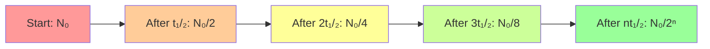
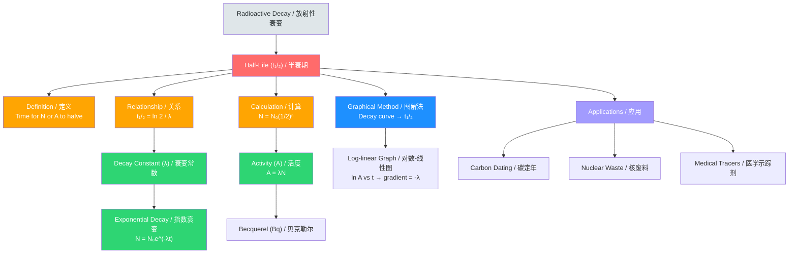

# 1. Overview / 概述

**English:**
Half-life is one of the most fundamental concepts in nuclear physics, describing the time taken for a radioactive sample's activity (or number of undecayed nuclei) to reduce by half. This sub-topic focuses on the **definition** of half-life ($t_{1/2}$) and the **mathematical calculations** involving it. Understanding half-life allows physicists to predict how long a radioactive source remains hazardous, determine the age of archaeological artefacts (see [[Carbon Dating and Other Applications]]), and manage nuclear waste. The concept is directly linked to the [[Decay Constant]] ($\lambda$) through the equation $t_{1/2} = \frac{\ln 2}{\lambda}$, and is essential for interpreting the exponential decay of radioactive substances. This leaf node builds on [[Radioactive Decay]] and prepares you for practical applications in [[Carbon Dating and Other Applications]].

**中文:**
半衰期是核物理中最基本的概念之一，描述了放射性样品的活度（或未衰变核的数量）减少一半所需的时间。本子知识点侧重于半衰期（$t_{1/2}$）的**定义**和涉及它的**数学计算**。理解半衰期使物理学家能够预测放射源保持危险的时间长度，确定考古文物的年龄（参见[[Carbon Dating and Other Applications]]），以及管理核废料。该概念通过方程 $t_{1/2} = \frac{\ln 2}{\lambda}$ 与[[Decay Constant]]（$\lambda$）直接相关，并且对于解释放射性物质的指数衰变至关重要。本叶节点建立在[[Radioactive Decay]]的基础上，并为[[Carbon Dating and Other Applications]]中的实际应用做准备。

---

# 2. Syllabus Learning Objectives / 考纲学习目标

| CAIE 9702 (23.2 a-e) | Edexcel IAL (WPH14 U4: 8.7-8.10) |
|-----------------------|----------------------------------|
| Define half-life | Define half-life |
| Use the relation $t_{1/2} = \frac{\ln 2}{\lambda}$ | Use the relation $t_{1/2} = \frac{\ln 2}{\lambda}$ |
| Solve problems using $N = N_0 e^{-\lambda t}$ and $A = A_0 e^{-\lambda t}$ | Solve problems using $N = N_0 e^{-\lambda t}$ and $A = A_0 e^{-\lambda t}$ |
| Determine half-life from decay curves | Determine half-life from decay curves |
| Understand that half-life is constant for a given isotope | Understand that half-life is constant for a given isotope |

**Examiner Expectations / 考官期望:**
- **English:** You must be able to define half-life precisely, derive the relationship between half-life and decay constant, and perform calculations involving exponential decay. You should also be able to determine half-life graphically from a decay curve.
- **中文:** 你必须能够精确定义半衰期，推导半衰期与衰变常数之间的关系，并进行涉及指数衰变的计算。你还应该能够从衰变曲线中通过图形确定半衰期。

---

# 3. Core Definitions / 核心定义

| Term (EN/CN) | Definition (EN) | Definition (CN) | Common Mistakes / 常见错误 |
|--------------|-----------------|-----------------|---------------------------|
| **Half-life** ($t_{1/2}$) / 半衰期 | The time taken for the number of undecayed nuclei (or activity) of a radioactive isotope to decrease to half of its initial value. | 放射性同位素的未衰变核数量（或活度）减少到其初始值一半所需的时间。 | ❌ Confusing with "half the time taken for all nuclei to decay" (half-life is constant, not cumulative). / 与“所有核衰变所需时间的一半”混淆（半衰期是恒定的，不是累积的）。 |
| **Decay Constant** ($\lambda$) / 衰变常数 | The probability per unit time that a given nucleus will decay. | 给定核在单位时间内发生衰变的概率。 | ❌ Thinking $\lambda$ is the fraction of nuclei that decay per unit time (it is, but only for a very small time interval). / 认为 $\lambda$ 是单位时间内衰变核的比例（是的，但仅适用于非常小的时间间隔）。 |
| **Activity** ($A$) / 活度 | The number of decays per second from a radioactive source, measured in Becquerels (Bq). | 放射源每秒的衰变次数，以贝克勒尔（Bq）为单位。 | ❌ Confusing activity with the number of undecayed nuclei. / 将活度与未衰变核的数量混淆。 |
| **Undecayed Nuclei** ($N$) / 未衰变核 | The number of radioactive nuclei that have not yet decayed at a given time. | 在给定时间尚未衰变的放射性核的数量。 | ❌ Forgetting that $N$ decreases exponentially, not linearly. / 忘记 $N$ 是指数减少，而不是线性减少。 |

---

# 4. Key Concepts Explained / 关键概念详解

## 4.1 The Exponential Nature of Decay / 衰变的指数性质

### Explanation / 解释
**English:** Radioactive decay is a **random** and **spontaneous** process. This means we cannot predict when a particular nucleus will decay. However, for a large number of nuclei, the decay follows a predictable **exponential** pattern. The number of undecayed nuclei $N$ at time $t$ is given by:
$$ N = N_0 e^{-\lambda t} $$
where $N_0$ is the initial number of nuclei and $\lambda$ is the [[Decay Constant]]. The half-life $t_{1/2}$ is the time when $N = \frac{N_0}{2}$. Substituting this into the equation gives:
$$ \frac{N_0}{2} = N_0 e^{-\lambda t_{1/2}} $$
$$ \frac{1}{2} = e^{-\lambda t_{1/2}} $$
Taking natural logarithms:
$$ \ln\left(\frac{1}{2}\right) = -\lambda t_{1/2} $$
$$ -\ln 2 = -\lambda t_{1/2} $$
$$ t_{1/2} = \frac{\ln 2}{\lambda} $$
This is the **fundamental relationship** between half-life and decay constant.

**中文:** 放射性衰变是一个**随机**且**自发**的过程。这意味着我们无法预测特定核何时会衰变。然而，对于大量核，衰变遵循可预测的**指数**模式。时间 $t$ 时未衰变核的数量 $N$ 由下式给出：
$$ N = N_0 e^{-\lambda t} $$
其中 $N_0$ 是初始核数，$\lambda$ 是[[Decay Constant]]。半衰期 $t_{1/2}$ 是 $N = \frac{N_0}{2}$ 的时刻。将其代入方程得到：
$$ \frac{N_0}{2} = N_0 e^{-\lambda t_{1/2}} $$
$$ \frac{1}{2} = e^{-\lambda t_{1/2}} $$
取自然对数：
$$ \ln\left(\frac{1}{2}\right) = -\lambda t_{1/2} $$
$$ -\ln 2 = -\lambda t_{1/2} $$
$$ t_{1/2} = \frac{\ln 2}{\lambda} $$
这是半衰期与衰变常数之间的**基本关系**。

### Physical Meaning / 物理意义
**English:** Half-life is a **characteristic property** of a radioactive isotope. It does not depend on the initial number of nuclei, temperature, pressure, or chemical state. Each isotope has a unique half-life, ranging from fractions of a second (e.g., polonium-214: $1.64 \times 10^{-4}$ s) to billions of years (e.g., uranium-238: $4.47 \times 10^9$ years). A short half-life means the isotope decays rapidly (high activity), while a long half-life means it decays slowly (low activity).

**中文:** 半衰期是放射性同位素的**特征属性**。它不依赖于初始核数、温度、压力或化学状态。每种同位素都有独特的半衰期，范围从几分之一秒（例如，钋-214：$1.64 \times 10^{-4}$ 秒）到数十亿年（例如，铀-238：$4.47 \times 10^9$ 年）。半衰期短意味着同位素衰变快（高活度），而半衰期长意味着衰变慢（低活度）。

### Common Misconceptions / 常见误区
- ❌ **"After two half-lives, all nuclei have decayed."** — After two half-lives, only $\frac{3}{4}$ of the original nuclei have decayed; $\frac{1}{4}$ remain.
- ❌ **"Half-life is half the total decay time."** — Radioactive decay is exponential, so there is no finite "total decay time."
- ❌ **"Half-life changes with temperature."** — Half-life is constant for a given isotope, independent of external conditions.
- ❌ **"After one half-life, activity is zero."** — Activity is halved, not zero.

- ❌ **"两个半衰期后，所有核都已衰变。"** — 两个半衰期后，只有 $\frac{3}{4}$ 的原始核衰变了；$\frac{1}{4}$ 仍然存在。
- ❌ **"半衰期是总衰变时间的一半。"** — 放射性衰变是指数型的，因此没有有限的"总衰变时间"。
- ❌ **"半衰期随温度变化。"** — 对于给定的同位素，半衰期是恒定的，与外部条件无关。
- ❌ **"一个半衰期后，活度为零。"** — 活度减半，而不是为零。

### Exam Tips / 考试提示
- **English:** Always use the exponential equations $N = N_0 e^{-\lambda t}$ or $A = A_0 e^{-\lambda t}$. For half-life calculations, remember $t_{1/2} = \frac{\ln 2}{\lambda} \approx \frac{0.693}{\lambda}$.
- **中文:** 始终使用指数方程 $N = N_0 e^{-\lambda t}$ 或 $A = A_0 e^{-\lambda t}$。对于半衰期计算，记住 $t_{1/2} = \frac{\ln 2}{\lambda} \approx \frac{0.693}{\lambda}$。

> 📷 **IMAGE PROMPT — DIAGRAM-01: Exponential Decay Curve**
> A clear graph showing exponential decay of a radioactive sample. The y-axis is labeled "Number of undecayed nuclei, N" and the x-axis is "Time, t". The curve starts at N₀ and decreases exponentially. Mark the points where N = N₀/2, N₀/4, N₀/8 at times t₁/₂, 2t₁/₂, 3t₁/₂ respectively. Use dashed vertical lines to show the half-life intervals. The graph should be clean, with a white background and professional styling suitable for an A-Level physics textbook.

---

# 5. Essential Equations / 核心公式

## Equation 1: Exponential Decay Law / 指数衰变定律

$$ N = N_0 e^{-\lambda t} $$

| Symbol (符号) | Meaning (EN) | Meaning (CN) | Unit (单位) |
|--------------|-------------|-------------|------------|
| $N$ | Number of undecayed nuclei at time $t$ | 时间 $t$ 时未衰变核的数量 | dimensionless (无量纲) |
| $N_0$ | Initial number of undecayed nuclei | 初始未衰变核的数量 | dimensionless (无量纲) |
| $\lambda$ | Decay constant | 衰变常数 | s$^{-1}$ |
| $t$ | Time elapsed | 经过的时间 | s |

**Derivation / 推导:** From $\frac{dN}{dt} = -\lambda N$, integrating gives $N = N_0 e^{-\lambda t}$.
**Conditions / 适用条件:** Large number of nuclei (statistical validity); constant decay constant.
**Limitations / 局限性:** Does not apply to individual nuclei; assumes no new nuclei are produced.

## Equation 2: Activity Decay / 活度衰变

$$ A = A_0 e^{-\lambda t} $$

| Symbol (符号) | Meaning (EN) | Meaning (CN) | Unit (单位) |
|--------------|-------------|-------------|------------|
| $A$ | Activity at time $t$ | 时间 $t$ 时的活度 | Bq |
| $A_0$ | Initial activity | 初始活度 | Bq |

**Derivation / 推导:** Since $A = \lambda N$, substituting $N = N_0 e^{-\lambda t}$ gives $A = \lambda N_0 e^{-\lambda t} = A_0 e^{-\lambda t}$.
**Conditions / 适用条件:** Same as Equation 1.

## Equation 3: Half-Life and Decay Constant / 半衰期与衰变常数

$$ t_{1/2} = \frac{\ln 2}{\lambda} \approx \frac{0.693}{\lambda} $$

| Symbol (符号) | Meaning (EN) | Meaning (CN) | Unit (单位) |
|--------------|-------------|-------------|------------|
| $t_{1/2}$ | Half-life | 半衰期 | s (or any time unit) |
| $\lambda$ | Decay constant | 衰变常数 | s$^{-1}$ |

**Derivation / 推导:** Set $N = N_0/2$ in $N = N_0 e^{-\lambda t}$, solve for $t$.
**Conditions / 适用条件:** Valid for any radioactive isotope.
**Limitations / 局限性:** None — this is a fundamental relationship.

## Equation 4: Number of Half-Lives / 半衰期数量

$$ N = N_0 \left(\frac{1}{2}\right)^n \quad \text{where} \quad n = \frac{t}{t_{1/2}} $$

| Symbol (符号) | Meaning (EN) | Meaning (CN) | Unit (单位) |
|--------------|-------------|-------------|------------|
| $n$ | Number of half-lives elapsed | 经过的半衰期数量 | dimensionless (无量纲) |

**Derivation / 推导:** From $N = N_0 e^{-\lambda t}$ and $t_{1/2} = \frac{\ln 2}{\lambda}$, substitute $\lambda = \frac{\ln 2}{t_{1/2}}$ to get $N = N_0 e^{-(\ln 2) t / t_{1/2}} = N_0 \left(\frac{1}{2}\right)^{t/t_{1/2}}$.
**Conditions / 适用条件:** Useful when $t$ is an integer multiple of $t_{1/2}$.
**Limitations / 局限性:** For non-integer $n$, use the exponential form.

> 📷 **IMAGE PROMPT — DIAGRAM-02: Half-Life Visualisation**
> A visual representation showing a radioactive sample with 1000 nuclei. After one half-life, show 500 nuclei (half decayed, shown in grey). After two half-lives, show 250 nuclei. After three half-lives, show 125 nuclei. Use colour coding: red for undecayed, grey for decayed. Include a small bar chart next to each stage showing the count. This should look like an infographic for A-Level students.

---

# 6. Graphs and Relationships / 图表与关系

## 6.1 Exponential Decay Curve / 指数衰变曲线

### Axes / 坐标轴
- **x-axis:** Time ($t$) / 时间 ($t$)
- **y-axis:** Number of undecayed nuclei ($N$) or Activity ($A$) / 未衰变核数量 ($N$) 或活度 ($A$)

### Shape / 形状
- **English:** A smooth, decreasing exponential curve. It starts at $N_0$ (or $A_0$) and asymptotically approaches zero. The curve never reaches zero — it only gets infinitely close.
- **中文:** 一条平滑的递减指数曲线。它从 $N_0$（或 $A_0$）开始，渐近地趋近于零。曲线永远不会达到零——它只会无限接近。

### Gradient Meaning / 斜率含义
- **English:** The gradient at any point is $\frac{dN}{dt} = -\lambda N$, which represents the **rate of decay** (negative because $N$ is decreasing). The gradient becomes less steep over time because there are fewer nuclei to decay.
- **中文:** 任意点的斜率为 $\frac{dN}{dt} = -\lambda N$，代表**衰变速率**（负值因为 $N$ 在减少）。随着时间的推移，斜率变得不那么陡峭，因为可衰变的核更少了。

### Area Meaning / 面积含义
- **English:** The area under the $A$ vs $t$ curve gives the **total number of decays** that have occurred. This is because $A = \frac{dN}{dt}$, so $\int A \, dt = \Delta N$.
- **中文:** $A$ 对 $t$ 曲线下的面积给出了已经发生的**总衰变次数**。这是因为 $A = \frac{dN}{dt}$，所以 $\int A \, dt = \Delta N$。

### Exam Interpretation / 考试解读
- **English:** To find half-life from a graph, read the time when $N$ (or $A$) drops to half its initial value. Verify by checking that it drops to one-quarter after two half-lives, etc.
- **中文:** 要从图中找到半衰期，读取 $N$（或 $A$）下降到其初始值一半的时间。通过检查它在两个半衰期后下降到四分之一等来验证。

---

# 7. Required Diagrams / 必备图表

## 7.1 Decay Curve with Half-Life Markers / 带有半衰期标记的衰变曲线

### Description / 描述
**English:** A graph showing the exponential decay of a radioactive sample. The y-axis is labeled "Number of undecayed nuclei, N" and the x-axis is "Time, t". The curve starts at $N_0$ and decreases exponentially. Horizontal dashed lines mark $N_0/2$, $N_0/4$, $N_0/8$, and vertical dashed lines drop from these points to the x-axis, marking $t_{1/2}$, $2t_{1/2}$, $3t_{1/2}$. The half-life intervals should be equal in length, demonstrating that half-life is constant.

**中文:** 一张显示放射性样品指数衰变的图表。y轴标记为"未衰变核数量，N"，x轴标记为"时间，t"。曲线从 $N_0$ 开始并指数递减。水平虚线标记 $N_0/2$、$N_0/4$、$N_0/8$，垂直虚线从这些点下降到x轴，标记 $t_{1/2}$、$2t_{1/2}$、$3t_{1/2}$。半衰期间隔长度应相等，证明半衰期是恒定的。

### Image Prompt / 图片生成提示
> 📷 **IMAGE PROMPT — DIAGRAM-03: Decay Curve with Half-Life Markers**
> A professional physics graph showing exponential decay. The y-axis is "Number of undecayed nuclei, N" with values from 0 to 1000. The x-axis is "Time, t" with values from 0 to 6. The curve is a smooth exponential from (0,1000) approaching zero. Horizontal dashed lines at y=500, 250, 125. Vertical dashed lines at x=1, 2, 3 (labeled t₁/₂, 2t₁/₂, 3t₁/₂). The half-life intervals (between vertical lines) are all equal. Clean white background, black lines, professional font. Suitable for A-Level physics textbook.

### Labels Required / 需要标注
- **English:** $N_0$, $N_0/2$, $N_0/4$, $N_0/8$, $t_{1/2}$, $2t_{1/2}$, $3t_{1/2}$, "Exponential decay curve"
- **中文:** $N_0$、$N_0/2$、$N_0/4$、$N_0/8$、$t_{1/2}$、$2t_{1/2}$、$3t_{1/2}$、"指数衰变曲线"

### Exam Importance / 考试重要性
- **English:** This is the most common graph in nuclear physics exams. You must be able to draw it, interpret it, and use it to determine half-life.
- **中文:** 这是核物理考试中最常见的图表。你必须能够绘制它、解释它，并使用它来确定半衰期。

---

# 8. Worked Examples / 典型例题

## Example 1: Calculating Half-Life from Decay Constant / 从衰变常数计算半衰期

### Question / 题目
**English:** A radioactive isotope has a decay constant of $\lambda = 0.0231 \, \text{year}^{-1}$. Calculate its half-life in years.

**中文:** 一种放射性同位素的衰变常数为 $\lambda = 0.0231 \, \text{年}^{-1}$。计算其半衰期（以年为单位）。

### Solution / 解答
**Step 1:** Recall the relationship between half-life and decay constant.
$$ t_{1/2} = \frac{\ln 2}{\lambda} $$

**Step 2:** Substitute the given value.
$$ t_{1/2} = \frac{\ln 2}{0.0231} $$

**Step 3:** Calculate.
$$ t_{1/2} = \frac{0.693}{0.0231} = 30.0 \, \text{years} $$

### Final Answer / 最终答案
**Answer:** $t_{1/2} = 30.0$ years | **答案：** $t_{1/2} = 30.0$ 年

### Quick Tip / 提示
- **English:** Remember $\ln 2 \approx 0.693$. Use this approximation for quick calculations.
- **中文:** 记住 $\ln 2 \approx 0.693$。使用这个近似值进行快速计算。

---

## Example 2: Finding Remaining Nuclei After Multiple Half-Lives / 多个半衰期后求剩余核数

### Question / 题目
**English:** A sample initially contains $8.0 \times 10^{20}$ radioactive nuclei. The half-life of the isotope is 12 hours. How many undecayed nuclei remain after 48 hours?

**中文:** 一个样品最初含有 $8.0 \times 10^{20}$ 个放射性核。该同位素的半衰期为12小时。48小时后还有多少未衰变核？

### Solution / 解答
**Method 1: Using half-life counting**
**Step 1:** Find the number of half-lives elapsed.
$$ n = \frac{t}{t_{1/2}} = \frac{48}{12} = 4 $$

**Step 2:** Apply the half-life formula.
$$ N = N_0 \left(\frac{1}{2}\right)^n = 8.0 \times 10^{20} \times \left(\frac{1}{2}\right)^4 $$

**Step 3:** Calculate.
$$ N = 8.0 \times 10^{20} \times \frac{1}{16} = 5.0 \times 10^{19} $$

**Method 2: Using exponential decay**
**Step 1:** Find the decay constant.
$$ \lambda = \frac{\ln 2}{t_{1/2}} = \frac{0.693}{12} = 0.05775 \, \text{h}^{-1} $$

**Step 2:** Apply the exponential decay law.
$$ N = N_0 e^{-\lambda t} = 8.0 \times 10^{20} \times e^{-0.05775 \times 48} $$

**Step 3:** Calculate.
$$ N = 8.0 \times 10^{20} \times e^{-2.772} = 8.0 \times 10^{20} \times 0.0625 = 5.0 \times 10^{19} $$

### Final Answer / 最终答案
**Answer:** $5.0 \times 10^{19}$ nuclei | **答案：** $5.0 \times 10^{19}$ 个核

### Quick Tip / 提示
- **English:** When the time is an exact multiple of half-life, use the simpler $N = N_0 (1/2)^n$ method. For non-integer multiples, use the exponential form.
- **中文:** 当时间是半衰期的整数倍时，使用更简单的 $N = N_0 (1/2)^n$ 方法。对于非整数倍，使用指数形式。

---

## Example 3: Determining Half-Life from Activity Data / 从活度数据确定半衰期

### Question / 题目
**English:** The activity of a radioactive sample decreases from 2400 Bq to 150 Bq in 20 days. Calculate the half-life of the isotope.

**中文:** 一个放射性样品的活度在20天内从2400 Bq下降到150 Bq。计算该同位素的半衰期。

### Solution / 解答
**Step 1:** Use the activity decay equation.
$$ A = A_0 e^{-\lambda t} $$
$$ 150 = 2400 e^{-\lambda \times 20} $$

**Step 2:** Solve for $\lambda$.
$$ \frac{150}{2400} = e^{-20\lambda} $$
$$ 0.0625 = e^{-20\lambda} $$
$$ \ln(0.0625) = -20\lambda $$
$$ -2.773 = -20\lambda $$
$$ \lambda = \frac{2.773}{20} = 0.13865 \, \text{day}^{-1} $$

**Step 3:** Calculate half-life.
$$ t_{1/2} = \frac{\ln 2}{\lambda} = \frac{0.693}{0.13865} = 5.0 \, \text{days} $$

**Alternative method:** Notice that $2400 \to 150$ is a factor of 16, which is $2^4$. So 4 half-lives have elapsed in 20 days. Therefore:
$$ t_{1/2} = \frac{20}{4} = 5.0 \, \text{days} $$

### Final Answer / 最终答案
**Answer:** $t_{1/2} = 5.0$ days | **答案：** $t_{1/2} = 5.0$ 天

### Quick Tip / 提示
- **English:** Always check if the ratio is a power of 2 — it can save time!
- **中文:** 始终检查比率是否为2的幂——这可以节省时间！

---

# 9. Past Paper Question Types / 历年真题题型

| Question Type / 题型 | Frequency / 频率 | Difficulty / 难度 | Past Paper References / 真题索引 |
|----------------------|------------------|------------------|-------------------------------|
| Calculate half-life from decay constant | High / 高 | Easy / 简单 | 📝 *待填入* |
| Calculate remaining nuclei after given time | High / 高 | Medium / 中等 | 📝 *待填入* |
| Determine half-life from decay curve graph | High / 高 | Medium / 中等 | 📝 *待填入* |
| Multi-step problem involving half-life and activity | Medium / 中 | Hard / 困难 | 📝 *待填入* |
| Compare half-lives of different isotopes | Low / 低 | Easy / 简单 | 📝 *待填入* |

**Common Command Words / 常见指令词:**
- **English:** Define, Calculate, Determine, Show that, Sketch, Explain
- **中文:** 定义、计算、确定、证明、画出、解释

---

# 10. Practical Skills Connections / 实验技能链接

**English:**
This sub-topic connects to practical work in several ways:

1. **Measuring Half-Life:** In the lab, you can measure the half-life of a short-lived isotope (e.g., protactinium-234, $t_{1/2} \approx 1.17$ min) by recording activity at regular time intervals using a Geiger-Müller tube and counter.

2. **Graph Plotting:** Plot activity ($A$) against time ($t$) on a graph. The half-life can be determined by reading the time for activity to halve. A **log-linear graph** (ln $A$ vs $t$) gives a straight line with gradient $-\lambda$, from which $t_{1/2} = \ln 2 / \lambda$ can be calculated.

3. **Uncertainties:** When measuring half-life, consider:
   - Random uncertainty in count rate (Poisson statistics: uncertainty $\approx \sqrt{\text{count}}$)
   - Background radiation must be subtracted
   - Timing uncertainties

4. **Experimental Design:** For isotopes with very long half-lives, direct measurement is impossible — use the relationship $A = \lambda N$ and measure activity and number of nuclei.

**中文:**
本子知识点通过以下几种方式与实验工作相关联：

1. **测量半衰期：** 在实验室中，您可以通过使用盖革-米勒管和计数器以规律的时间间隔记录活度来测量短寿命同位素（例如，镤-234，$t_{1/2} \approx 1.17$ 分钟）的半衰期。

2. **图表绘制：** 在图表上绘制活度（$A$）对时间（$t$）的曲线。可以通过读取活度减半的时间来确定半衰期。**对数-线性图**（ln $A$ 对 $t$）给出斜率为 $-\lambda$ 的直线，由此可以计算 $t_{1/2} = \ln 2 / \lambda$。

3. **不确定度：** 测量半衰期时，需考虑：
   - 计数率的随机不确定度（泊松统计：不确定度 $\approx \sqrt{\text{计数}}$）
   - 必须减去本底辐射
   - 计时不确定度

4. **实验设计：** 对于半衰期非常长的同位素，无法直接测量——使用关系 $A = \lambda N$ 并测量活度和核数。

---

# 11. Concept Map / 概念图谱

---

# 12. Quick Revision Sheet / 速查表

| Category / 类别 | Key Points / 要点 |
|----------------|------------------|
| **Definition / 定义** | Time for undecayed nuclei (or activity) to halve. / 未衰变核（或活度）减半所需的时间。 |
| **Key Formula / 核心公式** | $t_{1/2} = \frac{\ln 2}{\lambda} \approx \frac{0.693}{\lambda}$ |
| **Exponential Decay / 指数衰变** | $N = N_0 e^{-\lambda t}$ or $N = N_0 \left(\frac{1}{2}\right)^{t/t_{1/2}}$ |
| **Activity / 活度** | $A = A_0 e^{-\lambda t}$ |
| **Key Graph / 核心图表** | Exponential decay curve: $N$ vs $t$ — smooth decreasing curve, asymptotically approaches zero. / 指数衰变曲线：$N$ 对 $t$ — 平滑递减曲线，渐近趋近于零。 |
| **Graphical Method / 图解法** | Read time for $N$ to drop to $N_0/2$. / 读取 $N$ 下降到 $N_0/2$ 的时间。 |
| **Log-linear Graph / 对数-线性图** | ln $N$ vs $t$ gives straight line, gradient $= -\lambda$. / ln $N$ 对 $t$ 给出直线，斜率 $= -\lambda$。 |
| **Key Property / 关键属性** | Half-life is **constant** for a given isotope — independent of $N_0$, temperature, pressure, chemical state. / 对于给定同位素，半衰期是**恒定的**——与 $N_0$、温度、压力、化学状态无关。 |
| **Common Mistake / 常见错误** | ❌ After 2 half-lives, $\frac{1}{4}$ remains, NOT zero. / 2个半衰期后，剩余 $\frac{1}{4}$，而不是零。 |
| **Exam Tip / 考试提示** | Check if time is an exact multiple of $t_{1/2}$ — use $N = N_0 (1/2)^n$ for quick calculation. / 检查时间是否为 $t_{1/2}$ 的整数倍——使用 $N = N_0 (1/2)^n$ 进行快速计算。 |
| **Units / 单位** | $t_{1/2}$: s, min, h, days, years; $\lambda$: s$^{-1}$ (must match time units). / $t_{1/2}$：秒、分、时、天、年；$\lambda$：s$^{-1}$（必须与时间单位匹配）。 |
| **Related Topics / 相关主题** | [[Activity and the Becquerel]], [[Decay Constant]], [[Carbon Dating and Other Applications]], [[Radioactive Decay]] |