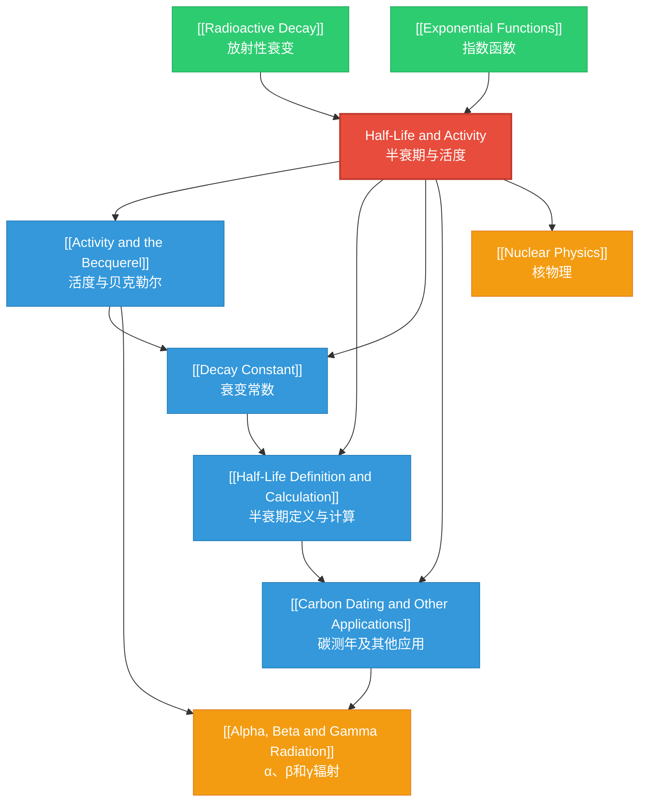

# 1. Overview / 概述

**English:**
This topic explores the quantitative description of radioactive decay, focusing on two fundamental concepts: **activity** (the rate at which a radioactive sample decays) and **half-life** (the time taken for half the nuclei in a sample to decay). These concepts are essential for understanding how radioactive materials behave over time, enabling applications ranging from medical imaging and cancer treatment to archaeological dating and nuclear power management.

In both Cambridge 9702 and Edexcel IAL syllabi, this topic builds directly on [[Radioactive Decay]] and serves as a foundation for understanding [[Alpha, Beta and Gamma Radiation]] properties. The mathematical framework involves exponential decay, linking the decay constant λ to half-life T₁/₂ through the equation λ = ln(2)/T₁/₂. Students must master both conceptual understanding and quantitative problem-solving, including graph interpretation and logarithmic analysis.

Real-world applications include [[Carbon Dating and Other Applications]] for determining the age of archaeological artefacts, medical tracers for diagnosing diseases, and monitoring nuclear waste decay. In examinations, this topic appears in multiple-choice questions, structured calculations, and practical-based questions requiring graph plotting and analysis of decay curves.

**中文：**
本主题探讨放射性衰变的定量描述，重点介绍两个基本概念：**活度**（放射性样品衰变的速率）和**半衰期**（样品中一半原子核衰变所需的时间）。这些概念对于理解放射性物质随时间的行为至关重要，其应用范围从医学成像和癌症治疗到考古测年和核能管理。

在剑桥9702和爱德思IAL教学大纲中，本主题直接建立在[[放射性衰变]]的基础上，并为理解[[α、β和γ辐射]]的性质奠定基础。数学框架涉及指数衰变，通过方程 λ = ln(2)/T₁/₂ 将衰变常数 λ 与半衰期 T₁/₂ 联系起来。学生必须掌握概念理解和定量问题解决，包括图表解释和对数分析。

实际应用包括[[碳测年及其他应用]]以确定考古文物的年龄、用于诊断疾病的医学示踪剂以及监测核废料衰变。在考试中，本主题出现在选择题、结构化计算题和需要绘制图表和分析衰变曲线的实验题中。

---

# 2. Syllabus Learning Objectives / 考纲学习目标

| CAIE 9702 | Edexcel IAL |
|-----------|-------------|
| 23.2(a) Define and use the terms **activity** and **half-life** | 8.7 Understand that radioactive decay is a random process and that the rate of decay is proportional to the number of undecayed nuclei |
| 23.2(b) Use the equation A = λN | 8.8 Use the equation A = λN and understand the meaning of the decay constant λ |
| 23.2(c) Use the equation λ = ln(2)/T₁/₂ | 8.9 Use the equations N = N₀e^(-λt) and A = A₀e^(-λt) |
| 23.2(d) Use the equation N = N₀e^(-λt) | 8.10 Understand the concept of half-life and use the equation T₁/₂ = ln(2)/λ |
| 23.2(e) Use the equation A = A₀e^(-λt) | — |

**Examiner Expectations / 考官期望：**

**English:**
- Candidates must be able to define activity as the number of decays per second, measured in becquerels (Bq)
- Half-life must be defined precisely as the time taken for the number of undecayed nuclei (or activity) to reduce to half its initial value
- The exponential nature of decay must be understood, not just memorised
- Candidates should be able to rearrange and apply equations in unfamiliar contexts
- Graph interpretation skills are essential, particularly for decay curves and log-linear plots
- Practical skills include measuring half-life using a Geiger-Müller tube and plotting decay graphs

**中文：**
- 考生必须能够将活度定义为每秒衰变次数，以贝克勒尔（Bq）为单位
- 半衰期必须精确定义为未衰变原子核数（或活度）减少到初始值一半所需的时间
- 必须理解衰变的指数性质，而不仅仅是记忆
- 考生应能够在陌生情境中重新排列和应用方程
- 图表解读技能至关重要，特别是衰变曲线和对数线性图
- 实验技能包括使用盖革-米勒管测量半衰期和绘制衰变图

> 📋 **CIE Only:** Cambridge 9702 explicitly requires defining and using both activity and half-life terms, with emphasis on the relationship between decay constant and half-life. Paper 5 (A2) may include practical design questions involving half-life measurement.

> 📋 **Edexcel Only:** Edexcel IAL places stronger emphasis on the random nature of radioactive decay and the statistical interpretation of decay processes. Unit 6 (Practical Skills) may require students to determine half-life from experimental data using graphical methods.

---

# 3. Core Definitions / 核心定义

| Term (EN/CN) | Definition (EN) | Definition (CN) | Common Mistakes / 常见错误 |
|--------------|-----------------|-----------------|---------------------------|
| **Activity / 活度** (A) | The number of radioactive decays per second occurring in a sample, measured in becquerels (Bq) | 样品中每秒发生的放射性衰变次数，以贝克勒尔（Bq）为单位 | ❌ Confusing activity with count rate (activity is decays in the sample; count rate includes detector efficiency) |
| **Half-life / 半衰期** (T₁/₂) | The time taken for the number of undecayed nuclei (or activity) of a radioactive isotope to decrease to half its initial value | 放射性同位素的未衰变原子核数（或活度）减少到初始值一半所需的时间 | ❌ Thinking half-life is the time for all nuclei to decay; ❌ Confusing with mean lifetime |
| **Decay Constant / 衰变常数** (λ) | The probability per unit time that a given nucleus will decay; the fraction of nuclei decaying per second | 给定原子核在单位时间内衰变的概率；每秒衰变的原子核比例 | ❌ Units confusion: λ has units s⁻¹, not Bq; ❌ Thinking λ changes with time |
| **Undecayed Nuclei / 未衰变原子核** (N) | The number of radioactive nuclei that have not yet decayed at a given time | 在给定时间尚未衰变的放射性原子核数量 | ❌ Confusing N with total initial nuclei N₀ |
| **Becquerel / 贝克勒尔** (Bq) | The SI unit of activity; 1 Bq = 1 decay per second | 活度的国际单位制单位；1 Bq = 1次衰变/秒 | ❌ Using Bq for count rate; ❌ Forgetting that Bq is a very small unit |
| **Exponential Decay / 指数衰变** | A process where the rate of decrease of a quantity is proportional to the quantity itself | 量的减少速率与量本身成正比的过程 | ❌ Thinking decay is linear; ❌ Misinterpreting the exponential curve |

---

# 4. Key Concepts Explained / 关键概念详解

## 4.1 Activity and the Becquerel / 活度与贝克勒尔

### Explanation / 解释
**English:**
[[Activity and the Becquerel]] is the fundamental measure of how "active" a radioactive sample is. Activity A is defined as the rate at which nuclei decay: A = -dN/dt, where N is the number of undecayed nuclei. The negative sign indicates that N decreases with time. The SI unit is the becquerel (Bq), where 1 Bq = 1 decay per second. For a sample containing N undecayed nuclei, the activity is proportional to N: A = λN, where λ is the [[Decay Constant]].

Activity is not the same as count rate measured by a detector. A Geiger-Müller tube typically detects only a fraction of decays due to geometry and efficiency factors. The actual activity of a sample is always higher than the measured count rate.

**中文：**
[[活度与贝克勒尔]]是衡量放射性样品"活跃程度"的基本量。活度 A 定义为原子核衰变的速率：A = -dN/dt，其中 N 是未衰变原子核的数量。负号表示 N 随时间减少。国际单位制单位是贝克勒尔（Bq），1 Bq = 1次衰变/秒。对于含有 N 个未衰变原子核的样品，活度与 N 成正比：A = λN，其中 λ 是[[衰变常数]]。

活度不等于探测器测量的计数率。由于几何因素和效率因素，盖革-米勒管通常只检测到一部分衰变。样品的实际活度总是高于测量的计数率。

### Physical Meaning / 物理意义
**English:**
Activity tells us how many radioactive decays are happening every second. A sample with activity 100 Bq undergoes 100 decays each second. This is important for safety: higher activity means more radiation emitted per second. In medical applications, a tracer with known activity is injected into a patient, and the activity detected outside the body reveals information about organ function.

**中文：**
活度告诉我们每秒发生多少次放射性衰变。活度为100 Bq的样品每秒发生100次衰变。这对安全很重要：活度越高，每秒发射的辐射越多。在医学应用中，将已知活度的示踪剂注入患者体内，在体外检测到的活度揭示了器官功能的信息。

### Common Misconceptions / 常见误区
- ❌ "Activity is the same as count rate" — Activity is decays in the sample; count rate is detected decays (always less)
- ❌ "Activity is constant over time" — Activity decreases exponentially as nuclei decay
- ❌ "1 Bq is a large unit" — 1 Bq is actually very small; typical sources have kBq or MBq activities

### Exam Tips / 考试提示
**English:**
Cambridge and Edexcel often ask students to distinguish between activity and count rate. In practical questions, you may need to calculate actual activity from count rate using correction factors. Remember that A = λN is a fundamental relationship — if you know any two of A, λ, or N, you can find the third.

**中文：**
剑桥和爱德思经常要求学生区分活度和计数率。在实验题中，你可能需要使用修正因子从计数率计算实际活度。记住 A = λN 是一个基本关系——如果你知道 A、λ 或 N 中的任意两个，就可以求出第三个。

---

## 4.2 Half-Life Definition and Calculation / 半衰期定义与计算

### Explanation / 解释
**English:**
[[Half-Life Definition and Calculation]] is one of the most important concepts in radioactivity. The half-life T₁/₂ is the time required for the number of undecayed nuclei (or the activity) to fall to half its original value. Crucially, half-life is constant for a given isotope — it does not depend on the initial amount, temperature, pressure, or chemical state of the sample.

The relationship between half-life and [[Decay Constant]] is derived from the exponential decay equation: when t = T₁/₂, N = N₀/2. Substituting into N = N₀e^(-λt) gives:
N₀/2 = N₀e^(-λT₁/₂)
1/2 = e^(-λT₁/₂)
ln(1/2) = -λT₁/₂
-ln(2) = -λT₁/₂
λ = ln(2)/T₁/₂ or T₁/₂ = ln(2)/λ

**中文：**
[[半衰期定义与计算]]是放射性中最重要的概念之一。半衰期 T₁/₂ 是未衰变原子核数（或活度）下降到原始值一半所需的时间。关键是，对于给定的同位素，半衰期是恒定的——它不依赖于样品的初始量、温度、压力或化学状态。

半衰期与[[衰变常数]]的关系是从指数衰变方程推导出来的：当 t = T₁/₂ 时，N = N₀/2。代入 N = N₀e^(-λt) 得到：
N₀/2 = N₀e^(-λT₁/₂)
1/2 = e^(-λT₁/₂)
ln(1/2) = -λT₁/₂
-ln(2) = -λT₁/₂
λ = ln(2)/T₁/₂ 或 T₁/₂ = ln(2)/λ

### Physical Meaning / 物理意义
**English:**
Half-life tells us how quickly a radioactive substance decays. Isotopes with short half-lives (e.g., technetium-99m, T₁/₂ = 6 hours) decay rapidly and are useful for medical imaging because they don't remain radioactive in the body for long. Isotopes with long half-lives (e.g., uranium-238, T₁/₂ = 4.5 billion years) decay very slowly and are found in nature. After one half-life, half the original nuclei remain; after two half-lives, one-quarter remain; after three half-lives, one-eighth remain, and so on.

**中文：**
半衰期告诉我们放射性物质衰变的速度。半衰期短的同位素（如锝-99m，半衰期=6小时）衰变迅速，适用于医学成像，因为它们不会在体内长时间保持放射性。半衰期长的同位素（如铀-238，半衰期=45亿年）衰变非常缓慢，存在于自然界中。经过一个半衰期后，一半的原始原子核保留；经过两个半衰期后，四分之一保留；经过三个半衰期后，八分之一保留，依此类推。

### Common Misconceptions / 常见误区
- ❌ "Half-life is the time for all nuclei to decay" — After one half-life, half remain; after two, one-quarter remain; it never reaches zero
- ❌ "Half-life depends on temperature or pressure" — Half-life is constant for a given isotope, unaffected by external conditions
- ❌ "Half-life is the same as mean lifetime" — Mean lifetime τ = 1/λ = T₁/₂/ln(2), which is about 1.44 times longer than half-life

### Exam Tips / 考试提示
**English:**
Examiners frequently test the relationship λ = ln(2)/T₁/₂. You must be able to:
1. Calculate half-life from decay constant and vice versa
2. Determine half-life from a decay graph (reading the time for activity to halve)
3. Use half-life to calculate the fraction remaining after a given time
4. Apply the concept to [[Carbon Dating and Other Applications]]

Common exam question: "A sample has activity 800 Bq. After 24 hours, the activity is 50 Bq. Find the half-life." Solution: 800 → 400 (1 half-life) → 200 (2) → 100 (3) → 50 (4 half-lives). So 24 hours = 4 × T₁/₂, giving T₁/₂ = 6 hours.

**中文：**
考官经常测试 λ = ln(2)/T₁/₂ 的关系。你必须能够：
1. 从衰变常数计算半衰期，反之亦然
2. 从衰变图确定半衰期（读取活度减半的时间）
3. 使用半衰期计算给定时间后剩余的比例
4. 将概念应用于[[碳测年及其他应用]]

常见考题："一个样品活度为800 Bq。24小时后，活度为50 Bq。求半衰期。" 解法：800 → 400（1个半衰期）→ 200（2个）→ 100（3个）→ 50（4个半衰期）。所以24小时 = 4 × T₁/₂，得出 T₁/₂ = 6小时。

---

## 4.3 Decay Constant / 衰变常数

### Explanation / 解释
**English:**
The [[Decay Constant]] λ is a fundamental property of a radioactive isotope that describes the probability of decay per unit time. It has units of s⁻¹ (per second). A larger decay constant means a higher probability of decay per second, hence a shorter half-life.

The relationship between activity and decay constant is A = λN. This equation tells us that the activity is directly proportional to both the decay constant and the number of undecayed nuclei. For a given isotope (fixed λ), activity decreases as N decreases.

The decay constant is related to half-life by λ = ln(2)/T₁/₂. This is one of the most important equations in the topic and is frequently tested.

**中文：**
[[衰变常数]] λ 是放射性同位素的基本属性，描述了单位时间内衰变的概率。其单位为 s⁻¹（每秒）。衰变常数越大，每秒衰变的概率越高，因此半衰期越短。

活度与衰变常数的关系是 A = λN。这个方程告诉我们，活度与衰变常数和未衰变原子核数都成正比。对于给定的同位素（λ固定），活度随着 N 的减少而减少。

衰变常数与半衰期的关系为 λ = ln(2)/T₁/₂。这是本主题中最重要的方程之一，经常被测试。

### Physical Meaning / 物理意义
**English:**
If λ = 0.1 s⁻¹, this means each nucleus has a 10% chance of decaying in the next second. For a large sample, approximately 10% of the nuclei will decay each second. The decay constant is a measure of the "instability" of a nucleus — larger λ means more unstable nuclei that decay more quickly.

**中文：**
如果 λ = 0.1 s⁻¹，这意味着每个原子核在下一秒有10%的衰变概率。对于大样品，大约10%的原子核每秒会衰变。衰变常数是原子核"不稳定性"的度量——λ越大，原子核越不稳定，衰变越快。

### Common Misconceptions / 常见误区
- ❌ "λ changes over time" — λ is constant for a given isotope
- ❌ "λ has units of Bq" — λ has units s⁻¹; activity A has units Bq
- ❌ "λ is the fraction decaying per second" — λ is the probability per second; for small λ, it approximates the fraction

### Exam Tips / 考试提示
**English:**
You must be able to:
1. Calculate λ from T₁/₂ and vice versa
2. Use A = λN to find any one variable given the other two
3. Understand that λ is constant regardless of sample size
4. Use λ in the exponential decay equations N = N₀e^(-λt) and A = A₀e^(-λt)

> 📋 **CIE Only:** Cambridge 9702 explicitly requires using the equation λ = ln(2)/T₁/₂ in calculations.

> 📋 **Edexcel Only:** Edexcel IAL emphasises understanding λ as a probability constant and its role in the random nature of decay.

**中文：**
你必须能够：
1. 从 T₁/₂ 计算 λ，反之亦然
2. 使用 A = λN 在已知两个变量的情况下求第三个
3. 理解 λ 是常数，与样品大小无关
4. 在指数衰变方程 N = N₀e^(-λt) 和 A = A₀e^(-λt) 中使用 λ

---

## 4.4 Exponential Decay Equations / 指数衰变方程

### Explanation / 解释
**English:**
Radioactive decay follows an exponential decay law because the rate of decay is proportional to the number of undecayed nuclei: dN/dt = -λN. Solving this differential equation gives:

N = N₀e^(-λt)

where N₀ is the initial number of undecayed nuclei, N is the number at time t, and λ is the decay constant.

Since activity A = λN, we also have:

A = A₀e^(-λt)

where A₀ = λN₀ is the initial activity.

These equations describe a smooth, continuous decrease. The fraction remaining after time t is N/N₀ = e^(-λt). After one half-life (t = T₁/₂), this fraction is 1/2, confirming that e^(-λT₁/₂) = 1/2.

**中文：**
放射性衰变遵循指数衰变定律，因为衰变速率与未衰变原子核数成正比：dN/dt = -λN。解这个微分方程得到：

N = N₀e^(-λt)

其中 N₀ 是初始未衰变原子核数，N 是时间 t 时的数量，λ 是衰变常数。

由于活度 A = λN，我们还有：

A = A₀e^(-λt)

其中 A₀ = λN₀ 是初始活度。

这些方程描述了一个平滑、连续的减少过程。时间 t 后的剩余比例为 N/N₀ = e^(-λt)。经过一个半衰期（t = T₁/₂）后，这个比例是 1/2，证实了 e^(-λT₁/₂) = 1/2。

### Physical Meaning / 物理意义
**English:**
Exponential decay means the quantity decreases by the same fraction in equal time intervals. For example, if 20% decays in the first hour, then 20% of what remains decays in the second hour, and so on. This is different from linear decay, where the same absolute amount decays each hour.

**中文：**
指数衰变意味着量在相等的时间间隔内减少相同的比例。例如，如果第一个小时衰变了20%，那么第二个小时衰变剩余量的20%，依此类推。这与线性衰变不同，线性衰变每小时衰变相同的绝对量。

### Common Misconceptions / 常见误区
- ❌ "Exponential decay means the amount decreases linearly" — It decreases by a constant fraction, not a constant amount
- ❌ "The equations only work for integer numbers of half-lives" — They work for any time t
- ❌ "N₀ is the total number of nuclei including decay products" — N₀ is only the initial number of radioactive nuclei

### Exam Tips / 考试提示
**English:**
You must be able to:
1. Use N = N₀e^(-λt) and A = A₀e^(-λt) in calculations
2. Rearrange to find t: t = (1/λ)ln(N₀/N)
3. Use natural logarithms correctly
4. Convert between half-life and decay constant
5. Apply to problems involving [[Carbon Dating and Other Applications]]

Common exam technique: For problems involving whole numbers of half-lives, use the "halving" method (divide by 2 repeatedly) rather than the exponential equation. For fractional half-lives, use the exponential equation.

**中文：**
你必须能够：
1. 在计算中使用 N = N₀e^(-λt) 和 A = A₀e^(-λt)
2. 重新排列求 t：t = (1/λ)ln(N₀/N)
3. 正确使用自然对数
4. 在半衰期和衰变常数之间转换
5. 应用于涉及[[碳测年及其他应用]]的问题

常见考试技巧：对于涉及整数个半衰期的问题，使用"减半"方法（反复除以2）而不是指数方程。对于分数个半衰期，使用指数方程。

---

## 4.5 Carbon Dating and Other Applications / 碳测年及其他应用

### Explanation / 解释
**English:**
[[Carbon Dating and Other Applications]] uses the radioactive isotope carbon-14 (¹⁴C) to determine the age of organic materials. Carbon-14 has a half-life of 5730 years and is produced in the upper atmosphere by cosmic rays. Living organisms absorb carbon-14 through photosynthesis or the food chain, maintaining a constant ratio of ¹⁴C to ¹²C while alive. After death, no new carbon-14 is absorbed, and the existing ¹⁴C decays exponentially.

By measuring the remaining activity of carbon-14 in a sample and comparing it to the activity in a living organism, the age can be calculated using the exponential decay equation.

Other applications include:
- Medical tracers (e.g., technetium-99m for imaging)
- Cancer radiotherapy (e.g., cobalt-60)
- Nuclear waste management (monitoring decay)
- Geological dating (uranium-lead dating)

**中文：**
[[碳测年及其他应用]]使用放射性同位素碳-14（¹⁴C）来确定有机材料的年龄。碳-14的半衰期为5730年，由宇宙射线在大气上层产生。生物体通过光合作用或食物链吸收碳-14，在活着时保持¹⁴C与¹²C的恒定比例。死亡后，不再吸收新的碳-14，现有的¹⁴C指数衰变。

通过测量样品中碳-14的剩余活度并与活生物体中的活度进行比较，可以使用指数衰变方程计算年龄。

其他应用包括：
- 医学示踪剂（如用于成像的锝-99m）
- 癌症放射治疗（如钴-60）
- 核废料管理（监测衰变）
- 地质测年（铀-铅测年）

### Physical Meaning / 物理意义
**English:**
Carbon dating works because the half-life of carbon-14 (5730 years) is comparable to archaeological timescales. For samples up to about 50,000 years old (about 9 half-lives), enough carbon-14 remains to measure accurately. For older samples, the activity is too low to distinguish from background radiation.

**中文：**
碳测年之所以有效，是因为碳-14的半衰期（5730年）与考古时间尺度相当。对于大约5万年（约9个半衰期）以内的样品，有足够的碳-14可以准确测量。对于更古老的样品，活度太低，无法与背景辐射区分。

### Common Misconceptions / 常见误区
- ❌ "Carbon dating can date any material" — Only organic materials that were once alive
- ❌ "Carbon dating is accurate for millions of years" — Limited to about 50,000 years
- ❌ "The ratio of ¹⁴C to ¹²C in the atmosphere is constant" — It varies slightly, requiring calibration

### Exam Tips / 考试提示
**English:**
Examiners may ask you to:
1. Calculate the age of a sample given its current activity and the initial activity
2. Explain why carbon dating is limited to certain time ranges
3. Discuss sources of uncertainty in carbon dating
4. Compare carbon dating with other dating methods

**中文：**
考官可能会要求你：
1. 给定样品的当前活度和初始活度，计算样品的年龄
2. 解释为什么碳测年限于一定的时间范围
3. 讨论碳测年的不确定性来源
4. 比较碳测年与其他测年方法

> 📋 **CIE Only:** Cambridge 9702 may include carbon dating in Paper 4 structured questions, requiring calculations and explanations.

> 📋 **Edexcel Only:** Edexcel IAL may include carbon dating in the context of practical applications and may ask students to evaluate the reliability of dating methods.

---

# 5. Essential Equations / 核心公式

## 5.1 Activity Equation / 活度方程

**Equation / 公式:**
$$ A = \lambda N $$

**Variables / 变量:**
| Symbol (符号) | Meaning (EN) | Meaning (CN) | Unit (单位) |
|--------------|-------------|-------------|------------|
| A | Activity of the sample | 样品的活度 | Bq (becquerel) |
| λ | Decay constant | 衰变常数 | s⁻¹ |
| N | Number of undecayed nuclei | 未衰变原子核数 | dimensionless |

**Derivation / 推导:**
**English:**
The rate of decay is proportional to the number of undecayed nuclei:
dN/dt = -λN
Since activity A = -dN/dt (the negative sign makes A positive), we have:
A = λN

**中文：**
衰变速率与未衰变原子核数成正比：
dN/dt = -λN
由于活度 A = -dN/dt（负号使 A 为正），我们有：
A = λN

**Conditions / 适用条件:**
**English:** Applies to any radioactive sample where the decay constant is known and the number of undecayed nuclei can be determined. Valid for all radioactive isotopes.

**中文：** 适用于任何已知衰变常数且可确定未衰变原子核数的放射性样品。对所有放射性同位素都有效。

**Limitations / 局限性:**
**English:** Assumes a pure sample of a single isotope. For mixtures of isotopes, the total activity is the sum of individual activities.

**中文：** 假设是单一同位素的纯样品。对于同位素混合物，总活度是各个活度之和。

**Rearrangements / 变形:**
$$ \lambda = \frac{A}{N} \quad \text{or} \quad N = \frac{A}{\lambda} $$

---

## 5.2 Half-Life and Decay Constant Relationship / 半衰期与衰变常数关系

**Equation / 公式:**
$$ \lambda = \frac{\ln 2}{T_{1/2}} \quad \text{or} \quad T_{1/2} = \frac{\ln 2}{\lambda} $$

**Variables / 变量:**
| Symbol (符号) | Meaning (EN) | Meaning (CN) | Unit (单位) |
|--------------|-------------|-------------|------------|
| λ | Decay constant | 衰变常数 | s⁻¹ |
| T₁/₂ | Half-life | 半衰期 | s (or any time unit) |
| ln 2 | Natural logarithm of 2 | 2的自然对数 | dimensionless (≈ 0.693) |

**Derivation / 推导:**
**English:**
Starting from N = N₀e^(-λt), at t = T₁/₂, N = N₀/2:
N₀/2 = N₀e^(-λT₁/₂)
1/2 = e^(-λT₁/₂)
ln(1/2) = -λT₁/₂
-ln 2 = -λT₁/₂
λ = ln 2 / T₁/₂

**中文：**
从 N = N₀e^(-λt) 开始，在 t = T₁/₂ 时，N = N₀/2：
N₀/2 = N₀e^(-λT₁/₂)
1/2 = e^(-λT₁/₂)
ln(1/2) = -λT₁/₂
-ln 2 = -λT₁/₂
λ = ln 2 / T₁/₂

**Conditions / 适用条件:**
**English:** Valid for all radioactive isotopes. The half-life must be constant (which it is for all known radioactive isotopes).

**中文：** 对所有放射性同位素都有效。半衰期必须是常数（所有已知放射性同位素都是如此）。

**Limitations / 局限性:**
**English:** None for radioactive decay. However, this relationship does not apply to other exponential processes with different definitions of "half-life."

**中文：** 对于放射性衰变没有局限性。然而，这个关系不适用于具有不同"半衰期"定义的其他指数过程。

**Rearrangements / 变形:**
$$ T_{1/2} = \frac{\ln 2}{\lambda} \quad \text{or} \quad \ln 2 = \lambda T_{1/2} $$

---

## 5.3 Exponential Decay Law (Nuclei) / 指数衰变定律（原子核数）

**Equation / 公式:**
$$ N = N_0 e^{-\lambda t} $$

**Variables / 变量:**
| Symbol (符号) | Meaning (EN) | Meaning (CN) | Unit (单位) |
|--------------|-------------|-------------|------------|
| N | Number of undecayed nuclei at time t | 时间 t 时的未衰变原子核数 | dimensionless |
| N₀ | Initial number of undecayed nuclei | 初始未衰变原子核数 | dimensionless |
| λ | Decay constant | 衰变常数 | s⁻¹ |
| t | Time elapsed | 经过的时间 | s |

**Derivation / 推导:**
**English:**
From dN/dt = -λN, rearranging:
dN/N = -λ dt
Integrating both sides:
∫(dN/N) = -λ∫dt
ln N = -λt + C
At t = 0, N = N₀, so C = ln N₀
ln N = -λt + ln N₀
ln(N/N₀) = -λt
N/N₀ = e^(-λt)
N = N₀e^(-λt)

**中文：**
从 dN/dt = -λN，重新排列：
dN/N = -λ dt
两边积分：
∫(dN/N) = -λ∫dt
ln N = -λt + C
在 t = 0 时，N = N₀，所以 C = ln N₀
ln N = -λt + ln N₀
ln(N/N₀) = -λt
N/N₀ = e^(-λt)
N = N₀e^(-λt)

**Conditions / 适用条件:**
**English:** Valid for any radioactive sample undergoing exponential decay. Assumes a pure sample of a single isotope with constant decay constant.

**中文：** 适用于任何经历指数衰变的放射性样品。假设是单一同位素的纯样品，衰变常数恒定。

**Limitations / 局限性:**
**English:** Does not apply to mixtures of isotopes with different decay constants unless each isotope is treated separately. The equation describes statistical behavior of large numbers of nuclei; for very small samples, statistical fluctuations become significant.

**中文：** 不适用于具有不同衰变常数的同位素混合物，除非分别处理每种同位素。该方程描述大量原子核的统计行为；对于非常小的样品，统计波动变得显著。

**Rearrangements / 变形:**
$$ t = \frac{1}{\lambda} \ln\left(\frac{N_0}{N}\right) \quad \text{or} \quad \lambda = \frac{1}{t} \ln\left(\frac{N_0}{N}\right) $$

---

## 5.4 Exponential Decay Law (Activity) / 指数衰变定律（活度）

**Equation / 公式:**
$$ A = A_0 e^{-\lambda t} $$

**Variables / 变量:**
| Symbol (符号) | Meaning (EN) | Meaning (CN) | Unit (单位) |
|--------------|-------------|-------------|------------|
| A | Activity at time t | 时间 t 时的活度 | Bq |
| A₀ | Initial activity | 初始活度 | Bq |
| λ | Decay constant | 衰变常数 | s⁻¹ |
| t | Time elapsed | 经过的时间 | s |

**Derivation / 推导:**
**English:**
Since A = λN and A₀ = λN₀, dividing:
A/A₀ = (λN)/(λN₀) = N/N₀ = e^(-λt)
Therefore: A = A₀e^(-λt)

**中文：**
由于 A = λN 且 A₀ = λN₀，相除：
A/A₀ = (λN)/(λN₀) = N/N₀ = e^(-λt)
因此：A = A₀e^(-λt)

**Conditions / 适用条件:**
**English:** Same as for N = N₀e^(-λt). Valid for any radioactive sample where activity is proportional to the number of undecayed nuclei.

**中文：** 与 N = N₀e^(-λt) 相同。适用于任何活度与未衰变原子核数成正比的放射性样品。

**Limitations / 局限性:**
**English:** Same as for N = N₀e^(-λt). Additionally, assumes that the measured activity accurately represents the decay rate of the sample.

**中文：** 与 N = N₀e^(-λt) 相同。此外，假设测量的活度准确代表样品的衰变速率。

**Rearrangements / 变形:**
$$ t = \frac{1}{\lambda} \ln\left(\frac{A_0}{A}\right) \quad \text{or} \quad \lambda = \frac{1}{t} \ln\left(\frac{A_0}{A}\right) $$

---

# 6. Graphs and Relationships / 图表与关系

## 6.1 Exponential Decay Curve (N vs t) / 指数衰变曲线（N 对 t）

### Axes / 坐标轴
**English:** x-axis: Time (t), y-axis: Number of undecayed nuclei (N) or Activity (A)
**中文：** x轴：时间 (t)，y轴：未衰变原子核数 (N) 或活度 (A)

### Shape / 形状
**English:** A smooth curve starting at N₀ (or A₀) on the y-axis, decreasing rapidly at first, then more slowly, approaching zero asymptotically. The curve never reaches zero.
**中文：** 从 y 轴上的 N₀（或 A₀）开始的平滑曲线，最初迅速下降，然后逐渐变慢，渐近地趋近于零。曲线永远不会达到零。

### Gradient Meaning / 斜率含义
**English:** The gradient (slope) at any point represents the negative of the activity at that time: dN/dt = -A = -λN. The gradient becomes less steep over time as N decreases.
**中文：** 任意点的梯度（斜率）代表该时间的活度的负值：dN/dt = -A = -λN。随着 N 减少，梯度随时间变得不那么陡峭。

### Area Meaning / 面积含义
**English:** The area under the N vs t curve from t = 0 to t = ∞ represents the total number of decays that will ever occur, which equals N₀ (all nuclei will eventually decay).
**中文：** N 对 t 曲线下从 t = 0 到 t = ∞ 的面积代表将发生的总衰变次数，等于 N₀（所有原子核最终都会衰变）。

### Exam Interpretation / 考试解读
**English:**
- Read half-life directly: find the time for N to drop from N₀ to N₀/2
- Compare half-lives of different isotopes: steeper curve = shorter half-life
- Determine activity from gradient at a specific point
- Use the curve to find N at any time t

**中文：**
- 直接读取半衰期：找到 N 从 N₀ 下降到 N₀/2 的时间
- 比较不同同位素的半衰期：曲线越陡 = 半衰期越短
- 从特定点的梯度确定活度
- 使用曲线找到任意时间 t 的 N

### Common Questions / 常见问题
**English:**
- "Use the graph to determine the half-life of the isotope."
- "Sketch the decay curve for an isotope with a longer/shorter half-life."
- "Explain why the gradient decreases over time."

**中文：**
- "使用图表确定同位素的半衰期。"
- "画出半衰期更长/更短的同位素的衰变曲线。"
- "解释为什么梯度随时间减小。"

> 📷 **IMAGE PROMPT — GRAPH-01: Exponential Decay Curve**
>
> A Cartesian graph showing an exponential decay curve. x-axis labeled "Time / s" with evenly spaced ticks. y-axis labeled "Number of undecayed nuclei N" starting from N₀ at the top. The curve starts at (0, N₀) and decreases smoothly, asymptotically approaching the x-axis. Mark T₁/₂ on the x-axis where N = N₀/2, and mark 2T₁/₂ where N = N₀/4. Use a clean, educational style with gridlines. Include a dashed horizontal line at N₀/2 and a vertical dashed line at T₁/₂.

---

## 6.2 Log-Linear Plot (ln N vs t) / 对数线性图（ln N 对 t）

### Axes / 坐标轴
**English:** x-axis: Time (t), y-axis: Natural logarithm of undecayed nuclei (ln N) or ln A
**中文：** x轴：时间 (t)，y轴：未衰变原子核数的自然对数 (ln N) 或 ln A

### Shape / 形状
**English:** A straight line with negative slope. This is because taking the natural log of N = N₀e^(-λt) gives ln N = ln N₀ - λt, which is of the form y = mx + c.
**中文：** 一条具有负斜率的直线。这是因为对 N = N₀e^(-λt) 取自然对数得到 ln N = ln N₀ - λt，这是 y = mx + c 的形式。

### Gradient Meaning / 斜率含义
**English:** The gradient of the ln N vs t graph is -λ (negative of the decay constant). A steeper negative slope means a larger decay constant and shorter half-life.
**中文：** ln N 对 t 图的梯度是 -λ（衰变常数的负值）。负斜率越陡，意味着衰变常数越大，半衰期越短。

### Area Meaning / 面积含义
**English:** Not typically meaningful for this graph.
**中文：** 这个图的面积通常没有意义。

### Exam Interpretation / 考试解读
**English:**
- Determine λ from the gradient: λ = -gradient
- Find N₀ from the y-intercept: ln N₀ = y-intercept
- Calculate half-life from λ: T₁/₂ = ln 2/λ
- Verify exponential decay: if the plot is linear, decay is exponential
- Use to find N at any time more accurately than from the curved graph

**中文：**
- 从梯度确定 λ：λ = -梯度
- 从 y 截距找到 N₀：ln N₀ = y 截距
- 从 λ 计算半衰期：T₁/₂ = ln 2/λ
- 验证指数衰变：如果图是线性的，则衰变是指数的
- 用于比曲线图更准确地找到任意时间的 N

### Common Questions / 常见问题
**English:**
- "Plot a graph of ln N against t and use it to determine the decay constant."
- "Explain why a graph of ln N against t gives a straight line."
- "Use the gradient to calculate the half-life of the isotope."

**中文：**
- "绘制 ln N 对 t 的图，并用它来确定衰变常数。"
- "解释为什么 ln N 对 t 的图是一条直线。"
- "使用梯度计算同位素的半衰期。"

> 📷 **IMAGE PROMPT — GRAPH-02: Log-Linear Plot**
>
> A Cartesian graph showing a straight line with negative slope. x-axis labeled "Time / s". y-axis labeled "ln N". The line starts at ln N₀ on the y-axis and decreases linearly. Mark the gradient calculation with a right triangle showing Δ(ln N) and Δt. Use a clean educational style with gridlines. Include a note: "Gradient = -λ".

---

## 6.3 Activity vs Time for Different Isotopes / 不同同位素的活度对时间图

### Axes / 坐标轴
**English:** x-axis: Time (t), y-axis: Activity (A)
**中文：** x轴：时间 (t)，y轴：活度 (A)

### Shape / 形状
**English:** Multiple exponential decay curves on the same axes, each starting at different initial activities (A₀) and decaying at different rates. Isotopes with shorter half-lives have steeper curves.
**中文：** 同一坐标轴上的多条指数衰变曲线，每条从不同的初始活度（A₀）开始，以不同的速率衰变。半衰期较短的同位素具有较陡的曲线。

### Gradient Meaning / 斜率含义
**English:** The gradient at any point is -λA, which is steeper for larger λ (shorter half-life) and larger A.
**中文：** 任意点的梯度是 -λA，对于较大的 λ（较短的半衰期）和较大的 A，梯度更陡。

### Area Meaning / 面积含义
**English:** The area under each curve represents the total number of decays for that isotope (which equals N₀ for that isotope).
**中文：** 每条曲线下的面积代表该同位素的总衰变次数（等于该同位素的 N₀）。

### Exam Interpretation / 考试解读
**English:**
- Compare half-lives: the curve that drops fastest has the shortest half-life
- Compare initial activities: higher starting point means more initial nuclei
- Identify which isotope will be "safe" sooner (activity below a threshold)

**中文：**
- 比较半衰期：下降最快的曲线具有最短的半衰期
- 比较初始活度：起点越高意味着初始原子核越多
- 识别哪种同位素会更早"安全"（活度低于阈值）

### Common Questions / 常见问题
**English:**
- "Which isotope has the longest half-life? Explain your reasoning."
- "After 10 seconds, which isotope has the highest activity?"
- "Sketch the decay curve for isotope X on the same axes."

**中文：**
- "哪种同位素的半衰期最长？解释你的推理。"
- "10秒后，哪种同位素的活度最高？"
- "在同一坐标轴上画出同位素 X 的衰变曲线。"

---

# 7. Required Diagrams / 必备图表

## 7.1 Exponential Decay Curve with Half-Life Marked / 带有半衰期标记的指数衰变曲线

### Description / 描述
**English:**
A graph showing the number of undecayed nuclei N (or activity A) against time t. The curve starts at N₀ (or A₀) and decreases exponentially. Key points are marked: after one half-life (T₁/₂), N = N₀/2; after two half-lives (2T₁/₂), N = N₀/4; after three half-lives (3T₁/₂), N = N₀/8. Dashed lines connect these points to the axes.

**中文：**
显示未衰变原子核数 N（或活度 A）对时间 t 的图。曲线从 N₀（或 A₀）开始并指数下降。标记关键点：一个半衰期（T₁/₂）后，N = N₀/2；两个半衰期（2T₁/₂）后，N = N₀/4；三个半衰期（3T₁/₂）后，N = N₀/8。虚线将这些点连接到坐标轴。

### Image Prompt / 图片生成提示
> 📷 **IMAGE PROMPT — DIAG-01: Exponential Decay Curve with Half-Life Markers**
>
> A clean educational graph in blue on white background. x-axis: "Time / s" with ticks at T₁/₂, 2T₁/₂, 3T₁/₂. y-axis: "Number of undecayed nuclei N" starting at N₀. The exponential decay curve is smooth and thick. Horizontal dashed lines at N₀/2, N₀/4, N₀/8. Vertical dashed lines at T₁/₂, 2T₁/₂, 3T₁/₂. Labels: "T₁/₂", "2T₁/₂", "3T₁/₂" on x-axis; "N₀", "N₀/2", "N₀/4", "N₀/8" on y-axis. Include a small note: "After each half-life, N halves." Style: textbook-quality, vector-like, with gridlines.

### Labels Required / 需要标注
**English:** N₀, N₀/2, N₀/4, N₀/8, T₁/₂, 2T₁/₂, 3T₁/₂, axes labels with units
**中文：** N₀、N₀/2、N₀/4、N₀/8、T₁/₂、2T₁/₂、3T₁/₂、带单位的坐标轴标签

### Exam Importance / 考试重要性
**English:**
This is the most important diagram in the topic. Students must be able to:
- Read half-life from the graph
- Determine the fraction remaining after any number of half-lives
- Sketch decay curves for different isotopes
- Understand the asymptotic approach to zero

**中文：**
这是本主题中最重要的图表。学生必须能够：
- 从图中读取半衰期
- 确定任意半衰期数后的剩余比例
- 画出不同同位素的衰变曲线
- 理解渐近趋近于零

---

## 7.2 Log-Linear Graph for Determining Decay Constant / 用于确定衰变常数的对数线性图

### Description / 描述
**English:**
A graph of ln N (or ln A) against time t, showing a straight line with negative slope. The y-intercept is ln N₀ (or ln A₀). The gradient is -λ. A right triangle is drawn on the line to show the gradient calculation: Δ(ln N)/Δt = -λ.

**中文：**
ln N（或 ln A）对时间 t 的图，显示一条具有负斜率的直线。y 截距是 ln N₀（或 ln A₀）。梯度是 -λ。在线上画一个直角三角形来显示梯度计算：Δ(ln N)/Δt = -λ。

### Image Prompt / 图片生成提示
> 📷 **IMAGE PROMPT — DIAG-02: Log-Linear Graph for Decay Constant**
>
> A Cartesian graph with x-axis "Time / s" and y-axis "ln N". A straight red line with negative slope. The y-intercept is labeled "ln N₀". A right triangle is drawn between two points on the line: horizontal side labeled "Δt", vertical side labeled "Δ(ln N)". Next to the triangle: "Gradient = Δ(ln N)/Δt = -λ". Include gridlines. Style: clean, educational, suitable for a textbook.

### Labels Required / 需要标注
**English:** ln N₀, Δt, Δ(ln N), gradient = -λ, axes labels with units
**中文：** ln N₀、Δt、Δ(ln N)、梯度 = -λ、带单位的坐标轴标签

### Exam Importance / 考试重要性
**English:**
This graph is essential for:
- Determining the decay constant experimentally
- Verifying that decay is exponential (linear plot confirms this)
- Finding initial activity or number of nuclei from the intercept
- Calculating half-life from the gradient

**中文：**
这个图对于以下方面至关重要：
- 通过实验确定衰变常数
- 验证衰变是指数的（线性图确认这一点）
- 从截距找到初始活度或原子核数
- 从梯度计算半衰期

---

## 7.3 Comparison of Decay Curves for Different Half-Lives / 不同半衰期的衰变曲线比较

### Description / 描述
**English:**
Two or three exponential decay curves on the same axes, each representing a different isotope with a different half-life. Isotope A has a short half-life (steep curve), Isotope B has a medium half-life, and Isotope C has a long half-life (shallow curve). All start at the same initial activity A₀ for comparison.

**中文：**
同一坐标轴上的两条或三条指数衰变曲线，每条代表具有不同半衰期的不同同位素。同位素A具有短半衰期（陡曲线），同位素B具有中等半衰期，同位素C具有长半衰期（平缓曲线）。为了比较，所有曲线都从相同的初始活度 A₀ 开始。

### Image Prompt / 图片生成提示
> 📷 **IMAGE PROMPT — DIAG-03: Comparison of Decay Curves**
>
> A Cartesian graph with x-axis "Time / s" and y-axis "Activity A / Bq". Three exponential decay curves in different colors: red (steepest, short half-life), blue (medium), green (shallowest, long half-life). All start at the same point A₀ on the y-axis. Label each curve: "Isotope X: T₁/₂ = 2 s", "Isotope Y: T₁/₂ = 5 s", "Isotope Z: T₁/₂ = 10 s". Include a legend. Style: clean, educational, with gridlines.

### Labels Required / 需要标注
**English:** A₀, T₁/₂ for each isotope, isotope names, axes labels with units, legend
**中文：** A₀、每种同位素的 T₁/₂、同位素名称、带单位的坐标轴标签、图例

### Exam Importance / 考试重要性
**English:**
This diagram helps students:
- Visually compare half-lives
- Understand that steeper curves mean faster decay
- Predict which isotope will have the highest activity after a given time
- Understand why different isotopes are used for different applications

**中文：**
这个图帮助学生：
- 直观地比较半衰期
- 理解较陡的曲线意味着更快的衰变
- 预测在给定时间后哪种同位素的活度最高
- 理解为什么不同的同位素用于不同的应用

---

# 8. Worked Examples / 典型例题

## Example 1: Calculating Half-Life from Activity Data / 例1：从活度数据计算半衰期

### Question / 题目
**English:**
A radioactive sample has an initial activity of 640 Bq. After 30 minutes, the activity is measured as 20 Bq. Calculate:
(a) The number of half-lives that have elapsed
(b) The half-life of the isotope
(c) The decay constant

**中文：**
一个放射性样品的初始活度为640 Bq。30分钟后，测得活度为20 Bq。计算：
(a) 经过的半衰期数
(b) 同位素的半衰期
(c) 衰变常数

### Solution / 解答

**English:**

**(a) Number of half-lives:**
After each half-life, activity halves:
640 → 320 (1 half-life)
320 → 160 (2)
160 → 80 (3)
80 → 40 (4)
40 → 20 (5)

Therefore, 5 half-lives have elapsed.

**(b) Half-life:**
Total time = 30 minutes = 5 × T₁/₂
T₁/₂ = 30/5 = 6 minutes

**(c) Decay constant:**
λ = ln 2 / T₁/₂
λ = 0.693 / (6 × 60) = 0.693 / 360
λ = 1.93 × 10⁻³ s⁻¹

**中文：**

**(a) 半衰期数：**
每个半衰期后，活度减半：
640 → 320（1个半衰期）
320 → 160（2个）
160 → 80（3个）
80 → 40（4个）
40 → 20（5个）

因此，经过了5个半衰期。

**(b) 半衰期：**
总时间 = 30分钟 = 5 × T₁/₂
T₁/₂ = 30/5 = 6分钟

**(c) 衰变常数：**
λ = ln 2 / T₁/₂
λ = 0.693 / (6 × 60) = 0.693 / 360
λ = 1.93 × 10⁻³ s⁻¹

### Final Answer / 最终答案
**Answer:**
(a) 5 half-lives
(b) T₁/₂ = 6 minutes
(c) λ = 1.93 × 10⁻³ s⁻¹

**答案：**
(a) 5个半衰期
(b) T₁/₂ = 6分钟
(c) λ = 1.93 × 10⁻³ s⁻¹

### Examiner Notes / 考官点评
**English:**
- The "halving method" is efficient for whole numbers of half-lives
- Remember to convert minutes to seconds for λ calculation
- Common mistake: forgetting to convert units (minutes to seconds)
- Always show your working for half-life counting

**中文：**
- 对于整数个半衰期，"减半法"是高效的
- 记住在计算 λ 时将分钟转换为秒
- 常见错误：忘记转换单位（分钟到秒）
- 始终展示半衰期计数的计算过程

### Alternative Method / 替代方法
**English:**
Using the exponential equation:
A = A₀e^(-λt)
20 = 640e^(-λ × 1800)
20/640 = e^(-1800λ)
ln(20/640) = -1800λ
ln(0.03125) = -1800λ
-3.466 = -1800λ
λ = 1.93 × 10⁻³ s⁻¹
T₁/₂ = ln 2 / λ = 0.693 / (1.93 × 10⁻³) = 360 s = 6 minutes

**中文：**
使用指数方程：
A = A₀e^(-λt)
20 = 640e^(-λ × 1800)
20/640 = e^(-1800λ)
ln(20/640) = -1800λ
ln(0.03125) = -1800λ
-3.466 = -1800λ
λ = 1.93 × 10⁻³ s⁻¹
T₁/₂ = ln 2 / λ = 0.693 / (1.93 × 10⁻³) = 360 s = 6分钟

---

## Example 2: Carbon Dating Calculation / 例2：碳测年计算

### Question / 题目
**English:**
The activity of carbon-14 in a living organism is 15.3 decays per minute per gram of carbon. An ancient wooden artefact has an activity of 3.82 decays per minute per gram of carbon. The half-life of carbon-14 is 5730 years.
(a) Calculate the decay constant for carbon-14 in years⁻¹.
(b) Determine the age of the artefact.

**中文：**
活生物体中碳-14的活度为每克碳每分钟15.3次衰变。一个古代木制文物的活度为每克碳每分钟3.82次衰变。碳-14的半衰期为5730年。
(a) 计算碳-14的衰变常数（以年⁻¹为单位）。
(b) 确定文物的年龄。

### Solution / 解答

**English:**

**(a) Decay constant:**
λ = ln 2 / T₁/₂
λ = 0.693 / 5730
λ = 1.21 × 10⁻⁴ years⁻¹

**(b) Age of artefact:**
Using A = A₀e^(-λt):
3.82 = 15.3 × e^(-1.21 × 10⁻⁴ × t)
3.82/15.3 = e^(-1.21 × 10⁻⁴ × t)
0.250 = e^(-1.21 × 10⁻⁴ × t)
ln(0.250) = -1.21 × 10⁻⁴ × t
-1.386 = -1.21 × 10⁻⁴ × t
t = 1.386 / (1.21 × 10⁻⁴)
t = 11450 years

**中文：**

**(a) 衰变常数：**
λ = ln 2 / T₁/₂
λ = 0.693 / 5730
λ = 1.21 × 10⁻⁴ 年⁻¹

**(b) 文物年龄：**
使用 A = A₀e^(-λt)：
3.82 = 15.3 × e^(-1.21 × 10⁻⁴ × t)
3.82/15.3 = e^(-1.21 × 10⁻⁴ × t)
0.250 = e^(-1.21 × 10⁻⁴ × t)
ln(0.250) = -1.21 × 10⁻⁴ × t
-1.386 = -1.21 × 10⁻⁴ × t
t = 1.386 / (1.21 × 10⁻⁴)
t = 11450年

### Final Answer / 最终答案
**Answer:**
(a) λ = 1.21 × 10⁻⁴ years⁻¹
(b) Age = 11450 years (approximately 11500 years)

**答案：**
(a) λ = 1.21 × 10⁻⁴ 年⁻¹
(b) 年龄 = 11450年（约11500年）

### Examiner Notes / 考官点评
**English:**
- Note that the activity ratio is exactly 0.250 = 1/4, which corresponds to 2 half-lives (2 × 5730 = 11460 years). The small difference is due to rounding.
- Always check if the ratio corresponds to a whole number of half-lives for a quick verification
- Common mistake: using the wrong units for time (mixing years and seconds)
- Carbon dating assumes the initial activity in the atmosphere has remained constant

**中文：**
- 注意活度比正好是0.250 = 1/4，对应2个半衰期（2 × 5730 = 11460年）。微小差异是由于四舍五入。
- 始终检查比例是否对应整数个半衰期，以便快速验证
- 常见错误：使用错误的时间单位（混淆年和秒）
- 碳测年假设大气中的初始活度保持不变

### Alternative Method / 替代方法
**English:**
Using the halving method:
15.3 → 7.65 (1 half-life)
7.65 → 3.825 (2 half-lives)
The activity is approximately 3.82, so 2 half-lives have elapsed.
Age = 2 × 5730 = 11460 years.

**中文：**
使用减半法：
15.3 → 7.65（1个半衰期）
7.65 → 3.825（2个半衰期）
活度约为3.82，所以经过了2个半衰期。
年龄 = 2 × 5730 = 11460年。

---

# 9. Past Paper Question Types / 历年真题题型

| Question Type / 题型 | Frequency / 频率 | Difficulty / 难度 | Past Paper References / 真题索引 |
|----------------------|------------------|------------------|-------------------------------|
| Calculation of half-life from decay data / 从衰变数据计算半衰期 | High | Medium | 📝 *待填入* |
| Using exponential decay equations / 使用指数衰变方程 | High | Medium-High | 📝 *待填入* |
| Graph analysis (decay curves) / 图表分析（衰变曲线） | Medium | Medium | 📝 *待填入* |
| Log-linear graph interpretation / 对数线性图解读 | Medium | High | 📝 *待填入* |
| Carbon dating calculations / 碳测年计算 | Medium | Medium-High | 📝 *待填入* |
| Definition questions (activity, half-life) / 定义题（活度、半衰期） | Low-Medium | Low | 📝 *待填入* |
| Practical design (half-life measurement) / 实验设计（半衰期测量） | Low (CAIE Paper 5) | High | 📝 *待填入* |
| Comparison of isotopes / 同位素比较 | Low-Medium | Medium | 📝 *待填入* |

> 📝 **题库整理中 / Question Bank Under Construction:** 具体试卷编号（如 9702/23/M/J/24 Q3）将在后续整理真题后填入上表。

**Common Command Words / 常见指令词：**

| Command Word (EN) | Command Word (CN) | Typical Usage / 典型用法 |
|-------------------|-------------------|------------------------|
| State / 陈述 | 陈述 | "State what is meant by the term half-life." |
| Define / 定义 | 定义 | "Define the term activity of a radioactive source." |
| Calculate / 计算 | 计算 | "Calculate the half-life of the isotope." |
| Determine / 确定 | 确定 | "Determine the age of the sample." |
| Explain / 解释 | 解释 | "Explain why the activity decreases exponentially." |
| Describe / 描述 | 描述 | "Describe how you would measure the half-life of a radioactive isotope." |
| Sketch / 画出 | 画出 | "Sketch a graph showing how the activity varies with time." |
| Suggest / 建议 | 建议 | "Suggest why carbon dating is not suitable for dating rocks." |

---

# 10. Practical Skills Connections / 实验技能链接

**English:**
This topic has strong practical connections in both CAIE and Edexcel specifications.

**CAIE Paper 3 (AS) and Paper 5 (A2):**
- Paper 3 may include measuring half-life using a Geiger-Müller tube and a radioactive source
- Paper 5 may require designing an experiment to determine half-life, including:
  - Choice of detector (GM tube)
  - Background radiation measurement and correction
  - Data collection over appropriate time intervals
  - Graph plotting (activity vs time or ln(activity) vs time)
  - Error analysis and uncertainty calculations
  - Safety precautions (use of tongs, shielding, limiting exposure time)

**Edexcel Unit 3 (AS) and Unit 6 (A2):**
- Unit 3: Core practical on radioactive decay
- Unit 6: May involve determining half-life from experimental data
- Key skills include:
  - Setting up GM tube and counter
  - Measuring count rate at regular intervals
  - Subtracting background count
  - Plotting decay curves
  - Using log-linear graphs to determine decay constant
  - Evaluating experimental uncertainties

**Measurements and Uncertainties / 测量与不确定度：**
- Background radiation must be measured and subtracted from all readings
- Count rate follows Poisson statistics: uncertainty = √(count)
- Longer counting times reduce percentage uncertainty
- Systematic errors include dead time of GM tube and geometry effects

**Graph Plotting / 图表绘制：**
- Plot activity (or corrected count rate) against time
- Alternatively, plot ln(activity) against time for a straight line
- Use error bars based on √(count) uncertainties
- Draw line of best fit (curved for exponential, straight for log-linear)
- Determine gradient for log-linear plot to find λ

**Experimental Design / 实验设计：**
- Choose an isotope with a suitable half-life (not too short or too long)
- For short half-lives: measure at short time intervals
- For long half-lives: measure over extended periods or use a different method
- Ensure consistent geometry (same distance, same orientation)
- Repeat measurements to improve reliability

**中文：**
本主题在CAIE和Edexcel规范中都有很强的实验联系。

**CAIE Paper 3（AS）和 Paper 5（A2）：**
- Paper 3可能包括使用盖革-米勒管和放射源测量半衰期
- Paper 5可能要求设计实验来确定半衰期，包括：
  - 探测器的选择（GM管）
  - 背景辐射测量和修正
  - 在适当时间间隔内收集数据
  - 图表绘制（活度对时间或ln(活度)对时间）
  - 误差分析和不确定度计算
  - 安全预防措施（使用镊子、屏蔽、限制暴露时间）

**Edexcel Unit 3（AS）和 Unit 6（A2）：**
- Unit 3：放射性衰变的核心实验
- Unit 6：可能涉及从实验数据确定半衰期
- 关键技能包括：
  - 设置GM管和计数器
  - 定期测量计数率
  - 减去背景计数
  - 绘制衰变曲线
  - 使用对数线性图确定衰变常数
  - 评估实验不确定度

**测量与不确定度：**
- 必须测量背景辐射并从所有读数中减去
- 计数率遵循泊松统计：不确定度 = √(计数)
- 较长的计数时间减少百分比不确定度
- 系统误差包括GM管的死时间和几何效应

**图表绘制：**
- 绘制活度（或修正后的计数率）对时间
- 或者，绘制ln(活度)对时间以获得直线
- 使用基于√(计数)不确定度的误差棒
- 绘制最佳拟合线（指数为曲线，对数为直线）
- 确定对数线性图的梯度以找到λ

**实验设计：**
- 选择具有合适半衰期的同位素（不要太短或太长）
- 对于短半衰期：在短时间间隔内测量
- 对于长半衰期：在较长时间内测量或使用不同的方法
- 确保一致的几何条件（相同距离、相同方向）
- 重复测量以提高可靠性

> 📋 **CIE Only:** CAIE Paper 5 may ask students to design an experiment to determine the half-life of a radioactive isotope, including details of apparatus, procedure, data collection, and analysis.

> 📋 **Edexcel Only:** Edexcel Unit 6 may include a practical question where students analyse experimental data to determine half-life, including error analysis and evaluation of the method.

---

# 11. Concept Map / 概念图谱

---

# 12. Quick Revision Sheet / 速查表

| Category / 类别 | Key Points / 要点 |
|----------------|------------------|
| **Definitions / 定义** | • **Activity (A):** Number of decays per second (Bq) / 每秒衰变次数（Bq） • **Half-life (T₁/₂):** Time for N or A to halve / N或A减半所需时间 • **Decay constant (λ):** Probability of decay per second (s⁻¹) / 每秒衰变概率（s⁻¹） |
| **Equations / 公式** | • A = λN • λ = ln 2 / T₁/₂  or  T₁/₂ = ln 2 / λ • N = N₀e^(-λt) • A = A₀e^(-λt) • ln(N/N₀) = -λt  or  ln(A/A₀) = -λt |
| **Graphs / 图表** | • **N vs t:** Exponential decay curve, gradient = -A / 指数衰变曲线，梯度 = -A • **ln N vs t:** Straight line, gradient = -λ / 直线，梯度 = -λ • **Half-life reading:** Time for N to drop from N₀ to N₀/2 / N从N₀下降到N₀/2的时间 |
| **Key Facts / 关键事实** | • Half-life is constant for a given isotope / 给定同位素的半衰期是常数 • Decay is random but statistically predictable / 衰变是随机的但在统计上可预测 • Activity decreases exponentially, never reaching zero / 活度指数减少，永远不会达到零 • Background radiation must be subtracted / 必须减去背景辐射 • Carbon dating limited to ~50,000 years / 碳测年限于约5万年 |
| **Exam Reminders / 考试提醒** | • Always check units (seconds vs years) / 始终检查单位（秒与年） • Use halving method for whole half-lives / 整数半衰期使用减半法 • Use exponential equation for fractional half-lives / 分数半衰期使用指数方程 • ln 2 ≈ 0.693 (memorise this) / ln 2 ≈ 0.693（记住这个） • Show all working, especially for half-life counting / 展示所有计算过程，特别是半衰期计数 • For log-linear graphs: gradient = -λ / 对于对数线性图：梯度 = -λ • Practical: subtract background, use √(count) for uncertainty / 实验：减去背景，使用√(计数)作为不确定度 |

---

> 📝 **Document Version / 文档版本:** v1.0
> 📝 **Last Updated / 最后更新:** 2024
> 📝 **Next Review / 下次审阅:** When new syllabus changes are published