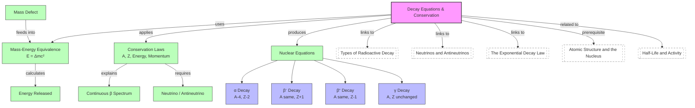

# 1. Overview / 概述

**English:**
This sub-topic covers the fundamental equations that govern radioactive decay and the conservation laws that must be satisfied during nuclear transformations. You will learn how to write balanced nuclear equations for alpha, beta-minus, beta-plus, and gamma decay, and understand the conservation of nucleon number (mass number), proton number (atomic number), energy, and momentum. This is essential for predicting decay products and understanding nuclear stability. It builds directly on [[Atomic Structure and the Nucleus]] and connects to [[Types of Radioactive Decay (Alpha, Beta-, Beta+, Gamma)]] and [[Neutrinos and Antineutrinos]].

**中文:**
本子知识点涵盖控制放射性衰变的基本方程以及核转变过程中必须满足的守恒定律。你将学习如何为α衰变、β⁻衰变、β⁺衰变和γ衰变写出平衡的核方程，并理解核子数（质量数）、质子数（原子序数）、能量和动量的守恒。这对于预测衰变产物和理解核稳定性至关重要。它直接建立在[[Atomic Structure and the Nucleus]]的基础上，并与[[Types of Radioactive Decay (Alpha, Beta-, Beta+, Gamma)]]和[[Neutrinos and Antineutrinos]]相关联。

---

# 2. Syllabus Learning Objectives / 考纲学习目标

| CAIE 9702 | Edexcel IAL |
|-----------|-------------|
| 23.1(a) Understand that nucleon number (A) and proton number (Z) are conserved in radioactive decay | 8.1 Know that α, β⁻, β⁺, and γ emissions are types of radioactive decay |
| 23.1(b) Write and interpret balanced nuclear equations for α, β⁻, β⁺, and γ decay | 8.2 Understand the spontaneous and random nature of radioactive decay |
| 23.1(c) Understand the role of the neutrino in β⁺ and β⁻ decay | 8.3 Use nuclear equations to represent α, β⁻, β⁺, and γ decay |
| 23.1(d) Understand that energy is released in radioactive decay due to mass defect | 8.4 Understand the concept of mass defect and binding energy |
| 23.1(e) Use E = Δmc² to calculate energy released | 8.5 Use E = Δmc² to calculate energy released in decay |
| 23.1(f) Understand that momentum is conserved in radioactive decay | 8.6 Understand that momentum is conserved in radioactive decay |
| 23.1(g) Understand that the neutrino was postulated to conserve momentum and energy in β decay | |

**Examiner Expectations / 考官期望:**
- **CAIE:** You must be able to write balanced nuclear equations with correct notation (e.g., $^{A}_{Z}X$). You must know that the neutrino was postulated to explain the continuous β spectrum and to conserve momentum/energy. You must be able to calculate energy released using $E = \Delta m c^2$.
- **Edexcel:** You must be able to write nuclear equations and understand the role of the antineutrino/neutrino. You must be able to calculate binding energy and energy released from mass defect.

---

# 3. Core Definitions / 核心定义

| Term (EN/CN) | Definition (EN) | Definition (CN) | Common Mistakes / 常见错误 |
|--------------|-----------------|-----------------|---------------------------|
| **Nucleon number (A)** / 核子数 (A) | Total number of protons and neutrons in a nucleus | 原子核中质子和中子的总数 | Confusing with proton number (Z) / 与质子数 (Z) 混淆 |
| **Proton number (Z)** / 质子数 (Z) | Number of protons in a nucleus; determines the element | 原子核中质子的数量；决定元素种类 | Forgetting that Z changes in β decay / 忘记β衰变中Z会变化 |
| **Mass defect (Δm)** / 质量亏损 (Δm) | Difference between the mass of a nucleus and the sum of masses of its individual nucleons | 原子核质量与其单个核子质量总和之差 | Using atomic masses instead of nuclear masses (include electrons correctly) / 使用原子质量而非核质量（需正确处理电子） |
| **Binding energy** / 结合能 | Energy required to separate a nucleus into its individual nucleons; equal to Δmc² | 将原子核分离成单个核子所需的能量；等于Δmc² | Thinking binding energy is energy released when nucleus forms (it is, but definition is separation) / 认为结合能是核形成时释放的能量（是，但定义是分离） |
| **Neutrino (ν)** / 中微子 (ν) | A neutral, nearly massless particle that carries away energy and momentum in β decay | 在β衰变中携带能量和动量的中性、几乎无质量的粒子 | Forgetting that β⁻ decay produces an antineutrino (ν̄ₑ), β⁺ decay produces a neutrino (νₑ) / 忘记β⁻衰变产生反中微子(ν̄ₑ)，β⁺衰变产生中微子(νₑ) |
| **Antineutrino (ν̄)** / 反中微子 (ν̄) | The antiparticle of the neutrino; emitted in β⁻ decay | 中微子的反粒子；在β⁻衰变中发射 | Confusing neutrino and antineutrino / 混淆中微子和反中微子 |

---

# 4. Key Concepts Explained / 关键概念详解

## 4.1 Conservation Laws in Radioactive Decay / 放射性衰变中的守恒定律

### Explanation / 解释
**English:**
In any radioactive decay, four fundamental quantities are conserved:
1. **Nucleon number (A):** The total number of nucleons (protons + neutrons) before decay equals the total after decay.
2. **Proton number (Z):** The total charge (number of protons) before decay equals the total after decay.
3. **Energy:** Total energy (including rest mass energy $E = mc^2$) is conserved. The mass defect is converted into kinetic energy of decay products.
4. **Momentum:** Total momentum before decay (usually zero for a stationary nucleus) equals total momentum after decay.

These laws allow us to write balanced nuclear equations and predict decay products. For example, in α decay:
$$ ^{A}_{Z}X \rightarrow ^{A-4}_{Z-2}Y + ^{4}_{2}\alpha $$

**中文:**
在任何放射性衰变中，四个基本量是守恒的：
1. **核子数 (A):** 衰变前的核子总数等于衰变后的核子总数。
2. **质子数 (Z):** 衰变前的总电荷（质子数）等于衰变后的总电荷。
3. **能量:** 总能量（包括静质能 $E = mc^2$）守恒。质量亏损转化为衰变产物的动能。
4. **动量:** 衰变前的总动量（静止核通常为零）等于衰变后的总动量。

这些定律使我们能够写出平衡的核方程并预测衰变产物。例如，在α衰变中：
$$ ^{A}_{Z}X \rightarrow ^{A-4}_{Z-2}Y + ^{4}_{2}\alpha $$

### Physical Meaning / 物理意义
**English:**
Conservation laws are fundamental principles of physics. They tell us what CAN happen in a decay (allowed by conservation) and what CANNOT (forbidden). The neutrino was postulated precisely because β decay appeared to violate energy and momentum conservation — the neutrino carries away the "missing" energy and momentum.

**中文:**
守恒定律是物理学的基本原理。它们告诉我们衰变中什么可以发生（守恒允许的）和什么不能发生（禁止的）。中微子正是被假设存在的，因为β衰变似乎违反了能量和动量守恒——中微子带走了"缺失"的能量和动量。

### Common Misconceptions / 常见误区
- **Mistake:** Thinking that mass is conserved in nuclear reactions. **Correction:** Mass is NOT conserved; mass-energy is conserved. Mass can be converted to energy ($E = \Delta m c^2$).
- **错误:** 认为核反应中质量守恒。**纠正:** 质量不守恒；质能守恒。质量可以转化为能量 ($E = \Delta m c^2$)。
- **Mistake:** Forgetting to include the neutrino/antineutrino in β decay equations. **Correction:** Always include νₑ (β⁺) or ν̄ₑ (β⁻) to conserve lepton number.
- **错误:** 忘记在β衰变方程中包含中微子/反中微子。**纠正:** 始终包含νₑ (β⁺) 或 ν̄ₑ (β⁻) 以守恒轻子数。

### Exam Tips / 考试提示
- **CAIE:** You must be able to identify the missing particle in a nuclear equation. Check A and Z balance first, then identify the particle.
- **Edexcel:** Be prepared to calculate energy released from mass defect using $E = \Delta m c^2$. Watch units: mass in kg, c in m/s, energy in J.
- **Both:** For momentum conservation, remember that if a parent nucleus is at rest, the daughter nucleus and emitted particle move in opposite directions with equal and opposite momentum.

> 📷 **IMAGE PROMPT — D01: Conservation Laws in α Decay**
> A diagram showing an α decay: a parent nucleus (e.g., Uranium-238) at rest, then splitting into a daughter nucleus (Thorium-234) and an alpha particle (Helium-4 nucleus) moving in opposite directions. Arrows indicate momentum vectors. Labels show conservation of A (238 = 234 + 4) and Z (92 = 90 + 2). Include a small energy bar chart showing mass defect converting to kinetic energy.

---

## 4.2 The Neutrino and Energy Conservation in β Decay / 中微子与β衰变中的能量守恒

### Explanation / 解释
**English:**
In β⁻ decay, a neutron converts to a proton, emitting an electron (β⁻) and an antineutrino (ν̄ₑ):
$$ ^{1}_{0}n \rightarrow ^{1}_{1}p + ^{0}_{-1}e + \bar{\nu}_e $$

In β⁺ decay, a proton converts to a neutron, emitting a positron (β⁺) and a neutrino (νₑ):
$$ ^{1}_{1}p \rightarrow ^{1}_{0}n + ^{0}_{+1}e + \nu_e $$

The neutrino was postulated by Wolfgang Pauli in 1930 because:
1. The energy spectrum of β particles is continuous (not discrete like α particles) — some energy was "missing".
2. Momentum also appeared not to be conserved in β decay.
3. The neutrino is neutral, nearly massless, and interacts very weakly with matter, making it extremely difficult to detect.

**中文:**
在β⁻衰变中，中子转化为质子，发射一个电子 (β⁻) 和一个反中微子 (ν̄ₑ)：
$$ ^{1}_{0}n \rightarrow ^{1}_{1}p + ^{0}_{-1}e + \bar{\nu}_e $$

在β⁺衰变中，质子转化为中子，发射一个正电子 (β⁺) 和一个中微子 (νₑ)：
$$ ^{1}_{1}p \rightarrow ^{1}_{0}n + ^{0}_{+1}e + \nu_e $$

中微子由沃尔夫冈·泡利于1930年假设存在，因为：
1. β粒子的能谱是连续的（不像α粒子是离散的）——一些能量"缺失"了。
2. 在β衰变中，动量似乎也不守恒。
3. 中微子是中性的，几乎无质量，与物质相互作用极弱，因此极难探测。

### Physical Meaning / 物理意义
**English:**
The neutrino is not just a "fudge factor" — it is a real particle with measurable properties. Its existence confirms that conservation laws are absolute. The continuous β spectrum is direct evidence for the neutrino: the total decay energy is shared between the β particle and the neutrino, giving a range of possible β energies up to a maximum (the Q-value).

**中文:**
中微子不仅仅是一个"修正因子"——它是一个具有可测量属性的真实粒子。它的存在证实了守恒定律是绝对的。连续的β能谱是中微子的直接证据：总衰变能在β粒子和中微子之间分配，给出了从零到最大值（Q值）的一系列可能的β能量。

### Common Misconceptions / 常见误区
- **Mistake:** Thinking the neutrino is emitted in α decay. **Correction:** Neutrinos are only involved in β⁺ and β⁻ decay.
- **错误:** 认为中微子在α衰变中发射。**纠正:** 中微子只参与β⁺和β⁻衰变。
- **Mistake:** Confusing neutrino (νₑ) with antineutrino (ν̄ₑ). **Correction:** β⁻ decay → antineutrino; β⁺ decay → neutrino.
- **错误:** 混淆中微子 (νₑ) 和反中微子 (ν̄ₑ)。**纠正:** β⁻衰变 → 反中微子；β⁺衰变 → 中微子。

### Exam Tips / 考试提示
- **CAIE:** You must know that the neutrino was postulated to conserve energy and momentum in β decay. You may be asked to explain the continuous β spectrum.
- **Edexcel:** You need to understand that the neutrino/antineutrino carries away energy and momentum, explaining the continuous spectrum.
- **Both:** In nuclear equations, the neutrino/antineutrino is written as $^{0}_{0}\nu$ or $^{0}_{0}\bar{\nu}$ — it has zero nucleon number and zero proton number.

> 📷 **IMAGE PROMPT — D02: β⁻ Decay Energy Spectrum**
> A graph showing the energy spectrum of β particles from a β⁻ decay. X-axis: kinetic energy of β particle (MeV). Y-axis: number of β particles. The curve starts at zero, rises to a peak, then drops to zero at the maximum energy (Q-value). A vertical dashed line shows the Q-value (total decay energy). A note explains that the continuous spectrum is due to the energy shared between the β particle and the antineutrino.

---

## 4.3 Mass Defect and Energy Release / 质量亏损与能量释放

### Explanation / 解释
**English:**
When a nucleus decays, the total mass of the products is less than the mass of the original nucleus. This difference is the **mass defect (Δm)**. According to Einstein's mass-energy equivalence, this mass is converted into kinetic energy of the decay products:
$$ E = \Delta m c^2 $$

For example, in α decay of Polonium-210:
$$ ^{210}_{84}\text{Po} \rightarrow ^{206}_{82}\text{Pb} + ^{4}_{2}\alpha $$
If the mass of Po-210 = 209.9829 u, Pb-206 = 205.9745 u, He-4 = 4.0026 u:
$$ \Delta m = 209.9829 - (205.9745 + 4.0026) = 0.0058 \text{ u} $$
$$ E = 0.0058 \times 931.5 \text{ MeV/u} = 5.40 \text{ MeV} $$

**中文:**
当原子核衰变时，产物的总质量小于原始核的质量。这个差值就是**质量亏损 (Δm)**。根据爱因斯坦的质能等价关系，这部分质量转化为衰变产物的动能：
$$ E = \Delta m c^2 $$

例如，钋-210的α衰变：
$$ ^{210}_{84}\text{Po} \rightarrow ^{206}_{82}\text{Pb} + ^{4}_{2}\alpha $$
如果Po-210的质量 = 209.9829 u，Pb-206 = 205.9745 u，He-4 = 4.0026 u：
$$ \Delta m = 209.9829 - (205.9745 + 4.0026) = 0.0058 \text{ u} $$
$$ E = 0.0058 \times 931.5 \text{ MeV/u} = 5.40 \text{ MeV} $$

### Physical Meaning / 物理意义
**English:**
The mass defect represents the binding energy of the nucleus. A more stable nucleus has a larger mass defect (more binding energy per nucleon). In decay, the products are more stable (higher binding energy per nucleon), so the excess energy is released.

**中文:**
质量亏损代表原子核的结合能。更稳定的原子核具有更大的质量亏损（每个核子更多的结合能）。在衰变中，产物更稳定（每个核子的结合能更高），因此多余的能量被释放。

### Common Misconceptions / 常见误区
- **Mistake:** Using atomic masses without accounting for electrons. **Correction:** In β⁻ decay, the daughter has one more electron; in β⁺ decay, one less. Use nuclear masses or account for electron masses correctly.
- **错误:** 使用原子质量而不考虑电子。**纠正:** 在β⁻衰变中，子核多一个电子；在β⁺衰变中，少一个电子。使用核质量或正确处理电子质量。
- **Mistake:** Forgetting to convert atomic mass units (u) to kg when using $E = \Delta m c^2$ in SI units. **Correction:** 1 u = 1.661 × 10⁻²⁷ kg, or use 1 u = 931.5 MeV/c².
- **错误:** 在使用SI单位制中的 $E = \Delta m c^2$ 时忘记将原子质量单位 (u) 转换为 kg。**纠正:** 1 u = 1.661 × 10⁻²⁷ kg，或使用 1 u = 931.5 MeV/c²。

### Exam Tips / 考试提示
- **Both:** Always show the conversion factor: 1 u = 931.5 MeV/c² or 1 u = 1.661 × 10⁻²⁷ kg.
- **CAIE:** You may be asked to calculate the energy released in MeV or J. Know both units.
- **Edexcel:** Be prepared to calculate binding energy per nucleon and compare stability.

---

# 5. Essential Equations / 核心公式

## 5.1 Mass-Energy Equivalence / 质能等价关系

$$ E = \Delta m c^2 $$

| Symbol (符号) | Meaning (EN) | Meaning (CN) | Unit (单位) |
|--------------|-------------|-------------|------------|
| $E$ | Energy released | 释放的能量 | J or MeV |
| $\Delta m$ | Mass defect | 质量亏损 | kg or u |
| $c$ | Speed of light in vacuum | 真空中的光速 | 3.00 × 10⁸ m/s |

**Derivation / 推导:** Einstein's special relativity. Not required for A-Level.
**Conditions / 适用条件:** Any process where mass is converted to energy (nuclear reactions, annihilation, etc.).
**Limitations / 局限性:** Only applies when mass is converted to energy; does not account for kinetic energy of incoming particles.

## 5.2 General Decay Equation / 一般衰变方程

$$ ^{A}_{Z}X \rightarrow ^{A'}_{Z'}Y + \text{emitted particle(s)} $$

**Conservation conditions:**
- Nucleon number: $A = A' + A_{\text{particle}}$
- Proton number: $Z = Z' + Z_{\text{particle}}$

## 5.3 Specific Decay Equations / 特定衰变方程

| Decay Type | Equation | Particle Notation |
|------------|----------|-------------------|
| α decay | $^{A}_{Z}X \rightarrow ^{A-4}_{Z-2}Y + ^{4}_{2}\alpha$ | $^{4}_{2}\alpha$ or $^{4}_{2}\text{He}$ |
| β⁻ decay | $^{A}_{Z}X \rightarrow ^{A}_{Z+1}Y + ^{0}_{-1}e + \bar{\nu}_e$ | $^{0}_{-1}e$ or $^{0}_{-1}\beta$ |
| β⁺ decay | $^{A}_{Z}X \rightarrow ^{A}_{Z-1}Y + ^{0}_{+1}e + \nu_e$ | $^{0}_{+1}e$ or $^{0}_{+1}\beta$ |
| γ decay | $^{A}_{Z}X^* \rightarrow ^{A}_{Z}X + \gamma$ | $\gamma$ or $^{0}_{0}\gamma$ |

> 📷 **IMAGE PROMPT — F01: Decay Equation Summary Table**
> A clean table showing the four types of decay (α, β⁻, β⁺, γ) with their equations, changes in A and Z, and the emitted particle. Use color coding: α in red, β⁻ in blue, β⁺ in green, γ in yellow. Include small icons: α particle (He nucleus), electron (e⁻), positron (e⁺), photon (γ).

---

# 6. Graphs and Relationships / 图表与关系

## 6.1 β Particle Energy Spectrum / β粒子能谱

### Axes / 坐标轴
- X-axis: Kinetic energy of β particle / β粒子动能 (MeV)
- Y-axis: Number of β particles detected / 检测到的β粒子数量

### Shape / 形状
A continuous distribution: starts at zero, rises to a peak, then drops to zero at the maximum energy (Q-value).

### Gradient Meaning / 斜率含义
The slope at any point indicates the relative probability of detecting a β particle with that energy.

### Area Meaning / 面积含义
The total area under the curve represents the total number of β particles emitted.

### Exam Interpretation / 考试解读
- The continuous spectrum proves that energy is shared between the β particle and another particle (the neutrino/antineutrino).
- The maximum energy (endpoint) corresponds to the case where the neutrino carries zero energy.
- The average β energy is about 1/3 of the maximum energy.

> 📷 **IMAGE PROMPT — G01: β⁻ Decay Energy Spectrum**
> A graph with a smooth curve starting at (0,0), rising to a peak at about 1/3 of the maximum energy, then dropping to zero at the Q-value. Label the Q-value (maximum energy) and the average energy. Add a note: "Continuous spectrum → evidence for neutrino."

---

# 7. Required Diagrams / 必备图表

## 7.1 α Decay Diagram / α衰变示意图

### Description / 描述
**English:** A parent nucleus (e.g., Uranium-238) decays by emitting an alpha particle (Helium-4 nucleus). The daughter nucleus (Thorium-234) recoils in the opposite direction due to conservation of momentum. The energy released is shared between the α particle and the daughter nucleus.

**中文:** 母核（例如铀-238）通过发射α粒子（氦-4核）衰变。由于动量守恒，子核（钍-234）向相反方向反冲。释放的能量在α粒子和子核之间分配。

### Image Prompt / 图片生成提示
> 📷 **IMAGE PROMPT — D03: α Decay of Uranium-238**
> A diagram showing a Uranium-238 nucleus (92 protons, 146 neutrons) at the center. An alpha particle (2 protons, 2 neutrons) is ejected to the right. The daughter Thorium-234 nucleus (90 protons, 144 neutrons) recoils to the left. Arrows show momentum vectors (equal magnitude, opposite direction). Labels: "Parent: ²³⁸₉₂U", "Daughter: ²³⁴₉₀Th", "α particle: ⁴₂He". Include a small energy bar chart showing the mass defect converting to kinetic energy of α and Th.

### Labels Required / 需要标注
- Parent nucleus: $^{238}_{92}\text{U}$ / 母核: $^{238}_{92}\text{U}$
- Daughter nucleus: $^{234}_{90}\text{Th}$ / 子核: $^{234}_{90}\text{Th}$
- Alpha particle: $^{4}_{2}\alpha$ / α粒子: $^{4}_{2}\alpha$
- Momentum vectors: $\vec{p}_{\alpha}$ and $\vec{p}_{\text{Th}}$ / 动量矢量: $\vec{p}_{\alpha}$ 和 $\vec{p}_{\text{Th}}$

### Exam Importance / 考试重要性
- **High:** Understanding α decay is fundamental. You must be able to write the equation and explain conservation laws.

## 7.2 β⁻ Decay Diagram / β⁻衰变示意图

### Description / 描述
**English:** A neutron-rich nucleus decays by converting a neutron into a proton. An electron (β⁻) and an antineutrino (ν̄ₑ) are emitted. The daughter nucleus has the same A but Z increases by 1.

**中文:** 富中子核通过将一个中子转化为质子而衰变。发射一个电子 (β⁻) 和一个反中微子 (ν̄ₑ)。子核具有相同的A，但Z增加1。

### Image Prompt / 图片生成提示
> 📷 **IMAGE PROMPT — D04: β⁻ Decay of Carbon-14**
> A diagram showing a Carbon-14 nucleus (6 protons, 8 neutrons). One neutron converts to a proton (shown with an arrow and "n → p + e⁻ + ν̄ₑ"). An electron (β⁻) and an antineutrino (ν̄ₑ) are emitted. The daughter is Nitrogen-14 (7 protons, 7 neutrons). Labels: "Parent: ¹⁴₆C", "Daughter: ¹⁴₇N", "β⁻: electron", "ν̄ₑ: antineutrino". Include a small energy spectrum graph showing the continuous β spectrum.

### Labels Required / 需要标注
- Parent nucleus: $^{14}_{6}\text{C}$ / 母核: $^{14}_{6}\text{C}$
- Daughter nucleus: $^{14}_{7}\text{N}$ / 子核: $^{14}_{7}\text{N}$
- β⁻ particle: $^{0}_{-1}e$ / β⁻粒子: $^{0}_{-1}e$
- Antineutrino: $\bar{\nu}_e$ / 反中微子: $\bar{\nu}_e$

### Exam Importance / 考试重要性
- **High:** β⁻ decay is common for neutron-rich nuclei. You must include the antineutrino in the equation.

---

# 8. Worked Examples / 典型例题

## Example 1: Writing a Balanced Nuclear Equation / 写出平衡核方程

### Question / 题目
**English:**
Strontium-90 ($^{90}_{38}\text{Sr}$) undergoes β⁻ decay. Write the balanced nuclear equation for this decay, identifying the daughter nucleus.

**中文:**
锶-90 ($^{90}_{38}\text{Sr}$) 发生β⁻衰变。写出该衰变的平衡核方程，并确定子核。

### Solution / 解答

**Step 1: Identify the decay type and general equation**
β⁻ decay: $^{A}_{Z}X \rightarrow ^{A}_{Z+1}Y + ^{0}_{-1}e + \bar{\nu}_e$

**Step 2: Apply conservation laws**
- Nucleon number (A): 90 → 90 (same, since β⁻ has A = 0)
- Proton number (Z): 38 → 39 (increases by 1, since β⁻ has Z = -1)

**Step 3: Identify the daughter element**
Z = 39 → Yttrium (Y)

**Step 4: Write the balanced equation**
$$ ^{90}_{38}\text{Sr} \rightarrow ^{90}_{39}\text{Y} + ^{0}_{-1}e + \bar{\nu}_e $$

**Check:**
- A: 90 = 90 + 0 + 0 ✓
- Z: 38 = 39 + (-1) + 0 ✓

### Final Answer / 最终答案
**Answer:** $^{90}_{38}\text{Sr} \rightarrow ^{90}_{39}\text{Y} + ^{0}_{-1}e + \bar{\nu}_e$ | **答案：** $^{90}_{38}\text{Sr} \rightarrow ^{90}_{39}\text{Y} + ^{0}_{-1}e + \bar{\nu}_e$

### Quick Tip / 提示
**English:** Always check that A and Z balance on both sides. For β⁻ decay, Z increases by 1; for β⁺ decay, Z decreases by 1. Never forget the (anti)neutrino!
**中文:** 始终检查方程两边的A和Z是否平衡。对于β⁻衰变，Z增加1；对于β⁺衰变，Z减少1。永远不要忘记（反）中微子！

---

## Example 2: Calculating Energy Released in α Decay / 计算α衰变中释放的能量

### Question / 题目
**English:**
Radium-226 ($^{226}_{88}\text{Ra}$) decays by α emission to Radon-222 ($^{222}_{86}\text{Rn}$). Given:
- Mass of Ra-226 = 226.0254 u
- Mass of Rn-222 = 222.0176 u
- Mass of He-4 = 4.0026 u
- 1 u = 931.5 MeV/c²

Calculate the energy released in this decay in MeV.

**中文:**
镭-226 ($^{226}_{88}\text{Ra}$) 通过α发射衰变为氡-222 ($^{222}_{86}\text{Rn}$)。已知：
- Ra-226的质量 = 226.0254 u
- Rn-222的质量 = 222.0176 u
- He-4的质量 = 4.0026 u
- 1 u = 931.5 MeV/c²

计算该衰变中释放的能量，单位为MeV。

### Solution / 解答

**Step 1: Write the decay equation**
$$ ^{226}_{88}\text{Ra} \rightarrow ^{222}_{86}\text{Rn} + ^{4}_{2}\alpha $$

**Step 2: Calculate the mass defect**
$$ \Delta m = m_{\text{Ra}} - (m_{\text{Rn}} + m_{\alpha}) $$
$$ \Delta m = 226.0254 - (222.0176 + 4.0026) $$
$$ \Delta m = 226.0254 - 226.0202 $$
$$ \Delta m = 0.0052 \text{ u} $$

**Step 3: Convert mass defect to energy**
$$ E = \Delta m \times 931.5 \text{ MeV/u} $$
$$ E = 0.0052 \times 931.5 $$
$$ E = 4.84 \text{ MeV} $$

### Final Answer / 最终答案
**Answer:** 4.84 MeV | **答案：** 4.84 MeV

### Quick Tip / 提示
**English:** Always subtract the total mass of products from the parent mass. If the result is positive, energy is released. Use the conversion factor 1 u = 931.5 MeV/c² for quick calculations.
**中文:** 始终用母核质量减去产物总质量。如果结果为正，则释放能量。使用换算因子 1 u = 931.5 MeV/c² 进行快速计算。

---

# 9. Past Paper Question Types / 历年真题题型

| Question Type / 题型 | Frequency / 频率 | Difficulty / 难度 | Past Paper References / 真题索引 |
|----------------------|------------------|------------------|-------------------------------|
| Write balanced nuclear equations / 写出平衡核方程 | Very High / 非常高 | Easy / 简单 | 📝 *待填入* |
| Identify missing particle in equation / 识别方程中缺失的粒子 | High / 高 | Easy-Medium / 简单-中等 | 📝 *待填入* |
| Calculate energy released from mass defect / 从质量亏损计算释放能量 | High / 高 | Medium / 中等 | 📝 *待填入* |
| Explain the role of the neutrino / 解释中微子的作用 | Medium / 中等 | Medium / 中等 | 📝 *待填入* |
| Explain continuous β spectrum / 解释连续β能谱 | Medium / 中等 | Medium-Hard / 中等-困难 | 📝 *待填入* |
| Momentum conservation in decay / 衰变中的动量守恒 | Low-Medium / 低-中等 | Hard / 困难 | 📝 *待填入* |

**Common Command Words / 常见指令词:**
- **State / 写出:** Give a brief answer without explanation (e.g., "State the nucleon number of the daughter nucleus.")
- **Write / 写出:** Provide the equation (e.g., "Write a nuclear equation for this decay.")
- **Calculate / 计算:** Use mathematics to find a numerical answer (e.g., "Calculate the energy released.")
- **Explain / 解释:** Give reasons or causes (e.g., "Explain why the neutrino was postulated.")
- **Describe / 描述:** Give a detailed account (e.g., "Describe the energy spectrum of β particles.")

---

# 10. Practical Skills Connections / 实验技能链接

**English:**
This sub-topic connects to practical work in several ways:

1. **Mass defect calculations:** You may be given experimental mass data (from mass spectrometry) and asked to calculate binding energy or energy released. This requires careful subtraction and unit conversion.

2. **Uncertainty analysis:** When calculating energy released from mass defect, you must propagate uncertainties. For example, if masses are given as $m = 226.0254 \pm 0.0001$ u, the uncertainty in $\Delta m$ is the sum of individual uncertainties (in quadrature for independent measurements).

3. **Graph plotting:** The continuous β spectrum can be investigated experimentally using a magnetic spectrometer. You may be asked to plot the spectrum and determine the Q-value from the endpoint.

4. **Experimental design:** To detect the neutrino, experiments use inverse β decay (e.g., $\bar{\nu}_e + p \rightarrow n + e^+$). You may be asked to design an experiment to detect neutrinos from a nuclear reactor.

**中文:**
本子知识点通过以下几种方式与实验工作联系：

1. **质量亏损计算：** 你可能会得到实验质量数据（来自质谱法），并被要求计算结合能或释放的能量。这需要仔细的减法和单位换算。

2. **不确定度分析：** 当从质量亏损计算释放的能量时，你必须传播不确定度。例如，如果质量给出为 $m = 226.0254 \pm 0.0001$ u，则 $\Delta m$ 的不确定度是各个不确定度的总和（对于独立测量，采用平方和根）。

3. **图表绘制：** 可以使用磁谱仪实验研究连续的β能谱。你可能会被要求绘制能谱并从端点确定Q值。

4. **实验设计：** 为了探测中微子，实验使用逆β衰变（例如 $\bar{\nu}_e + p \rightarrow n + e^+$）。你可能会被要求设计一个实验来探测来自核反应堆的中微子。

---

# 11. Concept Map / 概念图谱

---

# 12. Quick Revision Sheet / 速查表

| Category / 类别 | Key Points / 要点 |
|----------------|------------------|
| **Definition / 定义** | **Mass defect (Δm):** Difference between parent mass and sum of product masses. **Binding energy:** Energy equivalent of mass defect (E = Δmc²). **Neutrino:** Neutral, nearly massless particle emitted in β decay to conserve energy/momentum. |
| **Key Formula / 核心公式** | $E = \Delta m c^2$ (use 1 u = 931.5 MeV/c²) |
| **Key Equations / 核心方程** | α: $^{A}_{Z}X \rightarrow ^{A-4}_{Z-2}Y + ^{4}_{2}\alpha$   β⁻: $^{A}_{Z}X \rightarrow ^{A}_{Z+1}Y + ^{0}_{-1}e + \bar{\nu}_e$   β⁺: $^{A}_{Z}X \rightarrow ^{A}_{Z-1}Y + ^{0}_{+1}e + \nu_e$ |
| **Key Graph / 核心图表** | **β energy spectrum:** Continuous from 0 to Q-value. Proves neutrino existence. |
| **Conservation Laws / 守恒定律** | 1. Nucleon number (A) conserved   2. Proton number (Z) conserved   3. Energy conserved (mass → energy)   4. Momentum conserved |
| **Common Mistakes / 常见错误** | ❌ Forgetting neutrino in β decay   ❌ Confusing νₑ (β⁺) and ν̄ₑ (β⁻)   ❌ Using atomic masses without electron correction   ❌ Forgetting unit conversion (u → kg or MeV) |
| **Exam Tip / 考试提示** | Always check A and Z balance first. For energy calculations, show the conversion factor. For β decay, always include the (anti)neutrino. |
| **Key Numbers / 关键数值** | 1 u = 931.5 MeV/c² = 1.661 × 10⁻²⁷ kg   c = 3.00 × 10⁸ m/s |