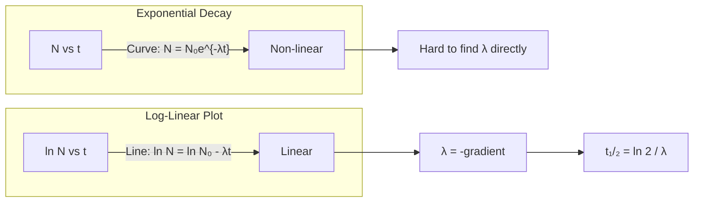

# 1. Overview / 概述

**English:**
The Exponential Decay Law is the mathematical foundation of radioactive decay. It describes how the number of unstable nuclei in a sample decreases over time — not linearly, but exponentially. This means that in equal time intervals, the same *proportion* of nuclei decays, not the same *number*. This sub-topic is critical because it connects the random, probabilistic nature of quantum decay to a precise mathematical model. It forms the basis for understanding [[Half-Life and Activity]], carbon dating, and medical tracers. The law is derived from the fundamental assumption that decay is a random process with a constant probability per unit time.

**中文:**
指数衰变定律是放射性衰变的数学基础。它描述了样品中不稳定原子核的数量如何随时间减少——不是线性减少，而是指数减少。这意味着在相等的时间间隔内，衰变的是相同*比例*的原子核，而不是相同*数量*。这个子知识点至关重要，因为它将量子衰变的随机、概率性质与精确的数学模型联系起来。它是理解[[半衰期与活度]]、碳定年和医用示踪剂的基础。该定律源自一个基本假设：衰变是一个随机过程，单位时间内衰变概率恒定。

---

# 2. Syllabus Learning Objectives / 考纲学习目标

| CAIE 9702 | Edexcel IAL |
|-----------|-------------|
| 23.1(a) Understand that radioactive decay is a random and spontaneous process | 8.1 Understand the random nature of radioactive decay |
| 23.1(b) Define activity and decay constant | 8.2 Define decay constant λ |
| 23.1(c) Derive and use the exponential decay equation $A = A_0 e^{-\lambda t}$ | 8.3 Derive $N = N_0 e^{-\lambda t}$ from $dN/dt = -\lambda N$ |
| 23.1(d) Use the equation $\lambda = \ln 2 / t_{1/2}$ | 8.4 Relate half-life to decay constant |
| 23.1(e) Solve problems involving exponential decay | 8.5 Solve exponential decay problems |
| 23.1(f) Understand the use of log-linear graphs | 8.6 Use log-linear plots to determine λ and $t_{1/2}$ |
| 23.1(g) Understand the concept of half-life | — |

**Examiner Expectations / 考官期望:**
- **EN:** Students must be able to derive the exponential decay equation from first principles, manipulate it algebraically, and interpret log-linear graphs. The distinction between activity (A) and number of nuclei (N) must be clear.
- **CN:** 学生必须能够从基本原理推导指数衰变方程，进行代数运算，并解读对数线性图。必须清楚区分活度(A)和原子核数(N)。

---

# 3. Core Definitions / 核心定义

| Term (EN/CN) | Definition (EN) | Definition (CN) | Common Mistakes / 常见错误 |
|--------------|-----------------|-----------------|---------------------------|
| **Decay Constant λ** / 衰变常数 λ | The probability per unit time that a given nucleus will decay. Unit: s⁻¹ | 给定原子核在单位时间内发生衰变的概率。单位：s⁻¹ | ❌ Confusing λ with half-life. λ is a probability, not a rate of decay of the sample. |
| **Activity A** / 活度 A | The number of decays per second from a radioactive sample. Unit: Bq (becquerel) | 放射性样品每秒发生的衰变次数。单位：Bq（贝克勒尔） | ❌ Thinking activity is constant — it decreases exponentially. |
| **Half-Life $t_{1/2}$** / 半衰期 $t_{1/2}$ | The time taken for half of the nuclei in a sample to decay (or for activity to halve). | 样品中一半原子核发生衰变（或活度减半）所需的时间。 | ❌ Assuming half-life is half the total lifetime of the sample. |
| **Exponential Decay** / 指数衰变 | A process where the rate of decrease of a quantity is proportional to the quantity itself. | 一个量的减少速率与该量本身成正比的过程。 | ❌ Thinking it means "very fast" decay — it's a specific mathematical form. |
| **Random Process** / 随机过程 | A process where it is impossible to predict exactly when a specific nucleus will decay. | 无法精确预测某个特定原子核何时衰变的过程。 | ❌ Confusing randomness with unpredictability of the *average* behavior. |
| **Spontaneous Process** / 自发过程 | A process that is not triggered by external factors (temperature, pressure, etc.). | 不受外部因素（温度、压力等）触发的过程。 | ❌ Thinking decay can be accelerated by external conditions. |

---

# 4. Key Concepts Explained / 关键概念详解

## 4.1 The Random and Spontaneous Nature of Decay / 衰变的随机性和自发性

### Explanation / 解释
**English:** Radioactive decay is **random** — we cannot predict which specific nucleus will decay next, only the *probability* of decay. It is **spontaneous** — the decay probability is unaffected by external conditions like temperature, pressure, or chemical state. This is because decay is a nuclear process, governed by the strong and weak nuclear forces, not by atomic or molecular interactions. The decay constant λ represents this constant probability per unit time.

**中文:** 放射性衰变是**随机**的——我们无法预测下一个衰变的是哪个特定原子核，只能预测衰变的*概率*。它是**自发**的——衰变概率不受温度、压力或化学状态等外部条件影响。这是因为衰变是核过程，由强核力和弱核力支配，而非原子或分子相互作用。衰变常数 λ 代表了这种单位时间内的恒定概率。

### Physical Meaning / 物理意义
**English:** If λ = 0.1 s⁻¹, then each nucleus has a 10% chance of decaying in the next second. For a large sample, this translates to 10% of the remaining nuclei decaying each second. This is why the decay is exponential — the *number* decaying per second decreases because there are fewer nuclei left.

**中文:** 如果 λ = 0.1 s⁻¹，那么每个原子核在下一秒内有 10% 的几率衰变。对于大样品，这意味着每秒有 10% 的剩余原子核衰变。这就是为什么衰变是指数型的——每秒衰变的*数量*减少，因为剩下的原子核更少了。

### Common Misconceptions / 常见误区
- **EN:** "Half-life means the sample is completely gone after two half-lives." ❌ → After two half-lives, only 1/4 remains.
- **CN:** "半衰期意味着两个半衰期后样品完全消失。" ❌ → 两个半衰期后，只剩下 1/4。
- **EN:** "Decay constant is the same as decay rate." ❌ → Decay constant is a probability; decay rate (activity) depends on the number of nuclei.
- **CN:** "衰变常数等于衰变速率。" ❌ → 衰变常数是概率；衰变速率（活度）取决于原子核数量。

### Exam Tips / 考试提示
- **EN:** Always state "random and spontaneous" when describing radioactive decay. Use the phrase "constant probability per unit time" to define λ.
- **CN:** 描述放射性衰变时，务必提到"随机且自发"。用"单位时间内的恒定概率"来定义 λ。

> 📷 **IMAGE PROMPT — RND-01: Random Decay Simulation**
> A grid of 100 small circles representing nuclei, with 10 randomly highlighted in red to show decay in one second. Next to it, a second grid with 90 circles, 9 highlighted. Caption: "Each second, 10% of remaining nuclei decay randomly."

---

## 4.2 Derivation of the Exponential Decay Law / 指数衰变定律的推导

### Explanation / 解释
**English:** The derivation starts from the definition of the decay constant. The rate of change of the number of nuclei $N$ is proportional to $N$ itself:

$$ \frac{dN}{dt} = -\lambda N $$

The negative sign indicates a decrease. This is a first-order differential equation. Rearranging:

$$ \frac{dN}{N} = -\lambda \, dt $$

Integrating both sides:

$$ \int_{N_0}^{N} \frac{1}{N} \, dN = -\lambda \int_{0}^{t} dt $$

$$ [\ln N]_{N_0}^{N} = -\lambda t $$

$$ \ln N - \ln N_0 = -\lambda t $$

$$ \ln \left( \frac{N}{N_0} \right) = -\lambda t $$

Taking exponentials of both sides:

$$ \frac{N}{N_0} = e^{-\lambda t} $$

$$ N = N_0 e^{-\lambda t} $$

Since activity $A = \lambda N$, we also have:

$$ A = A_0 e^{-\lambda t} $$

**中文:** 推导从衰变常数的定义开始。原子核数量 $N$ 的变化率与 $N$ 本身成正比：

$$ \frac{dN}{dt} = -\lambda N $$

负号表示减少。这是一阶微分方程。整理得：

$$ \frac{dN}{N} = -\lambda \, dt $$

两边积分：

$$ \int_{N_0}^{N} \frac{1}{N} \, dN = -\lambda \int_{0}^{t} dt $$

$$ [\ln N]_{N_0}^{N} = -\lambda t $$

$$ \ln N - \ln N_0 = -\lambda t $$

$$ \ln \left( \frac{N}{N_0} \right) = -\lambda t $$

两边取指数：

$$ \frac{N}{N_0} = e^{-\lambda t} $$

$$ N = N_0 e^{-\lambda t} $$

由于活度 $A = \lambda N$，我们也有：

$$ A = A_0 e^{-\lambda t} $$

### Physical Meaning / 物理意义
**English:** The equation shows that the fraction of remaining nuclei $N/N_0$ depends only on the product $\lambda t$, not on the initial number. This is the hallmark of exponential decay — the process has no "memory" of how much has already decayed.

**中文:** 该方程表明剩余原子核的比例 $N/N_0$ 仅取决于乘积 $\lambda t$，与初始数量无关。这是指数衰变的标志——该过程对已经衰变了多少没有"记忆"。

### Common Misconceptions / 常见误区
- **EN:** "The equation $N = N_0 e^{-\lambda t}$ means N never reaches zero." ✅ Correct — theoretically, it approaches zero asymptotically.
- **CN:** "方程 $N = N_0 e^{-\lambda t}$ 意味着 N 永远不会达到零。" ✅ 正确——理论上，它渐近地趋近于零。
- **EN:** "The decay constant λ changes over time." ❌ → λ is constant for a given isotope.
- **CN:** "衰变常数 λ 随时间变化。" ❌ → 对于给定的同位素，λ 是常数。

### Exam Tips / 考试提示
- **EN:** Know how to derive $N = N_0 e^{-\lambda t}$ from $dN/dt = -\lambda N$ by integration. This is a common derivation question.
- **CN:** 掌握如何通过积分从 $dN/dt = -\lambda N$ 推导出 $N = N_0 e^{-\lambda t}$。这是常见的推导题。

---

## 4.3 The Relationship Between Half-Life and Decay Constant / 半衰期与衰变常数的关系

### Explanation / 解释
**English:** Half-life $t_{1/2}$ is the time when $N = N_0/2$. Substituting into the decay equation:

$$ \frac{N_0}{2} = N_0 e^{-\lambda t_{1/2}} $$

$$ \frac{1}{2} = e^{-\lambda t_{1/2}} $$

Taking natural logs:

$$ \ln \left( \frac{1}{2} \right) = -\lambda t_{1/2} $$

$$ -\ln 2 = -\lambda t_{1/2} $$

$$ \lambda = \frac{\ln 2}{t_{1/2}} $$

Alternatively: $t_{1/2} = \frac{\ln 2}{\lambda}$

**中文:** 半衰期 $t_{1/2}$ 是 $N = N_0/2$ 的时刻。代入衰变方程：

$$ \frac{N_0}{2} = N_0 e^{-\lambda t_{1/2}} $$

$$ \frac{1}{2} = e^{-\lambda t_{1/2}} $$

取自然对数：

$$ \ln \left( \frac{1}{2} \right) = -\lambda t_{1/2} $$

$$ -\ln 2 = -\lambda t_{1/2} $$

$$ \lambda = \frac{\ln 2}{t_{1/2}} $$

或者：$t_{1/2} = \frac{\ln 2}{\lambda}$

### Physical Meaning / 物理意义
**English:** This inverse relationship means: a large decay constant (high probability of decay per second) corresponds to a short half-life. For example, uranium-238 has λ ≈ 4.9 × 10⁻¹⁸ s⁻¹ and $t_{1/2}$ ≈ 4.5 billion years. Polonium-212 has λ ≈ 2.3 × 10⁶ s⁻¹ and $t_{1/2}$ ≈ 3 × 10⁻⁷ s (0.3 microseconds).

**中文:** 这种反比关系意味着：大的衰变常数（每秒衰变概率高）对应短的半衰期。例如，铀-238 的 λ ≈ 4.9 × 10⁻¹⁸ s⁻¹，$t_{1/2}$ ≈ 45 亿年。钋-212 的 λ ≈ 2.3 × 10⁶ s⁻¹，$t_{1/2}$ ≈ 3 × 10⁻⁷ s（0.3 微秒）。

### Common Misconceptions / 常见误区
- **EN:** "Half-life is half the time until all nuclei decay." ❌ → After one half-life, half remain; after two, a quarter; it never reaches zero.
- **CN:** "半衰期是所有原子核衰变所需时间的一半。" ❌ → 一个半衰期后，剩一半；两个后，剩四分之一；永远不会达到零。
- **EN:** "λ and $t_{1/2}$ are independent." ❌ → They are inversely related by $\ln 2$.
- **CN:** "λ 和 $t_{1/2}$ 是独立的。" ❌ → 它们通过 $\ln 2$ 成反比。

### Exam Tips / 考试提示
- **EN:** Memorize $\lambda = \ln 2 / t_{1/2}$. Be careful with units — if $t_{1/2}$ is in years, λ will be in year⁻¹. Convert to seconds if needed.
- **CN:** 记住 $\lambda = \ln 2 / t_{1/2}$。注意单位——如果 $t_{1/2}$ 以年为单位，λ 的单位就是年⁻¹。必要时转换为秒。

---

# 5. Essential Equations / 核心公式

## Equation 1: Exponential Decay of Number of Nuclei / 原子核数量的指数衰变

$$ N = N_0 e^{-\lambda t} $$

| Symbol (符号) | Meaning (EN) | Meaning (CN) | Unit (单位) |
|--------------|-------------|-------------|------------|
| $N$ | Number of undecayed nuclei at time $t$ | 时间 $t$ 时未衰变的原子核数 | dimensionless (无量纲) |
| $N_0$ | Initial number of undecayed nuclei at $t=0$ | $t=0$ 时初始未衰变的原子核数 | dimensionless (无量纲) |
| $\lambda$ | Decay constant | 衰变常数 | s⁻¹ |
| $t$ | Time elapsed | 经过的时间 | s |

**Derivation / 推导:** From $dN/dt = -\lambda N$, integrate as shown in Section 4.2.

**Conditions / 适用条件:**
- **EN:** The sample must contain a large number of nuclei (statistical validity). The isotope must have a constant λ (no branching decay).
- **CN:** 样品必须包含大量原子核（统计有效性）。同位素必须具有恒定的 λ（无分支衰变）。

**Limitations / 局限性:**
- **EN:** For very small numbers of nuclei (e.g., < 100), statistical fluctuations become significant and the equation gives only the *expected* value.
- **CN:** 对于非常少的原子核（例如 < 100），统计波动变得显著，该方程仅给出*期望*值。

---

## Equation 2: Exponential Decay of Activity / 活度的指数衰变

$$ A = A_0 e^{-\lambda t} $$

| Symbol (符号) | Meaning (EN) | Meaning (CN) | Unit (单位) |
|--------------|-------------|-------------|------------|
| $A$ | Activity at time $t$ | 时间 $t$ 时的活度 | Bq (becquerel) |
| $A_0$ | Initial activity at $t=0$ | $t=0$ 时的初始活度 | Bq |
| $\lambda$ | Decay constant | 衰变常数 | s⁻¹ |
| $t$ | Time elapsed | 经过的时间 | s |

**Derivation / 推导:** Since $A = \lambda N$, multiply both sides of $N = N_0 e^{-\lambda t}$ by λ.

**Conditions / 适用条件:** Same as Equation 1.

**Limitations / 局限性:** Same as Equation 1.

---

## Equation 3: Half-Life and Decay Constant / 半衰期与衰变常数

$$ \lambda = \frac{\ln 2}{t_{1/2}} \quad \text{or} \quad t_{1/2} = \frac{\ln 2}{\lambda} $$

| Symbol (符号) | Meaning (EN) | Meaning (CN) | Unit (单位) |
|--------------|-------------|-------------|------------|
| $\lambda$ | Decay constant | 衰变常数 | s⁻¹ |
| $t_{1/2}$ | Half-life | 半衰期 | s (or any time unit) |
| $\ln 2$ | Natural logarithm of 2 ≈ 0.693 | 2的自然对数 ≈ 0.693 | dimensionless (无量纲) |

**Derivation / 推导:** From $N = N_0/2$ at $t = t_{1/2}$, as shown in Section 4.3.

**Conditions / 适用条件:** Valid for any exponential decay process.

**Limitations / 局限性:** None — this is an exact mathematical relationship.

---

## Equation 4: The Differential Form / 微分形式

$$ \frac{dN}{dt} = -\lambda N $$

| Symbol (符号) | Meaning (EN) | Meaning (CN) | Unit (单位) |
|--------------|-------------|-------------|------------|
| $dN/dt$ | Rate of change of number of nuclei | 原子核数量的变化率 | s⁻¹ |
| $\lambda$ | Decay constant | 衰变常数 | s⁻¹ |
| $N$ | Number of undecayed nuclei at that instant | 该时刻未衰变的原子核数 | dimensionless (无量纲) |

**Derivation / 推导:** This is the *definition* of the decay constant — the starting point for all exponential decay equations.

**Conditions / 适用条件:** Fundamental assumption — valid for all radioactive decay.

**Limitations / 局限性:** Only valid for large N where the rate is smooth.

> 📷 **IMAGE PROMPT — EQN-01: Exponential Decay Curve**
> A graph showing N vs t with a smooth curve starting at N₀ and asymptotically approaching zero. Key points marked: at t=0, N=N₀; at t=t₁/₂, N=N₀/2; at t=2t₁/₂, N=N₀/4. The equation N=N₀e^{-λt} displayed on the graph.

---

# 6. Graphs and Relationships / 图表与关系

## 6.1 Exponential Decay Curve (N vs t) / 指数衰变曲线 (N 对 t)

### Axes / 坐标轴
- **X-axis:** Time $t$ (s) / 时间 $t$ (s)
- **Y-axis:** Number of undecayed nuclei $N$ (or Activity $A$) / 未衰变原子核数 $N$（或活度 $A$）

### Shape / 形状
**EN:** A smooth, decreasing curve that starts at $N_0$ (or $A_0$) and asymptotically approaches zero. The curve is steepest at the start and gradually flattens. After each half-life, the value drops by exactly half.

**CN:** 一条平滑的递减曲线，从 $N_0$（或 $A_0$）开始，渐近趋近于零。曲线在开始时最陡，然后逐渐变平。每经过一个半衰期，数值精确减半。

### Gradient Meaning / 斜率含义
**EN:** The gradient $dN/dt$ at any point equals $-\lambda N$ — it represents the instantaneous rate of decay (activity). The gradient is negative and its magnitude decreases over time.

**CN:** 任意点的梯度 $dN/dt$ 等于 $-\lambda N$——它代表瞬时衰变速率（活度）。梯度为负，其大小随时间减小。

### Area Meaning / 面积含义
**EN:** The area under the N vs t curve has no direct physical meaning in this context. However, the area under the A vs t curve gives the total number of decays that have occurred.

**CN:** N 对 t 曲线下的面积在此上下文中没有直接的物理意义。然而，A 对 t 曲线下的面积给出了已发生的总衰变次数。

### Exam Interpretation / 考试解读
**EN:** Be able to read values from the curve: after $n$ half-lives, $N = N_0 / 2^n$. For example, after 3 half-lives, $N = N_0 / 8$.

**CN:** 能够从曲线读取数值：经过 $n$ 个半衰期后，$N = N_0 / 2^n$。例如，3 个半衰期后，$N = N_0 / 8$。

---

## 6.2 Log-Linear Graph (ln N vs t) / 对数线性图 (ln N 对 t)

### Axes / 坐标轴
- **X-axis:** Time $t$ (s) / 时间 $t$ (s)
- **Y-axis:** $\ln N$ (natural logarithm of number of nuclei) / $\ln N$（原子核数的自然对数）

### Shape / 形状
**EN:** A straight line with negative slope. This is because taking logs of $N = N_0 e^{-\lambda t}$ gives $\ln N = \ln N_0 - \lambda t$, which is of the form $y = mx + c$.

**CN:** 一条具有负斜率的直线。这是因为对 $N = N_0 e^{-\lambda t}$ 取对数得到 $\ln N = \ln N_0 - \lambda t$，形式为 $y = mx + c$。

### Gradient Meaning / 斜率含义
**EN:** The gradient of the ln N vs t graph is $-\lambda$. Therefore, $\lambda = -(\text{gradient})$. This is the most accurate way to determine the decay constant experimentally.

**CN:** ln N 对 t 图的斜率为 $-\lambda$。因此，$\lambda = -(\text{斜率})$。这是实验上确定衰变常数最准确的方法。

### Y-Intercept Meaning / 截距含义
**EN:** The y-intercept is $\ln N_0$, the natural log of the initial number of nuclei.

**CN:** y 截距是 $\ln N_0$，即初始原子核数的自然对数。

### Exam Interpretation / 考试解读
**EN:** If given a log-linear graph, calculate λ from the gradient. Then find $t_{1/2} = \ln 2 / \lambda$. This is a very common exam question.

**CN:** 如果给定了对数线性图，从斜率计算 λ。然后求 $t_{1/2} = \ln 2 / \lambda$。这是非常常见的考题。



> 📷 **IMAGE PROMPT — GRAPH-01: Log-Linear Decay Plot**
> A graph with time on the x-axis and ln(N) on the y-axis. A straight line with negative slope. The y-intercept labeled as ln(N₀). Two points on the line marked to show gradient calculation: Δ(ln N)/Δt = -λ. Caption: "A log-linear plot gives a straight line; gradient = -λ."

---

# 7. Required Diagrams / 必备图表

## 7.1 Exponential Decay Curve with Half-Life Markers / 带半衰期标记的指数衰变曲线

### Description / 描述
**EN:** A graph of N (or A) against t showing the characteristic exponential decay shape. Key points are marked at t = 0, t = t₁/₂, t = 2t₁/₂, and t = 3t₁/₂, showing N = N₀, N₀/2, N₀/4, and N₀/8 respectively.

**中文:** N（或 A）对 t 的图表，显示特征性的指数衰变形状。关键点标记在 t = 0、t = t₁/₂、t = 2t₁/₂ 和 t = 3t₁/₂ 处，分别显示 N = N₀、N₀/2、N₀/4 和 N₀/8。

### Image Prompt / 图片生成提示
> 📷 **IMAGE PROMPT — DIAG-01: Exponential Decay with Half-Life**
> A clean scientific graph with time on the x-axis (0 to 5 half-lives) and number of nuclei N on the y-axis (0 to N₀). A smooth decreasing curve from (0, N₀) approaching zero asymptotically. Vertical dashed lines at t₁/₂, 2t₁/₂, 3t₁/₂ with horizontal dashed lines showing N₀/2, N₀/4, N₀/8. Labels: "N = N₀e^{-λt}" in top right. Clean white background, black lines, professional style.

### Labels Required / 需要标注
- **EN:** Axes: "Time / s" (x), "Number of undecayed nuclei N" (y). Points: (0, N₀), (t₁/₂, N₀/2), (2t₁/₂, N₀/4), (3t₁/₂, N₀/8). Equation: $N = N_0 e^{-\lambda t}$.
- **CN:** 坐标轴："时间 / s" (x)，"未衰变原子核数 N" (y)。点：(0, N₀)、(t₁/₂, N₀/2)、(2t₁/₂, N₀/4)、(3t₁/₂, N₀/8)。方程：$N = N_0 e^{-\lambda t}$。

### Exam Importance / 考试重要性
- **EN:** Essential for understanding half-life conceptually. Used in multiple-choice and short-answer questions to test understanding of exponential decay.
- **CN:** 对于从概念上理解半衰期至关重要。用于选择题和简答题，测试对指数衰变的理解。

---

## 7.2 Log-Linear Graph for Determining λ / 用于确定 λ 的对数线性图

### Description / 描述
**EN:** A graph of ln(N) against t, showing a straight line with negative slope. The gradient is calculated from two well-separated points on the line. The y-intercept is ln(N₀).

**中文:** ln(N) 对 t 的图表，显示一条具有负斜率的直线。从线上两个间隔良好的点计算斜率。y 截距是 ln(N₀)。

### Image Prompt / 图片生成提示
> 📷 **IMAGE PROMPT — DIAG-02: Log-Linear Plot for λ**
> A graph with time on the x-axis (0 to 5 half-lives) and ln(N) on the y-axis. A straight line with negative slope. Two points (t₁, ln N₁) and (t₂, ln N₂) marked with a right-angled triangle showing Δt and Δ(ln N). Y-intercept labeled as ln(N₀). Equation: ln N = ln N₀ - λt. Clean white background, professional style.

### Labels Required / 需要标注
- **EN:** Axes: "Time / s" (x), "ln(N)" (y). Points: (0, ln N₀), (t₁, ln N₁), (t₂, ln N₂). Gradient triangle: Δ(ln N) and Δt. Equation: $\ln N = \ln N_0 - \lambda t$.
- **CN:** 坐标轴："时间 / s" (x)，"ln(N)" (y)。点：(0, ln N₀)、(t₁, ln N₁)、(t₂, ln N₂)。斜率三角形：Δ(ln N) 和 Δt。方程：$\ln N = \ln N_0 - \lambda t$。

### Exam Importance / 考试重要性
- **EN:** Extremely important — this is the standard method for determining λ and t₁/₂ experimentally. Expect a graph question in Paper 4 or Paper 5.
- **CN:** 极其重要——这是实验上确定 λ 和 t₁/₂ 的标准方法。预计在 Paper 4 或 Paper 5 中会出现图表题。

---

# 8. Worked Examples / 典型例题

## Example 1: Finding Activity After a Given Time / 例 1：求给定时间后的活度

### Question / 题目
**English:**
A sample of iodine-131 has an initial activity of 800 Bq. The decay constant of iodine-131 is $9.93 \times 10^{-7}$ s⁻¹. Calculate:
(a) The activity after 10 days.
(b) The half-life of iodine-131 in days.

**中文:**
一个碘-131 样品的初始活度为 800 Bq。碘-131 的衰变常数为 $9.93 \times 10^{-7}$ s⁻¹。计算：
(a) 10 天后的活度。
(b) 碘-131 的半衰期（以天为单位）。

### Solution / 解答

**Part (a):**
**EN:**
1. Convert 10 days to seconds: $10 \times 24 \times 60 \times 60 = 864,000$ s
2. Use $A = A_0 e^{-\lambda t}$:
   $$ A = 800 \times e^{-(9.93 \times 10^{-7} \times 864,000)} $$
   $$ A = 800 \times e^{-0.858} $$
   $$ A = 800 \times 0.424 $$
   $$ A = 339 \text{ Bq} $$

**CN:**
1. 将 10 天转换为秒：$10 \times 24 \times 60 \times 60 = 864,000$ s
2. 使用 $A = A_0 e^{-\lambda t}$：
   $$ A = 800 \times e^{-(9.93 \times 10^{-7} \times 864,000)} $$
   $$ A = 800 \times e^{-0.858} $$
   $$ A = 800 \times 0.424 $$
   $$ A = 339 \text{ Bq} $$

**Part (b):**
**EN:**
1. Use $t_{1/2} = \frac{\ln 2}{\lambda}$:
   $$ t_{1/2} = \frac{0.693}{9.93 \times 10^{-7}} $$
   $$ t_{1/2} = 6.98 \times 10^5 \text{ s} $$
2. Convert to days: $6.98 \times 10^5 \div (24 \times 60 \times 60) = 8.08$ days

**CN:**
1. 使用 $t_{1/2} = \frac{\ln 2}{\lambda}$：
   $$ t_{1/2} = \frac{0.693}{9.93 \times 10^{-7}} $$
   $$ t_{1/2} = 6.98 \times 10^5 \text{ s} $$
2. 转换为天：$6.98 \times 10^5 \div (24 \times 60 \times 60) = 8.08$ 天

### Final Answer / 最终答案
**Answer:** (a) 339 Bq | (b) 8.08 days | **答案：** (a) 339 Bq | (b) 8.08 天

### Quick Tip / 提示
**EN:** Always check units! If λ is in s⁻¹, time must be in seconds. Convert days to seconds before using the exponential formula.

**CN:** 始终检查单位！如果 λ 的单位是 s⁻¹，时间必须以秒为单位。在使用指数公式前将天转换为秒。

---

## Example 2: Using a Log-Linear Graph / 例 2：使用对数线性图

### Question / 题目
**English:**
In an experiment, the activity of a radioactive source is measured at different times. The following data is obtained:

| Time / hours | 0 | 2 | 4 | 6 | 8 |
|--------------|---|---|---|---|---|
| Activity / Bq | 500 | 315 | 198 | 125 | 79 |

(a) Plot a graph of ln(activity) against time.
(b) Determine the decay constant λ.
(c) Calculate the half-life.

**中文:**
在一个实验中，测量了放射源在不同时间的活度。得到以下数据：

| 时间 / 小时 | 0 | 2 | 4 | 6 | 8 |
|--------------|---|---|---|---|---|
| 活度 / Bq | 500 | 315 | 198 | 125 | 79 |

(a) 绘制 ln(活度) 对时间的图。
(b) 确定衰变常数 λ。
(c) 计算半衰期。

### Solution / 解答

**EN:**
1. Calculate ln(activity):
   | t / h | 0 | 2 | 4 | 6 | 8 |
   |-------|---|---|---|---|---|
   | ln(A) | 6.215 | 5.752 | 5.288 | 4.828 | 4.369 |

2. Plot ln(A) vs t — should give a straight line.

3. Calculate gradient using two well-separated points:
   $$ \text{gradient} = \frac{\Delta (\ln A)}{\Delta t} = \frac{4.369 - 6.215}{8 - 0} = \frac{-1.846}{8} = -0.231 \text{ h}^{-1} $$

4. Since gradient = -λ:
   $$ \lambda = 0.231 \text{ h}^{-1} $$

5. Convert to s⁻¹: $\lambda = 0.231 \div 3600 = 6.42 \times 10^{-5} \text{ s}^{-1}$

6. Half-life: $t_{1/2} = \frac{\ln 2}{\lambda} = \frac{0.693}{0.231} = 3.00$ hours

**CN:**
1. 计算 ln(活度)：
   | t / h | 0 | 2 | 4 | 6 | 8 |
   |-------|---|---|---|---|---|
   | ln(A) | 6.215 | 5.752 | 5.288 | 4.828 | 4.369 |

2. 绘制 ln(A) 对 t 的图——应得到一条直线。

3. 使用两个间隔良好的点计算斜率：
   $$ \text{斜率} = \frac{\Delta (\ln A)}{\Delta t} = \frac{4.369 - 6.215}{8 - 0} = \frac{-1.846}{8} = -0.231 \text{ h}^{-1} $$

4. 由于斜率 = -λ：
   $$ \lambda = 0.231 \text{ h}^{-1} $$

5. 转换为 s⁻¹：$\lambda = 0.231 \div 3600 = 6.42 \times 10^{-5} \text{ s}^{-1}$

6. 半衰期：$t_{1/2} = \frac{\ln 2}{\lambda} = \frac{0.693}{0.231} = 3.00$ 小时

### Final Answer / 最终答案
**Answer:** λ = 0.231 h⁻¹ = 6.42 × 10⁻⁵ s⁻¹; t₁/₂ = 3.00 hours | **答案：** λ = 0.231 h⁻¹ = 6.42 × 10⁻⁵ s⁻¹; t₁/₂ = 3.00 小时

### Quick Tip / 提示
**EN:** When plotting ln(A) vs t, use points as far apart as possible for gradient calculation to minimize percentage error. Always include units in your final answer.

**CN:** 绘制 ln(A) 对 t 的图时，使用尽可能远的点来计算斜率，以最小化百分比误差。始终在最终答案中包含单位。

---

# 9. Past Paper Question Types / 历年真题题型

| Question Type / 题型 | Frequency / 频率 | Difficulty / 难度 | Past Paper References / 真题索引 |
|----------------------|------------------|------------------|-------------------------------|
| Derivation of $N = N_0 e^{-\lambda t}$ from $dN/dt = -\lambda N$ | High | Medium | 📝 *待填入* |
| Calculation of activity after a given time | High | Easy | 📝 *待填入* |
| Calculation of half-life from decay constant (or vice versa) | High | Easy | 📝 *待填入* |
| Log-linear graph analysis (find λ and t₁/₂) | Very High | Medium | 📝 *待填入* |
| Comparing decay rates of different isotopes | Medium | Medium | 📝 *待填入* |
| Multi-step problems (e.g., find mass from activity) | Medium | Hard | 📝 *待填入* |
| Conceptual questions on random/spontaneous nature | Low | Easy | 📝 *待填入* |

**Common Command Words / 常见指令词:**
- **EN:** Derive, Calculate, Determine, Show that, Plot, Sketch, State, Explain
- **CN:** 推导、计算、确定、证明、绘制、画出、陈述、解释

---

# 10. Practical Skills Connections / 实验技能链接

**English:**
The exponential decay law is central to the practical determination of half-life. Key practical skills include:

1. **Using a Geiger-Müller (GM) tube and counter** to measure activity over time. The GM tube detects ionizing radiation and produces a count rate proportional to activity.

2. **Background radiation correction:** Always measure background count rate (without the source) and subtract it from all readings. This is critical for accurate results.

3. **Plotting log-linear graphs:** Transform the data by taking natural logs of corrected count rates. Plot ln(count rate) vs time. The gradient gives -λ.

4. **Uncertainty analysis:** Count rates follow Poisson statistics — the uncertainty in a count N is √N. This affects the reliability of each data point, especially at low count rates.

5. **Choosing appropriate time intervals:** For accurate gradient determination, measurements should span at least 2-3 half-lives.

6. **Dead time correction:** At very high count rates, the GM tube may miss events. This is less relevant for A-Level but good to know.

**中文:**
指数衰变定律是实验确定半衰期的核心。关键实验技能包括：

1. **使用盖革-米勒(GM)管和计数器**随时间测量活度。GM 管检测电离辐射并产生与活度成正比的计数率。

2. **本底辐射校正：** 始终测量本底计数率（无源时）并从所有读数中减去。这对准确结果至关重要。

3. **绘制对数线性图：** 通过对校正后的计数率取自然对数来转换数据。绘制 ln(计数率) 对时间的图。斜率给出 -λ。

4. **不确定度分析：** 计数率遵循泊松统计——计数 N 的不确定度为 √N。这影响每个数据点的可靠性，尤其是在低计数率时。

5. **选择合适的时间间隔：** 为了准确确定斜率，测量应跨越至少 2-3 个半衰期。

6. **死时间校正：** 在非常高的计数率下，GM 管可能会漏记事件。这在 A-Level 中不太相关，但值得了解。

> 📋 **Edexcel Only:** Edexcel IAL Paper 3 (Practical Skills) may require students to design an experiment to determine half-life, including choice of equipment, measurement intervals, and error analysis.

> 📋 **CIE Only:** CIE Paper 5 (Planning, Analysis and Evaluation) may include questions on log-linear graph analysis, uncertainty in count rates, and experimental design for half-life determination.

---

# 11. Concept Map / 概念图谱

```mermaid
graph TD
    %% Core concept
    EXP["Exponential Decay Law<br/>指数衰变定律"] --> DEF["dN/dt = -λN<br/>微分定义"]
    EXP --> INT["N = N₀e^{-λt}<br/>积分形式"]
    EXP --> ACT["A = A₀e^{-λt}<br/>活度形式"]
    
    %% Key parameters
    INT --> LAMBDA["λ = Decay Constant<br/>衰变常数"]
    INT --> HALF["t₁/₂ = Half-Life<br/>半衰期"]
    LAMBDA <--> HALF["λ = ln 2 / t₁/₂"]
    
    %% Graph types
    EXP --> GRAPH1["N vs t: Exponential Curve<br/>指数曲线"]
    EXP --> GRAPH2["ln N vs t: Straight Line<br/>直线"]
    GRAPH2 --> GRAD["Gradient = -λ<br/>斜率 = -λ"]
    
    %% Connections to other topics
    HALF --> RAD["[[Radioactive Decay]]<br/>放射性衰变"]
    RAD --> TYPES["[[Types of Radioactive Decay]]<br/>衰变类型"]
    RAD --> EQUATIONS["[[Decay Equations and Conservation]]<br/>衰变方程与守恒"]
    RAD --> NEUTRINO["[[Neutrinos and Antineutrinos]]<br/>中微子与反中微子"]
    
    %% Prerequisites
    EXP --> ATOM["[[Atomic Structure and the Nucleus]]<br/>原子结构与原子核"]
    
    %% Related topics
    HALF --> HLIFE["[[Half-Life and Activity]]<br/>半衰期与活度"]
    ACT --> RADIATION["[[Alpha, Beta and Gamma Radiation]]<br/>α, β, γ 辐射"]
    
    %% Practical
    GRAPH2 --> PRAC["Practical: GM Tube + Log Plot<br/>实验：GM管+对数图"]
    PRAC --> BG["Background Correction<br/>本底校正"]
    PRAC --> UNC["Uncertainty: √N<br/>不确定度：√N"]
    
    %% Styling
    classDef core fill:#e1f5fe,stroke:#01579b,stroke-width:2px
    classDef param fill:#fff3e0,stroke:#e65100,stroke-width:1px
    classDef graph fill:#f3e5f5,stroke:#4a148c,stroke-width:1px
    classDef practical fill:#e8f5e9,stroke:#1b5e20,stroke-width:1px
    classDef related fill:#fce4ec,stroke:#b71c1c,stroke-width:1px
    
    class EXP core
    class LAMBDA,HALF param
    class GRAPH1,GRAPH2,GRAD graph
    class PRAC,BG,UNC practical
    class RAD,TYPES,EQUATIONS,NEUTRINO,ATOM,HLIFE,RADIATION related
```

---

# 12. Quick Revision Sheet / 速查表

| Category / 类别 | Key Points / 要点 |
|----------------|------------------|
| **Definition / 定义** | Radioactive decay is **random** (cannot predict which nucleus) and **spontaneous** (unaffected by external conditions). λ = probability of decay per unit time. / 放射性衰变是**随机**的（无法预测哪个原子核）和**自发**的（不受外部条件影响）。λ = 单位时间内的衰变概率。 |
| **Key Formula / 核心公式** | $N = N_0 e^{-\lambda t}$ (number of nuclei) / (原子核数) <br> $A = A_0 e^{-\lambda t}$ (activity) / (活度) <br> $\lambda = \frac{\ln 2}{t_{1/2}}$ (half-life relation) / (半衰期关系) |
| **Key Graph / 核心图表** | **N vs t:** Exponential decay curve, asymptotically approaches zero. / 指数衰变曲线，渐近趋近于零。<br>**ln N vs t:** Straight line, gradient = -λ. / 直线，斜率 = -λ。 |
| **Exam Tip / 考试提示** | 1. Always check units (λ in s⁻¹ → t in s). / 始终检查单位（λ 以 s⁻¹ 为单位 → t 以 s 为单位）。<br>2. For log-linear graphs, use well-separated points for gradient. / 对于对数线性图，使用间隔良好的点求斜率。<br>3. Subtract background radiation from all count rate measurements. / 从所有计数率测量中减去本底辐射。<br>4. After n half-lives: $N = N_0 / 2^n$. / n 个半衰期后：$N = N_0 / 2^n$。<br>5. $\ln 2 \approx 0.693$ — memorize this value. / $\ln 2 \approx 0.693$——记住这个值。 |
| **Common Mistake / 常见错误** | ❌ Confusing decay constant λ with decay rate (activity). λ is a probability; activity A = λN. / 混淆衰变常数 λ 与衰变速率（活度）。λ 是概率；活度 A = λN。<br>❌ Thinking half-life is half the total lifetime. / 认为半衰期是总寿命的一半。<br>❌ Forgetting to convert time units. / 忘记转换时间单位。 |
| **Practical Skill / 实验技能** | Use GM tube + counter, correct for background, plot ln(count rate) vs time, find λ from gradient. / 使用 GM 管 + 计数器，校正本底，绘制 ln(计数率) 对时间图，从斜率求 λ。 |