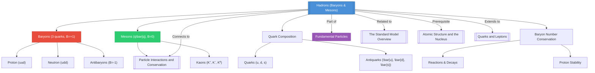

# 1. Overview / 概述

**English:**
Hadrons are composite particles made of quarks, held together by the strong nuclear force. This sub-topic explores the two main families of hadrons: **baryons** (made of three quarks) and **mesons** (made of a quark-antiquark pair). Understanding hadrons is crucial for grasping the structure of matter at the most fundamental level, as protons and neutrons — the building blocks of atomic nuclei — are themselves baryons. This knowledge directly connects to [[The Standard Model Overview]] and provides the foundation for studying [[Particle Interactions and Conservation]].

**中文:**
强子是由夸克组成的复合粒子，通过强核力结合在一起。本子知识点探讨强子的两个主要家族：**重子**（由三个夸克组成）和**介子**（由一个夸克-反夸克对组成）。理解强子对于掌握物质在最基本层面的结构至关重要，因为质子和中子——原子核的组成部分——本身就是重子。这一知识直接连接到[[The Standard Model Overview]]，并为研究[[Particle Interactions and Conservation]]奠定基础。

---

# 2. Syllabus Learning Objectives / 考纲学习目标

| CAIE 9702 | Edexcel IAL |
|-----------|-------------|
| 24.1(a) Describe the classification of hadrons into baryons and mesons | 9.1 Understand that hadrons are composed of quarks and are classified as baryons or mesons |
| 24.1(b) State the quark composition of protons and neutrons | 9.2 Know the quark compositions of protons and neutrons |
| 24.1(c) State that baryons have baryon number B = +1, antibaryons B = -1 | 9.3 Understand baryon number conservation |
| 24.1(d) State that mesons have baryon number B = 0 | 9.4 Know that mesons have baryon number zero |
| 24.1(e) Describe the properties of pions and kaons | 9.5 Describe the properties of pions (π⁺, π⁻, π⁰) and kaons (K⁺, K⁻, K⁰) |
| 24.1(f) Apply conservation laws to hadron interactions | 9.6 Apply conservation of baryon number, charge, and lepton number |
| 24.1(g) Explain the need for quarks in hadron structure | — |

**Examiner Expectations / 考官期望:**
- **English:** Students must be able to classify particles as baryons or mesons based on quark composition, apply baryon number conservation in particle reactions, and recall specific hadron properties (mass, charge, decay modes).
- **中文:** 学生必须能够根据夸克组成将粒子分类为重子或介子，在粒子反应中应用重子数守恒，并记住特定强子的性质（质量、电荷、衰变模式）。

---

# 3. Core Definitions / 核心定义

| Term (EN/CN) | Definition (EN) | Definition (CN) | Common Mistakes / 常见错误 |
|--------------|-----------------|-----------------|---------------------------|
| **Hadron** / 强子 | A composite particle made of quarks, held together by the strong nuclear force | 由夸克组成的复合粒子，通过强核力结合在一起 | ❌ Confusing hadrons with leptons (leptons are fundamental, not composite) |
| **Baryon** / 重子 | A hadron composed of three quarks (qqq), with baryon number B = +1 | 由三个夸克组成的强子，重子数 B = +1 | ❌ Thinking baryons include mesons |
| **Meson** / 介子 | A hadron composed of a quark-antiquark pair (q\bar{q}), with baryon number B = 0 | 由一个夸克-反夸克对组成的强子，重子数 B = 0 | ❌ Forgetting mesons have zero baryon number |
| **Baryon Number (B)** / 重子数 | A conserved quantum number: B = +1 for baryons, B = -1 for antibaryons, B = 0 for mesons and leptons | 守恒量子数：重子 B = +1，反重子 B = -1，介子和轻子 B = 0 | ❌ Not applying conservation in reactions |
| **Quark** / 夸克 | A fundamental constituent of hadrons, with fractional electric charge (±1/3e or ±2/3e) | 强子的基本组成成分，具有分数电荷 | ❌ Forgetting quarks have fractional charges |
| **Antiquark** / 反夸克 | The antiparticle of a quark, with opposite charge and baryon number | 夸克的反粒子，具有相反的电荷和重子数 | ❌ Confusing antiquark properties with quark properties |

---

# 4. Key Concepts Explained / 关键概念详解

## 4.1 Classification of Hadrons / 强子的分类

### Explanation / 解释
**English:**
Hadrons are divided into two families based on their quark composition:
- **Baryons** (重子): Made of three quarks (qqq). Examples include protons (uud) and neutrons (udd). All baryons have baryon number B = +1.
- **Mesons** (介子): Made of a quark-antiquark pair (q\bar{q}). Examples include pions (π⁺ = u\bar{d}, π⁻ = d\bar{u}, π⁰ = u\bar{u} or d\bar{d}) and kaons (K⁺ = u\bar{s}, K⁻ = s\bar{u}, K⁰ = d\bar{s} or s\bar{d}). All mesons have baryon number B = 0.

**中文:**
强子根据夸克组成分为两个家族：
- **重子**：由三个夸克组成。例子包括质子（uud）和中子（udd）。所有重子的重子数 B = +1。
- **介子**：由一个夸克-反夸克对组成。例子包括π介子（π⁺ = u\bar{d}，π⁻ = d\bar{u}，π⁰ = u\bar{u} 或 d\bar{d}）和K介子（K⁺ = u\bar{s}，K⁻ = s\bar{u}，K⁰ = d\bar{s} 或 s\bar{d}）。所有介子的重子数 B = 0。

### Physical Meaning / 物理意义
**English:**
The classification reflects how quarks combine under the strong nuclear force. Baryons form the matter we see (protons and neutrons in nuclei), while mesons act as force carriers for the strong nuclear force between nucleons (pions mediate the residual strong force).

**中文:**
这种分类反映了夸克在强核力作用下如何组合。重子构成了我们看到的物质（原子核中的质子和中子），而介子则充当核子间强核力的载体（π介子传递残余强核力）。

### Common Misconceptions / 常见误区
- ❌ **English:** Thinking that all hadrons are unstable. (Protons are stable baryons.)
- ❌ **中文:** 认为所有强子都不稳定。（质子是稳定的重子。）
- ❌ **English:** Confusing mesons with gauge bosons. (Mesons are composite; gauge bosons are fundamental.)
- ❌ **中文:** 混淆介子和规范玻色子。（介子是复合的；规范玻色子是基本的。）
- ❌ **English:** Forgetting that antibaryons have B = -1, not B = +1.
- ❌ **中文:** 忘记反重子的 B = -1，而不是 B = +1。

### Exam Tips / 考试提示
- ✅ **English:** Always check baryon number conservation in particle reactions — it's a common exam question.
- ✅ **中文:** 始终检查粒子反应中的重子数守恒——这是常见的考试题目。
- ✅ **English:** Memorize the quark compositions of protons (uud) and neutrons (udd) — they appear frequently.
- ✅ **中文:** 记住质子（uud）和中子（udd）的夸克组成——它们经常出现。

> 📷 **IMAGE PROMPT — HAD-01: Classification of Hadrons**
> A clear diagram showing the hierarchy: Hadrons → Baryons (3 quarks) and Mesons (quark-antiquark). Include examples: proton (uud), neutron (udd), pion (u\bar{d}), kaon (u\bar{s}). Use color-coded quarks (red, green, blue for quarks; cyan, magenta, yellow for antiquarks). Show baryon numbers: B=+1 for baryons, B=0 for mesons.

## 4.2 Baryon Number Conservation / 重子数守恒

### Explanation / 解释
**English:**
Baryon number (B) is a conserved quantity in all particle interactions and decays. This means the total baryon number before a reaction equals the total baryon number after the reaction. For example:
- In proton decay (which doesn't actually occur in the Standard Model): p → e⁺ + π⁰ would violate baryon number conservation (B: 1 → 0 + 0 = 0, not conserved).
- In neutron decay: n → p + e⁻ + \bar{ν}_e (B: 1 → 1 + 0 + 0 = 1, conserved).

**中文:**
重子数（B）在所有粒子相互作用和衰变中都是守恒量。这意味着反应前的总重子数等于反应后的总重子数。例如：
- 在质子衰变中（实际上在标准模型中不会发生）：p → e⁺ + π⁰ 会违反重子数守恒（B：1 → 0 + 0 = 0，不守恒）。
- 在中子衰变中：n → p + e⁻ + \bar{ν}_e（B：1 → 1 + 0 + 0 = 1，守恒）。

### Physical Meaning / 物理意义
**English:**
Baryon number conservation explains why protons are stable — there is no lighter baryon to decay into while conserving baryon number. This is why the proton's lifetime is extremely long (>10³⁴ years).

**中文:**
重子数守恒解释了为什么质子是稳定的——没有更轻的重子可以在守恒重子数的同时衰变。这就是为什么质子的寿命极长（>10³⁴年）。

### Common Misconceptions / 常见误区
- ❌ **English:** Thinking baryon number is the same as atomic mass number. (They are different concepts.)
- ❌ **中文:** 认为重子数与原子质量数相同。（它们是不同的概念。）
- ❌ **English:** Forgetting that antibaryons contribute negative baryon number.
- ❌ **中文:** 忘记反重子贡献负的重子数。

### Exam Tips / 考试提示
- ✅ **English:** When checking conservation laws, always list B for each particle before and after.
- ✅ **中文:** 检查守恒定律时，始终列出每个粒子反应前后的B值。
- ✅ **English:** Remember: B(baryon) = +1, B(antibaryon) = -1, B(meson) = 0, B(lepton) = 0.
- ✅ **中文:** 记住：B(重子) = +1，B(反重子) = -1，B(介子) = 0，B(轻子) = 0。

---

# 5. Essential Equations / 核心公式

## 5.1 Baryon Number Conservation / 重子数守恒

$$ \sum B_{\text{before}} = \sum B_{\text{after}} $$

| Symbol (符号) | Meaning (EN) | Meaning (CN) | Unit (单位) |
|--------------|-------------|-------------|------------|
| B | Baryon number | 重子数 | dimensionless (无量纲) |

**Derivation / 推导:** This is a fundamental conservation law, not derived from other principles.

**Conditions / 适用条件:**
- **English:** Applies to all particle interactions and decays within the Standard Model.
- **中文:** 适用于标准模型中的所有粒子相互作用和衰变。

**Limitations / 局限性:**
- **English:** Baryon number conservation may be violated in some Grand Unified Theories (GUTs), but this has not been observed experimentally.
- **中文:** 在某些大统一理论中，重子数守恒可能被违反，但尚未在实验中被观察到。

## 5.2 Quark Composition of Key Hadrons / 关键强子的夸克组成

$$ p = uud, \quad n = udd $$
$$ \pi^+ = u\bar{d}, \quad \pi^- = d\bar{u}, \quad \pi^0 = u\bar{u} \text{ or } d\bar{d} $$
$$ K^+ = u\bar{s}, \quad K^- = s\bar{u}, \quad K^0 = d\bar{s} \text{ or } s\bar{d} $$

| Symbol (符号) | Meaning (EN) | Meaning (CN) | Unit (单位) |
|--------------|-------------|-------------|------------|
| u | up quark (charge +2/3e) | 上夸克 | — |
| d | down quark (charge -1/3e) | 下夸克 | — |
| s | strange quark (charge -1/3e) | 奇异夸克 | — |
| \bar{u}, \bar{d}, \bar{s} | Antiquarks (opposite charge) | 反夸克 | — |

**Derivation / 推导:** These compositions are determined by experimental observations of hadron properties (charge, mass, decay modes) and the quark model.

**Conditions / 适用条件:**
- **English:** Valid for the Standard Model with three quark flavors (u, d, s).
- **中文:** 适用于具有三种夸克味（u、d、s）的标准模型。

**Limitations / 局限性:**
- **English:** Does not include heavier quarks (c, b, t) which form other hadrons.
- **中文:** 不包括形成其他强子的更重夸克（c、b、t）。

---

# 6. Graphs and Relationships / 图表与关系

## 6.1 Hadron Mass vs. Quark Content / 强子质量与夸克含量的关系

### Axes / 坐标轴
- **X-axis:** Number of strange quarks (奇异夸克数量)
- **Y-axis:** Mass (MeV/c²) (质量)

### Shape / 形状
**English:** A roughly linear increase: hadrons with more strange quarks are heavier because the strange quark is more massive than up/down quarks.
**中文:** 大致线性增加：含有更多奇异夸克的强子更重，因为奇异夸克比上/下夸克更重。

### Gradient Meaning / 斜率含义
**English:** The gradient represents the mass contribution of each strange quark (~100 MeV/c²).
**中文:** 斜率代表每个奇异夸克的质量贡献（约100 MeV/c²）。

### Area Meaning / 面积含义
**English:** Not applicable for this relationship.
**中文:** 不适用于此关系。

### Exam Interpretation / 考试解读
**English:** Be able to compare masses of hadrons based on their quark content. For example, kaons (containing strange quarks) are heavier than pions (no strange quarks).
**中文:** 能够根据夸克含量比较强子的质量。例如，K介子（含有奇异夸克）比π介子（无奇异夸克）更重。

> 📷 **IMAGE PROMPT — HAD-02: Hadron Mass vs. Strange Quark Content**
> A bar chart showing masses of hadrons: π⁰ (135 MeV/c²), π⁺ (140 MeV/c²), K⁰ (498 MeV/c²), K⁺ (494 MeV/c²), proton (938 MeV/c²), neutron (940 MeV/c²), Λ⁰ (1116 MeV/c²). Color-code by baryon/meson type. Show that hadrons with strange quarks are heavier.

---

# 7. Required Diagrams / 必备图表

## 7.1 Quark Composition of Baryons and Mesons / 重子和介子的夸克组成

### Description / 描述
**English:** A diagram showing the internal quark structure of protons, neutrons, pions, and kaons. Each quark is represented as a colored sphere (red, green, blue for quarks; cyan, magenta, yellow for antiquarks) connected by gluon lines representing the strong force.

**中文:** 显示质子、中子、π介子和K介子的内部夸克结构的图表。每个夸克用彩色球体表示（红色、绿色、蓝色代表夸克；青色、品红、黄色代表反夸克），由代表强力的胶子线连接。

### Image Prompt / 图片生成提示
> 📷 **IMAGE PROMPT — HAD-03: Quark Composition of Hadrons**
> Ultra-detailed scientific diagram showing four hadrons: proton (uud) with three quarks in red, green, blue; neutron (udd) with two down quarks (blue, green) and one up quark (red); pion π⁺ (u\bar{d}) with one red up quark and one cyan anti-down quark; kaon K⁺ (u\bar{s}) with one red up quark and one yellow anti-strange quark. Show gluon exchange lines (spring-like) between quarks. Label each hadron with its name, symbol, charge, and baryon number. Use a clean white background with professional labeling.

### Labels Required / 需要标注
- **English:** Proton (p), Neutron (n), Pion (π⁺), Kaon (K⁺); Quark types (u, d, s); Antiquark types (\bar{u}, \bar{d}, \bar{s}); Baryon numbers; Charges
- **中文:** 质子（p）、中子（n）、π介子（π⁺）、K介子（K⁺）；夸克类型（u、d、s）；反夸克类型（\bar{u}、\bar{d}、\bar{s}）；重子数；电荷

### Exam Importance / 考试重要性
**English:** High — students must be able to draw and interpret quark compositions of common hadrons.
**中文:** 高——学生必须能够绘制和解释常见强子的夸克组成。

## 7.2 Baryon Number Conservation in Reactions / 反应中的重子数守恒

### Description / 描述
**English:** A before-and-after diagram showing a particle reaction with baryon numbers listed for each particle, demonstrating conservation.

**中文:** 显示粒子反应的前后对比图，列出每个粒子的重子数，演示守恒。

### Image Prompt / 图片生成提示
> 📷 **IMAGE PROMPT — HAD-04: Baryon Number Conservation Example**
> A two-panel diagram. Left panel: Initial state showing a neutron (n, B=+1) and a neutrino (νₑ, B=0). Right panel: Final state showing a proton (p, B=+1), an electron (e⁻, B=0), and an antineutrino (\bar{ν}_ₑ, B=0). Below each panel, show the sum of baryon numbers: ΣB_initial = 1, ΣB_final = 1. Use arrows to show the reaction n → p + e⁻ + \bar{ν}_ₑ. Color-code: baryons in blue, leptons in green.

### Labels Required / 需要标注
- **English:** Initial baryon number sum, Final baryon number sum, Conserved/Not conserved
- **中文:** 初始重子数总和，最终重子数总和，守恒/不守恒

### Exam Importance / 考试重要性
**English:** High — conservation law questions are common in exams.
**中文:** 高——守恒定律问题在考试中很常见。

---

# 8. Worked Examples / 典型例题

## Example 1: Identifying Hadrons from Quark Composition / 从夸克组成识别强子

### Question / 题目
**English:**
A particle has the quark composition $u\bar{s}$. Identify:
(a) Whether it is a baryon or meson
(b) Its baryon number
(c) Its charge
(d) Its name

**中文:**
一个粒子的夸克组成为 $u\bar{s}$。请识别：
(a) 它是重子还是介子
(b) 它的重子数
(c) 它的电荷
(d) 它的名称

### Solution / 解答

**Step 1: Classify the particle / 步骤1：分类粒子**
- **English:** The particle consists of one quark and one antiquark → it is a meson.
- **中文:** 该粒子由一个夸克和一个反夸克组成 → 它是介子。

**Step 2: Determine baryon number / 步骤2：确定重子数**
- **English:** Mesons have baryon number B = 0.
- **中文:** 介子的重子数 B = 0。

**Step 3: Calculate charge / 步骤3：计算电荷**
- **English:** Up quark charge = $+\frac{2}{3}e$, strange antiquark charge = $+\frac{1}{3}e$ (since s has $-\frac{1}{3}e$, \bar{s} has $+\frac{1}{3}e$)
  Total charge = $+\frac{2}{3}e + \frac{1}{3}e = +e$
- **中文:** 上夸克电荷 = $+\frac{2}{3}e$，奇异反夸克电荷 = $+\frac{1}{3}e$（因为s有$-\frac{1}{3}e$，\bar{s}有$+\frac{1}{3}e$）
  总电荷 = $+\frac{2}{3}e + \frac{1}{3}e = +e$

**Step 4: Identify the particle / 步骤4：识别粒子**
- **English:** $u\bar{s}$ is a kaon, specifically K⁺.
- **中文:** $u\bar{s}$ 是K介子，具体是 K⁺。

### Final Answer / 最终答案
**Answer:** (a) Meson | (b) B = 0 | (c) +e | (d) K⁺ (kaon)
**答案：** (a) 介子 | (b) B = 0 | (c) +e | (d) K⁺ (K介子)

### Quick Tip / 提示
- **English:** Remember: mesons = quark + antiquark → B = 0; baryons = 3 quarks → B = +1.
- **中文:** 记住：介子 = 夸克 + 反夸克 → B = 0；重子 = 3个夸克 → B = +1。

## Example 2: Baryon Number Conservation / 重子数守恒

### Question / 题目
**English:**
Determine whether the following reaction is allowed by baryon number conservation:
$$ p + \bar{p} \rightarrow \pi^+ + \pi^- + \pi^0 $$

**中文:**
判断以下反应是否被重子数守恒允许：
$$ p + \bar{p} \rightarrow \pi^+ + \pi^- + \pi^0 $$

### Solution / 解答

**Step 1: List baryon numbers / 步骤1：列出重子数**
- **English:**
  - Proton (p): B = +1
  - Antiproton (\bar{p}): B = -1
  - Pions (π⁺, π⁻, π⁰): B = 0 each
- **中文:**
  - 质子（p）：B = +1
  - 反质子（\bar{p}）：B = -1
  - π介子（π⁺, π⁻, π⁰）：每个 B = 0

**Step 2: Calculate total before and after / 步骤2：计算前后总和**
- **English:**
  - Before: $\sum B = (+1) + (-1) = 0$
  - After: $\sum B = 0 + 0 + 0 = 0$
- **中文:**
  - 反应前：$\sum B = (+1) + (-1) = 0$
  - 反应后：$\sum B = 0 + 0 + 0 = 0$

**Step 3: Compare / 步骤3：比较**
- **English:** $\sum B_{\text{before}} = \sum B_{\text{after}} = 0$ → Baryon number is conserved.
- **中文:** $\sum B_{\text{前}} = \sum B_{\text{后}} = 0$ → 重子数守恒。

### Final Answer / 最终答案
**Answer:** Yes, the reaction is allowed by baryon number conservation. | **答案：** 是的，该反应被重子数守恒允许。

### Quick Tip / 提示
- **English:** Always check baryon number first in particle physics problems — it's often the deciding conservation law.
- **中文:** 在粒子物理问题中始终先检查重子数——它通常是决定性的守恒定律。

---

# 9. Past Paper Question Types / 历年真题题型

| Question Type / 题型 | Frequency / 频率 | Difficulty / 难度 | Past Paper References / 真题索引 |
|----------------------|------------------|------------------|-------------------------------|
| Identify hadron from quark composition | High (高) | Easy (简单) | 📝 *待填入* |
| Apply baryon number conservation | High (高) | Medium (中等) | 📝 *待填入* |
| Compare properties of pions and kaons | Medium (中) | Medium (中等) | 📝 *待填入* |
| Explain need for quarks in hadron structure | Medium (中) | Hard (困难) | 📝 *待填入* |
| Multi-conservation law problems | Low (低) | Hard (困难) | 📝 *待填入* |

**Common Command Words / 常见指令词:**
- **English:** State, Identify, Calculate, Determine, Explain, Show that
- **中文:** 陈述、识别、计算、确定、解释、证明

---

# 10. Practical Skills Connections / 实验技能链接

**English:**
While hadrons are not directly studied in A-Level practical work, this sub-topic connects to practical skills through:
- **Data analysis:** Interpreting particle tracks from cloud chambers or bubble chambers (e.g., identifying kaon decays)
- **Conservation law verification:** Using experimental data to verify baryon number conservation
- **Graph plotting:** Plotting mass vs. quark content for hadrons
- **Uncertainty analysis:** Understanding that hadron masses have experimental uncertainties

**中文:**
虽然强子在A-Level实验工作中不直接研究，但本子知识点通过以下方式与实验技能联系：
- **数据分析：** 解释云室或气泡室中的粒子径迹（例如，识别K介子衰变）
- **守恒定律验证：** 使用实验数据验证重子数守恒
- **图表绘制：** 绘制强子质量与夸克含量的关系图
- **不确定度分析：** 理解强子质量具有实验不确定度

> 📋 **Edexcel Only:** Edexcel includes practical work on particle tracks from bubble chamber photographs, where students identify hadrons by their track characteristics (curvature, range, decay patterns).

> 📋 **CIE Only:** CIE focuses more on theoretical understanding and conservation law application rather than practical particle identification.

---

# 11. Concept Map / 概念图谱

---

# 12. Quick Revision Sheet / 速查表

| Category / 类别 | Key Points / 要点 |
|----------------|------------------|
| **Definition / 定义** | Hadrons = composite particles made of quarks. Two types: baryons (3 quarks) and mesons (quark-antiquark). |
| **Key Formula / 核心公式** | Baryon number conservation: $\sum B_{\text{before}} = \sum B_{\text{after}}$ |
| **Key Particles / 关键粒子** | Proton (uud, B=+1), Neutron (udd, B=+1), π⁺ (u\bar{d}, B=0), K⁺ (u\bar{s}, B=0) |
| **Key Graph / 核心图表** | Hadron mass vs. strange quark content — linear increase |
| **Conservation Laws / 守恒定律** | Baryon number (B) conserved in all interactions. B: baryon=+1, antibaryon=-1, meson=0, lepton=0 |
| **Common Exam Question / 常见考题** | "Determine if this reaction is allowed by baryon number conservation" |
| **Exam Tip / 考试提示** | Always list B for each particle before and after a reaction. Memorize quark compositions of p, n, π, K. |
| **Common Mistake / 常见错误** | Confusing baryon number with atomic mass number; forgetting antibaryons have B=-1 |
| **Practical Link / 实验联系** | Particle track identification in bubble chamber photographs (Edexcel) |
| **Prerequisite / 前置知识** | [[Atomic Structure and the Nucleus]] — understanding protons and neutrons as baryons |

---

> 📋 **CIE Only:** CIE 9702 specifically requires students to "explain the need for quarks in hadron structure" — be prepared for a written explanation question on why quarks were proposed (to explain the large number of hadrons and their properties).

> 📋 **Edexcel Only:** Edexcel WPH14 U4 requires students to "describe the properties of pions and kaons" including their masses, charges, and decay modes — memorize these specific details.