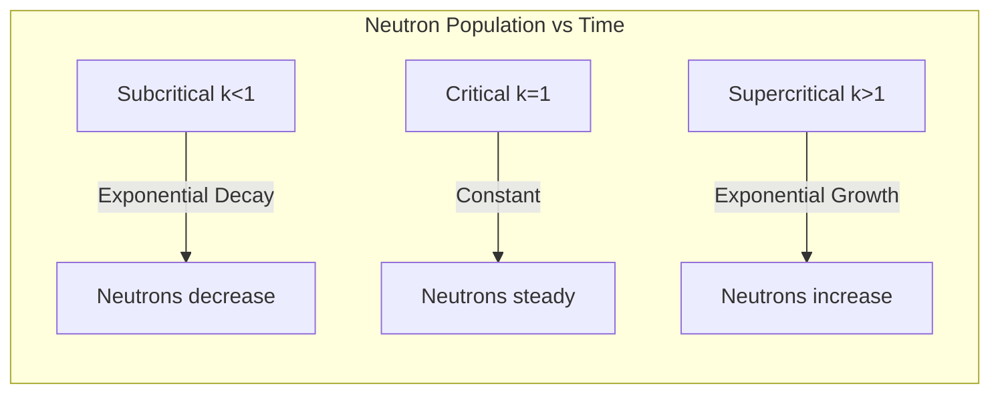
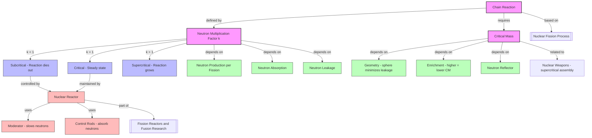

# 1. Overview / 概述

**English:**
This sub-topic explores the mechanism of **chain reactions** in nuclear fission and the concept of **critical mass** — the minimum amount of fissile material required to sustain a self-sustaining chain reaction. Understanding chain reactions is essential for explaining how nuclear reactors operate and how atomic bombs function. The concept of critical mass determines whether a fission reaction will die out, remain steady, or escalate uncontrollably. This sub-topic builds directly on [[Nuclear Fission Process]] and connects to [[Fission Reactors and Fusion Research]].

**中文:**
本子知识点探讨核裂变中的**链式反应**机制以及**临界质量**的概念——即维持自持链式反应所需的最小裂变材料质量。理解链式反应对于解释核反应堆如何运行以及原子弹如何工作至关重要。临界质量的概念决定了裂变反应是会逐渐停止、保持稳定还是失控升级。本子知识点直接建立在[[Nuclear Fission Process]]的基础上，并与[[Fission Reactors and Fusion Research]]相关联。

---

# 2. Syllabus Learning Objectives / 考纲学习目标

| CAIE 9702 | Edexcel IAL |
|-----------|-------------|
| 24.3(a) Describe what a chain reaction is | 9.13 Understand the concept of a chain reaction |
| 24.3(b) Explain the conditions for a chain reaction to occur | 9.14 Understand the meaning of critical mass |
| 24.3(c) Define critical mass | 9.15 Explain how a chain reaction can be controlled |
| 24.3(d) Explain the difference between controlled and uncontrolled chain reactions | 9.16 Understand the role of moderators and control rods |
| 24.3(e) Describe the function of moderators and control rods | 9.17 Understand the concept of neutron multiplication factor (k) |
| 24.3(f) Explain the concept of neutron multiplication factor | 9.18 Understand the difference between subcritical, critical, and supercritical states |

**Examiner Expectations / 考官期望:**
- **English:** Students must be able to define chain reaction and critical mass precisely. They should explain how neutron multiplication factor k determines whether a system is subcritical (k < 1), critical (k = 1), or supercritical (k > 1). They must describe the roles of moderators and control rods in controlling chain reactions.
- **中文:** 学生必须能够精确定义链式反应和临界质量。应解释中子倍增因子k如何决定系统是次临界(k < 1)、临界(k = 1)还是超临界(k > 1)。必须描述慢化剂和控制棒在控制链式反应中的作用。

---

# 3. Core Definitions / 核心定义

| Term (EN/CN) | Definition (EN) | Definition (CN) | Common Mistakes / 常见错误 |
|--------------|-----------------|-----------------|---------------------------|
| **Chain Reaction** / 链式反应 | A self-sustaining sequence of nuclear fission reactions where neutrons released from one fission event cause further fission events. | 一种自持的核裂变反应序列，其中一次裂变释放的中子引发进一步的裂变事件。 | Confusing chain reaction with a single fission event. Chain reaction requires multiple generations. |
| **Critical Mass** / 临界质量 | The minimum mass of fissile material required to sustain a self-sustaining chain reaction (k = 1). | 维持自持链式反应所需的最小裂变材料质量(k = 1)。 | Thinking critical mass is a fixed value — it depends on geometry, purity, and surrounding materials. |
| **Neutron Multiplication Factor (k)** / 中子倍增因子 | The ratio of the number of neutrons in one generation to the number in the previous generation. | 一代中子数量与上一代中子数量的比值。 | Forgetting that k includes neutron losses (absorption, leakage), not just production. |
| **Moderator** / 慢化剂 | A material (e.g., graphite, water) that slows down fast neutrons to thermal energies to increase the probability of fission. | 一种用于将快中子减速到热中子能量以增加裂变概率的材料（如石墨、水）。 | Thinking moderators absorb neutrons — they slow them down, not absorb them. |
| **Control Rods** / 控制棒 | Rods made of neutron-absorbing material (e.g., boron, cadmium) inserted into a reactor to control the chain reaction rate. | 由中子吸收材料（如硼、镉）制成的棒，插入反应堆以控制链式反应速率。 | Confusing control rods with moderators — control rods absorb neutrons, moderators slow them down. |
| **Subcritical / Critical / Supercritical** / 次临界/临界/超临界 | States where k < 1 (reaction dies out), k = 1 (steady state), or k > 1 (reaction grows exponentially). | k < 1（反应逐渐停止）、k = 1（稳态）或k > 1（反应指数增长）的状态。 | Thinking supercritical always means explosion — in reactors, k is only slightly > 1 for controlled power increase. |

---

# 4. Key Concepts Explained / 关键概念详解

## 4.1 The Chain Reaction Mechanism / 链式反应机制

### Explanation / 解释
**English:**
A [[Nuclear Fission Process]] begins when a neutron is absorbed by a fissile nucleus (e.g., uranium-235 or plutonium-239). The nucleus splits into two smaller nuclei (fission fragments), releasing 2-3 fast neutrons and a large amount of energy. These released neutrons can then be absorbed by other fissile nuclei, causing further fissions. This creates a **chain reaction** — a self-sustaining sequence of fission events.

The key requirement is that, on average, at least one neutron from each fission must cause another fission. If fewer than one neutron causes fission, the reaction dies out (subcritical). If exactly one neutron causes fission, the reaction is steady (critical). If more than one neutron causes fission, the reaction grows (supercritical).

**中文:**
当一颗中子被裂变核（如铀-235或钚-239）吸收时，[[Nuclear Fission Process]]开始。原子核分裂成两个较小的原子核（裂变碎片），释放出2-3个快中子和大量能量。这些释放出的中子可以被其他裂变核吸收，引起进一步的裂变。这就形成了**链式反应**——一系列自持的裂变事件。

关键要求是，平均每个裂变至少有一个中子引起另一次裂变。如果引起裂变的中子少于一个，反应就会逐渐停止（次临界）。如果恰好有一个中子引起裂变，反应保持稳定（临界）。如果多于一个中子引起裂变，反应就会增长（超临界）。

### Physical Meaning / 物理意义
**English:**
The chain reaction is the mechanism that converts nuclear potential energy into thermal energy in a sustained manner. Each fission releases ~200 MeV of energy, and a chain reaction can release enormous amounts of energy from a small mass of fuel. The neutron multiplication factor k determines the rate of energy release.

**中文:**
链式反应是以持续方式将核势能转化为热能的机制。每次裂变释放约200 MeV的能量，链式反应可以从少量燃料中释放出巨大的能量。中子倍增因子k决定了能量释放的速率。

### Common Misconceptions / 常见误区
- **English:**
  - "All neutrons from fission cause further fissions" — In reality, many neutrons are lost to absorption by non-fissile materials or escape the system.
  - "Chain reactions always lead to explosions" — Controlled chain reactions in reactors maintain k = 1 exactly.
  - "The number of neutrons doubles every generation" — Only if k = 2, but typically k is close to 1.
- **中文:**
  - "所有裂变产生的中子都会引起进一步裂变"——实际上，许多中子被非裂变材料吸收或逃逸出系统。
  - "链式反应总是导致爆炸"——反应堆中的受控链式反应精确保持k = 1。
  - "每一代中子数量翻倍"——只有当k = 2时才成立，但通常k接近1。

### Exam Tips / 考试提示
- **English:** Always define k precisely. Use the terms subcritical, critical, and supercritical correctly. Explain that k depends on the balance between neutron production and losses (absorption + leakage).
- **中文:** 始终精确定义k。正确使用次临界、临界和超临界术语。解释k取决于中子产生与损失（吸收+泄漏）之间的平衡。

> 📷 **IMAGE PROMPT — CHAIN-01: Chain Reaction Diagram**
> A clear diagram showing a uranium-235 nucleus absorbing a neutron, splitting into two fission fragments, releasing 2-3 fast neutrons, each of which goes on to cause further fissions. Use arrows to show the chain progression. Label: neutron, fission fragment, energy release. Show 3 generations of fission.

---

## 4.2 Neutron Multiplication Factor (k) / 中子倍增因子 (k)

### Explanation / 解释
**English:**
The **neutron multiplication factor** k is defined as:

$$ k = \frac{\text{Number of neutrons in one generation}}{\text{Number of neutrons in the previous generation}} $$

- **k < 1 (Subcritical):** The chain reaction dies out. Each generation has fewer neutrons than the previous one.
- **k = 1 (Critical):** The chain reaction is self-sustaining at a constant rate. Each generation has the same number of neutrons.
- **k > 1 (Supercritical):** The chain reaction grows exponentially. Each generation has more neutrons than the previous one.

The value of k depends on:
1. **Neutron production:** Number of neutrons released per fission (typically 2-3 for U-235)
2. **Neutron absorption:** Neutrons absorbed by fuel (causing fission), by control rods, by moderator, or by structural materials
3. **Neutron leakage:** Neutrons that escape from the fissile material

**中文:**
**中子倍增因子** k 定义为：

$$ k = \frac{\text{一代中子数量}}{\text{上一代中子数量}} $$

- **k < 1（次临界）：** 链式反应逐渐停止。每一代的中子数量少于上一代。
- **k = 1（临界）：** 链式反应以恒定速率自持。每一代的中子数量相同。
- **k > 1（超临界）：** 链式反应指数增长。每一代的中子数量多于上一代。

k 的值取决于：
1. **中子产生：** 每次裂变释放的中子数（铀-235通常为2-3个）
2. **中子吸收：** 被燃料（引起裂变）、控制棒、慢化剂或结构材料吸收的中子
3. **中子泄漏：** 从裂变材料中逃逸的中子

### Physical Meaning / 物理意义
**English:**
k is the fundamental parameter that determines whether a nuclear system is safe (subcritical), stable (critical), or dangerous (supercritical). In a nuclear reactor, control systems maintain k = 1 for steady power output. In a nuclear weapon, k is made much greater than 1 for rapid energy release.

**中文:**
k 是决定核系统是安全（次临界）、稳定（临界）还是危险（超临界）的基本参数。在核反应堆中，控制系统维持k = 1以获得稳定的功率输出。在核武器中，k被设计为远大于1以实现快速能量释放。

### Common Misconceptions / 常见误区
- **English:**
  - "k is always constant" — k changes with fuel depletion, control rod position, and temperature.
  - "k = 1 means no neutrons are lost" — k = 1 means neutron production equals total losses (absorption + leakage).
- **中文:**
  - "k 总是恒定的"——k 随燃料消耗、控制棒位置和温度而变化。
  - "k = 1 意味着没有中子损失"——k = 1 意味着中子产生等于总损失（吸收+泄漏）。

### Exam Tips / 考试提示
- **English:** When asked to calculate k, remember to account for all neutron losses. Use the formula: k = (neutrons produced per fission) × (probability of causing another fission).
- **中文:** 当要求计算k时，记得考虑所有中子损失。使用公式：k = (每次裂变产生的中子数) × (引起另一次裂变的概率)。

---

## 4.3 Critical Mass / 临界质量

### Explanation / 解释
**English:**
**Critical mass** is the minimum mass of fissile material required to achieve a self-sustaining chain reaction (k = 1). It is not a fixed property of the material — it depends on:

1. **Geometry:** A sphere has the smallest critical mass because it minimizes surface area-to-volume ratio, reducing neutron leakage.
2. **Purity:** Higher enrichment (higher percentage of fissile isotopes) reduces critical mass.
3. **Reflector:** A neutron reflector around the material can reduce critical mass by reflecting escaping neutrons back.
4. **Density:** Higher density increases the probability of neutron capture before escape.

For pure uranium-235, the critical mass is approximately 52 kg (as a sphere). For plutonium-239, it is approximately 10 kg.

**中文:**
**临界质量** 是实现自持链式反应(k = 1)所需的最小裂变材料质量。它不是材料的固定属性——它取决于：

1. **几何形状：** 球体具有最小的临界质量，因为它最小化了表面积与体积之比，减少了中子泄漏。
2. **纯度：** 更高的富集度（更高百分比的裂变同位素）降低了临界质量。
3. **反射层：** 材料周围的中子反射层可以通过反射逃逸中子来降低临界质量。
4. **密度：** 更高的密度增加了中子在被逃逸前被捕获的概率。

对于纯铀-235，临界质量约为52 kg（球体）。对于钚-239，约为10 kg。

### Physical Meaning / 物理意义
**English:**
Critical mass represents the threshold between a safe subcritical system and a potentially dangerous critical system. Below critical mass, too many neutrons escape before causing fission, so the chain reaction cannot be sustained. Above critical mass, the system can sustain a chain reaction.

**中文:**
临界质量代表了安全的次临界系统与潜在危险的临界系统之间的阈值。低于临界质量时，太多中子在引起裂变前逃逸，因此无法维持链式反应。高于临界质量时，系统可以维持链式反应。

### Common Misconceptions / 常见误区
- **English:**
  - "Critical mass is the same for all materials" — Different isotopes have different critical masses.
  - "Critical mass means the material will explode" — Critical mass only means a self-sustaining chain reaction is possible; the rate depends on k.
- **中文:**
  - "所有材料的临界质量相同"——不同同位素有不同的临界质量。
  - "临界质量意味着材料会爆炸"——临界质量仅意味着自持链式反应是可能的；速率取决于k。

### Exam Tips / 考试提示
- **English:** Explain why a sphere has the smallest critical mass: minimum surface area-to-volume ratio minimizes neutron leakage. Mention that critical mass decreases with enrichment and with the use of a neutron reflector.
- **中文:** 解释为什么球体具有最小的临界质量：最小的表面积与体积比最小化了中子泄漏。提到临界质量随富集度增加和使用中子反射层而降低。

> 📷 **IMAGE PROMPT — CM-01: Critical Mass Diagram**
> A diagram comparing a subcritical mass (small sphere with neutrons escaping) and a critical mass (larger sphere where neutrons cause further fissions). Show neutron paths: some cause fission, some escape. Label: subcritical (k<1), critical (k=1). Use arrows to show neutron leakage.

---

## 4.4 Controlling Chain Reactions / 控制链式反应

### Explanation / 解释
**English:**
In a [[Fission Reactors and Fusion Research|nuclear reactor]], the chain reaction must be controlled to maintain k = 1. Two main components achieve this:

**1. Moderator:**
- Slows down fast neutrons (produced at ~2 MeV) to thermal energies (~0.025 eV)
- Thermal neutrons have a much higher probability of causing fission in U-235
- Common moderators: graphite, light water (H₂O), heavy water (D₂O)
- The moderator does NOT absorb neutrons — it only slows them down

**2. Control Rods:**
- Made of neutron-absorbing materials (boron, cadmium, hafnium)
- Inserted into the reactor core to absorb excess neutrons
- Fully inserted → more neutrons absorbed → k decreases
- Partially withdrawn → fewer neutrons absorbed → k increases
- Used to start, maintain, and shut down the reactor

**中文:**
在[[Fission Reactors and Fusion Research|核反应堆]]中，必须控制链式反应以维持k = 1。两个主要组件实现这一目标：

**1. 慢化剂：**
- 将快中子（产生时约2 MeV）减速到热中子能量（约0.025 eV）
- 热中子引起铀-235裂变的概率要高得多
- 常见的慢化剂：石墨、轻水（H₂O）、重水（D₂O）
- 慢化剂不吸收中子——它只减慢中子速度

**2. 控制棒：**
- 由中子吸收材料制成（硼、镉、铪）
- 插入反应堆堆芯以吸收多余中子
- 完全插入 → 更多中子被吸收 → k 降低
- 部分抽出 → 更少中子被吸收 → k 升高
- 用于启动、维持和关闭反应堆

### Physical Meaning / 物理意义
**English:**
The moderator and control rods work together to maintain k = 1. The moderator ensures that enough neutrons are at thermal energies to cause fission, while control rods absorb the excess neutrons that would otherwise make k > 1. This balance allows the reactor to produce steady power.

**中文:**
慢化剂和控制棒协同工作以维持k = 1。慢化剂确保足够的中子处于热中子能量以引起裂变，而控制棒吸收那些否则会使k > 1的多余中子。这种平衡使反应堆能够产生稳定的功率。

### Common Misconceptions / 常见误区
- **English:**
  - "Moderators absorb neutrons" — No, they slow neutrons down via elastic collisions.
  - "Control rods are made of fissile material" — No, they are made of neutron-absorbing materials.
  - "The moderator is used to stop the reaction" — No, control rods stop the reaction; the moderator is always present.
- **中文:**
  - "慢化剂吸收中子"——不，它们通过弹性碰撞减慢中子速度。
  - "控制棒由裂变材料制成"——不，它们由中子吸收材料制成。
  - "慢化剂用于停止反应"——不，控制棒停止反应；慢化剂始终存在。

### Exam Tips / 考试提示
- **English:** Be able to explain why thermal neutrons are more effective for fission: they have a larger cross-section (probability) for absorption by U-235. Compare the roles of moderator and control rods clearly.
- **中文:** 能够解释为什么热中子对裂变更有效：它们被铀-235吸收的截面（概率）更大。清楚比较慢化剂和控制棒的作用。

> 📷 **IMAGE PROMPT — REACTOR-01: Reactor Core Diagram**
> A cross-section diagram of a nuclear reactor core showing: fuel rods (U-235), control rods (boron), moderator (graphite or water), and neutron paths. Show fast neutrons being slowed by moderator, thermal neutrons causing fission, and control rods absorbing neutrons. Label all components.

---

# 5. Essential Equations / 核心公式

## 5.1 Neutron Multiplication Factor / 中子倍增因子

$$ k = \frac{N_{n+1}}{N_n} $$

| Symbol (符号) | Meaning (EN) | Meaning (CN) | Unit (单位) |
|--------------|-------------|-------------|------------|
| k | Neutron multiplication factor | 中子倍增因子 | dimensionless |
| Nₙ | Number of neutrons in generation n | 第n代的中子数量 | dimensionless |
| Nₙ₊₁ | Number of neutrons in generation n+1 | 第n+1代的中子数量 | dimensionless |

**Derivation / 推导:**
If each fission produces ν neutrons (ν ≈ 2.5 for U-235), and the probability that a neutron causes another fission is p, then:
$$ k = \nu \times p $$
where p accounts for all losses (absorption by non-fuel materials and leakage).

**Conditions / 适用条件:**
- **English:** Valid for any fissile system. k is an average value over many fissions.
- **中文:** 适用于任何裂变系统。k是多次裂变的平均值。

**Limitations / 局限性:**
- **English:** k is a statistical average — individual neutrons may behave differently. The formula assumes a large number of fissions.
- **中文:** k是统计平均值——单个中子可能行为不同。该公式假设大量裂变。

## 5.2 Neutron Flux and Reaction Rate / 中子通量与反应速率

$$ R = \phi \times \sigma \times N $$

| Symbol (符号) | Meaning (EN) | Meaning (CN) | Unit (单位) |
|--------------|-------------|-------------|------------|
| R | Reaction rate per unit volume | 单位体积反应速率 | m⁻³s⁻¹ |
| φ | Neutron flux (neutrons per unit area per second) | 中子通量（单位面积每秒中子数） | m⁻²s⁻¹ |
| σ | Microscopic cross-section (probability of interaction) | 微观截面（相互作用概率） | m² |
| N | Number density of target nuclei | 靶核数密度 | m⁻³ |

**Conditions / 适用条件:**
- **English:** Used for calculating fission rates in reactor physics. Cross-section depends on neutron energy.
- **中文:** 用于计算反应堆物理中的裂变速率。截面取决于中子能量。

---

# 6. Graphs and Relationships / 图表与关系

## 6.1 Neutron Population vs. Time / 中子数量随时间变化

### Axes / 坐标轴
- **X-axis:** Time / 时间 (s)
- **Y-axis:** Number of neutrons / 中子数量 (log scale)

### Shape / 形状
- **Subcritical (k < 1):** Exponential decay — neutron population decreases over time
- **Critical (k = 1):** Constant — neutron population remains steady
- **Supercritical (k > 1):** Exponential growth — neutron population increases over time

### Gradient Meaning / 斜率含义
- **English:** The slope of the log-linear graph gives the growth/decay constant. Steeper slope = faster change.
- **中文:** 对数-线性图的斜率给出增长/衰减常数。斜率越陡，变化越快。

### Area Meaning / 面积含义
- **English:** Area under the curve represents total number of fissions that have occurred.
- **中文:** 曲线下的面积表示已发生的总裂变次数。

### Exam Interpretation / 考试解读
- **English:** Be able to sketch these three curves. Explain that for a nuclear reactor, the goal is to maintain the critical curve (constant neutron population).
- **中文:** 能够画出这三条曲线。解释核反应堆的目标是维持临界曲线（中子数量恒定）。

> 📷 **IMAGE PROMPT — GRAPH-01: Neutron Population vs Time**
> Three curves on the same graph: (1) Subcritical: downward exponential curve, (2) Critical: horizontal straight line, (3) Supercritical: upward exponential curve. Y-axis labeled "Number of neutrons (log scale)", X-axis labeled "Time". Clearly label each curve.

---

## 6.2 Critical Mass vs. Enrichment / 临界质量与富集度

### Axes / 坐标轴
- **X-axis:** Enrichment (% U-235) / 富集度（铀-235百分比）
- **Y-axis:** Critical mass (kg) / 临界质量（千克）

### Shape / 形状
- **English:** Decreasing curve — as enrichment increases, critical mass decreases. The curve is steep at low enrichment and flattens at high enrichment.
- **中文:** 递减曲线——随着富集度增加，临界质量减小。曲线在低富集度时陡峭，在高富集度时趋于平缓。

### Gradient Meaning / 斜率含义
- **English:** The gradient shows how sensitive critical mass is to changes in enrichment. Steep gradient at low enrichment means small changes in enrichment cause large changes in critical mass.
- **中文:** 斜率显示临界质量对富集度变化的敏感程度。低富集度时陡峭的斜率意味着富集度的微小变化会引起临界质量的大幅变化。

### Exam Interpretation / 考试解读
- **English:** Explain why highly enriched uranium (HEU, >20% U-235) has a much smaller critical mass than natural uranium (0.7% U-235). This is why enrichment is a key step in both nuclear power and weapons.
- **中文:** 解释为什么高富集铀（HEU，>20%铀-235）的临界质量远小于天然铀（0.7%铀-235）。这就是为什么富集是核能和核武器中的关键步骤。

---

# 7. Required Diagrams / 必备图表

## 7.1 Chain Reaction Diagram / 链式反应图

### Description / 描述
**English:** A diagram showing at least 3 generations of fission events, with neutrons from each fission causing further fissions. Should show the exponential growth of the chain reaction.

**中文:** 显示至少3代裂变事件的图表，每次裂变产生的中子引起进一步的裂变。应显示链式反应的指数增长。

### Image Prompt / 图片生成提示
> 📷 **IMAGE PROMPT — CHAIN-02: Chain Reaction with 3 Generations**
> A clear, educational diagram showing a chain reaction in uranium-235. Generation 1: one U-235 nucleus absorbs a neutron and splits into two fission fragments, releasing 3 fast neutrons. Generation 2: each of the 3 neutrons causes a fission, releasing 3 neutrons each (9 total). Generation 3: each of the 9 neutrons causes a fission. Use different colors for each generation. Label: neutron, fission fragment, U-235 nucleus. Show the exponential growth: 1 → 3 → 9 fissions.

### Labels Required / 需要标注
- **English:** Neutron, fission fragment, U-235 nucleus, generation number (1, 2, 3), direction of neutron travel
- **中文:** 中子、裂变碎片、铀-235核、代次编号（1、2、3）、中子运动方向

### Exam Importance / 考试重要性
- **English:** High — chain reaction diagrams are frequently tested in both CIE and Edexcel exams. Students must be able to draw and explain them.
- **中文:** 高——链式反应图在CIE和Edexcel考试中经常出现。学生必须能够画出并解释它们。

---

## 7.2 Reactor Core Diagram / 反应堆堆芯图

### Description / 描述
**English:** A cross-section diagram of a nuclear reactor core showing fuel rods, control rods, moderator, and neutron paths. Should illustrate how the moderator slows neutrons and control rods absorb excess neutrons.

**中文:** 核反应堆堆芯的横截面图，显示燃料棒、控制棒、慢化剂和中子路径。应说明慢化剂如何减慢中子以及控制棒如何吸收多余中子。

### Image Prompt / 图片生成提示
> 📷 **IMAGE PROMPT — REACTOR-02: Nuclear Reactor Core Cross-Section**
> A detailed cross-section diagram of a nuclear reactor core. Show: (1) Fuel rods arranged in a grid pattern, labeled "Fuel Rod (U-235)", (2) Control rods partially inserted between fuel rods, labeled "Control Rod (Boron)", (3) Moderator material filling the space between rods, labeled "Moderator (Graphite/Water)", (4) Neutron paths: fast neutrons (red arrows) from fission, slowed to thermal neutrons (blue arrows) by moderator, (5) Some neutrons absorbed by control rods (shown as X marks), (6) Some neutrons causing fission in fuel rods. Use a clean, textbook-style layout.

### Labels Required / 需要标注
- **English:** Fuel rod, control rod, moderator, fast neutron, thermal neutron, neutron absorption, fission event
- **中文:** 燃料棒、控制棒、慢化剂、快中子、热中子、中子吸收、裂变事件

### Exam Importance / 考试重要性
- **English:** High — understanding the reactor core layout is essential for explaining how chain reactions are controlled.
- **中文:** 高——理解反应堆堆芯布局对于解释链式反应如何被控制至关重要。

---

# 8. Worked Examples / 典型例题

## Example 1: Neutron Multiplication Factor / 中子倍增因子

### Question / 题目
**English:**
In a nuclear reactor, each fission of U-235 produces an average of 2.5 neutrons. However, 30% of these neutrons are absorbed by the control rods and moderator before they can cause further fissions. Additionally, 10% of the neutrons leak out of the reactor core. Calculate the neutron multiplication factor k. Is the reactor subcritical, critical, or supercritical?

**中文:**
在核反应堆中，每次铀-235裂变平均产生2.5个中子。然而，这些中子中有30%在引起进一步裂变之前被控制棒和慢化剂吸收。此外，10%的中子泄漏出反应堆堆芯。计算中子倍增因子k。该反应堆是次临界、临界还是超临界？

### Solution / 解答

**Step 1: Identify the number of neutrons produced per fission**
$$ \nu = 2.5 $$

**Step 2: Calculate the fraction of neutrons that cause fission**
- Neutrons absorbed by control rods/moderator: 30% = 0.30
- Neutrons leaking out: 10% = 0.10
- Total losses: 0.30 + 0.10 = 0.40
- Fraction causing fission: 1 - 0.40 = 0.60

**Step 3: Calculate k**
$$ k = \nu \times p = 2.5 \times 0.60 = 1.5 $$

**Step 4: Determine the state**
Since k = 1.5 > 1, the reactor is **supercritical**.

**中文解答：**

**步骤1：确定每次裂变产生的中子数**
$$ \nu = 2.5 $$

**步骤2：计算引起裂变的中子比例**
- 被控制棒/慢化剂吸收的中子：30% = 0.30
- 泄漏的中子：10% = 0.10
- 总损失：0.30 + 0.10 = 0.40
- 引起裂变的比例：1 - 0.40 = 0.60

**步骤3：计算k**
$$ k = \nu \times p = 2.5 \times 0.60 = 1.5 $$

**步骤4：确定状态**
由于k = 1.5 > 1，反应堆处于**超临界**状态。

### Final Answer / 最终答案
**Answer:** k = 1.5, supercritical | **答案：** k = 1.5，超临界

### Quick Tip / 提示
**English:** Remember that k = (neutrons produced per fission) × (probability of causing another fission). The probability accounts for ALL losses — absorption and leakage.
**中文：** 记住k = (每次裂变产生的中子数) × (引起另一次裂变的概率)。该概率考虑了所有损失——吸收和泄漏。

---

## Example 2: Critical Mass and Geometry / 临界质量与几何形状

### Question / 题目
**English:**
A sample of uranium-235 has a mass of 40 kg and is shaped as a sphere. The critical mass of U-235 in a spherical geometry is 52 kg. The sample is then reshaped into a thin sheet with a much larger surface area. Explain why the reshaped sample is less likely to sustain a chain reaction, even though its mass remains the same.

**中文:**
一个铀-235样品质量为40 kg，形状为球体。铀-235在球体几何形状下的临界质量为52 kg。然后将该样品重新塑造成表面积大得多的薄片。解释为什么重新塑形后的样品不太可能维持链式反应，尽管其质量保持不变。

### Solution / 解答

**Step 1: Compare the original shape to critical mass**
- Original mass: 40 kg
- Critical mass (sphere): 52 kg
- Since 40 kg < 52 kg, the sphere is subcritical — too many neutrons escape.

**Step 2: Explain the effect of geometry on neutron leakage**
- A sphere has the minimum surface area-to-volume ratio.
- Neutron leakage depends on surface area — neutrons near the surface are likely to escape.
- A thin sheet has a much larger surface area for the same volume (and mass).
- More neutrons are near the surface in a thin sheet, so a larger fraction escapes.

**Step 3: Conclusion**
- The reshaped thin sheet has even more neutron leakage than the sphere.
- Since the sphere was already subcritical, the thin sheet is even further from criticality.
- The reshaped sample is less likely to sustain a chain reaction.

**中文解答：**

**步骤1：比较原始形状与临界质量**
- 原始质量：40 kg
- 临界质量（球体）：52 kg
- 由于40 kg < 52 kg，球体是次临界的——太多中子逃逸。

**步骤2：解释几何形状对中子泄漏的影响**
- 球体具有最小的表面积与体积比。
- 中子泄漏取决于表面积——靠近表面的中子容易逃逸。
- 对于相同的体积（和质量），薄片具有大得多的表面积。
- 在薄片中，更多中子靠近表面，因此更大比例的中子逃逸。

**步骤3：结论**
- 重新塑形后的薄片比球体有更多的中子泄漏。
- 由于球体已经是次临界的，薄片离临界状态更远。
- 重新塑形后的样品不太可能维持链式反应。

### Final Answer / 最终答案
**Answer:** The thin sheet has a larger surface area-to-volume ratio, causing more neutron leakage. This makes it harder to achieve criticality. | **答案：** 薄片具有更大的表面积与体积比，导致更多中子泄漏。这使得更难达到临界状态。

### Quick Tip / 提示
**English:** Always link critical mass to geometry — a sphere minimizes leakage. Any shape with a larger surface area for the same mass will have a higher critical mass requirement.
**中文：** 始终将临界质量与几何形状联系起来——球体最小化泄漏。任何对于相同质量具有更大表面积的形状都会有更高的临界质量要求。

---

# 9. Past Paper Question Types / 历年真题题型

| Question Type / 题型 | Frequency / 频率 | Difficulty / 难度 | Past Paper References / 真题索引 |
|----------------------|------------------|------------------|-------------------------------|
| Define chain reaction and critical mass | High | Easy | 📝 *待填入* |
| Calculate neutron multiplication factor k | Medium | Medium | 📝 *待填入* |
| Explain subcritical/critical/supercritical states | High | Medium | 📝 *待填入* |
| Describe roles of moderator and control rods | High | Medium | 📝 *待填入* |
| Explain why geometry affects critical mass | Medium | Hard | 📝 *待填入* |
| Sketch neutron population vs time graphs | Low | Medium | 📝 *待填入* |

**Common Command Words / 常见指令词:**
- **English:** Define, Explain, Calculate, Describe, Sketch, Compare, State
- **中文:** 定义、解释、计算、描述、画出、比较、陈述

---

# 10. Practical Skills Connections / 实验技能链接

**English:**
While chain reactions and critical mass are not directly tested in practical exams, the following practical skills are relevant:

1. **Simulation experiments:** Computer simulations of chain reactions (e.g., using dice or random number generators to model neutron behavior) help understand statistical nature of fission.
2. **Graph plotting:** Plotting neutron population vs. time data from simulations develops graph interpretation skills.
3. **Uncertainty analysis:** Understanding that k is a statistical average — individual measurements would show variation.
4. **Experimental design:** Designing a simulation to model the effect of control rod position on k.

**中文:**
虽然链式反应和临界质量不直接在实验考试中测试，但以下实验技能是相关的：

1. **模拟实验：** 链式反应的计算机模拟（例如，使用骰子或随机数生成器模拟中子行为）有助于理解裂变的统计性质。
2. **图表绘制：** 绘制模拟中的中子数量随时间变化的数据，培养图表解读技能。
3. **不确定度分析：** 理解k是统计平均值——单个测量值会显示变化。
4. **实验设计：** 设计模拟以建模控制棒位置对k的影响。

---

# 11. Concept Map / 概念图谱

---

# 12. Quick Revision Sheet / 速查表

| Category / 类别 | Key Points / 要点 |
|----------------|------------------|
| **Definition / 定义** | **Chain Reaction:** Self-sustaining sequence of fission events where neutrons from one fission cause further fissions. **Critical Mass:** Minimum mass of fissile material for self-sustaining chain reaction (k=1). |
| **Key Formula / 核心公式** | $$k = \frac{N_{n+1}}{N_n} = \nu \times p$$ where ν = neutrons per fission, p = probability of causing another fission |
| **Key States / 关键状态** | **Subcritical (k<1):** Reaction dies out. **Critical (k=1):** Steady state. **Supercritical (k>1):** Reaction grows exponentially. |
| **Reactor Control / 反应堆控制** | **Moderator:** Slows fast neutrons to thermal energies (graphite, water). **Control Rods:** Absorb excess neutrons (boron, cadmium). |
| **Critical Mass Factors / 临界质量因素** | **Geometry:** Sphere minimizes leakage. **Enrichment:** Higher = lower critical mass. **Reflector:** Reduces critical mass. **Density:** Higher = lower critical mass. |
| **Key Graph / 核心图表** | Neutron population vs time: Subcritical (decay), Critical (constant), Supercritical (growth). |
| **Common Exam Question / 常见考题** | "Explain how a chain reaction is controlled in a nuclear reactor." — Mention moderator (slows neutrons) and control rods (absorb neutrons) to maintain k=1. |
| **Exam Tip / 考试提示** | Always define k precisely. Remember that k accounts for ALL neutron losses (absorption + leakage). A sphere has the smallest critical mass due to minimum surface area-to-volume ratio. |