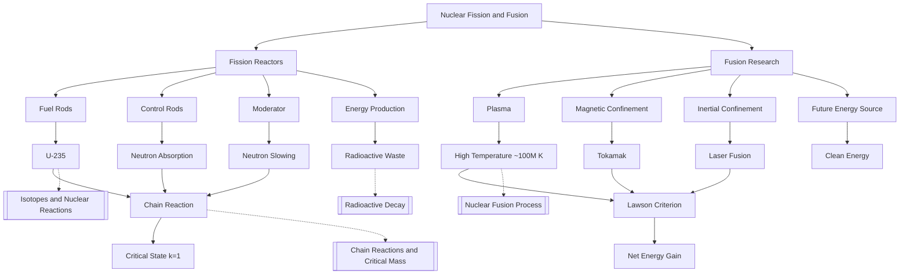

# 1. Overview / 概述

**English:**
This sub-topic explores the practical applications of [[Nuclear Fission and Fusion]] in two distinct directions: fission reactors (current technology) and fusion research (future technology). For fission reactors, you will learn how controlled chain reactions are maintained in a nuclear power plant, the role of key components like fuel rods, control rods, and moderators, and the safety and environmental considerations. For fusion research, you will examine the immense challenges of achieving and sustaining controlled fusion on Earth, including the need for extreme temperatures and plasma confinement, and the current state of projects like ITER. This sub-topic connects the theoretical physics of [[Nuclear Fission Process]] and [[Nuclear Fusion Process]] to real-world engineering and energy policy.

**中文:**
本子知识点探讨[[核裂变与核聚变]]在两个不同方向上的实际应用：裂变反应堆（当前技术）和聚变研究（未来技术）。对于裂变反应堆，你将学习如何在核电站中维持受控的链式反应，关键部件（如燃料棒、控制棒和慢化剂）的作用，以及安全与环境考量。对于聚变研究，你将研究在地球上实现和维持受控聚变所面临的巨大挑战，包括对极端温度和等离子体约束的需求，以及像ITER这样的项目的现状。本子知识点将[[核裂变过程]]和[[核聚变过程]]的理论物理与现实世界的工程和能源政策联系起来。

---

# 2. Syllabus Learning Objectives / 考纲学习目标

| CAIE 9702 | Edexcel IAL |
|-----------|-------------|
| 24.3(a) Describe the principles of a fission reactor, including the roles of fuel rods, control rods, and moderator. | 9.13 Understand the principles of a nuclear fission reactor, including the roles of fuel, control rods, and moderator. |
| 24.3(b) Explain the concept of a chain reaction and how it is controlled. | 9.14 Understand the concept of a chain reaction and how it is controlled in a reactor. |
| 24.3(c) Describe the production of energy from a fission reactor. | 9.15 Understand the production of energy from a fission reactor. |
| 24.3(d) Describe the principles of a fusion reactor, including the need for high temperatures and plasma confinement. | 9.16 Understand the principles of a fusion reactor, including the need for high temperatures and plasma confinement. |
| 24.3(e) Explain the difficulties of achieving controlled fusion on Earth. | 9.17 Understand the difficulties of achieving controlled fusion on Earth. |
| 24.3(f) Describe the advantages and disadvantages of fusion as an energy source. | 9.18 Understand the advantages and disadvantages of fusion as an energy source. |

**Examiner Expectations / 考官期望:**
- **CAIE:** Focus on describing the *principles* and *roles* of components. Be able to explain *how* a chain reaction is controlled (not just what it is). For fusion, focus on the *difficulties* (high temperature, confinement) and *advantages* (fuel abundance, no long-lived waste).
- **Edexcel:** Similar focus, but may ask for more detailed comparisons between fission and fusion. Be prepared to discuss the *environmental impact* of both.

---

# 3. Core Definitions / 核心定义

| Term (EN/CN) | Definition (EN) | Definition (CN) | Common Mistakes / 常见错误 |
|--------------|-----------------|-----------------|---------------------------|
| **Fission Reactor** / 裂变反应堆 | A device that initiates and controls a sustained [[Nuclear Fission Process]] chain reaction to produce energy. | 一种启动并控制持续的[[核裂变过程]]链式反应以产生能量的装置。 | Confusing it with a nuclear bomb (reactor is *controlled*). |
| **Fuel Rod** / 燃料棒 | A long, thin tube containing [[Isotopes and Nuclear Reactions|fissile material]] (e.g., uranium-235) where fission occurs. | 装有可裂变材料（如铀-235）的长细管，裂变在其中发生。 | Thinking the rod itself is the fuel; it's a *container* for the fuel. |
| **Control Rod** / 控制棒 | A rod made of a neutron-absorbing material (e.g., boron or cadmium) used to control the rate of the chain reaction. | 由中子吸收材料（如硼或镉）制成的棒，用于控制链式反应的速率。 | Thinking control rods *produce* neutrons; they *absorb* them. |
| **Moderator** / 慢化剂 | A material (e.g., graphite or water) that slows down fast neutrons to thermal speeds to increase the probability of fission. | 一种材料（如石墨或水），用于将快中子减速到热中子速度，以增加裂变的概率。 | Thinking the moderator *absorbs* neutrons; it *slows them down*. |
| **Plasma** / 等离子体 | A state of matter consisting of a gas of ions and free electrons, required for [[Nuclear Fusion Process]] to occur. | 一种由离子和自由电子组成的气体状态，是[[核聚变过程]]发生的必要条件。 | Confusing it with a gas; plasma is electrically conductive and responds to magnetic fields. |
| **Magnetic Confinement** / 磁约束 | Using strong magnetic fields to contain a hot plasma in a fusion reactor (e.g., in a tokamak). | 使用强磁场来约束聚变反应堆中的高温等离子体（例如在托卡马克装置中）。 | Thinking it's a physical container; it's a *magnetic field* that holds the plasma. |

---

# 4. Key Concepts Explained / 关键概念详解

## 4.1 Fission Reactor Components and Their Roles / 裂变反应堆部件及其作用

### Explanation / 解释
**English:**
A [[Nuclear Fission Process|fission reactor]] has three key components:
1.  **Fuel Rods:** Contain the [[Isotopes and Nuclear Reactions|fissile isotope]] (e.g., U-235). When a neutron is absorbed, the nucleus splits, releasing energy and 2-3 more neutrons.
2.  **Moderator:** Surrounds the fuel rods. Fast neutrons (produced by fission) have a low probability of causing further fission. The moderator slows them down to "thermal" speeds (~0.025 eV), where the probability of absorption by U-235 is much higher. Common moderators: graphite, light water (H₂O), heavy water (D₂O).
3.  **Control Rods:** Can be inserted or withdrawn from the reactor core. They absorb excess neutrons. Fully inserted = reaction stops. Withdrawn = reaction proceeds. This controls the [[Chain Reactions and Critical Mass|chain reaction]] and prevents it from becoming supercritical.

**中文:**
一个[[核裂变过程|裂变反应堆]]有三个关键部件：
1.  **燃料棒：** 含有可裂变同位素（如铀-235）。当中子被吸收时，原子核分裂，释放能量和2-3个中子。
2.  **慢化剂：** 包围燃料棒。裂变产生的快中子引起进一步裂变的概率很低。慢化剂将它们减速到“热”速度（约0.025 eV），此时被铀-235吸收的概率要高得多。常见的慢化剂：石墨、轻水（H₂O）、重水（D₂O）。
3.  **控制棒：** 可以插入或抽出反应堆堆芯。它们吸收多余的中子。完全插入 = 反应停止。抽出 = 反应进行。这控制了[[链式反应与临界质量|链式反应]]，并防止其变成超临界。

### Physical Meaning / 物理意义
**English:** The reactor is a system that maintains a *critical* state (k=1), where exactly one neutron from each fission goes on to cause another fission. The control rods and moderator work together to achieve this balance.

**中文:** 反应堆是一个维持*临界*状态（k=1）的系统，其中每次裂变恰好有一个中子继续引起另一次裂变。控制棒和慢化剂协同工作以实现这种平衡。

### Common Misconceptions / 常见误区
- **Misconception:** The moderator absorbs neutrons. **Reality:** It slows them down; control rods absorb them.
- **Misconception:** Fuel rods are pure U-235. **Reality:** They are typically enriched uranium (3-5% U-235, rest U-238).
- **Misconception:** The reactor core is a bomb. **Reality:** It's designed to be *subcritical* without control rods.

### Exam Tips / 考试提示
- **EN:** Be precise: "The moderator *slows down* neutrons; the control rod *absorbs* neutrons." Use the word "thermal" for slow neutrons.
- **中文:** 要精确：“慢化剂*减慢*中子；控制棒*吸收*中子。”使用“热中子”一词。

> 📷 **IMAGE PROMPT — FISSION_REACTOR_DIAGRAM: Cross-section of a nuclear fission reactor core**
> A detailed cross-section diagram of a nuclear fission reactor core. Show fuel rods (cylindrical, labeled "Fuel Rod (U-235)"), control rods (inserted from top, labeled "Control Rod (Boron)"), and moderator (surrounding the rods, labeled "Moderator (Graphite/Water)"). Arrows indicate neutron paths: fast neutrons from fission, then slowed down by moderator to thermal neutrons. A key shows: Fast Neutron (red arrow), Thermal Neutron (blue arrow). The diagram should be clear, educational, and suitable for an A-Level physics textbook.

---

## 4.2 Fusion Reactor Principles and Challenges / 聚变反应堆原理与挑战

### Explanation / 解释
**English:**
A [[Nuclear Fusion Process|fusion reactor]] aims to replicate the Sun's energy source on Earth. The most promising reaction is:
$$ ^2_1H + ^3_1H \rightarrow ^4_2He + ^1_0n + \text{energy} $$
(Deuterium + Tritium → Helium + Neutron + 17.6 MeV)

To achieve fusion, the fuel must be heated to extremely high temperatures (~100 million K) to overcome the electrostatic repulsion between nuclei. At this temperature, the fuel becomes a **plasma**. The challenge is to confine this plasma long enough for fusion to occur. Two main approaches:
1.  **Magnetic Confinement (Tokamak):** Uses strong magnetic fields to hold the plasma in a donut-shaped (toroidal) path.
2.  **Inertial Confinement (Laser Fusion):** Uses powerful lasers to compress and heat a small pellet of fuel.

**中文:**
[[核聚变过程|聚变反应堆]]旨在在地球上复制太阳的能量来源。最有前景的反应是：
$$ ^2_1H + ^3_1H \rightarrow ^4_2He + ^1_0n + \text{能量} $$
（氘 + 氚 → 氦 + 中子 + 17.6 MeV）

为了实现聚变，燃料必须被加热到极高的温度（约1亿开尔文），以克服原子核之间的静电斥力。在这个温度下，燃料变成**等离子体**。挑战在于将等离子体约束足够长的时间以使聚变发生。两种主要方法：
1.  **磁约束（托卡马克）：** 使用强磁场将等离子体保持在甜甜圈形状（环形）的路径中。
2.  **惯性约束（激光聚变）：** 使用强大的激光压缩和加热一小颗燃料丸。

### Physical Meaning / 物理意义
**English:** The key parameter is the **Lawson criterion**: for a net energy gain, the product of plasma density (n), confinement time (τ), and temperature (T) must exceed a certain value: $n \tau T > \text{constant}$. This is why achieving sustained fusion is so difficult.

**中文:** 关键参数是**劳森判据**：为了获得净能量增益，等离子体密度（n）、约束时间（τ）和温度（T）的乘积必须超过某个值：$n \tau T > \text{常数}$。这就是为什么实现持续聚变如此困难。

### Common Misconceptions / 常见误区
- **Misconception:** Fusion reactors are "mini suns" that could explode. **Reality:** A fusion reactor cannot have a runaway chain reaction; if confinement fails, the plasma simply cools and the reaction stops.
- **Misconception:** Fusion produces radioactive waste. **Reality:** The primary reaction produces helium (inert). However, the reactor structure can become activated by neutrons (tritium is also radioactive, but short-lived).

### Exam Tips / 考试提示
- **EN:** Focus on the *difficulties*: high temperature, plasma confinement, and the need for tritium (which is rare). Mention the *advantages*: abundant fuel (deuterium from seawater), no greenhouse gases, no long-lived radioactive waste.
- **中文:** 重点放在*困难*上：高温、等离子体约束以及对氚（稀有）的需求。提及*优势*：燃料丰富（海水中的氘）、无温室气体、无长寿命放射性废物。

> 📷 **IMAGE PROMPT — TOKAMAK_DIAGRAM: Cross-section of a tokamak fusion reactor**
> A cutaway diagram of a tokamak fusion reactor. Show a toroidal (donut-shaped) plasma chamber in the center, labeled "Plasma (100 million K)". Surrounding it are magnetic field coils (toroidal and poloidal), labeled "Magnetic Confinement Coils". Indicate the direction of the magnetic field lines with arrows. Show the injection of deuterium and tritium fuel. The diagram should be clean, scientific, and suitable for an A-Level physics textbook.

---

# 5. Essential Equations / 核心公式

## 5.1 Fission Energy Release / 裂变能量释放

$$ E = \Delta m c^2 $$

| Symbol (符号) | Meaning (EN) | Meaning (CN) | Unit (单位) |
|--------------|-------------|-------------|------------|
| $E$ | Energy released per fission | 每次裂变释放的能量 | J or MeV |
| $\Delta m$ | Mass defect (mass lost) | 质量亏损（损失的质量） | kg or u |
| $c$ | Speed of light in vacuum | 真空中的光速 | m s⁻¹ |

**Derivation / 推导:** From [[Mass-Energy Equivalence (E=mc^2)]].
**Conditions / 适用条件:** Applies to any nuclear reaction.
**Limitations / 局限性:** The energy is shared between the fission fragments, neutrons, and gamma rays.

## 5.2 Fusion Energy Release / 聚变能量释放

$$ ^2_1H + ^3_1H \rightarrow ^4_2He + ^1_0n + 17.6 \text{ MeV} $$

| Symbol (符号) | Meaning (EN) | Meaning (CN) | Unit (单位) |
|--------------|-------------|-------------|------------|
| $^2_1H$ | Deuterium nucleus | 氘核 | - |
| $^3_1H$ | Tritium nucleus | 氚核 | - |
| $^4_2He$ | Helium-4 nucleus (alpha particle) | 氦-4核（α粒子） | - |
| $^1_0n$ | Neutron | 中子 | - |

**Derivation / 推导:** Calculate mass defect: $\Delta m = (m_D + m_T) - (m_{He} + m_n)$, then $E = \Delta m c^2$.
**Conditions / 适用条件:** Requires extremely high temperature and pressure.
**Limitations / 局限性:** Tritium is radioactive and rare; must be bred from lithium.

> 📋 **CIE Only:** You may be asked to calculate the energy released from a given mass of fuel using $E = \Delta m c^2$.
> 📋 **Edexcel Only:** You may be asked to compare the energy density of fission and fusion fuels.

---

# 6. Graphs and Relationships / 图表与关系

## 6.1 Neutron Energy vs. Fission Cross-Section / 中子能量与裂变截面

### Axes / 坐标轴
- **X-axis:** Neutron energy / eV (log scale) | 中子能量 / eV（对数坐标）
- **Y-axis:** Fission cross-section / barns (log scale) | 裂变截面 / 靶恩（对数坐标）

### Shape / 形状
**English:** The graph shows a high cross-section for thermal neutrons (~0.025 eV) and a much lower cross-section for fast neutrons (~1 MeV). This is why a moderator is needed.

**中文:** 该图显示热中子（~0.025 eV）的截面很高，而快中子（~1 MeV）的截面要低得多。这就是为什么需要慢化剂。

### Gradient Meaning / 斜率含义
**English:** The steep negative slope at low energies shows that slowing neutrons down dramatically increases the probability of fission.

**中文:** 低能量下的陡峭负斜率表明，减慢中子会显著增加裂变的概率。

### Area Meaning / 面积含义
**English:** Not typically used for this graph.

**中文:** 此图通常不使用面积含义。

### Exam Interpretation / 考试解读
**English:** Be able to explain *why* the moderator is necessary by referring to this graph: fast neutrons have a low probability of causing fission, so they must be slowed down to thermal energies.

**中文:** 能够通过参考此图来解释*为什么*需要慢化剂：快中子引起裂变的概率很低，因此必须将它们减速到热中子能量。

> 📷 **IMAGE PROMPT — NEUTRON_CROSS_SECTION: Graph of fission cross-section vs neutron energy**
> A log-log graph showing the fission cross-section of U-235 as a function of neutron energy. The x-axis is "Neutron Energy / eV" from 0.01 eV to 10 MeV. The y-axis is "Fission Cross-section / barns" from 0.1 to 1000. The curve is high (around 500 barns) at 0.025 eV (thermal), then drops sharply to below 1 barn at 1 MeV (fast). Label the thermal region and the fast region. The graph should be clear and suitable for an A-Level physics textbook.

---

# 7. Required Diagrams / 必备图表

## 7.1 Fission Reactor Core Diagram / 裂变反应堆堆芯图

### Description / 描述
**English:** A cross-section of a nuclear fission reactor core showing the arrangement of fuel rods, control rods, and moderator. Arrows indicate neutron paths.

**中文:** 核裂变反应堆堆芯的横截面图，显示燃料棒、控制棒和慢化剂的排列。箭头表示中子路径。

### Image Prompt / 图片生成提示
> 📷 **IMAGE PROMPT — FISSION_REACTOR_CORE: Detailed cross-section of a fission reactor core**
> A detailed cross-section diagram of a nuclear fission reactor core. Show fuel rods (cylindrical, labeled "Fuel Rod (U-235)"), control rods (inserted from top, labeled "Control Rod (Boron)"), and moderator (surrounding the rods, labeled "Moderator (Graphite/Water)"). Arrows indicate neutron paths: fast neutrons from fission, then slowed down by moderator to thermal neutrons. A key shows: Fast Neutron (red arrow), Thermal Neutron (blue arrow). The diagram should be clear, educational, and suitable for an A-Level physics textbook.

### Labels Required / 需要标注
- Fuel Rod / 燃料棒
- Control Rod / 控制棒
- Moderator / 慢化剂
- Fast Neutron (red arrow) / 快中子（红色箭头）
- Thermal Neutron (blue arrow) / 热中子（蓝色箭头）

### Exam Importance / 考试重要性
**English:** High. You must be able to draw and label this diagram from memory.

**中文:** 高。你必须能够凭记忆画出并标注此图。

---

## 7.2 Tokamak Fusion Reactor Diagram / 托卡马克聚变反应堆图

### Description / 描述
**English:** A cutaway diagram of a tokamak fusion reactor showing the plasma chamber, magnetic field coils, and fuel injection.

**中文:** 托卡马克聚变反应堆的剖面图，显示等离子体室、磁场线圈和燃料注入。

### Image Prompt / 图片生成提示
> 📷 **IMAGE PROMPT — TOKAMAK_DIAGRAM: Cutaway of a tokamak fusion reactor**
> A cutaway diagram of a tokamak fusion reactor. Show a toroidal (donut-shaped) plasma chamber in the center, labeled "Plasma (100 million K)". Surrounding it are magnetic field coils (toroidal and poloidal), labeled "Magnetic Confinement Coils". Indicate the direction of the magnetic field lines with arrows. Show the injection of deuterium and tritium fuel. The diagram should be clean, scientific, and suitable for an A-Level physics textbook.

### Labels Required / 需要标注
- Plasma / 等离子体
- Magnetic Confinement Coils / 磁约束线圈
- Deuterium Injection / 氘注入
- Tritium Injection / 氚注入

### Exam Importance / 考试重要性
**English:** Medium. You need to understand the concept, but may not be asked to draw it in detail.

**中文:** 中等。你需要理解概念，但可能不会被要求详细画出。

---

# 8. Worked Examples / 典型例题

## Example 1: Fission Reactor Control / 裂变反应堆控制

### Question / 题目
**English:**
A nuclear fission reactor is operating at a steady power level. Explain how the control rods and moderator work together to maintain a critical chain reaction.

**中文:**
一个核裂变反应堆正在以稳定的功率水平运行。解释控制棒和慢化剂如何协同工作以维持临界链式反应。

### Solution / 解答
**Step 1:** The moderator slows down fast neutrons produced by fission to thermal speeds. This increases the probability that they will be absorbed by U-235 nuclei, causing further fission.
**Step 2:** The control rods absorb excess neutrons. By adjusting their position (inserting or withdrawing), the number of neutrons available to cause fission is controlled.
**Step 3:** For a critical reaction (k=1), exactly one neutron from each fission goes on to cause another fission. The moderator ensures enough neutrons are slowed down, and the control rods absorb the surplus to maintain this balance.

**中文：**
**步骤1：** 慢化剂将裂变产生的快中子减速到热速度。这增加了它们被铀-235原子核吸收并引起进一步裂变的概率。
**步骤2：** 控制棒吸收多余的中子。通过调整它们的位置（插入或抽出），可以控制可用于引起裂变的中子数量。
**步骤3：** 对于临界反应（k=1），每次裂变恰好有一个中子继续引起另一次裂变。慢化剂确保有足够的中子被减速，控制棒吸收多余的中子以维持这种平衡。

### Final Answer / 最终答案
**Answer:** The moderator slows neutrons to increase fission probability; the control rods absorb excess neutrons to maintain k=1. | **答案：** 慢化剂减慢中子以增加裂变概率；控制棒吸收多余中子以维持k=1。

### Quick Tip / 提示
**EN:** Remember: Moderator = slows down; Control rod = absorbs.
**中文：** 记住：慢化剂 = 减慢；控制棒 = 吸收。

---

## Example 2: Fusion Energy Calculation / 聚变能量计算

### Question / 题目
**English:**
The deuterium-tritium fusion reaction releases 17.6 MeV of energy. Calculate the energy released when 1.0 g of deuterium (molar mass = 2.0 g mol⁻¹) undergoes fusion with an equal mass of tritium. (Avogadro's constant = $6.02 \times 10^{23}$ mol⁻¹, 1 eV = $1.6 \times 10^{-19}$ J)

**中文:**
氘-氚聚变反应释放17.6 MeV的能量。计算当1.0克氘（摩尔质量 = 2.0 g mol⁻¹）与等质量的氚发生聚变时释放的能量。（阿伏伽德罗常数 = $6.02 \times 10^{23}$ mol⁻¹，1 eV = $1.6 \times 10^{-19}$ J）

### Solution / 解答
**Step 1:** Calculate the number of deuterium nuclei in 1.0 g.
$$ N = \frac{m}{M} \times N_A = \frac{1.0}{2.0} \times 6.02 \times 10^{23} = 3.01 \times 10^{23} \text{ nuclei} $$

**Step 2:** Each fusion reaction uses one deuterium and one tritium nucleus. So, the number of reactions = number of deuterium nuclei = $3.01 \times 10^{23}$.

**Step 3:** Total energy in eV:
$$ E_{\text{total}} = 3.01 \times 10^{23} \times 17.6 \text{ MeV} = 5.30 \times 10^{24} \text{ MeV} $$

**Step 4:** Convert to Joules:
$$ E_{\text{total}} = 5.30 \times 10^{24} \times 10^6 \times 1.6 \times 10^{-19} = 8.48 \times 10^{11} \text{ J} $$

**中文：**
**步骤1：** 计算1.0克氘中的氘核数量。
$$ N = \frac{m}{M} \times N_A = \frac{1.0}{2.0} \times 6.02 \times 10^{23} = 3.01 \times 10^{23} \text{ 个核} $$

**步骤2：** 每次聚变反应使用一个氘核和一个氚核。因此，反应次数 = 氘核数量 = $3.01 \times 10^{23}$。

**步骤3：** 以eV为单位的总能量：
$$ E_{\text{总}} = 3.01 \times 10^{23} \times 17.6 \text{ MeV} = 5.30 \times 10^{24} \text{ MeV} $$

**步骤4：** 转换为焦耳：
$$ E_{\text{总}} = 5.30 \times 10^{24} \times 10^6 \times 1.6 \times 10^{-19} = 8.48 \times 10^{11} \text{ J} $$

### Final Answer / 最终答案
**Answer:** $8.48 \times 10^{11}$ J | **答案：** $8.48 \times 10^{11}$ J

### Quick Tip / 提示
**EN:** Always check units: MeV → eV → J. Remember that 1 MeV = $10^6$ eV.
**中文：** 始终检查单位：MeV → eV → J。记住1 MeV = $10^6$ eV。

---

# 9. Past Paper Question Types / 历年真题题型

| Question Type / 题型 | Frequency / 频率 | Difficulty / 难度 | Past Paper References / 真题索引 |
|----------------------|------------------|------------------|-------------------------------|
| Describe roles of reactor components | High | Easy | 📝 *待填入* |
| Explain how chain reaction is controlled | High | Medium | 📝 *待填入* |
| Calculate energy released from fission/fusion | Medium | Medium | 📝 *待填入* |
| Compare fission and fusion as energy sources | Medium | Medium | 📝 *待填入* |
| Explain difficulties of fusion | High | Easy | 📝 *待填入* |

**Common Command Words / 常见指令词:**
- **Describe / 描述:** Give a detailed account of the roles of components.
- **Explain / 解释:** Give reasons for how the chain reaction is controlled.
- **Calculate / 计算:** Use $E = \Delta m c^2$ or given energy per reaction.
- **Compare / 比较:** Discuss similarities and differences between fission and fusion.
- **State / 陈述:** Give a brief fact (e.g., "The moderator slows down neutrons").

---

# 10. Practical Skills Connections / 实验技能链接

**English:**
This sub-topic has limited direct practical work in A-Level, but connects to:
- **Simulations:** Using computer simulations to model chain reactions and reactor control.
- **Data Analysis:** Analyzing data on energy output vs. fuel mass for fission and fusion.
- **Graph Plotting:** Plotting fission cross-section vs. neutron energy (from given data).
- **Uncertainties:** When calculating energy released, consider uncertainties in mass measurements and Avogadro's constant.

**中文:**
本子知识点在A-Level中的直接实验工作有限，但与以下方面相关：
- **模拟：** 使用计算机模拟来模拟链式反应和反应堆控制。
- **数据分析：** 分析裂变和聚变的能量输出与燃料质量的数据。
- **图表绘制：** 绘制裂变截面与中子能量的关系图（根据给定数据）。
- **不确定度：** 在计算释放的能量时，考虑质量测量和阿伏伽德罗常数的不确定度。

---

# 11. Concept Map / 概念图谱

---

# 12. Quick Revision Sheet / 速查表

| Category / 类别 | Key Points / 要点 |
|----------------|------------------|
| **Definition / 定义** | Fission reactor: controlled chain reaction for energy. Fusion reactor: aims to replicate Sun's energy. |
| **Key Components / 关键部件** | Fuel rods (U-235), Control rods (Boron/Cadmium), Moderator (Graphite/Water). |
| **Fusion Challenges / 聚变挑战** | High temperature (~100M K), plasma confinement, tritium breeding. |
| **Key Formula / 核心公式** | $E = \Delta m c^2$ for energy release. |
| **Key Graph / 核心图表** | Fission cross-section vs. neutron energy (high at thermal, low at fast). |
| **Exam Tip / 考试提示** | Moderator = slows neutrons; Control rod = absorbs neutrons. For fusion, focus on *difficulties* and *advantages*. |
| **Common Mistake / 常见错误** | Confusing moderator and control rod roles. Thinking fusion reactors can explode. |