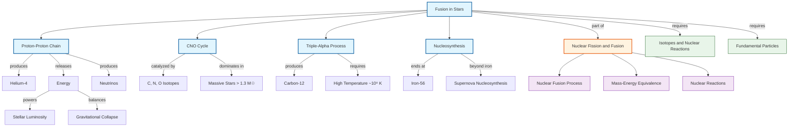

# Fusion in Stars / 恒星核聚变

---

# 1. Overview / 概述

**English:**
Fusion in stars is the process by which light atomic nuclei combine to form heavier nuclei, releasing vast amounts of energy that powers stars like our Sun. This sub-topic explores the specific fusion reactions occurring in stars, particularly the proton-proton chain and the CNO cycle, and explains how these processes sustain stellar luminosity and drive stellar evolution. Understanding fusion in stars is essential for grasping the life cycle of stars, the origin of elements, and the fundamental principles of nuclear energy production in astrophysical contexts. This leaf node builds directly on [[Nuclear Fusion Process]] and [[Mass-Energy Equivalence (E=mc^2)]], and connects to [[Isotopes and Nuclear Reactions]] and [[Fundamental Particles]].

**中文:**
恒星核聚变是指轻原子核结合形成较重原子核的过程，释放出巨大能量，为像太阳这样的恒星提供动力。本子知识点探讨恒星中发生的特定聚变反应，特别是质子-质子链和CNO循环，并解释这些过程如何维持恒星的光度并驱动恒星演化。理解恒星核聚变对于掌握恒星生命周期、元素起源以及天体物理背景下核能生产的基本原理至关重要。本叶节点直接建立在[[Nuclear Fusion Process]]和[[Mass-Energy Equivalence (E=mc^2)]]之上，并与[[Isotopes and Nuclear Reactions]]和[[Fundamental Particles]]相关联。

---

# 2. Syllabus Learning Objectives / 考纲学习目标

| CAIE 9702 | Edexcel IAL |
|-----------|-------------|
| 24.3(a) Describe the conditions required for nuclear fusion in stars | 9.13 Explain the conditions required for fusion in stars |
| 24.3(b) Describe the proton-proton chain reaction | 9.14 Describe the proton-proton chain and its energy release |
| 24.3(c) Explain the role of the CNO cycle in massive stars | 9.15 Explain the CNO cycle and its dependence on stellar mass |
| 24.3(d) Calculate energy released in stellar fusion reactions | 9.16 Calculate energy released using $E = \Delta m c^2$ |
| 24.3(e) Describe the relationship between fusion rate and stellar mass | 9.17 Explain how fusion rate affects stellar lifetime |
| 24.3(f) Explain the formation of elements heavier than iron | 9.18 Describe nucleosynthesis beyond iron |

**Examiner Expectations / 考官期望:**
- **English:** Students must be able to describe the proton-proton chain and CNO cycle qualitatively, calculate energy released using mass defect, and explain why fusion stops at iron-56. They should understand that fusion requires extremely high temperatures ($\sim 10^7$ K) and pressures to overcome Coulomb repulsion.
- **中文:** 学生必须能够定性地描述质子-质子链和CNO循环，使用质量亏损计算释放的能量，并解释为什么聚变在铁-56停止。他们应理解聚变需要极高的温度（约$10^7$ K）和压力来克服库仑排斥。

---

# 3. Core Definitions / 核心定义

| Term (EN/CN) | Definition (EN) | Definition (CN) | Common Mistakes / 常见错误 |
|--------------|-----------------|-----------------|---------------------------|
| **Proton-Proton Chain** / 质子-质子链 | A series of nuclear fusion reactions in which four hydrogen nuclei (protons) combine to form a helium-4 nucleus, releasing energy | 一系列核聚变反应，其中四个氢核（质子）结合形成一个氦-4核，释放能量 | Confusing with CNO cycle; thinking it's a single reaction rather than a chain |
| **CNO Cycle** / CNO循环 | A catalytic fusion cycle in massive stars where carbon, nitrogen, and oxygen isotopes act as catalysts to convert hydrogen into helium | 大质量恒星中的催化聚变循环，其中碳、氮和氧同位素作为催化剂将氢转化为氦 | Thinking CNO cycle occurs in all stars (it dominates only in stars > 1.3 solar masses) |
| **Coulomb Barrier** / 库仑势垒 | The electrostatic repulsion force that must be overcome for two positively charged nuclei to fuse | 两个带正电的原子核融合时必须克服的静电排斥力 | Forgetting that higher charge (Z) increases barrier height |
| **Stellar Nucleosynthesis** / 恒星核合成 | The process by which elements are formed through nuclear fusion reactions in stars | 通过恒星中的核聚变反应形成元素的过程 | Thinking all elements are formed in stars (hydrogen and helium are primordial) |
| **Iron Peak** / 铁峰 | The maximum binding energy per nucleon at iron-56, beyond which fusion becomes endothermic | 铁-56处每个核子的最大结合能，超过该点聚变变为吸热 | Assuming fusion continues beyond iron in normal stellar cores |
| **Mass Defect** / 质量亏损 | The difference between the mass of a nucleus and the sum of masses of its constituent nucleons | 原子核质量与其组成核子质量总和之间的差值 | Confusing with mass excess; forgetting to use atomic mass units (u) |

---

# 4. Key Concepts Explained / 关键概念详解

## 4.1 Conditions for Stellar Fusion / 恒星聚变的条件

### Explanation / 解释
**English:**
For nuclear fusion to occur in stars, three conditions must be simultaneously satisfied:
1. **Extremely high temperature** ($\sim 10^7$ K or higher) — provides nuclei with sufficient kinetic energy to overcome the [[Coulomb Barrier]].
2. **Extremely high pressure** — compresses the plasma, increasing the probability of collisions between nuclei.
3. **Sufficient confinement time** — nuclei must remain close enough long enough for the strong nuclear force to bind them.

In stellar cores, these conditions are achieved through gravitational compression. The star's immense gravity creates the necessary temperature and pressure at the core. The [[Mass-Energy Equivalence (E=mc^2)]] ensures that the mass defect from fusion is converted into energy, which then provides outward radiation pressure to balance gravitational collapse — a state called **hydrostatic equilibrium**.

**中文:**
要使核聚变在恒星中发生，必须同时满足三个条件：
1. **极高的温度**（约$10^7$ K或更高）——为原子核提供足够的动能以克服[[库仑势垒]]。
2. **极高的压力**——压缩等离子体，增加原子核之间碰撞的概率。
3. **足够的约束时间**——原子核必须足够接近并保持足够长的时间，以使强核力能够结合它们。

在恒星核心中，这些条件通过引力压缩实现。恒星的巨大引力在核心产生必要的温度和压力。[[Mass-Energy Equivalence (E=mc^2)]]确保聚变的质量亏损转化为能量，然后提供向外的辐射压力来平衡引力坍缩——这种状态称为**流体静力平衡**。

### Physical Meaning / 物理意义
**English:** The conditions for stellar fusion represent a delicate balance between gravitational forces (which compress the core) and nuclear forces (which release energy). This balance determines a star's stability, luminosity, and lifetime. The higher the star's mass, the greater the core temperature and pressure, leading to faster fusion rates and shorter lifetimes.

**中文:** 恒星聚变的条件代表了引力（压缩核心）和核力（释放能量）之间的微妙平衡。这种平衡决定了恒星的稳定性、光度和寿命。恒星质量越大，核心温度和压力越高，导致聚变速率更快，寿命更短。

### Common Misconceptions / 常见误区
- **English:** Students often think fusion occurs at the Sun's surface. In reality, fusion occurs only in the core where conditions are extreme.
- **中文:** 学生常认为聚变发生在太阳表面。实际上，聚变只发生在条件极端的核心。
- **English:** Many believe higher temperature alone guarantees fusion. Pressure and confinement time are equally critical.
- **中文:** 许多人认为仅高温就能保证聚变。压力和约束时间同样关键。

### Exam Tips / 考试提示
- **English:** Be prepared to explain why fusion requires temperatures of millions of Kelvin — relate to the Coulomb barrier and kinetic energy distribution (Maxwell-Boltzmann).
- **中文:** 准备好解释为什么聚变需要数百万开尔文的温度——与库仑势垒和动能分布（麦克斯韦-玻尔兹曼）相关联。

> 📷 **IMAGE PROMPT — DIAGRAM-01: Stellar Core Conditions**
> A cross-section diagram of a star showing the core where fusion occurs. Label temperature (15 million K for Sun), pressure (250 billion atmospheres), and density (150 g/cm³). Include arrows showing gravitational compression inward and radiation pressure outward. Use a gradient from cool outer layers (yellow) to hot core (white/blue).

---

## 4.2 The Proton-Proton Chain / 质子-质子链

### Explanation / 解释
**English:**
The proton-proton (p-p) chain is the dominant fusion process in stars like the Sun (mass $\leq 1.3 M_\odot$). It converts four protons into a helium-4 nucleus through a series of steps:

**Step 1:** Two protons fuse to form deuterium ($^2_1\text{H}$), releasing a positron ($e^+$) and an electron neutrino ($\nu_e$):
$$ ^1_1\text{H} + ^1_1\text{H} \rightarrow ^2_1\text{H} + e^+ + \nu_e + 0.42 \text{ MeV} $$

**Step 2:** Deuterium fuses with another proton to form helium-3:
$$ ^2_1\text{H} + ^1_1\text{H} \rightarrow ^3_2\text{He} + \gamma + 5.49 \text{ MeV} $$

**Step 3:** Two helium-3 nuclei fuse to form helium-4, releasing two protons:
$$ ^3_2\text{He} + ^3_2\text{He} \rightarrow ^4_2\text{He} + ^1_1\text{H} + ^1_1\text{H} + 12.86 \text{ MeV} $$

**Net reaction:** $4 ^1_1\text{H} \rightarrow ^4_2\text{He} + 2e^+ + 2\nu_e + 26.73 \text{ MeV}$

The positrons immediately annihilate with electrons, releasing additional energy ($2 \times 0.511$ MeV each).

**中文:**
质子-质子链是像太阳这样的恒星（质量$\leq 1.3 M_\odot$）中的主要聚变过程。它通过一系列步骤将四个质子转化为一个氦-4核：

**步骤1：** 两个质子聚变形成氘（$^2_1\text{H}$），释放一个正电子（$e^+$）和一个电子中微子（$\nu_e$）：
$$ ^1_1\text{H} + ^1_1\text{H} \rightarrow ^2_1\text{H} + e^+ + \nu_e + 0.42 \text{ MeV} $$

**步骤2：** 氘与另一个质子聚变形成氦-3：
$$ ^2_1\text{H} + ^1_1\text{H} \rightarrow ^3_2\text{He} + \gamma + 5.49 \text{ MeV} $$

**步骤3：** 两个氦-3核聚变形成氦-4，释放两个质子：
$$ ^3_2\text{He} + ^3_2\text{He} \rightarrow ^4_2\text{He} + ^1_1\text{H} + ^1_1\text{H} + 12.86 \text{ MeV} $$

**净反应：** $4 ^1_1\text{H} \rightarrow ^4_2\text{He} + 2e^+ + 2\nu_e + 26.73 \text{ MeV}$

正电子立即与电子湮灭，释放额外能量（每个$2 \times 0.511$ MeV）。

### Physical Meaning / 物理意义
**English:** The p-p chain is the primary energy source for main-sequence stars like the Sun. The slowest step (Step 1) determines the overall reaction rate — this is why the Sun will shine for about 10 billion years. The neutrinos produced escape directly from the core, providing direct evidence of ongoing fusion.

**中文:** 质子-质子链是像太阳这样的主序星的主要能量来源。最慢的步骤（步骤1）决定了整体反应速率——这就是为什么太阳将发光约100亿年。产生的中微子直接从核心逃逸，提供了正在进行聚变的直接证据。

### Common Misconceptions / 常见误区
- **English:** Students think the p-p chain is a single reaction. It is a multi-step process with intermediate isotopes.
- **中文:** 学生认为质子-质子链是单一反应。它是一个多步骤过程，涉及中间同位素。
- **English:** Many forget that positrons and neutrinos are produced, not just gamma rays.
- **中文:** 许多人忘记产生正电子和中微子，而不仅仅是伽马射线。

### Exam Tips / 考试提示
- **English:** You may be asked to calculate the total energy released from the p-p chain using mass defect. Remember to account for all particles produced.
- **中文:** 你可能会被要求使用质量亏损计算质子-质子链释放的总能量。记得考虑所有产生的粒子。

> 📷 **IMAGE PROMPT — DIAGRAM-02: Proton-Proton Chain**
> A step-by-step diagram showing the three stages of the p-p chain. Use colored circles for protons (red), deuterium (blue), helium-3 (green), and helium-4 (yellow). Show positrons (pink) and neutrinos (purple) being emitted. Include energy values at each step. Use arrows to indicate the flow of reactions.

---

## 4.3 The CNO Cycle / CNO循环

### Explanation / 解释
**English:**
The CNO cycle (Carbon-Nitrogen-Oxygen cycle) is the dominant fusion process in stars more massive than about $1.3 M_\odot$. It uses carbon, nitrogen, and oxygen isotopes as catalysts to convert hydrogen into helium. The cycle has multiple branches; the main one is:

$$ ^12_6\text{C} + ^1_1\text{H} \rightarrow ^13_7\text{N} + \gamma $$
$$ ^13_7\text{N} \rightarrow ^13_6\text{C} + e^+ + \nu_e $$
$$ ^13_6\text{C} + ^1_1\text{H} \rightarrow ^14_7\text{N} + \gamma $$
$$ ^14_7\text{N} + ^1_1\text{H} \rightarrow ^15_8\text{O} + \gamma $$
$$ ^15_8\text{O} \rightarrow ^15_7\text{N} + e^+ + \nu_e $$
$$ ^15_7\text{N} + ^1_1\text{H} \rightarrow ^12_6\text{C} + ^4_2\text{He} $$

**Net reaction:** $4 ^1_1\text{H} \rightarrow ^4_2\text{He} + 2e^+ + 2\nu_e + 26.73 \text{ MeV}$

Note: The net energy release is identical to the p-p chain, but the CNO cycle is more temperature-sensitive and dominates at higher temperatures ($T > 1.5 \times 10^7$ K).

**中文:**
CNO循环（碳-氮-氧循环）是质量大于约$1.3 M_\odot$的恒星中的主要聚变过程。它使用碳、氮和氧同位素作为催化剂将氢转化为氦。该循环有多个分支；主要分支是：

$$ ^12_6\text{C} + ^1_1\text{H} \rightarrow ^13_7\text{N} + \gamma $$
$$ ^13_7\text{N} \rightarrow ^13_6\text{C} + e^+ + \nu_e $$
$$ ^13_6\text{C} + ^1_1\text{H} \rightarrow ^14_7\text{N} + \gamma $$
$$ ^14_7\text{N} + ^1_1\text{H} \rightarrow ^15_8\text{O} + \gamma $$
$$ ^15_8\text{O} \rightarrow ^15_7\text{N} + e^+ + \nu_e $$
$$ ^15_7\text{N} + ^1_1\text{H} \rightarrow ^12_6\text{C} + ^4_2\text{He} $$

**净反应：** $4 ^1_1\text{H} \rightarrow ^4_2\text{He} + 2e^+ + 2\nu_e + 26.73 \text{ MeV}$

注意：净能量释放与质子-质子链相同，但CNO循环对温度更敏感，在更高温度下（$T > 1.5 \times 10^7$ K）占主导地位。

### Physical Meaning / 物理意义
**English:** The CNO cycle explains why massive stars are much more luminous and have shorter lifetimes than low-mass stars. Because the CNO cycle is more temperature-sensitive, a small increase in core temperature dramatically increases the fusion rate. This is why massive stars burn through their hydrogen fuel in millions of years, while the Sun will last billions of years.

**中文:** CNO循环解释了大质量恒星比低质量恒星更亮、寿命更短的原因。由于CNO循环对温度更敏感，核心温度的微小增加会显著提高聚变速率。这就是为什么大质量恒星在数百万年内耗尽氢燃料，而太阳将持续数十亿年。

### Common Misconceptions / 常见误区
- **English:** Students think carbon is consumed in the CNO cycle. It acts as a catalyst and is regenerated.
- **中文:** 学生认为碳在CNO循环中被消耗。它作为催化剂并被再生。
- **English:** Many believe the CNO cycle produces more energy per reaction than the p-p chain. The net energy release is identical.
- **中文:** 许多人认为CNO循环每次反应产生的能量比质子-质子链多。净能量释放是相同的。

### Exam Tips / 考试提示
- **English:** Be able to compare the p-p chain and CNO cycle in terms of temperature dependence, stellar mass range, and energy production rate.
- **中文:** 能够比较质子-质子链和CNO循环在温度依赖性、恒星质量范围和能量产生率方面的差异。

> 📋 **CIE Only:** Students must know the detailed steps of the p-p chain but only the net reaction of the CNO cycle.
> 📋 **Edexcel Only:** Students must know the detailed steps of both the p-p chain and the CNO cycle.

---

## 4.4 Nucleosynthesis Beyond Helium / 氦之后的核合成

### Explanation / 解释
**English:**
After hydrogen is depleted in the core, helium fusion begins at higher temperatures ($\sim 10^8$ K). The **triple-alpha process** converts three helium-4 nuclei into carbon-12:

$$ 3 ^4_2\text{He} \rightarrow ^12_6\text{C} + 7.27 \text{ MeV} $$

This occurs in two steps:
1. $^4_2\text{He} + ^4_2\text{He} \rightleftharpoons ^8_4\text{Be}$ (unstable, decays quickly)
2. $^8_4\text{Be} + ^4_2\text{He} \rightarrow ^12_6\text{C} + \gamma$

Further fusion produces oxygen, neon, magnesium, and eventually silicon. The fusion chain ends at **iron-56** ($^56_{26}\text{Fe}$), which has the highest [[binding energy per nucleon]]. Beyond iron, fusion becomes endothermic (requires energy input), so elements heavier than iron are formed primarily through **neutron capture** in supernovae (the s-process and r-process).

**中文:**
在核心中的氢耗尽后，氦聚变在更高温度（约$10^8$ K）下开始。**三α过程**将三个氦-4核转化为碳-12：

$$ 3 ^4_2\text{He} \rightarrow ^12_6\text{C} + 7.27 \text{ MeV} $$

这分两步进行：
1. $^4_2\text{He} + ^4_2\text{He} \rightleftharpoons ^8_4\text{Be}$（不稳定，快速衰变）
2. $^8_4\text{Be} + ^4_2\text{He} \rightarrow ^12_6\text{C} + \gamma$

进一步的聚变产生氧、氖、镁，最终产生硅。聚变链在**铁-56**（$^56_{26}\text{Fe}$）处结束，它具有最高的[[结合能每核子]]。超过铁之后，聚变变为吸热（需要能量输入），因此比铁重的元素主要通过超新星中的**中子俘获**形成（s过程和r过程）。

### Physical Meaning / 物理意义
**English:** The triple-alpha process explains why carbon is abundant in the universe — it's the "gateway" element for all heavier elements. The existence of a resonance in carbon-12 (the Hoyle state) dramatically increases the reaction rate, making carbon production efficient. This is a famous example of fine-tuning in nuclear physics.

**中文:** 三α过程解释了为什么碳在宇宙中丰富——它是所有更重元素的"门户"元素。碳-12中存在的共振（霍伊尔态）显著提高了反应速率，使碳的产生高效。这是核物理学中微调的著名例子。

### Common Misconceptions / 常见误区
- **English:** Students think all elements are formed in the Big Bang. Only hydrogen, helium, and trace lithium were formed then.
- **中文:** 学生认为所有元素都在大爆炸中形成。当时只形成了氢、氦和微量锂。
- **English:** Many believe fusion continues past iron in normal stars. It stops at iron because fusion becomes energy-consuming.
- **中文:** 许多人认为聚变在正常恒星中会超过铁。它在铁处停止，因为聚变变为消耗能量。

### Exam Tips / 考试提示
- **English:** You may be asked to explain why iron is the "end point" of stellar fusion — relate to the binding energy per nucleon curve.
- **中文:** 你可能会被要求解释为什么铁是恒星聚变的"终点"——与结合能每核子曲线相关联。

> 📷 **IMAGE PROMPT — DIAGRAM-03: Binding Energy Curve**
> A graph of binding energy per nucleon vs. mass number (A). Label the peak at iron-56 (8.8 MeV/nucleon). Show the fusion region (left of iron, energy released) and fission region (right of iron, energy released). Use arrows to indicate fusion of light elements and fission of heavy elements. Include the triple-alpha process path.

---

# 5. Essential Equations / 核心公式

## 5.1 Net Energy Release from Hydrogen Fusion / 氢聚变净能量释放

$$ 4 ^1_1\text{H} \rightarrow ^4_2\text{He} + 2e^+ + 2\nu_e + 26.73 \text{ MeV} $$

| Symbol (符号) | Meaning (EN) | Meaning (CN) | Unit (单位) |
|--------------|-------------|-------------|------------|
| $^1_1\text{H}$ | Proton (hydrogen nucleus) | 质子（氢核） | — |
| $^4_2\text{He}$ | Helium-4 nucleus (alpha particle) | 氦-4核（α粒子） | — |
| $e^+$ | Positron | 正电子 | — |
| $\nu_e$ | Electron neutrino | 电子中微子 | — |
| 26.73 MeV | Total energy released | 总释放能量 | MeV |

**Derivation / 推导:**
Mass of 4 protons: $4 \times 1.007276 \text{ u} = 4.029104 \text{ u}$
Mass of He-4 nucleus: $4.002603 \text{ u}$
Mass of 2 positrons: $2 \times 0.000548 \text{ u} = 0.001096 \text{ u}$
Mass defect: $\Delta m = 4.029104 - (4.002603 + 0.001096) = 0.025405 \text{ u}$
Energy: $E = \Delta m c^2 = 0.025405 \times 931.5 \text{ MeV/u} = 23.66 \text{ MeV}$ (excluding neutrinos)

**Conditions / 适用条件:**
- **English:** Applies to both p-p chain and CNO cycle. The net reaction is identical.
- **中文:** 适用于质子-质子链和CNO循环。净反应相同。

**Limitations / 局限性:**
- **English:** Neutrinos carry away about 0.5 MeV of energy, so the actual energy available to heat the star is slightly less.
- **中文:** 中微子带走约0.5 MeV的能量，因此实际可用于加热恒星的能量略少。

## 5.2 Triple-Alpha Process Energy / 三α过程能量

$$ 3 ^4_2\text{He} \rightarrow ^12_6\text{C} + 7.27 \text{ MeV} $$

| Symbol (符号) | Meaning (EN) | Meaning (CN) | Unit (单位) |
|--------------|-------------|-------------|------------|
| $^4_2\text{He}$ | Alpha particle (helium-4 nucleus) | α粒子（氦-4核） | — |
| $^12_6\text{C}$ | Carbon-12 nucleus | 碳-12核 | — |
| 7.27 MeV | Energy released | 释放能量 | MeV |

**Derivation / 推导:**
Mass of 3 alpha particles: $3 \times 4.002603 \text{ u} = 12.007809 \text{ u}$
Mass of C-12 nucleus: $12.000000 \text{ u}$
Mass defect: $\Delta m = 12.007809 - 12.000000 = 0.007809 \text{ u}$
Energy: $E = 0.007809 \times 931.5 = 7.27 \text{ MeV}$

**Conditions / 适用条件:**
- **English:** Requires temperature $\sim 10^8$ K and density $\sim 10^5$ g/cm³. The intermediate beryllium-8 is highly unstable ($\tau \sim 10^{-16}$ s).
- **中文:** 需要温度约$10^8$ K和密度约$10^5$ g/cm³。中间产物铍-8高度不稳定（半衰期约$10^{-16}$ s）。

**Limitations / 局限性:**
- **English:** The reaction rate depends critically on the existence of a resonance in carbon-12 (the Hoyle state at 7.65 MeV).
- **中文:** 反应速率关键取决于碳-12中是否存在共振（7.65 MeV处的霍伊尔态）。

---

# 6. Graphs and Relationships / 图表与关系

## 6.1 Fusion Rate vs. Temperature / 聚变速率与温度的关系

### Axes / 坐标轴
- **X-axis:** Core temperature / 核心温度 (K)
- **Y-axis:** Fusion rate (energy generation rate) / 聚变速率（能量产生率）

### Shape / 形状
**English:** The graph shows a steep exponential increase. The p-p chain varies as $T^4$, while the CNO cycle varies as $T^{17}$ (approximately). This means the CNO cycle is much more sensitive to temperature changes.

**中文:** 图表显示陡峭的指数增长。质子-质子链随$T^4$变化，而CNO循环随$T^{17}$变化（近似）。这意味着CNO循环对温度变化更敏感。

### Gradient Meaning / 斜率含义
**English:** The gradient represents the temperature sensitivity of the fusion process. A steeper gradient means a small temperature increase causes a large increase in fusion rate.

**中文:** 斜率表示聚变过程的温度敏感性。斜率越陡，意味着温度的小幅增加会导致聚变速率的显著增加。

### Area Meaning / 面积含义
**English:** The area under the curve over time represents the total energy produced by the star.

**中文:** 曲线下随时间变化的面积表示恒星产生的总能量。

### Exam Interpretation / 考试解读
**English:** You may be asked to compare the two curves and explain why massive stars (CNO cycle) are more luminous and have shorter lifetimes.

**中文:** 你可能会被要求比较两条曲线，并解释为什么大质量恒星（CNO循环）更亮且寿命更短。

> 📷 **IMAGE PROMPT — GRAPH-01: Fusion Rate vs Temperature**
> A graph with two curves: p-p chain (blue, shallower slope) and CNO cycle (red, steeper slope). X-axis labeled "Core Temperature (K)" from 10^7 to 10^8 K. Y-axis labeled "Energy Generation Rate (W/kg)". Show the crossover point at approximately 1.5 × 10^7 K where CNO cycle becomes dominant.

---

## 6.2 Binding Energy per Nucleon vs. Mass Number / 结合能每核子与质量数的关系

### Axes / 坐标轴
- **X-axis:** Mass number (A) / 质量数 (A)
- **Y-axis:** Binding energy per nucleon (MeV) / 结合能每核子 (MeV)

### Shape / 形状
**English:** The curve rises steeply from hydrogen, peaks at iron-56 (8.8 MeV/nucleon), then gradually decreases for heavier elements.

**中文:** 曲线从氢开始陡峭上升，在铁-56处达到峰值（8.8 MeV/核子），然后对更重的元素逐渐下降。

### Gradient Meaning / 斜率含义
**English:** Positive gradient (left of iron): fusion releases energy. Negative gradient (right of iron): fission releases energy.

**中文:** 正斜率（铁左侧）：聚变释放能量。负斜率（铁右侧）：裂变释放能量。

### Area Meaning / 面积含义
**English:** The area under the curve up to a given mass number represents the total binding energy of that nucleus.

**中文:** 曲线下到给定质量数的面积表示该原子核的总结合能。

### Exam Interpretation / 考试解读
**English:** This graph explains why fusion stops at iron — beyond iron, fusion would require energy input rather than releasing it.

**中文:** 该图解释了为什么聚变在铁处停止——超过铁，聚变将需要能量输入而不是释放能量。

---

# 7. Required Diagrams / 必备图表

## 7.1 Stellar Structure Diagram / 恒星结构图

### Description / 描述
**English:** A cross-section of a main-sequence star showing the core (where fusion occurs), radiative zone, and convective zone. For the Sun, the core extends to about 0.25 solar radii.

**中文:** 主序星的横截面，显示核心（聚变发生处）、辐射区和对流区。对于太阳，核心延伸至约0.25太阳半径。

### Image Prompt / 图片生成提示
> 📷 **IMAGE PROMPT — DIAGRAM-04: Stellar Structure**
> A cutaway diagram of a main-sequence star like the Sun. Show three distinct layers: core (white, labeled "Fusion Core: 15 million K"), radiative zone (yellow-orange gradient, labeled "Radiative Zone: energy travels by photons"), and convective zone (red-orange, labeled "Convective Zone: energy travels by convection"). Include arrows showing energy flow from core to surface. Label the photosphere as the visible surface. Use a scale showing core radius = 0.25 R_sun.

### Labels Required / 需要标注
- Core / 核心 (fusion region / 聚变区域)
- Radiative zone / 辐射区
- Convective zone / 对流区
- Photosphere / 光球层
- Temperature gradient / 温度梯度

### Exam Importance / 考试重要性
**English:** Understanding stellar structure helps explain why fusion only occurs in the core and how energy is transported to the surface.

**中文:** 理解恒星结构有助于解释为什么聚变只发生在核心，以及能量如何传输到表面。

---

## 7.2 Proton-Proton Chain Diagram / 质子-质子链图

### Description / 描述
**English:** A detailed step-by-step diagram of the three stages of the p-p chain, showing all particles involved and energy released at each step.

**中文:** 质子-质子链三个阶段的详细逐步图，显示所有涉及的粒子和每一步释放的能量。

### Image Prompt / 图片生成提示
> 📷 **IMAGE PROMPT — DIAGRAM-05: Proton-Proton Chain Detailed**
> A flow diagram showing three steps of the p-p chain. Step 1: Two red protons (p) collide, producing deuterium (blue, labeled "²H"), a pink positron (e⁺), and a purple neutrino (νₑ). Step 2: Deuterium (blue) collides with a proton (red), producing helium-3 (green, labeled "³He") and a gamma ray (yellow zigzag). Step 3: Two helium-3 nuclei (green) collide, producing helium-4 (yellow, labeled "⁴He") and two protons (red). Include energy values: 0.42 MeV, 5.49 MeV, 12.86 MeV. Use arrows to show reaction direction.

### Labels Required / 需要标注
- Proton ($^1_1\text{H}$) / 质子
- Deuterium ($^2_1\text{H}$) / 氘
- Helium-3 ($^3_2\text{He}$) / 氦-3
- Helium-4 ($^4_2\text{He}$) / 氦-4
- Positron ($e^+$) / 正电子
- Neutrino ($\nu_e$) / 中微子
- Gamma ray ($\gamma$) / 伽马射线

### Exam Importance / 考试重要性
**English:** Students are often asked to describe or draw the p-p chain in exams. Understanding the sequence and particles involved is essential.

**中文:** 考试中常要求学生描述或画出质子-质子链。理解序列和涉及的粒子至关重要。

---

# 8. Worked Examples / 典型例题

## Example 1: Energy Released in the Proton-Proton Chain / 质子-质子链中释放的能量

### Question / 题目
**English:**
In the proton-proton chain, four hydrogen nuclei (protons) fuse to form one helium-4 nucleus. Given the following atomic masses:
- Proton: $1.007276 \text{ u}$
- Helium-4 nucleus: $4.002603 \text{ u}$
- Positron: $0.000548 \text{ u}$
- $1 \text{ u} = 931.5 \text{ MeV}/c^2$

Calculate the total energy released in the net reaction, accounting for the mass of the two positrons produced. State your answer in MeV.

**中文:**
在质子-质子链中，四个氢核（质子）聚变形成一个氦-4核。给定以下原子质量：
- 质子：$1.007276 \text{ u}$
- 氦-4核：$4.002603 \text{ u}$
- 正电子：$0.000548 \text{ u}$
- $1 \text{ u} = 931.5 \text{ MeV}/c^2$

计算净反应中释放的总能量，考虑产生的两个正电子的质量。以MeV为单位给出答案。

### Solution / 解答

**Step 1: Calculate total initial mass / 计算初始总质量**
$$ m_{\text{initial}} = 4 \times 1.007276 = 4.029104 \text{ u} $$

**Step 2: Calculate total final mass / 计算最终总质量**
$$ m_{\text{final}} = 4.002603 + (2 \times 0.000548) = 4.002603 + 0.001096 = 4.003699 \text{ u} $$

**Step 3: Calculate mass defect / 计算质量亏损**
$$ \Delta m = m_{\text{initial}} - m_{\text{final}} = 4.029104 - 4.003699 = 0.025405 \text{ u} $$

**Step 4: Convert to energy / 转换为能量**
$$ E = \Delta m \times 931.5 = 0.025405 \times 931.5 = 23.66 \text{ MeV} $$

**Step 5: Account for positron annihilation / 考虑正电子湮灭**
Each positron annihilates with an electron, releasing $2 \times 0.511 = 1.022 \text{ MeV}$ per annihilation.
Total from annihilation: $2 \times 1.022 = 2.044 \text{ MeV}$

**Step 6: Total energy / 总能量**
$$ E_{\text{total}} = 23.66 + 2.044 = 25.70 \text{ MeV} $$

Note: The textbook value of 26.73 MeV includes additional energy from neutrino interactions and other minor contributions.

### Final Answer / 最终答案
**Answer:** Approximately 25.7 MeV (or 26.73 MeV including all contributions) | **答案：** 约25.7 MeV（或包括所有贡献为26.73 MeV）

### Quick Tip / 提示
**English:** Always account for all particles produced, including positrons. Remember that positron annihilation with electrons releases additional energy.
**中文:** 始终考虑所有产生的粒子，包括正电子。记住正电子与电子湮灭会释放额外能量。

---

## Example 2: Comparing Stellar Lifetimes / 比较恒星寿命

### Question / 题目
**English:**
Star A has a mass of $0.8 M_\odot$ and fuses hydrogen via the p-p chain. Star B has a mass of $10 M_\odot$ and fuses hydrogen via the CNO cycle. Given that the luminosity of a star scales approximately as $L \propto M^{3.5}$, and the available nuclear fuel is proportional to mass, calculate the ratio of their main-sequence lifetimes. Assume both stars convert the same fraction of their mass into energy.

**中文:**
恒星A的质量为$0.8 M_\odot$，通过质子-质子链聚变氢。恒星B的质量为$10 M_\odot$，通过CNO循环聚变氢。给定恒星的光度近似为$L \propto M^{3.5}$，可用的核燃料与质量成正比，计算它们主序寿命的比值。假设两颗恒星将相同比例的质量转化为能量。

### Solution / 解答

**Step 1: Recall the relationship / 回忆关系**
Lifetime $\tau \propto \frac{\text{Fuel}}{\text{Luminosity}} \propto \frac{M}{L}$

**Step 2: Express in terms of mass / 用质量表示**
$$ \tau \propto \frac{M}{M^{3.5}} = M^{-2.5} $$

**Step 3: Calculate ratio / 计算比值**
$$ \frac{\tau_A}{\tau_B} = \left(\frac{M_A}{M_B}\right)^{-2.5} = \left(\frac{0.8}{10}\right)^{-2.5} = (0.08)^{-2.5} $$

**Step 4: Compute / 计算**
$$ (0.08)^{-2.5} = \frac{1}{(0.08)^{2.5}} = \frac{1}{(0.08)^2 \times (0.08)^{0.5}} = \frac{1}{0.0064 \times 0.283} = \frac{1}{0.00181} \approx 552 $$

### Final Answer / 最终答案
**Answer:** Star A's lifetime is approximately 550 times longer than Star B's. | **答案：** 恒星A的寿命大约是恒星B的550倍。

### Quick Tip / 提示
**English:** Massive stars have much shorter lifetimes despite having more fuel because their luminosity (energy consumption rate) increases dramatically with mass.
**中文:** 大质量恒星的寿命要短得多，尽管有更多的燃料，因为它们的光度（能量消耗率）随质量急剧增加。

---

# 9. Past Paper Question Types / 历年真题题型

| Question Type / 题型 | Frequency / 频率 | Difficulty / 难度 | Past Paper References / 真题索引 |
|----------------------|------------------|------------------|-------------------------------|
| Describe the proton-proton chain / 描述质子-质子链 | High | Medium | 📝 *待填入* |
| Calculate energy released from fusion / 计算聚变释放的能量 | High | Medium-Hard | 📝 *待填入* |
| Compare p-p chain and CNO cycle / 比较质子-质子链和CNO循环 | Medium | Medium | 📝 *待填入* |
| Explain why fusion stops at iron / 解释为什么聚变在铁处停止 | Medium | Medium | 📝 *待填入* |
| Calculate stellar lifetime from mass and luminosity / 从质量和光度计算恒星寿命 | Low-Medium | Hard | 📝 *待填入* |
| Describe the triple-alpha process / 描述三α过程 | Low | Medium | 📝 *待填入* |

**Common Command Words / 常见指令词:**
- **English:** Describe, Explain, Calculate, Compare, State, Outline
- **中文:** 描述，解释，计算，比较，陈述，概述

---

# 10. Practical Skills Connections / 实验技能链接

**English:**
While fusion in stars cannot be directly replicated in school laboratories, this sub-topic connects to practical skills in several ways:

1. **Mass defect calculations:** Students practice using atomic mass data from tables to calculate energy released — a skill tested in Paper 5 (CAIE) and practical exams (Edexcel).

2. **Graph interpretation:** Analyzing binding energy per nucleon curves and fusion rate vs. temperature graphs develops data analysis skills.

3. **Estimation and scaling:** Estimating stellar lifetimes using $L \propto M^{3.5}$ develops proportional reasoning and order-of-magnitude estimation.

4. **Uncertainty awareness:** Understanding that neutrino energy losses introduce uncertainty in energy calculations.

5. **Experimental evidence:** The detection of solar neutrinos (Homestake experiment, Super-Kamiokande) provides experimental verification of stellar fusion models — a good example of how indirect evidence supports theoretical predictions.

**中文:**
虽然恒星聚变无法在学校实验室直接复制，但本子知识点通过以下方式与实验技能相关联：

1. **质量亏损计算：** 学生练习使用表中的原子质量数据计算释放的能量——这是CAIE Paper 5和Edexcel实验考试中测试的技能。

2. **图表解读：** 分析结合能每核子曲线和聚变速率与温度的关系图，培养数据分析技能。

3. **估算和缩放：** 使用$L \propto M^{3.5}$估算恒星寿命，培养比例推理和数量级估算能力。

4. **不确定度意识：** 理解中微子能量损失给能量计算引入不确定度。

5. **实验证据：** 太阳中微子的探测（霍姆斯特克实验、超级神冈探测器）为恒星聚变模型提供了实验验证——这是间接证据支持理论预测的好例子。

---

# 11. Concept Map / 概念图谱

---

# 12. Quick Revision Sheet / 速查表

| Category / 类别 | Key Points / 要点 |
|----------------|------------------|
| **Definition / 定义** | Fusion in stars: light nuclei combine to form heavier nuclei, releasing energy. Requires $T \sim 10^7$ K and high pressure to overcome Coulomb barrier. / 恒星聚变：轻核结合形成重核，释放能量。需要约$10^7$ K的温度和高压来克服库仑势垒。 |
| **Key Formula / 核心公式** | $4 ^1_1\text{H} \rightarrow ^4_2\text{He} + 2e^+ + 2\nu_e + 26.73 \text{ MeV}$ (p-p chain & CNO cycle net reaction) / 质子-质子链和CNO循环净反应 |
| **Key Formula / 核心公式** | $3 ^4_2\text{He} \rightarrow ^12_6\text{C} + 7.27 \text{ MeV}$ (triple-alpha process) / 三α过程 |
| **Key Graph / 核心图表** | Binding energy per nucleon vs. mass number: peaks at Fe-56. Fusion releases energy left of peak. / 结合能每核子与质量数：在Fe-56处达到峰值。聚变在峰值左侧释放能量。 |
| **Key Graph / 核心图表** | Fusion rate vs. temperature: p-p chain ($T^4$), CNO cycle ($T^{17}$). CNO dominates at $T > 1.5 \times 10^7$ K. / 聚变速率与温度：质子-质子链（$T^4$），CNO循环（$T^{17}$）。CNO在温度高于$1.5 \times 10^7$ K时占主导。 |
| **Exam Tip / 考试提示** | Always account for positron annihilation energy when calculating total energy from fusion. / 计算聚变总能量时，始终考虑正电子湮灭能量。 |
| **Exam Tip / 考试提示** | Remember: CNO cycle uses C, N, O as catalysts — they are regenerated, not consumed. / 记住：CNO循环使用C、N、O作为催化剂——它们被再生，不被消耗。 |
| **Common Mistake / 常见错误** | Thinking fusion continues beyond iron in normal stars. It stops because fusion becomes endothermic. / 认为聚变在正常恒星中会超过铁。它停止是因为聚变变为吸热。 |
| **Common Mistake / 常见错误** | Confusing the p-p chain with the CNO cycle. Remember: p-p chain dominates in Sun-like stars; CNO dominates in massive stars. / 混淆质子-质子链和CNO循环。记住：质子-质子链在类太阳恒星中占主导；CNO在大质量恒星中占主导。 |