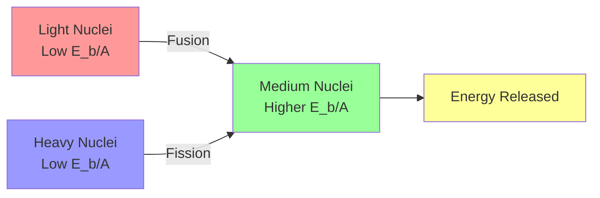
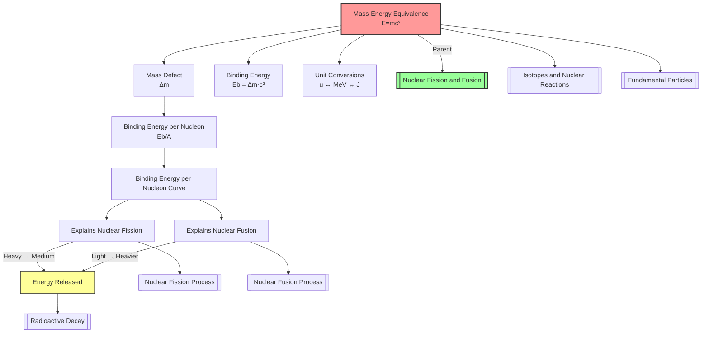

# 1. Overview / 概述

**English:**
Mass-energy equivalence, expressed by Einstein's iconic equation $E=mc^2$, is the fundamental principle that mass and energy are two forms of the same thing. In nuclear physics, this concept explains why nuclear reactions release enormous amounts of energy: the mass of the products is slightly less than the mass of the reactants, and this "missing mass" (mass defect) is converted into energy. This sub-topic is the cornerstone of understanding [[Nuclear Fission and Fusion]] — it provides the quantitative framework for calculating the energy released in both fission and fusion processes. Without $E=mc^2$, the immense energy output of nuclear reactions would remain a mystery.

**中文:**
质能等价由爱因斯坦的著名方程 $E=mc^2$ 表达，是质量和能量是同一事物两种形式的基本原理。在核物理中，这一概念解释了为什么核反应会释放出巨大的能量：产物的质量略小于反应物的质量，这种"缺失的质量"（质量亏损）转化为能量。本子知识点是理解[[Nuclear Fission and Fusion]]的基石——它为计算裂变和聚变过程中释放的能量提供了定量框架。没有 $E=mc^2$，核反应释放的巨大能量将仍然是一个谜。

---

# 2. Syllabus Learning Objectives / 考纲学习目标

| CAIE 9702 | Edexcel IAL |
|-----------|-------------|
| 24.3(a) Understand the equivalence between mass and energy | 9.13 Understand the equivalence between mass and energy |
| 24.3(b) Use $E=mc^2$ to calculate energy released in nuclear reactions | 9.14 Use $E=mc^2$ to calculate energy released |
| 24.3(c) Define and calculate mass defect | 9.15 Define mass defect and binding energy |
| 24.3(d) Define and calculate binding energy | 9.16 Understand binding energy per nucleon |
| 24.3(e) Interpret binding energy per nucleon curve | 9.17 Interpret binding energy per nucleon curve |
| 24.3(f) Relate binding energy to nuclear stability | 9.18 Relate binding energy to nuclear stability |

**Examiner Expectations / 考官期望:**
- **English:** Students must be able to convert between atomic mass units (u) and energy units (MeV or J), calculate mass defect from given isotopic masses, and use $E=mc^2$ to determine energy released. The binding energy per nucleon curve must be interpreted to explain why both fission and fusion release energy.
- **中文:** 学生必须能够在原子质量单位(u)和能量单位(MeV或J)之间进行转换，根据给定的同位素质量计算质量亏损，并使用 $E=mc^2$ 确定释放的能量。必须能够解释平均结合能曲线，以说明为什么裂变和聚变都会释放能量。

---

# 3. Core Definitions / 核心定义

| Term (EN/CN) | Definition (EN) | Definition (CN) | Common Mistakes / 常见错误 |
|--------------|-----------------|-----------------|---------------------------|
| **Mass-Energy Equivalence** / 质能等价 | The principle that mass and energy are equivalent and interconvertible, related by $E=mc^2$ | 质量和能量等价且可相互转换的原理，由 $E=mc^2$ 联系 | Confusing equivalence with "mass turning into energy" — mass is a form of energy |
| **Mass Defect** / 质量亏损 | The difference between the mass of a nucleus and the sum of the masses of its individual nucleons | 原子核的质量与其单个核子质量总和之间的差值 | Forgetting to use nuclear masses, not atomic masses (include electron masses) |
| **Binding Energy** / 结合能 | The energy required to separate a nucleus into its individual nucleons; equivalent to the mass defect | 将原子核分离成单个核子所需的能量；等于质量亏损对应的能量 | Confusing binding energy with energy released in a reaction |
| **Binding Energy per Nucleon** / 平均结合能 | The total binding energy of a nucleus divided by the number of nucleons; a measure of nuclear stability | 原子核的总结合能除以核子数；衡量核稳定性的指标 | Higher binding energy per nucleon = more stable nucleus |
| **Atomic Mass Unit (u)** / 原子质量单位 | 1/12 of the mass of a carbon-12 atom; $1 \text{ u} = 1.661 \times 10^{-27} \text{ kg}$ | 碳-12原子质量的1/12；$1 \text{ u} = 1.661 \times 10^{-27} \text{ kg}$ | Forgetting the energy equivalent: $1 \text{ u} = 931.5 \text{ MeV}/c^2$ |
| **Energy Released** / 释放能量 | The energy released in a nuclear reaction, calculated from the mass difference between reactants and products | 核反应中释放的能量，由反应物和产物之间的质量差计算得出 | Using total masses instead of mass difference |

---

# 4. Key Concepts Explained / 关键概念详解

## 4.1 Mass Defect and Binding Energy / 质量亏损与结合能

### Explanation / 解释
**English:**
When nucleons (protons and neutrons) come together to form a nucleus, the total mass of the nucleus is **less** than the sum of the masses of the individual nucleons. This "missing mass" is called the **mass defect** ($\Delta m$). According to $E=mc^2$, this mass defect is equivalent to the **binding energy** ($E_b$) — the energy that holds the nucleus together. To separate the nucleus into individual nucleons, you must supply this binding energy. Conversely, when the nucleus forms, this energy is released.

The relationship is:
$$ \Delta m = (Z m_p + N m_n) - m_{\text{nucleus}} $$
$$ E_b = \Delta m \cdot c^2 $$

Where $Z$ is the atomic number, $N$ is the neutron number, $m_p$ is the proton mass, $m_n$ is the neutron mass, and $m_{\text{nucleus}}$ is the actual nuclear mass.

**中文:**
当核子（质子和中子）结合形成原子核时，原子核的总质量**小于**单个核子质量的总和。这种"缺失的质量"称为**质量亏损**($\Delta m$)。根据 $E=mc^2$，这个质量亏损等于**结合能**($E_b$)——将原子核结合在一起的能量。要将原子核分离成单个核子，必须提供这个结合能。反之，当原子核形成时，会释放这个能量。

关系式为：
$$ \Delta m = (Z m_p + N m_n) - m_{\text{原子核}} $$
$$ E_b = \Delta m \cdot c^2 $$

其中 $Z$ 是原子序数，$N$ 是中子数，$m_p$ 是质子质量，$m_n$ 是中子质量，$m_{\text{原子核}}$ 是实际的原子核质量。

### Physical Meaning / 物理意义
**English:** The mass defect represents the energy that was released when the nucleus formed from its constituent nucleons. This energy is the "glue" that holds the nucleus together against the electrostatic repulsion of the protons. The larger the binding energy per nucleon, the more stable the nucleus.

**中文:** 质量亏损代表了原子核从其组成核子形成时释放的能量。这种能量是将原子核结合在一起、抵抗质子间静电排斥的"胶水"。平均结合能越大，原子核越稳定。

### Common Misconceptions / 常见误区
- **English:**
  - ❌ "Mass is converted into energy" — Mass **is** a form of energy; it's more accurate to say mass-energy is redistributed
  - ❌ "Mass defect means mass is lost" — Mass is not lost; it appears as energy (which also has mass equivalence)
  - ❌ "Using atomic masses instead of nuclear masses" — Atomic masses include electrons; for mass defect calculations, you must account for electron masses
- **中文:**
  - ❌ "质量转化为能量"——质量**是**能量的一种形式；更准确的说法是质能被重新分配
  - ❌ "质量亏损意味着质量消失了"——质量没有消失；它以能量的形式出现（能量也有质量等价）
  - ❌ "使用原子质量而不是原子核质量"——原子质量包含电子；计算质量亏损时必须考虑电子质量

### Exam Tips / 考试提示
- **English:**
  - Always use the **nuclear mass** (atomic mass minus electron masses) or account for electrons properly
  - Remember: $1 \text{ u} = 931.5 \text{ MeV}/c^2$ — this conversion is essential
  - For reactions, calculate $\Delta m = m_{\text{reactants}} - m_{\text{products}}$, then $E = \Delta m c^2$
  - If $\Delta m$ is positive, energy is released (exothermic)
- **中文:**
  - 始终使用**原子核质量**（原子质量减去电子质量）或正确处理电子
  - 记住：$1 \text{ u} = 931.5 \text{ MeV}/c^2$——这个转换至关重要
  - 对于反应，计算 $\Delta m = m_{\text{反应物}} - m_{\text{产物}}$，然后 $E = \Delta m c^2$
  - 如果 $\Delta m$ 为正，则释放能量（放热反应）

> 📷 **IMAGE PROMPT — MASS_DEFECT: Mass Defect and Binding Energy Diagram**
> A diagram showing a nucleus with its constituent protons and neutrons. On the left, individual nucleons are shown separated with their total mass labeled. On the right, the nucleus is shown with its actual mass labeled. The difference is labeled as "Mass Defect Δm" with an arrow. The energy equivalent is shown as "Binding Energy Eb = Δm·c²". Use a color scheme: nucleons in blue/red, mass defect in yellow, binding energy in green. Include the equation E=mc² prominently.

---

## 4.2 Binding Energy per Nucleon Curve / 平均结合能曲线

### Explanation / 解释
**English:**
The binding energy per nucleon ($E_b/A$) plotted against mass number ($A$) produces a characteristic curve. This curve is crucial for understanding why [[Nuclear Fission Process]] and [[Nuclear Fusion Process]] release energy.

Key features:
- **Low $A$ (light nuclei):** Binding energy per nucleon increases rapidly with $A$ (e.g., $^2_1\text{H}$: ~1.1 MeV, $^4_2\text{He}$: ~7.1 MeV)
- **Peak at $A \approx 56$ (iron-56):** Maximum binding energy per nucleon (~8.8 MeV) — iron is the most stable nucleus
- **High $A$ (heavy nuclei):** Binding energy per nucleon decreases slowly (e.g., $^{238}_{92}\text{U}$: ~7.6 MeV)

**Why fission and fusion release energy:**
- **Fission:** A heavy nucleus (low $E_b/A$) splits into two medium-mass nuclei (higher $E_b/A$) → energy released
- **Fusion:** Two light nuclei (low $E_b/A$) combine to form a heavier nucleus (higher $E_b/A$) → energy released

**中文:**
平均结合能 ($E_b/A$) 对质量数 ($A$) 的曲线是一条特征曲线。这条曲线对于理解为什么[[Nuclear Fission Process]]和[[Nuclear Fusion Process]]会释放能量至关重要。

关键特征：
- **低 $A$（轻核）：** 平均结合能随 $A$ 快速增加（例如，$^2_1\text{H}$：约1.1 MeV，$^4_2\text{He}$：约7.1 MeV）
- **在 $A \approx 56$（铁-56）处达到峰值：** 最大平均结合能（约8.8 MeV）——铁是最稳定的原子核
- **高 $A$（重核）：** 平均结合能缓慢下降（例如，$^{238}_{92}\text{U}$：约7.6 MeV）

**为什么裂变和聚变释放能量：**
- **裂变：** 重核（低 $E_b/A$）分裂成两个中等质量核（较高 $E_b/A$）→ 释放能量
- **聚变：** 两个轻核（低 $E_b/A$）结合形成更重的核（较高 $E_b/A$）→ 释放能量

### Physical Meaning / 物理意义
**English:** The binding energy per nucleon measures how tightly bound each nucleon is. Nuclei with higher binding energy per nucleon are more stable. The curve shows that medium-mass nuclei (around iron) are the most stable, while both very light and very heavy nuclei are less stable and can release energy by moving toward the peak.

**中文:** 平均结合能衡量每个核子被束缚的紧密程度。平均结合能越高的原子核越稳定。曲线显示中等质量核（铁附近）最稳定，而非常轻和非常重的核都不太稳定，可以通过向峰值移动来释放能量。

### Common Misconceptions / 常见误区
- **English:**
  - ❌ "Higher binding energy means more energy released" — It's the **change** in binding energy per nucleon that matters
  - ❌ "Iron can undergo fission or fusion" — Iron is at the peak; both fission and fusion of iron require energy input
  - ❌ "The curve is linear" — It has a characteristic shape with a rapid rise and slow decline
- **中文:**
  - ❌ "结合能越高意味着释放的能量越多"——重要的是平均结合能的**变化**
  - ❌ "铁可以发生裂变或聚变"——铁处于峰值；铁的裂变和聚变都需要输入能量
  - ❌ "曲线是线性的"——它具有快速上升和缓慢下降的特征形状

### Exam Tips / 考试提示
- **English:**
  - Be able to sketch the binding energy per nucleon curve from memory
  - Explain fission: heavy nucleus → two medium nuclei (moving up the curve)
  - Explain fusion: two light nuclei → one heavier nucleus (moving up the curve)
  - Compare energy released: fusion of light nuclei releases more energy per nucleon than fission of heavy nuclei
- **中文:**
  - 能够凭记忆画出平均结合能曲线
  - 解释裂变：重核 → 两个中等核（沿曲线向上移动）
  - 解释聚变：两个轻核 → 一个更重的核（沿曲线向上移动）
  - 比较释放的能量：轻核聚变比重核裂变释放更多的每核子能量

> 📷 **IMAGE PROMPT — BINDING_CURVE: Binding Energy per Nucleon Curve**
> A graph with mass number A on the x-axis (0 to 250) and binding energy per nucleon in MeV on the y-axis (0 to 10). The curve rises steeply from A=1 to about A=20, peaks around A=56 (iron-56) at about 8.8 MeV, then slowly declines to about 7.6 MeV at A=238 (uranium-238). Label key nuclei: ²H (deuterium), ⁴He (helium-4), ⁵⁶Fe (iron-56), ²³⁵U (uranium-235). Add arrows showing: fission (heavy → medium, moving up) and fusion (light → heavier, moving up). Use a clean, exam-style layout.

---

# 5. Essential Equations / 核心公式

## 5.1 Mass-Energy Equivalence / 质能等价

$$ E = mc^2 $$

| Symbol (符号) | Meaning (EN) | Meaning (CN) | Unit (单位) |
|--------------|-------------|-------------|------------|
| $E$ | Energy | 能量 | J (joules) or MeV |
| $m$ | Mass | 质量 | kg or u |
| $c$ | Speed of light in vacuum | 真空中的光速 | $3.00 \times 10^8 \text{ m/s}$ |

**Derivation / 推导:** Einstein's special relativity — not required for A-Level.
**Conditions / 适用条件:** Universal — applies to all mass-energy conversions.
**Limitations / 局限性:** The equation gives the total energy equivalent of mass; in nuclear reactions, we only use the mass difference.

## 5.2 Mass Defect / 质量亏损

$$ \Delta m = (Z m_p + N m_n) - m_{\text{nucleus}} $$

| Symbol (符号) | Meaning (EN) | Meaning (CN) | Unit (单位) |
|--------------|-------------|-------------|------------|
| $\Delta m$ | Mass defect | 质量亏损 | kg or u |
| $Z$ | Atomic number (number of protons) | 原子序数（质子数） | dimensionless |
| $N$ | Neutron number | 中子数 | dimensionless |
| $m_p$ | Mass of a proton | 质子质量 | kg or u |
| $m_n$ | Mass of a neutron | 中子质量 | kg or u |
| $m_{\text{nucleus}}$ | Mass of the nucleus | 原子核质量 | kg or u |

**Derivation / 推导:** Direct from definition.
**Conditions / 适用条件:** Use nuclear masses, not atomic masses (or account for electrons).
**Limitations / 局限性:** Assumes nucleon masses are constant (they are slightly different in different nuclei due to binding energy effects).

## 5.3 Binding Energy / 结合能

$$ E_b = \Delta m \cdot c^2 $$

| Symbol (符号) | Meaning (EN) | Meaning (CN) | Unit (单位) |
|--------------|-------------|-------------|------------|
| $E_b$ | Binding energy | 结合能 | J or MeV |
| $\Delta m$ | Mass defect | 质量亏损 | kg or u |
| $c$ | Speed of light | 光速 | $3.00 \times 10^8 \text{ m/s}$ |

**Derivation / 推导:** From $E=mc^2$.
**Conditions / 适用条件:** $\Delta m$ must be in kg if using J; use $1 \text{ u} = 931.5 \text{ MeV}/c^2$ for MeV.
**Limitations / 局限性:** None for A-Level purposes.

## 5.4 Binding Energy per Nucleon / 平均结合能

$$ \text{Binding energy per nucleon} = \frac{E_b}{A} $$

| Symbol (符号) | Meaning (EN) | Meaning (CN) | Unit (单位) |
|--------------|-------------|-------------|------------|
| $E_b$ | Total binding energy | 总结合能 | MeV |
| $A$ | Mass number (total nucleons) | 质量数（总核子数） | dimensionless |

**Derivation / 推导:** Division of total binding energy by number of nucleons.
**Conditions / 适用条件:** $A = Z + N$.
**Limitations / 局限性:** None for A-Level purposes.

## 5.5 Energy Released in a Nuclear Reaction / 核反应释放能量

$$ E_{\text{released}} = (m_{\text{reactants}} - m_{\text{products}}) \cdot c^2 $$

| Symbol (符号) | Meaning (EN) | Meaning (CN) | Unit (单位) |
|--------------|-------------|-------------|------------|
| $E_{\text{released}}$ | Energy released | 释放的能量 | J or MeV |
| $m_{\text{reactants}}$ | Total mass of reactants | 反应物总质量 | kg or u |
| $m_{\text{products}}$ | Total mass of products | 产物总质量 | kg or u |

**Derivation / 推导:** Conservation of mass-energy.
**Conditions / 适用条件:** If $m_{\text{reactants}} > m_{\text{products}}$, energy is released (exothermic).
**Limitations / 局限性:** Does not account for kinetic energy of reactants (threshold energy for fusion).

> 📋 **CIE Only:** CIE 9702 expects students to use $1 \text{ u} = 931.5 \text{ MeV}/c^2$ and convert between MeV and J ($1 \text{ MeV} = 1.60 \times 10^{-13} \text{ J}$).

> 📋 **Edexcel Only:** Edexcel IAL expects students to use $1 \text{ u} = 931.5 \text{ MeV}/c^2$ and may ask for energy in J or MeV. The data booklet provides the conversion.

---

# 6. Graphs and Relationships / 图表与关系

## 6.1 Binding Energy per Nucleon vs Mass Number / 平均结合能 vs 质量数

### Axes / 坐标轴
- **X-axis:** Mass number $A$ (0 to 250) / 质量数 $A$ (0到250)
- **Y-axis:** Binding energy per nucleon / MeV (0 to 10) / 平均结合能 / MeV (0到10)

### Shape / 形状
**English:** The curve rises steeply from $A=1$ to about $A=20$, peaks at $A \approx 56$ (iron-56) at about 8.8 MeV, then slowly declines to about 7.6 MeV at $A=238$ (uranium-238).

**中文:** 曲线从 $A=1$ 到约 $A=20$ 急剧上升，在 $A \approx 56$（铁-56）处达到约8.8 MeV的峰值，然后缓慢下降到 $A=238$（铀-238）处的约7.6 MeV。

### Gradient Meaning / 斜率含义
**English:** The gradient shows how the stability changes with mass number. Steep positive gradient (light nuclei) means small increases in $A$ greatly increase stability. Shallow negative gradient (heavy nuclei) means large increases in $A$ slightly decrease stability.

**中文:** 斜率显示稳定性如何随质量数变化。陡峭的正斜率（轻核）意味着 $A$ 的小幅增加会大幅提高稳定性。平缓的负斜率（重核）意味着 $A$ 的大幅增加会略微降低稳定性。

### Area Meaning / 面积含义
**English:** The area under the curve has no direct physical meaning for this graph.

**中文:** 该曲线下的面积没有直接的物理意义。

### Exam Interpretation / 考试解读
**English:**
- **Fission:** Heavy nucleus (e.g., U-235, ~7.6 MeV/nucleon) → two medium nuclei (e.g., ~8.5 MeV/nucleon) → increase in binding energy per nucleon → energy released
- **Fusion:** Two light nuclei (e.g., H-2, ~1.1 MeV/nucleon) → He-4 (~7.1 MeV/nucleon) → large increase in binding energy per nucleon → significant energy released
- **Iron-56:** Most stable nucleus; cannot release energy by fission or fusion

**中文:**
- **裂变：** 重核（如U-235，约7.6 MeV/核子）→ 两个中等核（如约8.5 MeV/核子）→ 平均结合能增加 → 释放能量
- **聚变：** 两个轻核（如H-2，约1.1 MeV/核子）→ He-4（约7.1 MeV/核子）→ 平均结合能大幅增加 → 释放大量能量
- **铁-56：** 最稳定的原子核；不能通过裂变或聚变释放能量

---

# 7. Required Diagrams / 必备图表

## 7.1 Binding Energy per Nucleon Curve / 平均结合能曲线

### Description / 描述
**English:** A graph showing binding energy per nucleon (MeV) on the y-axis against mass number (A) on the x-axis. The curve rises steeply for light nuclei, peaks at iron-56 (A=56), then slowly declines for heavy nuclei. Key nuclei should be labeled.

**中文:** 一张图，y轴为平均结合能（MeV），x轴为质量数（A）。曲线对轻核急剧上升，在铁-56（A=56）处达到峰值，然后对重核缓慢下降。应标注关键原子核。

### Image Prompt / 图片生成提示
> 📷 **IMAGE PROMPT — BINDING_CURVE_DETAILED: Binding Energy per Nucleon Curve with Key Nuclei**
> A detailed graph for A-Level physics showing binding energy per nucleon (MeV) vs mass number (A). X-axis from 0 to 250, Y-axis from 0 to 10 MeV. The curve has three distinct regions: (1) steep rise from A=1 to A=20, (2) gradual increase to peak at A=56 (Fe-56, 8.8 MeV), (3) slow decline to A=238 (U-238, 7.6 MeV). Label these key nuclei: ²H (1.1 MeV), ⁴He (7.1 MeV), ⁵⁶Fe (8.8 MeV), ²³⁵U (7.6 MeV). Add arrows showing fission (U-235 → two medium nuclei, moving UP on the curve) and fusion (²H + ³H → ⁴He + n, moving UP on the curve). Use exam-style formatting with clear axes labels and units. Include a note: "Higher binding energy per nucleon = more stable nucleus."

### Labels Required / 需要标注
- **English:** Mass number (A), Binding energy per nucleon (MeV), ²H, ⁴He, ⁵⁶Fe, ²³⁵U, Fission arrow, Fusion arrow, Peak at A=56
- **中文:** 质量数(A)，平均结合能(MeV)，²H，⁴He，⁵⁶Fe，²³⁵U，裂变箭头，聚变箭头，在A=56处达到峰值

### Exam Importance / 考试重要性
**English:** This is the most important diagram for this sub-topic. Students must be able to sketch it from memory, label key nuclei, and use it to explain why fission and fusion release energy.

**中文:** 这是本子知识点最重要的图表。学生必须能够凭记忆画出它，标注关键原子核，并用它来解释为什么裂变和聚变会释放能量。

---

## 7.2 Mass Defect Diagram for a Nucleus / 原子核质量亏损图

### Description / 描述
**English:** A diagram showing a nucleus with its constituent protons and neutrons, comparing the total mass of individual nucleons with the actual nuclear mass.

**中文:** 一张图显示原子核及其组成的质子和中子，比较单个核子的总质量与实际原子核质量。

### Image Prompt / 图片生成提示
> 📷 **IMAGE PROMPT — MASS_DEFECT_DIAGRAM: Mass Defect Illustration for Helium-4**
> A diagram for A-Level physics showing the mass defect concept for helium-4 (⁴He). Left side: two protons and two neutrons shown separately with their individual masses listed (2 × 1.00728 u + 2 × 1.00867 u = 4.03190 u). Right side: a helium-4 nucleus with its actual mass (4.00260 u). Between them, an arrow labeled "Mass Defect Δm = 0.02930 u". Below, an equation: "Binding Energy Eb = Δm × c² = 0.02930 × 931.5 = 27.3 MeV". Use a clean, educational style with color coding: protons in red, neutrons in blue, the nucleus in purple. Include the equation E=mc² prominently.

### Labels Required / 需要标注
- **English:** Proton mass (1.00728 u), Neutron mass (1.00867 u), Total mass of nucleons, Actual nuclear mass, Mass defect (Δm), Binding energy (Eb)
- **中文:** 质子质量(1.00728 u)，中子质量(1.00867 u)，核子总质量，实际原子核质量，质量亏损(Δm)，结合能(Eb)

### Exam Importance / 考试重要性
**English:** Essential for understanding the physical meaning of mass defect and binding energy. Students should be able to draw a similar diagram for any nucleus.

**中文:** 对于理解质量亏损和结合能的物理意义至关重要。学生应该能够为任何原子核画出类似的图。

---

# 8. Worked Examples / 典型例题

## Example 1: Calculating Energy Released in a Fusion Reaction / 计算聚变反应释放的能量

### Question / 题目
**English:**
The following fusion reaction occurs in the Sun:
$$ ^2_1\text{H} + ^3_1\text{H} \rightarrow ^4_2\text{He} + ^1_0\text{n} $$
Given the following atomic masses:
- $^2_1\text{H}$: 2.01410 u
- $^3_1\text{H}$: 3.01605 u
- $^4_2\text{He}$: 4.00260 u
- $^1_0\text{n}$: 1.00867 u

Calculate:
(a) The mass defect in u
(b) The energy released in MeV
(c) The energy released in J

($1 \text{ u} = 931.5 \text{ MeV}/c^2$, $1 \text{ MeV} = 1.60 \times 10^{-13} \text{ J}$)

**中文:**
以下聚变反应发生在太阳中：
$$ ^2_1\text{H} + ^3_1\text{H} \rightarrow ^4_2\text{He} + ^1_0\text{n} $$
给定以下原子质量：
- $^2_1\text{H}$：2.01410 u
- $^3_1\text{H}$：3.01605 u
- $^4_2\text{He}$：4.00260 u
- $^1_0\text{n}$：1.00867 u

计算：
(a) 质量亏损（以u为单位）
(b) 释放的能量（以MeV为单位）
(c) 释放的能量（以J为单位）

（$1 \text{ u} = 931.5 \text{ MeV}/c^2$，$1 \text{ MeV} = 1.60 \times 10^{-13} \text{ J}$）

### Solution / 解答

**Step 1: Calculate total mass of reactants / 计算反应物总质量**
$$ m_{\text{reactants}} = m(^2_1\text{H}) + m(^3_1\text{H}) $$
$$ m_{\text{reactants}} = 2.01410 + 3.01605 = 5.03015 \text{ u} $$

**Step 2: Calculate total mass of products / 计算产物总质量**
$$ m_{\text{products}} = m(^4_2\text{He}) + m(^1_0\text{n}) $$
$$ m_{\text{products}} = 4.00260 + 1.00867 = 5.01127 \text{ u} $$

**Step 3: Calculate mass defect / 计算质量亏损**
$$ \Delta m = m_{\text{reactants}} - m_{\text{products}} $$
$$ \Delta m = 5.03015 - 5.01127 = 0.01888 \text{ u} $$

**Step 4: Calculate energy released in MeV / 计算释放的能量（MeV）**
$$ E = \Delta m \times 931.5 $$
$$ E = 0.01888 \times 931.5 = 17.59 \text{ MeV} $$

**Step 5: Convert to Joules / 转换为焦耳**
$$ E = 17.59 \times 1.60 \times 10^{-13} $$
$$ E = 2.81 \times 10^{-12} \text{ J} $$

### Final Answer / 最终答案
**Answer:**
(a) $\Delta m = 0.01888 \text{ u}$
(b) $E = 17.6 \text{ MeV}$ (3 s.f.)
(c) $E = 2.81 \times 10^{-12} \text{ J}$ (3 s.f.)

**答案：**
(a) $\Delta m = 0.01888 \text{ u}$
(b) $E = 17.6 \text{ MeV}$（3位有效数字）
(c) $E = 2.81 \times 10^{-12} \text{ J}$（3位有效数字）

### Quick Tip / 提示
**English:** Always check that the mass defect is positive for energy-releasing reactions. For fusion, the products are more tightly bound (higher binding energy per nucleon), so they have less mass.

**中文：** 始终检查质量亏损是否为正，以确认是释放能量的反应。对于聚变，产物结合更紧密（平均结合能更高），因此质量更小。

---

## Example 2: Calculating Binding Energy of a Nucleus / 计算原子核的结合能

### Question / 题目
**English:**
Calculate the binding energy per nucleon for iron-56 ($^{56}_{26}\text{Fe}$).

Given:
- Mass of $^{56}_{26}\text{Fe}$ atom: 55.93494 u
- Mass of proton: 1.00728 u
- Mass of neutron: 1.00867 u
- Mass of electron: 0.00055 u
- $1 \text{ u} = 931.5 \text{ MeV}/c^2$

**中文：**
计算铁-56 ($^{56}_{26}\text{Fe}$) 的平均结合能。

给定：
- $^{56}_{26}\text{Fe}$ 原子质量：55.93494 u
- 质子质量：1.00728 u
- 中子质量：1.00867 u
- 电子质量：0.00055 u
- $1 \text{ u} = 931.5 \text{ MeV}/c^2$

### Solution / 解答

**Step 1: Calculate nuclear mass / 计算原子核质量**
We are given the atomic mass (including electrons). To get the nuclear mass, subtract the mass of 26 electrons:

$$ m_{\text{nucleus}} = m_{\text{atom}} - 26 \times m_e $$
$$ m_{\text{nucleus}} = 55.93494 - 26 \times 0.00055 $$
$$ m_{\text{nucleus}} = 55.93494 - 0.01430 = 55.92064 \text{ u} $$

**Step 2: Calculate total mass of individual nucleons / 计算单个核子总质量**
Iron-56 has 26 protons and 30 neutrons ($N = 56 - 26 = 30$):

$$ m_{\text{nucleons}} = 26 \times m_p + 30 \times m_n $$
$$ m_{\text{nucleons}} = 26 \times 1.00728 + 30 \times 1.00867 $$
$$ m_{\text{nucleons}} = 26.18928 + 30.26010 = 56.44938 \text{ u} $$

**Step 3: Calculate mass defect / 计算质量亏损**
$$ \Delta m = m_{\text{nucleons}} - m_{\text{nucleus}} $$
$$ \Delta m = 56.44938 - 55.92064 = 0.52874 \text{ u} $$

**Step 4: Calculate total binding energy / 计算总结合能**
$$ E_b = \Delta m \times 931.5 $$
$$ E_b = 0.52874 \times 931.5 = 492.5 \text{ MeV} $$

**Step 5: Calculate binding energy per nucleon / 计算平均结合能**
$$ \text{Binding energy per nucleon} = \frac{E_b}{A} = \frac{492.5}{56} = 8.79 \text{ MeV/nucleon} $$

### Final Answer / 最终答案
**Answer:** Binding energy per nucleon = 8.79 MeV/nucleon (3 s.f.)

**答案：** 平均结合能 = 8.79 MeV/核子（3位有效数字）

### Quick Tip / 提示
**English:** When given atomic masses, always subtract the electron masses to get nuclear masses. Alternatively, you can use the atomic masses directly if you also include the electron masses in the nucleon calculation (but this is more complex).

**中文：** 当给定原子质量时，始终减去电子质量以获得原子核质量。或者，如果也在核子计算中包含电子质量，可以直接使用原子质量（但这更复杂）。

---

# 9. Past Paper Question Types / 历年真题题型

| Question Type / 题型 | Frequency / 频率 | Difficulty / 难度 | Past Paper References / 真题索引 |
|----------------------|------------------|------------------|-------------------------------|
| Calculate energy released from mass defect | ★★★★★ | Medium | 📝 *待填入* |
| Interpret binding energy per nucleon curve | ★★★★☆ | Medium | 📝 *待填入* |
| Explain why fission/fusion releases energy | ★★★★☆ | Medium | 📝 *待填入* |
| Calculate binding energy per nucleon | ★★★☆☆ | Medium | 📝 *待填入* |
| Convert between u, MeV, and J | ★★★☆☆ | Easy | 📝 *待填入* |
| Compare energy released in fission vs fusion | ★★☆☆☆ | Hard | 📝 *待填入* |

**Common Command Words / 常见指令词:**
- **English:** Calculate, Determine, Show that, Explain, State, Sketch, Compare
- **中文：** 计算，确定，证明，解释，陈述，画出，比较

---

# 10. Practical Skills Connections / 实验技能链接

**English:**
While mass-energy equivalence is a theoretical concept, it connects to practical skills in several ways:

1. **Data Analysis:** Students may be given experimental data (e.g., masses from mass spectrometry) and asked to calculate mass defect and binding energy
2. **Graph Plotting and Interpretation:** Plotting binding energy per nucleon against mass number and interpreting the curve
3. **Uncertainties:** Mass measurements have uncertainties; students should propagate these through calculations of energy released
4. **Logarithmic Scales:** The binding energy per nucleon curve spans a wide range of mass numbers; understanding logarithmic scales helps
5. **Experimental Determination:** Mass spectrometers measure isotopic masses precisely; students should understand how these measurements lead to binding energy calculations

**中文：**
虽然质能等价是一个理论概念，但它以多种方式与实验技能相关联：

1. **数据分析：** 学生可能会获得实验数据（例如，来自质谱仪的质量），并被要求计算质量亏损和结合能
2. **图表绘制和解读：** 绘制平均结合能对质量数的图表并解读曲线
3. **不确定度：** 质量测量有不确定度；学生应将这些不确定度传播到释放能量的计算中
4. **对数尺度：** 平均结合能曲线跨越很宽的质量数范围；理解对数尺度有助于分析
5. **实验测定：** 质谱仪精确测量同位素质量；学生应理解这些测量如何导致结合能计算

---

# 11. Concept Map / 概念图谱

---

# 12. Quick Revision Sheet / 速查表

| Category / 类别 | Key Points / 要点 |
|----------------|------------------|
| **Definition / 定义** | Mass and energy are equivalent: $E=mc^2$. Mass defect is the "missing mass" when nucleons bind. Binding energy is the energy equivalent of mass defect. |
| **Key Formula / 核心公式** | $E=mc^2$, $\Delta m = (Zm_p + Nm_n) - m_{\text{nucleus}}$, $E_b = \Delta m \cdot c^2$, Binding energy per nucleon $= E_b/A$ |
| **Key Conversion / 关键转换** | $1 \text{ u} = 1.661 \times 10^{-27} \text{ kg}$, $1 \text{ u} = 931.5 \text{ MeV}/c^2$, $1 \text{ MeV} = 1.60 \times 10^{-13} \text{ J}$ |
| **Key Graph / 核心图表** | Binding energy per nucleon vs mass number: rises steeply for light nuclei, peaks at Fe-56 (~8.8 MeV), declines slowly for heavy nuclei |
| **Fission Explanation / 裂变解释** | Heavy nucleus (low $E_b/A$) → two medium nuclei (higher $E_b/A$) → energy released |
| **Fusion Explanation / 聚变解释** | Two light nuclei (low $E_b/A$) → one heavier nucleus (higher $E_b/A$) → energy released |
| **Most Stable Nucleus / 最稳定核** | Iron-56 ($^{56}_{26}\text{Fe}$) — highest binding energy per nucleon |
| **Exam Tip / 考试提示** | Always use nuclear masses (subtract electron masses from atomic masses). Check that $\Delta m > 0$ for energy release. Know the conversion factors. |
| **Common Mistake / 常见错误** | Using atomic masses instead of nuclear masses; confusing binding energy with energy released; thinking iron can undergo fission/fusion |