# 1. Overview / 概述

**English:**
Nuclear fission is the process where a heavy, unstable nucleus splits into two smaller nuclei (fission fragments), releasing a large amount of energy and typically 2-3 neutrons. This sub-topic focuses on the **mechanism** of induced fission — how a neutron triggers the splitting of a fissile nucleus like uranium-235 or plutonium-239. Understanding the fission process is fundamental to [[Nuclear Fission and Fusion]] because it explains how energy is released in nuclear power plants and atomic bombs. The process is governed by the [[Mass-Energy Equivalence (E=mc^2)]] principle, where the mass defect between reactants and products is converted into kinetic energy of the fragments and neutrons.

**中文:**
核裂变是指一个重的不稳定原子核分裂成两个较小的原子核（裂变碎片），释放大量能量和通常2-3个中子的过程。本子知识点聚焦于**诱发裂变**的机制——中子如何触发可裂变核（如铀-235或钚-239）的分裂。理解裂变过程是[[Nuclear Fission and Fusion]]的基础，因为它解释了核电站和原子弹中能量释放的原理。该过程受[[Mass-Energy Equivalence (E=mc^2)]]原理支配，反应物与产物之间的质量亏损转化为碎片和中子的动能。

---

# 2. Syllabus Learning Objectives / 考纲学习目标

| CAIE 9702 (24.3 a-f) | Edexcel IAL (WPH14 U4: 9.13-9.18) |
|-----------------------|-----------------------------------|
| Describe the process of nuclear fission induced by thermal neutrons | Explain the process of nuclear fission, including the role of thermal neutrons |
| Explain why a chain reaction may occur | Describe the conditions for a chain reaction |
| Distinguish between controlled and uncontrolled fission | Explain the function of control rods and moderators |
| Describe the structure of a fission reactor | Describe the basic features of a fission reactor |
| Explain the role of moderators and control rods | Explain the energy release in fission using $E=mc^2$ |
| Calculate energy released from mass defect | Calculate energy released from fission reactions |

**Examiner Expectations / 考官期望:**
- **English:** You must be able to write balanced nuclear equations for fission reactions, calculate energy released using $E = \Delta m c^2$, and explain why fission releases energy (binding energy per nucleon curve). For CAIE, you need to describe the reactor structure; for Edexcel, focus on the physics of the fission process itself.
- **中文:** 你必须能够写出裂变反应的平衡核方程，使用 $E = \Delta m c^2$ 计算释放的能量，并解释裂变释放能量的原因（比结合能曲线）。CAIE考生需要描述反应堆结构；Edexcel考生需聚焦裂变过程本身的物理原理。

---

# 3. Core Definitions / 核心定义

| Term (EN/CN) | Definition (EN) | Definition (CN) | Common Mistakes / 常见错误 |
|--------------|-----------------|-----------------|---------------------------|
| **Nuclear Fission** / 核裂变 | The splitting of a heavy, unstable nucleus into two smaller nuclei (fission fragments) with the release of energy and neutrons | 一个重的不稳定原子核分裂成两个较小的原子核（裂变碎片），同时释放能量和中子的过程 | ❌ Confusing with [[Nuclear Fusion Process]] — fusion combines light nuclei, fission splits heavy ones |
| **Induced Fission** / 诱发裂变 | Fission that occurs when a nucleus absorbs a neutron, becoming unstable and splitting | 原子核吸收一个中子后变得不稳定并发生分裂的裂变 | ❌ Thinking fission happens spontaneously — most fission in reactors is induced |
| **Fissile Material** / 可裂变材料 | A nuclide that can undergo induced fission with thermal (slow) neutrons, e.g., $^{235}_{92}U$ and $^{239}_{94}Pu$ | 能够被热（慢）中子诱发裂变的核素，如 $^{235}_{92}U$ 和 $^{239}_{94}Pu$ | ❌ Confusing with "fertile" materials like $^{238}_{92}U$ which need fast neutrons |
| **Fission Fragments** / 裂变碎片 | The two smaller nuclei produced when a heavy nucleus splits; they are typically radioactive and have excess neutrons | 重核分裂时产生的两个较小的原子核；通常具有放射性且中子过剩 | ❌ Forgetting fragments are radioactive — they undergo [[Radioactive Decay]] |
| **Thermal Neutron** / 热中子 | A neutron in thermal equilibrium with its surroundings, with kinetic energy ~0.025 eV at room temperature | 与周围环境处于热平衡的中子，室温下动能约为0.025 eV | ❌ Thinking thermal means "hot" — thermal neutrons are actually slow-moving |
| **Mass Defect** / 质量亏损 | The difference between the mass of the original nucleus and the sum of masses of the products; converted to energy via $E=mc^2$ | 原始原子核质量与产物总质量之差；通过 $E=mc^2$ 转化为能量 | ❌ Forgetting to include neutron masses in the calculation |

---

# 4. Key Concepts Explained / 关键概念详解

## 4.1 The Fission Mechanism / 裂变机制

### Explanation / 解释
**English:**
Nuclear fission of uranium-235 begins when a **thermal neutron** is absorbed by the $^{235}_{92}U$ nucleus, forming an excited $^{236}_{92}U^*$ compound nucleus. This excited state is extremely unstable because the neutron addition upsets the proton-neutron ratio. The nucleus deforms into a dumbbell shape, and the electrostatic repulsion between the protons in the two lobes overcomes the strong nuclear force holding them together. The nucleus splits into two **fission fragments** (typically $^{144}_{56}Ba$ and $^{89}_{36}Kr$), releasing 2-3 **fast neutrons** and a large amount of energy (~200 MeV per fission). The neutrons released can then induce further fissions, enabling a [[Chain Reactions and Critical Mass]].

A typical fission reaction:
$$ ^{235}_{92}U + ^{1}_{0}n \rightarrow ^{236}_{92}U^* \rightarrow ^{144}_{56}Ba + ^{89}_{36}Kr + 3^{1}_{0}n + \text{energy} $$

**中文:**
铀-235的核裂变始于一个**热中子**被 $^{235}_{92}U$ 原子核吸收，形成激发的 $^{236}_{92}U^*$ 复合核。这种激发态极不稳定，因为中子的加入扰乱了质子-中子比。原子核变形为哑铃形状，两叶中质子之间的静电斥力克服了将它们结合在一起的强核力。原子核分裂成两个**裂变碎片**（通常为 $^{144}_{56}Ba$ 和 $^{89}_{36}Kr$），释放2-3个**快中子**和大量能量（每次裂变约200 MeV）。释放的中子可以诱发进一步的裂变，从而实现[[Chain Reactions and Critical Mass]]。

### Physical Meaning / 物理意义
**English:**
The energy release comes from the **mass defect** — the total mass of the fission products is less than the mass of the original uranium nucleus plus the neutron. This "missing mass" is converted to kinetic energy of the fragments and neutrons according to $E = \Delta m c^2$. The fragments fly apart at high speed, and their kinetic energy is what generates heat in a nuclear reactor.

**中文:**
能量释放来自**质量亏损**——裂变产物的总质量小于原始铀核加中子的质量。根据 $E = \Delta m c^2$，这个"缺失的质量"转化为碎片和中子的动能。碎片以高速飞离，它们的动能正是核反应堆中产生热量的来源。

### Common Misconceptions / 常见误区
- ❌ **"Fission splits the nucleus into equal halves"** — In reality, fragments are usually unequal (e.g., Ba-144 and Kr-89), not symmetric
- ❌ **"The neutrons released are slow"** — Fission neutrons are **fast** (~2 MeV); they must be slowed down (moderated) to become thermal neutrons for further fissions
- ❌ **"All uranium undergoes fission"** — Only $^{235}U$ (0.7% of natural uranium) is fissile with thermal neutrons; $^{238}U$ requires fast neutrons

### Exam Tips / 考试提示
- **English:** Always write balanced nuclear equations — check that mass numbers and atomic numbers balance on both sides. Remember that the number of neutrons released varies (typically 2 or 3).
- **中文:** 务必写出平衡的核方程——检查两侧的质量数和原子数是否平衡。记住释放的中子数会变化（通常为2或3个）。

> 📷 **IMAGE PROMPT — FISSION: [Uranium-235 Fission Diagram]**
> A clear diagram showing a thermal neutron approaching a uranium-235 nucleus, the formation of an excited uranium-236 compound nucleus, the nucleus deforming into a dumbbell shape, and splitting into two unequal fission fragments (barium-144 and krypton-89) with 3 neutrons being released. Arrows should show the direction of motion. Labels: "thermal neutron", "U-235 nucleus", "compound nucleus U-236*", "fission fragments", "fast neutrons". Clean, educational style with blue background and yellow/orange nuclei.

---

## 4.2 Energy Release Calculation / 能量释放计算

### Explanation / 解释
**English:**
The energy released in a single fission event can be calculated using the mass-energy equivalence principle. For the reaction:
$$ ^{235}_{92}U + ^{1}_{0}n \rightarrow ^{144}_{56}Ba + ^{89}_{36}Kr + 3^{1}_{0}n $$

Step 1: Calculate total mass before reaction
$$ m_{\text{before}} = m(^{235}U) + m(n) $$

Step 2: Calculate total mass after reaction
$$ m_{\text{after}} = m(^{144}Ba) + m(^{89}Kr) + 3 \times m(n) $$

Step 3: Find mass defect
$$ \Delta m = m_{\text{before}} - m_{\text{after}} $$

Step 4: Convert to energy
$$ E = \Delta m \times c^2 $$

Typical values: $\Delta m \approx 0.2 \text{ u} = 3.32 \times 10^{-28} \text{ kg}$, giving $E \approx 3 \times 10^{-11} \text{ J} \approx 200 \text{ MeV}$ per fission.

**中文:**
单次裂变事件释放的能量可以使用质能等价原理计算。对于反应：
$$ ^{235}_{92}U + ^{1}_{0}n \rightarrow ^{144}_{56}Ba + ^{89}_{36}Kr + 3^{1}_{0}n $$

步骤1：计算反应前总质量
$$ m_{\text{前}} = m(^{235}U) + m(n) $$

步骤2：计算反应后总质量
$$ m_{\text{后}} = m(^{144}Ba) + m(^{89}Kr) + 3 \times m(n) $$

步骤3：求质量亏损
$$ \Delta m = m_{\text{前}} - m_{\text{后}} $$

步骤4：转换为能量
$$ E = \Delta m \times c^2 $$

典型值：$\Delta m \approx 0.2 \text{ u} = 3.32 \times 10^{-28} \text{ kg}$，得到每次裂变 $E \approx 3 \times 10^{-11} \text{ J} \approx 200 \text{ MeV}$。

### Common Misconceptions / 常见误区
- ❌ **"The energy comes from splitting the atom"** — The energy comes from the **mass defect**, not from breaking bonds
- ❌ **"Mass is converted to energy"** — More precisely, mass **defect** is converted; total mass-energy is conserved
- ❌ **"All 200 MeV appears as heat immediately"** — Most appears as kinetic energy of fragments, which then thermalize

### Exam Tips / 考试提示
- **English:** Use atomic mass units (u) where $1 \text{ u} = 1.66 \times 10^{-27} \text{ kg}$ and $c = 3.0 \times 10^8 \text{ m/s}$. Convert MeV to Joules: $1 \text{ MeV} = 1.6 \times 10^{-13} \text{ J}$.
- **中文:** 使用原子质量单位 (u)，其中 $1 \text{ u} = 1.66 \times 10^{-27} \text{ kg}$，$c = 3.0 \times 10^8 \text{ m/s}$。将MeV转换为焦耳：$1 \text{ MeV} = 1.6 \times 10^{-13} \text{ J}$。

---

# 5. Essential Equations / 核心公式

## Equation 1: Fission Reaction / 裂变反应方程

$$ ^{235}_{92}U + ^{1}_{0}n \rightarrow ^{144}_{56}Ba + ^{89}_{36}Kr + 3^{1}_{0}n + \text{energy} $$

| Symbol (符号) | Meaning (EN) | Meaning (CN) | Unit (单位) |
|--------------|-------------|-------------|------------|
| $^{235}_{92}U$ | Uranium-235 nucleus | 铀-235原子核 | — |
| $^{1}_{0}n$ | Neutron | 中子 | — |
| $^{144}_{56}Ba$ | Barium-144 fission fragment | 钡-144裂变碎片 | — |
| $^{89}_{36}Kr$ | Krypton-89 fission fragment | 氪-89裂变碎片 | — |

**Conditions / 适用条件:**
- **English:** The neutron must be thermal (slow) for $^{235}U$; the reaction is exothermic (releases energy)
- **中文:** 对于 $^{235}U$，中子必须是热（慢）中子；反应是放热的

**Limitations / 局限性:**
- **English:** This is one possible fission pathway; many different fragment pairs are possible (e.g., $^{141}_{56}Ba$ and $^{92}_{36}Kr$)
- **中文:** 这只是其中一种可能的裂变路径；可能存在许多不同的碎片对

## Equation 2: Mass-Energy Equivalence / 质能等价

$$ E = \Delta m c^2 $$

| Symbol (符号) | Meaning (EN) | Meaning (CN) | Unit (单位) |
|--------------|-------------|-------------|------------|
| $E$ | Energy released | 释放的能量 | J (Joules) |
| $\Delta m$ | Mass defect | 质量亏损 | kg |
| $c$ | Speed of light in vacuum | 真空中的光速 | m/s ($3.0 \times 10^8$) |

**Derivation / 推导:**
- **English:** Einstein's special relativity; mass and energy are equivalent. The mass defect $\Delta m$ is the difference between initial and final masses.
- **中文:** 爱因斯坦狭义相对论；质量和能量等价。质量亏损 $\Delta m$ 是初始质量与最终质量之差。

**Conditions / 适用条件:**
- **English:** Valid for all nuclear reactions; $c$ is constant at $3.0 \times 10^8$ m/s
- **中文:** 适用于所有核反应；$c$ 为常数 $3.0 \times 10^8$ m/s

**Limitations / 局限性:**
- **English:** Does not account for energy carried by neutrinos (which escape without contributing to heat)
- **中文:** 未考虑中微子携带的能量（中微子逃逸而不贡献热量）

> 📷 **IMAGE PROMPT — FISSION: [Mass Defect Diagram]**
> A diagram showing two scales: left scale with uranium-235 nucleus + neutron, right scale with barium-144 + krypton-89 + 3 neutrons. The right side is slightly lighter, with a label "mass defect Δm" and an arrow pointing to an equation E = Δmc². Use a balance scale visual metaphor.

---

# 6. Graphs and Relationships / 图表与关系

## 6.1 Binding Energy per Nucleon Curve / 比结合能曲线

### Axes / 坐标轴
- **X-axis:** Mass number (A) / 质量数 (A)
- **Y-axis:** Binding energy per nucleon (MeV) / 比结合能 (MeV)

### Shape / 形状
- **English:** The curve rises steeply for light nuclei, peaks at iron-56 (~8.8 MeV/nucleon), then gradually decreases for heavier nuclei. Uranium-235 has ~7.6 MeV/nucleon.
- **中文:** 曲线在轻核区域急剧上升，在铁-56处达到峰值（约8.8 MeV/核子），然后对重核逐渐下降。铀-235约为7.6 MeV/核子。

### Gradient Meaning / 斜率含义
- **English:** The slope indicates how binding energy changes with nucleon number. A positive slope means fusion is energetically favorable; a negative slope means fission is favorable.
- **中文:** 斜率表示比结合能随核子数的变化。正斜率表示聚变在能量上有利；负斜率表示裂变有利。

### Area Meaning / 面积含义
- **English:** The area under the curve from A=0 to a given A gives the total binding energy of that nucleus.
- **中文:** 从A=0到给定A的曲线下面积给出该原子核的总结合能。

### Exam Interpretation / 考试解读
- **English:** Fission is energetically possible for heavy nuclei (A > 56) because splitting them into medium-mass nuclei increases the binding energy per nucleon, releasing energy. The energy released per fission equals the difference in total binding energy between products and reactants.
- **中文:** 重核（A > 56）在能量上可以发生裂变，因为将它们分裂成中等质量核会增加比结合能，从而释放能量。每次裂变释放的能量等于产物与反应物总结合能之差。

> 📷 **IMAGE PROMPT — FISSION: [Binding Energy per Nucleon Curve]**
> A standard binding energy per nucleon curve with mass number on x-axis (0-250) and binding energy per nucleon on y-axis (0-9 MeV). Mark iron-56 at the peak (8.8 MeV). Show uranium-235 at ~7.6 MeV on the right side. Add arrows showing that fission of U-235 produces fragments with higher binding energy per nucleon, with a label "energy released = Δ(BE)".

---

# 7. Required Diagrams / 必备图表

## 7.1 Fission Reaction Diagram / 裂变反应示意图

### Description / 描述
**English:** A step-by-step diagram showing the fission of a uranium-235 nucleus induced by a thermal neutron, including the compound nucleus stage, splitting into fragments, and release of neutrons.

**中文:** 逐步展示铀-235原子核被热中子诱发裂变的示意图，包括复合核阶段、分裂成碎片以及中子释放。

### Image Prompt / 图片生成提示
> 📷 **IMAGE PROMPT — FISSION: [Uranium-235 Fission Process]**
> A four-panel diagram showing: (1) A slow neutron (blue sphere) approaching a uranium-235 nucleus (large yellow sphere with 92 protons and 143 neutrons). (2) The neutron absorbed, forming an excited uranium-236 compound nucleus (shown with wavy lines indicating excitation). (3) The nucleus deforming into a dumbbell shape with electrostatic repulsion arrows between the two lobes. (4) The nucleus splitting into two unequal fragments (barium-144 in green, krypton-89 in red) with 3 fast neutrons (blue spheres) flying outward. Energy release shown as yellow burst. Clean educational style with clear labels.

### Labels Required / 需要标注
- Thermal neutron / 热中子
- Uranium-235 nucleus / 铀-235原子核
- Compound nucleus U-236* / 复合核 U-236*
- Fission fragments (Ba-144, Kr-89) / 裂变碎片 (Ba-144, Kr-89)
- Fast neutrons / 快中子
- Energy release / 能量释放

### Exam Importance / 考试重要性
- **English:** High — this diagram is frequently tested in both CAIE and Edexcel exams. You must be able to draw and label it from memory.
- **中文:** 高——该图在CAIE和Edexcel考试中经常出现。你必须能够凭记忆画出并标注。

## 7.2 Fission Reactor Core Diagram / 裂变反应堆堆芯示意图

### Description / 描述
**English:** A cross-section diagram of a nuclear reactor core showing fuel rods, control rods, moderator, and coolant.

**中文:** 核反应堆堆芯的横截面示意图，显示燃料棒、控制棒、慢化剂和冷却剂。

### Image Prompt / 图片生成提示
> 📷 **IMAGE PROMPT — FISSION: [Nuclear Reactor Core]**
> A cross-section diagram of a nuclear reactor core. Show an array of fuel rods (cylindrical, dark grey with "U-235" label) arranged in a grid. Between them, insert control rods (cylindrical, silver with "Boron" or "Cadmium" label) at varying depths. The space between rods is filled with moderator (light blue, labeled "Graphite" or "Water"). Surrounding the core, show coolant pipes (red/blue for hot/cold). Add arrows showing neutron paths: some neutrons hitting fuel rods, some being absorbed by control rods. Labels: "fuel rod", "control rod", "moderator", "coolant". Clean engineering-style diagram.

### Labels Required / 需要标注
- Fuel rods (U-235) / 燃料棒 (U-235)
- Control rods (Boron/Cadmium) / 控制棒 (硼/镉)
- Moderator (Graphite/Water) / 慢化剂 (石墨/水)
- Coolant / 冷却剂
- Neutron path / 中子路径

### Exam Importance / 考试重要性
- **English:** Medium-High — CAIE specifically requires knowledge of reactor structure; Edexcel focuses more on the physics principles.
- **中文:** 中高——CAIE特别要求了解反应堆结构；Edexcel更侧重于物理原理。

---

# 8. Worked Examples / 典型例题

## Example 1: Energy Released in Fission / 裂变释放的能量计算

### Question / 题目
**English:**
A fission reaction is given by:
$$ ^{235}_{92}U + ^{1}_{0}n \rightarrow ^{141}_{56}Ba + ^{92}_{36}Kr + 3^{1}_{0}n $$

Given masses:
- $^{235}U$: 235.0439 u
- $^{141}Ba$: 140.9144 u
- $^{92}Kr$: 91.9262 u
- Neutron: 1.0087 u

Calculate the energy released in:
(a) atomic mass units (u)
(b) MeV
(c) Joules

(1 u = 931.5 MeV/c² = $1.66 \times 10^{-27}$ kg, $c = 3.0 \times 10^8$ m/s)

**中文:**
一个裂变反应为：
$$ ^{235}_{92}U + ^{1}_{0}n \rightarrow ^{141}_{56}Ba + ^{92}_{36}Kr + 3^{1}_{0}n $$

给定质量：
- $^{235}U$: 235.0439 u
- $^{141}Ba$: 140.9144 u
- $^{92}Kr$: 91.9262 u
- 中子: 1.0087 u

计算释放的能量：
(a) 原子质量单位 (u)
(b) MeV
(c) 焦耳

(1 u = 931.5 MeV/c² = $1.66 \times 10^{-27}$ kg, $c = 3.0 \times 10^8$ m/s)

### Solution / 解答

**Step 1: Calculate total mass before reaction / 计算反应前总质量**
$$ m_{\text{before}} = m(^{235}U) + m(n) $$
$$ m_{\text{before}} = 235.0439 + 1.0087 = 236.0526 \text{ u} $$

**Step 2: Calculate total mass after reaction / 计算反应后总质量**
$$ m_{\text{after}} = m(^{141}Ba) + m(^{92}Kr) + 3 \times m(n) $$
$$ m_{\text{after}} = 140.9144 + 91.9262 + 3(1.0087) $$
$$ m_{\text{after}} = 140.9144 + 91.9262 + 3.0261 = 235.8667 \text{ u} $$

**Step 3: Find mass defect / 求质量亏损**
$$ \Delta m = m_{\text{before}} - m_{\text{after}} $$
$$ \Delta m = 236.0526 - 235.8667 = 0.1859 \text{ u} $$

**Step 4: Convert to energy / 转换为能量**

(a) In atomic mass units:
$$ \Delta m = 0.1859 \text{ u} $$

(b) In MeV:
$$ E = 0.1859 \times 931.5 = 173.2 \text{ MeV} $$

(c) In Joules:
$$ \Delta m = 0.1859 \times 1.66 \times 10^{-27} = 3.086 \times 10^{-28} \text{ kg} $$
$$ E = \Delta m c^2 = (3.086 \times 10^{-28})(3.0 \times 10^8)^2 $$
$$ E = 3.086 \times 10^{-28} \times 9.0 \times 10^{16} $$
$$ E = 2.78 \times 10^{-11} \text{ J} $$

### Final Answer / 最终答案
**Answer:** (a) 0.1859 u (b) 173.2 MeV (c) $2.78 \times 10^{-11}$ J | **答案：** (a) 0.1859 u (b) 173.2 MeV (c) $2.78 \times 10^{-11}$ J

### Quick Tip / 提示
- **English:** Always check that the mass numbers and atomic numbers balance in the equation before calculating. Use the conversion factor 1 u = 931.5 MeV/c² for quick MeV calculations.
- **中文:** 在计算前务必检查方程中质量数和原子数是否平衡。使用换算因子 1 u = 931.5 MeV/c² 进行快速MeV计算。

---

## Example 2: Neutron Moderation / 中子慢化

### Question / 题目
**English:**
A fast neutron produced in fission has kinetic energy of 2.0 MeV. It must be slowed to thermal energy (0.025 eV) to induce further fissions. The neutron collides elastically with moderator nuclei (carbon-12).

(a) Explain why the moderator must have low mass number.
(b) Calculate the number of collisions needed if each collision reduces the neutron's energy by a factor of 0.5 (on average).

**中文:**
裂变产生的快中子动能为2.0 MeV。它必须被慢化到热能（0.025 eV）才能诱发进一步的裂变。中子与慢化剂核（碳-12）发生弹性碰撞。

(a) 解释为什么慢化剂必须具有低质量数。
(b) 如果每次碰撞平均将中子能量减少0.5倍，计算所需的碰撞次数。

### Solution / 解答

**(a) Explanation / 解释:**
**English:** In an elastic collision, maximum energy transfer occurs when the masses of the colliding particles are equal. A moderator with low mass number (like hydrogen-1, deuterium-2, or carbon-12) has mass comparable to a neutron, allowing efficient energy transfer. Heavy nuclei (like lead) would absorb little energy because the neutron would bounce off with minimal energy loss.

**中文:** 在弹性碰撞中，当碰撞粒子的质量相等时能量传递最大。低质量数的慢化剂（如氢-1、氘-2或碳-12）的质量与中子相当，能够有效传递能量。重核（如铅）吸收的能量很少，因为中子会以最小的能量损失弹开。

**(b) Calculation / 计算:**
**English:**
Initial energy: $E_0 = 2.0 \text{ MeV} = 2.0 \times 10^6 \text{ eV}$
Final energy: $E_n = 0.025 \text{ eV}$
Energy reduction factor per collision: $r = 0.5$

After n collisions: $E_n = E_0 \times r^n$

$$ 0.025 = 2.0 \times 10^6 \times (0.5)^n $$
$$ \frac{0.025}{2.0 \times 10^6} = (0.5)^n $$
$$ 1.25 \times 10^{-8} = (0.5)^n $$
$$ \ln(1.25 \times 10^{-8}) = n \ln(0.5) $$
$$ n = \frac{\ln(1.25 \times 10^{-8})}{\ln(0.5)} = \frac{-18.2}{-0.693} = 26.3 $$

Therefore, approximately **27 collisions** are needed.

**中文:**
初始能量：$E_0 = 2.0 \text{ MeV} = 2.0 \times 10^6 \text{ eV}$
最终能量：$E_n = 0.025 \text{ eV}$
每次碰撞能量减少因子：$r = 0.5$

经过n次碰撞后：$E_n = E_0 \times r^n$

$$ 0.025 = 2.0 \times 10^6 \times (0.5)^n $$
$$ \frac{0.025}{2.0 \times 10^6} = (0.5)^n $$
$$ 1.25 \times 10^{-8} = (0.5)^n $$
$$ \ln(1.25 \times 10^{-8}) = n \ln(0.5) $$
$$ n = \frac{\ln(1.25 \times 10^{-8})}{\ln(0.5)} = \frac{-18.2}{-0.693} = 26.3 $$

因此，大约需要 **27次碰撞**。

### Final Answer / 最终答案
**Answer:** (a) Low mass number for efficient energy transfer in elastic collisions (b) ~27 collisions | **答案：** (a) 低质量数以实现弹性碰撞中的有效能量传递 (b) 约27次碰撞

### Quick Tip / 提示
- **English:** For exponential decay problems, use logarithms. Remember that the number of collisions must be an integer — round up.
- **中文:** 对于指数衰减问题，使用对数。记住碰撞次数必须是整数——向上取整。

---

# 9. Past Paper Question Types / 历年真题题型

| Question Type / 题型 | Frequency / 频率 | Difficulty / 难度 | Past Paper References / 真题索引 |
|----------------------|------------------|------------------|-------------------------------|
| Balanced fission equation / 平衡裂变方程 | High / 高 | Easy / 简单 | 📝 *待填入* |
| Energy release calculation ($E=mc^2$) / 能量释放计算 | High / 高 | Medium / 中等 | 📝 *待填入* |
| Explain fission mechanism / 解释裂变机制 | Medium / 中 | Medium / 中等 | 📝 *待填入* |
| Reactor components (moderator, control rods) / 反应堆组件 | Medium / 中 | Medium / 中等 | 📝 *待填入* |
| Chain reaction conditions / 链式反应条件 | Medium / 中 | Medium / 中等 | 📝 *待填入* |
| Compare fission and fusion / 比较裂变与聚变 | Low-Medium / 低中 | Medium / 中等 | 📝 *待填入* |

**Common Command Words / 常见指令词:**
- **English:** "Describe", "Explain", "Calculate", "State", "Outline", "Compare"
- **中文:** "描述"、"解释"、"计算"、"陈述"、"概述"、"比较"

---

# 10. Practical Skills Connections / 实验技能链接

**English:**
While nuclear fission cannot be demonstrated in a school laboratory, the underlying principles connect to practical skills:

1. **Mass and Energy Measurements:** Understanding how mass defect is calculated connects to precision mass measurements using mass spectrometers.
2. **Graph Plotting:** The binding energy per nucleon curve is a key graph — you should be able to plot data points and interpret the shape.
3. **Uncertainty Analysis:** When calculating energy released, uncertainties in mass values propagate. For example, if masses are given to ±0.0001 u, the energy uncertainty is ±0.093 MeV.
4. **Simulation Experiments:** Some schools use computer simulations of chain reactions (e.g., PhET "Nuclear Fission" simulation) to observe how neutron multiplication works.
5. **Radiation Detection:** Geiger-Müller tubes can detect radiation from fission fragments (if a source is available), connecting to [[Radioactive Decay]] practical skills.

**中文:**
虽然核裂变无法在学校实验室中演示，但其基本原理与实验技能相关：

1. **质量和能量测量：** 理解质量亏损的计算与使用质谱仪进行精密质量测量相关。
2. **图表绘制：** 比结合能曲线是关键图表——你应该能够绘制数据点并解释其形状。
3. **不确定度分析：** 计算释放能量时，质量值的不确定度会传递。例如，如果质量给定为 ±0.0001 u，能量不确定度为 ±0.093 MeV。
4. **模拟实验：** 一些学校使用链式反应的计算机模拟（如PhET"核裂变"模拟）来观察中子倍增的工作原理。
5. **辐射探测：** 盖革-米勒管可以探测裂变碎片的辐射（如果有放射源），与[[Radioactive Decay]]实验技能相关。

---

# 11. Concept Map / 概念图谱

```mermaid
graph TD
    %% Nuclear Fission Process - Leaf Node Concept Map
    
    FISSION["Nuclear Fission Process<br/>核裂变过程"] --> DEF["Core Definitions<br/>核心定义"]
    FISSION --> MECH["Fission Mechanism<br/>裂变机制"]
    FISSION --> ENERGY["Energy Release<br/>能量释放"]
    FISSION --> REACTOR["Reactor Components<br/>反应堆组件"]
    
    DEF --> FISSILE["Fissile Material<br/>可裂变材料"]
    DEF --> THERMAL["Thermal Neutron<br/>热中子"]
    DEF --> FRAGMENTS["Fission Fragments<br/>裂变碎片"]
    
    MECH --> ABSORPTION["Neutron Absorption<br/>中子吸收"]
    MECH --> COMPOUND["Compound Nucleus<br/>复合核"]
    MECH --> SPLITTING["Nucleus Splitting<br/>核分裂"]
    
    ENERGY --> MASS_DEFECT["Mass Defect<br/>质量亏损"]
    ENERGY --> EMC2["E = mc²<br/>质能等价"]
    
    REACTOR --> FUEL["Fuel Rods<br/>燃料棒"]
    REACTOR --> MODERATOR["Moderator<br/>慢化剂"]
    REACTOR --> CONTROL["Control Rods<br/>控制棒"]
    REACTOR --> COOLANT["Coolant<br/>冷却剂"]
    
    %% Links to parent and siblings
    FISSION -.->|"part of"| PARENT["[[Nuclear Fission and Fusion]]"]
    FISSION -.->|"enables"| CHAIN["[[Chain Reactions and Critical Mass]]"]
    FISSION -.->|"uses"| EMC2_LINK["[[Mass-Energy Equivalence (E=mc²)]]"]
    FISSION -.->|"produces"| DECAY["[[Radioactive Decay]]"]
    
    %% Styling
    classDef process fill:#e1f5fe,stroke:#01579b,stroke-width:2px
    classDef concept fill:#fff3e0,stroke:#e65100,stroke-width:1px
    classDef component fill:#e8f5e9,stroke:#1b5e20,stroke-width:1px
    classDef link fill:#f3e5f5,stroke:#4a148c,stroke-width:1px,stroke-dasharray: 5 5
    
    class FISSION process
    class DEF,MECH,ENERGY,REACTOR concept
    class FISSILE,THERMAL,FRAGMENTS,ABSORPTION,COMPOUND,SPLITTING,MASS_DEFECT,EMC2 component
    class FUEL,MODERATOR,CONTROL,COOLANT component
    class PARENT,CHAIN,EMC2_LINK,DECAY link
```

---

# 12. Quick Revision Sheet / 速查表

| Category / 类别 | Key Points / 要点 |
|----------------|------------------|
| **Definition / 定义** | Nuclear fission: splitting of heavy nucleus into two smaller nuclei + neutrons + energy / 核裂变：重核分裂成两个较小核 + 中子 + 能量 |
| **Key Formula / 核心公式** | $E = \Delta m c^2$ where $\Delta m = m_{\text{before}} - m_{\text{after}}$ / 质量亏损转化为能量 |
| **Key Reaction / 关键反应** | $^{235}_{92}U + ^{1}_{0}n \rightarrow ^{144}_{56}Ba + ^{89}_{36}Kr + 3^{1}_{0}n + 200\text{ MeV}$ |
| **Energy per fission / 每次裂变能量** | ~200 MeV = $3.2 \times 10^{-11}$ J / 约200 MeV |
| **Key Graph / 核心图表** | Binding energy per nucleon curve — fission favorable for A > 56 / 比结合能曲线——A > 56时裂变有利 |
| **Reactor Components / 反应堆组件** | Fuel rods (U-235), Moderator (slows neutrons), Control rods (absorb neutrons), Coolant / 燃料棒、慢化剂、控制棒、冷却剂 |
| **Neutron Types / 中子类型** | Fast (~2 MeV) → thermal (~0.025 eV) via moderator / 快中子通过慢化剂变为热中子 |
| **Exam Tip / 考试提示** | Always balance nuclear equations (mass number + atomic number) / 务必平衡核方程（质量数+原子数） |
| **Common Mistake / 常见错误** | Confusing fission (splitting) with fusion (combining) / 混淆裂变（分裂）与聚变（结合） |
| **Conversion / 换算** | 1 u = 931.5 MeV/c² = $1.66 \times 10^{-27}$ kg / 1原子质量单位 |

---

> 📋 **CIE Only:** CAIE 9702 specifically requires knowledge of reactor structure (fuel rods, control rods, moderator, coolant) and the distinction between controlled (reactor) and uncontrolled (bomb) fission. You may be asked to draw a labeled diagram of a reactor core.

> 📋 **Edexcel Only:** Edexcel IAL focuses more on the physics principles — energy calculations, binding energy curves, and the conditions for chain reactions. Reactor structure is less emphasized, but you should understand the function of moderators and control rods.