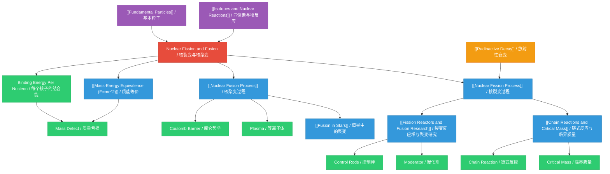

# Nuclear Fission and Fusion / 核裂变与核聚变

---

# 1. Overview / 概述

**English:**
This topic explores the two fundamental processes by which vast amounts of energy can be released from atomic nuclei: nuclear fission (splitting heavy nuclei) and nuclear fusion (combining light nuclei). Both processes are governed by the principle of [[Mass-Energy Equivalence (E=mc^2)]], where a small loss in mass (mass defect) is converted into a tremendous amount of energy. The study begins with understanding the binding energy per nucleon curve, which explains why energy is released in both fission and fusion. Nuclear fission is the basis for current nuclear power generation and atomic weapons, while nuclear fusion powers the Sun and stars and represents the "holy grail" of clean, virtually limitless energy on Earth. In the Cambridge 9702 and Edexcel IAL examinations, this topic is assessed through calculations of energy released using $E = \Delta m c^2$, explanations of chain reactions, comparisons of fission and fusion, and discussions of the conditions required for fusion to occur. Real-world applications include nuclear reactors (fission), fusion research projects like ITER, and understanding stellar nucleosynthesis.

**中文：**
本专题探讨通过两种基本过程从原子核中释放巨大能量的机制：核裂变（分裂重核）和核聚变（结合轻核）。这两个过程都遵循[[质能等价（E=mc²）]]原理，其中微小的质量损失（质量亏损）转化为巨大的能量。研究从理解每个核子的结合能曲线开始，该曲线解释了为什么裂变和聚变都能释放能量。核裂变是当前核能发电和原子武器的基础，而核聚变为太阳和恒星提供能量，并代表了地球上清洁、几乎无限能源的“圣杯”。在剑桥9702和爱德思IAL考试中，本专题通过使用$E = \Delta m c^2$计算释放的能量、解释链式反应、比较裂变与聚变以及讨论聚变所需条件来评估。实际应用包括核反应堆（裂变）、像ITER这样的聚变研究项目，以及理解恒星核合成。

---

# 2. Syllabus Learning Objectives / 考纲学习目标

| CAIE 9702 | Edexcel IAL |
|-----------|-------------|
| 24.3(a) Describe the processes of nuclear fission and nuclear fusion | 9.13 Understand that nuclear fission and fusion are processes in which energy is released due to the change in binding energy per nucleon |
| 24.3(b) Explain the mechanism of nuclear fission and the concept of a chain reaction | 9.14 Understand the principles of a nuclear fission reactor, including the roles of fuel rods, control rods, and moderator |
| 24.3(c) Describe the principles of a nuclear fission reactor | 9.15 Understand the concept of critical mass and chain reactions |
| 24.3(d) Explain the conditions required for nuclear fusion to occur | 9.16 Understand the conditions required for nuclear fusion to occur |
| 24.3(e) Calculate the energy released in nuclear fission and fusion using $E = \Delta m c^2$ | 9.17 Be able to calculate the energy released in nuclear fission and fusion using $E = \Delta m c^2$ |
| 24.3(f) Discuss the advantages and disadvantages of nuclear fusion compared with nuclear fission | 9.18 Understand the difficulties of achieving controlled nuclear fusion on Earth |

**Examiner Expectations / 考官期望:**

**English:**
- Candidates must be able to calculate energy released from mass defect using $E = \Delta m c^2$ with correct units (J or MeV)
- For fission, candidates should explain the chain reaction mechanism and the role of the moderator and control rods
- For fusion, candidates must state the high temperature and high pressure conditions required to overcome electrostatic repulsion
- Candidates should be able to interpret the binding energy per nucleon curve to explain why both fission and fusion release energy
- Edexcel specifically requires understanding of critical mass and the differences between thermal and fast neutrons

**中文：**
- 考生必须能够使用$E = \Delta m c^2$从质量亏损计算释放的能量，并正确使用单位（J或MeV）
- 对于裂变，考生应解释链式反应机制以及慢化剂和控制棒的作用
- 对于聚变，考生必须说明克服静电斥力所需的高温高压条件
- 考生应能够解释每个核子的结合能曲线，以说明为什么裂变和聚变都能释放能量
- 爱德思特别要求理解临界质量以及热中子和快中子之间的区别

> 📋 **CIE Only:** CAIE specifically requires describing the principles of a nuclear fission reactor (24.3c) and discussing advantages/disadvantages of fusion vs fission (24.3f)
>
> 📋 **Edexcel Only:** Edexcel specifically requires understanding of critical mass (9.15) and the difficulties of achieving controlled fusion on Earth (9.18)

---

# 3. Core Definitions / 核心定义

| Term (EN/CN) | Definition (EN) | Definition (CN) | Common Mistakes / 常见错误 |
|--------------|-----------------|-----------------|---------------------------|
| [[Nuclear Fission Process\|Nuclear Fission / 核裂变]] | The splitting of a heavy, unstable nucleus into two smaller, more stable nuclei, accompanied by the release of energy and neutrons | 一个重的不稳定原子核分裂成两个较小的更稳定的原子核，同时释放能量和中子的过程 | Confusing fission with radioactive decay; fission is induced by neutron absorption, not spontaneous |
| [[Nuclear Fusion Process\|Nuclear Fusion / 核聚变]] | The combining of two light nuclei to form a heavier, more stable nucleus, accompanied by the release of energy | 两个轻原子核结合形成一个更重的更稳定的原子核，同时释放能量的过程 | Thinking fusion requires only high temperature, not high pressure/density |
| [[Mass-Energy Equivalence (E=mc^2)\|Mass Defect / 质量亏损]] | The difference between the mass of a nucleus and the sum of the masses of its individual nucleons | 原子核的质量与其单个核子质量总和之间的差值 | Forgetting to use kg for mass in $E = \Delta m c^2$ calculations |
| [[Binding Energy / 结合能]] | The energy required to separate a nucleus into its individual protons and neutrons | 将原子核分离成其单个质子和中子所需的能量 | Confusing binding energy with energy released in a reaction |
| [[Chain Reactions and Critical Mass\|Chain Reaction / 链式反应]] | A self-sustaining series of nuclear fission reactions where neutrons released from one fission event cause further fission events | 一系列自持的核裂变反应，其中一次裂变事件释放的中子引起进一步的裂变事件 | Thinking all neutrons cause fission; some are absorbed or escape |
| [[Chain Reactions and Critical Mass\|Critical Mass / 临界质量]] | The minimum mass of fissile material required to sustain a chain reaction | 维持链式反应所需的可裂变材料的最小质量 | Confusing critical mass with the mass of the entire reactor |
| [[Moderator / 慢化剂]] | A material (e.g., graphite, water) that slows down fast neutrons to thermal energies to increase the probability of fission | 一种材料（如石墨、水），用于将快中子减速到热能，以增加裂变的概率 | Thinking the moderator absorbs neutrons rather than slows them |
| [[Control Rods / 控制棒]] | Rods made of neutron-absorbing material (e.g., boron, cadmium) used to control the rate of fission in a nuclear reactor | 由中子吸收材料（如硼、镉）制成的棒，用于控制核反应堆中的裂变速率 | Confusing control rods with fuel rods |

---

# 4. Key Concepts Explained / 关键概念详解

## 4.1 Binding Energy Per Nucleon Curve / 每个核子的结合能曲线

### Explanation / 解释
**English:**
The [[Binding Energy]] per nucleon curve is a graph of binding energy per nucleon (in MeV) against nucleon number (A). It is the most important concept for understanding why both fission and fusion release energy. The curve rises steeply for light nuclei, peaks at iron-56 (A=56) with about 8.8 MeV per nucleon, then gradually decreases for heavier nuclei. Nuclei with higher binding energy per nucleon are more stable. When a heavy nucleus undergoes fission, it splits into two medium-mass nuclei that have higher binding energy per nucleon, so energy is released. Similarly, when two light nuclei fuse, the resulting nucleus has higher binding energy per nucleon, releasing energy. The key insight is that energy is released when nuclei move towards iron-56 on the curve.

**中文：**
每个核子的结合能曲线是每个核子的结合能（以MeV为单位）相对于核子数（A）的图表。这是理解为什么裂变和聚变都能释放能量的最重要概念。该曲线对于轻核急剧上升，在铁-56（A=56）处达到峰值（约8.8 MeV/核子），然后对于更重的核逐渐下降。每个核子的结合能越高的核越稳定。当一个重核发生裂变时，它分裂成两个中等质量的核，这些核具有更高的每个核子的结合能，因此释放能量。类似地，当两个轻核聚变时，产生的核具有更高的每个核子的结合能，释放能量。关键见解是，当核在曲线上向铁-56移动时，能量被释放。

### Physical Meaning / 物理意义
**English:**
The curve explains why iron is the most stable element and why elements lighter than iron can release energy through fusion, while elements heavier than iron can release energy through fission. This is why stars fuse hydrogen into helium and eventually into heavier elements up to iron, but elements heavier than iron are formed in supernovae through neutron capture processes.

**中文：**
该曲线解释了为什么铁是最稳定的元素，以及为什么比铁轻的元素可以通过聚变释放能量，而比铁重的元素可以通过裂变释放能量。这就是为什么恒星将氢聚变成氦，并最终聚变成直到铁的更重元素，但比铁重的元素是在超新星中通过中子捕获过程形成的。

### Common Misconceptions / 常见误区
- Thinking that fission releases more energy per reaction than fusion (actually fusion releases more energy per unit mass)
- Confusing binding energy with the energy released in a reaction
- Thinking the curve is linear (it has a distinct peak at iron-56)

### Exam Tips / 考试提示
**English:**
Both Cambridge and Edexcel frequently ask candidates to use the binding energy per nucleon curve to explain why energy is released in fission and fusion. Be prepared to sketch the curve and identify the regions where fission and fusion are energetically favorable. Edexcel often asks for calculations using binding energy values from the curve.

**中文：**
剑桥和爱德思都经常要求考生使用每个核子的结合能曲线来解释为什么裂变和聚变会释放能量。准备好绘制曲线并识别裂变和聚变在能量上有利的区域。爱德思经常要求使用曲线中的结合能值进行计算。

> 📷 **IMAGE PROMPT — BEP-01: Binding Energy Per Nucleon Curve**
>
> A detailed graph showing binding energy per nucleon (y-axis, 0-10 MeV) against nucleon number A (x-axis, 0-250). The curve rises steeply from hydrogen (very low binding energy) to a peak at iron-56 (A=56, ~8.8 MeV), then gradually decreases to uranium (A=238, ~7.6 MeV). Label key regions: fusion region (A<56) and fission region (A>56). Include arrows showing that fission of uranium produces nuclei with higher binding energy per nucleon, and fusion of hydrogen produces helium with higher binding energy per nucleon. Use a clean, textbook-style diagram with clear axis labels and annotations.

---

## 4.2 Nuclear Fission Mechanism / 核裂变机制

### Explanation / 解释
**English:**
[[Nuclear Fission Process|Nuclear fission]] is the process where a heavy nucleus (typically uranium-235 or plutonium-239) absorbs a neutron and becomes unstable, splitting into two smaller nuclei (fission fragments), releasing energy and 2-3 fast neutrons. The general equation is:

$$ {}^{235}_{92}\text{U} + {}^{1}_{0}\text{n} \rightarrow {}^{236}_{92}\text{U}^* \rightarrow \text{Fission Fragments} + 2\text{–}3{}^{1}_{0}\text{n} + \text{Energy} $$

The fission fragments are typically radioactive and undergo further [[Radioactive Decay]]. The released neutrons can go on to cause further fission events, creating a [[Chain Reactions and Critical Mass|chain reaction]]. For a chain reaction to be self-sustaining, at least one neutron from each fission must cause another fission. This requires a [[Chain Reactions and Critical Mass|critical mass]] of fissile material.

**中文：**
核裂变是一个重核（通常是铀-235或钚-239）吸收一个中子并变得不稳定，分裂成两个较小的核（裂变碎片），释放能量和2-3个快中子的过程。一般方程为：

$$ {}^{235}_{92}\text{U} + {}^{1}_{0}\text{n} \rightarrow {}^{236}_{92}\text{U}^* \rightarrow \text{裂变碎片} + 2\text{–}3{}^{1}_{0}\text{n} + \text{能量} $$

裂变碎片通常具有放射性，并经历进一步的[[放射性衰变]]。释放的中子可以继续引起进一步的裂变事件，形成[[链式反应与临界质量|链式反应]]。为了使链式反应自持，每次裂变至少有一个中子必须引起另一次裂变。这需要可裂变材料的[[临界质量]]。

### Physical Meaning / 物理意义
**English:**
Fission releases about 200 MeV per event, which is millions of times more energy per atom than chemical reactions. This is the principle behind nuclear power plants and atomic bombs. In a reactor, the chain reaction is controlled using control rods and a moderator, while in a bomb, the reaction is uncontrolled.

**中文：**
每次裂变事件释放约200 MeV的能量，每个原子的能量比化学反应高出数百万倍。这是核电站和原子弹背后的原理。在反应堆中，链式反应通过控制棒和慢化剂进行控制，而在炸弹中，反应是不受控制的。

### Common Misconceptions / 常见误区
- Thinking that uranium-238 undergoes fission as easily as uranium-235 (U-238 requires fast neutrons)
- Confusing the roles of moderator (slows neutrons) and control rods (absorb neutrons)
- Thinking that all neutrons released cause further fission (some are absorbed or escape)

### Exam Tips / 考试提示
**English:**
Cambridge often asks candidates to describe the fission process and explain the chain reaction. Edexcel frequently asks about the roles of fuel rods, control rods, and moderator in a reactor. Be prepared to calculate the energy released from a given fission reaction using mass defect.

**中文：**
剑桥经常要求考生描述裂变过程并解释链式反应。爱德思经常询问反应堆中燃料棒、控制棒和慢化剂的作用。准备好使用质量亏损计算给定裂变反应释放的能量。

> 📷 **IMAGE PROMPT — FIS-01: Nuclear Fission Chain Reaction**
>
> A diagram showing a chain reaction in progress. A uranium-235 nucleus absorbs a neutron and splits into two fission fragments (shown as smaller nuclei), releasing 2-3 neutrons and gamma rays. Each released neutron goes on to strike another uranium-235 nucleus, causing further fission events. Use arrows to show the path of neutrons. Color code: uranium nuclei in blue, neutrons in green, fission fragments in red, gamma rays in yellow. Include labels for "neutron absorption", "fission", "fission fragments", and "released neutrons". Show at least 3 generations of fission.

---

## 4.3 Nuclear Fusion Mechanism / 核聚变机制

### Explanation / 解释
**English:**
[[Nuclear Fusion Process|Nuclear fusion]] is the process where two light nuclei combine to form a heavier nucleus, releasing energy. The most important fusion reaction for energy production is the deuterium-tritium reaction:

$$ {}^{2}_{1}\text{H} + {}^{3}_{1}\text{H} \rightarrow {}^{4}_{2}\text{He} + {}^{1}_{0}\text{n} + 17.6 \text{ MeV} $$

For fusion to occur, the nuclei must overcome the electrostatic repulsion (Coulomb barrier) between positively charged nuclei. This requires extremely high temperatures (about 100 million K) to give the nuclei enough kinetic energy, and high pressure/density to increase the probability of collisions. At these temperatures, matter exists as plasma (ionized gas). On Earth, fusion is being researched in devices like tokamaks (magnetic confinement) and inertial confinement fusion systems.

**中文：**
核聚变是两个轻核结合形成一个更重的核并释放能量的过程。对于能源生产最重要的聚变反应是氘-氚反应：

$$ {}^{2}_{1}\text{H} + {}^{3}_{1}\text{H} \rightarrow {}^{4}_{2}\text{He} + {}^{1}_{0}\text{n} + 17.6 \text{ MeV} $$

为了使聚变发生，原子核必须克服带正电核之间的静电斥力（库仑势垒）。这需要极高的温度（约1亿K）以使原子核具有足够的动能，以及高压/高密度以增加碰撞的概率。在这些温度下，物质以等离子体（电离气体）形式存在。在地球上，聚变正在托卡马克（磁约束）和惯性约束聚变系统等装置中进行研究。

### Physical Meaning / 物理意义
**English:**
Fusion is the energy source of stars, including our Sun. In the Sun, the proton-proton chain fuses hydrogen into helium, releasing energy that sustains life on Earth. Fusion has the potential to provide virtually unlimited clean energy on Earth, with abundant fuel (deuterium from seawater, tritium from lithium) and no long-lived radioactive waste.

**中文：**
聚变是恒星（包括我们的太阳）的能量来源。在太阳中，质子-质子链将氢聚变成氦，释放出维持地球生命的能量。聚变有潜力在地球上提供几乎无限的清洁能源，燃料丰富（氘来自海水，氚来自锂），且没有长寿命放射性废物。

### Common Misconceptions / 常见误区
- Thinking that fusion can occur at room temperature (requires millions of degrees)
- Confusing fusion with fission (opposite processes)
- Thinking that fusion produces radioactive waste (it produces mainly helium and neutrons)

### Exam Tips / 考试提示
**English:**
Both boards ask candidates to explain the conditions required for fusion (high temperature and high pressure). Cambridge often asks for advantages of fusion over fission. Edexcel specifically asks about the difficulties of achieving controlled fusion on Earth. Be prepared to calculate energy released from fusion reactions.

**中文：**
两个考试局都要求考生解释聚变所需的条件（高温高压）。剑桥经常询问聚变相对于裂变的优势。爱德世特别询问在地球上实现受控聚变的困难。准备好计算聚变反应释放的能量。

> 📷 **IMAGE PROMPT — FUS-01: Deuterium-Tritium Fusion Reaction**
>
> A diagram showing a deuterium nucleus (1 proton, 1 neutron) and a tritium nucleus (1 proton, 2 neutrons) approaching each other. At the center, they fuse to form a helium-4 nucleus (2 protons, 2 neutrons) and a free neutron. Show the Coulomb barrier as a potential energy curve that the nuclei must overcome. Use arrows to indicate the release of 17.6 MeV of energy. Color code: protons in red, neutrons in blue. Include labels for "deuterium", "tritium", "helium-4", "neutron", and "energy released".

---

## 4.4 Mass-Energy Equivalence / 质能等价

### Explanation / 解释
**English:**
[[Mass-Energy Equivalence (E=mc^2)|Einstein's mass-energy equivalence]] is the fundamental principle that mass and energy are interchangeable. The equation $E = \Delta m c^2$ relates the energy released ($E$) to the mass defect ($\Delta m$) and the speed of light ($c = 3.00 \times 10^8 \text{ m s}^{-1}$). In nuclear reactions, the total mass of the products is slightly less than the total mass of the reactants. This mass difference (mass defect) is converted into energy. The energy released can be calculated in joules or electronvolts (1 eV = $1.60 \times 10^{-19}$ J, 1 MeV = $1.60 \times 10^{-13}$ J).

**中文：**
爱因斯坦的质能等价是质量和能量可以相互转换的基本原理。方程$E = \Delta m c^2$将释放的能量（$E$）与质量亏损（$\Delta m$）和光速（$c = 3.00 \times 10^8 \text{ m s}^{-1}$）联系起来。在核反应中，产物的总质量略小于反应物的总质量。这个质量差（质量亏损）转化为能量。释放的能量可以用焦耳或电子伏特计算（1 eV = $1.60 \times 10^{-19}$ J，1 MeV = $1.60 \times 10^{-13}$ J）。

### Physical Meaning / 物理意义
**English:**
This principle explains why nuclear reactions release millions of times more energy than chemical reactions. The mass defect in nuclear reactions is measurable (typically 0.1-1% of the total mass), while in chemical reactions, the mass change is negligible. This is why a small amount of nuclear fuel can produce enormous amounts of energy.

**中文：**
这个原理解释了为什么核反应释放的能量比化学反应高出数百万倍。核反应中的质量亏损是可测量的（通常占总质量的0.1-1%），而在化学反应中，质量变化可以忽略不计。这就是为什么少量核燃料可以产生巨大能量的原因。

### Common Misconceptions / 常见误区
- Forgetting to convert atomic mass units (u) to kilograms (kg) before using $E = \Delta m c^2$
- Using the wrong value for the speed of light
- Confusing mass defect with the actual mass of the nucleus

### Exam Tips / 考试提示
**English:**
Both boards require calculations using $E = \Delta m c^2$. Always convert masses to kg (1 u = $1.66 \times 10^{-27}$ kg) or use the conversion 1 u = 931.5 MeV/c². Show all steps clearly, including the calculation of mass defect. Edexcel often provides masses in atomic mass units and expects answers in MeV.

**中文：**
两个考试局都要求使用$E = \Delta m c^2$进行计算。始终将质量转换为kg（1 u = $1.66 \times 10^{-27}$ kg）或使用转换关系1 u = 931.5 MeV/c²。清晰显示所有步骤，包括质量亏损的计算。爱德思通常以原子质量单位提供质量，并期望以MeV为单位给出答案。

---

# 5. Essential Equations / 核心公式

## 5.1 Mass-Energy Equivalence / 质能等价公式

**Equation / 公式:**
$$ E = \Delta m c^2 $$

**Variables / 变量:**
| Symbol (符号) | Meaning (EN) | Meaning (CN) | Unit (单位) |
|--------------|-------------|-------------|------------|
| $E$ | Energy released | 释放的能量 | J or MeV |
| $\Delta m$ | Mass defect (mass difference) | 质量亏损（质量差） | kg or u |
| $c$ | Speed of light in vacuum | 真空中的光速 | m s$^{-1}$ |

**Derivation / 推导:**
**English:**
This equation was derived by Albert Einstein from his theory of special relativity. It is not derived in A-level physics but is given as a fundamental principle. The mass defect $\Delta m$ is calculated as:
$$ \Delta m = \text{(total mass of reactants)} - \text{(total mass of products)} $$
If $\Delta m > 0$, energy is released (exothermic reaction).

**中文：**
这个方程是阿尔伯特·爱因斯坦从他的狭义相对论中推导出来的。在A-level物理中不进行推导，而是作为一个基本原理给出。质量亏损$\Delta m$计算如下：
$$ \Delta m = \text{（反应物总质量）} - \text{（产物总质量）} $$
如果$\Delta m > 0$，则释放能量（放热反应）。

**Conditions / 适用条件:**
**English:** Applicable to all nuclear reactions where mass is converted to energy. Valid for both fission and fusion reactions.
**中文：** 适用于所有质量转化为能量的核反应。对裂变和聚变反应都有效。

**Limitations / 局限性:**
**English:** Does not account for energy carried by neutrinos or other particles that may escape the system. Assumes all mass defect is converted to usable energy.
**中文：** 不考虑中微子或其他可能逃逸系统的粒子携带的能量。假设所有质量亏损都转化为可用能量。

**Rearrangements / 变形:**
$$ \Delta m = \frac{E}{c^2} $$
$$ c = \sqrt{\frac{E}{\Delta m}} $$

---

## 5.2 Energy Released in Fission / 裂变释放的能量

**Equation / 公式:**
$$ E_{\text{fission}} = [m(\text{U-235}) + m(\text{n}) - m(\text{fission fragments}) - m(\text{neutrons})] \times c^2 $$

**Variables / 变量:**
| Symbol (符号) | Meaning (EN) | Meaning (CN) | Unit (单位) |
|--------------|-------------|-------------|------------|
| $m(\text{U-235})$ | Mass of uranium-235 nucleus | 铀-235核的质量 | kg or u |
| $m(\text{n})$ | Mass of neutron | 中子的质量 | kg or u |
| $m(\text{fission fragments})$ | Total mass of fission fragments | 裂变碎片的总质量 | kg or u |
| $m(\text{neutrons})$ | Total mass of released neutrons | 释放的中子的总质量 | kg or u |

**Derivation / 推导:**
**English:**
The energy released in a typical fission reaction (e.g., U-235 + n → Ba-141 + Kr-92 + 3n) is calculated by finding the mass defect:
$$ \Delta m = [m({}^{235}\text{U}) + m({}^{1}\text{n})] - [m({}^{141}\text{Ba}) + m({}^{92}\text{Kr}) + 3m({}^{1}\text{n})] $$
Then $E = \Delta m c^2$. Typical energy released is about 200 MeV per fission event.

**中文：**
典型裂变反应（如U-235 + n → Ba-141 + Kr-92 + 3n）释放的能量通过计算质量亏损得到：
$$ \Delta m = [m({}^{235}\text{U}) + m({}^{1}\text{n})] - [m({}^{141}\text{Ba}) + m({}^{92}\text{Kr}) + 3m({}^{1}\text{n})] $$
然后$E = \Delta m c^2$。每次裂变事件释放的典型能量约为200 MeV。

**Conditions / 适用条件:**
**English:** Valid for any fission reaction where the masses of reactants and products are known.
**中文：** 适用于任何已知反应物和产物质量的裂变反应。

**Limitations / 局限性:**
**English:** The exact fission fragments vary, so the energy released can vary slightly. The calculation assumes all mass defect is converted to kinetic energy of products.
**中文：** 确切的裂变碎片会变化，因此释放的能量可能略有不同。计算假设所有质量亏损都转化为产物的动能。

---

## 5.3 Energy Released in Fusion / 聚变释放的能量

**Equation / 公式:**
$$ E_{\text{fusion}} = [m(\text{reactants}) - m(\text{products})] \times c^2 $$

**Variables / 变量:**
| Symbol (符号) | Meaning (EN) | Meaning (CN) | Unit (单位) |
|--------------|-------------|-------------|------------|
| $m(\text{reactants})$ | Total mass of fusing nuclei | 聚变核的总质量 | kg or u |
| $m(\text{products})$ | Total mass of fusion products | 聚变产物的总质量 | kg or u |

**Derivation / 推导:**
**English:**
For the deuterium-tritium reaction:
$$ {}^{2}_{1}\text{H} + {}^{3}_{1}\text{H} \rightarrow {}^{4}_{2}\text{He} + {}^{1}_{0}\text{n} $$
$$ \Delta m = [m({}^{2}\text{H}) + m({}^{3}\text{H})] - [m({}^{4}\text{He}) + m({}^{1}\text{n})] $$
$$ E = \Delta m c^2 = 17.6 \text{ MeV} $$

**中文：**
对于氘-氚反应：
$$ {}^{2}_{1}\text{H} + {}^{3}_{1}\text{H} \rightarrow {}^{4}_{2}\text{He} + {}^{1}_{0}\text{n} $$
$$ \Delta m = [m({}^{2}\text{H}) + m({}^{3}\text{H})] - [m({}^{4}\text{He}) + m({}^{1}\text{n})] $$
$$ E = \Delta m c^2 = 17.6 \text{ MeV} $$

**Conditions / 适用条件:**
**English:** Valid for any fusion reaction where the masses of reactants and products are known.
**中文：** 适用于任何已知反应物和产物质量的聚变反应。

**Limitations / 局限性:**
**English:** The energy released is shared between the products as kinetic energy. In the D-T reaction, about 80% of the energy is carried by the neutron.
**中文：** 释放的能量作为动能分配给产物。在D-T反应中，约80%的能量由中子携带。

---

## 5.4 Conversion Factors / 转换因子

**Equation / 公式:**
$$ 1 \text{ u} = 1.66 \times 10^{-27} \text{ kg} $$
$$ 1 \text{ u} = 931.5 \text{ MeV/c}^2 $$
$$ 1 \text{ eV} = 1.60 \times 10^{-19} \text{ J} $$
$$ 1 \text{ MeV} = 1.60 \times 10^{-13} \text{ J} $$

**Variables / 变量:**
| Symbol (符号) | Meaning (EN) | Meaning (CN) | Unit (单位) |
|--------------|-------------|-------------|------------|
| u | Atomic mass unit | 原子质量单位 | kg |
| eV | Electronvolt | 电子伏特 | J |

**Derivation / 推导:**
**English:**
1 u is defined as 1/12 the mass of a carbon-12 atom. The conversion 1 u = 931.5 MeV/c² is derived from $E = mc^2$:
$$ E = (1.66 \times 10^{-27} \text{ kg}) \times (3.00 \times 10^8 \text{ m s}^{-1})^2 = 1.49 \times 10^{-10} \text{ J} $$
$$ \frac{1.49 \times 10^{-10} \text{ J}}{1.60 \times 10^{-13} \text{ J/MeV}} = 931.5 \text{ MeV} $$

**中文：**
1 u定义为碳-12原子质量的1/12。转换关系1 u = 931.5 MeV/c²从$E = mc^2$推导得出：
$$ E = (1.66 \times 10^{-27} \text{ kg}) \times (3.00 \times 10^8 \text{ m s}^{-1})^2 = 1.49 \times 10^{-10} \text{ J} $$
$$ \frac{1.49 \times 10^{-10} \text{ J}}{1.60 \times 10^{-13} \text{ J/MeV}} = 931.5 \text{ MeV} $$

**Conditions / 适用条件:**
**English:** Always use these conversions when working with nuclear masses and energies.
**中文：** 在处理核质量和能量时始终使用这些转换关系。

**Limitations / 局限性:**
**English:** None; these are standard conversion factors.
**中文：** 无；这些是标准转换因子。

---

# 6. Graphs and Relationships / 图表与关系

## 6.1 Binding Energy Per Nucleon vs Nucleon Number / 每个核子的结合能 vs 核子数

### Axes / 坐标轴
**English:** X-axis: Nucleon number (A); Y-axis: Binding energy per nucleon (MeV)
**中文：** X轴：核子数（A）；Y轴：每个核子的结合能（MeV）

### Shape / 形状
**English:** The curve rises steeply from hydrogen (very low binding energy) to a peak at iron-56 (A=56, ~8.8 MeV), then gradually decreases for heavier nuclei. The curve has a characteristic "hump" shape.
**中文：** 曲线从氢（非常低的结合能）急剧上升到铁-56（A=56，~8.8 MeV）处的峰值，然后对于更重的核逐渐下降。曲线具有特征性的"驼峰"形状。

### Gradient Meaning / 斜率含义
**English:** The gradient represents the rate of change of binding energy per nucleon with nucleon number. A steep positive gradient (for light nuclei) indicates that fusion of these nuclei will release significant energy. A shallow negative gradient (for heavy nuclei) indicates that fission of these nuclei will release energy.
**中文：** 斜率表示每个核子的结合能随核子数的变化率。陡峭的正斜率（对于轻核）表明这些核的聚变将释放大量能量。平缓的负斜率（对于重核）表明这些核的裂变将释放能量。

### Area Meaning / 面积含义
**English:** The area under the curve from A=0 to a given A represents the total binding energy of that nucleus. However, this is not typically used in A-level analysis.
**中文：** 从A=0到给定A的曲线下面积表示该核的总结合能。然而，这在A-level分析中通常不使用。

### Exam Interpretation / 考试解读
**English:**
- Nuclei to the left of the peak (A<56) can release energy through fusion
- Nuclei to the right of the peak (A>56) can release energy through fission
- Iron-56 is the most stable nucleus (highest binding energy per nucleon)
- The greater the difference in binding energy per nucleon between reactants and products, the more energy is released

**中文：**
- 峰值左侧的核（A<56）可以通过聚变释放能量
- 峰值右侧的核（A>56）可以通过裂变释放能量
- 铁-56是最稳定的核（每个核子的结合能最高）
- 反应物和产物之间每个核子的结合能差异越大，释放的能量越多

### Common Questions / 常见问题
**English:**
- "Use the binding energy per nucleon curve to explain why energy is released in nuclear fission."
- "Explain why fusion of light nuclei releases energy."
- "Why is iron-56 the most stable nucleus?"

**中文：**
- "使用每个核子的结合能曲线解释为什么核裂变释放能量。"
- "解释为什么轻核的聚变释放能量。"
- "为什么铁-56是最稳定的核？"

---

## 6.2 Neutron Energy Distribution in Fission / 裂变中的中子能量分布

### Axes / 坐标轴
**English:** X-axis: Neutron energy (MeV); Y-axis: Number of neutrons (relative)
**中文：** X轴：中子能量（MeV）；Y轴：中子数量（相对值）

### Shape / 形状
**English:** The distribution is a broad peak centered around 1-2 MeV, with a long tail extending to higher energies (up to about 10 MeV). Most neutrons are "fast neutrons" with energies in the MeV range.
**中文：** 分布是一个宽峰，中心在1-2 MeV左右，有一个延伸到更高能量（高达约10 MeV）的长尾。大多数中子是具有MeV能量范围的"快中子"。

### Gradient Meaning / 斜率含义
**English:** Not typically analyzed for this distribution.
**中文：** 通常不分析此分布的斜率。

### Area Meaning / 面积含义
**English:** The total area under the curve represents the total number of neutrons released per fission event (typically 2-3).
**中文：** 曲线下的总面积表示每次裂变事件释放的中子总数（通常为2-3个）。

### Exam Interpretation / 考试解读
**English:**
- Most neutrons are fast neutrons (high energy)
- Fast neutrons are less likely to cause fission in U-235 than thermal (slow) neutrons
- This is why a moderator is needed to slow down neutrons in a thermal reactor

**中文：**
- 大多数中子都是快中子（高能量）
- 快中子比热（慢）中子引起U-235裂变的可能性更小
- 这就是为什么在热中子反应堆中需要慢化剂来减速中子

### Common Questions / 常见问题
**English:**
- "Explain why a moderator is needed in a nuclear reactor."
- "Describe the energy distribution of neutrons released in fission."

**中文：**
- "解释为什么核反应堆中需要慢化剂。"
- "描述裂变中释放的中子的能量分布。"

---

# 7. Required Diagrams / 必备图表

## 7.1 Binding Energy Per Nucleon Curve / 每个核子的结合能曲线

### Description / 描述
**English:**
A graph showing binding energy per nucleon (y-axis, 0-10 MeV) against nucleon number A (x-axis, 0-250). The curve rises steeply from hydrogen (very low binding energy) to a peak at iron-56 (A=56, ~8.8 MeV), then gradually decreases to uranium (A=238, ~7.6 MeV). Key regions are labeled: fusion region (A<56) and fission region (A>56). Arrows indicate that fission of uranium and fusion of hydrogen both move towards higher binding energy per nucleon.

**中文：**
一个图表，显示每个核子的结合能（y轴，0-10 MeV）相对于核子数A（x轴，0-250）。曲线从氢（非常低的结合能）急剧上升到铁-56（A=56，~8.8 MeV）处的峰值，然后对于更重的核逐渐下降到铀（A=238，~7.6 MeV）。关键区域被标记：聚变区域（A<56）和裂变区域（A>56）。箭头表示铀的裂变和氢的聚变都朝着更高的每个核子的结合能移动。

### Image Prompt / 图片生成提示
> 📷 **IMAGE PROMPT — BEP-02: Binding Energy Per Nucleon Curve (Detailed)**
>
> A professional textbook-style graph with a smooth curve on a white background. X-axis labeled "Nucleon number, A" from 0 to 250. Y-axis labeled "Binding energy per nucleon / MeV" from 0 to 10. The curve starts near zero at A=1 (hydrogen), rises steeply through helium (A=4, ~7 MeV), peaks at iron-56 (A=56, 8.8 MeV), then gradually decreases through uranium (A=238, 7.6 MeV). Key nuclei are marked with dots and labels: H-1, He-4, Fe-56, U-235. Two shaded regions: left region labeled "Fusion" (A<56) with arrow showing fusion increases binding energy per nucleon; right region labeled "Fission" (A>56) with arrow showing fission increases binding energy per nucleon. Clean, minimalist style with clear axis labels and a title: "Binding Energy Per Nucleon Curve".

### Labels Required / 需要标注
- X-axis: "Nucleon number, A" / "核子数，A"
- Y-axis: "Binding energy per nucleon / MeV" / "每个核子的结合能 / MeV"
- Peak: "Fe-56 (8.8 MeV)" / "Fe-56 (8.8 MeV)"
- Fusion region: "Fusion" / "聚变"
- Fission region: "Fission" / "裂变"
- Key nuclei: H-1, He-4, Fe-56, U-235

### Exam Importance / 考试重要性
**English:** This is the most important diagram for understanding why both fission and fusion release energy. Both Cambridge and Edexcel frequently ask candidates to interpret or sketch this curve.
**中文：** 这是理解为什么裂变和聚变都能释放能量的最重要图表。剑桥和爱德思都经常要求考生解释或绘制这条曲线。

---

## 7.2 Nuclear Fission Chain Reaction / 核裂变链式反应

### Description / 描述
**English:**
A diagram showing a self-sustaining chain reaction. A uranium-235 nucleus absorbs a neutron and splits into two fission fragments, releasing 2-3 neutrons and gamma rays. Each released neutron goes on to strike another uranium-235 nucleus, causing further fission events. The diagram should show at least 3 generations of fission to illustrate the exponential growth of the reaction.

**中文：**
一个显示自持链式反应的图表。一个铀-235核吸收一个中子并分裂成两个裂变碎片，释放2-3个中子和伽马射线。每个释放的中子继续撞击另一个铀-235核，引起进一步的裂变事件。图表应显示至少3代裂变，以说明反应的指数增长。

### Image Prompt / 图片生成提示
> 📷 **IMAGE PROMPT — CHN-01: Nuclear Fission Chain Reaction**
>
> A clear, educational diagram showing a chain reaction with 3 generations. Generation 1: A U-235 nucleus (blue circle with "235U") absorbs a neutron (small green circle with "n") and splits into two fission fragments (red circles labeled "FF") and 3 neutrons. Generation 2: Each of the 3 neutrons strikes another U-235 nucleus, causing 3 fission events, each producing 2-3 neutrons. Generation 3: The neutrons from generation 2 cause further fission events. Use arrows to show neutron paths. Color code: U-235 in blue, neutrons in green, fission fragments in red, gamma rays as yellow wavy lines. Include labels: "Neutron absorption", "Fission", "Fission fragments", "Released neutrons". Show the exponential growth pattern. Clean, textbook-style with white background.

### Labels Required / 需要标注
- "U-235 nucleus" / "铀-235核"
- "Neutron" / "中子"
- "Fission fragments" / "裂变碎片"
- "Gamma rays" / "伽马射线"
- "Neutron absorption" / "中子吸收"
- "Fission" / "裂变"
- "Generation 1, 2, 3" / "第1、2、3代"

### Exam Importance / 考试重要性
**English:** Essential for explaining how a chain reaction works and the concept of critical mass. Cambridge and Edexcel both require candidates to describe the chain reaction mechanism.
**中文：** 对于解释链式反应如何工作以及临界质量的概念至关重要。剑桥和爱德思都要求考生描述链式反应机制。

---

## 7.3 Nuclear Reactor Diagram / 核反应堆示意图

### Description / 描述
**English:**
A cross-section diagram of a nuclear fission reactor showing the reactor core, fuel rods (containing uranium-235), control rods (made of boron or cadmium), moderator (graphite or water), coolant (water or gas), and shielding (concrete). The diagram should show the arrangement of fuel rods and control rods, and indicate the flow of coolant.

**中文：**
核裂变反应堆的横截面图，显示反应堆堆芯、燃料棒（含有铀-235）、控制棒（由硼或镉制成）、慢化剂（石墨或水）、冷却剂（水或气体）和屏蔽层（混凝土）。图表应显示燃料棒和控制棒的排列，并指示冷却剂的流动。

### Image Prompt / 图片生成提示
> 📷 **IMAGE PROMPT — RCT-01: Nuclear Fission Reactor Cross-Section**
>
> A detailed cross-section diagram of a nuclear reactor. Outer layer: thick concrete shielding (gray). Inside: a large steel pressure vessel. Inside the vessel: the reactor core with an array of fuel rods (vertical cylinders, dark blue with "U-235" labels) interspersed with control rods (vertical cylinders, silver/black with "Boron" labels). Surrounding the fuel rods: moderator material (graphite shown as dark gray blocks or water shown as light blue). Coolant pipes (red for hot, blue for cold) circulating through the core. Labels: "Concrete shielding", "Pressure vessel", "Fuel rods (U-235)", "Control rods (Boron/Cadmium)", "Moderator (Graphite/Water)", "Coolant inlet", "Coolant outlet", "Steam generator" (if PWR). Clean, engineering-style diagram with clear labels and a title: "Nuclear Fission Reactor".

### Labels Required / 需要标注
- "Concrete shielding" / "混凝土屏蔽层"
- "Pressure vessel" / "压力容器"
- "Fuel rods (U-235)" / "燃料棒（铀-235）"
- "Control rods (Boron/Cadmium)" / "控制棒（硼/镉）"
- "Moderator (Graphite/Water)" / "慢化剂（石墨/水）"
- "Coolant" / "冷却剂"
- "Steam generator" / "蒸汽发生器"
- "Turbine" / "涡轮机"
- "Generator" / "发电机"

### Exam Importance / 考试重要性
**English:** Cambridge specifically requires candidates to describe the principles of a nuclear fission reactor (24.3c). Edexcel requires understanding of the roles of fuel rods, control rods, and moderator (9.14).
**中文：** 剑桥特别要求考生描述核裂变反应堆的原理（24.3c）。爱德思要求理解燃料棒、控制棒和慢化剂的作用（9.14）。

---

# 8. Worked Examples / 典型例题

## Example 1: Energy Released in Nuclear Fission / 核裂变释放的能量

### Question / 题目
**English:**
A uranium-235 nucleus absorbs a neutron and undergoes fission according to the equation:
$$ {}^{235}_{92}\text{U} + {}^{1}_{0}\text{n} \rightarrow {}^{141}_{56}\text{Ba} + {}^{92}_{36}\text{Kr} + 3{}^{1}_{0}\text{n} $$

Given the following atomic masses:
- U-235: 235.0439 u
- Ba-141: 140.9144 u
- Kr-92: 91.9262 u
- Neutron: 1.0087 u

Calculate:
(a) The mass defect in atomic mass units (u)
(b) The energy released in MeV
(c) The energy released in joules

(1 u = 931.5 MeV/c², 1 MeV = 1.60 × 10⁻¹³ J)

**中文：**
一个铀-235核吸收一个中子并根据以下方程发生裂变：
$$ {}^{235}_{92}\text{U} + {}^{1}_{0}\text{n} \rightarrow {}^{141}_{56}\text{Ba} + {}^{92}_{36}\text{Kr} + 3{}^{1}_{0}\text{n} $$

给定以下原子质量：
- U-235：235.0439 u
- Ba-141：140.9144 u
- Kr-92：91.9262 u
- 中子：1.0087 u

计算：
(a) 以原子质量单位（u）表示的质量亏损
(b) 以MeV表示的释放能量
(c) 以焦耳表示的释放能量

（1 u = 931.5 MeV/c²，1 MeV = 1.60 × 10⁻¹³ J）

### Solution / 解答

**Step 1: Calculate total mass of reactants / 计算反应物总质量**
$$ m_{\text{reactants}} = m({}^{235}\text{U}) + m({}^{1}\text{n}) $$
$$ m_{\text{reactants}} = 235.0439 + 1.0087 = 236.0526 \text{ u} $$

**Step 2: Calculate total mass of products / 计算产物总质量**
$$ m_{\text{products}} = m({}^{141}\text{Ba}) + m({}^{92}\text{Kr}) + 3 \times m({}^{1}\text{n}) $$
$$ m_{\text{products}} = 140.9144 + 91.9262 + 3(1.0087) $$
$$ m_{\text{products}} = 140.9144 + 91.9262 + 3.0261 = 235.8667 \text{ u} $$

**Step 3: Calculate mass defect / 计算质量亏损**
$$ \Delta m = m_{\text{reactants}} - m_{\text{products}} $$
$$ \Delta m = 236.0526 - 235.8667 = 0.1859 \text{ u} $$

**Step 4: Calculate energy released in MeV / 计算以MeV表示的释放能量**
$$ E = \Delta m \times 931.5 \text{ MeV/u} $$
$$ E = 0.1859 \times 931.5 = 173.2 \text{ MeV} $$

**Step 5: Calculate energy released in joules / 计算以焦耳表示的释放能量**
$$ E = 173.2 \text{ MeV} \times 1.60 \times 10^{-13} \text{ J/MeV} $$
$$ E = 2.77 \times 10^{-11} \text{ J} $$

### Final Answer / 最终答案
**Answer:** (a) $\Delta m = 0.1859$ u | **答案：** (a) $\Delta m = 0.1859$ u
**Answer:** (b) $E = 173.2$ MeV | **答案：** (b) $E = 173.2$ MeV
**Answer:** (c) $E = 2.77 \times 10^{-11}$ J | **答案：** (c) $E = 2.77 \times 10^{-11}$ J

### Examiner Notes / 考官点评
**English:**
- Always show the calculation of mass defect clearly
- Use the correct number of significant figures (typically 3-4)
- Remember to multiply the neutron mass by the number of neutrons released
- Common mistake: forgetting to include the mass of the absorbed neutron in the reactants
- Common mistake: using the wrong conversion factor (1 u = 931.5 MeV, not 931.5 J)

**中文：**
- 始终清晰显示质量亏损的计算
- 使用正确的有效数字位数（通常3-4位）
- 记住将中子质量乘以释放的中子数量
- 常见错误：忘记在反应物中包括被吸收的中子的质量
- 常见错误：使用错误的转换因子（1 u = 931.5 MeV，不是931.5 J）

---

## Example 2: Energy Released in Nuclear Fusion / 核聚变释放的能量

### Question / 题目
**English:**
The deuterium-tritium fusion reaction is:
$$ {}^{2}_{1}\text{H} + {}^{3}_{1}\text{H} \rightarrow {}^{4}_{2}\text{He} + {}^{1}_{0}\text{n} $$

Given the following atomic masses:
- Deuterium (²H): 2.0141 u
- Tritium (³H): 3.0160 u
- Helium-4 (⁴He): 4.0026 u
- Neutron: 1.0087 u

(a) Calculate the energy released in this reaction in MeV.
(b) The Sun produces energy through the proton-proton chain, which effectively converts four hydrogen nuclei into one helium-4 nucleus. If the mass of a hydrogen nucleus is 1.0078 u, calculate the energy released when 1 kg of hydrogen is converted to helium.
(c) Compare this with the energy released from burning 1 kg of coal (approximately 30 MJ).

**中文：**
氘-氚聚变反应为：
$$ {}^{2}_{1}\text{H} + {}^{3}_{1}\text{H} \rightarrow {}^{4}_{2}\text{He} + {}^{1}_{0}\text{n} $$

给定以下原子质量：
- 氘（²H）：2.0141 u
- 氚（³H）：3.0160 u
- 氦-4（⁴He）：4.0026 u
- 中子：1.0087 u

(a) 计算该反应释放的能量（以MeV为单位）。
(b) 太阳通过质子-质子链产生能量，该链有效地将四个氢核转化为一个氦-4核。如果氢核的质量为1.0078 u，计算1 kg氢转化为氦时释放的能量。
(c) 将其与燃烧1 kg煤释放的能量（约30 MJ）进行比较。

### Solution / 解答

**Part (a):**

**Step 1: Calculate total mass of reactants / 计算反应物总质量**
$$ m_{\text{reactants}} = m({}^{2}\text{H}) + m({}^{3}\text{H}) $$
$$ m_{\text{reactants}} = 2.0141 + 3.0160 = 5.0301 \text{ u} $$

**Step 2: Calculate total mass of products / 计算产物总质量**
$$ m_{\text{products}} = m({}^{4}\text{He}) + m({}^{1}\text{n}) $$
$$ m_{\text{products}} = 4.0026 + 1.0087 = 5.0113 \text{ u} $$

**Step 3: Calculate mass defect / 计算质量亏损**
$$ \Delta m = 5.0301 - 5.0113 = 0.0188 \text{ u} $$

**Step 4: Calculate energy released / 计算释放的能量**
$$ E = 0.0188 \times 931.5 = 17.5 \text{ MeV} $$

**Part (b):**

**Step 1: Calculate mass defect for 4H → He / 计算4H → He的质量亏损**
$$ \Delta m = 4(1.0078) - 4.0026 = 4.0312 - 4.0026 = 0.0286 \text{ u} $$

**Step 2: Calculate energy per reaction / 计算每次反应的能量**
$$ E_{\text{per reaction}} = 0.0286 \times 931.5 = 26.6 \text{ MeV} $$

**Step 3: Calculate number of reactions in 1 kg of hydrogen / 计算1 kg氢中的反应次数**
Number of hydrogen atoms in 1 kg:
$$ N = \frac{1 \text{ kg}}{1.0078 \times 1.66 \times 10^{-27} \text{ kg/u}} = \frac{1}{1.67 \times 10^{-27}} = 5.98 \times 10^{26} \text{ atoms} $$

Number of reactions (4 H per reaction):
$$ N_{\text{reactions}} = \frac{5.98 \times 10^{26}}{4} = 1.50 \times 10^{26} $$

**Step 4: Calculate total energy / 计算总能量**
$$ E_{\text{total}} = 1.50 \times 10^{26} \times 26.6 \text{ MeV} $$
$$ E_{\text{total}} = 3.99 \times 10^{27} \text{ MeV} $$
$$ E_{\text{total}} = 3.99 \times 10^{27} \times 1.60 \times 10^{-13} \text{ J/MeV} $$
$$ E_{\text{total}} = 6.38 \times 10^{14} \text{ J} $$

**Part (c):**

**English:**
Energy from 1 kg hydrogen fusion: $6.38 \times 10^{14}$ J = 638,000,000 MJ
Energy from 1 kg coal: 30 MJ
Ratio: $\frac{6.38 \times 10^{14}}{3 \times 10^{7}} = 2.13 \times 10^{7}$

Fusion of 1 kg of hydrogen releases about 21 million times more energy than burning 1 kg of coal.

**中文：**
1 kg氢聚变的能量：$6.38 \times 10^{14}$ J = 638,000,000 MJ
1 kg煤的能量：30 MJ
比例：$\frac{6.38 \times 10^{14}}{3 \times 10^{7}} = 2.13 \times 10^{7}$

1 kg氢聚变释放的能量约为燃烧1 kg煤的2100万倍。

### Final Answer / 最终答案
**Answer:** (a) $E = 17.5$ MeV | **答案：** (a) $E = 17.5$ MeV
**Answer:** (b) $E = 6.38 \times 10^{14}$ J | **答案：** (b) $E = 6.38 \times 10^{14}$ J
**Answer:** (c) Fusion releases ~21 million times more energy per kg | **答案：** (c) 聚变每kg释放的能量约为煤的2100万倍

### Examiner Notes / 考官点评
**English:**
- Part (b) requires converting between atomic mass units and kilograms
- Remember that 1 u = 1.66 × 10⁻²⁷ kg
- The comparison in part (c) demonstrates why nuclear fusion is such an attractive energy source
- Common mistake: forgetting to divide by 4 when calculating the number of reactions (each reaction consumes 4 hydrogen nuclei)

**中文：**
- 部分(b)需要在原子质量单位和千克之间进行转换
- 记住1 u = 1.66 × 10⁻²⁷ kg
- 部分(c)的比较说明了为什么核聚变是如此有吸引力的能源
- 常见错误：计算反应次数时忘记除以4（每个反应消耗4个氢核）

---

# 9. Past Paper Question Types / 历年真题题型

| Question Type / 题型 | Frequency / 频率 | Difficulty / 难度 | Past Paper References / 真题索引 |
|----------------------|------------------|------------------|-------------------------------|
| Calculation of energy released using $E = \Delta m c^2$ / 使用$E = \Delta m c^2$计算释放的能量 | High | Medium | 📝 *待填入* |
| Explanation of fission chain reaction / 解释裂变链式反应 | High | Low-Medium | 📝 *待填入* |
| Description of nuclear reactor components / 描述核反应堆组件 | Medium | Low | 📝 *待填入* |
| Comparison of fission and fusion / 比较裂变与聚变 | Medium | Medium | 📝 *待填入* |
| Binding energy per nucleon curve interpretation / 每个核子的结合能曲线解释 | High | Medium | 📝 *待填入* |
| Conditions for fusion / 聚变条件 | High | Low | 📝 *待填入* |
| Advantages/disadvantages of fusion vs fission / 聚变与裂变的优缺点 | Medium | Medium | 📝 *待填入* |
| Practical: determining half-life or decay constant / 实验：确定半衰期或衰变常数 | Low | Medium | 📝 *待填入* |

> 📝 **题库整理中 / Question Bank Under Construction:** 具体试卷编号（如 9702/23/M/J/24 Q3）将在后续整理真题后填入上表。

**Common Command Words / 常见指令词:**

| English | 中文 | Typical Usage |
|---------|------|---------------|
| State | 陈述 | State the conditions required for nuclear fusion |
| Define | 定义 | Define the term "critical mass" |
| Explain | 解释 | Explain why a moderator is needed in a nuclear reactor |
| Describe | 描述 | Describe the process of nuclear fission |
| Calculate | 计算 | Calculate the energy released in this fission reaction |
| Determine | 确定 | Determine the mass defect for this reaction |
| Suggest | 建议 | Suggest why fusion is difficult to achieve on Earth |
| Compare | 比较 | Compare nuclear fission and nuclear fusion |
| Discuss | 讨论 | Discuss the advantages and disadvantages of fusion power |

---

# 10. Practical Skills Connections / 实验技能链接

**English:**
While nuclear fission and fusion cannot be directly demonstrated in a school laboratory due to safety and regulatory constraints, several practical skills and experiments are relevant:

1. **Simulation of Chain Reactions (CAIE Paper 3/5, Edexcel Unit 3/6):**
   - Using a "mousetrap and ping-pong ball" demonstration to model chain reactions
   - Computer simulations of nuclear reactor behavior
   - Data analysis from simulated fission events

2. **Measurement of Background Radiation:**
   - Using a Geiger-Müller tube to measure background radiation levels
   - Understanding the difference between natural and artificial radiation sources
   - Statistical analysis of radioactive decay data

3. **Energy Calculations and Uncertainties:**
   - Calculating energy released from given mass data
   - Propagating uncertainties in mass measurements to energy calculations
   - Using significant figures appropriately in nuclear calculations

4. **Graph Plotting and Analysis:**
   - Plotting binding energy per nucleon against nucleon number
   - Determining trends and making predictions from graphs
   - Interpreting the shape of the binding energy curve

5. **Experimental Design (Edexcel Unit 6):**
   - Designing an experiment to investigate the inverse square law for gamma radiation
   - Investigating the absorption of radiation by different materials
   - Understanding the principles of radiation shielding

**中文：**
由于安全和监管限制，核裂变和聚变无法在学校实验室中直接演示，但有几个相关的实践技能和实验：

1. **链式反应模拟（CAIE试卷3/5，爱德思单元3/6）：**
   - 使用"捕鼠器和乒乓球"演示来模拟链式反应
   - 核反应堆行为的计算机模拟
   - 模拟裂变事件的数据分析

2. **背景辐射测量：**
   - 使用盖革-米勒管测量背景辐射水平
   - 理解自然和人工辐射源之间的区别
   - 放射性衰变数据的统计分析

3. **能量计算和不确定度：**
   - 从给定的质量数据计算释放的能量
   - 将质量测量中的不确定度传播到能量计算中
   - 在核计算中适当使用有效数字

4. **图表绘制和分析：**
   - 绘制每个核子的结合能相对于核子数的图表
   - 从图表中确定趋势并做出预测
   - 解释结合能曲线的形状

5. **实验设计（爱德思单元6）：**
   - 设计实验以研究伽马辐射的平方反比定律
   - 研究不同材料对辐射的吸收
   - 理解辐射屏蔽的原理

> 📋 **CIE Only:** CAIE Paper 5 may require candidates to design experiments involving radiation detection and shielding. Paper 3 (AS) may include simple experiments with radioactive sources.
>
> 📋 **Edexcel Only:** Edexcel Unit 6 (Practical Skills) may require candidates to analyze data from nuclear experiments or design investigations related to radiation.

---

# 11. Concept Map / 概念图谱

---

# 12. Quick Revision Sheet / 速查表

| Category / 类别 | Key Points / 要点 |
|----------------|------------------|
| **Definitions / 定义** | • **Nuclear Fission / 核裂变:** Splitting of heavy nucleus into lighter nuclei + neutrons + energy • **Nuclear Fusion / 核聚变:** Combining of light nuclei into heavier nucleus + energy • **Mass Defect / 质量亏损:** $\Delta m = m_{\text{reactants}} - m_{\text{products}}$ • **Critical Mass / 临界质量:** Minimum mass for self-sustaining chain reaction • **Moderator / 慢化剂:** Slows neutrons to increase fission probability • **Control Rods / 控制棒:** Absorb neutrons to control reaction rate |
| **Equations / 公式** | • $E = \Delta m c^2$ (Mass-energy equivalence) • $1 \text{ u} = 1.66 \times 10^{-27} \text{ kg} = 931.5 \text{ MeV/c}^2$ • $1 \text{ MeV} = 1.60 \times 10^{-13} \text{ J}$ • Fission: ~200 MeV per event • D-T Fusion: $^2\text{H} + ^3\text{H} \rightarrow ^4\text{He} + n + 17.6 \text{ MeV}$ |
| **Graphs / 图表** | • **Binding Energy Per Nucleon Curve:** Peak at Fe-56 (8.8 MeV) • Left of peak (A<56): Fusion releases energy • Right of peak (A>56): Fission releases energy • Steeper gradient = more energy released per nucleon |
| **Key Facts / 关键事实** | • Fission: U-235 absorbs neutron → splits → 2-3 neutrons released • Chain reaction: Each fission causes ≥1 further fission • Fusion requires: ~100 million K temperature + high pressure • Fusion fuel: Deuterium (seawater) + Tritium (from lithium) • Fusion advantages: Abundant fuel, no long-lived waste, no meltdown risk • Fusion challenges: Containing plasma, achieving net energy gain |
| **Exam Reminders / 考试提醒** | • Always convert masses to kg or use u→MeV conversion • Show mass defect calculation clearly • Include units in every step • For chain reactions: explain role of moderator and control rods • For fusion: state both high temperature AND high pressure • Compare fission and fusion when asked for advantages/disadvantages • Use binding energy curve to explain energy release |