# 1. Overview / 概述

**English:**
Nuclear fusion is the process where two light atomic nuclei combine to form a heavier nucleus, releasing a tremendous amount of energy. This sub-topic focuses specifically on the **fusion process** itself — the conditions required, the energy released, and the fundamental challenges in achieving controlled fusion on Earth. Unlike [[Nuclear Fission Process]], which involves splitting heavy nuclei, fusion powers the Sun and other stars through the [[Fusion in Stars]] process. Understanding fusion is crucial for appreciating humanity's quest for clean, virtually limitless energy, as fusion reactors promise minimal radioactive waste and abundant fuel from seawater. This leaf node connects directly to [[Mass-Energy Equivalence (E=mc^2)]] because the energy released in fusion comes from the mass defect between reactants and products.

**中文:**
核聚变是两个轻原子核结合形成一个较重原子核的过程，同时释放出巨大的能量。本子知识点专门聚焦于**聚变过程**本身——所需的条件、释放的能量，以及在地球上实现受控聚变所面临的基本挑战。与涉及重核分裂的[[核裂变过程]]不同，聚变为太阳和其他恒星提供能量，通过[[恒星中的聚变]]过程实现。理解聚变对于认识人类追求清洁、几乎无限能源的探索至关重要，因为聚变反应堆承诺产生极少的放射性废物，并且可以从海水中获取丰富的燃料。这个叶节点直接连接到[[质能等价（E=mc²）]]，因为聚变释放的能量来自于反应物和产物之间的质量亏损。

---

# 2. Syllabus Learning Objectives / 考纲学习目标

| CAIE 9702 | Edexcel IAL |
|-----------|-------------|
| 24.3(a) Describe nuclear fusion as the joining of two light nuclei to form a heavier nucleus | 9.13 Understand that nuclear fusion is the joining of two light nuclei to form a heavier nucleus |
| 24.3(b) Explain the conditions required for fusion: high temperature and high density | 9.14 Understand the conditions required for fusion: high temperature and high density |
| 24.3(c) Calculate the energy released in a fusion reaction using mass defect | 9.15 Calculate the energy released in fusion reactions using $E = \Delta m c^2$ |
| 24.3(d) Compare fusion and fission in terms of energy released per unit mass | 9.16 Compare the energy released per unit mass in fusion and fission |
| 24.3(e) Describe the proton-proton chain in stars | 9.17 Describe the proton-proton chain as an example of fusion in stars |
| 24.3(f) Discuss the challenges of achieving controlled fusion on Earth | 9.18 Discuss the difficulties in achieving controlled nuclear fusion on Earth |

**Examiner Expectations / 考官期望:**
- **English:** Students must be able to write the fusion equation for deuterium-tritium (D-T) fusion, calculate energy released using mass defect, explain why high temperature (over 100 million K) and high density are needed to overcome Coulomb repulsion, and discuss why fusion is difficult to sustain on Earth (plasma confinement, materials, energy input vs output).
- **中文:** 学生必须能够写出氘-氚（D-T）聚变的核反应方程，使用质量亏损计算释放的能量，解释为什么需要高温（超过1亿K）和高密度来克服库仑斥力，并讨论为什么在地球上维持聚变很困难（等离子体约束、材料、能量输入与输出）。

---

# 3. Core Definitions / 核心定义

| Term (EN/CN) | Definition (EN) | Definition (CN) | Common Mistakes / 常见错误 |
|--------------|-----------------|-----------------|---------------------------|
| **Nuclear Fusion** / 核聚变 | The process where two light atomic nuclei combine to form a heavier nucleus, releasing energy due to mass defect | 两个轻原子核结合形成一个较重原子核的过程，由于质量亏损而释放能量 | ❌ Confusing fusion with fission — fusion combines light nuclei, fission splits heavy nuclei |
| **Coulomb Barrier** / 库仑势垒 | The electrostatic repulsion force between two positively charged nuclei that must be overcome for fusion to occur | 两个带正电的原子核之间的静电排斥力，必须克服它才能发生聚变 | ❌ Thinking Coulomb barrier is a physical wall — it's an energy threshold |
| **Plasma** / 等离子体 | A state of matter where atoms are ionized into free electrons and positive ions, typically at temperatures above 10,000 K | 物质的一种状态，原子被电离成自由电子和正离子，通常在温度超过10,000 K时形成 | ❌ Confusing plasma with gas — plasma conducts electricity and responds to magnetic fields |
| **Mass Defect** / 质量亏损 | The difference between the total mass of the reactants and the total mass of the products in a nuclear reaction | 核反应中反应物总质量与产物总质量之间的差值 | ❌ Forgetting to convert atomic mass units (u) to kg before using $E=mc^2$ |
| **Binding Energy** / 结合能 | The energy required to separate a nucleus into its individual protons and neutrons | 将原子核分离成其组成质子和中子所需的能量 | ❌ Confusing binding energy with energy released — fusion releases the difference in binding energy per nucleon |
| **Lawson Criterion** / 劳森判据 | The condition that the product of plasma density and confinement time must exceed a certain value for net energy gain from fusion | 等离子体密度与约束时间的乘积必须超过某个值才能从聚变中获得净能量增益 | ❌ Not required in all syllabi — check your exam board |

---

# 4. Key Concepts Explained / 关键概念详解

## 4.1 The Fusion Reaction / 聚变反应

### Explanation / 解释
**English:**
The most promising fusion reaction for Earth-based reactors is the **deuterium-tritium (D-T) reaction**:

$$ ^2_1H + ^3_1H \rightarrow ^4_2He + ^1_0n + \text{energy} $$

Deuterium ($^2_1H$) and tritium ($^3_1H$) are both isotopes of hydrogen. Deuterium is abundant in seawater (1 in 6500 hydrogen atoms), while tritium is radioactive with a half-life of 12.3 years and must be bred from lithium in a fusion reactor. The reaction produces a helium-4 nucleus and a high-energy neutron, which carries about 80% of the released energy. This neutron can be used to heat a coolant and generate electricity, and also to breed more tritium from lithium blankets surrounding the reactor.

**中文:**
对于地球上的反应堆来说，最有前景的聚变反应是**氘-氚（D-T）反应**：

$$ ^2_1H + ^3_1H \rightarrow ^4_2He + ^1_0n + \text{能量} $$

氘（$^2_1H$）和氚（$^3_1H$）都是氢的同位素。氘在海水中含量丰富（每6500个氢原子中有1个），而氚具有放射性，半衰期为12.3年，必须在聚变反应堆中从锂中增殖产生。该反应产生一个氦-4原子核和一个高能中子，中子携带约80%的释放能量。这个中子可以用来加热冷却剂并发电，也可以用来在反应堆周围的锂包层中增殖更多的氚。

### Physical Meaning / 物理意义
**English:**
The energy released in fusion comes from the **mass defect** — the mass of the helium-4 nucleus plus the neutron is less than the combined mass of the deuterium and tritium nuclei. This "missing mass" is converted into kinetic energy of the products according to [[Mass-Energy Equivalence (E=mc^2)]]. The D-T reaction releases about 17.6 MeV per reaction, which is millions of times more energy per unit mass than chemical reactions like burning fossil fuels.

**中文:**
聚变释放的能量来自于**质量亏损**——氦-4原子核加中子的质量小于氘和氚原子核的总质量。这个"消失的质量"根据[[质能等价（E=mc²）]]转化为产物的动能。D-T反应每次释放约17.6 MeV的能量，每单位质量释放的能量比燃烧化石燃料等化学反应高出数百万倍。

### Common Misconceptions / 常见误区
- ❌ **"Fusion is like fission but with light nuclei"** — The conditions required are vastly different; fusion needs extreme temperatures and pressures, while fission can occur at room temperature with a neutron trigger.
- ❌ **"Fusion produces no radiation"** — While fusion produces less long-lived radioactive waste than fission, the high-energy neutrons from D-T fusion activate reactor materials, creating some radioactive waste.
- ❌ **"The Sun's fusion is the same as Earth's fusion"** — The Sun uses the [[proton-proton chain]] at lower temperatures (15 million K) due to immense gravitational pressure; Earth-based reactors use D-T fusion at much higher temperatures (100-150 million K).

### Exam Tips / 考试提示
- **English:** Always write the fusion equation with correct notation — include atomic number (Z) and mass number (A) for each nuclide. When calculating energy released, first find the mass defect in atomic mass units (u), convert to kg (1 u = 1.661 × 10⁻²⁷ kg), then use $E = \Delta m c^2$.
- **中文:** 始终使用正确的符号书写聚变方程——为每个核素包括原子序数（Z）和质量数（A）。计算释放的能量时，首先以原子质量单位（u）找到质量亏损，转换为kg（1 u = 1.661 × 10⁻²⁷ kg），然后使用$E = \Delta m c^2$。

> 📷 **IMAGE PROMPT — DTF-01: Deuterium-Tritium Fusion Reaction Diagram**
> A clear diagram showing two small nuclei (deuterium with 1 proton + 1 neutron, tritium with 1 proton + 2 neutrons) approaching each other, overcoming the Coulomb barrier (shown as a red energy barrier), and fusing to form a helium-4 nucleus (2 protons + 2 neutrons) plus a free neutron. Energy release shown as yellow burst. Labels in English. Clean, textbook-style illustration suitable for A-Level physics.

---

## 4.2 Conditions for Fusion: Temperature and Density / 聚变条件：温度和密度

### Explanation / 解释
**English:**
For fusion to occur, the positively charged nuclei must overcome the **Coulomb barrier** — the electrostatic repulsion between them. This requires:
1. **Extremely high temperature** (100-150 million K for D-T fusion): At these temperatures, the fuel becomes a **plasma** where electrons are stripped from atoms, and nuclei have sufficient kinetic energy to overcome the Coulomb barrier when they collide.
2. **Sufficiently high density**: Higher density increases the probability of collisions between nuclei.
3. **Adequate confinement time**: The plasma must be held together long enough for enough fusion reactions to occur.

The **Lawson criterion** (for exam reference) states that for net energy gain, the product of plasma density ($n$) and confinement time ($\tau$) must exceed a threshold:
$$ n\tau > 10^{20} \text{ s m}^{-3} \text{ (for D-T fusion)} $$

**中文:**
要使聚变发生，带正电的原子核必须克服**库仑势垒**——它们之间的静电排斥力。这需要：
1. **极高的温度**（D-T聚变需要1-1.5亿K）：在这些温度下，燃料变成**等离子体**，电子从原子中剥离，原子核在碰撞时有足够的动能克服库仑势垒。
2. **足够高的密度**：更高的密度增加了原子核之间碰撞的概率。
3. **足够的约束时间**：等离子体必须被保持在一起足够长的时间，以便发生足够多的聚变反应。

**劳森判据**（供考试参考）指出，为了获得净能量增益，等离子体密度（$n$）和约束时间（$\tau$）的乘积必须超过一个阈值：
$$ n\tau > 10^{20} \text{ s m}^{-3} \text{（对于D-T聚变）} $$

### Physical Meaning / 物理意义
**English:**
The Coulomb barrier arises because both nuclei are positively charged. The force between them follows Coulomb's law: $F = \frac{k q_1 q_2}{r^2}$. At typical temperatures, the nuclei don't have enough kinetic energy to overcome this repulsion. However, at extremely high temperatures, the nuclei move so fast that they can tunnel through or overcome the barrier. Additionally, quantum tunneling allows some fusion to occur even below the classical barrier height, which is why the Sun can fuse hydrogen at "only" 15 million K.

**中文:**
库仑势垒的产生是因为两个原子核都带正电。它们之间的力遵循库仑定律：$F = \frac{k q_1 q_2}{r^2}$。在典型温度下，原子核没有足够的动能克服这种排斥力。然而，在极高的温度下，原子核运动得非常快，以至于它们可以隧穿或克服势垒。此外，量子隧穿允许一些聚变即使在低于经典势垒高度的情况下发生，这就是为什么太阳可以在"仅"1500万K的温度下聚变氢。

### Common Misconceptions / 常见误区
- ❌ **"Higher temperature always means more fusion"** — While true up to a point, too high a temperature can cause the plasma to become unstable and escape confinement.
- ❌ **"Fusion reactors are just like fission reactors but smaller"** — Fusion reactors require completely different technology: magnetic confinement (tokamaks) or inertial confinement (lasers), not control rods and moderators.

### Exam Tips / 考试提示
- **English:** When explaining why high temperature is needed, always mention "overcoming the Coulomb barrier" or "electrostatic repulsion between positively charged nuclei." Don't just say "to make them move faster" — be specific about the physics.
- **中文:** 在解释为什么需要高温时，始终提到"克服库仑势垒"或"带正电原子核之间的静电排斥"。不要只说"让它们运动更快"——要具体说明物理原理。

> 📷 **IMAGE PROMPT — DTF-02: Coulomb Barrier and Fusion Conditions**
> A graph showing the potential energy between two nuclei as a function of separation distance. The Coulomb barrier is shown as a peak. Two curves: one for low temperature (nuclei bounce off the barrier) and one for high temperature (nuclei overcome the barrier and fuse). Labels: "Coulomb Barrier," "Nuclear Well," "Fusion Region." Clean, educational style.

---

## 4.3 Energy Released in Fusion / 聚变释放的能量

### Explanation / 解释
**English:**
The energy released in a fusion reaction is calculated from the **mass defect** using Einstein's equation $E = \Delta m c^2$. For the D-T reaction:

$$ ^2_1H + ^3_1H \rightarrow ^4_2He + ^1_0n $$

**Step 1:** Find the masses (in u):
- Deuterium: 2.014102 u
- Tritium: 3.016049 u
- Helium-4: 4.002603 u
- Neutron: 1.008665 u

**Step 2:** Calculate mass defect:
$$ \Delta m = (m_D + m_T) - (m_{He} + m_n) $$
$$ \Delta m = (2.014102 + 3.016049) - (4.002603 + 1.008665) $$
$$ \Delta m = 5.030151 - 5.011268 = 0.018883 \text{ u} $$

**Step 3:** Convert to energy:
$$ E = \Delta m c^2 = 0.018883 \times 1.661 \times 10^{-27} \times (3.00 \times 10^8)^2 $$
$$ E \approx 2.82 \times 10^{-12} \text{ J} = 17.6 \text{ MeV} $$

**中文:**
聚变反应释放的能量通过**质量亏损**使用爱因斯坦方程$E = \Delta m c^2$计算。对于D-T反应：

$$ ^2_1H + ^3_1H \rightarrow ^4_2He + ^1_0n $$

**步骤1：** 查找质量（以u为单位）：
- 氘：2.014102 u
- 氚：3.016049 u
- 氦-4：4.002603 u
- 中子：1.008665 u

**步骤2：** 计算质量亏损：
$$ \Delta m = (m_D + m_T) - (m_{He} + m_n) $$
$$ \Delta m = (2.014102 + 3.016049) - (4.002603 + 1.008665) $$
$$ \Delta m = 5.030151 - 5.011268 = 0.018883 \text{ u} $$

**步骤3：** 转换为能量：
$$ E = \Delta m c^2 = 0.018883 \times 1.661 \times 10^{-27} \times (3.00 \times 10^8)^2 $$
$$ E \approx 2.82 \times 10^{-12} \text{ J} = 17.6 \text{ MeV} $$

### Physical Meaning / 物理意义
**English:**
The 17.6 MeV released per D-T reaction is distributed as kinetic energy: about 14.1 MeV to the neutron (80%) and 3.5 MeV to the helium-4 nucleus (20%). This is because the neutron is much lighter and carries away most of the momentum. Per unit mass, D-T fusion releases about 3.4 × 10¹⁴ J/kg, compared to about 8.2 × 10¹³ J/kg for uranium-235 fission — fusion releases about 4 times more energy per kilogram of fuel.

**中文:**
每次D-T反应释放的17.6 MeV以动能形式分布：约14.1 MeV给中子（80%），3.5 MeV给氦-4原子核（20%）。这是因为中子更轻，带走了大部分动量。每单位质量，D-T聚变释放约3.4 × 10¹⁴ J/kg，而铀-235裂变释放约8.2 × 10¹³ J/kg——聚变每千克燃料释放的能量大约是裂变的4倍。

### Common Misconceptions / 常见误区
- ❌ **"The energy comes from splitting the nucleus"** — No, fusion combines nuclei; the energy comes from the mass defect, which is the difference in binding energy per nucleon between reactants and products.
- ❌ **"1 u = 931.5 MeV is a separate formula"** — It's derived from $E = mc^2$: $1 \text{ u} \times c^2 = 1.661 \times 10^{-27} \times (3 \times 10^8)^2 = 1.49 \times 10^{-10} \text{ J} = 931.5 \text{ MeV}$.

### Exam Tips / 考试提示
- **English:** In exams, you may be given masses in u or in kg. If given in u, you can either convert to kg first or use the conversion 1 u = 931.5 MeV/c². Show all steps clearly. Remember that energy released per reaction is small (~10⁻¹² J), but per mole of fuel it's enormous (~10¹² J).
- **中文:** 在考试中，你可能会得到以u或kg为单位的质量。如果以u给出，你可以先转换为kg，或者使用换算关系1 u = 931.5 MeV/c²。清晰地展示所有步骤。记住每次反应释放的能量很小（~10⁻¹² J），但每摩尔燃料释放的能量巨大（~10¹² J）。

---

# 5. Essential Equations / 核心公式

## 5.1 Mass-Energy Equivalence / 质能等价

$$ E = \Delta m c^2 $$

| Symbol (符号) | Meaning (EN) | Meaning (CN) | Unit (单位) |
|--------------|-------------|-------------|------------|
| $E$ | Energy released | 释放的能量 | J (joules) or MeV |
| $\Delta m$ | Mass defect (mass difference between reactants and products) | 质量亏损（反应物与产物之间的质量差） | kg or u |
| $c$ | Speed of light in vacuum ($3.00 \times 10^8$ m/s) | 真空中的光速（$3.00 \times 10^8$ m/s） | m/s |

**Derivation / 推导:**
From Einstein's special relativity, mass and energy are equivalent. The energy equivalent of a mass $m$ is $E = mc^2$. In a nuclear reaction, if the total mass decreases by $\Delta m$, the energy released is $E = \Delta m c^2$.

**Conditions / 适用条件:**
- **English:** Applies to all nuclear reactions where mass is converted to energy. The mass defect must be calculated accurately using precise atomic masses.
- **中文：** 适用于所有质量转化为能量的核反应。必须使用精确的原子质量准确计算质量亏损。

**Limitations / 局限性:**
- **English:** Does not account for the distribution of energy between products (kinetic energy sharing depends on conservation of momentum). Also, the equation gives the total energy released, not the useful energy that can be extracted.
- **中文：** 不考虑产物之间的能量分布（动能分配取决于动量守恒）。此外，该方程给出的是释放的总能量，而不是可以提取的有用能量。

## 5.2 Energy Released per Reaction / 每次反应释放的能量

$$ E = \Delta m \times 931.5 \text{ MeV/u} $$

| Symbol (符号) | Meaning (EN) | Meaning (CN) | Unit (单位) |
|--------------|-------------|-------------|------------|
| $E$ | Energy released | 释放的能量 | MeV |
| $\Delta m$ | Mass defect in atomic mass units | 以原子质量单位表示的质量亏损 | u |
| 931.5 | Conversion factor (1 u = 931.5 MeV/c²) | 换算因子（1 u = 931.5 MeV/c²） | MeV/u |

**Derivation / 推导:**
$$ 1 \text{ u} = 1.661 \times 10^{-27} \text{ kg} $$
$$ E = 1.661 \times 10^{-27} \times (3.00 \times 10^8)^2 = 1.49 \times 10^{-10} \text{ J} $$
$$ 1 \text{ eV} = 1.602 \times 10^{-19} \text{ J} $$
$$ \frac{1.49 \times 10^{-10}}{1.602 \times 10^{-19}} = 931.5 \times 10^6 \text{ eV} = 931.5 \text{ MeV} $$

**Conditions / 适用条件:**
- **English:** Only valid when mass defect is in atomic mass units (u). Use this shortcut only if you are comfortable with the conversion.
- **中文：** 仅当质量亏损以原子质量单位（u）表示时有效。只有当你熟悉这个换算时才使用这个快捷方法。

**Limitations / 局限性:**
- **English:** The conversion factor 931.5 is an approximation (more precisely 931.494). For A-Level exams, 931.5 is sufficient.
- **中文：** 换算因子931.5是一个近似值（更精确的是931.494）。对于A-Level考试，931.5就足够了。

> 📷 **IMAGE PROMPT — DTF-03: Mass Defect Calculation Flowchart**
> A step-by-step flowchart showing: Reactant masses → Sum of reactant masses → Product masses → Sum of product masses → Mass defect (Δm) → Multiply by c² → Energy released (E). Each step with example numbers for D-T fusion. Clean, educational infographic style.

---

# 6. Graphs and Relationships / 图表与关系

## 6.1 Binding Energy per Nucleon vs Mass Number / 每个核子的结合能与质量数的关系

### Axes / 坐标轴
- **X-axis:** Mass number (A) / 质量数（A）
- **Y-axis:** Binding energy per nucleon (MeV) / 每个核子的结合能（MeV）

### Shape / 形状
**English:** The curve rises steeply for light nuclei, peaks at iron-56 (about 8.8 MeV per nucleon), then gradually decreases for heavier nuclei. Fusion of light nuclei (moving up the curve from left) releases energy because the products have higher binding energy per nucleon. Fission of heavy nuclei (moving up the curve from right) also releases energy for the same reason.

**中文：** 曲线在轻核区域急剧上升，在铁-56处达到峰值（约8.8 MeV每个核子），然后对于更重的核逐渐下降。轻核的聚变（从曲线左侧向上移动）释放能量，因为产物的每个核子结合能更高。重核的裂变（从曲线右侧向上移动）也因同样的原因释放能量。

### Gradient Meaning / 斜率含义
**English:** The gradient shows how binding energy per nucleon changes with mass number. A positive gradient (left side) means fusion is exothermic; a negative gradient (right side) means fission is exothermic. The peak at iron-56 represents the most stable nucleus.

**中文：** 斜率显示每个核子的结合能如何随质量数变化。正斜率（左侧）意味着聚变是放热的；负斜率（右侧）意味着裂变是放热的。铁-56处的峰值代表最稳定的原子核。

### Area Meaning / 面积含义
**English:** The area under the curve from A=0 to a given A gives the total binding energy of that nucleus (approximately). This is not commonly examined.

**中文：** 从A=0到给定A的曲线下面积给出该原子核的总结合能（近似值）。这不常考。

### Exam Interpretation / 考试解读
- **English:** Be able to explain why both fusion and fission release energy using this graph. For fusion: two light nuclei combine to form a nucleus with higher binding energy per nucleon → energy released. For fission: a heavy nucleus splits into two lighter nuclei with higher binding energy per nucleon → energy released.
- **中文：** 能够使用这个图表解释为什么聚变和裂变都释放能量。对于聚变：两个轻核结合形成一个每个核子结合能更高的原子核→释放能量。对于裂变：一个重核分裂成两个每个核子结合能更高的轻核→释放能量。

> 📷 **IMAGE PROMPT — DTF-04: Binding Energy per Nucleon Curve**
> A classic binding energy per nucleon vs mass number curve. Highlight the fusion region (left side, A < 56) with an arrow showing "fusion releases energy" and the fission region (right side, A > 56) with an arrow showing "fission releases energy." Mark iron-56 at the peak. Clean, textbook-style graph with clear labels.

---

# 7. Required Diagrams / 必备图表

## 7.1 Deuterium-Tritium Fusion Reaction / 氘-氚聚变反应

### Description / 描述
**English:** A diagram showing the D-T fusion reaction: a deuterium nucleus (1 proton + 1 neutron) and a tritium nucleus (1 proton + 2 neutrons) approach each other, overcome the Coulomb barrier, and fuse to form a helium-4 nucleus (2 protons + 2 neutrons) plus a free high-energy neutron. Energy release is indicated.

**中文：** 显示D-T聚变反应的图表：一个氘原子核（1个质子+1个中子）和一个氚原子核（1个质子+2个中子）相互靠近，克服库仑势垒，聚变形成一个氦-4原子核（2个质子+2个中子）加上一个自由的高能中子。释放的能量被标示出来。

### Image Prompt / 图片生成提示
> 📷 **IMAGE PROMPT — DTF-05: D-T Fusion Reaction Diagram**
> A clear, educational diagram showing the D-T fusion reaction. Left side: deuterium nucleus (red, labeled "²H" with 1 proton and 1 neutron) and tritium nucleus (blue, labeled "³H" with 1 proton and 2 neutrons) approaching each other with arrows showing motion. Center: a Coulomb barrier represented as a red energy barrier being overcome. Right side: helium-4 nucleus (green, labeled "⁴He" with 2 protons and 2 neutrons) and a free neutron (gray, labeled "n") flying away. A yellow burst symbolizing energy release (17.6 MeV). Clean, textbook-style, all labels in English. Suitable for A-Level physics.

### Labels Required / 需要标注
- **English:** Deuterium (²H), Tritium (³H), Helium-4 (⁴He), Neutron (n), Energy (17.6 MeV), Coulomb Barrier
- **中文：** 氘（²H）、氚（³H）、氦-4（⁴He）、中子（n）、能量（17.6 MeV）、库仑势垒

### Exam Importance / 考试重要性
- **English:** High — students are often asked to draw or label this diagram in exams. The D-T reaction is the most commonly tested fusion reaction.
- **中文：** 高——学生经常被要求在考试中画出或标注这个图表。D-T反应是最常考的聚变反应。

---

## 7.2 Tokamak Magnetic Confinement / 托卡马克磁约束

### Description / 描述
**English:** A diagram showing a tokamak fusion reactor: a doughnut-shaped (toroidal) vacuum chamber surrounded by magnetic field coils. The plasma (hot ionized gas) is confined by helical magnetic fields that prevent it from touching the walls. Key components: toroidal field coils, poloidal field coils, plasma, and the central solenoid.

**中文：** 显示托卡马克聚变反应堆的图表：一个甜甜圈形状（环形）的真空室，周围环绕着磁场线圈。等离子体（高温电离气体）被螺旋磁场约束，防止其接触器壁。关键组件：环向场线圈、极向场线圈、等离子体和中心螺线管。

### Image Prompt / 图片生成提示
> 📷 **IMAGE PROMPT — DTF-06: Tokamak Fusion Reactor Diagram**
> A cross-section diagram of a tokamak fusion reactor. Show a toroidal (doughnut-shaped) vacuum chamber with plasma inside (glowing purple/pink). Surrounding the chamber: toroidal field coils (blue, going around the torus), poloidal field coils (red, going around the poloidal direction), and a central solenoid (green, in the center of the torus). Labels: "Plasma," "Toroidal Field Coils," "Poloidal Field Coils," "Central Solenoid," "Vacuum Vessel." Clean, engineering-style illustration, suitable for A-Level physics.

### Labels Required / 需要标注
- **English:** Plasma, Toroidal Field Coils, Poloidal Field Coils, Central Solenoid, Vacuum Vessel
- **中文：** 等离子体、环向场线圈、极向场线圈、中心螺线管、真空容器

### Exam Importance / 考试重要性
- **English:** Medium — students should understand the principle of magnetic confinement but may not need to draw the full diagram. Focus on explaining how magnetic fields confine the plasma.
- **中文：** 中等——学生应该理解磁约束的原理，但可能不需要画出完整的图表。重点在于解释磁场如何约束等离子体。

---

# 8. Worked Examples / 典型例题

## Example 1: Energy Released in D-T Fusion / 示例1：D-T聚变释放的能量

### Question / 题目
**English:**
The deuterium-tritium fusion reaction is:
$$ ^2_1H + ^3_1H \rightarrow ^4_2He + ^1_0n $$
Given the following atomic masses:
- Deuterium: 2.014102 u
- Tritium: 3.016049 u
- Helium-4: 4.002603 u
- Neutron: 1.008665 u

(a) Calculate the mass defect in atomic mass units (u).
(b) Calculate the energy released in MeV. (1 u = 931.5 MeV/c²)
(c) Calculate the energy released in joules. (1 u = 1.661 × 10⁻²⁷ kg, c = 3.00 × 10⁸ m/s)

**中文：**
氘-氚聚变反应为：
$$ ^2_1H + ^3_1H \rightarrow ^4_2He + ^1_0n $$
给定以下原子质量：
- 氘：2.014102 u
- 氚：3.016049 u
- 氦-4：4.002603 u
- 中子：1.008665 u

(a) 计算以原子质量单位（u）表示的质量亏损。
(b) 计算以MeV为单位的释放能量。（1 u = 931.5 MeV/c²）
(c) 计算以焦耳为单位的释放能量。（1 u = 1.661 × 10⁻²⁷ kg，c = 3.00 × 10⁸ m/s）

### Solution / 解答

**(a) Mass defect / 质量亏损:**

$$ \text{Total mass of reactants} = m_D + m_T = 2.014102 + 3.016049 = 5.030151 \text{ u} $$
$$ \text{Total mass of products} = m_{He} + m_n = 4.002603 + 1.008665 = 5.011268 \text{ u} $$
$$ \Delta m = 5.030151 - 5.011268 = 0.018883 \text{ u} $$

**(b) Energy in MeV / 以MeV为单位的能量:**

$$ E = \Delta m \times 931.5 = 0.018883 \times 931.5 = 17.6 \text{ MeV} $$

**(c) Energy in joules / 以焦耳为单位的能量:**

$$ \Delta m = 0.018883 \times 1.661 \times 10^{-27} = 3.136 \times 10^{-29} \text{ kg} $$
$$ E = \Delta m c^2 = 3.136 \times 10^{-29} \times (3.00 \times 10^8)^2 $$
$$ E = 3.136 \times 10^{-29} \times 9.00 \times 10^{16} $$
$$ E = 2.82 \times 10^{-12} \text{ J} $$

### Final Answer / 最终答案
**Answer:** (a) 0.018883 u, (b) 17.6 MeV, (c) 2.82 × 10⁻¹² J | **答案：** (a) 0.018883 u，(b) 17.6 MeV，(c) 2.82 × 10⁻¹² J

### Quick Tip / 提示
**English:** Always check your units! If using the conversion 1 u = 931.5 MeV/c², the answer comes out directly in MeV. If converting to kg first, remember to multiply by c². Both methods should give the same answer. | **中文：** 始终检查你的单位！如果使用换算关系1 u = 931.5 MeV/c²，答案直接以MeV为单位。如果先转换为kg，记得乘以c²。两种方法应该得到相同的答案。

---

## Example 2: Comparing Fusion and Fission Energy / 示例2：比较聚变和裂变能量

### Question / 题目
**English:**
(a) Calculate the energy released per kilogram of fuel for:
   (i) D-T fusion (17.6 MeV per reaction, mass of reactants = 5.03 u)
   (ii) Uranium-235 fission (200 MeV per reaction, mass of U-235 nucleus = 235 u)

(b) Explain why fusion releases more energy per kilogram than fission.

**中文：**
(a) 计算每千克燃料释放的能量：
   (i) D-T聚变（每次反应17.6 MeV，反应物质量 = 5.03 u）
   (ii) 铀-235裂变（每次反应200 MeV，U-235原子核质量 = 235 u）

(b) 解释为什么聚变每千克释放的能量比裂变多。

### Solution / 解答

**(a)(i) D-T fusion / D-T聚变:**

$$ \text{Energy per reaction} = 17.6 \text{ MeV} = 17.6 \times 1.602 \times 10^{-13} = 2.82 \times 10^{-12} \text{ J} $$
$$ \text{Mass per reaction} = 5.03 \text{ u} = 5.03 \times 1.661 \times 10^{-27} = 8.35 \times 10^{-27} \text{ kg} $$
$$ \text{Energy per kg} = \frac{2.82 \times 10^{-12}}{8.35 \times 10^{-27}} = 3.38 \times 10^{14} \text{ J/kg} $$

**(a)(ii) U-235 fission / U-235裂变:**

$$ \text{Energy per reaction} = 200 \text{ MeV} = 200 \times 1.602 \times 10^{-13} = 3.20 \times 10^{-11} \text{ J} $$
$$ \text{Mass per reaction} = 235 \text{ u} = 235 \times 1.661 \times 10^{-27} = 3.90 \times 10^{-25} \text{ kg} $$
$$ \text{Energy per kg} = \frac{3.20 \times 10^{-11}}{3.90 \times 10^{-25}} = 8.21 \times 10^{13} \text{ J/kg} $$

**(b) Explanation / 解释:**
**English:** Fusion releases about 4 times more energy per kilogram than fission. This is because the mass defect per nucleon is larger in fusion reactions. In D-T fusion, the mass defect is 0.018883 u for 5 nucleons (about 0.00378 u per nucleon), while in U-235 fission, the mass defect is about 0.2 u for 236 nucleons (about 0.00085 u per nucleon). The binding energy per nucleon curve shows that the gain in binding energy per nucleon is greater when fusing light nuclei than when splitting heavy nuclei.

**中文：** 聚变每千克释放的能量大约是裂变的4倍。这是因为聚变反应中每个核子的质量亏损更大。在D-T聚变中，5个核子的质量亏损为0.018883 u（约每个核子0.00378 u），而在U-235裂变中，236个核子的质量亏损约为0.2 u（约每个核子0.00085 u）。每个核子的结合能曲线显示，聚变轻核时每个核子结合能的增益大于分裂重核时的增益。

### Final Answer / 最终答案
**Answer:** (a)(i) 3.38 × 10¹⁴ J/kg, (a)(ii) 8.21 × 10¹³ J/kg. Fusion releases ~4× more energy per kg. | **答案：** (a)(i) 3.38 × 10¹⁴ J/kg，(a)(ii) 8.21 × 10¹³ J/kg。聚变每千克释放的能量约为裂变的4倍。

### Quick Tip / 提示
**English:** When comparing fusion and fission, always refer to the binding energy per nucleon curve. Fusion of light nuclei moves up the curve (higher binding energy per nucleon), while fission of heavy nuclei also moves up the curve — but the gradient is steeper on the fusion side. | **中文：** 比较聚变和裂变时，始终参考每个核子的结合能曲线。轻核的聚变沿曲线上移（每个核子结合能更高），而重核的裂变也沿曲线上移——但聚变侧的斜率更陡。

---

# 9. Past Paper Question Types / 历年真题题型

| Question Type / 题型 | Frequency / 频率 | Difficulty / 难度 | Past Paper References / 真题索引 |
|----------------------|------------------|------------------|-------------------------------|
| Calculate energy released from fusion using mass defect | High | Medium | 📝 *待填入* |
| Explain conditions required for fusion (temperature, density) | High | Low | 📝 *待填入* |
| Compare fusion and fission (energy per kg, waste, safety) | Medium | Medium | 📝 *待填入* |
| Describe the proton-proton chain in stars | Medium | Medium | 📝 *待填入* |
| Discuss challenges of controlled fusion on Earth | High | Medium | 📝 *待填入* |
| Draw/label D-T fusion reaction diagram | Low | Low | 📝 *待填入* |

**Common Command Words / 常见指令词:**
- **English:** Calculate, Explain, Describe, Compare, Discuss, State
- **中文：** 计算、解释、描述、比较、讨论、陈述

---

# 10. Practical Skills Connections / 实验技能链接

**English:**
While nuclear fusion cannot be demonstrated in a school laboratory (due to the extreme conditions required), this sub-topic connects to practical skills in several ways:

1. **Data Analysis:** Students may be given mass data for fusion reactions and asked to calculate energy released — this requires careful handling of significant figures and unit conversions.
2. **Graph Interpretation:** The binding energy per nucleon curve is a key graph that students must interpret and use to explain energy release in fusion and fission.
3. **Uncertainty Considerations:** When calculating mass defect, students should be aware that atomic masses are given to 6-7 significant figures, and the mass defect is a small difference between two large numbers — small uncertainties in the given masses can lead to significant uncertainties in the calculated energy.
4. **Experimental Design (Conceptual):** Students may be asked to design a thought experiment to measure the energy released from fusion (e.g., using calorimetry to measure the heating effect of fusion products).
5. **Research Skills:** Students might research current fusion projects (ITER, JET, NIF) and present findings on the challenges and progress in fusion research.

**中文：**
虽然核聚变无法在学校实验室中演示（因为需要极端条件），但本子知识点在以下几个方面与实验技能相关：

1. **数据分析：** 学生可能会得到聚变反应的质量数据，并被要求计算释放的能量——这需要仔细处理有效数字和单位换算。
2. **图表解读：** 每个核子的结合能曲线是一个关键图表，学生必须解读并使用它来解释聚变和裂变中的能量释放。
3. **不确定度考虑：** 在计算质量亏损时，学生应该意识到原子质量给出到6-7位有效数字，而质量亏损是两个大数之间的微小差值——给定质量的小不确定度可能导致计算能量的大不确定度。
4. **实验设计（概念性）：** 学生可能会被要求设计一个思想实验来测量聚变释放的能量（例如，使用量热法测量聚变产物的加热效应）。
5. **研究技能：** 学生可能会研究当前的聚变项目（ITER、JET、NIF），并展示关于聚变研究挑战和进展的发现。

---

# 11. Concept Map / 概念图谱

```mermaid
graph TD
    %% Nuclear Fusion Process - Leaf Node Concept Map
    NFP[Nuclear Fusion Process] --> DT[Deuterium-Tritium Reaction]
    NFP --> Conditions[Conditions for Fusion]
    NFP --> Energy[Energy Release]
    NFP --> Challenges[Challenges on Earth]
    
    DT --> Equation[²H + ³H → ⁴He + n]
    DT --> Products[Helium-4 + Neutron]
    DT --> EnergyRelease[17.6 MeV per reaction]
    
    Conditions --> HighTemp[High Temperature >100M K]
    Conditions --> HighDensity[High Density]
    Conditions --> Confinement[Confinement Time]
    Conditions --> Coulomb[Coulomb Barrier]
    
    HighTemp --> Plasma[Plasma State]
    Coulomb --> Electrostatic[Electrostatic Repulsion]
    
    Energy --> MassDefect[Mass Defect Δm]
    Energy --> Eequalsmc2[E = Δmc²]
    MassDefect --> BindingEnergy[Binding Energy per Nucleon]
    
    Challenges --> Magnetic[Magnetic Confinement - Tokamak]
    Challenges --> Inertial[Inertial Confinement - Laser]
    Challenges --> Materials[Material Science Issues]
    Challenges --> NetGain[Net Energy Gain Problem]
    
    %% Links to other topics
    NFP -->|Parent| NFF[Nuclear Fission and Fusion]
    Energy -->|Prerequisite| MEE[Mass-Energy Equivalence]
    Conditions -->|Related| FIS[Fusion in Stars]
    Challenges -->|Related| FRFR[Fission Reactors and Fusion Research]
    DT -->|Prerequisite| INR[Isotopes and Nuclear Reactions]
    
    %% Styling
    classDef leaf fill:#e1f5fe,stroke:#01579b,stroke-width:2px
    classDef parent fill:#fff3e0,stroke:#e65100,stroke-width:2px
    classDef related fill:#f3e5f5,stroke:#7b1fa2,stroke-width:1px
    class NFP leaf
    class NFF parent
    class MEE,FIS,FRFR,INR related
```

---

# 12. Quick Revision Sheet / 速查表

| Category / 类别 | Key Points / 要点 |
|----------------|------------------|
| **Definition / 定义** | Fusion = two light nuclei join to form a heavier nucleus + energy / 聚变 = 两个轻核结合形成较重原子核 + 能量 |
| **Key Reaction / 核心反应** | $^2_1H + ^3_1H \rightarrow ^4_2He + ^1_0n$ (D-T fusion) |
| **Key Formula / 核心公式** | $E = \Delta m c^2$; $\Delta m = m_{reactants} - m_{products}$ |
| **Energy Released / 释放能量** | 17.6 MeV per D-T reaction; ~3.4 × 10¹⁴ J/kg (4× more than fission) / 每次D-T反应17.6 MeV；~3.4 × 10¹⁴ J/kg（是裂变的4倍） |
| **Conditions / 条件** | High temperature (>100M K), high density, confinement / 高温（>1亿K）、高密度、约束 |
| **Coulomb Barrier / 库仑势垒** | Electrostatic repulsion between positive nuclei must be overcome / 必须克服正核之间的静电排斥 |
| **Plasma / 等离子体** | Ionized gas at extreme temperatures; conducts electricity; responds to magnetic fields / 极端温度下的电离气体；导电；对磁场有响应 |
| **Confinement Methods / 约束方法** | Magnetic (tokamak) — uses magnetic fields; Inertial (laser) — uses lasers to compress fuel / 磁约束（托卡马克）——使用磁场；惯性约束（激光）——使用激光压缩燃料 |
| **Challenges / 挑战** | 1. Achieving net energy gain (Q > 1) / 实现净能量增益（Q > 1） 2. Plasma instabilities / 等离子体不稳定性 3. Materials that can withstand neutron bombardment / 能承受中子轰击的材料 4. Tritium breeding / 氚增殖 |
| **Key Graph / 核心图表** | Binding energy per nucleon vs mass number — fusion moves up the left side / 每个核子的结合能与质量数的关系——聚变沿左侧上移 |
| **Exam Tip / 考试提示** | Always show mass defect calculation steps; use correct nuclear notation; mention Coulomb barrier when explaining temperature requirement / 始终展示质量亏损计算步骤；使用正确的核符号；解释温度要求时提到库仑势垒 |
| **Common Mistake / 常见错误** | Confusing fusion with fission; forgetting to convert u to kg; not mentioning Coulomb barrier / 混淆聚变和裂变；忘记将u转换为kg；没有提到库仑势垒 |