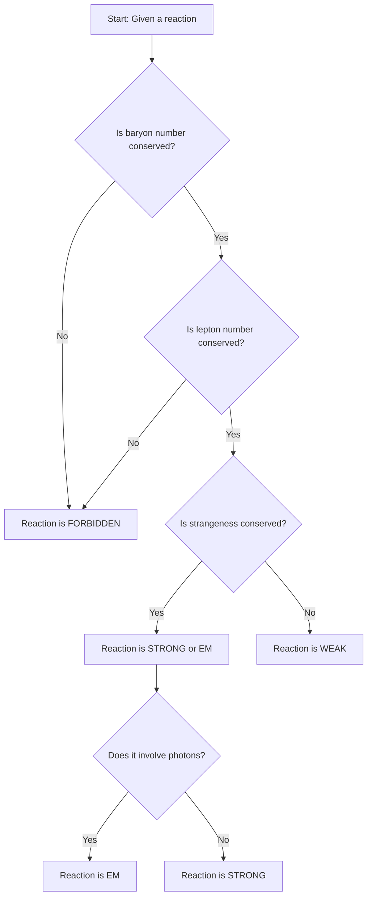
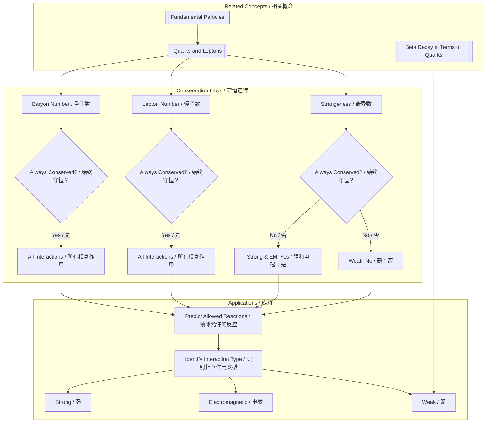

---
# Conservation Laws (Baryon Number, Lepton Number, Strangeness) / 守恒定律（重子数、轻子数、奇异数）

---

# 1. Overview / 概述

**English:**
This sub-topic introduces the fundamental conservation laws that govern particle interactions and decays. In particle physics, certain quantities—**baryon number ($B$)**, **lepton number ($L$)**, and **strangeness ($S$)**—must be conserved in strong and electromagnetic interactions, but may be violated in weak interactions. Understanding these laws is essential for predicting whether a given reaction is allowed or forbidden, and for analyzing particle decays. This knowledge is built upon [[Fundamental Particles]] and is directly applied to [[Beta Decay in Terms of Quarks]] and [[Nuclear Fission and Fusion]].

**中文:**
本子知识点介绍支配粒子相互作用和衰变的基本守恒定律。在粒子物理学中，某些量——**重子数 ($B$)**、**轻子数 ($L$)** 和**奇异数 ($S$)**——在强相互作用和电磁相互作用中必须守恒，但在弱相互作用中可能被破坏。理解这些定律对于预测给定的反应是否允许以及分析粒子衰变至关重要。此知识建立在[[Fundamental Particles]]的基础上，并直接应用于[[Beta Decay in Terms of Quarks]]和[[Nuclear Fission and Fusion]]。

---

# 2. Syllabus Learning Objectives / 考纲学习目标

| CAIE 9702 (24.2 a-f) | Edexcel IAL (WPH14 U4: 9.7-9.12) |
|-----------|-------------|
| State and apply the conservation laws for baryon number, lepton number, and strangeness. | Understand that baryon number, lepton number, and strangeness are conserved in strong and electromagnetic interactions, but may not be conserved in weak interactions. |
| Apply these laws to determine whether a particle interaction or decay is allowed. | Apply conservation laws to predict the products of particle reactions and decays. |
| Understand that strangeness is conserved in strong interactions but not in weak interactions. | Understand the concept of strangeness and its non-conservation in weak interactions. |
| Use these laws to identify the nature of an interaction (strong, weak, or electromagnetic). | Use conservation laws to distinguish between different types of fundamental interactions. |

**Examiner Expectations / 考官期望:**
- **English:** You must be able to calculate the total baryon number, lepton number, and strangeness before and after a reaction. If any of these quantities (except strangeness in weak interactions) are not conserved, the reaction is forbidden. You should also be able to deduce the type of interaction from the conservation or violation of strangeness.
- **中文:** 你必须能够计算反应前后总重子数、轻子数和奇异数。如果这些量中的任何一个（弱相互作用中的奇异数除外）不守恒，则该反应被禁止。你还应该能够根据奇异数的守恒或破坏来推断相互作用的类型。

---

# 3. Core Definitions / 核心定义

| Term (EN/CN) | Definition (EN) | Definition (CN) | Common Mistakes / 常见错误 |
|--------------|-----------------|-----------------|---------------------------|
| **Baryon Number ($B$)** / 重子数 ($B$) | A conserved quantum number; $B = +1/3$ for quarks, $B = -1/3$ for antiquarks; $B = +1$ for baryons (3 quarks), $B = -1$ for antibaryons; $B = 0$ for mesons and leptons. | 一个守恒的量子数；夸克的 $B = +1/3$，反夸克的 $B = -1/3$；重子（3个夸克）的 $B = +1$，反重子的 $B = -1$；介子和轻子的 $B = 0$。 | Confusing baryon number with baryon mass. Forgetting that mesons have $B=0$. |
| **Lepton Number ($L$)** / 轻子数 ($L$) | A conserved quantum number; $L = +1$ for leptons (e⁻, μ⁻, τ⁻, νₑ, ν_μ, ν_τ), $L = -1$ for antileptons; $L = 0$ for all other particles. | 一个守恒的量子数；轻子（e⁻, μ⁻, τ⁻, νₑ, ν_μ, ν_τ）的 $L = +1$，反轻子的 $L = -1$；所有其他粒子的 $L = 0$。 | Forgetting that neutrinos have lepton number. Not applying lepton number conservation to neutrino reactions. |
| **Strangeness ($S$)** / 奇异数 ($S$) | A quantum number conserved in strong and electromagnetic interactions but not in weak interactions; $S = -1$ for strange quarks (s), $S = +1$ for strange antiquarks (s̄); $S = 0$ for non-strange particles. | 一个在强相互作用和电磁相互作用中守恒但在弱相互作用中不守恒的量子数；奇异夸克 (s) 的 $S = -1$，奇异反夸克 (s̄) 的 $S = +1$；非奇异粒子的 $S = 0$。 | Assuming strangeness is always conserved. Not recognizing that strangeness change in weak interactions is $\Delta S = \pm 1$. |
| **Conservation Law** / 守恒定律 | A principle stating that a particular measurable property of an isolated physical system does not change as the system evolves over time. | 一个原理，指出孤立物理系统的某个特定可测量属性不会随着系统随时间演化而改变。 | Applying conservation laws to non-isolated systems. |
| **Allowed Reaction** / 允许的反应 | A reaction that satisfies all applicable conservation laws (energy, momentum, charge, baryon number, lepton number, and, for strong/EM, strangeness). | 一个满足所有适用守恒定律（能量、动量、电荷、重子数、轻子数，以及对于强/电磁相互作用的奇异数）的反应。 | Only checking charge conservation. |

---

# 4. Key Concepts Explained / 关键概念详解

## 4.1 Baryon Number Conservation / 重子数守恒

### Explanation / 解释
**English:** Baryon number ($B$) is a strictly conserved quantity in all known particle interactions (strong, electromagnetic, and weak). The total baryon number before a reaction must equal the total baryon number after the reaction. This law explains why the proton, the lightest baryon, is stable (it cannot decay into lighter particles without violating baryon number conservation). For example, in the decay of a neutron ($n \rightarrow p + e^- + \bar{\nu}_e$), the baryon number is conserved: $B(n) = +1$, $B(p) = +1$, $B(e^-) = 0$, $B(\bar{\nu}_e) = 0$. The total $B$ before is $+1$, and after is $+1$.

**中文:** 重子数 ($B$) 在所有已知的粒子相互作用（强、电磁和弱）中是一个严格守恒的量。反应前的总重子数必须等于反应后的总重子数。这个定律解释了为什么质子（最轻的重子）是稳定的（它不能衰变成更轻的粒子而不违反重子数守恒）。例如，在中子衰变 ($n \rightarrow p + e^- + \bar{\nu}_e$) 中，重子数是守恒的：$B(n) = +1$, $B(p) = +1$, $B(e^-) = 0$, $B(\bar{\nu}_e) = 0$。反应前的总 $B$ 是 $+1$，反应后也是 $+1$。

### Physical Meaning / 物理意义
**English:** Baryon number conservation implies that the number of quarks minus the number of antiquarks is conserved modulo 3. This is because each baryon contains 3 quarks, and each antibaryon contains 3 antiquarks. It prevents the spontaneous creation or destruction of baryons without corresponding antibaryons.

**中文:** 重子数守恒意味着夸克数减去反夸克数模3是守恒的。这是因为每个重子包含3个夸克，每个反重子包含3个反夸克。它阻止了在没有相应反重子的情况下自发产生或湮灭重子。

### Common Misconceptions / 常见误区
- **English:** Thinking that baryon number is the same as mass or charge. It is a separate, abstract quantum number.
- **中文:** 认为重子数与质量或电荷相同。它是一个独立的、抽象的量子数。
- **English:** Forgetting that mesons (quark-antiquark pairs) have $B=0$.
- **中文:** 忘记介子（夸克-反夸克对）的 $B=0$。

### Exam Tips / 考试提示
- **English:** Always calculate the total baryon number on both sides of the equation. If they don't match, the reaction is forbidden.
- **中文:** 始终计算方程两边的总重子数。如果不匹配，则反应被禁止。

## 4.2 Lepton Number Conservation / 轻子数守恒

### Explanation / 解释
**English:** Lepton number ($L$) is also a strictly conserved quantity in all known interactions. The total lepton number before a reaction must equal the total lepton number after the reaction. This law is crucial for understanding beta decay and neutrino interactions. For example, in the decay $\mu^- \rightarrow e^- + \bar{\nu}_e + \nu_\mu$, the lepton number is conserved: $L(\mu^-) = +1$, $L(e^-) = +1$, $L(\bar{\nu}_e) = -1$, $L(\nu_\mu) = +1$. Total $L$ before is $+1$, and after is $+1 + (-1) + (+1) = +1$.

**中文:** 轻子数 ($L$) 在所有已知的相互作用中也是一个严格守恒的量。反应前的总轻子数必须等于反应后的总轻子数。这个定律对于理解β衰变和中微子相互作用至关重要。例如，在衰变 $\mu^- \rightarrow e^- + \bar{\nu}_e + \nu_\mu$ 中，轻子数是守恒的：$L(\mu^-) = +1$, $L(e^-) = +1$, $L(\bar{\nu}_e) = -1$, $L(\nu_\mu) = +1$。反应前的总 $L$ 是 $+1$，反应后是 $+1 + (-1) + (+1) = +1$。

### Physical Meaning / 物理意义
**English:** Lepton number conservation ensures that leptons are only created or destroyed in particle-antiparticle pairs. This is why a neutron decay produces an electron and an antineutrino (not a neutrino), and why a muon decay produces a muon neutrino and an electron antineutrino.

**中文:** 轻子数守恒确保轻子只能以粒子-反粒子对的形式产生或湮灭。这就是为什么中子衰变会产生一个电子和一个反中微子（而不是中微子），以及为什么μ子衰变会产生一个μ子中微子和一个电子反中微子。

### Common Misconceptions / 常见误区
- **English:** Forgetting that antileptons have $L = -1$.
- **中文:** 忘记反轻子的 $L = -1$。
- **English:** Not distinguishing between different types of leptons (electron, muon, tau) and their associated neutrinos. In some advanced contexts, separate lepton family numbers ($L_e, L_\mu, L_\tau$) are conserved.
- **中文:** 没有区分不同类型的轻子（电子、μ子、τ子）及其相关的中微子。在一些高级语境中，单独的轻子家族数 ($L_e, L_\mu, L_\tau$) 是守恒的。

### Exam Tips / 考试提示
- **English:** Pay close attention to neutrinos and antineutrinos. They are the key to lepton number conservation in weak decays.
- **中文:** 密切关注中微子和反中微子。它们是弱衰变中轻子数守恒的关键。

## 4.3 Strangeness Conservation and Violation / 奇异数守恒与破坏

### Explanation / 解释
**English:** Strangeness ($S$) is a quantum number associated with the strange quark (s). It is conserved in strong and electromagnetic interactions but **not** conserved in weak interactions. This is a key distinction between the fundamental forces. For example, the strong interaction $K^- + p \rightarrow \Sigma^0 + \pi^0$ is allowed because strangeness is conserved: $S(K^-) = -1$, $S(p) = 0$, $S(\Sigma^0) = -1$, $S(\pi^0) = 0$. Total $S$ before is $-1$, and after is $-1$. However, the weak decay $\Lambda^0 \rightarrow p + \pi^-$ violates strangeness: $S(\Lambda^0) = -1$, $S(p) = 0$, $S(\pi^-) = 0$. Total $S$ before is $-1$, and after is $0$. This decay is allowed because it is a weak interaction.

**中文:** 奇异数 ($S$) 是一个与奇异夸克 (s) 相关的量子数。它在强相互作用和电磁相互作用中守恒，但在弱相互作用中**不**守恒。这是基本力之间的一个关键区别。例如，强相互作用 $K^- + p \rightarrow \Sigma^0 + \pi^0$ 是允许的，因为奇异数守恒：$S(K^-) = -1$, $S(p) = 0$, $S(\Sigma^0) = -1$, $S(\pi^0) = 0$。反应前的总 $S$ 是 $-1$，反应后也是 $-1$。然而，弱衰变 $\Lambda^0 \rightarrow p + \pi^-$ 违反了奇异数：$S(\Lambda^0) = -1$, $S(p) = 0$, $S(\pi^-) = 0$。反应前的总 $S$ 是 $-1$，反应后是 $0$。这个衰变是允许的，因为它是一个弱相互作用。

### Physical Meaning / 物理意义
**English:** The non-conservation of strangeness in weak interactions is a direct consequence of the fact that the weak force can change the flavor of quarks (e.g., an s quark can change into a u quark). Strong and electromagnetic interactions cannot change quark flavor.

**中文:** 弱相互作用中奇异数不守恒是弱力可以改变夸克味（例如，s夸克可以变成u夸克）这一事实的直接结果。强相互作用和电磁相互作用不能改变夸克味。

### Common Misconceptions / 常见误区
- **English:** Thinking that strangeness is always conserved. It is only conserved in strong and electromagnetic interactions.
- **中文:** 认为奇异数总是守恒的。它只在强相互作用和电磁相互作用中守恒。
- **English:** Not knowing the strangeness values of common particles (e.g., $K^+$, $K^-$, $\Lambda^0$, $\Sigma^+$, $\Xi^-$).
- **中文:** 不知道常见粒子（例如 $K^+$, $K^-$, $\Lambda^0$, $\Sigma^+$, $\Xi^-$）的奇异数值。

### Exam Tips / 考试提示
- **English:** If a reaction conserves strangeness, it is likely a strong or electromagnetic interaction. If it violates strangeness, it must be a weak interaction. This is a common exam question.
- **中文:** 如果一个反应守恒奇异数，它很可能是一个强相互作用或电磁相互作用。如果它违反奇异数，它一定是一个弱相互作用。这是一个常见的考试问题。

> 📷 **IMAGE PROMPT — DIAGRAM: Conservation Laws Summary**
> A clear, colorful infographic showing three panels: "Baryon Number (B)", "Lepton Number (L)", and "Strangeness (S)". Each panel has a simple icon (e.g., a proton for B, an electron for L, a kaon for S). Below each icon, a table or flowchart shows: "Conserved in: Strong, EM, Weak" for B and L, and "Conserved in: Strong, EM; NOT conserved in Weak" for S. Use arrows and checkmarks/crosses to visually represent the rules.

---

# 5. Essential Equations / 核心公式

## 5.1 Baryon Number Conservation / 重子数守恒

$$ \sum B_{\text{before}} = \sum B_{\text{after}} $$

| Symbol (符号) | Meaning (EN) | Meaning (CN) | Unit (单位) |
|--------------|-------------|-------------|------------|
| $\sum B_{\text{before}}$ | Total baryon number before the reaction | 反应前的总重子数 | dimensionless (无量纲) |
| $\sum B_{\text{after}}$ | Total baryon number after the reaction | 反应后的总重子数 | dimensionless (无量纲) |

**Conditions / 适用条件:** Always conserved in all interactions. | 在所有相互作用中始终守恒。
**Limitations / 局限性:** None. | 无。

## 5.2 Lepton Number Conservation / 轻子数守恒

$$ \sum L_{\text{before}} = \sum L_{\text{after}} $$

| Symbol (符号) | Meaning (EN) | Meaning (CN) | Unit (单位) |
|--------------|-------------|-------------|------------|
| $\sum L_{\text{before}}$ | Total lepton number before the reaction | 反应前的总轻子数 | dimensionless (无量纲) |
| $\sum L_{\text{after}}$ | Total lepton number after the reaction | 反应后的总轻子数 | dimensionless (无量纲) |

**Conditions / 适用条件:** Always conserved in all interactions. | 在所有相互作用中始终守恒。
**Limitations / 局限性:** None. | 无。

## 5.3 Strangeness Conservation / 奇异数守恒

$$ \sum S_{\text{before}} = \sum S_{\text{after}} \quad \text{(for strong and EM interactions)} $$

$$ \sum S_{\text{before}} \neq \sum S_{\text{after}} \quad \text{(possible for weak interactions)} $$

| Symbol (符号) | Meaning (EN) | Meaning (CN) | Unit (单位) |
|--------------|-------------|-------------|------------|
| $\sum S_{\text{before}}$ | Total strangeness before the reaction | 反应前的总奇异数 | dimensionless (无量纲) |
| $\sum S_{\text{after}}$ | Total strangeness after the reaction | 反应后的总奇异数 | dimensionless (无量纲) |

**Conditions / 适用条件:** Conserved in strong and EM interactions; may be violated in weak interactions. | 在强相互作用和电磁相互作用中守恒；在弱相互作用中可能被破坏。
**Limitations / 局限性:** The change in strangeness in a weak interaction is typically $\Delta S = \pm 1$. | 弱相互作用中奇异数的变化通常是 $\Delta S = \pm 1$。

> 📷 **IMAGE PROMPT — DIAGRAM: Strangeness in Strong vs Weak Interactions**
> A split diagram. Left side: "Strong Interaction" with two particles colliding (e.g., K⁻ + p). Arrows show that the strange quark (s) is simply transferred, so strangeness is conserved. Right side: "Weak Interaction" with a particle decaying (e.g., Λ⁰ → p + π⁻). An arrow shows the s quark changing into a u quark via the weak force, emitting a W⁻ boson. The strangeness changes from -1 to 0.

---

# 6. Graphs and Relationships / 图表与关系

There are no standard graphs for conservation laws. The relationships are algebraic and logical. However, a decision tree is very useful.

## 6.1 Decision Tree for Identifying Interaction Type / 识别相互作用类型的决策树

### Description / 描述
**English:** A flowchart to determine whether a reaction is strong, electromagnetic, or weak based on conservation laws.
**中文:** 一个基于守恒定律确定反应是强、电磁还是弱相互作用的流程图。

### Mermaid Diagram / Mermaid 图表

### Exam Interpretation / 考试解读
- **English:** This decision tree is a powerful tool for exam questions. Always check baryon and lepton number first. If they are conserved, then check strangeness to distinguish between strong/EM and weak interactions.
- **中文:** 这个决策树是回答考试问题的有力工具。始终先检查重子数和轻子数。如果它们守恒，则检查奇异数以区分强/电磁相互作用和弱相互作用。

---

# 7. Required Diagrams / 必备图表

## 7.1 Feynman Diagram for Beta Minus Decay / β⁻衰变的费曼图

### Description / 描述
**English:** A Feynman diagram showing the weak interaction responsible for beta-minus decay, illustrating the change of a down quark to an up quark via the exchange of a W⁻ boson.
**中文:** 一个费曼图，展示了导致β⁻衰变的弱相互作用，说明了通过交换W⁻玻色子，下夸克变为上夸克的过程。

### Image Prompt / 图片生成提示
> 📷 **IMAGE PROMPT — DIAGRAM: Feynman Diagram for Beta Minus Decay**
> A clear, labeled Feynman diagram. Time flows upwards. On the left, a neutron (n) is shown, composed of three quarks (udd). One of the down quarks (d) emits a W⁻ boson (wavy line) and changes into an up quark (u). The W⁻ boson then decays into an electron (e⁻) and an electron antineutrino (ν̄ₑ). On the right, the resulting proton (p) is shown, composed of three quarks (uud). All particles are labeled. The weak interaction vertex is highlighted.

### Labels Required / 需要标注
- **English:** Neutron (n), Proton (p), Down quark (d), Up quark (u), W⁻ boson, Electron (e⁻), Electron antineutrino (ν̄ₑ), Time axis.
- **中文:** 中子 (n), 质子 (p), 下夸克 (d), 上夸克 (u), W⁻ 玻色子, 电子 (e⁻), 电子反中微子 (ν̄ₑ), 时间轴。

### Exam Importance / 考试重要性
- **English:** This diagram is essential for understanding how beta decay violates strangeness (it doesn't, but it illustrates quark flavor change) and how lepton number is conserved (an electron and an antineutrino are produced).
- **中文:** 这个图对于理解β衰变如何违反奇异数（它不违反，但它说明了夸克味的变化）以及轻子数如何守恒（产生了一个电子和一个反中微子）至关重要。

---

# 8. Worked Examples / 典型例题

## Example 1: Identifying Allowed Reactions / 识别允许的反应

### Question / 题目
**English:** Determine whether the following reaction is allowed or forbidden. If it is allowed, state the type of interaction (strong, weak, or electromagnetic).
$$ p + \bar{p} \rightarrow \pi^+ + \pi^- $$

**中文:** 判断以下反应是允许的还是禁止的。如果允许，说明相互作用的类型（强、弱或电磁）。
$$ p + \bar{p} \rightarrow \pi^+ + \pi^- $$

### Solution / 解答
**Step 1: Check Baryon Number / 检查重子数**
- Before: $B(p) = +1$, $B(\bar{p}) = -1$. Total $B = +1 + (-1) = 0$.
- After: $B(\pi^+) = 0$, $B(\pi^-) = 0$. Total $B = 0$.
- **Baryon number is conserved. / 重子数守恒。**

**Step 2: Check Lepton Number / 检查轻子数**
- Before: $L(p) = 0$, $L(\bar{p}) = 0$. Total $L = 0$.
- After: $L(\pi^+) = 0$, $L(\pi^-) = 0$. Total $L = 0$.
- **Lepton number is conserved. / 轻子数守恒。**

**Step 3: Check Strangeness / 检查奇异数**
- Before: $S(p) = 0$, $S(\bar{p}) = 0$. Total $S = 0$.
- After: $S(\pi^+) = 0$, $S(\pi^-) = 0$. Total $S = 0$.
- **Strangeness is conserved. / 奇异数守恒。**

**Step 4: Determine Interaction Type / 确定相互作用类型**
- Since all three quantities are conserved, the reaction is allowed. It is a strong or electromagnetic interaction. Since it involves a proton and antiproton annihilating to produce pions (no photons), it is a **strong interaction**.

### Final Answer / 最终答案
**Answer:** The reaction is allowed. It is a strong interaction. | **答案：** 该反应是允许的。它是一个强相互作用。

### Quick Tip / 提示
- **English:** Always check baryon and lepton number first. If they are not conserved, the reaction is forbidden regardless of strangeness.
- **中文:** 始终先检查重子数和轻子数。如果它们不守恒，无论奇异数如何，反应都是被禁止的。

## Example 2: Identifying Interaction Type from Strangeness / 从奇异数识别相互作用类型

### Question / 题目
**English:** A reaction is observed: $K^- + p \rightarrow \Lambda^0 + \pi^0$. Given that $S(K^-) = -1$, $S(p) = 0$, $S(\Lambda^0) = -1$, $S(\pi^0) = 0$, determine if this reaction is strong or weak.

**中文:** 观察到一个反应：$K^- + p \rightarrow \Lambda^0 + \pi^0$。已知 $S(K^-) = -1$, $S(p) = 0$, $S(\Lambda^0) = -1$, $S(\pi^0) = 0$，判断这个反应是强相互作用还是弱相互作用。

### Solution / 解答
**Step 1: Check Strangeness / 检查奇异数**
- Before: $S = -1 + 0 = -1$.
- After: $S = -1 + 0 = -1$.
- **Strangeness is conserved. / 奇异数守恒。**

**Step 2: Determine Interaction Type / 确定相互作用类型**
- Since strangeness is conserved, the reaction cannot be a weak interaction (which would violate strangeness). Therefore, it must be a **strong interaction**.

### Final Answer / 最终答案
**Answer:** The reaction is a strong interaction. | **答案：** 该反应是强相互作用。

### Quick Tip / 提示
- **English:** Conservation of strangeness is the key signature of a strong or electromagnetic interaction. Violation of strangeness is the key signature of a weak interaction.
- **中文:** 奇异数守恒是强相互作用或电磁相互作用的关键特征。奇异数不守恒是弱相互作用的关键特征。

---

# 9. Past Paper Question Types / 历年真题题型

| Question Type / 题型 | Frequency / 频率 | Difficulty / 难度 | Past Paper References / 真题索引 |
|----------------------|------------------|------------------|-------------------------------|
| **Calculation of total B, L, S** / 计算总B、L、S | High / 高 | Easy / 简单 | 📝 *待填入* |
| **Determining if a reaction is allowed** / 判断反应是否允许 | High / 高 | Medium / 中等 | 📝 *待填入* |
| **Identifying interaction type (strong/weak/EM)** / 识别相互作用类型（强/弱/电磁） | High / 高 | Medium / 中等 | 📝 *待填入* |
| **Feynman diagram interpretation** / 费曼图解读 | Medium / 中 | Hard / 困难 | 📝 *待填入* |

**Common Command Words / 常见指令词:**
- **English:** "State", "Explain", "Determine", "Show that", "Deduce", "Calculate".
- **中文:** "陈述", "解释", "确定", "证明", "推断", "计算"。

---

# 10. Practical Skills Connections / 实验技能链接

**English:**
While conservation laws are theoretical, they are verified through particle accelerator experiments. Practical skills include:
- **Data Analysis:** Analyzing tracks in a bubble chamber or detector to identify particles and their decays, then applying conservation laws to verify the interaction.
- **Graph Plotting:** Plotting invariant mass distributions to identify new particles (e.g., the discovery of the $\Omega^-$ baryon, which was predicted by conservation laws).
- **Uncertainties:** Understanding that conservation laws are exact, but experimental measurements have uncertainties that must be accounted for when identifying particles.

**中文:**
虽然守恒定律是理论性的，但它们通过粒子加速器实验得到验证。实验技能包括：
- **数据分析:** 分析气泡室或探测器中的径迹以识别粒子及其衰变，然后应用守恒定律来验证相互作用。
- **图表绘制:** 绘制不变质量分布以识别新粒子（例如，$\Omega^-$ 重子的发现，它是由守恒定律预测的）。
- **不确定性:** 理解守恒定律是精确的，但实验测量存在不确定性，在识别粒子时必须考虑这些不确定性。

---

# 11. Concept Map / 概念图谱

---

# 12. Quick Revision Sheet / 速查表

| Category / 类别 | Key Points / 要点 |
|----------------|------------------|
| **Definition / 定义** | **Baryon Number ($B$):** $+1/3$ for quarks, $+1$ for baryons, $0$ for mesons/leptons.   **Lepton Number ($L$):** $+1$ for leptons, $-1$ for antileptons.   **Strangeness ($S$):** $-1$ for s quark, $+1$ for s̄ quark. |
| **Key Formula / 核心公式** | $\sum B_{\text{before}} = \sum B_{\text{after}}$   $\sum L_{\text{before}} = \sum L_{\text{after}}$   $\sum S_{\text{before}} = \sum S_{\text{after}}$ (strong/EM only) |
| **Key Graph / 核心图表** | Decision Tree (see Section 6.1) |
| **Exam Tip / 考试提示** | 1. Always check $B$ and $L$ first. If violated, reaction is FORBIDDEN.   2. If $B$ and $L$ are conserved, check $S$.   3. $S$ conserved → Strong or EM interaction.   4. $S$ violated → Weak interaction.   5. Memorize $S$ values for $K$, $\Lambda$, $\Sigma$, $\Xi$ particles. |