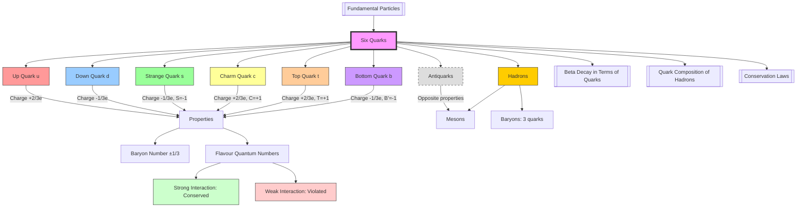

# 1. Overview / 概述

**English:**
This sub-topic introduces the **six quarks** — the fundamental building blocks of hadrons (protons, neutrons, mesons, etc.). Quarks are elementary particles that cannot exist in isolation due to **colour confinement**, but their properties (charge, baryon number, strangeness, charm, topness, bottomness) govern all strong interactions. Understanding the six quarks is essential for explaining [[Quark Composition of Hadrons]], [[Beta Decay in Terms of Quarks]], and [[Conservation Laws (Baryon Number, Lepton Number, Strangeness)]]. This sub-topic bridges [[Fundamental Particles]] (prerequisite) with [[Nuclear Fission and Fusion]] (related topic) by showing how quark transformations drive nuclear processes.

**中文:**
本子知识点介绍**六种夸克**——强子（质子、中子、介子等）的基本组成单元。夸克是基本粒子，由于**色禁闭**无法单独存在，但其性质（电荷、重子数、奇异数、粲数、顶数、底数）支配着所有强相互作用。理解六种夸克对于解释[[强子的夸克组成]]、[[以夸克视角看β衰变]]和[[守恒定律（重子数、轻子数、奇异数）]]至关重要。本子知识点连接[[基本粒子]]（先修知识）与[[核裂变与核聚变]]（相关主题），展示夸克转化如何驱动核过程。

---

# 2. Syllabus Learning Objectives / 考纲学习目标

| CAIE 9702 | Edexcel IAL |
|-----------|-------------|
| 24.2(a) Know the six types of quarks: up, down, strange, charm, top, bottom | 9.7 Know the six types of quarks and their properties (charge, baryon number, strangeness) |
| 24.2(b) Know the relative charges of quarks: up (+2/3e), down (-1/3e), strange (-1/3e), charm (+2/3e), top (+2/3e), bottom (-1/3e) | 9.8 Understand that quarks have fractional charges |
| 24.2(c) Know the baryon number of quarks: +1/3 for each quark | 9.9 Know the baryon number of quarks (+1/3) and antiquarks (-1/3) |
| 24.2(d) Know the strangeness of quarks: strange quark has strangeness -1 | 9.10 Understand strangeness as a quantum number conserved in strong interactions |
| 24.2(e) Understand that charm, top, and bottom quarks have their own quantum numbers (charm, topness, bottomness) | 9.11 Know that charm, top, and bottom quarks have associated quantum numbers |
| 24.2(f) Know that antiquarks have opposite properties to their corresponding quarks | 9.12 Understand that antiquarks have opposite quantum numbers to quarks |

**Examiner Expectations / 考官期望:**
- **CAIE:** Memorise all six quark types, their charges (±2/3e or ±1/3e), baryon number (±1/3), and strangeness (0 or -1 for strange). Be able to deduce quark composition of hadrons from these properties.
- **Edexcel:** Similar focus, with emphasis on applying conservation laws (baryon number, charge, strangeness) in particle reactions.

---

# 3. Core Definitions / 核心定义

| Term (EN/CN) | Definition (EN) | Definition (CN) | Common Mistakes / 常见错误 |
|--------------|-----------------|-----------------|---------------------------|
| **Quark** / 夸克 | A fundamental elementary particle that is a constituent of hadrons (baryons and mesons). Quarks have fractional electric charge (±1/3e or ±2/3e) and baryon number ±1/3. | 构成强子（重子和介子）的基本粒子。夸克具有分数电荷（±1/3e或±2/3e）和重子数±1/3。 | ❌ Thinking quarks can exist freely (they cannot due to colour confinement). |
| **Up Quark (u)** / 上夸克 | A quark with charge +2/3e, baryon number +1/3, and strangeness 0. The lightest quark (~2.3 MeV/c²). | 电荷+2/3e、重子数+1/3、奇异数0的夸克。最轻的夸克（约2.3 MeV/c²）。 | ❌ Confusing charge sign: up is +2/3e, not -2/3e. |
| **Down Quark (d)** / 下夸克 | A quark with charge -1/3e, baryon number +1/3, and strangeness 0. | 电荷-1/3e、重子数+1/3、奇异数0的夸克。 | ❌ Forgetting that down quark charge is -1/3e (negative). |
| **Strange Quark (s)** / 奇异夸克 | A quark with charge -1/3e, baryon number +1/3, and strangeness -1. Heavier than u and d (~95 MeV/c²). | 电荷-1/3e、重子数+1/3、奇异数-1的夸克。比u和d重（约95 MeV/c²）。 | ❌ Strangeness of strange quark is -1, not +1. |
| **Charm Quark (c)** / 粲夸克 | A quark with charge +2/3e, baryon number +1/3, and charm quantum number +1. Heavier (~1.28 GeV/c²). | 电荷+2/3e、重子数+1/3、粲量子数+1的夸克。较重（约1.28 GeV/c²）。 | ❌ Confusing charm with strangeness — they are separate quantum numbers. |
| **Top Quark (t)** / 顶夸克 | A quark with charge +2/3e, baryon number +1/3, and topness +1. The heaviest quark (~173 GeV/c²). | 电荷+2/3e、重子数+1/3、顶数+1的夸克。最重的夸克（约173 GeV/c²）。 | ❌ Forgetting that top quark decays too quickly to form hadrons. |
| **Bottom Quark (b)** / 底夸克 | A quark with charge -1/3e, baryon number +1/3, and bottomness -1. Heavy (~4.18 GeV/c²). | 电荷-1/3e、重子数+1/3、底数-1的夸克。较重（约4.18 GeV/c²）。 | ❌ Bottomness of bottom quark is -1, not +1. |
| **Antiquark** / 反夸克 | The antiparticle of a quark, with opposite charge, baryon number, and flavour quantum numbers (e.g., up antiquark ū has charge -2/3e, baryon number -1/3). | 夸克的反粒子，具有相反的电荷、重子数和味量子数（例如反上夸克ū电荷-2/3e、重子数-1/3）。 | ❌ Forgetting that antiquarks have opposite strangeness/charm/etc. |

> 📋 **CIE Only:** CAIE requires knowledge of all six quarks and their properties. Edexcel also covers all six but places more emphasis on up, down, and strange for A2.

---

# 4. Key Concepts Explained / 关键概念详解

## 4.1 Quark Flavours and Their Properties / 夸克味及其性质

### Explanation / 解释
**English:**
Quarks come in six "flavours" (types), grouped into three generations:
- **First generation:** up (u) and down (d) — the lightest, forming stable matter (protons and neutrons).
- **Second generation:** charm (c) and strange (s) — heavier, produced in high-energy collisions.
- **Third generation:** top (t) and bottom (b) — the heaviest, observed only at particle accelerators.

Each quark has:
- **Fractional electric charge:** +2/3e (u, c, t) or -1/3e (d, s, b).
- **Baryon number:** +1/3 for all quarks; -1/3 for all antiquarks.
- **Flavour quantum numbers:** strangeness (S), charm (C), topness (T), bottomness (B') — each is +1 for the quark and -1 for the antiquark, except for strange and bottom where the quark has -1.

**中文:**
夸克有六种"味"（类型），分为三代：
- **第一代：** 上夸克（u）和下夸克（d）——最轻，构成稳定物质（质子和中子）。
- **第二代：** 粲夸克（c）和奇异夸克（s）——较重，在高能碰撞中产生。
- **第三代：** 顶夸克（t）和底夸克（b）——最重，仅在粒子加速器中观测到。

每个夸克具有：
- **分数电荷：** +2/3e（u, c, t）或 -1/3e（d, s, b）。
- **重子数：** 所有夸克为+1/3；所有反夸克为-1/3。
- **味量子数：** 奇异数（S）、粲数（C）、顶数（T）、底数（B'）——夸克为+1、反夸克为-1，但奇异夸克和底夸克为-1。

### Physical Meaning / 物理意义
**English:**
Quark flavours are conserved in strong and electromagnetic interactions but can change via the weak interaction (e.g., in [[Beta Decay in Terms of Quarks]], a down quark transforms into an up quark). The mass hierarchy (u,d < s,c < b,t) explains why heavier quarks decay rapidly into lighter ones.

**中文:**
夸克味在强相互作用和电磁相互作用中守恒，但可通过弱相互作用改变（例如在[[以夸克视角看β衰变]]中，下夸克转化为上夸克）。质量层级（u,d < s,c < b,t）解释了为什么较重夸克迅速衰变为较轻夸克。

### Common Misconceptions / 常见误区
- ❌ **"Quarks have integer charge"** — No, they have fractional charge (±1/3e or ±2/3e).
- ❌ **"Strange quark has strangeness +1"** — No, strange quark has strangeness -1.
- ❌ **"All quarks have the same mass"** — No, masses vary enormously (u: ~2.3 MeV/c², t: ~173 GeV/c²).
- ❌ **"Top quark forms hadrons"** — No, it decays too quickly (lifetime ~5×10⁻²⁵ s) to bind.

### Exam Tips / 考试提示
- **EN:** Memorise the charge and baryon number of each quark. Use the mnemonic "Up = +2/3, Down = -1/3" for charge. For strangeness, remember: strange quark has S = -1.
- **中文:** 记住每个夸克的电荷和重子数。用口诀"上正三分之二，下负三分之一"记忆电荷。对于奇异数，记住：奇异夸克S = -1。

> 📷 **IMAGE PROMPT — Q01: Six Quark Properties Table**
> A clear table showing all six quarks (up, down, strange, charm, top, bottom) with columns: name, symbol, charge (in units of e), baryon number, strangeness, charm, topness, bottomness, and approximate mass. Use colour coding: red for +2/3e quarks, blue for -1/3e quarks. Include antiquark row for comparison.

---

## 4.2 Antiquarks / 反夸克

### Explanation / 解释
**English:**
Every quark has a corresponding antiquark (denoted by a bar: ū, d̄, s̄, c̄, t̄, b̄). Antiquarks have:
- **Opposite charge:** e.g., ū has charge -2/3e; d̄ has charge +1/3e.
- **Opposite baryon number:** -1/3.
- **Opposite flavour quantum numbers:** e.g., s̄ has strangeness +1; c̄ has charm -1.

Antiquarks combine with quarks to form mesons (e.g., π⁺ = u d̄).

**中文:**
每个夸克都有对应的反夸克（用上划线表示：ū, d̄, s̄, c̄, t̄, b̄）。反夸克具有：
- **相反的电荷：** 例如ū电荷-2/3e；d̄电荷+1/3e。
- **相反的重子数：** -1/3。
- **相反的味量子数：** 例如s̄奇异数+1；c̄粲数-1。

反夸克与夸克结合形成介子（例如π⁺ = u d̄）。

### Common Misconceptions / 常见误区
- ❌ **"Antiquarks have the same charge as quarks"** — No, they have opposite charge.
- ❌ **"Antiquarks have baryon number +1/3"** — No, they have -1/3.

### Exam Tips / 考试提示
- **EN:** When given a hadron's quark composition, always check if any are antiquarks — this affects charge and baryon number calculations.
- **中文：** 当给出强子的夸克组成时，始终检查是否有反夸克——这会影响电荷和重子数的计算。

---

## 4.3 Flavour Quantum Numbers / 味量子数

### Explanation / 解释
**English:**
Flavour quantum numbers (strangeness S, charm C, topness T, bottomness B') are conserved in strong and electromagnetic interactions but NOT in weak interactions. This explains why:
- **Strong interactions:** Strange particles are produced in pairs (e.g., K⁺ and K⁻) to conserve strangeness.
- **Weak interactions:** Strangeness can change by ±1 (e.g., Λ⁰ → p + π⁻, where S changes from -1 to 0).

**中文:**
味量子数（奇异数S、粲数C、顶数T、底数B'）在强相互作用和电磁相互作用中守恒，但在弱相互作用中不守恒。这解释了：
- **强相互作用：** 奇异粒子成对产生（例如K⁺和K⁻）以守恒奇异数。
- **弱相互作用：** 奇异数可以改变±1（例如Λ⁰ → p + π⁻，S从-1变为0）。

### Common Misconceptions / 常见误区
- ❌ **"Strangeness is conserved in all interactions"** — No, only in strong and electromagnetic; weak interactions can change it.
- ❌ **"Charm, topness, bottomness are conserved in weak interactions"** — No, they are also violated in weak interactions.

### Exam Tips / 考试提示
- **EN:** In exam questions, if a reaction involves neutrinos or W bosons, it's likely a weak interaction — flavour quantum numbers may not be conserved.
- **中文：** 在考试题中，如果反应涉及中微子或W玻色子，很可能是弱相互作用——味量子数可能不守恒。

> 📋 **Edexcel Only:** Edexcel places strong emphasis on strangeness conservation in strong interactions. Be prepared to calculate strangeness before and after a reaction.

---

# 5. Essential Equations / 核心公式

## 5.1 Quark Charge Equation / 夸克电荷方程

$$ Q = \frac{2}{3}e \quad \text{for u, c, t} \qquad Q = -\frac{1}{3}e \quad \text{for d, s, b} $$

| Symbol (符号) | Meaning (EN) | Meaning (CN) | Unit (单位) |
|--------------|-------------|-------------|------------|
| $Q$ | Electric charge | 电荷 | $e$ (elementary charge) |
| $e$ | Elementary charge (1.602×10⁻¹⁹ C) | 元电荷 | C |

**Conditions / 适用条件:** All quarks; antiquarks have opposite sign.
**Limitations / 局限性:** Quarks are never observed in isolation; charge is always inferred from hadron properties.

## 5.2 Baryon Number of Quarks / 夸克的重子数

$$ B = +\frac{1}{3} \quad \text{for quarks} \qquad B = -\frac{1}{3} \quad \text{for antiquarks} $$

| Symbol (符号) | Meaning (EN) | Meaning (CN) | Unit (单位) |
|--------------|-------------|-------------|------------|
| $B$ | Baryon number | 重子数 | dimensionless |

**Conditions / 适用条件:** All quarks and antiquarks.
**Limitations / 局限性:** Baryon number is conserved in all known interactions (strong, electromagnetic, weak).

## 5.3 Strangeness of Quarks / 夸克的奇异数

$$ S = -1 \quad \text{for strange quark (s)} \qquad S = 0 \quad \text{for all other quarks} $$

| Symbol (符号) | Meaning (EN) | Meaning (CN) | Unit (单位) |
|--------------|-------------|-------------|------------|
| $S$ | Strangeness | 奇异数 | dimensionless |

**Conditions / 适用条件:** Strange quark has S = -1; anti-strange quark (s̄) has S = +1.
**Limitations / 局限性:** Strangeness is conserved in strong and electromagnetic interactions, but not in weak interactions.

## 5.4 Charm, Topness, Bottomness / 粲数、顶数、底数

$$ C = +1 \quad \text{for charm quark (c)} \qquad T = +1 \quad \text{for top quark (t)} \qquad B' = -1 \quad \text{for bottom quark (b)} $$

| Symbol (符号) | Meaning (EN) | Meaning (CN) | Unit (单位) |
|--------------|-------------|-------------|------------|
| $C$ | Charm quantum number | 粲量子数 | dimensionless |
| $T$ | Topness | 顶数 | dimensionless |
| $B'$ | Bottomness | 底数 | dimensionless |

**Conditions / 适用条件:** Charm quark has C = +1; top quark has T = +1; bottom quark has B' = -1. Antiquarks have opposite signs.
**Limitations / 局限性:** These quantum numbers are conserved in strong and electromagnetic interactions, but violated in weak interactions.

> 📷 **IMAGE PROMPT — Q02: Quark Properties Summary Diagram**
> A visual summary showing all six quarks arranged in three generations (columns: 1st, 2nd, 3rd; rows: +2/3e quarks on top, -1/3e quarks on bottom). Each quark shown as a coloured circle with charge, baryon number, and flavour quantum number labels. Include antiquark counterparts with opposite signs.

---

# 6. Graphs and Relationships / 图表与关系

## 6.1 Quark Mass Hierarchy / 夸克质量层级

### Axes / 坐标轴
- **X-axis:** Quark flavour (u, d, s, c, b, t) / 夸克味
- **Y-axis:** Mass (MeV/c²) — logarithmic scale / 质量（MeV/c²）——对数坐标

### Shape / 形状
**English:** The masses increase dramatically from first to third generation: u,d (~2-5 MeV/c²) → s (~95 MeV/c²) → c (~1.28 GeV/c²) → b (~4.18 GeV/c²) → t (~173 GeV/c²). The top quark is about 75,000 times heavier than the up quark.

**中文：** 质量从第一代到第三代急剧增加：u,d（约2-5 MeV/c²）→ s（约95 MeV/c²）→ c（约1.28 GeV/c²）→ b（约4.18 GeV/c²）→ t（约173 GeV/c²）。顶夸克比上夸克重约75,000倍。

### Gradient Meaning / 斜率含义
**English:** Not applicable (discrete data points). The key observation is the exponential-like increase in mass across generations.

**中文：** 不适用（离散数据点）。关键观察是质量在代际间呈指数级增长。

### Area Meaning / 面积含义
**English:** Not applicable.

**中文：** 不适用。

### Exam Interpretation / 考试解读
**English:** You may be asked to compare masses or explain why heavier quarks decay into lighter ones. Remember: top quark is too heavy to form hadrons.

**中文：** 可能会被要求比较质量或解释为什么较重夸克衰变为较轻夸克。记住：顶夸克太重，无法形成强子。

> 📷 **IMAGE PROMPT — Q03: Quark Mass Bar Chart**
> A bar chart (logarithmic scale) showing the masses of all six quarks in MeV/c². Use different colours for each generation (1st: green, 2nd: orange, 3rd: red). Include numerical labels on each bar. Title: "Quark Mass Hierarchy".

---

# 7. Required Diagrams / 必备图表

## 7.1 Quark Properties Table / 夸克性质表

### Description / 描述
**English:** A comprehensive table listing all six quarks and their corresponding antiquarks, with columns for symbol, charge (in units of e), baryon number, strangeness, charm, topness, bottomness, and approximate mass.

**中文：** 一个全面的表格，列出所有六种夸克及其对应的反夸克，包含符号、电荷（以e为单位）、重子数、奇异数、粲数、顶数、底数和近似质量等列。

### Image Prompt / 图片生成提示
> 📷 **IMAGE PROMPT — Q04: Complete Quark Properties Table**
> A clean, professional table with 8 columns: Quark/Antiquark, Symbol, Charge (e), Baryon Number, Strangeness (S), Charm (C), Topness (T), Bottomness (B'), Mass (MeV/c²). Rows: u, d, s, c, b, t, ū, d̄, s̄, c̄, b̄, t̄. Use colour coding: red for +2/3e quarks, blue for -1/3e quarks, grey for antiquarks. Include a note: "Antiquarks have opposite quantum numbers to their corresponding quarks."

### Labels Required / 需要标注
- **EN:** Quark/Antiquark, Symbol, Charge, Baryon Number, Strangeness, Charm, Topness, Bottomness, Mass
- **中文：** 夸克/反夸克、符号、电荷、重子数、奇异数、粲数、顶数、底数、质量

### Exam Importance / 考试重要性
**English:** High — this table is essential for solving any problem involving quark composition of hadrons or conservation laws.

**中文：** 高——这个表格对于解决任何涉及强子夸克组成或守恒定律的问题至关重要。

---

## 7.2 Quark Generation Diagram / 夸克代际图

### Description / 描述
**English:** A diagram showing the three generations of quarks, arranged in two rows: +2/3e quarks (u, c, t) on top and -1/3e quarks (d, s, b) on bottom. Arrows indicate decay pathways (heavier → lighter).

**中文：** 一个显示三代夸克的图表，排列成两行：+2/3e夸克（u, c, t）在上，-1/3e夸克（d, s, b）在下。箭头表示衰变路径（较重→较轻）。

### Image Prompt / 图片生成提示
> 📷 **IMAGE PROMPT — Q05: Three Generations of Quarks**
> A diagram with three columns (Generation 1, 2, 3) and two rows. Top row: up (u), charm (c), top (t) — all labelled with charge +2/3e. Bottom row: down (d), strange (s), bottom (b) — all labelled with charge -1/3e. Use coloured circles for each quark. Add downward arrows showing decay: t → b, c → s, b → c, s → u. Title: "Quark Generations and Decay Pathways".

### Labels Required / 需要标注
- **EN:** Generation 1, 2, 3; up, down, charm, strange, top, bottom; charge values; decay arrows
- **中文：** 第一代、第二代、第三代；上、下、粲、奇异、顶、底；电荷值；衰变箭头

### Exam Importance / 考试重要性
**English:** Medium — helps visualise the quark family and decay hierarchy.

**中文：** 中等——有助于可视化夸克家族和衰变层级。

---

# 8. Worked Examples / 典型例题

## Example 1: Identifying Quark Properties / 例1：识别夸克性质

### Question / 题目
**English:**
A particle contains a strange quark (s) and an up antiquark (ū). Determine:
(a) The total charge of the particle.
(b) The total baryon number.
(c) The strangeness.

**中文：**
一个粒子包含一个奇异夸克（s）和一个反上夸克（ū）。确定：
(a) 粒子的总电荷。
(b) 总重子数。
(c) 奇异数。

### Solution / 解答

**Step 1: List properties of each quark / 列出每个夸克的性质**

| Quark | Charge (e) | Baryon Number | Strangeness |
|-------|-----------|---------------|-------------|
| s | -1/3 | +1/3 | -1 |
| ū | -2/3 | -1/3 | 0 |

**Step 2: Calculate total charge / 计算总电荷**

$$ Q_{\text{total}} = Q_s + Q_{\bar{u}} = \left(-\frac{1}{3}e\right) + \left(-\frac{2}{3}e\right) = -e $$

**Step 3: Calculate total baryon number / 计算总重子数**

$$ B_{\text{total}} = B_s + B_{\bar{u}} = \left(+\frac{1}{3}\right) + \left(-\frac{1}{3}\right) = 0 $$

**Step 4: Calculate strangeness / 计算奇异数**

$$ S_{\text{total}} = S_s + S_{\bar{u}} = (-1) + 0 = -1 $$

### Final Answer / 最终答案
**Answer:** (a) -e; (b) 0; (c) -1 | **答案：** (a) -e；(b) 0；(c) -1

### Quick Tip / 提示
**EN:** This particle is a kaon (K⁻). Baryon number = 0 identifies it as a meson (quark + antiquark).
**中文：** 这个粒子是K⁻介子。重子数=0表明它是介子（夸克+反夸克）。

---

## Example 2: Quark Transformation in Beta Decay / 例2：β衰变中的夸克转化

### Question / 题目
**English:**
In beta-minus (β⁻) decay, a neutron (udd) transforms into a proton (uud). Show this process in terms of quarks and determine the change in strangeness.

**中文：**
在β⁻衰变中，中子（udd）转化为质子（uud）。用夸克表示这个过程并确定奇异数的变化。

### Solution / 解答

**Step 1: Write quark compositions / 写出夸克组成**

$$ \text{Neutron: } n = udd \quad \text{Proton: } p = uud $$

**Step 2: Identify the change / 识别变化**

$$ udd \rightarrow uud \quad \text{One down quark changes to an up quark: } d \rightarrow u $$

**Step 3: Determine strangeness change / 确定奇异数变化**

Both down and up quarks have strangeness S = 0. Therefore:

$$ \Delta S = S_{\text{final}} - S_{\text{initial}} = 0 - 0 = 0 $$

**Step 4: Explain the interaction type / 解释相互作用类型**

This is a weak interaction (involving a W⁻ boson: d → u + W⁻ → u + e⁻ + ν̄ₑ). Strangeness is conserved here because no strange quarks are involved, but weak interactions can change flavour quantum numbers in general.

### Final Answer / 最终答案
**Answer:** A down quark transforms into an up quark via the weak interaction. Strangeness change ΔS = 0. | **答案：** 下夸克通过弱相互作用转化为上夸克。奇异数变化ΔS = 0。

### Quick Tip / 提示
**EN:** In beta decay, the weak interaction changes quark flavour (d → u). This is why strangeness can change in weak interactions involving strange quarks.
**中文：** 在β衰变中，弱相互作用改变夸克味（d → u）。这就是为什么在涉及奇异夸克的弱相互作用中奇异数可以改变。

---

# 9. Past Paper Question Types / 历年真题题型

| Question Type / 题型 | Frequency / 频率 | Difficulty / 难度 | Past Paper References / 真题索引 |
|----------------------|------------------|------------------|-------------------------------|
| **Quark property recall** / 夸克性质回忆 | High | Easy | 📝 *待填入* |
| **Quark composition of hadrons** / 强子的夸克组成 | High | Medium | 📝 *待填入* |
| **Conservation laws with quarks** / 夸克守恒定律 | Medium | Medium-Hard | 📝 *待填入* |
| **Beta decay in terms of quarks** / 以夸克视角看β衰变 | Medium | Medium | 📝 *待填入* |
| **Strangeness conservation** / 奇异数守恒 | Medium | Medium | 📝 *待填入* |
| **Antiquark properties** / 反夸克性质 | Low-Medium | Easy | 📝 *待填入* |

**Common Command Words / 常见指令词:**
- **EN:** State, Determine, Calculate, Show, Explain, Deduce
- **中文：** 写出、确定、计算、展示、解释、推导

---

# 10. Practical Skills Connections / 实验技能链接

**English:**
While quarks cannot be directly observed in school laboratories, this sub-topic connects to practical skills through:
- **Data analysis:** Interpreting particle tracks from cloud chambers or bubble chambers to identify particle decays (e.g., strange particle decays).
- **Conservation law verification:** Using quark properties to check whether proposed reactions conserve charge, baryon number, and strangeness.
- **Graphical interpretation:** Analysing mass-energy equivalence in particle collisions (E = mc²) to infer quark masses.
- **Experimental design:** Understanding how particle accelerators (e.g., LHC) produce heavy quarks (top, bottom) and how detectors identify them.

**中文：**
虽然夸克无法在学校实验室中直接观测，但本子知识点通过以下方式与实验技能联系：
- **数据分析：** 解释云室或气泡室中的粒子径迹，以识别粒子衰变（例如奇异粒子衰变）。
- **守恒定律验证：** 使用夸克性质检查提出的反应是否守恒电荷、重子数和奇异数。
- **图形解释：** 分析粒子碰撞中的质能等价（E = mc²）以推断夸克质量。
- **实验设计：** 理解粒子加速器（如LHC）如何产生重夸克（顶、底）以及探测器如何识别它们。

> 📋 **CIE Only:** CAIE Paper 5 may include questions on experimental evidence for quarks (e.g., deep inelastic scattering experiments at SLAC).

> 📋 **Edexcel Only:** Edexcel may ask about the discovery of the top quark at Fermilab (1995) as an example of experimental particle physics.

---

# 11. Concept Map / 概念图谱

---

# 12. Quick Revision Sheet / 速查表

| Category / 类别 | Key Points / 要点 |
|----------------|------------------|
| **Definition / 定义** | Quarks are fundamental particles with fractional charge (±1/3e or ±2/3e) and baryon number ±1/3. Six flavours: u, d, s, c, t, b. |
| **Key Formula / 核心公式** | Charge: u,c,t = +2/3e; d,s,b = -1/3e. Baryon number: quarks = +1/3; antiquarks = -1/3. Strangeness: s = -1; s̄ = +1. |
| **Key Graph / 核心图表** | Mass hierarchy: u,d (~2-5 MeV) → s (~95 MeV) → c (~1.28 GeV) → b (~4.18 GeV) → t (~173 GeV). Top quark is heaviest. |
| **Exam Tip / 考试提示** | Memorise all six quarks and their properties. For strangeness: strange quark has S = -1. Antiquarks have opposite quantum numbers. Strangeness conserved in strong interactions, violated in weak. |
| **Common Mistake / 常见错误** | ❌ Confusing charge signs (up = +2/3e, not -2/3e). ❌ Thinking strange quark has S = +1. ❌ Forgetting antiquarks have opposite baryon number. |
| **Key Connection / 关键联系** | [[Quark Composition of Hadrons]] — quarks combine to form baryons (3 quarks) and mesons (quark + antiquark). [[Beta Decay in Terms of Quarks]] — d → u via weak interaction. [[Conservation Laws (Baryon Number, Lepton Number, Strangeness)]] — apply to all particle reactions. |

---

> 📷 **IMAGE PROMPT — Q06: Quick Revision Summary Card**
> A visually appealing revision card with six coloured circles representing the six quarks (u: red, d: blue, s: green, c: yellow, t: orange, b: purple). Each circle shows the quark symbol, charge, and baryon number. Below, a summary box: "Antiquarks have opposite properties. Strangeness conserved in strong interactions only." Use a clean, modern design suitable for A-Level revision.