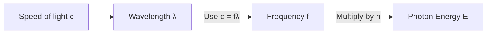
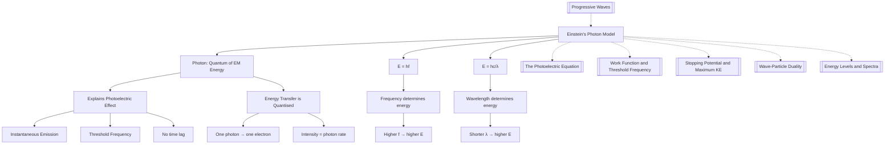

# 1. Overview / 概述

**English:**
Einstein's Photon Model revolutionised physics by proposing that light consists of discrete packets of energy called **photons**. This model successfully explained the [[Experimental Observations of the Photoelectric Effect]] that classical wave theory could not account for (see [[Failure of Classical Wave Theory]]). Each photon carries energy $E = hf$, where $h$ is Planck's constant and $f$ is the frequency of the electromagnetic radiation. This sub-topic forms the foundation of [[Wave-Particle Duality]] and is essential for understanding [[The Photoelectric Equation]], [[Work Function and Threshold Frequency]], and [[Stopping Potential and Maximum KE]].

**中文:**
爱因斯坦的光子模型彻底革新了物理学，提出光由称为**光子**的离散能量包组成。该模型成功解释了经典波动理论无法说明的[[光电效应的实验观察]]（参见[[经典波动理论的失败]]）。每个光子携带能量 $E = hf$，其中 $h$ 是普朗克常数，$f$ 是电磁辐射的频率。本子知识点构成了[[波粒二象性]]的基础，对于理解[[光电效应方程]]、[[逸出功与阈值频率]]以及[[遏止电势与最大动能]]至关重要。

---

# 2. Syllabus Learning Objectives / 考纲学习目标

| CAIE 9702 | Edexcel IAL |
|-----------|-------------|
| 22.1(a) Understand the concept of a photon as a quantum of electromagnetic energy | 7.1 Understand the photon model of electromagnetic radiation |
| 22.1(b) Recall and use the equation $E = hf$ | 7.2 Use $E = hf$ and $E = \frac{hc}{\lambda}$ |
| 22.1(c) Understand that the energy of a photon is proportional to its frequency | 7.3 Explain the photoelectric effect using the photon model |
| 22.1(d) Understand that photons travel at the speed of light in a vacuum | 7.4 Understand the concept of a photon as a quantum of energy |

**Examiner Expectations / 考官期望:**
- **CAIE:** Students must be able to recall $E = hf$ without prompting and apply it to calculate photon energy, frequency, and wavelength. Understanding that photon energy is quantised is critical.
- **Edexcel:** Students must explain how the photon model resolves the failures of classical wave theory, particularly the instantaneous emission and threshold frequency.

**中文:**
- **CAIE:** 学生必须能够无需提示地回忆 $E = hf$ 并应用于计算光子能量、频率和波长。理解光子能量是量子化的至关重要。
- **Edexcel:** 学生必须解释光子模型如何解决经典波动理论的失败，特别是瞬时发射和阈值频率。

---

# 3. Core Definitions / 核心定义

| Term (EN/CN) | Definition (EN) | Definition (CN) | Common Mistakes / 常见错误 |
|--------------|-----------------|-----------------|---------------------------|
| **Photon** / 光子 | A quantum (discrete packet) of electromagnetic radiation that carries energy proportional to its frequency. | 电磁辐射的量子（离散能量包），其能量与频率成正比。 | ❌ Thinking photons are "particles" in the classical sense — they are quanta with wave-like properties. |
| **Planck's constant ($h$)** / 普朗克常数 | A fundamental physical constant ($6.63 \times 10^{-34} \text{ J s}$) that relates the energy of a photon to its frequency. | 将光子能量与其频率联系起来的基本物理常数 ($6.63 \times 10^{-34} \text{ J s}$)。 | ❌ Forgetting units — it's J s, not J or s alone. |
| **Quantum (plural: quanta)** / 量子 | The smallest discrete unit of a physical quantity, such as energy. | 物理量的最小离散单位，如能量。 | ❌ Confusing "quantum" with "photon" — all photons are quanta, but not all quanta are photons. |
| **Electromagnetic spectrum** / 电磁波谱 | The range of all types of electromagnetic radiation, ordered by frequency and wavelength. | 按频率和波长排序的所有类型电磁辐射的范围。 | ❌ Forgetting that photon energy increases with frequency across the spectrum. |
| **Speed of light in vacuum ($c$)** / 真空中的光速 | The universal constant $3.00 \times 10^8 \text{ m s}^{-1}$ at which all electromagnetic radiation travels in a vacuum. | 所有电磁辐射在真空中传播的普适常数 $3.00 \times 10^8 \text{ m s}^{-1}$。 | ❌ Using $c$ for light in a medium — it's slower there. |

---

# 4. Key Concepts Explained / 关键概念详解

## 4.1 The Photon as a Quantum of Energy / 光子作为能量量子

### Explanation / 解释
**English:**
Einstein proposed that light is not a continuous wave but consists of discrete packets of energy called **photons**. Each photon has energy given by:

$$ E = hf $$

where $h = 6.63 \times 10^{-34} \text{ J s}$ is [[Planck's Constant]] and $f$ is the frequency of the radiation. Since $c = f\lambda$, we can also write:

$$ E = \frac{hc}{\lambda} $$

This means:
- Higher frequency → higher photon energy (e.g., ultraviolet photons are more energetic than infrared)
- Shorter wavelength → higher photon energy
- All photons of a given frequency have identical energy

**中文:**
爱因斯坦提出光不是连续波，而是由称为**光子**的离散能量包组成。每个光子的能量由下式给出：

$$ E = hf $$

其中 $h = 6.63 \times 10^{-34} \text{ J s}$ 是[[普朗克常数]]，$f$ 是辐射的频率。由于 $c = f\lambda$，我们也可以写成：

$$ E = \frac{hc}{\lambda} $$

这意味着：
- 频率越高 → 光子能量越大（例如，紫外光子比红外光子能量更高）
- 波长越短 → 光子能量越大
- 给定频率的所有光子具有相同的能量

### Physical Meaning / 物理意义
**English:**
The photon model implies that energy transfer between light and matter is **quantised** — it occurs in discrete "packets" rather than continuously. This explains why:
- A single electron can absorb only one photon at a time
- If a photon's energy is below the [[Work Function and Threshold Frequency|work function]], no electron is emitted regardless of light intensity
- Emission is instantaneous because energy is delivered in a single quantum

**中文:**
光子模型意味着光与物质之间的能量传递是**量子化**的——它以离散的"包"而非连续方式发生。这解释了为什么：
- 单个电子一次只能吸收一个光子
- 如果光子的能量低于[[逸出功与阈值频率|逸出功]]，无论光强度如何都不会发射电子
- 发射是瞬时的，因为能量以单个量子传递

### Common Misconceptions / 常见误区
- ❌ **"Photons are tiny particles like marbles"** — Photons have no mass and exhibit wave-like properties (diffraction, interference). They are quanta of the electromagnetic field.
- ❌ **"Photon energy depends on intensity"** — Intensity is the number of photons per second per unit area, not the energy of individual photons.
- ❌ **"Light always behaves as particles"** — The photon model applies to energy transfer; wave behaviour (e.g., interference) is observed in other contexts.

**中文:**
- ❌ **"光子像弹珠一样是微小粒子"** — 光子没有质量，表现出波动性质（衍射、干涉）。它们是电磁场的量子。
- ❌ **"光子能量取决于强度"** — 强度是每秒每单位面积的光子数量，而非单个光子的能量。
- ❌ **"光总是表现为粒子"** — 光子模型适用于能量传递；波动行为（如干涉）在其他情境中观察到。

### Exam Tips / 考试提示
**English:**
- Always write $E = hf$ or $E = \frac{hc}{\lambda}$ — never use $E = mc^2$ for photons (photons have zero rest mass)
- When calculating photon energy, ensure frequency is in Hz and wavelength in metres
- For multi-step problems, calculate photon energy first, then use [[The Photoelectric Equation]]

**中文:**
- 始终写 $E = hf$ 或 $E = \frac{hc}{\lambda}$ — 切勿对光子使用 $E = mc^2$（光子静止质量为零）
- 计算光子能量时，确保频率单位为 Hz，波长单位为米
- 对于多步骤问题，先计算光子能量，然后使用[[光电效应方程]]

> 📷 **IMAGE PROMPT — DIAGRAM-01: Photon Energy vs Frequency Graph**
> A clear graph showing photon energy (E) on the y-axis and frequency (f) on the x-axis. A straight line through the origin with gradient = h (Planck's constant). Label the axes with units (J and Hz). Show that higher frequency = higher energy. Include a small inset showing the relationship E = hf.

---

# 5. Essential Equations / 核心公式

## Equation 1: Photon Energy from Frequency

$$ E = hf $$

| Symbol (符号) | Meaning (EN) | Meaning (CN) | Unit (单位) |
|--------------|-------------|-------------|------------|
| $E$ | Energy of one photon | 单个光子的能量 | J (joules) |
| $h$ | Planck's constant ($6.63 \times 10^{-34}$) | 普朗克常数 | J s |
| $f$ | Frequency of electromagnetic radiation | 电磁辐射的频率 | Hz (s$^{-1}$) |

**Derivation / 推导:** This is a fundamental postulate of quantum theory — not derived from classical physics. Planck first introduced $h$ in 1900 to explain blackbody radiation; Einstein extended the concept to light quanta in 1905.

**Conditions / 适用条件:** Valid for all electromagnetic radiation in vacuum or any medium (frequency is the same in all media).

**Limitations / 局限性:** Does not account for the wave nature of light (e.g., interference patterns require wave superposition).

## Equation 2: Photon Energy from Wavelength

$$ E = \frac{hc}{\lambda} $$

| Symbol (符号) | Meaning (EN) | Meaning (CN) | Unit (单位) |
|--------------|-------------|-------------|------------|
| $c$ | Speed of light in vacuum ($3.00 \times 10^8$) | 真空中的光速 | m s$^{-1}$ |
| $\lambda$ | Wavelength of electromagnetic radiation | 电磁辐射的波长 | m |

**Derivation / 推导:** Substitute $f = \frac{c}{\lambda}$ into $E = hf$.

**Conditions / 适用条件:** Only valid in vacuum. In a medium, use $v = f\lambda$ where $v$ is the speed in that medium.

**Limitations / 局限性:** Wavelength changes when light enters a different medium; frequency remains constant.

> 📷 **IMAGE PROMPT — DIAGRAM-02: Electromagnetic Spectrum with Photon Energies**
> A visual representation of the electromagnetic spectrum from radio waves to gamma rays. For each region, show: wavelength range, frequency range, and corresponding photon energy range (in eV and J). Highlight that UV photons have higher energy than visible photons.

---

# 6. Graphs and Relationships / 图表与关系

## 6.1 Photon Energy vs Frequency / 光子能量与频率关系

### Axes / 坐标轴
- **x-axis:** Frequency $f$ (Hz) / 频率 $f$ (Hz)
- **y-axis:** Photon energy $E$ (J) / 光子能量 $E$ (J)

### Shape / 形状
A straight line passing through the origin with positive gradient.

### Gradient Meaning / 斜率含义
Gradient = $h$ (Planck's constant, $6.63 \times 10^{-34} \text{ J s}$)

### Area Meaning / 面积含义
No physical meaning — the graph is a direct proportionality.

### Exam Interpretation / 考试解读
**English:**
- The graph confirms $E \propto f$ — doubling frequency doubles photon energy
- The gradient is always $h$, regardless of the type of electromagnetic radiation
- A steeper line would imply a different value of Planck's constant (not possible in our universe)

**中文:**
- 该图确认 $E \propto f$ — 频率加倍则光子能量加倍
- 无论电磁辐射类型如何，斜率始终为 $h$
- 更陡的线意味着不同的普朗克常数值（在我们的宇宙中不可能）

---

# 7. Required Diagrams / 必备图表

## 7.1 Photon Absorption by an Electron / 电子吸收光子

### Description / 描述
**English:** A diagram showing a single photon approaching a metal surface and being absorbed by a single electron within the metal. The electron gains energy $hf$ from the photon. If $hf > \phi$ (work function), the electron is emitted.

**中文:** 显示单个光子接近金属表面并被金属内单个电子吸收的示意图。电子从光子获得能量 $hf$。如果 $hf > \phi$（逸出功），则电子被发射。

### Image Prompt / 图片生成提示
> 📷 **IMAGE PROMPT — DIAGRAM-03: Photon Absorption by Electron**
> A clean, educational diagram showing: (1) A photon (represented as a wavy arrow with label "photon, E = hf") approaching a metal surface. (2) Inside the metal, a single electron (blue circle with "e⁻") absorbs the photon. (3) The electron is ejected from the surface with kinetic energy. Labels: "Metal surface", "Photon energy hf", "Work function φ", "Ejected electron with KE". Use arrows to show energy transfer. Style: textbook-quality, minimal, clear.

### Labels Required / 需要标注
- Photon (with energy $hf$) / 光子（带能量 $hf$）
- Metal surface / 金属表面
- Electron (e⁻) / 电子
- Work function $\phi$ / 逸出功 $\phi$
- Kinetic energy of ejected electron / 发射电子的动能

### Exam Importance / 考试重要性
**English:** This diagram is essential for explaining how the photon model explains [[Experimental Observations of the Photoelectric Effect]]. It shows the one-to-one interaction between photon and electron.

**中文:** 该图对于解释光子模型如何说明[[光电效应的实验观察]]至关重要。它显示了光子与电子之间的一对一相互作用。

---

# 8. Worked Examples / 典型例题

## Example 1: Calculating Photon Energy / 计算光子能量

### Question / 题目
**English:**
Calculate the energy of a photon of ultraviolet light with wavelength $\lambda = 250 \text{ nm}$. Give your answer in:
(a) joules (J)
(b) electronvolts (eV)

Use $h = 6.63 \times 10^{-34} \text{ J s}$, $c = 3.00 \times 10^8 \text{ m s}^{-1}$, $1 \text{ eV} = 1.60 \times 10^{-19} \text{ J}$.

**中文:**
计算波长为 $\lambda = 250 \text{ nm}$ 的紫外光光子的能量。以以下单位给出答案：
(a) 焦耳 (J)
(b) 电子伏特 (eV)

使用 $h = 6.63 \times 10^{-34} \text{ J s}$，$c = 3.00 \times 10^8 \text{ m s}^{-1}$，$1 \text{ eV} = 1.60 \times 10^{-19} \text{ J}$。

### Solution / 解答

**Step 1: Convert wavelength to metres**
$$ \lambda = 250 \text{ nm} = 250 \times 10^{-9} \text{ m} = 2.50 \times 10^{-7} \text{ m} $$

**Step 2: Use $E = \frac{hc}{\lambda}$**
$$ E = \frac{(6.63 \times 10^{-34})(3.00 \times 10^8)}{2.50 \times 10^{-7}} $$

**Step 3: Calculate**
$$ E = \frac{1.989 \times 10^{-25}}{2.50 \times 10^{-7}} = 7.96 \times 10^{-19} \text{ J} $$

**Step 4: Convert to eV**
$$ E = \frac{7.96 \times 10^{-19}}{1.60 \times 10^{-19}} = 4.98 \text{ eV} $$

### Final Answer / 最终答案
**Answer:** (a) $7.96 \times 10^{-19} \text{ J}$ | (b) $4.98 \text{ eV}$ | **答案：** (a) $7.96 \times 10^{-19} \text{ J}$ | (b) $4.98 \text{ eV}$

### Quick Tip / 提示
**English:** Always convert nm to m by multiplying by $10^{-9}$. For quick checks, remember that visible light photons have energies around 1.8–3.1 eV (red to violet). UV photons are higher energy.

**中文:** 始终通过乘以 $10^{-9}$ 将 nm 转换为 m。快速检查时，记住可见光光子的能量约为 1.8–3.1 eV（红到紫）。紫外光子能量更高。

---

## Example 2: Comparing Photon Energies / 比较光子能量

### Question / 题目
**English:**
A radio wave has frequency $f = 100 \text{ MHz}$ and a gamma ray has frequency $f = 10^{20} \text{ Hz}$. Calculate the ratio of the gamma ray photon energy to the radio wave photon energy.

**中文:**
无线电波的频率为 $f = 100 \text{ MHz}$，伽马射线的频率为 $f = 10^{20} \text{ Hz}$。计算伽马射线光子能量与无线电波光子能量的比值。

### Solution / 解答

**Step 1: Write the ratio**
$$ \frac{E_{\text{gamma}}}{E_{\text{radio}}} = \frac{h f_{\text{gamma}}}{h f_{\text{radio}}} = \frac{f_{\text{gamma}}}{f_{\text{radio}}} $$

**Step 2: Convert radio frequency to Hz**
$$ f_{\text{radio}} = 100 \text{ MHz} = 100 \times 10^6 \text{ Hz} = 10^8 \text{ Hz} $$

**Step 3: Calculate ratio**
$$ \frac{E_{\text{gamma}}}{E_{\text{radio}}} = \frac{10^{20}}{10^8} = 10^{12} $$

### Final Answer / 最终答案
**Answer:** The gamma ray photon has $10^{12}$ times more energy than the radio wave photon. | **答案：** 伽马射线光子的能量是无线电波光子的 $10^{12}$ 倍。

### Quick Tip / 提示
**English:** Since $h$ cancels out, the ratio of photon energies equals the ratio of their frequencies. This is a quick way to compare energies without calculating absolute values.

**中文:** 由于 $h$ 被约掉，光子能量的比值等于它们频率的比值。这是无需计算绝对值即可比较能量的快速方法。

---

# 9. Past Paper Question Types / 历年真题题型

| Question Type / 题型 | Frequency / 频率 | Difficulty / 难度 | Past Paper References / 真题索引 |
|----------------------|------------------|------------------|-------------------------------|
| Calculate photon energy from frequency or wavelength | ★★★★★ | Easy | 📝 *待填入* |
| Explain how photon model explains photoelectric effect | ★★★★ | Medium | 📝 *待填入* |
| Compare photon energies across EM spectrum | ★★★ | Easy | 📝 *待填入* |
| Multi-step: photon energy → photoelectric equation | ★★★★ | Medium-Hard | 📝 *待填入* |
| Derive or manipulate $E = hf$ and $E = hc/\lambda$ | ★★ | Easy | 📝 *待填入* |

**Common Command Words / 常见指令词:**
- **Calculate / 计算** — Use $E = hf$ or $E = hc/\lambda$ with correct units
- **Explain / 解释** — Describe how the photon model accounts for experimental observations
- **State / 陈述** — Recall the equation or definition without derivation
- **Show that / 证明** — Manipulate equations to reach a given result

---

# 10. Practical Skills Connections / 实验技能链接

**English:**
While Einstein's photon model is theoretical, it connects to practical work in several ways:

1. **LED Experiment (CIE & Edexcel):** Use LEDs of different colours to determine Planck's constant. The threshold voltage $V_0$ at which an LED just begins to emit light relates to photon energy: $eV_0 = hf$. Plot $V_0$ vs $f$ to find $h$ from the gradient.

2. **Photoelectric Effect Experiment:** Measure stopping potential for different frequencies of light. Use $eV_s = hf - \phi$ to determine $h$ and $\phi$ experimentally.

3. **Uncertainties:** When calculating photon energy, propagate uncertainties in $f$ or $\lambda$. For example, if $\lambda = (500 \pm 2) \text{ nm}$, calculate the percentage uncertainty in $E$.

4. **Graph Plotting:** Plot $E$ vs $f$ — the gradient should be $h$. Assess linearity to verify the photon model.

**中文:**
虽然爱因斯坦的光子模型是理论性的，但它以多种方式与实验工作相联系：

1. **LED实验（CIE和Edexcel）：** 使用不同颜色的LED确定普朗克常数。LED刚好开始发光时的阈值电压 $V_0$ 与光子能量相关：$eV_0 = hf$。绘制 $V_0$ 与 $f$ 的关系图，从斜率求出 $h$。

2. **光电效应实验：** 测量不同频率光的遏止电势。使用 $eV_s = hf - \phi$ 通过实验确定 $h$ 和 $\phi$。

3. **不确定度：** 计算光子能量时，传播 $f$ 或 $\lambda$ 的不确定度。例如，如果 $\lambda = (500 \pm 2) \text{ nm}$，计算 $E$ 的百分比不确定度。

4. **图表绘制：** 绘制 $E$ 与 $f$ 的关系图——斜率应为 $h$。评估线性度以验证光子模型。

---

# 11. Concept Map / 概念图谱

---

# 12. Quick Revision Sheet / 速查表

| Category / 类别 | Key Points / 要点 |
|----------------|------------------|
| **Definition / 定义** | A **photon** is a quantum of electromagnetic energy. Energy is quantised — transferred in discrete packets. / **光子**是电磁能量的量子。能量是量子化的——以离散包传递。 |
| **Key Formula / 核心公式** | $E = hf = \frac{hc}{\lambda}$ where $h = 6.63 \times 10^{-34} \text{ J s}$, $c = 3.00 \times 10^8 \text{ m s}^{-1}$ |
| **Key Graph / 核心图表** | $E$ vs $f$: Straight line through origin, gradient = $h$. / $E$ 与 $f$：通过原点的直线，斜率 = $h$。 |
| **Key Relationship / 关键关系** | $E \propto f$ and $E \propto \frac{1}{\lambda}$. Higher frequency → higher energy. / $E \propto f$ 且 $E \propto \frac{1}{\lambda}$。频率越高 → 能量越大。 |
| **Common Units / 常用单位** | Energy: J or eV ($1 \text{ eV} = 1.60 \times 10^{-19} \text{ J}$). Wavelength: m or nm ($1 \text{ nm} = 10^{-9} \text{ m}$). |
| **Exam Tip / 考试提示** | Always use SI units (Hz, m, J). For multi-step problems, calculate $E$ first, then use [[The Photoelectric Equation]]. / 始终使用SI单位（Hz, m, J）。对于多步骤问题，先计算 $E$，然后使用[[光电效应方程]]。 |
| **Common Mistake / 常见错误** | ❌ Using $E = mc^2$ for photons. ❌ Confusing intensity with photon energy. / ❌ 对光子使用 $E = mc^2$。❌ 混淆强度与光子能量。 |
| **Practical Link / 实验联系** | LED experiment to determine $h$: $eV_0 = hf$. Plot $V_0$ vs $f$. / LED实验确定 $h$：$eV_0 = hf$。绘制 $V_0$ 与 $f$ 的关系图。 |