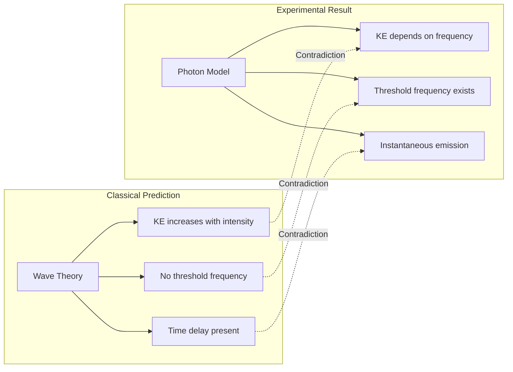
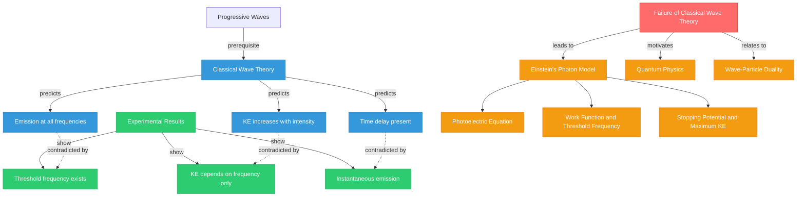

# 1. Overview / 概述

**English:**
This sub-topic examines why the classical wave theory of light **fails** to explain the experimental observations of the [[Photoelectric Effect]]. Classical wave theory, which treats light as a continuous electromagnetic wave, makes three specific predictions that directly contradict experimental results. Understanding this failure is crucial because it provides the motivation for [[Einstein's Photon Model]] and the birth of quantum physics. This sub-topic bridges the gap between classical and quantum descriptions of light, forming the foundation for [[Wave-Particle Duality]].

**中文:**
本子知识点探讨为什么经典波动理论**无法**解释[[光电效应]]的实验观测结果。经典波动理论将光视为连续的电磁波，它做出了三个与实验结果直接矛盾的特定预测。理解这一失败至关重要，因为它为[[爱因斯坦的光子模型]]和量子物理学的诞生提供了动机。本子知识点架起了光的经典描述与量子描述之间的桥梁，构成了[[波粒二象性]]的基础。

---

# 2. Syllabus Learning Objectives / 考纲学习目标

| CAIE 9702 | Edexcel IAL |
|-----------|-------------|
| 22.1(c): Explain why the classical wave theory fails to explain the photoelectric effect | 7.3: Explain why the wave theory of light cannot account for the observed characteristics of the photoelectric effect |
| 22.1(d): Describe the three main failures of the wave model | 7.4: Describe the inadequacy of the wave model in explaining threshold frequency, instantaneous emission, and kinetic energy dependence |

**Examiner Expectations / 考官期望:**
- **English:** You must be able to state the three failures clearly and explain **why** each one contradicts classical wave theory. Use specific experimental evidence to support each point.
- **中文:** 你必须能够清晰地陈述三个失败点，并解释**为什么**每个点都与经典波动理论相矛盾。使用具体的实验证据来支持每个论点。

---

# 3. Core Definitions / 核心定义

| Term (EN/CN) | Definition (EN) | Definition (CN) | Common Mistakes / 常见错误 |
|--------------|-----------------|-----------------|---------------------------|
| **Classical Wave Theory** / 经典波动理论 | The theory that light is a continuous electromagnetic wave, where energy is spread uniformly across the wavefront | 认为光是连续电磁波的理论，能量均匀分布在波阵面上 | ❌ Thinking classical theory predicts no emission at all (it predicts delayed emission) |
| **Threshold Frequency** / 阈值频率 | The minimum frequency of incident light required to emit electrons from a metal surface | 从金属表面发射电子所需的最小入射光频率 | ❌ Confusing with threshold wavelength |
| **Instantaneous Emission** / 瞬时发射 | The immediate ejection of photoelectrons when light of sufficient frequency strikes the metal surface (within ~10⁻⁹ s) | 当足够频率的光照射金属表面时，光电子立即被发射出来（约10⁻⁹秒内） | ❌ Thinking there is a measurable time delay |
| **Energy Density** / 能量密度 | The amount of electromagnetic energy per unit volume in a light wave, proportional to intensity squared | 光波中单位体积的电磁能量，与强度的平方成正比 | ❌ Confusing with intensity (power per unit area) |
| **Amplitude** / 振幅 | The maximum displacement of the electric field in an electromagnetic wave | 电磁波中电场的最大位移 | ❌ Forgetting that wave energy ∝ amplitude² |

---

# 4. Key Concepts Explained / 关键概念详解

## 4.1 The Three Failures of Classical Wave Theory / 经典波动理论的三个失败

### Explanation / 解释
**English:**
Classical wave theory treats light as a continuous wave. According to this model, the energy carried by light depends only on its **intensity** (which is proportional to amplitude²). This leads to three predictions that are all contradicted by experiment:

1. **Failure 1 — Threshold Frequency:** Classical theory predicts that photoelectrons should be emitted for **any** frequency of light, provided the intensity is high enough. In reality, no electrons are emitted below a certain [[threshold frequency]], regardless of intensity.

2. **Failure 2 — Kinetic Energy Independence:** Classical theory predicts that increasing light intensity should increase the kinetic energy of emitted electrons (since more energy per wave → more energy per electron). In reality, the [[maximum kinetic energy of photoelectrons]] depends only on frequency, not intensity.

3. **Failure 3 — Time Delay:** Classical theory predicts a measurable time delay between light exposure and electron emission (time needed to accumulate enough energy). In reality, emission is **instantaneous** (~10⁻⁹ s), even at very low intensities.

**中文:**
经典波动理论将光视为连续波。根据该模型，光携带的能量仅取决于其**强度**（与振幅²成正比）。这导致了三个与实验相矛盾的预测：

1. **失败1 — 阈值频率：** 经典理论预测，只要强度足够高，任何频率的光都应该能发射光电子。实际上，无论强度如何，低于某个[[阈值频率]]时没有电子被发射。

2. **失败2 — 动能独立性：** 经典理论预测，增加光强度应增加发射电子的动能（因为每个波的能量更多 → 每个电子的能量更多）。实际上，[[光电子的最大动能]]仅取决于频率，而非强度。

3. **失败3 — 时间延迟：** 经典理论预测光照射和电子发射之间存在可测量的时间延迟（积累足够能量所需的时间）。实际上，即使在非常低的强度下，发射也是**瞬时的**（约10⁻⁹秒）。

### Physical Meaning / 物理意义
**English:**
The failure of classical wave theory demonstrates that light's interaction with matter is **quantized** — energy is transferred in discrete packets (photons), not continuously. This was the first major experimental evidence that classical physics was incomplete.

**中文:**
经典波动理论的失败表明光与物质的相互作用是**量子化的**——能量以离散的包（光子）传递，而非连续传递。这是经典物理学不完整的第一个重要实验证据。

### Common Misconceptions / 常见误区
- ❌ "Classical theory predicts no photoelectrons at all" — Actually, it predicts emission, but with wrong characteristics
- ❌ "The failures are due to experimental error" — The experiments are well-established and reproducible
- ❌ "Only one failure exists" — There are three distinct failures, each equally important
- ❌ "Classical theory works for all wave phenomena" — It works for macroscopic waves but fails at quantum scales

### Exam Tips / 考试提示
- **English:** Always state all three failures explicitly. Use the phrase "classical wave theory predicts... but experiments show..." for each one.
- **中文:** 始终明确陈述所有三个失败点。对每个失败点使用"经典波动理论预测...但实验显示..."的句式。

> 📷 **IMAGE PROMPT — F01: Comparison of Classical vs Quantum Predictions**
> A split diagram showing three pairs of graphs. Left column: classical wave theory predictions (continuous emission at all frequencies, KE increasing with intensity, time delay). Right column: actual experimental results (threshold frequency, KE independent of intensity, instantaneous emission). Use red X marks on classical predictions and green checkmarks on experimental results. Include labels in English.

---

# 5. Essential Equations / 核心公式

## 5.1 Classical Wave Energy Equation / 经典波动能量方程

$$ E_{\text{wave}} \propto A^2 $$

| Symbol (符号) | Meaning (EN) | Meaning (CN) | Unit (单位) |
|--------------|-------------|-------------|------------|
| $E_{\text{wave}}$ | Energy carried by the wave per unit time per unit area | 波每单位时间每单位面积携带的能量 | W m⁻² |
| $A$ | Amplitude of the electric field oscillation | 电场振荡的振幅 | V m⁻¹ |

**Derivation / 推导:**
From electromagnetic theory, the intensity $I$ of a wave is:
$$ I = \frac{1}{2} \varepsilon_0 c E_0^2 $$
where $E_0$ is the amplitude. Since $I \propto E_0^2$, energy is proportional to amplitude squared.

**Conditions / 适用条件:**
- **English:** Applies to all continuous electromagnetic waves in classical physics
- **中文:** 适用于经典物理学中所有连续电磁波

**Limitations / 局限性:**
- **English:** Fails completely for quantum-scale interactions like the photoelectric effect
- **中文:** 完全无法解释量子尺度的相互作用，如光电效应

## 5.2 Time Delay Prediction / 时间延迟预测

$$ t = \frac{\phi}{I \cdot \sigma} $$

| Symbol (符号) | Meaning (EN) | Meaning (CN) | Unit (单位) |
|--------------|-------------|-------------|------------|
| $t$ | Predicted time delay for electron emission | 预测的电子发射时间延迟 | s |
| $\phi$ | Work function (energy needed to release electron) | 功函数（释放电子所需能量） | J |
| $I$ | Light intensity | 光强度 | W m⁻² |
| $\sigma$ | Absorption cross-section of the atom | 原子的吸收截面 | m² |

**Derivation / 推导:**
Classical theory assumes an electron absorbs energy continuously from the wavefront. The time needed to accumulate the [[work function]] energy is $t = \phi / (I \cdot \sigma)$.

**Conditions / 适用条件:**
- **English:** Predicts measurable delays (seconds to minutes) for low-intensity light
- **中文:** 对于低强度光，预测可测量的延迟（数秒到数分钟）

**Limitations / 局限性:**
- **English:** Experiment shows no measurable delay — emission is instantaneous
- **中文:** 实验显示没有可测量的延迟——发射是瞬时的

---

# 6. Graphs and Relationships / 图表与关系

## 6.1 Classical Prediction vs Experimental Result: Kinetic Energy vs Frequency / 经典预测与实验结果：动能与频率关系

### Axes / 坐标轴
- **X-axis:** Frequency of incident light $f$ / 入射光频率 $f$ (Hz)
- **Y-axis:** Maximum kinetic energy of photoelectrons $KE_{\text{max}}$ / 光电子最大动能 $KE_{\text{max}}$ (J)

### Shape / 形状
- **Classical Prediction:** Horizontal line at $KE = 0$ for all frequencies (no threshold), then a curve increasing with intensity
- **Experimental Result:** Straight line starting at [[threshold frequency]] $f_0$, with gradient $h$ (Planck's constant)

### Gradient Meaning / 斜率含义
- **Classical:** No meaningful gradient (wrong prediction)
- **Experimental:** Gradient = [[Planck's constant]] $h$

### Area Meaning / 面积含义
- **Classical:** Not applicable
- **Experimental:** Not applicable (linear relationship)

### Exam Interpretation / 考试解读
- **English:** The classical prediction fails because it cannot explain the existence of a threshold frequency or the linear relationship between KE and frequency.
- **中文:** 经典预测失败，因为它无法解释阈值频率的存在或动能与频率之间的线性关系。

---

# 7. Required Diagrams / 必备图表

## 7.1 Classical Wave Theory Failure Diagram / 经典波动理论失败示意图

### Description / 描述
**English:** A three-part diagram showing each failure of classical wave theory with a comparison between what classical theory predicts and what experiments actually show.

**中文:** 一个三部分组成的图表，展示经典波动理论的每个失败点，比较经典理论预测的内容和实验实际显示的内容。

### Image Prompt / 图片生成提示
> 📷 **IMAGE PROMPT — F02: Three Failures of Classical Wave Theory**
> A clean educational diagram divided into three horizontal panels. Panel 1 (top): "Threshold Frequency" — left side shows classical prediction (electrons emitted at all frequencies if intensity is high), right side shows experimental result (no emission below f₀). Panel 2 (middle): "Kinetic Energy" — left shows classical prediction (KE increases with intensity), right shows experimental result (KE constant with intensity, increases with frequency). Panel 3 (bottom): "Time Delay" — left shows classical prediction (seconds delay), right shows experimental result (instantaneous). Use blue for classical predictions, red for experimental results. Include clear labels and arrows.

### Labels Required / 需要标注
- **English:** "Classical Prediction", "Experimental Result", "Threshold Frequency f₀", "Intensity", "Frequency", "Time Delay", "Instantaneous"
- **中文:** "经典预测", "实验结果", "阈值频率 f₀", "强度", "频率", "时间延迟", "瞬时"

### Exam Importance / 考试重要性
- **English:** High — this diagram is frequently used in exam questions to test understanding of why classical theory fails
- **中文:** 高——该图表常用于考试题目中，测试对经典理论为何失败的理解

---

# 8. Worked Examples / 典型例题

## Example 1: Explaining the Failure / 解释失败

### Question / 题目
**English:**
A student claims that classical wave theory can explain the photoelectric effect because "more intense light should give more energy to electrons." Identify **two** specific failures of classical wave theory that this statement does not address.

**中文:**
一名学生声称经典波动理论可以解释光电效应，因为"更强的光应该给电子更多能量。"指出该陈述未涉及的经典波动理论的**两个**具体失败点。

### Solution / 解答

**Step 1: Identify the student's error / 步骤1：找出学生的错误**
The student only addresses the relationship between intensity and energy. This ignores two other critical failures.

**Step 2: State Failure 1 — Threshold Frequency / 步骤2：陈述失败1 — 阈值频率**
Classical wave theory predicts that electrons should be emitted for **any** frequency of light, provided the intensity is high enough. However, experiments show that no electrons are emitted below a certain [[threshold frequency]], regardless of how intense the light is.

**Step 3: State Failure 2 — Time Delay / 步骤3：陈述失败2 — 时间延迟**
Classical wave theory predicts a measurable time delay for electrons to accumulate enough energy from the wave. However, experiments show that emission is **instantaneous** (~10⁻⁹ s), even at very low intensities.

### Final Answer / 最终答案
**Answer:** The two failures are: (1) existence of a threshold frequency, and (2) instantaneous emission with no time delay. | **答案：** 两个失败点是：(1) 存在阈值频率，(2) 瞬时发射，没有时间延迟。

### Quick Tip / 提示
- **English:** Always mention all three failures when asked about classical wave theory's inadequacy. The question often expects you to identify which ones are relevant.
- **中文：** 当被问及经典波动理论的不足时，始终提及所有三个失败点。题目通常期望你识别哪些是相关的。

---

## Example 2: Quantitative Comparison / 定量比较

### Question / 题目
**English:**
A metal surface has a work function of 2.0 eV. Classical wave theory predicts that for light of intensity 0.01 W m⁻², the time delay for electron emission would be approximately 10 seconds. Explain why this prediction is contradicted by experiment, and state what actually happens.

**中文:**
一个金属表面的功函数为2.0 eV。经典波动理论预测，对于强度为0.01 W m⁻²的光，电子发射的时间延迟约为10秒。解释为什么这个预测与实验相矛盾，并陈述实际发生的情况。

### Solution / 解答

**Step 1: Identify the contradiction / 步骤1：找出矛盾**
Classical theory predicts a **measurable time delay** (10 seconds), but experiments show **no measurable delay**.

**Step 2: State the experimental result / 步骤2：陈述实验结果**
In reality, photoelectrons are emitted **instantaneously** — within approximately 10⁻⁹ seconds of the light striking the surface. This is true even at very low light intensities.

**Step 3: Explain the significance / 步骤3：解释其意义**
This instantaneous emission suggests that energy is transferred in **discrete packets** (photons), not continuously as classical wave theory assumes. An electron either absorbs a whole photon instantly or not at all.

### Final Answer / 最终答案
**Answer:** The prediction is contradicted because experiments show instantaneous emission (~10⁻⁹ s), not a 10-second delay. | **答案：** 该预测被矛盾，因为实验显示瞬时发射（约10⁻⁹秒），而非10秒延迟。

### Quick Tip / 提示
- **English:** The time delay failure is the most dramatic contradiction — classical theory predicts delays of seconds to minutes, but actual emission is billions of times faster.
- **中文：** 时间延迟失败是最戏剧性的矛盾——经典理论预测数秒到数分钟的延迟，但实际发射速度快了数十亿倍。

---

# 9. Past Paper Question Types / 历年真题题型

| Question Type / 题型 | Frequency / 频率 | Difficulty / 难度 | Past Paper References / 真题索引 |
|----------------------|------------------|------------------|-------------------------------|
| Explain why classical wave theory fails | Very High | Easy | 📝 *待填入* |
| Compare classical and quantum predictions | High | Medium | 📝 *待填入* |
| Identify specific failures from experimental data | Medium | Medium | 📝 *待填入* |
| Calculate predicted time delay (classical) | Low | Hard | 📝 *待填入* |

**Common Command Words / 常见指令词:**
- **English:** "Explain why...", "State...", "Describe...", "Compare...", "Identify..."
- **中文：** "解释为什么...", "陈述...", "描述...", "比较...", "识别..."

---

# 10. Practical Skills Connections / 实验技能链接

**English:**
This sub-topic connects to practical work in several ways:

1. **Experimental Design:** Understanding the failures helps design experiments to test the photoelectric effect (e.g., using filters to vary frequency, using variable intensity sources)
2. **Data Analysis:** Plotting $KE_{\text{max}}$ vs frequency to determine [[Planck's constant]] and [[work function]]
3. **Uncertainties:** Measuring threshold frequency requires careful determination of the point where photocurrent becomes zero
4. **Graph Interpretation:** Recognizing that a linear relationship (not a curve) confirms the failure of classical theory

**中文:**
本子知识点通过以下几种方式与实验工作联系：

1. **实验设计：** 理解失败点有助于设计测试光电效应的实验（例如，使用滤光片改变频率，使用可变强度光源）
2. **数据分析：** 绘制$KE_{\text{max}}$与频率的关系图以确定[[普朗克常数]]和[[功函数]]
3. **不确定度：** 测量阈值频率需要仔细确定光电流变为零的点
4. **图表解读：** 识别线性关系（而非曲线）确认了经典理论的失败

---

# 11. Concept Map / 概念图谱

---

# 12. Quick Revision Sheet / 速查表

| Category / 类别 | Key Points / 要点 |
|----------------|------------------|
| **Definition / 定义** | Classical wave theory treats light as a continuous wave; it fails to explain three key experimental observations of the photoelectric effect / 经典波动理论将光视为连续波；它无法解释光电效应的三个关键实验观测结果 |
| **Failure 1 / 失败1** | **Threshold Frequency:** Classical theory predicts emission at any frequency with sufficient intensity; experiment shows no emission below $f_0$ / **阈值频率：** 经典理论预测只要有足够强度任何频率都能发射；实验显示低于$f_0$无发射 |
| **Failure 2 / 失败2** | **Kinetic Energy:** Classical theory predicts KE increases with intensity; experiment shows KE depends only on frequency / **动能：** 经典理论预测动能随强度增加；实验显示动能仅取决于频率 |
| **Failure 3 / 失败3** | **Time Delay:** Classical theory predicts measurable delay (seconds); experiment shows instantaneous emission (~10⁻⁹ s) / **时间延迟：** 经典理论预测可测量延迟（秒）；实验显示瞬时发射（约10⁻⁹秒） |
| **Key Formula / 核心公式** | $E_{\text{wave}} \propto A^2$ (classical wave energy) / $E_{\text{wave}} \propto A^2$（经典波动能量） |
| **Key Graph / 核心图表** | $KE_{\text{max}}$ vs $f$: Classical predicts horizontal line; experiment shows straight line through $f_0$ / $KE_{\text{max}}$ vs $f$：经典预测水平线；实验显示通过$f_0$的直线 |
| **Exam Tip / 考试提示** | Always state all three failures explicitly. Use "classical predicts... but experiment shows..." structure / 始终明确陈述所有三个失败点。使用"经典预测...但实验显示..."的结构 |
| **Connection / 联系** | Leads to [[Einstein's Photon Model]] and the [[Photoelectric Equation]] / 引出[[爱因斯坦的光子模型]]和[[光电效应方程]] |