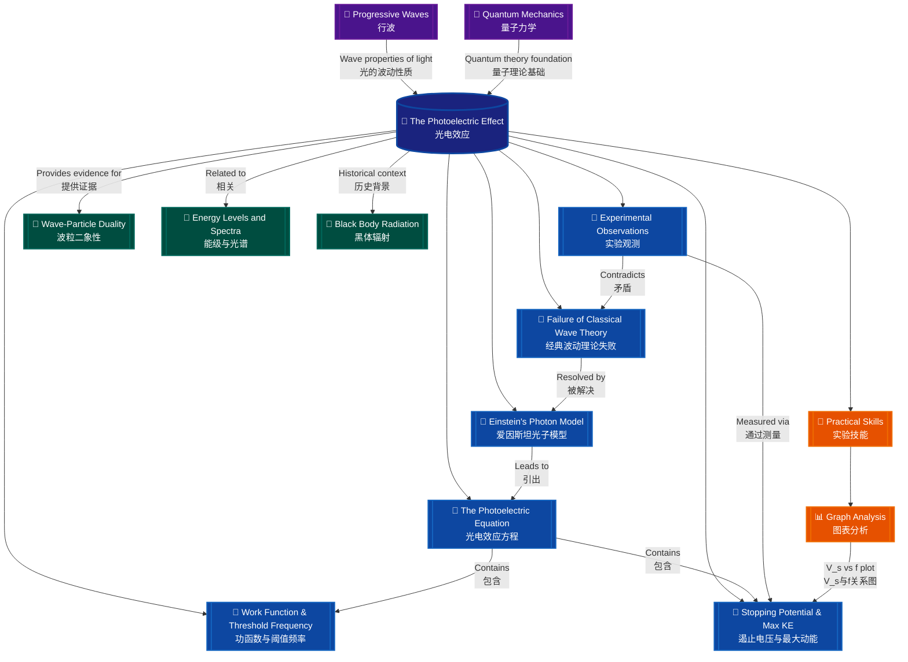

# The Photoelectric Effect / 光电效应

---

# 1. Overview / 概述

**English:**
The photoelectric effect is a cornerstone phenomenon in quantum physics that describes the emission of electrons from a metal surface when electromagnetic radiation (light) of sufficient frequency shines upon it. This effect provided the first direct experimental evidence for the particle nature of light, challenging the classical wave theory that had dominated physics for centuries. The photoelectric effect is fundamentally important because it led to [[Einstein's Photon Model]], which introduced the concept of light quanta (photons) and earned Einstein the Nobel Prize in Physics in 1921. In the context of Cambridge 9702 and Edexcel IAL A-Level Physics, this topic bridges classical and quantum physics, forming the foundation for understanding [[Wave-Particle Duality]] and [[Energy Levels and Spectra]].

Real-world applications of the photoelectric effect are extensive and include: photoelectric sensors used in automatic doors and security systems, solar panels (photovoltaic cells) that convert light into electrical energy, photomultiplier tubes used in medical imaging and particle detectors, and light meters in photography. The effect also underpins modern technologies such as CCD sensors in digital cameras and night vision devices.

In examinations, the photoelectric effect is a high-frequency topic. Cambridge 9702 Paper 4 (A2) and Edexcel IAL Unit 4 typically feature at least one structured question involving calculations using the photoelectric equation, interpretation of experimental graphs (particularly the stopping potential vs. frequency graph), and explanations of why classical wave theory fails to explain the observations. Students must be able to recall and apply [[The Photoelectric Equation]] $hf = \phi + KE_{\text{max}}$, define [[Work Function and Threshold Frequency]], and understand the significance of [[Stopping Potential and Maximum KE]].

**中文：**
光电效应是量子物理学中的基石现象，描述了当足够频率的电磁辐射（光）照射金属表面时，电子从金属表面发射出来的过程。这一效应首次为光的粒子性提供了直接的实验证据，挑战了统治物理学数个世纪的经典波动理论。光电效应之所以具有根本重要性，是因为它引出了[[爱因斯坦光子模型]]，该模型引入了光量子（光子）的概念，并使爱因斯坦获得了1921年的诺贝尔物理学奖。在剑桥9702和爱德思IAL A-Level物理的背景下，这一主题连接了经典物理和量子物理，为理解[[波粒二象性]]和[[能级与光谱]]奠定了基础。

光电效应的实际应用非常广泛，包括：用于自动门和安全系统的光电传感器、将光能转化为电能的太阳能电池板（光伏电池）、用于医学成像和粒子探测器的光电倍增管，以及摄影中的测光表。该效应还支撑着现代技术，如数码相机中的CCD传感器和夜视设备。

在考试中，光电效应是一个高频主题。剑桥9702试卷4（A2）和爱德思IAL单元4通常至少包含一道结构化问题，涉及使用光电效应方程进行计算、解释实验图表（特别是遏止电压与频率的关系图），以及解释经典波动理论为何无法解释这些观测结果。学生必须能够回忆并应用[[光电效应方程]] $hf = \phi + KE_{\text{max}}$，定义[[功函数与阈值频率]]，并理解[[遏止电压与最大动能]]的意义。

---

# 2. Syllabus Learning Objectives / 考纲学习目标

| CAIE 9702 (22.1 a-h) | Edexcel IAL (WPH14 U4: 7.1-7.6) |
|-----------------------|----------------------------------|
| (a) Describe the photoelectric effect as the emission of electrons from a metal surface when electromagnetic radiation of suitable frequency is incident on it | 7.1 Understand the photoelectric effect as the emission of electrons from a metal surface when electromagnetic radiation of suitable frequency is incident on it |
| (b) Explain the significance of threshold frequency | 7.2 Understand the significance of threshold frequency and work function |
| (c) Explain the significance of work function | 7.2 Understand the significance of threshold frequency and work function |
| (d) Explain why the classical wave theory fails to explain the photoelectric effect | 7.3 Understand why the classical wave theory fails to explain the photoelectric effect |
| (e) Describe and explain Einstein's photon model | 7.4 Understand Einstein's photon model and the concept of photons |
| (f) Recall and use the photoelectric equation $hf = \phi + \frac{1}{2}mv^2_{\text{max}}$ | 7.5 Use the photoelectric equation $hf = \phi + E_k$ |
| (g) Explain the concept of stopping potential | 7.6 Understand stopping potential and its relationship to maximum kinetic energy |
| (h) Explain how the photoelectric effect provides evidence for the particle nature of light | 7.6 Understand how the photoelectric effect provides evidence for the particle nature of light |

> 📋 **CIE Only:** CAIE explicitly requires students to recall and use the equation in the form $hf = \phi + \frac{1}{2}mv^2_{\text{max}}$, emphasising the kinetic energy term as $\frac{1}{2}mv^2_{\text{max}}$. Students must also be able to describe experimental observations in detail, including the effect of intensity and frequency on photocurrent and kinetic energy.

> 📋 **Edexcel Only:** Edexcel uses the simplified form $hf = \phi + E_k$ and places greater emphasis on the stopping potential method for determining Planck's constant. Edexcel also requires understanding of the photoelectric effect in the context of the quantum nature of light and its implications for the wave-particle duality of electromagnetic radiation.

**Examiner Expectations / 考官期望：**

**English:**
Examiners expect students to:
1. Define threshold frequency and work function with precise wording
2. State and apply the photoelectric equation correctly, including unit conversions
3. Explain why increasing light intensity does NOT increase the kinetic energy of emitted electrons
4. Interpret the stopping potential vs. frequency graph, including calculation of Planck's constant from the gradient
5. Describe at least three experimental observations that contradict classical wave theory
6. Use the photon model to explain each observation
7. Distinguish between photocurrent and maximum kinetic energy

**中文：**
考官期望学生能够：
1. 用精确的措辞定义阈值频率和功函数
2. 正确陈述并应用光电效应方程，包括单位换算
3. 解释为什么增加光强度不会增加发射电子的动能
4. 解释遏止电压与频率的关系图，包括从斜率计算普朗克常数
5. 描述至少三个与经典波动理论相矛盾的实验观测结果
6. 使用光子模型解释每个观测结果
7. 区分光电流和最大动能

---

# 3. Core Definitions / 核心定义

| Term (EN/CN) | Definition (EN) | Definition (CN) | Common Mistakes / 常见错误 |
|--------------|-----------------|-----------------|---------------------------|
| **Photoelectric Effect** / 光电效应 | The emission of electrons from a metal surface when electromagnetic radiation of suitable frequency is incident upon it | 当适当频率的电磁辐射照射金属表面时，电子从金属表面发射出来的现象 | Confusing with thermionic emission (heat-induced electron emission) / 与热电子发射（热诱导电子发射）混淆 |
| **Photon** / 光子 | A quantum (discrete packet) of electromagnetic radiation, carrying energy $E = hf$ | 电磁辐射的量子（离散能量包），携带能量 $E = hf$ | Thinking photons have mass or charge / 认为光子有质量或电荷 |
| **Threshold Frequency** $f_0$ / 阈值频率 | The minimum frequency of incident electromagnetic radiation required to just eject an electron from a metal surface | 刚好能从金属表面发射出电子所需的最小入射电磁辐射频率 | Using wavelength instead of frequency; forgetting $f_0$ is a property of the metal / 使用波长代替频率；忘记 $f_0$ 是金属的特性 |
| **Work Function** $\phi$ / 功函数 | The minimum energy required to remove an electron from the surface of a metal | 从金属表面移除一个电子所需的最小能量 | Confusing with ionisation energy; forgetting it is a property of the metal / 与电离能混淆；忘记它是金属的特性 |
| **Stopping Potential** $V_s$ / 遏止电压 | The minimum potential difference that must be applied between the cathode and anode to just prevent the most energetic photoelectrons from reaching the anode | 必须施加在阴极和阳极之间的最小电势差，刚好阻止能量最大的光电子到达阳极 | Thinking stopping potential is the voltage at which photocurrent is maximum / 认为遏止电压是光电流最大时的电压 |
| **Maximum Kinetic Energy** $KE_{\text{max}}$ / 最大动能 | The maximum kinetic energy possessed by a photoelectron immediately after ejection from the metal surface, given by $KE_{\text{max}} = eV_s$ | 光电子从金属表面发射后立即具有的最大动能，由 $KE_{\text{max}} = eV_s$ 给出 | Forgetting that $KE_{\text{max}}$ refers to electrons at the surface, not those deeper in the metal / 忘记 $KE_{\text{max}}$ 指的是表面电子，而非金属内部的电子 |
| **Photoelectron** / 光电子 | An electron emitted from a metal surface as a result of the photoelectric effect | 由于光电效应而从金属表面发射出的电子 | Confusing with any electron; photoelectrons are specifically those ejected by light / 与任何电子混淆；光电子特指被光发射出的电子 |
| **Photocurrent** / 光电流 | The electric current that flows in a photoelectric circuit due to the movement of photoelectrons from the cathode to the anode | 由于光电子从阴极向阳极移动而在光电电路中流动的电流 | Thinking photocurrent is proportional to frequency (it is proportional to intensity) / 认为光电流与频率成正比（实际上与强度成正比） |

---

# 4. Key Concepts Explained / 关键概念详解

## 4.1 Experimental Observations of the Photoelectric Effect / 光电效应的实验观测

### Explanation / 解释
**English:**
The photoelectric effect is studied experimentally using an apparatus consisting of an evacuated glass tube containing two electrodes: a metal cathode (emitter) and an anode (collector). A variable voltage source is connected across the electrodes, and a sensitive ammeter measures the photocurrent. When monochromatic light of a specific frequency is shone on the cathode, electrons are emitted and travel to the anode, producing a measurable current. The key experimental observations that must be explained are:

1. **Threshold Frequency:** For each metal, there exists a minimum frequency $f_0$ below which no photoelectrons are emitted, regardless of the light intensity.
2. **Instantaneous Emission:** Photoelectrons are emitted almost instantaneously (within $10^{-9}$ s) after the light strikes the metal, with no measurable time delay.
3. **Intensity and Photocurrent:** The photocurrent (number of electrons emitted per second) is directly proportional to the intensity of the incident light, provided the frequency is above the threshold.
4. **Frequency and Kinetic Energy:** The maximum kinetic energy of photoelectrons increases linearly with the frequency of the incident light, but is independent of the intensity.
5. **Stopping Potential:** A reverse potential (stopping potential $V_s$) can be applied to prevent even the most energetic photoelectrons from reaching the anode, and $V_s$ is directly proportional to the frequency of the incident light.

These observations are documented in [[Experimental Observations of the Photoelectric Effect]].

**中文：**
光电效应通过实验装置进行研究，该装置由一个抽真空的玻璃管组成，管内包含两个电极：金属阴极（发射极）和阳极（收集极）。一个可变电压源连接在电极两端，灵敏的电流表测量光电流。当特定频率的单色光照射阴极时，电子被发射出来并向阳极移动，产生可测量的电流。必须解释的关键实验观测结果包括：

1. **阈值频率：** 对于每种金属，存在一个最小频率 $f_0$，低于该频率时无论光强度多大都不会发射光电子。
2. **瞬时发射：** 光照射金属后，光电子几乎瞬时（在 $10^{-9}$ 秒内）发射，没有可测量的时间延迟。
3. **强度与光电流：** 只要频率高于阈值，光电流（每秒发射的电子数）与入射光的强度成正比。
4. **频率与动能：** 光电子的最大动能随入射光频率线性增加，但与强度无关。
5. **遏止电压：** 可以施加反向电压（遏止电压 $V_s$）来阻止即使能量最大的光电子到达阳极，且 $V_s$ 与入射光频率成正比。

这些观测结果记录在[[光电效应的实验观测]]中。

### Physical Meaning / 物理意义
**English:**
The photoelectric effect demonstrates that light energy is transferred in discrete packets (photons), not as a continuous wave. Each photon interacts with a single electron, transferring all its energy $hf$ to that electron. The electron uses some of this energy to escape the metal (the work function $\phi$), and the remainder becomes kinetic energy. This explains why increasing intensity (more photons) increases the number of electrons but not their individual energies, and why frequency determines whether any electrons are emitted at all.

**中文：**
光电效应表明光能以离散的能量包（光子）传递，而不是作为连续波传递。每个光子与单个电子相互作用，将其全部能量 $hf$ 传递给该电子。电子使用部分能量逃离金属（功函数 $\phi$），剩余部分成为动能。这解释了为什么增加强度（更多光子）会增加电子数量但不增加单个电子的能量，以及为什么频率决定了是否会有电子发射。

### Common Misconceptions / 常见误区
1. **"Brighter light always produces more energetic electrons"** — False. Brighter light means more photons, so more electrons are emitted, but each electron's energy depends only on frequency.
   **"更亮的光总是产生能量更大的电子"** — 错误。更亮的光意味着更多光子，因此发射更多电子，但每个电子的能量仅取决于频率。
2. **"The photoelectric effect occurs for any light"** — False. Only light with frequency above the threshold frequency can cause electron emission.
   **"任何光都能产生光电效应"** — 错误。只有频率高于阈值频率的光才能引起电子发射。
3. **"Electrons gain energy gradually from the wave"** — False. This is the classical wave theory prediction, which is contradicted by the instantaneous emission observation.
   **"电子从波中逐渐获得能量"** — 错误。这是经典波动理论的预测，与瞬时发射的观测结果相矛盾。

### Exam Tips / 考试提示
**English:**
- When asked to "explain why classical wave theory fails," always mention at least three contradictions: threshold frequency, instantaneous emission, and the independence of kinetic energy from intensity.
- For calculations, always convert wavelength to frequency using $c = f\lambda$ before applying the photoelectric equation.
- Remember that $KE_{\text{max}} = eV_s$ is a crucial link between electrical measurements and energy.
- In graph questions, the gradient of $V_s$ vs. $f$ is $\frac{h}{e}$, and the x-intercept is $f_0$.

**中文：**
- 当被要求"解释为什么经典波动理论失败"时，始终提及至少三个矛盾：阈值频率、瞬时发射以及动能与强度无关。
- 对于计算，在应用光电效应方程之前，始终使用 $c = f\lambda$ 将波长转换为频率。
- 记住 $KE_{\text{max}} = eV_s$ 是电学测量与能量之间的关键联系。
- 在图表问题中，$V_s$ 与 $f$ 关系图的斜率为 $\frac{h}{e}$，x轴截距为 $f_0$。

---

## 4.2 Failure of Classical Wave Theory / 经典波动理论的失败

### Explanation / 解释
**English:**
Classical wave theory treats light as a continuous electromagnetic wave. According to this theory, the energy carried by a wave depends on its intensity (amplitude squared), not its frequency. This leads to three key predictions that are all contradicted by experimental observations:

1. **Prediction: Any frequency should work if intensity is high enough.** Classical theory suggests that electrons can absorb energy continuously from the wave. Given enough time, even low-frequency light should provide sufficient energy to eject an electron. **Observation:** Below the threshold frequency, no electrons are emitted regardless of intensity or exposure time.

2. **Prediction: There should be a time delay.** Classical theory predicts that electrons need time to absorb enough energy from the wave to overcome the work function. For low-intensity light, this delay could be seconds or minutes. **Observation:** Emission is instantaneous (within $10^{-9}$ s), even for very low intensity light.

3. **Prediction: Kinetic energy should increase with intensity.** Classical theory predicts that a more intense wave (larger amplitude) should transfer more energy to each electron, resulting in higher kinetic energy. **Observation:** The maximum kinetic energy of photoelectrons depends only on frequency, not intensity.

These failures are detailed in [[Failure of Classical Wave Theory]].

**中文：**
经典波动理论将光视为连续的电磁波。根据该理论，波携带的能量取决于其强度（振幅的平方），而不是频率。这导致了三个关键预测，这些预测都与实验观测结果相矛盾：

1. **预测：如果强度足够高，任何频率都应有效。** 经典理论认为电子可以从波中连续吸收能量。只要有足够的时间，即使是低频光也应提供足够的能量来发射电子。**观测结果：** 低于阈值频率时，无论强度或曝光时间如何，都不会发射电子。

2. **预测：应该存在时间延迟。** 经典理论预测电子需要时间从波中吸收足够的能量以克服功函数。对于低强度光，这种延迟可能是几秒或几分钟。**观测结果：** 发射是瞬时的（在 $10^{-9}$ 秒内），即使对于非常低强度的光也是如此。

3. **预测：动能应随强度增加而增加。** 经典理论预测更强的波（更大的振幅）应向每个电子传递更多能量，导致更高的动能。**观测结果：** 光电子的最大动能仅取决于频率，而不是强度。

### Physical Meaning / 物理意义
**English:**
The failure of classical wave theory to explain the photoelectric effect was a pivotal moment in physics. It demonstrated that classical physics, which had successfully explained macroscopic phenomena for centuries, was inadequate at the atomic scale. This failure forced physicists to accept the quantum nature of light, leading to the development of quantum mechanics.

**中文：**
经典波动理论无法解释光电效应是物理学中的一个关键时刻。它表明，几个世纪以来成功解释宏观现象的经典物理学在原子尺度上是不充分的。这一失败迫使物理学家接受光的量子性质，导致了量子力学的发展。

### Common Misconceptions / 常见误区
1. **"Classical theory predicted nothing about the photoelectric effect"** — False. Classical theory made specific predictions that were experimentally tested and found to be wrong.
   **"经典理论对光电效应没有任何预测"** — 错误。经典理论做出了具体的预测，这些预测经过实验检验并被证明是错误的。
2. **"The photoelectric effect disproves wave theory entirely"** — False. Light still exhibits wave properties (diffraction, interference). The photoelectric effect shows light also has particle properties, leading to [[Wave-Particle Duality]].
   **"光电效应完全否定了波动理论"** — 错误。光仍然表现出波动性质（衍射、干涉）。光电效应表明光也具有粒子性质，导致了[[波粒二象性]]。

### Exam Tips / 考试提示
**English:**
- This is a very common exam question. Memorise the three contradictions and be able to explain each one clearly.
- Use comparative language: "Classical theory predicts X, but experiment shows Y."
- Mention that Einstein's photon model resolves all three contradictions.

**中文：**
- 这是一个非常常见的考试问题。记住三个矛盾，并能够清晰地解释每一个。
- 使用比较性语言："经典理论预测X，但实验显示Y。"
- 提及爱因斯坦的光子模型解决了所有三个矛盾。

---

## 4.3 Einstein's Photon Model / 爱因斯坦的光子模型

### Explanation / 解释
**English:**
In 1905, Albert Einstein proposed that light consists of discrete packets of energy called photons (or light quanta). Each photon has energy $E = hf$, where $h$ is Planck's constant ($6.63 \times 10^{-34} \text{ J s}$) and $f$ is the frequency of the light. The photon model explains all the experimental observations of the photoelectric effect:

1. **Threshold Frequency:** A single photon must have enough energy ($hf$) to overcome the work function ($\phi$) of the metal. If $hf < \phi$, no electron can be ejected, regardless of how many photons strike the surface. The threshold frequency is $f_0 = \phi/h$.

2. **Instantaneous Emission:** A photon interacts with a single electron in a one-to-one manner. The entire energy $hf$ is transferred to that electron in a single, instantaneous event. There is no need for energy accumulation over time.

3. **Intensity and Photocurrent:** Increasing intensity means more photons per second. More photons mean more electron-photon interactions, resulting in more photoelectrons and a larger photocurrent. However, each electron still receives the same energy $hf$ from its photon.

4. **Frequency and Kinetic Energy:** The energy conservation for a single electron is: $hf = \phi + KE_{\text{max}}$. Rearranging: $KE_{\text{max}} = hf - \phi$. This shows that $KE_{\text{max}}$ increases linearly with frequency, with gradient $h$.

This model is fully developed in [[Einstein's Photon Model]].

**中文：**
1905年，阿尔伯特·爱因斯坦提出光由称为光子（或光量子）的离散能量包组成。每个光子的能量为 $E = hf$，其中 $h$ 是普朗克常数（$6.63 \times 10^{-34} \text{ J s}$），$f$ 是光的频率。光子模型解释了光电效应的所有实验观测结果：

1. **阈值频率：** 单个光子必须有足够的能量（$hf$）来克服金属的功函数（$\phi$）。如果 $hf < \phi$，无论有多少光子撞击表面，都无法发射电子。阈值频率为 $f_0 = \phi/h$。

2. **瞬时发射：** 光子以一对一的方式与单个电子相互作用。全部能量 $hf$ 在单个瞬时事件中传递给该电子。不需要随时间积累能量。

3. **强度与光电流：** 增加强度意味着每秒更多光子。更多光子意味着更多电子-光子相互作用，导致更多光电子和更大的光电流。然而，每个电子仍然从其光子接收相同的能量 $hf$。

4. **频率与动能：** 单个电子的能量守恒为：$hf = \phi + KE_{\text{max}}$。重新排列：$KE_{\text{max}} = hf - \phi$。这表明 $KE_{\text{max}}$ 随频率线性增加，斜率为 $h$。

### Physical Meaning / 物理意义
**English:**
Einstein's photon model revolutionised physics by introducing the concept of wave-particle duality. Light, which had been successfully described as a wave for over a century, was now also understood as a stream of particles. This duality is a fundamental principle of quantum mechanics and applies to all matter, not just light.

**中文：**
爱因斯坦的光子模型通过引入波粒二象性的概念彻底改变了物理学。一个多世纪以来一直被成功描述为波的光，现在也被理解为粒子流。这种二象性是量子力学的基本原理，适用于所有物质，而不仅仅是光。

### Common Misconceptions / 常见误区
1. **"Photons are like tiny billiard balls"** — False. Photons have no mass, no charge, and travel at the speed of light. They are quanta of energy, not classical particles.
   **"光子就像微小的台球"** — 错误。光子没有质量，没有电荷，以光速运动。它们是能量的量子，不是经典粒子。
2. **"A photon can split its energy between multiple electrons"** — False. A photon transfers all its energy to a single electron in a single interaction.
   **"光子可以将其能量分配给多个电子"** — 错误。光子在单个相互作用中将其全部能量传递给单个电子。

### Exam Tips / 考试提示
**English:**
- When explaining the photon model, always start with $E = hf$ and the concept of quantisation.
- Use the analogy of a "bullet" (photon) hitting a "target" (electron) to explain the one-to-one interaction.
- Remember that Einstein's explanation of the photoelectric effect was the work that won him the Nobel Prize, not relativity.

**中文：**
- 在解释光子模型时，始终从 $E = hf$ 和量子化概念开始。
- 使用"子弹"（光子）击中"目标"（电子）的类比来解释一对一相互作用。
- 记住，爱因斯坦对光电效应的解释是使他获得诺贝尔奖的工作，而不是相对论。

---

## 4.4 The Photoelectric Equation / 光电效应方程

### Explanation / 解释
**English:**
The photoelectric equation is a statement of energy conservation for the photoelectric effect:

$$hf = \phi + KE_{\text{max}}$$

Where:
- $hf$ is the energy of the incident photon (J)
- $\phi$ is the work function of the metal (J)
- $KE_{\text{max}}$ is the maximum kinetic energy of the emitted photoelectron (J)

This equation can also be written in terms of stopping potential $V_s$:

$$hf = \phi + eV_s$$

Where $e$ is the elementary charge ($1.60 \times 10^{-19} \text{ C}$).

The equation shows that:
- The photon energy is used to overcome the work function, with any excess becoming kinetic energy
- Only electrons at the very surface of the metal have the maximum kinetic energy; electrons deeper in the metal lose energy through collisions before escaping
- The equation is linear in form: $KE_{\text{max}} = hf - \phi$, which is the equation of a straight line with gradient $h$ and y-intercept $-\phi$

This is the core equation detailed in [[The Photoelectric Equation]].

**中文：**
光电效应方程是光电效应能量守恒的表述：

$$hf = \phi + KE_{\text{max}}$$

其中：
- $hf$ 是入射光子的能量（焦耳）
- $\phi$ 是金属的功函数（焦耳）
- $KE_{\text{max}}$ 是发射光电子的最大动能（焦耳）

该方程也可以用遏止电压 $V_s$ 的形式表示：

$$hf = \phi + eV_s$$

其中 $e$ 是元电荷（$1.60 \times 10^{-19} \text{ C}$）。

该方程表明：
- 光子能量用于克服功函数，任何剩余部分成为动能
- 只有金属最表面的电子具有最大动能；金属内部较深的电子在逃逸前通过碰撞损失能量
- 该方程为线性形式：$KE_{\text{max}} = hf - \phi$，这是一条直线的方程，斜率为 $h$，y轴截距为 $-\phi$

### Physical Meaning / 物理意义
**English:**
The photoelectric equation quantifies the energy transfer from light to matter at the quantum level. It shows that the energy of light is quantised (photons) and that this energy is transferred in discrete amounts. The equation also provides a direct method for measuring Planck's constant $h$ experimentally, by plotting $V_s$ against $f$ and finding the gradient.

**中文：**
光电效应方程量化了量子层面上从光到物质的能量传递。它表明光的能量是量子化的（光子），并且这种能量以离散量传递。该方程还提供了一种通过绘制 $V_s$ 与 $f$ 的关系图并求斜率来实验测量普朗克常数 $h$ 的直接方法。

### Common Misconceptions / 常见误区
1. **"The equation applies to all electrons emitted"** — False. The equation applies only to electrons with maximum kinetic energy (those from the surface). Other electrons have less kinetic energy.
   **"该方程适用于所有发射的电子"** — 错误。该方程仅适用于具有最大动能的电子（来自表面的电子）。其他电子的动能较小。
2. **"Work function is the same for all metals"** — False. Different metals have different work functions. For example, caesium has a low work function ($\approx 2.1 \text{ eV}$), while platinum has a high work function ($\approx 6.4 \text{ eV}$).
   **"所有金属的功函数相同"** — 错误。不同金属具有不同的功函数。例如，铯的功函数较低（$\approx 2.1 \text{ eV}$），而铂的功函数较高（$\approx 6.4 \text{ eV}$）。

### Exam Tips / 考试提示
**English:**
- Always check units: work function and photon energy must be in the same units (both J or both eV). Convert using $1 \text{ eV} = 1.60 \times 10^{-19} \text{ J}$.
- When given wavelength, first calculate frequency using $c = f\lambda$.
- The stopping potential equation $eV_s = hf - \phi$ is very useful for graph interpretation.

**中文：**
- 始终检查单位：功函数和光子能量必须使用相同单位（均为焦耳或均为电子伏特）。使用 $1 \text{ eV} = 1.60 \times 10^{-19} \text{ J}$ 进行转换。
- 当给定波长时，首先使用 $c = f\lambda$ 计算频率。
- 遏止电压方程 $eV_s = hf - \phi$ 对于图表解释非常有用。

---

## 4.5 Work Function and Threshold Frequency / 功函数与阈值频率

### Explanation / 解释
**English:**
The **work function** $\phi$ is the minimum energy required to remove an electron from the surface of a metal. It is a property of the metal and depends on factors such as the atomic structure and the strength of the metallic bond. The work function is typically measured in electronvolts (eV) or joules (J).

The **threshold frequency** $f_0$ is the minimum frequency of incident light that can cause photoelectric emission. At the threshold frequency, the photon has just enough energy to overcome the work function, so the emitted electron has zero kinetic energy:

$$hf_0 = \phi$$

Therefore:
$$f_0 = \frac{\phi}{h}$$

The corresponding **threshold wavelength** $\lambda_0$ is:
$$\lambda_0 = \frac{c}{f_0} = \frac{hc}{\phi}$$

For frequencies below $f_0$ (or wavelengths above $\lambda_0$), no photoelectrons are emitted regardless of the light intensity.

These concepts are explored in [[Work Function and Threshold Frequency]].

**中文：**
**功函数** $\phi$ 是从金属表面移除一个电子所需的最小能量。它是金属的一种性质，取决于原子结构和金属键的强度等因素。功函数通常以电子伏特（eV）或焦耳（J）为单位测量。

**阈值频率** $f_0$ 是能引起光电发射的入射光的最小频率。在阈值频率下，光子刚好有足够的能量克服功函数，因此发射的电子动能为零：

$$hf_0 = \phi$$

因此：
$$f_0 = \frac{\phi}{h}$$

相应的**阈值波长** $\lambda_0$ 为：
$$\lambda_0 = \frac{c}{f_0} = \frac{hc}{\phi}$$

对于低于 $f_0$ 的频率（或高于 $\lambda_0$ 的波长），无论光强度如何，都不会发射光电子。

### Physical Meaning / 物理意义
**English:**
The work function represents the binding energy of electrons in a metal. It is analogous to the ionisation energy of an atom but applies to the collective electron sea in a metallic lattice. Different metals have different work functions because their electron configurations and lattice structures differ. For example, alkali metals (like caesium and potassium) have low work functions because their outer electrons are loosely bound, making them suitable for photoelectric sensors.

**中文：**
功函数代表金属中电子的结合能。它类似于原子的电离能，但适用于金属晶格中的集体电子海。不同金属具有不同的功函数，因为它们的电子构型和晶格结构不同。例如，碱金属（如铯和钾）具有较低的功函数，因为它们的外层电子结合松散，使其适用于光电传感器。

### Common Misconceptions / 常见误区
1. **"Threshold frequency depends on light intensity"** — False. Threshold frequency is a property of the metal and is independent of the light source.
   **"阈值频率取决于光强度"** — 错误。阈值频率是金属的性质，与光源无关。
2. **"Work function is the energy needed to remove any electron"** — False. It is the minimum energy to remove an electron from the surface. Electrons deeper in the metal require more energy.
   **"功函数是移除任何电子所需的能量"** — 错误。它是从表面移除一个电子所需的最小能量。金属内部较深的电子需要更多能量。

### Exam Tips / 考试提示
**English:**
- Be prepared to calculate threshold frequency from work function and vice versa.
- Remember that $f_0$ is the x-intercept of the $KE_{\text{max}}$ vs. $f$ graph (or $V_s$ vs. $f$ graph).
- In multiple-choice questions, watch for distractors that use wavelength instead of frequency.

**中文：**
- 准备好从功函数计算阈值频率，反之亦然。
- 记住 $f_0$ 是 $KE_{\text{max}}$ 与 $f$ 关系图（或 $V_s$ 与 $f$ 关系图）的x轴截距。
- 在选择题中，注意使用波长代替频率的干扰项。

---

## 4.6 Stopping Potential and Maximum Kinetic Energy / 遏止电压与最大动能

### Explanation / 解释
**English:**
The **stopping potential** $V_s$ is the reverse potential difference that must be applied between the cathode and anode to just prevent the most energetic photoelectrons from reaching the anode. At this potential, even the fastest photoelectrons are brought to rest just before reaching the anode, and the photocurrent drops to zero.

The relationship between stopping potential and maximum kinetic energy is:

$$KE_{\text{max}} = eV_s$$

Where $e$ is the elementary charge ($1.60 \times 10^{-19} \text{ C}$).

Combining this with the photoelectric equation gives:

$$eV_s = hf - \phi$$

Rearranging:

$$V_s = \frac{h}{e}f - \frac{\phi}{e}$$

This is the equation of a straight line when $V_s$ is plotted against $f$:
- **Gradient:** $\frac{h}{e}$ (allows experimental determination of Planck's constant)
- **y-intercept:** $-\frac{\phi}{e}$ (allows determination of the work function)
- **x-intercept:** $f_0 = \frac{\phi}{h}$ (the threshold frequency)

These concepts are detailed in [[Stopping Potential and Maximum KE]].

**中文：**
**遏止电压** $V_s$ 是必须施加在阴极和阳极之间的反向电势差，刚好阻止能量最大的光电子到达阳极。在此电势下，即使最快的光电子在到达阳极前也被减速至静止，光电流降至零。

遏止电压与最大动能之间的关系为：

$$KE_{\text{max}} = eV_s$$

其中 $e$ 是元电荷（$1.60 \times 10^{-19} \text{ C}$）。

将此与光电效应方程结合得到：

$$eV_s = hf - \phi$$

重新排列：

$$V_s = \frac{h}{e}f - \frac{\phi}{e}$$

当绘制 $V_s$ 与 $f$ 的关系图时，这是一条直线方程：
- **斜率：** $\frac{h}{e}$（允许实验测定普朗克常数）
- **y轴截距：** $-\frac{\phi}{e}$（允许测定功函数）
- **x轴截距：** $f_0 = \frac{\phi}{h}$（阈值频率）

### Physical Meaning / 物理意义
**English:**
The stopping potential provides a direct electrical measurement of the maximum kinetic energy of photoelectrons. By measuring $V_s$ for different frequencies of incident light, physicists can determine Planck's constant $h$ with high precision. This method is one of the most accurate ways to measure $h$ and provides strong evidence for the quantum nature of light.

**中文：**
遏止电压提供了对光电子最大动能的直接电学测量。通过测量不同频率入射光下的 $V_s$，物理学家可以高精度地确定普朗克常数 $h$。这种方法是测量 $h$ 最精确的方法之一，并为光的量子性质提供了有力证据。

### Common Misconceptions / 常见误区
1. **"Stopping potential is the voltage at which photocurrent is maximum"** — False. Stopping potential is the voltage at which photocurrent becomes zero (all electrons are stopped).
   **"遏止电压是光电流最大时的电压"** — 错误。遏止电压是光电流变为零（所有电子被阻止）时的电压。
2. **"Stopping potential depends on light intensity"** — False. Stopping potential depends only on frequency (and the metal's work function), not on intensity.
   **"遏止电压取决于光强度"** — 错误。遏止电压仅取决于频率（和金属的功函数），与强度无关。

### Exam Tips / 考试提示
**English:**
- The $V_s$ vs. $f$ graph is one of the most important graphs in quantum physics. Memorise its features.
- To calculate $h$ from the graph: $h = e \times \text{gradient}$.
- To calculate $\phi$ from the graph: $\phi = e \times |\text{y-intercept}|$.
- Remember that different metals give parallel lines (same gradient $h/e$) but different intercepts.

**中文：**
- $V_s$ 与 $f$ 的关系图是量子物理学中最重要的图表之一。记住其特征。
- 从图表计算 $h$：$h = e \times \text{斜率}$。
- 从图表计算 $\phi$：$\phi = e \times |\text{y轴截距}|$。
- 记住不同金属给出平行线（相同斜率 $h/e$）但不同截距。

---

# 5. Essential Equations / 核心公式

## 5.1 Photon Energy / 光子能量

**Equation / 公式:**
$$E = hf$$

**Variables / 变量:**
| Symbol (符号) | Meaning (EN) | Meaning (CN) | Unit (单位) |
|--------------|-------------|-------------|------------|
| $E$ | Energy of a single photon | 单个光子的能量 | J (joule) or eV (electronvolt) |
| $h$ | Planck's constant ($6.63 \times 10^{-34}$) | 普朗克常数 | J s |
| $f$ | Frequency of electromagnetic radiation | 电磁辐射的频率 | Hz (s$^{-1}$) |

**Derivation / 推导:**
**English:**
This equation was proposed by Max Planck in 1900 as part of his black body radiation theory and later used by Einstein in 1905 for the photoelectric effect. It is a postulate of quantum theory, not derived from classical principles. The constant $h$ was determined empirically by fitting Planck's law to experimental black body radiation data.

**中文：**
该方程由马克斯·普朗克于1900年作为其黑体辐射理论的一部分提出，后来由爱因斯坦于1905年用于光电效应。它是量子理论的一个假设，并非从经典原理推导而来。常数 $h$ 是通过将普朗克定律拟合到实验黑体辐射数据而经验确定的。

**Conditions / 适用条件:**
**English:** Applies to all electromagnetic radiation. The energy is quantised — radiation can only be emitted or absorbed in discrete amounts equal to integer multiples of $hf$.

**中文：** 适用于所有电磁辐射。能量是量子化的——辐射只能以等于 $hf$ 整数倍的离散量发射或吸收。

**Limitations / 局限性:**
**English:** This equation describes the energy of a single photon. For a beam of light, the total energy is $E_{\text{total}} = N \times hf$, where $N$ is the number of photons.

**中文：** 该方程描述单个光子的能量。对于一束光，总能量为 $E_{\text{total}} = N \times hf$，其中 $N$ 是光子数量。

**Rearrangements / 变形:**
$$f = \frac{E}{h}$$
$$h = \frac{E}{f}$$

---

## 5.2 The Photoelectric Equation / 光电效应方程

**Equation / 公式:**
$$hf = \phi + KE_{\text{max}}$$

**Variables / 变量:**
| Symbol (符号) | Meaning (EN) | Meaning (CN) | Unit (单位) |
|--------------|-------------|-------------|------------|
| $h$ | Planck's constant | 普朗克常数 | J s |
| $f$ | Frequency of incident light | 入射光频率 | Hz |
| $\phi$ | Work function of the metal | 金属的功函数 | J or eV |
| $KE_{\text{max}}$ | Maximum kinetic energy of photoelectrons | 光电子的最大动能 | J or eV |

**Derivation / 推导:**
**English:**
The photoelectric equation is derived from the principle of conservation of energy applied to a single photon-electron interaction:

1. A photon of energy $hf$ is absorbed by an electron in the metal.
2. The electron uses a minimum amount of energy $\phi$ (the work function) to escape from the metal surface.
3. Any remaining energy appears as kinetic energy of the emitted electron.
4. For an electron at the surface (which loses no energy to collisions), this kinetic energy is maximum.

Therefore: $hf = \phi + KE_{\text{max}}$

**中文：**
光电效应方程是从应用于单个光子-电子相互作用的能量守恒原理推导出来的：

1. 能量为 $hf$ 的光子被金属中的电子吸收。
2. 电子使用最小能量 $\phi$（功函数）从金属表面逃逸。
3. 任何剩余能量表现为发射电子的动能。
4. 对于表面的电子（在碰撞中不损失能量），该动能是最大的。

因此：$hf = \phi + KE_{\text{max}}$

**Conditions / 适用条件:**
**English:** Only applies when $f \geq f_0$ (frequency is at or above the threshold frequency). If $f < f_0$, no photoelectrons are emitted and the equation does not apply.

**中文：** 仅当 $f \geq f_0$（频率达到或超过阈值频率）时适用。如果 $f < f_0$，则不会发射光电子，该方程不适用。

**Limitations / 局限性:**
**English:** The equation gives the maximum kinetic energy. Most emitted electrons have less kinetic energy because they lose energy through collisions within the metal before escaping.

**中文：** 该方程给出最大动能。大多数发射电子的动能较小，因为它们在逃逸前通过金属内部的碰撞损失了能量。

**Rearrangements / 变形:**
$$KE_{\text{max}} = hf - \phi$$
$$\phi = hf - KE_{\text{max}}$$
$$f = \frac{\phi + KE_{\text{max}}}{h}$$

---

## 5.3 Stopping Potential Equation / 遏止电压方程

**Equation / 公式:**
$$eV_s = KE_{\text{max}}$$

**Variables / 变量:**
| Symbol (符号) | Meaning (EN) | Meaning (CN) | Unit (单位) |
|--------------|-------------|-------------|------------|
| $e$ | Elementary charge ($1.60 \times 10^{-19}$) | 元电荷 | C |
| $V_s$ | Stopping potential | 遏止电压 | V |
| $KE_{\text{max}}$ | Maximum kinetic energy of photoelectrons | 光电子的最大动能 | J |

**Derivation / 推导:**
**English:**
When a photoelectron with charge $e$ moves through a potential difference $V_s$ in the reverse direction, the work done on the electron by the electric field is $W = eV_s$. This work reduces the electron's kinetic energy. At the stopping potential, the electron is brought to rest just before reaching the anode, so:

$$\text{Initial } KE_{\text{max}} = \text{Work done by electric field} = eV_s$$

**中文：**
当带电荷 $e$ 的光电子在反向方向上通过电势差 $V_s$ 时，电场对电子所做的功为 $W = eV_s$。这个功减少了电子的动能。在遏止电压下，电子在到达阳极前刚好被减速至静止，所以：

$$\text{初始 } KE_{\text{max}} = \text{电场做的功} = eV_s$$

**Conditions / 适用条件:**
**English:** Applies when a reverse bias is applied to stop photoelectrons. The equation assumes the electron is brought to rest at the anode.

**中文：** 适用于施加反向偏压以阻止光电子时。该方程假设电子在阳极处被减速至静止。

**Limitations / 局限性:**
**English:** This equation gives the maximum kinetic energy. It does not account for electrons that have less than maximum kinetic energy.

**中文：** 该方程给出最大动能。它不考虑动能小于最大值的电子。

**Rearrangements / 变形:**
$$V_s = \frac{KE_{\text{max}}}{e}$$
$$KE_{\text{max}} = eV_s$$

---

## 5.4 Combined Stopping Potential Equation / 组合遏止电压方程

**Equation / 公式:**
$$eV_s = hf - \phi$$

**Variables / 变量:**
| Symbol (符号) | Meaning (EN) | Meaning (CN) | Unit (单位) |
|--------------|-------------|-------------|------------|
| $e$ | Elementary charge | 元电荷 | C |
| $V_s$ | Stopping potential | 遏止电压 | V |
| $h$ | Planck's constant | 普朗克常数 | J s |
| $f$ | Frequency of incident light | 入射光频率 | Hz |
| $\phi$ | Work function | 功函数 | J |

**Derivation / 推导:**
**English:**
Combining the photoelectric equation ($hf = \phi + KE_{\text{max}}$) with the stopping potential equation ($KE_{\text{max}} = eV_s$) gives:

$$hf = \phi + eV_s$$

Rearranging:

$$eV_s = hf - \phi$$

**中文：**
将光电效应方程（$hf = \phi + KE_{\text{max}}$）与遏止电压方程（$KE_{\text{max}} = eV_s$）结合得到：

$$hf = \phi + eV_s$$

重新排列：

$$eV_s = hf - \phi$$

**Conditions / 适用条件:**
**English:** Same as the photoelectric equation: $f \geq f_0$.

**中文：** 与光电效应方程相同：$f \geq f_0$。

**Limitations / 局限性:**
**English:** Same limitations as the photoelectric equation.

**中文：** 与光电效应方程相同的局限性。

**Rearrangements / 变形:**
$$V_s = \frac{h}{e}f - \frac{\phi}{e}$$
$$h = \frac{eV_s + \phi}{f}$$
$$\phi = hf - eV_s$$

---

## 5.5 Threshold Frequency Equation / 阈值频率方程

**Equation / 公式:**
$$f_0 = \frac{\phi}{h}$$

**Variables / 变量:**
| Symbol (符号) | Meaning (EN) | Meaning (CN) | Unit (单位) |
|--------------|-------------|-------------|------------|
| $f_0$ | Threshold frequency | 阈值频率 | Hz |
| $\phi$ | Work function | 功函数 | J |
| $h$ | Planck's constant | 普朗克常数 | J s |

**Derivation / 推导:**
**English:**
At the threshold frequency, the photon has just enough energy to overcome the work function, and the emitted electron has zero kinetic energy. Substituting $KE_{\text{max}} = 0$ into the photoelectric equation:

$$hf_0 = \phi + 0$$
$$hf_0 = \phi$$
$$f_0 = \frac{\phi}{h}$$

**中文：**
在阈值频率下，光子刚好有足够的能量克服功函数，发射电子的动能为零。将 $KE_{\text{max}} = 0$ 代入光电效应方程：

$$hf_0 = \phi + 0$$
$$hf_0 = \phi$$
$$f_0 = \frac{\phi}{h}$$

**Conditions / 适用条件:**
**English:** This defines the minimum frequency for photoelectric emission. Below this frequency, no emission occurs.

**中文：** 这定义了光电发射的最小频率。低于此频率，不会发生发射。

**Limitations / 局限性:**
**English:** The equation assumes a clean metal surface. Surface contamination can affect the effective work function.

**中文：** 该方程假设金属表面清洁。表面污染会影响有效功函数。

**Rearrangements / 变形:**
$$\phi = hf_0$$
$$\lambda_0 = \frac{c}{f_0} = \frac{hc}{\phi}$$

---

## 5.6 Wave Equation (for wavelength-frequency conversion) / 波动方程（用于波长-频率转换）

**Equation / 公式:**
$$c = f\lambda$$

**Variables / 变量:**
| Symbol (符号) | Meaning (EN) | Meaning (CN) | Unit (单位) |
|--------------|-------------|-------------|------------|
| $c$ | Speed of light in vacuum ($3.00 \times 10^8$) | 真空中的光速 | m s$^{-1}$ |
| $f$ | Frequency | 频率 | Hz |
| $\lambda$ | Wavelength | 波长 | m |

**Derivation / 推导:**
**English:**
This is the fundamental wave equation relating speed, frequency, and wavelength. For electromagnetic waves in vacuum, the speed is constant $c$.

**中文：**
这是联系速度、频率和波长的基本波动方程。对于真空中的电磁波，速度是常数 $c$。

**Conditions / 适用条件:**
**English:** Applies to all waves. For light in a medium, use $v = f\lambda$ where $v$ is the speed in that medium.

**中文：** 适用于所有波。对于介质中的光，使用 $v = f\lambda$，其中 $v$ 是该介质中的速度。

**Limitations / 局限性:**
**English:** None significant for A-Level purposes.

**中文：** 对于A-Level目的而言没有显著局限性。

**Rearrangements / 变形:**
$$f = \frac{c}{\lambda}$$
$$\lambda = \frac{c}{f}$$

---

# 6. Graphs and Relationships / 图表与关系

## 6.1 Maximum Kinetic Energy vs. Frequency / 最大动能与频率关系图

### Axes / 坐标轴
**English:** x-axis: Frequency $f$ (Hz); y-axis: Maximum kinetic energy $KE_{\text{max}}$ (J or eV)
**中文：** x轴：频率 $f$（赫兹）；y轴：最大动能 $KE_{\text{max}}$（焦耳或电子伏特）

### Shape / 形状
**English:** A straight line with positive gradient, starting from the x-axis at $f = f_0$.
**中文：** 一条具有正斜率的直线，从 $f = f_0$ 处的x轴开始。

### Gradient Meaning / 斜率含义
**English:** Gradient = $h$ (Planck's constant). This is because $KE_{\text{max}} = hf - \phi$ is in the form $y = mx + c$.
**中文：** 斜率 = $h$（普朗克常数）。这是因为 $KE_{\text{max}} = hf - \phi$ 是 $y = mx + c$ 的形式。

### Area Meaning / 面积含义
**English:** No meaningful area under this graph for A-Level purposes.
**中文：** 对于A-Level目的，该图下没有有意义的面积。

### Exam Interpretation / 考试解读
**English:**
- The line does not pass through the origin. It starts at $f = f_0$ on the x-axis.
- The y-intercept is $-\phi$ (negative of the work function).
- The x-intercept is $f_0$ (threshold frequency).
- Different metals give parallel lines (same gradient $h$) but different intercepts.
- For $f < f_0$, $KE_{\text{max}} = 0$ (no emission).

**中文：**
- 该线不通过原点。它在x轴上的 $f = f_0$ 处开始。
- y轴截距为 $-\phi$（功函数的负值）。
- x轴截距为 $f_0$（阈值频率）。
- 不同金属给出平行线（相同斜率 $h$）但不同截距。
- 对于 $f < f_0$，$KE_{\text{max}} = 0$（无发射）。

### Common Questions / 常见问题
**English:**
- "Determine Planck's constant from the gradient."
- "Find the work function from the y-intercept."
- "Explain why the line does not pass through the origin."
- "What happens if a different metal is used?"

**中文：**
- "从斜率确定普朗克常数。"
- "从y轴截距求功函数。"
- "解释为什么该线不通过原点。"
- "如果使用不同的金属会发生什么？"

> 📷 **IMAGE PROMPT — GRAPH-01: Maximum Kinetic Energy vs. Frequency Graph**
>
> A Cartesian graph with frequency (Hz) on the x-axis (0 to 2×10^15) and maximum kinetic energy (eV) on the y-axis (-5 to 5). Three straight parallel lines are shown for three different metals (sodium, zinc, platinum). Each line starts at a different x-intercept (threshold frequency) and has the same positive gradient. The y-intercept is negative for each line. The region below the x-axis is labelled "No emission." Clean, professional style with gridlines, axis labels, and a legend. Suitable for an A-Level physics textbook.

---

## 6.2 Stopping Potential vs. Frequency / 遏止电压与频率关系图

### Axes / 坐标轴
**English:** x-axis: Frequency $f$ (Hz); y-axis: Stopping potential $V_s$ (V)
**中文：** x轴：频率 $f$（赫兹）；y轴：遏止电压 $V_s$（伏特）

### Shape / 形状
**English:** A straight line with positive gradient, starting from the x-axis at $f = f_0$.
**中文：** 一条具有正斜率的直线，从 $f = f_0$ 处的x轴开始。

### Gradient Meaning / 斜率含义
**English:** Gradient = $\frac{h}{e}$. This is because $V_s = \frac{h}{e}f - \frac{\phi}{e}$ is in the form $y = mx + c$.
**中文：** 斜率 = $\frac{h}{e}$。这是因为 $V_s = \frac{h}{e}f - \frac{\phi}{e}$ 是 $y = mx + c$ 的形式。

### Area Meaning / 面积含义
**English:** No meaningful area under this graph for A-Level purposes.
**中文：** 对于A-Level目的，该图下没有有意义的面积。

### Exam Interpretation / 考试解读
**English:**
- This is the most commonly examined graph in photoelectric effect questions.
- The line does not pass through the origin.
- The y-intercept is $-\frac{\phi}{e}$ (negative of the work function divided by elementary charge).
- The x-intercept is $f_0$ (threshold frequency).
- To find Planck's constant: $h = e \times \text{gradient}$.
- To find work function: $\phi = e \times |\text{y-intercept}|$.
- Different metals give parallel lines (same gradient $h/e$) but different intercepts.

**中文：**
- 这是光电效应问题中最常考查的图表。
- 该线不通过原点。
- y轴截距为 $-\frac{\phi}{e}$（功函数除以元电荷的负值）。
- x轴截距为 $f_0$（阈值频率）。
- 求普朗克常数：$h = e \times \text{斜率}$。
- 求功函数：$\phi = e \times |\text{y轴截距}|$。
- 不同金属给出平行线（相同斜率 $h/e$）但不同截距。

### Common Questions / 常见问题
**English:**
- "Use the graph to determine Planck's constant."
- "Calculate the work function of the metal."
- "Find the threshold frequency."
- "Sketch the line for a metal with a larger work function."
- "Explain why all lines have the same gradient."

**中文：**
- "使用图表确定普朗克常数。"
- "计算金属的功函数。"
- "求阈值频率。"
- "画出功函数更大的金属的线。"
- "解释为什么所有线具有相同的斜率。"

> 📷 **IMAGE PROMPT — GRAPH-02: Stopping Potential vs. Frequency Graph**
>
> A Cartesian graph with frequency (×10^14 Hz) on the x-axis (0 to 15) and stopping potential (V) on the y-axis (-2 to 6). Three straight parallel lines for caesium, potassium, and sodium. Each line has the same positive gradient (h/e) but different x-intercepts (threshold frequencies) and y-intercepts. The line for caesium starts at the lowest frequency, sodium at the highest. Clean, professional style with gridlines, axis labels, and a legend. Suitable for an A-Level physics textbook.

---

## 6.3 Photocurrent vs. Applied Voltage / 光电流与外加电压关系图

### Axes / 坐标轴
**English:** x-axis: Applied voltage $V$ (V); y-axis: Photocurrent $I$ (A)
**中文：** x轴：外加电压 $V$（伏特）；y轴：光电流 $I$（安培）

### Shape / 形状
**English:** 
- For positive voltages (accelerating): The photocurrent increases rapidly and then saturates (plateaus) at a maximum value.
- For negative voltages (retarding): The photocurrent decreases and becomes zero at $V = -V_s$ (the stopping potential).

**中文：**
- 对于正电压（加速）：光电流迅速增加，然后饱和（平台）于最大值。
- 对于负电压（减速）：光电流减小，在 $V = -V_s$（遏止电压）处变为零。

### Gradient Meaning / 斜率含义
**English:** The gradient at any point represents the rate of change of current with voltage. Not typically examined in detail.
**中文：** 任意点的斜率表示电流随电压的变化率。通常不详细考查。

### Area Meaning / 面积含义
**English:** No meaningful area under this graph for A-Level purposes.
**中文：** 对于A-Level目的，该图下没有有意义的面积。

### Exam Interpretation / 考试解读
**English:**
- The saturation current is proportional to the light intensity (more photons → more photoelectrons).
- The stopping potential $V_s$ is where the current becomes zero (x-intercept on the negative side).
- Increasing frequency shifts the curve to the left (higher $V_s$) but does not change the saturation current.
- Increasing intensity increases the saturation current but does not change $V_s$.

**中文：**
- 饱和电流与光强度成正比（更多光子 → 更多光电子）。
- 遏止电压 $V_s$ 是电流变为零的点（负侧的x轴截距）。
- 增加频率使曲线向左移动（更高的 $V_s$），但不改变饱和电流。
- 增加强度增加饱和电流，但不改变 $V_s$。

### Common Questions / 常见问题
**English:**
- "Sketch the I-V characteristic for higher intensity light."
- "Sketch the I-V characteristic for higher frequency light."
- "Explain why the current saturates at high positive voltages."
- "Determine the stopping potential from the graph."

**中文：**
- "画出更高强度光的I-V特性曲线。"
- "画出更高频率光的I-V特性曲线。"
- "解释为什么电流在高正电压下饱和。"
- "从图表确定遏止电压。"

> 📷 **IMAGE PROMPT — GRAPH-03: Photocurrent vs. Applied Voltage**
>
> A Cartesian graph with applied voltage (V) on the x-axis (-5 to 5) and photocurrent (arbitrary units) on the y-axis (0 to 10). Three curves are shown: (1) low intensity, low frequency; (2) high intensity, same low frequency; (3) same intensity as (1), higher frequency. Curve (2) has higher saturation current but same stopping potential as (1). Curve (3) has same saturation current as (1) but higher stopping potential (more negative). Clean, professional style with gridlines, axis labels, and a legend. Suitable for an A-Level physics textbook.

---

## 6.4 Photocurrent vs. Light Intensity / 光电流与光强度关系图

### Axes / 坐标轴
**English:** x-axis: Light intensity (W m$^{-2}$ or arbitrary units); y-axis: Photocurrent $I$ (A)
**中文：** x轴：光强度（W m$^{-2}$ 或任意单位）；y轴：光电流 $I$（安培）

### Shape / 形状
**English:** A straight line through the origin, showing direct proportionality.
**中文：** 一条通过原点的直线，显示正比关系。

### Gradient Meaning / 斜率含义
**English:** The gradient represents the efficiency of the photoelectric emission (photoelectrons per unit intensity). Depends on the metal and frequency.
**中文：** 斜率表示光电发射的效率（单位强度的光电子数）。取决于金属和频率。

### Area Meaning / 面积含义
**English:** No meaningful area under this graph for A-Level purposes.
**中文：** 对于A-Level目的，该图下没有有意义的面积。

### Exam Interpretation / 考试解读
**English:**
- This graph confirms that photocurrent is proportional to intensity (for $f > f_0$).
- The line passes through the origin (zero intensity gives zero current).
- If frequency is below threshold, the photocurrent is zero at all intensities.

**中文：**
- 该图确认光电流与强度成正比（对于 $f > f_0$）。
- 该线通过原点（零强度给出零电流）。
- 如果频率低于阈值，所有强度下的光电流均为零。

### Common Questions / 常见问题
**English:**
- "Explain the shape of this graph using the photon model."
- "What would happen if the frequency were below the threshold?"
- "How would the graph change if a different metal were used?"

**中文：**
- "使用光子模型解释该图的形状。"
- "如果频率低于阈值会发生什么？"
- "如果使用不同的金属，图表会如何变化？"

---

# 7. Required Diagrams / 必备图表

## 7.1 Photoelectric Effect Experiment Apparatus / 光电效应实验装置

### Description / 描述
**English:**
A diagram showing the experimental setup for studying the photoelectric effect. It consists of an evacuated glass tube containing a metal cathode (emitter) and an anode (collector). A variable DC power supply is connected across the electrodes, with a sensitive ammeter in series to measure photocurrent. A voltmeter is connected in parallel to measure the applied voltage. Monochromatic light of variable frequency and intensity is directed at the cathode through a quartz window.

**中文：**
显示研究光电效应的实验装置的图。它由一个抽真空的玻璃管组成，管内包含金属阴极（发射极）和阳极（收集极）。一个可变直流电源连接在电极两端，串联一个灵敏的电流表测量光电流。一个电压表并联连接以测量外加电压。可变频率和强度的单色光通过石英窗口照射到阴极上。

### Image Prompt / 图片生成提示
> 📷 **IMAGE PROMPT — DIAG-01: Photoelectric Effect Experiment Apparatus**
>
> A detailed scientific diagram of a photoelectric effect experiment apparatus. An evacuated glass tube (cylindrical, transparent) contains two electrodes: a curved metal cathode (labelled "Cathode / Emitter") on the left and a wire-loop anode (labelled "Anode / Collector") on the right. A variable DC power supply is connected across the electrodes with wires. A sensitive ammeter (A) is in series with the circuit. A voltmeter (V) is in parallel. A monochromatic light source (labelled "Monochromatic Light Source") shines light through a quartz window onto the cathode. Arrows show the direction of electron flow from cathode to anode. Labels in English. Clean, textbook-style line drawing with minimal shading. Suitable for an A-Level physics textbook.

### Labels Required / 需要标注
| English | 中文 |
|---------|------|
| Evacuated glass tube | 抽真空玻璃管 |
| Cathode (emitter) | 阴极（发射极） |
| Anode (collector) | 阳极（收集极） |
| Monochromatic light source | 单色光源 |
| Quartz window | 石英窗口 |
| Variable DC power supply | 可变直流电源 |
| Ammeter (A) | 电流表（A） |
| Voltmeter (V) | 电压表（V） |
| Photoelectrons | 光电子 |
| Direction of electron flow | 电子流动方向 |

### Exam Importance / 考试重要性
**English:**
This diagram is essential for understanding how the photoelectric effect is studied experimentally. Students are often asked to describe the apparatus, explain how measurements are taken, and identify how the stopping potential is determined. The diagram also helps in understanding the I-V characteristics and the role of the variable power supply.

**中文：**
该图对于理解如何通过实验研究光电效应至关重要。学生经常被要求描述装置，解释如何进行测量，以及确定如何测定遏止电压。该图还有助于理解I-V特性和可变电源的作用。

---

## 7.2 Energy Level Diagram for Photoelectric Emission / 光电发射的能级图

### Description / 描述
**English:**
An energy-level diagram showing the energy changes during photoelectric emission. The diagram shows a horizontal line representing the energy of an electron at the metal surface (the Fermi level). Above this is the vacuum level, representing a free electron at rest outside the metal. The work function $\phi$ is the energy gap between the Fermi level and the vacuum level. An incoming photon of energy $hf$ is shown, with the photon energy being used to overcome $\phi$, and the excess becoming kinetic energy $KE_{\text{max}}$ of the emitted electron.

**中文：**
显示光电发射过程中能量变化的能级图。该图显示一条水平线，代表金属表面电子的能量（费米能级）。在此之上是真空能级，代表金属外部静止的自由电子。功函数 $\phi$ 是费米能级和真空能级之间的能隙。显示一个能量为 $hf$ 的入射光子，光子能量用于克服 $\phi$，剩余部分成为发射电子的动能 $KE_{\text{max}}$。

### Image Prompt / 图片生成提示
> 📷 **IMAGE PROMPT — DIAG-02: Energy Level Diagram for Photoelectric Emission**
>
> A vertical energy-level diagram. The bottom horizontal line is labelled "Fermi Level (Electron in Metal)". A higher horizontal line is labelled "Vacuum Level (Free Electron at Rest)". The vertical distance between them is labelled "Work Function φ". An arrow from the Fermi level to above the vacuum level represents a photon of energy hf. The portion of the arrow from Fermi to vacuum level is labelled "φ (work function)", and the portion above the vacuum level is labelled "KEmax (maximum kinetic energy)". The total arrow length is labelled "hf (photon energy)". Clean, textbook-style diagram with clear labels. Suitable for an A-Level physics textbook.

### Labels Required / 需要标注
| English | 中文 |
|---------|------|
| Fermi Level (Electron in Metal) | 费米能级（金属中的电子） |
| Vacuum Level (Free Electron at Rest) | 真空能级（静止的自由电子） |
| Work Function $\phi$ | 功函数 $\phi$ |
| Photon Energy $hf$ | 光子能量 $hf$ |
| Maximum Kinetic Energy $KE_{\text{max}}$ | 最大动能 $KE_{\text{max}}$ |
| Emitted Photoelectron | 发射的光电子 |

### Exam Importance / 考试重要性
**English:**
This diagram helps students visualise the energy conservation in the photoelectric effect. It clearly shows that the photon energy must first overcome the work function before any kinetic energy is available. The diagram is useful for explaining why different metals have different threshold frequencies and why the maximum kinetic energy increases with frequency.

**中文：**
该图帮助学生可视化光电效应中的能量守恒。它清楚地显示光子能量必须首先克服功函数，然后才能获得动能。该图有助于解释为什么不同金属具有不同的阈值频率，以及为什么最大动能随频率增加。

---

## 7.3 Stopping Potential Measurement Circuit / 遏止电压测量电路

### Description / 描述
**English:**
A circuit diagram showing how the stopping potential is measured. The diagram shows the photoelectric tube with the cathode and anode. A variable DC power supply is connected in reverse bias (positive terminal to cathode, negative terminal to anode) to repel photoelectrons. A voltmeter is connected in parallel to measure the stopping potential. A sensitive ammeter in series shows when the photocurrent drops to zero, indicating that the stopping potential has been reached.

**中文：**
显示如何测量遏止电压的电路图。该图显示带有阴极和阳极的光电管。一个可变直流电源以反向偏压连接（正极接阴极，负极接阳极）以排斥光电子。一个电压表并联连接以测量遏止电压。串联的灵敏电流表显示光电流何时降至零，表明已达到遏止电压。

### Image Prompt / 图片生成提示
> 📷 **IMAGE PROMPT — DIAG-03: Stopping Potential Measurement Circuit**
>
> A circuit diagram showing a photoelectric tube (evacuated tube with cathode and anode). A variable DC power supply is connected with reverse polarity: the positive terminal connects to the cathode, and the negative terminal connects to the anode. A voltmeter (V) is connected in parallel across the power supply. A sensitive ammeter (μA) is in series with the circuit. Arrows show the direction of the electric field opposing electron motion. Labels: "Cathode", "Anode", "Variable DC Supply (Reverse Bias)", "Voltmeter V", "Microammeter μA". Clean, schematic-style diagram suitable for an A-Level physics textbook.

### Labels Required / 需要标注
| English | 中文 |
|---------|------|
| Photoelectric Tube | 光电管 |
| Cathode | 阴极 |
| Anode | 阳极 |
| Variable DC Supply (Reverse Bias) | 可变直流电源（反向偏压） |
| Voltmeter (V) | 电压表（V） |
| Microammeter (μA) | 微安表（μA） |
| Direction of Electric Field | 电场方向 |
| Photoelectrons (repelled) | 光电子（被排斥） |

### Exam Importance / 考试重要性
**English:**
This diagram is crucial for understanding how the stopping potential is experimentally determined. Students must understand that the power supply is connected in reverse bias to oppose the motion of photoelectrons. The stopping potential is the voltage at which the ammeter reading drops to zero. This concept is frequently tested in both theory and practical-based questions.

**中文：**
该图对于理解如何通过实验确定遏止电压至关重要。学生必须理解电源以反向偏压连接以阻碍光电子的运动。遏止电压是电流表读数降至零时的电压。这个概念在理论和实验问题中经常被考查。

---

# 8. Worked Examples / 典型例题

## Example 1: Calculating Maximum Kinetic Energy and Stopping Potential / 例1：计算最大动能和遏止电压

### Question / 题目
**English:**
Light of wavelength $4.50 \times 10^{-7} \text{ m}$ is incident on a sodium metal surface. The work function of sodium is $2.28 \text{ eV}$.

(a) Calculate the energy of a single photon in joules.
(b) Calculate the maximum kinetic energy of the emitted photoelectrons in joules and in eV.
(c) Calculate the stopping potential.
(d) Determine the threshold frequency for sodium.

[Use: $h = 6.63 \times 10^{-34} \text{ J s}$, $c = 3.00 \times 10^8 \text{ m s}^{-1}$, $e = 1.60 \times 10^{-19} \text{ C}$, $1 \text{ eV} = 1.60 \times 10^{-19} \text{ J}$]

**中文：**
波长为 $4.50 \times 10^{-7} \text{ m}$ 的光照射在钠金属表面。钠的功函数为 $2.28 \text{ eV}$。

(a) 计算单个光子的能量（以焦耳为单位）。
(b) 计算发射光电子的最大动能（以焦耳和电子伏特为单位）。
(c) 计算遏止电压。
(d) 确定钠的阈值频率。

[使用：$h = 6.63 \times 10^{-34} \text{ J s}$，$c = 3.00 \times 10^8 \text{ m s}^{-1}$，$e = 1.60 \times 10^{-19} \text{ C}$，$1 \text{ eV} = 1.60 \times 10^{-19} \text{ J}$]

### Solution / 解答

**Step 1: Calculate photon energy (a)**

First, find the frequency using $c = f\lambda$:

$$f = \frac{c}{\lambda} = \frac{3.00 \times 10^8}{4.50 \times 10^{-7}} = 6.67 \times 10^{14} \text{ Hz}$$

Then, calculate photon energy:

$$E = hf = (6.63 \times 10^{-34})(6.67 \times 10^{14}) = 4.42 \times 10^{-19} \text{ J}$$

**Step 2: Convert work function to joules**

$$\phi = 2.28 \text{ eV} = 2.28 \times 1.60 \times 10^{-19} = 3.65 \times 10^{-19} \text{ J}$$

**Step 3: Calculate maximum kinetic energy (b)**

Using the photoelectric equation:

$$KE_{\text{max}} = hf - \phi = 4.42 \times 10^{-19} - 3.65 \times 10^{-19} = 7.70 \times 10^{-20} \text{ J}$$

Convert to eV:

$$KE_{\text{max}} = \frac{7.70 \times 10^{-20}}{1.60 \times 10^{-19}} = 0.481 \text{ eV}$$

**Step 4: Calculate stopping potential (c)**

Using $KE_{\text{max}} = eV_s$:

$$V_s = \frac{KE_{\text{max}}}{e} = \frac{7.70 \times 10^{-20}}{1.60 \times 10^{-19}} = 0.481 \text{ V}$$

**Step 5: Calculate threshold frequency (d)**

Using $f_0 = \frac{\phi}{h}$:

$$f_0 = \frac{3.65 \times 10^{-19}}{6.63 \times 10^{-34}} = 5.51 \times 10^{14} \text{ Hz}$$

### Final Answer / 最终答案
**Answer:**
(a) $E = 4.42 \times 10^{-19} \text{ J}$
(b) $KE_{\text{max}} = 7.70 \times 10^{-20} \text{ J} = 0.481 \text{ eV}$
(c) $V_s = 0.481 \text{ V}$
(d) $f_0 = 5.51 \times 10^{14} \text{ Hz}$

**答案：**
(a) $E = 4.42 \times 10^{-19} \text{ J}$
(b) $KE_{\text{max}} = 7.70 \times 10^{-20} \text{ J} = 0.481 \text{ eV}$
(c) $V_s = 0.481 \text{ V}$
(d) $f_0 = 5.51 \times 10^{14} \text{ Hz}$

### Examiner Notes / 考官点评
**English:**
- Common mistake: Forgetting to convert wavelength to frequency first.
- Common mistake: Using work function in eV without converting to joules when calculating in joules.
- Always check that $hf > \phi$ before proceeding — if $hf < \phi$, no photoelectrons are emitted.
- The stopping potential in volts is numerically equal to the maximum kinetic energy in eV (because $e$ cancels).

**中文：**
- 常见错误：忘记先将波长转换为频率。
- 常见错误：在以焦耳为单位计算时，使用电子伏特单位的功函数而不转换为焦耳。
- 在继续之前始终检查 $hf > \phi$ — 如果 $hf < \phi$，则不会发射光电子。
- 以伏特为单位的遏止电压在数值上等于以电子伏特为单位的最大动能（因为 $e$ 被约去）。

### Alternative Method / 替代方法
**English:**
You can work entirely in eV to avoid unit conversions:

$$hf = \frac{hc}{\lambda} = \frac{(6.63 \times 10^{-34})(3.00 \times 10^8)}{4.50 \times 10^{-7}} = 4.42 \times 10^{-19} \text{ J} = 2.76 \text{ eV}$$

$$KE_{\text{max}} = hf - \phi = 2.76 - 2.28 = 0.48 \text{ eV}$$

$$V_s = \frac{KE_{\text{max}}}{e} = 0.48 \text{ V}$$

**中文：**
你可以完全以电子伏特为单位工作，避免单位转换：

$$hf = \frac{hc}{\lambda} = \frac{(6.63 \times 10^{-34})(3.00 \times 10^8)}{4.50 \times 10^{-7}} = 4.42 \times 10^{-19} \text{ J} = 2.76 \text{ eV}$$

$$KE_{\text{max}} = hf - \phi = 2.76 - 2.28 = 0.48 \text{ eV}$$

$$V_s = \frac{KE_{\text{max}}}{e} = 0.48 \text{ V}$$

---

## Example 2: Determining Planck's Constant from Experimental Data / 例2：从实验数据确定普朗克常数

### Question / 题目
**English:**
In a photoelectric effect experiment, the stopping potential $V_s$ is measured for light of different frequencies incident on a caesium cathode. The following data are obtained:

| Frequency $f$ ($\times 10^{14}$ Hz) | 4.0 | 5.0 | 6.0 | 7.0 | 8.0 |
|-------------------------------------|-----|-----|-----|-----|-----|
| Stopping potential $V_s$ (V) | 0.00 | 0.41 | 0.83 | 1.24 | 1.66 |

(a) Plot a graph of $V_s$ against $f$ and determine the gradient.
(b) Use the gradient to calculate Planck's constant $h$.
(c) Determine the threshold frequency $f_0$ for caesium.
(d) Calculate the work function $\phi$ for caesium in eV.

[Use: $e = 1.60 \times 10^{-19} \text{ C}$]

**中文：**
在光电效应实验中，测量了不同频率的光照射铯阴极时的遏止电压 $V_s$。获得以下数据：

| 频率 $f$（$\times 10^{14}$ Hz） | 4.0 | 5.0 | 6.0 | 7.0 | 8.0 |
|-------------------------------------|-----|-----|-----|-----|-----|
| 遏止电压 $V_s$（V） | 0.00 | 0.41 | 0.83 | 1.24 | 1.66 |

(a) 绘制 $V_s$ 与 $f$ 的关系图并确定斜率。
(b) 使用斜率计算普朗克常数 $h$。
(c) 确定铯的阈值频率 $f_0$。
(d) 计算铯的功函数 $\phi$（以 eV 为单位）。

[使用：$e = 1.60 \times 10^{-19} \text{ C}$]

### Solution / 解答

**Step 1: Plot graph and determine gradient (a)**

From the data, the graph of $V_s$ vs. $f$ is a straight line.

Choose two points far apart on the line:
- Point 1: $(5.0 \times 10^{14}, 0.41)$
- Point 2: $(8.0 \times 10^{14}, 1.66)$

$$\text{Gradient} = \frac{\Delta V_s}{\Delta f} = \frac{1.66 - 0.41}{(8.0 - 5.0) \times 10^{14}} = \frac{1.25}{3.0 \times 10^{14}} = 4.17 \times 10^{-15} \text{ V Hz}^{-1}$$

**Step 2: Calculate Planck's constant (b)**

The gradient of the $V_s$ vs. $f$ graph is $\frac{h}{e}$:

$$h = e \times \text{gradient} = (1.60 \times 10^{-19})(4.17 \times 10^{-15}) = 6.67 \times 10^{-34} \text{ J s}$$

**Step 3: Determine threshold frequency (c)**

The threshold frequency is the x-intercept of the graph. From the data, $V_s = 0$ at $f = 4.0 \times 10^{14} \text{ Hz}$.

Therefore: $f_0 = 4.0 \times 10^{14} \text{ Hz}$

**Step 4: Calculate work function (d)**

Using $f_0 = \frac{\phi}{h}$:

$$\phi = hf_0 = (6.67 \times 10^{-34})(4.0 \times 10^{14}) = 2.67 \times 10^{-19} \text{ J}$$

Convert to eV:

$$\phi = \frac{2.67 \times 10^{-19}}{1.60 \times 10^{-19}} = 1.67 \text{ eV}$$

### Final Answer / 最终答案
**Answer:**
(a) Gradient $= 4.17 \times 10^{-15} \text{ V Hz}^{-1}$
(b) $h = 6.67 \times 10^{-34} \text{ J s}$
(c) $f_0 = 4.0 \times 10^{14} \text{ Hz}$
(d) $\phi = 1.67 \text{ eV}$

**答案：**
(a) 斜率 $= 4.17 \times 10^{-15} \text{ V Hz}^{-1}$
(b) $h = 6.67 \times 10^{-34} \text{ J s}$
(c) $f_0 = 4.0 \times 10^{14} \text{ Hz}$
(d) $\phi = 1.67 \text{ eV}$

### Examiner Notes / 考官点评
**English:**
- The calculated value of $h$ ($6.67 \times 10^{-34} \text{ J s}$) is close to the accepted value ($6.63 \times 10^{-34} \text{ J s}$), showing the experiment is accurate.
- When plotting the graph, always use the largest possible triangle to find the gradient.
- The threshold frequency can be found by extrapolating the line to $V_s = 0$ if the data does not include a zero reading.
- The y-intercept gives $-\phi/e$, which can be used as an alternative method to find $\phi$.

**中文：**
- 计算出的 $h$ 值（$6.67 \times 10^{-34} \text{ J s}$）接近公认值（$6.63 \times 10^{-34} \text{ J s}$），表明实验是准确的。
- 在绘制图表时，始终使用尽可能大的三角形来求斜率。
- 如果数据不包含零读数，可以通过将线外推到 $V_s = 0$ 来找到阈值频率。
- y轴截距给出 $-\phi/e$，可以用作求 $\phi$ 的替代方法。

### Alternative Method / 替代方法
**English:**
Using the y-intercept method:

From the equation $V_s = \frac{h}{e}f - \frac{\phi}{e}$, the y-intercept is $-\frac{\phi}{e}$.

Using the point $(4.0 \times 10^{14}, 0.00)$ and gradient $4.17 \times 10^{-15}$:

$$0 = (4.17 \times 10^{-15})(4.0 \times 10^{14}) - \frac{\phi}{e}$$

$$\frac{\phi}{e} = 1.67 \text{ V}$$

$$\phi = 1.67 \text{ eV}$$

**中文：**
使用y轴截距法：

从方程 $V_s = \frac{h}{e}f - \frac{\phi}{e}$，y轴截距为 $-\frac{\phi}{e}$。

使用点 $(4.0 \times 10^{14}, 0.00)$ 和斜率 $4.17 \times 10^{-15}$：

$$0 = (4.17 \times 10^{-15})(4.0 \times 10^{14}) - \frac{\phi}{e}$$

$$\frac{\phi}{e} = 1.67 \text{ V}$$

$$\phi = 1.67 \text{ eV}$$

---

# 9. Past Paper Question Types / 历年真题题型

| Question Type / 题型 | Frequency / 频率 | Difficulty / 难度 | Past Paper References / 真题索引 |
|----------------------|------------------|------------------|-------------------------------|
| Calculation: Photon energy, $KE_{\text{max}}$, $V_s$ / 计算：光子能量、$KE_{\text{max}}$、$V_s$ | High | Medium | 📝 *待填入* |
| Explanation: Why classical wave theory fails / 解释：经典波动理论为何失败 | High | Medium | 📝 *待填入* |
| Graph Analysis: $V_s$ vs. $f$ graph interpretation / 图表分析：$V_s$ 与 $f$ 关系图解读 | High | High | 📝 *待填入* |
| Graph Sketching: I-V characteristics / 图表绘制：I-V特性曲线 | Medium | Medium | 📝 *待填入* |
| Definition: Threshold frequency, work function / 定义：阈值频率、功函数 | Medium | Low | 📝 *待填入* |
| Derivation: Photoelectric equation / 推导：光电效应方程 | Low | Medium | 📝 *待填入* |
| Practical: Experimental determination of $h$ / 实验：实验测定 $h$ | Medium | High | 📝 *待填入* |
| Comparison: Photon model vs. wave model / 比较：光子模型与波动模型 | High | Medium | 📝 *待填入* |

> 📝 **题库整理中 / Question Bank Under Construction:** 具体试卷编号（如 9702/23/M/J/24 Q3）将在后续整理真题后填入上表。

**Common Command Words / 常见指令词：**

| English | 中文 | Typical Usage / 典型用法 |
|---------|------|------------------------|
| State | 陈述 | "State what is meant by the work function of a metal." |
| Define | 定义 | "Define threshold frequency." |
| Explain | 解释 | "Explain why the photoelectric effect provides evidence for the particle nature of light." |
| Describe | 描述 | "Describe the experimental observations of the photoelectric effect." |
| Calculate | 计算 | "Calculate the maximum kinetic energy of the emitted photoelectrons." |
| Determine | 确定 | "Determine the value of Planck's constant from the graph." |
| Suggest | 建议 | "Suggest why the experimental value of $h$ differs from the accepted value." |
| Sketch | 画出 | "Sketch a graph showing how the photocurrent varies with applied voltage." |
| Compare | 比较 | "Compare the predictions of classical wave theory with experimental observations." |

---

# 10. Practical Skills Connections / 实验技能链接

**English:**
The photoelectric effect provides excellent opportunities for developing practical skills that are assessed in both CAIE and Edexcel examinations.

**CAIE Paper 5 (A2) Connections:**
- **Experimental Design:** Students may be asked to design an experiment to determine Planck's constant using the stopping potential method. This includes selecting appropriate apparatus (monochromatic light source, variable DC supply, sensitive ammeter, voltmeter), describing the procedure, and identifying control variables (keeping light intensity constant while varying frequency).
- **Graphical Analysis:** Plotting $V_s$ against $f$, calculating the gradient, and using it to determine $h$. Students must understand how to handle uncertainties and draw error bars.
- **Uncertainties:** Identifying sources of uncertainty (e.g., determining the exact stopping potential from the I-V graph, fluctuations in light intensity, temperature effects on the cathode).
- **Evaluation:** Suggesting improvements such as using a more sensitive ammeter, using a monochromator for precise frequency selection, or using a vacuum system to prevent collisions with air molecules.

**Edexcel Unit 6 (A2) Connections:**
- **Core Practical:** Edexcel includes a core practical on the photoelectric effect where students measure the stopping potential for different frequencies and determine Planck's constant.
- **Data Analysis:** Processing experimental data, calculating mean values, and determining percentage uncertainties.
- **Error Analysis:** Identifying systematic errors (e.g., contact potential differences, work function variation due to surface contamination) and random errors.
- **Conclusion:** Drawing conclusions about the validity of Einstein's photon model based on experimental evidence.

**Measurements and Uncertainties:**
- Measurement of stopping potential: typically ±0.01 V
- Measurement of frequency: depends on the method (filters ±5%, diffraction grating ±1%)
- Propagation of errors: $\frac{\Delta h}{h} = \frac{\Delta (\text{gradient})}{\text{gradient}}$

**Experimental Design Considerations:**
1. Use a range of frequencies (at least 5) to obtain a reliable straight line
2. Ensure the light intensity is kept constant when varying frequency
3. Allow the cathode to stabilise at each frequency before taking readings
4. Reverse the polarity of the power supply to find the stopping potential
5. Use a sensitive microammeter to detect when the current reaches zero

**中文：**
光电效应为发展实验技能提供了极好的机会，这些技能在CAIE和Edexcel考试中都有评估。

**CAIE 试卷5（A2）联系：**
- **实验设计：** 学生可能被要求设计一个使用遏止电压法测定普朗克常数的实验。这包括选择合适的装置（单色光源、可变直流电源、灵敏电流表、电压表），描述实验步骤，以及确定控制变量（在改变频率时保持光强度恒定）。
- **图表分析：** 绘制 $V_s$ 与 $f$ 的关系图，计算斜率，并使用它来确定 $h$。学生必须理解如何处理不确定度和绘制误差线。
- **不确定度：** 识别不确定度的来源（例如，从I-V图确定精确的遏止电压、光强度的波动、温度对阴极的影响）。
- **评估：** 提出改进建议，如使用更灵敏的电流表、使用单色仪进行精确的频率选择、或使用真空系统防止与空气分子碰撞。

**Edexcel 单元6（A2）联系：**
- **核心实验：** Edexcel包括一个关于光电效应的核心实验，学生测量不同频率下的遏止电压并确定普朗克常数。
- **数据分析：** 处理实验数据，计算平均值，确定百分比不确定度。
- **误差分析：** 识别系统误差（例如，接触电势差、表面污染导致的功函数变化）和随机误差。
- **结论：** 基于实验证据得出关于爱因斯坦光子模型有效性的结论。

**测量与不确定度：**
- 遏止电压的测量：通常为 ±0.01 V
- 频率的测量：取决于方法（滤光片 ±5%，衍射光栅 ±1%）
- 误差传播：$\frac{\Delta h}{h} = \frac{\Delta (\text{斜率})}{\text{斜率}}$

**实验设计考虑因素：**
1. 使用一系列频率（至少5个）以获得可靠的直线
2. 确保在改变频率时保持光强度恒定
3. 在每个频率下让阴极稳定后再读数
4. 反转电源极性以找到遏止电压
5. 使用灵敏的微安表检测电流何时达到零

> 📋 **CIE Only:** CAIE Paper 5 often includes questions on the photoelectric effect as part of planning experiments. Students should be familiar with the apparatus diagram and be able to describe how to vary frequency (using different colour filters or a monochromator) and measure stopping potential.

> 📋 **Edexcel Only:** Edexcel Unit 6 includes a specific core practical (CP12 or similar) on determining Planck's constant using LEDs or a photoelectric cell. Students should be familiar with the experimental procedure, data analysis, and error evaluation for this practical.

---

# 11. Concept Map / 概念图谱

---

# 12. Quick Revision Sheet / 速查表

| Category / 类别 | Key Points / 要点 |
|----------------|------------------|
| **Definitions / 定义** | • **Photoelectric Effect:** Emission of electrons from a metal surface when EM radiation of suitable frequency is incident • **光电效应：** 适当频率的电磁辐射照射金属表面时发射电子 • **Photon:** Quantum of EM radiation, energy $E = hf$, no mass/charge • **光子：** 电磁辐射的量子，能量 $E = hf$，无质量/电荷 • **Threshold Frequency $f_0$:** Minimum frequency to eject electrons; $f_0 = \phi/h$ • **阈值频率 $f_0$：** 发射电子的最小频率；$f_0 = \phi/h$ • **Work Function $\phi$:** Minimum energy to remove an electron from metal surface • **功函数 $\phi$：** 从金属表面移除一个电子的最小能量 • **Stopping Potential $V_s$:** Reverse p.d. that stops most energetic photoelectrons; $eV_s = KE_{\text{max}}$ • **遏止电压 $V_s$：** 阻止能量最大光电子的反向电势差；$eV_s = KE_{\text{max}}$ |
| **Equations / 公式** | • Photon energy: $E = hf = \frac{hc}{\lambda}$ • 光子能量：$E = hf = \frac{hc}{\lambda}$ • Photoelectric equation: $hf = \phi + KE_{\text{max}}$ • 光电效应方程：$hf = \phi + KE_{\text{max}}$ • Stopping potential: $eV_s = hf - \phi$ • 遏止电压：$eV_s = hf - \phi$ • $V_s$ vs. $f$ graph: $V_s = \frac{h}{e}f - \frac{\phi}{e}$ (gradient $= h/e$, y-intercept $= -\phi/e$) • $V_s$ 与 $f$ 关系图：$V_s = \frac{h}{e}f - \frac{\phi}{e}$（斜率 $= h/e$，y轴截距 $= -\phi/e$） • Threshold: $f_0 = \phi/h$, $\lambda_0 = hc/\phi$ • 阈值：$f_0 = \phi/h$，$\lambda_0 = hc/\phi$ • Wave equation: $c = f\lambda$ • 波动方程：$c = f\lambda$ |
| **Graphs / 图表** | • **$KE_{\text{max}}$ vs. $f$:** Straight line, gradient $= h$, x-intercept $= f_0$, y-intercept $= -\phi$ • **$KE_{\text{max}}$ 与 $f$：** 直线，斜率 $= h$，x轴截距 $= f_0$，y轴截距 $= -\phi$ • **$V_s$ vs. $f$:** Straight line, gradient $= h/e$, x-intercept $= f_0$, y-intercept $= -\phi/e$ • **$V_s$ 与 $f$：** 直线，斜率 $= h/e$，x轴截距 $= f_0$，y轴截距 $= -\phi/e$ • **I-V characteristic:** Saturation at high +V, zero at $V = -V_s$; saturation ∝ intensity, $V_s$ ∝ frequency • **I-V特性：** 高正电压下饱和，$V = -V_s$ 时为零；饱和 ∝ 强度，$V_s$ ∝ 频率 • **I vs. Intensity:** Straight line through origin (for $f > f_0$) • **I 与 强度：** 通过原点的直线（对于 $f > f_0$） |
| **Key Facts / 关键事实** | • Classical wave theory FAILS to explain: (1) threshold frequency, (2) instantaneous emission, (3) $KE_{\text{max}}$ independent of intensity • 经典波动理论无法解释：(1) 阈值频率，(2) 瞬时发射，(3) $KE_{\text{max}}$ 与强度无关 • Einstein's photon model explains ALL observations: one photon → one electron, energy $hf$ transferred instantaneously • 爱因斯坦光子模型解释所有观测：一个光子 → 一个电子，能量 $hf$ 瞬时传递 • Photoelectric effect provides evidence for particle nature of light (photons) • 光电效应为光的粒子性（光子）提供证据 • $h = 6.63 \times 10^{-34} \text{ J s}$, $e = 1.60 \times 10^{-19} \text{ C}$, $c = 3.00 \times 10^8 \text{ m s}^{-1}$ • $h = 6.63 \times 10^{-34} \text{ J s}$，$e = 1.60 \times 10^{-19} \text{ C}$，$c = 3.00 \times 10^8 \text{ m s}^{-1}$ • $1 \text{ eV} = 1.60 \times 10^{-19} \text{ J}$ • $1 \text{ eV} = 1.60 \times 10^{-19} \text{ J}$ |
| **Exam Reminders / 考试提醒** | • Always convert wavelength to frequency first ($c = f\lambda$) • 始终先将波长转换为频率（$c = f\lambda$） • Check units: work function and photon energy must be same unit (J or eV) • 检查单位：功函数和光子能量必须使用相同单位（J 或 eV） • For $V_s$ vs. $f$ graph: $h = e \times \text{gradient}$, $\phi = e \times |\text{y-intercept}|$ • 对于 $V_s$ 与 $f$ 关系图：$h = e \times \text{斜率}$，$\phi = e \times |\text{y轴截距}|$ • Different metals → parallel lines (same gradient $h/e$), different intercepts • 不同金属 → 平行线（相同斜率 $h/e$），不同截距 • Intensity affects NUMBER of photoelectrons (photocurrent), NOT their energy • 强度影响光电子数量（光电流），不影响其能量 • Frequency affects ENERGY of photoelectrons ($KE_{\text{max}}$), NOT their number • 频率影响光电子能量（$KE_{\text{max}}$），不影响其数量 • Memorise 3 contradictions with classical wave theory • 记住与经典波动理论的3个矛盾 • Stopping potential is where photocurrent = 0, not maximum • 遏止电压是光电流 = 0 处，不是最大值处 |

---

> 📝 **Document Version / 文档版本:** v1.0
> 📝 **Last Updated / 最后更新:** 2025-01
> 📝 **Next Review / 下次审阅:** 2025-06
> 📝 **Knowledge Graph Path / 知识图谱路径:** `vault/07-Quantum-Physics/01-Photoelectric-Effect/The Photoelectric Effect/`