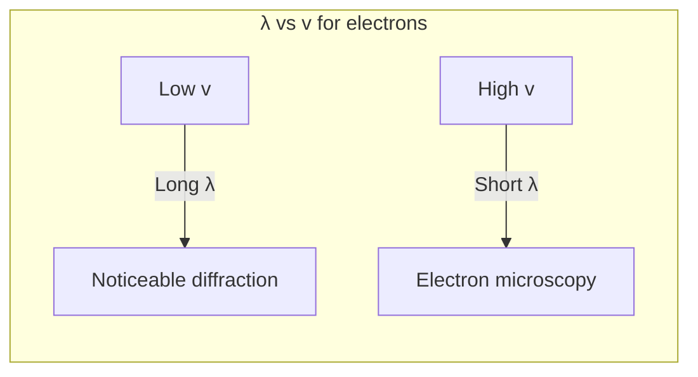

# 1. Overview / 概述

**English:**
This sub-topic extends the revolutionary idea of [[Wave-Particle Duality]] from light to matter itself. While the [[Photoelectric Effect]] demonstrated that light behaves as particles (photons), this section explores the converse: that particles of matter, such as electrons, neutrons, and even atoms, exhibit wave-like properties. The central concept is the [[de Broglie Wavelength]], which assigns a wavelength to any moving particle. This is not merely a theoretical curiosity; it has been experimentally verified through [[Electron Diffraction and the Davisson-Germer Experiment]] and is the fundamental principle behind the [[Electron Microscope]]. Understanding this duality is crucial for grasping the probabilistic nature of quantum mechanics and leads directly to the [[Heisenberg Uncertainty Principle (Qualitative)]].

**中文:**
本子知识点将[[波粒二象性]]的革命性思想从光扩展到物质本身。[[光电效应]]证明了光表现为粒子（光子），而本节则探讨其反面：物质粒子，如电子、中子甚至原子，也表现出波动性质。核心概念是[[德布罗意波长]]，它为任何运动的粒子赋予一个波长。这不仅仅是理论上的好奇；它已通过[[电子衍射与戴维森-革末实验]]得到实验验证，并且是[[电子显微镜]]背后的基本原理。理解这种二象性对于掌握量子力学的概率本质至关重要，并直接引向[[海森堡不确定性原理（定性）]]。

---

# 2. Syllabus Learning Objectives / 考纲学习目标

| CAIE 9702 (22.2 a-f) | Edexcel IAL (WPH14 U4: 7.7-7.12) |
|----------------------|----------------------------------|
| a) Describe and interpret the electron diffraction pattern obtained from a thin polycrystalline graphite film | 7.7 Understand the concept of matter waves and the de Broglie wavelength |
| b) Explain how the diffraction pattern provides evidence for the wave nature of electrons | 7.8 Use the de Broglie equation λ = h/p |
| c) Recall and use the de Broglie equation λ = h/p | 7.9 Describe the experimental evidence for the wave nature of particles (electron diffraction) |
| d) Explain that the wave nature of particles places a fundamental limit on the ability to locate particles (Heisenberg uncertainty principle) | 7.10 Understand the significance of electron diffraction in demonstrating wave-particle duality |
| e) Recall and use the Heisenberg uncertainty principle in the form Δx Δp ≥ h/(4π) | 7.11 Understand the Heisenberg uncertainty principle qualitatively |
| f) Explain how the electron microscope uses the wave nature of electrons | 7.12 Explain how the wave nature of electrons is used in the electron microscope |

**Examiner Expectations / 考官期望:**
- **CAIE:** Students must be able to describe the electron diffraction experiment, interpret the pattern, and use λ = h/p quantitatively. The Heisenberg uncertainty principle is required in its mathematical form.
- **Edexcel:** Focus is on qualitative understanding of matter waves and experimental evidence. The uncertainty principle is qualitative only (no calculation required).

---

# 3. Core Definitions / 核心定义

| Term (EN/CN) | Definition (EN) | Definition (CN) | Common Mistakes / 常见错误 |
|--------------|-----------------|-----------------|---------------------------|
| **Matter Wave** / 物质波 | The wave-like property exhibited by particles of matter, described by the de Broglie wavelength. | 物质粒子表现出的波动性质，由德布罗意波长描述。 | Confusing matter waves with electromagnetic waves — they are fundamentally different. |
| **de Broglie Wavelength** / 德布罗意波长 | The wavelength λ associated with a particle of momentum p, given by λ = h/p. | 与动量为 p 的粒子相关联的波长 λ，由 λ = h/p 给出。 | Forgetting that p = mv, not just mass. |
| **Electron Diffraction** / 电子衍射 | The spreading and interference of an electron beam when passing through a narrow gap or crystal lattice. | 电子束通过窄缝或晶格时发生的扩散和干涉现象。 | Thinking diffraction only applies to light. |
| **Heisenberg Uncertainty Principle** / 海森堡不确定性原理 | The principle stating that it is impossible to simultaneously know both the exact position and exact momentum of a particle. | 该原理指出不可能同时精确知道粒子的位置和动量。 | Thinking it's about measurement error — it's a fundamental limit of nature. |
| **Wave-Particle Duality** / 波粒二象性 | The concept that all quantum entities exhibit both wave-like and particle-like properties depending on the experimental context. | 所有量子实体根据实验环境同时表现出波动性和粒子性的概念。 | Thinking particles "choose" to be waves or particles — they are always both. |

---

# 4. Key Concepts Explained / 关键概念详解

## 4.1 de Broglie's Hypothesis / 德布罗意假说

### Explanation / 解释
**English:**
In 1924, Louis de Broglie proposed that if light (traditionally considered a wave) could behave as a particle, then particles of matter should also behave as waves. He suggested that any particle with momentum $p$ has an associated wavelength $\lambda$ given by:

$$ \lambda = \frac{h}{p} = \frac{h}{mv} $$

where $h$ is [[Planck's Constant]], $m$ is the particle's mass, and $v$ is its velocity. This is the [[de Broglie Wavelength]]. For macroscopic objects, the wavelength is so small it is undetectable, but for subatomic particles like electrons, it is comparable to atomic spacing, making diffraction observable.

**中文:**
1924年，路易·德布罗意提出，如果光（传统上被视为波）可以表现为粒子，那么物质粒子也应该表现为波。他指出，任何具有动量 $p$ 的粒子都有一个相关的波长 $\lambda$，由下式给出：

$$ \lambda = \frac{h}{p} = \frac{h}{mv} $$

其中 $h$ 是[[普朗克常数]]，$m$ 是粒子的质量，$v$ 是其速度。这就是[[德布罗意波长]]。对于宏观物体，波长小到无法探测，但对于像电子这样的亚原子粒子，其波长与原子间距相当，因此可以观察到衍射。

### Physical Meaning / 物理意义
**English:**
The de Broglie wavelength is not a physical wave in space like a water wave. Instead, it is a **probability wave** — its amplitude at any point gives the probability of finding the particle at that point. This is the foundation of quantum mechanics: particles do not have definite trajectories; their behavior is governed by wave equations.

**中文:**
德布罗意波长不是像水波那样的空间物理波。相反，它是一个**概率波**——它在任何一点的振幅给出了在该点找到粒子的概率。这是量子力学的基础：粒子没有确定的轨迹；它们的行为由波动方程支配。

### Common Misconceptions / 常见误区
- ❌ **"Electrons are literally waves"** — They are particles that exhibit wave-like behavior in certain experiments.
- ❌ **"The wavelength depends on the particle's size"** — It depends on momentum, not size.
- ❌ **"Macroscopic objects have no wavelength"** — They do, but it's immeasurably small.

### Exam Tips / 考试提示
- ✅ Always use SI units: mass in kg, velocity in m/s, wavelength in m.
- ✅ For electrons accelerated through a voltage $V$, use $p = \sqrt{2meV}$.
- ✅ Remember: smaller momentum → larger wavelength → more noticeable wave effects.

> 📷 **IMAGE PROMPT — DP-01: de Broglie Wave Concept**
> A conceptual diagram showing a moving electron (small sphere) with a sinusoidal wave superimposed along its path. The wavelength of the wave is labeled λ. The electron's momentum p is shown as an arrow. The equation λ = h/p is displayed. Style: clean educational diagram with blue and purple colors, suitable for A-Level physics textbook.

---

## 4.2 Electron Diffraction Experiment / 电子衍射实验

### Explanation / 解释
**English:**
The definitive evidence for matter waves came from the [[Electron Diffraction and the Davisson-Germer Experiment]]. In a typical A-Level setup, a beam of electrons is accelerated through a high voltage and directed at a thin polycrystalline graphite film. The graphite has many tiny crystals oriented randomly, acting as a diffraction grating. The electrons are diffracted, and the pattern is observed on a fluorescent screen.

The result is a series of concentric rings (diffraction maxima), exactly analogous to the diffraction pattern of X-rays through a crystal. This pattern is impossible to explain using particle theory alone — it is direct evidence of wave behavior.

**中文:**
物质波的决定性证据来自[[电子衍射与戴维森-革末实验]]。在典型的A-Level实验装置中，一束电子通过高电压加速，射向一层薄的多晶石墨薄膜。石墨有许多随机取向的微小晶体，充当衍射光栅。电子被衍射，图案在荧光屏上观察。

结果是同心圆环（衍射极大值）的系列，与X射线通过晶体的衍射图案完全类似。这个图案仅用粒子理论无法解释——它是波动行为的直接证据。

### Physical Meaning / 物理意义
**English:**
The diffraction pattern shows that electrons interfere with themselves as they pass through the crystal lattice. Each electron behaves as a wave, and the pattern builds up one electron at a time. This demonstrates that wave-particle duality is not a collective effect but a property of individual particles.

**中文:**
衍射图案表明电子在通过晶格时与自身发生干涉。每个电子都表现为波，图案是一个电子一个电子地累积形成的。这表明波粒二象性不是集体效应，而是单个粒子的属性。

### Common Misconceptions / 常见误区
- ❌ **"Electrons diffract because they hit each other"** — Diffraction occurs even with single electrons.
- ❌ **"The rings are caused by electrons bouncing off atoms"** — They are caused by constructive interference of electron waves.

### Exam Tips / 考试提示
- ✅ Know how to derive the de Broglie wavelength from accelerating voltage: $\lambda = \frac{h}{\sqrt{2meV}}$.
- ✅ Be able to explain why the rings are circular (random crystal orientations).
- ✅ Understand that increasing voltage → faster electrons → smaller λ → smaller ring diameter.

> 📷 **IMAGE PROMPT — DP-02: Electron Diffraction Setup**
> A labeled diagram of an electron diffraction tube: electron gun (cathode, anode, heater) on the left, thin graphite film in the middle, fluorescent screen on the right showing concentric diffraction rings. Arrows show electron beam path. Labels: "Electron Gun", "Graphite Target", "Diffraction Rings", "Fluorescent Screen". Style: technical schematic, black and white with yellow-green screen glow.

---

# 5. Essential Equations / 核心公式

## 5.1 de Broglie Wavelength / 德布罗意波长

$$ \lambda = \frac{h}{p} = \frac{h}{mv} $$

| Symbol (符号) | Meaning (EN) | Meaning (CN) | Unit (单位) |
|--------------|-------------|-------------|------------|
| $\lambda$ | de Broglie wavelength | 德布罗意波长 | m |
| $h$ | Planck's constant ($6.63 \times 10^{-34}$) | 普朗克常数 | J s |
| $p$ | Momentum of particle | 粒子动量 | kg m s⁻¹ |
| $m$ | Mass of particle | 粒子质量 | kg |
| $v$ | Velocity of particle | 粒子速度 | m s⁻¹ |

**Derivation / 推导:**
De Broglie proposed this by analogy with photons. For a photon, $E = hf = hc/\lambda$ and $E = pc$, so $pc = hc/\lambda$, giving $\lambda = h/p$. He extended this to all particles.

**Conditions / 适用条件:**
- **EN:** Valid for all particles, but wave effects are only observable when λ is comparable to the size of obstacles/apertures.
- **CN:** 适用于所有粒子，但只有当 λ 与障碍物/孔径尺寸相当时，波动效应才可观测。

**Limitations / 局限性:**
- **EN:** Does not account for relativistic effects at very high speeds (use relativistic momentum).
- **CN:** 在极高速度下不考虑相对论效应（需使用相对论动量）。

---

## 5.2 de Broglie Wavelength for Accelerated Electrons / 加速电子的德布罗意波长

$$ \lambda = \frac{h}{\sqrt{2meV}} $$

| Symbol (符号) | Meaning (EN) | Meaning (CN) | Unit (单位) |
|--------------|-------------|-------------|------------|
| $e$ | Elementary charge ($1.60 \times 10^{-19}$) | 元电荷 | C |
| $V$ | Accelerating potential difference | 加速电势差 | V |

**Derivation / 推导:**
Kinetic energy gained: $\frac{1}{2}mv^2 = eV$
Therefore: $v = \sqrt{\frac{2eV}{m}}$
Momentum: $p = mv = m\sqrt{\frac{2eV}{m}} = \sqrt{2meV}$
Substitute into λ = h/p: $\lambda = \frac{h}{\sqrt{2meV}}$

**Conditions / 适用条件:**
- **EN:** Non-relativistic electrons (V < 50 kV typically). For higher voltages, relativistic corrections are needed.
- **CN:** 非相对论电子（通常 V < 50 kV）。更高电压需要相对论修正。

---

## 5.3 Heisenberg Uncertainty Principle / 海森堡不确定性原理

$$ \Delta x \Delta p \geq \frac{h}{4\pi} $$

| Symbol (符号) | Meaning (EN) | Meaning (CN) | Unit (单位) |
|--------------|-------------|-------------|------------|
| $\Delta x$ | Uncertainty in position | 位置不确定度 | m |
| $\Delta p$ | Uncertainty in momentum | 动量不确定度 | kg m s⁻¹ |
| $h$ | Planck's constant | 普朗克常数 | J s |

**Derivation / 推导:**
This is a fundamental principle, not derived from classical physics. It emerges from the wave nature of matter: a wave packet (localized particle) requires a range of wavelengths (momenta).

**Conditions / 适用条件:**
- **EN:** Applies to all quantum systems. The product of uncertainties has a minimum value.
- **CN:** 适用于所有量子系统。不确定度的乘积有最小值。

**Limitations / 局限性:**
- **EN:** The principle gives a lower bound, not an exact value. Actual uncertainties may be larger.
- **CN:** 该原理给出下限，而非精确值。实际不确定度可能更大。

> 📋 **CAIE Only:** Students must be able to use the Heisenberg uncertainty principle in calculations.
> 📋 **Edexcel Only:** The uncertainty principle is qualitative only — no calculations required.

---

# 6. Graphs and Relationships / 图表与关系

## 6.1 de Broglie Wavelength vs. Particle Speed / 德布罗意波长与粒子速度的关系

### Axes / 坐标轴
- **X-axis:** Particle speed $v$ (m s⁻¹) / 粒子速度
- **Y-axis:** de Broglie wavelength $\lambda$ (m) / 德布罗意波长

### Shape / 形状
**English:** Inverse relationship: $\lambda \propto 1/v$. The graph is a decreasing curve (hyperbola-like). For a fixed mass, as speed increases, wavelength decreases rapidly.

**中文:** 反比关系：$\lambda \propto 1/v$。图形是递减曲线（类似双曲线）。对于固定质量，速度增加时波长迅速减小。

### Gradient Meaning / 斜率含义
**English:** The gradient $d\lambda/dv = -h/(mv^2)$ is negative and its magnitude decreases as $v$ increases.

**中文:** 斜率 $d\lambda/dv = -h/(mv^2)$ 为负，其大小随 $v$ 增加而减小。

### Area Meaning / 面积含义
**English:** No direct physical meaning for the area under this curve.

**中文:** 曲线下面积无直接物理意义。

### Exam Interpretation / 考试解读
**English:** Be able to sketch this graph and explain why electrons need high speed (high voltage) to have wavelengths small enough for practical applications like electron microscopy.

**中文:** 能够画出此图并解释为什么电子需要高速（高电压）才能获得足够小的波长用于实际应用，如电子显微镜。



---

## 6.2 Electron Diffraction Ring Diameter vs. Accelerating Voltage / 电子衍射环直径与加速电压的关系

### Axes / 坐标轴
- **X-axis:** $1/\sqrt{V}$ (V⁻¹/²) / 加速电压平方根的倒数
- **Y-axis:** Ring diameter $D$ (m) / 环直径

### Shape / 形状
**English:** Linear relationship. Since $\lambda \propto 1/\sqrt{V}$ and $D \propto \lambda$, we get $D \propto 1/\sqrt{V}$. A graph of $D$ against $1/\sqrt{V}$ is a straight line through the origin.

**中文:** 线性关系。由于 $\lambda \propto 1/\sqrt{V}$ 且 $D \propto \lambda$，得到 $D \propto 1/\sqrt{V}$。$D$ 对 $1/\sqrt{V}$ 的图形是通过原点的直线。

### Gradient Meaning / 斜率含义
**English:** The gradient is proportional to $h/\sqrt{2me}$, allowing experimental determination of Planck's constant.

**中文:** 斜率与 $h/\sqrt{2me}$ 成正比，可用于实验测定普朗克常数。

### Area Meaning / 面积含义
**English:** No direct physical meaning.

**中文:** 无直接物理意义。

### Exam Interpretation / 考试解读
**English:** This is a common experimental analysis question. Be able to explain why plotting $D$ vs $1/\sqrt{V}$ gives a straight line and how to use it to find $h$.

**中文:** 这是常见的实验分析题。能够解释为什么绘制 $D$ 对 $1/\sqrt{V}$ 的图得到直线，以及如何用它求 $h$。

---

# 7. Required Diagrams / 必备图表

## 7.1 Electron Diffraction Tube / 电子衍射管

### Description / 描述
**English:**
A sealed glass tube containing an electron gun (heated cathode, anode), a thin polycrystalline graphite target, and a fluorescent screen. The entire setup is under vacuum to prevent electron scattering by air molecules.

**中文:**
一个密封的玻璃管，包含电子枪（加热阴极、阳极）、薄多晶石墨靶和荧光屏。整个装置处于真空中，以防止电子被空气分子散射。

### Image Prompt / 图片生成提示
> 📷 **IMAGE PROMPT — DP-03: Electron Diffraction Tube Diagram**
> Cross-sectional diagram of an electron diffraction tube. Left side: electron gun with labeled components (heater, cathode, anode, focusing electrode). Center: thin graphite film mounted on a support. Right side: curved fluorescent screen showing concentric diffraction rings. Electron beam path shown as dashed line from gun through graphite to screen. Labels with arrows for all components. Voltage source symbol connected to anode. Style: clear technical drawing, black lines on white background, suitable for A-Level physics.

### Labels Required / 需要标注
| English | 中文 |
|---------|------|
| Heater | 加热器 |
| Cathode (-) | 阴极 (-) |
| Anode (+) | 阳极 (+) |
| Electron beam | 电子束 |
| Graphite target | 石墨靶 |
| Fluorescent screen | 荧光屏 |
| Diffraction rings | 衍射环 |
| Vacuum | 真空 |

### Exam Importance / 考试重要性
**English:** High. Students must be able to draw and label this diagram, and explain the function of each component.

**中文:** 高。学生必须能够画出并标注此图，并解释每个组件的功能。

---

## 7.2 Diffraction Pattern from Polycrystalline Graphite / 多晶石墨的衍射图案

### Description / 描述
**English:**
A pattern of concentric bright rings on a dark background, observed on the fluorescent screen. The rings are brightest at the center and become fainter outward. The ring diameters decrease when the accelerating voltage is increased.

**中文:**
在荧光屏上观察到的同心亮环图案，背景为暗色。中心环最亮，向外逐渐变暗。加速电压增加时，环直径减小。

### Image Prompt / 图片生成提示
> 📷 **IMAGE PROMPT — DP-04: Electron Diffraction Pattern**
> A circular diffraction pattern showing 3-4 concentric bright rings on a dark background. The central spot is brightest, rings become progressively fainter and more closely spaced outward. The pattern should look like a target with rings. Style: realistic simulation of a fluorescent screen display, greenish-yellow glow, slightly blurred edges.

### Labels Required / 需要标注
| English | 中文 |
|---------|------|
| Central maximum (undiffracted beam) | 中央极大（未衍射束） |
| First-order maximum | 一级极大 |
| Second-order maximum | 二级极大 |
| Ring diameter D | 环直径 D |

### Exam Importance / 考试重要性
**English:** High. Students must be able to sketch the pattern and explain why rings (not spots) are formed.

**中文:** 高。学生必须能够画出图案并解释为什么形成环而不是点。

---

# 8. Worked Examples / 典型例题

## Example 1: de Broglie Wavelength Calculation / 例1：德布罗意波长计算

### Question / 题目
**English:**
An electron is accelerated through a potential difference of 150 V. Calculate:
(a) The de Broglie wavelength of the electron.
(b) The speed of the electron.
(Given: $h = 6.63 \times 10^{-34}$ J s, $m_e = 9.11 \times 10^{-31}$ kg, $e = 1.60 \times 10^{-19}$ C)

**中文:**
一个电子通过150 V的电势差加速。计算：
(a) 电子的德布罗意波长。
(b) 电子的速度。
（已知：$h = 6.63 \times 10^{-34}$ J s，$m_e = 9.11 \times 10^{-31}$ kg，$e = 1.60 \times 10^{-19}$ C）

### Solution / 解答

**Step 1: Find the kinetic energy / 求动能**
$$ KE = eV = (1.60 \times 10^{-19})(150) = 2.40 \times 10^{-17} \text{ J} $$

**Step 2: Find the speed / 求速度**
$$ \frac{1}{2}mv^2 = eV $$
$$ v = \sqrt{\frac{2eV}{m}} = \sqrt{\frac{2(1.60 \times 10^{-19})(150)}{9.11 \times 10^{-31}}} $$
$$ v = \sqrt{\frac{4.80 \times 10^{-17}}{9.11 \times 10^{-31}}} = \sqrt{5.27 \times 10^{13}} $$
$$ v = 7.26 \times 10^6 \text{ m s}^{-1} $$

**Step 3: Find the de Broglie wavelength / 求德布罗意波长**
$$ \lambda = \frac{h}{p} = \frac{h}{mv} = \frac{6.63 \times 10^{-34}}{(9.11 \times 10^{-31})(7.26 \times 10^6)} $$
$$ \lambda = \frac{6.63 \times 10^{-34}}{6.61 \times 10^{-24}} = 1.00 \times 10^{-10} \text{ m} $$

**Alternative method using formula / 使用公式的替代方法:**
$$ \lambda = \frac{h}{\sqrt{2meV}} = \frac{6.63 \times 10^{-34}}{\sqrt{2(9.11 \times 10^{-31})(1.60 \times 10^{-19})(150)}} $$
$$ \lambda = \frac{6.63 \times 10^{-34}}{\sqrt{4.37 \times 10^{-47}}} = \frac{6.63 \times 10^{-34}}{6.61 \times 10^{-24}} = 1.00 \times 10^{-10} \text{ m} $$

### Final Answer / 最终答案
**Answer:** (a) $\lambda = 1.00 \times 10^{-10}$ m (0.100 nm) | **答案：** (a) $\lambda = 1.00 \times 10^{-10}$ m (0.100 nm)
(b) $v = 7.26 \times 10^6$ m s⁻¹ | (b) $v = 7.26 \times 10^6$ m s⁻¹

### Quick Tip / 提示
**English:** The wavelength of 0.1 nm is comparable to atomic spacing in crystals (~0.2-0.3 nm), which is why electron diffraction is observable. Memorize the combined formula $\lambda = h/\sqrt{2meV}$ for efficiency.

**中文:** 0.1 nm的波长与晶体中的原子间距（约0.2-0.3 nm）相当，这就是为什么可以观察到电子衍射。记住组合公式 $\lambda = h/\sqrt{2meV}$ 以提高效率。

---

## Example 2: Heisenberg Uncertainty Principle / 例2：海森堡不确定性原理

### Question / 题目
**English:**
An electron is confined within a region of size $1.0 \times 10^{-10}$ m (approximately the size of an atom). Using the Heisenberg uncertainty principle, estimate the minimum uncertainty in the electron's momentum and hence its minimum kinetic energy.
(Given: $h = 6.63 \times 10^{-34}$ J s, $m_e = 9.11 \times 10^{-31}$ kg)

**中文:**
一个电子被限制在大小为 $1.0 \times 10^{-10}$ m 的区域中（大约一个原子的大小）。利用海森堡不确定性原理，估计电子动量的最小不确定度，从而估计其最小动能。
（已知：$h = 6.63 \times 10^{-34}$ J s，$m_e = 9.11 \times 10^{-31}$ kg）

### Solution / 解答

**Step 1: Apply the uncertainty principle / 应用不确定性原理**
$$ \Delta x \Delta p \geq \frac{h}{4\pi} $$
$$ \Delta p \geq \frac{h}{4\pi \Delta x} = \frac{6.63 \times 10^{-34}}{4\pi (1.0 \times 10^{-10})} $$
$$ \Delta p \geq \frac{6.63 \times 10^{-34}}{1.26 \times 10^{-9}} = 5.28 \times 10^{-25} \text{ kg m s}^{-1} $$

**Step 2: Estimate minimum kinetic energy / 估计最小动能**
The minimum momentum is approximately equal to the uncertainty: $p_{min} \approx \Delta p$
$$ KE_{min} = \frac{p_{min}^2}{2m} = \frac{(5.28 \times 10^{-25})^2}{2(9.11 \times 10^{-31})} $$
$$ KE_{min} = \frac{2.79 \times 10^{-49}}{1.82 \times 10^{-30}} = 1.53 \times 10^{-19} \text{ J} $$

**Convert to eV / 转换为 eV:**
$$ KE_{min} = \frac{1.53 \times 10^{-19}}{1.60 \times 10^{-19}} = 0.956 \text{ eV} $$

### Final Answer / 最终答案
**Answer:** $\Delta p \geq 5.28 \times 10^{-25}$ kg m s⁻¹, $KE_{min} \approx 0.96$ eV | **答案：** $\Delta p \geq 5.28 \times 10^{-25}$ kg m s⁻¹，$KE_{min} \approx 0.96$ eV

### Quick Tip / 提示
**English:** This explains why electrons in atoms have "zero-point energy" — they cannot be stationary because that would require $\Delta p = 0$, violating the uncertainty principle.

**中文:** 这解释了为什么原子中的电子有"零点能"——它们不能静止，因为那需要 $\Delta p = 0$，违反不确定性原理。

> 📋 **Edexcel Only:** This calculation is NOT required for Edexcel. Focus on qualitative understanding only.

---

# 9. Past Paper Question Types / 历年真题题型

| Question Type / 题型 | Frequency / 频率 | Difficulty / 难度 | Past Paper References / 真题索引 |
|----------------------|------------------|------------------|-------------------------------|
| Calculate de Broglie wavelength from accelerating voltage | Very High | Medium | 📝 *待填入* |
| Explain electron diffraction pattern formation | High | Medium | 📝 *待填入* |
| Describe the electron diffraction experiment | High | Low | 📝 *待填入* |
| Compare electron and X-ray diffraction | Medium | Medium | 📝 *待填入* |
| Heisenberg uncertainty principle calculation (CAIE only) | Medium | High | 📝 *待填入* |
| Explain how electron microscope works | Medium | Medium | 📝 *待填入* |
| Derive λ = h/√(2meV) | Low | Medium | 📝 *待填入* |

**Common Command Words / 常见指令词:**
| English | 中文 |
|---------|------|
| Calculate | 计算 |
| Explain | 解释 |
| Describe | 描述 |
| Derive | 推导 |
| Show that | 证明 |
| Suggest | 提出 |
| Compare | 比较 |

---

# 10. Practical Skills Connections / 实验技能链接

**English:**
This sub-topic connects to practical work in several ways:

1. **Electron Diffraction Experiment:** Students should understand the setup, including the need for vacuum, high voltage supply, and the role of each component. Key measurements include accelerating voltage and ring diameter.

2. **Graph Plotting:** Plotting ring diameter $D$ against $1/\sqrt{V}$ yields a straight line. The gradient can be used to determine Planck's constant $h$ experimentally.

3. **Uncertainties:** The main sources of uncertainty are:
   - Measuring ring diameters (blurred edges)
   - Voltage fluctuations
   - Graphite film thickness variations

4. **Experimental Design:** Students should be able to suggest improvements, such as using a monochromatic electron beam or a more precise measurement system.

5. **Safety:** High voltages (several kV) are used — safety precautions are essential.

**中文:**
本子知识点在多个方面与实验工作相关：

1. **电子衍射实验：** 学生应理解实验装置，包括真空的必要性、高压电源以及每个组件的作用。关键测量包括加速电压和环直径。

2. **图表绘制：** 绘制环直径 $D$ 对 $1/\sqrt{V}$ 的图得到直线。斜率可用于实验测定普朗克常数 $h$。

3. **不确定度：** 不确定度的主要来源包括：
   - 测量环直径（边缘模糊）
   - 电压波动
   - 石墨薄膜厚度变化

4. **实验设计：** 学生应能提出改进建议，如使用单色电子束或更精确的测量系统。

5. **安全：** 使用高电压（数千伏）——安全预防措施至关重要。

---

# 11. Concept Map / 概念图谱

```mermaid
graph TD
    %% Main concept
    WPD[Wave-Particle Duality for Matter] --> dB[de Broglie Wavelength]
    WPD --> ED[Electron Diffraction]
    WPD --> HUP[Heisenberg Uncertainty Principle]
    WPD --> EM[Electron Microscope]
    
    %% de Broglie connections
    dB --> EQ[λ = h/p = h/mv]
    dB --> EQ2[λ = h/√(2meV)]
    dB --> WAVE[Wave Nature of Particles]
    
    %% Electron diffraction connections
    ED --> DG[Davisson-Germer Experiment]
    ED --> GRAPHITE[Polycrystalline Graphite]
    ED --> PATTERN[Diffraction Rings]
    ED --> EVIDENCE[Experimental Evidence]
    
    %% Uncertainty principle connections
    HUP --> POS[Δx Uncertainty in Position]
    HUP --> MOM[Δp Uncertainty in Momentum]
    HUP --> LIMIT[Fundamental Limit]
    
    %% Electron microscope connections
    EM --> RESOLUTION[High Resolution]
    EM --> SHORT_λ[Short λ → Better Resolution]
    
    %% Prerequisites
    PE[Photoelectric Effect] -.-> WPD
    PLANCK[Planck's Constant h] -.-> dB
    
    %% Sibling links
    dB -.-> ED
    ED -.-> HUP
    HUP -.-> EM
    
    %% Styling
    classDef main fill:#e1f5fe,stroke:#01579b,stroke-width:2px
    classDef sub fill:#fff3e0,stroke:#e65100,stroke-width:1px
    classDef eq fill:#f3e5f5,stroke:#4a148c,stroke-width:1px
    classDef exp fill:#e8f5e9,stroke:#1b5e20,stroke-width:1px
    
    class WPD main
    class dB,ED,HUP,EM sub
    class EQ,EQ2 eq
    class DG,GRAPHITE,PATTERN,EVIDENCE exp
```

---

# 12. Quick Revision Sheet / 速查表

| Category / 类别 | Key Points / 要点 |
|----------------|------------------|
| **Definition / 定义** | Matter waves: particles of matter exhibit wave-like properties with wavelength λ = h/p |
| **Key Formula / 核心公式** | λ = h/p = h/(mv); For electrons: λ = h/√(2meV); HUP: ΔxΔp ≥ h/(4π) |
| **Key Experiment / 核心实验** | Electron diffraction through polycrystalline graphite → concentric rings on screen |
| **Key Graph / 核心图表** | D (ring diameter) vs 1/√V → straight line through origin |
| **Evidence / 证据** | Diffraction pattern cannot be explained by particle theory alone; proves wave nature |
| **Electron Microscope / 电子显微镜** | Uses short λ of electrons (vs light) for much higher resolution |
| **HUP Meaning / 不确定性原理含义** | Cannot know both position and momentum exactly; fundamental limit, not measurement error |
| **Common Calculation / 常见计算** | Find λ from V; find V needed for given λ; estimate Δp from Δx using HUP |
| **Exam Tip / 考试提示** | Always use SI units; remember h = 6.63×10⁻³⁴ J s; check if relativistic effects matter |
| **CAIE Only / 仅CAIE** | HUP calculations required; must know ΔxΔp ≥ h/(4π) |
| **Edexcel Only / 仅Edexcel** | HUP qualitative only; focus on experimental evidence and applications |