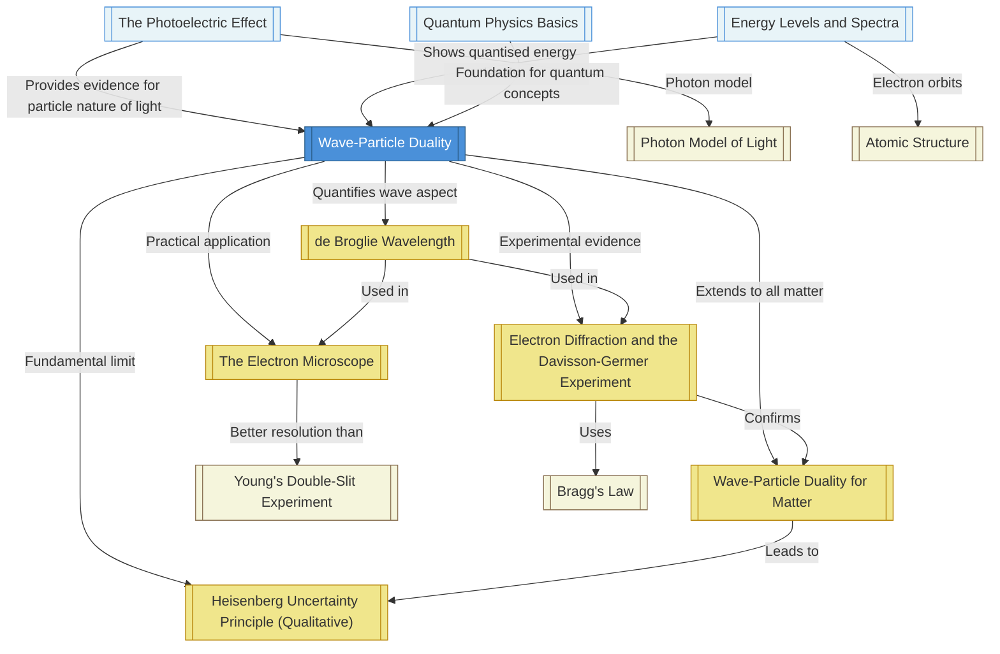

# 1. Overview / 概述

**English:**
Wave-particle duality is a cornerstone of quantum physics, stating that all quantum entities—such as electrons, photons, and neutrons—exhibit both wave-like and particle-like properties depending on the experimental context. This concept resolves the apparent paradox that light behaves as a wave in interference experiments (e.g., [[Young's Double-Slit Experiment]]) yet as a particle in the [[The Photoelectric Effect]]. Crucially, the same duality applies to matter: electrons, once thought to be purely particles, display diffraction patterns when passed through a crystal lattice, confirming [[de Broglie Wavelength]] theory.

This topic is vital for understanding the breakdown of classical physics at the atomic scale. Real-world applications include the [[The Electron Microscope]], which uses electron waves to achieve nanometer resolution, and quantum tunnelling in semiconductor devices. In both Cambridge 9702 (Section 22.2) and Edexcel IAL (Unit 4, Topic 7.7–7.12), students must explain experimental evidence, calculate de Broglie wavelengths, and discuss the [[Heisenberg Uncertainty Principle (Qualitative)]]. The topic bridges [[Energy Levels and Spectra]] and quantum mechanics, forming a gateway to modern physics.

**中文：**
波粒二象性是量子物理的基石，指出所有量子实体（如电子、光子和中子）根据实验环境同时表现出波动性和粒子性。这一概念解决了光在干涉实验（如[[杨氏双缝实验]]）中表现为波，而在[[光电效应]]中表现为粒子的明显矛盾。同样，物质也具有二象性：曾经被认为是纯粒子的电子，在通过晶体晶格时显示出衍射图案，证实了[[德布罗意波长]]理论。

本主题对于理解经典物理在原子尺度上的失效至关重要。实际应用包括[[电子显微镜]]（利用电子波实现纳米级分辨率）以及半导体器件中的量子隧穿。在剑桥9702（第22.2节）和爱德思IAL（第4单元，第7.7–7.12节）中，学生必须解释实验证据、计算德布罗意波长，并讨论[[海森堡不确定性原理（定性）]]。该主题连接了[[能级与光谱]]和量子力学，是通往现代物理的大门。

---

# 2. Syllabus Learning Objectives / 考纲学习目标

**English:**
The table below maps the specific learning objectives from Cambridge 9702 and Edexcel IAL. Both boards require a qualitative understanding of wave-particle duality, quantitative use of the de Broglie equation, and knowledge of key experiments. Differences are highlighted in callouts.

**中文：**
下表列出了剑桥9702和爱德思IAL的具体学习目标。两个考试局都要求对波粒二象性有定性理解、定量使用德布罗意方程，以及了解关键实验。差异在标注中突出显示。

| CAIE 9702 (22.2 a–f) | Edexcel IAL (WPH14 U4: 7.7–7.12) |
|----------------------|----------------------------------|
| 22.2(a) Describe and interpret the evidence for wave–particle duality provided by electron diffraction experiments, including the [[Davisson-Germer Experiment]] | 7.7 Explain that electron diffraction provides evidence for the wave nature of particles |
| 22.2(b) Recall and use the de Broglie equation λ = h/p | 7.8 Use the de Broglie equation λ = h/p to calculate the wavelength of a particle |
| 22.2(c) Describe and explain the principle of the [[The Electron Microscope]] | 7.9 Explain how the wave nature of electrons is used in the electron microscope |
| 22.2(d) Explain the meaning of the term wave–particle duality | 7.10 Describe the concept of wave–particle duality |
| 22.2(e) Describe and explain the evidence for wave–particle duality provided by the [[The Photoelectric Effect]] | 7.11 Explain that the photoelectric effect provides evidence for the particle nature of light |
| 22.2(f) Discuss the [[Heisenberg Uncertainty Principle (Qualitative)]] in terms of the dual nature of matter | 7.12 Discuss the Heisenberg uncertainty principle qualitatively |

> 📋 **CIE Only:** CAIE explicitly requires students to describe the [[Davisson-Germer Experiment]] in detail, including the experimental setup and the interpretation of diffraction patterns. Edexcel mentions electron diffraction generally but does not name the experiment.
>
> 📋 **Edexcel Only:** Edexcel places greater emphasis on the quantitative use of the de Broglie equation in problem-solving, including rearrangements and unit conversions. CAIE focuses more on qualitative description.

**Examiner Expectations / 考官期望：**
- **English:** Students must be able to state that wave-particle duality is not a choice between two models but a fundamental property. For calculations, always convert mass to kg and velocity to m/s. For explanations, use the phrase "the wave nature of matter" and "the particle nature of light."
- **中文：** 学生必须能够说明波粒二象性不是在两种模型之间选择，而是一种基本属性。计算时，始终将质量转换为千克，速度转换为米/秒。解释时，使用“物质的波动性”和“光的粒子性”等短语。

---

# 3. Core Definitions / 核心定义

**English:**
The following table provides exam-standard definitions for all key terms in this topic. Common mistakes are highlighted to help students avoid losing marks.

**中文：**
下表提供了本主题所有关键术语的考试标准定义。常见错误已突出显示，以帮助学生避免失分。

| Term (EN/CN) | Definition (EN) | Definition (CN) | Common Mistakes / 常见错误 |
|--------------|-----------------|-----------------|---------------------------|
| **Wave-Particle Duality** / 波粒二象性 | The concept that all quantum entities exhibit both wave-like and particle-like properties, depending on the experimental arrangement. | 所有量子实体根据实验设置同时表现出波动性和粒子性的概念。 | ❌ Saying "light is sometimes a wave and sometimes a particle" — it is always both; the experiment determines which property is observed. |
| **[[de Broglie Wavelength]]** / 德布罗意波长 | The wavelength associated with a moving particle, given by λ = h/p, where h is Planck's constant and p is the momentum. | 与运动粒子相关的波长，由 λ = h/p 给出，其中 h 是普朗克常数，p 是动量。 | ❌ Forgetting that p = mv (non-relativistic) or using wrong units (e.g., g instead of kg). |
| **[[Electron Diffraction]]** / 电子衍射 | The spreading and interference of electron waves when they pass through a narrow aperture or crystal lattice, producing a diffraction pattern. | 电子波通过窄孔或晶体晶格时发生的扩散和干涉，产生衍射图案。 | ❌ Confusing diffraction with refraction; diffraction is due to wave nature, not change in medium. |
| **[[The Photoelectric Effect]]** / 光电效应 | The emission of electrons from a metal surface when electromagnetic radiation of sufficient frequency is incident upon it. | 当足够频率的电磁辐射入射到金属表面时，电子从金属表面发射的现象。 | ❌ Thinking intensity affects electron energy — it only affects current. Frequency determines energy. |
| **[[Heisenberg Uncertainty Principle (Qualitative)]]** / 海森堡不确定性原理（定性） | It is impossible to simultaneously know both the exact position and exact momentum of a particle; the product of their uncertainties is at least h/4π. | 不可能同时知道粒子的精确位置和精确动量；它们不确定度的乘积至少为 h/4π。 | ❌ Thinking it is about measurement error — it is a fundamental limit of nature, not a limitation of instruments. |
| **[[The Electron Microscope]]** / 电子显微镜 | A device that uses a beam of electrons (with very short de Broglie wavelengths) to image objects at much higher resolution than optical microscopes. | 使用电子束（具有非常短的德布罗意波长）以比光学显微镜高得多的分辨率对物体成像的设备。 | ❌ Forgetting that the resolution limit is due to wavelength; shorter wavelength = better resolution. |
| **[[Davisson-Germer Experiment]]** / 戴维森-革末实验 | An experiment that fired electrons at a nickel crystal and observed a diffraction pattern, confirming the wave nature of electrons. | 将电子射向镍晶体并观察到衍射图案的实验，证实了电子的波动性。 | ❌ Thinking the experiment proved light is a wave — it proved electrons (matter) have wave properties. |

---

# 4. Key Concepts Explained / 关键概念详解

## 4.1 Wave-Particle Duality / 波粒二象性

### Explanation / 解释
**English:**
Wave-particle duality is the central paradox of quantum mechanics. It states that every quantum entity (photon, electron, neutron, etc.) has a dual nature. In experiments designed to measure wave properties (e.g., [[Young's Double-Slit Experiment]] with electrons), the entity behaves as a wave, showing interference and diffraction. In experiments designed to measure particle properties (e.g., [[The Photoelectric Effect]]), it behaves as a particle, with discrete energy and momentum. This is not a compromise—it is a fundamental description of reality. The [[de Broglie Wavelength]] quantifies the wave aspect: λ = h/p. The particle aspect is described by momentum p = mv.

**中文：**
波粒二象性是量子力学的核心悖论。它指出每个量子实体（光子、电子、中子等）都具有双重性质。在旨在测量波动性的实验中（例如，使用电子的[[杨氏双缝实验]]），该实体表现为波，显示出干涉和衍射。在旨在测量粒子性的实验中（例如，[[光电效应]]），它表现为粒子，具有离散的能量和动量。这不是妥协——而是对现实的基本描述。[[德布罗意波长]]量化了波动方面：λ = h/p。粒子方面由动量 p = mv 描述。

### Physical Meaning / 物理意义
**English:**
In everyday life, we never see an object that is both a wave and a particle. A baseball has a de Broglie wavelength of about 10⁻³⁴ m—far too small to detect. But for an electron (mass 9.11 × 10⁻³¹ kg) moving at 10⁶ m/s, λ ≈ 7 × 10⁻¹⁰ m, comparable to atomic spacing. This is why electron waves interact with crystal lattices. The duality means that at the quantum scale, the classical distinction between "wave" and "particle" breaks down.

**中文：**
在日常生活中，我们从未见过既是波又是粒子的物体。棒球的德布罗意波长约为 10⁻³⁴ 米——小到无法检测。但对于电子（质量 9.11 × 10⁻³¹ 千克）以 10⁶ 米/秒运动时，λ ≈ 7 × 10⁻¹⁰ 米，与原子间距相当。这就是为什么电子波会与晶体晶格相互作用。二象性意味着在量子尺度上，“波”和“粒子”之间的经典区分失效了。

### Common Misconceptions / 常见误区
1. **"Light is a wave sometimes and a particle sometimes."** → Incorrect. Light is always both; the experiment determines which property is observed.
2. **"Electrons are particles that also have wave properties."** → Incorrect. Electrons are quantum entities that are neither classical waves nor classical particles.
3. **"Wave-particle duality means we can choose."** → Incorrect. The duality is a fundamental property, not a choice.

### Exam Tips / 考试提示
**English:**
- Use the phrase "complementary properties" to show understanding.
- For CAIE, be ready to describe the [[Davisson-Germer Experiment]] in detail.
- For Edexcel, practice calculating λ for electrons accelerated through a known voltage.
- Always state: "The wave nature is demonstrated by diffraction; the particle nature is demonstrated by the photoelectric effect."

**中文：**
- 使用“互补性质”这一短语来展示理解。
- 对于剑桥，准备好详细描述[[戴维森-革末实验]]。
- 对于爱德思，练习计算通过已知电压加速的电子的 λ。
- 始终说明：“波动性由衍射证明；粒子性由光电效应证明。”

> 📷 **IMAGE PROMPT — [WPD-01]: Conceptual Diagram of Wave-Particle Duality**
>
> A split-screen illustration. Left side: a double-slit experiment with electrons showing an interference pattern on a screen, with wavefronts passing through two slits. Right side: a photoelectric effect setup with photons hitting a metal surface and electrons being ejected. In the center, a glowing quantum entity (represented as a blurred sphere) with arrows pointing to both sides. Labels: "Wave Nature: Interference & Diffraction" and "Particle Nature: Discrete Energy & Momentum." Style: clean educational diagram, blue and orange color scheme, 2D flat vector.

---

## 4.2 de Broglie Wavelength / 德布罗意波长

### Explanation / 解释
**English:**
Louis de Broglie proposed in 1924 that all matter has a wavelength associated with it, given by λ = h/p, where h = 6.63 × 10⁻³⁴ J s (Planck's constant) and p = mv (momentum). This was a revolutionary idea: if light (a wave) can behave as a particle, then matter (particles) should behave as waves. The wavelength is inversely proportional to momentum: faster or more massive particles have shorter wavelengths. This is why macroscopic objects have undetectably small wavelengths, while electrons have wavelengths comparable to atomic spacing.

**中文：**
路易·德布罗意在1924年提出，所有物质都具有与之相关的波长，由 λ = h/p 给出，其中 h = 6.63 × 10⁻³⁴ J·s（普朗克常数），p = mv（动量）。这是一个革命性的想法：如果光（波）可以表现为粒子，那么物质（粒子）也应该表现为波。波长与动量成反比：更快或更重的粒子具有更短的波长。这就是为什么宏观物体具有无法检测的极小波长，而电子的波长与原子间距相当。

### Physical Meaning / 物理意义
**English:**
The de Broglie wavelength explains why electron diffraction occurs. When electrons are accelerated through a voltage V, they gain kinetic energy eV = ½mv². Their momentum p = √(2meV). Substituting into λ = h/p gives λ = h/√(2meV). For V = 100 V, λ ≈ 1.2 × 10⁻¹⁰ m, which is the same order as atomic spacing in crystals (~10⁻¹⁰ m). This is why crystals act as diffraction gratings for electrons.

**中文：**
德布罗意波长解释了为什么电子衍射会发生。当电子通过电压 V 加速时，它们获得动能 eV = ½mv²。它们的动量 p = √(2meV)。代入 λ = h/p 得到 λ = h/√(2meV)。对于 V = 100 V，λ ≈ 1.2 × 10⁻¹⁰ m，与晶体中的原子间距（~10⁻¹⁰ m）同数量级。这就是为什么晶体可以作为电子的衍射光栅。

### Common Misconceptions / 常见误区
1. **"The de Broglie wavelength is the same as the electromagnetic wavelength."** → Incorrect. It is a matter wave, not an EM wave.
2. **"Only electrons have a de Broglie wavelength."** → Incorrect. All particles have one, but it is only detectable for very small masses.
3. **"λ = h/mv is always valid."** → Incorrect. For relativistic speeds (v > 0.1c), relativistic momentum must be used.

### Exam Tips / 考试提示
**English:**
- Always convert mass to kg and velocity to m/s.
- For electrons accelerated by voltage V, use: λ = h/√(2meV).
- Memorise: h = 6.63 × 10⁻³⁴ J s, m_e = 9.11 × 10⁻³¹ kg, e = 1.60 × 10⁻¹⁹ C.
- Common exam question: "Calculate the de Broglie wavelength of an electron accelerated through 150 V."

**中文：**
- 始终将质量转换为千克，速度转换为米/秒。
- 对于由电压 V 加速的电子，使用：λ = h/√(2meV)。
- 记住：h = 6.63 × 10⁻³⁴ J·s，m_e = 9.11 × 10⁻³¹ kg，e = 1.60 × 10⁻¹⁹ C。
- 常见考题：“计算通过 150 V 加速的电子的德布罗意波长。”

---

## 4.3 Electron Diffraction and the Davisson-Germer Experiment / 电子衍射与戴维森-革末实验

### Explanation / 解释
**English:**
In 1927, Clinton Davisson and Lester Germer fired a beam of electrons at a nickel crystal. They observed that the electrons were scattered at specific angles, producing a diffraction pattern—a series of concentric rings. This pattern is identical to what would be expected if X-rays (waves) were diffracted by the crystal. The experiment confirmed de Broglie's hypothesis: electrons behave as waves. The diffraction angle θ satisfies the Bragg condition: nλ = 2d sinθ, where d is the atomic spacing in the crystal.

**中文：**
1927年，克林顿·戴维森和莱斯特·革末将一束电子射向镍晶体。他们观察到电子以特定角度散射，产生衍射图案——一系列同心环。这个图案与X射线（波）被晶体衍射时预期的图案完全相同。该实验证实了德布罗意的假设：电子表现为波。衍射角 θ 满足布拉格条件：nλ = 2d sinθ，其中 d 是晶体中的原子间距。

### Physical Meaning / 物理意义
**English:**
The experiment provides direct evidence for the wave nature of matter. If electrons were purely particles, they would scatter randomly in all directions. Instead, constructive and destructive interference occurs, producing bright and dark rings. The wavelength calculated from the diffraction pattern matches the de Broglie wavelength predicted by λ = h/p. This is one of the most important experiments in quantum physics.

**中文：**
该实验为物质的波动性提供了直接证据。如果电子是纯粒子，它们会随机向各个方向散射。相反，发生了相长和相消干涉，产生明暗环。从衍射图案计算出的波长与由 λ = h/p 预测的德布罗意波长一致。这是量子物理学中最重要的实验之一。

### Common Misconceptions / 常见误区
1. **"The experiment proved that electrons are waves."** → Incorrect. It proved that electrons exhibit wave-like behaviour under certain conditions.
2. **"The diffraction pattern is due to electrons hitting each other."** → Incorrect. It is due to interference of electron waves with the crystal lattice.
3. **"Only nickel crystals work."** → Incorrect. Any crystal with regular atomic spacing can produce diffraction.

### Exam Tips / 考试提示
**English:**
- For CAIE, describe the setup: electron gun, nickel crystal target, detector/fluorescent screen.
- Mention that the accelerating voltage was varied, changing the electron wavelength.
- State that the diffraction pattern confirmed λ = h/p.
- For Edexcel, focus on the interpretation of the pattern as evidence for wave nature.

**中文：**
- 对于剑桥，描述实验装置：电子枪、镍晶体靶、探测器/荧光屏。
- 提到加速电压被改变，从而改变了电子波长。
- 说明衍射图案证实了 λ = h/p。
- 对于爱德思，重点解释图案作为波动性证据的意义。

> 📷 **IMAGE PROMPT — [WPD-02]: Davisson-Germer Experiment Setup**
>
> A schematic diagram showing: (1) An electron gun on the left, with a heated filament and accelerating anode. (2) A beam of electrons (dashed lines) traveling to the right. (3) A nickel crystal target in the center, with atoms shown as small spheres in a regular lattice. (4) A curved detector screen on the right showing a diffraction pattern of concentric rings. Labels: "Electron Gun," "Nickel Crystal (d = 0.215 nm)," "Diffraction Pattern," "θ = Diffraction Angle." Style: clean 2D schematic, black and white with blue highlights, educational diagram.

---

## 4.4 The Electron Microscope / 电子显微镜

### Explanation / 解释
**English:**
The [[The Electron Microscope]] uses the wave nature of electrons to achieve much higher resolution than optical microscopes. The resolution of any microscope is limited by the wavelength of the imaging radiation (Rayleigh criterion: resolution ≈ λ/2). Optical microscopes use visible light (λ ≈ 400–700 nm), limiting resolution to about 200 nm. Electron microscopes use electrons accelerated to high speeds, giving de Broglie wavelengths as short as 0.002 nm (2 pm), enabling atomic-scale resolution. Magnetic lenses focus the electron beam, and the image is formed on a fluorescent screen or detector.

**中文：**
[[电子显微镜]]利用电子的波动性实现比光学显微镜高得多的分辨率。任何显微镜的分辨率都受成像辐射波长的限制（瑞利判据：分辨率 ≈ λ/2）。光学显微镜使用可见光（λ ≈ 400–700 nm），分辨率限制在约 200 nm。电子显微镜使用加速到高速的电子，德布罗意波长可短至 0.002 nm（2 pm），实现原子级分辨率。磁透镜聚焦电子束，图像在荧光屏或探测器上形成。

### Physical Meaning / 物理意义
**English:**
The electron microscope is a direct practical application of wave-particle duality. By using electrons instead of light, we can image viruses, proteins, and even individual atoms. The key equation is λ = h/√(2meV). By increasing the accelerating voltage V, the wavelength decreases, improving resolution. Modern transmission electron microscopes (TEMs) operate at 200–300 kV, achieving resolutions below 0.1 nm.

**中文：**
电子显微镜是波粒二象性的直接实际应用。通过使用电子代替光，我们可以对病毒、蛋白质甚至单个原子成像。关键方程是 λ = h/√(2meV)。通过增加加速电压 V，波长减小，分辨率提高。现代透射电子显微镜（TEM）在 200–300 kV 下运行，实现低于 0.1 nm 的分辨率。

### Common Misconceptions / 常见误区
1. **"Electron microscopes use electrons as particles."** → Incorrect. They use the wave nature of electrons for imaging.
2. **"Higher voltage gives worse resolution."** → Incorrect. Higher voltage → shorter wavelength → better resolution.
3. **"Electron microscopes can image living cells."** → Incorrect. Samples must be in a vacuum, so living cells cannot be imaged.

### Exam Tips / 考试提示
**English:**
- Explain that resolution is limited by wavelength (Rayleigh criterion).
- State that electrons have much shorter wavelengths than visible light.
- Mention that magnetic lenses are used instead of glass lenses.
- For calculations: given accelerating voltage, find λ, then estimate resolution.

**中文：**
- 解释分辨率受波长限制（瑞利判据）。
- 说明电子比可见光具有更短的波长。
- 提到使用磁透镜代替玻璃透镜。
- 对于计算：给定加速电压，求 λ，然后估计分辨率。

> 📷 **IMAGE PROMPT — [WPD-03]: Comparison of Optical and Electron Microscopes**
>
> A side-by-side diagram. Left: Optical microscope showing a light source, glass lens, and a specimen with visible light rays (wavy lines) passing through. Right: Electron microscope showing an electron gun, magnetic lens coils (shown as cross-sections), and an electron beam (straight dashed lines) passing through a specimen in vacuum. Below each: a comparison of resolution—optical shows a blurry cell (200 nm), electron shows a sharp atomic lattice (0.1 nm). Labels: "Optical Microscope: λ ≈ 500 nm, Resolution ≈ 200 nm" and "Electron Microscope: λ ≈ 0.002 nm, Resolution ≈ 0.1 nm." Style: clean 2D schematic, blue and green color scheme.

---

## 4.5 Heisenberg Uncertainty Principle (Qualitative) / 海森堡不确定性原理（定性）

### Explanation / 解释
**English:**
The [[Heisenberg Uncertainty Principle (Qualitative)]] states that it is impossible to simultaneously know both the exact position and exact momentum of a particle. The product of the uncertainties in position (Δx) and momentum (Δp) is at least h/4π: Δx Δp ≥ h/4π. This is not a limitation of measurement instruments—it is a fundamental property of quantum systems. The principle arises from wave-particle duality: to localise a particle (small Δx), you need a wave packet with a wide range of momenta (large Δp), and vice versa.

**中文：**
[[海森堡不确定性原理（定性）]]指出，不可能同时知道粒子的精确位置和精确动量。位置不确定度（Δx）和动量不确定度（Δp）的乘积至少为 h/4π：Δx Δp ≥ h/4π。这不是测量仪器的限制——而是量子系统的基本属性。该原理源于波粒二象性：要定位一个粒子（小 Δx），你需要一个具有宽动量范围（大 Δp）的波包，反之亦然。

### Physical Meaning / 物理意义
**English:**
The uncertainty principle has profound implications. It explains why electrons in atoms do not spiral into the nucleus: if an electron were confined to a very small space (small Δx), its momentum uncertainty (Δp) would be huge, giving it enough kinetic energy to stay in orbit. It also sets limits on what can be measured: you cannot measure both position and momentum with arbitrary precision. This is why quantum mechanics is probabilistic, not deterministic.

**中文：**
不确定性原理具有深远的意义。它解释了为什么原子中的电子不会螺旋进入原子核：如果电子被限制在非常小的空间（小 Δx），其动量不确定度（Δp）会非常大，从而赋予它足够的动能保持在轨道上。它还设定了可测量内容的限制：你不能以任意精度同时测量位置和动量。这就是为什么量子力学是概率性的，而不是确定性的。

### Common Misconceptions / 常见误区
1. **"The uncertainty principle is about measurement error."** → Incorrect. It is a fundamental limit of nature.
2. **"Δx Δp ≥ h/4π means we cannot know anything."** → Incorrect. We can know one quantity precisely, but not both simultaneously.
3. **"The principle only applies to electrons."** → Incorrect. It applies to all particles, but the effect is negligible for macroscopic objects.

### Exam Tips / 考试提示
**English:**
- For CAIE, discuss the principle in terms of wave-particle duality: localising a particle requires a wave packet.
- For Edexcel, use qualitative examples: "If we know the position of an electron very precisely, we cannot know its momentum precisely."
- Do not memorise the equation for qualitative questions, but know the relationship: Δx Δp ≥ h/4π.
- Common question: "Explain why the Heisenberg uncertainty principle is not noticeable for a moving car."

**中文：**
- 对于剑桥，从波粒二象性的角度讨论该原理：定位一个粒子需要波包。
- 对于爱德思，使用定性示例：“如果我们非常精确地知道电子的位置，我们就无法精确知道其动量。”
- 对于定性问题，不需要记住方程，但要知道关系：Δx Δp ≥ h/4π。
- 常见问题：“解释为什么海森堡不确定性原理对行驶的汽车不显著。”

---

# 5. Essential Equations / 核心公式

## 5.1 de Broglie Wavelength Equation / 德布罗意波长方程

**Equation / 公式:**
$$ \lambda = \frac{h}{p} = \frac{h}{mv} $$

**Variables / 变量:**
| Symbol (符号) | Meaning (EN) | Meaning (CN) | Unit (单位) |
|--------------|-------------|-------------|------------|
| λ | de Broglie wavelength | 德布罗意波长 | m (米) |
| h | Planck's constant (6.63 × 10⁻³⁴ J s) | 普朗克常数 | J s (焦耳秒) |
| p | Momentum of the particle | 粒子的动量 | kg m s⁻¹ (千克米每秒) |
| m | Mass of the particle | 粒子的质量 | kg (千克) |
| v | Velocity of the particle | 粒子的速度 | m s⁻¹ (米每秒) |

**Derivation / 推导:**
**English:**
De Broglie proposed that the wavelength of a matter wave is inversely proportional to its momentum, by analogy with photons. For a photon, E = hf = hc/λ and E = pc (from Maxwell's equations), so hc/λ = pc → λ = h/p. De Broglie extended this to all particles: λ = h/p = h/mv.

**中文：**
德布罗意提出，物质波的波长与其动量成反比，这是通过与光子的类比得出的。对于光子，E = hf = hc/λ 且 E = pc（来自麦克斯韦方程），所以 hc/λ = pc → λ = h/p。德布罗意将其扩展到所有粒子：λ = h/p = h/mv。

**Conditions / 适用条件:**
**English:** Non-relativistic speeds (v << c). For relativistic speeds, use relativistic momentum p = γmv where γ = 1/√(1 - v²/c²).
**中文：** 非相对论速度（v << c）。对于相对论速度，使用相对论动量 p = γmv，其中 γ = 1/√(1 - v²/c²)。

**Limitations / 局限性:**
**English:** The equation does not apply to stationary particles (v = 0 → λ → ∞, which is unphysical). It also fails for composite systems where internal structure matters.
**中文：** 该方程不适用于静止粒子（v = 0 → λ → ∞，这是非物理的）。对于内部结构重要的复合系统，它也失效。

**Rearrangements / 变形:**
1. $$ p = \frac{h}{\lambda} $$ — Momentum from wavelength
2. $$ v = \frac{h}{m\lambda} $$ — Velocity from wavelength
3. $$ m = \frac{h}{\lambda v} $$ — Mass from wavelength

---

## 5.2 de Broglie Wavelength for Accelerated Electrons / 加速电子的德布罗意波长

**Equation / 公式:**
$$ \lambda = \frac{h}{\sqrt{2meV}} $$

**Variables / 变量:**
| Symbol (符号) | Meaning (EN) | Meaning (CN) | Unit (单位) |
|--------------|-------------|-------------|------------|
| λ | de Broglie wavelength | 德布罗意波长 | m (米) |
| h | Planck's constant | 普朗克常数 | J s (焦耳秒) |
| m | Electron mass (9.11 × 10⁻³¹ kg) | 电子质量 | kg (千克) |
| e | Elementary charge (1.60 × 10⁻¹⁹ C) | 元电荷 | C (库仑) |
| V | Accelerating voltage | 加速电压 | V (伏特) |

**Derivation / 推导:**
**English:**
An electron accelerated through voltage V gains kinetic energy: eV = ½mv². Rearranging: v = √(2eV/m). Momentum p = mv = m√(2eV/m) = √(2meV). Substituting into λ = h/p: λ = h/√(2meV).

**中文：**
通过电压 V 加速的电子获得动能：eV = ½mv²。整理：v = √(2eV/m)。动量 p = mv = m√(2eV/m) = √(2meV)。代入 λ = h/p：λ = h/√(2meV)。

**Conditions / 适用条件:**
**English:** Non-relativistic speeds (V << 500 kV). For high voltages, relativistic corrections are needed.
**中文：** 非相对论速度（V << 500 kV）。对于高电压，需要相对论修正。

**Limitations / 局限性:**
**English:** Assumes all kinetic energy comes from the accelerating voltage (no initial thermal energy). For very low voltages, thermal effects become significant.
**中文：** 假设所有动能来自加速电压（无初始热能）。对于非常低的电压，热效应变得显著。

**Rearrangements / 变形:**
1. $$ V = \frac{h^2}{2me\lambda^2} $$ — Voltage from wavelength
2. $$ \lambda \propto \frac{1}{\sqrt{V}} $$ — Wavelength inversely proportional to square root of voltage

---

## 5.3 Bragg Diffraction Condition / 布拉格衍射条件

**Equation / 公式:**
$$ n\lambda = 2d\sin\theta $$

**Variables / 变量:**
| Symbol (符号) | Meaning (EN) | Meaning (CN) | Unit (单位) |
|--------------|-------------|-------------|------------|
| n | Order of diffraction (integer: 1, 2, 3, ...) | 衍射级数（整数：1, 2, 3, ...） | — |
| λ | Wavelength of the wave (electron or X-ray) | 波的波长（电子或X射线） | m (米) |
| d | Spacing between atomic planes in the crystal | 晶体中原子平面间距 | m (米) |
| θ | Angle of incidence relative to the crystal plane | 相对于晶体平面的入射角 | ° (度) or rad (弧度) |

**Derivation / 推导:**
**English:**
When a wave is incident on a crystal, it reflects off successive atomic planes. Constructive interference occurs when the path difference between waves reflected from adjacent planes is an integer number of wavelengths. The path difference is 2d sinθ. Setting this equal to nλ gives nλ = 2d sinθ.

**中文：**
当波入射到晶体上时，它会从连续的原子平面反射。当从相邻平面反射的波之间的光程差为波长的整数倍时，发生相长干涉。光程差为 2d sinθ。将其设为等于 nλ 得到 nλ = 2d sinθ。

**Conditions / 适用条件:**
**English:** Valid for crystalline materials with regular atomic spacing. The angle θ is measured from the crystal surface, not the normal.
**中文：** 适用于具有规则原子间距的晶体材料。角度 θ 从晶体表面测量，而不是法线。

**Limitations / 局限性:**
**English:** Only applies to first-order diffraction from parallel planes. Does not account for multiple scattering or complex crystal structures.
**中文：** 仅适用于平行平面的一级衍射。不考虑多次散射或复杂晶体结构。

**Rearrangements / 变形:**
1. $$ d = \frac{n\lambda}{2\sin\theta} $$ — Atomic spacing from diffraction angle
2. $$ \theta = \sin^{-1}\left(\frac{n\lambda}{2d}\right) $$ — Diffraction angle from wavelength

---

## 5.4 Heisenberg Uncertainty Principle (Quantitative) / 海森堡不确定性原理（定量）

**Equation / 公式:**
$$ \Delta x \Delta p \geq \frac{h}{4\pi} $$

**Variables / 变量:**
| Symbol (符号) | Meaning (EN) | Meaning (CN) | Unit (单位) |
|--------------|-------------|-------------|------------|
| Δx | Uncertainty in position | 位置不确定度 | m (米) |
| Δp | Uncertainty in momentum | 动量不确定度 | kg m s⁻¹ (千克米每秒) |
| h | Planck's constant | 普朗克常数 | J s (焦耳秒) |

**Derivation / 推导:**
**English:**
The uncertainty principle is a fundamental result of quantum mechanics, derived from the wave nature of particles. A wave packet (localised particle) is formed by superposing many plane waves with different momenta. The width of the wave packet in space (Δx) and the spread of momenta (Δp) are related by Δx Δp ≥ h/4π. The exact derivation requires Fourier analysis.

**中文：**
不确定性原理是量子力学的基本结果，源于粒子的波动性。波包（局域粒子）由许多具有不同动量的平面波叠加形成。波包在空间中的宽度（Δx）和动量的展宽（Δp）由 Δx Δp ≥ h/4π 关联。精确推导需要傅里叶分析。

**Conditions / 适用条件:**
**English:** Applies to all quantum systems. The inequality is a lower bound—actual uncertainties are often larger.
**中文：** 适用于所有量子系统。不等式是下界——实际不确定度通常更大。

**Limitations / 局限性:**
**English:** The principle is qualitative for A-Level purposes. Quantitative calculations are not required by either syllabus, but the equation may be given for reference.
**中文：** 该原理在A-Level中是定性的。两个考试局都不要求定量计算，但方程可能作为参考给出。

**Rearrangements / 变形:**
1. $$ \Delta x \geq \frac{h}{4\pi \Delta p} $$ — Minimum position uncertainty
2. $$ \Delta p \geq \frac{h}{4\pi \Delta x} $$ — Minimum momentum uncertainty

---

# 6. Graphs and Relationships / 图表与关系

## 6.1 de Broglie Wavelength vs. Momentum / 德布罗意波长与动量的关系

### Axes / 坐标轴
**English:** x-axis: Momentum p (kg m s⁻¹); y-axis: de Broglie wavelength λ (m)
**中文：** x轴：动量 p (kg·m·s⁻¹)；y轴：德布罗意波长 λ (m)

### Shape / 形状
**English:** A rectangular hyperbola: λ ∝ 1/p. As momentum increases, wavelength decreases rapidly.
**中文：** 矩形双曲线：λ ∝ 1/p。随着动量增加，波长迅速减小。

### Gradient Meaning / 斜率含义
**English:** The gradient dλ/dp = -h/p². The negative gradient shows the inverse relationship. The magnitude of the gradient decreases as p increases.
**中文：** 梯度 dλ/dp = -h/p²。负梯度表示反比关系。梯度的大小随 p 增加而减小。

### Area Meaning / 面积含义
**English:** The area under the curve has no direct physical meaning in this context.
**中文：** 曲线下的面积在此上下文中没有直接的物理意义。

### Exam Interpretation / 考试解读
**English:**
- For a given particle, increasing speed (and thus momentum) decreases wavelength.
- For particles of different masses at the same speed, the heavier particle has a shorter wavelength.
- The graph explains why macroscopic objects have undetectably small wavelengths.

**中文：**
- 对于给定粒子，增加速度（从而增加动量）会减小波长。
- 对于相同速度但质量不同的粒子，较重的粒子具有更短的波长。
- 该图解释了为什么宏观物体具有无法检测的极小波长。

### Common Questions / 常见问题
**English:**
- "Sketch a graph of λ against p for a particle."
- "Explain why an electron has a longer wavelength than a proton of the same speed."
- "Use the graph to estimate the wavelength of a particle with momentum 2 × 10⁻²⁴ kg m s⁻¹."

**中文：**
- “画出粒子 λ 随 p 变化的草图。”
- “解释为什么相同速度下电子的波长比质子长。”
- “使用该图估计动量为 2 × 10⁻²⁴ kg·m·s⁻¹ 的粒子的波长。”

> 📷 **IMAGE PROMPT — [WPD-04]: λ vs p Graph**
>
> A Cartesian graph with x-axis labeled "Momentum p (kg m s⁻¹)" and y-axis labeled "de Broglie Wavelength λ (m)". The curve is a smooth hyperbola starting from high λ at low p and asymptotically approaching zero as p increases. Three points are marked: (p₁, λ₁) for a slow electron, (p₂, λ₂) for a fast electron, and (p₃, λ₃) for a proton at the same speed as the slow electron. Labels: "λ = h/p" as the equation. Style: clean scientific graph, black curve on white background, grid lines.

---

## 6.2 de Broglie Wavelength vs. Accelerating Voltage (for Electrons) / 德布罗意波长与加速电压的关系（电子）

### Axes / 坐标轴
**English:** x-axis: √(1/V) (V⁻¹/²); y-axis: de Broglie wavelength λ (m)
**中文：** x轴：√(1/V) (V⁻¹/²)；y轴：德布罗意波长 λ (m)

### Shape / 形状
**English:** A straight line through the origin: λ = [h/√(2me)] × √(1/V). The constant h/√(2me) = 1.226 × 10⁻⁹ m V¹/².
**中文：** 通过原点的直线：λ = [h/√(2me)] × √(1/V)。常数 h/√(2me) = 1.226 × 10⁻⁹ m·V¹/²。

### Gradient Meaning / 斜率含义
**English:** The gradient is h/√(2me) ≈ 1.226 × 10⁻⁹ m V¹/². This constant can be used to calculate λ for any V.
**中文：** 斜率为 h/√(2me) ≈ 1.226 × 10⁻⁹ m·V¹/²。该常数可用于计算任何 V 下的 λ。

### Area Meaning / 面积含义
**English:** The area under the curve has no direct physical meaning.
**中文：** 曲线下的面积没有直接的物理意义。

### Exam Interpretation / 考试解读
**English:**
- A straight-line graph confirms the relationship λ ∝ 1/√V.
- The graph can be used to determine Planck's constant h from experimental data.
- Higher voltage → shorter wavelength → better resolution in electron microscopes.

**中文：**
- 直线图确认了 λ ∝ 1/√V 的关系。
- 该图可用于从实验数据确定普朗克常数 h。
- 更高电压 → 更短波长 → 电子显微镜中更好的分辨率。

### Common Questions / 常见问题
**English:**
- "Plot a graph of λ against 1/√V and determine the gradient."
- "Use the gradient to calculate a value for Planck's constant."
- "Explain why the graph is a straight line."

**中文：**
- “绘制 λ 对 1/√V 的图并确定斜率。”
- “使用斜率计算普朗克常数的值。”
- “解释为什么该图是一条直线。”

> 📷 **IMAGE PROMPT — [WPD-05]: λ vs 1/√V Graph**
>
> A Cartesian graph with x-axis labeled "1/√V (V⁻¹/²)" and y-axis labeled "de Broglie Wavelength λ (m)". A straight line passes through the origin with a positive gradient. Data points with error bars are shown. The equation λ = 1.226 × 10⁻⁹ / √V is displayed. Style: clean scientific graph, black line on white background, error bars in red.

---

## 6.3 Electron Diffraction Pattern Intensity / 电子衍射图案强度

### Axes / 坐标轴
**English:** x-axis: Scattering angle θ (degrees); y-axis: Intensity I (arbitrary units)
**中文：** x轴：散射角 θ (度)；y轴：强度 I (任意单位)

### Shape / 形状
**English:** A series of peaks at specific angles corresponding to constructive interference (Bragg condition). The first peak (n=1) is the strongest, with decreasing intensity for higher orders.
**中文：** 在特定角度处的一系列峰值，对应于相长干涉（布拉格条件）。第一级峰值（n=1）最强，高阶峰值强度递减。

### Gradient Meaning / 斜率含义
**English:** The gradient of the intensity curve is not directly meaningful. The positions of the peaks are important.
**中文：** 强度曲线的斜率没有直接意义。峰值的位置很重要。

### Area Meaning / 面积含义
**English:** The area under each peak is proportional to the number of electrons scattered at that angle.
**中文：** 每个峰值下的面积与该角度散射的电子数量成正比。

### Exam Interpretation / 考试解读
**English:**
- The presence of peaks (rather than a smooth distribution) proves wave-like behaviour.
- The angle of the first peak gives the wavelength via nλ = 2d sinθ.
- If the accelerating voltage is increased, the peaks move to smaller angles (shorter λ).

**中文：**
- 峰值的存在（而不是平滑分布）证明了波动行为。
- 第一峰值的角度通过 nλ = 2d sinθ 给出波长。
- 如果加速电压增加，峰值移动到更小的角度（更短的 λ）。

### Common Questions / 常见问题
**English:**
- "Sketch the intensity pattern observed in an electron diffraction experiment."
- "Explain how the pattern changes if the accelerating voltage is increased."
- "Use the pattern to determine the atomic spacing of the crystal."

**中文：**
- “画出电子衍射实验中观察到的强度图案。”
- “解释如果加速电压增加，图案如何变化。”
- “使用该图案确定晶体的原子间距。”

> 📷 **IMAGE PROMPT — [WPD-06]: Electron Diffraction Intensity Pattern**
>
> A graph showing intensity (y-axis) against scattering angle (x-axis). Three sharp peaks at angles θ₁, θ₂, and θ₃, with decreasing height. The first peak is at θ₁ ≈ 50°, second at θ₂ ≈ 90°, third at θ₃ ≈ 150°. Below the graph, a schematic of the diffraction pattern on a screen shows concentric rings corresponding to the peaks. Labels: "n=1," "n=2," "n=3." Style: clean scientific graph with schematic inset, black and white.

---

# 7. Required Diagrams / 必备图表

## 7.1 Davisson-Germer Experiment Setup / 戴维森-革末实验装置图

### Description / 描述
**English:**
A schematic diagram showing the experimental apparatus used by Davisson and Germer in 1927. The setup includes an electron gun (heated filament and accelerating anode), a nickel crystal target mounted on a rotatable stage, and a detector (Faraday cup) that can be moved to measure electron intensity at different angles. The electron beam is directed at the crystal, and the scattered electrons are detected. The diagram should show the angle of incidence θ and the angle of detection.

**中文：**
显示戴维森和革末在1927年使用的实验装置的示意图。装置包括电子枪（加热灯丝和加速阳极）、安装在可旋转台上的镍晶体靶，以及可移动以测量不同角度电子强度的探测器（法拉第杯）。电子束射向晶体，检测散射电子。图中应显示入射角 θ 和检测角。

### Image Prompt / 图片生成提示
> 📷 **IMAGE PROMPT — [WPD-07]: Davisson-Germer Experiment Schematic**
>
> A detailed 2D schematic diagram of the Davisson-Germer experiment. Left side: an electron gun consisting of a filament (labeled "Filament"), a grid (labeled "Grid"), and an accelerating anode (labeled "Anode +V"). A beam of electrons (dashed lines with arrowheads) travels from the gun to the center. Center: a nickel crystal shown as a rectangular block with a regular lattice of atoms (small circles). The crystal is mounted on a rotatable stage (labeled "Rotatable Stage"). Right side: a detector (Faraday cup) on a movable arm, connected to an ammeter. Labels: "θ = Angle of Incidence," "d = Atomic Spacing," "Diffracted Beam." A small inset shows the diffraction pattern (concentric rings). Style: clean black-and-white schematic, educational diagram, all components clearly labeled.

### Labels Required / 需要标注
| English | 中文 |
|---------|------|
| Electron gun | 电子枪 |
| Filament (heater) | 灯丝（加热器） |
| Accelerating anode (+V) | 加速阳极（+V） |
| Nickel crystal | 镍晶体 |
| Atomic lattice (d) | 原子晶格（d） |
| Rotatable stage | 可旋转台 |
| Detector (Faraday cup) | 探测器（法拉第杯） |
| Ammeter | 电流表 |
| Angle of incidence θ | 入射角 θ |
| Diffracted electron beam | 衍射电子束 |
| Diffraction pattern (inset) | 衍射图案（插图） |

### Exam Importance / 考试重要性
**English:**
This diagram is essential for CAIE Paper 4 (Section 22.2). Students must be able to describe the setup, explain how the experiment provides evidence for wave-particle duality, and interpret the results. The diagram tests understanding of experimental design and the link between theory and observation.

**中文：**
该图对于剑桥试卷4（第22.2节）至关重要。学生必须能够描述装置，解释实验如何为波粒二象性提供证据，并解释结果。该图测试对实验设计的理解以及理论与观察之间的联系。

---

## 7.2 Electron Microscope Schematic / 电子显微镜示意图

### Description / 描述
**English:**
A cross-sectional schematic of a transmission electron microscope (TEM). The diagram shows the electron gun at the top, followed by condenser magnetic lenses, the specimen stage, objective magnetic lenses, projector magnetic lenses, and finally the fluorescent screen or detector. The electron beam path is shown as a vertical line. The diagram should illustrate how magnetic lenses focus the electron beam, analogous to glass lenses in an optical microscope.

**中文：**
透射电子显微镜（TEM）的横截面示意图。图显示顶部的电子枪，接着是聚光磁透镜、样品台、物镜磁透镜、投影磁透镜，最后是荧光屏或探测器。电子束路径显示为垂直线。图应说明磁透镜如何聚焦电子束，类似于光学显微镜中的玻璃透镜。

### Image Prompt / 图片生成提示
> 📷 **IMAGE PROMPT — [WPD-08]: Transmission Electron Microscope Schematic**
>
> A vertical cross-section schematic of a transmission electron microscope (TEM). Top: an electron gun with a filament and anode (labeled "Electron Gun"). Below: a series of magnetic lenses shown as pairs of curved shapes (labeled "Condenser Lens," "Objective Lens," "Projector Lens"). In the middle: a specimen stage (labeled "Specimen"). Bottom: a fluorescent screen (labeled "Fluorescent Screen / Detector"). The electron beam path is shown as a straight vertical dashed line with arrowheads. To the side, a comparison box shows: "Optical Microscope: λ ≈ 500 nm, Resolution ≈ 200 nm" and "Electron Microscope: λ ≈ 0.002 nm, Resolution ≈ 0.1 nm." Style: clean 2D schematic, blue and gray color scheme, educational diagram.

### Labels Required / 需要标注
| English | 中文 |
|---------|------|
| Electron gun | 电子枪 |
| Filament | 灯丝 |
| Anode (+V) | 阳极（+V） |
| Condenser magnetic lens | 聚光磁透镜 |
| Specimen | 样品 |
| Objective magnetic lens | 物镜磁透镜 |
| Projector magnetic lens | 投影磁透镜 |
| Fluorescent screen | 荧光屏 |
| Electron beam path | 电子束路径 |
| Vacuum chamber | 真空室 |

### Exam Importance / 考试重要性
**English:**
This diagram is required for both CAIE and Edexcel. Students must explain how the electron microscope achieves higher resolution than optical microscopes by using electrons with much shorter de Broglie wavelengths. The diagram tests understanding of the practical application of wave-particle duality.

**中文：**
该图是剑桥和爱德思都要求的。学生必须解释电子显微镜如何通过使用具有更短德布罗意波长的电子来实现比光学显微镜更高的分辨率。该图测试对波粒二象性实际应用的理解。

---

## 7.3 Wave Packet Representation of a Particle / 粒子的波包表示

### Description / 描述
**English:**
A diagram showing a wave packet—a localised wave that represents a particle in quantum mechanics. The wave packet is formed by superposing many sine waves of different wavelengths (and thus different momenta). The diagram should show the envelope of the wave packet (Gaussian shape) and the carrier wave inside. The width of the envelope represents Δx (position uncertainty), and the spread of wavelengths represents Δp (momentum uncertainty). This illustrates the Heisenberg uncertainty principle.

**中文：**
显示波包的图——代表量子力学中粒子的局域波。波包由许多不同波长（从而不同动量）的正弦波叠加形成。图应显示波包的包络（高斯形状）和内部的载波。包络的宽度代表 Δx（位置不确定度），波长的展宽代表 Δp（动量不确定度）。这说明了海森堡不确定性原理。

### Image Prompt / 图片生成提示
> 📷 **IMAGE PROMPT — [WPD-09]: Wave Packet Diagram**
>
> A diagram showing a wave packet. The x-axis is labeled "Position x" and the y-axis is labeled "Amplitude." A Gaussian envelope (dashed curve) contains a rapidly oscillating sine wave. The width of the envelope is labeled "Δx (Position Uncertainty)." Below the main graph, three smaller graphs show the individual sine waves of different wavelengths that are superposed to form the wave packet. These are labeled "Component Waves: λ₁, λ₂, λ₃." The spread of wavelengths is labeled "Δp (Momentum Uncertainty)." A text box reads: "Δx Δp ≥ h/4π." Style: clean scientific diagram, blue envelope with black carrier wave, component waves in different colors (red, green, blue).

### Labels Required / 需要标注
| English | 中文 |
|---------|------|
| Wave packet | 波包 |
| Envelope (Gaussian) | 包络（高斯） |
| Carrier wave | 载波 |
| Δx (Position uncertainty) | Δx（位置不确定度） |
| Δp (Momentum uncertainty) | Δp（动量不确定度） |
| Component waves | 分量波 |
| Amplitude | 振幅 |
| Position x | 位置 x |

### Exam Importance / 考试重要性
**English:**
This diagram is used to explain the Heisenberg uncertainty principle qualitatively. It shows that a localised particle (small Δx) requires a wide range of momenta (large Δp), and vice versa. This is a key concept for both CAIE and Edexcel.

**中文：**
该图用于定性解释海森堡不确定性原理。它表明局域粒子（小 Δx）需要宽范围的动量（大 Δp），反之亦然。这是剑桥和爱德思的关键概念。

---

# 8. Worked Examples / 典型例题

## Example 1: Calculating de Broglie Wavelength of an Electron / 计算电子的德布罗意波长

### Question / 题目
**English:**
An electron is accelerated from rest through a potential difference of 150 V. Calculate the de Broglie wavelength of the electron. (Planck's constant h = 6.63 × 10⁻³⁴ J s, electron mass m_e = 9.11 × 10⁻³¹ kg, elementary charge e = 1.60 × 10⁻¹⁹ C)

**中文：**
一个电子从静止通过 150 V 的电势差加速。计算该电子的德布罗意波长。（普朗克常数 h = 6.63 × 10⁻³⁴ J·s，电子质量 m_e = 9.11 × 10⁻³¹ kg，元电荷 e = 1.60 × 10⁻¹⁹ C）

### Image Prompt / 图片提示
> 📷 **IMAGE PROMPT — [WPD-10]: Electron Accelerated Through Voltage**
>
> A simple diagram showing two parallel plates connected to a 150 V battery. The left plate is labeled "Cathode (-)" and the right plate is labeled "Anode (+)." An electron (small circle with "e⁻") is shown moving from the cathode to the anode, with an arrow indicating its path. A label reads: "V = 150 V." Style: clean schematic, minimal.

### Solution / 解答
**Step 1: Calculate the kinetic energy gained by the electron.**
The electron gains kinetic energy equal to the work done by the electric field:
$$ E_k = eV = (1.60 \times 10^{-19} \text{ C})(150 \text{ V}) = 2.40 \times 10^{-17} \text{ J} $$

**Step 2: Calculate the velocity of the electron.**
$$ E_k = \frac{1}{2}mv^2 \implies v = \sqrt{\frac{2E_k}{m}} $$
$$ v = \sqrt{\frac{2(2.40 \times 10^{-17})}{9.11 \times 10^{-31}}} = \sqrt{5.27 \times 10^{13}} = 7.26 \times 10^6 \text{ m s}^{-1} $$

**Step 3: Calculate the momentum of the electron.**
$$ p = mv = (9.11 \times 10^{-31})(7.26 \times 10^6) = 6.61 \times 10^{-24} \text{ kg m s}^{-1} $$

**Step 4: Calculate the de Broglie wavelength.**
$$ \lambda = \frac{h}{p} = \frac{6.63 \times 10^{-34}}{6.61 \times 10^{-24}} = 1.00 \times 10^{-10} \text{ m} $$

**Alternative method using the combined formula:**
$$ \lambda = \frac{h}{\sqrt{2meV}} = \frac{6.63 \times 10^{-34}}{\sqrt{2(9.11 \times 10^{-31})(1.60 \times 10^{-19})(150)}} $$
$$ \lambda = \frac{6.63 \times 10^{-34}}{\sqrt{4.37 \times 10^{-47}}} = \frac{6.63 \times 10^{-34}}{6.61 \times 10^{-24}} = 1.00 \times 10^{-10} \text{ m} $$

### Final Answer / 最终答案
**Answer:** λ = 1.00 × 10⁻¹⁰ m (or 0.100 nm) | **答案：** λ = 1.00 × 10⁻¹⁰ 米（或 0.100 纳米）

### Examiner Notes / 考官点评
**English:**
- This is a standard calculation question. Students often forget to convert units or use the wrong mass.
- The alternative method (using λ = h/√(2meV)) is faster and recommended for exams.
- Common mistake: using m = 9.11 × 10⁻³¹ g instead of kg.
- The answer is approximately 0.1 nm, which is comparable to atomic spacing—this is why electron diffraction works.

**中文：**
- 这是一个标准计算题。学生经常忘记转换单位或使用错误的质量。
- 替代方法（使用 λ = h/√(2meV)）更快，推荐在考试中使用。
- 常见错误：使用 m = 9.11 × 10⁻³¹ 克而不是千克。
- 答案约为 0.1 nm，与原子间距相当——这就是电子衍射可行的原因。

### Alternative Method / 替代方法
**English:**
Use the direct formula λ = h/√(2meV). This combines all steps into one calculation and reduces the risk of rounding errors.

**中文：**
使用直接公式 λ = h/√(2meV)。这将所有步骤合并为一个计算，减少了舍入误差的风险。

---

## Example 2: Electron Diffraction and Bragg's Law / 电子衍射与布拉格定律

### Question / 题目
**English:**
In a Davisson-Germer experiment, electrons accelerated through 54 V produce a diffraction maximum at an angle of 50° to the crystal surface. The atomic spacing of the nickel crystal is 0.215 nm. Calculate:
(a) The de Broglie wavelength of the electrons.
(b) The order of diffraction (n) for this maximum.
(Planck's constant h = 6.63 × 10⁻³⁴ J s, electron mass m_e = 9.11 × 10⁻³¹ kg, elementary charge e = 1.60 × 10⁻¹⁹ C)

**中文：**
在戴维森-革末实验中，通过 54 V 加速的电子在相对于晶体表面 50° 的角度处产生衍射极大值。镍晶体的原子间距为 0.215 nm。计算：
(a) 电子的德布罗意波长。
(b) 该极大值的衍射级数 (n)。
（普朗克常数 h = 6.63 × 10⁻³⁴ J·s，电子质量 m_e = 9.11 × 10⁻³¹ kg，元电荷 e = 1.60 × 10⁻¹⁹ C）

### Image Prompt / 图片提示
> 📷 **IMAGE PROMPT — [WPD-11]: Bragg Diffraction Geometry**
>
> A diagram showing a wave incident on a crystal surface. Two parallel atomic planes are shown as horizontal lines with atoms (small circles). Incoming waves (arrows) hit the surface at angle θ. Reflected waves (arrows) leave at the same angle θ. The path difference between waves reflected from the two planes is shown as a dashed line labeled "2d sinθ." Labels: "d = 0.215 nm," "θ = 50°," "Incident Wave," "Reflected Wave." Style: clean geometric diagram, black and white.

### Solution / 解答

**Part (a): Calculate the de Broglie wavelength.**

Using the formula for accelerated electrons:
$$ \lambda = \frac{h}{\sqrt{2meV}} = \frac{6.63 \times 10^{-34}}{\sqrt{2(9.11 \times 10^{-31})(1.60 \times 10^{-19})(54)}} $$

First, calculate the denominator:
$$ 2meV = 2(9.11 \times 10^{-31})(1.60 \times 10^{-19})(54) = 1.57 \times 10^{-47} $$
$$ \sqrt{2meV} = \sqrt{1.57 \times 10^{-47}} = 3.97 \times 10^{-24} $$

Now calculate λ:
$$ \lambda = \frac{6.63 \times 10^{-34}}{3.97 \times 10^{-24}} = 1.67 \times 10^{-10} \text{ m} = 0.167 \text{ nm} $$

**Part (b): Determine the order of diffraction.**

Using Bragg's law: nλ = 2d sinθ

Given: d = 0.215 nm = 2.15 × 10⁻¹⁰ m, θ = 50°, λ = 1.67 × 10⁻¹⁰ m

Calculate the right-hand side:
$$ 2d\sin\theta = 2(2.15 \times 10^{-10})\sin(50°) = 4.30 \times 10^{-10} \times 0.766 = 3.29 \times 10^{-10} \text{ m} $$

Now find n:
$$ n = \frac{2d\sin\theta}{\lambda} = \frac{3.29 \times 10^{-10}}{1.67 \times 10^{-10}} = 1.97 \approx 2 $$

Therefore, n = 2 (second-order diffraction).

### Final Answer / 最终答案
**Answer:** (a) λ = 0.167 nm | (b) n = 2 | **答案：** (a) λ = 0.167 纳米 | (b) n = 2

### Examiner Notes / 考官点评
**English:**
- Part (a) is a straightforward calculation using the standard formula.
- Part (b) requires applying Bragg's law. Note that the angle is measured from the crystal surface, not the normal.
- The result n ≈ 2 confirms that the observed maximum is second-order diffraction.
- Common mistake: using the angle from the normal instead of the surface. Always check the problem statement.
- This question combines two key equations: de Broglie wavelength and Bragg's law.

**中文：**
- 第(a)部分是使用标准公式的直接计算。
- 第(b)部分需要应用布拉格定律。注意角度是从晶体表面测量的，而不是法线。
- 结果 n ≈ 2 确认观察到的极大值是二级衍射。
- 常见错误：使用法线角度而不是表面角度。始终检查题目陈述。
- 该问题结合了两个关键方程：德布罗意波长和布拉格定律。

### Alternative Method / 替代方法
**English:**
For part (a), you could also calculate the velocity first: v = √(2eV/m) = √(2 × 1.60 × 10⁻¹⁹ × 54 / 9.11 × 10⁻³¹) = 4.36 × 10⁶ m/s, then p = mv = 3.97 × 10⁻²⁴ kg m/s, then λ = h/p = 1.67 × 10⁻¹⁰ m.

**中文：**
对于第(a)部分，你也可以先计算速度：v = √(2eV/m) = √(2 × 1.60 × 10⁻¹⁹ × 54 / 9.11 × 10⁻³¹) = 4.36 × 10⁶ m/s，然后 p = mv = 3.97 × 10⁻²⁴ kg·m/s，然后 λ = h/p = 1.67 × 10⁻¹⁰ m。

---

# 9. Past Paper Question Types / 历年真题题型

**English:**
The following table summarises the types of questions that appear in Cambridge 9702 and Edexcel IAL examinations for this topic. Frequencies and difficulties are based on past paper analysis.

**中文：**
下表总结了剑桥9702和爱德思IAL考试中本主题出现的问题类型。频率和难度基于历年试卷分析。

| Question Type / 题型 | Frequency / 频率 | Difficulty / 难度 | Past Paper References / 真题索引 |
|----------------------|------------------|------------------|-------------------------------|
| Calculation of de Broglie wavelength / 德布罗意波长计算 | High | Medium | 📝 *待填入* |
| Explanation of wave-particle duality / 波粒二象性解释 | High | Medium | 📝 *待填入* |
| Description of Davisson-Germer experiment / 戴维森-革末实验描述 | Medium (CIE) / Low (Edexcel) | Medium | 📝 *待填入* |
| Electron microscope principles / 电子显微镜原理 | Medium | Low-Medium | 📝 *待填入* |
| Bragg's law application / 布拉格定律应用 | Low-Medium | Medium-High | 📝 *待填入* |
| Heisenberg uncertainty principle discussion / 海森堡不确定性原理讨论 | Low-Medium | Medium | 📝 *待填入* |
| Graph analysis (λ vs p or λ vs 1/√V) / 图表分析 | Low | Medium | 📝 *待填入* |
| Comparison of optical and electron microscopes / 光学与电子显微镜比较 | Low | Low-Medium | 📝 *待填入* |

> 📝 **题库整理中 / Question Bank Under Construction:** 具体试卷编号（如 9702/42/M/J/24 Q6）将在后续整理真题后填入上表。

**Common Command Words / 常见指令词：**

| English | 中文 | Example Usage / 用法示例 |
|---------|------|------------------------|
| State | 陈述 | "State the de Broglie equation." |
| Define | 定义 | "Define wave-particle duality." |
| Explain | 解释 | "Explain how electron diffraction provides evidence for wave-particle duality." |
| Describe | 描述 | "Describe the Davisson-Germer experiment." |
| Calculate | 计算 | "Calculate the de Broglie wavelength of an electron accelerated through 100 V." |
| Determine | 确定 | "Determine the atomic spacing of the crystal from the diffraction pattern." |
| Suggest | 建议 | "Suggest why the Heisenberg uncertainty principle is not noticeable for macroscopic objects." |
| Discuss | 讨论 | "Discuss the implications of the Heisenberg uncertainty principle." |

---

# 10. Practical Skills Connections / 实验技能链接

**English:**
This topic connects to practical skills in both CAIE and Edexcel specifications. Although wave-particle duality is primarily a theoretical concept, several practical aspects are assessed.

**中文：**
本主题与剑桥和爱德思大纲中的实验技能相关联。虽然波粒二象性主要是一个理论概念，但有几个实验方面会被评估。

### Measurements and Uncertainties / 测量与不确定度
**English:**
- In electron diffraction experiments, the accelerating voltage V and diffraction angle θ are measured.
- Uncertainties in V affect the calculated λ via λ = h/√(2meV). A 5% uncertainty in V gives approximately 2.5% uncertainty in λ.
- Uncertainties in θ affect the calculated d (atomic spacing) via Bragg's law.
- Students should be able to estimate and combine uncertainties in these measurements.

**中文：**
- 在电子衍射实验中，测量加速电压 V 和衍射角 θ。
- V 的不确定度通过 λ = h/√(2meV) 影响计算的 λ。V 的 5% 不确定度导致 λ 约 2.5% 的不确定度。
- θ 的不确定度通过布拉格定律影响计算的 d（原子间距）。
- 学生应能够估计和组合这些测量中的不确定度。

### Graph Plotting and Analysis / 图表绘制与分析
**English:**
- Plotting λ against 1/√V gives a straight line through the origin.
- The gradient can be used to determine Planck's constant h.
- Students should be able to draw error bars, calculate the gradient, and determine the intercept.
- For Edexcel Unit 6, this type of graph analysis is common.

**中文：**
- 绘制 λ 对 1/√V 的图得到通过原点的直线。
- 斜率可用于确定普朗克常数 h。
- 学生应能够绘制误差线、计算斜率和确定截距。
- 对于爱德思第6单元，这种图表分析很常见。

### Experimental Design / 实验设计
**English:**
- For CAIE Paper 5, students may be asked to design an experiment to demonstrate electron diffraction.
- Key considerations: choice of crystal (regular atomic spacing), accelerating voltage range, detection method (fluorescent screen or Faraday cup), and vacuum requirements.
- For Edexcel Unit 6, students may be asked to evaluate the experimental setup of the Davisson-Germer experiment.

**中文：**
- 对于剑桥试卷5，学生可能被要求设计一个演示电子衍射的实验。
- 关键考虑因素：晶体选择（规则原子间距）、加速电压范围、检测方法（荧光屏或法拉第杯）以及真空要求。
- 对于爱德思第6单元，学生可能被要求评估戴维森-革末实验的实验装置。

### Specific Practical Connections / 具体实验连接

> 📋 **CIE Only:**
> - CAIE Paper 5 may include questions on the design of an electron diffraction experiment.
> - Students should be familiar with the use of a fluorescent screen to detect electrons.
> - The concept of systematic error (e.g., contact potential in the electron gun) may be assessed.

> 📋 **Edexcel Only:**
> - Edexcel Unit 3/6 may include a practical investigation of the relationship between accelerating voltage and de Broglie wavelength.
> - Students should be able to use a data logger to measure electron current at different angles.
> - The use of a Hall probe or Faraday cup for electron detection may be discussed.

**中文：**
> 📋 **剑桥专属：**
> - 剑桥试卷5可能包括关于电子衍射实验设计的问题。
> - 学生应熟悉使用荧光屏检测电子。
> - 系统误差的概念（例如，电子枪中的接触电势）可能被评估。

> 📋 **爱德思专属：**
> - 爱德思第3/6单元可能包括加速电压与德布罗意波长关系的实验研究。
> - 学生应能够使用数据记录器测量不同角度下的电子电流。
> - 可能讨论使用霍尔探头或法拉第杯进行电子检测。

---

# 11. Concept Map / 概念图谱

**English:**
The following Mermaid diagram shows the connections between wave-particle duality and related topics. This map is designed for the Obsidian knowledge graph, with [[wikilinks]] to prerequisite and related topics.

**中文：**
以下Mermaid图显示了波粒二象性与相关主题之间的连接。该图是为Obsidian知识图谱设计的，包含指向先决条件和相关主题的[[wikilinks]]。

**English:**
The concept map shows that [[Wave-Particle Duality]] is the central hub, connecting experimental evidence ([[Electron Diffraction and the Davisson-Germer Experiment]]), theoretical quantification ([[de Broglie Wavelength]]), practical applications ([[The Electron Microscope]]), and fundamental principles ([[Heisenberg Uncertainty Principle (Qualitative)]]). Prerequisites include [[The Photoelectric Effect]] and [[Energy Levels and Spectra]].

**中文：**
概念图显示[[波粒二象性]]是中心枢纽，连接实验证据（[[电子衍射与戴维森-革末实验]]）、理论量化（[[德布罗意波长]]）、实际应用（[[电子显微镜]]）和基本原理（[[海森堡不确定性原理（定性）]]）。先决条件包括[[光电效应]]和[[能级与光谱]]。

---

# 12. Quick Revision Sheet / 速查表

**English:**
This one-page summary provides all essential information for exam revision. Use it as a quick reference before exams.

**中文：**
这一页摘要提供了考试复习的所有基本信息。在考试前用作快速参考。

| Category / 类别 | Key Points / 要点 |
|----------------|------------------|
| **Definitions / 定义** | • **Wave-Particle Duality:** All quantum entities exhibit both wave and particle properties. / 所有量子实体同时表现出波动性和粒子性。 • **[[de Broglie Wavelength]]:** λ = h/p, the wavelength associated with a moving particle. / 与运动粒子相关的波长。 • **[[Heisenberg Uncertainty Principle (Qualitative)]]:** Cannot simultaneously know exact position and momentum. / 不能同时知道精确位置和动量。 |
| **Equations / 公式** | • **de Broglie:** λ = h/p = h/mv • **For accelerated electrons:** λ = h/√(2meV) • **Bragg's law:** nλ = 2d sinθ • **Heisenberg:** Δx Δp ≥ h/4π |
| **Graphs / 图表** | • **λ vs p:** Hyperbola (λ ∝ 1/p) / 双曲线 • **λ vs 1/√V:** Straight line through origin / 通过原点的直线 • **Diffraction intensity vs θ:** Peaks at Bragg angles / 在布拉格角处出现峰值 |
| **Key Facts / 关键事实** | • [[Davisson-Germer Experiment]] (1927): Confirmed electron wave nature using nickel crystal. / 使用镍晶体证实电子波动性。 • [[The Electron Microscope]]: Uses short λ electrons for high resolution (λ ∝ 1/√V). / 使用短波长电子实现高分辨率。 • Resolution limit ≈ λ/2 (Rayleigh criterion). / 分辨率极限 ≈ λ/2（瑞利判据）。 • h = 6.63 × 10⁻³⁴ J s, m_e = 9.11 × 10⁻³¹ kg, e = 1.60 × 10⁻¹⁹ C |
| **Exam Reminders / 考试提醒** | • Always convert mass to kg, velocity to m/s. / 始终将质量转换为千克，速度转换为米/秒。 • For electron diffraction, angle is measured from crystal surface, not normal. / 对于电子衍射，角度从晶体表面测量，而不是法线。 • Wave-particle duality is NOT a choice—it is a fundamental property. / 波粒二象性不是选择——而是基本属性。 • Higher voltage → shorter λ → better resolution in electron microscopes. / 更高电压 → 更短波长 → 电子显微镜中更好的分辨率。 • Uncertainty principle is a fundamental limit, not measurement error. / 不确定性原理是基本限制，不是测量误差。 |

---

**English:**
This completes the comprehensive guide to Wave-Particle Duality for Cambridge 9702 and Edexcel IAL A-Level Physics. All 12 sections have been covered in detail, with bilingual explanations, exam tips, and knowledge graph links.

**中文：**
至此，剑桥9702和爱德思IAL A-Level物理的波粒二象性综合指南已完成。所有12个部分均已详细涵盖，包含双语解释、考试提示和知识图谱链接。