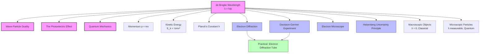

# 1. Overview / 概述

**English:**
The de Broglie wavelength is a cornerstone concept in quantum physics that extends the wave-particle duality from light to all matter. Proposed by Louis de Broglie in 1924, this revolutionary idea suggests that every moving particle has an associated wavelength, given by $\lambda = h/p$, where $h$ is Planck's constant and $p$ is the particle's momentum. This sub-topic bridges the gap between classical mechanics and quantum mechanics, explaining why macroscopic objects behave classically while microscopic particles exhibit wave-like behavior. Understanding de Broglie wavelength is essential for grasping [[Electron Diffraction and the Davisson-Germer Experiment]], [[The Electron Microscope]], and the [[Heisenberg Uncertainty Principle (Qualitative)]].

**中文:**
德布罗意波长是量子物理学中的基石概念，它将波粒二象性从光扩展到所有物质。由路易·德布罗意于1924年提出，这一革命性思想表明每个运动的粒子都具有一个相关的波长，由公式 $\lambda = h/p$ 给出，其中 $h$ 是普朗克常数，$p$ 是粒子的动量。本子知识点连接了经典力学和量子力学，解释了为什么宏观物体表现出经典行为，而微观粒子则表现出波动性。理解德布罗意波长对于掌握[[电子衍射与戴维森-革末实验]]、[[电子显微镜]]和[[海森堡不确定性原理（定性）]]至关重要。

---

# 2. Syllabus Learning Objectives / 考纲学习目标

| CAIE 9702 | Edexcel IAL |
|-----------|-------------|
| 22.2(a) Understand the concept of de Broglie wavelength | 7.7 Understand the concept of de Broglie wavelength |
| 22.2(b) Use the equation $\lambda = h/p$ | 7.8 Use the equation $\lambda = h/p$ |
| 22.2(c) Understand that electrons exhibit diffraction when passing through a thin crystal | 7.9 Understand that electrons exhibit diffraction when passing through a thin crystal |
| 22.2(d) Recall the Davisson-Germer experiment | 7.10 Recall the Davisson-Germer experiment |
| 22.2(e) Understand why macroscopic objects have negligible de Broglie wavelengths | 7.11 Understand why macroscopic objects have negligible de Broglie wavelengths |
| 22.2(f) Apply the de Broglie equation to electrons and other particles | 7.12 Apply the de Broglie equation to electrons and other particles |

**Examiner Expectations / 考官期望:**
- **English:** Students must be able to calculate de Broglie wavelength for any moving particle, explain why diffraction is only observed for microscopic particles, and relate the wavelength to kinetic energy. The Davisson-Germer experiment is a key application that must be recalled in detail.
- **中文:** 学生必须能够计算任何运动粒子的德布罗意波长，解释为什么只有微观粒子才能观察到衍射，并将波长与动能联系起来。戴维森-革末实验是一个必须详细回忆的关键应用。

---

# 3. Core Definitions / 核心定义

| Term (EN/CN) | Definition (EN) | Definition (CN) | Common Mistakes / 常见错误 |
|--------------|-----------------|-----------------|---------------------------|
| **de Broglie Wavelength** / 德布罗意波长 | The wavelength associated with a moving particle, given by $\lambda = h/p$ | 与运动粒子相关的波长，由 $\lambda = h/p$ 给出 | Confusing with photon wavelength; forgetting that $p$ is momentum, not velocity |
| **Matter Wave** / 物质波 | The wave-like behavior exhibited by moving particles, as proposed by de Broglie | 运动粒子表现出的波动行为，由德布罗意提出 | Thinking matter waves are physical waves like sound or water waves |
| **Planck's Constant ($h$)** / 普朗克常数 | A fundamental constant of quantum mechanics, $h = 6.63 \times 10^{-34} \text{ J·s}$ | 量子力学的基本常数，$h = 6.63 \times 10^{-34} \text{ J·s}$ | Using wrong units or forgetting the value |
| **Momentum ($p$)** / 动量 | The product of mass and velocity of a particle, $p = mv$ | 粒子质量与速度的乘积，$p = mv$ | Using velocity instead of momentum in the de Broglie equation |
| **Diffraction** / 衍射 | The spreading of waves when they pass through an aperture or around an obstacle | 波通过孔径或绕过障碍物时的扩散现象 | Confusing with refraction or reflection |
| **Davisson-Germer Experiment** / 戴维森-革末实验 | An experiment that confirmed the wave nature of electrons by observing diffraction from a nickel crystal | 通过观察镍晶体的电子衍射证实电子波动性的实验 | Forgetting the crystal structure or the accelerating voltage used |

---

# 4. Key Concepts Explained / 关键概念详解

## 4.1 The de Broglie Hypothesis / 德布罗意假说

### Explanation / 解释
**English:** Louis de Broglie proposed that if light (traditionally considered a wave) can behave as a particle (as shown in [[The Photoelectric Effect]]), then matter (traditionally considered particles) should also exhibit wave-like behavior. He postulated that every moving particle has an associated wavelength given by $\lambda = h/p$, where $p = mv$ is the momentum. This hypothesis was revolutionary because it unified the description of light and matter under the same wave-particle duality framework. The de Broglie wavelength is inversely proportional to momentum: particles with larger momentum have shorter wavelengths, making their wave nature harder to detect.

**中文:** 路易·德布罗意提出，如果光（传统上被视为波）可以表现出粒子行为（如[[光电效应]]所示），那么物质（传统上被视为粒子）也应该表现出波动行为。他假设每个运动粒子都有一个相关的波长，由 $\lambda = h/p$ 给出，其中 $p = mv$ 是动量。这一假说是革命性的，因为它将光和物质的描述统一在相同的波粒二象性框架下。德布罗意波长与动量成反比：动量越大的粒子波长越短，使其波动性更难被探测到。

### Physical Meaning / 物理意义
**English:** The de Broglie wavelength represents the scale at which quantum effects become significant. When the de Broglie wavelength is comparable to or larger than the size of obstacles or apertures, wave phenomena like diffraction and interference become observable. For macroscopic objects, the wavelength is so tiny that quantum effects are negligible, explaining why classical mechanics works well in everyday life.

**中文:** 德布罗意波长代表了量子效应变得显著的尺度。当德布罗意波长与障碍物或孔径的大小相当或更大时，衍射和干涉等波动现象变得可观测。对于宏观物体，波长极其微小，量子效应可以忽略，这解释了为什么经典力学在日常生活中适用。

### Common Misconceptions / 常见误区
- **English:**
  - Thinking de Broglie waves are physical waves like water waves — they are probability waves
  - Believing all objects have observable wave properties — macroscopic objects have negligible wavelengths
  - Confusing de Broglie wavelength with photon wavelength — photons have $\lambda = hc/E$, while particles have $\lambda = h/p$
  - Forgetting that momentum depends on mass, so heavier particles have shorter wavelengths at the same speed

- **中文:**
  - 认为德布罗意波是像水波一样的物理波——它们是概率波
  - 认为所有物体都有可观测的波动性——宏观物体的波长可以忽略
  - 混淆德布罗意波长与光子波长——光子有 $\lambda = hc/E$，而粒子有 $\lambda = h/p$
  - 忘记动量取决于质量，所以在相同速度下，更重的粒子波长更短

### Exam Tips / 考试提示
- **English:** Always convert units to SI (kg, m/s) before calculation. Remember that $1 \text{ eV} = 1.6 \times 10^{-19} \text{ J}$. For electrons accelerated through a voltage $V$, the kinetic energy is $eV$, and you can find momentum from $p = \sqrt{2mE_k}$.
- **中文:** 计算前务必将单位转换为SI单位（kg, m/s）。记住 $1 \text{ eV} = 1.6 \times 10^{-19} \text{ J}$。对于通过电压 $V$ 加速的电子，动能为 $eV$，可以通过 $p = \sqrt{2mE_k}$ 求出动量。

> 📷 **IMAGE PROMPT — DP-01: de Broglie Wavelength Concept Diagram**
> A split diagram showing: Left side — a macroscopic ball with extremely tiny de Broglie wavelength (shown as a tiny wave), labeled "Macroscopic object: λ ≈ 0, classical behavior"; Right side — an electron with visible wavelength comparable to atomic spacing, labeled "Microscopic particle: λ ≈ atomic spacing, quantum behavior". Include the equation λ = h/p prominently. Use blue for the wave and arrows showing momentum direction.

---

## 4.2 Why Macroscopic Objects Don't Show Wave Behavior / 为什么宏观物体不表现波动性

### Explanation / 解释
**English:** The de Broglie wavelength is inversely proportional to momentum ($\lambda = h/p$). For macroscopic objects like a cricket ball (mass ≈ 0.16 kg) moving at 10 m/s, the momentum is 1.6 kg·m/s, giving $\lambda \approx 4.1 \times 10^{-34} \text{ m}$. This is astronomically smaller than any aperture or obstacle, making diffraction impossible to observe. For an electron (mass ≈ $9.11 \times 10^{-31}$ kg) accelerated through 100 V, the wavelength is about $1.2 \times 10^{-10} \text{ m}$, comparable to atomic spacing in crystals, allowing diffraction to be observed.

**中文:** 德布罗意波长与动量成反比 ($\lambda = h/p$)。对于像板球这样的宏观物体（质量 ≈ 0.16 kg）以 10 m/s 运动，动量为 1.6 kg·m/s，得到 $\lambda \approx 4.1 \times 10^{-34} \text{ m}$。这比任何孔径或障碍物都要小得多，使得衍射无法观测。对于一个通过 100 V 加速的电子（质量 ≈ $9.11 \times 10^{-31}$ kg），波长约为 $1.2 \times 10^{-10} \text{ m}$，与晶体中的原子间距相当，因此可以观察到衍射。

### Physical Meaning / 物理意义
**English:** The threshold for observable wave behavior occurs when the de Broglie wavelength is comparable to the size of the diffracting object. For crystals, atomic spacing is about $10^{-10} \text{ m}$, so electrons with similar wavelengths show diffraction. This explains why [[Electron Diffraction and the Davisson-Germer Experiment]] works and why we need [[The Electron Microscope]] to see atomic-scale features.

**中文:** 可观测波动行为的阈值出现在德布罗意波长与衍射物体大小相当时。对于晶体，原子间距约为 $10^{-10} \text{ m}$，因此具有相似波长的电子会显示衍射。这解释了为什么[[电子衍射与戴维森-革末实验]]有效，以及为什么我们需要[[电子显微镜]]来观察原子尺度的特征。

### Exam Tips / 考试提示
- **English:** A common exam question asks: "Why don't we observe diffraction of a moving car?" The answer: The de Broglie wavelength is far too small (≈ $10^{-36} \text{ m}$) compared to any aperture, so diffraction effects are negligible.
- **中文:** 常见的考试题目问："为什么我们观察不到运动汽车的衍射？" 答案：德布罗意波长（≈ $10^{-36} \text{ m}$）与任何孔径相比都太小，因此衍射效应可以忽略。

---

# 5. Essential Equations / 核心公式

## 5.1 de Broglie Wavelength Equation / 德布罗意波长公式

$$ \lambda = \frac{h}{p} = \frac{h}{mv} $$

| Symbol (符号) | Meaning (EN) | Meaning (CN) | Unit (单位) |
|--------------|-------------|-------------|------------|
| $\lambda$ | de Broglie wavelength | 德布罗意波长 | m (米) |
| $h$ | Planck's constant ($6.63 \times 10^{-34}$) | 普朗克常数 | J·s |
| $p$ | Momentum of particle | 粒子动量 | kg·m/s |
| $m$ | Mass of particle | 粒子质量 | kg |
| $v$ | Velocity of particle | 粒子速度 | m/s |

**Derivation / 推导:** This is a postulate — it cannot be derived from classical physics. De Broglie proposed it by analogy with photons, where $E = hf = hc/\lambda$ and $E = pc$ for photons, giving $\lambda = h/p$.

**Conditions / 适用条件:**
- **English:** Applies to all moving particles, both massive and massless. For relativistic particles ($v \approx c$), use relativistic momentum $p = \gamma mv$.
- **中文:** 适用于所有运动粒子，包括有质量和无质量的。对于相对论性粒子（$v \approx c$），使用相对论动量 $p = \gamma mv$。

**Limitations / 局限性:**
- **English:** The equation does not describe the physical nature of matter waves — it only gives the wavelength. The wave function interpretation comes from quantum mechanics.
- **中文:** 该方程不描述物质波的物理性质——它只给出波长。波函数的解释来自量子力学。

---

## 5.2 de Broglie Wavelength in Terms of Kinetic Energy / 用动能表示的德布罗意波长

$$ \lambda = \frac{h}{\sqrt{2mE_k}} $$

| Symbol (符号) | Meaning (EN) | Meaning (CN) | Unit (单位) |
|--------------|-------------|-------------|------------|
| $E_k$ | Kinetic energy of particle | 粒子动能 | J (焦耳) |
| $m$ | Mass of particle | 粒子质量 | kg |

**Derivation / 推导:** From $E_k = \frac{1}{2}mv^2$, we get $v = \sqrt{2E_k/m}$. Then $p = mv = m\sqrt{2E_k/m} = \sqrt{2mE_k}$. Substituting into $\lambda = h/p$ gives $\lambda = h/\sqrt{2mE_k}$.

**Conditions / 适用条件:**
- **English:** Only valid for non-relativistic particles ($v \ll c$). For electrons accelerated through voltage $V$, $E_k = eV$, so $\lambda = h/\sqrt{2meV}$.
- **中文:** 仅适用于非相对论性粒子（$v \ll c$）。对于通过电压 $V$ 加速的电子，$E_k = eV$，所以 $\lambda = h/\sqrt{2meV}$。

**Limitations / 局限性:**
- **English:** Does not account for relativistic effects. For electrons above about 50 keV, relativistic corrections are needed.
- **中文:** 不考虑相对论效应。对于约 50 keV 以上的电子，需要相对论修正。

> 📷 **IMAGE PROMPT — DP-02: de Broglie Wavelength vs Momentum Graph**
> A graph showing λ on the y-axis (log scale) and p on the x-axis (linear scale). The curve is a hyperbola showing λ ∝ 1/p. Mark specific points: electron (10^-10 m), proton (10^-12 m), cricket ball (10^-34 m). Include labels: "Quantum regime" for λ > 10^-10 m and "Classical regime" for λ < 10^-15 m.

---

# 6. Graphs and Relationships / 图表与关系

## 6.1 de Broglie Wavelength vs Momentum / 德布罗意波长与动量的关系

### Axes / 坐标轴
- **X-axis:** Momentum $p$ (kg·m/s) — 动量
- **Y-axis:** de Broglie wavelength $\lambda$ (m) — 德布罗意波长

### Shape / 形状
**English:** Inverse relationship — a hyperbola. As momentum increases, wavelength decreases rapidly. The curve approaches zero as $p \to \infty$ and approaches infinity as $p \to 0$.
**中文:** 反比关系——双曲线。随着动量增加，波长迅速减小。当 $p \to \infty$ 时曲线趋近于零，当 $p \to 0$ 时趋近于无穷大。

### Gradient Meaning / 斜率含义
**English:** The gradient $d\lambda/dp = -h/p^2$ is negative and decreases in magnitude as $p$ increases. The gradient is not constant, confirming the non-linear inverse relationship.
**中文:** 梯度 $d\lambda/dp = -h/p^2$ 为负，且随着 $p$ 增加而减小。梯度不是常数，证实了非线性反比关系。

### Area Meaning / 面积含义
**English:** The area under the $\lambda$ vs $p$ graph has no direct physical meaning.
**中文:** $\lambda$ 与 $p$ 关系图下的面积没有直接的物理意义。

### Exam Interpretation / 考试解读
- **English:** Be able to sketch this graph and explain why macroscopic objects (large $p$) have negligible $\lambda$, while microscopic particles (small $p$) have measurable $\lambda$.
- **中文:** 能够画出此图并解释为什么宏观物体（大 $p$）的 $\lambda$ 可忽略，而微观粒子（小 $p$）的 $\lambda$ 可测量。

---

## 6.2 de Broglie Wavelength vs Accelerating Voltage for Electrons / 电子德布罗意波长与加速电压的关系

### Axes / 坐标轴
- **X-axis:** Accelerating voltage $V$ (V) — 加速电压
- **Y-axis:** de Broglie wavelength $\lambda$ (m) — 德布罗意波长

### Shape / 形状
**English:** $\lambda \propto 1/\sqrt{V}$ — a decreasing curve that flattens at higher voltages. From $\lambda = h/\sqrt{2meV}$, doubling $V$ reduces $\lambda$ by a factor of $\sqrt{2}$.
**中文:** $\lambda \propto 1/\sqrt{V}$ ——一条递减曲线，在较高电压下趋于平缓。由 $\lambda = h/\sqrt{2meV}$ 可知，电压加倍会使 $\lambda$ 减小 $\sqrt{2}$ 倍。

### Gradient Meaning / 斜率含义
**English:** The gradient $d\lambda/dV = -h/(2\sqrt{2me} \cdot V^{3/2})$ is negative and decreases in magnitude as $V$ increases.
**中文:** 梯度 $d\lambda/dV = -h/(2\sqrt{2me} \cdot V^{3/2})$ 为负，且随着 $V$ 增加而减小。

### Area Meaning / 面积含义
**English:** No direct physical meaning.
**中文:** 没有直接的物理意义。

### Exam Interpretation / 考试解读
- **English:** This relationship is crucial for understanding how [[The Electron Microscope]] achieves higher resolution — higher accelerating voltage gives shorter wavelength, allowing smaller features to be resolved.
- **中文:** 这一关系对于理解[[电子显微镜]]如何实现更高分辨率至关重要——更高的加速电压产生更短的波长，从而能够分辨更小的特征。

---

# 7. Required Diagrams / 必备图表

## 7.1 de Broglie Wavelength Comparison: Macroscopic vs Microscopic / 德布罗意波长比较：宏观与微观

### Description / 描述
**English:** A comparative diagram showing the de Broglie wavelength of a cricket ball, a dust particle, and an electron, with their relative sizes compared to atomic spacing.
**中文:** 一个比较图，显示板球、尘埃粒子和电子的德布罗意波长，以及它们与原子间距的相对大小。

### Image Prompt / 图片生成提示
> 📷 **IMAGE PROMPT — DP-03: de Broglie Wavelength Comparison**
> Three horizontal bars representing de Broglie wavelengths on a logarithmic scale. Top: Cricket ball (0.16 kg, 10 m/s) — λ ≈ 10^-34 m, shown as an invisible dot. Middle: Dust particle (10^-9 kg, 1 m/s) — λ ≈ 10^-25 m, shown as a tiny wave. Bottom: Electron (100 eV) — λ ≈ 1.2 × 10^-10 m, shown as a visible wave comparable to atomic spacing (marked as 10^-10 m). Include labels: "Classical regime" and "Quantum regime". Use blue waves on white background.

### Labels Required / 需要标注
- **English:** Object type, mass, velocity, de Broglie wavelength, atomic spacing reference line
- **中文:** 物体类型、质量、速度、德布罗意波长、原子间距参考线

### Exam Importance / 考试重要性
- **English:** High — frequently asked to explain why macroscopic objects don't show wave behavior
- **中文:** 高——常被要求解释为什么宏观物体不表现波动性

---

## 7.2 Electron Diffraction Setup / 电子衍射装置图

### Description / 描述
**English:** A schematic diagram showing an electron gun, accelerating anode, thin polycrystalline graphite target, and fluorescent screen showing diffraction rings.
**中文:** 示意图，显示电子枪、加速阳极、薄多晶石墨靶和显示衍射环的荧光屏。

### Image Prompt / 图片生成提示
> 📷 **IMAGE PROMPT — DP-04: Electron Diffraction Apparatus**
> A clean schematic diagram showing: Left — Electron gun with heated filament and accelerating anode labeled "V". Middle — Thin polycrystalline graphite target. Right — Fluorescent screen showing concentric diffraction rings. Include labels: "Electron beam", "Diffracted electrons", "Central bright spot", "Diffraction rings". Show electrons as dashed lines with arrows. Use a clean white background with black lines and blue electron paths.

### Labels Required / 需要标注
- **English:** Electron gun, accelerating voltage $V$, graphite target, fluorescent screen, diffraction rings, central maximum
- **中文:** 电子枪、加速电压 $V$、石墨靶、荧光屏、衍射环、中央极大

### Exam Importance / 考试重要性
- **English:** Very high — this is the standard setup for demonstrating electron diffraction, directly linked to [[Electron Diffraction and the Davisson-Germer Experiment]]
- **中文:** 非常高——这是演示电子衍射的标准装置，直接与[[电子衍射与戴维森-革末实验]]相关

---

# 8. Worked Examples / 典型例题

## Example 1: Calculating de Broglie Wavelength of an Electron / 计算电子的德布罗意波长

### Question / 题目
**English:** An electron is accelerated from rest through a potential difference of 150 V. Calculate the de Broglie wavelength of the electron. (Mass of electron $m_e = 9.11 \times 10^{-31}$ kg, Planck's constant $h = 6.63 \times 10^{-34}$ J·s, charge of electron $e = 1.60 \times 10^{-19}$ C)

**中文:** 一个电子从静止开始通过 150 V 的电势差加速。计算该电子的德布罗意波长。（电子质量 $m_e = 9.11 \times 10^{-31}$ kg，普朗克常数 $h = 6.63 \times 10^{-34}$ J·s，电子电荷 $e = 1.60 \times 10^{-19}$ C）

### Solution / 解答

**Step 1: Find the kinetic energy / 求动能**
$$E_k = eV = (1.60 \times 10^{-19})(150) = 2.40 \times 10^{-17} \text{ J}$$

**Step 2: Find the momentum / 求动量**
$$p = \sqrt{2mE_k} = \sqrt{2(9.11 \times 10^{-31})(2.40 \times 10^{-17})}$$
$$p = \sqrt{4.37 \times 10^{-47}} = 6.61 \times 10^{-24} \text{ kg·m/s}$$

**Step 3: Calculate the de Broglie wavelength / 计算德布罗意波长**
$$\lambda = \frac{h}{p} = \frac{6.63 \times 10^{-34}}{6.61 \times 10^{-24}} = 1.00 \times 10^{-10} \text{ m}$$

### Final Answer / 最终答案
**Answer:** $\lambda = 1.00 \times 10^{-10} \text{ m}$ (or 0.100 nm) | **答案：** $\lambda = 1.00 \times 10^{-10} \text{ m}$（或 0.100 nm）

### Quick Tip / 提示
- **English:** You can use the combined formula $\lambda = h/\sqrt{2meV}$ directly. For electrons, this simplifies to $\lambda \approx 1.23/\sqrt{V}$ nm (where $V$ is in volts). Check: $\lambda \approx 1.23/\sqrt{150} \approx 0.100$ nm ✓
- **中文:** 可以直接使用组合公式 $\lambda = h/\sqrt{2meV}$。对于电子，这简化为 $\lambda \approx 1.23/\sqrt{V}$ nm（其中 $V$ 以伏特为单位）。验证：$\lambda \approx 1.23/\sqrt{150} \approx 0.100$ nm ✓

---

## Example 2: Comparing de Broglie Wavelengths / 比较德布罗意波长

### Question / 题目
**English:** A proton and an electron have the same kinetic energy of 100 eV. Calculate the ratio of their de Broglie wavelengths. (Mass of proton $m_p = 1.67 \times 10^{-27}$ kg, mass of electron $m_e = 9.11 \times 10^{-31}$ kg)

**中文:** 一个质子和一个电子具有相同的动能 100 eV。计算它们德布罗意波长的比值。（质子质量 $m_p = 1.67 \times 10^{-27}$ kg，电子质量 $m_e = 9.11 \times 10^{-31}$ kg）

### Solution / 解答

**Step 1: Write the de Broglie wavelength formula / 写出德布罗意波长公式**
$$\lambda = \frac{h}{\sqrt{2mE_k}}$$

**Step 2: Find the ratio / 求比值**
$$\frac{\lambda_e}{\lambda_p} = \frac{h/\sqrt{2m_eE_k}}{h/\sqrt{2m_pE_k}} = \sqrt{\frac{m_p}{m_e}}$$

**Step 3: Substitute values / 代入数值**
$$\frac{\lambda_e}{\lambda_p} = \sqrt{\frac{1.67 \times 10^{-27}}{9.11 \times 10^{-31}}} = \sqrt{1833} = 42.8$$

### Final Answer / 最终答案
**Answer:** The electron's de Broglie wavelength is 42.8 times larger than the proton's. | **答案：** 电子的德布罗意波长是质子的 42.8 倍。

### Quick Tip / 提示
- **English:** When kinetic energies are equal, $\lambda \propto 1/\sqrt{m}$. The lighter particle has the longer wavelength. This is why electrons are used in diffraction experiments rather than protons.
- **中文:** 当动能相等时，$\lambda \propto 1/\sqrt{m}$。更轻的粒子具有更长的波长。这就是为什么衍射实验中使用电子而不是质子。

---

# 9. Past Paper Question Types / 历年真题题型

| Question Type / 题型 | Frequency / 频率 | Difficulty / 难度 | Past Paper References / 真题索引 |
|----------------------|------------------|------------------|-------------------------------|
| Calculate de Broglie wavelength from given momentum/energy | Very High | Easy | 📝 *待填入* |
| Explain why macroscopic objects don't show wave behavior | High | Medium | 📝 *待填入* |
| Compare wavelengths of different particles | High | Medium | 📝 *待填入* |
| Describe the Davisson-Germer experiment | Medium | Medium | 📝 *待填入* |
| Relate accelerating voltage to wavelength in electron microscopes | Medium | Medium-Hard | 📝 *待填入* |
| Derive the de Broglie wavelength formula from kinetic energy | Low | Hard | 📝 *待填入* |

**Common Command Words / 常见指令词:**
- **English:** Calculate, Explain, Describe, Compare, Derive, Show that, Determine
- **中文:** 计算、解释、描述、比较、推导、证明、确定

---

# 10. Practical Skills Connections / 实验技能链接

**English:**
The de Broglie wavelength concept is directly tested in practical contexts:

1. **Electron Diffraction Experiment:** Students must understand how to set up an electron diffraction tube, measure accelerating voltage, and observe diffraction rings. Key skills include:
   - Measuring ring diameters on a fluorescent screen
   - Calculating the lattice spacing of the crystal from diffraction patterns
   - Using $\lambda = h/\sqrt{2meV}$ to verify the de Broglie relationship
   - Estimating uncertainties in wavelength measurements

2. **Graph Plotting:** Plotting $\lambda$ against $1/\sqrt{V}$ should give a straight line through the origin, confirming $\lambda \propto 1/\sqrt{V}$.

3. **Uncertainties:** The main uncertainty comes from measuring the diffraction ring diameter. Students should calculate percentage uncertainties and compare with theoretical predictions.

4. **Experimental Design:** Understanding why a thin crystal is needed (to get observable diffraction) and why the tube must be evacuated (to prevent electron collisions with air molecules).

**中文:**
德布罗意波长概念在实验环境中直接测试：

1. **电子衍射实验：** 学生必须理解如何设置电子衍射管、测量加速电压和观察衍射环。关键技能包括：
   - 在荧光屏上测量环的直径
   - 从衍射图案计算晶体的晶格间距
   - 使用 $\lambda = h/\sqrt{2meV}$ 验证德布罗意关系
   - 估计波长测量中的不确定度

2. **图表绘制：** 绘制 $\lambda$ 与 $1/\sqrt{V}$ 的关系图应得到一条通过原点的直线，确认 $\lambda \propto 1/\sqrt{V}$。

3. **不确定度：** 主要不确定度来自测量衍射环直径。学生应计算百分比不确定度并与理论预测进行比较。

4. **实验设计：** 理解为什么需要薄晶体（以获得可观测的衍射）以及为什么管子必须抽真空（以防止电子与空气分子碰撞）。

---

# 11. Concept Map / 概念图谱

---

# 12. Quick Revision Sheet / 速查表

| Category / 类别 | Key Points / 要点 |
|----------------|------------------|
| **Definition / 定义** | de Broglie wavelength: $\lambda = h/p$ — wavelength associated with any moving particle / 德布罗意波长：$\lambda = h/p$ ——与任何运动粒子相关的波长 |
| **Key Formula / 核心公式** | $\lambda = h/p = h/mv = h/\sqrt{2mE_k}$; For electrons: $\lambda = h/\sqrt{2meV}$ |
| **Key Graph / 核心图表** | $\lambda$ vs $p$: Hyperbola ($\lambda \propto 1/p$); $\lambda$ vs $V$: Decreasing curve ($\lambda \propto 1/\sqrt{V}$) |
| **Macroscopic vs Microscopic / 宏观与微观** | Macroscopic: $\lambda \approx 10^{-34}$ m (negligible); Microscopic: $\lambda \approx 10^{-10}$ m (comparable to atomic spacing) |
| **Experimental Evidence / 实验证据** | Davisson-Germer experiment: Electron diffraction from nickel crystal confirmed de Broglie's hypothesis / 戴维森-革末实验：镍晶体的电子衍射证实了德布罗意假说 |
| **Application / 应用** | [[The Electron Microscope]] uses short de Broglie wavelength of electrons for high resolution / [[电子显微镜]]利用电子的短德布罗意波长实现高分辨率 |
| **Common Mistake / 常见错误** | Using velocity instead of momentum; forgetting to convert eV to J; confusing with photon wavelength / 使用速度而非动量；忘记将 eV 转换为 J；与光子波长混淆 |
| **Exam Tip / 考试提示** | For electrons: $\lambda \approx 1.23/\sqrt{V}$ nm (quick check); Always use SI units / 对于电子：$\lambda \approx 1.23/\sqrt{V}$ nm（快速检查）；始终使用 SI 单位 |
| **Prerequisite / 前置知识** | [[The Photoelectric Effect]] — understanding that light has particle properties / [[光电效应]]——理解光具有粒子性质 |
| **Next Topics / 后续主题** | [[Electron Diffraction and the Davisson-Germer Experiment]], [[The Electron Microscope]], [[Heisenberg Uncertainty Principle (Qualitative)]] |