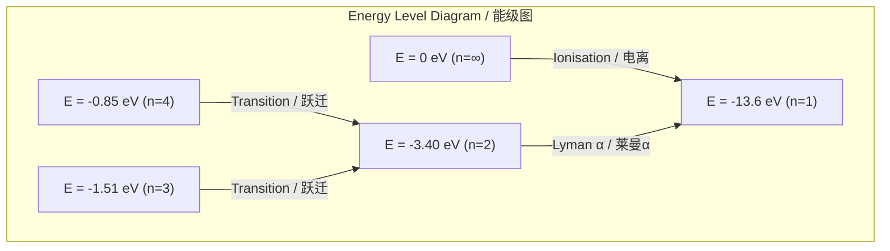

# 1. Overview / 概述

**English:**
The Bohr Model of the Atom represents a revolutionary step in our understanding of atomic structure, bridging classical physics with the emerging quantum theory of the early 20th century. Proposed by Niels Bohr in 1913, this model successfully explains the stability of atoms and the origin of discrete spectral lines — phenomena that classical physics could not account for. The model postulates that electrons orbit the nucleus in specific, quantised energy levels, and that radiation is emitted or absorbed only when an electron transitions between these levels.

This sub-topic is fundamental to understanding [[Energy Levels and Spectra]] as it provides the physical mechanism behind [[Quantised Energy Levels]] and the formation of [[Emission and Absorption Spectra]]. The Bohr model directly explains the [[Hydrogen Spectrum and the Balmer Series]], serving as the cornerstone of quantum atomic theory. For A-Level students, mastering this model is essential for connecting [[The Photoelectric Effect]] to broader quantum phenomena and for appreciating [[Line Spectra as Evidence for Quantisation]].

**中文:**
玻尔原子模型代表了我们对原子结构理解的革命性一步，它桥接了经典物理学与20世纪初新兴的量子理论。由尼尔斯·玻尔于1913年提出，该模型成功解释了原子的稳定性和离散光谱线的起源——这些是经典物理学无法解释的现象。该模型假设电子在特定的、量子化的能级上绕核运动，只有当电子在这些能级之间跃迁时，才会发射或吸收辐射。

本子知识点是理解[[Energy Levels and Spectra|能级与光谱]]的基础，因为它提供了[[Quantised Energy Levels|量子化能级]]和[[Emission and Absorption Spectra|发射与吸收光谱]]形成背后的物理机制。玻尔模型直接解释了[[Hydrogen Spectrum and the Balmer Series|氢光谱与巴尔末系]]，是量子原子理论的基石。对于A-Level学生来说，掌握这个模型对于将[[The Photoelectric Effect|光电效应]]与更广泛的量子现象联系起来，以及理解[[Line Spectra as Evidence for Quantisation|线光谱作为量子化的证据]]至关重要。

---

# 2. Syllabus Learning Objectives / 考纲学习目标

| CAIE 9702 | Edexcel IAL |
|-----------|-------------|
| 22.3(a): Describe the Bohr model of the hydrogen atom | 7.13: Understand the Bohr model of the hydrogen atom |
| 22.3(b): Explain the concept of quantised energy levels | 7.14: Understand the concept of stationary states |
| 22.3(c): Derive the expression for the energy of an electron in a hydrogen atom | 7.15: Derive the energy levels of the hydrogen atom |
| 22.3(d): Calculate the energy of photons emitted during transitions | 7.16: Calculate photon energies from electron transitions |
| 22.3(e): Explain the origin of spectral lines | 7.17: Explain the formation of spectral lines |
| 22.3(f): Understand the limitations of the Bohr model | 7.18: Understand the limitations of the Bohr model |
| 22.3(g): Apply the Bohr model to explain the hydrogen spectrum | — |

**Examiner Expectations / 考官期望:**
- **English:** Students must be able to state the postulates of the Bohr model, derive the energy level formula for hydrogen, calculate photon energies and wavelengths for transitions, and critically evaluate the model's successes and limitations. Derivation of the Rydberg constant from Bohr's postulates is expected at A2 level.
- **中文:** 学生必须能够陈述玻尔模型的假设，推导氢原子的能级公式，计算跃迁的光子能量和波长，并批判性地评估该模型的成功之处和局限性。A2水平要求从玻尔假设推导里德伯常数。

---

# 3. Core Definitions / 核心定义

| Term (EN/CN) | Definition (EN) | Definition (CN) | Common Mistakes / 常见错误 |
|--------------|-----------------|-----------------|---------------------------|
| **Bohr Model** / 玻尔模型 | A semi-classical model of the atom where electrons orbit the nucleus in fixed, quantised energy levels without radiating energy | 一种半经典原子模型，电子在固定的、量子化的能级上绕核运动而不辐射能量 | ❌ Thinking electrons radiate energy continuously while in orbit (they don't — only during transitions) |
| **Stationary State** / 定态 | A stable, quantised energy state of an atom in which the electron does not radiate electromagnetic energy | 原子的一种稳定的量子化能量状态，在这种状态下电子不辐射电磁能量 | ❌ Confusing stationary state with "stationary electron" — the electron is still moving, just not radiating |
| **Ground State** / 基态 | The lowest possible energy state of an atom (n=1 for hydrogen) | 原子的最低可能能量状态（氢原子为n=1） | ❌ Thinking ground state means zero energy — it's the minimum energy, not zero |
| **Excited State** / 激发态 | Any energy state of an atom higher than the ground state | 原子中任何高于基态的能量状态 | ❌ Forgetting that excited states are unstable and short-lived |
| **Electron Transition** / 电子跃迁 | The movement of an electron between two energy levels, accompanied by the absorption or emission of a photon | 电子在两个能级之间的移动，伴随着光子的吸收或发射 | ❌ Thinking transitions are gradual — they are instantaneous quantum jumps |
| **Ionisation Energy** / 电离能 | The minimum energy required to remove an electron from the ground state to infinity (n=∞) | 将电子从基态移动到无穷远（n=∞）所需的最小能量 | ❌ Confusing with excitation energy (energy to reach a specific excited state) |

---

# 4. Key Concepts Explained / 关键概念详解

## 4.1 Bohr's Postulates / 玻尔假设

### Explanation / 解释
**English:** The Bohr model is built on three fundamental postulates:

1. **Quantised Orbits:** Electrons can only occupy specific, allowed circular orbits around the nucleus. These orbits correspond to discrete energy levels. The angular momentum of the electron in these orbits is quantised: $m_e v r = n\hbar$, where $n = 1, 2, 3, ...$ is the principal quantum number and $\hbar = h/2\pi$.

2. **Stationary States:** While in an allowed orbit, the electron does not radiate electromagnetic energy, despite being accelerated. This contradicts classical electromagnetic theory but is a necessary postulate to explain atomic stability.

3. **Quantum Jumps:** Electromagnetic radiation is emitted or absorbed only when an electron makes a transition from one allowed orbit to another. The energy of the photon equals the energy difference between the two levels: $hf = E_i - E_f$.

These postulates combine classical circular motion with quantum constraints, creating a hybrid model that successfully explains the hydrogen spectrum. The model links directly to [[Quantised Energy Levels]] and provides the mechanism for [[Emission and Absorption Spectra]].

**中文:** 玻尔模型建立在三个基本假设之上：

1. **量子化轨道：** 电子只能占据特定的、允许的绕核圆形轨道。这些轨道对应于离散的能级。电子在这些轨道上的角动量是量子化的：$m_e v r = n\hbar$，其中 $n = 1, 2, 3, ...$ 是主量子数，$\hbar = h/2\pi$。

2. **定态：** 在允许的轨道上时，电子尽管被加速，但不辐射电磁能量。这与经典电磁理论相矛盾，但这是解释原子稳定性的必要假设。

3. **量子跃迁：** 只有当电子从一个允许轨道跃迁到另一个允许轨道时，才会发射或吸收电磁辐射。光子的能量等于两个能级之间的能量差：$hf = E_i - E_f$。

这些假设将经典圆周运动与量子约束相结合，创造了一个成功解释氢光谱的混合模型。该模型直接联系到[[Quantised Energy Levels|量子化能级]]，并为[[Emission and Absorption Spectra|发射与吸收光谱]]提供了机制。

### Physical Meaning / 物理意义
**English:** The Bohr model resolves two fundamental problems with the classical Rutherford model:
- **Stability:** Classical physics predicts that accelerating electrons should radiate energy and spiral into the nucleus within ~10⁻¹¹ seconds. Bohr's stationary states prevent this.
- **Discrete Spectra:** Classical physics predicts continuous spectra from accelerating charges. Bohr's quantised transitions explain why atoms produce [[Line Spectra as Evidence for Quantisation|line spectra]].

**中文:** 玻尔模型解决了经典卢瑟福模型的两个基本问题：
- **稳定性：** 经典物理学预测加速的电子应该辐射能量并在约10⁻¹¹秒内螺旋坠入原子核。玻尔的定态阻止了这种情况。
- **离散光谱：** 经典物理学预测加速电荷会产生连续光谱。玻尔的量子化跃迁解释了为什么原子会产生[[Line Spectra as Evidence for Quantisation|线光谱]]。

### Common Misconceptions / 常见误区
- ❌ **"Electrons orbit like planets"** — The Bohr model uses circular orbits, but modern quantum mechanics shows electron positions are described by probability clouds (orbitals), not definite paths.
- ❌ **"The model works for all atoms"** — The Bohr model only works accurately for hydrogen and single-electron ions (He⁺, Li²⁺). It fails for multi-electron atoms.
- ❌ **"Energy levels are equally spaced"** — For hydrogen, energy levels get closer together as n increases: $E_n \propto -1/n^2$.
- ❌ **"Electrons can be anywhere between levels"** — Electrons can only exist in discrete energy levels, never between them.

### Exam Tips / 考试提示
- **English:** Memorise the three postulates word-for-word — examiners often ask for them explicitly. When deriving energy levels, always start from Coulomb's law and the quantisation of angular momentum. Remember that the negative sign in energy levels indicates a bound state.
- **中文:** 逐字记忆三个假设——考官经常明确要求。推导能级时，始终从库仑定律和角动量量子化开始。记住能级中的负号表示束缚态。

> 📷 **IMAGE PROMPT — BOHR-01: Bohr Model of Hydrogen Atom**
> A clean, educational diagram showing the Bohr model of a hydrogen atom. The nucleus is a single red proton at the center. Three concentric circular orbits are shown as dashed lines, labeled n=1, n=2, n=3. A small blue electron is shown on the n=2 orbit. Arrows indicate electron transitions between levels, with photon emission shown as wavy lines. Energy level diagram on the right side. Clean white background, textbook style, suitable for A-Level physics.

---

## 4.2 Derivation of Energy Levels / 能级推导

### Explanation / 解释
**English:** The energy levels of the hydrogen atom can be derived by combining classical mechanics with Bohr's quantisation condition.

**Step 1: Coulomb Force Provides Centripetal Force**
For an electron in a circular orbit of radius $r$:
$$\frac{1}{4\pi\varepsilon_0} \frac{e^2}{r^2} = \frac{m_e v^2}{r}$$

**Step 2: Quantisation of Angular Momentum**
$$m_e v r = n\hbar = n\frac{h}{2\pi}$$

**Step 3: Solve for Orbital Radius**
From Step 2: $v = \frac{n\hbar}{m_e r}$
Substitute into Step 1:
$$\frac{1}{4\pi\varepsilon_0} \frac{e^2}{r^2} = \frac{m_e}{r} \left(\frac{n\hbar}{m_e r}\right)^2 = \frac{n^2 \hbar^2}{m_e r^3}$$
Rearranging:
$$r_n = \frac{4\pi\varepsilon_0 \hbar^2}{m_e e^2} n^2 = a_0 n^2$$
where $a_0 = 5.29 \times 10^{-11}$ m is the **Bohr radius** (radius of the n=1 orbit).

**Step 4: Total Energy of the Electron**
Total energy = Kinetic energy + Potential energy:
$$E = \frac{1}{2}m_e v^2 - \frac{1}{4\pi\varepsilon_0} \frac{e^2}{r}$$

Using the force equation: $\frac{1}{2}m_e v^2 = \frac{1}{2} \cdot \frac{1}{4\pi\varepsilon_0} \frac{e^2}{r}$

Therefore:
$$E = \frac{1}{2} \cdot \frac{1}{4\pi\varepsilon_0} \frac{e^2}{r} - \frac{1}{4\pi\varepsilon_0} \frac{e^2}{r} = -\frac{1}{2} \cdot \frac{1}{4\pi\varepsilon_0} \frac{e^2}{r}$$

**Step 5: Substitute the Radius**
$$E_n = -\frac{1}{2} \cdot \frac{1}{4\pi\varepsilon_0} \frac{e^2}{a_0 n^2} = -\frac{m_e e^4}{8\varepsilon_0^2 h^2} \cdot \frac{1}{n^2}$$

This gives the famous result:
$$E_n = -\frac{13.6 \text{ eV}}{n^2}$$

**中文:** 氢原子的能级可以通过将经典力学与玻尔量子化条件相结合来推导。

**步骤1：库仑力提供向心力**
对于半径为$r$的圆形轨道上的电子：
$$\frac{1}{4\pi\varepsilon_0} \frac{e^2}{r^2} = \frac{m_e v^2}{r}$$

**步骤2：角动量量子化**
$$m_e v r = n\hbar = n\frac{h}{2\pi}$$

**步骤3：求解轨道半径**
从步骤2：$v = \frac{n\hbar}{m_e r}$
代入步骤1：
$$\frac{1}{4\pi\varepsilon_0} \frac{e^2}{r^2} = \frac{m_e}{r} \left(\frac{n\hbar}{m_e r}\right)^2 = \frac{n^2 \hbar^2}{m_e r^3}$$
整理得：
$$r_n = \frac{4\pi\varepsilon_0 \hbar^2}{m_e e^2} n^2 = a_0 n^2$$
其中$a_0 = 5.29 \times 10^{-11}$ m是**玻尔半径**（n=1轨道的半径）。

**步骤4：电子的总能量**
总能量 = 动能 + 势能：
$$E = \frac{1}{2}m_e v^2 - \frac{1}{4\pi\varepsilon_0} \frac{e^2}{r}$$

利用力方程：$\frac{1}{2}m_e v^2 = \frac{1}{2} \cdot \frac{1}{4\pi\varepsilon_0} \frac{e^2}{r}$

因此：
$$E = \frac{1}{2} \cdot \frac{1}{4\pi\varepsilon_0} \frac{e^2}{r} - \frac{1}{4\pi\varepsilon_0} \frac{e^2}{r} = -\frac{1}{2} \cdot \frac{1}{4\pi\varepsilon_0} \frac{e^2}{r}$$

**步骤5：代入半径**
$$E_n = -\frac{1}{2} \cdot \frac{1}{4\pi\varepsilon_0} \frac{e^2}{a_0 n^2} = -\frac{m_e e^4}{8\varepsilon_0^2 h^2} \cdot \frac{1}{n^2}$$

这给出了著名结果：
$$E_n = -\frac{13.6 \text{ eV}}{n^2}$$

### Physical Meaning / 物理意义
**English:** The negative energy indicates that the electron is bound to the nucleus — energy must be supplied to remove it. As n increases, the energy becomes less negative (increases), and the energy levels get closer together. At n=∞, E=0, representing the ionisation limit. The ground state (n=1) has the most negative energy (-13.6 eV), meaning the electron is most tightly bound.

**中文:** 负能量表示电子被束缚在原子核上——必须提供能量才能将其移除。随着n增加，能量变得不那么负（增加），能级越来越接近。在n=∞时，E=0，代表电离极限。基态（n=1）具有最负的能量（-13.6 eV），意味着电子被束缚得最紧。

### Common Misconceptions / 常见误区
- ❌ **"The Bohr radius is the size of the atom"** — The Bohr radius is the radius of the n=1 orbit for hydrogen. The atom's "size" depends on its state; excited atoms are much larger.
- ❌ **"Energy levels are equally spaced"** — They follow $1/n^2$ spacing, so the gap between n=1 and n=2 is much larger than between n=2 and n=3.
- ❌ **"The derivation is exact"** — The Bohr model neglects relativistic effects, electron spin, and quantum mechanical corrections. It's an approximation.

### Exam Tips / 考试提示
- **English:** You must be able to derive $E_n = -13.6/n^2$ eV from first principles. Know that $a_0 = 5.29 \times 10^{-11}$ m and $E_1 = -13.6$ eV are standard values. For single-electron ions (He⁺, Li²⁺), the formula becomes $E_n = -\frac{Z^2 \times 13.6}{n^2}$ eV, where Z is the atomic number.
- **中文:** 你必须能够从基本原理推导出$E_n = -13.6/n^2$ eV。知道$a_0 = 5.29 \times 10^{-11}$ m和$E_1 = -13.6$ eV是标准值。对于单电子离子（He⁺, Li²⁺），公式变为$E_n = -\frac{Z^2 \times 13.6}{n^2}$ eV，其中Z是原子序数。

---

## 4.3 Electron Transitions and Photon Emission / 电子跃迁与光子发射

### Explanation / 解释
**English:** When an electron transitions from a higher energy level $E_i$ to a lower energy level $E_f$, a photon is emitted with energy equal to the difference:

$$hf = E_i - E_f = \Delta E$$

The wavelength of the emitted photon is given by:

$$\frac{1}{\lambda} = \frac{\Delta E}{hc} = \frac{E_i - E_f}{hc}$$

Using the Bohr energy formula $E_n = -13.6/n^2$ eV:

$$\frac{1}{\lambda} = \frac{13.6}{hc} \left(\frac{1}{n_f^2} - \frac{1}{n_i^2}\right)$$

This is the **Rydberg formula** for the hydrogen spectrum:

$$\frac{1}{\lambda} = R_H \left(\frac{1}{n_f^2} - \frac{1}{n_i^2}\right)$$

where $R_H = 1.097 \times 10^7$ m⁻¹ is the **Rydberg constant**.

Different series of spectral lines correspond to transitions ending at different final levels:
- **Lyman series:** $n_f = 1$ (ultraviolet)
- **Balmer series:** $n_f = 2$ (visible)
- **Paschen series:** $n_f = 3$ (infrared)

This directly explains the [[Hydrogen Spectrum and the Balmer Series]].

**中文:** 当电子从较高能级$E_i$跃迁到较低能级$E_f$时，会发射一个光子，其能量等于能级差：

$$hf = E_i - E_f = \Delta E$$

发射光子的波长由下式给出：

$$\frac{1}{\lambda} = \frac{\Delta E}{hc} = \frac{E_i - E_f}{hc}$$

使用玻尔能量公式$E_n = -13.6/n^2$ eV：

$$\frac{1}{\lambda} = \frac{13.6}{hc} \left(\frac{1}{n_f^2} - \frac{1}{n_i^2}\right)$$

这就是氢光谱的**里德伯公式**：

$$\frac{1}{\lambda} = R_H \left(\frac{1}{n_f^2} - \frac{1}{n_i^2}\right)$$

其中$R_H = 1.097 \times 10^7$ m⁻¹是**里德伯常数**。

不同的光谱线系对应于终止于不同最终能级的跃迁：
- **莱曼系：** $n_f = 1$（紫外线）
- **巴尔末系：** $n_f = 2$（可见光）
- **帕邢系：** $n_f = 3$（红外线）

这直接解释了[[Hydrogen Spectrum and the Balmer Series|氢光谱与巴尔末系]]。

### Physical Meaning / 物理意义
**English:** Each spectral line corresponds to a specific electron transition. The fact that only certain wavelengths are observed is direct evidence for quantised energy levels. Absorption occurs when a photon of exactly the right energy is absorbed, exciting an electron to a higher level — this produces [[Emission and Absorption Spectra|absorption spectra]].

**中文:** 每条光谱线对应一个特定的电子跃迁。只能观察到某些特定波长的事实是量子化能级的直接证据。当恰好具有正确能量的光子被吸收时，电子被激发到更高能级——这产生了[[Emission and Absorption Spectra|吸收光谱]]。

### Common Misconceptions / 常见误区
- ❌ **"An electron can absorb any photon"** — Only photons with energy exactly matching an allowed transition can be absorbed.
- ❌ **"Higher n means higher energy"** — Higher n means less negative energy, so the electron is less tightly bound. The energy is higher (less negative), but the magnitude is smaller.
- ❌ **"All transitions are equally likely"** — Some transitions are more probable than others (selection rules), affecting spectral line intensities.

### Exam Tips / 考试提示
- **English:** When calculating photon wavelength, always convert eV to joules first: 1 eV = 1.60 × 10⁻¹⁹ J. Use $hc = 1240$ eV·nm for quick wavelength calculations. Remember that the Balmer series (visible) has $n_f = 2$.
- **中文:** 计算光子波长时，始终先将eV转换为焦耳：1 eV = 1.60 × 10⁻¹⁹ J。使用$hc = 1240$ eV·nm进行快速波长计算。记住巴尔末系（可见光）的$n_f = 2$。

> 📷 **IMAGE PROMPT — BOHR-02: Hydrogen Energy Level Diagram with Transitions**
> A vertical energy level diagram for hydrogen showing n=1, 2, 3, 4, 5, and ∞ levels. Energy values labeled on the left (-13.6 eV, -3.40 eV, -1.51 eV, -0.85 eV, -0.54 eV, 0 eV). Colored arrows showing Lyman series transitions (UV, purple arrows to n=1), Balmer series transitions (visible, red/blue/green arrows to n=2), and Paschen series transitions (IR, red arrows to n=3). Wavelength values labeled on each arrow. Clean, textbook-style diagram with white background.

---

# 5. Essential Equations / 核心公式

## 5.1 Angular Momentum Quantisation / 角动量量子化

$$m_e v r = n\hbar = n\frac{h}{2\pi}$$

| Symbol (符号) | Meaning (EN) | Meaning (CN) | Unit (单位) |
|--------------|-------------|-------------|------------|
| $m_e$ | Electron mass | 电子质量 | kg |
| $v$ | Orbital speed | 轨道速度 | m s⁻¹ |
| $r$ | Orbital radius | 轨道半径 | m |
| $n$ | Principal quantum number | 主量子数 | — |
| $\hbar$ | Reduced Planck constant ($h/2\pi$) | 约化普朗克常数 | J s |

**Conditions / 适用条件:** Only applies to allowed orbits in the Bohr model. Not valid in full quantum mechanics.

## 5.2 Bohr Radius / 玻尔半径

$$a_0 = \frac{4\pi\varepsilon_0 \hbar^2}{m_e e^2} = 5.29 \times 10^{-11} \text{ m}$$

| Symbol (符号) | Meaning (EN) | Meaning (CN) | Unit (单位) |
|--------------|-------------|-------------|------------|
| $a_0$ | Bohr radius | 玻尔半径 | m |
| $\varepsilon_0$ | Permittivity of free space | 真空介电常数 | F m⁻¹ |
| $e$ | Elementary charge | 元电荷 | C |

**Conditions / 适用条件:** Radius of the n=1 orbit in hydrogen. For n>1: $r_n = a_0 n^2$.

## 5.3 Energy Levels of Hydrogen / 氢原子能级

$$E_n = -\frac{m_e e^4}{8\varepsilon_0^2 h^2} \cdot \frac{1}{n^2} = -\frac{13.6 \text{ eV}}{n^2}$$

| Symbol (符号) | Meaning (EN) | Meaning (CN) | Unit (单位) |
|--------------|-------------|-------------|------------|
| $E_n$ | Energy of level n | 第n能级的能量 | eV or J |
| $n$ | Principal quantum number | 主量子数 | — |

**Derivation / 推导:** See Section 4.2 above.
**Conditions / 适用条件:** Hydrogen atom (Z=1) or single-electron ions with $E_n = -\frac{Z^2 \times 13.6}{n^2}$ eV.
**Limitations / 局限性:** Does not account for fine structure, electron spin, or relativistic effects.

## 5.4 Photon Energy from Transition / 跃迁光子能量

$$\Delta E = hf = \frac{hc}{\lambda} = E_i - E_f$$

| Symbol (符号) | Meaning (EN) | Meaning (CN) | Unit (单位) |
|--------------|-------------|-------------|------------|
| $\Delta E$ | Energy difference | 能量差 | J or eV |
| $f$ | Photon frequency | 光子频率 | Hz |
| $\lambda$ | Photon wavelength | 光子波长 | m |
| $h$ | Planck constant | 普朗克常数 | J s |

**Conditions / 适用条件:** Energy must exactly match an allowed transition.

## 5.5 Rydberg Formula / 里德伯公式

$$\frac{1}{\lambda} = R_H \left(\frac{1}{n_f^2} - \frac{1}{n_i^2}\right)$$

| Symbol (符号) | Meaning (EN) | Meaning (CN) | Unit (单位) |
|--------------|-------------|-------------|------------|
| $R_H$ | Rydberg constant | 里德伯常数 | m⁻¹ |
| $n_f$ | Final energy level | 最终能级 | — |
| $n_i$ | Initial energy level | 初始能级 | — |

**Derivation / 推导:** From Bohr energy formula: $R_H = \frac{13.6 \text{ eV}}{hc} = 1.097 \times 10^7$ m⁻¹.
**Conditions / 适用条件:** Hydrogen atom. For single-electron ions: $\frac{1}{\lambda} = Z^2 R_H \left(\frac{1}{n_f^2} - \frac{1}{n_i^2}\right)$.

> 📷 **IMAGE PROMPT — BOHR-03: Rydberg Formula Diagram**
> A visual representation of the Rydberg formula showing the relationship between energy levels and spectral lines. Left side: energy level diagram with n=1 to n=5. Right side: corresponding spectral lines for Lyman, Balmer, and Paschen series. Arrows connecting transitions to specific spectral lines. Wavelength values in nm. Clean, educational style.

---

# 6. Graphs and Relationships / 图表与关系

## 6.1 Energy Level Diagram / 能级图

### Axes / 坐标轴
- **Y-axis (y轴):** Energy / 能量 (eV) — increasing upward
- **X-axis (x轴):** Principal quantum number n / 主量子数 n

### Shape / 形状
**English:** A series of horizontal lines at decreasing intervals as n increases. The n=1 level is at -13.6 eV, n=2 at -3.40 eV, n=3 at -1.51 eV, etc. Levels converge to E=0 at n=∞. The spacing between adjacent levels decreases as n increases.

**中文:** 一系列水平线，随着n增加，间隔逐渐减小。n=1能级在-13.6 eV，n=2在-3.40 eV，n=3在-1.51 eV，等等。能级在n=∞处收敛到E=0。相邻能级之间的间距随着n增加而减小。

### Gradient Meaning / 斜率含义
**English:** The "gradient" between levels represents the energy difference $\Delta E$. The decreasing spacing shows that transitions between higher levels produce smaller energy photons (longer wavelengths).

**中文:** 能级之间的"斜率"代表能量差$\Delta E$。间距减小表明较高能级之间的跃迁产生能量较小的光子（波长更长）。

### Area Meaning / 面积含义
**English:** Not applicable — this is a discrete energy level diagram, not a continuous function.

**中文:** 不适用——这是一个离散的能级图，不是连续函数。

### Exam Interpretation / 考试解读
**English:** Be able to read energy values from the diagram, identify which transitions produce visible light (Balmer series, ending at n=2), and calculate photon energies and wavelengths. Remember that longer arrows represent larger energy differences and shorter wavelength photons.

**中文:** 能够从图中读取能量值，识别哪些跃迁产生可见光（巴尔末系，终止于n=2），并计算光子能量和波长。记住较长的箭头代表较大的能量差和较短波长的光子。

---

# 7. Required Diagrams / 必备图表

## 7.1 Bohr Model of Hydrogen Atom / 氢原子玻尔模型

### Description / 描述
**English:** A schematic diagram showing the nucleus (proton) at the center with concentric circular orbits representing allowed electron paths. The orbits are labeled with principal quantum numbers n=1, 2, 3. An electron is shown on one orbit, and arrows indicate possible transitions between orbits with emitted photons shown as wavy lines.

**中文:** 一个示意图，显示中心的原子核（质子）和代表允许电子路径的同心圆形轨道。轨道标有主量子数n=1, 2, 3。一个电子显示在其中一个轨道上，箭头表示轨道之间的可能跃迁，发射的光子显示为波浪线。

### Image Prompt / 图片生成提示
> 📷 **IMAGE PROMPT — BOHR-04: Bohr Model Schematic**
> A clean, textbook-style diagram of the Bohr model of the hydrogen atom. A single red proton at the center. Three concentric circular orbits shown as dashed blue circles, labeled n=1 (innermost), n=2, n=3 (outermost). A small blue electron on the n=2 orbit. Arrows: one from n=3 to n=2 (emission) with a wavy red line labeled "photon", one from n=1 to n=2 (absorption) with a wavy blue line labeled "photon absorbed". Scale indicated: n=1 radius = a₀ = 5.29×10⁻¹¹ m. White background, clear labels, suitable for A-Level physics textbook.

### Labels Required / 需要标注
- **English:** Nucleus (proton), Electron, n=1, n=2, n=3, Bohr radius a₀, Photon (emission), Photon (absorption), Energy levels
- **中文:** 原子核（质子），电子，n=1，n=2，n=3，玻尔半径a₀，光子（发射），光子（吸收），能级

### Exam Importance / 考试重要性
**English:** High — students must be able to draw and label this diagram from memory. The diagram is often used to explain the origin of spectral lines and the concept of quantised energy levels.

**中文:** 高——学生必须能够凭记忆绘制并标注此图。该图常用于解释光谱线的起源和量子化能级的概念。

---

## 7.2 Energy Level Diagram with Transitions / 能级图与跃迁

### Description / 描述
**English:** A vertical energy level diagram showing the quantised energy levels of hydrogen as horizontal lines. The y-axis represents energy in eV. Arrows between levels represent electron transitions, labeled with the spectral series (Lyman, Balmer, Paschen) and photon wavelengths.

**中文:** 一个垂直的能级图，将氢的量子化能级显示为水平线。y轴代表以eV为单位的能量。能级之间的箭头代表电子跃迁，标有光谱系列（莱曼系、巴尔末系、帕邢系）和光子波长。

### Image Prompt / 图片生成提示
> 📷 **IMAGE PROMPT — BOHR-05: Hydrogen Energy Level Diagram**
> A vertical energy level diagram for hydrogen. Y-axis labeled "Energy / eV" from -14 to 0. Horizontal lines at: n=1 (-13.6 eV), n=2 (-3.40 eV), n=3 (-1.51 eV), n=4 (-0.85 eV), n=5 (-0.54 eV), n=∞ (0 eV). Colored arrows: purple arrows from n=2,3,4,5 to n=1 (Lyman series, UV), red/blue/green arrows from n=3,4,5 to n=2 (Balmer series, visible), red arrows from n=4,5 to n=3 (Paschen series, IR). Wavelengths labeled: Lyman α = 122 nm, Balmer α = 656 nm (Hα), Balmer β = 486 nm (Hβ). Clean, educational style.

### Labels Required / 需要标注
- **English:** n=1, 2, 3, 4, 5, ∞, Energy values, Lyman series, Balmer series, Paschen series, Wavelengths, Ground state, Excited states, Ionisation limit
- **中文:** n=1, 2, 3, 4, 5, ∞，能量值，莱曼系，巴尔末系，帕邢系，波长，基态，激发态，电离极限

### Exam Importance / 考试重要性
**English:** Critical — this diagram is the most frequently tested aspect of the Bohr model. Students must be able to identify series, calculate transition energies, and explain why only certain wavelengths are observed.

**中文:** 关键——此图是玻尔模型中最常被测试的方面。学生必须能够识别谱系，计算跃迁能量，并解释为什么只能观察到某些波长。

---

# 8. Worked Examples / 典型例题

## Example 1: Calculating Photon Wavelength / 计算光子波长

### Question / 题目
**English:** An electron in a hydrogen atom transitions from the n=3 energy level to the n=2 energy level. Calculate:
(a) The energy of the emitted photon in eV and J.
(b) The wavelength of the emitted photon.
(c) Identify the spectral series to which this transition belongs.

Given: $E_n = -13.6/n^2$ eV, $h = 6.63 \times 10^{-34}$ J s, $c = 3.00 \times 10^8$ m s⁻¹, $1$ eV $= 1.60 \times 10^{-19}$ J.

**中文:** 氢原子中的一个电子从n=3能级跃迁到n=2能级。计算：
(a) 发射光子的能量，单位为eV和J。
(b) 发射光子的波长。
(c) 确定此跃迁属于哪个光谱系列。

已知：$E_n = -13.6/n^2$ eV，$h = 6.63 \times 10^{-34}$ J·s，$c = 3.00 \times 10^8$ m·s⁻¹，$1$ eV $= 1.60 \times 10^{-19}$ J。

### Solution / 解答

**Step 1: Calculate the energies of the two levels / 计算两个能级的能量**

$$E_3 = -\frac{13.6}{3^2} = -\frac{13.6}{9} = -1.51 \text{ eV}$$

$$E_2 = -\frac{13.6}{2^2} = -\frac{13.6}{4} = -3.40 \text{ eV}$$

**Step 2: Calculate the energy difference / 计算能量差**

$$\Delta E = E_3 - E_2 = (-1.51) - (-3.40) = 1.89 \text{ eV}$$

Convert to joules / 转换为焦耳：
$$\Delta E = 1.89 \times 1.60 \times 10^{-19} = 3.02 \times 10^{-19} \text{ J}$$

**Step 3: Calculate the wavelength / 计算波长**

Using $\Delta E = \frac{hc}{\lambda}$:

$$\lambda = \frac{hc}{\Delta E} = \frac{(6.63 \times 10^{-34})(3.00 \times 10^8)}{3.02 \times 10^{-19}}$$

$$\lambda = \frac{1.99 \times 10^{-25}}{3.02 \times 10^{-19}} = 6.59 \times 10^{-7} \text{ m} = 659 \text{ nm}$$

**Alternative method using eV·nm / 使用eV·nm的替代方法:**

$hc = 1240$ eV·nm

$$\lambda = \frac{1240}{1.89} = 656 \text{ nm}$$

**Step 4: Identify the series / 确定谱系**

Since the transition ends at n=2, this belongs to the **Balmer series** (visible light). This specific line is called **Hα** (Balmer alpha).

### Final Answer / 最终答案
**Answer:** (a) $\Delta E = 1.89$ eV $= 3.02 \times 10^{-19}$ J
(b) $\lambda = 656$ nm (using exact values)
(c) Balmer series (Hα line)
**答案：** (a) $\Delta E = 1.89$ eV $= 3.02 \times 10^{-19}$ J
(b) $\lambda = 656$ nm（使用精确值）
(c) 巴尔末系（Hα线）

### Quick Tip / 提示
**English:** Use $hc = 1240$ eV·nm for quick wavelength calculations when energies are in eV. This avoids unit conversions and reduces calculation errors. Remember: visible light is 400-700 nm, so 656 nm is red light.

**中文:** 当能量以eV为单位时，使用$hc = 1240$ eV·nm进行快速波长计算。这避免了单位转换并减少了计算错误。记住：可见光为400-700 nm，所以656 nm是红光。

---

## Example 2: Ionisation Energy / 电离能

### Question / 题目
**English:** A hydrogen atom in its ground state is struck by a photon of wavelength 91.2 nm.
(a) Calculate the energy of the photon in eV.
(b) Determine whether the atom will be ionised.
(c) If ionisation occurs, calculate the kinetic energy of the ejected electron.

Given: $E_1 = -13.6$ eV, $h = 6.63 \times 10^{-34}$ J s, $c = 3.00 \times 10^8$ m s⁻¹, $1$ eV $= 1.60 \times 10^{-19}$ J.

**中文:** 一个处于基态的氢原子被一个波长为91.2 nm的光子撞击。
(a) 计算光子的能量，单位为eV。
(b) 确定原子是否会被电离。
(c) 如果发生电离，计算被发射电子的动能。

已知：$E_1 = -13.6$ eV，$h = 6.63 \times 10^{-34}$ J·s，$c = 3.00 \times 10^8$ m·s⁻¹，$1$ eV $= 1.60 \times 10^{-19}$ J。

### Solution / 解答

**Step 1: Calculate photon energy / 计算光子能量**

Using $E = \frac{hc}{\lambda}$:

$$E = \frac{(6.63 \times 10^{-34})(3.00 \times 10^8)}{91.2 \times 10^{-9}}$$

$$E = \frac{1.99 \times 10^{-25}}{9.12 \times 10^{-8}} = 2.18 \times 10^{-18} \text{ J}$$

Convert to eV / 转换为eV：
$$E = \frac{2.18 \times 10^{-18}}{1.60 \times 10^{-19}} = 13.6 \text{ eV}$$

**Alternative method / 替代方法:**
$$E = \frac{1240}{91.2} = 13.6 \text{ eV}$$

**Step 2: Determine if ionisation occurs / 确定是否发生电离**

The ionisation energy of hydrogen is the energy required to remove the electron from the ground state to n=∞:
$$E_{\text{ionisation}} = E_\infty - E_1 = 0 - (-13.6) = 13.6 \text{ eV}$$

The photon energy (13.6 eV) equals the ionisation energy exactly. Therefore, the atom will be **ionised**, and the electron will be removed with zero kinetic energy (threshold).

**Step 3: Calculate kinetic energy of ejected electron / 计算被发射电子的动能**

$$KE = E_{\text{photon}} - E_{\text{ionisation}} = 13.6 - 13.6 = 0 \text{ eV}$$

The electron is just barely freed with no excess kinetic energy.

### Final Answer / 最终答案
**Answer:** (a) $E = 13.6$ eV
(b) Yes, the atom is ionised (threshold ionisation)
(c) $KE = 0$ eV (the electron is freed with zero kinetic energy)
**答案：** (a) $E = 13.6$ eV
(b) 是的，原子被电离（阈值电离）
(c) $KE = 0$ eV（电子被释放，动能为零）

### Quick Tip / 提示
**English:** The wavelength 91.2 nm is the Lyman limit — the shortest wavelength in the Lyman series, corresponding to the ionisation energy. Any photon with $\lambda < 91.2$ nm will ionise the atom and give the electron kinetic energy. This connects to [[The Photoelectric Effect]] — both involve photon energy exceeding a threshold.

**中文:** 91.2 nm的波长是莱曼极限——莱曼系中最短的波长，对应于电离能。任何$\lambda < 91.2$ nm的光子都会电离原子并赋予电子动能。这与[[The Photoelectric Effect|光电效应]]相关——两者都涉及光子能量超过阈值。

---

# 9. Past Paper Question Types / 历年真题题型

| Question Type / 题型 | Frequency / 频率 | Difficulty / 难度 | Past Paper References / 真题索引 |
|----------------------|------------------|------------------|-------------------------------|
| State Bohr's postulates / 陈述玻尔假设 | High / 高 | Easy / 简单 | 📝 *待填入* |
| Derive energy level formula / 推导能级公式 | Medium / 中 | Hard / 困难 | 📝 *待填入* |
| Calculate photon wavelength/energy from transition / 从跃迁计算光子波长/能量 | Very High / 非常高 | Medium / 中等 | 📝 *待填入* |
| Identify spectral series / 识别光谱系列 | High / 高 | Easy / 简单 | 📝 *待填入* |
| Explain limitations of Bohr model / 解释玻尔模型的局限性 | Medium / 中 | Medium / 中等 | 📝 *待填入* |
| Compare Bohr model with quantum mechanical model / 比较玻尔模型与量子力学模型 | Low / 低 | Hard / 困难 | 📝 *待填入* |
| Calculate ionisation energy / 计算电离能 | Medium / 中 | Medium / 中等 | 📝 *待填入* |
| Single-electron ions (He⁺, Li²⁺) / 单电子离子 | Low / 低 | Hard / 困难 | 📝 *待填入* |

**Common Command Words / 常见指令词:**
- **English:** State, Explain, Derive, Calculate, Determine, Show that, Sketch, Describe, Suggest
- **中文:** 陈述，解释，推导，计算，确定，证明，画出，描述，提出

---

# 10. Practical Skills Connections / 实验技能链接

**English:**
The Bohr model connects to practical skills in several ways:

1. **Spectroscopy Experiments:** Students may use a diffraction grating or prism spectrometer to observe the hydrogen emission spectrum. The measured wavelengths can be compared with theoretical values from the Bohr model. This involves:
   - Calibrating the spectrometer using a known source (e.g., mercury lamp)
   - Measuring diffraction angles and using $d\sin\theta = n\lambda$
   - Plotting $1/\lambda$ against $(1/n_f^2 - 1/n_i^2)$ to determine the Rydberg constant

2. **Uncertainty Analysis:** When measuring spectral line positions, uncertainties in angle measurement lead to uncertainties in wavelength. Students should calculate percentage uncertainties and compare experimental values with theoretical predictions.

3. **Graph Plotting:** The Rydberg formula can be verified by plotting $1/\lambda$ against $1/n_i^2$ for a given series. The gradient gives $-R_H$ and the intercept gives $R_H/n_f^2$.

4. **Data Analysis:** Using known spectral lines to identify unknown elements (qualitative analysis) or determine energy levels (quantitative analysis).

5. **Experimental Design:** Designing an experiment to determine the Rydberg constant or the ionisation energy of hydrogen using spectroscopic methods.

**中文:**
玻尔模型在多个方面与实验技能相关：

1. **光谱实验：** 学生可能使用衍射光栅或棱镜光谱仪观察氢发射光谱。测量的波长可以与玻尔模型的理论值进行比较。这涉及：
   - 使用已知光源（如汞灯）校准光谱仪
   - 测量衍射角并使用$d\sin\theta = n\lambda$
   - 绘制$1/\lambda$对$(1/n_f^2 - 1/n_i^2)$的图以确定里德伯常数

2. **不确定度分析：** 测量光谱线位置时，角度测量的不确定度导致波长的不确定度。学生应计算百分比不确定度并将实验值与理论预测进行比较。

3. **图表绘制：** 可以通过绘制给定系列的$1/\lambda$对$1/n_i^2$的图来验证里德伯公式。斜率给出$-R_H$，截距给出$R_H/n_f^2$。

4. **数据分析：** 使用已知光谱线来识别未知元素（定性分析）或确定能级（定量分析）。

5. **实验设计：** 设计实验以使用光谱方法确定里德伯常数或氢的电离能。

---

# 11. Concept Map / 概念图谱

```mermaid
graph TD
    %% Bohr Model of the Atom - Concept Map
    
    BOHR["Bohr Model of the Atom<br>玻尔原子模型"] --> POST["Bohr's Postulates<br>玻尔假设"]
    BOHR --> ENERGY["Energy Level Derivation<br>能级推导"]
    BOHR --> TRANS["Electron Transitions<br>电子跃迁"]
    BOHR --> LIMIT["Limitations<br>局限性"]
    
    POST --> ORBIT["Quantised Orbits<br>量子化轨道"]
    POST --> STAT["Stationary States<br>定态"]
    POST --> JUMP["Quantum Jumps<br>量子跃迁"]
    
    ORBIT --> ANG["Angular Momentum: mvr = nħ<br>角动量量子化"]
    STAT --> NORAD["No radiation in orbit<br>轨道中不辐射"]
    JUMP --> PHOTON["Photon: hf = ΔE<br>光子发射/吸收"]
    
    ENERGY --> COULOMB["Coulomb Force = Centripetal<br>库仑力=向心力"]
    ENERGY --> RADIUS["Bohr Radius: rₙ = a₀n²<br>玻尔半径"]
    ENERGY --> FORMULA["Eₙ = -13.6/n² eV<br>能级公式"]
    
    TRANS --> LYMAN["Lyman Series (n=1)<br>莱曼系 (UV)"]
    TRANS --> BALMER["Balmer Series (n=2)<br>巴尔末系 (Visible)"]
    TRANS --> PASCHEN["Paschen Series (n=3)<br>帕邢系 (IR)"]
    TRANS --> RYDBERG["Rydberg Formula<br>里德伯公式"]
    
    LIMIT --> MULTI["Fails for multi-electron atoms<br>对多电子原子失效"]
    LIMIT --> RELAT["No relativistic effects<br>无相对论效应"]
    LIMIT --> SPIN["No electron spin<br>无电子自旋"]
    LIMIT --> UNCERT["Violates uncertainty principle<br>违反不确定原理"]
    
    %% Links to parent and siblings
    BOHR -.->|"Part of"| HUB["[[Energy Levels and Spectra]]<br>能级与光谱"]
    ENERGY -.->|"Explains"| QEL["[[Quantised Energy Levels]]<br>量子化能级"]
    TRANS -.->|"Produces"| EAS["[[Emission and Absorption Spectra]]<br>发射与吸收光谱"]
    BALMER -.->|"Explains"| HSBS["[[Hydrogen Spectrum and the Balmer Series]]<br>氢光谱与巴尔末系"]
    TRANS -.->|"Evidence for"| LSEQ["[[Line Spectra as Evidence for Quantisation]]<br>线光谱作为量子化证据"]
    
    %% Prerequisites
    BOHR -.->|"Requires"| PE["[[The Photoelectric Effect]]<br>光电效应"]
    BOHR -.->|"Related to"| WPD["[[Wave-Particle Duality]]<br>波粒二象性"]
    
    style BOHR fill:#4a90d9,stroke:#2c5f8a,color:#ffffff
    style POST fill:#7eb8da,stroke:#2c5f8a
    style ENERGY fill:#7eb8da,stroke:#2c5f8a
    style TRANS fill:#7eb8da,stroke:#2c5f8a
    style LIMIT fill:#e74c3c,stroke:#c0392b,color:#ffffff
    style HUB fill:#f39c12,stroke:#e67e22,color:#ffffff
```

---

# 12. Quick Revision Sheet / 速查表

| Category / 类别 | Key Points / 要点 |
|----------------|------------------|
| **Definition / 定义** | Bohr model: electrons orbit nucleus in quantised energy levels without radiating; transitions produce photons / 玻尔模型：电子在量子化能级上绕核运动而不辐射；跃迁产生光子 |
| **Three Postulates / 三个假设** | ① Quantised orbits: $m_e v r = n\hbar$ / 量子化轨道 ② Stationary states: no radiation in orbit / 定态：轨道中不辐射 ③ Quantum jumps: $hf = E_i - E_f$ / 量子跃迁 |
| **Key Formula / 核心公式** | $E_n = -\frac{13.6}{n^2}$ eV, $r_n = a_0 n^2$, $a_0 = 5.29 \times 10^{-11}$ m, $\frac{1}{\lambda} = R_H(\frac{1}{n_f^2} - \frac{1}{n_i^2})$, $R_H = 1.097 \times 10^7$ m⁻¹ |
| **Key Values / 关键数值** | Ground state: $E_1 = -13.6$ eV, Ionisation energy: 13.6 eV, $hc = 1240$ eV·nm, Lyman limit: 91.2 nm |
| **Spectral Series / 光谱系列** | Lyman: $n_f=1$ (UV, 91.2-122 nm), Balmer: $n_f=2$ (Visible, 365-656 nm), Paschen: $n_f=3$ (IR, 820-1875 nm) |
| **Key Graph / 核心图表** | Energy level diagram: horizontal lines at $E_n = -13.6/n^2$ eV, converging to 0 at n=∞; arrows show transitions / 能级图：水平线，收敛到0 |
| **Successes / 成功之处** | Explains hydrogen spectrum, predicts Rydberg constant, explains atomic stability, explains ionisation energy / 解释氢光谱，预测里德伯常数，解释原子稳定性，解释电离能 |
| **Limitations / 局限性** | Only works for H/He⁺, no fine structure, no electron spin, violates uncertainty principle, fails for multi-electron atoms / 仅适用于H/He⁺，无精细结构，无电子自旋，违反不确定原理，对多电子原子失效 |
| **Exam Tip / 考试提示** | Memorise postulates word-for-word; use $hc = 1240$ eV·nm for quick calc; Balmer series = visible; negative energy = bound state / 逐字记忆假设；使用$hc = 1240$ eV·nm快速计算；巴尔末系=可见光；负能量=束缚态 |
| **Common Mistake / 常见错误** | ❌ Electrons radiate in orbit (they don't) / 电子在轨道中辐射（不辐射） ❌ Energy levels equally spaced (they're $1/n^2$) / 能级等间距（是$1/n^2$关系） ❌ Any photon can be absorbed (only matching $\Delta E$) / 任何光子都能被吸收（只有匹配$\Delta E$的） |