# 1. Overview / 概述

**English:**
This sub-topic explores the fundamental distinction between **emission spectra** and **absorption spectra** — two complementary types of line spectra that provide direct experimental evidence for [[Quantised Energy Levels]] in atoms. When atoms absorb energy (e.g., through heating or electrical discharge), electrons jump to higher energy levels; when they return to lower levels, they emit photons of specific wavelengths, producing an **emission spectrum**. Conversely, when white light passes through a cool gas, atoms absorb photons at specific wavelengths, creating an **absorption spectrum** with dark lines on a continuous background.

The key insight is that the **wavelengths of absorption lines exactly match the wavelengths of emission lines** for the same element — this is Kirchhoff's law of spectral analysis. This sub-topic is essential for understanding how astronomers determine the chemical composition of stars, how forensic scientists identify elements, and how [[The Photoelectric Effect]] connects to quantum transitions. It forms the observational foundation for the [[Bohr Model of the Atom]] and the [[Hydrogen Spectrum and the Balmer Series]].

**中文:**
本子知识点探讨**发射光谱**与**吸收光谱**之间的根本区别——这两种互补的线状光谱为原子中的[[Quantised Energy Levels|量子化能级]]提供了直接的实验证据。当原子吸收能量（例如通过加热或放电）时，电子跃迁到更高能级；当它们返回较低能级时，会发射特定波长的光子，产生**发射光谱**。相反，当白光穿过冷气体时，原子会吸收特定波长的光子，在连续光谱背景上形成暗线，即**吸收光谱**。

关键要点是：同一元素的**吸收线波长与发射线波长完全匹配**——这就是基尔霍夫光谱分析定律。本子知识点对于理解天文学家如何确定恒星的化学成分、法医科学家如何识别元素，以及[[The Photoelectric Effect|光电效应]]如何与量子跃迁相关联至关重要。它构成了[[Bohr Model of the Atom|玻尔原子模型]]和[[Hydrogen Spectrum and the Balmer Series|氢光谱与巴尔末系]]的观测基础。

---

# 2. Syllabus Learning Objectives / 考纲学习目标

| CAIE 9702 | Edexcel IAL |
|-----------|-------------|
| 22.3(a): Describe the difference between continuous, line, and band spectra | 7.13: Explain the difference between emission and absorption line spectra |
| 22.3(b): Explain how emission spectra arise from excited atoms | 7.14: Describe how absorption spectra are produced |
| 22.3(c): Explain how absorption spectra arise | 7.15: Relate spectral lines to electron transitions between energy levels |
| 22.3(d): Relate spectral lines to energy level transitions | 7.16: Explain the uniqueness of spectral lines for each element |
| 22.3(e): Use the equation $E = hf$ to calculate photon energies | 7.17: Use $E = hf$ and $\Delta E = hf$ for spectral calculations |
| 22.3(f): Explain the uniqueness of spectral lines for each element | 7.18: Describe applications of spectral analysis (e.g., stellar composition) |
| 22.3(g): Describe applications of spectral analysis | — |

**Examiner Expectations / 考官期望:**
- **English:** You must be able to **distinguish** between emission and absorption spectra, **explain** their production using energy level diagrams, and **calculate** photon energies from wavelength/frequency data. You should also be able to **predict** the number and positions of spectral lines given an energy level diagram.
- **中文:** 你必须能够**区分**发射光谱和吸收光谱，使用能级图**解释**它们的产生过程，并根据波长/频率数据**计算**光子能量。你还应该能够根据给定的能级图**预测**谱线的数量和位置。

---

# 3. Core Definitions / 核心定义

| Term (EN/CN) | Definition (EN) | Definition (CN) | Common Mistakes / 常见错误 |
|--------------|-----------------|-----------------|---------------------------|
| **Emission Spectrum** / 发射光谱 | A spectrum consisting of bright lines at specific wavelengths, produced when excited atoms return to lower energy states by emitting photons. | 由特定波长的亮线组成的光谱，当受激原子通过发射光子返回较低能态时产生。 | ❌ Confusing with absorption spectrum — remember: **bright lines on dark background** = emission |
| **Absorption Spectrum** / 吸收光谱 | A continuous spectrum with dark lines at specific wavelengths, produced when white light passes through a cool gas and atoms absorb photons of specific energies. | 在特定波长处有暗线的连续光谱，当白光穿过冷气体且原子吸收特定能量的光子时产生。 | ❌ Thinking absorption lines are "missing" — they are **absorbed**, not missing |
| **Ground State** / 基态 | The lowest possible energy state of an atom, where all electrons occupy the lowest available energy levels. | 原子的最低可能能态，所有电子占据最低可用能级。 | ❌ Forgetting that absorption starts from ground state |
| **Excited State** / 激发态 | Any energy state of an atom higher than the ground state, where one or more electrons have absorbed energy and moved to higher energy levels. | 原子高于基态的任何能态，其中一个或多个电子已吸收能量并移动到更高能级。 | ❌ Thinking all excited states are equally likely — some are forbidden |
| **Photon** / 光子 | A quantum (discrete packet) of electromagnetic radiation, with energy $E = hf$, where $h$ is Planck's constant and $f$ is frequency. | 电磁辐射的量子（离散包），能量为 $E = hf$，其中 $h$ 是普朗克常数，$f$ 是频率。 | ❌ Confusing photon energy with electron energy — they are related by $\Delta E = hf$ |
| **Kirchhoff's Laws of Spectroscopy** / 基尔霍夫光谱定律 | Three empirical laws: (1) A hot solid/liquid/dense gas produces a continuous spectrum; (2) A hot, low-density gas produces an emission line spectrum; (3) A cool gas in front of a continuous source produces an absorption spectrum. | 三条经验定律：(1) 热固体/液体/稠密气体产生连续光谱；(2) 热低密度气体产生发射线光谱；(3) 连续光源前的冷气体产生吸收光谱。 | ❌ Forgetting that the same element gives matching emission and absorption lines |

---

# 4. Key Concepts Explained / 关键概念详解

## 4.1 Production of Emission Spectra / 发射光谱的产生

### Explanation / 解释
**English:**
When atoms in a gas are **excited** (by heating, electrical discharge, or photon absorption), electrons absorb energy and jump from lower energy levels to higher ones — the atom is now in an **excited state**. Excited states are unstable; after a very short time (~10⁻⁸ s), the electron **de-excites** by falling back to a lower energy level. The energy difference $\Delta E$ is released as a **photon** of electromagnetic radiation:

$$ \Delta E = E_{\text{higher}} - E_{\text{lower}} = hf = \frac{hc}{\lambda} $$

Since energy levels are **quantised** (only specific discrete values are allowed), $\Delta E$ can only take specific values. Therefore, only photons of specific frequencies (and hence specific wavelengths) are emitted. Each element has a unique set of energy levels, so each element produces a **unique pattern** of spectral lines — like a "fingerprint".

The emission spectrum consists of **bright lines** on a dark background. Each bright line corresponds to a specific electron transition between two energy levels.

**中文:**
当气体中的原子被**激发**（通过加热、放电或光子吸收）时，电子吸收能量并从较低能级跃迁到较高能级——原子现在处于**激发态**。激发态不稳定；经过很短时间（约10⁻⁸秒）后，电子通过落回较低能级而**退激**。能量差 $\Delta E$ 以电磁辐射**光子**的形式释放：

$$ \Delta E = E_{\text{高}} - E_{\text{低}} = hf = \frac{hc}{\lambda} $$

由于能级是**量子化**的（只允许特定的离散值），$\Delta E$ 只能取特定值。因此，只发射特定频率（从而特定波长）的光子。每个元素都有独特的能级集，因此每个元素产生**独特的**谱线图案——就像"指纹"一样。

发射光谱由暗背景上的**亮线**组成。每条亮线对应两个能级之间的特定电子跃迁。

### Physical Meaning / 物理意义
**English:** Emission spectra demonstrate that atoms can only exist in discrete energy states. The fact that we see sharp lines (not continuous bands) proves that energy levels are quantised. This is direct evidence for the [[Quantised Energy Levels]] model of the atom.

**中文:** 发射光谱证明原子只能存在于离散的能态。我们看到锐利谱线（而非连续带）的事实证明了能级是量子化的。这是原子[[Quantised Energy Levels|量子化能级]]模型的直接证据。

### Common Misconceptions / 常见误区
- ❌ **"Each line represents one energy level"** — No! Each line represents a **transition between two energy levels**.
- ❌ **"Emission and absorption spectra are unrelated"** — They are complementary; absorption lines occur at exactly the same wavelengths as emission lines for the same element.
- ❌ **"All transitions are equally likely"** — Some transitions are "forbidden" by quantum selection rules and are much less likely to occur.

### Exam Tips / 考试提示
- ✅ Always draw **arrows pointing downward** for emission transitions on energy level diagrams.
- ✅ Label the arrow with $\Delta E = hf$ or the wavelength.
- ✅ Remember: more energy levels = more possible transitions = more spectral lines.

> 📷 **IMAGE PROMPT — EM-01: Emission Spectrum Production**
> A clear, labelled diagram showing an atom with three energy levels (n=1, n=2, n=3). An electron is shown absorbing energy and jumping from n=1 to n=3 (excitation). Then two downward arrows: one from n=3 to n=2, one from n=2 to n=1, each labelled with a photon (hf). Below the atom, a dark background with three bright vertical lines at specific wavelengths, each labelled with the corresponding transition. Educational style, suitable for A-Level physics textbook.

---

## 4.2 Production of Absorption Spectra / 吸收光谱的产生

### Explanation / 解释
**English:**
When **white light** (containing all visible wavelengths) passes through a **cool gas**, atoms in the gas can absorb photons. However, absorption can only occur if the photon's energy exactly matches the energy difference between two energy levels in the atom:

$$ \Delta E = hf_{\text{absorbed}} $$

The atom absorbs the photon, and an electron jumps from a lower energy level to a higher one. Since the photon's energy is removed from the white light, that specific wavelength is **missing** from the transmitted light. When the transmitted light is passed through a spectrometer, we see a **continuous spectrum** (from the white light) with **dark lines** at the absorbed wavelengths — this is an **absorption spectrum**.

Crucially, the dark lines in the absorption spectrum occur at **exactly the same wavelengths** as the bright lines in the emission spectrum of the same element. This is because the same energy level differences are involved — in emission, the electron falls down and emits; in absorption, the electron jumps up and absorbs.

**中文:**
当**白光**（包含所有可见波长）穿过**冷气体**时，气体中的原子可以吸收光子。然而，只有当光子的能量恰好等于原子中两个能级之间的能量差时，才能发生吸收：

$$ \Delta E = hf_{\text{吸收}} $$

原子吸收光子，电子从较低能级跃迁到较高能级。由于光子的能量从白光中被移除，该特定波长在透射光中**缺失**。当透射光通过光谱仪时，我们看到一个**连续光谱**（来自白光），在吸收波长处有**暗线**——这就是**吸收光谱**。

关键的是，吸收光谱中的暗线出现在与同一元素发射光谱中的亮线**完全相同的波长**处。这是因为涉及相同的能级差——在发射中，电子下落并发射；在吸收中，电子上升并吸收。

### Physical Meaning / 物理意义
**English:** Absorption spectra show that atoms in their **ground state** can only absorb photons of specific energies. This is why a cool gas in front of a hot source produces dark lines — the atoms are "filtering out" specific wavelengths. This principle is used in astronomy to determine the composition of stars' outer atmospheres.

**中文:** 吸收光谱表明处于**基态**的原子只能吸收特定能量的光子。这就是为什么热源前的冷气体会产生暗线——原子正在"滤除"特定波长。这一原理在天文学中用于确定恒星外层大气的成分。

### Common Misconceptions / 常见误区
- ❌ **"Absorption spectra are the opposite of emission spectra"** — They are complementary, not opposite. The wavelengths match exactly.
- ❌ **"Atoms in absorption experiments are in excited states"** — No! Absorption typically starts from the **ground state** (lowest energy level), because at room temperature, almost all atoms are in the ground state.
- ❌ **"The dark lines mean no light passes through"** — Only specific wavelengths are absorbed; most of the white light passes through unchanged.

### Exam Tips / 考试提示
- ✅ For absorption, draw **arrows pointing upward** on energy level diagrams.
- ✅ Remember: absorption requires the atom to be in a **lower energy state** (usually ground state) to absorb.
- ✅ The **Fraunhofer lines** in the Sun's spectrum are absorption lines — they reveal the composition of the Sun's outer atmosphere.

> 📷 **IMAGE PROMPT — AB-01: Absorption Spectrum Production**
> A diagram showing white light (rainbow spectrum) entering from the left, passing through a cloud of cool gas atoms. On the right, the transmitted light shows a continuous spectrum with dark vertical lines at specific wavelengths. Below, an energy level diagram shows an upward arrow (absorption) from n=1 to n=2, labelled with the absorbed photon energy hf. Educational style, suitable for A-Level physics.

---

## 4.3 Comparison: Emission vs Absorption / 发射与吸收对比

| Feature / 特征 | Emission Spectrum / 发射光谱 | Absorption Spectrum / 吸收光谱 |
|----------------|------------------------------|-------------------------------|
| **Appearance** / 外观 | Bright lines on dark background | Dark lines on continuous bright background |
| **Production** / 产生 | Hot, low-density gas emits light | White light passes through cool gas |
| **Transitions** / 跃迁 | Electron falls from higher to lower energy level | Electron jumps from lower to higher energy level |
| **Arrow direction** / 箭头方向 | Downward (↓) | Upward (↑) |
| **Initial state** / 初始状态 | Excited state | Ground state (usually) |
| **Wavelengths** / 波长 | Same as absorption lines for same element | Same as emission lines for same element |
| **Example** / 例子 | Neon discharge tube | Fraunhofer lines in Sun's spectrum |

---

# 5. Essential Equations / 核心公式

## 5.1 Photon Energy from Transition / 跃迁光子能量

$$ \Delta E = E_{\text{higher}} - E_{\text{lower}} = hf = \frac{hc}{\lambda} $$

| Symbol (符号) | Meaning (EN) | Meaning (CN) | Unit (单位) |
|--------------|-------------|-------------|------------|
| $\Delta E$ | Energy difference between two levels | 两个能级之间的能量差 | J (joules) or eV |
| $h$ | Planck's constant ($6.63 \times 10^{-34}$ J·s) | 普朗克常数 | J·s |
| $f$ | Frequency of emitted/absorbed photon | 发射/吸收光子的频率 | Hz |
| $c$ | Speed of light ($3.00 \times 10^8$ m/s) | 光速 | m/s |
| $\lambda$ | Wavelength of emitted/absorbed photon | 发射/吸收光子的波长 | m |

**Derivation / 推导:**
From conservation of energy: the energy lost by the electron (when falling) equals the energy gained by the photon (emitted). For absorption, the energy gained by the electron equals the energy lost by the photon.

**Conditions / 适用条件:**
- **English:** Only applies when the atom makes a transition between two **quantised** energy levels. The photon energy must exactly match $\Delta E$ — no partial absorption/emission is possible.
- **中文:** 仅适用于原子在两个**量子化**能级之间发生跃迁时。光子能量必须恰好等于 $\Delta E$——不可能发生部分吸收/发射。

**Limitations / 局限性:**
- **English:** Does not account for **fine structure** (splitting of spectral lines due to electron spin) or **hyperfine structure** (due to nuclear spin). Also does not explain relative intensities of spectral lines.
- **中文:** 不考虑**精细结构**（由于电子自旋导致的谱线分裂）或**超精细结构**（由于核自旋）。也不解释谱线的相对强度。

---

## 5.2 Energy Level Difference / 能级差

$$ \Delta E = E_n - E_m $$

| Symbol (符号) | Meaning (EN) | Meaning (CN) | Unit (单位) |
|--------------|-------------|-------------|------------|
| $E_n$ | Energy of higher level $n$ | 较高能级 $n$ 的能量 | J or eV |
| $E_m$ | Energy of lower level $m$ | 较低能级 $m$ 的能量 | J or eV |

**Conditions / 适用条件:**
- **English:** For emission, $E_n > E_m$ (electron falls from higher to lower). For absorption, $E_n < E_m$ (electron jumps from lower to higher).
- **中文:** 对于发射，$E_n > E_m$（电子从高到低下落）。对于吸收，$E_n < E_m$（电子从低到高跃迁）。

---

## 5.3 Number of Possible Spectral Lines / 可能谱线数量

For an atom with $n$ energy levels, the number of possible emission lines is:

$$ N = \frac{n(n-1)}{2} $$

| Symbol (符号) | Meaning (EN) | Meaning (CN) | Unit (单位) |
|--------------|-------------|-------------|------------|
| $N$ | Number of possible spectral lines | 可能谱线数量 | dimensionless |
| $n$ | Number of energy levels | 能级数量 | dimensionless |

**Derivation / 推导:**
Each pair of energy levels gives one possible transition. With $n$ levels, there are $\binom{n}{2} = \frac{n(n-1)}{2}$ unique pairs.

**Conditions / 适用条件:**
- **English:** Assumes all transitions are allowed (in reality, some are forbidden by selection rules).
- **中文:** 假设所有跃迁都是允许的（实际上，有些跃迁被选择定则禁止）。

---

# 6. Graphs and Relationships / 图表与关系

## 6.1 Energy Level Diagram / 能级图

### Axes / 坐标轴
- **Y-axis (y轴):** Energy / 能量 (J or eV)
- **X-axis (x轴):** Energy level number / 能级编号 (n = 1, 2, 3, ...)

### Shape / 形状
- **English:** Horizontal lines at specific energy values, getting closer together as n increases (energy levels converge towards the ionization limit).
- **中文:** 在特定能量值处的水平线，随着n增加而越来越靠近（能级向电离极限收敛）。

### Key Features / 关键特征
- **Emission:** Downward arrows (↓) from higher to lower levels
- **Absorption:** Upward arrows (↑) from lower to higher levels
- **Ionization limit:** The energy at which the electron is completely removed from the atom

### Exam Interpretation / 考试解读
- **English:** You must be able to read energy values from the diagram and calculate $\Delta E$ for any transition. The longest wavelength (lowest energy) transition is always between adjacent levels (e.g., n=2 → n=1).
- **中文:** 你必须能够从图中读取能量值，并计算任何跃迁的 $\Delta E$。最长波长（最低能量）的跃迁总是在相邻能级之间（例如 n=2 → n=1）。

> 📷 **IMAGE PROMPT — ELD-01: Energy Level Diagram with Transitions**
> A clear energy level diagram for hydrogen showing n=1, n=2, n=3, n=4, n=5, and the ionization limit (E=0). Three downward arrows (emission) shown: n=3→n=2 (red), n=2→n=1 (UV), n=4→n=2 (blue-green). One upward arrow (absorption) shown: n=1→n=3. Each arrow labelled with wavelength and ΔE. Educational style, suitable for A-Level physics.

---

## 6.2 Spectrum Diagram / 光谱图

### Axes / 坐标轴
- **X-axis (x轴):** Wavelength / 波长 (nm) or frequency / 频率 (Hz)
- **Y-axis (y轴):** Intensity / 强度 (arbitrary units)

### Shape / 形状
- **Emission:** Sharp peaks (bright lines) at specific wavelengths, zero intensity elsewhere
- **Absorption:** Sharp dips (dark lines) at specific wavelengths on a continuous background

### Exam Interpretation / 考试解读
- **English:** The positions of emission peaks and absorption dips must match for the same element. The pattern of lines is unique to each element.
- **中文:** 同一元素的发射峰和吸收谷的位置必须匹配。谱线图案对每个元素是唯一的。

---

# 7. Required Diagrams / 必备图表

## 7.1 Emission Spectrum Diagram / 发射光谱图

### Description / 描述
**English:** A diagram showing a hot gas (e.g., hydrogen in a discharge tube) emitting light that passes through a slit and prism (or diffraction grating), producing a spectrum on a screen. The spectrum shows discrete bright lines at specific wavelengths against a dark background.

**中文:** 显示热气体（例如放电管中的氢气）发射的光通过狭缝和棱镜（或衍射光栅），在屏幕上产生光谱的图。光谱在暗背景上显示特定波长处的离散亮线。

### Image Prompt / 图片生成提示
> 📷 **IMAGE PROMPT — EM-DIA-01: Emission Spectrum Setup**
> A schematic diagram of an emission spectroscopy experiment. Left: a glass discharge tube containing hydrogen gas, glowing pink/purple, with electrodes connected to a power supply. Light from the tube passes through a narrow slit, then through a triangular prism (or diffraction grating), and onto a screen on the right. The screen shows a dark background with several bright vertical lines: one red (656 nm), one blue-green (486 nm), one violet (434 nm), and one deep violet (410 nm). Each line is labelled with its wavelength. Educational style, clean and simple, suitable for A-Level physics textbook.

### Labels Required / 需要标注
- **English:** Discharge tube (hot gas), slit, prism/diffraction grating, screen, spectral lines (with wavelengths)
- **中文:** 放电管（热气体），狭缝，棱镜/衍射光栅，屏幕，谱线（带波长）

### Exam Importance / 考试重要性
- **English:** High — you must be able to describe the experimental setup and explain how each component contributes to producing the spectrum.
- **中文:** 高——你必须能够描述实验装置并解释每个组件如何贡献于产生光谱。

---

## 7.2 Absorption Spectrum Diagram / 吸收光谱图

### Description / 描述
**English:** A diagram showing a white light source (e.g., hot filament lamp) emitting continuous spectrum light that passes through a cool gas (e.g., cool hydrogen gas in a container), then through a slit and prism, producing a spectrum on a screen. The spectrum shows a continuous rainbow with dark lines at specific wavelengths.

**中文:** 显示白光光源（例如热灯丝灯泡）发射连续光谱光，穿过冷气体（例如容器中的冷氢气），然后通过狭缝和棱镜，在屏幕上产生光谱的图。光谱显示连续彩虹，在特定波长处有暗线。

### Image Prompt / 图片生成提示
> 📷 **IMAGE PROMPT — AB-DIA-01: Absorption Spectrum Setup**
> A schematic diagram of an absorption spectroscopy experiment. Left: a white light source (hot filament lamp) emitting a broad beam of white light. The light passes through a glass container filled with cool hydrogen gas. Then it passes through a narrow slit, then through a triangular prism, and onto a screen on the right. The screen shows a continuous rainbow spectrum (red to violet) with several dark vertical lines at specific positions: one in the red region, one in the blue-green, and two in the violet. Each dark line is labelled with its wavelength. Educational style, clean and simple, suitable for A-Level physics textbook.

### Labels Required / 需要标注
- **English:** White light source, cool gas container, slit, prism/diffraction grating, screen, absorption lines (dark lines with wavelengths)
- **中文:** 白光光源，冷气体容器，狭缝，棱镜/衍射光栅，屏幕，吸收线（带波长的暗线）

### Exam Importance / 考试重要性
- **English:** High — you must be able to compare and contrast the emission and absorption setups, and explain why the dark lines appear at specific positions.
- **中文:** 高——你必须能够比较和对比发射和吸收装置，并解释为什么暗线出现在特定位置。

---

# 8. Worked Examples / 典型例题

## Example 1: Identifying Transitions from a Spectrum / 从光谱识别跃迁

### Question / 题目
**English:**
The energy level diagram for a hypothetical atom shows three energy levels:
- $E_1 = -13.6$ eV (ground state)
- $E_2 = -3.40$ eV
- $E_3 = -1.51$ eV

(a) Calculate the wavelength of the photon emitted when an electron falls from $E_3$ to $E_2$.
(b) How many different emission lines are possible from this atom?
(c) If white light is passed through a cool gas of these atoms, which wavelengths would appear as dark lines in the absorption spectrum?

**中文:**
某假设原子的能级图显示三个能级：
- $E_1 = -13.6$ eV（基态）
- $E_2 = -3.40$ eV
- $E_3 = -1.51$ eV

(a) 计算电子从 $E_3$ 下落到 $E_2$ 时发射的光子波长。
(b) 该原子可能产生多少条不同的发射线？
(c) 如果白光穿过这些原子的冷气体，哪些波长会在吸收光谱中显示为暗线？

### Solution / 解答

**Part (a):**

1. Calculate the energy difference:
   $$ \Delta E = E_3 - E_2 = (-1.51) - (-3.40) = 1.89 \text{ eV} $$

2. Convert to joules:
   $$ \Delta E = 1.89 \times 1.60 \times 10^{-19} = 3.024 \times 10^{-19} \text{ J} $$

3. Use $E = \frac{hc}{\lambda}$:
   $$ \lambda = \frac{hc}{\Delta E} = \frac{(6.63 \times 10^{-34})(3.00 \times 10^8)}{3.024 \times 10^{-19}} $$
   $$ \lambda = \frac{1.989 \times 10^{-25}}{3.024 \times 10^{-19}} = 6.58 \times 10^{-7} \text{ m} = 658 \text{ nm} $$

**Part (b):**

With 3 energy levels, number of possible emission lines:
$$ N = \frac{3(3-1)}{2} = 3 $$

The three transitions are: $E_3 \to E_2$, $E_3 \to E_1$, $E_2 \to E_1$

**Part (c):**

For absorption, the atom starts from the **ground state** ($E_1$) and absorbs photons to jump to higher levels. Possible absorptions:
- $E_1 \to E_2$: $\Delta E = (-3.40) - (-13.6) = 10.2$ eV
  $$ \lambda = \frac{hc}{10.2 \times 1.60 \times 10^{-19}} = 1.22 \times 10^{-7} \text{ m} = 122 \text{ nm} \text{ (UV)} $$

- $E_1 \to E_3$: $\Delta E = (-1.51) - (-13.6) = 12.09$ eV
  $$ \lambda = \frac{hc}{12.09 \times 1.60 \times 10^{-19}} = 1.03 \times 10^{-7} \text{ m} = 103 \text{ nm} \text{ (UV)} $$

So the absorption spectrum would show dark lines at **122 nm** and **103 nm**.

### Final Answer / 最终答案
**Answer:**
(a) $\lambda = 658$ nm (red light)
(b) 3 emission lines
(c) Dark lines at 122 nm and 103 nm (both in UV)

**答案：**
(a) $\lambda = 658$ nm（红光）
(b) 3条发射线
(c) 122 nm和103 nm处的暗线（均在紫外区）

### Quick Tip / 提示
**English:** Always check whether the question asks for emission or absorption. For emission, the electron falls **down**; for absorption, it jumps **up**. The energy difference is always positive — take the absolute value.

**中文:** 始终检查问题是问发射还是吸收。对于发射，电子**下落**；对于吸收，电子**上升**。能量差始终为正——取绝对值。

---

## Example 2: Using the Hydrogen Spectrum / 使用氢光谱

### Question / 题目
**English:**
The Balmer series for hydrogen corresponds to transitions that end at the $n=2$ energy level. One line in the Balmer series has a wavelength of 486 nm.

(a) Calculate the energy of the photon emitted for this transition, in eV.
(b) If the $n=2$ level has energy $E_2 = -3.40$ eV, determine the energy of the higher level involved.
(c) Identify which initial level $n$ this transition came from, given that $E_n = -\frac{13.6}{n^2}$ eV.

**中文:**
氢的巴尔末系对应于终止于 $n=2$ 能级的跃迁。巴尔末系中的一条谱线波长为 486 nm。

(a) 计算此跃迁发射的光子能量，以 eV 为单位。
(b) 如果 $n=2$ 能级的能量为 $E_2 = -3.40$ eV，确定所涉及较高能级的能量。
(c) 给定 $E_n = -\frac{13.6}{n^2}$ eV，确定此跃迁来自哪个初始能级 $n$。

### Solution / 解答

**Part (a):**

$$ E = \frac{hc}{\lambda} = \frac{(6.63 \times 10^{-34})(3.00 \times 10^8)}{486 \times 10^{-9}} $$
$$ E = \frac{1.989 \times 10^{-25}}{4.86 \times 10^{-7}} = 4.09 \times 10^{-19} \text{ J} $$

Convert to eV:
$$ E = \frac{4.09 \times 10^{-19}}{1.60 \times 10^{-19}} = 2.56 \text{ eV} $$

**Part (b):**

For emission: $\Delta E = E_{\text{higher}} - E_{\text{lower}}$
$$ 2.56 = E_{\text{higher}} - (-3.40) $$
$$ E_{\text{higher}} = 2.56 - 3.40 = -0.84 \text{ eV} $$

**Part (c):**

Using $E_n = -\frac{13.6}{n^2}$:
$$ -0.84 = -\frac{13.6}{n^2} $$
$$ n^2 = \frac{13.6}{0.84} = 16.19 $$
$$ n \approx 4 $$

So this transition is from $n=4$ to $n=2$ (the blue-green line in the Balmer series).

### Final Answer / 最终答案
**Answer:**
(a) $E = 2.56$ eV
(b) $E_{\text{higher}} = -0.84$ eV
(c) $n = 4$

**答案：**
(a) $E = 2.56$ eV
(b) $E_{\text{高}} = -0.84$ eV
(c) $n = 4$

### Quick Tip / 提示
**English:** The Balmer series is always **visible** light (400-700 nm). If you calculate a wavelength in this range and the transition ends at n=2, it's a Balmer line. Transitions ending at n=1 (Lyman series) are in the UV; ending at n=3 (Paschen series) are in the IR.

**中文:** 巴尔末系始终是**可见**光（400-700 nm）。如果你计算出的波长在此范围内且跃迁终止于 n=2，那就是巴尔末线。终止于 n=1（莱曼系）的跃迁在紫外区；终止于 n=3（帕邢系）的在红外区。

---

# 9. Past Paper Question Types / 历年真题题型

| Question Type / 题型 | Frequency / 频率 | Difficulty / 难度 | Past Paper References / 真题索引 |
|----------------------|------------------|------------------|-------------------------------|
| Distinguish between emission and absorption spectra / 区分发射和吸收光谱 | High / 高 | Easy / 易 | 📝 *待填入* |
| Calculate photon energy/wavelength from energy level diagram / 从能级图计算光子能量/波长 | Very High / 非常高 | Medium / 中 | 📝 *待填入* |
| Draw energy level diagram with transitions / 绘制带跃迁的能级图 | High / 高 | Medium / 中 | 📝 *待填入* |
| Explain production of emission/absorption spectra / 解释发射/吸收光谱的产生 | High / 高 | Medium / 中 | 📝 *待填入* |
| Identify element from spectral lines / 从谱线识别元素 | Medium / 中 | Medium / 中 | 📝 *待填入* |
| Applications: stellar composition / 应用：恒星成分 | Medium / 中 | Hard / 难 | 📝 *待填入* |
| Number of possible spectral lines / 可能谱线数量 | Low / 低 | Easy / 易 | 📝 *待填入* |

**Common Command Words / 常见指令词:**
- **English:** Describe, Explain, Calculate, Determine, Draw, Label, Distinguish, Compare, State
- **中文:** 描述，解释，计算，确定，绘制，标注，区分，比较，陈述

---

# 10. Practical Skills Connections / 实验技能链接

**English:**
This sub-topic connects to practical work in several ways:

1. **Spectrometer Use:** You should be able to describe how to use a diffraction grating spectrometer to measure wavelengths of spectral lines. Key skills: calibrating the spectrometer using a known source (e.g., sodium lamp), measuring angles of diffraction, using $n\lambda = d\sin\theta$.

2. **Identifying Unknown Elements:** Given an unknown gas discharge tube, you should be able to identify the element by comparing its emission spectrum to known reference spectra.

3. **Uncertainties:** When measuring wavelengths, you should consider:
   - Uncertainty in angle measurement (±0.5°)
   - Uncertainty in grating spacing (usually given)
   - Propagating uncertainties to find uncertainty in $\lambda$

4. **Graph Plotting:** For the hydrogen spectrum, you might plot $1/\lambda$ against $1/n^2$ to verify the Rydberg formula and determine the Rydberg constant.

5. **Experimental Design:** You should be able to design an experiment to:
   - Compare emission and absorption spectra of the same element
   - Determine the energy levels of an unknown atom
   - Investigate the effect of temperature on spectral line intensity

**中文:**
本子知识点通过以下几种方式与实验工作联系：

1. **光谱仪使用：** 你应该能够描述如何使用衍射光栅光谱仪测量谱线波长。关键技能：使用已知光源（如钠灯）校准光谱仪，测量衍射角，使用 $n\lambda = d\sin\theta$。

2. **识别未知元素：** 给定未知气体放电管，你应该能够通过将其发射光谱与已知参考光谱进行比较来识别元素。

3. **不确定度：** 测量波长时，应考虑：
   - 角度测量的不确定度（±0.5°）
   - 光栅间距的不确定度（通常给出）
   - 传播不确定度以找到 $\lambda$ 的不确定度

4. **绘图：** 对于氢光谱，你可能绘制 $1/\lambda$ 对 $1/n^2$ 的图，以验证里德伯公式并确定里德伯常数。

5. **实验设计：** 你应该能够设计实验以：
   - 比较同一元素的发射和吸收光谱
   - 确定未知原子的能级
   - 研究温度对谱线强度的影响

---

# 11. Concept Map / 概念图谱

```mermaid
graph TD
    %% Main topic
    A["Emission and Absorption Spectra<br/>发射与吸收光谱"] --> B["Emission Spectrum<br/>发射光谱"]
    A --> C["Absorption Spectrum<br/>吸收光谱"]
    
    %% Emission connections
    B --> D["Hot, low-density gas<br/>热低密度气体"]
    B --> E["Electron de-excitation<br/>电子退激"]
    B --> F["Bright lines on dark background<br/>暗背景上的亮线"]
    
    %% Absorption connections
    C --> G["White light + cool gas<br/>白光 + 冷气体"]
    C --> H["Electron excitation<br/>电子激发"]
    C --> I["Dark lines on continuous background<br/>连续背景上的暗线"]
    
    %% Shared concepts
    A --> J["Quantised Energy Levels<br/>量子化能级"]
    A --> K["ΔE = hf = hc/λ<br/>能量差公式"]
    A --> L["Unique spectral fingerprint<br/>独特光谱指纹"]
    
    %% Applications
    A --> M["Stellar Composition<br/>恒星成分"]
    A --> N["Element Identification<br/>元素识别"]
    A --> O["Kirchhoff's Laws<br/>基尔霍夫定律"]
    
    %% Links to parent and siblings
    A --> P["[[Energy Levels and Spectra]]"]
    P --> Q["[[Bohr Model of the Atom]]"]
    P --> R["[[Hydrogen Spectrum and the Balmer Series]]"]
    P --> S["[[Line Spectra as Evidence for Quantisation]]"]
    
    %% Prerequisites
    A --> T["[[The Photoelectric Effect]]"]
    
    %% Styling
    classDef main fill:#1a237e,stroke:#fff,color:#fff
    classDef sub fill:#283593,stroke:#fff,color:#fff
    classDef concept fill:#1565c0,stroke:#fff,color:#fff
    classDef app fill:#00838f,stroke:#fff,color:#fff
    classDef link fill:#4a148c,stroke:#fff,color:#fff
    
    class A main
    class B,C sub
    class D,E,F,G,H,I,J,K,L concept
    class M,N,O app
    class P,Q,R,S,T link
```

---

# 12. Quick Revision Sheet / 速查表

| Category / 类别 | Key Points / 要点 |
|----------------|------------------|
| **Definition / 定义** | **Emission spectrum:** bright lines on dark background, from excited atoms emitting photons. **Absorption spectrum:** dark lines on continuous bright background, from cool gas absorbing specific wavelengths from white light. / **发射光谱：** 暗背景上的亮线，来自受激原子发射光子。**吸收光谱：** 连续亮背景上的暗线，来自冷气体从白光中吸收特定波长。 |
| **Key Formula / 核心公式** | $\Delta E = hf = \frac{hc}{\lambda}$; $N = \frac{n(n-1)}{2}$ (number of possible emission lines) |
| **Key Graph / 核心图表** | **Energy Level Diagram:** horizontal lines at specific energies, arrows show transitions (↓ emission, ↑ absorption). **Spectrum Diagram:** intensity vs wavelength — peaks for emission, dips for absorption. / **能级图：** 特定能量处的水平线，箭头显示跃迁（↓发射，↑吸收）。**光谱图：** 强度对波长——发射为峰，吸收为谷。 |
| **Key Experiment / 关键实验** | **Emission:** discharge tube → slit → prism/grating → screen (bright lines). **Absorption:** white light source → cool gas → slit → prism/grating → screen (dark lines on continuous spectrum). / **发射：** 放电管 → 狭缝 → 棱镜/光栅 → 屏幕（亮线）。**吸收：** 白光光源 → 冷气体 → 狭缝 → 棱镜/光栅 → 屏幕（连续光谱上的暗线）。 |
| **Common Mistake / 常见错误** | ❌ Thinking absorption lines are "missing" — they are **absorbed** by atoms. ❌ Confusing emission and absorption arrow directions. ❌ Forgetting that absorption starts from ground state. / ❌ 认为吸收线"缺失"——它们是被原子**吸收**了。❌ 混淆发射和吸收的箭头方向。❌ 忘记吸收从基态开始。 |
| **Exam Tip / 考试提示** | ✅ Always specify whether you're describing emission or absorption. ✅ For calculations, convert eV to J using $1 \text{ eV} = 1.60 \times 10^{-19} \text{ J}$. ✅ Remember: same element → same wavelengths for emission and absorption. / ✅ 始终说明你是在描述发射还是吸收。✅ 计算时，使用 $1 \text{ eV} = 1.60 \times 10^{-19} \text{ J}$ 将 eV 转换为 J。✅ 记住：同一元素 → 发射和吸收的波长相同。 |
| **Application / 应用** | **Astronomy:** Fraunhofer lines in Sun's spectrum reveal solar composition. **Forensics:** Identify elements from spectral fingerprints. **Industry:** Spectroscopy for material analysis. / **天文学：** 太阳光谱中的夫琅禾费线揭示太阳成分。**法医学：** 从光谱指纹识别元素。**工业：** 光谱学用于材料分析。 |