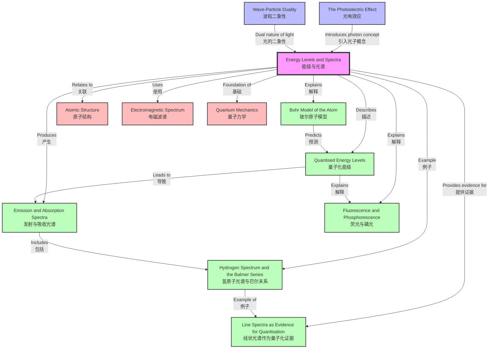

# 1. Overview / 概述

**English:**
This topic explores the quantised nature of atomic energy, a cornerstone of modern physics. It investigates how electrons within atoms can only occupy specific, discrete energy levels, and how transitions between these levels result in the emission or absorption of photons at characteristic wavelengths. The study of these spectra provides direct experimental evidence for the [[Quantised Energy Levels]] predicted by the [[Bohr Model of the Atom]].

Understanding energy levels and spectra is crucial because it bridges the gap between classical physics and quantum mechanics. It explains why different elements produce unique [[Emission and Absorption Spectra]]—their "fingerprints"—which are used in applications ranging from chemical analysis (spectroscopy) to astrophysics (determining the composition of stars). In the context of Cambridge 9702 and Edexcel IAL examinations, this topic is fundamental for explaining the [[Hydrogen Spectrum and the Balmer Series]], the concept of [[Line Spectra as Evidence for Quantisation]], and phenomena like [[Fluorescence and Phosphorescence]]. It builds directly on the [[The Photoelectric Effect]], which introduced the particle nature of light (photons), and connects to [[Wave-Particle Duality]], which describes the dual nature of matter and energy.

**中文：**
本主题探讨原子能量的量子化本质，这是现代物理学的基石。它研究原子中的电子如何只能占据特定的、离散的能级，以及这些能级之间的跃迁如何导致以特征波长发射或吸收光子。对这些光谱的研究为[[玻尔原子模型]]所预测的[[量子化能级]]提供了直接的实验证据。

理解能级和光谱至关重要，因为它架起了经典物理学和量子力学之间的桥梁。它解释了为什么不同元素会产生独特的[[发射和吸收光谱]]——它们的“指纹”——这些光谱被用于从化学分析（光谱学）到天体物理学（确定恒星成分）等各种应用中。在剑桥9702和爱德思IAL考试中，这个主题对于解释[[氢原子光谱与巴尔末系]]、[[线状光谱作为量子化证据]]的概念以及[[荧光与磷光]]等现象至关重要。它直接建立在[[光电效应]]的基础上，后者引入了光的粒子性（光子），并与描述物质和能量波粒二象性的[[波粒二象性]]相关联。

---

# 2. Syllabus Learning Objectives / 考纲学习目标

| CAIE 9702 | Edexcel IAL |
|-----------|-------------|
| 22.3(a) Describe the concept of quantised energy levels in atoms. | 7.13 Understand the concept of quantised energy levels in atoms. |
| 22.3(b) Explain the origin of line emission spectra and line absorption spectra. | 7.14 Understand how line spectra are produced by electron transitions between energy levels. |
| 22.3(c) Use the equation $E_2 - E_1 = hf$ for transitions between energy levels. | 7.15 Use the equation $\Delta E = hf = \frac{hc}{\lambda}$ for transitions. |
| 22.3(d) Describe the hydrogen spectrum and the Balmer series. | 7.16 Describe the hydrogen spectrum, including the Balmer series in the visible region. |
| 22.3(e) Explain how line spectra provide evidence for quantisation. | 7.17 Explain how line spectra provide evidence for the existence of discrete energy levels. |
| 22.3(f) Describe fluorescence and phosphorescence. | 7.18 Understand the principles of fluorescence and phosphorescence. |
| 22.3(g) Use the equation $E = hf$ and $c = f\lambda$ in spectral calculations. | (Integrated into 7.15) |

**Examiner Expectations / 考官期望:**

**English:**
- Candidates must be able to **describe** the discrete nature of energy levels and **explain** how transitions produce spectra.
- They must **calculate** photon energies, frequencies, and wavelengths using $E = hf$ and $c = f\lambda$.
- They must **interpret** spectral lines as evidence for quantisation and **distinguish** between emission and absorption spectra.
- For the hydrogen spectrum, candidates should **identify** the Balmer series (visible) and **explain** why other series (Lyman, Paschen) exist.
- For fluorescence and phosphorescence, candidates must **explain** the difference in terms of time delay and energy level transitions.

**中文：**
- 考生必须能够**描述**能级的离散性质，并**解释**跃迁如何产生光谱。
- 他们必须使用 $E = hf$ 和 $c = f\lambda$ **计算**光子能量、频率和波长。
- 他们必须**解释**谱线作为量子化的证据，并**区分**发射光谱和吸收光谱。
- 对于氢原子光谱，考生应**识别**巴尔末系（可见光），并**解释**为什么存在其他线系（莱曼系、帕邢系）。
- 对于荧光和磷光，考生必须**解释**它们在时间延迟和能级跃迁方面的区别。

> 📋 **CIE Only:** CAIE specifically requires describing the **Balmer series** and its location in the visible spectrum. Candidates may be asked to calculate the wavelength of a specific Balmer line.
>
> 📋 **Edexcel Only:** Edexcel explicitly requires understanding the **principles** of fluorescence and phosphorescence, including the role of metastable states and the Stokes shift.

---

# 3. Core Definitions / 核心定义

| Term (EN/CN) | Definition (EN) | Definition (CN) | Common Mistakes / 常见错误 |
|--------------|-----------------|-----------------|---------------------------|
| **Energy Level / 能级** | A fixed, discrete amount of energy that an electron in an atom can possess. | 原子中电子可以拥有的固定的、离散的能量值。 | Confusing energy levels with orbits; thinking electrons can have any energy between levels. |
| **Ground State / 基态** | The lowest possible energy level of an atom, where the electron is in its most stable configuration. | 原子可能的最低能级，电子处于最稳定的构型。 | Thinking ground state means zero energy; it is the lowest allowed energy, not zero. |
| **Excited State / 激发态** | Any energy level higher than the ground state that an electron can occupy after absorbing energy. | 电子吸收能量后可以占据的任何高于基态的能级。 | Assuming excited states are permanent; they are temporary and decay rapidly. |
| **Excitation / 激发** | The process of an electron absorbing energy and moving from a lower to a higher energy level. | 电子吸收能量并从较低能级跃迁到较高能级的过程。 | Confusing excitation with ionisation; excitation moves to a higher level, ionisation removes the electron entirely. |
| **Ionisation / 电离** | The process of removing an electron from an atom entirely, requiring energy equal to or greater than the ionisation energy. | 将电子完全从原子中移除的过程，需要等于或大于电离能的能量。 | Thinking ionisation is the same as excitation; ionisation removes the electron, excitation does not. |
| **Photon / 光子** | A discrete packet (quantum) of electromagnetic radiation, carrying energy $E = hf$. | 电磁辐射的离散能量包（量子），携带能量 $E = hf$。 | Forgetting that photon energy depends on frequency, not amplitude. |
| **Emission Spectrum / 发射光谱** | A spectrum of bright lines at specific wavelengths produced when electrons in excited atoms fall to lower energy levels, emitting photons. | 当激发态原子中的电子跃迁到较低能级并发射光子时，在特定波长处产生的亮线光谱。 | Confusing emission with absorption; emission shows bright lines, absorption shows dark lines. |
| **Absorption Spectrum / 吸收光谱** | A continuous spectrum with dark lines at specific wavelengths where photons have been absorbed by electrons moving to higher energy levels. | 在特定波长处具有暗线的连续光谱，这些波长的光子被跃迁到更高能级的电子吸收。 | Thinking absorption lines are random; they correspond exactly to emission lines of the same element. |
| **Line Spectrum / 线状光谱** | A spectrum consisting of discrete lines at specific wavelengths, characteristic of a particular element. | 由特定波长处的离散谱线组成的光谱，是特定元素的特征。 | Confusing line spectra with continuous spectra; line spectra have gaps, continuous spectra do not. |
| **Balmer Series / 巴尔末系** | A set of spectral lines in the visible region of the hydrogen spectrum, produced by transitions from higher energy levels to the $n=2$ level. | 氢原子光谱可见光区域的一组谱线，由电子从较高能级跃迁到 $n=2$ 能级产生。 | Forgetting that Balmer series is only one of several series; Lyman (UV) and Paschen (IR) also exist. |
| **Fluorescence / 荧光** | The emission of light by a substance that has absorbed light or other electromagnetic radiation, with a very short time delay (typically nanoseconds). | 物质吸收光或其他电磁辐射后发射光的过程，时间延迟非常短（通常为纳秒级）。 | Confusing fluorescence with phosphorescence; fluorescence is fast, phosphorescence is slow. |
| **Phosphorescence / 磷光** | The emission of light by a substance that has absorbed light or other electromagnetic radiation, with a longer time delay (milliseconds to hours). | 物质吸收光或其他电磁辐射后发射光的过程，时间延迟较长（毫秒到小时）。 | Thinking phosphorescence is always visible; it can occur in the dark but requires prior excitation. |
| **Metastable State / 亚稳态** | An excited energy level with a longer lifetime than typical excited states, allowing for delayed emission (phosphorescence). | 寿命比典型激发态更长的激发能级，允许延迟发射（磷光）。 | Confusing metastable states with ground state; they are still excited states, just longer-lived. |

---

# 4. Key Concepts Explained / 关键概念详解

## 4.1 Quantised Energy Levels / 量子化能级

### Explanation / 解释
**English:**
In classical physics, an electron orbiting a nucleus could theoretically have any energy, like a planet orbiting the sun. However, quantum mechanics reveals that electrons in atoms can only occupy specific, discrete energy levels. This is known as **quantisation**. Each energy level is associated with a principal quantum number $n$ (where $n = 1, 2, 3, \dots$). The lowest level ($n=1$) is the [[Ground State]], and higher levels ($n=2, 3, \dots$) are [[Excited State]]s. The energy of each level is negative, with the ground state being the most negative (most tightly bound). As $n$ increases, the energy becomes less negative, approaching zero at ionisation ($n = \infty$). This concept is central to the [[Bohr Model of the Atom]].

**中文：**
在经典物理学中，绕核旋转的电子理论上可以拥有任何能量，就像绕太阳运行的行星一样。然而，量子力学揭示，原子中的电子只能占据特定的、离散的能级。这被称为**量子化**。每个能级都与一个主量子数 $n$ 相关联（其中 $n = 1, 2, 3, \dots$）。最低能级（$n=1$）是[[基态]]，更高的能级（$n=2, 3, \dots$）是[[激发态]]。每个能级的能量为负值，基态是最负的（结合最紧密）。随着 $n$ 的增加，能量变得不那么负，在电离时趋近于零（$n = \infty$）。这个概念是[[玻尔原子模型]]的核心。

### Physical Meaning / 物理意义
**English:**
Quantisation means that an electron cannot exist "between" energy levels. It must either be in one level or another. This explains why atoms absorb and emit light only at specific wavelengths—the energy difference between levels is fixed. For example, a hydrogen atom in its ground state can only absorb a photon with energy exactly equal to the difference between $n=1$ and $n=2$ (or higher), not any arbitrary energy.

**中文：**
量子化意味着电子不能存在于能级“之间”。它必须处于一个能级或另一个能级。这解释了为什么原子只在特定波长吸收和发射光——能级之间的能量差是固定的。例如，处于基态的氢原子只能吸收能量恰好等于 $n=1$ 和 $n=2$（或更高）之间差值的能量，而不是任意能量。

### Common Misconceptions / 常见误区
1. **Electrons orbit like planets:** Electrons do not have well-defined orbits; they exist in probability clouds (orbitals). The Bohr model is a simplification.
2. **Energy levels are equally spaced:** They are not. The spacing decreases as $n$ increases (converges to zero at ionisation).
3. **Ground state has zero energy:** The ground state has negative energy; zero energy corresponds to the ionisation limit.

### Exam Tips / 考试提示
**English:**
- Be prepared to **sketch** an energy level diagram showing the ground state, excited states, and ionisation level.
- **Calculate** the energy difference between levels and the corresponding photon wavelength.
- **Explain** why the energy levels converge as $n$ increases.

**中文：**
- 准备好**绘制**能级图，显示基态、激发态和电离能级。
- **计算**能级之间的能量差以及相应的光子波长。
- **解释**为什么能级随着 $n$ 的增加而收敛。

---

## 4.2 Emission and Absorption Spectra / 发射光谱和吸收光谱

### Explanation / 解释
**English:**
When an electron in an [[Excited State]] falls to a lower energy level, it emits a photon with energy exactly equal to the difference between the two levels: $\Delta E = E_{\text{higher}} - E_{\text{lower}} = hf$. This produces an **emission spectrum**—a series of bright lines at specific wavelengths. Conversely, when a photon passes through a gas, it can be absorbed if its energy exactly matches the difference between two energy levels, causing an electron to jump to a higher level. This produces an **absorption spectrum**—a continuous spectrum with dark lines at those same wavelengths. The pattern of lines is unique to each element, providing [[Line Spectra as Evidence for Quantisation]].

**中文：**
当[[激发态]]中的电子跃迁到较低能级时，它会发射一个光子，其能量恰好等于两个能级之间的差值：$\Delta E = E_{\text{较高}} - E_{\text{较低}} = hf$。这产生**发射光谱**——在特定波长处的一系列亮线。相反，当光子穿过气体时，如果其能量恰好匹配两个能级之间的差值，它可能被吸收，导致电子跃迁到更高能级。这产生**吸收光谱**——在相同波长处具有暗线的连续光谱。谱线的模式对每种元素都是独特的，提供了[[线状光谱作为量子化证据]]。

### Physical Meaning / 物理意义
**English:**
Emission and absorption spectra are like "fingerprints" for elements. Astronomers use absorption spectra to determine the composition of stars (Fraunhofer lines). Chemists use emission spectra to identify elements in unknown samples (spectroscopy). The fact that each element has a unique spectrum is direct evidence that energy levels are quantised and specific to each atom.

**中文：**
发射光谱和吸收光谱就像元素的“指纹”。天文学家使用吸收光谱来确定恒星的成分（夫琅禾费线）。化学家使用发射光谱来识别未知样品中的元素（光谱学）。每种元素都有独特光谱这一事实是能级量子化且对每个原子特定的直接证据。

### Common Misconceptions / 常见误区
1. **Emission and absorption spectra are the same:** They are complementary—emission shows bright lines, absorption shows dark lines at the same wavelengths.
2. **All elements have the same spectrum:** Each element has a unique set of energy levels, hence a unique spectrum.
3. **Absorption requires a continuous spectrum:** Yes, a continuous spectrum (like from a hot filament) is needed to see dark absorption lines.

### Exam Tips / 考试提示
**English:**
- **Compare and contrast** emission and absorption spectra.
- **Explain** why the dark lines in an absorption spectrum correspond exactly to the bright lines in an emission spectrum.
- **Use** the equation $\Delta E = hf = \frac{hc}{\lambda}$ to calculate wavelengths from energy level differences.

**中文：**
- **比较和对比**发射光谱和吸收光谱。
- **解释**为什么吸收光谱中的暗线与发射光谱中的亮线完全对应。
- **使用**方程 $\Delta E = hf = \frac{hc}{\lambda}$ 从能级差计算波长。

---

## 4.3 The Hydrogen Spectrum and the Balmer Series / 氢原子光谱与巴尔末系

### Explanation / 解释
**English:**
The hydrogen atom has the simplest spectrum, with several series of lines. The **Balmer series** is the most famous because it lies in the visible region. It results from transitions from higher energy levels ($n = 3, 4, 5, \dots$) down to the $n = 2$ level. The first line (Hα) is red ($n=3 \to 2$), the second (Hβ) is blue-green ($n=4 \to 2$), and the series converges to a limit at the ionisation energy from $n=2$. Other series include the **Lyman series** (UV, transitions to $n=1$) and the **Paschen series** (IR, transitions to $n=3$). The [[Hydrogen Spectrum and the Balmer Series]] is a key example of quantised energy levels.

**中文：**
氢原子具有最简单的光谱，有几个线系。**巴尔末系**是最著名的，因为它位于可见光区域。它是由电子从较高能级（$n = 3, 4, 5, \dots$）跃迁到 $n = 2$ 能级产生的。第一条线（Hα）是红色的（$n=3 \to 2$），第二条（Hβ）是蓝绿色的（$n=4 \to 2$），该线系收敛到从 $n=2$ 电离的极限。其他线系包括**莱曼系**（紫外线，跃迁到 $n=1$）和**帕邢系**（红外线，跃迁到 $n=3$）。[[氢原子光谱与巴尔末系]]是量子化能级的关键例子。

### Physical Meaning / 物理意义
**English:**
The Balmer series is visible to the human eye, which is why it was discovered first (by Johann Balmer in 1885). The fact that the lines are discrete and follow a mathematical pattern ($\frac{1}{\lambda} = R_H \left( \frac{1}{2^2} - \frac{1}{n^2} \right)$) was early evidence for quantisation. The convergence of the series to a limit corresponds to the ionisation energy of the atom from the $n=2$ level.

**中文：**
巴尔末系是人眼可见的，这就是为什么它首先被发现（由约翰·巴尔末于1885年发现）。谱线是离散的并遵循数学模式（$\frac{1}{\lambda} = R_H \left( \frac{1}{2^2} - \frac{1}{n^2} \right)$）这一事实是量子化的早期证据。线系收敛到一个极限对应于从 $n=2$ 能级电离原子的能量。

### Common Misconceptions / 常见误区
1. **Balmer series is the only series:** There are also Lyman (UV) and Paschen (IR) series.
2. **All Balmer lines are visible:** Only the first few lines are visible; higher lines converge and become too faint.
3. **The Balmer formula is for all atoms:** It is specific to hydrogen; other elements have more complex spectra.

### Exam Tips / 考试提示
**English:**
- **Memorise** the Balmer formula: $\frac{1}{\lambda} = R_H \left( \frac{1}{2^2} - \frac{1}{n^2} \right)$ where $n = 3, 4, 5, \dots$.
- **Calculate** the wavelength of a specific Balmer line using the Rydberg constant $R_H = 1.097 \times 10^7 \, \text{m}^{-1}$.
- **Explain** why the series converges to a limit.

**中文：**
- **记住**巴尔末公式：$\frac{1}{\lambda} = R_H \left( \frac{1}{2^2} - \frac{1}{n^2} \right)$，其中 $n = 3, 4, 5, \dots$。
- **使用**里德伯常数 $R_H = 1.097 \times 10^7 \, \text{m}^{-1}$ **计算**特定巴尔末线的波长。
- **解释**为什么线系收敛到一个极限。

---

## 4.4 Fluorescence and Phosphorescence / 荧光与磷光

### Explanation / 解释
**English:**
[[Fluorescence and Phosphorescence]] are processes where a substance absorbs high-energy photons (usually UV) and re-emits lower-energy photons (usually visible light). In **fluorescence**, the electron absorbs a photon, jumps to a higher energy level, then quickly (within nanoseconds) falls back in steps, emitting visible light. The emitted light has a longer wavelength (lower energy) than the absorbed light—this is called the **Stokes shift**. In **phosphorescence**, the electron is trapped in a [[Metastable State]]—an excited state with a longer lifetime. The electron may stay there for milliseconds to hours before eventually falling back and emitting light. This is why phosphorescent materials "glow in the dark."

**中文：**
[[荧光与磷光]]是物质吸收高能光子（通常是紫外线）并重新发射较低能量光子（通常是可见光）的过程。在**荧光**中，电子吸收一个光子，跃迁到更高的能级，然后迅速（在纳秒内）逐步回落，发射可见光。发射的光比吸收的光具有更长的波长（更低的能量）——这被称为**斯托克斯位移**。在**磷光**中，电子被困在[[亚稳态]]中——一种寿命较长的激发态。电子可能在那里停留毫秒到小时，然后最终回落并发射光。这就是为什么磷光材料会“在黑暗中发光”。

### Physical Meaning / 物理意义
**English:**
Fluorescence is used in fluorescent lamps (UV from mercury vapour excites phosphor coating), highlighter pens, and biological imaging (fluorescent tags). Phosphorescence is used in "glow-in-the-dark" toys, emergency exit signs, and watch dials. The key difference is the time delay: fluorescence is immediate, phosphorescence is delayed.

**中文：**
荧光用于荧光灯（汞蒸气产生的紫外线激发荧光粉涂层）、荧光笔和生物成像（荧光标记）。磷光用于“夜光”玩具、紧急出口标志和表盘。关键区别在于时间延迟：荧光是即时的，磷光是延迟的。

### Common Misconceptions / 常见误区
1. **Fluorescence and phosphorescence are the same:** They differ in time delay due to metastable states.
2. **Phosphorescence lasts forever:** It decays over time as electrons eventually fall back.
3. **The emitted light has the same wavelength as absorbed light:** Due to the Stokes shift, emitted light has a longer wavelength (lower energy).

### Exam Tips / 考试提示
**English:**
- **Explain** the difference between fluorescence and phosphorescence in terms of energy level transitions and time scales.
- **Describe** the role of metastable states in phosphorescence.
- **Use** the concept of the Stokes shift to explain why fluorescent materials appear to "glow."

**中文：**
- **解释**荧光和磷光在能级跃迁和时间尺度上的区别。
- **描述**亚稳态在磷光中的作用。
- **使用**斯托克斯位移的概念解释为什么荧光材料看起来会“发光”。

---

> 📷 **IMAGE PROMPT — [EP-01]: Energy Level Diagram with Transitions**
>
> A clean, educational diagram showing a hydrogen atom's energy levels (n=1, 2, 3, 4, ∞) as horizontal lines on a vertical energy axis. Arrows point upward (absorption, blue) and downward (emission, red). Labels indicate ground state, excited states, ionisation level, and the Balmer series transitions (n=3→2, n=4→2, n=5→2). The diagram should be in a textbook style with clear fonts and a white background.

---

# 5. Essential Equations / 核心公式

## 5.1 Photon Energy Equation / 光子能量方程

**Equation / 公式:**
$$ E = hf = \frac{hc}{\lambda} $$

**Variables / 变量:**
| Symbol (符号) | Meaning (EN) | Meaning (CN) | Unit (单位) |
|--------------|-------------|-------------|------------|
| $E$ | Energy of a photon | 光子的能量 | J (joules) or eV (electronvolts) |
| $h$ | Planck's constant ($6.63 \times 10^{-34} \, \text{J s}$) | 普朗克常数 | J s |
| $f$ | Frequency of electromagnetic radiation | 电磁辐射的频率 | Hz (hertz) |
| $c$ | Speed of light in vacuum ($3.00 \times 10^8 \, \text{m s}^{-1}$) | 真空中的光速 | m s⁻¹ |
| $\lambda$ | Wavelength of electromagnetic radiation | 电磁辐射的波长 | m (metres) |

**Derivation / 推导:**
**English:**
This equation combines Planck's quantum hypothesis ($E = hf$) with the wave equation ($c = f\lambda$). Rearranging $c = f\lambda$ gives $f = \frac{c}{\lambda}$, which is substituted into $E = hf$ to obtain $E = \frac{hc}{\lambda}$.

**中文：**
该方程结合了普朗克的量子假说（$E = hf$）和波动方程（$c = f\lambda$）。将 $c = f\lambda$ 重排得到 $f = \frac{c}{\lambda}$，代入 $E = hf$ 得到 $E = \frac{hc}{\lambda}$。

**Conditions / 适用条件:**
**English:**
- Applies to all photons, regardless of energy.
- Valid for electromagnetic radiation in vacuum or air (where $c$ is constant).

**中文：**
- 适用于所有光子，无论能量大小。
- 适用于真空或空气中的电磁辐射（其中 $c$ 是常数）。

**Limitations / 局限性:**
**English:**
- Does not account for the wave nature of light (interference, diffraction).
- Assumes light travels at $c$; in a medium, the speed is lower.

**中文：**
- 不考虑光的波动性（干涉、衍射）。
- 假设光以 $c$ 传播；在介质中，速度较低。

**Rearrangements / 变形:**
$$ f = \frac{E}{h} $$
$$ \lambda = \frac{hc}{E} $$

---

## 5.2 Energy Level Transition Equation / 能级跃迁方程

**Equation / 公式:**
$$ \Delta E = E_{\text{higher}} - E_{\text{lower}} = hf = \frac{hc}{\lambda} $$

**Variables / 变量:**
| Symbol (符号) | Meaning (EN) | Meaning (CN) | Unit (单位) |
|--------------|-------------|-------------|------------|
| $\Delta E$ | Energy difference between two levels | 两个能级之间的能量差 | J or eV |
| $E_{\text{higher}}$ | Energy of the higher level | 较高能级的能量 | J or eV |
| $E_{\text{lower}}$ | Energy of the lower level | 较低能级的能量 | J or eV |
| $h$ | Planck's constant | 普朗克常数 | J s |
| $f$ | Frequency of emitted/absorbed photon | 发射/吸收光子的频率 | Hz |
| $\lambda$ | Wavelength of emitted/absorbed photon | 发射/吸收光子的波长 | m |

**Derivation / 推导:**
**English:**
When an electron transitions from a higher energy level $E_{\text{higher}}$ to a lower energy level $E_{\text{lower}}$, the energy lost is emitted as a photon: $\Delta E = E_{\text{higher}} - E_{\text{lower}}$. This energy equals the photon energy: $\Delta E = hf = \frac{hc}{\lambda}$. For absorption, the same equation applies but the photon energy is absorbed.

**中文：**
当电子从较高能级 $E_{\text{higher}}$ 跃迁到较低能级 $E_{\text{lower}}$ 时，损失的能量以光子形式发射：$\Delta E = E_{\text{higher}} - E_{\text{lower}}$。这个能量等于光子能量：$\Delta E = hf = \frac{hc}{\lambda}$。对于吸收，适用相同的方程，但光子能量被吸收。

**Conditions / 适用条件:**
**English:**
- Only valid for transitions between discrete energy levels.
- The photon energy must exactly match $\Delta E$ for absorption to occur.

**中文：**
- 仅适用于离散能级之间的跃迁。
- 光子能量必须恰好等于 $\Delta E$ 才能发生吸收。

**Limitations / 局限性:**
**English:**
- Does not account for selection rules (some transitions are forbidden).
- Assumes no other energy loss mechanisms (e.g., collisions).

**中文：**
- 不考虑选择定则（某些跃迁是被禁止的）。
- 假设没有其他能量损失机制（例如碰撞）。

**Rearrangements / 变形:**
$$ \lambda = \frac{hc}{E_{\text{higher}} - E_{\text{lower}}} $$
$$ f = \frac{E_{\text{higher}} - E_{\text{lower}}}{h} $$

---

## 5.3 Balmer Formula / 巴尔末公式

**Equation / 公式:**
$$ \frac{1}{\lambda} = R_H \left( \frac{1}{2^2} - \frac{1}{n^2} \right) \quad \text{for } n = 3, 4, 5, \dots $$

**Variables / 变量:**
| Symbol (符号) | Meaning (EN) | Meaning (CN) | Unit (单位) |
|--------------|-------------|-------------|------------|
| $\lambda$ | Wavelength of emitted photon | 发射光子的波长 | m |
| $R_H$ | Rydberg constant for hydrogen ($1.097 \times 10^7 \, \text{m}^{-1}$) | 氢的里德伯常数 | m⁻¹ |
| $n$ | Principal quantum number of the higher energy level | 较高能级的主量子数 | dimensionless |

**Derivation / 推导:**
**English:**
The Balmer formula is an empirical equation derived from the observed wavelengths of the hydrogen spectrum. It can be derived from the Bohr model using the energy levels $E_n = -\frac{13.6 \, \text{eV}}{n^2}$. For a transition from $n$ to $n=2$:
$$ \Delta E = E_n - E_2 = -13.6 \left( \frac{1}{n^2} - \frac{1}{2^2} \right) = 13.6 \left( \frac{1}{2^2} - \frac{1}{n^2} \right) \, \text{eV} $$
Then $\Delta E = \frac{hc}{\lambda}$, so $\frac{1}{\lambda} = \frac{\Delta E}{hc} = \frac{13.6 \, \text{eV}}{hc} \left( \frac{1}{2^2} - \frac{1}{n^2} \right) = R_H \left( \frac{1}{2^2} - \frac{1}{n^2} \right)$.

**中文：**
巴尔末公式是从氢原子光谱的观测波长推导出的经验方程。它可以使用玻尔模型从能级 $E_n = -\frac{13.6 \, \text{eV}}{n^2}$ 推导出来。对于从 $n$ 到 $n=2$ 的跃迁：
$$ \Delta E = E_n - E_2 = -13.6 \left( \frac{1}{n^2} - \frac{1}{2^2} \right) = 13.6 \left( \frac{1}{2^2} - \frac{1}{n^2} \right) \, \text{eV} $$
然后 $\Delta E = \frac{hc}{\lambda}$，所以 $\frac{1}{\lambda} = \frac{\Delta E}{hc} = \frac{13.6 \, \text{eV}}{hc} \left( \frac{1}{2^2} - \frac{1}{n^2} \right) = R_H \left( \frac{1}{2^2} - \frac{1}{n^2} \right)$。

**Conditions / 适用条件:**
**English:**
- Specific to the hydrogen atom.
- Only for transitions ending at $n=2$ (Balmer series).

**中文：**
- 特定于氢原子。
- 仅适用于终止于 $n=2$ 的跃迁（巴尔末系）。

**Limitations / 局限性:**
**English:**
- Does not apply to other elements.
- Does not account for fine structure (splitting of lines due to spin-orbit coupling).

**中文：**
- 不适用于其他元素。
- 不考虑精细结构（由于自旋-轨道耦合导致的谱线分裂）。

**Rearrangements / 变形:**
$$ \lambda = \frac{1}{R_H \left( \frac{1}{2^2} - \frac{1}{n^2} \right)} $$

---

## 5.4 General Rydberg Formula / 通用里德伯公式

**Equation / 公式:**
$$ \frac{1}{\lambda} = R_H \left( \frac{1}{n_{\text{lower}}^2} - \frac{1}{n_{\text{higher}}^2} \right) $$

**Variables / 变量:**
| Symbol (符号) | Meaning (EN) | Meaning (CN) | Unit (单位) |
|--------------|-------------|-------------|------------|
| $\lambda$ | Wavelength of emitted/absorbed photon | 发射/吸收光子的波长 | m |
| $R_H$ | Rydberg constant ($1.097 \times 10^7 \, \text{m}^{-1}$) | 里德伯常数 | m⁻¹ |
| $n_{\text{lower}}$ | Principal quantum number of lower level | 较低能级的主量子数 | dimensionless |
| $n_{\text{higher}}$ | Principal quantum number of higher level | 较高能级的主量子数 | dimensionless |

**Derivation / 推导:**
**English:**
This is the general form of the Rydberg formula, applicable to any transition in hydrogen. For emission, $n_{\text{higher}} > n_{\text{lower}}$. For absorption, the same formula applies but the photon is absorbed.

**中文：**
这是里德伯公式的通用形式，适用于氢中的任何跃迁。对于发射，$n_{\text{higher}} > n_{\text{lower}}$。对于吸收，适用相同的公式，但光子被吸收。

**Conditions / 适用条件:**
**English:**
- Specific to hydrogen-like atoms (single electron).
- Valid for all series: Lyman ($n_{\text{lower}} = 1$), Balmer ($n_{\text{lower}} = 2$), Paschen ($n_{\text{lower}} = 3$), etc.

**中文：**
- 特定于类氢原子（单个电子）。
- 适用于所有线系：莱曼系（$n_{\text{lower}} = 1$）、巴尔末系（$n_{\text{lower}} = 2$）、帕邢系（$n_{\text{lower}} = 3$）等。

**Limitations / 局限性:**
**English:**
- Does not apply to multi-electron atoms.
- Assumes infinite nuclear mass (a small correction is needed for finite mass).

**中文：**
- 不适用于多电子原子。
- 假设原子核质量无限大（有限质量需要小的修正）。

**Rearrangements / 变形:**
$$ \lambda = \frac{1}{R_H \left( \frac{1}{n_{\text{lower}}^2} - \frac{1}{n_{\text{higher}}^2} \right)} $$

---

# 6. Graphs and Relationships / 图表与关系

## 6.1 Energy Level Diagram / 能级图

### Axes / 坐标轴
**English:** Vertical axis: Energy (E) in eV or J. No horizontal axis; levels are drawn as horizontal lines at appropriate heights.
**中文：** 纵轴：能量（E），单位为 eV 或 J。无横轴；能级以适当高度的水平线绘制。

### Shape / 形状
**English:** A series of horizontal lines at decreasing spacing as energy increases. The ground state (n=1) is at the bottom (most negative). Higher levels (n=2, 3, 4, ...) are above, with decreasing spacing. The ionisation level (n=∞) is at E=0.
**中文：** 一系列水平线，随着能量增加间距减小。基态（n=1）在底部（最负）。更高的能级（n=2, 3, 4, ...）在上面，间距递减。电离能级（n=∞）在 E=0 处。

### Gradient Meaning / 斜率含义
**English:** Not applicable; the diagram shows discrete levels, not a continuous function.
**中文：** 不适用；该图显示离散能级，而非连续函数。

### Area Meaning / 面积含义
**English:** Not applicable.
**中文：** 不适用。

### Exam Interpretation / 考试解读
**English:**
- Candidates must be able to **draw** and **label** energy level diagrams.
- **Identify** the ground state, excited states, and ionisation level.
- **Show** transitions with arrows (up for absorption, down for emission).
- **Calculate** the energy difference from the diagram.

**中文：**
- 考生必须能够**绘制**和**标注**能级图。
- **识别**基态、激发态和电离能级。
- **用箭头**表示跃迁（向上为吸收，向下为发射）。
- **从图中计算**能量差。

### Common Questions / 常见问题
**English:**
- "Draw an energy level diagram for hydrogen showing the first three levels and the ionisation level."
- "On your diagram, indicate a transition that produces a photon in the visible spectrum."
- "Calculate the wavelength of the photon emitted when an electron falls from n=3 to n=2."

**中文：**
- "画出氢的能级图，显示前三个能级和电离能级。"
- "在你的图上，标出一个在可见光谱中产生光子的跃迁。"
- "计算电子从 n=3 跃迁到 n=2 时发射的光子的波长。"

---

## 6.2 Emission Spectrum Graph / 发射光谱图

### Axes / 坐标轴
**English:** Horizontal axis: Wavelength (λ) in nm or m. Vertical axis: Intensity (arbitrary units).
**中文：** 横轴：波长（λ），单位为 nm 或 m。纵轴：强度（任意单位）。

### Shape / 形状
**English:** A series of sharp peaks (bright lines) at specific wavelengths. The height of each peak indicates the intensity of that spectral line. For hydrogen, the Balmer series shows lines at 656 nm (red), 486 nm (blue-green), 434 nm (violet), etc.
**中文：** 在特定波长处的一系列尖锐峰值（亮线）。每个峰值的高度表示该谱线的强度。对于氢，巴尔末系在 656 nm（红色）、486 nm（蓝绿色）、434 nm（紫色）等处显示谱线。

### Gradient Meaning / 斜率含义
**English:** Not applicable; the graph shows discrete lines, not a continuous function.
**中文：** 不适用；该图显示离散谱线，而非连续函数。

### Area Meaning / 面积含义
**English:** The area under a peak is proportional to the intensity of that spectral line (number of photons emitted per second).
**中文：** 峰值下的面积与该谱线的强度（每秒发射的光子数）成正比。

### Exam Interpretation / 考试解读
**English:**
- **Identify** which element the spectrum belongs to by comparing line positions.
- **Explain** why the lines are at specific wavelengths (energy level differences).
- **Calculate** the energy difference from the wavelength using $E = \frac{hc}{\lambda}$.

**中文：**
- **通过比较谱线位置识别**光谱属于哪种元素。
- **解释**为什么谱线在特定波长处（能级差）。
- **使用** $E = \frac{hc}{\lambda}$ **从波长计算**能量差。

### Common Questions / 常见问题
**English:**
- "The diagram shows the emission spectrum of hydrogen. Identify the Balmer series lines."
- "Calculate the energy of the photon corresponding to the 656 nm line."
- "Explain why the lines become closer together at shorter wavelengths."

**中文：**
- "该图显示了氢的发射光谱。识别巴尔末系的谱线。"
- "计算对应于 656 nm 谱线的光子能量。"
- "解释为什么在较短的波长处谱线变得更密集。"

---

## 6.3 Absorption Spectrum Graph / 吸收光谱图

### Axes / 坐标轴
**English:** Horizontal axis: Wavelength (λ) in nm or m. Vertical axis: Intensity (arbitrary units).
**中文：** 横轴：波长（λ），单位为 nm 或 m。纵轴：强度（任意单位）。

### Shape / 形状
**English:** A continuous spectrum (rainbow) with dark lines (dips in intensity) at specific wavelengths. The dark lines correspond exactly to the bright lines in the emission spectrum of the same element.
**中文：** 在特定波长处具有暗线（强度下降）的连续光谱（彩虹）。暗线与相同元素的发射光谱中的亮线完全对应。

### Gradient Meaning / 斜率含义
**English:** Not applicable.
**中文：** 不适用。

### Area Meaning / 面积含义
**English:** The area of a dip is proportional to the amount of light absorbed at that wavelength.
**中文：** 下降区域的面积与该波长处吸收的光量成正比。

### Exam Interpretation / 考试解读
**English:**
- **Compare** absorption and emission spectra of the same element.
- **Explain** why the dark lines appear at the same wavelengths as the bright lines.
- **Use** absorption spectra to identify elements in stars (Fraunhofer lines).

**中文：**
- **比较**相同元素的吸收光谱和发射光谱。
- **解释**为什么暗线出现在与亮线相同的波长处。
- **使用**吸收光谱识别恒星中的元素（夫琅禾费线）。

### Common Questions / 常见问题
**English:**
- "The diagram shows the absorption spectrum of hydrogen. Explain why the dark lines are at the same wavelengths as the emission lines."
- "Describe how astronomers use absorption spectra to determine the composition of stars."

**中文：**
- "该图显示了氢的吸收光谱。解释为什么暗线与发射线在相同的波长处。"
- "描述天文学家如何使用吸收光谱来确定恒星的成分。"

---

> 📷 **IMAGE PROMPT — [EP-02]: Hydrogen Emission and Absorption Spectra Comparison**
>
> A side-by-side comparison of the hydrogen emission spectrum (bright lines on black background) and absorption spectrum (continuous rainbow with dark lines). The wavelengths are labelled in nm (656, 486, 434, 410). The emission spectrum shows sharp peaks, while the absorption spectrum shows corresponding dips. The background should be white with clear labels and a wavelength scale.

---

# 7. Required Diagrams / 必备图表

## 7.1 Energy Level Diagram for Hydrogen / 氢的能级图

### Description / 描述
**English:**
A diagram showing the quantised energy levels of the hydrogen atom. The vertical axis represents energy (in eV), with the ground state (n=1) at -13.6 eV, the first excited state (n=2) at -3.4 eV, the second excited state (n=3) at -1.51 eV, and so on. The ionisation level (n=∞) is at 0 eV. Arrows indicate possible transitions, with upward arrows for absorption and downward arrows for emission. The Balmer series transitions (to n=2) are highlighted.

**中文：**
显示氢原子量子化能级的图。纵轴表示能量（以 eV 为单位），基态（n=1）在 -13.6 eV，第一激发态（n=2）在 -3.4 eV，第二激发态（n=3）在 -1.51 eV，依此类推。电离能级（n=∞）在 0 eV。箭头表示可能的跃迁，向上箭头表示吸收，向下箭头表示发射。巴尔末系跃迁（到 n=2）被突出显示。

### Image Prompt / 图片生成提示
> 📷 **IMAGE PROMPT — [EP-03]: Hydrogen Energy Level Diagram**
>
> A clean, textbook-style diagram of hydrogen energy levels. Vertical axis labelled "Energy / eV" with tick marks at -13.6, -3.4, -1.51, -0.85, and 0. Horizontal lines at each energy level, labelled with n=1, n=2, n=3, n=4, n=∞. Red downward arrows from n=3→2, n=4→2, n=5→2 labelled "Balmer series (visible)". Blue upward arrows from n=1→2, n=1→3 labelled "Absorption". The diagram should be on a white background with clear, sans-serif fonts. Professional, educational style.

### Labels Required / 需要标注
- n=1 (Ground state / 基态)
- n=2 (First excited state / 第一激发态)
- n=3 (Second excited state / 第二激发态)
- n=∞ (Ionisation / 电离)
- Energy axis: Energy / eV
- Arrows: Absorption (up), Emission (down)
- Balmer series label

### Exam Importance / 考试重要性
**English:**
This diagram is essential for explaining how spectral lines are produced. Candidates are often asked to draw or interpret it in exams. It directly links energy level quantisation to observable spectra.

**中文：**
该图对于解释谱线如何产生至关重要。考生经常被要求在考试中绘制或解读它。它直接将能级量子化与可观测的光谱联系起来。

---

## 7.2 Emission and Absorption Spectra Comparison / 发射与吸收光谱对比

### Description / 描述
**English:**
A side-by-side comparison of the emission spectrum (bright lines on a dark background) and absorption spectrum (continuous spectrum with dark lines) for the same element, typically hydrogen. The wavelengths of the lines are labelled, showing that the bright lines in emission correspond exactly to the dark lines in absorption.

**中文：**
相同元素（通常是氢）的发射光谱（暗背景上的亮线）和吸收光谱（带有暗线的连续光谱）的并排比较。谱线的波长被标注，显示发射光谱中的亮线与吸收光谱中的暗线完全对应。

### Image Prompt / 图片生成提示
> 📷 **IMAGE PROMPT — [EP-04]: Emission vs Absorption Spectra**
>
> Two horizontal strips. Top strip: Emission spectrum of hydrogen with four bright vertical lines on a black background at 656 nm (red), 486 nm (blue-green), 434 nm (violet), and 410 nm (violet). Bottom strip: Absorption spectrum of hydrogen with a continuous rainbow background (red to violet) and four dark vertical lines at exactly the same positions. Wavelength scale in nm below both strips. Labels: "Emission Spectrum" and "Absorption Spectrum". Clean, educational style on white background.

### Labels Required / 需要标注
- Wavelengths: 656 nm, 486 nm, 434 nm, 410 nm
- "Emission Spectrum" / "发射光谱"
- "Absorption Spectrum" / "吸收光谱"
- "Bright lines" / "亮线"
- "Dark lines" / "暗线"

### Exam Importance / 考试重要性
**English:**
This diagram is frequently used to test understanding of the relationship between emission and absorption spectra. Candidates must explain why the lines match and what this implies about energy levels.

**中文：**
该图经常用于测试对发射光谱和吸收光谱之间关系的理解。考生必须解释为什么谱线匹配以及这对能级意味着什么。

---

## 7.3 Fluorescence and Phosphorescence Mechanism / 荧光与磷光机制

### Description / 描述
**English:**
A diagram showing the energy level transitions involved in fluorescence and phosphorescence. For fluorescence, an electron absorbs a high-energy photon (UV), jumps to a high excited state, then quickly falls back in steps, emitting lower-energy photons (visible). For phosphorescence, the electron is trapped in a metastable state (a longer-lived excited state) before eventually falling back and emitting light. The diagram should show the Stokes shift (longer wavelength emitted than absorbed).

**中文：**
显示荧光和磷光中涉及的能级跃迁的图。对于荧光，电子吸收高能光子（紫外线），跃迁到高激发态，然后迅速逐步回落，发射较低能量的光子（可见光）。对于磷光，电子被困在亚稳态（寿命较长的激发态）中，然后最终回落并发射光。该图应显示斯托克斯位移（发射的波长比吸收的波长长）。

### Image Prompt / 图片提示
> 📷 **IMAGE PROMPT — [EP-05]: Fluorescence and Phosphorescence Energy Level Diagram**
>
> A diagram with three energy levels: ground state (S0), first excited singlet state (S1), and a metastable triplet state (T1). For fluorescence: an upward arrow from S0 to S1 (absorption of UV photon), then a downward arrow from S1 to S0 (emission of visible photon). For phosphorescence: an upward arrow from S0 to S1, then a transition from S1 to T1 (intersystem crossing), then a delayed downward arrow from T1 to S0 (emission of visible photon). Labels: "Absorption (UV)", "Fluorescence (visible, fast)", "Phosphorescence (visible, slow)". The diagram should show the Stokes shift with longer wavelength for emission. Clean, educational style.

### Labels Required / 需要标注
- Ground state (S0) / 基态
- Excited singlet state (S1) / 激发单重态
- Metastable triplet state (T1) / 亚稳三重态
- Absorption (UV) / 吸收（紫外线）
- Fluorescence (fast) / 荧光（快速）
- Phosphorescence (slow) / 磷光（慢速）
- Stokes shift / 斯托克斯位移

### Exam Importance / 考试重要性
**English:**
This diagram is essential for explaining the difference between fluorescence and phosphorescence. Candidates must understand the role of metastable states and the time delay in phosphorescence.

**中文：**
该图对于解释荧光和磷光之间的区别至关重要。考生必须理解亚稳态的作用和磷光中的时间延迟。

---

# 8. Worked Examples / 典型例题

## Example 1: Calculating Photon Wavelength from Energy Level Transition / 从能级跃迁计算光子波长

### Question / 题目
**English:**
The energy levels of a hydrogen atom are given by $E_n = -\frac{13.6}{n^2} \, \text{eV}$. Calculate the wavelength of the photon emitted when an electron transitions from the $n=3$ level to the $n=2$ level. State whether this photon is in the visible region. (Planck's constant $h = 6.63 \times 10^{-34} \, \text{J s}$, speed of light $c = 3.00 \times 10^8 \, \text{m s}^{-1}$, $1 \, \text{eV} = 1.60 \times 10^{-19} \, \text{J}$)

**中文：**
氢原子的能级由 $E_n = -\frac{13.6}{n^2} \, \text{eV}$ 给出。计算电子从 $n=3$ 能级跃迁到 $n=2$ 能级时发射的光子的波长。说明该光子是否在可见光区域。（普朗克常数 $h = 6.63 \times 10^{-34} \, \text{J s}$，光速 $c = 3.00 \times 10^8 \, \text{m s}^{-1}$，$1 \, \text{eV} = 1.60 \times 10^{-19} \, \text{J}$）

### Image Prompt / 图片提示
> 📷 **IMAGE PROMPT — [EP-06]: Hydrogen n=3 to n=2 Transition**
>
> A simple energy level diagram for hydrogen showing only n=1, n=2, and n=3 levels. A red downward arrow from n=3 to n=2 is highlighted. Labels show the energy values: -1.51 eV (n=3), -3.40 eV (n=2), -13.6 eV (n=1). The arrow is labelled "Emission of photon, λ = ?". Clean, educational style.

### Solution / 解答

**Step 1: Calculate the energy of each level / 计算每个能级的能量**

$$ E_3 = -\frac{13.6}{3^2} = -\frac{13.6}{9} = -1.51 \, \text{eV} $$

$$ E_2 = -\frac{13.6}{2^2} = -\frac{13.6}{4} = -3.40 \, \text{eV} $$

**Step 2: Calculate the energy difference / 计算能量差**

$$ \Delta E = E_3 - E_2 = (-1.51) - (-3.40) = 1.89 \, \text{eV} $$

**Step 3: Convert energy to joules / 将能量转换为焦耳**

$$ \Delta E = 1.89 \, \text{eV} \times 1.60 \times 10^{-19} \, \text{J/eV} = 3.02 \times 10^{-19} \, \text{J} $$

**Step 4: Use the photon energy equation / 使用光子能量方程**

$$ \Delta E = \frac{hc}{\lambda} $$

$$ \lambda = \frac{hc}{\Delta E} = \frac{(6.63 \times 10^{-34})(3.00 \times 10^8)}{3.02 \times 10^{-19}} $$

**Step 5: Calculate the wavelength / 计算波长**

$$ \lambda = \frac{1.989 \times 10^{-25}}{3.02 \times 10^{-19}} = 6.59 \times 10^{-7} \, \text{m} = 659 \, \text{nm} $$

**Step 6: Determine if visible / 确定是否可见**

The visible spectrum ranges from approximately 400 nm (violet) to 700 nm (red). Since 659 nm is within this range, the photon is in the visible region (red light).

### Final Answer / 最终答案
**Answer:** $\lambda = 659 \, \text{nm}$ (visible, red light) | **答案：** $\lambda = 659 \, \text{nm}$（可见光，红光）

### Examiner Notes / 考官点评
**English:**
- Common mistake: Forgetting to convert eV to J before using $h$ in J s.
- Common mistake: Using $E_n$ directly without calculating the difference.
- Tip: Always check if the answer is in the visible range (400-700 nm).

**中文：**
- 常见错误：在使用以 J s 为单位的 $h$ 之前忘记将 eV 转换为 J。
- 常见错误：直接使用 $E_n$ 而不计算差值。
- 提示：始终检查答案是否在可见光范围内（400-700 nm）。

### Alternative Method / 替代方法
**English:**
Use the Balmer formula directly:
$$ \frac{1}{\lambda} = R_H \left( \frac{1}{2^2} - \frac{1}{3^2} \right) = 1.097 \times 10^7 \left( \frac{1}{4} - \frac{1}{9} \right) = 1.097 \times 10^7 \times 0.1389 = 1.524 \times 10^6 \, \text{m}^{-1} $$
$$ \lambda = \frac{1}{1.524 \times 10^6} = 6.56 \times 10^{-7} \, \text{m} = 656 \, \text{nm} $$
(The slight difference is due to rounding.)

**中文：**
直接使用巴尔末公式：
$$ \frac{1}{\lambda} = R_H \left( \frac{1}{2^2} - \frac{1}{3^2} \right) = 1.097 \times 10^7 \left( \frac{1}{4} - \frac{1}{9} \right) = 1.097 \times 10^7 \times 0.1389 = 1.524 \times 10^6 \, \text{m}^{-1} $$
$$ \lambda = \frac{1}{1.524 \times 10^6} = 6.56 \times 10^{-7} \, \text{m} = 656 \, \text{nm} $$
（微小差异是由于四舍五入。）

---

## Example 2: Identifying Transitions from a Spectrum / 从光谱识别跃迁

### Question / 题目
**English:**
The emission spectrum of a hydrogen atom shows a line at 486 nm. This line belongs to the Balmer series. Determine:
(a) The energy of the photon in eV.
(b) The initial and final energy levels involved in this transition.
(c) The series limit wavelength for the Balmer series.

(Use $h = 6.63 \times 10^{-34} \, \text{J s}$, $c = 3.00 \times 10^8 \, \text{m s}^{-1}$, $1 \, \text{eV} = 1.60 \times 10^{-19} \, \text{J}$, $R_H = 1.097 \times 10^7 \, \text{m}^{-1}$)

**中文：**
氢原子的发射光谱在 486 nm 处显示一条谱线。该谱线属于巴尔末系。确定：
(a) 光子的能量（以 eV 为单位）。
(b) 该跃迁涉及的初始和最终能级。
(c) 巴尔末系的线系极限波长。

（使用 $h = 6.63 \times 10^{-34} \, \text{J s}$，$c = 3.00 \times 10^8 \, \text{m s}^{-1}$，$1 \, \text{eV} = 1.60 \times 10^{-19} \, \text{J}$，$R_H = 1.097 \times 10^7 \, \text{m}^{-1}$）

### Solution / 解答

**Part (a): Photon energy / 光子能量**

$$ E = \frac{hc}{\lambda} = \frac{(6.63 \times 10^{-34})(3.00 \times 10^8)}{486 \times 10^{-9}} = \frac{1.989 \times 10^{-25}}{4.86 \times 10^{-7}} = 4.09 \times 10^{-19} \, \text{J} $$

Convert to eV:
$$ E = \frac{4.09 \times 10^{-19}}{1.60 \times 10^{-19}} = 2.56 \, \text{eV} $$

**Part (b): Initial and final levels / 初始和最终能级**

For the Balmer series, the final level is always $n=2$ ($E_2 = -3.40 \, \text{eV}$).

The initial level energy is:
$$ E_{\text{initial}} = E_2 + \Delta E = -3.40 + 2.56 = -0.84 \, \text{eV} $$

Using $E_n = -\frac{13.6}{n^2}$:
$$ -\frac{13.6}{n^2} = -0.84 $$
$$ n^2 = \frac{13.6}{0.84} = 16.19 $$
$$ n = \sqrt{16.19} \approx 4 $$

Therefore, the transition is from $n=4$ to $n=2$.

**Part (c): Balmer series limit / 巴尔末系极限**

The series limit occurs when $n \to \infty$ (ionisation from $n=2$):

$$ \frac{1}{\lambda_{\text{limit}}} = R_H \left( \frac{1}{2^2} - \frac{1}{\infty^2} \right) = R_H \times \frac{1}{4} = \frac{1.097 \times 10^7}{4} = 2.743 \times 10^6 \, \text{m}^{-1} $$

$$ \lambda_{\text{limit}} = \frac{1}{2.743 \times 10^6} = 3.65 \times 10^{-7} \, \text{m} = 365 \, \text{nm} $$

This is in the ultraviolet region, just beyond the visible spectrum.

### Final Answer / 最终答案
**Answer:** (a) $E = 2.56 \, \text{eV}$ (b) $n=4 \to n=2$ (c) $\lambda_{\text{limit}} = 365 \, \text{nm}$ (UV) | **答案：** (a) $E = 2.56 \, \text{eV}$ (b) $n=4 \to n=2$ (c) $\lambda_{\text{极限}} = 365 \, \text{nm}$（紫外线）

### Examiner Notes / 考官点评
**English:**
- Common mistake: Forgetting that the Balmer series ends at $n=2$, not $n=1$.
- Common mistake: Using the wrong formula for the series limit.
- Tip: The series limit corresponds to the ionisation energy from that level.

**中文：**
- 常见错误：忘记巴尔末系终止于 $n=2$，而不是 $n=1$。
- 常见错误：对线系极限使用错误的公式。
- 提示：线系极限对应于从该能级电离的能量。

---

# 9. Past Paper Question Types / 历年真题题型

| Question Type / 题型 | Frequency / 频率 | Difficulty / 难度 | Past Paper References / 真题索引 |
|----------------------|------------------|------------------|-------------------------------|
| Calculation of photon wavelength/energy from energy levels / 从能级计算光子波长/能量 | High | Medium | 📝 *待填入* |
| Drawing and interpreting energy level diagrams / 绘制和解读能级图 | High | Low-Medium | 📝 *待填入* |
| Explaining the origin of emission/absorption spectra / 解释发射/吸收光谱的起源 | High | Medium | 📝 *待填入* |
| Comparing fluorescence and phosphorescence / 比较荧光和磷光 | Medium | Medium | 📝 *待填入* |
| Using the Balmer formula / 使用巴尔末公式 | Medium | Medium-High | 📝 *待填入* |
| Identifying transitions from spectral lines / 从谱线识别跃迁 | Medium | High | 📝 *待填入* |
| Explaining line spectra as evidence for quantisation / 解释线状光谱作为量子化的证据 | High | Low-Medium | 📝 *待填入* |
| Practical: Using a diffraction grating to measure wavelengths / 实验：使用光栅测量波长 | Low | High | 📝 *待填入* |

> 📝 **题库整理中 / Question Bank Under Construction:** 具体试卷编号（如 9702/23/M/J/24 Q3）将在后续整理真题后填入上表。

**Common Command Words / 常见指令词:**

| Command Word (EN) | Command Word (CN) | Typical Usage / 典型用法 |
|-------------------|-------------------|-------------------------|
| State / 陈述 | 陈述 | "State what is meant by an energy level." |
| Define / 定义 | 定义 | "Define the ground state of an atom." |
| Explain / 解释 | 解释 | "Explain how line spectra provide evidence for quantised energy levels." |
| Describe / 描述 | 描述 | "Describe the difference between fluorescence and phosphorescence." |
| Calculate / 计算 | 计算 | "Calculate the wavelength of the photon emitted." |
| Determine / 确定 | 确定 | "Determine the energy of the photon in eV." |
| Suggest / 建议 | 建议 | "Suggest why the Balmer series is visible while the Lyman series is not." |
| Sketch / 绘制 | 绘制 | "Sketch an energy level diagram for hydrogen." |

---

# 10. Practical Skills Connections / 实验技能链接

**English:**
This topic connects to practical work in several ways:

1. **Measuring Wavelengths Using a Diffraction Grating (CAIE Paper 5 / Edexcel Unit 6):**
   - Students can use a diffraction grating to measure the wavelengths of spectral lines from a hydrogen discharge tube.
   - The grating equation $d \sin \theta = n\lambda$ is used to calculate $\lambda$ from the angle of diffraction.
   - Uncertainties in angle measurement ($\pm 0.5^\circ$) propagate to uncertainties in $\lambda$.

2. **Observing Emission Spectra (CAIE Paper 3 / Edexcel Unit 3):**
   - Using a spectroscope or spectrometer to observe the emission spectra of different elements (hydrogen, helium, sodium, mercury).
   - Identifying elements by their characteristic spectral lines.

3. **Fluorescence Demonstration (Practical Skill):**
   - Shining a UV lamp on a fluorescent material (e.g., highlighter ink) and observing the visible light emitted.
   - Comparing with phosphorescent materials (e.g., glow-in-the-dark stars) to observe the time delay.

4. **Graph Plotting and Analysis:**
   - Plotting $\frac{1}{\lambda}$ against $\frac{1}{n^2}$ for the Balmer series to determine the Rydberg constant from the gradient.
   - Calculating the gradient and its uncertainty.

5. **Experimental Design:**
   - Designing an experiment to determine the ionisation energy of hydrogen from spectral data.
   - Identifying sources of systematic error (e.g., calibration of the spectrometer).

**中文：**
本主题在几个方面与实验工作相关：

1. **使用衍射光栅测量波长（CAIE Paper 5 / Edexcel Unit 6）：**
   - 学生可以使用衍射光栅测量氢放电管谱线的波长。
   - 使用光栅方程 $d \sin \theta = n\lambda$ 从衍射角计算 $\lambda$。
   - 角度测量的不确定度（$\pm 0.5^\circ$）传播到 $\lambda$ 的不确定度。

2. **观察发射光谱（CAIE Paper 3 / Edexcel Unit 3）：**
   - 使用分光镜或光谱仪观察不同元素（氢、氦、钠、汞）的发射光谱。
   - 通过特征谱线识别元素。

3. **荧光演示（实验技能）：**
   - 将紫外线灯照射在荧光材料（例如荧光笔墨水）上，观察发射的可见光。
   - 与磷光材料（例如夜光星星）比较，观察时间延迟。

4. **图表绘制与分析：**
   - 绘制巴尔末系的 $\frac{1}{\lambda}$ 对 $\frac{1}{n^2}$ 的图表，从斜率确定里德伯常数。
   - 计算斜率及其不确定度。

5. **实验设计：**
   - 设计一个实验，从光谱数据确定氢的电离能。
   - 识别系统误差的来源（例如光谱仪的校准）。

> 📋 **CIE Only:** CAIE Paper 5 may require designing an experiment to determine the Rydberg constant using a diffraction grating and a hydrogen discharge tube.
>
> 📋 **Edexcel Only:** Edexcel Unit 6 may require analysing data from a spectrometer to identify unknown elements or to calculate energy level differences.

---

# 11. Concept Map / 概念图谱

---

# 12. Quick Revision Sheet / 速查表

| Category / 类别 | Key Points / 要点 |
|----------------|------------------|
| **Definitions / 定义** | • **Energy Level / 能级:** Discrete allowed energy states for electrons in atoms.   • **Ground State / 基态:** Lowest energy level ($n=1$).   • **Excited State / 激发态:** Any higher energy level.   • **Ionisation / 电离:** Removing an electron entirely ($n \to \infty$).   • **Photon / 光子:** Quantum of light with energy $E = hf$.   • **Emission Spectrum / 发射光谱:** Bright lines from electron transitions to lower levels.   • **Absorption Spectrum / 吸收光谱:** Dark lines from electron transitions to higher levels.   • **Fluorescence / 荧光:** Fast emission (ns) after absorption.   • **Phosphorescence / 磷光:** Slow emission (ms to hours) via metastable states. |
| **Equations / 公式** | • **Photon energy / 光子能量:** $E = hf = \frac{hc}{\lambda}$   • **Transition energy / 跃迁能量:** $\Delta E = E_{\text{higher}} - E_{\text{lower}} = hf$   • **Hydrogen energy levels / 氢能级:** $E_n = -\frac{13.6}{n^2} \, \text{eV}$   • **Balmer formula / 巴尔末公式:** $\frac{1}{\lambda} = R_H \left( \frac{1}{2^2} - \frac{1}{n^2} \right)$ for $n = 3, 4, 5, \dots$   • **General Rydberg formula / 通用里德伯公式:** $\frac{1}{\lambda} = R_H \left( \frac{1}{n_{\text{lower}}^2} - \frac{1}{n_{\text{higher}}^2} \right)$   • **Rydberg constant / 里德伯常数:** $R_H = 1.097 \times 10^7 \, \text{m}^{-1}$   • **Conversion / 转换:** $1 \, \text{eV} = 1.60 \times 10^{-19} \, \text{J}$ |
| **Graphs / 图表** | • **Energy Level Diagram / 能级图:** Horizontal lines at discrete energies; arrows for transitions.   • **Emission Spectrum / 发射光谱:** Bright peaks at specific wavelengths.   • **Absorption Spectrum / 吸收光谱:** Continuous spectrum with dark dips at specific wavelengths.   • **Balmer Series / 巴尔末系:** Lines at 656 nm (red), 486 nm (blue-green), 434 nm (violet), 410 nm (violet). |
| **Key Facts / 关键事实** | • Energy levels are **quantised** (discrete), not continuous.   • Each element has a **unique** set of energy levels → unique spectrum.   • Emission and absorption lines occur at the **same wavelengths** for a given element.   • The **Balmer series** is in the visible region (transitions to $n=2$).   • The **Lyman series** is in the UV (transitions to $n=1$).   • The **Paschen series** is in the IR (transitions to $n=3$).   • **Fluorescence** is fast (ns); **phosphorescence** is slow (ms to hours).   • The **Stokes shift** means emitted light has longer wavelength than absorbed light. |
| **Exam Reminders / 考试提醒** | • **Always convert eV to J** before using $h$ in J s.   • **Check units:** Wavelength in m, energy in J or eV.   • **Balmer series ends at $n=2$**, not $n=1$.   • **Series limit** corresponds to $n \to \infty$ (ionisation).   • **Absorption requires a continuous spectrum** to see dark lines.   • **Fluorescence vs phosphorescence:** Time delay is the key difference.   • **Common calculation:** $\lambda = \frac{hc}{\Delta E}$ from energy level differences.   • **Common explanation:** Line spectra prove energy levels are quantised because only specific wavelengths are emitted/absorbed. |