# 1. Overview / 概述

**English:**
Fluorescence and phosphorescence are two types of photoluminescence — the emission of light from a substance after it has absorbed photons. Both phenomena provide direct experimental evidence for [[Quantised Energy Levels]] in atoms and molecules. When a material absorbs high-energy photons (typically ultraviolet), electrons are excited to higher energy levels. The subsequent de-excitation process determines whether the emission is fluorescence (rapid, typically nanoseconds) or phosphorescence (delayed, from microseconds to hours).

This sub-topic is crucial for understanding how [[Emission and Absorption Spectra]] relate to real-world applications like fluorescent lighting, glow-in-the-dark materials, and medical imaging. It connects directly to [[The Photoelectric Effect]] through the concept of photon absorption and energy conservation, and extends into [[Wave-Particle Duality]] by demonstrating that light behaves as discrete packets of energy (photons) when interacting with matter.

**中文:**
荧光和磷光是两种光致发光现象——物质在吸收光子后发射光。这两种现象都为原子和分子中的[[Quantised Energy Levels|量子化能级]]提供了直接的实验证据。当材料吸收高能光子（通常是紫外线）时，电子被激发到更高的能级。随后的去激发过程决定了发射是荧光（快速，通常为纳秒级）还是磷光（延迟，从微秒到小时）。

这个子知识点对于理解[[Emission and Absorption Spectra|发射光谱和吸收光谱]]如何与荧光照明、夜光材料和医学成像等实际应用相关联至关重要。它通过光子吸收和能量守恒的概念与[[The Photoelectric Effect|光电效应]]直接相连，并通过展示光在与物质相互作用时表现为离散的能量包（光子）延伸到[[Wave-Particle Duality|波粒二象性]]。

---

# 2. Syllabus Learning Objectives / 考纲学习目标

| CAIE 9702 | Edexcel IAL |
|-----------|-------------|
| 22.3(a) Explain what is meant by fluorescence and phosphorescence | 7.13 Understand the principles of fluorescence and phosphorescence |
| 22.3(b) Describe the energy level changes that occur during fluorescence | 7.14 Explain the difference between fluorescence and phosphorescence in terms of energy level transitions |
| 22.3(c) Explain the difference between fluorescence and phosphorescence in terms of the time delay | 7.15 Describe the role of metastable states in phosphorescence |
| 22.3(d) Describe applications of fluorescence and phosphorescence | 7.16 Understand the use of fluorescence in energy-saving lamps |
| 22.3(e) Explain the use of fluorescent materials in energy-saving lamps | 7.17 Understand the use of phosphorescence in "glow-in-the-dark" materials |
| 22.3(f) Explain the use of phosphorescent materials in "glow-in-the-dark" materials | 7.18 Understand the use of fluorescence in medical imaging and diagnostics |
| 22.3(g) Describe the use of fluorescence in medical imaging | |

**Examiner Expectations / 考官期望:**
- **English:** Students must be able to draw and interpret energy level diagrams showing absorption, internal conversion, and emission for both fluorescence and phosphorescence. They must explain the time delay difference using the concept of metastable states (for phosphorescence) and understand that fluorescence involves allowed transitions while phosphorescence involves forbidden transitions.
- **中文:** 学生必须能够绘制和解释显示吸收、内部转换和发射的能级图（荧光和磷光）。他们必须使用亚稳态的概念解释时间延迟差异（磷光），并理解荧光涉及允许跃迁而磷光涉及禁戒跃迁。

---

# 3. Core Definitions / 核心定义

| Term (EN/CN) | Definition (EN) | Definition (CN) | Common Mistakes / 常见错误 |
|--------------|-----------------|-----------------|---------------------------|
| **Fluorescence** / 荧光 | The emission of light from a substance that occurs almost immediately (within ~10⁻⁸ s) after absorption of electromagnetic radiation, typically involving allowed transitions between energy levels. | 物质吸收电磁辐射后几乎立即（约10⁻⁸秒内）发射光的现象，通常涉及能级之间的允许跃迁。 | ❌ Confusing fluorescence with phosphorescence — the key difference is the time delay, not the colour of emitted light. |
| **Phosphorescence** / 磷光 | The delayed emission of light from a substance that continues after the exciting radiation has been removed, due to electrons being trapped in metastable states with forbidden transitions back to the ground state. | 物质在激发辐射移除后仍持续发射光的延迟发光现象，原因是电子被捕获在亚稳态中，返回基态的跃迁是禁戒的。 | ❌ Thinking phosphorescence is just "slow fluorescence" — it involves a fundamentally different mechanism (metastable states). |
| **Metastable State** / 亚稳态 | An excited energy level from which transitions to lower levels are forbidden by quantum selection rules, resulting in a relatively long lifetime (microseconds to hours). | 根据量子选择规则，跃迁到较低能级是禁戒的激发态，因此具有相对较长的寿命（微秒到小时）。 | ❌ Assuming metastable states are the same as normal excited states — they have much longer lifetimes due to forbidden transitions. |
| **Stokes Shift** / 斯托克斯位移 | The difference in wavelength (or energy) between the absorbed and emitted photons in fluorescence/phosphorescence, where emitted photons have longer wavelength (lower energy) than absorbed photons. | 荧光/磷光中吸收光子与发射光子之间的波长（或能量）差，发射光子比吸收光子具有更长的波长（更低的能量）。 | ❌ Forgetting that Stokes shift is always to longer wavelengths — some students think it could go either way. |
| **Allowed Transition** / 允许跃迁 | A transition between energy levels that satisfies quantum selection rules, occurring rapidly with high probability (typical lifetime ~10⁻⁸ s). | 满足量子选择规则的能级间跃迁，发生迅速且概率高（典型寿命约10⁻⁸秒）。 | ❌ Not understanding that "allowed" means quantum mechanically allowed, not just "possible". |
| **Forbidden Transition** / 禁戒跃迁 | A transition between energy levels that violates quantum selection rules, occurring with very low probability and therefore having a long lifetime. | 违反量子选择规则的能级间跃迁，发生概率极低，因此具有长寿命。 | ❌ Thinking "forbidden" means impossible — it means highly improbable, not completely impossible. |

---

# 4. Key Concepts Explained / 关键概念详解

## 4.1 The Jablonski Diagram / 雅布隆斯基图

### Explanation / 解释
**English:** The Jablonski diagram is the standard way to represent fluorescence and phosphorescence processes. It shows electronic energy levels (singlet ground state S₀, first excited singlet S₁, second excited singlet S₂, and first excited triplet T₁) along with vibrational sub-levels. The process involves three main steps:
1. **Absorption:** A photon is absorbed, exciting an electron from S₀ to a higher vibrational level of S₁ or S₂.
2. **Internal Conversion:** The electron loses energy non-radiatively through collisions, relaxing to the lowest vibrational level of S₁.
3. **Emission:** The electron returns to S₀, emitting a photon (fluorescence if from S₁→S₀, phosphorescence if from T₁→S₀ after intersystem crossing).

**中文:** 雅布隆斯基图是表示荧光和磷光过程的标准方式。它显示了电子能级（单重基态S₀、第一激发单重态S₁、第二激发单重态S₂和第一激发三重态T₁）以及振动子能级。该过程包括三个主要步骤：
1. **吸收：** 光子被吸收，将电子从S₀激发到S₁或S₂的更高振动能级。
2. **内部转换：** 电子通过碰撞非辐射地损失能量，弛豫到S₁的最低振动能级。
3. **发射：** 电子返回S₀，发射光子（如果从S₁→S₀则为荧光，如果在系间窜越后从T₁→S₀则为磷光）。

### Physical Meaning / 物理意义
**English:** The Jablonski diagram explains why emitted photons have lower energy (longer wavelength) than absorbed photons — the Stokes shift. During internal conversion, some energy is lost as heat, so the emitted photon carries less energy than the absorbed photon. For phosphorescence, the intersystem crossing from S₁ to T₁ involves a spin flip (change in electron spin), which is a forbidden transition, explaining the long time delay.

**中文:** 雅布隆斯基图解释了为什么发射光子比吸收光子具有更低的能量（更长的波长）——斯托克斯位移。在内部转换过程中，部分能量以热的形式损失，因此发射光子携带的能量少于吸收光子。对于磷光，从S₁到T₁的系间窜越涉及自旋翻转（电子自旋的变化），这是一个禁戒跃迁，解释了长时间延迟。

### Common Misconceptions / 常见误区
- ❌ **English:** Thinking that fluorescence and phosphorescence emit the same colour as the absorbed light — they always emit at longer wavelengths (lower energy) due to Stokes shift.
- ❌ **中文:** 认为荧光和磷光发射与吸收光相同的颜色——由于斯托克斯位移，它们总是发射更长的波长（更低的能量）。
- ❌ **English:** Believing that phosphorescence is just fluorescence that happens slowly — they involve different electronic states (singlet vs triplet).
- ❌ **中文:** 认为磷光只是缓慢发生的荧光——它们涉及不同的电子态（单重态 vs 三重态）。
- ❌ **English:** Confusing internal conversion (non-radiative) with fluorescence (radiative) — internal conversion loses energy as heat, not light.
- ❌ **中文:** 混淆内部转换（非辐射）和荧光（辐射）——内部转换以热的形式损失能量，而不是光。

### Exam Tips / 考试提示
- **English:** Always draw the Jablonski diagram with clear labels for S₀, S₁, T₁, and show the arrows for absorption (upward), internal conversion (wavy downward), fluorescence (straight downward from S₁→S₀), intersystem crossing (wavy from S₁→T₁), and phosphorescence (straight downward from T₁→S₀).
- **中文:** 始终绘制雅布隆斯基图，清晰标注S₀、S₁、T₁，并显示吸收（向上箭头）、内部转换（波浪向下）、荧光（从S₁→S₀的直线向下）、系间窜越（从S₁→T₁的波浪线）和磷光（从T₁→S₀的直线向下）的箭头。

> 📷 **IMAGE PROMPT — JABLONSKI: Jablonski Energy Level Diagram**
> A professional Jablonski diagram showing singlet ground state S₀, first excited singlet S₁, second excited singlet S₂, and first excited triplet T₁. Include vibrational sub-levels as thin horizontal lines. Show absorption as upward blue arrows, internal conversion as wavy downward arrows (non-radiative), fluorescence as straight downward green arrows from S₁ to S₀, intersystem crossing as a wavy arrow from S₁ to T₁, and phosphorescence as a straight downward red arrow from T₁ to S₀. Label all transitions clearly. Use a white background with colour-coded arrows.

## 4.2 Fluorescence vs Phosphorescence / 荧光与磷光对比

### Explanation / 解释
**English:** The fundamental difference between fluorescence and phosphorescence lies in the nature of the excited state involved:

**Fluorescence:**
- Involves **singlet-singlet transitions** (S₁ → S₀) — electron spins are paired (antiparallel)
- These are **allowed transitions** — high probability, short lifetime (~10⁻⁸ to 10⁻⁹ s)
- Emission stops almost immediately when excitation source is removed
- Emitted light has longer wavelength than absorbed light (Stokes shift)

**Phosphorescence:**
- Involves **triplet-singlet transitions** (T₁ → S₀) — electron spins are unpaired (parallel)
- These are **forbidden transitions** — low probability, long lifetime (10⁻³ s to hours)
- Emission continues after excitation source is removed
- Requires **intersystem crossing** (S₁ → T₁) — a spin-forbidden transition that becomes weakly allowed through spin-orbit coupling
- Generally has a larger Stokes shift than fluorescence

**中文:** 荧光和磷光之间的根本区别在于所涉及的激发态的性质：

**荧光：**
- 涉及**单重态-单重态跃迁**（S₁ → S₀）——电子自旋是配对的（反平行）
- 这些是**允许跃迁**——概率高，寿命短（约10⁻⁸至10⁻⁹秒）
- 激发源移除后，发射几乎立即停止
- 发射光比吸收光具有更长的波长（斯托克斯位移）

**磷光：**
- 涉及**三重态-单重态跃迁**（T₁ → S₀）——电子自旋是未配对的（平行）
- 这些是**禁戒跃迁**——概率低，寿命长（10⁻³秒至小时）
- 激发源移除后，发射持续
- 需要**系间窜越**（S₁ → T₁）——一个自旋禁戒跃迁，通过自旋-轨道耦合变得弱允许
- 通常比荧光具有更大的斯托克斯位移

### Physical Meaning / 物理意义
**English:** The spin selection rule states that transitions between states of different spin multiplicity are forbidden. In fluorescence, both S₁ and S₀ are singlet states (total spin = 0), so the transition is allowed. In phosphorescence, T₁ is a triplet state (total spin = 1) while S₀ is a singlet, so the transition is forbidden. This explains why phosphorescence is much slower — the electron must "wait" for a rare quantum mechanical event to occur.

**中文:** 自旋选择规则规定，不同自旋多重度状态之间的跃迁是禁戒的。在荧光中，S₁和S₀都是单重态（总自旋=0），因此跃迁是允许的。在磷光中，T₁是三重态（总自旋=1），而S₀是单重态，因此跃迁是禁戒的。这解释了为什么磷光要慢得多——电子必须"等待"一个罕见的量子力学事件发生。

### Common Misconceptions / 常见误区
- ❌ **English:** Thinking that phosphorescence is just "slow fluorescence" — they involve completely different electronic states (singlet vs triplet).
- ❌ **中文:** 认为磷光只是"慢荧光"——它们涉及完全不同的电子态（单重态 vs 三重态）。
- ❌ **English:** Believing that all materials that glow in the dark are phosphorescent — some use chemiluminescence or bioluminescence.
- ❌ **中文:** 认为所有在黑暗中发光的材料都是磷光的——有些使用化学发光或生物发光。
- ❌ **English:** Confusing the time delay — fluorescence stops within nanoseconds, phosphorescence can last for hours.
- ❌ **中文:** 混淆时间延迟——荧光在纳秒内停止，磷光可以持续数小时。

### Exam Tips / 考试提示
- **English:** In exam questions, if asked to distinguish between fluorescence and phosphorescence, always mention: (1) the type of transition (allowed vs forbidden), (2) the time scale, (3) the involvement of metastable states for phosphorescence, and (4) the spin selection rule.
- **中文:** 在考试问题中，如果被要求区分荧光和磷光，始终提及：(1) 跃迁类型（允许 vs 禁戒），(2) 时间尺度，(3) 磷光涉及亚稳态，以及 (4) 自旋选择规则。

> 📷 **IMAGE PROMPT — FLUOR_VS_PHOSPH: Fluorescence vs Phosphorescence Comparison**
> A side-by-side comparison diagram. Left side: Fluorescence process showing absorption (blue arrow up), internal conversion (wavy), and immediate emission (green arrow down) from S₁ to S₀. Right side: Phosphorescence process showing absorption (blue arrow up), internal conversion (wavy), intersystem crossing (wavy from S₁ to T₁), and delayed emission (red arrow down) from T₁ to S₀. Include a clock icon on each side showing nanoseconds for fluorescence and hours for phosphorescence. Use a clean white background with clear labels.

---

# 5. Essential Equations / 核心公式

## 5.1 Energy of Photon / 光子能量

$$ E = hf = \frac{hc}{\lambda} $$

| Symbol (符号) | Meaning (EN) | Meaning (CN) | Unit (单位) |
|--------------|-------------|-------------|------------|
| $E$ | Energy of photon | 光子能量 | J (joules) |
| $h$ | Planck's constant (6.63 × 10⁻³⁴ J·s) | 普朗克常数 | J·s |
| $f$ | Frequency of radiation | 辐射频率 | Hz |
| $c$ | Speed of light (3.00 × 10⁸ m·s⁻¹) | 光速 | m·s⁻¹ |
| $\lambda$ | Wavelength of radiation | 辐射波长 | m |

**Conditions / 适用条件:**
- **English:** This equation applies to all electromagnetic radiation. For fluorescence/phosphorescence, it is used to calculate the energy of absorbed and emitted photons.
- **中文:** 该方程适用于所有电磁辐射。对于荧光/磷光，它用于计算吸收和发射光子的能量。

**Limitations / 局限性:**
- **English:** This equation gives the energy of a single photon. For bulk materials, multiply by the number of photons.
- **中文:** 该方程给出单个光子的能量。对于块状材料，乘以光子数。

## 5.2 Stokes Shift / 斯托克斯位移

$$ \Delta E = E_{abs} - E_{em} = hc\left(\frac{1}{\lambda_{abs}} - \frac{1}{\lambda_{em}}\right) $$

| Symbol (符号) | Meaning (EN) | Meaning (CN) | Unit (单位) |
|--------------|-------------|-------------|------------|
| $\Delta E$ | Stokes shift (energy difference) | 斯托克斯位移（能量差） | J |
| $E_{abs}$ | Energy of absorbed photon | 吸收光子能量 | J |
| $E_{em}$ | Energy of emitted photon | 发射光子能量 | J |
| $\lambda_{abs}$ | Wavelength of absorbed light | 吸收光波长 | m |
| $\lambda_{em}$ | Wavelength of emitted light | 发射光波长 | m |

**Derivation / 推导:**
- **English:** The Stokes shift arises because during internal conversion, some absorbed energy is lost as heat (non-radiative decay). Therefore, $E_{em} < E_{abs}$, and since $E \propto 1/\lambda$, we get $\lambda_{em} > \lambda_{abs}$.
- **中文:** 斯托克斯位移的产生是因为在内部转换过程中，部分吸收的能量以热的形式损失（非辐射衰变）。因此，$E_{em} < E_{abs}$，由于$E \propto 1/\lambda$，我们得到$\lambda_{em} > \lambda_{abs}$。

**Conditions / 适用条件:**
- **English:** Always positive — emitted photons always have lower energy than absorbed photons in fluorescence/phosphorescence.
- **中文:** 始终为正——在荧光/磷光中，发射光子总是比吸收光子具有更低的能量。

**Limitations / 局限性:**
- **English:** The Stokes shift varies between materials. Some materials (e.g., quantum dots) can have very small Stokes shifts.
- **中文:** 斯托克斯位移在不同材料之间变化。一些材料（例如量子点）可以具有非常小的斯托克斯位移。

## 5.3 Quantum Yield / 量子产率

$$ \Phi = \frac{\text{Number of photons emitted}}{\text{Number of photons absorbed}} $$

| Symbol (符号) | Meaning (EN) | Meaning (CN) | Unit (单位) |
|--------------|-------------|-------------|------------|
| $\Phi$ | Quantum yield | 量子产率 | dimensionless (无量纲) |

**Conditions / 适用条件:**
- **English:** Quantum yield ranges from 0 (no emission) to 1 (every absorbed photon produces an emitted photon). High quantum yield materials are used in fluorescent lamps and LEDs.
- **中文:** 量子产率范围从0（无发射）到1（每个吸收光子产生一个发射光子）。高量子产率材料用于荧光灯和LED。

**Limitations / 局限性:**
- **English:** Quantum yield does not account for the energy difference between absorbed and emitted photons (Stokes shift). A material can have high quantum yield but still waste energy as heat.
- **中文:** 量子产率不考虑吸收和发射光子之间的能量差（斯托克斯位移）。材料可以有高量子产率，但仍然以热的形式浪费能量。

---

# 6. Graphs and Relationships / 图表与关系

## 6.1 Absorption and Emission Spectra / 吸收和发射光谱

### Axes / 坐标轴
- **X-axis:** Wavelength (λ) / 波长 (λ) — increasing to the right
- **Y-axis:** Intensity (arbitrary units) / 强度（任意单位）

### Shape / 形状
**English:** The absorption spectrum shows peaks at wavelengths where the material absorbs light. The emission spectrum shows peaks at longer wavelengths (Stokes shift). For fluorescence, the emission spectrum is often a mirror image of the absorption spectrum (mirror image rule). For phosphorescence, the emission spectrum is shifted to even longer wavelengths.

**中文:** 吸收光谱在材料吸收光的波长处显示峰值。发射光谱在更长的波长处显示峰值（斯托克斯位移）。对于荧光，发射光谱通常是吸收光谱的镜像（镜像规则）。对于磷光，发射光谱偏移到更长的波长。

### Gradient Meaning / 斜率含义
**English:** The gradient of the absorption/emission curves is not typically analysed in A-Level physics. Instead, focus on the peak positions and the overlap between absorption and emission spectra.

**中文:** 在A-Level物理中，通常不分析吸收/发射曲线的斜率。相反，关注峰值位置以及吸收和发射光谱之间的重叠。

### Area Meaning / 面积含义
**English:** The area under the emission spectrum is proportional to the total number of photons emitted. The ratio of areas (emission/absorption) gives the quantum yield.

**中文:** 发射光谱下的面积与发射的光子总数成正比。面积比（发射/吸收）给出量子产率。

### Exam Interpretation / 考试解读
- **English:** Students should be able to read peak wavelengths from spectra and calculate the corresponding photon energies using $E = hc/\lambda$. They should also identify the Stokes shift as the difference between absorption and emission peak wavelengths.
- **中文:** 学生应能够从光谱中读取峰值波长，并使用$E = hc/\lambda$计算相应的光子能量。他们还应该将斯托克斯位移识别为吸收和发射峰值波长之间的差异。

> 📷 **IMAGE PROMPT — ABS_EM_SPECTRA: Absorption and Emission Spectra Overlay**
> A graph showing two curves on the same axes. X-axis: Wavelength (nm) from 300 to 700 nm. Y-axis: Intensity (arbitrary units). Blue curve: Absorption spectrum with a peak at 350 nm. Green curve: Fluorescence emission spectrum with a peak at 450 nm. Red dashed curve: Phosphorescence emission spectrum with a peak at 550 nm. Label the Stokes shift as the horizontal arrow between absorption and emission peaks. Include a legend. Use a clean white background with professional styling.

---

# 7. Required Diagrams / 必备图表

## 7.1 Jablonski Energy Level Diagram / 雅布隆斯基能级图

### Description / 描述
**English:** A Jablonski diagram shows the electronic energy levels of a molecule (S₀, S₁, S₂, T₁) with vibrational sub-levels. Arrows indicate the processes of absorption, internal conversion, fluorescence, intersystem crossing, and phosphorescence. This is the most important diagram for understanding fluorescence and phosphorescence.

**中文:** 雅布隆斯基图显示分子的电子能级（S₀、S₁、S₂、T₁）及振动子能级。箭头表示吸收、内部转换、荧光、系间窜越和磷光的过程。这是理解荧光和磷光最重要的图表。

### Image Prompt / 图片生成提示
> 📷 **IMAGE PROMPT — JABLONSKI_DETAILED: Detailed Jablonski Diagram**
> A professional scientific diagram showing a Jablonski energy level diagram. Include three horizontal lines for S₀ (ground state), S₁ (first excited singlet), and S₂ (second excited singlet) on the left side. On the right side, include T₁ (first excited triplet) at an energy level between S₁ and S₂. Add thin horizontal lines above each main level to represent vibrational sub-levels. Draw blue upward arrows for absorption from S₀ to S₂. Draw wavy downward arrows for internal conversion from S₂ to S₁. Draw a straight green downward arrow from S₁ to S₀ labeled "Fluorescence". Draw a wavy arrow from S₁ to T₁ labeled "Intersystem Crossing". Draw a straight red downward arrow from T₁ to S₀ labeled "Phosphorescence". Use a white background with clear labels and a color-coded legend. The diagram should be suitable for an A-Level physics textbook.

### Labels Required / 需要标注
- **English:** S₀ (singlet ground state), S₁ (first excited singlet), S₂ (second excited singlet), T₁ (first excited triplet), vibrational sub-levels, Absorption (blue arrow), Internal Conversion (wavy arrow), Fluorescence (green arrow), Intersystem Crossing (wavy arrow), Phosphorescence (red arrow), Non-radiative decay (heat)
- **中文:** S₀（单重基态）、S₁（第一激发单重态）、S₂（第二激发单重态）、T₁（第一激发三重态）、振动子能级、吸收（蓝色箭头）、内部转换（波浪箭头）、荧光（绿色箭头）、系间窜越（波浪箭头）、磷光（红色箭头）、非辐射衰变（热）

### Exam Importance / 考试重要性
- **English:** Extremely high — this diagram is frequently tested in both CAIE and Edexcel exams. Students must be able to draw it from memory and label all transitions correctly.
- **中文:** 极高——该图在CAIE和Edexcel考试中经常被测试。学生必须能够凭记忆绘制并正确标注所有跃迁。

## 7.2 Energy-Saving Fluorescent Lamp Diagram / 节能荧光灯图

### Description / 描述
**English:** A diagram showing the structure of a compact fluorescent lamp (CFL). Key components include: the glass tube coated with phosphor (fluorescent material) on the inside, electrodes at each end, and mercury vapour inside the tube. The process involves: (1) electrical discharge excites mercury atoms, (2) mercury atoms emit UV photons (254 nm), (3) UV photons are absorbed by the phosphor coating, (4) phosphor fluoresces, emitting visible light.

**中文:** 显示紧凑型荧光灯（CFL）结构的图。关键组件包括：内壁涂有荧光粉的玻璃管、两端的电极以及管内的汞蒸气。该过程涉及：(1) 放电激发汞原子，(2) 汞原子发射紫外光子（254 nm），(3) 紫外光子被荧光粉涂层吸收，(4) 荧光粉发出荧光，发射可见光。

### Image Prompt / 图片生成提示
> 📷 **IMAGE PROMPT — CFL_DIAGRAM: Compact Fluorescent Lamp Cross-Section**
> A cross-sectional diagram of a compact fluorescent lamp (energy-saving bulb). Show a spiral glass tube with a phosphor coating on the inner surface. Label the glass tube, phosphor coating, electrodes, and mercury vapour inside. Include arrows showing: (1) electrical discharge → mercury atoms excited, (2) mercury atoms emit UV photons (254 nm) shown as purple wavy arrows, (3) UV photons absorbed by phosphor coating, (4) phosphor emits visible light shown as yellow/green wavy arrows. Include a small energy level diagram inset showing the mercury UV emission and phosphor fluorescence process. Use a white background with clear labels and professional styling.

### Labels Required / 需要标注
- **English:** Glass tube, Phosphor coating (fluorescent material), Electrodes, Mercury vapour, UV photons (254 nm), Visible light, Electrical discharge
- **中文:** 玻璃管、荧光粉涂层（荧光材料）、电极、汞蒸气、紫外光子（254 nm）、可见光、放电

### Exam Importance / 考试重要性
- **English:** High — this is a common application question in both CAIE and Edexcel exams. Students should understand the energy conversion chain: electrical → UV → visible.
- **中文:** 高——这是CAIE和Edexcel考试中常见的应用题。学生应理解能量转换链：电能 → 紫外光 → 可见光。

---

# 8. Worked Examples / 典型例题

## Example 1: Calculating Stokes Shift / 例1：计算斯托克斯位移

### Question / 题目
**English:**
A fluorescent material absorbs UV light at a wavelength of 350 nm and emits visible light at a wavelength of 450 nm. Calculate:
(a) The energy of the absorbed photon
(b) The energy of the emitted photon
(c) The Stokes shift in eV
(d) The percentage of absorbed energy that is lost as heat

Given: $h = 6.63 \times 10^{-34} \text{ J·s}$, $c = 3.00 \times 10^8 \text{ m·s}^{-1}$, $1 \text{ eV} = 1.60 \times 10^{-19} \text{ J}$

**中文:**
一种荧光材料吸收波长为350 nm的紫外光，并发射波长为450 nm的可见光。计算：
(a) 吸收光子的能量
(b) 发射光子的能量
(c) 以eV为单位的斯托克斯位移
(d) 以热形式损失的吸收能量的百分比

已知：$h = 6.63 \times 10^{-34} \text{ J·s}$，$c = 3.00 \times 10^8 \text{ m·s}^{-1}$，$1 \text{ eV} = 1.60 \times 10^{-19} \text{ J}$

### Solution / 解答

**Step 1: Calculate energy of absorbed photon / 步骤1：计算吸收光子能量**

$$E_{abs} = \frac{hc}{\lambda_{abs}} = \frac{(6.63 \times 10^{-34})(3.00 \times 10^8)}{350 \times 10^{-9}}$$

$$E_{abs} = \frac{1.989 \times 10^{-25}}{3.50 \times 10^{-7}} = 5.68 \times 10^{-19} \text{ J}$$

Convert to eV / 转换为eV:

$$E_{abs} = \frac{5.68 \times 10^{-19}}{1.60 \times 10^{-19}} = 3.55 \text{ eV}$$

**Step 2: Calculate energy of emitted photon / 步骤2：计算发射光子能量**

$$E_{em} = \frac{hc}{\lambda_{em}} = \frac{(6.63 \times 10^{-34})(3.00 \times 10^8)}{450 \times 10^{-9}}$$

$$E_{em} = \frac{1.989 \times 10^{-25}}{4.50 \times 10^{-7}} = 4.42 \times 10^{-19} \text{ J}$$

Convert to eV / 转换为eV:

$$E_{em} = \frac{4.42 \times 10^{-19}}{1.60 \times 10^{-19}} = 2.76 \text{ eV}$$

**Step 3: Calculate Stokes shift / 步骤3：计算斯托克斯位移**

$$\Delta E = E_{abs} - E_{em} = 3.55 - 2.76 = 0.79 \text{ eV}$$

**Step 4: Calculate percentage lost as heat / 步骤4：计算以热形式损失的百分比**

$$\text{Percentage lost} = \frac{\Delta E}{E_{abs}} \times 100\% = \frac{0.79}{3.55} \times 100\% = 22.3\%$$

### Final Answer / 最终答案
**Answer:** (a) $3.55 \text{ eV}$ | (b) $2.76 \text{ eV}$ | (c) $0.79 \text{ eV}$ | (d) $22.3\%$
**答案：** (a) $3.55 \text{ eV}$ | (b) $2.76 \text{ eV}$ | (c) $0.79 \text{ eV}$ | (d) $22.3\%$

### Quick Tip / 提示
- **English:** Always convert wavelengths to metres before using $E = hc/\lambda$. Remember that $1 \text{ nm} = 10^{-9} \text{ m}$.
- **中文:** 在使用$E = hc/\lambda$之前，始终将波长转换为米。记住$1 \text{ nm} = 10^{-9} \text{ m}$。

## Example 2: Fluorescence vs Phosphorescence Explanation / 例2：荧光与磷光解释

### Question / 题目
**English:**
A student observes that a glow-in-the-dark toy continues to emit light for several minutes after being exposed to sunlight, while a fluorescent highlighter stops glowing immediately when the light source is removed. Explain this difference in terms of energy level transitions.

**中文:**
一名学生观察到，夜光玩具在暴露于阳光下后继续发光几分钟，而荧光荧光笔在光源移除后立即停止发光。从能级跃迁的角度解释这种差异。

### Solution / 解答

**Step 1: Identify the phenomena / 步骤1：识别现象**
- **English:** The glow-in-the-dark toy exhibits phosphorescence, while the highlighter exhibits fluorescence.
- **中文:** 夜光玩具表现出磷光，而荧光笔表现出荧光。

**Step 2: Explain fluorescence / 步骤2：解释荧光**
- **English:** In the fluorescent highlighter, electrons are excited from the singlet ground state (S₀) to an excited singlet state (S₁). The return to the ground state involves an allowed transition (S₁ → S₀), which occurs rapidly (within ~10⁻⁸ s). Therefore, emission stops almost immediately when the excitation source is removed.
- **中文:** 在荧光荧光笔中，电子从单重基态（S₀）被激发到激发单重态（S₁）。返回基态涉及允许跃迁（S₁ → S₀），发生迅速（约10⁻⁸秒内）。因此，当激发源移除时，发射几乎立即停止。

**Step 3: Explain phosphorescence / 步骤3：解释磷光**
- **English:** In the glow-in-the-dark toy, after excitation to S₁, some electrons undergo intersystem crossing to a metastable triplet state (T₁). This involves a spin flip and is a forbidden transition. The return from T₁ to S₀ is also a forbidden transition (triplet → singlet), so it occurs with very low probability. Electrons can remain trapped in T₁ for minutes or hours before eventually decaying and emitting light (phosphorescence).
- **中文:** 在夜光玩具中，激发到S₁后，一些电子经历系间窜越到亚稳态三重态（T₁）。这涉及自旋翻转，是一个禁戒跃迁。从T₁到S₀的返回也是禁戒跃迁（三重态→单重态），因此发生概率极低。电子可以在T₁中被捕获数分钟或数小时，然后最终衰变并发射光（磷光）。

### Final Answer / 最终答案
**Answer:** The highlighter shows fluorescence (allowed S₁→S₀ transition, ~10⁻⁸ s), while the toy shows phosphorescence (forbidden T₁→S₀ transition via metastable triplet state, minutes to hours).
**答案：** 荧光笔显示荧光（允许的S₁→S₀跃迁，约10⁻⁸秒），而玩具显示磷光（通过亚稳态三重态的禁戒T₁→S₀跃迁，数分钟到数小时）。

### Quick Tip / 提示
- **English:** In exam answers, always mention: (1) the type of transition (allowed/forbidden), (2) the states involved (singlet/triplet), (3) the time scale, and (4) the role of metastable states for phosphorescence.
- **中文:** 在考试答案中，始终提及：(1) 跃迁类型（允许/禁戒），(2) 涉及的状态（单重态/三重态），(3) 时间尺度，以及 (4) 磷光中亚稳态的作用。

---

# 9. Past Paper Question Types / 历年真题题型

| Question Type / 题型 | Frequency / 频率 | Difficulty / 难度 | Past Paper References / 真题索引 |
|----------------------|------------------|------------------|-------------------------------|
| Draw and label Jablonski diagram / 绘制并标注雅布隆斯基图 | High / 高 | Medium / 中等 | 📝 *待填入* |
| Explain difference between fluorescence and phosphorescence / 解释荧光与磷光的区别 | High / 高 | Medium / 中等 | 📝 *待填入* |
| Calculate photon energies and Stokes shift / 计算光子能量和斯托克斯位移 | Medium / 中 | Medium / 中等 | 📝 *待填入* |
| Describe application (CFL, glow-in-dark, medical imaging) / 描述应用（CFL、夜光、医学成像） | Medium / 中 | Easy-Medium / 简单-中等 | 📝 *待填入* |
| Energy level diagram for fluorescence process / 荧光过程的能级图 | High / 高 | Medium / 中等 | 📝 *待填入* |
| Compare fluorescence with phosphorescence using energy levels / 使用能级比较荧光与磷光 | Medium / 中 | Hard / 困难 | 📝 *待填入* |

**Common Command Words / 常见指令词:**
- **English:** Describe, Explain, Draw, Label, Calculate, Compare, Distinguish
- **中文:** 描述、解释、绘制、标注、计算、比较、区分

---

# 10. Practical Skills Connections / 实验技能链接

**English:**
Fluorescence and phosphorescence connect to practical skills in several ways:

1. **Spectroscopy Measurements:** Students may use a spectrometer to measure absorption and emission spectra of fluorescent materials. This involves:
   - Calibrating the spectrometer using known wavelength standards
   - Measuring the wavelength of peak absorption and emission
   - Calculating the Stokes shift from experimental data
   - Estimating uncertainties in wavelength measurements

2. **Quantum Yield Determination:** A comparative method can be used:
   - Measure the fluorescence intensity of a sample and a standard (e.g., fluorescein with known quantum yield)
   - Account for differences in absorbance at the excitation wavelength
   - Calculate quantum yield using: $\Phi_{sample} = \Phi_{standard} \times \frac{I_{sample}}{I_{standard}} \times \frac{A_{standard}}{A_{sample}}$
   - Where $I$ is fluorescence intensity and $A$ is absorbance

3. **Lifetime Measurements:** For phosphorescence:
   - Use a stopwatch or data logger to measure the decay of phosphorescence intensity over time
   - Plot ln(intensity) vs time to determine the decay constant
   - The gradient gives the decay constant: $\lambda = -\frac{1}{t}\ln\left(\frac{I}{I_0}\right)$

4. **Error Analysis:**
   - Random errors in wavelength readings (±1 nm typical)
   - Systematic errors from spectrometer calibration
   - Uncertainty in quantum yield calculations from intensity measurements

**中文:**
荧光和磷光在多个方面与实验技能相关：

1. **光谱测量：** 学生可能使用光谱仪测量荧光材料的吸收和发射光谱。这涉及：
   - 使用已知波长标准校准光谱仪
   - 测量峰值吸收和发射的波长
   - 从实验数据计算斯托克斯位移
   - 估计波长测量的不确定度

2. **量子产率测定：** 可以使用比较方法：
   - 测量样品和标准品（例如已知量子产率的荧光素）的荧光强度
   - 考虑激发波长处吸光度的差异
   - 使用公式计算量子产率：$\Phi_{样品} = \Phi_{标准} \times \frac{I_{样品}}{I_{标准}} \times \frac{A_{标准}}{A_{样品}}$
   - 其中$I$是荧光强度，$A$是吸光度

3. **寿命测量：** 对于磷光：
   - 使用秒表或数据记录器测量磷光强度随时间衰减
   - 绘制ln(强度) vs 时间图以确定衰减常数
   - 斜率给出衰减常数：$\lambda = -\frac{1}{t}\ln\left(\frac{I}{I_0}\right)$

4. **误差分析：**
   - 波长读数的随机误差（典型±1 nm）
   - 光谱仪校准的系统误差
   - 强度测量中量子产率计算的不确定度

---

# 11. Concept Map / 概念图谱

```mermaid
graph TD
    %% Core concept
    FLUOR["Fluorescence & Phosphorescence"] --> ABS["Photon Absorption"]
    FLUOR --> EMISSION["Photon Emission"]
    
    %% Energy level concepts
    FLUOR --> JAB["Jablonski Diagram"]
    JAB --> S0["Singlet Ground State (S₀)"]
    JAB --> S1["Excited Singlet (S₁)"]
    JAB --> T1["Excited Triplet (T₁)"]
    JAB --> IC["Internal Conversion"]
    JAB --> ISC["Intersystem Crossing"]
    
    %% Fluorescence specific
    FLUOR --> FLUOR_SPEC["Fluorescence"]
    FLUOR_SPEC --> ALLOWED["Allowed Transition (S₁→S₀)"]
    FLUOR_SPEC --> FAST["Fast (~10⁻⁸ s)"]
    FLUOR_SPEC --> STOKES["Stokes Shift"]
    
    %% Phosphorescence specific
    FLUOR --> PHOSPH["Phosphorescence"]
    PHOSPH --> FORBIDDEN["Forbidden Transition (T₁→S₀)"]
    PHOSPH --> SLOW["Slow (ms to hours)"]
    PHOSPH --> META["Metastable State"]
    
    %% Applications
    FLUOR --> APPS["Applications"]
    APPS --> CFL["Energy-Saving Lamps"]
    APPS --> GLOW["Glow-in-Dark Materials"]
    APPS --> MEDICAL["Medical Imaging"]
    
    %% Connections to other topics
    FLUOR --> QUANTUM["[[Quantised Energy Levels]]"]
    FLUOR --> SPECTRA["[[Emission and Absorption Spectra]]"]
    FLUOR --> PHOTO["[[The Photoelectric Effect]]"]
    FLUOR --> WAVE["[[Wave-Particle Duality]]"]
    
    %% Prerequisites
    QUANTUM --> BOHR["[[Bohr Model of the Atom]]"]
    SPECTRA --> HYDROGEN["[[Hydrogen Spectrum and the Balmer Series]]"]
    SPECTRA --> LINE["[[Line Spectra as Evidence for Quantisation]]"]
    
    %% Styling
    classDef core fill:#e1f5fe,stroke:#01579b,stroke-width:2px
    classDef process fill:#fff3e0,stroke:#e65100,stroke-width:1px
    classDef state fill:#f3e5f5,stroke:#4a148c,stroke-width:1px
    classDef app fill:#e8f5e9,stroke:#1b5e20,stroke-width:1px
    classDef link fill:#fce4ec,stroke:#b71c1c,stroke-width:1px
    
    class FLUOR core
    class ABS,EMISSION,IC,ISC process
    class S0,S1,T1 state
    class CFL,GLOW,MEDICAL app
    class QUANTUM,SPECTRA,PHOTO,WAVE,BOHR,HYDROGEN,LINE link
```

---

# 12. Quick Revision Sheet / 速查表

| Category / 类别 | Key Points / 要点 |
|----------------|------------------|
| **Definition / 定义** | **Fluorescence:** Immediate emission after absorption (allowed S₁→S₀ transition, ~10⁻⁸ s) / 荧光：吸收后立即发射（允许的S₁→S₀跃迁，约10⁻⁸秒） |
| | **Phosphorescence:** Delayed emission (forbidden T₁→S₀ transition via metastable triplet state, ms to hours) / 磷光：延迟发射（通过亚稳态三重态的禁戒T₁→S₀跃迁，毫秒到小时） |
| **Key Formula / 核心公式** | $E = hf = hc/\lambda$ — Photon energy / 光子能量 |
| | $\Delta E = E_{abs} - E_{em}$ — Stokes shift / 斯托克斯位移 |
| | $\Phi = N_{emitted}/N_{absorbed}$ — Quantum yield / 量子产率 |
| **Key Graph / 核心图表** | **Jablonski Diagram:** Shows S₀, S₁, S₂, T₁ with absorption (↑), internal conversion (wavy ↓), fluorescence (↓ S₁→S₀), intersystem crossing (wavy S₁→T₁), phosphorescence (↓ T₁→S₀) / 雅布隆斯基图：显示S₀、S₁、S₂、T₁，包括吸收（↑）、内部转换（波浪↓）、荧光（↓ S₁→S₀）、系间窜越（波浪 S₁→T₁）、磷光（↓ T₁→S₀） |
| | **Absorption/Emission Spectra:** Emission peak at longer wavelength than absorption peak (Stokes shift) / 吸收/发射光谱：发射峰值在比吸收峰值更长的波长处（斯托克斯位移） |
| **Exam Tip / 考试提示** | Always draw Jablonski diagram with correct arrow directions and labels / 始终绘制雅布隆斯基图，箭头方向和标注正确 |
| | For "explain difference" questions: mention allowed vs forbidden, singlet vs triplet, time scale, metastable states / 对于"解释差异"问题：提及允许 vs 禁戒、单重态 vs 三重态、时间尺度、亚稳态 |
| | Applications: CFL (UV→visible via phosphor), glow-in-dark (phosphorescence), medical imaging (fluorescent dyes) / 应用：CFL（通过荧光粉将紫外光转为可见光）、夜光（磷光）、医学成像（荧光染料） |
| **Common Mistakes / 常见错误** | ❌ Confusing fluorescence with phosphorescence / 混淆荧光和磷光 |
| | ❌ Forgetting Stokes shift (emission always at longer wavelength) / 忘记斯托克斯位移（发射总是在更长的波长） |
| | ❌ Thinking "forbidden" means impossible (it means low probability) / 认为"禁戒"意味着不可能（它意味着低概率） |
| | ❌ Not including intersystem crossing in phosphorescence explanation / 在磷光解释中不包括系间窜越 |