# 1. Overview / 概述

**English:**
The hydrogen spectrum, particularly the Balmer series, provides one of the most compelling pieces of evidence for the quantisation of energy levels in atoms. When hydrogen gas is excited (e.g., by an electric discharge), it emits light at specific, discrete wavelengths. The Balmer series is the set of spectral lines in the visible region of the electromagnetic spectrum, resulting from electron transitions from higher energy levels (n ≥ 3) down to the n = 2 energy level. This sub-topic is a direct application of the [[Bohr Model of the Atom]] and [[Quantised Energy Levels]], and it is fundamental to understanding [[Emission and Absorption Spectra]]. The mathematical relationship discovered by Balmer (and later generalised by Rydberg) allows us to predict the exact wavelengths of these lines, providing a powerful link between atomic theory and observable phenomena. This is a cornerstone of quantum physics, demonstrating that [[Line Spectra as Evidence for Quantisation]] is not just theoretical but experimentally verifiable.

**中文:**
氢原子光谱，特别是巴尔末系，为原子中能级的量子化提供了最有力的证据之一。当氢气被激发（例如通过电放电）时，它会以特定的、离散的波长发射光。巴尔末系是电磁波谱可见光区域的一组谱线，由电子从较高能级（n ≥ 3）跃迁到 n = 2 能级产生。本子知识点是[[Bohr Model of the Atom|玻尔原子模型]]和[[Quantised Energy Levels|量子化能级]]的直接应用，也是理解[[Emission and Absorption Spectra|发射和吸收光谱]]的基础。巴尔末（后来由里德伯推广）发现的数学关系使我们能够预测这些谱线的精确波长，为原子理论和可观测现象之间提供了强有力的联系。这是量子物理学的基石，证明了[[Line Spectra as Evidence for Quantisation|线状光谱作为量子化的证据]]不仅是理论上的，而且是实验可验证的。

---

# 2. Syllabus Learning Objectives / 考纲学习目标

| CAIE 9702 | Edexcel IAL |
|-----------|-------------|
| 22.3(a) Describe the emission and absorption spectra of atomic hydrogen. | 7.13 Understand the origin of atomic line spectra in terms of transitions between discrete energy levels. |
| 22.3(b) Explain the origin of the Balmer series in the hydrogen spectrum. | 7.14 Understand the relationship between the energy of a photon and the difference in energy levels. |
| 22.3(c) Use the Rydberg formula to calculate the wavelengths of spectral lines. | 7.15 Use the Rydberg formula to calculate the wavelengths of the Balmer series. |
| 22.3(d) Identify the Lyman, Balmer, and Paschen series. | 7.16 Identify the Lyman, Balmer, and Paschen series. |
| 22.3(e) Relate the energy levels of hydrogen to the observed spectral lines. | 7.17 Understand the convergence of spectral lines as n → ∞. |
| 22.3(f) Calculate the ionisation energy of hydrogen from the convergence limit. | 7.18 Calculate the ionisation energy of hydrogen from the convergence limit. |
| 22.3(g) Understand that the line spectrum is evidence for quantised energy levels. | (Covered in 7.13) |

**Examiner Expectations / 考官期望:**
- **CAIE:** Students must be able to recall the Rydberg formula and use it to calculate wavelengths. They must know the values of n for the Balmer series (n₁ = 2, n₂ = 3, 4, 5...). They should be able to explain why the lines converge as n increases.
- **Edexcel:** Students must understand the physical origin of the series and be able to calculate the ionisation energy from the convergence limit. They should be able to sketch and interpret energy level diagrams.

**中文:**
- **CAIE:** 学生必须能够回忆并使用里德伯公式计算波长。他们必须知道巴尔末系的 n 值（n₁ = 2, n₂ = 3, 4, 5...）。他们应该能够解释为什么谱线随着 n 的增加而收敛。
- **Edexcel:** 学生必须理解谱系的物理起源，并能够从收敛极限计算电离能。他们应该能够绘制和解释能级图。

---

# 3. Core Definitions / 核心定义

| Term (EN/CN) | Definition (EN) | Definition (CN) | Common Mistakes / 常见错误 |
|--------------|-----------------|-----------------|---------------------------|
| **Balmer Series** / 巴尔末系 | The set of spectral lines in the visible region of the hydrogen spectrum resulting from electron transitions from higher energy levels (n ≥ 3) to the n = 2 energy level. | 氢原子光谱中可见光区域的一组谱线，由电子从较高能级（n ≥ 3）跃迁到 n = 2 能级产生。 | Confusing with Lyman (UV) or Paschen (IR) series. |
| **Rydberg Formula** / 里德伯公式 | An empirical formula used to calculate the wavelengths of spectral lines in the hydrogen spectrum: $$ \frac{1}{\lambda} = R_H \left( \frac{1}{n_1^2} - \frac{1}{n_2^2} \right) $$ where $R_H$ is the Rydberg constant. | 用于计算氢原子光谱中谱线波长的经验公式。 | Forgetting that $n_2 > n_1$; using the wrong value for $R_H$. |
| **Rydberg Constant ($R_H$)** / 里德伯常数 | A fundamental physical constant equal to $1.097 \times 10^7 \text{ m}^{-1}$. | 一个基本物理常数，等于 $1.097 \times 10^7 \text{ m}^{-1}$。 | Using the wrong units (m⁻¹ vs m). |
| **Convergence Limit** / 收敛极限 | The point at which spectral lines become so closely spaced that they merge into a continuous spectrum, corresponding to the ionisation energy of the atom. | 谱线变得非常密集以至于合并成连续光谱的点，对应于原子的电离能。 | Thinking the lines stop; they converge to a limit. |
| **Ionisation Energy** / 电离能 | The minimum energy required to remove an electron from a ground state atom (n = 1) to infinity (n = ∞). | 将基态原子（n = 1）中的电子移动到无穷远（n = ∞）所需的最小能量。 | Confusing with the energy of a single transition. |
| **Ground State** / 基态 | The lowest energy state of an atom, where the electron is in the n = 1 energy level. | 原子的最低能量状态，其中电子处于 n = 1 能级。 | Thinking n = 0 is possible. |

---

# 4. Key Concepts Explained / 关键概念详解

## 4.1 The Origin of the Balmer Series / 巴尔末系的起源

### Explanation / 解释
**English:**
In the [[Bohr Model of the Atom]], electrons exist in [[Quantised Energy Levels]] (n = 1, 2, 3...). When a hydrogen atom is excited (e.g., by heating or an electric discharge), its electron absorbs energy and jumps to a higher energy level. This excited state is unstable. The electron will eventually "fall" back down to a lower energy level, emitting a photon of light in the process. The energy of this photon is exactly equal to the difference in energy between the two levels: $E_{\text{photon}} = \Delta E = E_{\text{higher}} - E_{\text{lower}}$.

The Balmer series specifically refers to all transitions that end at the n = 2 energy level. This means the electron starts at n = 3, 4, 5, or higher and falls to n = 2. The energy of the emitted photon determines its wavelength ($E = hf = hc/\lambda$). Because the energy levels are discrete, the emitted photons have specific, discrete wavelengths, producing a [[Line Spectra as Evidence for Quantisation|line spectrum]].

**中文:**
在[[Bohr Model of the Atom|玻尔原子模型]]中，电子存在于[[Quantised Energy Levels|量子化能级]]（n = 1, 2, 3...）中。当氢原子被激发（例如通过加热或电放电）时，其电子吸收能量并跃迁到更高的能级。这个激发态是不稳定的。电子最终会“落”回较低的能级，在此过程中发射一个光子。这个光子的能量恰好等于两个能级之间的能量差：$E_{\text{photon}} = \Delta E = E_{\text{higher}} - E_{\text{lower}}$。

巴尔末系特指所有终止于 n = 2 能级的跃迁。这意味着电子从 n = 3、4、5 或更高的能级开始，然后落到 n = 2。发射光子的能量决定了它的波长（$E = hf = hc/\lambda$）。由于能级是离散的，发射的光子具有特定的、离散的波长，从而产生[[Line Spectra as Evidence for Quantisation|线状光谱]]。

### Physical Meaning / 物理意义
**English:**
The Balmer series is visible to the human eye. The four most prominent lines are Hα (red, n=3→2), Hβ (blue-green, n=4→2), Hγ (violet, n=5→2), and Hδ (deep violet, n=6→2). The existence of these discrete lines is direct proof that electrons cannot exist at arbitrary energies; they are confined to specific, quantised orbits.

**中文:**
巴尔末系是人眼可见的。四个最突出的谱线是 Hα（红色，n=3→2）、Hβ（蓝绿色，n=4→2）、Hγ（紫色，n=5→2）和 Hδ（深紫色，n=6→2）。这些离散谱线的存在直接证明了电子不能存在于任意能量；它们被限制在特定的、量子化的轨道上。

### Common Misconceptions / 常见误区
- **Misconception:** The Balmer series is the *only* series in the hydrogen spectrum.
  - **Correction:** There are other series: Lyman (UV, n=1), Paschen (IR, n=3), Brackett (IR, n=4), etc.
- **Misconception:** The electron "spirals" into the nucleus.
  - **Correction:** In the Bohr model, the electron jumps instantaneously between discrete orbits; it does not spiral.
- **Misconception:** All lines in the Balmer series are equally bright.
  - **Correction:** The intensity depends on the probability of the transition; some lines are fainter than others.

**中文:**
- **误区:** 巴尔末系是氢原子光谱中唯一的谱系。
  - **纠正:** 还有其他谱系：莱曼系（紫外，n=1）、帕邢系（红外，n=3）、布拉开系（红外，n=4）等。
- **误区:** 电子“螺旋式”进入原子核。
  - **纠正:** 在玻尔模型中，电子在离散轨道之间瞬时跳跃；它不会螺旋运动。
- **误区:** 巴尔末系中的所有谱线亮度相同。
  - **纠正:** 强度取决于跃迁的概率；有些谱线比其他谱线更暗。

### Exam Tips / 考试提示
- **CAIE:** Be prepared to use the Rydberg formula with $n_1 = 2$ and $n_2 = 3, 4, 5...$ for the Balmer series. Know that $R_H = 1.097 \times 10^7 \text{ m}^{-1}$.
- **Edexcel:** Be able to calculate the ionisation energy from the convergence limit of the Lyman series (n=1 to n=∞). Remember that the energy of a photon is $E = hc/\lambda$.

**中文:**
- **CAIE:** 准备好使用里德伯公式，其中 $n_1 = 2$ 且 $n_2 = 3, 4, 5...$ 用于巴尔末系。知道 $R_H = 1.097 \times 10^7 \text{ m}^{-1}$。
- **Edexcel:** 能够从莱曼系（n=1 到 n=∞）的收敛极限计算电离能。记住光子的能量是 $E = hc/\lambda$。

> 📷 **IMAGE PROMPT — HYDROGEN-SPECTRUM-01: Energy Level Diagram for Balmer Series**
> A clear, labelled energy level diagram for hydrogen showing the n=1, 2, 3, 4, 5, and ∞ levels. Arrows should indicate electron transitions from n=3, 4, 5, and 6 down to n=2. Each arrow should be labelled with the corresponding spectral line name (Hα, Hβ, Hγ, Hδ) and its approximate colour (red, blue-green, violet, deep violet). The energy axis should be vertical, with energy increasing upwards. The diagram should be clean, with no clutter, suitable for an A-Level textbook.

---

# 5. Essential Equations / 核心公式

## 5.1 The Rydberg Formula / 里德伯公式

$$ \frac{1}{\lambda} = R_H \left( \frac{1}{n_1^2} - \frac{1}{n_2^2} \right) $$

| Symbol (符号) | Meaning (EN) | Meaning (CN) | Unit (单位) |
|--------------|-------------|-------------|------------|
| $\lambda$ | Wavelength of the emitted photon | 发射光子的波长 | m (or nm) |
| $R_H$ | Rydberg constant ($1.097 \times 10^7 \text{ m}^{-1}$) | 里德伯常数 | m⁻¹ |
| $n_1$ | Lower energy level (for Balmer series, $n_1 = 2$) | 较低能级（对于巴尔末系，$n_1 = 2$） | dimensionless |
| $n_2$ | Higher energy level ($n_2 > n_1$) | 较高能级（$n_2 > n_1$） | dimensionless |

**Derivation / 推导:**
The formula is empirical (discovered by Balmer and generalised by Rydberg). It can be derived from the Bohr model by combining the energy of a photon ($E = hc/\lambda$) with the energy difference between two Bohr orbits ($\Delta E = E_0 (1/n_1^2 - 1/n_2^2)$), where $E_0$ is the ground state energy. This gives $1/\lambda = (E_0/hc)(1/n_1^2 - 1/n_2^2)$, and $R_H = E_0/hc$.

**Conditions / 适用条件:**
- **EN:** Only applies to the hydrogen atom (or hydrogen-like ions with one electron, e.g., He⁺, Li²⁺, but with a modified Rydberg constant).
- **CN:** 仅适用于氢原子（或类氢离子，如 He⁺、Li²⁺，但里德伯常数需要修正）。

**Limitations / 局限性:**
- **EN:** Does not account for fine structure (splitting of spectral lines due to electron spin and relativistic effects). Does not work for multi-electron atoms.
- **CN:** 不能解释精细结构（由于电子自旋和相对论效应导致的谱线分裂）。不适用于多电子原子。

## 5.2 Energy of a Photon / 光子能量

$$ E = hf = \frac{hc}{\lambda} $$

| Symbol (符号) | Meaning (EN) | Meaning (CN) | Unit (单位) |
|--------------|-------------|-------------|------------|
| $E$ | Energy of the photon | 光子的能量 | J (or eV) |
| $h$ | Planck's constant ($6.63 \times 10^{-34} \text{ J s}$) | 普朗克常数 | J s |
| $f$ | Frequency of the photon | 光子的频率 | Hz |
| $c$ | Speed of light ($3.00 \times 10^8 \text{ m s}^{-1}$) | 光速 | m s⁻¹ |
| $\lambda$ | Wavelength of the photon | 光子的波长 | m |

**Derivation / 推导:**
From the wave equation $c = f\lambda$, we get $f = c/\lambda$. Substituting into $E = hf$ gives $E = hc/\lambda$.

**Conditions / 适用条件:**
- **EN:** Universal for all electromagnetic radiation.
- **CN:** 适用于所有电磁辐射。

**Limitations / 局限性:**
- **EN:** None for this context.
- **CN:** 在此上下文中无局限性。

---

# 6. Graphs and Relationships / 图表与关系

## 6.1 Wavelength vs. Energy Level (n) for Balmer Series / 巴尔末系波长与能级 (n) 的关系

### Axes / 坐标轴
- **X-axis:** Principal quantum number of the upper level, $n_2$ (dimensionless)
- **Y-axis:** Wavelength of the emitted photon, $\lambda$ (nm)

### Shape / 形状
- **EN:** The graph shows a decreasing, converging curve. As $n_2$ increases, the wavelength decreases and the lines get closer together, approaching the convergence limit (364.6 nm for the Balmer series).
- **CN:** 图表显示一条递减的收敛曲线。随着 $n_2$ 的增加，波长减小，谱线越来越接近，趋近于收敛极限（巴尔末系为 364.6 nm）。

### Gradient Meaning / 斜率含义
- **EN:** The gradient is negative and becomes less steep as $n_2$ increases. It represents the rate of change of wavelength with respect to the upper energy level.
- **CN:** 斜率为负，并且随着 $n_2$ 的增加而变缓。它表示波长相对于较高能级的变化率。

### Area Meaning / 面积含义
- **EN:** Not applicable for this graph.
- **CN:** 不适用于此图表。

### Exam Interpretation / 考试解读
- **EN:** Be able to explain why the lines converge. As $n_2$ increases, the energy difference between successive levels decreases (energy levels get closer together), so the emitted photons have increasingly similar energies and wavelengths.
- **CN:** 能够解释为什么谱线会收敛。随着 $n_2$ 的增加，连续能级之间的能量差减小（能级越来越接近），因此发射的光子具有越来越相似的能量和波长。

> 📷 **IMAGE PROMPT — HYDROGEN-SPECTRUM-02: Wavelength vs n₂ for Balmer Series**
> A graph plotting the wavelength (in nm) of the Balmer series lines against the principal quantum number n₂ (from 3 to 10). The curve should start at 656.3 nm (n₂=3) and decrease rapidly, then level off, approaching a horizontal asymptote at 364.6 nm. The axes should be clearly labelled with units. The convergence limit should be indicated with a dashed line and labelled.

---

# 7. Required Diagrams / 必备图表

## 7.1 Energy Level Diagram for Hydrogen / 氢原子能级图

### Description / 描述
- **EN:** A diagram showing the quantised energy levels of the hydrogen atom (n=1, 2, 3, 4, 5, ∞) on a vertical energy axis. Arrows represent electron transitions for the Lyman, Balmer, and Paschen series.
- **CN:** 一个在垂直能量轴上显示氢原子量子化能级（n=1, 2, 3, 4, 5, ∞）的图表。箭头代表莱曼系、巴尔末系和帕邢系的电子跃迁。

### Image Prompt / 图片生成提示
> 📷 **IMAGE PROMPT — HYDROGEN-SPECTRUM-03: Complete Hydrogen Energy Level Diagram**
> A comprehensive energy level diagram for the hydrogen atom. The vertical axis is labelled "Energy / eV" and shows the ground state (n=1, -13.6 eV), first excited state (n=2, -3.4 eV), second excited state (n=3, -1.51 eV), and so on up to n=∞ (0 eV). Three sets of downward arrows should be shown: (1) Lyman series: arrows from n=2,3,4,5 to n=1, labelled "Lyman series (UV)"; (2) Balmer series: arrows from n=3,4,5,6 to n=2, labelled "Balmer series (Visible)"; (3) Paschen series: arrows from n=4,5,6 to n=3, labelled "Paschen series (IR)". The diagram should be colour-coded and suitable for an A-Level textbook.

### Labels Required / 需要标注
- **EN:** Energy levels (n=1, 2, 3, 4, 5, ∞), energy values (in eV), series names (Lyman, Balmer, Paschen), wavelength regions (UV, Visible, IR).
- **CN:** 能级（n=1, 2, 3, 4, 5, ∞）、能量值（以 eV 为单位）、谱系名称（莱曼、巴尔末、帕邢）、波长区域（紫外、可见光、红外）。

### Exam Importance / 考试重要性
- **EN:** High. This diagram is frequently used in exam questions to test understanding of spectral series and energy transitions.
- **CN:** 高。此图表常用于考试问题中，以测试对谱系和能量跃迁的理解。

## 7.2 The Balmer Series Spectrum / 巴尔末系光谱图

### Description / 描述
- **EN:** A diagram showing the actual appearance of the Balmer series lines as seen through a spectroscope. It shows four distinct coloured lines (Hα, Hβ, Hγ, Hδ) against a dark background, with their wavelengths indicated.
- **CN:** 一个显示通过分光镜看到的巴尔末系谱线实际外观的图表。它在黑暗背景上显示四条不同颜色的谱线（Hα、Hβ、Hγ、Hδ），并标明了它们的波长。

### Image Prompt / 图片生成提示
> 📷 **IMAGE PROMPT — HYDROGEN-SPECTRUM-04: Balmer Series Spectral Lines**
> A realistic depiction of the visible hydrogen emission spectrum. The background is black. Four distinct vertical lines are shown: a bright red line at 656.3 nm (Hα), a blue-green line at 486.1 nm (Hβ), a violet line at 434.0 nm (Hγ), and a deep violet line at 410.2 nm (Hδ). The lines should be of varying thickness (Hα is thickest, Hδ is thinnest) to represent relative intensity. A wavelength scale (in nm) should be shown below the spectrum. The image should look like a photograph from a high-resolution spectroscope.

### Labels Required / 需要标注
- **EN:** Hα (656.3 nm, red), Hβ (486.1 nm, blue-green), Hγ (434.0 nm, violet), Hδ (410.2 nm, deep violet), convergence limit (364.6 nm).
- **CN:** Hα（656.3 nm，红色）、Hβ（486.1 nm，蓝绿色）、Hγ（434.0 nm，紫色）、Hδ（410.2 nm，深紫色）、收敛极限（364.6 nm）。

### Exam Importance / 考试重要性
- **EN:** Medium. Students should be able to identify the lines and explain why they are discrete.
- **CN:** 中。学生应该能够识别这些谱线并解释为什么它们是离散的。

---

# 8. Worked Examples / 典型例题

## Example 1: Calculating Wavelength of Hα / 计算 Hα 的波长

### Question / 题目
**English:**
The Hα line in the Balmer series corresponds to an electron transition from n = 3 to n = 2. Given that the Rydberg constant $R_H = 1.097 \times 10^7 \text{ m}^{-1}$, calculate the wavelength of this line in nanometres (nm).

**中文:**
巴尔末系中的 Hα 谱线对应于电子从 n = 3 到 n = 2 的跃迁。已知里德伯常数 $R_H = 1.097 \times 10^7 \text{ m}^{-1}$，计算该谱线的波长（以纳米为单位）。

### Solution / 解答
**Step 1: Write down the Rydberg formula.**
$$ \frac{1}{\lambda} = R_H \left( \frac{1}{n_1^2} - \frac{1}{n_2^2} \right) $$

**Step 2: Identify the values.**
For the Balmer series, $n_1 = 2$. For Hα, $n_2 = 3$.
$$ \frac{1}{\lambda} = (1.097 \times 10^7) \left( \frac{1}{2^2} - \frac{1}{3^2} \right) $$

**Step 3: Calculate the bracket.**
$$ \frac{1}{2^2} - \frac{1}{3^2} = \frac{1}{4} - \frac{1}{9} = \frac{9 - 4}{36} = \frac{5}{36} $$

**Step 4: Calculate $1/\lambda$.**
$$ \frac{1}{\lambda} = (1.097 \times 10^7) \times \frac{5}{36} = 1.097 \times 10^7 \times 0.1389 = 1.524 \times 10^6 \text{ m}^{-1} $$

**Step 5: Calculate $\lambda$.**
$$ \lambda = \frac{1}{1.524 \times 10^6} = 6.56 \times 10^{-7} \text{ m} $$

**Step 6: Convert to nanometres.**
$$ \lambda = 6.56 \times 10^{-7} \text{ m} \times \frac{10^9 \text{ nm}}{1 \text{ m}} = 656 \text{ nm} $$

### Final Answer / 最终答案
**Answer:** $\lambda = 656 \text{ nm}$ | **答案：** $\lambda = 656 \text{ nm}$

### Quick Tip / 提示
- **EN:** Always check your units. The Rydberg constant is in m⁻¹, so the wavelength will be in metres. Convert to nm by multiplying by $10^9$.
- **CN:** 始终检查你的单位。里德伯常数的单位是 m⁻¹，因此波长将以米为单位。乘以 $10^9$ 转换为纳米。

---

## Example 2: Calculating Ionisation Energy from Convergence Limit / 从收敛极限计算电离能

### Question / 题目
**English:**
The convergence limit of the Lyman series (transitions to n = 1) occurs at a wavelength of 91.2 nm. Calculate the ionisation energy of hydrogen in eV. (Given: $h = 6.63 \times 10^{-34} \text{ J s}$, $c = 3.00 \times 10^8 \text{ m s}^{-1}$, $1 \text{ eV} = 1.60 \times 10^{-19} \text{ J}$)

**中文:**
莱曼系（跃迁到 n = 1）的收敛极限发生在波长为 91.2 nm 处。计算氢的电离能（以 eV 为单位）。（已知：$h = 6.63 \times 10^{-34} \text{ J s}$，$c = 3.00 \times 10^8 \text{ m s}^{-1}$，$1 \text{ eV} = 1.60 \times 10^{-19} \text{ J}$）

### Solution / 解答
**Step 1: Understand the physics.**
The convergence limit corresponds to the transition from n = ∞ to n = 1. The energy of this photon is equal to the ionisation energy (the energy required to remove the electron from the ground state).

**Step 2: Convert wavelength to metres.**
$$ \lambda = 91.2 \text{ nm} = 91.2 \times 10^{-9} \text{ m} = 9.12 \times 10^{-8} \text{ m} $$

**Step 3: Calculate the energy of the photon in joules.**
$$ E = \frac{hc}{\lambda} = \frac{(6.63 \times 10^{-34})(3.00 \times 10^8)}{9.12 \times 10^{-8}} $$
$$ E = \frac{1.989 \times 10^{-25}}{9.12 \times 10^{-8}} = 2.18 \times 10^{-18} \text{ J} $$

**Step 4: Convert to electronvolts.**
$$ E = \frac{2.18 \times 10^{-18}}{1.60 \times 10^{-19}} = 13.6 \text{ eV} $$

### Final Answer / 最终答案
**Answer:** Ionisation energy = 13.6 eV | **答案：** 电离能 = 13.6 eV

### Quick Tip / 提示
- **EN:** The ionisation energy of hydrogen is a standard value (13.6 eV). If your calculation gives a different value, check your arithmetic.
- **CN:** 氢的电离能是一个标准值（13.6 eV）。如果你的计算给出了不同的值，请检查你的计算过程。

---

# 9. Past Paper Question Types / 历年真题题型

| Question Type / 题型 | Frequency / 频率 | Difficulty / 难度 | Past Paper References / 真题索引 |
|----------------------|------------------|------------------|-------------------------------|
| Calculation of wavelength using Rydberg formula | High | Medium | 📝 *待填入* |
| Explanation of convergence of spectral lines | Medium | Medium | 📝 *待填入* |
| Calculation of ionisation energy from convergence limit | Medium | Hard | 📝 *待填入* |
| Identification of spectral series from energy level diagrams | High | Easy | 📝 *待填入* |
| Comparison of Lyman, Balmer, and Paschen series | Low | Easy | 📝 *待填入* |

**Common Command Words / 常见指令词:**
- **Calculate / 计算:** Use the Rydberg formula to find a numerical value.
- **Explain / 解释:** Describe the physical origin of the Balmer series or why lines converge.
- **State / 陈述:** Give a definition or fact (e.g., "State the value of n₁ for the Balmer series").
- **Sketch / 绘制:** Draw an energy level diagram showing transitions.
- **Determine / 确定:** Find a value from a graph or data (e.g., ionisation energy).

**中文:**
- **Calculate / 计算:** 使用里德伯公式求数值。
- **Explain / 解释:** 描述巴尔末系的物理起源或谱线收敛的原因。
- **State / 陈述:** 给出定义或事实（例如，“陈述巴尔末系的 n₁ 值”）。
- **Sketch / 绘制:** 绘制显示跃迁的能级图。
- **Determine / 确定:** 从图表或数据中找出一个值（例如，电离能）。

---

# 10. Practical Skills Connections / 实验技能链接

**English:**
The hydrogen spectrum is a classic experiment in atomic physics. While you may not directly perform the experiment in a school lab (due to the need for high-voltage discharge tubes and high-resolution spectroscopes), the principles are tested in practical papers.

**Key Practical Connections:**
1. **Spectroscopy:** Understanding how a diffraction grating or prism separates light into its component wavelengths. The grating equation $d \sin \theta = n\lambda$ is used to calculate wavelengths from measured angles.
2. **Calibration:** Using a known spectral line (e.g., a sodium lamp) to calibrate the spectroscope before measuring the hydrogen spectrum.
3. **Uncertainties:** Estimating the uncertainty in wavelength measurements due to the finite width of the spectral lines and the resolution of the spectroscope.
4. **Graph Plotting:** Plotting a graph of $1/\lambda$ against $(1/n_1^2 - 1/n_2^2)$ to determine the Rydberg constant from the gradient.
5. **Data Analysis:** Using the convergence limit to determine the ionisation energy.

**中文:**
氢原子光谱是原子物理学中的一个经典实验。虽然你可能不会在学校实验室直接进行该实验（因为需要高压放电管和高分辨率分光镜），但其原理会在实验考试中测试。

**关键实验联系:**
1. **光谱学:** 理解衍射光栅或棱镜如何将光分离成其组成波长。光栅方程 $d \sin \theta = n\lambda$ 用于根据测量角度计算波长。
2. **校准:** 在测量氢光谱之前，使用已知谱线（例如钠灯）校准分光镜。
3. **不确定度:** 由于谱线的有限宽度和分光镜的分辨率，估计波长测量的不确定度。
4. **绘图:** 绘制 $1/\lambda$ 对 $(1/n_1^2 - 1/n_2^2)$ 的图表，以从斜率确定里德伯常数。
5. **数据分析:** 使用收敛极限确定电离能。

---

# 11. Concept Map / 概念图谱

```mermaid
graph TD
    %% Core Concept
    H[["Hydrogen Spectrum & Balmer Series"]] --> QL["[[Quantised Energy Levels]]"]
    H --> BM["[[Bohr Model of the Atom]]"]
    H --> RF["Rydberg Formula"]
    H --> ES["[[Emission and Absorption Spectra]]"]
    H --> IE["Ionisation Energy"]

    %% Sub-concepts
    QL --> GS["Ground State (n=1)"]
    QL --> EX["Excited States (n≥2)"]
    BM --> EL["Energy Levels: E ∝ -1/n²"]
    RF --> RC["Rydberg Constant (R_H)"]
    RF --> WL["Wavelength (λ)"]
    ES --> LS["[[Line Spectra as Evidence for Quantisation]]"]
    IE --> CL["Convergence Limit"]

    %% Series
    H --> LSER["Lyman Series (n=1, UV)"]
    H --> BSER["Balmer Series (n=2, Visible)"]
    H --> PSER["Paschen Series (n=3, IR)"]

    %% Connections
    LSER --> CL
    BSER --> Hα["Hα: n=3→2 (656 nm)"]
    BSER --> Hβ["Hβ: n=4→2 (486 nm)"]
    BSER --> Hγ["Hγ: n=5→2 (434 nm)"]
    BSER --> Hδ["Hδ: n=6→2 (410 nm)"]

    %% Prerequisites
    PE["[[The Photoelectric Effect]]"] --> QL
    QL --> WPD["[[Wave-Particle Duality]]"]

    %% Styling
    classDef core fill:#f9f,stroke:#333,stroke-width:4px;
    classDef series fill:#bbf,stroke:#333,stroke-width:2px;
    classDef line fill:#dfd,stroke:#333,stroke-width:1px;
    class H core;
    class LSER,BSER,PSER series;
    class Hα,Hβ,Hγ,Hδ line;
```

---

# 12. Quick Revision Sheet / 速查表

| Category / 类别 | Key Points / 要点 |
|----------------|------------------|
| **Definition / 定义** | The Balmer series is the set of visible spectral lines from hydrogen, resulting from electron transitions to the n=2 energy level. / 巴尔末系是氢原子的一组可见光谱线，由电子跃迁到 n=2 能级产生。 |
| **Key Formula / 核心公式** | $$ \frac{1}{\lambda} = R_H \left( \frac{1}{n_1^2} - \frac{1}{n_2^2} \right) $$ For Balmer: $n_1 = 2$, $n_2 = 3, 4, 5...$ |
| **Key Constant / 核心常数** | Rydberg constant: $R_H = 1.097 \times 10^7 \text{ m}^{-1}$ / 里德伯常数 |
| **Key Lines / 核心谱线** | Hα: 656 nm (red), Hβ: 486 nm (blue-green), Hγ: 434 nm (violet), Hδ: 410 nm (deep violet) |
| **Key Graph / 核心图表** | Energy level diagram showing transitions to n=2. / 显示跃迁到 n=2 的能级图。 |
| **Convergence / 收敛** | Lines converge as $n_2 \to \infty$; the limit is 364.6 nm for Balmer. / 谱线随着 $n_2 \to \infty$ 而收敛；巴尔末系的极限是 364.6 nm。 |
| **Ionisation Energy / 电离能** | 13.6 eV (from convergence limit of Lyman series at 91.2 nm). / 13.6 eV（来自莱曼系在 91.2 nm 处的收敛极限）。 |
| **Exam Tip / 考试提示** | Always check units (m vs nm). Remember $n_2 > n_1$. / 始终检查单位（米 vs 纳米）。记住 $n_2 > n_1$。 |
| **Common Mistake / 常见错误** | Confusing Balmer with Lyman (UV) or Paschen (IR). / 将巴尔末系与莱曼系（紫外）或帕邢系（红外）混淆。 |