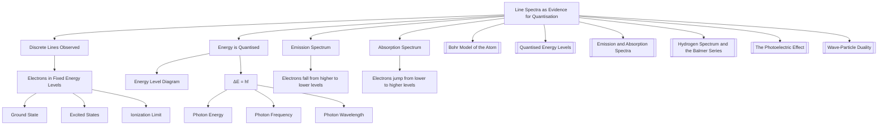

---
# 1. Overview / 概述

**English:**
This sub-topic focuses on **line spectra** as the key experimental evidence for the **quantisation of energy levels** in atoms. Before the development of quantum theory, it was believed that electrons could orbit the nucleus at any distance, and thus atoms could emit or absorb any wavelength of light. However, experiments revealed that atoms produce **discrete line spectra** — a series of specific, sharp lines of colour (or dark lines on a continuous spectrum) — rather than a continuous rainbow. This observation was revolutionary: it proved that electrons can only exist in specific, fixed energy states, and that light is emitted or absorbed only when an electron jumps between these states. This sub-topic connects the observed spectral lines directly to the [[Quantised Energy Levels]] within an atom, providing the foundational evidence for the [[Bohr Model of the Atom]].

**中文:**
本子知识点聚焦于**线状光谱**，作为原子内**能级量子化**的关键实验证据。在量子理论发展之前，人们认为电子可以在任意距离上绕核运动，因此原子可以发射或吸收任何波长的光。然而，实验表明，原子产生的是**离散的线状光谱**——一系列特定、尖锐的彩色线条（或在连续光谱上的暗线），而不是连续的彩虹。这一观察结果是革命性的：它证明了电子只能存在于特定的、固定的能量状态，并且只有当电子在这些状态之间跃迁时，光才会被发射或吸收。本子知识点将观察到的光谱线与原子内的[[Quantised Energy Levels]]直接联系起来，为[[Bohr Model of the Atom]]提供了基础证据。

---

# 2. Syllabus Learning Objectives / 考纲学习目标

| CAIE 9702 | Edexcel IAL |
|-----------|-------------|
| 22.3(a) Explain how spectral lines are evidence for discrete energy levels in atoms. | 7.13 Understand the concept of energy levels in atoms and how they give rise to line spectra. |
| 22.3(b) Distinguish between emission and absorption line spectra. | 7.14 Understand the relationship between the energy of a photon and the difference in energy levels. |
| 22.3(c) Use the equation $hf = E_1 - E_2$ for transitions. | 7.15 Explain how line spectra provide evidence for the quantisation of energy. |
| 22.3(d) Explain the formation of emission and absorption spectra. | 7.16 Understand the difference between continuous, emission line, and absorption line spectra. |
| 22.3(e) Relate the number of spectral lines to the number of possible transitions. | 7.17 Use the equation $\Delta E = hf$ to calculate photon energies from spectral lines. |
| 22.3(f) Understand that the energy levels are negative for bound states. | 7.18 Understand the significance of the negative energy of bound states. |

**Examiner Expectations / 考官期望:**
- **English:** You must be able to explain that a **line spectrum** is direct proof that electrons exist in **discrete energy levels**. You should be able to draw and interpret energy level diagrams, and calculate the energy of a photon ($E = hf$) from the difference between two levels ($\Delta E = E_1 - E_2$). A common exam question asks you to explain why an atom cannot emit a photon of any energy, but only those corresponding to the difference between two specific energy levels.
- **中文:** 你必须能够解释**线状光谱**是电子存在于**离散能级**的直接证据。你应该能够绘制和解释能级图，并根据两个能级之间的差值 ($\Delta E = E_1 - E_2$) 计算光子的能量 ($E = hf$)。一个常见的考题是要求你解释为什么原子不能发射任意能量的光子，而只能发射对应于两个特定能级之间差值的能量。

---

# 3. Core Definitions / 核心定义

| Term (EN/CN) | Definition (EN) | Definition (CN) | Common Mistakes / 常见错误 |
|--------------|-----------------|-----------------|---------------------------|
| **Line Spectrum** / 线状光谱 | A spectrum consisting of discrete, bright (or dark) lines at specific wavelengths, separated by dark (or bright) regions. | 由特定波长上的离散、明亮（或暗）线条组成的光谱，线条之间被暗（或亮）区域隔开。 | Confusing a line spectrum with a continuous spectrum. A line spectrum has gaps; a continuous spectrum has no gaps. |
| **Emission Spectrum** / 发射光谱 | A bright line spectrum produced when excited electrons in an atom fall from a higher energy level to a lower one, emitting photons of specific frequencies. | 当原子中受激发的电子从较高能级跃迁到较低能级时，发射出特定频率的光子而产生的明亮线状光谱。 | Thinking the lines are the *only* colours the atom can emit. They are the *only* colours the atom can emit *when electrons fall between specific levels*. |
| **Absorption Spectrum** / 吸收光谱 | A dark line spectrum produced when a continuous spectrum of light passes through a cool gas. The gas absorbs photons of specific frequencies, causing electrons to jump from a lower to a higher energy level. | 当连续光谱的光穿过冷气体时产生的暗线光谱。气体吸收特定频率的光子，导致电子从较低能级跃迁到较高能级。 | Thinking the dark lines are where the gas *emits* light. They are where the gas *absorbs* light. |
| **Energy Level** / 能级 | A fixed, discrete energy state that an electron in an atom is allowed to occupy. | 原子中电子被允许占据的固定的、离散的能量状态。 | Thinking electrons can have any energy between levels. They cannot; they must be in one specific level or another. |
| **Ground State** / 基态 | The lowest possible energy level of an electron in an atom. | 原子中电子可能的最低能级。 | Forgetting that the ground state is the most stable state. |
| **Excited State** / 激发态 | Any energy level of an electron in an atom that is higher than the ground state. | 原子中电子高于基态的任何能级。 | Thinking an excited state is a single level. There are many excited states. |

---

# 4. Key Concepts Explained / 关键概念详解

## 4.1 The Link Between Line Spectra and Quantised Energy Levels / 线状光谱与量子化能级之间的联系

### Explanation / 解释
**English:**
The existence of **line spectra** is the most direct experimental evidence for the [[Quantised Energy Levels]] in atoms. If electrons could orbit the nucleus at any distance (as classical physics suggested), they would have a continuous range of possible energies. When an electron changed its orbit, it would emit a photon with an energy equal to the change in its kinetic and potential energy. This would result in a **continuous spectrum** — a smooth, unbroken band of colours.

However, experiments show the opposite: atoms emit only specific, sharp lines of colour. This means that the energy of the emitted photon can only take specific values. Since the energy of a photon is $E = hf$, this implies that the energy difference between the initial and final states of the electron ($\Delta E = E_i - E_f$) can only take specific values. The only way this is possible is if the electron's energy is **quantised** — it can only exist in specific, fixed energy levels. A transition between two levels always results in a photon of a specific frequency, giving a sharp line in the spectrum.

**中文:**
**线状光谱**的存在是原子内[[Quantised Energy Levels]]最直接的实验证据。如果电子可以在任意距离上绕核运动（如经典物理学所暗示的），它们将具有连续范围的可能能量。当电子改变其轨道时，它会发射一个能量等于其动能和势能变化的光子。这将产生一个**连续光谱**——一个平滑、不间断的彩色带。

然而，实验显示相反的情况：原子只发射特定、尖锐的彩色线条。这意味着发射的光子能量只能取特定值。由于光子的能量是 $E = hf$，这意味着电子初态和末态之间的能量差 ($\Delta E = E_i - E_f$) 只能取特定值。实现这一点的唯一方法是电子的能量是**量子化的**——它只能存在于特定的、固定的能级中。两个能级之间的跃迁总是产生一个特定频率的光子，在光谱中给出一个尖锐的线条。

### Physical Meaning / 物理意义
**English:**
The physical meaning is profound: the atom is not a miniature solar system where electrons can have any orbit. Instead, the atom is a quantum system where electrons are confined to specific, discrete energy states. The line spectrum is a "fingerprint" of these allowed states. Each element has a unique set of energy levels, and therefore a unique line spectrum. This is why astronomers can identify the chemical composition of stars by analysing their spectra.

**中文:**
其物理意义是深远的：原子不是一个微型的太阳系，电子可以在其中拥有任意轨道。相反，原子是一个量子系统，电子被限制在特定的、离散的能量状态中。线状光谱是这些允许状态的“指纹”。每种元素都有一套独特的能级，因此也有一个独特的线状光谱。这就是为什么天文学家可以通过分析恒星的光谱来识别其化学成分。

### Common Misconceptions / 常见误区
- **English:**
  - *Misconception:* The lines in an emission spectrum are the only colours the atom can produce.
  - *Correction:* They are the only colours produced when electrons fall from higher to lower levels. An atom can also absorb light, producing an absorption spectrum.
  - *Misconception:* The lines in an absorption spectrum are where the gas emits light.
  - *Correction:* They are where the gas absorbs light. The dark lines are missing from the continuous background.
- **中文:**
  - *误区:* 发射光谱中的线条是原子能产生的唯一颜色。
  - *纠正:* 它们只是电子从高能级落到低能级时产生的唯一颜色。原子也可以吸收光，产生吸收光谱。
  - *误区:* 吸收光谱中的线条是气体发光的地方。
  - *纠正:* 它们是气体吸收光的地方。暗线是从连续背景中缺失的部分。

### Exam Tips / 考试提示
- **English:**
  - Always use the equation $\Delta E = hf$ to link the energy difference between levels to the frequency (or wavelength) of the spectral line.
  - Remember that the number of possible spectral lines from a given set of $n$ levels is $\frac{n(n-1)}{2}$.
  - Be able to draw and label an energy level diagram showing the ground state and several excited states.
- **中文:**
  - 始终使用方程 $\Delta E = hf$ 将能级之间的能量差与光谱线的频率（或波长）联系起来。
  - 记住，从一组给定的 $n$ 个能级中可能产生的光谱线数量是 $\frac{n(n-1)}{2}$。
  - 能够绘制并标注一个显示基态和几个激发态的能级图。

> 📷 **IMAGE PROMPT — DIAGRAM: Energy Level Diagram with Transitions**
> A clear, labelled energy level diagram for a hydrogen atom. Show the ground state (n=1) and three excited states (n=2, n=3, n=4). Draw arrows representing electron transitions from higher to lower levels. Label each arrow with the corresponding photon energy (e.g., "E = 10.2 eV" for n=2 to n=1). Show the resulting emission line spectrum below the diagram, with lines at the corresponding wavelengths. Use a clean, educational style with a white background.

---

# 5. Essential Equations / 核心公式

## 5.1 Photon Energy from a Transition / 跃迁产生的光子能量

$$ \Delta E = E_{\text{higher}} - E_{\text{lower}} = hf = \frac{hc}{\lambda} $$

| Symbol (符号) | Meaning (EN) | Meaning (CN) | Unit (单位) |
|--------------|-------------|-------------|------------|
| $\Delta E$ | Energy difference between two levels | 两个能级之间的能量差 | J (or eV) |
| $E_{\text{higher}}$ | Energy of the higher level | 较高能级的能量 | J (or eV) |
| $E_{\text{lower}}$ | Energy of the lower level | 较低能级的能量 | J (or eV) |
| $h$ | Planck's constant ($6.63 \times 10^{-34} \text{ J s}$) | 普朗克常数 | J s |
| $f$ | Frequency of the emitted/absorbed photon | 发射/吸收的光子频率 | Hz |
| $c$ | Speed of light ($3.00 \times 10^8 \text{ m s}^{-1}$) | 光速 | m s$^{-1}$ |
| $\lambda$ | Wavelength of the emitted/absorbed photon | 发射/吸收的光子波长 | m |

**Derivation / 推导:**
This equation is derived from the conservation of energy. When an electron falls from a higher energy level ($E_{\text{higher}}$) to a lower one ($E_{\text{lower}}$), the lost energy is carried away by a photon. The energy of the photon is therefore equal to the difference in the electron's energy: $E_{\text{photon}} = E_{\text{higher}} - E_{\text{lower}}$. Using the Planck-Einstein relation ($E = hf$) and the wave equation ($c = f\lambda$), we get the full form.

**Conditions / 适用条件:**
- **English:** This equation applies to any single-electron transition in an atom. It is valid for both emission (electron falls down) and absorption (electron jumps up). For absorption, the photon energy must exactly match the energy difference.
- **中文:** 该方程适用于原子中的任何单电子跃迁。它对于发射（电子下落）和吸收（电子跃升）都有效。对于吸收，光子能量必须精确匹配能量差。

**Limitations / 局限性:**
- **English:** This equation does not account for the fine structure of spectral lines (e.g., spin-orbit coupling). It assumes a simple two-level system. It does not explain why certain transitions are "forbidden" (selection rules).
- **中文:** 该方程不考虑光谱线的精细结构（例如，自旋-轨道耦合）。它假设一个简单的两能级系统。它不解释为什么某些跃迁是“禁戒的”（选择定则）。

---

# 6. Graphs and Relationships / 图表与关系

## 6.1 Energy Level Diagram / 能级图

### Axes / 坐标轴
- **X-axis:** Not usually labelled (represents the state or quantum number, n).
- **Y-axis:** Energy (E) / 能量 (E) — usually in eV or J.

### Shape / 形状
- **English:** Horizontal lines at specific, discrete energy values. The lowest line is the ground state (n=1). Lines get closer together as energy increases, converging to a limit (the ionization limit at E=0).
- **中文:** 在特定、离散能量值处的水平线。最下面的线是基态 (n=1)。随着能量增加，线越来越靠近，收敛到一个极限（E=0处的电离极限）。

### Gradient Meaning / 斜率含义
- **English:** The gradient of a line connecting two levels is not physically meaningful. The *vertical distance* between two lines represents the energy difference ($\Delta E$) for a transition.
- **中文:** 连接两个能级的线的斜率没有物理意义。两条线之间的*垂直距离*代表跃迁的能量差 ($\Delta E$)。

### Area Meaning / 面积含义
- **English:** Not applicable.
- **中文:** 不适用。

### Exam Interpretation / 考试解读
- **English:** You will be asked to:
  - Identify the ground state and excited states.
  - Draw arrows for specific transitions.
  - Calculate the energy of the emitted/absorbed photon from the vertical distance.
  - Determine the number of possible spectral lines from a given number of levels.
- **中文:** 你将被要求：
  - 识别基态和激发态。
  - 为特定跃迁绘制箭头。
  - 根据垂直距离计算发射/吸收的光子能量。
  - 根据给定的能级数量确定可能的光谱线数量。

> 📷 **IMAGE PROMPT — DIAGRAM: Energy Level Diagram with Ionization Limit**
> A detailed energy level diagram for a generic atom. Show the ground state (n=1) at the bottom, and several excited states (n=2, n=3, n=4, n=5) above it. The levels should get closer together as n increases. Label the ionization limit (E=0) at the top. Draw a vertical arrow from n=3 to n=2, and label it "Emission: ΔE = hf". Draw another vertical arrow from n=1 to n=4, and label it "Absorption: ΔE = hf". Use a clean, educational style with a white background.

---

# 7. Required Diagrams / 必备图表

## 7.1 Emission and Absorption Spectra / 发射光谱与吸收光谱

### Description / 描述
**English:** A diagram showing the relationship between an emission spectrum and an absorption spectrum for the same element. The emission spectrum consists of bright lines on a dark background. The absorption spectrum consists of dark lines on a continuous spectrum (rainbow) background. The dark lines in the absorption spectrum occur at exactly the same wavelengths as the bright lines in the emission spectrum.

**中文:** 一个显示同一种元素的发射光谱和吸收光谱之间关系的图表。发射光谱由暗背景上的亮线组成。吸收光谱由连续光谱（彩虹）背景上的暗线组成。吸收光谱中的暗线恰好出现在与发射光谱中亮线相同的波长处。

### Image Prompt / 图片生成提示
> 📷 **IMAGE PROMPT — DIAGRAM: Emission and Absorption Spectra Comparison**
> A side-by-side comparison of an emission spectrum (top) and an absorption spectrum (bottom) for the same element (e.g., hydrogen). The emission spectrum shows a dark background with three distinct bright lines (red, cyan, violet). The absorption spectrum shows a continuous rainbow background (red to violet) with three distinct dark lines at exactly the same positions as the bright lines in the emission spectrum. Label the bright lines as "Emission Lines" and the dark lines as "Absorption Lines". Use a clean, educational style with a white background.

### Labels Required / 需要标注
- **English:** "Emission Spectrum" (top), "Absorption Spectrum" (bottom), "Bright Lines" (on emission), "Dark Lines" (on absorption), "Continuous Spectrum" (background of absorption).
- **中文:** "发射光谱"（顶部），"吸收光谱"（底部），"亮线"（在发射光谱上），"暗线"（在吸收光谱上），"连续光谱"（吸收光谱的背景）。

### Exam Importance / 考试重要性
- **English:** This is a very common exam question. You must be able to:
  - Identify which spectrum is emission and which is absorption.
  - Explain why the dark lines in the absorption spectrum occur at the same wavelengths as the bright lines in the emission spectrum.
  - Explain the physical process behind each type of spectrum.
- **中文:** 这是一个非常常见的考题。你必须能够：
  - 识别哪个光谱是发射光谱，哪个是吸收光谱。
  - 解释为什么吸收光谱中的暗线出现在与发射光谱中亮线相同的波长处。
  - 解释每种光谱背后的物理过程。

---

# 8. Worked Examples / 典型例题

## Example 1: Calculating Photon Energy from a Transition / 从跃迁计算光子能量

### Question / 题目
**English:**
The energy levels of a hydrogen atom are given as:
- $E_1 = -13.6 \text{ eV}$ (ground state)
- $E_2 = -3.40 \text{ eV}$
- $E_3 = -1.51 \text{ eV}$
- $E_4 = -0.85 \text{ eV}$

An electron falls from the $n=3$ level to the $n=2$ level. Calculate:
(a) The energy of the emitted photon in eV.
(b) The frequency of the emitted photon.
(c) The wavelength of the emitted photon.

(Use $h = 6.63 \times 10^{-34} \text{ J s}$, $c = 3.00 \times 10^8 \text{ m s}^{-1}$, $1 \text{ eV} = 1.60 \times 10^{-19} \text{ J}$)

**中文:**
氢原子的能级如下：
- $E_1 = -13.6 \text{ eV}$ (基态)
- $E_2 = -3.40 \text{ eV}$
- $E_3 = -1.51 \text{ eV}$
- $E_4 = -0.85 \text{ eV}$

一个电子从 $n=3$ 能级跃迁到 $n=2$ 能级。计算：
(a) 发射光子的能量（以 eV 为单位）。
(b) 发射光子的频率。
(c) 发射光子的波长。

（使用 $h = 6.63 \times 10^{-34} \text{ J s}$，$c = 3.00 \times 10^8 \text{ m s}^{-1}$，$1 \text{ eV} = 1.60 \times 10^{-19} \text{ J}$）

### Solution / 解答

**Step 1: Calculate the energy difference.**
$$ \Delta E = E_3 - E_2 = (-1.51 \text{ eV}) - (-3.40 \text{ eV}) = 1.89 \text{ eV} $$

**Step 2: Convert to Joules.**
$$ \Delta E = 1.89 \text{ eV} \times 1.60 \times 10^{-19} \text{ J/eV} = 3.024 \times 10^{-19} \text{ J} $$

**Step 3: Calculate the frequency.**
$$ \Delta E = hf \implies f = \frac{\Delta E}{h} = \frac{3.024 \times 10^{-19} \text{ J}}{6.63 \times 10^{-34} \text{ J s}} = 4.56 \times 10^{14} \text{ Hz} $$

**Step 4: Calculate the wavelength.**
$$ c = f\lambda \implies \lambda = \frac{c}{f} = \frac{3.00 \times 10^8 \text{ m s}^{-1}}{4.56 \times 10^{14} \text{ Hz}} = 6.58 \times 10^{-7} \text{ m} = 658 \text{ nm} $$

### Final Answer / 最终答案
**Answer:**
(a) $1.89 \text{ eV}$
(b) $4.56 \times 10^{14} \text{ Hz}$
(c) $658 \text{ nm}$

**答案：**
(a) $1.89 \text{ eV}$
(b) $4.56 \times 10^{14} \text{ Hz}$
(c) $658 \text{ nm}$

### Quick Tip / 提示
- **English:** Always check your units! If you use eV for energy, convert to Joules before using $h$ in J s. Alternatively, use $h = 4.14 \times 10^{-15} \text{ eV s}$ to keep energy in eV.
- **中文:** 始终检查你的单位！如果你使用 eV 作为能量单位，在使用以 J s 为单位的 $h$ 之前，请转换为焦耳。或者，使用 $h = 4.14 \times 10^{-15} \text{ eV s}$ 来保持能量单位为 eV。

---

# 9. Past Paper Question Types / 历年真题题型

| Question Type / 题型 | Frequency / 频率 | Difficulty / 难度 | Past Paper References / 真题索引 |
|----------------------|------------------|------------------|-------------------------------|
| Explain how line spectra provide evidence for quantised energy levels. | High | Medium | 📝 *待填入* |
| Calculate the energy, frequency, or wavelength of a photon from a given transition. | Very High | Easy-Medium | 📝 *待填入* |
| Draw and interpret energy level diagrams. | High | Medium | 📝 *待填入* |
| Distinguish between emission and absorption spectra. | Medium | Easy | 📝 *待填入* |
| Determine the number of possible spectral lines from a given number of energy levels. | Medium | Medium | 📝 *待填入* |

**Common Command Words / 常见指令词:**
- **English:** Explain, Calculate, Determine, Draw, Distinguish, State.
- **中文:** 解释，计算，确定，绘制，区分，陈述。

---

# 10. Practical Skills Connections / 实验技能链接

**English:**
This sub-topic connects to practical skills in the following ways:
- **Spectroscopy:** You may be asked to interpret data from a spectrometer, which measures the wavelengths of light emitted or absorbed by a sample.
- **Graph Plotting:** You may be asked to plot a graph of photon energy against the inverse of wavelength ($E$ vs $1/\lambda$) to determine Planck's constant ($h$) from the gradient.
- **Uncertainties:** When calculating the energy of a photon from a measured wavelength, you must propagate the uncertainty in the wavelength measurement.
- **Experimental Design:** You could be asked to design an experiment to measure the emission spectrum of a gas discharge tube (e.g., hydrogen, helium, neon) using a diffraction grating or a prism.

**中文:**
本子知识点通过以下方式与实验技能联系：
- **光谱学：** 你可能会被要求解释来自光谱仪的数据，该仪器测量样品发射或吸收的光的波长。
- **图表绘制：** 你可能会被要求绘制光子能量与波长倒数 ($E$ vs $1/\lambda$) 的关系图，以从斜率确定普朗克常数 ($h$)。
- **不确定度：** 当从测量的波长计算光子能量时，你必须传播波长测量中的不确定度。
- **实验设计：** 你可能会被要求设计一个实验，使用衍射光栅或棱镜来测量气体放电管（例如，氢、氦、氖）的发射光谱。

---

# 11. Concept Map / 概念图谱

---

# 12. Quick Revision Sheet / 速查表

| Category / 类别 | Key Points / 要点 |
|----------------|------------------|
| **Definition / 定义** | Line spectra are discrete lines of specific wavelengths, proving electrons exist in quantised energy levels. / 线状光谱是特定波长的离散线条，证明电子存在于量子化能级中。 |
| **Key Formula / 核心公式** | $\Delta E = E_{\text{higher}} - E_{\text{lower}} = hf = \frac{hc}{\lambda}$ |
| **Key Graph / 核心图表** | Energy Level Diagram: Horizontal lines at discrete energies. Vertical arrows represent transitions. / 能级图：在离散能量处的水平线。垂直箭头代表跃迁。 |
| **Key Experiment / 关键实验** | Gas discharge tube (e.g., hydrogen) produces an emission line spectrum. White light through a cool gas produces an absorption line spectrum. / 气体放电管（例如，氢）产生发射线状光谱。白光穿过冷气体产生吸收线状光谱。 |
| **Exam Tip / 考试提示** | Always use $\Delta E = hf$ to link energy levels to spectral lines. Remember that the number of possible lines from $n$ levels is $\frac{n(n-1)}{2}$. / 始终使用 $\Delta E = hf$ 将能级与光谱线联系起来。记住从 $n$ 个能级可能产生的线条数是 $\frac{n(n-1)}{2}$。 |