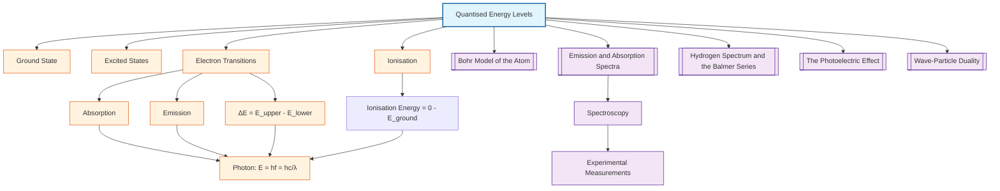

# 1. Overview / 概述

**English:**
Quantised energy levels represent one of the most fundamental concepts in quantum physics, directly challenging the classical view that energy can take any continuous value. This sub-topic introduces the revolutionary idea that electrons in atoms can only occupy specific, discrete energy states — a concept first proposed by Niels Bohr in 1913. Understanding quantised energy levels is essential for explaining why atoms emit and absorb light only at particular wavelengths, forming the foundation for [[Emission and Absorption Spectra]] and the [[Hydrogen Spectrum and the Balmer Series]]. This concept bridges [[The Photoelectric Effect]] (which demonstrated particle-like behaviour of light) with the structure of atoms, and provides crucial evidence for [[Wave-Particle Duality]]. For A-Level students, mastering quantised energy levels unlocks the ability to calculate photon energies, interpret spectral lines, and understand the stability of matter at the atomic scale.

**中文:**
量子化能级是量子物理学中最基本的概念之一，直接挑战了能量可以取任意连续值的经典观点。本子知识点介绍了电子在原子中只能占据特定、离散能量状态这一革命性思想——该概念由尼尔斯·玻尔于1913年首次提出。理解量子化能级对于解释原子为何只在特定波长发射和吸收光至关重要，构成了[[Emission and Absorption Spectra]]和[[Hydrogen Spectrum and the Balmer Series]]的基础。这一概念将[[The Photoelectric Effect]]（证明了光的粒子行为）与原子结构联系起来，并为[[Wave-Particle Duality]]提供了关键证据。对于A-Level学生来说，掌握量子化能级能够计算光子能量、解释光谱线以及理解原子尺度上物质的稳定性。

---

# 2. Syllabus Learning Objectives / 考纲学习目标

| CAIE 9702 (22.3 a-g) | Edexcel IAL (WPH14 U4: 7.13-7.18) |
|----------------------|-----------------------------------|
| (a) Explain that electrons in atoms occupy discrete energy levels | 7.13 Understand the concept of quantised energy levels in atoms |
| (b) Describe the concept of ground state and excited states | 7.14 Describe the ground state and excited states of an atom |
| (c) Calculate the energy of a photon emitted/absorbed during electron transitions | 7.15 Calculate photon energy from electron transitions using $E = hf$ |
| (d) Explain the relationship between energy level difference and photon frequency | 7.16 Understand that $\Delta E = hf$ for photon emission/absorption |
| (e) Interpret energy level diagrams | 7.17 Interpret and draw energy level diagrams |
| (f) Explain that ionisation occurs when an electron gains sufficient energy to escape | 7.18 Define and calculate ionisation energy |
| (g) Calculate ionisation energy from energy level data | — |

**Examiner Expectations / 考官期望:**
- **English:** Students must be able to calculate photon energies from energy level differences, interpret energy level diagrams, and explain the physical meaning of ground state, excited states, and ionisation. Common exam tasks include determining the wavelength of emitted photons and identifying which transitions produce visible spectral lines.
- **中文:** 学生必须能够从能级差计算光子能量，解释能级图，并说明基态、激发态和电离的物理意义。常见的考试任务包括确定发射光子的波长以及识别哪些跃迁产生可见光谱线。

---

# 3. Core Definitions / 核心定义

| Term (EN/CN) | Definition (EN) | Definition (CN) | Common Mistakes / 常见错误 |
|--------------|-----------------|-----------------|---------------------------|
| **Quantised Energy Level** / 量子化能级 | A specific, discrete energy value that an electron in an atom is allowed to occupy; electrons cannot exist between these levels | 原子中电子允许占据的特定、离散的能量值；电子不能存在于这些能级之间 | ❌ Thinking electrons can have any energy value — they can only have specific allowed values |
| **Ground State** / 基态 | The lowest possible energy state of an electron in an atom, corresponding to the most stable configuration | 原子中电子可能的最低能量状态，对应最稳定的构型 | ❌ Confusing ground state with "zero energy" — ground state has negative energy relative to ionisation |
| **Excited State** / 激发态 | Any energy state of an electron higher than the ground state; the electron has absorbed energy | 电子高于基态的任何能量状态；电子已吸收能量 | ❌ Thinking excited states are permanent — they are temporary (≈10⁻⁸ s lifetime) |
| **Ionisation** / 电离 | The process by which an electron gains sufficient energy to escape the atom entirely, leaving a positive ion | 电子获得足够能量完全脱离原子的过程，留下正离子 | ❌ Confusing ionisation with excitation — ionisation removes the electron, excitation only raises it |
| **Electron Transition** / 电子跃迁 | The movement of an electron between energy levels, accompanied by the absorption or emission of a photon | 电子在能级之间的移动，伴随光子的吸收或发射 | ❌ Forgetting that emission requires a downward transition (higher → lower energy) |
| **Ionisation Energy** / 电离能 | The minimum energy required to remove an electron from the ground state to infinity (zero energy) | 将电子从基态移动到无穷远（零能量）所需的最小能量 | ❌ Using the wrong energy level as reference — always from ground state |

---

# 4. Key Concepts Explained / 关键概念详解

## 4.1 The Principle of Quantisation / 量子化原理

### Explanation / 解释
**English:**
In classical physics, an electron orbiting a nucleus could theoretically have any energy value, continuously losing energy and spiralling into the nucleus — a prediction that contradicted the observed stability of atoms. [[Niels Bohr]] resolved this paradox by proposing that electrons can only occupy specific, **quantised** energy levels. Each energy level is labelled with a principal quantum number $n$, where $n = 1$ is the ground state (lowest energy), and $n = 2, 3, 4, ...$ are excited states. The energy of each level is fixed and discrete; an electron cannot exist between levels. When an electron transitions between levels, it must absorb or emit a photon whose energy exactly equals the difference between the two levels: $\Delta E = E_{\text{higher}} - E_{\text{lower}} = hf$.

**中文:**
在经典物理学中，绕核运动的电子理论上可以具有任何能量值，会持续损失能量并螺旋落入原子核——这一预测与观察到的原子稳定性相矛盾。[[Niels Bohr]]通过提出电子只能占据特定的、**量子化**的能级来解决这一悖论。每个能级用主量子数 $n$ 标记，其中 $n = 1$ 是基态（最低能量），$n = 2, 3, 4, ...$ 是激发态。每个能级的能量是固定且离散的；电子不能存在于能级之间。当电子在能级之间跃迁时，必须吸收或发射一个光子，其能量恰好等于两个能级之差：$\Delta E = E_{\text{高}} - E_{\text{低}} = hf$。

### Physical Meaning / 物理意义
**English:**
Quantisation means that atomic energy is "lumpy" — it comes in discrete packets rather than being continuous. This explains why atoms have characteristic spectral lines: each element has a unique set of energy levels, so the photons emitted during transitions have specific, identifiable energies (and therefore wavelengths). The stability of matter is also explained: electrons in the ground state cannot lose more energy, preventing atoms from collapsing.

**中文:**
量子化意味着原子能量是"块状的"——它以离散的包形式存在，而不是连续的。这解释了为什么原子具有特征光谱线：每种元素都有一套独特的能级，因此跃迁过程中发射的光子具有特定的、可识别的能量（因此也有特定的波长）。物质的稳定性也得到了解释：基态电子不能再损失能量，防止了原子的坍缩。

### Common Misconceptions / 常见误区
- ❌ **"Electrons orbit the nucleus like planets"** — Electrons do not have well-defined orbits; energy levels describe probability distributions (orbitals), not planetary paths.
- ❌ **"Energy levels are equally spaced"** — For hydrogen, energy levels get closer together as $n$ increases, converging to zero at ionisation.
- ❌ **"An electron can jump to any higher level"** — Transitions are governed by selection rules; not all transitions are allowed.
- ❌ **"The ground state has zero energy"** — The ground state has negative energy; zero energy is defined as the ionisation limit (electron at infinity).

### Exam Tips / 考试提示
- **English:** Always use $E = hf = \frac{hc}{\lambda}$ when calculating photon properties from energy level differences. Remember that energy level diagrams show energy increasing upward, but ground state is most negative. For ionisation calculations, the final energy is zero (electron at rest at infinity).
- **中文:** 在从能级差计算光子性质时，始终使用 $E = hf = \frac{hc}{\lambda}$。记住能级图显示能量向上增加，但基态是最负的。对于电离计算，最终能量为零（电子在无穷远处静止）。

> 📷 **IMAGE PROMPT — QEL-01: Energy Level Diagram with Electron Transitions**
> A clean, educational diagram showing an atom's quantised energy levels as horizontal lines on a vertical energy axis. Label ground state (n=1) at bottom, excited states (n=2, n=3, n=4) above. Show three arrows: upward arrow (absorption) from n=1 to n=3 labelled "photon absorbed", downward arrow (emission) from n=3 to n=2 labelled "photon emitted", and a longer upward arrow from n=1 to above the top labelled "ionisation". Include energy values on the left axis. Style: textbook-quality, minimal, with clear labels in English.

---

## 4.2 Ground State and Excited States / 基态与激发态

### Explanation / 解释
**English:**
The **ground state** ($n=1$) is the lowest possible energy configuration for an electron in an atom. It represents the most stable arrangement, and an electron in this state cannot spontaneously lose energy. When an atom absorbs energy (from photons, collisions, or electrical discharge), an electron can be promoted to a higher energy level, creating an **excited state**. Excited states are inherently unstable — electrons typically remain in an excited state for only about $10^{-8}$ seconds before returning to a lower level, emitting a photon in the process. The energy of the emitted photon equals the difference between the initial and final energy levels.

**中文:**
**基态**（$n=1$）是原子中电子可能的最低能量构型。它代表最稳定的排列，处于该状态的电子不能自发地损失能量。当原子吸收能量（来自光子、碰撞或放电）时，电子可以被提升到更高的能级，形成**激发态**。激发态本质上是不稳定的——电子通常只在激发态停留约 $10^{-8}$ 秒，然后返回较低能级，在此过程中发射一个光子。发射光子的能量等于初始和最终能级之间的差值。

### Physical Meaning / 物理意义
**English:**
The existence of a stable ground state explains why atoms don't collapse — there is a minimum energy below which electrons cannot go. Excited states explain why atoms can absorb and emit specific wavelengths of light: each possible transition corresponds to a specific photon energy. The short lifetime of excited states explains why emission spectra consist of sharp lines rather than continuous bands.

**中文:**
稳定基态的存在解释了原子为何不会坍缩——存在一个电子无法低于的最小能量。激发态解释了原子为何能吸收和发射特定波长的光：每个可能的跃迁对应一个特定的光子能量。激发态的短寿命解释了为何发射光谱由尖锐的线组成而不是连续带。

### Common Misconceptions / 常见误区
- ❌ **"An atom can stay excited indefinitely"** — Excited states are temporary; spontaneous emission occurs rapidly.
- ❌ **"All excited states are equally likely"** — Some transitions are more probable than others, affecting spectral line intensity.
- ❌ **"The ground state is the same for all atoms"** — Each element has unique ground state and excited state energies.

### Exam Tips / 考试提示
- **English:** When given an energy level diagram, identify the ground state as the lowest line. Remember that absorption moves electrons upward (higher energy), emission moves them downward (lower energy). The energy of the emitted photon is always positive: $\Delta E = E_{\text{upper}} - E_{\text{lower}}$.
- **中文:** 当给出一张能级图时，将最低的线识别为基态。记住吸收使电子向上移动（更高能量），发射使电子向下移动（更低能量）。发射光子的能量始终为正：$\Delta E = E_{\text{上}} - E_{\text{下}}$。

---

## 4.3 Ionisation / 电离

### Explanation / 解释
**English:**
**Ionisation** occurs when an electron gains enough energy to completely escape the atom. The **ionisation energy** is defined as the minimum energy required to remove an electron from the ground state to infinity, where the electron is considered to have zero kinetic energy and zero potential energy. On an energy level diagram, ionisation corresponds to moving an electron from the ground state ($E_1$) to the ionisation limit ($E = 0$). Therefore, the ionisation energy is $E_{\text{ion}} = 0 - E_1 = -E_1$ (since $E_1$ is negative). For hydrogen, the ionisation energy is $13.6 \text{ eV}$.

**中文:**
**电离**发生在电子获得足够能量完全脱离原子时。**电离能**定义为将电子从基态移动到无穷远所需的最小能量，此时电子被认为具有零动能和零势能。在能级图上，电离对应于将电子从基态（$E_1$）移动到电离极限（$E = 0$）。因此，电离能为 $E_{\text{ion}} = 0 - E_1 = -E_1$（因为 $E_1$ 为负）。对于氢原子，电离能为 $13.6 \text{ eV}$。

### Physical Meaning / 物理意义
**English:**
Ionisation energy measures how tightly an electron is bound to the nucleus. Higher ionisation energy means the electron is more strongly attracted and harder to remove. This explains why different elements have different chemical reactivity — elements with low ionisation energies (like alkali metals) readily lose electrons and form positive ions.

**中文:**
电离能衡量电子与原子核结合的紧密程度。更高的电离能意味着电子被更强烈地吸引，更难移除。这解释了为什么不同元素具有不同的化学反应性——电离能低的元素（如碱金属）容易失去电子并形成正离子。

### Common Misconceptions / 常见误区
- ❌ **"Ionisation energy is the energy of the ground state"** — Ionisation energy is the *difference* between ground state energy and zero, not the ground state energy itself.
- ❌ **"Ionisation only happens with very high energy photons"** — Ionisation can also occur through collisions or electrical discharge.
- ❌ **"Once ionised, the electron can never return"** — Recombination (electron capture) can occur, emitting photons.

### Exam Tips / 考试提示
- **English:** For CAIE, you may be asked to calculate ionisation energy from a given energy level diagram. Remember: $E_{\text{ion}} = 0 - E_{\text{ground}}$. For Edexcel, be prepared to define ionisation energy precisely and calculate it from data. Always express ionisation energy in eV or Joules as required.
- **中文:** 对于CAIE，可能会要求你从给定的能级图计算电离能。记住：$E_{\text{ion}} = 0 - E_{\text{ground}}$。对于Edexcel，要准备精确定义电离能并从数据计算。按要求以eV或焦耳表示电离能。

---

# 5. Essential Equations / 核心公式

## 5.1 Photon Energy from Electron Transition / 电子跃迁的光子能量

$$ \Delta E = E_{\text{upper}} - E_{\text{lower}} = hf = \frac{hc}{\lambda} $$

| Symbol (符号) | Meaning (EN) | Meaning (CN) | Unit (单位) |
|--------------|-------------|-------------|------------|
| $\Delta E$ | Energy difference between two levels | 两个能级之间的能量差 | J or eV |
| $E_{\text{upper}}$ | Energy of the higher level | 较高能级的能量 | J or eV |
| $E_{\text{lower}}$ | Energy of the lower level | 较低能级的能量 | J or eV |
| $h$ | Planck's constant ($6.63 \times 10^{-34} \text{ J·s}$) | 普朗克常数 | J·s |
| $f$ | Frequency of emitted/absorbed photon | 发射/吸收光子的频率 | Hz |
| $c$ | Speed of light ($3.00 \times 10^8 \text{ m/s}$) | 光速 | m/s |
| $\lambda$ | Wavelength of emitted/absorbed photon | 发射/吸收光子的波长 | m |

**Derivation / 推导:**
This equation follows from the conservation of energy. When an electron drops from a higher energy level to a lower one, the lost energy is carried away by a photon: $E_{\text{photon}} = \Delta E$. Using Einstein's relation $E = hf$ and $c = f\lambda$, we obtain the full expression.

**Conditions / 适用条件:**
- **English:** The electron must transition between two allowed quantised energy levels. The photon energy must exactly match the energy difference — no partial absorption or emission is possible.
- **中文:** 电子必须在两个允许的量子化能级之间跃迁。光子能量必须精确匹配能量差——不可能有部分吸收或发射。

**Limitations / 局限性:**
- **English:** This equation does not account for selection rules that may forbid certain transitions. It also assumes the atom is isolated and not affected by external fields.
- **中文:** 该方程不考虑可能禁止某些跃迁的选择定则。它还假设原子是孤立的，不受外部场影响。

## 5.2 Ionisation Energy / 电离能

$$ E_{\text{ion}} = 0 - E_{\text{ground}} = -E_{\text{ground}} $$

| Symbol (符号) | Meaning (EN) | Meaning (CN) | Unit (单位) |
|--------------|-------------|-------------|------------|
| $E_{\text{ion}}$ | Ionisation energy | 电离能 | J or eV |
| $E_{\text{ground}}$ | Energy of the ground state (negative) | 基态能量（负值） | J or eV |

**Conditions / 适用条件:**
- **English:** The electron starts in the ground state and ends at infinity with zero kinetic energy. This is the minimum energy required for ionisation.
- **中文:** 电子从基态开始，在无穷远处以零动能结束。这是电离所需的最小能量。

**Limitations / 局限性:**
- **English:** This assumes a single-electron system. For multi-electron atoms, ionisation energy depends on which electron is removed and the electron-electron interactions.
- **中文:** 这假设是单电子系统。对于多电子原子，电离能取决于移除哪个电子以及电子-电子相互作用。

---

# 6. Graphs and Relationships / 图表与关系

## 6.1 Energy Level Diagram / 能级图

### Axes / 坐标轴
- **Y-axis (vertical):** Energy / 能量 (eV or J) — increasing upward
- **X-axis (horizontal):** Principal quantum number $n$ / 主量子数 $n$ — increasing to the right

### Shape / 形状
**English:** Horizontal lines at specific energy values, with the lowest line (most negative) at $n=1$ (ground state). Lines get closer together as $n$ increases, converging to $E=0$ at the ionisation limit. Above $E=0$, the electron is free (continuum).

**中文:** 在特定能量值处的水平线，最低线（最负）在 $n=1$（基态）。随着 $n$ 增加，线越来越靠近，在电离极限处收敛到 $E=0$。在 $E=0$ 以上，电子是自由的（连续区）。

### Gradient Meaning / 斜率含义
**English:** The spacing between adjacent levels decreases as $n$ increases. This means that transitions between higher levels produce lower-energy (longer wavelength) photons.

**中文:** 相邻能级之间的间距随着 $n$ 增加而减小。这意味着较高能级之间的跃迁产生较低能量（更长波长）的光子。

### Area Meaning / 面积含义
**English:** Not applicable — the diagram uses discrete lines, not continuous areas.

**中文:** 不适用——该图使用离散线，而不是连续区域。

### Exam Interpretation / 考试解读
- **English:** Be able to read energy values from the diagram, calculate $\Delta E$ for any transition, and determine whether a photon is absorbed or emitted. Remember: upward arrows = absorption, downward arrows = emission.
- **中文:** 能够从图中读取能量值，计算任何跃迁的 $\Delta E$，并确定光子是被吸收还是发射。记住：向上箭头 = 吸收，向下箭头 = 发射。

> 📷 **IMAGE PROMPT — QEL-02: Hydrogen Energy Level Diagram with Numerical Values**
> A detailed energy level diagram for hydrogen showing n=1 (-13.6 eV), n=2 (-3.40 eV), n=3 (-1.51 eV), n=4 (-0.85 eV), and the ionisation limit at 0 eV. Include arrows showing the Lyman series (transitions to n=1), Balmer series (transitions to n=2), and Paschen series (transitions to n=3). Label each series with its spectral region (UV, visible, IR). Style: scientific diagram with precise energy values, clear labels, and colour-coded arrows.

---

# 7. Required Diagrams / 必备图表

## 7.1 Energy Level Diagram with Transitions / 带跃迁的能级图

### Description / 描述
**English:** A vertical energy axis with horizontal lines representing quantised energy levels. Arrows show electron transitions: upward for absorption, downward for emission. The diagram should clearly indicate the ground state, at least three excited states, and the ionisation limit.

**中文:** 一个垂直能量轴，水平线代表量子化能级。箭头显示电子跃迁：向上为吸收，向下为发射。该图应清晰指示基态、至少三个激发态和电离极限。

### Image Prompt / 图片生成提示
> 📷 **IMAGE PROMPT — QEL-03: Complete Energy Level Diagram for A-Level Physics**
> A textbook-quality energy level diagram for a hydrogen-like atom. Vertical axis labelled "Energy / eV" with scale from -15 to +2. Four horizontal lines at -13.6 eV (n=1, ground state), -3.40 eV (n=2), -1.51 eV (n=3), -0.85 eV (n=4). Dashed line at 0 eV labelled "Ionisation limit". Three downward arrows: from n=3 to n=2 (red, labelled "656 nm"), from n=4 to n=2 (blue-green, labelled "486 nm"), from n=2 to n=1 (ultraviolet, labelled "122 nm"). One upward arrow from n=1 to n=3 (labelled "absorption"). Clear sans-serif font, white background, suitable for A-Level physics textbook.

### Labels Required / 需要标注
- **English:** Principal quantum numbers ($n=1, 2, 3, 4$), energy values (in eV), ground state, excited states, ionisation limit, absorption arrow, emission arrows, photon wavelengths
- **中文:** 主量子数（$n=1, 2, 3, 4$）、能量值（以eV为单位）、基态、激发态、电离极限、吸收箭头、发射箭头、光子波长

### Exam Importance / 考试重要性
- **English:** This diagram appears in nearly every exam paper on energy levels. Students must be able to draw, label, and interpret it. Common questions involve calculating photon energies from the diagram or identifying which transitions produce visible light.
- **中文:** 这个图几乎出现在每份关于能级的考试试卷中。学生必须能够绘制、标注和解释它。常见问题包括从图中计算光子能量或识别哪些跃迁产生可见光。

---

## 7.2 Absorption and Emission Processes / 吸收与发射过程

### Description / 描述
**English:** A side-by-side comparison showing an atom absorbing a photon (electron moves up) and emitting a photon (electron moves down). This diagram helps students visualise the difference between absorption and emission spectra.

**中文:** 一个并排比较，显示原子吸收光子（电子向上移动）和发射光子（电子向下移动）。这个图帮助学生直观理解吸收光谱和发射光谱之间的区别。

### Image Prompt / 图片生成提示
> 📷 **IMAGE PROMPT — QEL-04: Absorption vs Emission in Atoms**
> Two panels side by side. Left panel: "Absorption" — an atom with three energy levels shown, an incoming photon (wavy arrow) approaching from the left, electron jumping from n=1 to n=3. Right panel: "Emission" — same atom, electron dropping from n=3 to n=2, outgoing photon (wavy arrow) leaving to the right. Labels: "Incident photon", "Absorbed", "Emitted photon", "Electron transition". Clean, educational style with colour coding: blue for absorption, red for emission.

### Labels Required / 需要标注
- **English:** Incident photon, absorbed photon, emitted photon, electron transition direction, energy levels
- **中文:** 入射光子、被吸收的光子、发射的光子、电子跃迁方向、能级

### Exam Importance / 考试重要性
- **English:** Understanding the difference between absorption and emission is crucial for interpreting [[Emission and Absorption Spectra]]. Exam questions often ask students to explain why absorption spectra have dark lines at specific wavelengths.
- **中文:** 理解吸收和发射之间的区别对于解释[[Emission and Absorption Spectra]]至关重要。考试问题常要求学生解释为什么吸收光谱在特定波长处有暗线。

---

# 8. Worked Examples / 典型例题

## Example 1: Calculating Photon Wavelength from Electron Transition / 从电子跃迁计算光子波长

### Question / 题目
**English:**
The energy levels of a hydrogen atom are given as:
- $E_1 = -13.6 \text{ eV}$ (ground state)
- $E_2 = -3.40 \text{ eV}$
- $E_3 = -1.51 \text{ eV}$
- $E_4 = -0.85 \text{ eV}$

Calculate the wavelength of the photon emitted when an electron transitions from $n=3$ to $n=2$. State whether this photon is in the visible, ultraviolet, or infrared region. (Given: $h = 6.63 \times 10^{-34} \text{ J·s}$, $c = 3.00 \times 10^8 \text{ m/s}$, $1 \text{ eV} = 1.60 \times 10^{-19} \text{ J}$)

**中文:**
氢原子的能级如下：
- $E_1 = -13.6 \text{ eV}$（基态）
- $E_2 = -3.40 \text{ eV}$
- $E_3 = -1.51 \text{ eV}$
- $E_4 = -0.85 \text{ eV}$

计算电子从 $n=3$ 跃迁到 $n=2$ 时发射的光子波长。判断该光子是在可见光、紫外还是红外区域。（已知：$h = 6.63 \times 10^{-34} \text{ J·s}$，$c = 3.00 \times 10^8 \text{ m/s}$，$1 \text{ eV} = 1.60 \times 10^{-19} \text{ J}$）

### Solution / 解答

**Step 1: Calculate the energy difference / 计算能量差**
$$ \Delta E = E_3 - E_2 = (-1.51) - (-3.40) = 1.89 \text{ eV} $$

**Step 2: Convert to Joules / 转换为焦耳**
$$ \Delta E = 1.89 \times 1.60 \times 10^{-19} = 3.024 \times 10^{-19} \text{ J} $$

**Step 3: Use $E = hf = \frac{hc}{\lambda}$ to find wavelength / 使用公式求波长**
$$ \lambda = \frac{hc}{\Delta E} = \frac{(6.63 \times 10^{-34})(3.00 \times 10^8)}{3.024 \times 10^{-19}} $$

**Step 4: Calculate / 计算**
$$ \lambda = \frac{1.989 \times 10^{-25}}{3.024 \times 10^{-19}} = 6.58 \times 10^{-7} \text{ m} = 658 \text{ nm} $$

**Step 5: Determine spectral region / 确定光谱区域**
The wavelength 658 nm is in the red part of the visible spectrum (approximately 620-750 nm).

### Final Answer / 最终答案
**Answer:** $\lambda = 658 \text{ nm}$, visible (red) light | **答案：** $\lambda = 658 \text{ nm}$，可见光（红光）

### Quick Tip / 提示
- **English:** Always convert eV to Joules before using $h$ and $c$ in SI units. Remember that visible light ranges from approximately 400 nm (violet) to 700 nm (red).
- **中文:** 在使用SI单位的 $h$ 和 $c$ 之前，始终将eV转换为焦耳。记住可见光范围大约从400 nm（紫光）到700 nm（红光）。

---

## Example 2: Calculating Ionisation Energy / 计算电离能

### Question / 题目
**English:**
The ground state energy of a hydrogen atom is $-13.6 \text{ eV}$.
(a) Calculate the ionisation energy of hydrogen in eV and in Joules.
(b) Determine the maximum wavelength of a photon that can ionise a hydrogen atom from its ground state.

**中文:**
氢原子的基态能量为 $-13.6 \text{ eV}$。
(a) 计算氢的电离能，以eV和焦耳为单位。
(b) 确定能使氢原子从基态电离的光子的最大波长。

### Solution / 解答

**Part (a):**

**Step 1: Ionisation energy definition / 电离能定义**
$$ E_{\text{ion}} = 0 - E_{\text{ground}} = 0 - (-13.6) = 13.6 \text{ eV} $$

**Step 2: Convert to Joules / 转换为焦耳**
$$ E_{\text{ion}} = 13.6 \times 1.60 \times 10^{-19} = 2.176 \times 10^{-18} \text{ J} $$

**Part (b):**

**Step 3: Maximum wavelength corresponds to minimum energy / 最大波长对应最小能量**
The minimum photon energy required for ionisation is exactly $E_{\text{ion}}$.

$$ \lambda_{\text{max}} = \frac{hc}{E_{\text{ion}}} = \frac{(6.63 \times 10^{-34})(3.00 \times 10^8)}{2.176 \times 10^{-18}} $$

**Step 4: Calculate / 计算**
$$ \lambda_{\text{max}} = \frac{1.989 \times 10^{-25}}{2.176 \times 10^{-18}} = 9.14 \times 10^{-8} \text{ m} = 91.4 \text{ nm} $$

### Final Answer / 最终答案
**Answer:** (a) $13.6 \text{ eV} = 2.18 \times 10^{-18} \text{ J}$; (b) $\lambda_{\text{max}} = 91.4 \text{ nm}$ (ultraviolet) | **答案：** (a) $13.6 \text{ eV} = 2.18 \times 10^{-18} \text{ J}$；(b) $\lambda_{\text{max}} = 91.4 \text{ nm}$（紫外线）

### Quick Tip / 提示
- **English:** The maximum wavelength for ionisation corresponds to the minimum energy (the ionisation energy itself). Any photon with wavelength shorter than this (higher energy) can also cause ionisation.
- **中文:** 电离的最大波长对应最小能量（电离能本身）。任何波长比这更短（能量更高）的光子也能引起电离。

---

# 9. Past Paper Question Types / 历年真题题型

| Question Type / 题型 | Frequency / 频率 | Difficulty / 难度 | Past Paper References / 真题索引 |
|----------------------|------------------|------------------|-------------------------------|
| Calculate photon wavelength/energy from energy level diagram | ★★★★★ | Medium | 📝 *待填入* |
| Interpret energy level diagram (absorption vs emission) | ★★★★☆ | Easy | 📝 *待填入* |
| Calculate ionisation energy from given data | ★★★★☆ | Medium | 📝 *待填入* |
| Explain why energy levels are quantised | ★★★☆☆ | Medium | 📝 *待填入* |
| Determine which transitions produce visible light | ★★★☆☆ | Hard | 📝 *待填入* |
| Multi-step: energy levels → photon → photoelectric effect | ★★☆☆☆ | Hard | 📝 *待填入* |

**Common Command Words / 常见指令词:**
- **English:** Calculate, Determine, Explain, State, Show that, Sketch, Label
- **中文:** 计算、确定、解释、陈述、证明、画出、标注

---

# 10. Practical Skills Connections / 实验技能链接

**English:**
While quantised energy levels are not directly observable in school laboratories, several practical skills connect to this sub-topic:

1. **Spectroscopy (Edexcel Core Practical):** Using a diffraction grating or prism to observe emission spectra from gas discharge tubes. Students measure wavelengths of spectral lines and relate them to electron transitions between energy levels.

2. **Graph Plotting:** Plotting energy level diagrams from given data, or plotting $1/\lambda$ against $1/n^2$ to verify the [[Bohr Model of the Atom]].

3. **Uncertainties:** When calculating photon energies from measured wavelengths, students must propagate uncertainties through $E = hc/\lambda$.

4. **Experimental Design:** Designing an experiment to determine the ionisation energy of hydrogen using a discharge tube and spectrometer.

5. **Data Analysis:** Using spectral line data to construct energy level diagrams and identify unknown elements (forensic spectroscopy).

**中文:**
虽然量子化能级在学校实验室中无法直接观察，但有几个实验技能与本子知识点相关：

1. **光谱学（Edexcel核心实验）：** 使用衍射光栅或棱镜观察气体放电管的发射光谱。学生测量光谱线的波长，并将其与能级之间的电子跃迁联系起来。

2. **绘图：** 根据给定数据绘制能级图，或绘制 $1/\lambda$ 对 $1/n^2$ 的图以验证[[Bohr Model of the Atom]]。

3. **不确定度：** 当从测量的波长计算光子能量时，学生必须通过 $E = hc/\lambda$ 传播不确定度。

4. **实验设计：** 设计使用放电管和光谱仪确定氢电离能的实验。

5. **数据分析：** 使用光谱线数据构建能级图并识别未知元素（法医光谱学）。

---

# 11. Concept Map / 概念图谱

---

# 12. Quick Revision Sheet / 速查表

| Category / 类别 | Key Points / 要点 |
|----------------|------------------|
| **Definition / 定义** | Electrons in atoms can only occupy specific, discrete energy levels — they cannot exist between levels. / 原子中的电子只能占据特定的、离散的能级——它们不能存在于能级之间。 |
| **Key Formula / 核心公式** | $\Delta E = E_{\text{upper}} - E_{\text{lower}} = hf = \frac{hc}{\lambda}$; $E_{\text{ion}} = 0 - E_{\text{ground}}$ |
| **Key Graph / 核心图表** | Energy level diagram: horizontal lines at specific energies, vertical axis = energy, arrows show transitions (↑ absorption, ↓ emission) / 能级图：特定能量处的水平线，垂直轴 = 能量，箭头显示跃迁（↑ 吸收，↓ 发射） |
| **Ground State / 基态** | Lowest energy level ($n=1$), most stable, most negative energy / 最低能级（$n=1$），最稳定，能量最负 |
| **Excited State / 激发态** | Higher energy level ($n \geq 2$), unstable, lifetime ≈ $10^{-8}$ s / 更高能级（$n \geq 2$），不稳定，寿命 ≈ $10^{-8}$ s |
| **Ionisation / 电离** | Electron escapes atom completely; ionisation energy = energy needed from ground state to $E=0$ / 电子完全脱离原子；电离能 = 从基态到 $E=0$ 所需的能量 |
| **Absorption / 吸收** | Electron moves up (lower → higher energy), photon is absorbed / 电子向上移动（低 → 高能量），光子被吸收 |
| **Emission / 发射** | Electron moves down (higher → lower energy), photon is emitted / 电子向下移动（高 → 低能量），光子被发射 |
| **Exam Tip / 考试提示** | Always convert eV to Joules ($1 \text{ eV} = 1.60 \times 10^{-19} \text{ J}$) before using SI units. Remember visible light: 400-700 nm. / 在使用SI单位前，始终将eV转换为焦耳。记住可见光：400-700 nm。 |
| **Common Mistake / 常见错误** | ❌ Thinking ground state has zero energy (it's most negative); ❌ Confusing absorption with emission; ❌ Forgetting to convert units / ❌ 认为基态能量为零（它是最负的）；❌ 混淆吸收与发射；❌ 忘记转换单位 |
| **Syllabus / 考纲** | CAIE 9702: 22.3(a-g); Edexcel IAL: WPH14 U4: 7.13-7.18 |