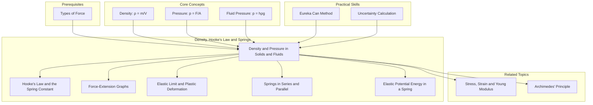

---
# 1. Overview / 概述

**English:**
This sub-topic explores the fundamental concepts of **density** and **pressure**, extending their application from solids to fluids (liquids and gases). Density is a measure of how much mass is packed into a given volume, while pressure is the force exerted per unit area. In fluids, pressure is not just a surface phenomenon; it acts in all directions and increases with depth. This sub-topic is crucial for understanding why objects float or sink ([[Archimedes' Principle]]), how hydraulic systems work, and forms the foundation for later topics like [[Stress, Strain and Young Modulus]] in materials. It connects directly to the parent hub [[Density, Hooke's Law and Springs]] by establishing the material property of density, which is independent of the spring-related properties covered by sibling sub-topics like [[Hooke's Law and the Spring Constant]].

**中文:**
本子知识点探讨了**密度**和**压力**的基本概念，并将其应用从固体扩展到流体（液体和气体）。密度是衡量单位体积内所含质量的量度，而压力是单位面积上所承受的力。在流体中，压力不仅仅是一种表面现象；它作用于所有方向，并随深度增加而增加。这个子知识点对于理解物体为何会浮沉（[[阿基米德原理]]）、液压系统如何工作至关重要，并为后续的材料学主题如[[应力、应变和杨氏模量]]奠定了基础。它通过建立材料属性——密度（与[[胡克定律和弹簧常数]]等兄弟子知识点所涉及的弹簧特性无关）——与父集[[密度、胡克定律和弹簧]]直接相连。

---

# 2. Syllabus Learning Objectives / 考纲学习目标

| CAIE 9702 | Edexcel IAL |
|-----------|-------------|
| 6.1(a) Define density. | 2.1 Use the concept of density. |
| 6.1(b) Recall and use the equation $\rho = m/V$. | 2.2 Use the equation $\rho = m/V$. |
| 6.1(c) Define pressure. | 2.3 Use the concept of pressure. |
| 6.1(d) Recall and use the equation $p = F/A$. | 2.4 Use the equation $p = F/A$. |
| 6.1(e) Derive, recall and use the equation $p = h\rho g$ for a fluid. | 2.5 Use the equation $\Delta p = \rho g \Delta h$ for a fluid. |
| 6.1(f) Describe how to measure the density of a liquid and a solid. | 2.6 Describe an experiment to determine the density of a solid or liquid. |

**Examiner Expectations / 考官期望:**
- **CAIE:** You must be able to **derive** $p = h\rho g$ from $p = F/A$ and $F = mg$. Questions often involve calculating pressure at a depth in a liquid or the upthrust on a submerged object.
- **Edexcel:** Focus is on **application** of the equations. You should be able to describe experimental methods for density determination and calculate pressure differences in fluids.
- **Both:** Be comfortable converting between units (e.g., cm³ to m³, g/cm³ to kg/m³). A common trick is to give mass in grams and volume in cm³, requiring conversion.

---

# 3. Core Definitions / 核心定义

| Term (EN/CN) | Definition (EN) | Definition (CN) | Common Mistakes / 常见错误 |
|--------------|-----------------|-----------------|---------------------------|
| **Density** / 密度 | The mass per unit volume of a substance. | 单位体积内所含物质的质量。 | Confusing mass and weight. Density is a material property, not dependent on the amount of substance. |
| **Pressure** / 压力 | The normal force exerted per unit cross-sectional area. | 垂直作用在单位面积上的力。 | Forgetting that the force must be **normal (perpendicular)** to the surface. Using the total surface area instead of the cross-sectional area. |
| **Fluid** / 流体 | A substance that can flow, i.e., a liquid or a gas. | 能够流动的物质，即液体或气体。 | Thinking only liquids are fluids. Gases are also fluids. |
| **Upthrust** / 浮力 | The upward force exerted by a fluid on a submerged or partially submerged object. | 流体对浸没或部分浸没的物体施加的向上的力。 | Confusing upthrust with the weight of the object. Upthrust equals the weight of the **displaced fluid** ([[Archimedes' Principle]]). |
| **Atmospheric Pressure** / 大气压力 | The pressure exerted by the weight of the air in the Earth's atmosphere. | 地球大气层中空气的重量所产生的压力。 | Forgetting that atmospheric pressure acts on all surfaces and must be added to gauge pressure for absolute pressure calculations. |

---

# 4. Key Concepts Explained / 关键概念详解

## 4.1 Density / 密度

### Explanation / 解释
**English:** Density ($\rho$) is a fundamental property of a material. It tells you how "tightly packed" the matter is. A high-density material like lead has a lot of mass in a small volume, while a low-density material like cork has little mass in a large volume. The equation is $\rho = \frac{m}{V}$. For a uniform solid, you can find its volume by measuring its dimensions. For an irregular solid, you use a [[Eureka Can]] (displacement can) to find its volume. For a liquid, you measure the mass of a known volume using a measuring cylinder and a balance.

**中文:**
密度 ($\rho$) 是材料的一个基本属性。它告诉你物质“堆积”得有多紧密。像铅这样的高密度材料在小体积内含有大量质量，而像软木这样的低密度材料在大体积内含有少量质量。其公式为 $\rho = \frac{m}{V}$。对于均匀固体，可以通过测量其尺寸来求体积。对于不规则固体，使用[[溢水杯]]（排水杯）来求体积。对于液体，使用量筒和天平测量已知体积的质量。

### Physical Meaning / 物理意义
**English:** Density is an **intensive property**, meaning it does not depend on the amount of substance. A small piece of iron has the same density as a large block of iron. It is a characteristic of the material itself.

**中文:**
密度是一种**强度性质**，意味着它不依赖于物质的量。一小块铁和一大块铁具有相同的密度。它是材料本身的特性。

### Common Misconceptions / 常见误区
- **Mass vs. Density:** A large, light object (like a balloon) can have a small mass but a very low density. A small, heavy object (like a lead weight) has a large mass and a high density.
- **Units:** The SI unit is $\text{kg m}^{-3}$. A common non-SI unit is $\text{g cm}^{-3}$. Remember: $1 \text{ g cm}^{-3} = 1000 \text{ kg m}^{-3}$.

### Exam Tips / 考试提示
- **EN:** Always convert mass to kg and volume to m³ before using the formula, unless the question explicitly uses g and cm³.
- **CN:** 在使用公式前，务必将质量转换为千克，体积转换为立方米，除非题目明确使用克和立方厘米。

> 📷 **IMAGE PROMPT — DENSITY: [Density Comparison]**
> A visual comparison of three 1 cm³ cubes: one made of lead (high density, heavy), one of aluminum (medium density), and one of cork (low density, light). Each cube is labeled with its material and density value in kg/m³. A scale is shown beneath them, with the lead cube tipping it down significantly.

## 4.2 Pressure in Solids / 固体中的压力

### Explanation / 解释
**English:** Pressure ($p$) is defined as the normal force per unit area: $p = \frac{F}{A}$. The force must be perpendicular to the surface. A sharp knife cuts easily because the force is concentrated over a very small area, creating a high pressure. A snowshoe works by spreading the person's weight over a large area, reducing the pressure on the snow.

**中文:**
压力 ($p$) 定义为单位面积上的法向力：$p = \frac{F}{A}$。力必须垂直于表面。锋利的刀容易切割，因为力集中在非常小的面积上，产生高压。雪鞋通过将人的重量分散到大面积上来工作，从而减少对雪的压力。

### Physical Meaning / 物理意义
**English:** Pressure is a measure of how concentrated a force is. The same force can produce a high or low pressure depending on the area it acts on.

**中文:**
压力是衡量力集中程度的量度。相同的力可以产生高压或低压，具体取决于它作用的面积。

### Common Misconceptions / 常见误区
- **Force vs. Pressure:** They are not the same. A large force can produce a small pressure if it is spread over a large area (e.g., a car on the road).
- **Direction:** In solids, pressure is usually considered in one direction (the direction of the applied force).

### Exam Tips / 考试提示
- **EN:** Identify the area that is **perpendicular** to the force. For a block on a table, the area is the contact area between the block and the table.
- **CN:** 确定与力**垂直**的面积。对于桌子上的一个块，面积是块与桌子之间的接触面积。

## 4.3 Pressure in Fluids / 流体中的压力

### Explanation / 解释
**English:** Unlike solids, fluids exert pressure in **all directions**. This is because the particles in a fluid can move and collide with the walls of their container from every angle. The pressure in a fluid increases with depth. This is because the weight of the fluid above a point increases as you go deeper. The equation for pressure due to a column of fluid is $p = h\rho g$, where $h$ is the depth (or height of the column), $\rho$ is the density of the fluid, and $g$ is the acceleration due to gravity.

**中文:**
与固体不同，流体在**所有方向**上都施加压力。这是因为流体中的粒子可以移动并从各个角度与容器壁碰撞。流体中的压力随深度增加而增加。这是因为随着你深入，上方流体的重量会增加。流体柱产生的压力公式为 $p = h\rho g$，其中 $h$ 是深度（或柱的高度），$\rho$ 是流体的密度，$g$ 是重力加速度。

### Physical Meaning / 物理意义
**English:** The pressure at a point in a fluid is due to the weight of the fluid column above it. This is why dams are built thicker at the bottom – to withstand the higher pressure. The pressure is the same at any two points at the same depth in a connected fluid, regardless of the shape of the container.

**中文:**
流体中某一点的压力是由其上方流体柱的重量引起的。这就是为什么水坝底部建得更厚——以承受更高的压力。在连通的流体中，任何两个深度相同的点处的压力都相同，无论容器的形状如何。

### Common Misconceptions / 常见误区
- **Direction:** Students often think fluid pressure only acts downwards. It acts in all directions (upwards, sideways, etc.).
- **Atmospheric Pressure:** Forgetting to add atmospheric pressure. The total (absolute) pressure at a depth $h$ in a liquid open to the atmosphere is $p_{\text{total}} = p_{\text{atm}} + h\rho g$.

### Exam Tips / 考试提示
- **EN:** The formula $p = h\rho g$ gives the **gauge pressure** (pressure due to the fluid alone). If the question asks for the total pressure, you must add atmospheric pressure ($\approx 1.01 \times 10^5 \text{ Pa}$).
- **CN:** 公式 $p = h\rho g$ 给出的是**表压**（仅由流体产生的压力）。如果问题要求总压力，你必须加上大气压（约 $1.01 \times 10^5 \text{ Pa}$）。

> 📷 **IMAGE PROMPT — FLUID PRESSURE: [Pressure in a Liquid]**
> A diagram showing a tall, narrow container of water. Three pressure sensors are shown at different depths (shallow, medium, deep). Arrows of increasing length are drawn from each sensor, pointing in all directions (up, down, left, right), indicating that pressure acts in all directions and increases with depth. The equation $p = h\rho g$ is displayed next to the container.

---

# 5. Essential Equations / 核心公式

## Equation 1: Density / 密度公式

$$ \rho = \frac{m}{V} $$

| Symbol (符号) | Meaning (EN) | Meaning (CN) | Unit (单位) |
|--------------|-------------|-------------|------------|
| $\rho$ | Density | 密度 | $\text{kg m}^{-3}$ |
| $m$ | Mass | 质量 | $\text{kg}$ |
| $V$ | Volume | 体积 | $\text{m}^3$ |

**Derivation / 推导:** This is a definition, not derived.
**Conditions / 适用条件:** Applicable to all states of matter (solid, liquid, gas).
**Limitations / 局限性:** For non-uniform objects, this gives the **average** density.

## Equation 2: Pressure (General) / 压力公式（通用）

$$ p = \frac{F}{A} $$

| Symbol (符号) | Meaning (EN) | Meaning (CN) | Unit (单位) |
|--------------|-------------|-------------|------------|
| $p$ | Pressure | 压力 | $\text{Pa}$ or $\text{N m}^{-2}$ |
| $F$ | Normal Force | 法向力 | $\text{N}$ |
| $A$ | Cross-sectional Area | 横截面积 | $\text{m}^2$ |

**Derivation / 推导:** Definition.
**Conditions / 适用条件:** Force must be perpendicular to the surface.
**Limitations / 局限性:** Does not account for the directionality of fluid pressure.

## Equation 3: Pressure in a Fluid / 流体压力公式

$$ p = h\rho g $$

| Symbol (符号) | Meaning (EN) | Meaning (CN) | Unit (单位) |
|--------------|-------------|-------------|------------|
| $p$ | Gauge Pressure (due to fluid column) | 表压（由流体柱产生） | $\text{Pa}$ |
| $h$ | Depth (or height of fluid column) | 深度（或流体柱高度） | $\text{m}$ |
| $\rho$ | Density of the fluid | 流体的密度 | $\text{kg m}^{-3}$ |
| $g$ | Acceleration due to gravity | 重力加速度 | $\text{m s}^{-2}$ |

**Derivation / 推导:**
1.  Start with the definition of pressure: $p = \frac{F}{A}$.
2.  The force $F$ is the weight of the fluid column above the point: $F = mg$.
3.  The mass $m$ of the fluid column is density times volume: $m = \rho V = \rho (A \times h)$.
4.  Substitute: $F = (\rho A h) g$.
5.  Substitute into pressure equation: $p = \frac{\rho A h g}{A} = h\rho g$.

**Conditions / 适用条件:** For a static, incompressible fluid (liquids are approximately incompressible). For gases, density changes with pressure, so this formula is only valid for small height differences.
**Limitations / 局限性:** This gives gauge pressure. Absolute pressure is $p_{\text{abs}} = p_{\text{atm}} + h\rho g$.

---

# 6. Graphs and Relationships / 图表与关系

## 6.1 Pressure vs. Depth in a Fluid / 流体中压力与深度的关系

### Axes / 坐标轴
- **X-axis:** Depth, $h$ (m) / 深度, $h$ (米)
- **Y-axis:** Pressure, $p$ (Pa) / 压力, $p$ (帕斯卡)

### Shape / 形状
A straight line passing through the origin (for gauge pressure) or with a positive y-intercept (for absolute pressure).

### Gradient Meaning / 斜率含义
The gradient of the line is $\rho g$ (density of the fluid times gravitational field strength). A steeper gradient indicates a denser fluid.

### Area Meaning / 面积含义
The area under the graph has no physical meaning in this context.

### Exam Interpretation / 考试解读
- **EN:** You may be asked to calculate the density of a fluid from the gradient of a $p$ vs. $h$ graph. Remember, gradient $= \rho g$.
- **CN:** 你可能会被要求从 $p$ 对 $h$ 的图线的斜率来计算流体的密度。记住，斜率 $= \rho g$。

```mermaid
graph LR
    subgraph "Pressure vs Depth Graph"
        A[Depth (h)] --> B[Pressure (p)];
    end
    C[Gradient = ρg] --> B;
    D[Denser Fluid] -->|Steeper Line| B;
```

---

# 7. Required Diagrams / 必备图表

## 7.1 Measuring Density of an Irregular Solid using a Eureka Can / 使用溢水杯测量不规则固体的密度

### Description / 描述
**English:** A Eureka can (displacement can) is filled with water to the level of its spout. A measuring cylinder is placed under the spout. The irregular solid is gently lowered into the water. The displaced water flows out of the spout and into the measuring cylinder. The volume of water collected equals the volume of the solid. The mass of the solid is measured using a balance. Density is then calculated using $\rho = m/V$.

**中文:**
将溢水杯（排水杯）中的水加至其喷嘴水平。将量筒放在喷嘴下方。将不规则固体轻轻放入水中。被排开的水从喷嘴流出并进入量筒。收集到的水的体积等于固体的体积。使用天平测量固体的质量。然后使用 $\rho = m/V$ 计算密度。

### Image Prompt / 图片生成提示
> 📷 **IMAGE PROMPT — EUREKA CAN: [Density Measurement Setup]**
> A clear, labeled diagram of a Eureka can experiment. The can is filled with water to the spout. A string is attached to an irregularly shaped rock, which is being lowered into the water. Water is shown overflowing from the spout into a graduated measuring cylinder below. A digital balance is shown nearby with the rock's mass displayed. Labels: "Eureka Can", "Water Level", "Displaced Water", "Measuring Cylinder", "Irregular Solid", "Balance".

### Labels Required / 需要标注
- Eureka Can / 溢水杯
- Water Level / 水位
- Spout / 喷嘴
- Displaced Water / 排开的水
- Measuring Cylinder / 量筒
- Irregular Solid / 不规则固体
- Balance / 天平

### Exam Importance / 考试重要性
- **EN:** This is a classic required practical. You must be able to describe the method, identify sources of error (e.g., water sticking to the solid, not filling the can to the spout correctly), and explain how to improve accuracy.
- **CN:** 这是一个经典的必做实验。你必须能够描述方法，识别误差来源（例如，水粘在固体上，未正确将水加至喷嘴），并解释如何提高准确性。

## 7.2 Pressure in a Liquid / 液体中的压力

### Description / 描述
**English:** A diagram showing a container of liquid with points at different depths. Arrows of increasing length at each point indicate that pressure acts in all directions and increases with depth. The equation $p = h\rho g$ is shown.

**中文:** 一个显示装有液体的容器以及不同深度点的图表。每个点上长度递增的箭头表示压力作用于所有方向并随深度增加。显示了公式 $p = h\rho g$。

### Image Prompt / 图片生成提示
> 📷 **IMAGE PROMPT — LIQUID PRESSURE: [Pressure Vectors in a Liquid]**
> A cross-section of a rectangular tank filled with blue water. Three points (A, B, C) are marked at increasing depths. At each point, multiple arrows of equal length point in all directions (up, down, left, right). The arrows at point C are the longest, and those at point A are the shortest. A label reads: "Pressure acts equally in all directions and increases with depth: p = hρg".

### Labels Required / 需要标注
- Surface / 表面
- Depth, $h$ / 深度, $h$
- Pressure Vectors / 压力矢量
- Point A (shallow) / A点（浅）
- Point B (medium) / B点（中）
- Point C (deep) / C点（深）

### Exam Importance / 考试重要性
- **EN:** Essential for understanding upthrust and why objects float. The difference in pressure between the top and bottom of a submerged object creates a net upward force (upthrust).
- **CN:** 对于理解浮力和物体为何漂浮至关重要。浸没物体顶部和底部之间的压力差产生一个净向上的力（浮力）。

---

# 8. Worked Examples / 典型例题

## Example 1: Density of a Liquid / 例题1：液体的密度

### Question / 题目
**English:** A student measures the mass of an empty measuring cylinder as 50.0 g. She pours 25.0 cm³ of an unknown liquid into the cylinder. The total mass of the cylinder and liquid is 70.0 g. Calculate the density of the liquid in $\text{kg m}^{-3}$.

**中文:** 一名学生测量空量筒的质量为 50.0 克。她将 25.0 立方厘米的未知液体倒入量筒中。量筒和液体的总质量为 70.0 克。计算该液体的密度，单位为 $\text{kg m}^{-3}$。

### Solution / 解答
1.  **Find the mass of the liquid / 求液体的质量:**
    $m_{\text{liquid}} = m_{\text{total}} - m_{\text{cylinder}} = 70.0 \text{ g} - 50.0 \text{ g} = 20.0 \text{ g}$

2.  **Convert units to SI / 将单位转换为国际单位制:**
    Mass: $m = 20.0 \text{ g} = 20.0 \times 10^{-3} \text{ kg} = 0.020 \text{ kg}$
    Volume: $V = 25.0 \text{ cm}^3 = 25.0 \times (10^{-2})^3 \text{ m}^3 = 25.0 \times 10^{-6} \text{ m}^3 = 2.50 \times 10^{-5} \text{ m}^3$

3.  **Apply the density formula / 应用密度公式:**
    $\rho = \frac{m}{V} = \frac{0.020 \text{ kg}}{2.50 \times 10^{-5} \text{ m}^3} = 800 \text{ kg m}^{-3}$

### Final Answer / 最终答案
**Answer:** $800 \text{ kg m}^{-3}$ | **答案：** $800 \text{ kg m}^{-3}$

### Quick Tip / 提示
- **EN:** Always convert to SI units (kg and m³) unless the question specifies otherwise. A common shortcut is $1 \text{ g cm}^{-3} = 1000 \text{ kg m}^{-3}$. Here, $\rho = 20.0/25.0 = 0.80 \text{ g cm}^{-3} = 800 \text{ kg m}^{-3}$.
- **CN:** 除非题目另有说明，否则务必转换为国际单位制单位（千克和立方米）。一个常见的捷径是 $1 \text{ g cm}^{-3} = 1000 \text{ kg m}^{-3}$。这里，$\rho = 20.0/25.0 = 0.80 \text{ g cm}^{-3} = 800 \text{ kg m}^{-3}$。

## Example 2: Pressure at a Depth / 例题2：一定深度处的压力

### Question / 题目
**English:** A submarine is at a depth of 50.0 m in seawater of density $1025 \text{ kg m}^{-3}$. Calculate the total pressure on the submarine's hull. (Atmospheric pressure = $1.01 \times 10^5 \text{ Pa}$, $g = 9.81 \text{ m s}^{-2}$).

**中文:** 一艘潜艇在密度为 $1025 \text{ kg m}^{-3}$ 的海水中位于 50.0 米的深度。计算潜艇外壳上的总压力。（大气压 = $1.01 \times 10^5 \text{ Pa}$，$g = 9.81 \text{ m s}^{-2}$）。

### Solution / 解答
1.  **Calculate the gauge pressure / 计算表压:**
    $p_{\text{gauge}} = h\rho g = (50.0 \text{ m}) \times (1025 \text{ kg m}^{-3}) \times (9.81 \text{ m s}^{-2})$
    $p_{\text{gauge}} = 5.03 \times 10^5 \text{ Pa}$

2.  **Add atmospheric pressure for total pressure / 加上大气压得到总压力:**
    $p_{\text{total}} = p_{\text{atm}} + p_{\text{gauge}}$
    $p_{\text{total}} = (1.01 \times 10^5 \text{ Pa}) + (5.03 \times 10^5 \text{ Pa})$
    $p_{\text{total}} = 6.04 \times 10^5 \text{ Pa}$

### Final Answer / 最终答案
**Answer:** $6.04 \times 10^5 \text{ Pa}$ | **答案：** $6.04 \times 10^5 \text{ Pa}$

### Quick Tip / 提示
- **EN:** The question asks for "total pressure". This is your clue to add atmospheric pressure. If it asked for "pressure due to the water", you would only calculate $h\rho g$.
- **CN:** 问题问的是“总压力”。这是提示你要加上大气压。如果问的是“水产生的压力”，你只需计算 $h\rho g$。

---

# 9. Past Paper Question Types / 历年真题题型

| Question Type / 题型 | Frequency / 频率 | Difficulty / 难度 | Past Paper References / 真题索引 |
|----------------------|------------------|------------------|-------------------------------|
| Density calculation (solid/liquid) / 密度计算（固体/液体） | High / 高 | Easy / 简单 | 📝 *待填入* |
| Pressure calculation ($p=F/A$) / 压力计算 ($p=F/A$) | High / 高 | Easy / 简单 | 📝 *待填入* |
| Pressure in a fluid ($p=h\rho g$) / 流体中的压力 ($p=h\rho g$) | High / 高 | Medium / 中等 | 📝 *待填入* |
| Derivation of $p=h\rho g$ / 推导 $p=h\rho g$ | Medium / 中 | Medium / 中等 | 📝 *待填入* |
| Experimental method for density / 密度测量实验方法 | Medium / 中 | Medium / 中等 | 📝 *待填入* |
| Combined problems (density + pressure) / 综合问题（密度+压力） | Medium / 中 | Hard / 困难 | 📝 *待填入* |

**Common Command Words / 常见指令词:**
- **Define / 定义:** Give the exact definition (e.g., "Define density").
- **Derive / 推导:** Show the steps to get from one equation to another (e.g., "Derive $p = h\rho g$").
- **Calculate / 计算:** Use a formula to find a numerical value.
- **Describe / 描述:** Give a detailed account of an experiment or process.
- **Explain / 解释:** Give reasons for a phenomenon.

---

# 10. Practical Skills Connections / 实验技能链接

**English:**
This sub-topic is heavily linked to practical work. Key skills include:
- **Measurement:** Using a balance (mass), measuring cylinder (volume of liquid), ruler/vernier calipers (dimensions of a regular solid), and a Eureka can (volume of irregular solid).
- **Uncertainties:** When calculating density, you must combine the uncertainties in mass and volume measurements. For example, if mass is $m \pm \Delta m$ and volume is $V \pm \Delta V$, the percentage uncertainty in density is $\frac{\Delta m}{m} \times 100\% + \frac{\Delta V}{V} \times 100\%$.
- **Graph Plotting:** Plotting pressure against depth to find the density of a fluid from the gradient.
- **Experimental Design:** You should be able to design an experiment to determine the density of a liquid or solid, identifying potential sources of error (e.g., parallax error when reading the meniscus in a measuring cylinder, water adhering to the solid in the Eureka can method) and suggesting improvements.

**中文:**
本子知识点与实验工作紧密相关。关键技能包括：
- **测量：** 使用天平（质量）、量筒（液体体积）、直尺/游标卡尺（规则固体尺寸）和溢水杯（不规则固体体积）。
- **不确定度：** 计算密度时，必须结合质量和体积测量的不确定度。例如，如果质量为 $m \pm \Delta m$，体积为 $V \pm \Delta V$，则密度的百分比不确定度为 $\frac{\Delta m}{m} \times 100\% + \frac{\Delta V}{V} \times 100\%$。
- **图表绘制：** 绘制压力对深度的图线，以从斜率求出流体的密度。
- **实验设计：** 你应该能够设计一个实验来确定液体或固体的密度，识别潜在的误差来源（例如，读取量筒中弯月面时的视差误差，溢水杯法中水粘附在固体上）并提出改进建议。

---

# 11. Concept Map / 概念图谱



---

# 12. Quick Revision Sheet / 速查表

| Category / 类别 | Key Points / 要点 |
|----------------|------------------|
| Definition / 定义 | **Density:** Mass per unit volume. **Pressure:** Normal force per unit area. **Fluid Pressure:** Pressure due to a fluid column, acts in all directions. |
| Key Formula / 核心公式 | $\rho = \frac{m}{V}$; $p = \frac{F}{A}$; $p = h\rho g$ (gauge pressure); $p_{\text{total}} = p_{\text{atm}} + h\rho g$ |
| Key Graph / 核心图表 | **Pressure vs. Depth:** Straight line through origin (gauge) or with positive y-intercept (absolute). Gradient = $\rho g$. |
| Common Units / 常用单位 | Density: $\text{kg m}^{-3}$ or $\text{g cm}^{-3}$ ($1 \text{ g cm}^{-3} = 1000 \text{ kg m}^{-3}$). Pressure: $\text{Pa}$ ($1 \text{ Pa} = 1 \text{ N m}^{-2}$). |
| Key Experiment / 关键实验 | **Measuring Density:** Use a Eureka can for irregular solids; use a measuring cylinder and balance for liquids. |
| Exam Tip / 考试提示 | **ALWAYS** check units. Convert to kg and m³ for density calculations. Remember to add atmospheric pressure for total pressure in fluids. The force in $p=F/A$ must be **normal** to the surface. |