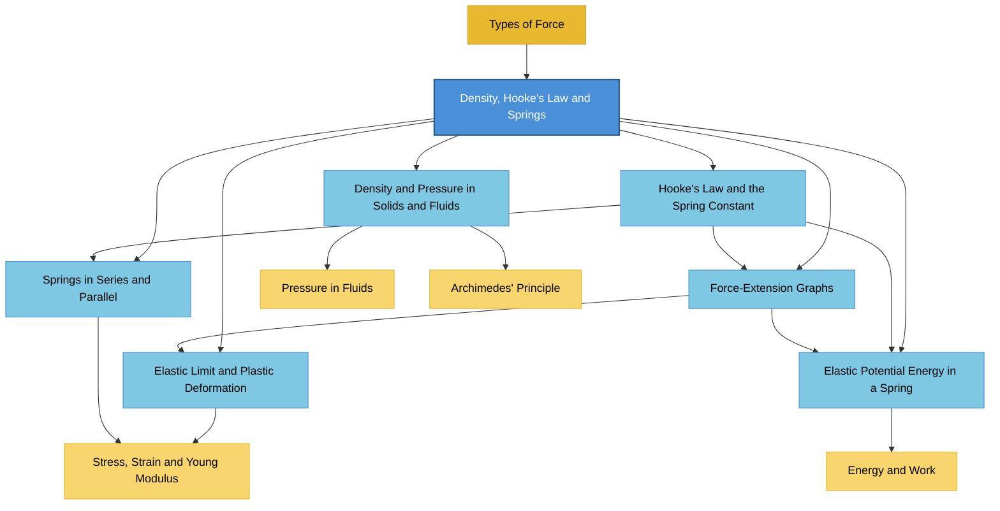

# 1. Overview / 概述

**English:**
This topic introduces two fundamental material properties: **density** and **elasticity** (via Hooke's Law). Density ($\rho$) describes how much mass is packed into a given volume, while Hooke's Law describes how materials deform elastically under force. Together, these concepts form the foundation for understanding material behaviour, from why ships float to how springs work in car suspensions.

In the Cambridge 9702 and Edexcel IAL syllabuses, this is a core AS-level topic. Density is essential for understanding [[Pressure in Fluids]] and [[Archimedes' Principle]]. Hooke's Law is the gateway to [[Stress, Strain and Young Modulus]] at A2 level. Both topics appear in multiple-choice, structured questions, and practical papers.

Real-world applications include: designing springs for watches and vehicles, calculating buoyancy for ships and submarines, determining material purity (e.g., checking gold density), and understanding elastic behaviour in sports equipment like trampolines and archery bows.

**中文：**
本主题介绍两种基本的材料性质：**密度** 和 **弹性**（通过胡克定律）。密度 ($\rho$) 描述单位体积内所含的质量，而胡克定律描述材料在力的作用下如何发生弹性形变。这些概念共同构成了理解材料行为的基础——从船舶为何能漂浮到弹簧如何在汽车悬架中工作。

在剑桥 9702 和爱德思 IAL 考纲中，这是 AS 阶段的核心主题。密度对于理解 [[流体中的压强]] 和 [[阿基米德原理]] 至关重要。胡克定律是通往 A2 阶段 [[应力、应变与杨氏模量]] 的桥梁。这两个主题出现在选择题、结构化试题和实验试卷中。

实际应用包括：设计手表和车辆中的弹簧、计算船舶和潜艇的浮力、确定材料纯度（例如检测黄金密度），以及理解蹦床和弓箭等运动器材中的弹性行为。

---

# 2. Syllabus Learning Objectives / 考纲学习目标

| CAIE 9702 (6.1) | Edexcel IAL (WPH11 U1: 2.1-2.6) |
|-----------------|----------------------------------|
| (a) Define density $\rho = m/V$ | 2.1 Define density and use $\rho = m/V$ |
| (b) Describe experiments to determine density of solids and liquids | 2.2 Describe methods to measure density (regular/irregular solids, liquids) |
| (c) State Hooke's Law: $F = kx$ | 2.3 State Hooke's Law and define spring constant $k$ |
| (d) Define elastic limit and plastic deformation | 2.4 Distinguish between elastic and plastic deformation |
| (e) Interpret force-extension graphs | 2.5 Interpret force-extension/force-compression graphs |
| (f) Calculate elastic potential energy $E = \frac{1}{2}kx^2$ | 2.6 Derive and use $E = \frac{1}{2}kx^2$ for elastic potential energy |

**Examiner Expectations / 考官期望：**
- **English:** Candidates must be able to define density precisely, perform density calculations with unit conversions, describe experimental methods with full apparatus lists, state Hooke's Law with correct variables, identify elastic limit from graphs, calculate spring constants for series/parallel combinations, and derive elastic potential energy from area under force-extension graph.
- **中文：** 考生必须能够精确定义密度、进行带单位换算的密度计算、描述包含完整器材清单的实验方法、用正确变量表述胡克定律、从图表中识别弹性极限、计算串并联组合的弹簧常数，以及从力-伸长图面积推导弹性势能。

> 📋 **CIE Only:** CAIE requires specific experimental procedures for density determination (e.g., using a Eureka can for irregular solids). They also expect candidates to distinguish between elastic limit and limit of proportionality.
>
> 📋 **Edexcel Only:** Edexcel explicitly requires derivation of $E = \frac{1}{2}kx^2$ from the area under a force-extension graph. They also include force-compression graphs (not just extension).

---

# 3. Core Definitions / 核心定义

| Term (EN/CN) | Definition (EN) | Definition (CN) | Common Mistakes / 常见错误 |
|--------------|-----------------|-----------------|---------------------------|
| **Density** / 密度 | Mass per unit volume of a substance: $\rho = \frac{m}{V}$ | 单位体积物质的质量：$\rho = \frac{m}{V}$ | Confusing density with mass or weight. Forgetting to convert units (e.g., cm³ to m³). |
| **Hooke's Law** / 胡克定律 | The extension of a spring is directly proportional to the applied force, provided the elastic limit is not exceeded: $F = kx$ | 在弹性限度内，弹簧的伸长量与所受外力成正比：$F = kx$ | Forgetting the condition "within elastic limit". Confusing extension with total length. |
| **Spring Constant** / 弹簧常数 | The force required per unit extension of a spring: $k = \frac{F}{x}$ (unit: N/m) | 使弹簧产生单位伸长所需的力：$k = \frac{F}{x}$（单位：N/m） | Thinking $k$ depends on extension. Using wrong units (N/cm vs N/m). |
| **Elastic Limit** / 弹性极限 | The maximum force that can be applied to a material without causing permanent deformation | 材料不发生永久形变所能承受的最大力 | Confusing with limit of proportionality. |
| **Limit of Proportionality** / 比例极限 | The point beyond which force is no longer proportional to extension | 力与伸长量不再成正比关系的临界点 | Assuming elastic limit = limit of proportionality (they differ for some materials). |
| **Plastic Deformation** / 塑性形变 | Deformation that remains after the deforming force is removed | 撤去外力后仍然存在的形变 | Thinking plastic deformation is always irreversible (it is). |
| **Elastic Deformation** / 弹性形变 | Deformation that disappears when the deforming force is removed | 撤去外力后消失的形变 | Confusing with plastic deformation. |
| **Elastic Potential Energy** / 弹性势能 | Energy stored in a deformed elastic object: $E = \frac{1}{2}kx^2$ | 弹性形变物体中储存的能量：$E = \frac{1}{2}kx^2$ | Using $E = kx^2$ (missing the ½). Using $E = Fx$ (which gives total work, not elastic PE). |

---

# 4. Key Concepts Explained / 关键概念详解

## 4.1 Density / 密度

### Explanation / 解释
**English:**
Density ($\rho$) is a fundamental material property that relates mass to volume. It is defined as $\rho = \frac{m}{V}$. Density is an **intensive property** — it does not depend on the amount of substance present. For example, a small piece of iron has the same density as a large block of iron.

Density determines whether an object floats or sinks in a fluid. An object floats if its density is less than the fluid's density ([[Archimedes' Principle]]). This explains why ice (density ≈ 920 kg/m³) floats on water (density ≈ 1000 kg/m³).

**中文：**
密度 ($\rho$) 是一种将质量与体积联系起来的材料基本性质。定义为 $\rho = \frac{m}{V}$。密度是一种 **强度性质** —— 它不依赖于物质的量。例如，一小块铁与一大块铁具有相同的密度。

密度决定物体在流体中是浮还是沉。如果物体的密度小于流体的密度，物体就会漂浮（[[阿基米德原理]]）。这解释了为什么冰（密度 ≈ 920 kg/m³）浮在水（密度 ≈ 1000 kg/m³）上。

### Physical Meaning / 物理意义
**English:** Density tells us how "tightly packed" the atoms or molecules are in a substance. High-density materials (like lead, 11300 kg/m³) have atoms close together; low-density materials (like cork, 240 kg/m³) have atoms far apart.

**中文：** 密度告诉我们物质中原子或分子"堆积"的紧密程度。高密度材料（如铅，11300 kg/m³）的原子排列紧密；低密度材料（如软木，240 kg/m³）的原子排列松散。

### Common Misconceptions / 常见误区
1. **"Heavy objects have high density"** — A large, light object (e.g., a balloon) can have low density despite being heavy overall.
2. **"Density changes with shape"** — Density is intensive; it depends only on material, not shape.
3. **"Density = weight/volume"** — Density uses mass, not weight. Weight varies with gravity; mass does not.

### Exam Tips / 考试提示
**English:** Cambridge and Edexcel frequently ask density calculation questions requiring unit conversion. Always convert cm³ to m³ (×10⁻⁶) or g/cm³ to kg/m³ (×1000). Memorise: 1 g/cm³ = 1000 kg/m³.

**中文：** 剑桥和爱德思经常考察需要单位换算的密度计算题。务必把 cm³ 换算为 m³（×10⁻⁶），或把 g/cm³ 换算为 kg/m³（×1000）。记住：1 g/cm³ = 1000 kg/m³。

> 📷 **IMAGE PROMPT — DENSITY-001: Density Comparison of Common Materials**
>
> A visual comparison chart showing cubes of equal volume (1 m³) made of different materials: cork (240 kg), water (1000 kg), aluminium (2700 kg), iron (7870 kg), lead (11340 kg). Each cube is labelled with material name and density. The cubes are drawn to scale with increasing weight indicated by darker shading. Clean white background, educational diagram style, labels in English.

---

## 4.2 Hooke's Law / 胡克定律

### Explanation / 解释
**English:**
Hooke's Law states that the extension ($x$) of a spring is directly proportional to the applied force ($F$), provided the [[Elastic Limit]] is not exceeded. Mathematically: $F = kx$, where $k$ is the [[Spring Constant]].

The spring constant $k$ measures the **stiffness** of the spring. A high $k$ means a stiff spring (hard to stretch); a low $k$ means a compliant spring (easy to stretch). The unit of $k$ is N/m (newtons per metre).

Hooke's Law applies to many elastic materials, not just springs — including rubber bands, metal wires, and bones (within limits).

**中文：**
胡克定律指出，在不超过 [[弹性极限]] 的条件下，弹簧的伸长量 ($x$) 与所受外力 ($F$) 成正比。数学表达式：$F = kx$，其中 $k$ 是 [[弹簧常数]]。

弹簧常数 $k$ 衡量弹簧的 **刚度**。$k$ 值大表示弹簧硬（难拉伸）；$k$ 值小表示弹簧软（易拉伸）。$k$ 的单位是 N/m（牛顿每米）。

胡克定律适用于许多弹性材料，而不仅仅是弹簧——包括橡皮筋、金属丝和骨骼（在限度内）。

### Physical Meaning / 物理意义
**English:** Hooke's Law describes the linear elastic behaviour of materials. When you pull a spring, the interatomic bonds stretch like tiny springs. As long as the bonds are not permanently damaged (elastic limit not exceeded), the spring returns to its original length when the force is removed.

**中文：** 胡克定律描述了材料的线性弹性行为。当你拉弹簧时，原子间的键像微小的弹簧一样被拉伸。只要这些键没有被永久损坏（不超过弹性极限），撤去外力后弹簧就会恢复到原来的长度。

### Common Misconceptions / 常见误区
1. **"Extension = total length"** — Extension $x$ is the change in length ($x = L - L_0$), not the total length $L$.
2. **"Hooke's Law always applies"** — It only applies within the elastic limit. Beyond that, the relationship becomes non-linear.
3. **"Spring constant changes with force"** — $k$ is a property of the spring; it is constant for a given spring (within elastic limit).

### Exam Tips / 考试提示
**English:** When solving Hooke's Law problems, always identify whether the question gives extension ($x$) or total length ($L$). If given total length, subtract the original length first. For series/parallel springs, use the equivalent spring constant formulas (see Section 4.5).

**中文：** 解胡克定律题时，务必判断题目给出的是伸长量 ($x$) 还是总长度 ($L$)。如果给的是总长度，先减去原长。对于串并联弹簧，使用等效弹簧常数公式（见第 4.5 节）。

> 📷 **IMAGE PROMPT — HOOKE-001: Hooke's Law Experiment Setup**
>
> A diagram showing a laboratory setup: a clamp stand holding a spring vertically. A ruler is placed beside the spring to measure extension. Masses (labelled 100g, 200g, etc.) are hung from the bottom of the spring. The spring's original length $L_0$ and extended length $L$ are shown with arrows. Labels: "Clamp stand", "Spring", "Ruler (mm)", "Mass hanger", "Extension $x = L - L_0$". Clean educational diagram, line art style, white background.

---

## 4.3 Force-Extension Graphs / 力-伸长图

### Explanation / 解释
**English:**
A [[Force-Extension Graph]] plots applied force ($F$) on the y-axis against extension ($x$) on the x-axis. For a spring obeying Hooke's Law, the graph is a straight line through the origin. The gradient of this line equals the spring constant $k$ (since $k = F/x$).

The area under the force-extension graph represents the work done to stretch the spring, which equals the [[Elastic Potential Energy]] stored: $E = \frac{1}{2}Fx = \frac{1}{2}kx^2$.

For materials that undergo plastic deformation, the graph deviates from a straight line beyond the elastic limit. The loading and unloading curves may differ (hysteresis).

**中文：**
[[力-伸长图]] 以所受外力 ($F$) 为纵轴，伸长量 ($x$) 为横轴。对于遵守胡克定律的弹簧，图像是一条通过原点的直线。该直线的斜率等于弹簧常数 $k$（因为 $k = F/x$）。

力-伸长图下的面积表示拉伸弹簧所做的功，等于储存的 [[弹性势能]]：$E = \frac{1}{2}Fx = \frac{1}{2}kx^2$。

对于发生塑性形变的材料，图像在弹性极限后偏离直线。加载和卸载曲线可能不同（滞后现象）。

### Physical Meaning / 物理意义
**English:** The linear region shows elastic behaviour — the material "remembers" its original shape. The non-linear region shows plastic behaviour — permanent damage to the material's internal structure.

**中文：** 线性区域显示弹性行为——材料"记住"了原来的形状。非线性区域显示塑性行为——材料内部结构发生永久性损伤。

### Common Misconceptions / 常见误区
1. **"The graph is always linear"** — Only within the elastic limit.
2. **"Gradient = 1/k"** — No, gradient = $k$ (since $F = kx$, $F$ on y-axis, $x$ on x-axis).
3. **"Area = $Fx$"** — Area under a linear graph is $\frac{1}{2}Fx$, not $Fx$.

### Exam Tips / 考试提示
**English:** Cambridge and Edexcel often ask you to calculate $k$ from the gradient of a force-extension graph. Remember to use data from the linear region only. For elastic potential energy, calculate the area under the graph up to the relevant extension.

**中文：** 剑桥和爱德思经常要求你从力-伸长图的斜率计算 $k$。记住只使用线性区域的数据。对于弹性势能，计算到相关伸长量为止的图下面积。

---

## 4.4 Elastic Limit and Plastic Deformation / 弹性极限与塑性形变

### Explanation / 解释
**English:**
The [[Elastic Limit]] is the maximum force (or stress) a material can withstand and still return to its original shape when the force is removed. Below the elastic limit, deformation is **elastic** (reversible). Above the elastic limit, deformation is **plastic** (permanent).

The [[Limit of Proportionality]] is the point up to which force is proportional to extension. For many materials, the limit of proportionality and elastic limit are very close, but they are not necessarily the same. Some materials (like rubber) show non-linear elastic behaviour — they can return to original shape even after the force-extension graph becomes curved.

**中文：**
[[弹性极限]] 是材料在撤去外力后仍能恢复原状所能承受的最大力（或应力）。低于弹性极限时，形变是 **弹性** 的（可逆的）。高于弹性极限时，形变是 **塑性** 的（永久的）。

[[比例极限]] 是力与伸长量保持正比关系的临界点。对于许多材料，比例极限和弹性极限非常接近，但不一定相同。有些材料（如橡胶）表现出非线性弹性行为——即使力-伸长图变弯曲，它们仍能恢复原状。

### Physical Meaning / 物理意义
**English:** Elastic deformation involves stretching interatomic bonds without breaking them. Plastic deformation involves atoms sliding past each other (dislocation movement), permanently changing the material's shape.

**中文：** 弹性形变涉及拉伸原子间键而不使其断裂。塑性形变涉及原子相互滑移（位错运动），永久改变材料的形状。

### Common Misconceptions / 常见误区
1. **"Elastic limit = limit of proportionality"** — They are often close but not identical. Some materials have non-linear elastic regions.
2. **"Plastic deformation means the material breaks"** — Not necessarily; plastic deformation can occur without fracture (e.g., bending a paperclip).
3. **"All materials have an elastic limit"** — Some materials (like putty) show almost no elastic behaviour.

### Exam Tips / 考试提示
**English:** Be able to identify the elastic limit and limit of proportionality on a force-extension graph. The limit of proportionality is where the graph stops being a straight line. The elastic limit is where unloading would not return to zero extension.

**中文：** 要能在力-伸长图上识别弹性极限和比例极限。比例极限是图像不再是直线的那一点。弹性极限是卸载后伸长量不会归零的那一点。

> 📷 **IMAGE PROMPT — GRAPH-001: Force-Extension Graph with Key Points**
>
> A force-extension graph showing: (1) Linear region from origin to point P (limit of proportionality) — straight line; (2) Non-linear elastic region from P to E (elastic limit) — curved but still reversible; (3) Plastic region beyond E — irreversible deformation. Points labelled: O (origin), P (limit of proportionality), E (elastic limit), B (breaking point). Axes labelled: "Force F / N" (y-axis) and "Extension x / m" (x-axis). Clean graph paper background, grid lines, educational style.

---

## 4.5 Springs in Series and Parallel / 弹簧的串并联

### Explanation / 解释
**English:**
When [[Springs in Series and Parallel]] are combined, the effective spring constant changes.

**Series (end-to-end):** The same force acts on each spring, but extensions add.
$$\frac{1}{k_{\text{total}}} = \frac{1}{k_1} + \frac{1}{k_2} + \dots$$
The combined spring is **softer** (lower $k$) than the individual springs.

**Parallel (side-by-side):** The force is shared between springs, but extensions are equal.
$$k_{\text{total}} = k_1 + k_2 + \dots$$
The combined spring is **stiffer** (higher $k$) than the individual springs.

**中文：**
当 [[弹簧的串并联]] 组合时，有效弹簧常数会改变。

**串联（首尾相连）：** 每个弹簧受到相同的力，但伸长量相加。
$$\frac{1}{k_{\text{总}}} = \frac{1}{k_1} + \frac{1}{k_2} + \dots$$
组合弹簧比单个弹簧 **更软**（$k$ 更小）。

**并联（并排连接）：** 力在弹簧之间分配，但伸长量相等。
$$k_{\text{总}} = k_1 + k_2 + \dots$$
组合弹簧比单个弹簧 **更硬**（$k$ 更大）。

### Physical Meaning / 物理意义
**English:** Series combinations are like having a longer spring — easier to stretch. Parallel combinations are like having a thicker spring — harder to stretch. This is why car suspensions use multiple springs in parallel for stiffness.

**中文：** 串联组合就像有更长的弹簧——更容易拉伸。并联组合就像有更粗的弹簧——更难拉伸。这就是为什么汽车悬架使用多个并联弹簧来增加刚度。

### Common Misconceptions / 常见误区
1. **"Series: $k_{\text{total}} = k_1 + k_2$"** — This is for parallel, not series.
2. **"Parallel: $1/k_{\text{total}} = 1/k_1 + 1/k_2$"** — This is for series, not parallel.
3. **"Series always gives $k_{\text{total}} < k_1$"** — True, but only if both $k$ are positive.

### Exam Tips / 考试提示
**English:** For series springs, remember the formula is **reciprocal** (like resistors in parallel). For parallel springs, the formula is **direct addition** (like resistors in series). This is the opposite of electrical resistor combinations.

**中文：** 对于串联弹簧，公式是 **倒数相加**（类似于电阻并联）。对于并联弹簧，公式是 **直接相加**（类似于电阻串联）。这与电阻组合相反。

> 📷 **IMAGE PROMPT — SPRING-001: Springs in Series and Parallel**
>
> Two diagrams side by side. Left: Two identical springs connected end-to-end (series) with a weight hanging from the bottom. Labels: "Series: $k_{\text{total}} = \frac{k_1 k_2}{k_1 + k_2}$". Right: Two identical springs side-by-side (parallel) with a weight hanging from a bar connecting both springs. Labels: "Parallel: $k_{\text{total}} = k_1 + k_2$". Clean line art, educational diagram, white background, English labels.

---

## 4.6 Elastic Potential Energy / 弹性势能

### Explanation / 解释
**English:**
[[Elastic Potential Energy]] is the energy stored in a deformed elastic object. For a spring obeying Hooke's Law, the elastic potential energy is given by:
$$E = \frac{1}{2}kx^2 = \frac{1}{2}Fx$$

This formula is derived from the area under the force-extension graph. Since the graph is a straight line through the origin, the area is a triangle: $\text{Area} = \frac{1}{2} \times \text{base} \times \text{height} = \frac{1}{2} \times x \times F = \frac{1}{2}Fx = \frac{1}{2}kx^2$.

**中文：**
[[弹性势能]] 是形变弹性物体中储存的能量。对于遵守胡克定律的弹簧，弹性势能由下式给出：
$$E = \frac{1}{2}kx^2 = \frac{1}{2}Fx$$

该公式由力-伸长图下的面积推导而来。由于图像是通过原点的直线，面积为三角形：$\text{面积} = \frac{1}{2} \times \text{底} \times \text{高} = \frac{1}{2} \times x \times F = \frac{1}{2}Fx = \frac{1}{2}kx^2$。

### Physical Meaning / 物理意义
**English:** When you stretch a spring, you do work against the interatomic forces. This work is stored as elastic potential energy. When released, this energy is converted to kinetic energy (the spring snaps back).

**中文：** 当你拉伸弹簧时，你克服原子间力做功。这个功以弹性势能的形式储存。释放时，这个能量转化为动能（弹簧弹回）。

### Common Misconceptions / 常见误区
1. **"$E = kx^2$"** — Missing the $\frac{1}{2}$ factor.
2. **"$E = Fx$"** — This is the total work done if force were constant, but force varies linearly with extension.
3. **"Energy is lost when spring returns"** — In an ideal spring, energy is conserved (converted to kinetic energy). In real springs, some energy is lost as heat (hysteresis).

### Exam Tips / 考试提示
**English:** Edexcel explicitly requires derivation of $E = \frac{1}{2}kx^2$ from the area under the graph. Cambridge expects you to use it in calculations. Remember that elastic potential energy is always positive (it's stored energy, not work done by the spring).

**中文：** 爱德思明确要求从图下面积推导 $E = \frac{1}{2}kx^2$。剑桥期望你在计算中使用它。记住弹性势能总是正的（它是储存的能量，而不是弹簧所做的功）。

---

# 5. Essential Equations / 核心公式

## 5.1 Density / 密度

**Equation / 公式:**
$$\rho = \frac{m}{V}$$

**Variables / 变量:**
| Symbol (符号) | Meaning (EN) | Meaning (CN) | Unit (单位) |
|--------------|-------------|-------------|------------|
| $\rho$ | Density | 密度 | kg/m³ (or g/cm³) |
| $m$ | Mass | 质量 | kg (or g) |
| $V$ | Volume | 体积 | m³ (or cm³) |

**Derivation / 推导:**
**English:** Density is defined as mass per unit volume. This is a definition, not derived from other equations.
**中文：** 密度定义为质量除以体积。这是一个定义，不是从其他方程推导出来的。

**Conditions / 适用条件:**
**English:** Applicable to all substances (solids, liquids, gases). For gases, density depends on temperature and pressure.
**中文：** 适用于所有物质（固体、液体、气体）。对于气体，密度取决于温度和压强。

**Limitations / 局限性:**
**English:** Density varies with temperature (thermal expansion changes volume). For composite objects, average density is used.
**中文：** 密度随温度变化（热膨胀改变体积）。对于复合物体，使用平均密度。

**Rearrangements / 变形:**
$$m = \rho V \quad \text{and} \quad V = \frac{m}{\rho}$$

---

## 5.2 Hooke's Law / 胡克定律

**Equation / 公式:**
$$F = kx$$

**Variables / 变量:**
| Symbol (符号) | Meaning (EN) | Meaning (CN) | Unit (单位) |
|--------------|-------------|-------------|------------|
| $F$ | Applied force | 所受外力 | N |
| $k$ | Spring constant | 弹簧常数 | N/m |
| $x$ | Extension (change in length) | 伸长量（长度变化） | m |

**Derivation / 推导:**
**English:** Hooke's Law is an empirical law (based on experiment). Robert Hooke discovered that for many elastic materials, force is proportional to extension within the elastic limit. The constant of proportionality is defined as the spring constant $k$.
**中文：** 胡克定律是经验定律（基于实验）。罗伯特·胡克发现，对于许多弹性材料，在弹性限度内力与伸长量成正比。比例常数定义为弹簧常数 $k$。

**Conditions / 适用条件:**
**English:** Only applies within the elastic limit. The material must be elastic (returns to original shape). Extension $x$ is measured from the natural (unstretched) length.
**中文：** 仅适用于弹性限度内。材料必须是弹性的（能恢复原状）。伸长量 $x$ 从自然（未拉伸）长度开始测量。

**Limitations / 局限性:**
**English:** Does not apply beyond the elastic limit. Does not apply to plastic deformation. Some materials (rubber) show non-linear elastic behaviour.
**中文：** 不适用于弹性限度之外。不适用于塑性形变。有些材料（橡胶）表现出非线性弹性行为。

**Rearrangements / 变形:**
$$k = \frac{F}{x} \quad \text{and} \quad x = \frac{F}{k}$$

---

## 5.3 Elastic Potential Energy / 弹性势能

**Equation / 公式:**
$$E = \frac{1}{2}kx^2 = \frac{1}{2}Fx$$

**Variables / 变量:**
| Symbol (符号) | Meaning (EN) | Meaning (CN) | Unit (单位) |
|--------------|-------------|-------------|------------|
| $E$ | Elastic potential energy | 弹性势能 | J |
| $k$ | Spring constant | 弹簧常数 | N/m |
| $x$ | Extension | 伸长量 | m |
| $F$ | Force at extension $x$ | 伸长 $x$ 时的力 | N |

**Derivation / 推导:**
**English:**
The work done to stretch a spring from 0 to extension $x$ equals the area under the force-extension graph. Since $F = kx$, the graph is a straight line through the origin. The area is a triangle:
$$\text{Area} = \frac{1}{2} \times \text{base} \times \text{height} = \frac{1}{2} \times x \times F = \frac{1}{2} \times x \times (kx) = \frac{1}{2}kx^2$$

This work done is stored as elastic potential energy.

**中文：**
将弹簧从 0 拉伸到伸长量 $x$ 所做的功等于力-伸长图下的面积。由于 $F = kx$，图像是通过原点的直线。面积为三角形：
$$\text{面积} = \frac{1}{2} \times \text{底} \times \text{高} = \frac{1}{2} \times x \times F = \frac{1}{2} \times x \times (kx) = \frac{1}{2}kx^2$$

这个功以弹性势能的形式储存。

**Conditions / 适用条件:**
**English:** Only applies when Hooke's Law is obeyed (within elastic limit). The spring must be ideal (no energy loss to heat).
**中文：** 仅当遵守胡克定律时适用（弹性限度内）。弹簧必须是理想的（没有能量以热的形式损失）。

**Limitations / 局限性:**
**English:** Does not apply beyond the elastic limit. Real springs have some energy loss (hysteresis). For non-linear elastic materials, the area under the graph must be calculated by integration.
**中文：** 不适用于弹性限度之外。真实弹簧会有一些能量损失（滞后）。对于非线性弹性材料，必须通过积分计算图下面积。

**Rearrangements / 变形:**
$$k = \frac{2E}{x^2} \quad \text{and} \quad x = \sqrt{\frac{2E}{k}}$$

---

## 5.4 Springs in Series / 弹簧串联

**Equation / 公式:**
$$\frac{1}{k_{\text{total}}} = \frac{1}{k_1} + \frac{1}{k_2} + \dots$$

**Variables / 变量:**
| Symbol (符号) | Meaning (EN) | Meaning (CN) | Unit (单位) |
|--------------|-------------|-------------|------------|
| $k_{\text{total}}$ | Effective spring constant | 等效弹簧常数 | N/m |
| $k_1, k_2, \dots$ | Individual spring constants | 各弹簧常数 | N/m |

**Derivation / 推导:**
**English:**
For springs in series, the same force $F$ acts on each spring. Total extension $x_{\text{total}} = x_1 + x_2 + \dots$.
Using $x = F/k$:
$$\frac{F}{k_{\text{total}}} = \frac{F}{k_1} + \frac{F}{k_2} + \dots$$
Dividing by $F$:
$$\frac{1}{k_{\text{total}}} = \frac{1}{k_1} + \frac{1}{k_2} + \dots$$

**中文：**
对于串联弹簧，每个弹簧受到相同的力 $F$。总伸长量 $x_{\text{总}} = x_1 + x_2 + \dots$。
使用 $x = F/k$：
$$\frac{F}{k_{\text{总}}} = \frac{F}{k_1} + \frac{F}{k_2} + \dots$$
除以 $F$：
$$\frac{1}{k_{\text{总}}} = \frac{1}{k_1} + \frac{1}{k_2} + \dots$$

**Conditions / 适用条件:**
**English:** Springs must be identical in material and obey Hooke's Law. The formula assumes ideal springs with negligible mass.
**中文：** 弹簧材料必须相同且遵守胡克定律。该公式假设弹簧是理想的，质量可忽略。

**Limitations / 局限性:**
**English:** Does not account for the weight of the springs themselves. For non-identical springs, the formula still applies but individual $k$ values must be known.
**中文：** 不考虑弹簧自身的重量。对于不相同的弹簧，公式仍然适用，但必须知道各自的 $k$ 值。

**Rearrangements / 变形:**
For two springs: $k_{\text{total}} = \frac{k_1 k_2}{k_1 + k_2}$

---

## 5.5 Springs in Parallel / 弹簧并联

**Equation / 公式:**
$$k_{\text{total}} = k_1 + k_2 + \dots$$

**Variables / 变量:**
| Symbol (符号) | Meaning (EN) | Meaning (CN) | Unit (单位) |
|--------------|-------------|-------------|------------|
| $k_{\text{total}}$ | Effective spring constant | 等效弹簧常数 | N/m |
| $k_1, k_2, \dots$ | Individual spring constants | 各弹簧常数 | N/m |

**Derivation / 推导:**
**English:**
For springs in parallel, the extension $x$ is the same for all springs. The total force $F_{\text{total}} = F_1 + F_2 + \dots$.
Using $F = kx$:
$$k_{\text{total}} x = k_1 x + k_2 x + \dots$$
Dividing by $x$:
$$k_{\text{total}} = k_1 + k_2 + \dots$$

**中文：**
对于并联弹簧，所有弹簧的伸长量 $x$ 相同。总力 $F_{\text{总}} = F_1 + F_2 + \dots$。
使用 $F = kx$：
$$k_{\text{总}} x = k_1 x + k_2 x + \dots$$
除以 $x$：
$$k_{\text{总}} = k_1 + k_2 + \dots$$

**Conditions / 适用条件:**
**English:** Springs must be connected to the same rigid support and share the load equally. They must all obey Hooke's Law.
**中文：** 弹簧必须连接到同一刚性支架并均匀分担负载。它们都必须遵守胡克定律。

**Limitations / 局限性:**
**English:** Assumes all springs have the same natural length. If lengths differ, some springs may not be under tension initially.
**中文：** 假设所有弹簧具有相同的自然长度。如果长度不同，有些弹簧可能一开始就没有受到拉力。

**Rearrangements / 变形:**
For two identical springs: $k_{\text{total}} = 2k$

---

# 6. Graphs and Relationships / 图表与关系

## 6.1 Force-Extension Graph for an Ideal Spring / 理想弹簧的力-伸长图

### Axes / 坐标轴
**English:** y-axis: Force $F$ (N); x-axis: Extension $x$ (m)
**中文：** y 轴：力 $F$ (N)；x 轴：伸长量 $x$ (m)

### Shape / 形状
**English:** Straight line through the origin (linear relationship).
**中文：** 通过原点的直线（线性关系）。

### Gradient Meaning / 斜率含义
**English:** Gradient = $\frac{F}{x} = k$ (spring constant). A steeper line means a stiffer spring.
**中文：** 斜率 = $\frac{F}{x} = k$（弹簧常数）。直线越陡，弹簧越硬。

### Area Meaning / 面积含义
**English:** Area under the graph = work done = elastic potential energy $E = \frac{1}{2}Fx = \frac{1}{2}kx^2$.
**中文：** 图下面积 = 所做的功 = 弹性势能 $E = \frac{1}{2}Fx = \frac{1}{2}kx^2$。

### Exam Interpretation / 考试解读
**English:** If the graph is a straight line through origin, the spring obeys Hooke's Law. If it curves, the elastic limit has been exceeded. The gradient gives $k$ directly.
**中文：** 如果图像是通过原点的直线，弹簧遵守胡克定律。如果弯曲，则已超过弹性极限。斜率直接给出 $k$。

### Common Questions / 常见问题
1. Calculate $k$ from gradient.
2. Find elastic potential energy from area.
3. Determine if Hooke's Law is obeyed.
4. Compare stiffness of two springs.

---

## 6.2 Force-Extension Graph for a Real Material / 真实材料的力-伸长图

### Axes / 坐标轴
**English:** y-axis: Force $F$ (N); x-axis: Extension $x$ (m)
**中文：** y 轴：力 $F$ (N)；x 轴：伸长量 $x$ (m)

### Shape / 形状
**English:** Initially linear (proportional region), then curves (non-linear elastic region), then may flatten (plastic region) until breaking point.
**中文：** 初始为线性（比例区域），然后弯曲（非线性弹性区域），接着可能变平（塑性区域），直到断裂点。

### Gradient Meaning / 斜率含义
**English:** Gradient = $k$ in the linear region. Gradient decreases in the non-linear region (spring becomes softer).
**中文：** 在线性区域，斜率 = $k$。在非线性区域，斜率减小（弹簧变软）。

### Area Meaning / 面积含义
**English:** Total area under graph = total work done to stretch the material. Area under elastic region = recoverable elastic energy. Area under plastic region = energy dissipated (permanent deformation).
**中文：** 图下总面积 = 拉伸材料所做的总功。弹性区域下的面积 = 可恢复的弹性能。塑性区域下的面积 = 耗散的能量（永久形变）。

### Exam Interpretation / 考试解读
**English:** Identify the limit of proportionality (end of straight line), elastic limit (where unloading would not return to zero), and breaking point. Compare loading and unloading curves to see energy loss (hysteresis).
**中文：** 识别比例极限（直线结束点）、弹性极限（卸载后不会归零点）和断裂点。比较加载和卸载曲线以观察能量损失（滞后）。

### Common Questions / 常见问题
1. Label limit of proportionality and elastic limit.
2. Calculate energy stored up to a given extension.
3. Explain why loading/unloading curves differ.
4. Determine if material is ductile or brittle from graph shape.

---

## 6.3 Density vs Temperature Graph / 密度-温度图

### Axes / 坐标轴
**English:** y-axis: Density $\rho$ (kg/m³); x-axis: Temperature $T$ (°C or K)
**中文：** y 轴：密度 $\rho$ (kg/m³)；x 轴：温度 $T$ (°C 或 K)

### Shape / 形状
**English:** Generally decreasing curve (most substances expand when heated, so density decreases). Water shows anomalous behaviour: density increases from 0°C to 4°C, then decreases.
**中文：** 通常为递减曲线（大多数物质受热膨胀，密度减小）。水表现出反常行为：密度从 0°C 到 4°C 增加，然后减小。

### Gradient Meaning / 斜率含义
**English:** Gradient = rate of change of density with temperature. Steeper gradient means greater thermal expansion coefficient.
**中文：** 斜率 = 密度随温度的变化率。斜率越大，热膨胀系数越大。

### Area Meaning / 面积含义
**English:** No direct physical meaning for area under this graph.
**中文：** 该图下的面积没有直接的物理意义。

### Exam Interpretation / 考试解读
**English:** Used to explain why ice floats (water's maximum density at 4°C). Also used in thermal expansion problems.
**中文：** 用于解释为什么冰会漂浮（水在 4°C 时密度最大）。也用于热膨胀问题。

### Common Questions / 常见问题
1. Explain the anomalous behaviour of water.
2. Calculate density change for a given temperature change.
3. Use density-temperature relationship to explain convection.

---

# 7. Required Diagrams / 必备图表

## 7.1 Density Measurement for a Regular Solid / 规则固体密度测量

### Description / 描述
**English:** A diagram showing the measurement of density for a regular solid (e.g., a metal cube). The solid's dimensions are measured with a ruler or vernier callipers to find volume ($V = l \times w \times h$). The mass is measured with a digital balance. Density is then $\rho = m/V$.

**中文：** 显示测量规则固体（如金属立方体）密度的示意图。用直尺或游标卡尺测量固体的尺寸以求得体积（$V = l \times w \times h$）。用电子天平测量质量。密度为 $\rho = m/V$。

### Image Prompt / 图片生成提示
> 📷 **IMAGE PROMPT — DIAG-001: Density Measurement of a Regular Solid**
>
> A laboratory bench setup showing: (1) A metal cube (labelled "Regular solid") placed on a digital balance displaying "m = 270 g"; (2) A ruler measuring the cube's side length, showing "l = 3.0 cm"; (3) An inset showing the calculation: $V = l^3 = 27 \text{ cm}^3$, $\rho = m/V = 270/27 = 10 \text{ g/cm}^3 = 10000 \text{ kg/m}^3$. Clean educational diagram, line art with subtle colour, white background, English labels.

### Labels Required / 需要标注
- Digital balance / 电子天平
- Metal cube / 金属立方体
- Ruler / 直尺
- Mass $m$ / 质量 $m$
- Length $l$ / 长度 $l$
- Volume $V = l^3$ / 体积 $V = l^3$
- Density $\rho = m/V$ / 密度 $\rho = m/V$

### Exam Importance / 考试重要性
**English:** Cambridge Paper 3 and Edexcel Unit 3 frequently ask students to describe this experiment. Key skills: choosing appropriate instruments, calculating volume, handling significant figures, and estimating uncertainties.

**中文：** 剑桥 Paper 3 和爱德思 Unit 3 经常要求学生描述这个实验。关键技能：选择合适的仪器、计算体积、处理有效数字和估算不确定度。

---

## 7.2 Density Measurement for an Irregular Solid (Eureka Can Method) / 不规则固体密度测量（溢水杯法）

### Description / 描述
**English:** A diagram showing a Eureka (displacement) can filled with water to the spout. An irregular solid is lowered into the water using a thin thread. The displaced water is collected in a measuring cylinder. The volume of displaced water equals the volume of the solid. Mass is measured with a balance.

**中文：** 显示溢水杯（排水法）的示意图，杯中水加至溢水口。用细线将不规则固体浸入水中。排出的水收集在量筒中。排出水的体积等于固体的体积。用天平测量质量。

### Image Prompt / 图片生成提示
> 📷 **IMAGE PROMPT — DIAG-002: Eureka Can Density Measurement**
>
> A diagram showing: (1) A Eureka can (overflow can) filled with water to the spout level; (2) An irregular solid (stone) suspended by a thin thread being lowered into the water; (3) Water flowing out of the spout into a measuring cylinder below; (4) The measuring cylinder showing displaced water volume "V = 50 cm³"; (5) A digital balance nearby showing "m = 130 g". Labels: "Eureka can", "Irregular solid", "Thread", "Measuring cylinder", "Displaced water". Clean educational diagram, line art, white background, English labels.

### Labels Required / 需要标注
- Eureka can / 溢水杯
- Irregular solid / 不规则固体
- Thread / 细线
- Water level / 水位
- Spout / 溢水口
- Measuring cylinder / 量筒
- Displaced water volume $V$ / 排出水体积 $V$
- Balance / 天平
- Mass $m$ / 质量 $m$

### Exam Importance / 考试重要性
**English:** This is a classic Cambridge Paper 3 experiment. Students must understand why the solid must be fully submerged, why the thread should be thin, and how to minimise errors (e.g., ensuring the can is filled to the spout before lowering the solid).

**中文：** 这是经典的剑桥 Paper 3 实验。学生必须理解为什么固体必须完全浸没、为什么细线要细，以及如何最小化误差（例如，在放入固体前确保水加至溢水口）。

---

## 7.3 Hooke's Law Experiment Setup / 胡克定律实验装置

### Description / 描述
**English:** A diagram showing a spring suspended from a clamp stand. A ruler is placed vertically beside the spring to measure extension. Masses are added to a hanger at the bottom of the spring. The original length $L_0$ and extended length $L$ are shown.

**中文：** 显示弹簧悬挂在铁架台上的示意图。直尺垂直放置在弹簧旁边以测量伸长量。砝码加到弹簧底部的挂钩上。显示原长 $L_0$ 和伸长后长度 $L$。

### Image Prompt / 图片生成提示
> 📷 **IMAGE PROMPT — DIAG-003: Hooke's Law Experiment**
>
> A laboratory setup showing: (1) A clamp stand with a horizontal rod at the top; (2) A spring hanging from the rod; (3) A ruler (in cm) placed vertically beside the spring, zero aligned with the bottom of the spring when unstretched; (4) A mass hanger with labelled masses (100g, 200g, 300g) hanging from the spring's bottom hook; (5) Arrows showing original length $L_0$ and extended length $L$; (6) An inset showing the calculation: $x = L - L_0$, $k = F/x$. Clean educational diagram, line art, white background, English labels.

### Labels Required / 需要标注
- Clamp stand / 铁架台
- Spring / 弹簧
- Ruler / 直尺
- Mass hanger / 砝码挂钩
- Masses / 砝码
- Original length $L_0$ / 原长 $L_0$
- Extended length $L$ / 伸长后长度 $L$
- Extension $x = L - L_0$ / 伸长量 $x = L - L_0$
- Force $F = mg$ / 力 $F = mg$

### Exam Importance / 考试重要性
**English:** This is the most common practical for Hooke's Law. Students must know how to measure extension accurately (using a ruler with a pointer to avoid parallax error), how to calculate $k$ from a graph, and how to handle uncertainties.

**中文：** 这是胡克定律最常见的实验。学生必须知道如何准确测量伸长量（使用带指针的直尺以避免视差误差）、如何从图表计算 $k$，以及如何处理不确定度。

---

## 7.4 Force-Extension Graph with Key Points / 带关键点的力-伸长图

### Description / 描述
**English:** A force-extension graph showing the linear region (proportional), the limit of proportionality, the elastic limit, the plastic region, and the breaking point. Loading and unloading curves may be shown to illustrate hysteresis.

**中文：** 力-伸长图，显示线性区域（比例区域）、比例极限、弹性极限、塑性区域和断裂点。可显示加载和卸载曲线以说明滞后现象。

### Image Prompt / 图片生成提示
> 📷 **IMAGE PROMPT — DIAG-004: Force-Extension Graph with Key Features**
>
> A graph on grid paper showing: (1) A straight line from origin O to point P (limit of proportionality); (2) A curved line from P to E (elastic limit); (3) A flatter curved line from E to B (breaking point); (4) Points labelled: O (origin), P (limit of proportionality), E (elastic limit), B (breaking point); (5) Axes labelled: "Force F / N" (y-axis) and "Extension x / m" (x-axis); (6) A dashed line showing unloading from point E back to the x-axis (showing permanent extension). Clean graph paper background, grid lines, educational style, English labels.

### Labels Required / 需要标注
- Origin O / 原点 O
- Limit of proportionality P / 比例极限 P
- Elastic limit E / 弹性极限 E
- Breaking point B / 断裂点 B
- Linear (elastic) region / 线性（弹性）区域
- Non-linear elastic region / 非线性弹性区域
- Plastic region / 塑性区域
- Permanent extension / 永久伸长量
- Loading curve / 加载曲线
- Unloading curve / 卸载曲线

### Exam Importance / 考试重要性
**English:** This graph is essential for understanding material behaviour. Cambridge and Edexcel both ask students to identify key points, calculate areas, and explain the physical meaning of different regions.

**中文：** 该图对于理解材料行为至关重要。剑桥和爱德思都要求学生识别关键点、计算面积并解释不同区域的物理意义。

---

# 8. Worked Examples / 典型例题

## Example 1: Density Calculation with Unit Conversion / 密度计算与单位换算

### Question / 题目
**English:**
A metal cube has a mass of 675 g and side length of 5.0 cm. Calculate:
(a) The volume of the cube in m³.
(b) The density of the metal in kg/m³.
(c) Identify the metal using the following densities: aluminium (2700 kg/m³), iron (7870 kg/m³), copper (8960 kg/m³).

**中文：**
一个金属立方体的质量为 675 g，边长为 5.0 cm。计算：
(a) 立方体的体积（以 m³ 为单位）。
(b) 金属的密度（以 kg/m³ 为单位）。
(c) 使用以下密度识别该金属：铝（2700 kg/m³）、铁（7870 kg/m³）、铜（8960 kg/m³）。

### Solution / 解答

**Step 1: Convert units / 步骤 1：单位换算**
$$m = 675 \text{ g} = 0.675 \text{ kg}$$
$$l = 5.0 \text{ cm} = 0.050 \text{ m}$$

**Step 2: Calculate volume / 步骤 2：计算体积**
$$V = l^3 = (0.050)^3 = 1.25 \times 10^{-4} \text{ m}^3$$

**Step 3: Calculate density / 步骤 3：计算密度**
$$\rho = \frac{m}{V} = \frac{0.675}{1.25 \times 10^{-4}} = 5400 \text{ kg/m}^3$$

**Step 4: Identify metal / 步骤 4：识别金属**
The density 5400 kg/m³ does not match any of the given metals exactly. It is closest to aluminium (2700 kg/m³) but significantly higher. This suggests the cube might be an alloy or the measurements have some uncertainty.

**Alternative approach (using g/cm³):**
$$V = 5.0^3 = 125 \text{ cm}^3$$
$$\rho = \frac{675}{125} = 5.4 \text{ g/cm}^3 = 5400 \text{ kg/m}^3$$

### Final Answer / 最终答案
**Answer:** (a) $V = 1.25 \times 10^{-4} \text{ m}^3$ | **答案：** (a) $V = 1.25 \times 10^{-4} \text{ m}^3$
**Answer:** (b) $\rho = 5400 \text{ kg/m}^3$ | **答案：** (b) $\rho = 5400 \text{ kg/m}^3$
**Answer:** (c) The metal does not match any given metal exactly. | **答案：** (c) 该金属与所给金属不完全匹配。

### Examiner Notes / 考官点评
**English:** Common mistakes: (1) Forgetting to convert cm to m (using 5.0 cm = 0.05 m, not 0.5 m). (2) Forgetting to cube the conversion factor (1 cm = 0.01 m, so 1 cm³ = 10⁻⁶ m³). (3) Using g/cm³ and forgetting to convert to kg/m³. Always check units in the final answer.

**中文：** 常见错误：(1) 忘记将 cm 换算为 m（5.0 cm = 0.05 m，不是 0.5 m）。(2) 忘记对换算因子取立方（1 cm = 0.01 m，所以 1 cm³ = 10⁻⁶ m³）。(3) 使用 g/cm³ 但忘记换算为 kg/m³。务必检查最终答案的单位。

---

## Example 2: Hooke's Law and Elastic Potential Energy / 胡克定律与弹性势能

### Question / 题目
**English:**
A spring has a natural length of 15.0 cm. When a mass of 200 g is hung from it, the spring stretches to a length of 18.0 cm.
(a) Calculate the spring constant $k$.
(b) Calculate the elastic potential energy stored in the spring.
(c) If the same spring is stretched to a length of 22.0 cm, how much additional elastic potential energy is stored compared to part (b)?

**中文：**
一根弹簧的自然长度为 15.0 cm。当挂上 200 g 的砝码时，弹簧伸长到 18.0 cm。
(a) 计算弹簧常数 $k$。
(b) 计算弹簧中储存的弹性势能。
(c) 如果同一根弹簧被拉伸到 22.0 cm，与 (b) 部分相比，额外储存了多少弹性势能？

### Solution / 解答

**Step 1: Identify known values / 步骤 1：确定已知量**
$$L_0 = 15.0 \text{ cm} = 0.150 \text{ m}$$
$$L = 18.0 \text{ cm} = 0.180 \text{ m}$$
$$x = L - L_0 = 0.180 - 0.150 = 0.030 \text{ m}$$
$$m = 200 \text{ g} = 0.200 \text{ kg}$$
$$F = mg = 0.200 \times 9.81 = 1.962 \text{ N}$$

**Step 2: Calculate spring constant / 步骤 2：计算弹簧常数**
$$k = \frac{F}{x} = \frac{1.962}{0.030} = 65.4 \text{ N/m}$$

**Step 3: Calculate elastic potential energy at 18.0 cm / 步骤 3：计算 18.0 cm 时的弹性势能**
$$E_1 = \frac{1}{2}kx^2 = \frac{1}{2} \times 65.4 \times (0.030)^2 = 0.0294 \text{ J}$$

**Step 4: Calculate elastic potential energy at 22.0 cm / 步骤 4：计算 22.0 cm 时的弹性势能**
$$x_2 = 0.220 - 0.150 = 0.070 \text{ m}$$
$$E_2 = \frac{1}{2} \times 65.4 \times (0.070)^2 = 0.160 \text{ J}$$

**Step 5: Calculate additional energy / 步骤 5：计算额外能量**
$$\Delta E = E_2 - E_1 = 0.160 - 0.0294 = 0.131 \text{ J}$$

### Final Answer / 最终答案
**Answer:** (a) $k = 65.4 \text{ N/m}$ | **答案：** (a) $k = 65.4 \text{ N/m}$
**Answer:** (b) $E = 0.0294 \text{ J}$ | **答案：** (b) $E = 0.0294 \text{ J}$
**Answer:** (c) $\Delta E = 0.131 \text{ J}$ | **答案：** (c) $\Delta E = 0.131 \text{ J}$

### Examiner Notes / 考官点评
**English:** Common mistakes: (1) Using total length instead of extension in Hooke's Law. (2) Forgetting to convert cm to m. (3) Using $E = kx^2$ instead of $E = \frac{1}{2}kx^2$. (4) For part (c), calculating $E_2$ only instead of the difference. Note that elastic potential energy is not linear with extension — doubling extension quadruples energy.

**中文：** 常见错误：(1) 在胡克定律中使用总长度而不是伸长量。(2) 忘记将 cm 换算为 m。(3) 使用 $E = kx^2$ 而不是 $E = \frac{1}{2}kx^2$。(4) 对于 (c) 部分，只计算 $E_2$ 而不是差值。注意弹性势能与伸长量不是线性关系——伸长量加倍，能量变为四倍。

### Alternative Method / 替代方法
**English:** For part (c), we can also use the difference in areas under the force-extension graph:
$$\Delta E = \frac{1}{2}k(x_2^2 - x_1^2) = \frac{1}{2} \times 65.4 \times (0.070^2 - 0.030^2) = 0.131 \text{ J}$$

**中文：** 对于 (c) 部分，我们也可以使用力-伸长图下面积的差：
$$\Delta E = \frac{1}{2}k(x_2^2 - x_1^2) = \frac{1}{2} \times 65.4 \times (0.070^2 - 0.030^2) = 0.131 \text{ J}$$

---

# 9. Past Paper Question Types / 历年真题题型

| Question Type / 题型 | Frequency / 频率 | Difficulty / 难度 | Past Paper References / 真题索引 |
|----------------------|------------------|------------------|-------------------------------|
| Density Calculation / 密度计算 | High | Low-Medium | 📝 *待填入* |
| Hooke's Law Calculation / 胡克定律计算 | High | Medium | 📝 *待填入* |
| Force-Extension Graph Analysis / 力-伸长图分析 | High | Medium | 📝 *待填入* |
| Elastic Potential Energy / 弹性势能 | Medium | Medium | 📝 *待填入* |
| Springs in Series/Parallel / 弹簧串并联 | Medium | Medium-High | 📝 *待填入* |
| Experimental Description / 实验描述 | Medium | Medium | 📝 *待填入* |
| Derivation of $E = \frac{1}{2}kx^2$ / 推导 $E = \frac{1}{2}kx^2$ | Low (CIE) / High (Edexcel) | Medium | 📝 *待填入* |
| Density Experimental Design / 密度实验设计 | Medium | Medium | 📝 *待填入* |

> 📝 **题库整理中 / Question Bank Under Construction:** 具体试卷编号（如 9702/23/M/J/24 Q3）将在后续整理真题后填入上表。

**Common Command Words / 常见指令词：**

| Command Word (EN) | Command Word (CN) | Typical Usage / 典型用法 |
|-------------------|-------------------|-------------------------|
| State | 陈述 | State Hooke's Law. |
| Define | 定义 | Define density. |
| Calculate | 计算 | Calculate the spring constant. |
| Determine | 确定 | Determine the density of the metal. |
| Explain | 解释 | Explain why the graph is not linear beyond point P. |
| Describe | 描述 | Describe an experiment to measure the density of an irregular solid. |
| Derive | 推导 | Derive the expression for elastic potential energy. |
| Sketch | 画草图 | Sketch a force-extension graph for a spring. |
| Suggest | 建议 | Suggest why the experimental value differs from the theoretical value. |

---

# 10. Practical Skills Connections / 实验技能链接

**English:**
This topic has strong practical components in both Cambridge and Edexcel specifications.

**CAIE Paper 3 (AS Practical):**
- **Density experiments:** Measuring density of regular solids (using ruler/vernier callipers), irregular solids (Eureka can method), and liquids (measuring cylinder and balance).
- **Hooke's Law experiments:** Investigating the relationship between force and extension for a spring. Plotting force-extension graphs, calculating $k$ from gradient, determining elastic limit.
- **Key skills:** Choosing appropriate instruments, reading scales accurately (including vernier scales), recording data in tables, plotting graphs with error bars, calculating gradients, estimating uncertainties.

**CAIE Paper 5 (A2 Practical):**
- **Designing experiments:** Planning an experiment to determine the spring constant of a spring or the density of a material.
- **Analysis:** Using logarithmic plots to verify relationships (e.g., $\log F = \log k + \log x$).

**Edexcel Unit 3 (AS Practical):**
- **Core practical:** Investigating the relationship between force and extension for a spring.
- **Skills:** Using a data logger with force sensor and motion sensor, calculating spring constant, evaluating experimental errors.

**Edexcel Unit 6 (A2 Practical):**
- **Advanced experiments:** Investigating springs in series and parallel, measuring elastic potential energy.

**Common Practical Errors / 常见实验误差：**
1. **Parallax error** when reading ruler — use a pointer or set square.
2. **Spring not vertical** — ensure clamp stand is stable.
3. **Masses not at rest** — wait for oscillations to stop before reading.
4. **Ruler not aligned with zero** — check zero error.
5. **Eureka can not filled to spout** — ensure water level is exactly at spout.

**Uncertainty Analysis / 不确定度分析：**
- For density: $\frac{\Delta \rho}{\rho} = \frac{\Delta m}{m} + \frac{\Delta V}{V}$
- For spring constant: $\frac{\Delta k}{k} = \frac{\Delta F}{F} + \frac{\Delta x}{x}$
- Use gradient of best-fit line and worst acceptable line to find uncertainty in $k$.

**中文：**
本主题在剑桥和爱德思考纲中都有很强的实验成分。

**剑桥 Paper 3（AS 实验）：**
- **密度实验：** 测量规则固体（使用直尺/游标卡尺）、不规则固体（溢水杯法）和液体（量筒和天平）的密度。
- **胡克定律实验：** 研究弹簧的力与伸长量之间的关系。绘制力-伸长图，从斜率计算 $k$，确定弹性极限。
- **关键技能：** 选择合适的仪器、准确读取刻度（包括游标刻度）、在表格中记录数据、绘制带误差线的图表、计算斜率、估算不确定度。

**剑桥 Paper 5（A2 实验）：**
- **实验设计：** 设计实验以确定弹簧的弹簧常数或材料的密度。
- **分析：** 使用对数图验证关系（例如 $\log F = \log k + \log x$）。

**爱德思 Unit 3（AS 实验）：**
- **核心实验：** 研究弹簧的力与伸长量之间的关系。
- **技能：** 使用带力传感器和运动传感器的数据记录器、计算弹簧常数、评估实验误差。

**爱德思 Unit 6（A2 实验）：**
- **高级实验：** 研究弹簧的串并联、测量弹性势能。

**常见实验误差：**
1. **视差误差** 读取直尺时——使用指针或直角尺。
2. **弹簧不垂直**——确保铁架台稳定。
3. **砝码未静止**——等待振荡停止后再读数。
4. **直尺未对准零点**——检查零点误差。
5. **溢水杯未加满至溢水口**——确保水位恰好到达溢水口。

**不确定度分析：**
- 对于密度：$\frac{\Delta \rho}{\rho} = \frac{\Delta m}{m} + \frac{\Delta V}{V}$
- 对于弹簧常数：$\frac{\Delta k}{k} = \frac{\Delta F}{F} + \frac{\Delta x}{x}$
- 使用最佳拟合线和最差可接受线的斜率来求 $k$ 的不确定度。

> 📋 **CIE Only:** Cambridge Paper 3 often asks students to describe how to improve the accuracy of density measurements (e.g., using a micrometer for small dimensions, using a more sensitive balance).
>
> 📋 **Edexcel Only:** Edexcel Unit 3 may require use of a force sensor and data logger for Hooke's Law experiments, with analysis of digital readings and sampling rate.

---

# 11. Concept Map / 概念图谱

**Concept Map Explanation / 概念图说明：**

**English:**
The concept map shows how "Density, Hooke's Law and Springs" connects to:
- **Prerequisites:** [[Types of Force]] (understanding force is essential for Hooke's Law)
- **Sub-topics:** Six leaf nodes covering density, Hooke's Law, graphs, deformation types, spring combinations, and elastic energy
- **Related topics:** [[Stress, Strain and Young Modulus]] (A2 extension), [[Pressure in Fluids]] (uses density), [[Archimedes' Principle]] (uses density), [[Energy and Work]] (elastic potential energy)

**中文：**
概念图显示了"密度、胡克定律与弹簧"如何连接到：
- **先修知识：** [[力的类型]]（理解力对于胡克定律至关重要）
- **子主题：** 六个叶节点，涵盖密度、胡克定律、图表、形变类型、弹簧组合和弹性能
- **相关主题：** [[应力、应变与杨氏模量]]（A2 扩展）、[[流体中的压强]]（使用密度）、[[阿基米德原理]]（使用密度）、[[能量与功]]（弹性势能）

---

# 12. Quick Revision Sheet / 速查表

| Category / 类别 | Key Points / 要点 |
|----------------|------------------|
| **Definitions / 定义** | **Density:** $\rho = m/V$ (kg/m³). **Hooke's Law:** $F = kx$ (within elastic limit). **Spring constant:** $k = F/x$ (N/m). **Elastic limit:** Max force without permanent deformation. **Elastic potential energy:** $E = \frac{1}{2}kx^2 = \frac{1}{2}Fx$ (J). |
| **Equations / 公式** | $\rho = m/V$; $F = kx$; $E = \frac{1}{2}kx^2$; Series: $\frac{1}{k_{\text{total}}} = \frac{1}{k_1} + \frac{1}{k_2}$; Parallel: $k_{\text{total}} = k_1 + k_2$ |
| **Graphs / 图表** | **Force-Extension:** Straight line through origin (Hooke's Law). Gradient = $k$. Area = $E = \frac{1}{2}kx^2$. Beyond elastic limit: curve flattens. **Key points:** Limit of proportionality (P), elastic limit (E), breaking point (B). |
| **Key Facts / 关键事实** | 1 g/cm³ = 1000 kg/m³. Water density = 1000 kg/m³. Ice floats because density < water. Hooke's Law only applies within elastic limit. Elastic deformation is reversible; plastic is permanent. Series springs are softer; parallel springs are stiffer. Doubling extension quadruples elastic potential energy. |
| **Exam Reminders / 考试提醒** | ✅ Always convert cm to m (×0.01) and cm³ to m³ (×10⁻⁶). ✅ Extension $x = L - L_0$, not total length. ✅ $E = \frac{1}{2}kx^2$, not $kx^2$. ✅ Gradient of $F$-$x$ graph = $k$. ✅ Area under $F$-$x$ graph = $E$. ✅ Series: reciprocal addition. ✅ Parallel: direct addition. ✅ Edexcel: derivation of $E = \frac{1}{2}kx^2$ required. ✅ CIE: Eureka can method for irregular solids. ❌ Don't confuse elastic limit with limit of proportionality. ❌ Don't use $F = kx$ beyond elastic limit. |

---

**End of Note / 笔记结束**

*This note is part of the Physics Knowledge Graph. Related notes: [[Types of Force]], [[Density and Pressure in Solids and Fluids]], [[Hooke's Law and the Spring Constant]], [[Force-Extension Graphs]], [[Elastic Limit and Plastic Deformation]], [[Springs in Series and Parallel]], [[Elastic Potential Energy in a Spring]], [[Stress, Strain and Young Modulus]], [[Pressure in Fluids]], [[Archimedes' Principle]].*